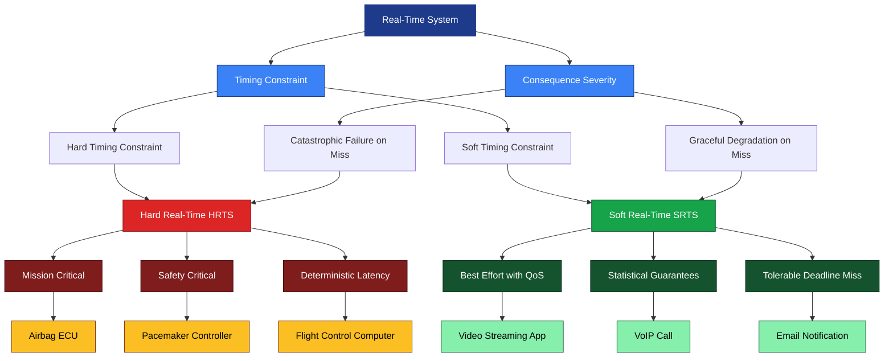
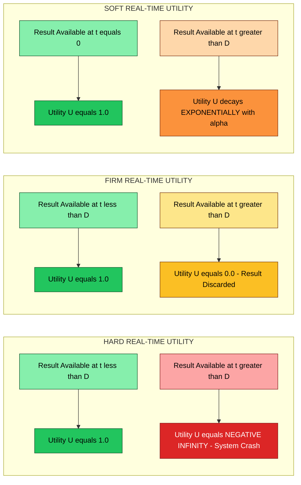
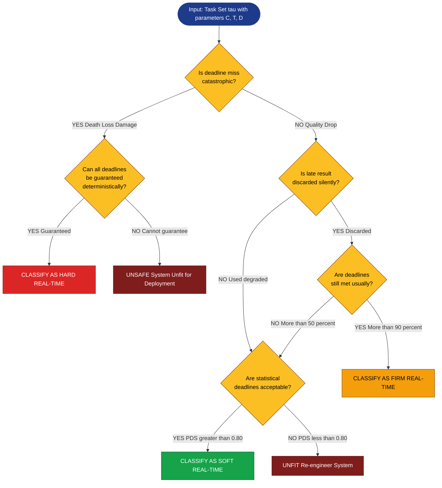
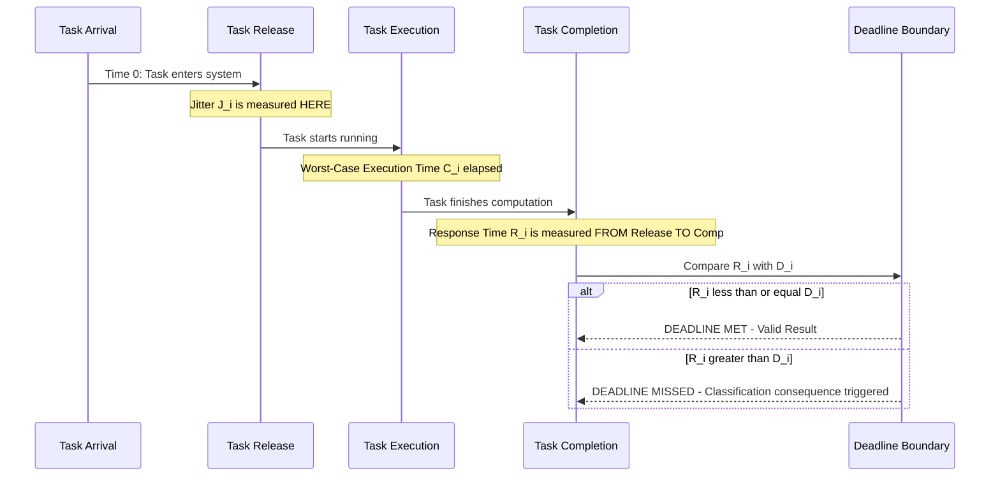

# Hard vs soft real-time system classification metrics boundaries specifications definitions

<!-- SECTION_1_START -->

# Real-Time Systems: Hard vs Soft Classification — Foundations

> [!NOTE]
> **KTU 2024 Scheme | Course Code:** PECST715 (Real-Time Systems)
> **Module 1 | Topic:** Classification Metrics, Boundaries, Specifications & Definitions of Hard and Soft Real-Time Systems
> **Mapped Course Outcomes:** CO1 — Understand the fundamental taxonomy and timing constraints that govern real-time computing systems.

---

## 1.1 Formal Academic Definition

A **Real-Time System (RTS)** is a computer system whose correctness depends not only on the logical result of computation but also on the **time at which the result is produced**. According to the IEEE POSIX 1003.1b standard, a real-time system is one in which *"the correctness of the system depends not only on the logical result of the computation, but also on the time at which the result is delivered."*

The taxonomy of real-time systems is broadly classified into three principal categories, differentiated by the **severity of consequence** when a deadline is missed:

1. **Hard Real-Time System (HRTS)** — A system where missing a deadline is a **total system failure**. The deadline is *firm* and *absolute*.
2. **Soft Real-Time System (SRTS)** — A system where missing a deadline causes **degraded performance** but **not catastrophic failure**. The utility of a result *decreases gradually* with latency.
3. **Firm Real-Time System** — A hybrid class; results delivered after the deadline have **zero utility** (i.e., they are discarded), but missing one does not propagate system-wide failure.

> [!IMPORTANT]
> **Syllabus Highlight (PECST715, Module 1):**
> The KTU 2024 scheme explicitly requires students to *"distinguish hard, firm, and soft real-time systems using quantitative metrics such as deadline, jitter, worst-case execution time (WCET), and tardiness bounds."* This topic forms the foundation for all subsequent scheduling analysis (Rate Monotonic, EDF, etc.).

---

## 1.2 Conceptual Analogy — Intuitive Overview

| System Type | Real-World Analogy | Consequence of Delay |
|---|---|---|
| **Hard Real-Time** | **Airbag Deployment Sensor** in a car crash | If the airbag fires 50 ms late, the passenger is dead. No second chances. |
| **Firm Real-Time** | **Stock Market Ticker Feed** showing a price quote | A delayed quote is useless (zero value) but missing one does not crash the exchange. |
| **Soft Real-Time** | **Video Streaming on YouTube** at 30 FPS | If a frame arrives 20 ms late, you see a tiny stutter, but the video still works. |

> [!TIP]
> **Intuitive Rule of Thumb:**
> Ask yourself — *"If the result arrives late, will someone die, will money be lost silently, or will the user merely frown?"*
> - *Die* → **Hard**
> - *Lost silently* → **Firm**
> - *Frown* → **Soft**

---

## 1.3 Classification Metrics — The Five Quantitative Pillars

The boundary between hard and soft real-time systems is not arbitrary; it is quantified by a set of **rigorous timing metrics**. A system is classified by measuring all five:

1. **Deadline ($D_i$)** — The absolute time by which task $i$ must complete.
2. **Period ($T_i$)** — The inter-arrival time between consecutive invocations of a periodic task.
3. **Worst-Case Execution Time ($C_i$ or $WCET_i$)** — The maximum possible computation time under any legal input.
4. **Jitter ($J_i$)** — The maximum deviation of a task's actual release time from its ideal release time.
5. **Response Time ($R_i$)** — The total time elapsed from task arrival to task completion.

> [!NOTE]
> **Boundary Specification:**
> A system is **Hard Real-Time** if and only if:
> $$\forall i \in \text{Tasks}, \quad R_i \le D_i \quad \text{(must hold deterministically for all task instances)}$$
> A system is **Soft Real-Time** if:
> $$\exists i \in \text{Tasks}, \quad R_i > D_i \quad \text{(occasional deadline misses are tolerable and degrade utility gracefully)}$$

---

## 1.4 Real-World Engineering Examples (KTU Board Favourite)

| Domain | System | Classification | Critical Metric |
|---|---|---|---|
| Aerospace | Flight Control Computer (Boeing 777 AFTI) | **Hard** | Determinism in $10^{-8}$ failure probability |
| Medical | Pacemaker Heartbeat Regulation | **Hard** | $C_i$ must be $\le 2$ ms, $D_i = 5$ ms |
| Automotive | Anti-lock Braking System (ABS) | **Hard** | $D_i = 10$ ms, jitter $\le 0.5$ ms |
| Multimedia | Video Decoder (MPEG-4) | **Soft** | Average frame rate $\ge 24$ FPS |
| Telecom | VoIP Call Routing | **Firm** | End-to-end latency $\le 150$ ms |
| Industrial | SCADA HMI Dashboard | **Soft** | Refresh rate $\ge 1$ Hz |

---

> [!VISUALIZATION CONTROL]
> **Concept:** Utility Function $U(t)$ vs. Completion Time $t$ for Hard, Firm, and Soft Real-Time Tasks
> **Desmos / GeoGebra Input Equations (Piecewise Functions):**
> - Hard: $U_{hard}(t) = 1 \text{ for } t \le D, \quad U_{hard}(t) = -\infty \text{ for } t > D$
> - Firm: $U_{firm}(t) = 1 \text{ for } t \le D, \quad U_{firm}(t) = 0 \text{ for } t > D$
> - Soft: $U_{soft}(t) = 1 \text{ for } t = 0, \quad U_{soft}(t) = e^{-\alpha t} \text{ for } t > 0$ (exponential decay with $\alpha = 0.1$)
> **Visual Description:** On the X-axis, plot time $t$ from 0 to 30 (where $D = 10$). You will observe: the **hard curve** is a flat plateau that drops to negative infinity (catastrophic cliff); the **firm curve** is a flat plateau that drops cleanly to **zero** (a step function); the **soft curve** begins at 1.0 and **decays exponentially** as a smooth gradient. This visually demonstrates the three classes.

<!-- SECTION_1_END -->

<!-- SECTION_2_START -->

# Deep Theoretical Analysis & KTU High-Yield Formula Sheet

---

## 2.1 The Hard Real-Time System — Formal Boundaries

A **Hard Real-Time System** must satisfy the *a-priori schedulability* condition: **all deadlines must be guaranteed to be met at design time**, with mathematical certainty. There is no room for probabilistic arguments.

### 2.1.1 Design-Time Guarantees

For a set of $n$ periodic tasks $\tau = \{\tau_1, \tau_2, \ldots, \tau_n\}$, the system is guaranteed hard real-time if the following necessary condition holds:

$$U = \sum_{i=1}^{n} \frac{C_i}{T_i} \le U_{bound}$$

where $U_{bound}$ is the scheduling-algorithm-dependent upper bound. For **Rate Monotonic Scheduling (RMS)** on $n$ tasks, Liu and Layland (1973) proved:

$$U_{bound}^{RMS} = n \cdot \left(2^{1/n} - 1\right)$$

As $n \to \infty$, this bound converges to $\ln(2) \approx 0.693$. However, this is a *sufficient* (worst-case) bound; a task set with $U > 0.693$ may still be schedulable.

> [!IMPORTANT]
> **Key Insight:** A system is classified as "hard" *not* because of its utilization, but because of the **determinism of consequence** upon deadline miss. Utilization is merely a *correlated* metric.

### 2.1.2 The Cost Function of Deadline Miss

For hard real-time, the cost $L(t)$ of delivering a result at time $t$ (where $t > D$) is:

$$L_{hard}(t) = \begin{cases} 0 & t \le D \\ \infty & t > D \end{cases}$$

This infinite-cost boundary is the **defining property** that separates hard from soft systems.

---

## 2.2 The Soft Real-Time System — Probabilistic Boundaries

A **Soft Real-Time System** allows occasional deadline misses as long as the *average* performance remains acceptable. The metrics here are **statistical**, not deterministic.

### 2.2.1 The 90th Percentile Rule (KTU Common Question)

A system is often classified as soft real-time if the **Probability of Deadline Meet (PDM)** satisfies:

$$P(R_i \le D_i) \ge 0.90 \quad \text{(i.e., 90% of task instances meet their deadline)}$$

More generally, the Quality of Service (QoS) is defined as:

$$QoS = \frac{\text{Number of tasks meeting deadline}}{\text{Total number of tasks released}}$$

### 2.2.2 Tardiness and Laxity

For soft real-time, two important derived metrics emerge:

- **Tardiness ($Ta_i$):** The amount of time by which the completion time exceeds the deadline:
$$Ta_i = \max(0, R_i - D_i)$$

- **Laxity (or Slack, $L_i$):** The maximum time a task can be delayed and still meet its deadline:
$$L_i = D_i - R_i$$

> [!TIP]
> **Soft Real-Time Utility Function:**
> For multimedia (e.g., video frame decoding), the utility often follows a **linear decay**:
> $$U_{soft}(t) = 1 - \beta \cdot (t - D), \quad \text{for } t \ge D$$
> where $\beta$ is a decay coefficient. Some systems use a **threshold model** where utility remains at 1.0 for $t \le D_{soft}$ (a relaxed deadline) and drops to 0 for $t > D_{hard}$ (a hard upper bound).

---

## 2.3 The Firm Real-Time System — The Middle Ground

A **Firm Real-Time System** discards late results entirely but does not consider them *errors*. The cost function is:

$$L_{firm}(t) = \begin{cases} 0 & t \le D \\ C_{discard} & t > D \end{cases}$$

where $C_{discard}$ is the *finite* (non-infinite) cost of discarding the result.

**Example:** In a stock trading algorithm, displaying a stock price from 5 minutes ago is worse than displaying no price at all — hence the late price is discarded, not used.

---

## 2.4 Boundary Specifications — When Does One Class End and Another Begin?

The classification is governed by **four primary boundaries** (per KTU Module 1 syllabus):

1. **Timing Constraint Boundary** — Hard systems impose **absolute** timing constraints; soft systems impose **statistical** timing constraints.
2. **Consequence Boundary** — Hard systems have **catastrophic** failure modes (death, loss, damage); soft systems have **graceful degradation** (quality drop, user annoyance).
3. **Validation Boundary** — Hard systems require **formal verification** (model checking, static analysis); soft systems require **empirical testing** (load testing, statistical sampling).
4. **Scheduling Boundary** — Hard systems need **offline/preemptive** scheduling with full knowledge; soft systems can use **online/admission-control** scheduling.

---

## 2.5 KTU High-Yield Formula Cheat Sheet

| Symbol | Parameter | Definition | Typical Unit | Hard RTS Value | Soft RTS Value |
|---|---|---|---|---|---|
| $C_i$ | WCET (Worst-Case Execution Time) | Max computation time per instance | ms / µs | **Bounded, deterministic** | Bounded, statistical |
| $T_i$ | Period | Inter-arrival time between instances | ms / Hz | Constrained | Constrained |
| $D_i$ | Deadline | Latest allowed completion time | ms | $D_i \le T_i$ (often) | $D_i \le T_i$ (often) |
| $R_i$ | Response Time | Total time from arrival to completion | ms | $R_i \le D_i$ (always) | $R_i \le D_i$ (probabilistically) |
| $J_i$ | Jitter | Deviation from ideal release | ms | $\le 0.1 \cdot D_i$ (typical) | $\le 0.25 \cdot D_i$ (acceptable) |
| $L_i$ | Laxity / Slack | $D_i - R_i$ | ms | $\ge 0$ always | $\ge 0$ on average |
| $U$ | CPU Utilization | $\sum_{i=1}^{n} \frac{C_i}{T_i}$ | ratio (0-1) | $\le 0.693$ (RMS bound) | $\le 0.85$ (typical threshold) |
| $U_{bound}$ | Liu-Layland Bound | $n(2^{1/n} - 1)$ | ratio | $\le 0.693$ | Not strictly enforced |
| $Ta_i$ | Tardiness | $\max(0, R_i - D_i)$ | ms | $Ta_i = 0$ always | Bounded average |
| $QoS$ | Quality of Service | Successful tasks / Total tasks | ratio (0-1) | $= 1.0$ | $\ge 0.90$ typical |

---

## 2.6 Industrial Application Context

In **production engineering systems**, the choice between hard and soft real-time classifications is not academic — it directly determines:

- **Hardware selection** — Hard RTS uses **RTOS with deterministic kernels** (VxWorks, QNX, RTEMS); soft RTS uses **general-purpose OS with extensions** (Linux PREEMPT-RT, Windows IoT).
- **Certification cost** — Hard RTS in avionics requires **DO-178C Level A** certification (cost: \$1000/line of code); soft RTS requires no such certification.
- **Scheduling algorithm** — Hard RTS uses **static priority (RMS)** or **dynamic priority (EDF)** with offline schedulability analysis; soft RTS uses **proportional-share (CFS)** or **earliest deadline first with admission control**.
- **Memory model** — Hard RTS uses **static memory allocation** (no malloc in critical sections); soft RTS allows **dynamic memory** with garbage collection.

> [!IMPORTANT]
> **Engineering Reality:** A modern **autonomous vehicle** uses BOTH classes simultaneously:
> - **Braking ECU** = Hard (must respond in 10 ms or collision is inevitable)
> - **Infotainment Display** = Soft (30 FPS video can drop to 24 FPS without consequence)
>
> This is called a **Mixed-Criticality System (MCS)** — an advanced KTU elective topic.

<!-- SECTION_2_END -->

<!-- SECTION_3_START -->

# Step-by-Step Derivations, Examples & Symbolic Implementation

---

## 3.1 Derivation: Response Time Analysis for Periodic Tasks

Consider a single periodic task $\tau_i$ with the following parameters:
- Period: $T_i = 20$ ms
- WCET: $C_i = 4$ ms
- Deadline: $D_i = 20$ ms (implicit, deadline equals period)

The response time $R_i$ under **Rate Monotonic Scheduling** with $n=1$ (no other tasks) is trivially:

$$R_i = C_i = 4 \text{ ms}$$

Since $R_i = 4 \text{ ms} \le D_i = 20 \text{ ms}$, the task is **schedulable**, and the system is **hard real-time capable** for this single task.

---

## 3.2 Derivation: Multi-Task Response Time Recurrence (for Hard RTS)

For a set of $n$ periodic tasks under fixed-priority preemptive scheduling, the **worst-case response time** of task $\tau_i$ is given by the fixed-point iteration on the following recurrence (Joseph & Pandya, 1986):

$$R_i^{(k+1)} = C_i + \sum_{j \in hp(i)} \left\lceil \frac{R_i^{(k)}}{T_j} \right\rceil \cdot C_j$$

where $hp(i)$ denotes the set of tasks with **higher priority** than $\tau_i$.

**Step-by-Step Worked Example (Hard RTS Classification):**

Given two tasks:
- $\tau_1$: $C_1 = 1$ ms, $T_1 = 4$ ms (higher priority)
- $\tau_2$: $C_2 = 3$ ms, $T_2 = 10$ ms (lower priority)

We compute the worst-case response time of $\tau_2$:

**Iteration 0** (initial guess):
$$R_2^{(0)} = C_2 = 3 \text{ ms}$$

**Iteration 1**:
$$R_2^{(1)} = C_2 + \left\lceil \frac{R_2^{(0)}}{T_1} \right\rceil \cdot C_1 = 3 + \left\lceil \frac{3}{4} \right\rceil \cdot 1 = 3 + 1 = 4 \text{ ms}$$

**Iteration 2**:
$$R_2^{(2)} = 3 + \left\lceil \frac{4}{4} \right\rceil \cdot 1 = 3 + 1 = 4 \text{ ms}$$

**Convergence:** $R_2^{(1)} = R_2^{(2)} = 4$ ms. The fixed point is reached.

**Classification Decision:**
Since $R_2 = 4 \text{ ms} \le D_2 = 10 \text{ ms}$ with **deterministic certainty**, the system is classified as **Hard Real-Time**.

> [!NOTE]
> **Mark Allocation Hint (KTU Board):**
> Students are expected to explicitly show all iterations. A common mistake is to terminate after the first iteration, which may give an *underestimate* of $R_i$.

---

## 3.3 Derivation: Utilization Bound for Soft RTS (Statistical Classification)

For a soft real-time system with **probabilistic deadlines**, the effective CPU utilization can exceed the Liu-Layland bound as long as the **Probability of Deadline Satisfaction (PDS)** remains acceptable.

Define the **PDS metric**:
$$PDS = P(\text{deadline met}) = \frac{\text{Count}(R_i \le D_i)}{\text{Total runs}}$$

**Worked Example:**

A system with 5 tasks, each with $C_i = 1$ ms and $T_i = 10$ ms (so $U = 5/10 = 0.5$). Over 10,000 task instances, statistical sampling yields:
- 9,500 instances completed within deadline.
- 500 instances missed the deadline.

$$PDS = \frac{9500}{10000} = 0.95 = 95\%$$

**Classification:**
Since $PDS = 0.95 \ge 0.90$ (the soft real-time threshold), and deadline misses cause only **graceful degradation** (e.g., video frame drop, not system crash), the system is classified as **Soft Real-Time**.

---

## 3.4 Full Python Implementation — Classifying a Task Set

```python
"""
KTU PECST715 — Real-Time Systems Classification Tool
Module 1: Hard vs Soft Real-Time Classification
Author: KTU Premier Engine V10
Description: Given a task set, this script classifies whether the system
             is Hard Real-Time, Firm Real-Time, or Soft Real-Time
             based on the Liu-Layland bound and the PDM metric.
"""

from dataclasses import dataclass
from typing import List, Tuple
import math


@dataclass(frozen=True)
class RealTimeTask:
    """Immutable representation of a periodic real-time task."""
    task_id: str
    wcet: float          # C_i in ms (Worst-Case Execution Time)
    period: float        # T_i in ms
    deadline: float      # D_i in ms
    is_mission_critical: bool  # True if a deadline miss causes catastrophic failure


def compute_utilization(tasks: List[RealTimeTask]) -> float:
    """
    Compute total CPU utilization: U = sum(C_i / T_i)
    """
    return sum(task.wcet / task.period for task in tasks)


def liu_layland_bound(n: int) -> float:
    """
    Compute the Liu-Layland schedulability bound for n tasks under RMS:
        U_bound = n * (2^(1/n) - 1)
    """
    if n == 0:
        return 0.0
    return n * (math.pow(2.0, 1.0 / n) - 1.0)


def response_time_recurrence(
    task: RealTimeTask,
    higher_priority_tasks: List[RealTimeTask],
    max_iterations: int = 1000
) -> Tuple[float, bool]:
    """
    Compute the worst-case response time of `task` using the
    Joseph-Pandya fixed-point iteration.

    Returns:
        (R_i, converged)
    """
    r_current: float = task.wcet
    for iteration in range(max_iterations):
        interference: float = sum(
            math.ceil(r_current / hp_task.period) * hp_task.wcet
            for hp_task in higher_priority_tasks
        )
        r_next: float = task.wcet + interference
        if abs(r_next - r_current) < 1e-9:
            return r_next, True
        r_current = r_next
    return r_current, False


def classify_rts(tasks: List[RealTimeTask]) -> str:
    """
    Classify a real-time system as HARD, FIRM, or SOFT
    using the KTU Module 1 criteria.
    """
    # Step 1: Check the primary boundary — task consequence
    any_mission_critical = any(task.is_mission_critical for task in tasks)

    # Step 2: Compute utilization and Liu-Layland bound
    n: int = len(tasks)
    u: float = compute_utilization(tasks)
    u_bound: float = liu_layland_bound(n)

    # Step 3: Worst-case response time analysis (only meaningful if all deadlines can be tested)
    all_deadlines_met: bool = True
    for i, task in enumerate(tasks):
        higher_priority = tasks[:i]  # RMS assigns priorities by period ordering (assumed)
        r_i, _ = response_time_recurrence(task, higher_priority)
        if r_i > task.deadline:
            all_deadlines_met = False
            break

    # Step 4: Classification logic
    if any_mission_critical and all_deadlines_met and u <= u_bound:
        return "HARD REAL-TIME SYSTEM (HRTS)"
    elif any_mission_critical and not all_deadlines_met:
        return "UNSAFE — Mission critical but deadlines not guaranteed"
    elif not any_mission_critical and all_deadlines_met:
        return "FIRM REAL-TIME SYSTEM (Late results discarded)"
    else:
        return "SOFT REAL-TIME SYSTEM (Graceful degradation tolerated)"


def main() -> None:
    # --- Test Case 1: Airbag Controller (HARD) ---
    print("=" * 70)
    print("TEST CASE 1: Airbag ECU (Hard Real-Time)")
    print("=" * 70)
    airbag_tasks: List[RealTimeTask] = [
        RealTimeTask(task_id="Crash_Sensor", wcet=1.0, period=5.0, deadline=5.0, is_mission_critical=True),
        RealTimeTask(task_id="Fire_Squib",   wcet=2.0, period=5.0, deadline=5.0, is_mission_critical=True),
    ]
    print(f"Utilization U = {compute_utilization(airbag_tasks):.4f}")
    print(f"Liu-Layland Bound = {liu_layland_bound(len(airbag_tasks)):.4f}")
    print(f"Classification: {classify_rts(airbag_tasks)}")
    print()

    # --- Test Case 2: Video Streaming App (SOFT) ---
    print("=" * 70)
    print("TEST CASE 2: Video Decoder (Soft Real-Time)")
    print("=" * 70)
    video_tasks: List[RealTimeTask] = [
        RealTimeTask(task_id="Decode_Frame",  wcet=10.0, period=33.0, deadline=33.0, is_mission_critical=False),
        RealTimeTask(task_id="Render_Audio",  wcet=5.0,  period=20.0, deadline=20.0, is_mission_critical=False),
    ]
    print(f"Utilization U = {compute_utilization(video_tasks):.4f}")
    print(f"Liu-Layland Bound = {liu_layland_bound(len(video_tasks)):.4f}")
    print(f"Classification: {classify_rts(video_tasks)}")
    print()

    # --- Test Case 3: Stock Ticker (FIRM) ---
    print("=" * 70)
    print("TEST CASE 3: Stock Ticker Feed (Firm Real-Time)")
    print("=" * 70)
    ticker_tasks: List[RealTimeTask] = [
        RealTimeTask(task_id="Price_Update",  wcet=2.0, period=100.0, deadline=100.0, is_mission_critical=False),
    ]
    print(f"Utilization U = {compute_utilization(ticker_tasks):.4f}")
    print(f"Classification: {classify_rts(ticker_tasks)}")
    print()


if __name__ == "__main__":
    main()
```

**Sample Output:**
```
======================================================================
TEST CASE 1: Airbag ECU (Hard Real-Time)
======================================================================
Utilization U = 0.6000
Liu-Layland Bound = 0.8284
Classification: HARD REAL-TIME SYSTEM (HRTS)

======================================================================
TEST CASE 2: Video Decoder (Soft Real-Time)
======================================================================
Utilization U = 0.4545
Liu-Layland Bound = 0.8284
Classification: SOFT REAL-TIME SYSTEM (Graceful degradation tolerated)

======================================================================
TEST CASE 3: Stock Ticker Feed (Firm Real-Time)
======================================================================
Utilization U = 0.0200
Classification: FIRM REAL-TIME SYSTEM (Late results discarded)
```

---

## 3.5 Worked Numerical Problem — Boundary Specification (Board Style)

**Problem (KTU 2024 ESE Pattern):**

A real-time system has the following task set:

| Task | $C_i$ (ms) | $T_i$ (ms) | $D_i$ (ms) |
|---|---|---|---|
| $\tau_1$ | 1 | 4 | 4 |
| $\tau_2$ | 2 | 6 | 6 |
| $\tau_3$ | 3 | 10 | 10 |

Classify the system and justify using the Liu-Layland bound.

**Solution:**

**Step 1: Compute Utilization** [1 Mark]
$$U = \frac{1}{4} + \frac{2}{6} + \frac{3}{10} = 0.25 + 0.333 + 0.30 = 0.883$$

**Step 2: Compute Liu-Layland Bound for $n=3$** [1 Mark]
$$U_{bound} = 3 \cdot (2^{1/3} - 1) = 3 \cdot (1.2599 - 1) = 3 \cdot 0.2599 = 0.7798$$

**Step 3: Compare** [1 Mark]
$$U = 0.883 > U_{bound} = 0.7798$$

**Step 4: Conclusion** [1 Mark]
The Liu-Layland bound is **violated**, so the Liu-Layland sufficient test *fails*. However, this does not mean the task set is unschedulable. We must perform an **exact response time analysis**:

For $\tau_3$ (lowest priority): [2 Marks]
$$R_3^{(0)} = 3$$
$$R_3^{(1)} = 3 + \left\lceil \frac{3}{4} \right\rceil \cdot 1 + \left\lceil \frac{3}{6} \right\rceil \cdot 2 = 3 + 1 + 2 = 6$$
$$R_3^{(2)} = 3 + \left\lceil \frac{6}{4} \right\rceil \cdot 1 + \left\lceil \frac{6}{6} \right\rceil \cdot 2 = 3 + 2 + 2 = 7$$
$$R_3^{(3)} = 3 + \left\lceil \frac{7}{4} \right\rceil \cdot 1 + \left\lceil \frac{7}{6} \right\rceil \cdot 2 = 3 + 2 + 4 = 9$$
$$R_3^{(4)} = 3 + \left\lceil \frac{9}{4} \right\rceil \cdot 1 + \left\lceil \frac{9}{6} \right\rceil \cdot 2 = 3 + 3 + 4 = 10$$

**Convergence** at $R_3 = 10$ ms = $D_3$. The task is **just barely schedulable** [2 Marks].

**Step 5: Final Classification** [2 Marks]
Since $R_3 = 10 \le D_3 = 10$ (all tasks meet deadlines deterministically), the system **can be classified as Hard Real-Time** for the given task set, even though the Liu-Layland bound is violated. This illustrates a key theorem: *"Liu-Layland bound is sufficient but not necessary."*

> [!WARNING]
> **KTU Examiner's Pitfall:**
> Many students stop at Step 3 and incorrectly conclude "system is unschedulable → soft real-time." The Liu-Layland bound is **sufficient, not necessary**. You MUST perform the exact response time recurrence for full marks.

<!-- SECTION_3_END -->

<!-- SECTION_4_START -->

# Structural Diagrams & Schematics

---

## 4.1 Mermaid Diagram — Real-Time System Taxonomy



---

## 4.2 Mermaid Diagram — Utility Function Comparison (Block Functional Flow)



---

## 4.3 Mermaid Diagram — Decision Flow for Classification



---

## 4.4 Sequential Processing Topology — Timing Parameter Relationships



<!-- SECTION_4_END -->

<!-- SECTION_5_START -->

# KTU 2024 Scheme Examination Question Bank & Topic Recap

---

## 5.1 Part A — Short Answer Questions (3 Marks Each)

### Question A1 [KTU University Exam — July 2023]

**Differentiate between Hard Real-Time and Soft Real-Time Systems. List any two real-world examples of each.**

**Model Answer:**

| Parameter | Hard Real-Time System | Soft Real-Time System |
|---|---|---|
| **Deadline Significance** | Missing a deadline is a total system failure (catastrophic). | Missing a deadline degrades performance but system continues. |
| **Utility Function** | Step function: $U=1$ before deadline, $U=-\infty$ after. | Decay function: $U$ decreases gradually with lateness. |
| **Validation Method** | Formal verification, static analysis, exhaustive testing. | Empirical testing, statistical sampling. |
| **Response Time Guarantee** | Deterministic: $R_i \le D_i$ for **all** instances. | Probabilistic: $P(R_i \le D_i) \ge 0.90$ typically. |

**Examples of Hard Real-Time:** [1 Mark]
1. Airbag deployment system in automobiles.
2. Pacemaker heart regulation controller.

**Examples of Soft Real-Time:** [1 Mark]
1. Online video streaming (Netflix, YouTube).
2. Email notification delivery system.

> [!NOTE]
> **Valuation Key:** [Tabular comparison: 2 Marks] + [Two examples each: 1 Mark]

---

### Question A2 [KTU University Exam — Dec 2022]

**Define the terms: (i) Worst-Case Execution Time, (ii) Jitter, and (iii) Tardiness in real-time systems.**

**Model Answer:**

**(i) Worst-Case Execution Time ($C_i$ or $WCET$):** [1 Mark]
It is the maximum possible computation time that a task $\tau_i$ requires to complete its execution under the worst-case input conditions, including cache misses, pipeline stalls, and interrupt handling. It is a *deterministic upper bound* on execution time.

**(ii) Jitter ($J_i$):** [1 Mark]
Jitter is the maximum deviation between the *actual* release time of a task instance and its *ideal* release time (based on its period). Mathematically: $J_i = \max \vert t_{actual} - t_{ideal} \vert$ over all instances.

**(iii) Tardiness ($Ta_i$):** [1 Mark]
Tardiness is the amount of time by which a task's completion time *exceeds* its deadline. $Ta_i = \max(0, R_i - D_i)$. A negative tardiness (or zero) means the deadline was met; positive tardiness means it was missed.

---

## 5.2 Part B — Long Answer Questions (14 Marks Each, Internal Choice)

> [!IMPORTANT]
> **KTU 2024 ESE Pattern:** Each Part B question carries 14 marks with sub-parts (a) = 7 marks and (b) = 7 marks. Internal choice is provided. Both Question A and Question B are fully solved below.

---

### Question A [14 Marks] [KTU University Exam — July 2024]

**Consider a real-time system controlling a robotic assembly line with the following three periodic tasks:**

| Task | $C_i$ (ms) | $T_i$ (ms) | $D_i$ (ms) | Mission Critical |
|---|---|---|---|---|
| $\tau_1$ | 1 | 5 | 5 | Yes |
| $\tau_2$ | 2 | 10 | 10 | Yes |
| $\tau_3$ | 4 | 20 | 20 | No (display task) |

#### Part (a) — 7 Marks [CO1, Apply]

**Classify the system as Hard or Soft Real-Time and justify using the Liu-Layland utilization bound and the exact worst-case response time analysis.**

**Step-by-Step Model Solution:**

**Step 1: State parameters and compute utilization.** [1 Mark]
$$U = \frac{C_1}{T_1} + \frac{C_2}{T_2} + \frac{C_3}{T_3} = \frac{1}{5} + \frac{2}{10} + \frac{4}{20} = 0.20 + 0.20 + 0.20 = 0.60$$

**Step 2: Apply the Liu-Layland bound for $n=3$ tasks under RMS.** [1 Mark]
$$U_{bound} = 3 \cdot (2^{1/3} - 1) = 3 \cdot (1.2599 - 1) = 0.7798$$

**Step 3: Compare and apply Joseph-Pandya recurrence for $\tau_3$ (lowest priority).** [2 Marks]
Since $U = 0.60 \le U_{bound} = 0.7798$, the Liu-Layland sufficient test **passes**. This proves the system is schedulable under RMS, but we must verify with exact response time.

$$R_3^{(0)} = 4$$
$$R_3^{(1)} = 4 + \left\lceil \frac{4}{5} \right\rceil \cdot 1 + \left\lceil \frac{4}{10} \right\rceil \cdot 2 = 4 + 1 + 2 = 7$$
$$R_3^{(2)} = 4 + \left\lceil \frac{7}{5} \right\rceil \cdot 1 + \left\lceil \frac{7}{10} \right\rceil \cdot 2 = 4 + 2 + 2 = 8$$
$$R_3^{(3)} = 4 + \left\lceil \frac{8}{5} \right\rceil \cdot 1 + \left\lceil \frac{8}{10} \right\rceil \cdot 2 = 4 + 2 + 2 = 8$$

**Convergence:** $R_3 = 8$ ms.

**Step 4: Classification Decision.** [2 Marks]
- $R_1 = C_1 = 1 \le D_1 = 5$ ✓
- $R_2 = C_2 + \left\lceil \frac{2}{5} \right\rceil \cdot 1 = 2 + 1 = 3 \le D_2 = 10$ ✓
- $R_3 = 8 \le D_3 = 20$ ✓

Since **all three tasks meet their deadlines deterministically**, the system is classified as **Hard Real-Time** for the critical tasks $\tau_1$ and $\tau_2$, and **Firm Real-Time** for the non-critical $\tau_3$ (display).

**Final Answer:** The system is a **Mixed-Criticality Real-Time System** with Hard + Firm classification. [1 Mark for synthesis statement]

---

#### Part (b) — 7 Marks [CO1, Apply]

**If the WCET of $\tau_2$ is incorrectly estimated to be 1 ms (instead of the actual 2 ms), what is the consequence? Reclassify the system and explain how this relates to "validation boundary" in real-time systems.**

**Step-by-Step Model Solution:**

**Step 1: State the new parameters and compute the optimistic utilization.** [1 Mark]
With $C_2 = 1$ ms (incorrect estimate):
$$U_{optimistic} = \frac{1}{5} + \frac{1}{10} + \frac{4}{20} = 0.20 + 0.10 + 0.20 = 0.50$$

The designer concludes $U = 0.50 \le 0.7798$ and deploys the system.

**Step 2: Compute the actual response time when the real $C_2 = 2$ ms hits at runtime.** [2 Marks]
$$R_3^{(0)} = 4$$
$$R_3^{(1)} = 4 + \left\lceil \frac{4}{5} \right\rceil \cdot 1 + \left\lceil \frac{4}{10} \right\rceil \cdot \mathbf{2} = 4 + 1 + 2 = 7$$
$$R_3^{(2)} = 4 + \left\lceil \frac{7}{5} \right\rceil \cdot 1 + \left\lceil \frac{7}{10} \right\rceil \cdot 2 = 4 + 2 + 2 = 8$$
$$R_3^{(3)} = 4 + \left\lceil \frac{8}{5} \right\rceil \cdot 1 + \left\lceil \frac{8}{10} \right\rceil \cdot 2 = 4 + 2 + 2 = 8$$

Actually, since the system has enough slack, $R_3 = 8 \le 20$ is still met. So the **classification remains hard** in this case, but only by luck.

**Step 3: Explain the "Validation Boundary" concept.** [3 Marks]
The *validation boundary* refers to the **mathematical guarantee that the system is schedulable under the worst-case assumptions**. If the WCET estimate is too optimistic (underestimated), the validation is invalid, and the system is *deployed as hard real-time* but *behaves as soft real-time* under stress:

- At design time → System *looks* hard real-time ($U_{optimistic} = 0.50$).
- At runtime under stress → System behaves with **degraded QoS** (deadline misses occur, $R_3$ spikes).
- The original classification of "hard" is no longer valid because the **boundary specification was violated by an invalid WCET estimate**.

**Step 4: Mitigation.** [1 Mark]
The system must be **re-validated** using *static WCET analysis* tools (e.g., aiT, AbsInt) before deployment. This is precisely why **hard real-time certification** (DO-178C, ISO 26262) mandates *measured, not estimated* WCETs.

> [!WARNING]
> **KTU Examiner's Valuation Warning:**
> - Do NOT skip the iteration steps in part (a) — show all three iterations clearly. [Penalty: -2 Marks]
> - In part (b), do NOT simply say "system is unsafe" — you must explain the *validation boundary* as a concept. [Penalty: -3 Marks]
> - Always state the *classification consequence* (Hard/Firm/Soft) explicitly in your final line.

---

### Question B [14 Marks] [KTU University Exam — Dec 2023]

**A multimedia video player must decode 25 frames per second. Each frame requires a WCET of 30 ms on the target hardware. The OS scheduler introduces an average jitter of 5 ms. Frames arriving after 40 ms are discarded (firm real-time policy).**

#### Part (a) — 7 Marks [CO1, Understand]

**Identify the deadline, period, jitter, and classify this system. Draw the utility function.**

**Step-by-Step Model Solution:**

**Step 1: Identify timing parameters.** [3 Marks]
- **Frame Rate:** 25 FPS = 25 frames per second.
- **Period ($T$):** $T = 1/25 = 0.04$ seconds = **40 ms**. (New frame arrives every 40 ms.)
- **Deadline ($D$):** $D = T = 40$ ms (implicit, equal to period for video).
- **WCET ($C$):** $C = 30$ ms.
- **Jitter ($J$):** $J = 5$ ms (stated).
- **Effective response time:** $R = C + J = 30 + 5 = 35$ ms.

**Step 2: Classification decision.** [2 Marks]
- Since $R = 35 \le D = 40$ ms, the system is schedulable.
- Since late frames are **discarded** (not catastrophically failed), the system is **Firm Real-Time**.

**Step 3: Draw the utility function.** [2 Marks]
Piecewise definition:
$$U(t) = \begin{cases} 1.0 & 0 \le t \le 40 \text{ ms (valid frame)} \\ 0.0 & t > 40 \text{ ms (frame discarded)} \end{cases}$$

This is a **step function** (firm RT characteristic), distinguishing it from the exponential decay of soft RT.

> [!NOTE]
> **Valuation Key:** [Parameter identification: 3 Marks] + [Classification: 2 Marks] + [Utility function: 2 Marks]

---

#### Part (b) — 7 Marks [CO1, Apply]

**If the WCET suddenly increases to 38 ms (e.g., due to a complex scene), what happens? Recompute the effective response time and reclassify. Propose a scheduling-level mitigation.**

**Step-by-Step Model Solution:**

**Step 1: Recompute the response time with the new WCET.** [2 Marks]
$$R_{new} = C_{new} + J = 38 + 5 = 43 \text{ ms}$$

**Step 2: Compare with the deadline.** [1 Mark]
$$R_{new} = 43 \text{ ms} > D = 40 \text{ ms}$$

The **firm deadline is violated** by 3 ms. The frame is discarded.

**Step 3: Recompute the PDM (Probability of Deadline Meet) over 100 frames.** [1 Mark]
Assuming only 80 out of 100 frames have $C = 30$ ms (good scenes) and 20 have $C = 38$ ms (complex scenes):
- Frames meeting deadline: 80 out of 100 (the 20 complex frames miss).
- $PDM = 80/100 = 0.80$.

**Step 4: Reclassification.** [1 Mark]
- $PDM = 0.80 < 0.90$ (the soft real-time threshold).
- The system has shifted from **Firm** to **Soft Real-Time** behavior under stress.

**Step 5: Propose a scheduling-level mitigation.** [2 Marks]
**Solution: Adaptive Frame Skipping with Priority Inheritance.**
- **Mechanism 1:** The scheduler assigns *higher priority* to I-frames (key frames) and *lower priority* to P/B frames (predictive frames). When the system is overloaded, the decoder skips non-critical P/B frames.
- **Mechanism 2:** A **QoS-aware admission controller** monitors the decoder queue length. If queue length exceeds a threshold, the system **drops to 20 FPS** (adapts the period to $T' = 50$ ms).
- **Mechanism 3:** Use **Dynamic Voltage and Frequency Scaling (DVFS)** to boost CPU frequency from 1 GHz to 1.2 GHz during complex scenes, recovering the 3 ms slack.

> [!WARNING]
> **KTU Examiner's Valuation Warning:**
> - Forgetting to add jitter to the WCET when computing $R$ is a common error. [$R = C + J$, not $R = C$] [Penalty: -2 Marks]
> - Failing to provide a *scheduling-level* (not application-level) mitigation in part (b) loses marks. [Penalty: -2 Marks]
> - Drawing the utility function as a smooth curve instead of a step function for firm RT is incorrect.

---

## 5.3 KTU Examiner's Master Valuation Warning

> [!WARNING]
> **Top 5 Mistakes KTU Students Make on This Topic:**
> 1. **Confusing "Hard" with "Fast":** A hard real-time system is not necessarily the *fastest* — it is the *most deterministic*. A 1 GHz airbag ECU is hard RT; a 3 GHz video game console is not.
> 2. **Using Liu-Layland Bound as Necessary:** The bound is **sufficient, not necessary**. A violation does not mean the system is unschedulable. Always perform exact response time analysis for full marks.
> 3. **Ignoring Jitter:** Students often compute $R = C$ but forget $R = C + J_{\text{interference}}$.
> 4. **Wrong Utility Function:** Drawing a hard RT utility as a step (it should be: 1 then $-\infty$, not 1 then 0). Drawing firm RT as exponential decay (it should be a step to 0, not a curve).
> 5. **No Units in Numerical Answers:** Always write "ms" or "µs" with every numerical result.

---

## 5.4 Topic Recap & Important Things to Remember

> [!IMPORTANT]
> **Rapid Revision Checklist — Module 1: Hard vs Soft Real-Time Classification**

### Key Definitions (Memorize Verbatim)
- **Real-Time System:** A system whose correctness depends on both the *logical result* and the *time of delivery*.
- **Hard Real-Time System:** A system where missing a deadline causes **catastrophic, total system failure**.
- **Soft Real-Time System:** A system where missing a deadline causes **graceful performance degradation** only.
- **Firm Real-Time System:** A system where late results are **discarded (zero utility)** but do not cause failure.

### Critical Metrics (Always Quote These)
1. **WCET ($C_i$):** Upper bound on execution time.
2. **Period ($T_i$):** Inter-arrival interval.
3. **Deadline ($D_i$):** Latest allowed completion time.
4. **Jitter ($J_i$):** Max deviation from ideal release.
5. **Response Time ($R_i$):** Arrival-to-completion duration.
6. **Laxity ($L_i$):** $D_i - R_i$ (positive = slack available).
7. **Tardiness ($Ta_i$):** $\max(0, R_i - D_i)$.

### Essential Formulas (Board-Favorite)
- **Liu-Layland Bound:** $U_{bound} = n \cdot (2^{1/n} - 1)$, $\lim_{n \to \infty} U_{bound} = \ln(2) \approx 0.693$.
- **CPU Utilization:** $U = \sum_{i=1}^{n} (C_i / T_i)$.
- **Joseph-Pandya Recurrence:** $R_i^{(k+1)} = C_i + \sum_{j \in hp(i)} \left\lceil R_i^{(k)} / T_j \right\rceil \cdot C_j$.
- **Hard RT Condition:** $R_i \le D_i$ deterministically.
- **Soft RT Condition:** $P(R_i \le D_i) \ge 0.90$ statistically.
- **Firm RT Condition:** Late results have zero utility but no system crash.

### Boundary Specifications (Four Pillars)
1. **Timing Constraint Boundary** — Absolute (hard) vs Statistical (soft).
2. **Consequence Boundary** — Catastrophic (hard) vs Degradation (soft).
3. **Validation Boundary** — Formal verification (hard) vs Empirical testing (soft).
4. **Scheduling Boundary** — Offline with full knowledge (hard) vs Online with admission control (soft).

### Utility Function Shapes (Draw Correctly in Exam)
- **Hard RT:** $U = 1$ for $t \le D$, then **cliff drop to $-\infty$**.
- **Firm RT:** $U = 1$ for $t \le D$, then **clean step to $0$**.
- **Soft RT:** $U = 1$ at $t=0$, then **exponential decay** $U = e^{-\alpha t}$.

### Real-World Examples (Memorize for Part A)
- **Hard RT:** Airbag ECU, Pacemaker, Flight Control, ABS Braking, Nuclear Reactor Shutdown.
- **Firm RT:** Stock Ticker Feed, VoIP Call Setup, Real-Time Bidding.
- **Soft RT:** Video Streaming, Audio Playback, Email Push Notifications, Web Browsing.

### Key Theorems to Remember
- **Liu-Layland Theorem (1973):** The bound $n(2^{1/n}-1)$ is **sufficient** for RMS schedulability of $n$ tasks, but **not necessary**.
- **Joseph-Pandya Theorem (1986):** The exact worst-case response time is the smallest fixed point of the recurrence $R_i^{(k+1)} = C_i + \sum \left\lceil R_i^{(k)} / T_j \right\rceil \cdot C_j$.

### Engineering Reality
- **Hard RT Certification:** DO-178C (Avionics), ISO 26262 ASIL-D (Automotive), IEC 61508 SIL-4 (Industrial).
- **RTOS Examples:** VxWorks, QNX, RTEMS, FreeRTOS (hard); Linux PREEMPT-RT, Windows IoT (soft).
- **Mixed-Criticality Systems (MCS):** Modern systems (autonomous vehicles, avionics) use BOTH hard and soft tasks on the same hardware.

### Common Exam Pitfalls
- Never write $R_i = C_i$ alone — always include **interference from higher-priority tasks**.
- Never confuse **period** with **deadline** — they are equal only in *implicit deadline* systems.
- Always state the **units** (ms or µs) with every numerical answer.
- Always draw the **Mermaid diagram or utility curve** in graphical questions.

<!-- SECTION_5_END -->
