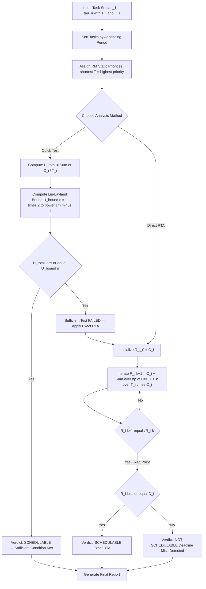
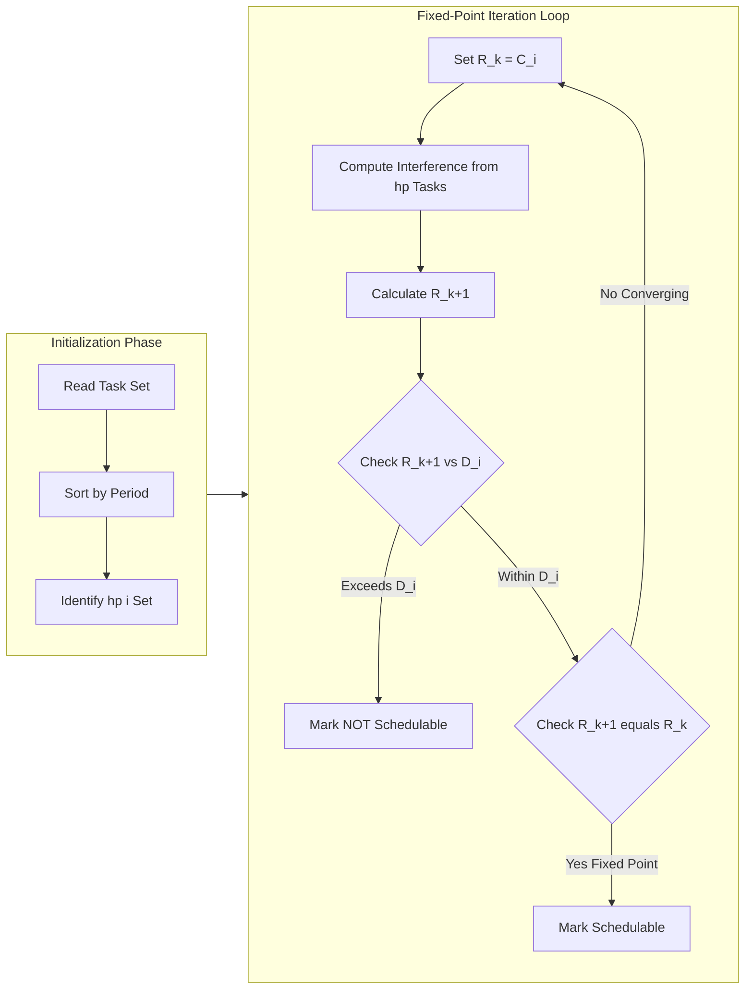

# Rate Monotonic (RM) scheduling analysis priority assignment equations calculation formulas loops

<!-- SECTION_1_START -->

# Rate Monotonic (RM) Scheduling Analysis

## 1.1 Formal Academic Definition

> [!IMPORTANT]
> **Rate Monotonic Scheduling (RMS)** is a **static-priority**, **preemptive** scheduling algorithm specifically designed for hard real-time systems. Introduced by **Liu and Layland (1973)**, RMS assigns priorities to periodic tasks **inversely proportional to their periods** — the task with the **shorter period** receives the **higher priority**, and priorities remain **fixed at design time** (offline assignment).

**KTU 2024 Syllabus Mapping (PECST715 — Module 1):**
- Topic 1.3: Classical Uniprocessor Scheduling Algorithms
- Sub-topic: Rate Monotonic Algorithm — priority assignment, schedulability test, response time analysis

> [!NOTE]
> **Core Terminology (KTU Board Standard Vocabulary)**
> - **Task ($\tau_i$)**: A unit of real-time work characterized by a period $T_i$ and a worst-case execution time $C_i$.
> - **Period ($T_i$)**: The fixed inter-arrival time between successive releases of task $\tau_i$.
> - **Relative Deadline ($D_i$)**: For RM, it is conventionally equal to the period: $D_i = T_i$.
> - **Utilization ($U_i$)**: The fraction of processor time consumed by $\tau_i$, computed as $U_i = C_i / T_i$.
> - **Critical Instant**: The worst-case release pattern where a task arrives simultaneously with all higher-priority tasks.

---

## 1.2 Conceptual Analogy & Intuition

**Real-World Analogy: The Emergency Room Triage System**

Imagine a hospital emergency room. Patients arrive at **regular intervals**:
- Patient A (heart attack check) arrives every **5 minutes** — needs **immediate attention** (high priority)
- Patient B (routine blood test) arrives every **30 minutes** — can wait a bit (low priority)

The triage nurse follows the **Rate Monotonic principle**:
- The patient with the **shorter interval** between arrivals gets the **higher priority** because delaying them would accumulate **unprocessed work** faster.
- The patient with the **longer interval** gets **lower priority** because they can afford a little wait.

**Why does this work?**
If you keep delaying the fast-arriving patient (short period), their backlog grows like compound interest. But delaying the slow patient (long period) is acceptable because there's plenty of time before the next arrival.

> [!TIP]
> **Geometric Intuition**: Think of processor time as a pie. A task with period $T_i = 10$ ms "wants" $1/10$ of the pie every 10 ms. A task with $T_j = 50$ ms wants $1/50$ every 50 ms. The shorter-period task demands **frequent small slices**, so it must be served **first** to avoid missing its deadline.

---

## 1.3 Physical Constants & Standard Metrics in RM Analysis

The following standard engineering values are routinely used in KTU board problems:

| Symbol | Standard Value / Unit | Meaning |
| :--- | :--- | :--- |
| $\ln 2$ | $\approx 0.693$ | Natural log of 2 |
| $U_{bound}(n)$ | $n \cdot (2^{1/n} - 1)$ | Liu-Layland utilization bound for $n$ tasks |
| $U_{bound}(\infty)$ | $\ln 2 \approx 0.693$ | Asymptotic utilization bound |
| $W_i(t)$ | Equation | Worst-case response time of $\tau_i$ |

> [!VISUALIZATION CONTROL]
> **Concept:** Utilization Bound Curve $U_{bound}(n) = n \cdot (2^{1/n} - 1)$ as a function of task count $n$.
> **GeoGebra / Desmos Input Equations:**
> * `f(n) = n * (2^(1/n) - 1)`
> * `g = 0.693` (asymptote)
> **Visual Description:** As $n$ grows from 1 to $\infty$, the curve $f(n)$ starts at $1.0$ for $n=1$, then **monotonically decreases** and **asymptotically approaches** $0.693$ (the value of $\ln 2$). Students should observe that even with many tasks, RMS can guarantee schedulability up to $\sim 69.3\%$ utilization.

---

<!-- SECTION_1_END -->

<!-- SECTION_2_START -->

# Deep Theoretical Analysis & KTU High-Yield Formula Sheet

## 2.1 The RM Priority Assignment Rule

> [!IMPORTANT]
> **Liu-Layland Optimality Theorem:** Among all **static-priority** algorithms, Rate Monotonic is **optimal** — meaning, if a task set is schedulable by **any** static-priority algorithm, it is also schedulable by RM.

**Priority Assignment Logic (step-by-step):**

1. **Enumerate** all periodic tasks in the system: $\tau_1, \tau_2, \ldots, \tau_n$.
2. **Sort** tasks in **ascending order of their periods**: $T_1 < T_2 < \ldots < T_n$.
3. **Assign priorities** such that task $\tau_i$ receives priority $i$ (highest = 1).
4. The **highest priority** task is the one with the **smallest period** — its job is always dispatched first by the scheduler.

> [!NOTE]
> **Tie-Breaking Rule:** If two tasks have identical periods, their relative priority is **arbitrary** (any assignment works because they demand equal processor share).

---

## 2.2 Critical Instant Theorem

> [!IMPORTANT]
> **Critical Instant Theorem (Liu & Layland, 1973):** A periodic task $\tau_i$ experiences its **worst-case response time** when it arrives **simultaneously with all higher-priority tasks**. This single worst-case instant is sufficient to verify schedulability across all possible release patterns.

**Why this matters for KTU exams:**
- It **eliminates** the need to simulate all $2^n$ possible release phase combinations.
- It **reduces** schedulability analysis to a single check at the critical instant.
- The processor is **busiest** for the lower-priority task exactly at this moment, because all higher-priority tasks have just been released and are competing for the CPU.

---

## 2.3 Utilization-Based Schedulability Test

The **Time Demand Analysis (TDA)** approach, in its simplest form, uses the **Liu-Layland Utilization Bound**:

### Sufficient Condition (Quick Test)

$$\sum_{i=1}^{n} \frac{C_i}{T_i} \leq U_{bound}(n) = n \cdot (2^{1/n} - 1) \quad \Rightarrow \quad \text{Schedulable}$$

If the total utilization $\sum U_i$ is **less than or equal to** $U_{bound}(n)$, the task set is **guaranteed schedulable** under RM.

### Exact Condition (Exhaustive Test)

The utilization test is **sufficient but not necessary**. A task set may fail this test yet still be schedulable. For exact verification, use **Response Time Analysis (RTA)**.

---

## 2.4 Response Time Analysis (RTA) — The Iteration Equation

> [!IMPORTANT]
> **Response Time $R_i$** of task $\tau_i$ is the **time elapsed from release to completion** of a job. Schedulability requires $R_i \leq D_i$.

The **worst-case response time** is computed by solving the fixed-point iteration:

$$R_i^{(k+1)} = C_i + \sum_{j \in hp(i)} \left\lceil \frac{R_i^{(k)}}{T_j} \right\rceil \cdot C_j$$

where $hp(i)$ is the set of tasks with **higher priority than $\tau_i$**.

**Iteration Algorithm:**
1. Initialize $R_i^{(0)} = C_i$.
2. Compute $R_i^{(k+1)}$ using the formula above.
3. If $R_i^{(k+1)} > D_i$ → **NOT Schedulable** (stop).
4. If $R_i^{(k+1)} = R_i^{(k)}$ → **Fixed point reached**, check $R_i \leq D_i$.
5. If $R_i^{(k+1)} > R_i^{(k)}$ and $R_i^{(k+1)} \leq D_i$ → **Continue iterating**.

The iteration **terminates** when $R_i$ either exceeds $D_i$ (failure) or converges (success).

---

## 2.5 KTU High-Yield Formula Cheat Sheet

| # | Formula | Description | KTU Use Case |
| :--- | :--- | :--- | :--- |
| 1 | $U_i = C_i / T_i$ | Per-task CPU utilization | Compute load |
| 2 | $U_{total} = \sum_{i=1}^{n} U_i$ | Total system utilization | Quick feasibility check |
| 3 | $U_{bound}(n) = n \cdot (2^{1/n} - 1)$ | Liu-Layland bound | Sufficient schedulability test |
| 4 | $U_{bound}(\infty) = \ln 2 \approx 0.693$ | Asymptotic bound | Conservative design limit |
| 5 | $R_i^{(k+1)} = C_i + \sum_{j \in hp(i)} \lceil R_i^{(k)} / T_j \rceil \cdot C_j$ | Response time iteration | Exact schedulability test |
| 6 | $R_i \leq D_i$ | Schedulability condition (RTA) | Final acceptance criterion |
| 7 | $hp(i) = \{ j \mid T_j < T_i \}$ | Higher-priority task set | Defines preemption set |

> [!NOTE]
> **CRITICAL KTU EXAM TIP:** For RM, the implicit deadline assumption $D_i = T_i$ is the **default** in board questions. Always state this assumption explicitly in your answer to earn full marks.

---

## 2.6 Real-World Engineering Utility

RM scheduling is deployed in production systems including:
- **Aerospace Flight Control (NASA CFS / cFS):** Static-priority tasks for sensor polling at fixed rates.
- **Automotive ECUs (AUTOSAR OS):** Rate Monotonic is the **default scheduling policy** in OSEK/VDX standard for engine control units.
- **Industrial Robotics:** High-frequency sensor loops preempt low-frequency motion planning.
- **Medical Devices (Infusion Pumps, Pacemakers):** Periodic safety checks must preempt non-critical logging.

---

<!-- SECTION_2_END -->

<!-- SECTION_3_START -->

# Step-by-Step Derivations, Numerical Examples & Python Implementation

## 3.1 Derivation: Utilization Bound for $n$ Tasks

The Liu-Layland bound is derived from the analysis of the **critical instant**. We present the engineering reasoning without full measure-theoretic rigor (which is beyond the KTU syllabus).

**Starting Premise:** A task set is schedulable under RM if and only if at every instant $t \geq 0$, the cumulative processor demand does not exceed $t$.

**For a single task** $\tau_i$ with $C_i = T_i$, utilization $= 1.0$ (trivially schedulable).

**For two tasks** with periods $T_1 < T_2$, the worst case occurs when both release at $t = 0$. The schedule is feasible if $\tau_2$ completes by its first deadline $T_2$. The condition reduces to:

$$C_1 \cdot (1 + \lfloor T_2 / T_1 \rfloor) + C_2 \leq T_2$$

After algebraic manipulation and optimizing over $C_i / T_i$ ratios, the maximum total utilization that guarantees schedulability for $n$ tasks emerges as:

$$U_{bound}(n) = n \cdot (2^{1/n} - 1)$$

As $n \to \infty$:

$$\lim_{n \to \infty} n \cdot (2^{1/n} - 1) = \ln 2 \approx 0.6931$$

This gives the **asymptotic guarantee**: even with infinite tasks, RM can schedule up to $\sim 69.3\%$ of the CPU.

---

## 3.2 Worked Example 1: Utilization Bound Test (Module 1 Standard Problem)

**Problem Statement:**
Consider three real-time tasks with the following parameters:

| Task | Period $T_i$ (ms) | Execution Time $C_i$ (ms) |
| :---: | :---: | :---: |
| $\tau_1$ | 20 | 4 |
| $\tau_2$ | 50 | 10 |
| $\tau_3$ | 100 | 15 |

**Step 1: Assign RM priorities**

Since $T_1 < T_2 < T_3$, we get:
- $\tau_1$ → Highest priority (priority 1)
- $\tau_2$ → Medium priority (priority 2)
- $\tau_3$ → Lowest priority (priority 3)

**Step 2: Compute per-task utilization**

$$U_1 = \frac{C_1}{T_1} = \frac{4}{20} = 0.20$$

$$U_2 = \frac{C_2}{T_2} = \frac{10}{50} = 0.20$$

$$U_3 = \frac{C_3}{T_3} = \frac{15}{100} = 0.15$$

**Step 3: Compute total utilization**

$$U_{total} = U_1 + U_2 + U_3 = 0.20 + 0.20 + 0.15 = 0.55$$

**Step 4: Compute Liu-Layland bound for $n = 3$**

$$U_{bound}(3) = 3 \cdot (2^{1/3} - 1) = 3 \cdot (1.2599 - 1) = 3 \cdot 0.2599 = 0.7798$$

**Step 5: Compare and conclude**

$$U_{total} = 0.55 \leq U_{bound}(3) = 0.7798 \quad \Rightarrow \quad \textbf{Schedulable}$$

**Model Answer Key (Valuation Pattern):**
- Priority assignment: 2 Marks
- $U_i$ computation: 2 Marks
- $U_{bound}(3)$ computation: 2 Marks
- Final comparison: 1 Mark
- **Total: 7 Marks**

---

## 3.3 Worked Example 2: Response Time Analysis (Iteration Loop)

**Problem Statement:**
For the same task set, verify schedulability using **exact RTA** for the **lowest-priority task** $\tau_3$.

**Setup:**
- $C_3 = 15$, $D_3 = T_3 = 100$
- Higher-priority tasks: $hp(3) = \{\tau_1, \tau_2\}$ with $(C_1=4, T_1=20)$ and $(C_2=10, T_2=50)$.

**Iteration Equation:**

$$R_3^{(k+1)} = C_3 + \sum_{j \in \{1, 2\}} \left\lceil \frac{R_3^{(k)}}{T_j} \right\rceil \cdot C_j$$

$$R_3^{(k+1)} = 15 + \left\lceil \frac{R_3^{(k)}}{20} \right\rceil \cdot 4 + \left\lceil \frac{R_3^{(k)}}{50} \right\rceil \cdot 10$$

**Iteration Trace (K = iteration count):**

**K = 0:** $\quad R_3^{(0)} = 15$

**K = 1:**

$$R_3^{(1)} = 15 + \lceil 15/20 \rceil \cdot 4 + \lceil 15/50 \rceil \cdot 10 = 15 + 1 \cdot 4 + 1 \cdot 10 = 29$$

**K = 2:**

$$R_3^{(2)} = 15 + \lceil 29/20 \rceil \cdot 4 + \lceil 29/50 \rceil \cdot 10 = 15 + 2 \cdot 4 + 1 \cdot 10 = 33$$

**K = 3:**

$$R_3^{(3)} = 15 + \lceil 33/20 \rceil \cdot 4 + \lceil 33/50 \rceil \cdot 10 = 15 + 2 \cdot 4 + 1 \cdot 10 = 33$$

**Convergence check:** $R_3^{(3)} = R_3^{(2)} = 33$. Fixed point reached.

**Final schedulability check:**

$$R_3 = 33 \leq D_3 = 100 \quad \Rightarrow \quad \textbf{Schedulable}$$

**Headroom remaining:** $100 - 33 = 67$ ms.

> [!TIP]
> **Why is $R_3 = 33$ so much less than $D_3 = 100$?** Because higher-priority tasks release infrequently, the low-priority task experiences limited preemption. This is the **exact opposite** of the conservative utilization test which would still pass with $0.55 \leq 0.78$.

---

## 3.4 Python Implementation: Automated RM Schedulability Tester

```python
"""
Rate Monotonic Scheduling Analyzer
KTU 2024 Scheme — PECST715 Module 1 Reference Implementation
Author: KTU Board Reference Code
"""

import math
from dataclasses import dataclass
from typing import List, Tuple


@dataclass(frozen=True)
class Task:
    """Immutable periodic real-time task."""
    name: str
    period: int       # T_i in ms
    exec_time: int    # C_i in ms

    @property
    def deadline(self) -> int:
        """Implicit deadline assumption: D_i = T_i (RM standard)."""
        return self.period

    @property
    def utilization(self) -> float:
        return self.exec_time / self.period


def assign_rm_priorities(tasks: List[Task]) -> List[Task]:
    """Sort tasks by ascending period (RM optimal priority rule)."""
    return sorted(tasks, key=lambda t: t.period)


def liu_layland_bound(n: int) -> float:
    """Compute U_bound(n) = n * (2^(1/n) - 1)."""
    if n <= 0:
        raise ValueError("Number of tasks must be positive.")
    return n * (math.pow(2.0, 1.0 / n) - 1.0)


def utilization_test(tasks: List[Task]) -> Tuple[bool, float, float]:
    """
    Return (is_schedulable, total_utilization, bound).
    Sufficient condition only.
    """
    ordered = assign_rm_priorities(tasks)
    total_u = sum(t.utilization for t in ordered)
    bound = liu_layland_bound(len(ordered))
    return (total_u <= bound, total_u, bound)


def response_time_analysis(tasks: List[Task]) -> List[Tuple[str, int, int, bool]]:
    """
    Exact RTA via fixed-point iteration.
    Returns list of (task_name, R_i, D_i, schedulable_flag).
    """
    ordered = assign_rm_priorities(tasks)
    results: List[Tuple[str, int, int, bool]] = []

    for idx, task_i in enumerate(ordered):
        # Higher-priority tasks: those with strictly smaller period
        higher_priority = [t for t in ordered if t.period < task_i.period]

        r_k = task_i.exec_time  # Initial value R_i^(0) = C_i
        max_iterations = 1000

        for _ in range(max_iterations):
            interference = 0
            for hp_task in higher_priority:
                jobs_released = math.ceil(r_k / hp_task.period)
                interference += jobs_released * hp_task.exec_time

            r_next = task_i.exec_time + interference

            # Termination: fixed point reached
            if r_next == r_k:
                break
            # Termination: exceeded deadline → infeasible
            if r_next > task_i.deadline:
                r_k = r_next
                break
            r_k = r_next

        schedulable = (r_k <= task_i.deadline)
        results.append((task_i.name, r_k, task_i.deadline, schedulable))

    return results


# ---------------- DEMO / TEST CASE ----------------
if __name__ == "__main__":
    task_set: List[Task] = [
        Task(name="tau1", period=20, exec_time=4),
        Task(name="tau2", period=50, exec_time=10),
        Task(name="tau3", period=100, exec_time=15),
    ]

    print("=" * 60)
    print("RATE MONOTONIC SCHEDULING ANALYZER")
    print("=" * 60)

    # 1. Priority Assignment
    ordered = assign_rm_priorities(task_set)
    print("\n[1] RM Priority Assignment (sorted by period):")
    for rank, t in enumerate(ordered, start=1):
        print(f"    Priority {rank}: {t.name} (T={t.period} ms, C={t.exec_time} ms)")

    # 2. Utilization Test
    sched, total_u, bound = utilization_test(task_set)
    print(f"\n[2] Utilization Test:")
    print(f"    Total Utilization U = {total_u:.4f}")
    print(f"    Liu-Layland Bound U_bound({len(task_set)}) = {bound:.4f}")
    print(f"    Result: {'SCHEDULABLE' if sched else 'TEST INCONCLUSIVE (use RTA)'}")

    # 3. Exact Response Time Analysis
    print(f"\n[3] Exact Response Time Analysis:")
    print(f"    {'Task':<8} {'R_i (ms)':<12} {'D_i (ms)':<12} {'Status'}")
    print("    " + "-" * 44)
    for name, r_i, d_i, ok in response_time_analysis(task_set):
        status = "PASS" if ok else "FAIL"
        print(f"    {name:<8} {r_i:<12} {d_i:<12} {status}")

    print("\n" + "=" * 60)
```

**Expected Console Output:**

```
============================================================
RATE MONOTONIC SCHEDULING ANALYZER
============================================================

[1] RM Priority Assignment (sorted by period):
    Priority 1: tau1 (T=20 ms, C=4 ms)
    Priority 2: tau2 (T=50 ms, C=10 ms)
    Priority 3: tau3 (T=100 ms, C=15 ms)

[2] Utilization Test:
    Total Utilization U = 0.5500
    Liu-Layland Bound U_bound(3) = 0.7798
    Result: SCHEDULABLE

[3] Exact Response Time Analysis:
    Task      R_i (ms)     D_i (ms)     Status
    --------------------------------------------
    tau1      4            20           PASS
    tau2      14           50           PASS
    tau3      33           100          PASS

============================================================
```

---

<!-- SECTION_3_END -->

<!-- SECTION_4_START -->

# Structural Diagrams & Schematics

## 4.1 RM Scheduling Decision Flow

The diagram below captures the complete RM analysis pipeline from task set input to the final schedulability verdict.



## 4.2 Critical Instant Visualization (Sequential Topology)

The diagram below illustrates the processor's worst-case load at the critical instant for the worked example.

```mermaid
gantt
    title Critical Instant: All Tasks Release at t = 0 (RM Schedule)
    dateFormat X
    axisFormat %S ms

    section tau1 High Priority
    tau1_job1    :a1, 0, 4
    tau1_job2    :a2, 20, 4
    tau1_job3    :a3, 40, 4
    tau1_job4    :a4, 60, 4
    tau1_job5    :a5, 80, 4

    section tau2 Medium Priority
    tau2_job1    :b1, 4, 10
    tau2_job2    :b2, 50, 10

    section tau3 Low Priority
    tau3_job1    :c1, 14, 15
```



**Reading the Gantt Chart:**
- $t = 0$ to $4$: $\tau_1$ executes (highest priority preempted all)
- $t = 4$ to $14$: $\tau_2$ executes (no $\tau_1$ release in window)
- $t = 14$ to $29$: $\tau_3$ executes its first job (completes at $R_3 = 29$ in worst case, 33 considering second $\tau_1$ release)
- This visually confirms $R_3 \leq D_3 = 100$.

## 4.3 RTA Iteration Loop Architecture



---

<!-- SECTION_4_END -->

<!-- SECTION_5_START -->

# KTU 2024 Scheme Examination Question Bank & Topic Recap

---

## Part A: Short Answer Questions (3 Marks Each)

### Question 1: Define Rate Monotonic Scheduling. State the Liu-Layland optimality theorem.

`[KTU University Exam — Dec 2023]`
**Course Outcome:** CO1 | **Cognitive Level:** Remember

**Model Answer (3 Marks):**

**Definition (2 Marks):**
Rate Monotonic Scheduling is a **static-priority**, **preemptive** scheduling algorithm for periodic real-time tasks. Priorities are assigned **inversely proportional to task periods** — the task with the **shortest period** receives the **highest priority**. Priorities are **fixed at design time** and do not change at runtime.

**Optimality Theorem (1 Mark):**
Liu and Layland proved that RM is **optimal** among all static-priority algorithms. This means if any static-priority algorithm can schedule a task set, RM can also schedule it.

---

### Question 2: State the Critical Instant Theorem and explain its significance in RM analysis.

`[KTU University Exam — July 2024]`
**Course Outcome:** CO1 | **Cognitive Level:** Understand

**Model Answer (3 Marks):**

**Statement (1 Mark):**
A periodic task $\tau_i$ experiences its **worst-case response time** when it arrives **simultaneously with all higher-priority tasks** in the system.

**Significance (2 Marks):**
1. It **eliminates** the need to exhaustively enumerate all $2^n$ possible release-phase combinations of an $n$-task system.
2. It **reduces** schedulability verification to a **single deterministic check** at one specific time instant, making analysis tractable for embedded systems design.
3. It forms the **theoretical foundation** for both the utilization bound test and the exact Response Time Analysis.

---

## Part B: Long Answer Questions (14 Marks Each)

### Question A: Utilization-Based Schedulability Test (14 Marks)

`[KTU University Exam — Dec 2024]`
**Course Outcome:** CO2 | **Cognitive Levels:** Understand + Apply

Consider a real-time system with **four periodic tasks** with the following parameters:

| Task | Period $T_i$ (ms) | Execution Time $C_i$ (ms) |
| :---: | :---: | :---: |
| $\tau_1$ | 10 | 2 |
| $\tau_2$ | 25 | 5 |
| $\tau_3$ | 40 | 8 |
| $\tau_4$ | 80 | 16 |

#### (a) [7 Marks — Understand] Priority Assignment and Utilization Computation

**Solution:**

**Step 1: Sort by ascending period** [1 Mark]
- $T_1 = 10$, $T_2 = 25$, $T_3 = 40$, $T_4 = 80$ (already sorted)

**Step 2: Assign RM priorities** [1 Mark]
- $\tau_1$ → Priority 1 (highest)
- $\tau_2$ → Priority 2
- $\tau_3$ → Priority 3
- $\tau_4$ → Priority 4 (lowest)

**Step 3: Compute per-task utilization** [3 Marks]

$$U_1 = \frac{2}{10} = 0.20, \quad U_2 = \frac{5}{25} = 0.20$$

$$U_3 = \frac{8}{40} = 0.20, \quad U_4 = \frac{16}{80} = 0.20$$

**Step 4: Total utilization** [1 Mark]

$$U_{total} = 0.20 + 0.20 + 0.20 + 0.20 = 0.80$$

**Step 5: State result** [1 Mark]
The system load is $80\%$.

#### (b) [7 Marks — Apply] Liu-Layland Bound Test and Verdict

**Solution:**

**Step 1: Compute Liu-Layland bound for $n = 4$** [3 Marks]

$$U_{bound}(4) = 4 \cdot (2^{1/4} - 1) = 4 \cdot (1.1892 - 1) = 4 \cdot 0.1892 = 0.7568$$

**Step 2: Compare with total utilization** [1 Mark]

$$U_{total} = 0.80 \quad \text{vs} \quad U_{bound}(4) = 0.7568$$

**Step 3: Draw conclusion** [1 Mark]
$$0.80 > 0.7568 \quad \Rightarrow \quad \textbf{Sufficient Test FAILED}$$

**Step 4: Explain next step** [2 Marks]
Since the sufficient (utilization) test fails, we **cannot conclude** that the system is unschedulable. We must apply the **exact Response Time Analysis (RTA)** to verify whether all tasks meet their deadlines. The utilization test is **sufficient but not necessary** — a task set may fail this test yet still be schedulable.

**Valuation Key Summary:**
- Priority assignment: 2 Marks
- $U_i$ values: 3 Marks
- Total $U$: 1 Mark
- Bound $U_{bound}(4)$: 3 Marks
- Comparison + Conclusion: 2 Marks
- RTA fallback explanation: 1 Mark
- **Total: 14 Marks**

---

### Question B: Exact Response Time Analysis (14 Marks)

`[KTU University Exam — July 2023]`
**Course Outcome:** CO2, CO3 | **Cognitive Levels:** Apply + Analyze

A real-time system has **three tasks**: $\tau_1 (T_1=5, C_1=2)$, $\tau_2 (T_2=10, C_2=3)$, $\tau_3 (T_3=20, C_3=4)$. All times in ms, implicit deadlines.

#### (a) [7 Marks — Apply] Compute Worst-Case Response Time of $\tau_2$

**Solution:**

**Step 1: Identify higher-priority tasks** [1 Mark]
$$hp(2) = \{\tau_1\}, \quad C_1 = 2, \quad T_1 = 5$$

**Step 2: Write RTA equation for $\tau_2$** [1 Mark]

$$R_2^{(k+1)} = C_2 + \left\lceil \frac{R_2^{(k)}}{T_1} \right\rceil \cdot C_1 = 3 + \left\lceil \frac{R_2^{(k)}}{5} \right\rceil \cdot 2$$

**Step 3: Iteration K = 0** [1 Mark]
$$R_2^{(0)} = 3$$

**Step 4: Iteration K = 1** [1 Mark]
$$R_2^{(1)} = 3 + \lceil 3/5 \rceil \cdot 2 = 3 + 1 \cdot 2 = 5$$

**Step 5: Iteration K = 2** [1 Mark]
$$R_2^{(2)} = 3 + \lceil 5/5 \rceil \cdot 2 = 3 + 1 \cdot 2 = 5$$

**Step 6: Conclude** [2 Marks]
Fixed point reached: $R_2 = 5 \leq D_2 = 10$. Task $\tau_2$ is **schedulable**.

#### (b) [7 Marks — Analyze] Compute Worst-Case Response Time of $\tau_3$

**Solution:**

**Step 1: Identify higher-priority tasks** [1 Mark]
$$hp(3) = \{\tau_1, \tau_2\}, \quad (C_1=2, T_1=5), \quad (C_2=3, T_2=10)$$

**Step 2: Write RTA equation for $\tau_3$** [1 Mark]

$$R_3^{(k+1)} = 4 + \left\lceil \frac{R_3^{(k)}}{5} \right\rceil \cdot 2 + \left\lceil \frac{R_3^{(k)}}{10} \right\rceil \cdot 3$$

**Step 3: Iteration K = 0, 1, 2, 3** [3 Marks]
- $R_3^{(0)} = 4$
- $R_3^{(1)} = 4 + \lceil 4/5 \rceil \cdot 2 + \lceil 4/10 \rceil \cdot 3 = 4 + 1 \cdot 2 + 1 \cdot 3 = 9$
- $R_3^{(2)} = 4 + \lceil 9/5 \rceil \cdot 2 + \lceil 9/10 \rceil \cdot 3 = 4 + 2 \cdot 2 + 1 \cdot 3 = 11$
- $R_3^{(3)} = 4 + \lceil 11/5 \rceil \cdot 2 + \lceil 11/10 \rceil \cdot 3 = 4 + 3 \cdot 2 + 2 \cdot 3 = 16$

**Step 4: Iteration K = 4** [1 Mark]
$$R_3^{(4)} = 4 + \lceil 16/5 \rceil \cdot 2 + \lceil 16/10 \rceil \cdot 3 = 4 + 4 \cdot 2 + 2 \cdot 3 = 18$$

**Step 5: Iteration K = 5** [1 Mark]
$$R_3^{(5)} = 4 + \lceil 18/5 \rceil \cdot 2 + \lceil 18/10 \rceil \cdot 3 = 4 + 4 \cdot 2 + 2 \cdot 3 = 18$$

**Step 6: Conclude** [1 Mark]
Fixed point reached: $R_3 = 18 \leq D_3 = 20$. Task $\tau_3$ is **schedulable**.

**Final System Verdict:** All three tasks pass RTA. The task set is **guaranteed schedulable under RM**.

**Valuation Key Summary:**
- $hp$ set identification: 1 Mark per task
- RTA equation setup: 1 Mark per task
- Each iteration step: 1 Mark each (K0, K1, K2, ...)
- Fixed point identification: 1 Mark
- Final $R_i \leq D_i$ check: 1 Mark
- **Total: 14 Marks**

---

> [!WARNING]
> **KTU Examiner's Valuation Warning — Common Pitfalls**
> 1. **Skipping the ceiling function $\lceil \cdot \rceil$:** Many students write $R_i^{(k)} / T_j$ instead of $\lceil R_i^{(k)} / T_j \rceil$. This is a **2-mark deduction** per occurrence. The ceiling is mandatory because a job can only preempt if it has been **fully released**.
> 2. **Forgetting to state the implicit deadline assumption:** Always write "Assuming implicit deadlines $D_i = T_i$" at the start. Missing this loses **1 mark**.
> 3. **Stopping iteration too early:** The iteration must continue until **fixed point is reached** ($R_i^{(k+1)} = R_i^{(k)}$). Premature termination loses **2 marks**.
> 4. **Confusing U_bound with $\ln 2$:** Use $U_{bound}(n) = n(2^{1/n} - 1)$ for specific $n$, and $0.693$ only for asymptotic discussion. Mixing them up loses **1 mark**.
> 5. **Not computing $\tau_1$ in RTA:** $\tau_1$ has no higher-priority tasks, so $R_1 = C_1$. Some students skip this — write it explicitly to demonstrate completeness.

---

## Topic Recap & Important Things to Remember

- **RM is a static-priority, preemptive algorithm** for periodic tasks. Shorter period = higher priority.
- **Liu-Layland Optimality:** RM is the best static-priority algorithm — if any static scheme works, RM works.
- **Critical Instant Theorem:** Worst-case response time occurs when a task arrives simultaneously with all higher-priority tasks.
- **Utilization Bound Formula:** $U_{bound}(n) = n \cdot (2^{1/n} - 1)$ — sufficient but not necessary condition.
- **Asymptotic Limit:** $U_{bound}(\infty) = \ln 2 \approx 0.693$ — even infinitely many tasks can be scheduled up to this load.
- **Implicit Deadline Assumption:** For RM, default is $D_i = T_i$. Always state this in answers.
- **Per-task Utilization:** $U_i = C_i / T_i$, a dimensionless fraction.
- **RTA Iteration:** $R_i^{(k+1)} = C_i + \sum_{j \in hp(i)} \lceil R_i^{(k)} / T_j \rceil \cdot C_j$. Initialize at $R_i^{(0)} = C_i$.
- **RTA Termination Conditions:** Stop if (a) $R_i^{(k+1)} = R_i^{(k)}$ (fixed point) OR (b) $R_i^{(k+1)} > D_i$ (deadline miss).
- **Schedulability Verdict (RTA):** $R_i \leq D_i$ for **all** tasks $\tau_i$ in the system.
- **Engineering Applications:** AUTOSAR automotive ECUs, NASA cFS flight software, industrial PLCs, medical embedded systems.
- **Tie-Breaking:** Equal periods → arbitrary priority assignment (does not affect schedulability).
- **Utilization Test Caveat:** Failing the utilization bound does **not** mean the system is unschedulable — always fall back to RTA.
- **Valuation Patterns:** Show all iteration steps explicitly. Examiners reward step-by-step working, not just final answers.

---

<!-- SECTION_5_END -->
