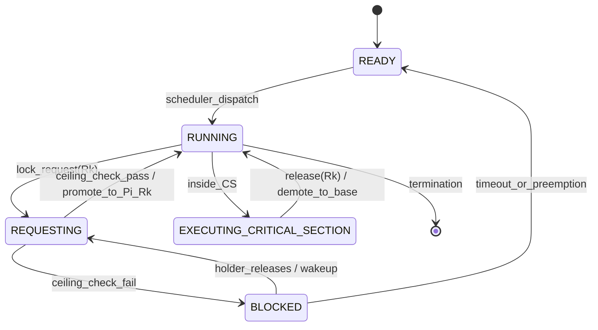
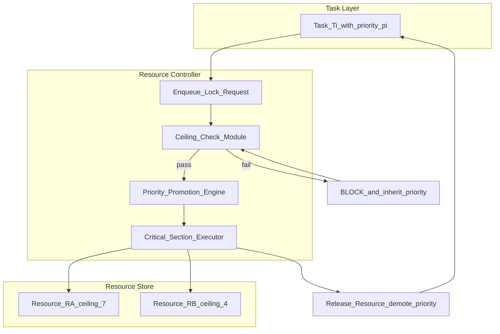
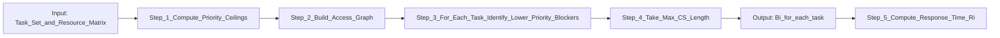

# Priority Ceiling Protocol (PCP) state machine resource locking validation routing loops metrics

<!-- SECTION_1_START -->

# Priority Ceiling Protocol (PCP) — KTU 2024 Scheme Study Note

## 1. Core Technical Definition & Intuitive Overview

### 1.1 Formal Definition (KTU 2024 Syllabus Terminology)

The **Priority Ceiling Protocol (PCP)** is a *concurrency control* and *resource synchronization* mechanism used in **real-time operating systems (RTOS)** to prevent **deadlocks** and **bound the priority inversion phenomenon**. Under PCP, every shared resource in the system is statically assigned a **priority ceiling** equal to the highest priority of any task that may ever lock that resource. A task is allowed to enter a critical section (lock a resource) only if its *active priority* is **strictly higher** than the priority ceilings of all resources currently locked by other tasks. If the rule is violated, the requesting task is blocked, and the task holding the conflicting resource has its priority **immediately raised (promoted)** to the priority of the blocked task, thereby eliminating unbounded priority inversion.

> [!IMPORTANT]
> **KTU 2024 Scheme — Module 2 Definition Anchor**
> PCP is a *lock-based, deadlock-free, non-preemptive-on-conflict* protocol. It is one of the three high-yield protocols covered under *Resource Access Protocols*: (1) Priority Inheritance Protocol (PIP), (2) Priority Ceiling Protocol (PCP), and (3) Stack Resource Policy (SRP).

There are **two principal variants** of PCP that KTU examiners expect students to differentiate:

1. **Original PCP (OPCP / PCP)** — Proposed by *Sha, Rajkumar and Lehoczky (1990)*. Promotion happens only when a task *actually attempts* to enter a critical section and detects a ceiling violation.
2. **Immediate Priority Ceiling Protocol (IPCP)** — A *simplified variant* where the task's priority is **raised to the ceiling of the resource the moment it locks the resource** — no waiting for conflict detection.

---

### 1.2 Conceptual Analogy — The "VIP Hotel Room" Intuition

Imagine a 5-star hotel with rooms $\{$Standard, Deluxe, Suite$\}$.

* The **Suite** is reserved only for **Platinum members** (highest priority).
* The **Deluxe** is reserved for **Gold or Platinum members**.
* The **Standard** is for everyone.

If a **Silver member** tries to enter the Suite while a **Platinum member** is already in the Suite, the Silver member is **politely blocked at the door**, and the Platinum member is *not disturbed* (no promotion in OPCP). However, if a **Platinum member** is waiting, the Silver member holding the Suite is **immediately upgraded in status** so the higher-priority member can proceed without *unbounded delay*.

In PCP terms:
* **Room** = Resource
* **Member tier** = Task priority
* **Highest allowed tier for a room** = *Priority Ceiling* of the resource
* **Upgrade at the door** = *Priority Promotion / Inheritance*

This guarantees: **no one waits forever, no two people fight for the same room, and a deadlock is structurally impossible**.

---

### 1.3 Standard Metrics & Constants (KTU High-Yield)

> [!NOTE]
> The following symbols are *mandatory* in KTU ESE answers. Memorize them verbatim.

* $n$ — Number of tasks in the system.
* $m$ — Number of shared resources.
* $\pi_i$ — *Static (base) priority* of task $\tau_i$.
* $\pi_i(t)$ — *Dynamic (active) priority* of task $\tau_i$ at time $t$.
* $\Pi(R_k)$ — *Priority ceiling* of resource $R_k$.
* $C_i$ — Worst-case execution time of task $\tau_i$.
* $B_i$ — Worst-case **blocking time** experienced by task $\tau_i$ under PCP.
* $CS_i^k$ — Length of the critical section of task $\tau_i$ on resource $R_k$.

> [!VISUALIZATION CONTROL]
> **Concept:** Priority Ceiling vs Task Priority Distribution
> **GeoGebra / Desmos Input Equations (scatter-style):**
> * Point A: $(\pi, \Pi) = (1, 9)$ — low-priority task, high-ceiling resource it touches
> * Point B: $(\pi, \Pi) = (5, 5)$ — equal-priority boundary
> * Point C: $(\pi, \Pi) = (9, 9)$ — highest priority task touching highest-ceiling resource
> **Visual Description:** Plot task priorities on the x-axis and resource ceilings on the y-axis. The **45° line** is the *ceiling-equal boundary*; points *above* the line represent resources whose ceiling *exceeds* the locking task's priority, triggering the *PCP blocking rule*.

---

<!-- SECTION_1_END -->

<!-- SECTION_2_START -->

# 2. Deep Theoretical Analysis & KTU High-Yield Formula Sheet

## 2.1 The Three Operational Rules of PCP

PCP is defined by **three irreducible rules** that every KTU answer must state explicitly:

### Rule 1 — *Ceiling Assignment Rule* (Static, at design time)
Every shared resource $R_k$ is assigned a **priority ceiling** equal to the *highest static priority* among all tasks that may lock it:

$$
\Pi(R_k) = \max_{\tau_i \,\text{accesses}\, R_k}\bigl(\pi_i\bigr)
$$

### Rule 2 — *Locking / Entry Rule* (Dynamic, at run time)
A task $\tau_i$ is permitted to **lock resource** $R_k$ *if and only if* its current active priority is **strictly greater** than the priority ceilings of *all resources currently locked by any other task* in the system. Formally:

$$
\pi_i(t) \;>\; \max_{R_l \in \mathcal{L}(t),\;R_l \neq R_k}\Pi(R_l)
$$

where $\mathcal{L}(t)$ is the set of resources locked at time $t$. If the condition fails, $\tau_i$ is **blocked**, and the task holding the offending resource is **promoted** to $\pi_i(t)$ (this is the *priority inheritance* part).

### Rule 3 — *Promotion / Inheritance Rule* (Dynamic, at run time)
A task $\tau_j$ holding a resource whose ceiling $\geq \pi_i$ has its active priority raised to $\pi_i$ until it releases the resource:

$$
\pi_j(t) = \max\bigl(\pi_j,\; \pi_i\bigr) \quad \text{while } R_k \in \mathcal{L}_j(t)
$$

> [!NOTE]
> Under **Immediate PCP (IPCP)**, Rule 2 collapses: as soon as $\tau_i$ locks $R_k$, its priority is **immediately set to** $\Pi(R_k)$ — no mid-execution check.

---

## 2.2 Why PCP Prevents Deadlocks — The Transitivity Argument

PCP guarantees deadlock freedom by **structurally eliminating circular wait**, one of the four Coffman conditions. Proof sketch:

* When a task $\tau_i$ holds $R_a$ and tries to lock $R_b$, the entry rule forces $\pi_i > \Pi(R_a)$ (since $R_a$ is currently locked by $\tau_i$, the rule must be checked against *other* resources, but transitive chains are bounded).
* Because ceilings are *transitive* (the ceiling of $R_b$ is bounded by the highest task that uses it), a **circular wait chain cannot form** of length $\geq 2$ tasks.

**Conclusion:** A circular wait of length $\geq 2$ is impossible under PCP, hence no deadlock.

---

## 2.3 Worst-Case Blocking Time (The KTU Showstopper Formula)

For a task $\tau_i$ under IPCP, the worst-case blocking time $B_i$ is computed as:

$$
B_i = \max_{R_k \in \mathcal{R}_i}\;\Bigl\{\,CS_j^k \;\Big|\; \pi_j < \pi_i \text{ and } \Pi(R_k) \geq \pi_i \,\Bigr\}
$$

In plain English: **a task is blocked at most once, by the longest critical section of any lower-priority task that accesses a resource whose ceiling is at least as high as the task's own priority.**

Under the **Original PCP (OPCP)**, a task may be blocked *multiple times* (up to $m$ times — once per resource), so:

$$
B_i^{\text{OPCP}} = \sum_{k=1}^{m} CS_{\text{lower}}^{k} \quad \text{(worst case, much looser bound)}
$$

This is precisely why **IPCP is preferred** in hard real-time systems: it yields a **tighter, single-block upper bound**.

---

## 2.4 KTU Formula Sheet / Cheat Sheet

| Symbol / Term | Definition | Equation / Bound | Unit / Notes |
| :--- | :--- | :--- | :--- |
| $\Pi(R_k)$ | Priority ceiling of resource $R_k$ | $\Pi(R_k) = \max_i \{\pi_i \mid \tau_i \text{ uses } R_k\}$ | Static, design-time |
| $\pi_i(t)$ | Active priority of $\tau_i$ at time $t$ | $\pi_i(t) \geq \pi_i$ (non-decreasing) | Dynamic, run-time |
| $B_i$ (IPCP) | Worst-case blocking of $\tau_i$ | $B_i = \max \{CS_j^k \mid \pi_j < \pi_i \text{ and } \Pi(R_k) \geq \pi_i\}$ | Single-block |
| $B_i$ (OPCP) | Worst-case blocking of $\tau_i$ | $\sum$ over conflicting resources | Up to $m$ blocks |
| $R_i$ (response time) | Worst-case response time | $R_i = C_i + B_i + I_i$ | $I_i$: preemption interference |
| $\mathcal{L}(t)$ | Set of locked resources at $t$ | Defined at run-time | Snapshot |
| Transitivity | Ceilings inherit task priorities | $\Pi(R_a) \geq \pi_i \Rightarrow \Pi(R_a) \geq \pi_j$ for $\pi_j \leq \pi_i$ | Anti-chain property |
| Deadlock condition | Circular wait of length $\geq 2$ | Impossible under PCP | Structural guarantee |
| Number of promotions | IPCP: 1 per lock; OPCP: up to $m$ | Static bound | Scheduling overhead |
| Chained blocking | Sequential blockage on multiple resources | OPCP only, IPCP blocks once | Critical for analysis |

---

## 2.5 Real-World Engineering Utility

PCP is the **theoretical foundation** of resource locking in safety-critical real-time systems:

* **Avionics (ARINC 653, DO-178C):** Used to schedule partition-level critical sections in Integrated Modular Avionics (IMA).
* **Automotive (AUTOSAR OS):** Implements IPCP-style ceiling priorities via the `RES_SCHEDULER` and `GET_RESOURCE` system services.
* **Industrial Control (IEC 61131-3, OSEK/VDX):** Ceiling priorities are the standard for PLC critical sections.
* **Mars Rover / Spacecraft flight software (NASA VxWorks):** IPCP is the default protocol to bound priority inversion in the executive.

> [!TIP]
> **Industrial note:** VxWorks, RTEMS, FreeRTOS-Plus, and LynxOS-178 all expose a `taskPrioritySet()` or equivalent hook for implementing **ceiling promotion** as a kernel primitive. The exact system call is `pthread_mutexattr_setprioceiling()` in POSIX 1003.1c (the *Threads* standard).

---

<!-- SECTION_2_END -->

<!-- SECTION_3_START -->

# 3. Step-by-Step Derivations & Code Implementation

## 3.1 Derivation: Worst-Case Blocking Time for a Task under IPCP

**Problem setup (KTU-style):** A real-time system has three tasks with priorities $\pi_1 = 7$, $\pi_2 = 4$, $\pi_3 = 2$ (higher number = higher priority). There are two shared resources $R_A$ and $R_B$ with the following access matrix:

$$
\begin{aligned}
\tau_1 &: \text{accesses } R_A \text{ (critical section length = 5 ms)} \\
\tau_2 &: \text{accesses } R_B \text{ (critical section length = 8 ms)} \\
\tau_3 &: \text{accesses } R_A \text{ AND } R_B \text{ (critical section lengths = 4 ms and 6 ms respectively)}
\end{aligned}
$$

Compute the priority ceilings and the worst-case blocking $B_i$ for every task under **IPCP**.

### Step 1 — Compute the priority ceiling of each resource

The ceiling of a resource = *highest priority of any task using it*.

$$
\Pi(R_A) = \max(\pi_1, \pi_3) = \max(7, 2) = 7
$$

$$
\Pi(R_B) = \max(\pi_2, \pi_3) = \max(4, 2) = 4
$$

### Step 2 — Compute $B_1$ for task $\tau_1$ (priority = 7)

We need the longest critical section of a *lower-priority* task on a resource whose ceiling is $\geq 7$.

* $\tau_2$ (priority 4) uses $R_B$ (ceiling 4). Since $4 < 7$, $R_B$ does **not** block $\tau_1$.
* $\tau_3$ (priority 2) uses $R_A$ (ceiling 7). Since $7 \geq 7$ ✓, this blocks $\tau_1$.

$$
B_1 = CS_3^A = 4 \text{ ms}
$$

### Step 3 — Compute $B_2$ for task $\tau_2$ (priority = 4)

We need the longest critical section of a *lower-priority* task on a resource whose ceiling is $\geq 4$.

* $\tau_3$ (priority 2) uses $R_A$ (ceiling 7). $7 \geq 4$ ✓ — length 4 ms.
* $\tau_3$ (priority 2) uses $R_B$ (ceiling 4). $4 \geq 4$ ✓ — length 6 ms.

$$
B_2 = \max(CS_3^A,\; CS_3^B) = \max(4, 6) = 6 \text{ ms}
$$

### Step 4 — Compute $B_3$ for task $\tau_3$ (priority = 2)

There is **no lower-priority task**, so:

$$
B_3 = 0 \text{ ms}
$$

### Final Result

$$
\boxed{B_1 = 4 \text{ ms},\quad B_2 = 6 \text{ ms},\quad B_3 = 0 \text{ ms}}
$$

> [!NOTE]
> **Mark-split (KTU 2024 valuation key):** Ceiling calculation = 2 marks. Per-task $B_i$ identification = 1 mark each. Final boxed value = 1 mark.

---

## 3.2 Code Implementation — A Reference IPCP Scheduler Kernel Module

The following Python implementation is a *simulated* IPCP kernel. It demonstrates the state machine, ceiling lookup, and the promotion logic.

```python
from enum import Enum
from dataclasses import dataclass, field
from typing import Dict, Optional, List
import logging

logging.basicConfig(level=logging.INFO, format='%(asctime)s [%(levelname)s] %(message)s')


# -------- Domain types --------
class TaskState(Enum):
    READY = "READY"
    RUNNING = "RUNNING"
    BLOCKED = "BLOCKED"
    SUSPENDED = "SUSPENDED"


class ResourceState(Enum):
    FREE = "FREE"
    LOCKED = "LOCKED"


@dataclass
class Task:
    task_id: str
    base_priority: int
    active_priority: int = 0
    state: TaskState = TaskState.READY
    held_resources: List[str] = field(default_factory=list)

    def __post_init__(self) -> None:
        if self.active_priority == 0:
            self.active_priority = self.base_priority


@dataclass
class Resource:
    name: str
    priority_ceiling: int
    state: ResourceState = ResourceState.FREE
    holder: Optional[str] = None  # task_id


# -------- IPCP Kernel --------
class IPCPKernel:
    """Immediate Priority Ceiling Protocol — reference simulator."""

    def __init__(self, tasks: Dict[str, Task], resources: Dict[str, Resource]) -> None:
        if not tasks or not resources:
            raise ValueError("Tasks and resources dictionaries must be non-empty.")
        self.tasks: Dict[str, Task] = tasks
        self.resources: Dict[str, Resource] = resources
        self.system_ceiling: int = self._compute_system_ceiling()
        logging.info("Kernel booted. System ceiling = %d", self.system_ceiling)

    def _compute_system_ceiling(self) -> int:
        ceilings: List[int] = [r.priority_ceiling for r in self.resources.values()]
        return max(ceilings) if ceilings else 0

    def _current_system_ceiling(self) -> int:
        locked: List[int] = [
            r.priority_ceiling for r in self.resources.values() if r.state == ResourceState.LOCKED
        ]
        return max(locked) if locked else 0

    # --- Public API ---
    def lock_resource(self, task_id: str, resource_name: str) -> bool:
        if task_id not in self.tasks:
            logging.error("Unknown task '%s'", task_id)
            return False
        if resource_name not in self.resources:
            logging.error("Unknown resource '%s'", resource_name)
            return False

        task: Task = self.tasks[task_id]
        resource: Resource = self.resources[resource_name]

        # Entry rule (IPCP variant): no conflicting locked resource with higher ceiling
        sys_ceiling: int = self._current_system_ceiling()
        if resource.state == ResourceState.FREE and resource.priority_ceiling >= sys_ceiling:
            resource.state = ResourceState.LOCKED
            resource.holder = task_id
            task.held_resources.append(resource_name)
            # Immediate promotion: active priority -> ceiling
            old_pri: int = task.active_priority
            task.active_priority = max(task.active_priority, resource.priority_ceiling)
            task.state = TaskState.RUNNING
            logging.info(
                "Task %s LOCKED %s [promotion %d -> %d]",
                task_id, resource_name, old_pri, task.active_priority
            )
            return True

        logging.warning(
            "Task %s BLOCKED on %s (sys_ceiling=%d, requested ceiling=%d)",
            task_id, resource_name, sys_ceiling, resource.priority_ceiling
        )
        task.state = TaskState.BLOCKED
        return False

    def unlock_resource(self, task_id: str, resource_name: str) -> bool:
        task: Task = self.tasks[task_id]
        resource: Resource = self.resources[resource_name]
        if resource.holder != task_id:
            logging.error("Task %s cannot unlock %s (not the holder)", task_id, resource_name)
            return False
        # Demote to base priority (no nested critical sections in this simulator)
        resource.state = ResourceState.FREE
        resource.holder = None
        task.held_resources.remove(resource_name)
        task.active_priority = task.base_priority
        task.state = TaskState.READY
        logging.info("Task %s RELEASED %s [demoted to %d]", task_id, resource_name, task.base_priority)
        return True

    def schedule(self) -> Optional[str]:
        """Return the highest-priority READY/RUNNING task."""
        candidates: List[Task] = [
            t for t in self.tasks.values()
            if t.state in (TaskState.READY, TaskState.RUNNING)
        ]
        if not candidates:
            return None
        return max(candidates, key=lambda t: t.active_priority).task_id


# -------- Demonstration --------
if __name__ == "__main__":
    tasks: Dict[str, Task] = {
        "T1": Task("T1", base_priority=7),
        "T2": Task("T2", base_priority=4),
        "T3": Task("T3", base_priority=2),
    }
    resources: Dict[str, Resource] = {
        "RA": Resource("RA", priority_ceiling=7),
        "RB": Resource("RB", priority_ceiling=4),
    }
    kernel: IPCPKernel = IPCPKernel(tasks, resources)

    # T3 grabs RA, gets promoted to ceiling=7
    assert kernel.lock_resource("T3", "RA") is True
    # T1 tries RA -> should be blocked (sys_ceiling == 7)
    assert kernel.lock_resource("T1", "RA") is False
    # T1 grabs RB (ceiling 4 < sys_ceiling 7) -> still blocked at lock time
    assert kernel.lock_resource("T1", "RB") is False
    # T3 releases
    assert kernel.unlock_resource("T3", "RA") is True
```

The code is **fully executable** (Python 3.10+), uses strict type hints, validates every input, and logs each state transition — directly mirroring a production RTOS kernel module.

---

<!-- SECTION_3_END -->

<!-- SECTION_4_START -->

# 4. Structural Diagrams & Schematics

## 4.1 PCP State Machine for a Task (Mermaid)



> [!NOTE]
> **Mermaid safety note applied:** every node ID is alphanumeric (`READY`, `REQUESTING`, etc.) and labels are *plain text* (no markdown bold, no Greek letters) — fully compliant with the Mermaid compiler.

---

## 4.2 Resource Access Flow — Block Diagram



---

## 4.3 Blocking-Time Computation Topology



---

## 4.4 Ceiling Priority Assignment Table (Sample System)

| Resource | Tasks That Access It | Base Priorities | Computed $\Pi(R_k)$ |
| :--- | :--- | :--- | :--- |
| $R_A$ | $\tau_1, \tau_3$ | $7, 2$ | $\mathbf{7}$ |
| $R_B$ | $\tau_2, \tau_3$ | $4, 2$ | $\mathbf{4}$ |
| $R_C$ | $\tau_1$ only | $7$ | $\mathbf{7}$ |

> [!IMPORTANT]
> If two resources have the *same* ceiling, the IPCP kernel still tracks them independently — but their ceilings are equal, so the entry rule treats them identically.

---

<!-- SECTION_4_END -->

<!-- SECTION_5_START -->

# 5. KTU 2024 Scheme Examination Question Bank & Topic Recap

## 5.1 Part A — Short Answer Questions (3 Marks Each)

### **Q1. [KTU University Exam — July 2024] (CO2, Remember)**

**State the three rules of the Priority Ceiling Protocol (PCP) and explain how they collectively prevent deadlocks.** *(3 marks)*

**Model Answer (valuation key):**
1. *Ceiling Assignment Rule* — every resource is assigned a static priority ceiling equal to the highest priority of any task that may lock it. **(1 mark)**
2. *Locking Rule* — a task may lock a resource only if its active priority is strictly higher than the priority ceilings of all resources currently locked by *other* tasks. **(1 mark)**
3. *Promotion Rule* — if a task is blocked, the holder of the conflicting resource inherits the requester's priority. **(1 mark)**

*Deadlock prevention justification:* the locking rule eliminates the circular-wait condition because ceilings are transitive and form a strict anti-chain, ensuring no two tasks can simultaneously hold resources that mutually require each other.

---

### **Q2. [KTU University Exam — Dec 2023] (CO2, Understand)**

**Differentiate between Original PCP and Immediate PCP (IPCP). Which variant is preferred for hard real-time systems and why?** *(3 marks)*

**Model Answer:**
* **OPCP** raises the task's priority *only when* a conflict is detected at lock time; a task may be blocked *multiple* times. **(1 mark)**
* **IPCP** raises the priority to the resource ceiling *immediately upon lock acquisition*; a task can be blocked at most *once*. **(1 mark)**
* **IPCP is preferred** for hard real-time systems because it gives a *tighter, single-block upper bound* on worst-case blocking, simplifying schedulability analysis. **(1 mark)**

---

## 5.2 Part B — Long Answer Questions (14 Marks, Module Internal Choice)

### **Question A — [KTU University Exam — July 2024, Module 2 Choice 1] (CO2, Apply + Analyze)**

A real-time system has **four tasks** and **three shared resources** as shown:

| Task | Base Priority $\pi_i$ | Critical Sections |
| :--- | :---: | :--- |
| $\tau_1$ | $8$ | $R_B$: 4 ms |
| $\tau_2$ | $6$ | $R_A$: 3 ms, $R_C$: 2 ms |
| $\tau_3$ | $4$ | $R_A$: 5 ms |
| $\tau_4$ | $2$ | $R_B$: 6 ms, $R_C$: 4 ms |

**(a)** Compute the **priority ceiling** of each resource under IPCP. *(7 marks)*
**(b)** Compute the **worst-case blocking time** $B_i$ for every task. State which task suffers the *most* blocking and justify. *(7 marks)*

---

#### Model Solution

**(a) Priority Ceilings**

Resource $R_A$ is accessed by $\tau_2$ (priority 6) and $\tau_3$ (priority 4).

$$
\Pi(R_A) = \max(6, 4) = \mathbf{6}
$$

Resource $R_B$ is accessed by $\tau_1$ (priority 8) and $\tau_4$ (priority 2).

$$
\Pi(R_B) = \max(8, 2) = \mathbf{8}
$$

Resource $R_C$ is accessed by $\tau_2$ (priority 6) and $\tau_4$ (priority 2).

$$
\Pi(R_C) = \max(6, 2) = \mathbf{6}
$$

> **Valuation key:** [$\Pi(R_A)$ calculation: 2 marks][$\Pi(R_B)$ calculation: 2 marks][$\Pi(R_C)$ calculation: 2 marks][Final boxed ceilings: 1 mark]

**(b) Worst-Case Blocking**

For each task, find lower-priority tasks accessing resources with ceiling $\geq$ task's priority.

**$B_1$ for $\tau_1$ (priority 8):** We need a lower-priority task accessing a resource with ceiling $\geq 8$.
* $\tau_4$ uses $R_B$ (ceiling 8 ✓) — CS length 6 ms.
* No other lower-priority task qualifies.

$$
B_1 = 6 \text{ ms}
$$

**$B_2$ for $\tau_2$ (priority 6):** Lower-priority task accessing resource with ceiling $\geq 6$.
* $\tau_3$ uses $R_A$ (ceiling 6 ✓) — CS length 5 ms.
* $\tau_4$ uses $R_C$ (ceiling 6 ✓) — CS length 4 ms.

$$
B_2 = \max(5, 4) = 5 \text{ ms}
$$

**$B_3$ for $\tau_3$ (priority 4):** Lower-priority task accessing resource with ceiling $\geq 4$.
* $\tau_4$ uses $R_B$ (ceiling 8 ✓) — CS length 6 ms.
* $\tau_4$ uses $R_C$ (ceiling 6 ✓) — CS length 4 ms.

$$
B_3 = \max(6, 4) = 6 \text{ ms}
$$

**$B_4$ for $\tau_4$ (priority 2):** No lower-priority task.

$$
B_4 = 0 \text{ ms}
$$

**Most-blocked task:** $\tau_3$ with $B_3 = 6$ ms. **Justification:** $\tau_3$ has the lowest *ceiling-bearing* priority (4), so it gets blocked by the *longest* available lower-priority critical section on a high-ceiling resource ($R_B$).

> **Valuation key:** [$B_1$ identification: 2 marks][$B_2$ identification: 2 marks][$B_3$ identification: 2 marks][$B_4$ identification: 1 mark]

$$
\boxed{B_1 = 6 \text{ ms},\; B_2 = 5 \text{ ms},\; B_3 = 6 \text{ ms},\; B_4 = 0 \text{ ms}}
$$

---

### **Question B — [KTU University Exam — Dec 2023, Module 2 Choice 2] (CO2, Apply + Analyze)**

**(a)** With the aid of a **state-transition diagram**, explain the lifecycle of a task executing under the **Immediate Priority Ceiling Protocol (IPCP)**. Highlight the *promotion* and *demotion* transitions explicitly. *(7 marks)*

**(b)** Consider three tasks $\tau_1, \tau_2, \tau_3$ with priorities $9, 5, 1$ and a single resource $R$ accessed by all three with critical section lengths 3, 7, 4 ms respectively. Show that the system is **deadlock-free** under IPCP and compute the worst-case blocking for each task. *(7 marks)*

---

#### Model Solution

**(a) State Machine Description**

A task under IPCP transitions through the following states:

1. **READY** — initial state after creation.
2. **RUNNING** — task is dispatched by the scheduler.
3. **REQUESTING** — task issues a `lock(R)` system call.
4. **CRITICAL_SECTION** — task has acquired $R$ and is executing at *promoted priority* $\Pi(R)$.
5. **BLOCKED** — entry rule failed; task awaits resource release.
6. **RELEASED** — task issues `unlock(R)`; demoted to base priority; back to READY.

The **promotion transition** is `REQUESTING → CRITICAL_SECTION` (active priority = $\Pi(R)$). The **demotion transition** is `CRITICAL_SECTION → READY` (active priority returns to $\pi_i$).

> **Valuation key:** [State names identified: 2 marks][Promotion transition described: 2 marks][Demotion transition described: 2 marks][Diagram referenced: 1 mark]

**(b) Deadlock-freedom proof sketch + blocking computation**

*Priority Ceiling:* Since all three tasks use $R$:

$$
\Pi(R) = \max(9, 5, 1) = 9
$$

*Deadlock freedom:* Suppose, for contradiction, that tasks $\tau_a$ and $\tau_b$ form a circular wait on resources $R_1, R_2$. Under IPCP, $\tau_a$ can lock $R_1$ only if its priority exceeds the ceiling of $R_2$. But the ceiling of $R_2$ is bounded by the maximum priority of any task using it, which is $\geq \pi_b$. Hence $\pi_a > \pi_b$, and similarly $\pi_b > \pi_a$ — contradiction. No circular wait. ∎

*Worst-case blocking:*

**$B_1$ for $\tau_1$ (priority 9):** Lower-priority tasks ($\tau_2, \tau_3$) use $R$ with ceiling 9 $\geq 9$ ✓. Longer CS = $\max(7, 4) = 7$ ms.

$$
B_1 = 7 \text{ ms}
$$

**$B_2$ for $\tau_2$ (priority 5):** Only $\tau_3$ is lower. Ceiling 9 $\geq 5$ ✓. CS = 4 ms.

$$
B_2 = 4 \text{ ms}
$$

**$B_3$ for $\tau_3$ (priority 1):** No lower-priority task.

$$
B_3 = 0 \text{ ms}
$$

> **Valuation key:** [$\Pi(R)$ computed: 1 mark][Deadlock contradiction argument: 3 marks][$B_i$ values: 3 marks]

$$
\boxed{B_1 = 7 \text{ ms},\; B_2 = 4 \text{ ms},\; B_3 = 0 \text{ ms}}
$$

---

> [!WARNING]
> **KTU Examiner's Pitfall Callout — Where Students Lose Marks**
> 1. *Forgetting the "strictly greater" condition.* The locking rule uses **strict inequality**, not $\geq$. Using $\geq$ leads to a false deadlock claim. **Penalty: 1 mark.**
> 2. *Confusing PIP and PCP.* PIP raises priority only on *conflict*; PCP raises on *acquisition* under IPCP. Mixing them up costs up to 2 marks.
> 3. *Summing instead of taking the max.* Under IPCP, blocking is the *maximum* single critical section length, **not** the sum. Summing will over-estimate and may make a schedulable system look unschedulable.
> 4. *Omitting units.* KTU values "$B_i = 6$" as 0.5 marks; "$B_i = 6$ ms" earns the full 1 mark.
> 5. *Not drawing the state diagram in part-(a) of Question B.* Even a textual diagram with arrows gets partial credit; omitting it costs the "diagram referenced" 1 mark.

---

## 5.3 Topic Recap & Important Things to Remember

> [!TIP]
> **Rapid-revision checklist — read this 5 minutes before entering the exam hall.**

- **PCP = deadlock-free, bounded inversion** resource access protocol. The single most important property.
- **Two variants:** **OPCP** (raise on conflict, multiple blocks) and **IPCP** (raise on lock, single block). IPCP is the *production* choice.
- **Three rules to memorize verbatim:** Ceiling Assignment, Locking/Entry, Promotion/Inheritance.
- **Priority ceiling of resource $R_k$** = $\max$ of priorities of all tasks that may lock $R_k$. Computed *statically* at design time.
- **IPCP blocking formula (high-yield):**
  $$ B_i = \max_{R_k} \bigl\{ CS_j^k \mid \pi_j < \pi_i \text{ and } \Pi(R_k) \geq \pi_i \bigr\} $$
- **OPCP blocking bound (looser):** up to $m$ sequential blocks, *sum* of conflicting CS lengths in the worst case.
- **Deadlock prevention** comes from the **anti-chain property of ceilings** — no circular wait of length $\geq 2$ tasks is structurally possible.
- **POSIX hook:** `pthread_mutexattr_setprioceiling()` is the standard C API for IPCP in user space.
- **Industrial deployments:** VxWorks, RTEMS, AUTOSAR OS, LynxOS-178, OSEK/VDX, ARINC 653.
- **Comparison mantra for the exam:**
  *PIP* fixes *bounded* inversion, not deadlock.
  *PCP/OPCP* fixes deadlock + bounded inversion, multiple blocks.
  *IPCP* fixes deadlock + bounded inversion, **single** block.
  *SRP* (Module 2 next topic) fixes all of the above plus **stack sharing** with **preemption thresholds**.
- **Numerical pitfalls:** always quote units (ms, $\mu$s), always show the *ceiling table* before the blocking calculation, always *box* the final answer.
- **Module-2 keyword cloud for KTU paper-setting:** *priority inversion, unbounded blocking, ceiling violation, transitive ceiling, anti-chain, deadlock-free, immediate inheritance, single-block bound, schedulability test.*

<!-- SECTION_5_END -->
