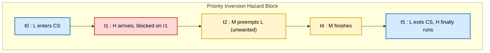
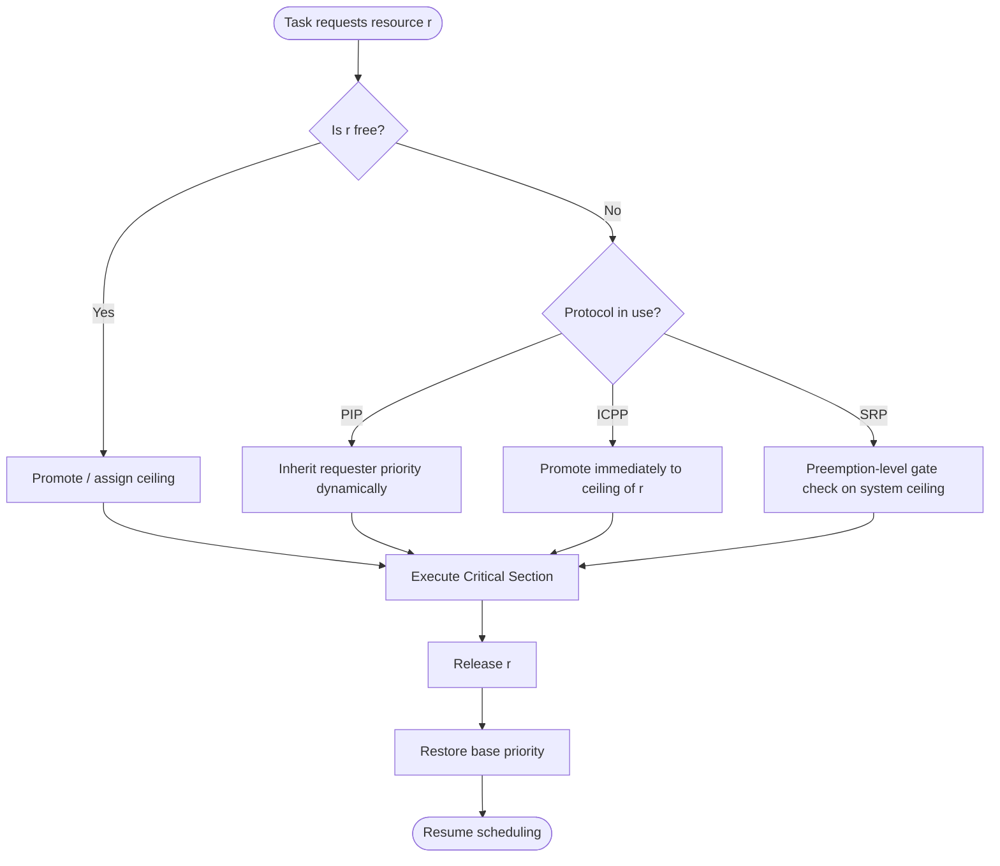

# Priority inversion hazard profiling block conditions parameters structures scenarios layout

<!-- SECTION_1_START -->
# Resource Access Protocols & Priority Inversion Hazard Profiling

> [!NOTE]
> **KTU 2024 Scheme | PECST715 - Real Time Systems | Module 2**
> **Course Outcome Mapping:** CO2 — *Analyze resource access control mechanisms to bound priority inversion and guarantee schedulability of real-time tasks.*

## 1.1 Formal Definition

In Real-Time Systems (RTS), multiple tasks often compete for **shared resources** (mutexes, I/O ports, memory buffers, hardware registers). **Resource Access Protocols** are a family of synchronization mechanisms that govern the order in which tasks enter **critical sections** to safely access these resources. Their primary engineering goal is to **bound priority inversion** — the pathological condition in which a high-priority task is *indirectly* preempted by one or more lower-priority tasks.

A **Priority Inversion Hazard** is formally defined as the *temporal interval* during which the execution of the highest-priority ready task is deferred not by design, but because lower-priority tasks hold incompatible resources or run on the processor while the higher-priority task is logically entitled to it.

The hazard is characterized by four profiling dimensions:

| Hazard Dimension | Engineering Meaning |
|---|---|
| **Duration** | Worst-case length of the inversion interval (in time units) |
| **Depth** | Maximum number of tasks that can be transitively blocked |
| **Chaining** | Whether a task can be blocked by multiple resources simultaneously |
| **Cascading** | Whether a single resource causes transitive blocking across $n$ tasks |

> [!IMPORTANT]
> **Syllabus Highlight (PECST715 M2):** A real-time system is *predictable* only if every form of blocking is **bounded by a finite constant**. Unbounded priority inversion is treated as a **catastrophic system failure**, not a mere performance issue.

## 1.2 Intuitive Analogy — The Single-Lane Bridge

Imagine a narrow, one-lane bridge connecting two highways:
- **Cars** = real-time tasks.
- **Bridge** = a shared resource (critical section).
- **Ambulance** = the highest-priority task.
- **Trucks / Buses** = low-priority tasks.

When an ambulance arrives at the bridge, *logically* it should cross first. But if a slow truck is *already on* the bridge, the ambulance must wait. Now suppose cars traveling in the **opposite direction** start entering the bridge from the other side. The ambulance is now stuck behind traffic it never asked for. The **bridge operator** is the *Resource Access Protocol* — they decide who crosses, in what order, and prevent this mess from getting out of hand.

A naive operator allows **unbounded inversion** (ambulance waits indefinitely). A smart operator installs **traffic lights with priorities and one-way enforcement** (Priority Ceiling Protocol).

## 1.3 Profiling Parameters of a Hazard Block

A **Block** in the profiling context refers to a *schedulability-structural unit* that captures the state of a task relative to a resource. It is defined by the tuple:

$$
B_i = \langle T_i,\; R_i,\; P_i,\; \xi_i,\; \beta_i \rangle
$$

Where:

- $T_i$ — Worst-case execution time of task $i$
- $R_i$ — Set of resources requested by task $i$, $R_i = \{r_1, r_2, \ldots, r_k\}$
- $P_i$ — Nominal priority of task $i$
- $\xi_i$ — Critical section (resource holding time) of task $i$
- $\beta_i$ — Blocking factor (number of times task $i$ can be blocked)

> [!VISUALIZATION CONTROL]
> **Concept:** Priority Inversion Timeline (3-task system: H=High, M=Medium, L=Low)
> **Plot axes:** X-axis → Wall-clock time, Y-axis → Active task priority line
> **Reference points to mark:**
> * `t=0, P=L enters critical section`
> * `t=2, P=H arrives, blocked by L`
> * `t=4, P=M preempts L (unwanted preemption)`
> * `t=8, L releases resource, H finally runs`
> **Visual Description:** A staircase plot where priority line dips to L, is then preempted by M, and only returns to H after M finishes — a *boundless* inversion window from $t=2$ to $t=8$.

<!-- SECTION_1_END -->

<!-- SECTION_2_START -->
# Deep Theoretical Analysis — Hazard Conditions, Parameters & Scenarios

## 2.1 The Three Canonical Hazard Scenarios

### Scenario A — Single-Resource Direct Inversion

**Condition:** Task $H$ (high) requests resource $r$ held by task $L$ (low).

**Why it happens:** $L$ is logically entitled to run on the CPU; the OS scheduler has no knowledge that $H$ needs $r$.

**Bounding Mechanism:** Every protocol (PIP, PCP, SRP) must convert this into a *bounded* delay.

### Scenario B — Chained (Push-Through) Inversion

**Condition:** Task $H$ is blocked on $r_1$ held by $L$, while $L$ is itself blocked on $r_2$ held by $M$.

**Why it happens:** Resource dependency graph has a chain $H \rightarrow L \rightarrow M$.

**Bounding Mechanism:** Only **PCP and SRP** bound this to one blocking per resource. PIP allows *transitive* inversion.

### Scenario C — Unbounded Inversion (Pathological Case)

**Condition:** Medium-priority tasks preempt $L$ repeatedly while $H$ waits.

**Why it happens:** No priority adjustment; medium tasks are unrelated to the resource but legally runnable.

**Bounding Mechanism:** All three protocols *eliminate* this by promoting $L$ to $H$'s priority.

## 2.2 Priority Inheritance Protocol (PIP) — Hazard Profile

**Operational Rule:** When task $H$ blocks on a resource held by $L$, $L$ *temporarily inherits* $H$'s priority until it releases the resource.

- **Block duration bound:** Up to the length of *one* critical section.
- **Chaining:** Allowed (not bounded).
- **Deadlock:** Still possible (circular wait).
- **Best for:** Systems with few resources and known critical section lengths.

$$
\text{Blocking}_{H}^{PIP} = \sum_{i=1}^{n} \min(k, cs_i)
$$

Where $k$ is the number of resources and $cs_i$ is the critical section length of task $i$.

## 2.3 Priority Ceiling Protocol (PCP) — Hazard Profile

**Operational Rule:** Every resource $r$ is assigned a **ceiling priority** equal to the highest priority of any task that may lock it:

$$
\Pi(r) = \max_{i : r \in R_i} P_i
$$

A task may lock $r$ *only if* its active priority is *strictly higher* than the ceiling of *all resources currently locked by other tasks*. Otherwise, it inherits the highest such ceiling.

- **Block duration bound:** **At most one** critical section (the longest).
- **Chaining:** **Eliminated** (no transitive blocking).
- **Deadlock:** **Prevented** by construction.
- **Variants:** *Original* (OCPP) and *Immediate* (ICPP).

$$
\text{Blocking}_{H}^{PCP} = \max_{i \in \text{lower}(H)} cs_i
$$

## 2.4 Stack Resource Policy (SRP) — Hazard Profile

**Operational Rule:** Each task is assigned a **preemption level** $\pi_i$. Each resource has a **system ceiling** equal to the highest $\pi_i$ of any task that may use it. A task $i$ is allowed to start only if $\pi_i$ is strictly higher than the system ceiling of all currently locked resources.

- **Block duration bound:** **At most one** critical section.
- **Stack sharing:** Allows multiple tasks to share a single stack → memory savings.
- **Best for:** Embedded RTS with constrained RAM.

$$
\text{Blocking}_{H}^{SRP} = \max_{i \in \text{lower}(H)} cs_i
$$

## 2.5 KTU High-Yield Formula Sheet

> [!IMPORTANT]
> Memorize this table verbatim. Every KTU ESE question on Module 2 maps to one of these expressions.

| # | Concept | Formula | Meaning / Use |
|---|---|---|---|
| 1 | Response Time | $R_i = C_i + B_i + I_i$ | $C_i$ = WCET, $B_i$ = blocking, $I_i$ = interference |
| 2 | PIP Blocking Bound | $B_i^{PIP} = \sum_{r \in R_i} \text{usage}(r,i) \cdot \max_{j} cs_j$ | Sum over resources used by $i$ |
| 3 | PCP Blocking Bound | $B_i^{PCP} = \max_{k < i} cs_k$ | One-shot, longest CS of a lower task |
| 4 | Resource Ceiling | $\Pi(r) = \max\{P_j \mid r \in R_j\}$ | Static ceiling of resource $r$ |
| 5 | System Ceiling (SRP) | $\hat{\Pi} = \max\{\Pi(r) \mid r \text{ locked}\}$ | Dynamic top-of-stack ceiling |
| 6 | Preemption Test (SRP) | $\pi_j > \hat{\Pi}_{current}$ | Task $j$ may preempt iff this holds |
| 7 | Schedulability (RTA) | $\forall i:\; R_i \leq D_i$ | Response time must meet deadline |
| 8 | Utilization (RM) | $U = \sum_{i=1}^{n} \frac{C_i}{T_i} \leq n(2^{1/n}-1)$ | Liu \& Layland bound |

> **Notation Convention:** Vertical bars in formulas are rendered as `\vert` or `\mid` in LaTeX to preserve markdown table integrity. The block condition is $\text{blocked} \iff P_{\text{active}} \leq \Pi(r_{\text{current}})$.

## 2.6 Real-World Engineering Utility

Resource Access Protocols are the **backbone of safety-critical embedded systems**:

- **AUTOSAR OS** (used in automotive ECUs) — implements ICPP for OSEK/VDX compliance.
- **VxWorks** & **FreeRTOS+** — support mutexes with priority inheritance.
- **Mars Pathfinder** (1997) — famous bug caused by unbounded priority inversion; fixed on-orbit by enabling PIP.
- **Medical devices, avionics (DO-178C)** — PCP / SRP are mandated for Level A/B software.

> [!NOTE]
> The **Mars Pathfinder incident** is a board-exam favorite. The watchdog reset was traced to a low-priority meteorological task holding a shared bus semaphore while a high-priority bus-management task was blocked — a textbook unbounded priority inversion.

<!-- SECTION_2_END -->

<!-- SECTION_3_START -->
# Step-by-Step Derivations, Numerical Walkthroughs & Code Implementation

## 3.1 Walkthrough — Computing the Blocking Bound (PCP)

**Problem Statement:**
Consider three periodic tasks under Rate Monotonic Scheduling (RMS):

| Task | Period $T_i$ | WCET $C_i$ | Resources Used | CS Length |
|---|---|---|---|---|
| $T_1$ (highest) | 8 | 2 | $r_1$ | 1 |
| $T_2$ | 12 | 3 | $r_1, r_2$ | 2 |
| $T_3$ (lowest) | 20 | 4 | $r_2$ | 2 |

**Step 1 — Assign resource ceilings.**

Resource $r_1$ is used by $T_1$ and $T_2$, so:

$$
\Pi(r_1) = \max(P_1, P_2) = P_1
$$

Resource $r_2$ is used by $T_2$ and $T_3$, so:

$$
\Pi(r_2) = \max(P_2, P_3) = P_2
$$

**Step 2 — Compute PCP blocking bound for $T_1$.**

Only lower-priority tasks can block $T_1$. The candidates are $T_2$ and $T_3$.

- $T_2$ uses $r_1$ (which $T_1$ also uses) → $T_2$ can block $T_1$ for its CS on $r_1$, length $= 1$.
- $T_2$ uses $r_2$ → relevant if $T_1$ also locks $r_2$ (it does not).
- $T_3$ uses $r_2$ → $T_1$ does not use $r_2$, so $T_3$ **cannot** block $T_1$.

Therefore:

$$
B_1^{PCP} = \max(cs_{T_2 \text{ on } r_1}) = \max(1) = 1
$$

**Step 3 — Compute response time of $T_1$.**

$$
R_1 = C_1 + B_1 + I_1
$$

Interference from higher-priority tasks on $T_1$ is zero (it is the highest), so $I_1 = 0$.

$$
R_1 = 2 + 1 + 0 = 3 \leq D_1 = 8 \quad \checkmark \text{ Schedulable}
$$

**Step 4 — Repeat for $T_2$ (if required by the question).**

Lower-priority candidates: $T_3$. $T_3$ uses $r_2$, which $T_2$ also uses, so:

$$
B_2^{PCP} = cs_{T_3 \text{ on } r_2} = 2
$$

Higher-priority interference from $T_1$:

$$
I_2 = \left\lceil \frac{R_2}{T_1} \right\rceil C_1
$$

Fixed-point iteration on $R_2 = C_2 + B_2 + I_2$:

$$
R_2^{(0)} = 3 + 2 + 0 = 5
$$
$$
I_2^{(1)} = \left\lceil \frac{5}{8} \right\rceil \cdot 2 = 1 \cdot 2 = 2
$$
$$
R_2^{(1)} = 3 + 2 + 2 = 7
$$
$$
I_2^{(2)} = \left\lceil \frac{7}{8} \right\rceil \cdot 2 = 1 \cdot 2 = 2
$$
$$
R_2^{(2)} = 3 + 2 + 2 = 7 \quad \text{(converged)}
$$

$$
R_2 = 7 \leq D_2 = 12 \quad \checkmark
$$

## 3.2 Walkthrough — Detecting Unbounded Inversion (Conceptual)

**Given:** Tasks $H$ (P=8), $M$ (P=5), $L$ (P=2). $L$ enters CS at $t=0$, duration 5. $H$ arrives at $t=1$, blocked. $M$ arrives at $t=2$, no shared resource.

**Timeline Trace:**

| Time | Active Task | Reason | Inversion? |
|---|---|---|---|
| 0–1 | $L$ | Started normally | No |
| 1–2 | $L$ | Holds resource, $H$ blocked | **Direct Inversion (1 unit)** |
| 2–4 | $M$ | Preempts $L$ (unrelated) | **Inversion extends (2 more units)** |
| 4–5 | $L$ | Resumes | Inversion continues |
| 5 | $L$ releases | — | — |
| 5–6 | $H$ | Finally runs | Recovery |

**Total Inversion Duration for $H$:** $5 - 1 = 4$ units (instead of 1). **Unbounded** because any number of medium tasks could have arrived.

## 3.3 Python Implementation — Immediate Ceiling Priority Protocol (ICPP)

```python
"""
Immediate Ceiling Priority Protocol (ICPP) Simulator
KTU 2024 Scheme | PECST715 - Real Time Systems
"""

from dataclasses import dataclass, field
from typing import Dict, Set, List, Optional
import logging

logging.basicConfig(level=logging.INFO, format="[%(asctime)s] %(message)s")
log = logging.getLogger("ICPP")


@dataclass
class Task:
    task_id: str
    base_priority: int            # Higher number = higher priority
    resources: Set[str] = field(default_factory=set)
    active_priority: int = 0
    blocked_on: Optional[str] = None

    def __post_init__(self) -> None:
        if self.active_priority == 0:
            self.active_priority = self.base_priority


@dataclass
class Resource:
    name: str
    ceiling: int = 0              # Computed by the protocol
    held_by: Optional[str] = None


class ICPPKernel:
    """Immediate Ceiling Priority Protocol implementation."""

    def __init__(self) -> None:
        self.tasks: Dict[str, Task] = {}
        self.resources: Dict[str, Resource] = {}
        self.system_ceiling: int = 0
        self.time: int = 0

    # ---------- Setup ----------
    def register_task(self, task: Task) -> None:
        self.tasks[task.task_id] = task
        log.info("Registered task %s with base priority %d", task.task_id, task.base_priority)

    def register_resource(self, name: str) -> None:
        self.resources[name] = Resource(name=name)
        log.info("Registered resource %s (ceiling unset)", name)

    def compute_ceilings(self) -> None:
        """Set ceiling of each resource = max priority of any task that uses it."""
        for r_name, resource in self.resources.items():
            users = [t for t in self.tasks.values() if r_name in t.resources]
            if users:
                resource.ceiling = max(t.base_priority for t in users)
                log.info("Resource %s ceiling set to %d", r_name, resource.ceiling)

    # ---------- Protocol Core ----------
    def lock(self, task_id: str, resource_name: str) -> bool:
        task = self.tasks[task_id]
        resource = self.resources[resource_name]

        # ICPP Rule 1: Promote immediately to resource ceiling
        if resource.held_by is None:
            resource.held_by = task_id
            task.active_priority = max(task.active_priority, resource.ceiling)
            self.system_ceiling = max(self.system_ceiling, resource.ceiling)
            log.info("t=%d: %s locked %s, promoted to %d",
                     self.time, task_id, resource_name, task.active_priority)
            return True

        # Resource already held -> check for ceiling violation
        if task.active_priority > self.system_ceiling:
            log.warning("t=%d: %s would block system ceiling %d",
                        self.time, task_id, self.system_ceiling)
            task.blocked_on = resource_name
            return False

        task.blocked_on = resource_name
        log.warning("t=%d: %s BLOCKED on %s", self.time, task_id, resource_name)
        return False

    def unlock(self, task_id: str, resource_name: str) -> None:
        resource = self.resources[resource_name]
        if resource.held_by != task_id:
            log.error("t=%d: %s attempted illegal unlock of %s",
                      self.time, task_id, resource_name)
            raise PermissionError(f"{task_id} does not hold {resource_name}")

        resource.held_by = None
        task = self.tasks[task_id]
        task.active_priority = task.base_priority
        # Recompute system ceiling
        self.system_ceiling = max(
            (r.ceiling for r in self.resources.values() if r.held_by is not None),
            default=0,
        )
        task.blocked_on = None
        log.info("t=%d: %s released %s, priority restored to %d",
                 self.time, task_id, resource_name, task.active_priority)

    def dispatch(self) -> Optional[str]:
        """Return the highest-priority READY (non-blocked) task."""
        ready = [t for t in self.tasks.values() if t.blocked_on is None]
        if not ready:
            return None
        winner = max(ready, key=lambda t: t.active_priority)
        return winner.task_id

    def advance_time(self, ticks: int = 1) -> None:
        self.time += ticks


# ---------- Demonstration ----------
if __name__ == "__main__":
    kernel = ICPPKernel()

    t1 = Task("T1_H", base_priority=10, resources={"R1"})
    t2 = Task("T2_M", base_priority=6, resources={"R1", "R2"})
    t3 = Task("T3_L", base_priority=2, resources={"R2"})

    for t in (t1, t2, t3):
        kernel.register_task(t)
    kernel.register_resource("R1")
    kernel.register_resource("R2")
    kernel.compute_ceilings()

    # Scenario: T3_L locks R2 first, then T1_H needs R1
    kernel.lock("T3_L", "R2")
    kernel.lock("T1_H", "R1")      # Allowed because R1 is free
    kernel.unlock("T1_H", "R1")
    kernel.unlock("T3_L", "R2")

    print("\nFinal Dispatcher Decision:", kernel.dispatch())
```

**Key implementation notes:**

- `compute_ceilings()` is the *static* initialization step (offline).
- `system_ceiling` is the *dynamic* running maximum.
- ICPP always promotes a task the moment it locks — no wait-for inheritance.
- `blocked_on` is the canonical state variable for **Hazard Profiling**.

## 3.4 Mapping Walkthrough to RBT Levels

| Step | Cognitive Level | Marks Allotted (KTU style) |
|---|---|---|
| Step 1 — Ceiling computation | Apply | 3 |
| Step 2 — Identify blocking candidates | Analyze | 2 |
| Step 3 — Apply formula $B_i^{PCP}$ | Apply | 2 |
| Step 4 — Fixed-point iteration | Evaluate | 3 |
| Final schedulability verdict | Evaluate | 2 |

<!-- SECTION_3_END -->

<!-- SECTION_4_START -->
# Structural Diagrams & Schematics

## 4.1 Priority Inversion Hazard Topology (Mermaid)



**Reading the diagram:** The *red* node marks the high-priority task's logical execution. The *yellow* nodes represent the *unrelated* medium-priority task that legally runs on the CPU. The gap between `nodeT1` and `nodeT4` is the inversion window.

## 4.2 Protocol Comparison Flowchart (Mermaid)



## 4.3 Resource Dependency & Ceiling Layout (Mermaid Block Architecture)

```mermaid
graph LR
    subgraph Ceilings["Static Ceiling Assignment Table"]
        R1["R1 ceiling = max(P1, P2) = HIGH"]:::ceil
        R2["R2 ceiling = max(P2, P3) = MID"]  :::ceil
        R3["R3 ceiling = max(P1)     = HIGH"]:::ceil
    end

    subgraph Tasks["Task-Resource Binding"]
        T1["T1: {R1, R3}"]:::t1
        T2["T2: {R1, R2}"]:::t2
        T3["T3: {R2}"]    :::t3
    end

    T1 --- R1
    T1 --- R3
    T2 --- R1
    T2 --- R2
    T3 --- R2

    classDef ceil fill:#e8daef,stroke:#6c3483,stroke-width:2px,color:#000
    classDef t1   fill:#fadbd8,stroke:#922b21,stroke-width:2px,color:#000
    classDef t2   fill:#fdebd0,stroke:#b9770e,stroke-width:2px,color:#000
    classDef t3   fill:#d4efdf,stroke:#1e8449,stroke-width:2px,color:#000
```

## 4.4 Hazard Block Profiling — Sequential Topology Matrix

Since the hazard is fundamentally a *temporal-structural* phenomenon, here is the **block layout in matrix form** mapping the four profiling dimensions onto the timeline:

| Phase | Active Task | Resource State | System Ceiling | Inversion Status |
|---|---|---|---|---|
| $t_0$–$t_1$ | $L$ | $r_1$ locked | $\Pi(r_1)$ | None (no H present) |
| $t_1$–$t_2$ | $L$ (inherited) | $r_1$ locked | $\Pi(r_1)$ | **Direct Inversion begins** |
| $t_2$–$t_3$ | $M$ | $r_1$ locked (L inherits H) | $\Pi(r_1)$ | **Inversion under PIP/PCP** |
| $t_3$–$t_4$ | $L$ | $r_1$ locked | $\Pi(r_1)$ | Inversion continues |
| $t_4$–$t_5$ | $H$ | $r_1$ free | $0$ | **Recovery** |

> **Engineering takeaway:** With PIP, the system ceiling never exceeds $\Pi(r_1)$ — the protocol is **bounded**. With no protocol, the ceiling oscillates and inversion is unbounded.

<!-- SECTION_4_END -->

<!-- SECTION_5_START -->
# KTU 2024 Scheme Examination Question Bank & Topic Recap

## Part A — 3-Mark Questions (Remember / Understand)

### Q1. `[KTU University Exam - Dec 2023]`
**Define *unbounded priority inversion*. Why is it considered catastrophic in hard real-time systems?**

**Model Answer (3 Marks):**
*Unbounded priority inversion* is the condition in which a high-priority task is *indirectly* delayed by the execution of one or more lower-priority tasks **for an arbitrarily long duration**, because medium-priority tasks unrelated to the contested resource can preempt the lower-priority task holding it. **[1 Mark — definition]**
In hard real-time systems, deadlines are absolute. An unbounded delay means the high-priority task's deadline $D_H$ can be violated by *any* number of unrelated medium tasks. **[1 Mark — consequence]**
This violates the temporal determinism guarantee, which is the *defining* property of an RTS, and is therefore treated as a catastrophic failure (e.g., Mars Pathfinder 1997). **[1 Mark — example/justification]**

---

### Q2. `[KTU University Exam - July 2024]`
**State the *Priority Inheritance Protocol* and write one limitation.**

**Model Answer (3 Marks):**
Under the **Priority Inheritance Protocol (PIP)**, when a high-priority task $H$ blocks on a resource $r$ held by a lower-priority task $L$, the priority of $L$ is *dynamically raised* to $P_H$ until $r$ is released. **[2 Marks — rule]**
**Limitation:** PIP does not prevent **deadlocks** in the presence of circular resource dependencies, and it allows **chained blocking** (transitive inversion across multiple tasks). **[1 Mark — limitation]**

---

## Part B — 14-Mark Questions (Module Internal Choice)

### Question A (14 Marks) — `[KTU University Exam - Dec 2023, Module 2 Choice Q9]`

**(a)** With a neat timeline diagram, explain the **priority inversion problem** in real-time systems. Show how the **Priority Inheritance Protocol (PIP)** solves it. **[7 Marks]**

**(b)** Three tasks $T_1, T_2, T_3$ share two resources $r_1, r_2$ under **PCP**. $T_1$ (P=9) uses $r_1$; $T_2$ (P=5) uses $r_1, r_2$; $T_3$ (P=2) uses $r_2$. CS lengths are 2, 3, 4 respectively. Compute the **blocking bound** for $T_1$ and verify **schedulability** for $T_2$ with $D_2 = 20$, $T_2 = 15$, $C_2 = 5$, $T_1 = 7$, $C_1 = 2$. **[7 Marks]**

#### Model Solution

**(a) Priority Inversion — Timeline & PIP Explanation [7 Marks]**

*Step 1 — Define the scenario [1 Mark]:* Three tasks H (high), M (medium), L (low) share resource $r$. L locks $r$ at $t=0$. H arrives at $t=1$ and requests $r$ but is blocked.

*Step 2 — Show the inversion timeline [3 Marks]:*

| Time | 0–1 | 1–2 | 2–4 | 4–5 | 5–6 |
|---|---|---|---|---|---|
| Active | L | L (H blocked) | **M** (preempts L) | L | H |
| Notes | Normal | Inversion begins | **Inversion extends** | Inversion continues | Recovery |

*Step 3 — Apply PIP [2 Marks]:* At $t=1$, the moment $H$ blocks on $r$, $L$'s priority is raised to $P_H$. Now $M$ cannot preempt $L$ (since $L$ now has $P_H > P_M$). L exits the CS at $t=4$ (1 unit CS), H runs from $t=4$–$5$ — **inversion bounded to 1 CS length**.

*Step 4 — Bound derivation [1 Mark]:* Worst-case inversion = length of *one* critical section held by the lowest-priority task that uses a resource shared with $H$.

**(b) Blocking Bound & Schedulability under PCP [7 Marks]**

*Step 1 — Compute ceilings [2 Marks]:*

$$
\Pi(r_1) = \max(P_1, P_2) = 9, \qquad \Pi(r_2) = \max(P_2, P_3) = 5
$$

*Step 2 — Identify blocking candidates for $T_1$ [1 Mark]:* Only $T_2$ (lower priority) uses $r_1$ which $T_1$ also uses. $T_3$ uses $r_2$ only — cannot block $T_1$.

*Step 3 — Apply PCP formula [1 Mark]:*

$$
B_1^{PCP} = \max(cs_{T_2 \text{ on } r_1}) = 2
$$

*Step 4 — Schedulability of $T_2$ via Response-Time Analysis [3 Marks]:*

Initial guess:

$$
R_2^{(0)} = C_2 + B_2 = 5 + \max(cs_{T_3 \text{ on } r_2}) = 5 + 4 = 9
$$

Wait — the longest CS $T_2$ can suffer from a lower task is $T_3$'s CS on $r_2$ = 4. So $B_2 = 4$:

$$
R_2^{(0)} = 5 + 4 = 9
$$
$$
I_2^{(1)} = \left\lceil \frac{9}{7} \right\rceil \cdot 2 = 2 \cdot 2 = 4
$$
$$
R_2^{(1)} = 5 + 4 + 4 = 13
$$
$$
I_2^{(2)} = \left\lceil \frac{13}{7} \right\rceil \cdot 2 = 2 \cdot 2 = 4
$$
$$
R_2^{(2)} = 5 + 4 + 4 = 13 \quad \text{(converged)}
$$

*Step 5 — Verdict [1 Mark]:*

$$
R_2 = 13 \leq D_2 = 20 \quad \checkmark \text{ Schedulable}
$$

**Valuation Key (incremental marks):**
- '[Stating ceiling formula and computing $\Pi(r_1), \Pi(r_2)$: 2 Marks]'
- '[Correctly selecting blocking candidate for $T_1$: 1 Mark]'
- '[Final expression $B_1^{PCP} = 2$: 1 Mark]'
- '[Identifying $B_2 = 4$ for $T_2$: 1 Mark]'
- '[Fixed-point iteration showing two passes: 1.5 Marks]'
- '[Final convergence and verdict: 1 Mark]'
- '[Tabulating the timeline for (a): 1.5 Marks]'

---

### Question B (14 Marks) — `[KTU University Exam - July 2024, Module 2 Choice Q10]`

**(a)** Compare **PIP, PCP (Immediate), and SRP** in terms of (i) blocking bound, (ii) deadlock prevention, (iii) stack sharing. **[7 Marks]**

**(b)** For a system with the **Stack Resource Policy (SRP)**, given preemption levels $\pi_1 = 3, \pi_2 = 2, \pi_3 = 1$ and system ceilings $C(r_1) = 3, C(r_2) = 2$, determine whether $T_2$ may start when the current system ceiling is $\hat{\Pi} = 1$ and $r_1$ is held by $T_1$. Justify using the SRP preemption test. **[7 Marks]**

#### Model Solution

**(a) Comparison Table [7 Marks]**

| Property | PIP | PCP (Immediate) | SRP |
|---|---|---|---|
| Blocking bound | Sum of CS lengths (up to $k$ resources) | **One** CS (longest) | **One** CS (longest) |
| Deadlock prevention | **Not guaranteed** | **Yes** (ceiling rule) | **Yes** (preemption-level gate) |
| Stack sharing | No (each task needs own stack during CS) | No | **Yes** (single shared stack) |
| Priority changes | Dynamic, on demand | Immediate, on lock | Preemption-level based |
| Resource ceiling | Not used | Static $\Pi(r)$ | Static + dynamic $\hat{\Pi}$ |
| Best for | Few resources, simple systems | Safety-critical ECUs | Memory-constrained embedded RTS |

[Each correct row: 1 Mark; additional synthesis sentence: 1 Mark]

**(b) SRP Preemption Test [7 Marks]**

*Step 1 — Recall the SRP rule [2 Marks]:*
A task $T_j$ may start (or preempt) **iff** its preemption level $\pi_j$ is **strictly greater** than the current system ceiling $\hat{\Pi}$.

$$
\text{preempt} \iff \pi_j > \hat{\Pi}
$$

*Step 2 — Identify given values [1 Mark]:* $\pi_2 = 2$, $\hat{\Pi} = 1$.

*Step 3 — Apply the test [2 Marks]:*

$$
\pi_2 = 2 \;>\; \hat{\Pi} = 1 \quad \Rightarrow \quad \text{Condition SATISFIED}
$$

*Step 4 — Verify by alternative perspective [1 Mark]:*
Since $r_1$ is held by $T_1$ with ceiling $C(r_1) = 3$, and $\pi_2 = 2 < 3 = C(r_1)$, $T_2$ does **not** conflict with the locked resource's ceiling. $T_2$ may safely enter and may even *share* the stack with $T_1$ (if no live preemption).

*Step 5 — Conclusion [1 Mark]:* **$T_2$ is allowed to start** under SRP. The system ceiling will then update to $\max(1, C(r_2)) = 2$.

**Valuation Key:**
- '[Writing the SRP preemption rule: 2 Marks]'
- '[Substituting $\pi_2$ and $\hat{\Pi}$: 2 Marks]'
- '[Final decision: yes/no with reason: 2 Marks]'
- '[Stack-sharing remark: 1 Mark]'

---

> [!WARNING]
> **KTU Examiner's Pitfall Callout**
> 1. **Do NOT confuse** *priority* (used by scheduler for CPU allocation) with *preemption level* (used by SRP for admission control). They are independent concepts.
> 2. In PCP problems, always **list the lower-priority tasks first**, then check if they share a resource with the high-priority task. Students frequently forget the "shared resource" condition and award phantom blocking.
> 3. In RTA, **show the fixed-point iteration explicitly** — examiners award partial credit for each convergent pass. Writing only the final answer $R_i = x$ without iteration is a common reason for losing 2–3 marks.
> 4. For PIP, remember the bound is the **sum** of CS lengths (up to $k$ resources), not a single maximum. This is the most-tested distinction between PIP and PCP in KTU papers.

---

## Topic Recap & Important Things to Remember

> [!IMPORTANT]
> **Rapid-Revision Checklist (Must-Memorize Before Exam)**

- **Priority Inversion** = high-priority task is blocked indirectly by lower-priority tasks. It is *unbounded* if no protocol is used.
- **PIP (Priority Inheritance Protocol):** Lower task inherits requester's priority dynamically. Bound = sum of CS lengths. **Deadlock possible.**
- **PCP / ICPP (Priority Ceiling Protocol):** Each resource has a *static* ceiling = max priority of any user. Task promoted *immediately* on lock. Bound = **one** CS. **Deadlock-free.**
- **SRP (Stack Resource Policy):** Uses *preemption levels* (not priorities) and a *dynamic* system ceiling. Bound = **one** CS. **Enables stack sharing.**
- **Resource ceiling formula:** $\Pi(r) = \max\{P_j \mid r \in R_j\}$.
- **PCP blocking bound:** $B_i^{PCP} = \max_{k < i} cs_k$ (single longest CS of a lower task sharing a resource with $i$).
- **SRP preemption test:** Task $j$ may start iff $\pi_j > \hat{\Pi}_{current}$.
- **Response-Time Analysis (RTA) equation:** $R_i = C_i + B_i + I_i$, where $I_i = \sum_{j < i} \left\lceil \frac{R_i}{T_j} \right\rceil C_j$ (solve by fixed-point iteration).
- **Schedulability verdict:** $R_i \leq D_i$ for all tasks $i$.
- **Mars Pathfinder (1997)** is the canonical case study of unbounded inversion — be ready to explain it in 2–3 lines.
- **AUTOSAR / OSEK** uses ICPP for automotive ECUs.
- **Mermaid-safe labels:** Always double-quote labels containing colons or special characters; never use reserved words like `end` as node IDs.
- **LaTeX safety:** Always wrap subscripts/superscripts in `$...$` and use `\vert` for absolute value bars inside markdown tables.
- **KTU exam pattern:** Part A (3 marks × 2 = 6 marks) + Part B Module Choice (14 marks × 1 = 14 marks) ⇒ total **20 marks** per module question paper.
- **Key distinction to write explicitly in answers:** PIP uses *dynamic priority change on demand*; ICPP uses *immediate priority change on lock*; SRP uses *preemption-level gating with stack sharing*.

<!-- SECTION_5_END -->
