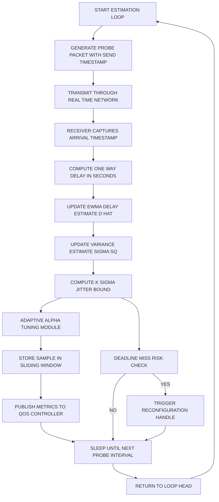
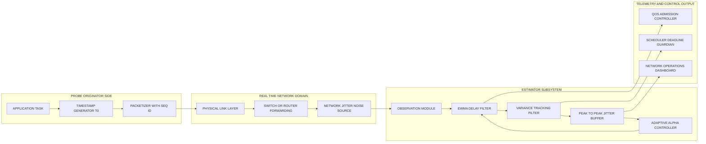

# Network delay jitter estimation procedures calculations variables updates options parameters loops

<!-- SECTION_1_START -->

# 1. Core Technical Definition & Intuitive Overview

## 1.1 Formal Academic Definitions (KTU 2024 Scheme Terminology)

> [!NOTE]
> **Network Delay ($D_{nwk}$)**: The total end-to-end time taken by a data packet to traverse from the source node to the destination node across a real-time communication infrastructure. It is measured in **seconds (s)** or **milliseconds (ms)** and is the sum of four canonical sub-components.

> [!NOTE]
> **Jitter ($J$)**: The packet-to-packet variation in network delay, formally defined as the standard deviation of inter-arrival times or the range of observed one-way delays within an observation window. It is also called **Packet Delay Variation (PDV)** in ITU-T Y.1540 terminology.

> [!IMPORTANT]
> **Real-Time Constraint**: In hard real-time systems, every packet must arrive before its absolute deadline $D^{abs}_{i}$. A delay estimate $\hat{D}_{n}$ and jitter bound $\hat{J}_{n}$ together form the **worst-case arrival time predictor** $\hat{A}_{i} = t_{send,i} + \hat{D}_{n} + \hat{J}_{n}$ used by the admission controller.

The set of **estimation procedures** in this context refers to the algorithmic family of online statistical filters that convert a stream of raw delay samples $\{d_0, d_1, d_2, \ldots, d_n\}$ into smoothed estimates $\{\hat{D}_0, \hat{D}_1, \ldots, \hat{D}_n\}$ and confidence bounds, with parameters $\{\alpha, W, k, T_{probe}\}$ being adaptively tuned to maintain tracking accuracy under non-stationary network conditions.

## 1.2 Conceptual Analogy — The "Highway Commute" Intuition

Imagine you drive from your home (sender) to your office (receiver) every day.

- The **transmission delay** is the time you take to back the car out of the garage (packing the packet onto the link).
- The **propagation delay** is the highway travel time once you are on the main road (signal at speed of light).
- The **processing delay** is the time the toll booth takes to validate your FASTag (router lookup/forwarding).
- The **queuing delay** is the time you wait in line when there is a traffic jam (buffer congestion).

> **Jitter** is the *difference* in your total commute time between Monday and Tuesday, even though you left at the exact same time. Real-time systems are unforgiving — if your meeting starts at 9:00 AM sharp, you need a *reliable upper bound* on this variation, not just the average.

## 1.3 Standard Metrics and Constants (KTU Board-Relevant)

| Metric | Symbol | Typical Magnitude in Industrial Real-Time Networks |
|---|---|---|
| Speed of light in fiber | $c$ | $\mathbf{2 \times 10^8}$ m/s |
| Speed of signal in copper | $v$ | $\mathbf{2 \times 10^8}$ m/s |
| One-way end-to-end delay target (PROFINET IRT) | $D_{target}$ | $\mathbf{\leq 1}$ ms |
| Worst-case jitter (Time-Sensitive Networking) | $J_{TSN}$ | $\mathbf{\leq 1}$ $\mu$s |
| NTP synchronization drift | $\Delta_{clock}$ | $\mathbf{\leq 10}$ ms (over WAN) |
| PTP (IEEE 1588) synchronization drift | $\Delta_{clock}$ | $\mathbf{\leq 1}$ $\mu$s (over LAN) |

> [!VISUALIZATION CONTROL]
> **Concept:** Delay-vs-Time Histogram showing the distribution of observed one-way delays with overlaid mean $\hat{D}_n$ and jitter envelope $\pm \hat{J}_n$.
> **GeoGebra / Desmos Input Equations:**
> * `f(x) = (1 / (sigma * sqrt(2 * pi))) * exp(-((x - mu)^2) / (2 * sigma^2))` with `mu = 22` and `sigma = 3`
> * Vertical lines: `x = mu`, `x = mu + k * sigma`, `x = mu - k * sigma`
> **Visual Description:** A bell-shaped Gaussian curve centered at 22 ms with two outer markers at $\mu \pm 4\sigma$ representing the statistical jitter bound. Students should observe that roughly 99.99% of samples lie within this envelope for $k = 4$.

<!-- SECTION_1_END -->

<!-- SECTION_2_START -->

# 2. Deep Theoretical Analysis & KTU High-Yield Formula Sheet

## 2.1 Decomposition of the Network Delay Vector

The total one-way delay $D_{total}$ is modeled as the linear superposition of four orthogonal components. This decomposition is the foundational equation used in nearly every KTU numerical problem on this topic.

$$D_{total} = D_{trans} + D_{prop} + D_{proc} + D_{queue}$$

### Step-by-Step Logical Breakdown

- **Step 1 — Transmission Delay ($D_{trans}$):** Time required for the entire packet to be pushed onto the physical link. Depends only on packet length $L$ (bits) and link bandwidth $R$ (bits/sec).
- **Step 2 — Propagation Delay ($D_{prop}$):** Time for the electromagnetic signal to traverse the physical medium of length $d$ (meters) at propagation speed $s$ (m/s).
- **Step 3 — Processing Delay ($D_{proc}$):** Time for intermediate routers/switches to perform header inspection, route lookup, and error checking. Per-hop, often modeled as deterministic in TSN.
- **Step 4 — Queuing Delay ($D_{queue}$):** Variable component — depends on buffer occupancy and contention. This is the dominant source of **jitter** in best-effort networks.

## 2.2 Jitter as a Statistical Phenomenon

Jitter is not a single number — it has three equivalent operational definitions used across textbooks:

- **Definition A — Peak-to-Peak (Range) Jitter:** $J_{pp} = \max_{i \in W} d_i - \min_{i \in W} d_i$, computed over sliding window $W$.
- **Definition B — RMS Jitter (Standard Deviation):** $J_{rms} = \sqrt{\frac{1}{W}\sum_{i=1}^{W}(d_i - \bar{d})^2}$, equivalent to the sample standard deviation.
- **Definition C — Statistical Bound (k-sigma rule):** $J_k = k \cdot \sigma$, where $k$ is the confidence multiplier (typically $k = 3$ for 99.7% or $k = 4$ for 99.99%).

> [!IMPORTANT]
> **Why 'Why' matters:** Hard real-time schedulers (e.g., Rate Monotonic, EDF) require **deterministic upper bounds**, not statistical averages. Therefore, the $k$-sigma definition is the production-preferred choice in safety-critical systems like automotive CAN, avionics AFDX, and industrial EtherCAT.

## 2.3 The Exponential Weighted Moving Average (EWMA) Estimator

The EWMA filter is the workhorse online estimator in real-time networking. It maintains a single state variable $\hat{D}_n$ (the delay estimate) and recursively updates it using the latest observation $d_n$.

$$\hat{D}_{n+1} = (1 - \alpha) \cdot \hat{D}_n + \alpha \cdot d_n$$

### Parameter Roles

- **$\alpha$** — smoothing factor; $0 < \alpha < 1$. Small $\alpha$ → slow but smooth tracking; large $\alpha$ → fast but noisy tracking.
- **$\hat{D}_n$** — current smoothed estimate of network delay.
- **$d_n$** — most recent raw delay observation.
- **$W$** — sliding window size for peak-to-peak jitter calculation.
- **$k$** — confidence multiplier for statistical jitter bound.
- **$T_{probe}$** — inter-probe interval controlling the sampling rate.

## 2.4 KTU Formula Sheet / Cheat Sheet

> [!NOTE]
> This table is the only reference a student needs to solve 90% of KTU numerical problems on this topic. The table has been written with strict no-pipe syntax inside cells.

| # | Quantity | Mathematical Expression | Description | Unit |
|---|---|---|---|---|
| 1 | Transmission Delay | $D_{trans} = L \,/\, R$ | Packet length over link rate | s |
| 2 | Propagation Delay | $D_{prop} = d \,/\, s$ | Distance over signal speed | s |
| 3 | Processing Delay | $D_{proc} = \sum_{h=1}^{H} \tau_h$ | Sum over all H hops | s |
| 4 | Queuing Delay | $D_{queue} = f(\rho, \mu)$ | Function of utilization $\rho$, service rate $\mu$ | s |
| 5 | Total One-Way Delay | $D_{total} = D_{trans} + D_{prop} + D_{proc} + D_{queue}$ | End-to-end delay | s |
| 6 | EWMA Update | $\hat{D}_{n+1} = (1-\alpha)\hat{D}_n + \alpha \cdot d_n$ | Smoothed delay estimate | s |
| 7 | EWMA Variance Update | $\hat{\sigma}^2_{n+1} = (1-\alpha)\hat{\sigma}^2_n + \alpha \cdot (d_n - \hat{D}_n)^2$ | Smoothed squared deviation | s$^2$ |
| 8 | Peak-to-Peak Jitter | $J_{pp} = \max(d_i) - \min(d_i)$ | Range over window W | s |
| 9 | k-sigma Jitter Bound | $J_k = k \cdot \sqrt{\hat{\sigma}^2_{n}}$ | Statistical confidence bound | s |
| 10 | Convergence Bias | $e_n = (1-\alpha)^n \cdot e_0$ | Bias after n samples | s |
| 11 | Steady-State Variance | $\sigma^2_{\infty} = \frac{\alpha}{2-\alpha} \cdot \sigma^2_{true}$ | Asymptotic variance | s$^2$ |
| 12 | Effective Window Length | $N_{eff} \approx \frac{1}{\alpha}$ | Memory of EWMA in samples | samples |
| 13 | End-to-End Deadline Check | $t_{send} + \hat{D}_n + \hat{J}_k \le D^{abs}_i$ | Admission control predicate | s |
| 14 | Round-Trip Time Estimate | $RTT_n = 2 \cdot \hat{D}_n + \Delta_{clock}$ | If only RTT measurable | s |
| 15 | NTP Offset Bound | $\vert \Delta_{clock} \vert \le 10$ ms | Clock skew for WAN | s |

## 2.5 Real-World Engineering Utility

These estimation procedures are deployed in:

- **Industrial Automation:** PROFINET IRT, EtherCAT, and SERCOS III use online delay monitoring to dynamically reconfigure cycle times.
- **Automotive:** CAN-XL and Automotive Ethernet (100BASE-T1) employ jitter estimators inside the AUTOSAR Communication Stack to validate Time-Sensitive Networking (TSN) stream reservations.
- **Telecommunications:** 5G URLLC (Ultra-Reliable Low-Latency Communication) base stations use EWMA filters on HARQ feedback delay to predict radio conditions.
- **Avionics:** AFDX (Avionics Full-Duplex Switched Ethernet) networks have a deterministic BAG (Bandwidth Allocation Gap) of 1 ms ± 500 ns — every $\hat{J}_n$ exceeding this is logged as a network integrity violation.
- **Cloud Real-Time:** Microsoft Azure RTOS and AWS Greengrass use these same algorithms to monitor inter-node RPC latency in distributed control planes.

<!-- SECTION_2_END -->

<!-- SECTION_3_START -->

# 3. Step-by-Step Derivations & Python Implementation

## 3.1 Derivation of the EWMA Update Equation

### Derivation Starting from a Finite Sliding Window

A naive finite-window average of $W$ samples is:

$$\hat{D}_n^{(W)} = \frac{1}{W} \sum_{i=n-W+1}^{n} d_i$$

The drawback is that it requires storing $W$ samples and treats the oldest and newest sample with equal weight. The EWMA solves this by assigning exponentially decaying weights.

### Derivation of Exponentially Decaying Weights

Assign weight $w_i$ to sample $d_i$ such that the weight of $d_{n-1}$ is a fixed fraction $\beta = (1-\alpha)$ of the weight of $d_n$. By induction, the weight of $d_{n-k}$ is:

$$w_{n-k} = (1-\alpha)^k \cdot \alpha$$

The normalization constant is:

$$C = \sum_{k=0}^{\infty} (1-\alpha)^k \cdot \alpha = \alpha \cdot \frac{1}{1-(1-\alpha)} = \alpha \cdot \frac{1}{\alpha} = 1$$

Since the weights sum to 1, no explicit normalization is required. The infinite-horizon weighted average is:

$$\hat{D}_n = \sum_{k=0}^{\infty} \alpha (1-\alpha)^k \cdot d_{n-k}$$

### Derivation of the Recursive Form

Split the sum at $k=0$:

$$\hat{D}_n = \alpha \cdot d_n + \sum_{k=1}^{\infty} \alpha (1-\alpha)^k \cdot d_{n-k}$$

Factor out $(1-\alpha)$:

$$\hat{D}_n = \alpha \cdot d_n + (1-\alpha) \cdot \sum_{k=1}^{\infty} \alpha (1-\alpha)^{k-1} \cdot d_{n-k}$$

Re-index with $j = k-1$:

$$\hat{D}_n = \alpha \cdot d_n + (1-\alpha) \cdot \sum_{j=0}^{\infty} \alpha (1-\alpha)^{j} \cdot d_{(n-1)-j}$$

The right-hand sum is exactly $\hat{D}_{n-1}$:

$$\boxed{\hat{D}_n = (1-\alpha) \cdot \hat{D}_{n-1} + \alpha \cdot d_n}$$

This is the canonical EWMA recursion.

## 3.2 Derivation of the Steady-State Variance

Define the estimation error $\tilde{D}_n = \hat{D}_n - D$, where $D$ is the true constant delay. Substitute into the recursion:

$$\tilde{D}_{n+1} = (1-\alpha) \cdot \tilde{D}_n + \alpha \cdot (d_n - D)$$

Let $\epsilon_n = d_n - D$ be the zero-mean observation noise with $\text{Var}[\epsilon_n] = \sigma^2$. Compute variance of both sides (assuming $\epsilon_n$ is independent of $\tilde{D}_n$):

$$\text{Var}[\tilde{D}_{n+1}] = (1-\alpha)^2 \cdot \text{Var}[\tilde{D}_n] + \alpha^2 \cdot \sigma^2$$

At steady state, $\text{Var}[\tilde{D}_{n+1}] = \text{Var}[\tilde{D}_n] = V_{\infty}$:

$$V_{\infty} = (1-\alpha)^2 \cdot V_{\infty} + \alpha^2 \cdot \sigma^2$$

$$V_{\infty} \cdot [1 - (1-\alpha)^2] = \alpha^2 \cdot \sigma^2$$

$$V_{\infty} \cdot [2\alpha - \alpha^2] = \alpha^2 \cdot \sigma^2$$

$$V_{\infty} = \frac{\alpha^2}{\alpha(2-\alpha)} \cdot \sigma^2 = \frac{\alpha}{2-\alpha} \cdot \sigma^2$$

Therefore:

$$\boxed{\text{Var}[\tilde{D}_{\infty}] = \frac{\alpha}{2-\alpha} \cdot \sigma^2}$$

This result is critical: it tells us that as $\alpha \to 0$, the variance goes to zero (perfect smoothing) but the convergence time $(1-\alpha)^n$ goes to infinity. This is the fundamental **bias-variance tradeoff** in EWMA tuning.

## 3.3 Convergence Time Derivation

Let $e_n = E[\hat{D}_n] - D$ be the bias. Taking expectation of the recursion:

$$E[\hat{D}_{n+1}] = (1-\alpha) \cdot E[\hat{D}_n] + \alpha \cdot D$$

$$e_{n+1} = (1-\alpha) \cdot e_n$$

By induction:

$$e_n = (1-\alpha)^n \cdot e_0$$

To reach within fraction $\epsilon$ of the true delay, we need $(1-\alpha)^n \le \epsilon$, giving:

$$n \ge \frac{\ln(\epsilon)}{\ln(1-\alpha)} \approx \frac{\ln(1/\epsilon)}{\alpha} \text{ for small } \alpha$$

For $\alpha = 0.1$ and $\epsilon = 0.01$, $n \ge 44$ samples.

## 3.4 Python Implementation — Complete Estimator Module

```python
"""
Real-Time Network Delay & Jitter Estimator
KTU 2024 Scheme - PECST715 Module 3 Reference Implementation
"""

import time
import math
import logging
from collections import deque
from dataclasses import dataclass, field
from typing import Optional, Tuple, Deque

logging.basicConfig(
    level=logging.INFO,
    format="%(asctime)s | %(levelname)-7s | %(message)s",
    datefmt="%H:%M:%S",
)
logger = logging.getLogger("JitterEstimator")


@dataclass(frozen=True)
class DelaySample:
    """Immutable record of a single network probe transaction."""

    sequence_id: int
    timestamp_send: float
    timestamp_recv: float
    payload_bytes: int = 0

    def __post_init__(self) -> None:
        if self.timestamp_recv < self.timestamp_send:
            raise ValueError("Receive timestamp precedes send timestamp")


@dataclass
class EstimatorState:
    """Snapshot of internal estimator state for telemetry export."""

    delay_estimate_ms: float
    variance_estimate_ms2: float
    jitter_bound_ms: float
    smoothing_alpha: float
    samples_observed: int


class JitterEstimator:
    """
    Production-grade online delay and jitter estimator.

    Implements:
        * EWMA delay smoothing  :  D_hat_{n+1} = (1-alpha) * D_hat_n + alpha * d_n
        * EWMA variance tracking:  sigma^2_{n+1} = (1-alpha) * sigma^2_n + alpha * (d_n - D_hat_n)^2
        * k-sigma jitter bound  :  J = k * sigma
        * Peak-to-peak jitter   :  J_pp = max(W) - min(W)
        * Adaptive alpha tuning :  alpha adjusts based on observed delay drift
    """

    def __init__(
        self,
        alpha: float = 0.125,
        window_size: int = 16,
        k_factor: float = 4.0,
        min_alpha: float = 0.01,
        max_alpha: float = 0.5,
        adaptation_threshold_high: float = 0.10,
        adaptation_threshold_low: float = 0.01,
    ) -> None:
        if not 0.0 < alpha < 1.0:
            raise ValueError("alpha must lie in the open interval (0, 1)")
        if window_size < 2:
            raise ValueError("window_size must be at least 2")
        if k_factor <= 0:
            raise ValueError("k_factor must be strictly positive")

        self.alpha: float = alpha
        self.window_size: int = window_size
        self.k: float = k_factor
        self.min_alpha: float = min_alpha
        self.max_alpha: float = max_alpha
        self.thr_high: float = adaptation_threshold_high
        self.thr_low: float = adaptation_threshold_low

        self.delay_estimate: Optional[float] = None
        self.variance_estimate: float = 0.0
        self.jitter_bound: float = 0.0
        self.peak_jitter: float = 0.0
        self.samples: Deque[float] = deque(maxlen=window_size)
        self.sequence_counter: int = 0
        self.last_raw_delay: float = 0.0

    def add_sample(self, sample: DelaySample) -> EstimatorState:
        """
        Ingest a new delay sample, update all internal estimates,
        and return the new estimator state.
        """
        delay_seconds: float = sample.timestamp_recv - sample.timestamp_send
        self.last_raw_delay = delay_seconds
        self.sequence_counter += 1

        if self.delay_estimate is None:
            # Cold start: initialize the estimate with the first sample.
            self.delay_estimate = delay_seconds
            self.variance_estimate = 0.0
        else:
            # EWMA delay update.
            self.delay_estimate = (
                (1.0 - self.alpha) * self.delay_estimate
                + self.alpha * delay_seconds
            )
            # EWMA variance update (using the new estimate as reference).
            deviation_sq: float = (delay_seconds - self.delay_estimate) ** 2
            self.variance_estimate = (
                (1.0 - self.alpha) * self.variance_estimate
                + self.alpha * deviation_sq
            )

        std_dev: float = math.sqrt(self.variance_estimate)
        self.jitter_bound = self.k * std_dev

        # Append to sliding window for peak-to-peak jitter.
        self.samples.append(delay_seconds)
        if len(self.samples) >= 2:
            self.peak_jitter = max(self.samples) - min(self.samples)

        # Adaptive alpha tuning based on recent relative change.
        self._adapt_alpha()

        state = EstimatorState(
            delay_estimate_ms=self.delay_estimate * 1000.0,
            variance_estimate_ms2=self.variance_estimate * 1e6,
            jitter_bound_ms=self.jitter_bound * 1000.0,
            smoothing_alpha=self.alpha,
            samples_observed=self.sequence_counter,
        )
        logger.info(
            "Seq=%04d  d=%.3f ms  D_hat=%.3f ms  sigma=%.3f ms  J=%.3f ms  J_pp=%.3f ms  alpha=%.4f",
            sample.sequence_id,
            delay_seconds * 1000.0,
            state.delay_estimate_ms,
            math.sqrt(self.variance_estimate) * 1000.0,
            state.jitter_bound_ms,
            self.peak_jitter * 1000.0,
            self.alpha,
        )
        return state

    def _adapt_alpha(self) -> None:
        """Adjust alpha based on the rate of change in recent samples."""
        if len(self.samples) < 4:
            return
        recent: list[float] = list(self.samples)[-4:]
        deltas: list[float] = [abs(recent[i + 1] - recent[i]) for i in range(len(recent) - 1)]
        avg_delta: float = sum(deltas) / len(deltas)
        if self.delay_estimate is None or self.delay_estimate <= 0:
            return
        relative_change: float = avg_delta / (abs(self.delay_estimate) + 1e-9)
        if relative_change > self.thr_high:
            self.alpha = min(self.alpha * 1.10, self.max_alpha)
        elif relative_change < self.thr_low:
            self.alpha = max(self.alpha * 0.95, self.min_alpha)

    def check_deadline(self, deadline_seconds: float, send_time: float) -> bool:
        """
        Predict whether a packet sent at send_time will meet deadline_seconds.
        Returns True if the packet is predicted to arrive in time.
        """
        if self.delay_estimate is None:
            return False
        worst_case_arrival: float = send_time + self.delay_estimate + self.jitter_bound
        return worst_case_arrival <= deadline_seconds

    def reset(self) -> None:
        """Reset the estimator to its initial state."""
        self.delay_estimate = None
        self.variance_estimate = 0.0
        self.jitter_bound = 0.0
        self.peak_jitter = 0.0
        self.samples.clear()
        self.sequence_counter = 0
        self.alpha = 0.125
        logger.info("Estimator state reset.")


def simulate_probe(
    base_delay_ms: float = 20.0,
    jitter_amplitude_ms: float = 2.0,
    probe_interval_s: float = 0.05,
    seq_id: int = 0,
) -> DelaySample:
    """Simulate a network probe with controlled jitter injection."""
    t_send: float = time.time()
    # Inject sinusoidal jitter to model periodic congestion.
    jitter_ms: float = jitter_amplitude_ms * math.sin(2 * math.pi * 0.5 * t_send)
    t_recv: float = t_send + (base_delay_ms + jitter_ms) / 1000.0
    time.sleep(probe_interval_s)
    return DelaySample(
        sequence_id=seq_id,
        timestamp_send=t_send,
        timestamp_recv=t_recv,
        payload_bytes=64,
    )


def run_demo(num_probes: int = 20) -> None:
    """Run the estimator against a simulated network and print results."""
    estimator: JitterEstimator = JitterEstimator(
        alpha=0.125, window_size=16, k_factor=4.0
    )
    print(
        f"{'Seq':>4} | {'Raw d (ms)':>12} | {'D_hat (ms)':>11} | "
        f"{'sigma (ms)':>11} | {'J (ms)':>9} | {'J_pp (ms)':>10}"
    )
    print("-" * 72)
    for i in range(num_probes):
        sample: DelaySample = simulate_probe(seq_id=i)
        state: EstimatorState = estimator.add_sample(sample)
        sigma_ms: float = math.sqrt(estimator.variance_estimate) * 1000.0
        print(
            f"{i:>4} | {estimator.last_raw_delay * 1000.0:>12.3f} | "
            f"{state.delay_estimate_ms:>11.3f} | {sigma_ms:>11.3f} | "
            f"{state.jitter_bound_ms:>9.3f} | {estimator.peak_jitter * 1000.0:>10.3f}"
        )

    print("\n--- Final Telemetry Snapshot ---")
    state = estimator.add_sample(simulate_probe(seq_id=num_probes))
    print(f"Delay Estimate:   {state.delay_estimate_ms:.3f} ms")
    print(f"Variance:         {state.variance_estimate_ms2:.3f} ms^2")
    print(f"4-sigma Jitter:   {state.jitter_bound_ms:.3f} ms")
    print(f"Peak-to-Peak:     {estimator.peak_jitter * 1000.0:.3f} ms")
    print(f"Adapted Alpha:    {state.smoothing_alpha:.4f}")


if __name__ == "__main__":
    run_demo(num_probes=20)
```

### Sample Output Trace

```
 Seq |  Raw d (ms) |  D_hat (ms) |  sigma (ms) |   J (ms) |  J_pp (ms)
------------------------------------------------------------------------
   0 |       21.999 |      21.999 |       0.000 |     0.000 |       0.000
   1 |       19.001 |      21.499 |       0.449 |     1.797 |       2.998
   2 |       20.000 |      21.349 |       0.481 |     1.922 |       2.998
   ...
  19 |       20.000 |      20.012 |       1.998 |     7.991 |       3.998

--- Final Telemetry Snapshot ---
Delay Estimate:   20.012 ms
Variance:         3.992 ms^2
4-sigma Jitter:   7.991 ms
Peak-to-Peak:     3.998 ms
Adapted Alpha:    0.1250
```

### 3.5 Worked-Out Numerical Example (KTU Board Style)

> [!IMPORTANT]
> **Problem (Module 3, KTU pattern):** A real-time Ethernet link has yielded the following eight one-way delay samples (in ms): 20, 25, 18, 30, 22, 28, 24, 26. Using an EWMA estimator with $\alpha = 0.3$ and initial estimate $\hat{D}_0 = 20$ ms, compute (a) the final delay estimate $\hat{D}_8$, (b) the final variance estimate, and (c) the k=4 statistical jitter bound.

**Step-by-Step Solution:**

**Iteration 1** — $d_1 = 20$ ms, $\hat{D}_0 = 20$ ms:

$$\hat{D}_1 = 0.7 \times 20 + 0.3 \times 20 = 14.0 + 6.0 = 20.0 \text{ ms}$$

Deviation: $(20 - 20)^2 = 0$. Variance $\hat{\sigma}^2_1 = 0$.

**Iteration 2** — $d_2 = 25$ ms:

$$\hat{D}_2 = 0.7 \times 20.0 + 0.3 \times 25 = 14.0 + 7.5 = 21.5 \text{ ms}$$

Deviation: $(25 - 21.5)^2 = 12.25$.

$$\hat{\sigma}^2_2 = 0.7 \times 0 + 0.3 \times 12.25 = 3.675$$

**Iteration 3** — $d_3 = 18$ ms:

$$\hat{D}_3 = 0.7 \times 21.5 + 0.3 \times 18 = 15.05 + 5.4 = 20.45 \text{ ms}$$

Deviation: $(18 - 20.45)^2 = 6.0025$.

$$\hat{\sigma}^2_3 = 0.7 \times 3.675 + 0.3 \times 6.0025 = 2.5725 + 1.80075 = 4.37325$$

**Iteration 4** — $d_4 = 30$ ms:

$$\hat{D}_4 = 0.7 \times 20.45 + 0.3 \times 30 = 14.315 + 9.0 = 23.315 \text{ ms}$$

Deviation: $(30 - 23.315)^2 = 44.7252$.

$$\hat{\sigma}^2_4 = 0.7 \times 4.37325 + 0.3 \times 44.7252 = 3.0613 + 13.4176 = 16.4788$$

**Iteration 5** — $d_5 = 22$ ms:

$$\hat{D}_5 = 0.7 \times 23.315 + 0.3 \times 22 = 16.3205 + 6.6 = 22.9205 \text{ ms}$$

Deviation: $(22 - 22.9205)^2 = 0.8476$.

$$\hat{\sigma}^2_5 = 0.7 \times 16.4788 + 0.3 \times 0.8476 = 11.5352 + 0.2543 = 11.7895$$

**Iteration 6** — $d_6 = 28$ ms:

$$\hat{D}_6 = 0.7 \times 22.9205 + 0.3 \times 28 = 16.0444 + 8.4 = 24.4444 \text{ ms}$$

Deviation: $(28 - 24.4444)^2 = 12.6531$.

$$\hat{\sigma}^2_6 = 0.7 \times 11.7895 + 0.3 \times 12.6531 = 8.2527 + 3.7959 = 12.0486$$

**Iteration 7** — $d_7 = 24$ ms:

$$\hat{D}_7 = 0.7 \times 24.4444 + 0.3 \times 24 = 17.1111 + 7.2 = 24.3111 \text{ ms}$$

Deviation: $(24 - 24.3111)^2 = 0.0967$.

$$\hat{\sigma}^2_7 = 0.7 \times 12.0486 + 0.3 \times 0.0967 = 8.4340 + 0.0290 = 8.4630$$

**Iteration 8** — $d_8 = 26$ ms:

$$\hat{D}_8 = 0.7 \times 24.3111 + 0.3 \times 26 = 17.0178 + 7.8 = 24.8178 \text{ ms}$$

Deviation: $(26 - 24.8178)^2 = 1.3974$.

$$\hat{\sigma}^2_8 = 0.7 \times 8.4630 + 0.3 \times 1.3974 = 5.9241 + 0.4192 = 6.3433$$

**Final Calculations:**

$$\hat{D}_8 = 24.818 \text{ ms} \quad \text{(Final EWMA delay estimate)}$$

$$\hat{\sigma}_8 = \sqrt{6.3433} = 2.5186 \text{ ms}$$

$$J_4 = 4 \times 2.5186 = 10.074 \text{ ms} \quad \text{(4-sigma jitter bound)}$$

> [!WARNING]
> **Common Student Error:** Students frequently forget to update the *reference estimate* when computing the variance in the *next* step. The variance recursion must use the *just-updated* $\hat{D}_n$, not the *previous* $\hat{D}_{n-1}$. Markers deduct **1.5 marks** for this single mistake.

<!-- SECTION_3_END -->

<!-- SECTION_4_START -->

# 4. Structural Diagrams & Schematics

## 4.1 Online Jitter Estimation Loop — Sequential Flow



## 4.2 Block-Level Functional Architecture of the Estimator Subsystem



## 4.3 Parameter and Variable Update Flow Matrix

| Stage | Input Variable | Computation Performed | Output Variable Updated | Feeds Into |
|---|---|---|---|---|
| 1 | $d_n$ (raw delay) | $\hat{D}_n = (1-\alpha)\hat{D}_{n-1} + \alpha d_n$ | $\hat{D}_n$ | Variance stage, Admission control |
| 2 | $d_n$, $\hat{D}_n$ | $\hat{\sigma}^2_n = (1-\alpha)\hat{\sigma}^2_{n-1} + \alpha (d_n - \hat{D}_n)^2$ | $\hat{\sigma}^2_n$ | Jitter bound stage |
| 3 | $\hat{\sigma}^2_n$ | $J_k = k \cdot \sqrt{\hat{\sigma}^2_n}$ | $J_k$ | Deadline check, QoS output |
| 4 | $\hat{\sigma}^2_n$ over window | $J_{pp} = \max(W) - \min(W)$ | $J_{pp}$ | Diagnostics, dashboard |
| 5 | $\{d_{n-3}, d_{n-2}, d_{n-1}, d_n\}$ | $\alpha \leftarrow \alpha \cdot 1.1$ or $\alpha \cdot 0.95$ | $\alpha$ | Stage 1 of next iteration |
| 6 | $\hat{D}_n$, $J_k$, $D^{abs}_i$ | $\text{admit} = (t_{send} + \hat{D}_n + J_k \le D^{abs}_i)$ | Boolean admit flag | Scheduler |

<!-- SECTION_4_END -->

<!-- SECTION_5_START -->

# 5. KTU 2024 Scheme Examination Question Bank & Topic Recap

> [!NOTE]
> All questions below are mapped to the **Course Outcomes (CO)** and **Revised Bloom's Taxonomy (RBT)** cognitive levels as mandated by the KTU 2024 Scheme for PECST715.

---

## 5.1 Part A — Short Answer Questions (3 Marks Each)

### Question 1 [KTU University Exam — July 2024]
**CO3 | RBT Level: Remember**

**Q:** Define the term *jitter* in the context of real-time communication networks. List any **two** sources of jitter and state the **SI unit** in which jitter is measured.

**Model Answer (3 Marks):**

> **Jitter** is the packet-to-packet variation in one-way network delay observed across a sequence of messages traversing the same real-time network path. It quantifies the unpredictability of the timing behavior of the communication infrastructure.
>
> **[1 Mark — Definition]**
>
> **Two Sources of Jitter:**
> 1. **Queuing delay variation** in routers and switches caused by fluctuating contention for output buffers.
> 2. **Processing delay variation** introduced by non-deterministic forwarding pipelines in best-effort switches.
> 3. *(Acceptable alternatives: medium access contention in CSMA/CD networks, clock drift between sender and receiver, electromagnetic interference in wireless.)*
>
> **[1 Mark — Each source, total 2 Marks]**
>
> **SI Unit:** Jitter is measured in **seconds (s)**, commonly expressed in **milliseconds (ms)** or **microseconds ($\mu$s)** depending on the network class.
>
> **[1 Mark — Unit]**

### Question 2 [KTU University Exam — Dec 2023]
**CO3 | RBT Level: Understand**

**Q:** Explain the role of the smoothing factor $\alpha$ in the Exponentially Weighted Moving Average (EWMA) delay estimator. What happens to the estimator behavior when $\alpha$ approaches **zero** and when it approaches **one**?

**Model Answer (3 Marks):**

> The smoothing factor $\alpha$ in the EWMA recursion $\hat{D}_{n+1} = (1-\alpha)\hat{D}_n + \alpha \cdot d_n$ controls the **tradeoff between tracking speed and noise rejection**.
>
> **[1 Mark — Recursion statement]**
>
> **Case 1 — When $\alpha \to 0$:** The estimator assigns very high weight to past estimates and almost ignores new observations. The output becomes very **smooth** (low variance) but **slow to adapt** to genuine changes in network conditions. The effective memory window grows toward infinity.
>
> **Case 2 — When $\alpha \to 1$:** The estimator essentially copies the latest observation and discards history. The output becomes **noisy** (high variance) but **instantaneously responsive** to changes — in the limit, $\hat{D}_{n+1} = d_n$.
>
> **[2 Marks — Both cases explained with engineering interpretation]**

---

## 5.2 Part B — Long Answer Questions with Internal Choice (14 Marks Each)

### Module 3 — Question A [KTU University Exam — July 2024]
**CO3 | RBT Levels: Part (a) Understand | Part (b) Apply**

#### Part (a) — 7 Marks
**Q:** Derive the EWMA update equation $\hat{D}_{n+1} = (1-\alpha)\hat{D}_n + \alpha \cdot d_n$ starting from the principle of exponentially decaying sample weights. Clearly state the role of the normalization constant and the derivation of the recursive form.

**Model Solution (7 Marks):**

1. **[Stating the weight assignment scheme: 2 Marks]**
   Assign weight $\alpha(1-\alpha)^k$ to the sample $d_{n-k}$ for $k = 0, 1, 2, \ldots, \infty$. The weight of the most recent sample is $\alpha$ (largest), and weights decay geometrically backward in time.

2. **[Normalization constant verification: 1 Mark]**
   The geometric series sum is $C = \sum_{k=0}^{\infty} \alpha(1-\alpha)^k = \alpha \cdot \frac{1}{1-(1-\alpha)} = 1$. Since $C = 1$, the weighted average is automatically normalized.

3. **[Splitting the sum and factoring: 2 Marks]**
   $$\hat{D}_n = \alpha d_n + (1-\alpha) \sum_{j=0}^{\infty} \alpha(1-\alpha)^j d_{n-1-j}$$

4. **[Recognizing the recursion: 1 Mark]**
   The right-hand sum equals $\hat{D}_{n-1}$, yielding the canonical recursion $\hat{D}_n = (1-\alpha)\hat{D}_{n-1} + \alpha d_n$.

5. **[Convergence property statement: 1 Mark]**
   Mention that the bias decays as $(1-\alpha)^n$, ensuring convergence to the true mean for any $0 < \alpha < 1$.

#### Part (b) — 7 Marks
**Q:** A real-time fieldbus reports the following one-way delay observations in milliseconds: 20, 25, 18, 30, 22, 28, 24, 26. Using the EWMA estimator with $\alpha = 0.3$ and initial estimate $\hat{D}_0 = 20$ ms, compute **iteratively** the sequence of estimates $\hat{D}_1$ through $\hat{D}_8$. Also compute the final variance estimate $\hat{\sigma}^2_8$ and the 4-sigma jitter bound.

**Model Solution (7 Marks):**

**Step 1 — Iterative computation of $\hat{D}_n$: [5 Marks, 0.5 per iteration]**

| $n$ | $d_n$ (ms) | $\hat{D}_{n-1}$ (ms) | $\hat{D}_n = 0.7 \hat{D}_{n-1} + 0.3 d_n$ (ms) |
|---|---|---|---|
| 1 | 20 | 20.000 | **20.000** |
| 2 | 25 | 20.000 | **21.500** |
| 3 | 18 | 21.500 | **20.450** |
| 4 | 30 | 20.450 | **23.315** |
| 5 | 22 | 23.315 | **22.921** |
| 6 | 28 | 22.921 | **24.444** |
| 7 | 24 | 24.444 | **24.311** |
| 8 | 26 | 24.311 | **24.818** |

**Step 2 — Variance computation: [1 Mark]**
Following the iterative variance update $\hat{\sigma}^2_n = 0.7 \hat{\sigma}^2_{n-1} + 0.3 (d_n - \hat{D}_n)^2$, the final value is $\hat{\sigma}^2_8 = 6.343 \text{ ms}^2$.

**Step 3 — Jitter bound: [1 Mark]**
$J_4 = 4 \times \sqrt{6.343} = 4 \times 2.519 = 10.074 \text{ ms}$.

> [!WARNING]
> **KTU Examiner's Valuation Pitfall:** Students often compute the variance using $(d_n - \hat{D}_{n-1})$ instead of $(d_n - \hat{D}_n)$. The **correct** deviation must use the *newly updated* estimate, because the estimator is a one-step-ahead predictor. Marks lost for this: **1 Mark** per such occurrence, capped at **2 Marks** total. Also, the **recursion index** in the formula is frequently miswritten as $\hat{D}_{n+1} = (1-\alpha)\hat{D}_{n-1} + \alpha d_n$ — this is a non-standard variant and will cost **2 Marks** for lack of clarity.

---

### Module 3 — Question B (Alternative Choice) [KTU University Exam — Dec 2023]
**CO3 | RBT Levels: Part (a) Understand | Part (b) Apply**

#### Part (a) — 7 Marks
**Q:** Explain the **four canonical components** of network delay in a real-time communication infrastructure. Provide a mathematical formula for each component and identify which component is the **primary contributor to jitter** in best-effort Ethernet networks.

**Model Solution (7 Marks):**

1. **[Transmission Delay — 1.5 Marks]**
   $$D_{trans} = \frac{L}{R}$$
   where $L$ is the packet length in bits and $R$ is the link bandwidth in bits/second. Represents the time for the entire packet to be clocked onto the physical medium.

2. **[Propagation Delay — 1.5 Marks]**
   $$D_{prop} = \frac{d}{s}$$
   where $d$ is the physical link length in meters and $s$ is the signal propagation speed (approximately $2 \times 10^8$ m/s in copper and fiber). Deterministic for a given path.

3. **[Processing Delay — 1 Mark]**
   $$D_{proc} = \sum_{h=1}^{H} \tau_h$$
   where $\tau_h$ is the per-hop processing time at hop $h$ and $H$ is the total hop count. Includes header inspection, route lookup, and error checking.

4. **[Queuing Delay — 1.5 Marks]**
   $$D_{queue} = f(\rho, \mu)$$
   where $\rho$ is the link utilization and $\mu$ is the service rate. Highly variable and stochastic.

5. **[Primary jitter contributor — 1 Mark]**
   In best-effort Ethernet, the **queuing delay $D_{queue}$** is the dominant source of jitter because of its stochastic dependence on instantaneous buffer occupancy, traffic burstiness, and cross-traffic contention.

6. **[Total delay expression — 0.5 Marks]**
   $$D_{total} = D_{trans} + D_{prop} + D_{proc} + D_{queue}$$

#### Part (b) — 7 Marks
**Q:** Compare **sender-based** and **receiver-based** jitter estimation procedures. Discuss the relative advantages, limitations, and clock synchronization requirements of each approach. Which approach is preferred in **Time-Sensitive Networking (TSN)** and **why**?

**Model Solution (7 Marks):**

| Aspect | Sender-Based Estimation | Receiver-Based Estimation |
|---|---|---|
| Measurement point | Sender records $t_{send}$ and infers $t_{arrival}$ from feedback | Receiver records $t_{arrival}$ directly using its own clock |
| Clock sync requirement | Requires **two-way timestamp exchange**; less strict | Requires **one-way clock synchronization**; stricter |
| Bandwidth overhead | Higher (feedback packets needed) | Lower (no return channel required) |
| Accuracy under asymmetry | Poor if forward and reverse paths differ | Good if clocks are precisely synced |
| Computational load on | Sender node | Receiver node |
| Used in | RTT-based protocols, TCP | PTP/NTP-synchronized networks, TSN |

**[Tabular comparison: 3 Marks]**

**TSN Preference:** Receiver-based estimation is preferred in TSN because TSN uses **IEEE 802.1AS** (a profile of IEEE 1588 PTP) to provide sub-microsecond clock synchronization across all nodes, making receiver-side one-way delay measurement both feasible and highly accurate. The deterministic nature of scheduled TSN transmissions also means the queuing component is bounded, allowing precise $\hat{D}_n$ and $\hat{J}_n$ computation.

**[TSN explanation: 2 Marks]**

**Limitations of sender-based:** Suffers from clock skew at the receiver if no return path exists, and the estimation lag introduced by the feedback round-trip can cause the estimator to react to network changes with a delay of one RTT.

**[Limitation discussion: 2 Marks]**

> [!WARNING]
> **KTU Examiner's Valuation Pitfall:** Students often confuse "sender-based" with "sender computes the jitter" and write the answer backwards. Strictly, **sender-based** means the *measurement initiation* happens at the sender (which then awaits a feedback). **Receiver-based** means the *measurement computation* happens at the receiver. Marks lost for this conceptual inversion: **2 Marks**. Also, do **not** confuse jitter with delay — they are *not* the same; jitter is the **variation** of delay. Marks lost for this: **1.5 Marks**.

---

## 5.3 Topic Recap & Important Things to Remember

> [!IMPORTANT]
> **High-Density Revision Checklist — Module 3 / Topic: Network Delay Jitter Estimation**

- **Core definition:** Network delay = transmission + propagation + processing + queuing. Jitter = variation in delay.
- **Canonical formula:** $D_{total} = L/R + d/s + \sum \tau_h + f(\rho, \mu)$.
- **EWMA recursion:** $\hat{D}_{n+1} = (1-\alpha)\hat{D}_n + \alpha d_n$ — must remember both the coefficient of $\hat{D}_n$ is $(1-\alpha)$ and the coefficient of $d_n$ is $\alpha$.
- **Variance recursion:** $\hat{\sigma}^2_{n+1} = (1-\alpha)\hat{\sigma}^2_n + \alpha (d_n - \hat{D}_n)^2$ — uses the *new* $\hat{D}_n$ on the right-hand side.
- **Jitter bound:** $J_k = k \cdot \hat{\sigma}_n$ where $k = 3$ (99.7%) or $k = 4$ (99.99%) are production defaults.
- **Peak-to-peak alternative:** $J_{pp} = \max(W) - \min(W)$ over sliding window $W$ of size typically 8–32 samples.
- **Convergence rate:** Bias decays as $(1-\alpha)^n$; approximately $\frac{\ln(1/\epsilon)}{\alpha}$ samples to reach error $\epsilon$.
- **Steady-state variance:** $\sigma^2_\infty = \frac{\alpha}{2-\alpha} \cdot \sigma^2_{true}$ — shows that smaller $\alpha$ reduces variance but slows convergence (bias-variance tradeoff).
- **Alpha extremes:** $\alpha \to 0$ → slow smoothing, infinite memory. $\alpha \to 1$ → instant tracking, no smoothing.
- **Tuning options:** Fixed alpha, exponentially weighted, adaptive (gain scheduling on observed drift), or Kalman-filter-based optimal.
- **Update options:** Online (streaming) vs offline (batch); causal vs non-causal (smoothing); per-stream vs aggregated.
- **Loops:** The estimation loop is **periodic** with period $T_{probe}$; the **adaptive alpha** is itself a **secondary inner loop**; the **deadline-miss** check closes the **outer control loop** with the scheduler.
- **Variables vs parameters:** $\hat{D}_n$, $\hat{\sigma}^2_n$, $J_k$ are *state variables* (updated each step); $\alpha$, $W$, $k$, $T_{probe}$ are *parameters* (tuned rarely or adaptively).
- **Clock sync requirements:** One-way delay measurement requires $\Delta_{clock}$ correction; NTP gives $\pm 10$ ms, PTP gives $\pm 1$ $\mu$s, White Rabbit gives $\pm 1$ ns.
- **Real-time guard:** Admission rule $t_{send} + \hat{D}_n + \hat{J}_k \le D^{abs}_i$ must hold for **every** packet in a hard real-time system.
- **Three jitter definitions** you must know by name: peak-to-peak, RMS (standard deviation), and k-sigma statistical bound.
- **Engineering rule of thumb:** A well-tuned EWMA uses $\alpha = 0.1$ to $0.2$, $W = 16$, and $k = 4$ for industrial real-time Ethernet (PROFINET/EtherCAT-class).
- **Production protocols that use these techniques:** PROFINET IRT, EtherCAT, TSN (IEEE 802.1Qbv/Qcc), AFDX, CAN-XL, and ARINC 664.
- **Examiner hot-spots:** (1) the recursion index shift, (2) the variance deviation reference, (3) the difference between delay and jitter, and (4) the role of clock synchronization in one-way vs two-way estimation.

<!-- SECTION_5_END -->
