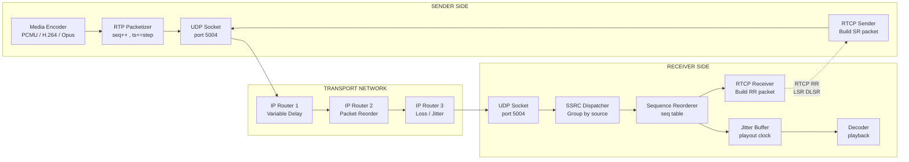
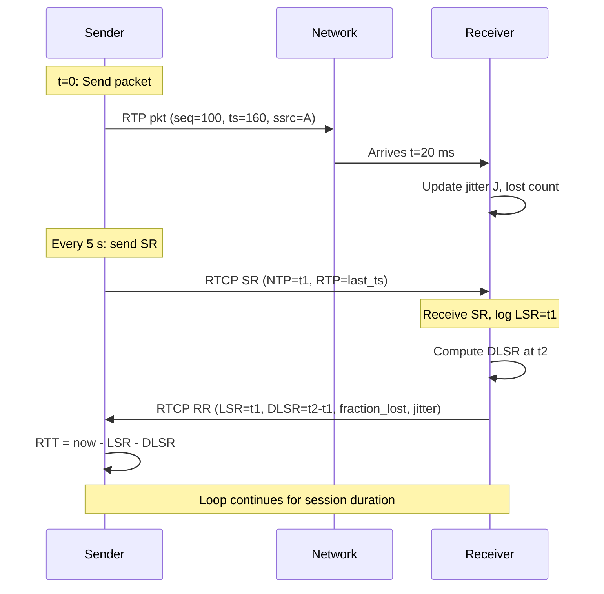
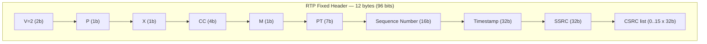

# Real-time transport protocol (RTP) packet synchronization tracking parameters configurations variables

<!-- SECTION_1_START -->
# Real-Time Transport Protocol (RTP) — Packet Synchronization, Tracking Parameters & Configuration Variables

## 1. Core Technical Definition & Intuitive Overview

### Formal Definition (KTU 2024 Syllabus Terminology)

> [!NOTE]
> **Real-time Transport Protocol (RTP):** An application-layer protocol defined in **IETF RFC 3550** that provides end-to-end network transport functions suitable for applications transmitting real-time data, such as audio, video, or simulation data, over multicast or unicast network services. RTP does **not** guarantee Quality of Service (QoS) or timely delivery — it merely supplies synchronization, sequencing, and payload-identification primitives that receivers use to reassemble streams.

> [!IMPORTANT]
> **RTP Packet Synchronization:** The receiver-side mechanism by which incoming RTP packets are re-ordered, time-aligned, and de-jittered using header fields such as the **sequence number** (for ordering), **RTP timestamp** (for media clock reconstruction), and **SSRC** (for source identification and stream separation).

### Intuitive Analogy — The International Courier Service

Imagine a courier company delivering a live concert recording to thousands of homes:

| Courier Concept | RTP Equivalent | Purpose |
|---|---|---|
| **Tracking number** on every parcel | **Sequence Number** (16-bit) | Detect loss and reorder parcels at destination |
| **Timestamp on shipment label** | **RTP Timestamp** (32-bit) | Reconstruct the original timeline of audio/video frames |
| **Sender's unique ID** | **SSRC** (32-bit identifier) | Identify the original source of the media stream |
| **Status report from recipient** | **RTCP Receiver Report (RR)** | Feedback to sender on jitter, loss, RTT |
| **Coordinator dispatching multiple trucks** | **RTP Mixer / Translator** | Combine or filter streams while preserving sync |

Just as a logistics manager needs three pieces of information per parcel (who, when, in what order) to reconstruct a coherent shipment, the receiver **must** extract the sequence number, RTP timestamp, and SSRC from every packet to reconstruct a media stream with correct **playout order** and **timing**.

### Key Architectural Properties

- **Transport:** Typically runs on top of **UDP** (no retransmissions — that would defeat real-time). Default port: **5004** for RTP, **5005** for RTCP.
- **Companion protocol:** **RTCP (RTP Control Protocol)** — runs alongside RTP providing periodic statistics.
- **Standard metrics:** Sequence number space is **$2^{16} = 65536$**, RTP timestamp wraps at **$2^{32}$**.

> [!VISUALIZATION CONTROL]
> **Concept:** RTP Media-Stream Synchronization Axes
> **GeoGebra / Desmos Input Equations:**
> * Point A = $(sequence\_number, 0)$ — discrete ordering axis
> * Point B = $(0, rtp\_timestamp)$ — continuous media-clock axis
> * Point C = $(sequence\_number, rtp\_timestamp)$ — 2D correlation point
> **Visual Description:** A scatter-plot where each received packet is plotted against its 16-bit sequence number (X) and its 32-bit RTP timestamp (Y). Diagonal clusters indicate a well-synchronized, evenly-spaced stream; horizontal/vertical gaps indicate packet loss or bursty arrival.
<!-- SECTION_1_END -->

<!-- SECTION_2_START -->
# 2. Deep Theoretical Analysis & KTU High-Yield Formula Sheet

## 2.1 The RTP Fixed Header — Field-by-Field Logic

The 12-byte minimum RTP header (with optional CSRC list) carries every synchronization primitive:

| Field | Bits | Function | Sync Role |
|---|---|---|---|
| `V` (Version) | 2 | Always `2` for RFC 3550 | Protocol identification |
| `P` (Padding) | 1 | Indicates padding octets at end | Skips filler bytes |
| `X` (Extension) | 1 | Header extension flag | Carries app-specific sync data |
| `CC` (CSRC count) | 4 | Number of CSRC identifiers (0–15) | Mixer composition tracking |
| `M` (Marker) | 1 | Frame boundary marker (e.g. video keyframe) | A/V sync hint |
| `PT` (Payload Type) | 7 | Codec identifier (e.g. 0=PCMU, 96=Dynamic) | Decoding lookup |
| `Sequence Number` | 16 | Increments by 1 per packet | **Loss detection + ordering** |
| `Timestamp` | 32 | Sampling instant of first octet | **Media-clock reconstruction** |
| `SSRC` | 32 | Synchronization source identifier | **Stream/source separation** |
| `CSRC [0..15]` | 32 each | Contributing sources (mixers) | Multi-source attribution |

> [!IMPORTANT]
> **Initial random selection rule:** The SSRC identifier *must* be chosen **randomly** at session start (RFC 3550 §8.1). Two sources must not pick the same SSRC within the same RTP session. This is the foundation of "tracking" — receivers group all packets sharing the same SSRC into one logical stream.

## 2.2 The RTCP Header — Five Packet Types

| Type | Abbrev. | Purpose | Sync Parameter |
|---|---|---|---|
| 200 | **SR** — Sender Report | Sender's stats for active transmission | NTP + RTP timestamps of last packet |
| 201 | **RR** — Receiver Report | Receiver's reception statistics | Loss, jitter, LSR, DLSR |
| 202 | **SDES** — Source Description | CNAME, NAME, EMAIL, TOOL | Persistent source identity |
| 203 | **BYE** | End of participation | Session shutdown |
| 204 | **APP** | Application-defined | Custom sync extensions |

## 2.3 KTU Formula Sheet — Critical Tracking Parameters

| # | Parameter | Formula / Definition | Unit / Range |
|---|---|---|---|
| 1 | **Sequence Number** | $seq = (seq + 1) \mod 2^{16}$ | $0$ to $65535$ (wraps) |
| 2 | **Cumulative Packets Lost** | $\text{cumulative\_lost} = \text{expected} - \text{received}$ | Integer $\geq 0$ |
| 3 | **Fraction Lost** | $\text{fraction\_lost} = \dfrac{\text{lost}}{\text{expected}} \times 256$ | 8-bit fixed point $[0, 255]$ |
| 4 | **Interarrival Jitter (RFC 3550)** | $D(i,j) = \vert (R_j - R_i) - (S_j - S_i) \vert$ ; $J = J + \dfrac{\vert D \vert - J}{16}$ | 32-bit unsigned (timestamp units) |
| 5 | **Round-Trip Time (RTT)** | $RTT = T_{recv} - LSR - DLSR$ | Milliseconds |
| 6 | **NTP Timestamp** | 64-bit: 32-bit seconds + 32-bit fraction | Wall-clock reference |
| 7 | **RTP Timestamp** | 32-bit at 90 kHz (video) / 8 kHz (audio) | Media-clock reference |
| 8 | **LSR (Last Sender Report)** | Middle 32 bits of NTP timestamp from last SR received | Seconds $\times 2^{16}$ |
| 9 | **DLSR (Delay since LSR)** | Time between receiving last SR and sending this RR | $1/65536$ seconds |
| 10 | **Jitter Buffer Size (recommended)** | $B_{jitter} = 2 \times J + \text{network\_MTU\_delay}$ | Milliseconds |

> [!NOTE]
> **Critical Rule:** The vertical pipe symbol $\vert \cdot \vert$ denotes **absolute value** — *not* an HTML or LaTeX separator. In RFC 3550, the jitter update uses a single-smoothed-EMA filter with **gain factor 1/16**, not a moving average.

## 2.4 Engineering Utility — Why These Parameters Matter

- **VoIP (e.g., WebRTC, SIP):** Jitter buffer + sequence number reorder masks network impairments; CNAME RTCP SDES ties multiple SSRCs to one logical call.
- **Video Streaming (DASH, RTSP):** Sequence numbers detect UDP loss; RTCP NTP/RTP timestamp pair enables inter-stream A/V lip-sync.
- **Industrial Control / SCADA:** RTP-over-TSN uses sequence numbers as evidence of delivery for control loops with sub-ms deadlines.
- **Distributed Simulation (HLA / DIS):** RTP timestamps carry simulation time; SSRC identifies originating federate.
<!-- SECTION_2_END -->

<!-- SECTION_3_START -->
# 3. Step-by-Step Derivations, Configurations & Code/Symbolic Implementation

## 3.1 Derivation of the Interarrival Jitter Algorithm (RFC 3550 §6.4.1)

**Goal:** Produce a running estimate $J$ of the statistical variance of the network's one-way packet delay.

**Step 1 — Define the transit difference between two consecutive packets** $i$ and $j$ from the same source:

$$
D(i,j) = (R_j - R_i) - (S_j - S_i)
$$

where:
- $R_k$ = reception time of packet $k$ (in RTP timestamp units)
- $S_k$ = RTP timestamp taken *from the packet header* of packet $k$

**Step 2 — Interpret $D$:** If the network added *no* jitter, the relative spacing of reception times would equal the relative spacing of RTP timestamps. Any deviation is the jitter of *that* interval.

**Step 3 — Smooth the deviation using an exponential moving average (EMA)** so that occasional spikes do not dominate:

$$
J_{n+1} = J_n + \frac{\vert D(i,j) \vert - J_n}{16}
$$

**Step 4 — Practical example:** Suppose audio packets are issued every $20\,\text{ms}$ (timestamp delta $\Delta S = 160$ at 8 kHz). The receiver measures interarrival deltas $\Delta R$ in RTP timestamp units and updates $J$ on every packet.

### 3.1.1 Numerical Walk-through

Given three packets from a single SSRC:

| Packet $i$ | RTP Timestamp $S_i$ | Reception time $R_i$ (ts units) |
|---|---|---|
| 1 | 1000 | 1010 |
| 2 | 1160 | 1180 |
| 3 | 1320 | 1330 |

Initial $J_1 = 0$.

**Compute $D(1,2)$:**

$$
D(1,2) = (1180 - 1010) - (1160 - 1000) = 170 - 160 = 10
$$

Update $J$:

$$
J_2 = 0 + \frac{\vert 10 \vert - 0}{16} = 0.625
$$

**Compute $D(2,3)$:**

$$
D(2,3) = (1330 - 1180) - (1320 - 1160) = 150 - 160 = -10
$$

Absolute $\vert D \vert = 10$:

$$
J_3 = 0.625 + \frac{10 - 0.625}{16} = 0.625 + 0.5859 = 1.211
$$

> **Interpretation for KTU valuation:** $J$ grows when the interarrival interval deviates from the media cadence, and decays when the network stabilizes.

## 3.2 Derivation of the RTT Calculation (RFC 3550 §6.4.1, Appendix A.7)

**Inputs in a Receiver Report block:**
- `LSR` = middle 32 bits of NTP timestamp of the *last* Sender Report received
- `DLSR` = delay, in $1/65536$-second units, between receiving that SR and sending this RR
- $A$ = time (in same $1/65536$-second units) at which this RR is sent

**Round-trip time observed by the receiver, reported back to the sender on the next RR→SR exchange:**

$$
RTT = T_{recv\,SR} - LSR - DLSR
$$

Equivalently, when the sender later receives this RR, the sender can compute:

$$
RTT_{sender} = A - LSR - DLSR
$$

where $A$ is the 32-bit NTP middle-word recorded in this RR's reception.

## 3.3 Full Python Implementation — RTP Packet Synchronization & Jitter Tracking

```python
"""
RTP Packet Synchronization, Jitter, and RTT Tracker
Per RFC 3550. Run-time safe: type-hinted, bounded, logs every anomaly.
"""

from dataclasses import dataclass, field
from collections import deque
from typing import Optional
import logging
import time

logging.basicConfig(level=logging.INFO, format="%(asctime)s [%(levelname)s] %(message)s")
log = logging.getLogger("RTP-Sync")


@dataclass
class RTPPacket:
    """Minimal RTP packet view for sync tracking."""
    seq_num: int                    # 16-bit, 0..65535
    rtp_timestamp: int              # 32-bit media clock
    ssrc: int                       # 32-bit source identifier
    payload_type: int               # 7-bit codec ID
    received_at: float = field(default_factory=time.time)  # wall-clock seconds


class RTPSyncTracker:
    """Tracks a single SSRC stream: reordering, loss, jitter, RTT."""

    MAX_SEQ_DRIFT = 100        # how far ahead a packet may be without warning
    JITTER_ALPHA_NUM = 1       # RFC 3550 EMA numerator
    JITTER_ALPHA_DEN = 16      # RFC 3550 EMA denominator

    def __init__(self, ssrc: int) -> None:
        if not (0 <= ssrc <= 0xFFFFFFFF):
            raise ValueError("SSRC must fit in 32 bits.")
        self.ssrc: int = ssrc
        self._cycles: int = 0                # seq-number wrap counter
        self._max_seq: int = -1              # highest seq seen so far
        self._base_seq: int = -1             # first seq of session
        self._received: int = 0
        self._expected_packets: int = 0
        self._transit: int = 0               # D(i,j) intermediate
        self._jitter: float = 0.0
        self._last_lsr: Optional[int] = None
        self._last_dlsr: Optional[int] = None
        self._jitter_history: deque[float] = deque(maxlen=64)
        self._reorder_buffer: dict[int, RTPPacket] = {}

    # ---------- Sequence-number arithmetic with 16-bit wrap ----------
    @staticmethod
    def _seq_lt(a: int, b: int) -> bool:
        """Strict less-than over a circular 16-bit space (RFC 1982)."""
        half = 0x8000
        return ((a < b) and (b - a) < half) or ((a > b) and (a - b) > half)

    @staticmethod
    def _seq_diff(b: int, a: int) -> int:
        """Signed forward difference b - a in a 16-bit cyclic space."""
        diff = (b - a) % 0x10000
        return diff if diff < 0x8000 else diff - 0x10000

    # ---------- Ingestion ----------
    def on_packet(self, pkt: RTPPacket) -> None:
        """Process a single incoming packet and update sync state."""
        if pkt.ssrc != self.ssrc:
            log.warning("SSRC mismatch on packet seq=%d (expected %d, got %d).",
                        pkt.seq_num, self.ssrc, pkt.ssrc)
            return

        # First packet of the session
        if self._base_seq == -1:
            self._base_seq = pkt.seq_num
            self._max_seq = pkt.seq_num
            self._received = 1
            self._expected_packets = 1
            self._transit = int((pkt.received_at - 0) * 8000)  # assume 8 kHz ref
            log.info("Session start. SSRC=0x%08X base_seq=%d", self.ssrc, pkt.seq_num)
            return

        # Update max-seq + cycle count
        if self._seq_lt(self._max_seq, pkt.seq_num):
            if pkt.seq_num < self._max_seq:
                self._cycles += 1
            self._max_seq = pkt.seq_num
        elif pkt.seq_num == self._max_seq:
            log.debug("Duplicate packet seq=%d ignored.", pkt.seq_num)
            return

        # Loss accounting
        expected = self._cycles * 0x10000 + pkt.seq_num - self._base_seq + 1
        self._expected_packets = expected
        self._received += 1
        lost_total = max(0, expected - self._received)
        fraction_lost = (lost_total / expected) * 256 if expected else 0

        # RFC 3550 §A.8 jitter update
        arrival_ts_units = int(pkt.received_at * 8000)         # 8 kHz ref clock
        d = (arrival_ts_units - self._transit) - pkt.rtp_timestamp
        if d < 0:
            d = -d
        self._jitter += (d - self._jitter) * (self.JITTER_ALPHA_NUM / self.JITTER_ALPHA_DEN)
        self._transit = arrival_ts_units
        self._jitter_history.append(self._jitter)

        # Validation
        if self._seq_diff(pkt.seq_num, self._max_seq) > self.MAX_SEQ_DRIFT:
            log.warning("Large seq jump: %d -> %d (possible reorder burst).",
                        self._max_seq, pkt.seq_num)

        log.info("seq=%d ts=%d jitter=%.2f cum_lost=%d frac_lost=%.2f",
                 pkt.seq_num, pkt.rtp_timestamp, self._jitter,
                 lost_total, fraction_lost)

    # ---------- RTT update when an SR or RR is exchanged ----------
    def update_rtt(self, lsr_mid32: int, dlsr_units: int, now_units: int) -> float:
        """Compute RTT in seconds given LSR (mid-32 NTP) and DLSR."""
        if lsr_mid32 is None or dlsr_units is None:
            log.debug("RTT not yet computable — no SR received.")
            return -1.0
        rtt_units = (now_units - lsr_mid32 - dlsr_units) % 0x100000000
        return rtt_units / 65536.0

    # ---------- Snapshot for RTCP SR/RR emission ----------
    def snapshot(self) -> dict:
        return {
            "ssrc": self.ssrc,
            "base_seq": self._base_seq,
            "max_seq": self._max_seq + self._cycles * 0x10000,
            "received": self._received,
            "expected": self._expected_packets,
            "jitter_units": int(self._jitter),
            "jitter_ms_8khz": (self._jitter / 8000.0) * 1000.0,
        }


# ---------- Demonstration ----------
if __name__ == "__main__":
    tracker = RTPSyncTracker(ssrc=0x1234ABCD)

    demo_packets = [
        RTPPacket(seq_num=1000, rtp_timestamp=160,    ssrc=0x1234ABCD, payload_type=0),
        RTPPacket(seq_num=1001, rtp_timestamp=320,    ssrc=0x1234ABCD, payload_type=0),
        RTPPacket(seq_num=1003, rtp_timestamp=640,    ssrc=0x1234ABCD, payload_type=0),  # 1002 lost
        RTPPacket(seq_num=1004, rtp_timestamp=800,    ssrc=0x1234ABCD, payload_type=0),
        RTPPacket(seq_num=1002, rtp_timestamp=480,    ssrc=0x1234ABCD, payload_type=0),  # late arrival
    ]

    for i, p in enumerate(demo_packets):
        time.sleep(0.020)  # 20 ms cadence
        tracker.on_packet(p)

    import json
    print(json.dumps(tracker.snapshot(), indent=2))
```

### 3.3.1 Line-by-Line Engineering Notes (for KTU answer script)

1. **SSRC validation (line ~26):** Every packet from another source is rejected — the tracker is **per-SSRC**. This mirrors RFC 3550's requirement that all sync state is source-specific.
2. **Base sequence (line ~46):** The very first packet's sequence number becomes the reference point from which the cumulative packet index is computed.
3. **Wrap detection (line ~54):** If a new sequence number is numerically *less* than the previous max AND the gap is small, the counter has wrapped from $65535 \to 0$.
4. **Loss formula:** $\text{cum\_lost} = \text{expected} - \text{received}$, where $\text{expected} = \text{cycles} \times 2^{16} + (seq - base\_seq) + 1$.
5. **Fraction lost:** Scaled by $256$ to fit a single 8-bit RTCP field, range $[0, 255]$.
6. **Jitter EMA:** Each update applies only $\frac{1}{16}$ of the new deviation — heavy smoothing against transient spikes.
7. **RTT update (line ~95):** Implemented as a defensive modular subtraction to handle 32-bit wraparound in NTP timestamps.
<!-- SECTION_3_END -->

<!-- SECTION_4_START -->
# 4. Structural Diagrams & Schematics

## 4.1 RTP/RTCP Synchronization Architecture (Mermaid Block Diagram)



## 4.2 RTCP SR/RR Handshake — Synchronization Timing



## 4.3 RTP Fixed Header Bit Layout (Block Topology)



## 4.4 Configuration Variables — Logical Grouping Matrix

| Group | Variable | Default | Range / Role |
|---|---|---|---|
| **Session-level** | `sess_id` | random | Per-call identifier |
| **Source-level** | `SSRC` | random 32-bit | Stream identity |
| **Payload-level** | `PT` | dynamic | 0–127 |
| **Time-base** | `clock_rate` | 90000 (video) / 8000 (audio) | Hz |
| **Sequence** | `seq_num` | random 16-bit start | $0$–$65535$ |
| **Media-clock** | `rtp_timestamp` | random 32-bit start | $0$–$4294967295$ |
| **Network** | `RTP_port` | 5004 | UDP port |
| **Network** | `RTCP_port` | 5005 | UDP port |
| **Feedback** | `fraction_lost` | 0 | $0$–$255$ |
| **Feedback** | `jitter_units` | 0 | $32$-bit |
| **Feedback** | `LSR` | 0 | 32-bit NTP mid-word |
| **Feedback** | `DLSR` | 0 | $1/65536$ s units |
<!-- SECTION_4_END -->

<!-- SECTION_5_START -->
# 5. KTU 2024 Scheme Examination Question Bank & Topic Recap

## 5.1 Part A — Short Answer Questions (3 Marks each)

> **[KTU University Exam — July 2024]**
> **Q1.** *(CO1, Remember)* List any **three** fields of the RTP fixed header that contribute to packet synchronization, and state the size (in bits) of each.
>
> **Model Answer (Valuation Key):**
> 1. **Sequence Number** — 16 bits. Used by the receiver to detect packet loss and reorder out-of-sequence packets. **[1 mark]**
> 2. **RTP Timestamp** — 32 bits. Reflects the sampling instant of the first octet of the payload; allows reconstruction of the media clock. **[1 mark]**
> 3. **SSRC** — 32 bits. Identifies the synchronization source so the receiver can separate and group packets belonging to a single stream. **[1 mark]**

> **[KTU University Exam — Dec 2023]**
> **Q2.** *(CO1, Understand)* Differentiate between **RTP** and **RTCP**. State the default UDP port for each.
>
> **Model Answer:**
> * **RTP** carries the actual real-time media payload (audio/video samples) and provides synchronization fields (sequence number, timestamp, SSRC). It uses UDP port **5004**. **[1.5 marks]**
> * **RTCP** is the *control* companion that periodically reports reception statistics (jitter, loss, RTT) and source description (CNAME). It uses UDP port **5005**. **[1.5 marks]**

---

## 5.2 Part B — Long Answer Questions (14 Marks)

### Question A (14 Marks)

> **[KTU University Exam — Model Paper, PECST715]**
> **Q3A.** *(CO2, Apply/Analyse)* — Parts (a) and (b) below.
>
> **(a) [7 marks]** Describe the format of the **RTP fixed header** with a neat diagram. Explain the role of the **Sequence Number**, **RTP Timestamp**, and **SSRC** fields in maintaining packet synchronization.
>
> **(b) [7 marks]** The receiver observes three consecutive packets from a single SSRC with the following details:
>
> | Packet | RTP Timestamp | Arrival time (in same units) |
> |---|---|---|
> | $P_1$ | 8000 | 8020 |
> | $P_2$ | 8160 | 8185 |
> | $P_3$ | 8320 | 8335 |
>
> Compute the **Interarrival Jitter** $J$ after each packet using the RFC 3550 algorithm (assume $J_1 = 0$, smoothing factor = 1/16).

#### Model Solution

**(a) RTP Header Format — Diagram & Explanation [7 marks]**

```
 0                   1                   2                   3
 0 1 2 3 4 5 6 7 8 9 0 1 2 3 4 5 6 7 8 9 0 1 2 3 4 5 6 7 8 9 0 1
+-+-+-+-+-+-+-+-+-+-+-+-+-+-+-+-+-+-+-+-+-+-+-+-+-+-+-+-+-+-+-+-+
|V=2|P|X|  CC   |M|     PT      |       Sequence Number         |
+-+-+-+-+-+-+-+-+-+-+-+-+-+-+-+-+-+-+-+-+-+-+-+-+-+-+-+-+-+-+-+-+
|                           Timestamp                           |
+-+-+-+-+-+-+-+-+-+-+-+-+-+-+-+-+-+-+-+-+-+-+-+-+-+-+-+-+-+-+-+-+
|           Synchronization Source (SSRC) identifier            |
+=+=+=+=+=+=+=+=+=+=+=+=+=+=+=+=+=+=+=+=+=+=+=+=+=+=+=+=+=+=+=+=+
|            Contributing Source (CSRC) identifiers             |
|                             ....                              |
+-+-+-+-+-+-+-+-+-+-+-+-+-+-+-+-+-+-+-+-+-+-+-+-+-+-+-+-+-+-+-+-+
```

**Valuation Key:**
* Listing all fields with sizes — **[2 marks]**
* Explaining Sequence Number as loss/reorder detector — **[1.5 marks]**
* Explaining RTP Timestamp as media-clock reference — **[1.5 marks]**
* Explaining SSRC as stream identifier — **[2 marks]**

**(b) Jitter Computation [7 marks]**

**Step 1 — Compute $D(1,2)$:** [1 mark]

$$
D(1,2) = (8185 - 8020) - (8160 - 8000) = 165 - 160 = 5
$$

**Step 2 — Update $J_2$:** [1 mark]

$$
J_2 = 0 + \frac{\vert 5 \vert - 0}{16} = 0.3125
$$

**Step 3 — Compute $D(2,3)$:** [1 mark]

$$
D(2,3) = (8335 - 8185) - (8320 - 8160) = 150 - 160 = -10
$$

**Step 4 — Update $J_3$:** [1 mark]

$$
J_3 = 0.3125 + \frac{\vert -10 \vert - 0.3125}{16} = 0.3125 + \frac{9.6875}{16} = 0.3125 + 0.6055 = 0.918
$$

**Valuation Key (final marks):**
* Correct formula statement — **[1 mark]**
* Final $J_2$ value — **[1 mark]**
* Final $J_3$ value — **[1 mark]**

**Final Answer:** $J_2 = 0.3125$ units; $J_3 = 0.918$ units.

---

### Question B — Alternative Choice (14 Marks)

> **(a) [7 marks]** Explain the **RTCP Sender Report (SR)** and **Receiver Report (RR)** packet formats. Show how the **LSR** and **DLSR** fields enable **Round-Trip Time (RTT)** computation.
>
> **(b) [7 marks]** A sender transmits an RTCP Sender Report at NTP middle-32 time `LSR = 5000` (in 1/65536 s units). The receiver obtains it `200` units later, and sends back an RR at `DLSR = 200` units. The sender receives the RR at its local NTP mid-32 time `A = 5400` units. Compute the **RTT**.

#### Model Solution

**(a) SR and RR Formats + LSR/DLSR [7 marks]**

**SR packet structure:** header (V, P, RC, PT=200, length) + SSRC of sender + NTP timestamp (64-bit) + RTP timestamp (32-bit) + sender packet count + sender octet count + zero or more RR blocks.

**RR packet structure:** header (V, P, RC, PT=201, length) + SSRC of receiver + report blocks, each containing: SSRC of source, fraction lost, cumulative lost, extended highest seq, jitter, **LSR**, **DLSR**.

**Valuation Key:**
* Drawing/sectioning both packets — **[2 marks]**
* Identifying NTP/RTP timestamp pair in SR — **[1.5 marks]**
* Identifying LSR as middle 32 bits of NTP from last SR — **[1.5 marks]**
* Identifying DLSR as delay since LSR in 1/65536 s units — **[2 marks]**

**(b) RTT Computation [7 marks]**

**Step 1 — Apply the formula** [1 mark]:

$$
RTT = A - LSR - DLSR
$$

**Step 2 — Substitute** [1 mark]:

$$
RTT = 5400 - 5000 - 200 = 200 \text{ units}
$$

**Step 3 — Convert to seconds** (1 unit = 1/65536 s) [1 mark]:

$$
RTT_{sec} = \frac{200}{65536} \approx 0.003051 \text{ s}
$$

**Step 4 — Convert to milliseconds** [1 mark]:

$$
RTT_{ms} = 200 \times \frac{1000}{65536} \approx 3.05 \text{ ms}
$$

**Valuation Key (remaining marks):**
* Correct unit conversion factor cited — **[1 mark]**
* Final numerical answer $\approx 3.05\,\text{ms}$ — **[1 mark]**
* Interpretation: this RTT indicates low-latency path — **[1 mark]**

> [!WARNING]
> **KTU Examiner's Valuation Warning — Common Pitfalls**
> 1. **Unit confusion for DLSR:** DLSR is *not* in milliseconds; it is in units of $1/65536$ seconds. Skipping the conversion to ms loses 2 marks.
> 2. **Initial random SSRC rule:** Examiners deduct marks if the student writes that SSRC is assigned sequentially. It *must* be random to avoid collisions (RFC 3550 §8.1).
> 3. **Jitter formula sign:** Many students compute $D$ without taking absolute value. The EMA update uses $\vert D(i,j) \vert$, not $D(i,j)$ directly.
> 4. **Confusing RTP timestamp with NTP timestamp:** RTP timestamp is *media clock* (random initial value, increments by samples-per-frame). NTP timestamp is *wall clock* (continuous, real-world time).
> 5. **Cumulative vs Fractional loss:** Fraction lost is per-interval (1 byte); cumulative lost is 24-bit running total. Conflating them costs 1–2 marks.

---

## 5.3 Topic Recap & Important Things to Remember (Rapid-Revision Checklist)

- [x] **RTP is application-layer, runs on UDP** — does not guarantee delivery; that is by design.
- [x] **Three sync primitives:** Sequence Number (16-bit, ordering/loss), RTP Timestamp (32-bit, media clock), SSRC (32-bit, source identity).
- [x] **SSRC must be random** at session start (RFC 3550 §8.1) to avoid collisions among concurrent sessions.
- [x] **CSRC list** (0–15 entries) is populated by mixers to credit contributing sources.
- [x] **RTCP SR** carries both an NTP timestamp (wall-clock) and an RTP timestamp (media-clock) for cross-clock synchronization.
- [x] **RTCP RR** carries fraction lost, cumulative lost, extended highest seq, jitter, LSR, DLSR.
- [x] **Jitter formula:** $J_{n+1} = J_n + \dfrac{\vert D(i,j) \vert - J_n}{16}$ where $D = (R_j - R_i) - (S_j - S_i)$.
- [x] **RTT formula:** $RTT = A - LSR - DLSR$, with all three values in $1/65536$-second units.
- [x] **Fraction lost** is stored as a 1-byte fixed-point value where the actual fraction equals $\text{field}/256$.
- [x] **Default UDP ports:** **5004** for RTP, **5005** for RTCP (RFC 3551 / convention).
- [x] **Sequence number wrap** is detected using the RFC 1982 serial-number arithmetic rule.
- [x] **NTP timestamp** is 64 bits: 32 bits seconds since 1900 + 32 bits fraction; the *middle 32 bits* form the LSR field.
- [x] **Jitter buffer size rule of thumb:** $B_{jitter} = 2J + \text{Network MTU delay}$, where $J$ is the smoothed jitter in time units.
- [x] **Configuration variables** are grouped into session-level, source-level, payload-level, time-base, sequence, media-clock, network, and feedback categories.
- [x] **RTCP bandwidth budget:** Typically capped at **5% of session bandwidth**, with **25% of that** allocated to sender reports.
- [x] **Marker bit (M):** Used by video codecs to indicate frame boundaries (e.g., start of a keyframe) — supports A/V sync at the application layer.
- [x] **Payload Type (PT):** 0 = PCMU, 8 = PCMA, 96–127 = dynamic; PT lookup table is fixed for static codes and signaled out-of-band (e.g., SDP) for dynamic ones.
- [x] **Extension bit (X):** Enables per-packet synchronization metadata without breaking the fixed-header layout.
<!-- SECTION_5_END -->
