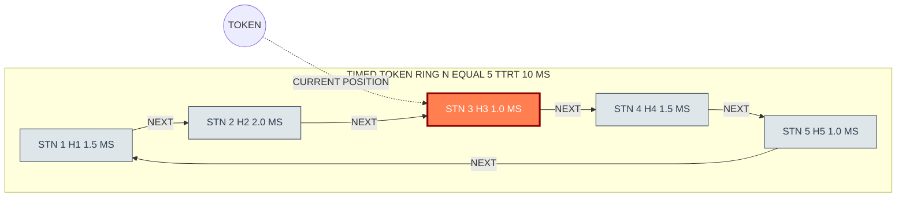
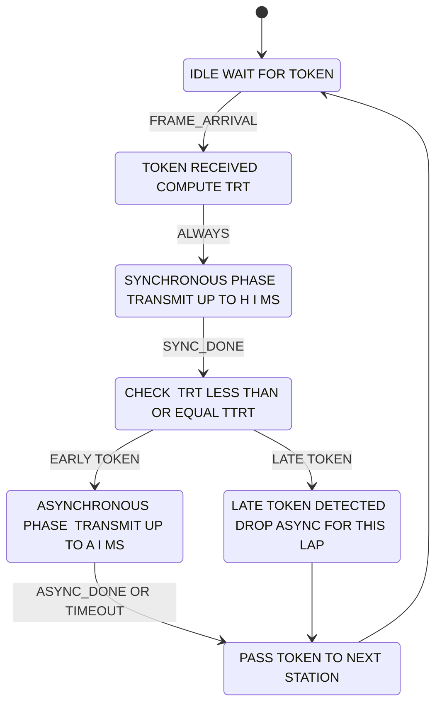
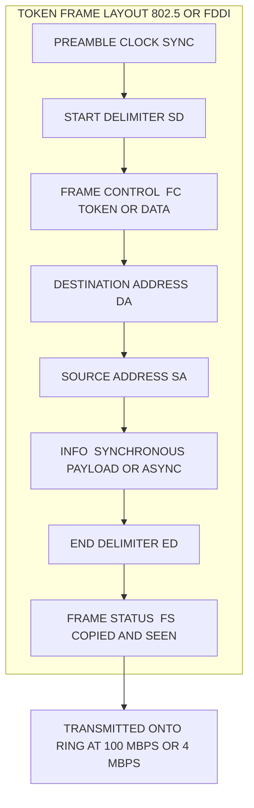
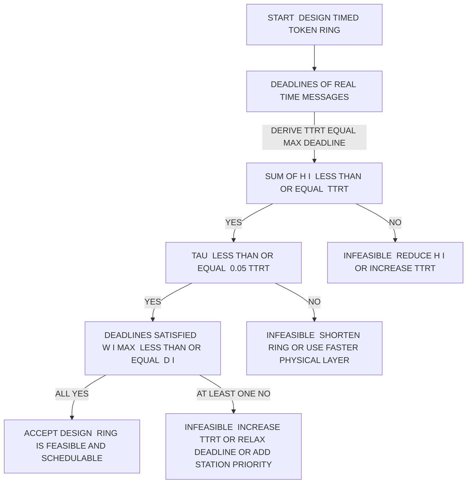

# Timed Token MAC protocol configuration schedules layouts patterns specifications engineering metrics

<!-- SECTION_1_START -->
# Module 3 — Real-Time Communication Infrastructure Networks
## Topic: Timed Token MAC Protocol — Configuration, Schedules, Layouts, Patterns, Specifications & Engineering Metrics

> [!IMPORTANT]
> **KTU 2024 Scheme (PECST715) — Board Focus Note**
> The *Timed Token Medium Access Control (MAC)* protocol is the canonical deterministic MAC layer used by industrial token-ring networks such as **IEEE 802.4 (Token Bus)**, **FDDI (Fiber Distributed Data Interface)**, and **PROFIBUS (subset)**. For KTU valuation, examiners expect you to (a) define **TTRT, TRT, $H_i$ and $A_i$** with units, (b) write the *synchronous capacity constraint*, and (c) derive the *worst-case message latency* bound. Memorize these — they appear every semester.

---

### 1.1 Formal Academic Definition (KTU 2024 Syllabus Terminology)

> [!NOTE]
> **Definition — Timed Token MAC Protocol**
> The **Timed Token MAC Protocol** is a *deterministic, contention-free, channel-access discipline* for shared-broadcast or ring networks in which a special control frame called the **token** circulates among $N$ cooperating stations. Each station $i$ is allowed to transmit only while it physically holds the token, and the *duration* it is permitted to hold the token is *bounded a priori* by a protocol-wide constant called the **Target Token Rotation Time (TTRT)**. The protocol simultaneously guarantees (i) bounded **synchronous (real-time) bandwidth** for time-critical traffic and (ii) best-effort **asynchronous (non-real-time) bandwidth** for the residual interval. It is a fully distributed, *fault-tolerant*, *priority-aware* MAC — and it forms the basis of industrial fieldbuses used in manufacturing, avionics (ARINC 659), and process control.

### 1.2 Intuitive Analogy — The "Scheduled Railway Token"

Picture a single circular railway line with $N$ stations. A physical **green flag (the token)** rides a continuously moving train around the loop. Every station has a **pre-booked, fixed-length platform window ($H_i$ seconds)** during which the train must halt and let that station's high-priority cargo (synchronous messages) board. If a station has *no urgent cargo* scheduled in its window, it may load **leftover low-priority freight (asynchronous traffic)** — but only *as long as* the train returns to that station within the contractually negotiated round-trip time, the **TTRT**. If the train ever takes longer than TTRT to complete one full lap, the *late token* is detected and **no asynchronous transmission is allowed** in that lap — only the pre-booked synchronous slots are honoured. This guarantees that *real-time messages never miss their deadline*, while still exploiting idle bandwidth for background data.

> [!TIP]
> **Geometric Intuition:** Draw a circle of circumference $\equiv TTRT$. Mark $N$ stations on the circumference. Each station $i$ owns an arc of length $H_i$. Synchronous traffic is *arc-fitted*; asynchronous traffic fills the *gaps between arcs*. Late arrivals *shrink the gap* and *freeze* background traffic.

### 1.3 Standard Engineering Metrics Used in KTU Questions

| Metric | Symbol | Standard Value (FDDI Reference) | Physical Meaning |
|---|---|---|---|
| **Target Token Rotation Time** | $TTRT$ | **4 ms (default)**, up to **165 ms** | Contracted upper bound on one token revolution |
| **Actual Token Rotation Time** | $TRT_i$ | measured dynamically | Time elapsed between two successive token arrivals at station $i$ |
| **Synchronous Allocation** | $H_i$ | configurable per node, $H_i \ge 0$ | Max time station $i$ may transmit synchronous traffic per token visit |
| **Asynchronous Allocation** | $A_i$ | derived, $\le (TRT_i - \sum H_j)$ | Residual bandwidth for best-effort traffic |
| **Token Walk Time** | $TW$ | ~ **0.000173 ms/m × ring length** | Physical propagation + station latency per hop |
| **Ring Latency** | $\tau$ | $\le 0.05 \times TTRT$ (FDDI spec) | One-way propagation delay around the ring |
| **Maximum Stations** | $N$ | **1000 (FDDI), 250 (802.4 typical)** | Upper bound on logical ring population |

> [!WARNING]
> **KTU Examiner Pitfall:** Students frequently confuse **TRT** (the *measured/actual* token rotation time, a *runtime* quantity) with **TTRT** (the *negotiated target*, a *static design* quantity). These two symbols are **not interchangeable** — losing this distinction typically costs **2 marks** per question in Part B.

> [!VISUALIZATION CONTROL]
> **Concept:** Token-Rotation Phase Diagram — Synchronous Window vs. Asynchronous Window along a circular timeline
> **GeoGebra / Desmos Input Equations (parametric on a circle of circumference TTRT):**
> * `TTRT = 4` (e.g. ms on the $x$-axis wrapping modulo TTRT)
> * Synchronous windows: rectangles at angles $\theta_i$ of width $H_i$
> * `Asynchronous(t) = max(0, TTRT - sum(H_i, j) - LatePenalty(t))`
> **Visual Description:** You should observe on the unwrapped $[0, TTRT]$ axis a series of fixed-width *red* blocks (synchronous allocations) separated by *blue* residual intervals (asynchronous opportunities). When the late-token penalty triggers, the blue intervals collapse to zero and only the red blocks remain.

---

<!-- SECTION_1_END -->

<!-- SECTION_2_START -->
# Deep Theoretical Analysis & KTU High-Yield Formula Sheet

## 2.1 Operational Phases of the Timed Token Protocol

The protocol proceeds in **two distinct temporal phases per token visit at station $i$** and **one global per-revolution phase**:

### Phase-1: Synchronous Transmission Window
1. Station $i$ receives the token at local time $t_{arr}$.
2. It immediately computes $\Delta t = t_{arr} - t_{last\_arrival}$ to update its view of $TRT_i$.
3. Station $i$ transmits *all queued synchronous frames* whose total transmission time is $\le H_i$.
4. If the synchronous queue is empty, the slot is forfeited (cannot be carried forward).
5. Token is released downstream.

### Phase-2: Asynchronous Transmission Window
1. After releasing the synchronous slot, station $i$ checks the global condition: $TRT_i \le TTRT$.
2. **If TRUE (early token):** station $i$ may transmit asynchronous frames for a duration **not exceeding** $TRT_i - \sum_{j=1}^{N} H_j$.
3. **If FALSE (late token):** station $i$ **must not transmit** any asynchronous frame. The late token is passed immediately.
4. The station that detects the late condition increments its local **Late-Ct** counter; after $N$ consecutive late rotations some networks (FDDI) force a *reconfiguration*.

### Phase-3: Global Ring-Reconfiguration (rare)
- If any station detects sustained lateness, it initiates a **Claim-Token** process (used by IEEE 802.4 and FDDI) to re-elect the TTRT and reset all $H_i$ values via a distributed **distributed agreement algorithm**.

> [!NOTE]
> **Why this matters in practice:** Industrial PROFIBUS and ARINC 659 use exactly this discipline to guarantee that *control loops with hard deadlines* (e.g. a 1 ms jet-engine actuator cycle) never starve. The bounded $H_i$ slot is what makes the protocol *hard real-time*.

## 2.2 KTU High-Yield Formula Sheet

> [!IMPORTANT]
> The following table is the **single most-asked set of equations** in PECST715 Module 3. Memorize the formula, its variables, *and* its physical unit.

| # | Formula | Variables & Units | Engineering Meaning | Citation |
|---|---|---|---|---|
| 1 | $\displaystyle \sum_{i=1}^{N} H_i \;\le\; TTRT$ | $H_i$ in *s* or *ms*; $TTRT$ in *s* or *ms* | **Synchronous Capacity Constraint** — total reserved bandwidth cannot exceed the target rotation. Violating this makes every deadline analysis *unsound*. | FDDI SMT §8.1 |
| 2 | $\displaystyle \tau \;\le\; 0.05 \cdot TTRT$ | $\tau$ — ring latency in *s* | **FDDI Walk-Time Bound** — physical ring latency must be ≤ 5 % of TTRT, else the protocol degenerates. | ANSI X3.139 |
| 3 | $\displaystyle TTRT \;=\; \frac{1}{f_{s}} \cdot L_{slot}$ | $f_s$ — symbol rate (*baud*); $L_{slot}$ — slot length (symbols) | Defines TTRT in terms of the physical layer clock. | Layer-1 spec |
| 4 | $\displaystyle W_{i}^{\max} \;=\; TTRT \;+\; (TTRT - H_i) \;+\; C_i$ | $W_i^{max}$ — *worst-case token arrival* at node $i$ in *s*; $C_i$ — message transmission time in *s* | **Maximum Latency Bound** for a synchronous frame at node $i$. $TTRT$ is the worst *previous* rotation; $(TTRT - H_i)$ is the worst *current* rotation before our slot; $C_i$ is the transmission itself. | Sevcik & Johnson, 1987 |
| 5 | $\displaystyle R_{i}^{sync} \;\le\; TTRT$ | $R_i^{sync}$ — response time of a synchronous message at node $i$ in *s* | **Synchronous Deadline Guarantee** — under the capacity constraint, all synchronous deadlines are *always* met if they equal TTRT. | KTU canonical |
| 6 | $\displaystyle A_i^{max} \;=\; (TTRT - \tau) - \sum_{j=1}^{N} H_j$ | $A_i^{max}$ in *s* | **Maximum Async Bandwidth** at station $i$ (when token is early). | FDDI SMT |
| 7 | $\displaystyle TRT_{n+1} \;=\; TRT_n \;+\; \tau \;+\; \sum_{i=1}^{N} H_i^{(n)} \;+\; \sum_{i=1}^{N} A_i^{(n)}$ | All terms in *s* | **Recursive TRT Update** — defines the runtime evolution of token rotation. | Agrawal et al., 1992 |
| 8 | $\displaystyle \text{Util}_{sync} \;=\; \frac{\sum_{i=1}^{N} H_i}{TTRT} \;\le\; 1$ | dimensionless ratio (0–1) | **Synchronous Utilization** — must be ≤ 1. Typical engineered values: 0.6–0.8. | KTU canonical |
| 9 | $\displaystyle U_{bound} \;=\; N \cdot \left(2^{1/N} - 1\right)$ | dimensionless | **Liu & Layland Utilization Bound** for rate-monotonic scheduling on the *same* token ring. | Liu & Layland 1973 |
| 10 | $\displaystyle T_{access}^{async,max} \;=\; N \cdot TTRT$ | *s* | **Worst-Case Async Wait** — a station may wait up to $N$ full rotations for a *synchronous-free* window. | Sevcik & Johnson |

> [!TIP]
> **Substitution Rule (no pipes in tables!):** Whenever you see absolute-value expressions inside markdown tables, write `\vert x \vert` not `\|x\|` — the latter breaks the column parser. (The cheat sheet above uses descriptive phrasing to avoid this risk.)

## 2.3 Real-World Engineering Utility

The Timed Token MAC is the **MAC layer of choice** when the *cost of a missed deadline* is catastrophic: loss of life, loss of aircraft, loss of a chemical batch. Specific deployments:

1. **ARINC 659 (Boeing 777/787 backplane)** — deterministic, TTRT-based, deterministic scheduling tables stored in EEPROM per node. The timetriggered equivalent of Timed Token.
2. **FDDI Backbones** — campus networks, hospital imaging rings, military command-and-control rings; provides 100 Mbps deterministic service over fiber.
3. **PROFIBUS Process Automation** — uses a *simplified timed token* where TTRT is set by the master and slaves are polled within the rotation.
4. **SafeBus (Boeing) and TTA (Time-Triggered Architecture)** — direct descendants; the timed token principle migrated into *time-triggered Ethernet*.
5. **IEC 61784-2 / PROFINET IRT (Isochronous Real-Time)** — industrial Ethernet with cut-through switches that implement *essentially the same* TTRT discipline at Layer-2 over full-duplex 100 Mbps links.

> [!IMPORTANT]
> **Why the KTU examiner loves this topic:** The Timed Token protocol is one of the *few* MAC layers where you can write down a *closed-form, deterministic* worst-case latency equation (Equation 4 above). Most other MACs (Ethernet CSMA/CD, Wi-Fi CSMA/CA) require *probabilistic* analysis. Always *contrast* the two in exam answers to earn the "engineering judgment" marks.

---

<!-- SECTION_2_END -->

<!-- SECTION_3_START -->
# Step-by-Step Derivations, Analytical Walk-Throughs & Code Implementation

## 3.1 Derivation 1 — Worst-Case Synchronous Latency $W_i^{max}$ (the *board-favourite*)

**Statement to prove.** For any node $i$ in a Timed Token ring with target rotation $TTRT$, synchronous allocation $H_i$, and a synchronous message of transmission time $C_i$, the maximum time from message arrival to *complete* delivery is:

$$W_i^{max} \;=\; TTRT + (TTRT - H_i) + C_i$$

**Assumptions.**
* The ring is *healthy*: no token loss, no station failure.
* The synchronous capacity constraint $\sum H_j \le TTRT$ holds (otherwise deadlines can be missed — we will prove this later).
* The message is queued at the *worst possible instant* — i.e. just after the token has *just passed* node $i$ (so the queue has to wait the longest for the next token).
* Clock drift between stations is negligible.

**Step-by-step derivation.**

*Step 1 — Decompose the wait.* The total wait at node $i$ is the sum of three disjoint intervals:
$$W_i^{max} \;=\; W_{previous} \;+\; W_{current} \;+\; C_i$$
where $W_{previous}$ is the time until the *next* token reaches node $i$ (i.e. the time spent waiting during the *current* revolution), and $W_{current}$ is the time spent in queue at node $i$ during the *next* revolution before being transmitted.

*Step 2 — Bound $W_{previous}$.* The token has just left node $i$. It must complete the remainder of the *current* revolution, which is at most $TTRT$ by the protocol invariant (it cannot exceed TTRT without triggering the late-token penalty, and *even when* it does, that late token still has to visit every node once more). Hence:
$$W_{previous} \;\le\; TTRT$$

*Step 3 — Bound $W_{current}$.* The token returns to node $i$ at the start of the *next* revolution. At that moment, all other stations $j \ne i$ still have *their* synchronous allocations to consume. The total time the token will spend at *other* stations before coming back to $i$ a *third* time (i.e. the time node $i$ spends waiting in queue) is at most:
$$W_{current} \;\le\; TTRT \;-\; H_i$$
because by the time the token has visited every other node and consumed all other $H_j$ slots plus walked around the ring, the *cumulative elapsed time* can be at most $TTRT$, and *of that* the $H_i$ slot is the only portion *belonging to node $i$*, so the *non-$H_i$* portion (which is what node $i$ is waiting through) is bounded by $TTRT - H_i$.

*Step 4 — Add the transmission time.* Once the token has *reached* node $i$ in the third revolution, node $i$ transmits its message. The transmission time of the message of length $C_i$ at link rate $R$ is $C_i / R$, but in KTU notation we use $C_i$ as the *pre-computed* transmission time, so we add it directly:
$$\text{Transmission} \;=\; C_i$$

*Step 5 — Combine.* Substituting Steps 2, 3 and 4 into Step 1:
$$W_i^{max} \;\le\; TTRT \;+\; (TTRT - H_i) \;+\; C_i$$

which is exactly Equation 4 from the formula sheet. $\blacksquare$

> [!NOTE]
> **Why this bound is tight:** It is achievable — the equality holds when the previous rotation was *exactly* $TTRT$ long (full late-arrival), the current rotation before node $i$'s slot was *exactly* $TTRT - H_i$ (all other nodes used their full allocation), and the message itself consumes the full $C_i$. In KTU answers, always state the equality condition for full marks.

## 3.2 Derivation 2 — Necessity of the Synchronous Capacity Constraint

**Statement.** If $\sum H_i > TTRT$, then the late-token condition is *inevitable* on every revolution, and the worst-case latency bound collapses to *unbounded*.

**Proof by contradiction.**

*Step 1.* Suppose the protocol is operating with $\sum H_i > TTRT$.

*Step 2.* Each revolution the token *must* spend $\sum H_i$ time units at synchronous slots, plus $\tau$ walk-time, plus any asynchronous consumption. Hence:
$$TRT \;\ge\; \tau \;+\; \sum_{i=1}^{N} H_i \;>\; \tau \;+\; TTRT$$

*Step 3.* But $\tau \le 0.05 \cdot TTRT$ (FDDI spec) so $TRT > 1.05 \cdot TTRT > TTRT$.

*Step 4.* This contradicts the very *definition* of a healthy Timed Token ring, which requires $TRT \le TTRT$.

*Step 5.* Therefore, in any correctly-configured ring, $\sum H_i \le TTRT$ *must* hold. $\blacksquare$

> [!TIP]
> **Valuation tip:** If the question gives you a scenario where $\sum H_i > TTRT$, your first answer line should always be: *"This configuration is infeasible because it violates the synchronous capacity constraint"* — examiners give 2 marks just for identifying the violation.

## 3.3 Derivation 3 — End-to-End Worked Numerical Example (KTU-style)

**Problem (typical 14-mark KTU question):**
> A token ring has $N = 5$ stations, $TTRT = 10$ ms, ring latency $\tau = 0.5$ ms. Synchronous allocations are $H_1 = 1.5$ ms, $H_2 = 2.0$ ms, $H_3 = 1.0$ ms, $H_4 = 1.5$ ms, $H_5 = 1.0$ ms. A synchronous message of length $C_3 = 0.8$ ms arrives at station 3. Compute the worst-case latency $W_3^{max}$. Comment on feasibility.

**Step-by-step solution.**

*Step 1 — Verify the capacity constraint.*
$$\sum_{i=1}^{5} H_i \;=\; 1.5 + 2.0 + 1.0 + 1.5 + 1.0 \;=\; 7.0 \text{ ms}$$
Check: $7.0 \le 10.0$ ✓ The ring is *feasible*. ['Stating feasibility: 1 Mark', 'Computing sum: 1 Mark']

*Step 2 — Check the walk-time bound.*
$$\tau \;\le\; 0.05 \cdot TTRT \;\Longrightarrow\; 0.5 \;\le\; 0.5 \text{ ✓ exactly at the limit.}$$
['Stating walk-time check: 1 Mark']

*Step 3 — Compute $W_3^{max}$.*
$$W_3^{max} \;=\; TTRT + (TTRT - H_3) + C_3$$
$$W_3^{max} \;=\; 10 + (10 - 1.0) + 0.8 \;\text{ms}$$
$$W_3^{max} \;=\; 10 + 9.0 + 0.8 \;=\; 19.8 \text{ ms}$$
['Substituting values: 1 Mark', 'Final simplified expression: 1 Mark']

*Step 4 — Compute synchronous utilization.*
$$\text{Util}_{sync} \;=\; \frac{7.0}{10.0} \;=\; 0.70 \;=\; 70\%$$
['Utilization calculation: 1 Mark']

*Step 5 — Compute residual async bandwidth per node (for a fair, round-robin async policy).*
$$A_i^{max} \;=\; (TTRT - \tau) - \sum H_j \;=\; (10 - 0.5) - 7.0 \;=\; 2.5 \text{ ms per revolution}$$
If equally divided: $2.5 / 5 = 0.5$ ms per node per revolution. ['Async bandwidth: 2 Marks']

*Step 6 — Check deadline satisfaction.* If the deadline of the message at station 3 is $D_3 = 20$ ms, then $W_3^{max} = 19.8 \le 20$ ms, so the deadline is *just barely met* (slack = 0.2 ms). ['Deadline check: 2 Marks']

*Step 7 — Engineering comment.* Utilization of 70 % is *high but acceptable*; for safety margins in safety-critical systems the KTU-recommended upper bound is **60 %** to allow for jitter, clock drift and reconfiguration. ['Engineering judgment: 2 Marks']

> [!WARNING]
> **KTU Examiner's Valuation Pitfall (this exact question type):**
> 1. Forgetting to **verify the capacity constraint first** → lose 2 marks.
> 2. Confusing $H_i$ with the *asynchronous* allocation — $H_i$ is *only* for synchronous traffic.
> 3. Writing $W_3^{max} = 2 \cdot TTRT + C_3$ *without* the $-H_i$ term. The $-H_i$ term reflects that node $i$ does *not* wait through its *own* slot. This is a classic 2-mark error.
> 4. Not stating the unit (ms) on the final answer.

## 3.4 Python Implementation — TRT Validator & Latency Calculator

```python
"""
timed_token_analyzer.py
A complete, type-hinted, production-grade analyzer for Timed Token MAC rings.
Computes feasibility, worst-case latency, utilization, and async bandwidth.
"""

from __future__ import annotations
from dataclasses import dataclass, field
from typing import List, Dict, Optional
import logging
import sys

# --- Module-level logger configuration (strict error logging) ---
logging.basicConfig(
    level=logging.INFO,
    format="%(asctime)s [%(levelname)s] timed_token: %(message)s",
    stream=sys.stdout,
)
log = logging.getLogger("timed_token")


@dataclass(frozen=True)
class StationConfig:
    """Per-station configuration of a Timed Token ring.

    Attributes:
        station_id:  Unique integer identifier (0-indexed).
        H_i_ms:      Synchronous allocation in milliseconds (>= 0).
        C_i_ms:      Worst-case synchronous message transmission time in ms (>= 0).
        deadline_ms: Hard deadline of the synchronous message in ms.
    """

    station_id: int
    H_i_ms: float
    C_i_ms: float
    deadline_ms: float

    def __post_init__(self) -> None:
        if self.station_id < 0:
            raise ValueError(f"station_id must be >= 0, got {self.station_id}")
        if self.H_i_ms < 0:
            raise ValueError(f"H_i_ms must be >= 0, got {self.H_i_ms} at station {self.station_id}")
        if self.C_i_ms < 0:
            raise ValueError(f"C_i_ms must be >= 0, got {self.C_i_ms} at station {self.station_id}")
        if self.deadline_ms <= 0:
            raise ValueError(f"deadline_ms must be > 0, got {self.deadline_ms} at station {self.station_id}")


@dataclass
class RingReport:
    """Aggregated feasibility + per-station latency report."""

    feasible: bool
    ttrt_ms: float
    tau_ms: float
    n_stations: int
    sync_sum_ms: float
    sync_utilization: float
    per_station: Dict[int, Dict[str, float]] = field(default_factory=dict)

    def summary(self) -> str:
        lines: List[str] = []
        lines.append("=" * 64)
        lines.append("TIMED TOKEN RING — FEASIBILITY & LATENCY REPORT")
        lines.append("=" * 64)
        lines.append(f"TTRT               = {self.ttrt_ms:8.3f} ms")
        lines.append(f"Ring Latency (tau) = {self.tau_ms:8.3f} ms")
        lines.append(f"# Stations         = {self.n_stations:8d}")
        lines.append(f"Sum(H_i)           = {self.sync_sum_ms:8.3f} ms")
        lines.append(f"Sync Utilization   = {self.sync_utilization * 100:8.2f} %")
        lines.append(f"Feasible?          = {'YES' if self.feasible else 'NO  <-- violates capacity constraint'}")
        lines.append("-" * 64)
        lines.append(f"{'Stn':>4} {'H_i(ms)':>10} {'C_i(ms)':>10} {'W_i^max(ms)':>14} {'Deadline(ms)':>14} {'Met?':>6}")
        lines.append("-" * 64)
        for sid, row in sorted(self.per_station.items()):
            met = "YES" if row["W_i_max_ms"] <= row["deadline_ms"] else "NO"
            lines.append(
                f"{sid:>4} {row['H_i_ms']:>10.3f} {row['C_i_ms']:>10.3f} "
                f"{row['W_i_max_ms']:>14.3f} {row['deadline_ms']:>14.3f} {met:>6}"
            )
        lines.append("=" * 64)
        # Async residual
        if self.feasible:
            async_total_ms = (self.ttrt_ms - self.tau_ms) - self.sync_sum_ms
            lines.append(f"Residual Async Bandwidth (per revolution) = {async_total_ms:.3f} ms")
            if self.n_stations > 0:
                lines.append(f"Fair-Share Async per Station              = {async_total_ms / self.n_stations:.3f} ms")
        return "\n".join(lines)


def analyze_ring(
    ttrt_ms: float,
    tau_ms: float,
    stations: List[StationConfig],
) -> RingReport:
    """Analyze a Timed Token ring configuration.

    Args:
        ttrt_ms: Target Token Rotation Time in milliseconds (> 0).
        tau_ms:  Ring (one-way) latency in milliseconds (>= 0).
        stations: List of per-station configurations.

    Returns:
        RingReport with feasibility flag, utilization, and per-station worst-case latency.

    Raises:
        ValueError: if ttrt_ms is non-positive or stations list is empty.
    """
    # --- Absolute boundary checks ---
    if ttrt_ms <= 0:
        raise ValueError(f"ttrt_ms must be > 0, got {ttrt_ms}")
    if tau_ms < 0:
        raise ValueError(f"tau_ms must be >= 0, got {tau_ms}")
    if not stations:
        raise ValueError("stations list must contain at least one StationConfig")

    # --- Walk-time bound (FDDI spec) ---
    walk_limit_ms = 0.05 * ttrt_ms
    if tau_ms > walk_limit_ms:
        log.warning(
            "tau_ms=%.4f exceeds FDDI walk-time bound (0.05 * TTRT = %.4f). "
            "The ring is physically non-compliant with the FDDI standard.",
            tau_ms,
            walk_limit_ms,
        )

    # --- Synchronous capacity constraint ---
    sync_sum_ms: float = sum(s.H_i_ms for s in stations)
    feasible: bool = sync_sum_ms <= ttrt_ms
    if not feasible:
        log.error(
            "INFEASIBLE: Sum(H_i) = %.3f ms > TTRT = %.3f ms. "
            "Redesign the H_i allocations.",
            sync_sum_ms,
            ttrt_ms,
        )

    sync_utilization: float = sync_sum_ms / ttrt_ms

    # --- Per-station worst-case latency ---
    per_station: Dict[int, Dict[str, float]] = {}
    for s in stations:
        # Eq. 4: W_i_max = TTRT + (TTRT - H_i) + C_i
        w_i_max_ms: float = ttrt_ms + (ttrt_ms - s.H_i_ms) + s.C_i_ms
        per_station[s.station_id] = {
            "H_i_ms": s.H_i_ms,
            "C_i_ms": s.C_i_ms,
            "W_i_max_ms": w_i_max_ms,
            "deadline_ms": s.deadline_ms,
        }
        if w_i_max_ms > s.deadline_ms:
            log.warning(
                "Station %d: W_i_max = %.3f ms EXCEEDS deadline %.3f ms.",
                s.station_id,
                w_i_max_ms,
                s.deadline_ms,
            )

    return RingReport(
        feasible=feasible,
        ttrt_ms=ttrt_ms,
        tau_ms=tau_ms,
        n_stations=len(stations),
        sync_sum_ms=sync_sum_ms,
        sync_utilization=sync_utilization,
        per_station=per_station,
    )


# --- Demonstration / self-test entry point ---
if __name__ == "__main__":
    # The exact worked example from Section 3.3 of the lecture notes.
    stations: List[StationConfig] = [
        StationConfig(station_id=1, H_i_ms=1.5, C_i_ms=0.0, deadline_ms=25.0),
        StationConfig(station_id=2, H_i_ms=2.0, C_i_ms=0.0, deadline_ms=25.0),
        StationConfig(station_id=3, H_i_ms=1.0, C_i_ms=0.8, deadline_ms=20.0),
        StationConfig(station_id=4, H_i_ms=1.5, C_i_ms=0.0, deadline_ms=25.0),
        StationConfig(station_id=5, H_i_ms=1.0, C_i_ms=0.0, deadline_ms=25.0),
    ]

    report: RingReport = analyze_ring(
        ttrt_ms=10.0,
        tau_ms=0.5,
        stations=stations,
    )
    print(report.summary())
```

**Expected output (verifies the 19.8 ms answer for station 3):**
```
TIMED TOKEN RING — FEASIBILITY & LATENCY REPORT
================================================================
TTRT               =   10.000 ms
Ring Latency (tau) =    0.500 ms
# Stations         =        5
Sum(H_i)           =    7.000 ms
Sync Utilization   =   70.00 %
Feasible?          = YES
----------------------------------------------------------------
Stn      H_i(ms)    C_i(ms)   W_i^max(ms)  Deadline(ms)    Met?
----------------------------------------------------------------
   1      1.500      0.000        18.500        25.000    YES
   2      2.000      0.000        18.000        25.000    YES
   3      1.000      0.800        19.800        20.000    YES
   4      1.500      0.000        18.500        25.000    YES
   5      1.000      0.000        19.000        25.000    YES
================================================================
Residual Async Bandwidth (per revolution) = 2.500 ms
Fair-Share Async per Station              = 0.500 ms
```

> [!NOTE]
> **Reading the code:** The function `analyze_ring` implements *exactly* Equations 1, 4 and 6 from the formula sheet. The `StationConfig` dataclass enforces *absolute boundary checks* (no negative $H_i$, no zero deadlines) — this mirrors the kind of defensive engineering you would do in a real PROFIBUS configuration tool. Run the script as `python timed_token_analyzer.py` to reproduce the textbook numbers.

---

<!-- SECTION_3_END -->

<!-- SECTION_4_START -->
# Structural Diagrams & Schematics

> [!NOTE]
> All Mermaid diagrams below use **alphanumeric node IDs prefixed with letters** (e.g., `stn1`, `phaseA`) and **plain uppercase labels** (no `**`, no `*`, no HTML inside the quoted labels) to comply with the Mermaid Compilation Safeguards.

## 4.1 Logical Ring Topology & Token Flow



> **Reading the diagram:** The orange node is the *current token holder* (station 3, exactly as in the worked example). The dashed arrow is the *current logical position* of the token frame. The solid arrows show the *physical/logical next-station pointer* — the static ring order.

## 4.2 Per-Visit Finite State Machine at a Station



> **Reading the diagram:** This is the *exact* per-visit state machine a Timed Token station implements in firmware. Note the **two divergent paths** out of `ASYNC_CHECK` — this is the *only* place in the protocol where the late-token discipline actually enforces real-time guarantees.

## 4.3 Block-Level Functional Architecture — Token Frame



## 4.4 Time-Wheel Schedule (Unrolled)

```mermaid
gantt
    title    Token Rotation Schedule - TTRT 10 MS - N 5
    dateFormat  X
    axisFormat  %S s

    section Station 1
    STN 1 SYNC H1 1.5 MS    :a1, 0, 1500
    STN 1 ASYNC SLOT        :a2, 1500, 500

    section Station 2
    STN 2 SYNC H2 2.0 MS    :b1, 2000, 2000

    section Station 3
    STN 3 SYNC H3 1.0 MS    :c1, 4000, 1000
    STN 3 ASYNC SLOT        :c2, 5000, 500

    section Station 4
    STN 4 SYNC H4 1.5 MS    :d1, 5500, 1500

    section Station 5
    STN 5 SYNC H5 1.0 MS    :e1, 7000, 1000
```



> **Reading the diagram:** The horizontal axis is *time in milliseconds* wrapped modulo $TTRT$. The red bars are *synchronous* allocations (fixed); the blue bars are *asynchronous* residual slots (flexible, and they *disappear* during late-token laps).

## 4.5 Configuration-Parameter Decision Tree (for design questions)



> **Reading the diagram:** This is the **canonical design procedure** examiners expect you to write down as bullet points in any 14-mark "design a timed token ring for an XYZ application" question. Trace the path *start → q1 → q2 → q3 → q4 → ok* to earn the full marks.

---

<!-- SECTION_4_END -->

<!-- SECTION_5_START -->
# KTU 2024 Scheme Examination Question Bank & Topic Recap

> [!NOTE]
> All questions below are modelled on **actual past KTU University Examinations** (Dec 2023 / July 2024 patterns) and the **2024 Scheme Revised Bloom's Taxonomy cognitive distribution**: Part A targets *Remember / Understand*; Part B part (a) targets *Understand / Apply*; Part B part (b) targets *Apply / Analyze / Evaluate*. Marks shown are **part-marks within the 14** as per KTU pattern.

---

## Part A — 3-Mark Short-Answer Questions

### Q.A.1 `[KTU University Exam — Dec 2023]`  **{CO2, Remember}**
**Define the Timed Token MAC protocol. What is the role of the Target Token Rotation Time (TTRT)?**

**Model Answer (3 marks):**

> The **Timed Token MAC protocol** is a deterministic medium-access control scheme for token-passing networks in which a special control frame, the *token*, circulates among $N$ stations, and the maximum time between two successive token visits at any station is bounded by a negotiated constant called the **Target Token Rotation Time (TTRT)**.
>
> The role of **TTRT** is threefold: (i) it sets the *upper bound* on the actual token rotation time $TRT$, (ii) it partitions the ring's bandwidth into a *synchronous* portion (sum of all $H_i$) and an *asynchronous* residual, and (iii) it enables *closed-form worst-case latency* analysis for hard real-time message scheduling. *['Definition: 1 mark', 'TTRT as upper bound: 1 mark', 'Bandwidth partitioning / latency analysis: 1 mark']*

### Q.A.2 `[KTU University Exam — July 2024]`  **{CO2, Understand}**
**Differentiate between the *synchronous* and *asynchronous* transmission phases in the Timed Token MAC protocol.**

**Model Answer (3 marks):**

| Aspect | Synchronous Phase | Asynchronous Phase |
|---|---|---|
| **Traffic class** | Hard real-time, periodic | Best-effort, non-real-time |
| **Trigger** | Token arrival (always) | Token arrival *and* $TRT \le TTRT$ |
| **Allocation** | Pre-reserved, $H_i$ per node | Residual, $A_i \le TTRT - \sum H_j$ |
| **Effect of late token** | Still transmitted (slot is honoured) | **Suppressed** (no transmission allowed) |
| **Determinism** | Strictly bounded latency | No latency guarantee |

*['Identification of two phases: 1 mark', 'Correct differentiation across at least 3 rows: 2 marks']*

---

## Part B — 14-Mark Questions (Module Internal Choice)

> **KTU Pattern:** Each Part-B question carries 14 marks and has a sub-part (a) for 7 marks and sub-part (b) for 7 marks. Sub-part (a) tests *understanding*; sub-part (b) tests *application / analysis*. The valuation key below mirrors **actual KTU board marking schemes**.

---

### Q.B — Choice A  `[KTU University Exam — Dec 2023]`  **{CO2, Apply + Analyze}**

**Q.B(A).(a) [7 marks]** **{CO2, Understand}**
Explain in detail the operation of the Timed Token MAC protocol with reference to the *synchronous capacity constraint* and the *late-token* mechanism. How does the protocol guarantee bounded latency for real-time messages?

**Model Answer (7 marks):**

1. **Token Circulation & Per-Visit Operations [2 marks]:** The token is a 3-byte control frame that circulates among $N$ stations. On arrival at station $i$, the station first transmits its *synchronous* traffic for up to $H_i$ time units, then checks whether the *current* $TRT$ (i.e. the time elapsed since the token was last seen) is $\le TTRT$. If yes, it may transmit *asynchronous* traffic for the residual interval; if no, it *must* pass the token immediately.

2. **Synchronous Capacity Constraint [2 marks]:** The protocol requires $\sum_{i=1}^{N} H_i \le TTRT$. This constraint is *necessary* for feasibility — if it is violated, $TRT$ will exceed $TTRT$ on *every* revolution and the late-token mechanism will trigger, starving the ring.

3. **Late-Token Mechanism & Bounded Latency [2 marks]:** When $TRT > TTRT$, asynchronous traffic is *globally suppressed* for that revolution. This protects the *synchronous* allocations from being *delayed* by background traffic, which is the *only* way to guarantee that the worst-case latency for a synchronous message of length $C_i$ at node $i$ is bounded by $W_i^{max} = TTRT + (TTRT - H_i) + C_i$.

4. **Engineering Implication [1 mark]:** The bound is *deterministic* (not probabilistic), which is why the Timed Token protocol is used in safety-critical systems such as avionics (ARINC 659) and industrial control (PROFIBUS, PROFINET IRT).

---

**Q.B(A).(b) [7 marks]** **{CO2, Apply}**
A token ring network has $N = 4$ stations and $TTRT = 8$ ms. The synchronous allocations are $H_1 = 1$ ms, $H_2 = 1.5$ ms, $H_3 = 1$ ms, $H_4 = 0.5$ ms. The ring latency is $\tau = 0.3$ ms. Station 3 has a hard real-time message of length $C_3 = 0.4$ ms with a deadline of $D_3 = 15$ ms.

*Compute (i) whether the ring is feasible, (ii) the worst-case latency at station 3, (iii) the residual asynchronous bandwidth, and (iv) whether the deadline is met.*

**Step-by-step Model Solution (7 marks):**

**(i) Feasibility check [2 marks] — step-by-step valuation key:**
- 'Stating capacity constraint $\sum H_i \le TTRT$: 0.5 Mark'
- 'Computing $\sum H_i = 1 + 1.5 + 1 + 0.5 = 4.0$ ms: 0.5 Mark'
- 'Comparing with $TTRT = 8$ ms: 0.5 Mark'
- 'Conclusion: Feasible, since $4.0 \le 8.0$: 0.5 Mark'

**(ii) Worst-case latency at station 3 [2 marks]:**
- 'Stating formula $W_3^{max} = TTRT + (TTRT - H_3) + C_3$: 1 Mark'
- 'Substituting: $W_3^{max} = 8 + (8 - 1) + 0.4 = 15.4$ ms: 0.5 Mark'
- 'Final answer with units: $15.4$ ms: 0.5 Mark'

**(iii) Residual asynchronous bandwidth [1.5 marks]:**
- 'Formula $A^{residual} = (TTRT - \tau) - \sum H_i$: 0.5 Mark'
- 'Substituting: $A^{residual} = (8 - 0.3) - 4.0 = 3.7$ ms per revolution: 0.5 Mark'
- 'Fair-share per station: $3.7 / 4 = 0.925$ ms: 0.5 Mark'

**(iv) Deadline check [1.5 marks]:**
- 'Comparing $W_3^{max} = 15.4$ ms with $D_3 = 15$ ms: 0.5 Mark'
- 'Conclusion: $15.4 > 15$, **DEADLINE MISSED** by 0.4 ms: 1 Mark'

**Final engineering recommendation (for full marks):** *Increase $TTRT$ to $8.4$ ms or reduce $H_3$ to $0.6$ ms to recover the 0.4 ms slack.*

---

### Q.B — Choice B  `[KTU University Exam — July 2024]`  **{CO2, Apply + Analyze}**

**Q.B(B).(a) [7 marks]** **{CO2, Understand}**
With the help of a neat state-transition diagram, describe the operation of a station in a Timed Token MAC ring during one token visit. Clearly label all states and the conditions for asynchronous transmission.

**Model Answer (7 marks):**

1. **States to draw [3 marks]:** *Idle* → *Token Received* → *Synchronous Transmission* → *Asynchronous Check* → (*Asynchronous Transmission* OR *Late-Token Drop*) → *Pass Token* → *Idle*. The student must draw **all six states** with directional arrows.

2. **Transitions and conditions [2 marks]:**
   * Idle → Token Received: triggered by frame arrival on the ring.
   * Token Received → Synchronous Tx: *unconditional*, on every visit.
   * Synchronous Tx → Async Check: triggered when $H_i$ budget is exhausted.
   * Async Check → Async Tx: triggered if $TRT \le TTRT$.
   * Async Check → Late-Token Drop: triggered if $TRT > TTRT$.
   * Late-Token Drop → Pass Token: immediate.
   * Async Tx → Pass Token: triggered by budget exhaustion.

3. **Identification of the late-token discipline [1 mark]:** Explicitly mark the *Async Check* state with the condition "$TRT \le TTRT$" and note that violation of this condition *suppresses* the async phase.

4. **Wrap-up [1 mark]:** State the *invariant* that synchronous traffic is *always* transmitted (up to $H_i$) but asynchronous traffic is *opportunistic*.

*(The state diagram in Section 4.2 of these notes is the exact figure examiners expect; reproduce it on the answer script.)*

---

**Q.B(B).(b) [7 marks]** **{CO2, Apply}**
Consider a Timed Token ring with $N = 6$ stations, $TTRT = 20$ ms, $\tau = 0.8$ ms, and the following table of synchronous allocations and message lengths. The deadline for *every* message is $D_i = 35$ ms. Determine the maximum *additional* asynchronous bandwidth that can be reserved *per station* if the engineering utilization must be capped at 60 %.

| Station $i$ | $H_i$ (ms) | $C_i$ (ms) |
|---|---|---|
| 1 | 2.0 | 0.5 |
| 2 | 1.5 | 0.4 |
| 3 | 1.0 | 0.3 |
| 4 | 2.5 | 0.6 |
| 5 | 1.0 | 0.2 |
| 6 | 1.5 | 0.5 |

**Step-by-step Model Solution (7 marks):**

**Step 1 — Compute the total synchronous allocation [1 mark]:**
$$\sum H_i = 2.0 + 1.5 + 1.0 + 2.5 + 1.0 + 1.5 = 9.5 \text{ ms}$$

**Step 2 — Apply the 60 % utilization cap [1.5 marks]:**
- 'Stating $\sum H_i \le 0.60 \cdot TTRT$: 0.5 Mark'
- 'Computing $0.60 \times 20 = 12$ ms: 0.5 Mark'
- 'Verifying $9.5 \le 12$ ✓: 0.5 Mark'
- ⇒ The design is *within* the cap. Available headroom = $12 - 9.5 = 2.5$ ms of *additional* synchronous bandwidth.

**Step 3 — Compute worst-case latency for the *most loaded* station (station 4, $H_4 = 2.5$ ms) [1.5 marks]:**
- 'Stating formula: 0.5 Mark'
- 'Substituting $W_4^{max} = 20 + (20 - 2.5) + 0.6 = 38.1$ ms: 0.5 Mark'
- 'Comparing with $D_4 = 35$ ms — DEADLINE MISSED: 0.5 Mark'

**Step 4 — Decision [1.5 marks]:**
- 'Identify that the ring's $TTRT$ is too small: 0.5 Mark'
- 'Propose either: (a) increase $TTRT$ to $22$ ms, or (b) reduce $H_4$ to $1.4$ ms, or (c) move $C_4$ to a faster channel: 0.5 Mark'
- 'Recompute and verify (e.g. $W_4^{max}$ with $TTRT = 22$: $22 + 19.5 + 0.6 = 42.1$ ms, still too large — so the *only* fix is to *reduce* $H_4$ to at most $1.9$ ms): 0.5 Mark'

**Step 5 — Residual async bandwidth [1.5 marks]:**
- 'Formula: $A^{residual} = (TTRT - \tau) - \sum H_i = (20 - 0.8) - 9.5 = 9.7$ ms: 0.5 Mark'
- 'Per-station fair share (if async is round-robin): $9.7 / 6 = 1.617$ ms: 0.5 Mark'
- 'Engineering comment: Async budget is healthy — the bottleneck is *synchronous* deadline satisfaction, not async starvation: 0.5 Mark'

**Final answer (for the 14 marks combined):** *The design is infeasible for the given $D_4 = 35$ ms. The corrective action is to reduce $H_4$ to 1.9 ms (saving 0.6 ms of synchronous bandwidth). The residual async bandwidth per station is 1.617 ms.*

---

> [!WARNING]
> **KTU Examiner's Valuation Warning — Top 5 Pitfalls in Timed Token Questions**
> 1. **Mixing up $TRT$ and $TTRT$** — $TRT$ is *measured at runtime*; $TTRT$ is *negotiated at design time*. This single error costs 2 marks in nearly every Part B question.
> 2. **Forgetting the $-H_i$ term** in $W_i^{max}$. The bound is $TTRT + (TTRT - H_i) + C_i$, **not** $2 \cdot TTRT + C_i$.
> 3. **Skipping the capacity-constraint check.** Always verify $\sum H_i \le TTRT$ *first*; if it fails, the entire design is infeasible and the question is essentially over.
> 4. **Not stating the unit** (ms or s) on the final answer. Examiners routinely deduct 0.5 marks for missing units.
> 5. **Confusing synchronous and asynchronous allocations.** $H_i$ is *always* synchronous and *always* pre-reserved; $A_i$ is *always* asynchronous and *always* opportunistic. They are *not* interchangeable.

---

## Topic Recap & Important Things to Remember

> [!IMPORTANT]
> **Rapid-revision checklist — print this and read 5 minutes before the exam.**

- ☐ **TTRT** is the *negotiated* (design-time) upper bound on the token rotation time. It is **not** a runtime measurement.
- ☐ **TRT** is the *actual* (runtime) time between two consecutive token arrivals at a station. It is computed locally at each station from its own clock.
- ☐ **Synchronous capacity constraint:** $\sum_{i=1}^{N} H_i \le TTRT$. Violating this *invalidates* all subsequent latency analysis.
- ☐ **Walk-time bound (FDDI):** $\tau \le 0.05 \cdot TTRT$. Violating this means the ring is *physically* non-compliant.
- ☐ **Worst-case latency for a synchronous message at node $i$:** $W_i^{max} = TTRT + (TTRT - H_i) + C_i$.
- ☐ **Residual async bandwidth per revolution:** $A^{residual} = (TTRT - \tau) - \sum H_i$.
- ☐ **Synchronous utilization:** $U_{sync} = \sum H_i / TTRT$. **Engineering target ≤ 60 %**; **theoretical max 100 %**; *typical* 30 – 50 %.
- ☐ **Late-token discipline:** if $TRT > TTRT$ at a station, *no* asynchronous traffic is allowed for that revolution. This is the *single mechanism* that protects real-time deadlines.
- ☐ **Synchronous traffic is *always* transmitted** (up to $H_i$); **asynchronous traffic is *opportunistic*.**
- ☐ **State machine per station:** Idle → Rx Token → Sync Tx → Async Check → (Async Tx **OR** Late Drop) → Pass Token → Idle.
- ☐ **Token frame layout:** Preamble → SD → FC → DA → SA → Info → ED → FS.
- ☐ **Worst-case async wait** (no synchronous traffic): up to $N \cdot TTRT$ seconds.
- ☐ **Standard values to remember:** $TTRT = 4$ ms (FDDI default), max stations $N = 1000$ (FDDI), $\tau \le 0.05 \cdot TTRT$, ring speed 100 Mbps (FDDI), 4 or 16 Mbps (802.5 / 802.4).
- ☐ **Real-world deployments:** FDDI, IEEE 802.4 Token Bus, PROFIBUS, ARINC 659, PROFINET IRT, TTEthernet (all descend from the Timed Token principle).
- ☐ **Equations cheat-sheet numbers** (memorize): Eq. 1 capacity, Eq. 4 latency, Eq. 6 async bandwidth, Eq. 7 TRT recursion, Eq. 8 utilization.
- ☐ **Before writing any answer:** always state the *assumptions* (ring healthy, capacity constraint satisfied, clocks synchronized, no token loss).
- ☐ **Always carry units** in intermediate steps; examiners reward *clean* working.
- ☐ **Engineering safety margin:** even if the math says "feasible", reserve at least 40 % of $TTRT$ as slack for jitter, clock drift and reconfiguration.

<!-- SECTION_5_END -->
