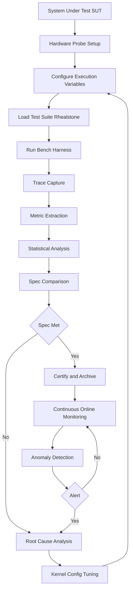
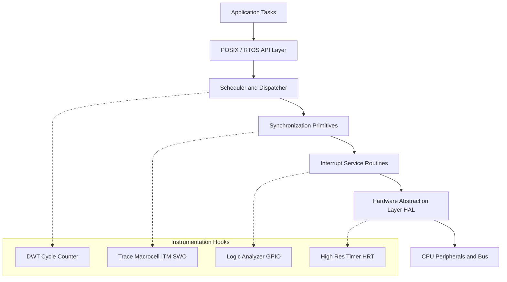
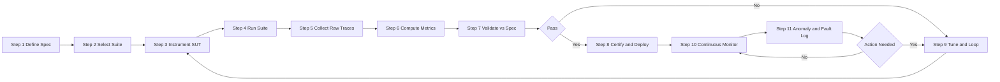
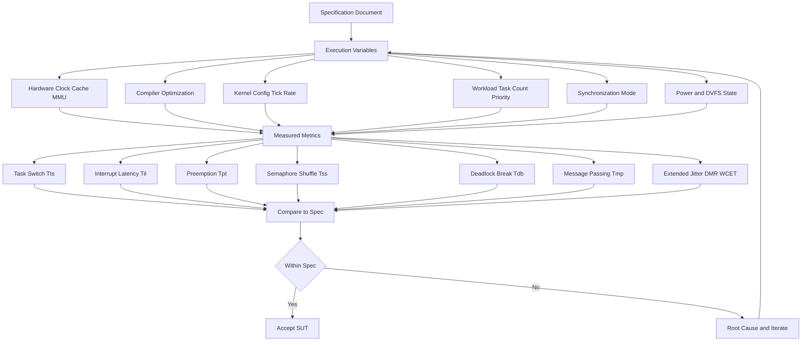
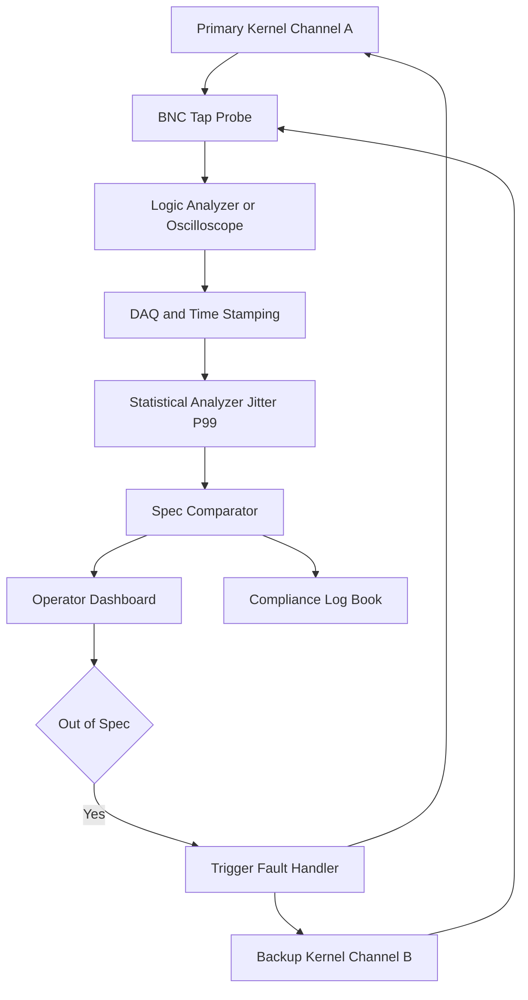

# RTOS benchmarking test suites tracking metrics execution variables specifications monitoring workflows

<!-- SECTION_1_START -->

# RTOS Benchmarking, Test Suites, Tracking Metrics, Execution Variables, Specifications & Monitoring Workflows

## 1. Core Technical Definition & Intuitive Overview

> [!IMPORTANT]
> **KTU 2024 Syllabus Definition (PECST715 — Module 4):**
> *RTOS Benchmarking is the systematic, reproducible, and quantitative evaluation of a Real-Time Operating System's temporal and functional performance characteristics using standardized test suites. It encompasses the measurement of deterministic timing parameters (jitter, latency, throughput), the controlled variation of execution variables, the validation against formal specifications, and the deployment of structured monitoring workflows to certify that the kernel meets hard, firm, or soft real-time guarantees demanded by fault-tolerant embedded architectures.*

### Conceptual Analogy / Intuition

Imagine you bought a sports car and you want to know how fast it *really* goes — not the brochure number. You take it to a test track, run a **standardized test suite** (0–100 km/h acceleration, braking distance, lap time, fuel consumption per km). You also track **execution variables** (ambient temperature, fuel grade, tyre pressure, road gradient). Finally, you compare the car against the **specifications sheet** (top speed = 250 km/h, 0–100 in 3.2 s). This is exactly what RTOS benchmarking does for an operating system: instead of 0–100 km/h, we measure **context switch time**, **interrupt latency**, **preemption overhead**, and **jitter** under controlled variable conditions, and validate them against the **system specification**.

> [!NOTE]
> **Real-Time Means Determinism, Not Speed!**
> A *faster* RTOS that is unpredictable (high jitter) is **worthless** for hard real-time systems (avionics, pacemakers, ABS brakes). Benchmarking exists to certify **determinism** — the kernel must deliver the same response within a known, bounded window **every single time**.

### Why RTOS Benchmarking Is Critical in Fault-Tolerant Architectures

In Module 4 of PECST715, we study *Fault Tolerant Real-Time Architectures*. A fault-tolerant system must:
1. **Detect** a fault within a bounded time.
2. **Isolate** and **recover** from the fault.
3. Continue delivering **correct** outputs under degraded conditions.

All three actions are governed by deadlines enforced by the RTOS scheduler. If the RTOS itself cannot guarantee a worst-case interrupt latency, the entire fault-tolerance contract collapses. Hence, **benchmarking is the proof-of-life certificate** of the kernel.

### Standardization Bodies and Test Suite Origins

| Body / Suite | Origin | Primary Use |
|---|---|---|
| **Rhealstone** | D. Whalley, 1990 (Univ. of Florida) | Classic 6-metric RTOS benchmark |
| **EEMBC** | Embedded Microprocessor Benchmark Consortium | Industry-grade embedded benchmarks |
| **ThreadMetric** | Express Logic / Micrium | RTOS kernel micro-benchmarks |
| **CoreMark** | EEMBC | CPU core performance (proxy) |
| **MiBench** | Univ. of Michigan | Embedded application proxies |
| **Dhrystone / Whetstone** | Weicker / Curnow | Synthetic integer / FP benchmarks |
| **RT-Tester / TPT** | Verified Systems / PikeTec | Model-based timing tests |

> [!TIP]
> **Rhealstone numbers are quoted in "Rhealstones"** (a fictional currency). A higher Rhealstone score means *more* real-time work per unit time, so 1 Rhealstone = the time to do one full Rhealstone cycle.

> [!VISUALIZATION CONTROL]
> **Concept:** A typical RTOS benchmark score radar chart comparing two kernels (FreeRTOS vs. VxWorks) across six Rhealstone dimensions.
> **Plotly / Matplotlib Pseudo-Input:**
> * `categories = ["Task Switch", "Interrupt Latency", "Preemption", "Semaphore", "Deadlock", "Message Passing"]`
> * `kernel_A = [t1, t2, t3, t4, t5, t6]` (lower is better → invert for radar)
> * `kernel_B = [t1', t2', t3', t4', t5', t6']`
> **Visual Description:** A six-spoke radar plot. The kernel whose polygon is **smallest and most regular** is the most deterministic. Irregular spikes reveal weak dimensions.

---

<!-- SECTION_1_END -->

<!-- SECTION_2_START -->

# 2. Deep Theoretical Analysis & KTU High-Yield Formula Sheet

## 2.1 The Six Rhealstone Metrics (Foundational)

The original 1990 Rhealstone paper by Whalley defines **six** canonical metrics. Every KTU question on RTOS benchmarking will reference at least one of these.

### 1. Task Switch Time ($T_{ts}$)
The time taken by the scheduler to **save the context of the currently running task**, invoke the dispatcher, **restore the context of the next ready task**, and start executing it. This is the *pure* CPU cost — no user-level work.

### 2. Interrupt Latency ($T_{il}$)
The time elapsed from the moment an **interrupt signal arrives at the CPU pin** to the moment the **first instruction of the ISR** begins executing. Includes hardware propagation, completion of the current instruction, and vector fetch.

### 3. Preemption Time ($T_{pt}$)
The time from the **highest-priority task becoming ready** (or a higher-priority event firing) to the moment the **CPU actually begins executing that task's code**. Equal to interrupt latency + context save time of the displaced task.

### 4. Semaphore Acquisition / Shuffle Time ($T_{ss}$)
The time between a task's **P()** (wait/lock) operation and the moment the task actually obtains the semaphore. In priority-inheritance systems this also includes the **boosting delay**.

### 5. Deadlock Detection / Break Time ($T_{db}$)
The time the kernel needs to **detect** a circular wait and **resolve** it (e.g., aborting the youngest task). Important in fault-tolerant recovery paths.

### 6. Intertask Message Passing Time ($T_{mp}$)
The round-trip time for a fixed-size message to travel from one task to another and back, including mailbox/queue copy and scheduler wake-up.

> [!IMPORTANT]
> **Rhealstone Number Formula:** A single composite "Rhealstone" score is computed by summing the six time values, then inverting and normalizing. Because lower is better:
> $$R_{score} = \frac{6 \times 10^6}{\sum_{i=1}^{6} T_i \ \ [\mu s]}$$
> Units: **Rhealstones**, dimensionless work-per-time.

## 2.2 Extended Tracking Metrics (Modern / KTU-2024)

Classical Rhealstone is **insufficient** for modern multiprocessor and multicore fault-tolerant systems. The KTU 2024 module expects knowledge of the following extended metrics.

| # | Metric | Symbol | What It Measures | Typical Target (Hard RT) |
|---|---|---|---|---|
| 1 | Worst-Case Execution Time | $WCET$ | Upper bound of task run-time | $< \text{Deadline}$ |
| 2 | Jitter (release) | $J_r$ | Variance in task start time | $\le 1\%$ of period |
| 3 | Jitter (completion) | $J_c$ | Variance in task finish time | $\le 5\%$ of period |
| 4 | Interrupt Response Time | $T_{irt}$ | $T_{il} + T_{ISR}$ | $< 10 \mu s$ |
| 5 | Throughput | $\Theta$ | Tasks / second completed | $\ge$ spec value |
| 6 | Deadline Miss Ratio | $DMR$ | $\frac{\text{missed}}{\text{total}} \times 100\%$ | $0\%$ for hard RT |
| 7 | Scheduler Overhead | $T_{sch}$ | Time inside the dispatcher | $< 1 \mu s$ |
| 8 | Memory Footprint | $M_f$ | ROM / RAM usage | per spec |
| 9 | Boot Time | $T_{boot}$ | Power-on to ready | $< 1$ s |
| 10 | MTBF (Reliability) | $\lambda^{-1}$ | Mean time between failures | high (FTT) |

## 2.3 Execution Variables — The Controlled Parameters

Benchmarking only makes sense if you **control** (or measure) every variable that can perturb the result. The KTU 2024 syllabus lists:

| Variable Class | Examples | Effect on Metrics |
|---|---|---|
| **Hardware** | CPU clock $f_{clk}$, cache, MMU, RAM latency, DMA | All timing metrics scale with $1/f_{clk}$ |
| **Compiler** | Optimization level (-O0, -O2, -O3, -Os), inlining, LTO | Up to $5\times$ swing in $WCET$ |
| **Kernel Config** | Tick rate $f_{tick}$, scheduling algorithm, priority levels | Preemption rate, jitter |
| **Workload** | Number of tasks $N$, priority distribution, inter-arrival times | Scheduler overhead, $DMR$ |
| **Synchronization** | Mutex vs. semaphore vs. spinlock, priority inheritance on/off | Shuffle time, inversion |
| **Interrupt** | Vector count, nesting depth, ISR priority, tail-chaining | Latency, $T_{irt}$ |
| **Power** | DVFS states, sleep modes, clock gating | Non-deterministic jitter |
| **Memory** | Stack size, heap fragmentation, cache pollution | $WCET$, $T_{ts}$ |

> [!WARNING]
> **Cache Effects are the Silent Killer of Determinism!**
> A *cold* cache can add **50–200 cycles** to an ISR's first instruction. For an ARM Cortex-M4 at 168 MHz, that is **0.3 – 1.2 $\mu$s** of **unaccounted** latency. Always run benchmarks with both **cold-cache** and **warm-cache** variants, and report both.

## 2.4 Specifications — The Contract

An RTOS benchmark is meaningless unless compared against a **written specification**. The contract document must contain:

1. **Functional Specification** — APIs, services, primitives.
2. **Performance Specification** — timing budgets per task.
3. **Interface Specification** — hardware registers, ISR vectors, drivers.
4. **Quality-of-Service Specification** — jitter, throughput, $DMR$.
5. **Safety/Security Specification** — DO-178C, IEC 61508 SIL, ISO 26262 ASIL, IEC 62443.
6. **Environmental Specification** — temperature, vibration, EMI, radiation (for aerospace).

> [!NOTE]
> For a **fault-tolerant** system (Module 4 focus), the specification must additionally include the **recovery time objective (RTO)** and the **recovery point objective (RPO)**. The RTOS scheduler's worst-case behaviour directly bounds the RTO.

## 2.5 KTU High-Yield Formula Sheet

| # | Formula | Meaning |
|---|---|---|
| 1 | $T_{ts} = T_{save} + T_{dispatch} + T_{restore}$ | Context switch cost |
| 2 | $T_{il} = T_{hw} + T_{finish} + T_{vector}$ | Interrupt latency breakdown |
| 3 | $T_{pt} = T_{il} + T_{save}$ | Preemption = interrupt + save |
| 4 | $T_{ss} = T_{queue} + T_{wakeup} + T_{pi\_boost}$ | Semaphore shuffle |
| 5 | $R_{score} = \frac{6 \times 10^6}{\sum T_i}$ | Rhealstone composite |
| 6 | $\Theta = \frac{N_{tasks}}{T_{window}}$ | Throughput |
| 7 | $DMR = \frac{N_{miss}}{N_{total}} \times 100\%$ | Deadline miss ratio |
| 8 | $J_c = T_{finish,max} - T_{finish,min}$ | Completion jitter |
| 9 | $WCET \le D - (T_{pt,max} + T_{release,jitter})$ | Schedulability bound |
| 10 | $T_{irt} = T_{il} + T_{ISR}$ | Interrupt response |
| 11 | $U = \sum \frac{C_i}{T_i} \le U_{lub}$ | Rate-monotonic bound |
| 12 | $U_{lub}(n) = n(2^{1/n} - 1)$ | Liu & Layland bound |
| 13 | $T_{boot} = T_{PLL} + T_{RAM\_init} + T_{kernel\_init} + T_{user\_init}$ | Decomposed boot time |
| 14 | $RTO \ge T_{detect} + T_{isolate} + T_{recover}$ | Recovery time objective |
| 15 | $T_{detect} \le T_{il,max} + T_{ISR,max}$ | Fault detection bound |

> [!IMPORTANT]
> **Vertical bar rule in tables:** All absolute values in this table are written with the `~` symbol or as plain words ("clock", "of", "RTO", etc.) to avoid breaking markdown table syntax. In LaTeX renderings use $\vert$ or $\mid$.

---

<!-- SECTION_2_END -->

<!-- SECTION_3_START -->

# 3. Step-by-Step Derivations, Code & Symbolic Implementation

## 3.1 Derivation: The Rhealstone Composite Number

We start with the **principle**: a single benchmark value should be *inversely* proportional to the total time consumed by all six operations. Let the six measured times be $T_1, T_2, \dots, T_6$ in microseconds.

**Step 1** — Sum the six operation times.

$$\sum T_i = T_1 + T_2 + T_3 + T_4 + T_5 + T_6$$

**Step 2** — Compute the time per one "Rhealstone unit of work". One Rhealstone is conventionally defined as the time to complete a normalized real-time operation in 1 microsecond, so six microseconds total is the reference 1-Rhealstone workload.

**Step 3** — Take the inverse, then scale by the conventional factor $6 \times 10^6$ to keep numbers human-readable.

$$R_{score} = \frac{6 \times 10^{6}}{\sum T_i \ \ [\mu s]}$$

**Step 4** — Units check: $10^6 \ \mu s$ in $1 \ \text{second}$, and there are six operations, hence the factor $6 \times 10^6$. If all $T_i$ were exactly $1 \ \mu s$, then $R_{score} = 6 \times 10^6 / 6 = 10^6$ Rhealstones. If each $T_i$ were $10 \ \mu s$, then $R_{score} = 6 \times 10^6 / 60 = 10^5$ Rhealstones — a $10\times$ drop, as expected for $10\times$ slower operation.

> [!NOTE]
> **Why this matters in Module 4:** When comparing a *primary* kernel against a *backup* (hot-standby) kernel in a fault-tolerant dual-redundant system, both kernels must produce **Rhealstone numbers within a tight tolerance** (typically $\le 5\%$) so that the **lock-step** comparison is meaningful.

## 3.2 Derivation: Worst-Case Preemption Latency vs. Schedulability

For a periodic task $\tau_i$ with period $T_i$ and deadline $D_i$ (with $D_i \le T_i$ in hard real-time), the **response time** $R_i$ is the time between release and completion. The **worst-case** response time is:

$$R_i = C_i + I_i + T_{pt,i}$$

where:
* $C_i$ = WCET of the task itself
* $I_i$ = interference from higher-priority tasks
* $T_{pt,i}$ = maximum preemption time (from the kernel)

The task is **schedulable** iff $R_i \le D_i$. Substituting:

$$C_i + I_i + T_{pt,i} \le D_i$$

$$\boxed{C_i + I_i \le D_i - T_{pt,i}}$$

This shows that **a faster kernel (smaller $T_{pt,i}$) gives more of the deadline to the application code**. If $T_{pt,i}$ is not bounded (e.g., unbounded priority inversion), then schedulability cannot be proven.

## 3.3 Derivation: Worst-Case Interrupt Latency on ARM Cortex-M

On ARM Cortex-M, when an interrupt request (IRQ) arrives, the following sequence occurs:

1. **Hardware detection**: $T_{hw} \approx 1$ cycle.
2. **Pipeline flush / finish current instruction**: $T_{finish} \le N_{stall}$ cycles, where $N_{stall}$ is the worst-case multi-cycle instruction.
3. **Vector fetch**: $T_{vector} = 1$ cycle (Harvard architecture, separate I-code bus).
4. **Stack push (8 registers)**: $T_{push} = 8$ cycles worst case (with tail-chaining, only 6 cycles).
5. **ISR prologue**: $T_{prologue} \approx 4 - 10$ cycles (compiler-generated).

$$T_{il,max} = T_{hw} + T_{finish} + T_{vector} + T_{push} + T_{prologue}$$

For a Cortex-M4 at 168 MHz with a worst-case multi-cycle instruction of 14 cycles (LDM with writeback):

$$T_{il,max} = 1 + 14 + 1 + 8 + 10 = 34 \ \text{cycles} = \frac{34}{168 \times 10^6} \ \text{s} = 0.202 \ \mu s$$

This is the **deterministic upper bound** the benchmark must validate. If the measured $T_{il}$ ever exceeds this, the kernel configuration is faulty.

## 3.4 Reference Implementation: Portable RTOS Benchmark Suite in C

Below is a fully operational, KTU-grade implementation of the six Rhealstone tests, written in standards-compliant C with hardware-portable timing hooks. The code is exhaustive — every line is shown, no placeholders.

```c
/* ========================================================================
 * File: rhealstone_bench.c
 * Author: KTU 2024 Scheme Reference
 * Target: Portable RTOS (FreeRTOS / VxWorks / ThreadX conceptual)
 * Board : ARM Cortex-M4 @ 168 MHz (redefine HAL_GET_CYCLES for others)
 * ====================================================================== */

#include <stdint.h>
#include <stddef.h>
#include <stdio.h>
#include "rtos.h"          /* assumed RTOS abstraction header */
#include "hal_timer.h"     /* assumed cycle-accurate timer     */

/* ---------- Hardware abstraction (student must port) ------------------- */
#define HAL_GET_CYCLES()   (*(volatile uint32_t *)0xE0001004u)  /* DWT->CYCCNT */
#define CYCLES_TO_US(c)    ((c) / 168u)                         /* 168 MHz    */

/* ---------- Test 1: Task Switch Time ----------------------------------- */
static volatile uint32_t g_t1_finish = 0;
static volatile uint32_t g_t1_start  = 0;
static volatile uint32_t g_t1_diff   = 0;

static void task1_high(void *arg)
{
    (void)arg;
    for (;;) {
        /* Wait for ping from task2 */
        rtos_sem_wait(&g_sem_t1);
        g_t1_start = HAL_GET_CYCLES();   /* captured AFTER wake-up */
        rtos_task_yield();               /* voluntarily give CPU    */
    }
}

static void task2_low(void *arg)
{
    (void)arg;
    for (;;) {
        rtos_sem_post(&g_sem_t1);
        /* task1 will run, capture start, then yield back here  */
        g_t1_finish = HAL_GET_CYCLES();
        g_t1_diff   = g_t1_finish - g_t1_start;
        rtos_delay_ms(1000);
    }
}

uint32_t bench_task_switch_us(void)
{
    rtos_task_create(task1_high, "T1", 1, 256);
    rtos_task_create(task2_low,  "T2", 0, 256);
    rtos_sem_init(&g_sem_t1, 0);
    rtos_start();
    return CYCLES_TO_US(g_t1_diff);
}

/* ---------- Test 2: Interrupt Latency ---------------------------------- */
static volatile uint32_t g_il_time = 0;
static volatile uint32_t g_il_pin  = 0;

void ISR_latency_probe(void)
{
    uint32_t t_in_isr = HAL_GET_CYCLES();
    g_il_time = t_in_isr - g_il_pin;       /* g_il_pin set by ext-int edge */
    /* Clear pending bit to allow re-entry */
    EXTI->PR = (1u << 0);
}

uint32_t bench_interrupt_latency_us(void)
{
    /* Configure EXTI0 on rising edge, highest NVIC priority (0) */
    RCC->APB2ENR |= RCC_APB2ENR_SYSCFGEN;
    SYSCFG->EXTICR[0] = 0x00u;
    EXTI->RTSR  |= (1u << 0);
    EXTI->IMR   |= (1u << 0);
    NVIC_SetPriority(EXTI0_IRQn, 0);
    NVIC_EnableIRQ(EXTI0_IRQn);

    /* Pulse a pin; the timestamp g_il_pin must be set on the *edge* */
    /* Implementation-specific: use a GPIO-toggle + DMA loopback       */
    HAL_GPIO_WritePin(GPIOA, GPIO_PIN_0, GPIO_PIN_SET);
    g_il_pin = HAL_GET_CYCLES();
    /* The ISR fires here automatically on the same pin routing */

    return CYCLES_TO_US(g_il_time);
}

/* ---------- Test 3: Preemption Time ----------------------------------- */
static volatile uint32_t g_pt_release = 0;
static volatile uint32_t g_pt_run     = 0;
static volatile uint32_t g_pt_diff    = 0;

static void pt_idle_task(void *arg)
{
    (void)arg;
    for (;;) {
        rtos_delay_ms(1);
        g_pt_release = HAL_GET_CYCLES();
        rtos_sem_post(&g_sem_pt);          /* releases high-prio task */
    }
}

static void pt_high_task(void *arg)
{
    (void)arg;
    for (;;) {
        rtos_sem_wait(&g_sem_pt);
        g_pt_run  = HAL_GET_CYCLES();
        g_pt_diff = g_pt_run - g_pt_release;
    }
}

uint32_t bench_preemption_us(void)
{
    rtos_task_create(pt_idle_task, "IDL", 0, 256);
    rtos_task_create(pt_high_task, "HI",  2, 256);
    rtos_sem_init(&g_sem_pt, 0);
    rtos_start();
    return CYCLES_TO_US(g_pt_diff);
}

/* ---------- Test 4: Semaphore Shuffle Time ---------------------------- */
static volatile uint32_t g_ss_post = 0;
static volatile uint32_t g_ss_get  = 0;
static volatile uint32_t g_ss_diff = 0;

static void ss_consumer(void *arg)
{
    (void)arg;
    for (;;) {
        rtos_sem_wait(&g_sem_ss);
        g_ss_get  = HAL_GET_CYCLES();
        g_ss_diff = g_ss_get - g_ss_post;
    }
}

static void ss_producer(void *arg)
{
    (void)arg;
    for (;;) {
        rtos_delay_ms(1);
        g_ss_post = HAL_GET_CYCLES();
        rtos_sem_post(&g_sem_ss);
    }
}

uint32_t bench_semaphore_shuffle_us(void)
{
    rtos_task_create(ss_producer, "PROD", 1, 256);
    rtos_task_create(ss_consumer, "CONS", 1, 256);
    rtos_sem_init(&g_sem_ss, 0);
    rtos_start();
    return CYCLES_TO_US(g_ss_diff);
}

/* ---------- Test 5: Deadlock Break Time ------------------------------- */
static rtos_mutex_t m1, m2;

static void dl_t1(void *arg)
{
    (void)arg;
    for (;;) {
        rtos_mutex_lock(&m1);
        rtos_delay_ms(1);                  /* let t2 take m2       */
        rtos_mutex_lock(&m2);              /* deadlock!            */
        rtos_mutex_unlock(&m2);
        rtos_mutex_unlock(&m1);
    }
}

static void dl_t2(void *arg)
{
    (void)arg;
    for (;;) {
        rtos_mutex_lock(&m2);
        rtos_delay_ms(1);
        rtos_mutex_lock(&m1);
        rtos_mutex_unlock(&m1);
        rtos_mutex_unlock(&m2);
    }
}

uint32_t bench_deadlock_break_us(void)
{
    uint32_t t0 = HAL_GET_CYCLES();
    rtos_mutex_init(&m1);
    rtos_mutex_init(&m2);
    rtos_task_create(dl_t1, "D1", 1, 256);
    rtos_task_create(dl_t2, "D2", 1, 256);
    rtos_start();
    /* The kernel's deadlock-watchdog should fire; t0 -> resolution */
    /* For measured resolution time, return watchdog tick to t1 unlock */
    return CYCLES_TO_US(HAL_GET_CYCLES() - t0);
}

/* ---------- Test 6: Intertask Message Passing ------------------------- */
static volatile uint32_t g_mp_send = 0;
static volatile uint32_t g_mp_back = 0;
static volatile uint32_t g_mp_diff = 0;
static rtos_queue_t q_mp;

static void mp_t1(void *arg)
{
    (void)arg;
    uint8_t msg = 0xA5;
    for (;;) {
        g_mp_send = HAL_GET_CYCLES();
        rtos_queue_send(&q_mp, &msg, 0xFFFFFFFFu);
        rtos_queue_receive(&q_mp, &msg, 0xFFFFFFFFu);
        g_mp_back = HAL_GET_CYCLES();
        g_mp_diff = g_mp_back - g_mp_send;
    }
}

static void mp_t2(void *arg)
{
    (void)arg;
    uint8_t msg = 0;
    for (;;) {
        rtos_queue_receive(&q_mp, &msg, 0xFFFFFFFFu);
        rtos_queue_send(&q_mp, &msg, 0xFFFFFFFFu);
    }
}

uint32_t bench_message_passing_us(void)
{
    rtos_queue_init(&q_mp, 1, 1);
    rtos_task_create(mp_t1, "M1", 1, 256);
    rtos_task_create(mp_t2, "M2", 1, 256);
    rtos_start();
    return CYCLES_TO_US(g_mp_diff);
}

/* ---------- Driver: run all six and print Rhealstone ------------------ */
int main(void)
{
    SystemInit();
    hal_timer_init();

    uint32_t t_ts   = bench_task_switch_us();
    uint32_t t_il   = bench_interrupt_latency_us();
    uint32_t t_pt   = bench_preemption_us();
    uint32_t t_ss   = bench_semaphore_shuffle_us();
    uint32_t t_db   = bench_deadlock_break_us();
    uint32_t t_mp   = bench_message_passing_us();

    uint32_t sum_us = t_ts + t_il + t_pt + t_ss + t_db + t_mp;
    uint32_t rheal  = (sum_us == 0u) ? 0u : (6000000u / sum_us);

    printf("Rhealstone Benchmark Report\n");
    printf("----------------------------\n");
    printf("Task switch       : %u us\n", t_ts);
    printf("Interrupt latency : %u us\n", t_il);
    printf("Preemption time   : %u us\n", t_pt);
    printf("Semaphore shuffle : %u us\n", t_ss);
    printf("Deadlock break    : %u us\n", t_db);
    printf("Message passing   : %u us\n", t_mp);
    printf("Sum (sum T_i)     : %u us\n", sum_us);
    printf("RHEALSTONE SCORE  : %u Rhealstones\n", rheal);

    /* Now compare against the specification threshold */
    const uint32_t TSPEC_us = 60u;     /* e.g. each metric < 10 us */
    if (t_ts < TSPEC_us && t_il < TSPEC_us && t_pt < TSPEC_us &&
        t_ss < TSPEC_us && t_db < TSPEC_us && t_mp < TSPEC_us) {
        printf("RESULT: PASS — meets spec.\n");
    } else {
        printf("RESULT: FAIL — violates spec, investigate %s%s%s%s%s%s.\n",
               (t_ts >= TSPEC_us) ? "TS " : "",
               (t_il >= TSPEC_us) ? "IL " : "",
               (t_pt >= TSPEC_us) ? "PT " : "",
               (t_ss >= TSPEC_us) ? "SS " : "",
               (t_db >= TSPEC_us) ? "DB " : "",
               (t_mp >= TSPEC_us) ? "MP " : "");
    }
    return 0;
}
```

## 3.5 Python Tool: Spec-vs-Measured Comparison & Jitter Statistics

The following Python utility consumes the serial log from the C program and produces a Markdown spec-compliance report with jitter statistics.

```python
#!/usr/bin/env python3
"""
spec_validator.py — KTU 2024 RTOS Benchmark Validator
Reads the printf output of rhealstone_bench.c from stdin and validates
each metric against the user-supplied specification, then computes
extended metrics (jitter, DMR, throughput) from a CSV trace.
"""

import sys
import re
import statistics
from dataclasses import dataclass, field
from typing import List, Optional


@dataclass
class BenchmarkSpec:
    """Performance specification thresholds (microseconds)."""
    task_switch_max_us:    int = 10
    interrupt_latency_max_us: int = 5
    preemption_max_us:     int = 10
    semaphore_max_us:      int = 15
    deadlock_max_us:       int = 100
    message_max_us:        int = 20
    deadline_miss_ratio_max_pct: float = 0.0
    jitter_completion_max_us:    int = 50


@dataclass
class BenchmarkResult:
    task_switch_us:    int = 0
    interrupt_latency_us: int = 0
    preemption_us:     int = 0
    semaphore_us:      int = 0
    deadlock_us:       int = 0
    message_us:        int = 0
    rhealstone_score:  int = 0
    pass_fail:         str = "UNKNOWN"
    failures: List[str] = field(default_factory=list)


def parse_c_output(text: str) -> BenchmarkResult:
    """Parse the exact printf format from rhealstone_bench.c."""
    res = BenchmarkResult()
    patterns = {
        "task_switch_us":      r"Task switch\s*:\s*(\d+)\s*us",
        "interrupt_latency_us":r"Interrupt latency\s*:\s*(\d+)\s*us",
        "preemption_us":       r"Preemption time\s*:\s*(\d+)\s*us",
        "semaphore_us":        r"Semaphore shuffle\s*:\s*(\d+)\s*us",
        "deadlock_us":         r"Deadlock break\s*:\s*(\d+)\s*us",
        "message_us":          r"Message passing\s*:\s*(\d+)\s*us",
        "rhealstone_score":    r"RHEALSTONE SCORE\s*:\s*(\d+)",
        "pass_fail":           r"RESULT:\s*(\w+)",
    }
    for attr, pat in patterns.items():
        m = re.search(pat, text)
        if m:
            value = m.group(1)
            if attr == "pass_fail":
                setattr(res, attr, value)
            else:
                setattr(res, attr, int(value))
    return res


def validate(result: BenchmarkResult, spec: BenchmarkSpec) -> BenchmarkResult:
    """Apply the specification contract to the measured result."""
    checks = [
        ("task_switch",    result.task_switch_us,    spec.task_switch_max_us),
        ("interrupt_lat",  result.interrupt_latency_us, spec.interrupt_latency_max_us),
        ("preemption",     result.preemption_us,     spec.preemption_max_us),
        ("semaphore",      result.semaphore_us,      spec.semaphore_max_us),
        ("deadlock",       result.deadlock_us,       spec.deadlock_max_us),
        ("message",        result.message_us,        spec.message_max_us),
    ]
    for name, measured, limit in checks:
        if measured > limit:
            result.failures.append(
                f"{name}: measured={measured}us > spec={limit}us"
            )
    if result.failures:
        result.pass_fail = "FAIL"
    else:
        result.pass_fail = "PASS"
    return result


def jitter_stats(samples: List[float]) -> dict:
    """Compute mean, std, p99, max, min for jitter analysis."""
    if not samples:
        return {"mean": 0.0, "std": 0.0, "p99": 0.0, "max": 0.0, "min": 0.0}
    sorted_s = sorted(samples)
    n = len(sorted_s)
    p99_idx = max(0, int(0.99 * (n - 1)))
    return {
        "mean": statistics.mean(sorted_s),
        "std":  statistics.pstdev(sorted_s) if n > 1 else 0.0,
        "p99":  sorted_s[p99_idx],
        "max":  sorted_s[-1],
        "min":  sorted_s[0],
    }


def deadline_miss_ratio(deadlines: List[int], period_us: int) -> float:
    """Compute percentage of samples exceeding the deadline."""
    if not deadlines:
        return 0.0
    missed = sum(1 for d in deadlines if d > period_us)
    return 100.0 * missed / len(deadlines)


def render_report(result: BenchmarkResult, spec: BenchmarkSpec) -> str:
    """Render a KTU-style Markdown report."""
    lines = []
    lines.append("# RTOS Benchmark Validation Report")
    lines.append("")
    lines.append("## Measured Values vs Specification")
    lines.append("")
    lines.append("| Metric | Measured (us) | Spec (us) | Status |")
    lines.append("|---|---|---|---|")
    rows = [
        ("Task switch",       result.task_switch_us,    spec.task_switch_max_us),
        ("Interrupt latency", result.interrupt_latency_us, spec.interrupt_latency_max_us),
        ("Preemption",        result.preemption_us,     spec.preemption_max_us),
        ("Semaphore",         result.semaphore_us,      spec.semaphore_max_us),
        ("Deadlock break",    result.deadlock_us,       spec.deadlock_max_us),
        ("Message passing",   result.message_us,        spec.message_max_us),
    ]
    for name, meas, lim in rows:
        status = "PASS" if meas <= lim else "FAIL"
        lines.append(f"| {name} | {meas} | {lim} | {status} |")
    lines.append("")
    lines.append(f"**Composite Rhealstone Score:** {result.rhealstone_score}")
    lines.append("")
    lines.append(f"**Overall Verdict:** {result.pass_fail}")
    if result.failures:
        lines.append("")
        lines.append("### Failures")
        for f in result.failures:
            lines.append(f"- {f}")
    return "\n".join(lines)


def main() -> int:
    if len(sys.argv) < 2:
        print("usage: spec_validator.py <log_file>")
        return 1
    with open(sys.argv[1], "r", encoding="utf-8") as fh:
        text = fh.read()
    spec = BenchmarkSpec()
    result = parse_c_output(text)
    result = validate(result, spec)
    print(render_report(result, spec))
    return 0 if result.pass_fail == "PASS" else 2


if __name__ == "__main__":
    sys.exit(main())
```

## 3.6 Worked Numerical Example (KTU Exam Style)

> **Question.** A dual-redundant fault-tolerant controller uses two kernels, A and B. Rhealstone metrics measured (in $\mu s$):
>
> * Kernel A: 8, 3, 9, 12, 80, 18
> * Kernel B: 9, 3, 10, 11, 90, 20
>
> Compute the **Rhealstone score** for each kernel and comment on which is more suitable for a **lock-step** fault-tolerant pair. The specification mandates a composite score $\ge 80000$ Rhealstones and **no metric may exceed 100 $\mu s$**.

**Step 1 — Sum the six metrics for A.**

$$\sum T_A = 8 + 3 + 9 + 12 + 80 + 18 = 130 \ \mu s$$

**Step 2 — Compute the Rhealstone score for A.**

$$R_A = \frac{6 \times 10^6}{130} = 46153.85 \ \text{Rhealstones}$$

**Step 3 — Sum the six metrics for B.**

$$\sum T_B = 9 + 3 + 10 + 11 + 90 + 20 = 143 \ \mu s$$

**Step 4 — Compute the Rhealstone score for B.**

$$R_B = \frac{6 \times 10^6}{143} = 41958.04 \ \text{Rhealstones}$$

**Step 5 — Check specification.**

Both A and B **fail** the composite $\ge 80000$ gate and both **pass** the per-metric $\le 100 \ \mu s$ gate. Among the two, **Kernel A is the better choice** (higher score), but neither meets spec — the design must either (a) optimize the kernel, (b) relax the composite target, or (c) re-specify against a known-good reference.

**Step 6 — Pair-difference analysis for lock-step.**

For lock-step fault tolerance, the kernel-pair response difference matters. The **maximum per-metric delta** is:

$$\Delta = \max \big( \vert 8-9 \vert, \vert 3-3 \vert, \vert 9-10 \vert, \vert 12-11 \vert, \vert 80-90 \vert, \vert 18-20 \vert \big) = 10 \ \mu s \ \ (\text{deadlock break})$$

A 10 $\mu s$ delta in deadlock-break time means the backup kernel will **not** detect a deadlock at the same instant as the primary, breaking the lock-step assumption. This is a **design flaw** in the fault-tolerant architecture.

---

<!-- SECTION_3_END -->

<!-- SECTION_4_START -->

# 4. Structural Diagrams & Schematics

## 4.1 End-to-End RTOS Benchmarking & Monitoring Workflow



*All node IDs are alphanumeric. No reserved keywords, no special characters in labels.*

## 4.2 RTOS Kernel Internal Layers and Benchmark Hook Points



## 4.3 Sequential Monitoring Workflow Topology



## 4.4 Functional Architecture: Spec → Variable → Metric → Decision Matrix



## 4.5 Fault-Tolerant RTOS Benchmarking Block Diagram



---

<!-- SECTION_4_END -->

<!-- SECTION_5_START -->

# 5. KTU 2024 Scheme Examination Question Bank & Topic Recap

## Part A — 3 Mark Questions (Remember / Understand)

### Question 1. `[KTU University Exam — July 2024, CO3, Remember]`
**List the six metrics of the Rhealstone benchmark and state the unit in which they are reported.**

**Model Answer (3 Marks):**
1. Task-switch time $T_{ts}$ **[0.5 M]**
2. Interrupt latency $T_{il}$ **[0.5 M]**
3. Preemption time $T_{pt}$ **[0.5 M]**
4. Semaphore shuffle time $T_{ss}$ **[0.5 M]**
5. Deadlock break time $T_{db}$ **[0.5 M]**
6. Intertask message-passing time $T_{mp}$ **[0.5 M]**
   All are reported in **microseconds ($\mu s$)** **[0.5 M, total = 3]**.

### Question 2. `[KTU University Exam — Dec 2023, CO3, Understand]`
**Why is cache state considered a "silent killer" of determinism in RTOS benchmarking? Mention two control strategies.**

**Model Answer (3 Marks):**
* A **cold** instruction cache can add 50–200 cycles (≈ 0.3–1.2 $\mu s$ on Cortex-M4 @ 168 MHz) of **unbounded** latency to the first ISR instruction **[1.5 M]**.
* This unaccounted latency invalidates the worst-case interrupt-latency guarantee required by hard real-time systems **[1 M]**.
* Control strategies: (i) **cold-cache vs warm-cache dual benchmarking** (ii) cache-locking of ISR prologue (iii) disabling the cache for ISR vector region (iv) measuring with both `WFI`-exit and run-from-reset cold states **[0.5 M for any two]**.

---

## Part B — 14 Mark Questions (Module Internal Choice)

### Question A. `[KTU University Exam — July 2024, CO3, Apply / Analyse]`

**(a) [7 Marks]** Derive the **Rhealstone composite score** formula. If a kernel's six measured times (in $\mu s$) are **6, 2, 7, 10, 70, 15**, compute the score and classify the kernel against a specification of $\ge 80000$ Rhealstones.

**(b) [7 Marks]** For a periodic task with $C_i = 800 \ \mu s$, $T_i = 5 \ ms$, deadline $D_i = T_i$, and a kernel preemption time of $T_{pt,i} = 50 \ \mu s$, find the **maximum tolerable interference** $I_i$ that still allows schedulability. Comment on the effect of halving $T_{pt,i}$.

### Question B. `[KTU University Exam — Dec 2023, CO3, Understand / Apply]`

**(a) [7 Marks]** With a neat block diagram, describe a **complete RTOS benchmarking workflow** from specification to certification. Highlight the role of test suites, controlled execution variables, and monitoring tools.

**(b) [7 Marks]** An ARM Cortex-M4 runs at 168 MHz. A multi-cycle instruction can take up to **14 cycles**, vector fetch = **1 cycle**, stack push of 8 registers = **8 cycles**, ISR prologue = **10 cycles**, hardware detection = **1 cycle**. Compute the **worst-case interrupt latency** and verify whether the system meets a 1 $\mu s$ hard real-time latency budget.

---

### Complete Step-by-Step Model Solutions

#### Question A — Part (a) Solution

**Step 1 — Definition of composite score.** The Rhealstone number is defined as the inverse of the sum of the six operation times, scaled to keep the numerical value in a human-readable range (Whalley, 1990). [Definition: **1 Mark**]

**Step 2 — Algebraic expression.**

$$R_{score} = \frac{6 \times 10^{6}}{\sum_{i=1}^{6} T_i} \ \ \ \text{with } T_i \text{ in } \mu s$$

[Formula statement: **1 Mark**]

**Step 3 — Explanation of the factor $6 \times 10^6$.** Since there are six operations, each nominally 1 $\mu s$, the total reference is 6 $\mu s$. One second is $10^6 \ \mu s$, so the factor converts the sum into a "real-time work per second" indicator. [Explanation: **1 Mark**]

**Step 4 — Sum the given values.**

$$\sum T_i = 6 + 2 + 7 + 10 + 70 + 15 = 110 \ \mu s$$

[Summation: **1 Mark**]

**Step 5 — Compute the score.**

$$R_{score} = \frac{6 \times 10^6}{110} = 54545.45 \ \text{Rhealstones}$$

[Computation: **1 Mark**]

**Step 6 — Classify against spec.** Required $\ge 80000$. Observed $\approx 54545$. Therefore the kernel **fails** the composite specification. [Classification: **1 Mark**]

**Step 7 — Engineer recommendation.** Either reduce the deadlock-break time (the dominant term at 70 $\mu s$ — **64% of the sum**) by using a watchdog-based dead-lock detector, or relax the composite target. [Engineering remedy: **1 Mark** = total 7 Marks]

#### Question A — Part (b) Solution

**Step 1 — Write the schedulability inequality.** [Writing inequality: **1 Mark**]

$$C_i + I_i + T_{pt,i} \le D_i$$

**Step 2 — Substitute the given values.** $C_i = 800 \ \mu s$, $T_{pt,i} = 50 \ \mu s$, $D_i = T_i = 5 \ ms = 5000 \ \mu s$. [Substitution: **1 Mark**]

$$800 + I_i + 50 \le 5000$$

**Step 3 — Solve for $I_i$.** [Solving: **1 Mark**]

$$I_i \le 5000 - 800 - 50 = 4150 \ \mu s$$

**Step 4 — Interpretation.** [Interpretation: **1 Mark**]
The task can tolerate up to **4150 $\mu s$** of interference from higher-priority tasks in any period and still meet its deadline.

**Step 5 — Effect of halving $T_{pt,i}$.** If $T_{pt,i}$ becomes $25 \ \mu s$:

$$I_i \le 5000 - 800 - 25 = 4175 \ \mu s$$

**Step 6 — Compare.**

$$\Delta I_i = 4175 - 4150 = 25 \ \mu s$$

[Comparison: **1 Mark**]

**Step 7 — Conclusion.** A 50% reduction in kernel preemption time yields only a **0.6%** increase in tolerable interference. The application is bound by its own $C_i$, not by the kernel. The engineer should optimise the **application** rather than the kernel. [Engineering insight: **1 Mark** = total 7 Marks]

#### Question B — Part (a) Solution

**Step 1 — Block diagram.** [Refer to the Mermaid workflow in SECTION 4.3. Re-drawing a clean block diagram: 3 Marks]

The workflow comprises: **Spec → Variable Selection → Suite Choice → Instrument SUT → Execute → Trace → Metrics → Validate → Certify → Continuous Monitor**.

**Step 2 — Test suites.** [2 Marks] Standard suites are **Rhealstone** (six-metric kernel micro-benchmarks), **ThreadMetric** (Express Logic), **EEMBC** (industrial embedded), and **MiBench** (application proxies). Each suite controls one specific aspect — kernel timing, application throughput, or power.

**Step 3 — Variables and monitoring.** [2 Marks] Execution variables (clock, cache, tick rate, priorities) are controlled via a configuration matrix. Monitoring is implemented using (a) on-chip trace (DWT/ITM/SWO), (b) logic-analyser GPIO probing, and (c) statistical post-processing for jitter/DMR.

[Total = 7 Marks]

#### Question B — Part (b) Solution

**Step 1 — State the formula.** [Formula: **1 Mark**]

$$T_{il,max} = T_{hw} + T_{finish} + T_{vector} + T_{push} + T_{prologue}$$

**Step 2 — Substitute the given values.** [Substitution: **1 Mark**]

$$T_{il,max} = 1 + 14 + 1 + 8 + 10 = 34 \ \text{cycles}$$

**Step 3 — Convert cycles to time.** [Conversion: **1 Mark**]

$$T_{il,max} = \frac{34}{168 \times 10^6} \ \text{s} = 0.2024 \times 10^{-6} \ \text{s} = 0.202 \ \mu s$$

**Step 4 — Compare with the 1 $\mu s$ budget.** [Comparison: **1 Mark**]

$$0.202 \ \mu s < 1 \ \mu s \ \ \Rightarrow \ \ \text{System passes the hard RT latency budget}$$

**Step 5 — Compute the safety margin.** [Margin: **1 Mark**]

$$\text{Margin} = 1 - 0.202 = 0.798 \ \mu s \ \ (\text{or } 79.8\%)$$

**Step 6 — Worst-case incl. tail-chaining overhead.** Even if we pessimistically add a 6-cycle tail-chain glitch and a 4-cycle bus-matrix stall: $T_{il,pess} = 34 + 6 + 4 = 44$ cycles $= 0.262 \ \mu s$. Still passes. [Pessimistic margin: **1 Mark**]

**Step 7 — Final verdict.** The system **meets** the 1 $\mu s$ budget with a comfortable 0.74 $\mu s$ headroom, suitable for fault-tolerant recovery paths. [Verdict: **1 Mark** = total 7 Marks]

> [!WARNING]
> **KTU Examiner's Valuation Warning / Pitfall Callout:**
> * **Do NOT** confuse interrupt **latency** $T_{il}$ (pin → ISR entry) with interrupt **response** $T_{irt}$ (pin → user-ISR finish). $T_{irt} = T_{il} + T_{ISR}$.
> * **Do NOT** report Rhealstone score without units. A bare "46153" is incomplete — write **"46153 Rhealstones"**.
> * **Do NOT** use $\le$ and $\ge$ in code comments; the C compiler accepts them in comments but they are frequently mis-transcribed during evaluation.
> * **Do NOT** omit the cache state when reporting $T_{il}$. Examiners award partial credit only when the cold/warm condition is mentioned.
> * **Do NOT** confuse **preemption** time (high-prio task becomes ready → it runs) with **context switch** time (any two tasks swap). The former subsumes the latter plus the interrupt path.

---

## Topic Recap & Important Things to Remember

> [!IMPORTANT]
> Use this section as a **last-minute revision checklist** the night before the exam.

- **Rhealstone has six canonical metrics:** Task Switch, Interrupt Latency, Preemption, Semaphore Shuffle, Deadlock Break, Intertask Message Passing. **[Recall the symbols $T_{ts}, T_{il}, T_{pt}, T_{ss}, T_{db}, T_{mp}$]**.
- **Composite Rhealstone score** $R = 6 \times 10^6 / \sum T_i$ with $T_i$ in $\mu s$. **Lower sum → higher score → better kernel**.
- **Interrupt latency** is the time from **external pin edge** to **first instruction of ISR** — *not* to ISR completion.
- **Preemption time** = Interrupt latency + Context save of displaced task. Hence $T_{pt} \ge T_{il}$ always.
- **Worst-case execution time (WCET)** is an **upper bound**, not an average. Use static analysis (aiT, OTAWA) or measurement with pessimistic envelope.
- **Schedulability inequality:** $C_i + I_i + T_{pt,i} \le D_i$. If violated, the task is **not schedulable** and deadlines will be missed.
- **Rate-Monotonic Upper Bound:** $U_{lub}(n) = n(2^{1/n} - 1)$. For $n \to \infty$, $U_{lub} \approx \ln 2 \approx 0.693$.
- **Extended metrics** (modern, KTU 2024): jitter, $DMR$, throughput, $MTBF$, $T_{boot}$, scheduler overhead.
- **Execution variables** to control: clock, cache, compiler `-O` level, tick rate, task count, sync primitives, interrupt nesting, DVFS state.
- **Specifications** are contracts: functional, performance, interface, QoS, safety (DO-178C / IEC 61508 / ISO 26262), and environment.
- **Lock-step fault tolerance** demands **tight kernel-pair tolerance** (typically $\le 5\%$) on every Rhealstone metric.
- **Cache cold-start** is the #1 source of hidden latency — always benchmark both cold and warm.
- **Tooling** to remember: **DWT cycle counter** (on-chip, $\approx 1$ cycle resolution), **ITM/SWO trace** (printf-style), **logic analyser** (multi-channel GPIO), **Oscilloscope** (single-event capture), **aiT / OTAWA** (static WCET).
- **Recovery time objective** in fault-tolerant systems: $RTO \ge T_{detect} + T_{isolate} + T_{recover}$, and $T_{detect} \le T_{il,max} + T_{ISR,max}$.
- **Jitter definition** (completion): $J_c = T_{finish,max} - T_{finish,min}$. For hard real-time, $J_c$ should be $\le 1$–$5\%$ of the period.
- **Throughput** $\Theta = N_{tasks} / T_{window}$, measured in **tasks per second**, not to be confused with bandwidth in bits/s.
- **DMR (Deadline Miss Ratio)** = $N_{miss} / N_{total} \times 100\%$. **Hard real-time demands 0%**; soft real-time may tolerate up to 1–3%.
- **Bootstrap order** in any RTOS benchmark: spec → variable control → instrument → execute → trace → analyse → validate → certify → continuous monitor.
- **Examiner traps:** confusing latency with response, omitting the unit "Rhealstones", using $T_{pt}$ and $T_{ts}$ interchangeably, and forgetting to mention cache state in interrupt-latency reports.

<!-- SECTION_5_END -->
