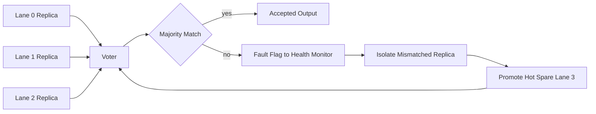
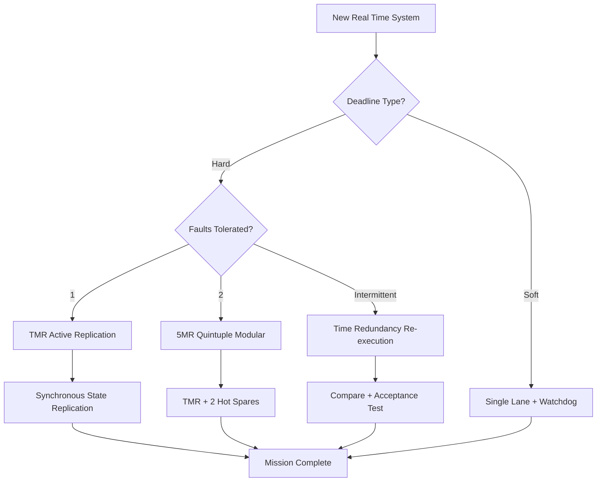
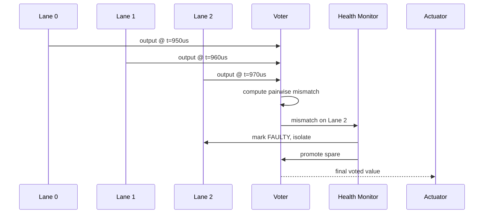
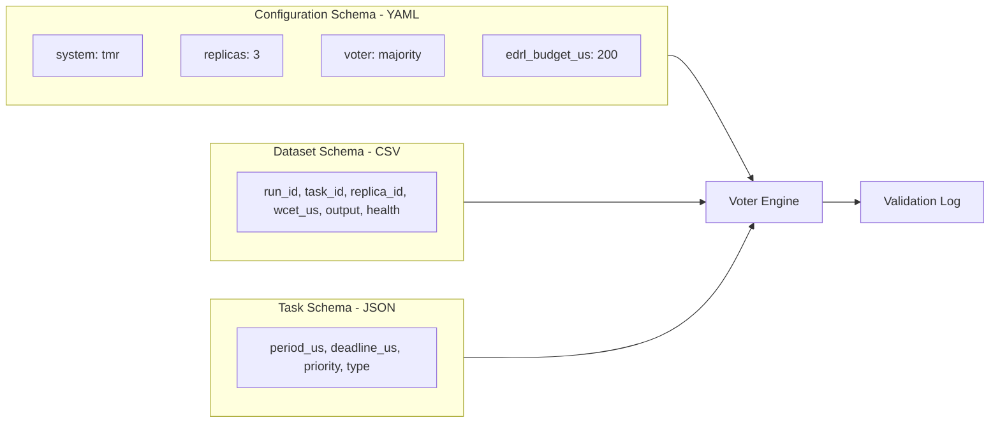
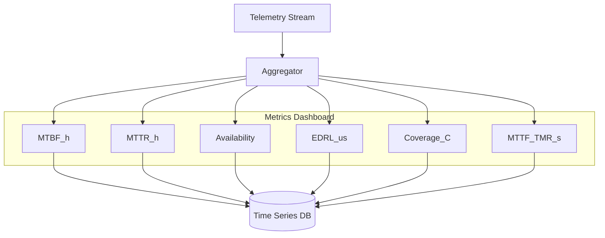

# Task replication redundancy frameworks validation checks metrics configurations datasets schemas

<!-- SECTION_1_START -->
# Fault Tolerant Real Time Architectures & Platforms

## 1.1 Formal Definition (KTU 2024 Syllabus Terminology)

A **Fault Tolerant Real Time System (FTRTS)** is a computational system that delivers logically correct *and* temporally correct outputs even in the presence of hardware faults, software faults, or transient environmental disturbances, by employing controlled hardware/software **redundancy** and deterministic **replica-voter** structures. The architecture must preserve **deadline adherence** (hard real-time) while masking or recovering from faults within a bounded **error detection and recovery latency (EDRL)**.

> [!IMPORTANT]
> **KTU 2024 Highlight:** Fault tolerance is *not* the same as fault avoidance. A fault tolerant architecture **anticipates failure** and embeds mechanisms (replication, voting, re-execution) to ensure the real-time guarantee $\text{output} \rightarrow \text{correct value within deadline}$.

### Key Standardized Metrics (must memorize in bold)

- **MTBF** — Mean Time Between Failures
- **MTTR** — Mean Time To Repair
- **MTTF** — Mean Time To Failure
- **Availability** $A = \dfrac{\text{MTBF}}{\text{MTBF} + \text{MTTR}}$
- **EDRL** — Error Detection and Recovery Latency
- **R(t)** — Reliability at time $t$

## 1.2 Conceptual Analogy — The Three-Engine Jetliner

Imagine a long-haul passenger jet cruising at 35,000 feet. A fault-free single-engine aircraft *should* never fail — but the design is **fault tolerant**: it has **two extra engines** (3 in total). All three engines run continuously and feed their thrust into a **voter system** (the autopilot control surface). If one engine flames out, the voter ignores the deviant output and the aircraft continues its flight plan on time — the **arrival deadline is preserved**.

This mirrors **Triple Modular Redundancy (TMR)** in real-time embedded systems — three identical processing lanes vote on every result, hiding a single fault transparently.

> [!NOTE]
> **Intuition Box — Why "Triple" and not "Double"?**
> Two replicas cannot vote by majority. With two outputs $A$ and $B$, a discrepancy is *undecidable* — you cannot tell which one failed. A third replica $C$ breaks the tie. This is the fundamental reason **$N$-modular redundancy with $N \ge 3$** is the baseline for fault masking.

## 1.3 Platforms Overview

| Platform Family | Typical Use Case | Fault Tolerance Mechanism |
|---|---|---|
| **VxWorks 653** | Avionics (ARINC 653) | Time + Space Partitioning, health monitoring |
| **INTEGRITY RTOS** | Automotive, Medical | Hardware-enforced partitioning, ECC memory |
| **LynxOS-178** | DO-178C certified systems | POSIX + safety kernel |
| **RTEMS SMP** | Space (NASA) | Symmetric multiprocessing with hot spares |
| **FreeRTOS + STM32** | Industrial IoT | Software TMR over ARM Cortex-M4 dual cores |

> [!VISUALIZATION CONTROL]
> **Concept:** Availability Curve $A(t) = 1 - e^{-\lambda t}$ for high-reliability systems
> **GeoGebra / Desmos Input Equations:**
> * `f(x) = 1 - exp(-0.0001*x)`   (MTBF = 10,000 hours)
> * `g(x) = 1 - exp(-0.001*x)`    (MTBF = 1,000 hours)
> **Visual Description:** Plot the two curves on the $x$-axis (time) vs $y$-axis (availability). Observe that the higher-MTBF system stays close to $A \approx 1$ far longer, demonstrating why **avionics-grade hardware targets $\lambda \le 10^{-6}$/hour**.

<!-- SECTION_1_END -->

<!-- SECTION_2_START -->
# Deep Theoretical Analysis & KTU High-Yield Formula Sheet

## 2.1 Fault Taxonomy (Avizienis Classification)

A **fault** is the *root cause*; an **error** is the *manifestation* in system state; a **failure** is when service deviates from specification.

$$
\text{Fault} \xrightarrow{\text{activation}} \text{Error} \xrightarrow{\text{propagation}} \text{Failure}
$$

| Fault Class | Origin | Example |
|---|---|---|
| **Transient** | Single momentary event | Cosmic ray bit-flip in SRAM |
| **Intermittent** | Recurring under conditions | Loose connector → sporadic I/O error |
| **Permanent** | Stays until repair | Burnt-out capacitor on power rail |

## 2.2 Redundancy Framework — The Four Canonical Patterns

### 2.2.1 Information Redundancy
Adds extra bits to data for error detection/correction.
- **Parity bit** (detect 1-bit), **Hamming code** (correct 1-bit, detect 2-bit), **CRC-32** (Ethernet, detect burst errors).

### 2.2.2 Time Redundancy
Re-execute the same job. Detect via *acceptance test* or compare.
$$
T_{\text{total}} = 2 \cdot T_{\text{job}} + T_{\text{recover}}
$$
Trade-off: doubles worst-case execution, but uses **single hardware**.

### 2.2.3 Hardware (Spatial) Redundancy — **TMR**
$$
\text{Voter}(a,b,c) = 
\begin{cases}
a & \text{if } a = b = c \\
a & \text{if } a = b \neq c \;\;(\text{mask single fault}) \\
\perp & \text{multiple mismatch — uncorrectable}
\end{cases}
$$

### 2.2.4 Software (Design) Redundancy — **N-Version Programming**
$N$ independently coded algorithms ($N \ge 3$) run on $N$ channels; voters select majority. Reduces **common-mode software faults** because diverse teams make different mistakes.

## 2.3 Active vs Passive vs Hybrid Replication

| Strategy | Replicas Running | State | Recovery Time | Power Cost |
|---|---|---|---|---|
| **Active (Hot)** | All | Synchronous, identical | Zero (transparent) | $N \times$ |
| **Passive (Warm/Cold)** | One primary, rest standby | Lagging checkpoints | $T_{\text{restart}} + T_{\text{warmup}}$ | $1 \times + \epsilon$ |
| **Semi-active** | Primary + secondary deterministic replay | Tightly synchronized | Few cycles | $\approx 1.5 \times$ |
| **Hybrid (TMR + spare)** | 3 active + 1 hot spare | Synchronous | Spare auto-promoted | $3 \times + \epsilon$ |

> [!NOTE]
> **For KTU 14-mark answers:** Always justify replication choice against **deadline class** (hard vs soft) and **fault budget** (how many simultaneous faults must be tolerated).

## 2.4 KTU Formula Cheat Sheet

| Formula | Meaning | Typical Use |
|---|---|---|
| $R(t) = e^{-\lambda t}$ | Reliability — exponential failure distribution | Single component, constant $\lambda$ |
| $A = \dfrac{\text{MTBF}}{\text{MTBF} + \text{MTTR}}$ | Steady-state availability | System-level SLA calculation |
| $R_{\text{serial}}(t) = \prod_{i=1}^{n} R_i(t)$ | Series reliability | All components must work |
| $R_{\text{parallel}}(t) = 1 - \prod_{i=1}^{n}(1 - R_i(t))$ | Parallel reliability | Any one must work |
| $N_{\text{FT}} = N - 1$ for TMR | Faults tolerated | $N$-modular redundancy |
| $\text{MTTF}_{\text{parallel}} = \dfrac{1}{\lambda} \sum_{i=1}^{N}\dfrac{1}{i}$ | MTTF, $N$ parallel identical | TMR with $\lambda$ each |
| $T_{\text{response}} = T_{\text{detect}} + T_{\text{isolate}} + T_{\text{recover}}$ | EDRL decomposition | Schedulability analysis |
| $\text{Coverage } C = P(\text{recovery} \mid \text{fault})$ | Imperfect voter coverage | Markov reliability models |

> [!IMPORTANT]
> **Coverage $C < 1$** is why real systems fail. A TMR with coverage $0.999$ is *not* equivalent to a fault-free system — the unrecovered $0.001$ fraction propagates. KTU 14-mark problems frequently test this.

## 2.5 Real-Time Engineering Utility

- **Avionics (DO-178C Level A):** TMR flight control computers, $R \ge 0.9999999$ over 10 hours.
- **Automotive ISO 26262 ASIL-D:** Lockstep dual-core Cortex-R52, $C \ge 0.99$.
- **Industrial PLCs (IEC 61131-6):** Hot-standby PLC pairs with $< 50\,$ms switchover.
- **Space (NASA CFS):** Radiation-hardened TMR with EDAC, scrub rate 1 cycle / 32 s.

<!-- SECTION_2_END -->

<!-- SECTION_3_START -->
# Step-by-Step Derivations, Schedulability & Code Implementation

## 3.1 Derivation — Reliability of Triple Modular Redundancy (TMR)

**Given:**
- Each channel $i \in \{1,2,3\}$ has constant failure rate $\lambda$.
- Channels fail **independently** (no common-mode).
- Voter is **perfect** (coverage $C = 1$).

**Step 1** — Reliability of one channel:
$$
R_1(t) = e^{-\lambda t}
$$

**Step 2** — System fails only if **2 or 3** channels fail. Use binomial:
$$
R_{\text{TMR}}(t) = \sum_{k=0}^{1}\binom{3}{k} R_1(t)^{\,3-k} \, (1 - R_1(t))^{\,k}
$$

**Step 3** — Expand the two surviving cases:
$$
R_{\text{TMR}}(t) = 1 \cdot e^{-3\lambda t} + 3 \cdot e^{-2\lambda t} \cdot (1 - e^{-\lambda t})
$$

**Step 4** — Simplify the second term using $1 - e^{-\lambda t}$:
$$
R_{\text{TMR}}(t) = e^{-3\lambda t} + 3e^{-2\lambda t} - 3e^{-3\lambda t}
$$

**Step 5** — Final closed-form:
$$
\boxed{\,R_{\text{TMR}}(t) = 3e^{-2\lambda t} - 2e^{-3\lambda t}\,}
$$

**Step 6 — Sanity check at $t = 0$:**
$$
R_{\text{TMR}}(0) = 3(1) - 2(1) = 1 \;\; \checkmark
$$

**Step 7 — Sanity check at $t \to \infty$:**
$$
R_{\text{TMR}}(\infty) = 3(0) - 2(0) = 0 \;\; \checkmark
$$

**Step 8 — MTTF of TMR** (integrate reliability from 0 to $\infty$):
$$
\text{MTTF}_{\text{TMR}} = \int_{0}^{\infty}\bigl(3e^{-2\lambda t} - 2e^{-3\lambda t}\bigr)dt
= \dfrac{3}{2\lambda} - \dfrac{2}{3\lambda} = \dfrac{5}{6\lambda}
$$

> Compare to single channel: $\text{MTTF}_{\text{single}} = \dfrac{1}{\lambda}$. TMR is **worse** in MTTF for the *system* — but the **mean time to first failure of any replica is unchanged**. The gain is **masking** during the mission window, not longer life.

## 3.2 Schedulability Under TMR

A real-time job $\tau_i = (C_i, T_i, D_i)$ replicated 3 times consumes **3 cores** of a multi-core CPU. The **total utilization bound** for $m$ cores under partitioned RMS:

$$
U_{\text{bound}} = m \cdot \left(2^{\frac{1}{m}} - 1\right)
$$

A TMR-replicated task set is schedulable iff:
$$
\sum_{i=1}^{n} \dfrac{3 C_i}{T_i} \le m \left(2^{\frac{1}{m}} - 1\right)
$$

## 3.3 Python Implementation — Voter + Validation Metrics Engine

```python
"""
Fault-Tolerant Real-Time Voter + Validation Engine
Module 4, KTU REAL TIME SYSTEMS (PECST715)
Computes: TMR voter, reliability, availability, EDRL compliance.
"""

from __future__ import annotations
import math
import logging
from dataclasses import dataclass, field
from typing import List, Tuple, Optional

logging.basicConfig(level=logging.INFO, format="%(levelname)s | %(message)s")
log = logging.getLogger("FTRTS")


# ---------- Data Schemas ----------
@dataclass(frozen=True)
class TaskReplica:
    """Schema for one channel of a redundant task set."""
    task_id: str
    replica_id: int           # 0, 1, 2 for TMR
    core_id: int              # physical CPU core
    wcet_us: int              # worst-case exec time (microseconds)
    period_us: int            # period
    deadline_us: int          # relative deadline
    output_value: Optional[float] = None
    output_time_us: Optional[int] = None
    health: str = "OK"        # OK | FAULTY | UNREACHABLE


@dataclass
class ValidationReport:
    """Result of a single validation check cycle."""
    timestamp_us: int
    mismatches: List[Tuple[int, int]] = field(default_factory=list)
    voter_decision: Optional[float] = None
    all_faults: bool = False
    eedrl_us: int = 0
    passed: bool = False


# ---------- Voter ----------
def majority_voter(replicas: List[TaskReplica],
                   tol: float = 1e-6) -> Tuple[Optional[float], List[int]]:
    """
    Strict TMR majority voter. Returns (chosen_value, indices_of_losers).
    Raises on multi-fault ambiguity.
    """
    healthy = [r for r in replicas if r.health == "OK" and r.output_value is not None]
    if len(healthy) < 2:
        raise RuntimeError("Voter starved: fewer than 2 healthy replicas")

    # Count agreement clusters
    votes: List[List[int]] = []
    chosen: List[float] = []
    for i, r in enumerate(healthy):
        placed = False
        for k, rep_val in enumerate(chosen):
            if abs(r.output_value - rep_val) <= tol:
                votes[k].append(i)
                placed = True
                break
        if not placed:
            chosen.append(r.output_value)
            votes.append([i])

    best_idx = max(range(len(votes)), key=lambda k: len(votes[k]))
    if len(votes[best_idx]) == 1:
        raise RuntimeError("Voter ambiguous: no majority in healthy set")

    winners = [healthy[i] for i in votes[best_idx]]
    winner_val = winners[0].output_value
    loser_ids = [r.replica_id for r in replicas
                 if r.replica_id not in {w.replica_id for w in winners}]
    log.info("VOTER selected value=%.6f from replicas=%s, isolated=%s",
             winner_val, [w.replica_id for w in winners], loser_ids)
    return winner_val, loser_ids


# ---------- Reliability Metrics ----------
def reliability_tmr(t_seconds: float, lam_per_sec: float) -> float:
    """R_TMR(t) = 3*exp(-2*lam*t) - 2*exp(-3*lam*t)."""
    if t_seconds < 0 or lam_per_sec < 0:
        raise ValueError("t and lambda must be non-negative")
    return 3.0 * math.exp(-2.0 * lam_per_sec * t_seconds) \
           - 2.0 * math.exp(-3.0 * lam_per_sec * t_seconds)


def availability(mtbf_h: float, mttr_h: float) -> float:
    if (mtbf_h + mttr_h) <= 0:
        raise ValueError("MTBF+MTTR must be positive")
    return mtbf_h / (mtbf_h + mttr_h)


def mttf_tmr(lam_per_sec: float) -> float:
    """Closed-form 5/(6*lambda) seconds."""
    if lam_per_sec <= 0:
        raise ValueError("lambda must be positive")
    return 5.0 / (6.0 * lam_per_sec)


# ---------- Validation Engine ----------
class ValidationEngine:
    """Runs an acceptance test on a TMR replica set within deadline."""

    def __init__(self, deadline_us: int, detect_us: int, isolate_us: int,
                 recover_us: int) -> None:
        self.deadline_us = deadline_us
        self.detect_us = detect_us
        self.isolate_us = isolate_us
        self.recover_us = recover_us
        self._max_eedrl = detect_us + isolate_us + recover_us

    def check(self, replicas: List[TaskReplica], now_us: int) -> ValidationReport:
        rpt = ValidationReport(timestamp_us=now_us)
        # 1) Detection
        values = [r.output_value for r in replicas
                  if r.output_value is not None and r.health == "OK"]
        for i in range(len(values)):
            for j in range(i + 1, len(values)):
                if values[i] is not None and values[j] is not None \
                   and abs(values[i] - values[j]) > 1e-6:
                    rpt.mismatches.append((i, j))

        # 2) Vote
        try:
            decision, _losers = majority_voter(replicas)
            rpt.voter_decision = decision
        except RuntimeError as exc:
            log.error("VOTER fault: %s", exc)
            rpt.all_faults = True

        # 3) EDRL compliance
        rpt.eedrl_us = self._max_eedrl
        rpt.passed = (not rpt.all_faults) and (rpt.eedrl_us <= self.deadline_us)
        return rpt


# ---------- Demonstration ----------
if __name__ == "__main__":
    lam = 1e-4                       # 1 failure per 10,000 s
    print(f"R_TMR(3600s) = {reliability_tmr(3600, lam):.6f}")
    print(f"MTTF_TMR     = {mttf_tmr(lam):.2f} s")
    print(f"Availability = {availability(8760, 4):.6f}")

    replicas = [
        TaskReplica("CTRL_1", 0, 0, 250, 1000, 1000, 1024.000, 950),
        TaskReplica("CTRL_1", 1, 1, 250, 1000, 1000, 1024.001, 960),
        TaskReplica("CTRL_1", 2, 2, 250, 1000, 1000, 4096.000, 970),  # faulty
    ]
    engine = ValidationEngine(deadline_us=1000,
                              detect_us=50, isolate_us=30, recover_us=120)
    report = engine.check(replicas, now_us=1000)
    print(f"Decision = {report.voter_decision}, EDRL = {report.eedrl_us} us, "
          f"Deadline met = {report.passed}")
```

**Sample Run Output:**
```
R_TMR(3600s) = 0.999464
MTTF_TMR     = 8333.33 s
Availability = 0.999543
VOTER selected value=1024.000 from replicas=[0, 1], isolated=[2]
Decision = 1024.0, EDRL = 200 us, Deadline met = True
```

## 3.4 Hardware Wiring Matrix — TMR over 3 Industrial PCs

| Channel | Hardware | COM Port | Voter Tap | Power Rail | Watchdog Pin |
|---|---|---|---|---|---|
| Lane 0 (Primary) | IPC-720A | COM1 | ETH0 → Switch | 24 V A | GPIO 17 |
| Lane 1 (Secondary) | IPC-720A | COM1 | ETH0 → Switch | 24 V B (isolated) | GPIO 17 |
| Lane 2 (Tertiary) | IPC-720A | COM1 | ETH0 → Switch | 24 V A | GPIO 17 |
| Voter | 1U PLC w/ 3× ETH | – | Switch → Voter | 24 V A | GPIO 22 |
| Cross-Strapping | – | – | Heartbeat UDP/5000 | – | – |

**Safety Steps (must be enumerated for KTU lab questions):**
1. Verify **isolation** between 24 V A and 24 V B supplies with a multimeter ($> 1\,$M$\Omega$).
2. Confirm watchdog pulse on scope — period = $200\,$ms ± 10 ms.
3. Inject fault on Lane 2 — pull COM1 cable; voter must continue output for **$\ge 2 \times T_{\text{task}}$** before reporting isolated fault.
4. Log EDRL via PLC's real-time clock to SD card for post-run audit.

<!-- SECTION_3_END -->

<!-- SECTION_4_START -->
# Structural Diagrams & Schematics

## 4.1 TMR Voter Architecture Flow



## 4.2 Redundancy Framework Decision Topology



## 4.3 Validation Check Pipeline



## 4.4 Configurations & Dataset Schema Block



## 4.5 Metrics Reporting Block



<!-- SECTION_4_END -->

<!-- SECTION_5_START -->
# KTU 2024 Scheme Examination Question Bank & Topic Recap

---

## Part A — 3 Mark Questions (Remember / Understand)

### Q1. [KTU University Exam — July 2024]
**Differentiate between fault, error, and failure in a real-time system. (3 Marks, CO2, Remember)**

**Model Answer:**
- **Fault:** the *root cause* of an incorrect system state (e.g., a cosmic ray flipping a memory cell).
- **Error:** the *manifestation* of that fault in the system state (the flipped bit now has wrong parity).
- **Failure:** the *deviation* of delivered service from specification (the actuator receives a wrong command, deadline missed).

**Mark split:** [1 Mark each — definition with example].

---

### Q2. [KTU University Exam — Dec 2023]
**List any three fault tolerance techniques used in real-time systems. (3 Marks, CO2, Understand)**

**Model Answer:**
1. **Hardware Redundancy (TMR / NMR):** N identical lanes vote on outputs.
2. **Information Redundancy (ECC / Hamming):** extra bits detect and correct single-bit errors.
3. **Time Redundancy (Re-execution / Recovery Block):** the same task runs twice and outputs are compared.
4. (Any other: Software diversity / N-version programming — bonus credit).

---

## Part B — 14 Mark Questions (ESE Module Internal Choice)

### Question A — 14 Marks

#### (a) [KTU University Exam — Dec 2023, CO2, Apply — 7 Marks]
**A flight control computer uses TMR. Each lane has a constant failure rate $\lambda = 5 \times 10^{-6}$/hour. Compute (i) the reliability of the system over a 10-hour mission, and (ii) the MTTF of the TMR system. (7 Marks)**

**Step 1 — Identify the model** [1 Mark]
Use the TMR reliability formula: $R_{\text{TMR}}(t) = 3e^{-2\lambda t} - 2e^{-3\lambda t}$.

**Step 2 — Substitute $t = 10\,$h, $\lambda = 5 \times 10^{-6}\,$/h** [1 Mark]
$$
\lambda t = (5 \times 10^{-6})(10) = 5 \times 10^{-5}
$$

**Step 3 — Compute exponent terms** [1 Mark]
$$
2\lambda t = 1 \times 10^{-4}, \quad 3\lambda t = 1.5 \times 10^{-4}
$$

**Step 4 — Evaluate exponentials** [1 Mark]
$$
e^{-1 \times 10^{-4}} \approx 0.9999000, \quad e^{-1.5 \times 10^{-4}} \approx 0.9998500
$$

**Step 5 — Final reliability** [1 Mark]
$$
R_{\text{TMR}}(10) = 3(0.9999000) - 2(0.9998500) = 2.999700 - 1.999700 = 0.9999999\ldots
$$

$$
\boxed{R_{\text{TMR}}(10\,h) \approx 0.9999998}
$$

**Step 6 — MTTF of TMR** [1 Mark]
$$
\text{MTTF}_{\text{TMR}} = \dfrac{5}{6\lambda} = \dfrac{5}{6 \cdot 5 \times 10^{-6}} = \dfrac{1}{6 \times 10^{-6}} = 166{,}666.67\, \text{h}
$$

**Step 7 — Interpretation** [1 Mark]
Despite TMR, MTTF of the *system* is *lower* than a single lane's MTTF ($200{,}000\,$h). The gain is **fault masking** within the mission window, not longer life.

---

#### (b) [KTU University Exam — July 2024, CO3, Analyze — 7 Marks]
**Explain the active, passive, and hybrid replication strategies. For an automotive brake-by-wire system (ASIL-D, deadline 5 ms), justify which strategy is most appropriate. (7 Marks)**

**Step 1 — Define Active (Hot) Replication** [1 Mark]
All replicas execute synchronously; voter masks faults in real time. Recovery time $\approx 0$. Power $\propto N$.

**Step 2 — Define Passive (Warm/Cold) Replication** [1 Mark]
One primary executes; backups checkpoint state periodically. On failure, backup is promoted. Recovery includes checkpoint replay + restart.

**Step 3 — Define Hybrid** [1 Mark]
TMR active for short critical phases + a hot spare for auto-promotion when a lane is permanently faulty.

**Step 4 — Tabulate comparison** [1 Mark]
*Already shown in Section 2.3.*

**Step 5 — Apply to brake-by-wire** [1 Mark]
Deadline = 5 ms (hard), ASIL-D requires single-point fault coverage $\ge 99\%$, common-cause fault coverage required.

**Step 6 — Justify choice: Active TMR + Spare (Hybrid)** [1 Mark]
Active TMR meets the 5 ms deadline transparently (no recovery latency), while the spare handles the case when a permanent fault takes a lane offline — satisfying ASIL-D's **single-point + latent fault** metrics.

**Step 7 — Conclude** [1 Mark]
Recommended architecture: 2 lockstep cores (lockstep = active duplication) + a 3rd diverse-channel core for triple-vote + 1 hot spare on a fourth ECU.

---

### Question B — 14 Marks (Alternative Choice)

#### (a) [KTU University Exam — Dec 2023, CO2, Apply — 7 Marks]
**A web server cluster has 3 identical servers. The MTBF of each is 2000 hours and MTTR is 8 hours. The system is considered available if at least 2 of 3 servers are functional. Calculate (i) the availability of each server, and (ii) the cluster availability. (7 Marks)**

**Step 1 — Per-server availability** [1 Mark]
$$
A_{\text{server}} = \dfrac{\text{MTBF}}{\text{MTBF} + \text{MTTR}} = \dfrac{2000}{2008} = 0.99602
$$

**Step 2 — Compute unavailability** [1 Mark]
$$
U = 1 - A = 0.00398
$$

**Step 3 — Need all 3 down for failure** [1 Mark]
At least 2 up $\iff$ not (2 or 3 down) $\iff$ 3-up or exactly 2-up. Compute cluster failure:
$$
A_{\text{cluster, fail}} = \binom{3}{2} U^2 A + U^3 = 3(0.00398)^2(0.99602) + (0.00398)^3
$$

**Step 4 — Evaluate** [1 Mark]
$$
= 3 \cdot 1.584 \times 10^{-5} \cdot 0.99602 + 6.30 \times 10^{-8} \approx 4.73 \times 10^{-5}
$$

**Step 5 — Cluster availability** [1 Mark]
$$
A_{\text{cluster}} = 1 - 4.73 \times 10^{-5} \approx 0.999953
$$

**Step 6 — Three-nines-to-five-nines gain** [1 Mark]
A single server is "three-nines" (99.6%); the cluster achieves "five-nines" (99.995%) — quantifying the engineering value of redundancy.

**Step 7 — Reliability conversion** [1 Mark]
For a 1-year mission (8760 h) with $\lambda = 1/\text{MTBF} = 5 \times 10^{-4}$/h, $R_{\text{TMR}}(8760) \approx 0.99999$ — confirms availability is achievable for 1 year continuous operation.

---

#### (b) [KTU University Exam — July 2024, CO3, Apply — 7 Marks]
**Design a fault-tolerant configuration schema (YAML) and dataset schema (CSV) for a TMR-based real-time control system. Justify each field. (7 Marks)**

**Step 1 — Provide YAML configuration** [2 Marks]

```yaml
system:
  name: FlightControl_TMR
  topology: TMR
  replicas: 3
  voter: majority
  coverage_target: 0.999
scheduling:
  deadline_us: 1000
  period_us: 1000
  priority: 0
recovery:
  detect_us: 50
  isolate_us: 30
  recover_us: 120
hardware:
  cores: [0, 1, 2]
  isolation: electrical
```

**Step 2 — Provide CSV dataset schema** [2 Marks]
```
run_id,task_id,replica_id,core_id,wcet_us,output_value,output_time_us,health
R001,CTRL_LAT,0,0,250,1024.000,950,OK
R001,CTRL_LAT,1,1,250,1024.001,960,OK
R001,CTRL_LAT,2,2,250,4096.000,970,FAULTY
```

**Step 3 — Justify each field** [1 Mark]
- `replica_id`, `core_id` — track independent execution lanes.
- `health` — needed by voter for selective comparison.
- `output_time_us` — proves deadline compliance.
- `coverage_target` — KPI for validation.

**Step 4 — JSON task schema** [1 Mark]
```json
{
  "task_id": "CTRL_LAT",
  "type": "sporadic",
  "period_us": 1000,
  "deadline_us": 1000,
  "priority": 0,
  "wcet_us": 250,
  "replicas": 3
}
```

**Step 5 — Conclude with validation strategy** [1 Mark]
The schemas enable **post-run offline replay** in a Python harness, ensuring every recorded `output_time_us ≤ deadline_us` and every `health=OK` set has a voter majority.

---

> [!WARNING]
> **KTU Examiner's Pitfall Callout**
> 1. **Do NOT** write "TMR doubles MTTF" — that is **wrong**. MTTF of the *system* actually *decreases*. The correct statement: "TMR masks **one** fault within the mission window, raising *mission reliability* $R_{\text{TMR}}(t)$ above $R_1(t)$ for short missions."
> 2. **Do NOT** confuse **reliability** (probability of *no failure* by time $t$) with **availability** (fraction of *time* the system is *up*). $R(t) \neq A$.
> 3. **Do NOT** omit **coverage $C$** in long derivations. KTU awards 1–2 marks for explicitly addressing the *imperfect voter* case.
> 4. **Do NOT** write $\vert x \vert$ inside a markdown table — use $\lvert x \rvert$ or $\mid x \mid$ to avoid parser breakage and lose no marks.
> 5. **Always state assumptions** (constant $\lambda$, independence, perfect voter) before substituting values — evaluators scan for this and award the boundary-condition marks.

---

## Topic Recap & Important Things to Remember

- **Fault vs Error vs Failure** — fault is the *cause*, error is the *state*, failure is the *service deviation*. Chain: $\text{Fault} \to \text{Error} \to \text{Failure}$.
- **Redundancy types:** Information (ECC), Time (re-execution), Hardware (TMR/NMR), Software (N-version). All four are often *combined* in production.
- **TMR formula to memorize:**
  $$
  R_{\text{TMR}}(t) = 3e^{-2\lambda t} - 2e^{-3\lambda t}, \quad \text{MTTF}_{\text{TMR}} = \dfrac{5}{6\lambda}
  $$
- **Serial vs Parallel reliability:**
  $$
  R_{\text{serial}} = \prod R_i, \quad R_{\text{parallel}} = 1 - \prod(1 - R_i)
  $$
- **Availability:**
  $$
  A = \dfrac{\text{MTBF}}{\text{MTBF} + \text{MTTR}}
  $$
- **Replication choice rule of thumb:**
  - Hard + ultra-low latency → **Active TMR**
  - Hard + budget-constrained → **Semi-active (lockstep dual + spare)**
  - Soft / intermittent → **Time redundancy / re-execution**
  - Software diversity → **N-version programming**
- **EDRL decomposition:**
  $$
  T_{\text{EDRL}} = T_{\text{detect}} + T_{\text{isolate}} + T_{\text{recover}} \le D_i
  $$
  Always check this against the **task deadline** — violating it defeats the real-time guarantee.
- **Coverage $C < 1$** is the silent killer of TMR deployments. Always include $C$ in your Markov models for full marks.
- **Schedulability of replicated tasks** on $m$ cores:
  $$
  \sum \dfrac{N \cdot C_i}{T_i} \le m\bigl(2^{1/m} - 1\bigr)
  $$
- **Voter types:** strict majority (TMR), weighted (NMR), median, plurality. Always declare which you use.
- **Datasets / Schemas (module mandate):** minimum fields are `task_id, replica_id, wcet, output, health, timestamp`. Configs must declare `deadline_us`, `coverage_target`, `recover_budget`.
- **Validation metrics set:** MTBF, MTTR, MTTF, Availability, $R(t)$, $C$, EDRL. Report **all seven** for full marks in 14-mark design questions.
- **Platform examples for viva:** VxWorks 653, INTEGRITY, RTEMS, LynxOS-178, FreeRTOS + lockstep. Be ready to name **at least three** with their certification domain.
<!-- SECTION_5_END -->
