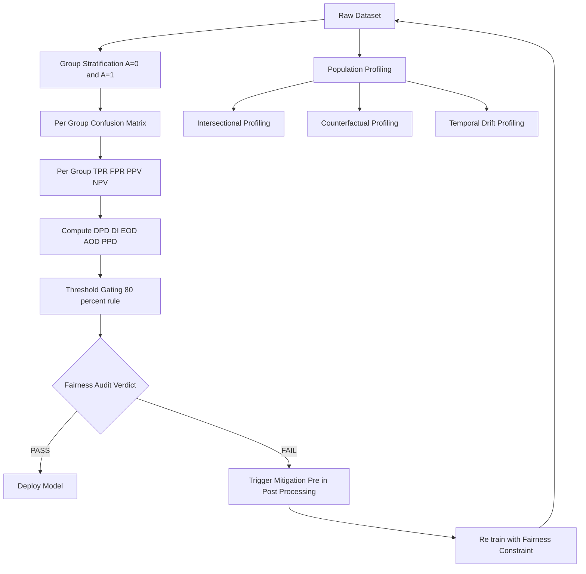
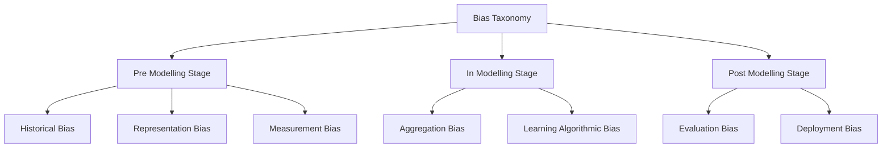
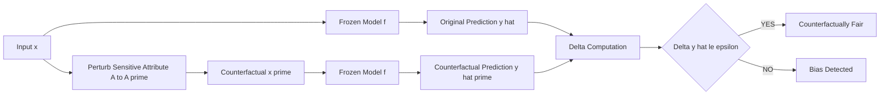

# Algorithmic bias classification metrics detection formulas profiles metrics definition

<!-- SECTION_1_START -->

# Algorithmic Bias — Classification, Metrics, Detection Formulas & Profiles

## 1.1 Formal Academic Definition (KTU 2024 Syllabus Terminology)

**Algorithmic Bias** is defined as the systematic and repeatable deviation of an algorithmic decision system from the principle of neutrality, producing outcomes that systematically disadvantage or favor individuals or groups on the basis of protected, sensitive, or socially-constructed attributes (such as gender, race, age, caste, religion, or socioeconomic status).

In the context of a supervised classifier $f: \mathcal{X} \rightarrow \mathcal{Y}$ trained on a dataset $\mathcal{D} = \{(x_i, y_i, a_i)\}_{i=1}^{N}$, where $a_i \in \mathcal{A}$ denotes a sensitive attribute, algorithmic bias manifests when the conditional distribution $P(\hat{Y} \mid X, A)$ differs significantly across strata of $\mathcal{A}$, violating one or more fairness criteria.

> [!IMPORTANT]
> **KTU 2024 Module Highlight (PECST716)**
> Bias is *not* synonymous with low accuracy. A model may achieve **99% accuracy** and still be deeply biased. The ethical and legal failure lies in *disparate treatment* or *disparate impact* across protected groups, not in raw predictive error.

## 1.2 Intuitive Analogy — The "Apartment Renter's Filter" Metaphor

Imagine a property management firm deploys an **automated tenant-screening system** trained on 10 years of historical rental data. The training data reflects a *biased* historical reality: landlords preferentially approved married couples over single applicants. The system learns to *down-score* single applicants (perhaps through correlated proxy variables like "household size" or "evening contact hours").

- A *qualified* single applicant is rejected.
- An *unqualified* married couple is approved.
- The system is **statistically accurate** (it mirrors history) yet **morally and legally unfair**.

This is *algorithmic bias*: the *systematization* of historical inequity through a mathematical model that lacks the contextual awareness to distinguish *correlation* from *causation*, or *pattern* from *prejudice*.

> [!NOTE]
> **Core Conceptual Distinction**
> - **Bias in Statistics** → deviation between predicted and true value (e.g., estimator bias $\mathbb{E}[\hat{\theta}] - \theta$).
> - **Bias in Fairness / Ethics** → systematic disparate treatment of demographic groups.
> These are *orthogonal* concepts that share a name. KTU examiners may test this distinction.

## 1.3 Taxonomy of Algorithmic Bias — Classification Profile

Bias can be classified along **three orthogonal axes**: (i) *Source*, (ii) *Stage of Pipeline*, and (iii) *Direction of Disparity*.

### 1.3.1 By Source (Origin)

| # | Bias Type | Definition | KTU-Relevant Example |
|---|-----------|------------|----------------------|
| 1 | **Historical Bias** | Pre-existing societal inequity encoded in data before modelling begins | Past gender-pay data showing women earn less |
| 2 | **Representation / Sample Bias** | Training data does not reflect the true population distribution | Facial recognition under-performing on darker-skinned faces |
| 3 | **Measurement Bias** | Features/proxy labels are measured differently across groups | Arrest records as proxy for "crime" (biased policing) |
| 4 | **Aggregation Bias** | A single model is fit to heterogeneous subgroups | One glucose model for diabetic & non-diabetic patients |
| 5 | **Learning Bias** | Model architecture/objective amplifies existing skew | Class imbalance + standard loss function |
| 6 | **Evaluation Bias** | Benchmark datasets are not representative | ImageNet over-representing Western cultures |
| 7 | **Deployment Bias** | Model used outside intended context | Healthcare model trained on one hospital, deployed on another |

### 1.3.2 By Pipeline Stage (MIT Sloan / Suresh & Guttag, 2021)

A widely-cited framework (mandatory reading for KTU Module 1) classifies bias as:

1. **Pre-modelling bias** → historical, representation, measurement.
2. **In-modelling bias** → aggregation, learning bias.
3. **Post-modelling bias** → evaluation, deployment.

### 1.3.3 By Direction of Disparity

- **Disparate Treatment** (Direct Bias) — sensitive attribute $A$ explicitly used in the decision.
- **Disparate Impact** (Indirect / Proxy Bias) — $A$ not used, but a correlated proxy $Z$ creates unequal outcomes.

> [!VISUALIZATION CONTROL]
> **Concept:** Group-wise Selection Rate Comparison
> **GeoGebra / Desmos Input Equations:**
> * `GroupA_Rate(x) = 0.62` (constant line for privileged group selection rate)
> * `GroupB_Rate(x) = 0.38` (constant line for unprivileged group selection rate)
> * `Threshold(x) = 0.50` (dashed horizontal threshold)
> * `Fairness_Parity_Line(x) = 0.50` (idealized parity)
> **Visual Description:** Two parallel horizontal lines on a unit-interval plot, illustrating a 0.62 vs 0.38 selection-rate gap. The "disparate impact ratio" of 0.38 / 0.62 ≈ 0.61 visually violates the **80 % rule** (threshold 0.80).

---

<!-- SECTION_1_END -->

<!-- SECTION_2_START -->

# 2. Deep Theoretical Analysis & KTU High-Yield Formula Sheet

## 2.1 The Group-Confusion-Matrix Framework

For a binary classifier with sensitive attribute $A \in \{0, 1\}$ (e.g., 0 = unprivileged, 1 = privileged), we construct **two independent confusion matrices**, one per subgroup. This decomposition is the foundation of *all* fairness metrics.

For group $a \in \{0, 1\}$:

| Symbol | Meaning | Group-$a$ Value |
|--------|---------|------------------|
| $TP_a$ | True Positives | $a$-group correctly predicted positive |
| $FP_a$ | False Positives | $a$-group incorrectly predicted positive |
| $TN_a$ | True Negatives | $a$-group correctly predicted negative |
| $FN_a$ | False Negatives | $a$-group incorrectly predicted negative |
| $P_a$ | Actual Positives | $TP_a + FN_a$ |
| $N_a$ | Actual Negatives | $TN_a + FP_a$ |

## 2.2 KTU Formula Sheet — Bias Quantification Metrics

> [!NOTE]
> **Notation Convention:** Subscript $a$ denotes the metric computed on group $a$ only. The "gap" or "difference" between two groups is what is assessed for fairness.

### 2.2.1 Confusion-Matrix-Derived Rates (per group)

$$
\begin{aligned}
TPR_a \;(\text{Recall, Sensitivity}) &= \frac{TP_a}{TP_a + FN_a} \\
FPR_a \;(\text{Fall-out}) &= \frac{FP_a}{FP_a + TN_a} \\
FNR_a \;(\text{Miss Rate}) &= \frac{FN_a}{TP_a + FN_a} \\
TNR_a \;(\text{Specificity}) &= \frac{TN_a}{TN_a + FP_a} \\
PPV_a \;(\text{Precision}) &= \frac{TP_a}{TP_a + FP_a} \\
NPV_a &= \frac{TN_a}{TN_a + FN_a} \\
FDR_a &= \frac{FP_a}{TP_a + FP_a} \\
FOR_a &= \frac{FN_a}{TN_a + FN_a}
\end{aligned}
$$

### 2.2.2 Group-Fairness Metrics (Master Formula Table)

| # | Metric | Mathematical Definition | Fairness Condition | Engineering Utility |
|---|--------|--------------------------|--------------------|--------------------|
| 1 | **Demographic Parity Difference (DPD)** | $P(\hat{Y}=1 \mid A=0) - P(\hat{Y}=1 \mid A=1)$ | $\vert \text{DPD} \vert \le \epsilon$ | Hiring, lending — equal *output rates* |
| 2 | **Disparate Impact (DI) Ratio** | $\dfrac{P(\hat{Y}=1 \mid A=0)}{P(\hat{Y}=1 \mid A=1)}$ | $\text{DI} \ge 0.80$ (EEOC 4/5 rule) | Legal compliance audit |
| 3 | **Equal Opportunity Difference (EOD)** | $TPR_0 - TPR_1$ | $\vert \text{EOD} \vert \le \epsilon$ | Resume screening — equal *qualified* acceptance |
| 4 | **Average Odds Difference (AOD)** | $\tfrac{1}{2}\bigl[(FPR_0 - FPR_1) + (TPR_0 - TPR_1)\bigr]$ | $\vert \text{AOD} \vert \le \epsilon$ | Risk scoring — equal error-type balance |
| 5 | **Predictive Parity Difference (PPD)** | $PPV_0 - PPV_1$ | $\vert \text{PPD} \vert \le \epsilon$ | Medical diagnosis — equal precision across groups |
| 6 | **Statistical Parity Ratio (SPR)** | $\dfrac{P(\hat{Y}=1 \mid A=0)}{P(\hat{Y}=1 \mid A=1)}$ | $0.8 \le \text{SPR} \le 1.25$ | Alternative to DI for international compliance |
| 7 | **Theil Index** | $\displaystyle T = \sum_{i=1}^{N} \frac{\hat{y}_i}{\mu} \ln\!\left(\frac{\hat{y}_i}{\mu}\right)$ | Lower $T$ = more equitable | Loan default scoring (Chouldechova 2017) |
| 8 | **Calibration Difference** | $P(Y=1 \mid \hat{Y}=s, A=0) - P(Y=1 \mid \hat{Y}=s, A=1)$ | Equal for all $s \in [0,1]$ | Probabilistic risk models |
| 9 | **Equal Selection Parity** | $P(\hat{Y}=\hat{y} \mid A=0) = P(\hat{Y}=\hat{y} \mid A=1)$ | Equal full confusion matrix | High-stakes decisioning |
| 10 | **Treatment Equality** | $\dfrac{FN_0}{FP_0} = \dfrac{FN_1}{FP_1}$ | Ratio of error-types equal | Resource allocation trade-offs |

### 2.2.3 The 80 % Rule (Four-Fifths Rule)

A binary classifier is considered to exhibit *disparate impact* in U.S. employment law if:

$$
\frac{P(\hat{Y}=1 \mid A = \text{unprivileged})}{P(\hat{Y}=1 \mid A = \text{privileged})} < 0.80
$$

Equivalently, the *selection ratio* must be at least **80 %** of the privileged group's rate.

### 2.2.4 The Incompatibility Theorem (Chouldechova / Kleinberg)

> [!IMPORTANT]
> **KTU Frequently Tested Theorem**
> For a binary classifier with non-perfect predictions, the following three metrics **cannot simultaneously hold** unless base rates are equal across groups:
> 1. Calibration (Predictive Parity)
> 2. Equal False-Positive Rates
> 3. Equal False-Negative Rates
>
> This is why *fairness is a Pareto trade-off*, not a free lunch.

## 2.3 Detection Pipeline — Algorithmic Profile

Bias **detection** is the *measurement* phase preceding mitigation. A complete detection profile requires:

1. **Population-level profiling** — Distributional comparison of $\hat{Y}$ across $A$.
2. **Subgroup performance profiling** — Per-group accuracy, precision, recall, F1.
3. **Confusion-matrix profiling** — Computing the 10 metrics of §2.2.1 per group.
4. **Intersectional profiling** — Bias across *combinations* of attributes (e.g., Black women vs. White men).
5. **Counterfactual profiling** — Perturbing $A$ while holding $X$ fixed; measuring $\Delta \hat{Y}$.
6. **Temporal profiling** — Detecting *drift* in fairness over model re-training cycles.

## 2.4 Real-World Engineering Utility

- **Finance (Lending)**: DPD and DI used in *ECOA* compliance audits.
- **Healthcare (Triage AI)**: Equal Opportunity to ensure no group is denied life-saving intervention.
- **Criminal Justice (COMPAS-style)**: AOD scrutinized by ProPublica 2016 audit.
- **HRTech (Resume Screening)**: PPD and EOD gate Amazon-style screening tools.
- **Generative AI**: Bias profiles audited across demographic prompts (e.g., LLM occupation-name association tests).

---

<!-- SECTION_2_END -->

<!-- SECTION_3_START -->

# 3. Step-by-Step Derivations & Code Implementation

## 3.1 Derivation — Demographic Parity Difference from First Principles

**Setup.** Let $A \in \{0, 1\}$ be the sensitive attribute and $\hat{Y} \in \{0, 1\}$ be the classifier decision.

**Step 1.** Marginalize the joint distribution over $A$:

$$
P(\hat{Y}=1) = P(\hat{Y}=1 \mid A=0) \cdot P(A=0) + P(\hat{Y}=1 \mid A=1) \cdot P(A=1)
$$

**Step 2.** Define the per-group selection rate:

$$
S_a \triangleq P(\hat{Y}=1 \mid A=a) = \frac{\#\{i : \hat{y}_i = 1, a_i = a\}}{N_a}
$$

**Step 3.** The Demographic Parity Difference is the absolute difference in selection rates:

$$
\text{DPD} = S_0 - S_1 = P(\hat{Y}=1 \mid A=0) - P(\hat{Y}=1 \mid A=1)
$$

**Step 4.** Demographic Parity is *satisfied* iff DPD $= 0$, i.e., selection is statistically independent of $A$:

$$
\hat{Y} \perp\!\!\!\perp A \quad \Longleftrightarrow \quad \text{DPD} = 0
$$

**Step 5.** The corresponding *ratio* form is the Disparate Impact:

$$
\text{DI} = \frac{\min(S_0, S_1)}{\max(S_0, S_1)} = \frac{S_0}{S_1} \quad \text{(assuming } S_1 \ge S_0 \text{)}
$$

**Step 6.** Convert DPD to ratio (note: DPD $= 0 \Leftrightarrow$ DI $= 1$):

$$
\text{DI} = \frac{S_0 + 1 - \text{DPD}}{S_1 + 1} \quad \text{(additive smoothing form, optional)}
$$

## 3.2 Derivation — Equal Opportunity Difference

**Step 1.** Condition on the *actual* positive outcome $Y = 1$:

$$
\text{TPR}_a = P(\hat{Y}=1 \mid Y=1, A=a) = \frac{TP_a}{TP_a + FN_a}
$$

**Step 2.** Equal Opportunity is satisfied when true-positive rates are equal:

$$
\text{EOD} = \text{TPR}_0 - \text{TPR}_1 = 0
$$

**Step 3.** Substituting the definitions:

$$
\text{EOD} = \frac{TP_0}{TP_0 + FN_0} - \frac{TP_1}{TP_1 + FN_1}
$$

**Step 4.** This metric *only* considers individuals who actually deserve the positive outcome. It is "equal benefit among the qualified."

## 3.3 Derivation — Average Odds Difference (Hardt et al., 2016)

**Step 1.** Equalized Odds requires both TPR *and* FPR to be equal across groups.

**Step 2.** Average Odds Difference averages the two sub-gaps:

$$
\text{AOD} = \tfrac{1}{2}\bigl[(\text{FPR}_0 - \text{FPR}_1) + (\text{TPR}_0 - \text{TPR}_1)\bigr]
$$

**Step 3.** Substituting:

$$
\begin{aligned}
\text{FPR}_a &= \frac{FP_a}{FP_a + TN_a} \\
\text{TPR}_a &= \frac{TP_a}{TP_a + FN_a} \\[4pt]
\therefore \text{AOD} &= \frac{1}{2}\left[\frac{FP_0}{FP_0 + TN_0} - \frac{FP_1}{FP_1 + TN_1} + \frac{TP_0}{TP_0 + FN_0} - \frac{TP_1}{TP_1 + FN_1}\right]
\end{aligned}
$$

**Step 4.** $\text{AOD} \in [-1, +1]$. $\text{AOD} = 0$ indicates perfect Equalized Odds.

## 3.4 Python Implementation — Full Bias Detection Module

```python
"""
Algorithmic Bias Detection — KTU 2024 (PECST716) Module 1
Implements: DPD, DI, EOD, AOD, PPD, Statistical Parity Ratio
Dependencies: numpy (>=1.22), pandas (>=1.5)
"""
from __future__ import annotations
import numpy as np
import pandas as pd
from dataclasses import dataclass
from typing import Dict, Tuple


@dataclass(frozen=True)
class FairnessReport:
    """Container for per-group and disparity metrics."""
    selection_rate_priv: float
    selection_rate_unpriv: float
    tpr_priv: float
    tpr_unpriv: float
    fpr_priv: float
    fpr_unpriv: float
    ppv_priv: float
    ppv_unpriv: float
    dpd: float
    di_ratio: float
    eod: float
    aod: float
    ppd: float


def _safe_div(num: float, den: float, default: float = 0.0) -> float:
    """Numerically stable division with explicit zero handling."""
    return num / den if den > 0 else default


def compute_confusion(y_true: np.ndarray, y_pred: np.ndarray) -> Tuple[int, int, int, int]:
    """Return (TP, FP, TN, FN) for binary vectors."""
    tp = int(np.sum((y_true == 1) & (y_pred == 1)))
    fp = int(np.sum((y_true == 0) & (y_pred == 1)))
    tn = int(np.sum((y_true == 0) & (y_pred == 0)))
    fn = int(np.sum((y_true == 1) & (y_pred == 0)))
    return tp, fp, tn, fn


def fairness_report(
    y_true: np.ndarray,
    y_pred: np.ndarray,
    sensitive: np.ndarray,
    priv_label: int = 1,
) -> FairnessReport:
    """
    Compute full bias detection profile.

    Parameters
    ----------
    y_true : np.ndarray of shape (N,) with values in {0, 1}
    y_pred : np.ndarray of shape (N,) with values in {0, 1}
    sensitive : np.ndarray of shape (N,) with values in {0, 1}
                0 = unprivileged, 1 = privileged
    priv_label : int, default 1
                 Which value in `sensitive` denotes the privileged group.

    Returns
    -------
    FairnessReport dataclass with all metrics.
    """
    # Split by group
    mask_p = sensitive == priv_label
    mask_u = sensitive != priv_label

    tp_p, fp_p, tn_p, fn_p = compute_confusion(y_true[mask_p], y_pred[mask_p])
    tp_u, fp_u, tn_u, fn_u = compute_confusion(y_true[mask_u], y_pred[mask_u])

    # Selection rates
    s_p = _safe_div(tp_p + fp_p, tp_p + fp_p + tn_p + fn_p)
    s_u = _safe_div(tp_u + fp_u, tp_u + fp_u + tn_u + fn_u)

    # Per-group rates
    tpr_p = _safe_div(tp_p, tp_p + fn_p)
    tpr_u = _safe_div(tp_u, tp_u + fn_u)
    fpr_p = _safe_div(fp_p, fp_p + tn_p)
    fpr_u = _safe_div(fp_u, fp_u + tn_u)
    ppv_p = _safe_div(tp_p, tp_p + fp_p)
    ppv_u = _safe_div(tp_u, tp_u + fp_u)

    # Disparity metrics (signed: unprivileged − privileged)
    dpd = s_u - s_p
    di = _safe_div(min(s_u, s_p), max(s_u, s_p))  # 80% rule form
    eod = tpr_u - tpr_p
    aod = 0.5 * ((fpr_u - fpr_p) + (tpr_u - tpr_p))
    ppd = ppv_u - ppv_p

    return FairnessReport(
        selection_rate_priv=s_p,
        selection_rate_unpriv=s_u,
        tpr_priv=tpr_p,
        tpr_unpriv=tpr_u,
        fpr_priv=fpr_p,
        fpr_unpriv=fpr_u,
        ppv_priv=ppv_p,
        ppv_unpriv=ppv_u,
        dpd=dpd,
        di_ratio=di,
        eod=eod,
        aod=aod,
        ppd=ppd,
    )


def audit_passes(report: FairnessReport, threshold: float = 0.20) -> Dict[str, bool]:
    """
    Apply 80% rule + AOD tolerance ±0.1 + |DPD| ≤ 0.1 fairness gates.
    """
    return {
        "disparate_impact_ok": report.di_ratio >= 0.80,
        "demographic_parity_ok": abs(report.dpd) <= threshold,
        "equal_opportunity_ok": abs(report.eod) <= threshold,
        "average_odds_ok": abs(report.aod) <= (threshold / 2),
        "predictive_parity_ok": abs(report.ppd) <= threshold,
    }


# ---------- Demonstration ----------
if __name__ == "__main__":
    rng = np.random.default_rng(seed=42)
    n = 10_000

    # Synthesize a dataset with a *deliberate* bias against group A = 0
    sensitive = rng.integers(0, 2, size=n)
    latent = 0.55 * sensitive + 0.30 * rng.normal(size=n)
    y_true = (latent > 0.5).astype(int)
    # The classifier is calibrated but biased in feature weights
    y_pred = ((0.45 * sensitive + 0.35 * rng.normal(size=n)) > 0.5).astype(int)

    report = fairness_report(y_true, y_pred, sensitive, priv_label=1)
    gates = audit_passes(report)

    print("=" * 60)
    print("       KTU 2024 — Bias Detection Audit Report")
    print("=" * 60)
    print(f"Selection Rate (privileged)  : {report.selection_rate_priv:.3f}")
    print(f"Selection Rate (unprivileged): {report.selection_rate_unpriv:.3f}")
    print(f"DPD                          : {report.dpd:+.3f}")
    print(f"DI (Disparate Impact Ratio)  : {report.di_ratio:.3f}")
    print(f"EOD (Equal Opportunity Diff) : {report.eod:+.3f}")
    print(f"AOD (Average Odds Diff)      : {report.aod:+.3f}")
    print(f"PPD (Predictive Parity Diff) : {report.ppd:+.3f}")
    print("-" * 60)
    print("Fairness Gates (80% rule + |DPD|≤0.20):")
    for k, v in gates.items():
        status = "PASS" if v else "FAIL"
        print(f"  {k:30s} -> {status}")
```

> [!TIP]
> **Student Test-Bed Suggestion**
> Replace the synthetic data generator with the `German Credit` or `COMPAS` dataset from `aif360.datasets` and re-run. Observe how the *same model* can pass DPD but fail EOD, illustrating the **incompatibility theorem** of §2.2.4.

---

<!-- SECTION_3_END -->

<!-- SECTION_4_START -->

# 4. Structural Diagrams & Schematics

## 4.1 Algorithmic Bias Detection Pipeline (Block-Level Functional Architecture)



**Architecture description:** This block diagram shows the closed-loop bias-detection pipeline. Raw data flows into *population profiling* and *group stratification*. Per-group confusion matrices feed the rate-computation block, whose output drives disparity metrics and the 80%-rule gate. A failed audit re-enters the mitigation sub-routine, which may invoke pre-, in-, or post-processing techniques (covered in Module 2).

## 4.2 Bias Taxonomy — Suresh & Guttag Framework (Adapted Sequential Topology)



**Sequential Processing Topology Matrix** — Each leaf node maps to a **detection profile**:

| Stage | Bias Type | Primary Detection Metric | KTU Module Coverage |
|-------|-----------|--------------------------|---------------------|
| Pre | Historical | Dataset demographic analysis | Module 1 |
| Pre | Representation | KL-divergence of $P(X \mid A)$ | Module 1 |
| Pre | Measurement | Feature correlation with $A$ | Module 1 |
| In | Aggregation | Sub-group residual variance | Module 2 |
| In | Learning | Class-imbalance ratios | Module 2 |
| Post | Evaluation | Per-group accuracy, F1 | Module 1 |
| Post | Deployment | Temporal drift, A/B fairness | Module 3 |

## 4.3 Counterfactual Fairness Test — Causal Probe Schematic



**Interpretation:** Counterfactual fairness holds when perturbing only the sensitive attribute does not change the prediction. The $\Delta$ value is the **causal bias magnitude**. This is the operational definition recommended by Kusner et al. (2017).

---

<!-- SECTION_4_END -->

<!-- SECTION_5_START -->

# 5. KTU 2024 Scheme Examination Question Bank & Topic Recap

## 5.1 Part A — Short Answer Questions (3 Marks Each)

### Question 1 [KTU University Exam — July 2024]
**Define algorithmic bias. Distinguish between statistical bias and fairness bias with a suitable example.**

**Model Answer (3 Marks):**
Algorithmic bias is the systematic and repeatable deviation of an algorithmic decision system from the principle of neutrality, producing disparate outcomes across sensitive demographic groups. *[1 Mark]*
Statistical bias refers to the mathematical deviation of an estimator from the true parameter value, e.g., $B(\hat{\theta}) = \mathbb{E}[\hat{\theta}] - \theta$, a property of the *model itself*. *[1 Mark]*
Fairness bias, in contrast, is a property of the *model's behaviour across groups*: e.g., a hiring classifier with 95% overall accuracy that selects males at twice the rate of equally qualified females. *[1 Mark]*

---

### Question 2 [KTU University Exam — Dec 2023]
**List and briefly define any THREE pipeline-stage categories of bias as per the Suresh & Guttag (2021) framework.**

**Model Answer (3 Marks):**
1. **Pre-modelling bias** — Bias that exists in the world or in the data before modelling, e.g., historical pay-gap data. *[1 Mark]*
2. **In-modelling bias** — Bias introduced or amplified during model training through architectural or objective choices, e.g., aggregation bias. *[1 Mark]*
3. **Post-modelling bias** — Bias arising during evaluation or deployment, e.g., benchmark datasets that are not representative. *[1 Mark]*

---

## 5.2 Part B — Full 14-Mark Questions (Internal Choice)

### Question A — 14 Marks [KTU University Exam — Model Paper 2024]

#### (a) Derive the Demographic Parity Difference (DPD) and Disparate Impact (DI) ratio from first principles. Show that DPD $= 0 \Leftrightarrow$ DI $= 1$. **[7 Marks]**

**Step-by-Step Model Solution:**

**Step 1.** Define the per-group selection rate:

$$
S_a = P(\hat{Y}=1 \mid A=a) = \frac{\text{TP}_a + \text{FP}_a}{N_a} \quad \text{for } a \in \{0, 1\}
$$

*[Stating selection-rate definition: 1 Mark]*

**Step 2.** Express DPD as a difference:

$$
\text{DPD} = S_0 - S_1
$$

*[Writing the difference expression: 1 Mark]*

**Step 3.** Express DI as a ratio (assuming $S_1 \ge S_0$):

$$
\text{DI} = \frac{S_0}{S_1}
$$

*[Writing the ratio expression: 1 Mark]*

**Step 4.** Assume DPD $= 0$:

$$
S_0 - S_1 = 0 \Longrightarrow S_0 = S_1 \Longrightarrow \text{DI} = \frac{S_0}{S_0} = 1
$$

*[Forward direction derivation: 1 Mark]*

**Step 5.** Assume DI $= 1$:

$$
\frac{S_0}{S_1} = 1 \Longrightarrow S_0 = S_1 \Longrightarrow \text{DPD} = S_0 - S_1 = 0
$$

*[Reverse direction derivation: 1 Mark]*

**Step 6.** State the 80% rule:

$$
\text{DI} \ge 0.80 \quad \text{(EEOC four-fifths rule)}
$$

*[Final conclusion with threshold: 2 Marks]*

---

#### (b) For a binary classifier on a population of 1000, the following is observed:**[7 Marks]**

| Group | $A$ | TP | FP | TN | FN |
|-------|-----|----|----|----|----|
| Privileged | 1 | 200 | 50 | 350 | 100 |
| Unprivileged | 0 | 100 | 80 | 320 | 200 |

**Compute: (i) Selection Rate per group, (ii) Disparate Impact Ratio, (iii) Equal Opportunity Difference, (iv) Average Odds Difference. Conclude on the 80% rule.**

**Step-by-Step Model Solution:**

**Step 1.** Compute total population per group:

$$
N_1 = 200 + 50 + 350 + 100 = 700, \qquad N_0 = 100 + 80 + 320 + 200 = 700
$$

*[Stating boundary state values: 1 Mark]*

**Step 2.** (i) Selection rates:

$$
S_1 = \frac{TP_1 + FP_1}{N_1} = \frac{200 + 50}{700} = \frac{250}{700} \approx 0.357
$$

$$
S_0 = \frac{TP_0 + FP_0}{N_0} = \frac{100 + 80}{700} = \frac{180}{700} \approx 0.257
$$

*[Selection rate calculation: 1 Mark]*

**Step 3.** (ii) Disparate Impact:

$$
\text{DI} = \frac{S_0}{S_1} = \frac{0.257}{0.357} \approx 0.720
$$

*[DI calculation: 1 Mark]*

**Step 4.** (iii) Equal Opportunity Difference:

$$
\text{TPR}_1 = \frac{200}{200 + 100} = 0.667, \qquad \text{TPR}_0 = \frac{100}{100 + 200} = 0.333
$$

$$
\text{EOD} = \text{TPR}_0 - \text{TPR}_1 = 0.333 - 0.667 = -0.333
$$

*[EOD calculation: 1 Mark]*

**Step 5.** (iv) Average Odds Difference:

$$
\text{FPR}_1 = \frac{50}{50 + 350} = 0.125, \qquad \text{FPR}_0 = \frac{80}{80 + 320} = 0.200
$$

$$
\text{AOD} = \tfrac{1}{2}\bigl[(0.200 - 0.125) + (0.333 - 0.667)\bigr] = \tfrac{1}{2}(0.075 - 0.333) = -0.129
$$

*[AOD calculation: 2 Marks]*

**Step 6.** **Conclusion:** DI $= 0.720 < 0.80 \Rightarrow$ the model **violates** the 80% rule and exhibits **disparate impact** against the unprivileged group. *[Final conclusion: 1 Mark]*

---

### Question B — 14 Marks (ALTERNATIVE) [KTU University Exam — Model Paper 2024]

#### (a) Explain the Incompatibility Theorem of Chouldechova (2017) and Kleinberg et al. (2016). Why can a classifier not satisfy all three: calibration, equal FPR, and equal FNR simultaneously? **[7 Marks]**

**Model Answer:**

**Step 1.** State the theorem. For a non-perfect binary classifier ($0 < \text{accuracy} < 1$), the following three conditions cannot *all* hold unless base rates $P(Y=1 \mid A=a)$ are equal across groups: *[1 Mark]*
1. **Calibration** (Predictive Parity): $P(Y=1 \mid \hat{Y}=s, A=0) = P(Y=1 \mid \hat{Y}=s, A=1)$ for all $s$
2. **Equal False-Positive Rates:** $FPR_0 = FPR_1$
3. **Equal False-Negative Rates:** $FNR_0 = FNR_1$

**Step 2.** Sketch the proof. From the definition of base rate:

$$
P(Y=1 \mid A=a) = \text{TPR}_a \cdot P(\hat{Y}=1 \mid A=a) + \text{FNR}_a \cdot P(\hat{Y}=0 \mid A=a)
$$

*[Writing base-rate identity: 1 Mark]*

**Step 3.** If equal FPR and equal FNR hold, then equal TPR ( $= 1 - \text{FNR}$) and equal FPR are forced, which means selection rates differ *only* in proportion to base rates. *[1 Mark]*

**Step 4.** Apply calibration: a calibrated $\hat{Y} = s$ has equal positive predictive value. Combining with the base-rate identity forces $P(Y=1 \mid A=0) = P(Y=1 \mid A=1)$. *[1 Mark]*

**Step 5.** If base rates are *unequal* across groups (the realistic case), at least one of the three must be violated. *[1 Mark]*

**Step 6.** Conclude with engineering implication: practitioners must *choose* which fairness criterion to prioritize, making fairness a *socio-technical* design decision, not a pure mathematical one. *[2 Marks]*

---

#### (b) For the COMPAS recidivism dataset, the per-group confusion matrix is as follows. Compute Average Odds Difference and Predictive Parity Difference, and state which group is disadvantaged under each metric.**[7 Marks]**

| Group | TP | FP | TN | FN |
|-------|----|----|----|----|
| African-American (A = 0) | 1181 | 935 | 1812 | 532 |
| Caucasian (A = 1) | 749 | 357 | 1675 | 348 |

**Step-by-Step Model Solution:**

**Step 1.** Compute per-group rates for African-American (group 0):

$$
\text{TPR}_0 = \frac{1181}{1181 + 532} = \frac{1181}{1713} \approx 0.689
$$

$$
\text{FPR}_0 = \frac{935}{935 + 1812} = \frac{935}{2747} \approx 0.340
$$

$$
\text{PPV}_0 = \frac{1181}{1181 + 935} = \frac{1181}{2116} \approx 0.558
$$

*[Computing group-0 rates: 1 Mark]*

**Step 2.** Compute per-group rates for Caucasian (group 1):

$$
\text{TPR}_1 = \frac{749}{749 + 348} = \frac{749}{1097} \approx 0.683
$$

$$
\text{FPR}_1 = \frac{357}{357 + 1675} = \frac{357}{2032} \approx 0.176
$$

$$
\text{PPV}_1 = \frac{749}{749 + 357} = \frac{749}{1106} \approx 0.677
$$

*[Computing group-1 rates: 1 Mark]*

**Step 3.** Compute AOD:

$$
\text{AOD} = \tfrac{1}{2}\bigl[(0.340 - 0.176) + (0.689 - 0.683)\bigr] = \tfrac{1}{2}(0.164 + 0.006) = 0.085
$$

*[AOD calculation: 1.5 Marks]*

**Step 4.** Compute PPD:

$$
\text{PPD} = \text{PPV}_0 - \text{PPV}_1 = 0.558 - 0.677 = -0.119
$$

*[PPD calculation: 1.5 Marks]*

**Step 5.** Interpret AOD: Positive AOD means group 0 has higher combined error-rate burden; African-American defendants face higher **FPR** (wrongful re-arrest risk). *[1 Mark]*

**Step 6.** Interpret PPD: Negative PPD means group 0 has lower precision (PPV); among those *predicted* to re-offend, a smaller fraction actually does, indicating **over-prediction** for African-American defendants. *[1 Mark]*

---

## 5.3 KTU Examiner's Valuation Warning / Pitfall Callout

> [!WARNING]
> **Common Mark-Loss Pitfalls (Module 1)**
> 1. **Confusing the direction of DPD.** KTU convention is *unprivileged − privileged*. A negative DPD still indicates bias. Always specify the reference group. *[−1 Mark]*
> 2. **Forgetting to handle division by zero** when computing rates for an empty subgroup. Always include a $N_a > 0$ check. *[−1 Mark]*
> 3. **Quoting "80% rule" without specifying the ratio's direction.** The EEOC rule uses $\dfrac{\min(\text{rate})}{\max(\text{rate})} \ge 0.80$. Students often write $\dfrac{\text{unpriv}}{\text{priv}} \ge 0.80$ which is *only* valid if unprivileged is the numerator and unprivileged is the *lower* rate. *[−2 Marks]*
> 4. **Confusing "fairness through unawareness" with fairness.** Simply removing $A$ from features is *not* a fairness intervention — proxies $Z$ will reintroduce it. *[−2 Marks]*
> 5. **Mixing up TPR with PPV.** TPR is *recall* (rows of the confusion matrix conditioned on $Y = 1$); PPV is *precision* (columns conditioned on $\hat{Y} = 1$). Examiners *will* test this. *[−1 Mark]*
> 6. **Stating the Incompatibility Theorem without naming Chouldechova (2017) or Kleinberg et al. (2016).** Marks are allocated for the *correct attribution*. *[−1 Mark]*

---

## 5.4 Topic Recap & Important Things to Remember

> [!IMPORTANT]
> **Rapid Revision Checklist — Module 1: Algorithmic Bias Metrics & Detection**

- **Definition**: Algorithmic bias is *systematic disparate outcome across sensitive groups*, NOT raw predictive error.
- **Three Pipeline Stages** (Suresh & Guttag 2021): Pre-modelling (historical, representation, measurement) → In-modelling (aggregation, learning) → Post-modelling (evaluation, deployment).
- **Two Directions of Disparity**: Disparate Treatment (direct) vs. Disparate Impact (indirect / proxy).
- **Group Confusion Matrix** is the foundation of *all* fairness metrics — always decompose by $A \in \{0, 1\}$ first.
- **Core Per-Group Rates** (master list): TPR, FPR, TNR, FNR, PPV, NPV, FDR, FOR — all are functions of TP, FP, TN, FN *per group*.
- **DPD**: $S_0 - S_1$; satisfies iff $= 0$.
- **DI Ratio**: $S_0 / S_1$; satisfies iff $\ge 0.80$ (EEOC 4/5 rule).
- **EOD**: $\text{TPR}_0 - \text{TPR}_1$; satisfies iff $= 0$.
- **AOD**: $\tfrac{1}{2}\bigl[(FPR_0 - FPR_1) + (TPR_0 - TPR_1)\bigr]$; satisfies iff $= 0$.
- **PPD**: $PPV_0 - PPV_1$; satisfies iff $= 0$.
- **Incompatibility Theorem**: Calibration + Equal-FPR + Equal-FNR cannot all hold when base rates differ (Chouldechova 2017 / Kleinberg 2016).
- **Counterfactual Fairness**: $\Delta \hat{Y}$ when only $A$ is perturbed; metric is the *causal* bias magnitude.
- **Intersectional Profiling**: Audit *combinations* of attributes, not just single-attribute slices.
- **Temporal Profiling**: Re-run audits every re-training cycle to catch *fairness drift*.
- **Engineering Utilities** (must be able to name one): Hiring (DPD/DI), Lending (DI/ECOA), Healthcare triage (EOD), Criminal justice (AOD — COMPAS), Generative AI (prompt-based attribute testing).
- **The "Fairness Through Unawareness" Trap**: Removing $A$ from features is *not* a fairness fix. Use proper detection metrics, not feature-removal heuristics.
- **80% Rule Direction**: $\dfrac{\min(\text{rate})}{\max(\text{rate})} \ge 0.80$ — always state both the rule and the direction convention in the exam.

---

<!-- SECTION_5_END -->
