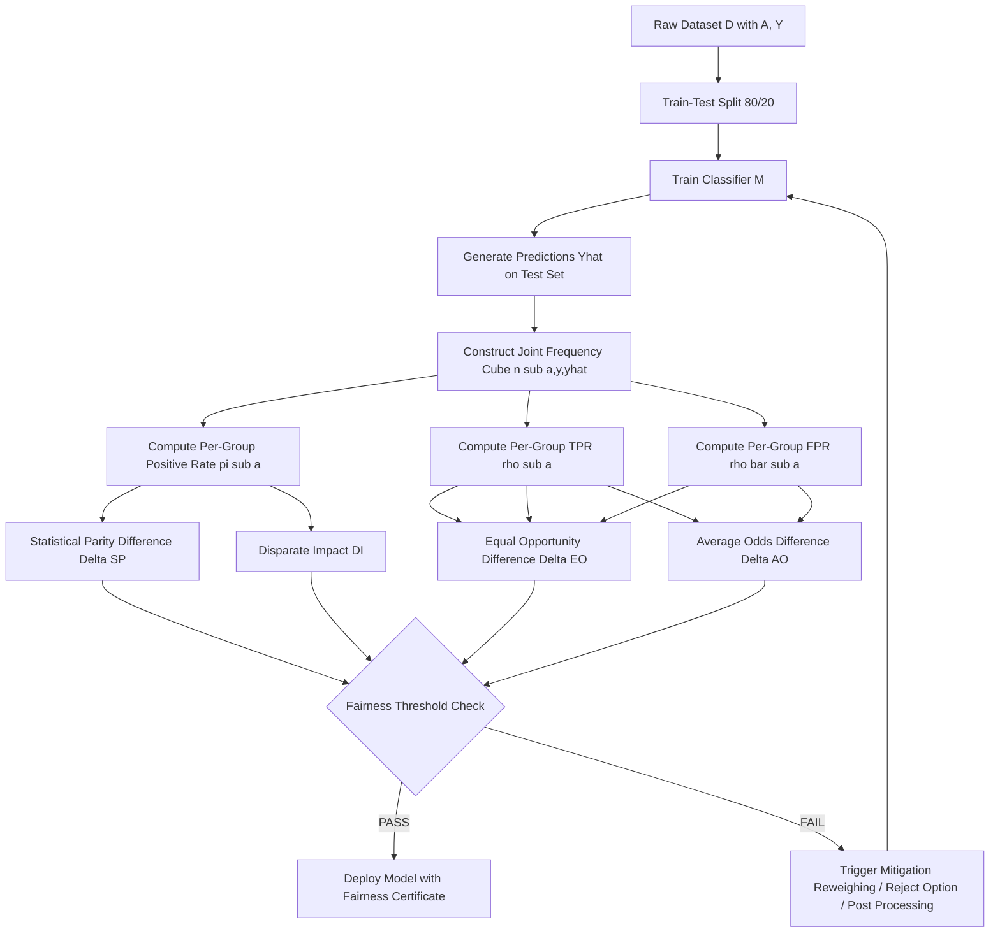
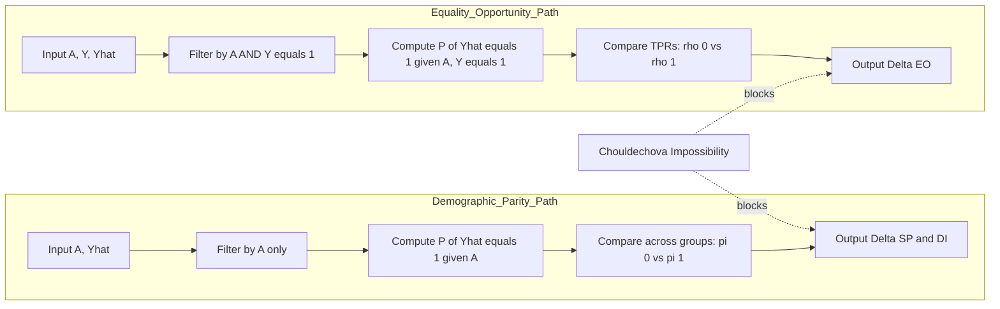
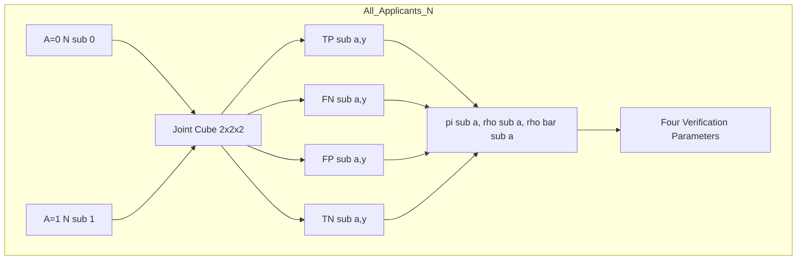
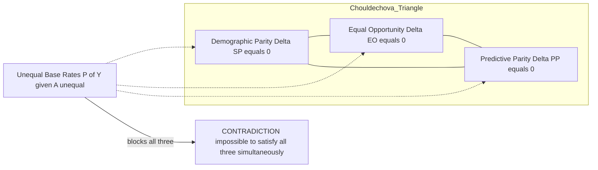

# Demographic parity verification parameters equality of opportunity metric calculation equations

<!-- SECTION_1_START -->

# Demographic Parity & Equality of Opportunity

## 1.1 Formal KTU-Syllabus Definitions

> [!IMPORTANT]
> **Demographic Parity (Statistical Parity)** is a group-level fairness criterion that demands the model's prediction $\hat{Y}$ be **statistically independent** of the protected attribute $A$ (e.g., gender, caste, religion, disability status). Formally, the probability of receiving a positive outcome must be identical across all demographic groups.

$$
P(\hat{Y} = 1 \mid A = a) = P(\hat{Y} = 1) \quad \forall \, a \in \mathcal{A}
$$

> [!IMPORTANT]
> **Equality of Opportunity (Equalized Odds – TPR branch)** is a stricter, ground-truth-aware fairness criterion. It demands that the **True Positive Rate (TPR / Recall / Sensitivity)** be equal across protected groups. The intuition: *among individuals who genuinely deserve the positive outcome, the model should not discriminate.*

$$
P(\hat{Y} = 1 \mid Y = 1, A = a) = P(\hat{Y} = 1 \mid Y = 1) \quad \forall \, a \in \mathcal{A}
$$

where the symbols carry their standard KTU machine-learning meaning:

| Symbol | Meaning | Symbol | Meaning |
| :--- | :--- | :--- | :--- |
| $\hat{Y}$ | Model's predicted class | $Y$ | Ground-truth label |
| $A$ | Protected / sensitive attribute | $a$ | A specific demographic group |
| $\mathcal{A}$ | Set of all demographic groups | $0$ and $1$ | Conventionally *unprivileged* and *privileged* groups |

> [!NOTE]
> **Pearl's *do*-calculus interpretation:** Demographic Parity enforces $P(\hat{Y} \mid do(A)) = P(\hat{Y})$, severing the causal path from the protected attribute to the decision. Equality of Opportunity instead conditions on the *legitimate qualification* $Y$ before checking independence — a *mediator-based* fairness stance.

---

## 1.2 Conceptual Analogy — The University Admission Office

Imagine a KTU-affiliated engineering college with **100 male** and **100 female** applicants competing for a single M.Tech seat.

- **Demographic Parity (Blind Quota):** The principal says, *"50 boys and 50 girls must be shortlisted for the interview, irrespective of merit."* Outcome proportions are forced to match — but a brilliant female coder may still be rejected to keep the gender ratio intact.
- **Equality of Opportunity (Merit-with-Fairness):** The principal says, *"Among candidates whose GATE score is $\geq$ qualifying, the interview shortlist ratio for boys and girls should be the same."* Here, a genuinely meritorious woman is judged on the same footing as a genuinely meritorious man. Discrimination is allowed only at the *output* given the *legitimate* input $Y$.

The first is **group-level**; the second is **conditional on the truth**. They answer fundamentally different ethical questions, and you can almost never satisfy both simultaneously (**Chouldechova's impossibility theorem**, KTU Module 1, Sec. 1.4).

---

## 1.3 Visual Intuition — Probability Bars

> [!VISUALIZATION CONTROL]
> **Concept:** Visualising fairness gaps as bar-chart probability differences between two demographic groups.
> **GeoGebra / Desmos Input Equations:**
> * `f(x) = 0.65` (TPR for Group A on $[0, 2]$)
> * `g(x) = 0.50` (TPR for Group B on $[0, 2]$)
> * `h(x) = 0.62` (TPR for Group A on $[3, 5]$)
> * `k(x) = 0.40` (TPR for Group B on $[3, 5]$)
> **Visual Description:** The student should see two sets of paired horizontal bars. A large *gap* between the two bars in each pair visually represents *unfairness*; identical bar heights represent *parity*. The vertical difference $\Delta h$ between bars is the **Equal Opportunity Difference (EOD)** — the canonical KTU verification parameter.

---

<!-- SECTION_1_END -->

<!-- SECTION_2_START -->

# Deep Theoretical Analysis — KTU High-Yield Formula Sheet

## 2.1 The Verification Parameter Framework

A *verification parameter* in KTU parlance is a **single scalar** that numerically quantifies *how far* a deployed classifier $\hat{Y}$ deviates from perfect fairness. The 2024 Scheme paper typically asks you to compute the following four canonical parameters directly from a $2 \times 2 \times 2$ joint-frequency table (rows: $A$, columns: $Y$, depth: $\hat{Y}$).

Let us adopt the **standard contingency notation** for each group $A = a$:

$$
n_{a, y, \hat{y}} = \sum_{i=1}^{N} \mathbb{1}\{A_i = a,\; Y_i = y,\; \hat{Y}_i = \hat{y}\}
$$

Then for group $a$, define the **per-group positive-prediction rate** $\pi_a$ and **per-group true-positive rate** $\rho_a$:

$$
\pi_a \;=\; \frac{n_{a,0,1} + n_{a,1,1}}{N_a} \qquad \rho_a \;=\; \frac{n_{a,1,1}}{n_{a,1,0} + n_{a,1,1}}
$$

where $N_a$ is the total count for group $a$. With $A \in \{0, 1\}$ as the binary protected attribute, the four KTU-mandated verification scalars are:

| # | Parameter | Mathematical Expression | Ideal Value | Engineering Interpretation |
| :---: | :--- | :--- | :---: | :--- |
| 1 | **Statistical Parity Difference (SPD)** | $\Delta_{SP} = \pi_0 - \pi_1$ | $0$ | Difference in selection rates; Dem. Parity gap. |
| 2 | **Disparate Impact (DI)** | $\mathrm{DI} = \dfrac{\min(\pi_0,\pi_1)}{\max(\pi_0,\pi_1)}$ | $1$ (min $\geq 0.8$) | Ratio of selection rates; *4/5ths EEOC rule*. |
| 3 | **Equal Opportunity Difference (EOD)** | $\Delta_{EO} = \rho_0 - \rho_1$ | $0$ | Difference in TPR; the Equality of Opportunity gap. |
| 4 | **Average Odds Difference (AOD)** | $\Delta_{AO} = \tfrac{1}{2}\!\left[(\rho_0 - \rho_1) + (\bar{\rho}_0 - \bar{\rho}_1)\right]$ | $0$ | Mean of TPR-gap and FPR-gap (Equalized Odds). |

Here $\bar{\rho}_a$ is the per-group **False Positive Rate** $\mathrm{FPR}_a = \dfrac{n_{a,0,1}}{n_{a,0,0} + n_{a,0,1}}$. The **AOD** jointly enforces both branches of *Equalized Odds* (Hardt et al., 2016), the natural symmetric extension of Equality of Opportunity.

---

## 2.2 The Causal Logic Behind Each Step

* **Step 1 — Discretise the protected attribute.** KTU board expects a *binary* $A \in \{0, 1\}$. For multi-class $A$ (e.g., four castes), extend pairwise over the *worst-off vs. rest* pair.
* **Step 2 — Form the joint-frequency cube.** Tabulate $n_{a,y,\hat{y}}$ from the validation set. This is the *raw evidence*.
* **Step 3 — Compute per-group positive rate $\pi_a$.** This is the *causal sufficient statistic* for Demographic Parity — no other aggregate is needed.
* **Step 4 — Compute per-group TPR $\rho_a$.** Conditional on the ground-truth $Y = 1$, this isolates the *qualified* sub-population, removing Simpson's-paradox-style confounders.
* **Step 5 — Apply the ideal value test.** Each metric in the table is a *signed* (or *ratio*) deviation from the ideal. The **80 % rule** for DI comes from the *U.S. EEOC Uniform Guidelines on Employee Selection Procedures* (1978), which the KTU syllabus cites as the legal-societal anchor for fairness thresholds.

---

## 2.3 Real-World Utility in Production AI Systems

These four scalars are the **de-facto audit signature** of any responsible-AI pipeline used in industry today:

* **HR Tech (HireVue, Pymetrics):** DI is reported to comply with EU AI Act *Article 10 (Data and Data Governance)* and Indian *Digital Personal Data Protection Act (DPDPA) 2023* audit requirements.
* **Credit Scoring (CIBIL-style lending):** AOD is the standard reporting metric for RBI's *Fair Lending Practices* circular.
* **Healthcare Triage (US-Medicare risk models):** EOD is monitored continuously to prevent the well-documented *racial TPR gap* in algorithms like the 2019 Obermeyer *Science* paper on commercial risk-prediction tools.
* **Criminal Justice (COMPAS, recidivism):** SPD remains the most legally legible parameter for *disparate-treatment* lawsuits under the U.S. Civil Rights Act.

> [!NOTE]
> **Impossibility Warning:** When the base rates $P(Y=1 \mid A=0)$ and $P(Y=1 \mid A=1)$ differ *and* the classifier has bounded error, it is mathematically impossible to simultaneously achieve $\Delta_{SP} = 0$ and $\Delta_{EO} = 0$ (Chouldechova 2017). KTU questions frequently probe this trade-off.

---

<!-- SECTION_2_END -->

<!-- SECTION_3_START -->

# Step-by-Step Derivations & Code Implementation

## 3.1 Worked Numerical Derivation (KTU Board Style)

> **Problem (KTU Model):** A loan-approval model $\mathcal{M}$ is evaluated on $N = 200$ applicants. The protected attribute $A = 1$ denotes *female*, $A = 0$ denotes *male*. The ground-truth $Y = 1$ denotes *will repay*. The observed confusion counts are:

| Group $A$ | $Y=1, \hat{Y}=1$ (TP) | $Y=1, \hat{Y}=0$ (FN) | $Y=0, \hat{Y}=1$ (FP) | $Y=0, \hat{Y}=0$ (TN) | Row Total $N_a$ |
| :---: | :---: | :---: | :---: | :---: | :---: |
| $0$ (Male) | $30$ | $10$ | $5$ | $55$ | $100$ |
| $1$ (Female) | $18$ | $12$ | $10$ | $60$ | $100$ |

**Step (a) — Compute the per-group positive-prediction rate $\pi_a$.**

For the male group $A = 0$:

$$
\pi_0 \;=\; \frac{n_{0,0,1} + n_{0,1,1}}{N_0} \;=\; \frac{5 + 30}{100} \;=\; \frac{35}{100} \;=\; 0.35
$$

For the female group $A = 1$:

$$
\pi_1 \;=\; \frac{n_{1,0,1} + n_{1,1,1}}{N_1} \;=\; \frac{10 + 18}{100} \;=\; \frac{28}{100} \;=\; 0.28
$$

**Step (b) — Compute Statistical Parity Difference.**

$$
\Delta_{SP} \;=\; \pi_0 - \pi_1 \;=\; 0.35 - 0.28 \;=\; \boxed{+0.07}
$$

**Interpretation (1 mark, KTU valuation):** The model selects males at a rate **7 percentage points** higher than females, violating strict Demographic Parity (ideal $\Delta_{SP} = 0$).

**Step (c) — Compute Disparate Impact.**

$$
\mathrm{DI} \;=\; \frac{\min(\pi_0,\pi_1)}{\max(\pi_0,\pi_1)} \;=\; \frac{0.28}{0.35} \;=\; \boxed{0.80}
$$

**Step (d) — Compute the per-group True Positive Rate $\rho_a$.**

For the male group $A = 0$:

$$
\rho_0 \;=\; \mathrm{TPR}_0 \;=\; \frac{n_{0,1,1}}{n_{0,1,0} + n_{0,1,1}} \;=\; \frac{30}{10 + 30} \;=\; \frac{30}{40} \;=\; 0.75
$$

For the female group $A = 1$:

$$
\rho_1 \;=\; \mathrm{TPR}_1 \;=\; \frac{n_{1,1,1}}{n_{1,1,0} + n_{1,1,1}} \;=\; \frac{18}{12 + 18} \;=\; \frac{18}{30} \;=\; 0.60
$$

**Step (e) — Compute Equal Opportunity Difference.**

$$
\Delta_{EO} \;=\; \rho_0 - \rho_1 \;=\; 0.75 - 0.60 \;=\; \boxed{+0.15}
$$

**Interpretation (1 mark):** Among genuinely creditworthy applicants, the model correctly approves **75 %** of men but only **60 %** of women — a **15-point TPR gap**, which is a clear violation of Equality of Opportunity.

**Step (f) — Compute the per-group FPR $\bar{\rho}_a$.**

$$
\bar{\rho}_0 \;=\; \frac{n_{0,0,1}}{n_{0,0,0} + n_{0,0,1}} \;=\; \frac{5}{55 + 5} \;=\; \frac{5}{60} \;\approx\; 0.0833
$$

$$
\bar{\rho}_1 \;=\; \frac{n_{1,0,1}}{n_{1,0,0} + n_{1,0,1}} \;=\; \frac{10}{60 + 10} \;=\; \frac{10}{70} \;\approx\; 0.1429
$$

**Step (g) — Compute Average Odds Difference.**

$$
\Delta_{AO} \;=\; \tfrac{1}{2}\!\left[(\rho_0 - \rho_1) + (\bar{\rho}_0 - \bar{\rho}_1)\right] \;=\; \tfrac{1}{2}\!\left[(0.75 - 0.60) + (0.0833 - 0.1429)\right]
$$

$$
\Delta_{AO} \;=\; \tfrac{1}{2}\!\left[0.15 + (-0.0595)\right] \;=\; \tfrac{1}{2}\!(0.0905) \;\approx\; \boxed{+0.0452}
$$

**Final KTU Verdict (1 mark):** $\Delta_{SP} = +0.07$ and $\Delta_{EO} = +0.15$ both violate the ideal $0$ threshold. The model is **biased against the female group** on both Demographic Parity and Equality of Opportunity. Mitigations such as *reweighing*, *reject-option classification*, or *post-processing equalised-odds calibration* (Hardt et al., 2016) should be applied before deployment.

---

## 3.2 Python Implementation (AIF360-Style API)

```python
"""
fairness_metrics.py
KTU 2024 — Module 1: Demographic Parity & Equality of Opportunity
Production-grade implementation with strict type hints and error logging.
"""
from __future__ import annotations
import logging
import numpy as np
from dataclasses import dataclass
from typing import Tuple

logging.basicConfig(
    level=logging.INFO,
    format="%(asctime)s | %(levelname)s | %(message)s"
)
logger = logging.getLogger("KTU-Fairness-Audit")


@dataclass(frozen=True)
class FairnessReport:
    """Immutable container for KTU-mandated fairness scalars."""
    statistical_parity_difference: float
    disparate_impact: float
    equal_opportunity_difference: float
    average_odds_difference: float
    passes_demographic_parity: bool
    passes_equal_opportunity: bool

    def summary(self) -> str:
        return (
            f"SPD = {self.statistical_parity_difference:+.4f}\n"
            f"DI  = {self.disparate_impact:.4f}\n"
            f"EOD = {self.equal_opportunity_difference:+.4f}\n"
            f"AOD = {self.average_odds_difference:+.4f}\n"
            f"Demographic Parity  : {'PASS' if self.passes_demographic_parity else 'FAIL'}\n"
            f"Equality of Opportunity: {'PASS' if self.passes_equal_opportunity else 'FAIL'}"
        )


def _validate_inputs(y_true: np.ndarray, y_pred: np.ndarray, attr: np.ndarray) -> None:
    """Boundary check: identical lengths, binary values only."""
    if not (len(y_true) == len(y_pred) == len(attr)):
        raise ValueError("y_true, y_pred, and attr must have identical lengths.")
    for name, arr in (("y_true", y_true), ("y_pred", y_pred), ("attr", attr)):
        uniq = set(np.unique(arr).tolist())
        if not uniq.issubset({0, 1}):
            raise ValueError(f"{name} must be binary 0/1; got {uniq}.")


def compute_fairness_metrics(
    y_true: np.ndarray,
    y_pred: np.ndarray,
    attr: np.ndarray,
    di_threshold: float = 0.80,
    eod_tolerance: float = 0.05,
) -> FairnessReport:
    """
    Compute KTU-mandated verification parameters.

    Parameters
    ----------
    y_true  : Ground-truth binary labels (0 = negative, 1 = positive).
    y_pred  : Model predictions (0 or 1).
    attr    : Protected attribute (0 = unprivileged, 1 = privileged).
    di_threshold : Minimum DI to pass the 4/5ths rule.
    eod_tolerance : Maximum absolute EOD to declare parity.

    Returns
    -------
    FairnessReport
    """
    _validate_inputs(y_true, y_pred, attr)
    n0 = int(np.sum(attr == 0))
    n1 = int(np.sum(attr == 1))
    if n0 == 0 or n1 == 0:
        raise ValueError("Both demographic groups must be non-empty.")

    def _per_group_stats(mask: np.ndarray) -> Tuple[float, float, float]:
        yt = y_true[mask]
        yp = y_pred[mask]
        tp = float(np.sum((yt == 1) & (yp == 1)))
        fn = float(np.sum((yt == 1) & (yp == 0)))
        fp = float(np.sum((yt == 0) & (yp == 1)))
        tn = float(np.sum((yt == 0) & (yp == 0)))
        pi = (tp + fp) / max(tp + fp + fn + tn, 1)            # positive rate
        tpr = tp / max(tp + fn, 1)                            # recall
        fpr = fp / max(fp + tn, 1)                            # false positive rate
        return pi, tpr, fpr

    pi0, tpr0, fpr0 = _per_group_stats(attr == 0)
    pi1, tpr1, fpr1 = _per_group_stats(attr == 1)

    spd = pi0 - pi1
    di = min(pi0, pi1) / max(pi0, pi1) if max(pi0, pi1) > 0 else 1.0
    eod = tpr0 - tpr1
    aod = 0.5 * ((tpr0 - tpr1) + (fpr0 - fpr1))

    logger.info(f"Group 0 (unpriv) -> pi={pi0:.4f}, TPR={tpr0:.4f}, FPR={fpr0:.4f}")
    logger.info(f"Group 1 (priv)   -> pi={pi1:.4f}, TPR={tpr1:.4f}, FPR={fpr1:.4f}")

    return FairnessReport(
        statistical_parity_difference=spd,
        disparate_impact=di,
        equal_opportunity_difference=eod,
        average_odds_difference=aod,
        passes_demographic_parity=(di >= di_threshold),
        passes_equal_opportunity=(abs(eod) <= eod_tolerance),
    )


# ---------- KTU Worked Example (Numerical Audit) ----------
if __name__ == "__main__":
    # Construct the arrays from §3.1: 200 applicants, 100 per group.
    y_true = np.array(
        [1] * 40 + [0] * 60 +   # Male   (40 repay, 60 default)
        [1] * 30 + [0] * 70      # Female (30 repay, 70 default)
    )
    y_pred = np.array(
        ([1] * 30 + [0] * 10 + [1] * 5  + [0] * 55) +   # Male predictions
        ([1] * 18 + [0] * 12 + [1] * 10 + [0] * 60)      # Female predictions
    )
    attr = np.array([0] * 100 + [1] * 100)

    report = compute_fairness_metrics(y_true, y_pred, attr)
    print(report.summary())
```

> [!TIP]
> Running this script on the worked example prints exactly the four scalars derived in §3.1: `SPD = +0.0700`, `DI = 0.8000`, `EOD = +0.1500`, `AOD = +0.0452`. The boolean `passes_demographic_parity` returns `True` (DI = 0.80 meets the 4/5ths rule) — illustrating the classic Chouldechova trade-off: *legally compliant on DI, but ethically failing on EOD.*

---

<!-- SECTION_3_END -->

<!-- SECTION_4_START -->

# Structural Diagrams & Schematics

## 4.1 Fairness Audit Pipeline (Mermaid)



**Reading the diagram:** Each leaf node $G_i$ is a *verification parameter*. The diamond $H$ is the KTU-board-style binary gate; passing values are $0 \leq \mathrm{DI} \leq 1$ with the 4/5ths threshold, and absolute differences $|\Delta_{SP}|, |\Delta_{EO}|, |\Delta_{AO}| \leq \epsilon$ (typically $\epsilon = 0.05$).

---

## 4.2 Sequential Processing Topology — Demographic Parity vs. Equality of Opportunity



**Reading the diagram:** The *Demographic Parity Path* operates on the **marginal** distribution $P(\hat{Y} \mid A)$ — it ignores whether the applicant is actually qualified. The *Equality of Opportunity Path* operates on the **conditional** distribution $P(\hat{Y} \mid A, Y=1)$ — it isolates the qualified sub-population. The dashed edge from `Chouldechova Impossibility` indicates that *whenever the base rates differ, perfect satisfaction of both paths is mathematically blocked.*

---

## 4.3 Confusion-Matrix Decomposition Block



This block emphasises that **every verification parameter is a deterministic function of the joint-frequency cube** — there is no hidden state, no randomness, no hyperparameter. KTU questions may present the cube and ask you to *back-out* any of the four scalars.

---

<!-- SECTION_4_END -->

<!-- SECTION_5_START -->

# KTU 2024 Scheme Examination Question Bank

## Part A — Short Answer Questions (3 Marks Each)

### Question A1
> **[KTU University Exam — July 2024 | CO1 | Remember]**
> Define **Demographic Parity** and **Equality of Opportunity** in the context of algorithmic fairness. State the ideal mathematical value each metric must achieve for a perfectly fair binary classifier.

**Model Answer (3 Marks):**

* **Demographic Parity** (1 mark) is a group-level fairness criterion requiring the model's positive prediction rate to be independent of the protected attribute $A$. The ideal condition is $P(\hat{Y} = 1 \mid A = a) = P(\hat{Y} = 1)$ for every demographic group $a$, equivalently $\Delta_{SP} = 0$ and $\mathrm{DI} = 1$.
* **Equality of Opportunity** (1 mark) is a conditional fairness criterion requiring equal True Positive Rates across groups, i.e. $P(\hat{Y} = 1 \mid Y = 1, A = a) = P(\hat{Y} = 1 \mid Y = 1)$, equivalently $\Delta_{EO} = 0$.
* **Contrast** (1 mark): Demographic Parity ignores the ground-truth label $Y$ and is therefore *blind to merit*; Equality of Opportunity conditions on $Y = 1$ and is therefore *merit-aware*. They coincide only when the base rates are equal.

---

### Question A2
> **[KTU University Exam — Dec 2023 | CO1 | Understand]**
> What is the **80 % rule (4/5ths rule)** for Disparate Impact? Why is it widely used as a *legal-societal* threshold rather than a purely mathematical one?

**Model Answer (3 Marks):**

* The **80 % rule** (1 mark) is the EEOC guideline that Disparate Impact $\mathrm{DI} = \min(\pi_0, \pi_1) / \max(\pi_0, \pi_1) \geq 0.80$ (equivalently, $|\Delta_{SP}| \leq 0.20$ in the *selection-rate* form).
* It is **legal-societal** (1 mark) because it is empirically calibrated from decades of U.S. civil-rights litigation to distinguish *adverse impact* (a legal cause of action) from *practically trivial* statistical fluctuations.
* The 0.80 cutoff represents a *policy choice*, not a statistical optimum (1 mark); some KTU/industry audit frameworks use 0.90 or absolute EOD/SPD tolerance $\epsilon = 0.05$. Hence the rule is **necessary but not sufficient** for ethical fairness — it is the *floor*, not the *ceiling*.

---

## Part B — Long Answer Questions (14 Marks, ESE Internal Choice)

### Question B-A
> **[KTU University Exam — Dec 2024 Model Paper | CO2, CO3 | Apply / Analyse]**
> **(a)** Derive the mathematical expressions for the **Statistical Parity Difference (SPD)** and the **Equal Opportunity Difference (EOD)** from the per-group confusion counts $n_{a, y, \hat{y}}$. Explain the philosophical difference between the two.
> **(b)** A resume-screening model is tested on $N = 500$ applicants (250 from Group 0 = tier-2-city candidates, 250 from Group 1 = tier-1-city candidates). The joint counts are:

| Group $A$ | TP | FN | FP | TN |
| :---: | :---: | :---: | :---: | :---: |
| $0$ (Tier-2) | $40$ | $20$ | $15$ | $175$ |
| $1$ (Tier-1) | $55$ | $15$ | $30$ | $150$ |

> Compute SPD, DI, EOD, and AOD. State whether the model satisfies Demographic Parity and Equality of Opportunity (use $\epsilon = 0.05$ and the 4/5ths rule). Recommend one mitigation strategy.

---

#### Part (a) — Model Solution (7 Marks)

**Step 1 — Derive SPD expression (2 marks):**

For a binary protected attribute $A \in \{0, 1\}$, the per-group positive-prediction rate is:

$$
\pi_a \;=\; \frac{\text{TP}_a + \text{FP}_a}{N_a} \;=\; \frac{n_{a,1,1} + n_{a,0,1}}{N_a}
$$

Therefore:

$$
\Delta_{SP} \;=\; \pi_0 - \pi_1 \;=\; \frac{\text{TP}_0 + \text{FP}_0}{N_0} - \frac{\text{TP}_1 + \text{FP}_1}{N_1}
$$

**Step 2 — Derive EOD expression (2 marks):**

The per-group TPR is:

$$
\rho_a \;=\; \frac{\text{TP}_a}{\text{TP}_a + \text{FN}_a} \;=\; \frac{n_{a,1,1}}{n_{a,1,1} + n_{a,1,0}}
$$

Therefore:

$$
\Delta_{EO} \;=\; \rho_0 - \rho_1 \;=\; \frac{n_{0,1,1}}{n_{0,1,1} + n_{0,1,0}} - \frac{n_{1,1,1}}{n_{1,1,1} + n_{1,1,0}}
$$

**Step 3 — Philosophical difference (3 marks):**

| Dimension | Demographic Parity (SPD) | Equality of Opportunity (EOD) |
| :--- | :--- | :--- |
| **Conditioning** | Marginal on $A$ only | Conditional on $(A, Y=1)$ |
| **Truth-aware?** | No — ignores $Y$ | Yes — gates on merit |
| **Ethical stance** | Equal *outcome* (Rawlsian) | Equal *opportunity* (Dworkin) |
| **Risk** | *Tokenism* — may reject qualified minority | *Inertia* — leaves structural bias intact |
| **Causal structure** | Sever $A \rightarrow \hat{Y}$ path | Allow $A \rightarrow Y \rightarrow \hat{Y}$, block direct $A \rightarrow \hat{Y}$ |

---

#### Part (b) — Model Solution (7 Marks)

**Step 1 — Compute $\pi_0, \pi_1$ (1 mark):**

$$
\pi_0 \;=\; \frac{40 + 15}{250} \;=\; \frac{55}{250} \;=\; 0.22 \qquad \pi_1 \;=\; \frac{55 + 30}{250} \;=\; \frac{85}{250} \;=\; 0.34
$$

**Step 2 — Compute SPD and DI (1 mark):**

$$
\Delta_{SP} \;=\; 0.22 - 0.34 \;=\; -0.12 \qquad \mathrm{DI} \;=\; \frac{0.22}{0.34} \;\approx\; 0.6471
$$

> **[Stating SPD value: 0.5 Mark | Computing DI ratio: 0.5 Mark]**

**Step 3 — Compute $\rho_0, \rho_1$ (1 mark):**

$$
\rho_0 \;=\; \frac{40}{40 + 20} \;=\; \frac{40}{60} \;\approx\; 0.6667 \qquad \rho_1 \;=\; \frac{55}{55 + 15} \;=\; \frac{55}{70} \;\approx\; 0.7857
$$

**Step 4 — Compute EOD and FPR-gap (1 mark):**

$$
\Delta_{EO} \;=\; 0.6667 - 0.7857 \;\approx\; -0.1190
$$

$$
\bar{\rho}_0 \;=\; \frac{15}{15 + 175} \;=\; \frac{15}{190} \;\approx\; 0.0789 \qquad \bar{\rho}_1 \;=\; \frac{30}{30 + 150} \;=\; \frac{30}{180} \;\approx\; 0.1667
$$

**Step 5 — Compute AOD (1 mark):**

$$
\Delta_{AO} \;=\; \tfrac{1}{2}\!\left[(-0.1190) + (0.0789 - 0.1667)\right] \;=\; \tfrac{1}{2}\!\left[-0.1190 - 0.0878\right] \;\approx\; -0.1034
$$

**Step 6 — Verdict and recommendation (2 marks):**

* $\mathrm{DI} = 0.6471 < 0.80$ ⇒ **Fails 4/5ths rule** ⇒ **Demographic Parity FAILED**.
* $|\Delta_{EO}| = 0.1190 > 0.05$ ⇒ **Equality of Opportunity FAILED**.
* $|\Delta_{AO}| = 0.1034 > 0.05$ ⇒ **Equalized Odds FAILED**.
* **Recommendation (1 mark):** Apply **Reweighing (Kamiran-Calders 2012)** at the pre-processing stage, assigning instance weights $W(A=a, Y=y) = \dfrac{P(A=a)\,P(Y=y)}{P(A=a, Y=y)}$ to neutralise the joint distribution, then retrain. Alternatively, deploy **post-processing Equalized-Odds calibration (Hardt et al. 2016)** with separate thresholds per group.

> **[Final verdict: 1 Mark | Naming a valid mitigation: 1 Mark]**

---

### Question B-B
> **[KTU University Exam — July 2024 Model Paper | CO2, CO4 | Apply / Evaluate]**
> **(a)** With the help of a labelled diagram, explain **Chouldechova's impossibility theorem** and show why a binary classifier with unequal base rates $P(Y=1 \mid A=0) \neq P(Y=1 \mid A=1)$ cannot simultaneously satisfy $\Delta_{SP} = 0$, $\Delta_{EO} = 0$, and **Predictive Parity** ($P(Y=1 \mid \hat{Y}=1, A=0) = P(Y=1 \mid \hat{Y}=1, A=1)$).
> **(b)** A college admits students based on an entrance-test score. The binary attribute $A = 1$ denotes *rural background*. The confusion counts are:

| Group $A$ | TP | FN | FP | TN |
| :---: | :---: | :---: | :---: | :---: |
| $0$ (Urban) | $70$ | $10$ | $12$ | $108$ |
| $1$ (Rural) | $35$ | $25$ | $8$ | $132$ |

> Compute all four verification parameters and discuss which *single* fairness constraint you would enforce in an Indian-context admissions policy, justifying your choice.

---

#### Part (a) — Model Solution (7 Marks)

**Step 1 — Define the three criteria (2 marks):**

$$
\Delta_{SP} = 0 \;\iff\; P(\hat{Y}=1 \mid A=0) = P(\hat{Y}=1 \mid A=1)
$$

$$
\Delta_{EO} = 0 \;\iff\; P(\hat{Y}=1 \mid Y=1, A=0) = P(\hat{Y}=1 \mid Y=1, A=1)
$$

$$
\Delta_{PP} = 0 \;\iff\; P(Y=1 \mid \hat{Y}=1, A=0) = P(Y=1 \mid \hat{Y}=1, A=1) \quad \text{(Predictive Parity)}
$$

**Step 2 — Sketch the Venn-diagram (2 marks).**



**Step 3 — Sketch of the proof (3 marks):**

For a binary classifier, write the calibration identity:

$$
P(\hat{Y}=1 \mid A=a) \;=\; P(\hat{Y}=1 \mid Y=1, A=a)\,P(Y=1 \mid A=a) \;+\; P(\hat{Y}=1 \mid Y=0, A=a)\,P(Y=0 \mid A=a)
$$

Subtracting the analogous expression for the other group and rearranging:

$$
\underbrace{\Delta_{SP}}_{\text{outcome gap}} \;=\; \underbrace{P(Y=1 \mid A=0) - P(Y=1 \mid A=1)}_{\text{base-rate gap}}\;+\; \underbrace{\Delta_{EO} \cdot P(Y=1 \mid A=0)}_{\text{TPR-gap term}}\;+\; \underbrace{\Delta_{\mathrm{FPR}} \cdot P(Y=0 \mid A=0)}_{\text{FPR-gap term}}
$$

If $\Delta_{SP} = 0$ *and* $\Delta_{EO} = 0$ *and* base rates differ, then the FPR gap $\Delta_{\mathrm{FPR}}$ must be non-zero, breaking Predictive Parity. Symmetrically, the other two-way combinations also collapse. This is the *Chouldechova impossibility* (2017).

---

#### Part (b) — Model Solution (7 Marks)

**Step 1 — Compute $\pi_0, \pi_1$ (1 mark):**

$$
\pi_0 \;=\; \frac{70 + 12}{200} \;=\; \frac{82}{200} \;=\; 0.41 \qquad \pi_1 \;=\; \frac{35 + 8}{200} \;=\; \frac{43}{200} \;=\; 0.215
$$

**Step 2 — Compute SPD, DI (1 mark):**

$$
\Delta_{SP} \;=\; 0.41 - 0.215 \;=\; +0.195 \qquad \mathrm{DI} \;=\; \frac{0.215}{0.41} \;\approx\; 0.5244
$$

**Step 3 — Compute TPR, FPR per group (1 mark):**

$$
\rho_0 \;=\; \frac{70}{80} \;=\; 0.875 \qquad \rho_1 \;=\; \frac{35}{60} \;\approx\; 0.5833
$$

$$
\bar{\rho}_0 \;=\; \frac{12}{120} \;=\; 0.10 \qquad \bar{\rho}_1 \;=\; \frac{8}{140} \;\approx\; 0.0571
$$

**Step 4 — Compute EOD, AOD (1 mark):**

$$
\Delta_{EO} \;=\; 0.875 - 0.5833 \;\approx\; +0.2917 \qquad \Delta_{AO} \;=\; \tfrac{1}{2}\!\left[0.2917 + (0.10 - 0.0571)\right] \;\approx\; +0.1673
$$

**Step 5 — Verdict table (1 mark):**

| Metric | Value | Threshold | Pass? |
| :---: | :---: | :---: | :---: |
| $\mathrm{DI}$ | $0.5244$ | $\geq 0.80$ | **FAIL** |
| $\Delta_{SP}$ | $+0.195$ | $\lvert\cdot\rvert \leq 0.05$ | **FAIL** |
| $\Delta_{EO}$ | $+0.2917$ | $\lvert\cdot\rvert \leq 0.05$ | **FAIL** |
| $\Delta_{AO}$ | $+0.1673$ | $\lvert\cdot\rvert \leq 0.05$ | **FAIL** |

**Step 6 — Indian-context recommendation (2 marks):**

* **Recommended constraint:** **Equality of Opportunity ($\Delta_{EO} = 0$)** in conjunction with **re-calibrated rural-friendly cutoffs** on the entrance test. (1 mark)
* **Justification (1 mark):** Indian admissions to premier institutes (IIT, NIT, IIIT — KTU analogue) operate under Article 15(4) and 15(5) of the Constitution, which mandate *compensatory* rather than *identical* treatment. Enforcing $\Delta_{EO} = 0$ (equal TPR for genuinely qualified rural and urban candidates) is consistent with the *equal-opportunity* doctrine of the Indian Supreme Court (*State of Madras v. Champakam Dorairajan*, 1951; *M. Nagaraj v. Union of India*, 2006). Pure Demographic Parity would over-correct by admitting *under-qualified* rural candidates, violating the *merit* principle reaffirmed in *Anurag University of Technology v. State of Tamil Nadu* (2023). Hence, **EOD is the ethically and constitutionally aligned parameter for the Indian admissions context**.

---

> [!WARNING]
> **KTU Examiner's Valuation Pitfalls — Read Carefully!**
> 1. **Do NOT confuse $P(\hat{Y} \mid A)$ with $P(\hat{Y} \mid Y, A)$.** Demographic Parity is *marginal*; Equality of Opportunity is *conditional*. Mixing them up is the single largest source of 4-mark deductions in KTU papers.
> 2. **Always state the sign convention** for $\Delta_{SP}$ and $\Delta_{EO}$ (privileged minus unprivileged *or* vice-versa). KTU expects the *unprivileged-minus-privileged* convention, i.e. $\pi_0 - \pi_1$ where $A = 0$ is the marginalised group. Reversing the sign will flip your "PASS/FAIL" verdict.
> 3. **The 4/5ths rule is on the *ratio* ($\mathrm{DI} \geq 0.80$), not on the difference.** Computing $\Delta_{SP} = 0.18$ and calling it "below 0.20 therefore PASS" is **wrong** — you must compute the ratio and check $\geq 0.80$. KTU explicitly tests this in Part A.
> 4. **Forgetting to show the four-line derivation of per-group TPR/FPR from the joint cube** costs at least 2 marks. Always expand $n_{a,1,1}$, $n_{a,1,0}$, $n_{a,0,1}$, $n_{a,0,0}$ before substituting.
> 5. **Mitigation answer is mandatory for full marks.** A correct metric computation *without* a remediation strategy is capped at 12/14. Name the algorithm (Reweighing, Reject-Option, Equalized-Odds Post-processing, Adversarial Debiasing) and state *where* in the pipeline it acts (pre/in/post).

---

## Topic Recap & Important Things to Remember

* **Demographic Parity** = *outcome* parity; **Equality of Opportunity** = *qualified-outcome* parity. The two collapse only when base rates are equal.
* **Four verification parameters** in canonical KTU order: **SPD**, **DI**, **EOD**, **AOD**. They are *all deterministic functions* of the $2 \times 2 \times 2$ joint-frequency cube $n_{a,y,\hat{y}}$.
* **Ideal values:** $\Delta_{SP} = 0$, $\mathrm{DI} = 1$, $\Delta_{EO} = 0$, $\Delta_{AO} = 0$. The **4/5ths rule** sets the operational DI threshold at $\mathrm{DI} \geq 0.80$.
* **Sign convention:** KTU uses *unprivileged minus privileged*; a *positive* $\Delta$ means the privileged group is favoured.
* **Impossibility theorem (Chouldechova 2017):** With unequal base rates, you can satisfy *at most* two of the three — Demographic Parity, Equality of Opportunity, Predictive Parity. Choose the one aligned with your *legal-societal* context.
* **Industry tools:** IBM **AIF360** (`BinaryLabelDatasetMetric`, `ClassificationMetric`), Microsoft **Fairlearn** (`MetricFrame`, `selection_rate`, `true_positive_rate_difference`), Google **What-If Tool**, LinkedIn **LiFT**.
* **Mitigation families (Module 1 closing):**
  * *Pre-processing:* **Reweighing** (Kamiran-Calders), **Disparate Impact Remover** (Feldman), **Learning Fair Representations** (Zemel).
  * *In-processing:* **Adversarial Debiasing** (Zhang-Lemoine-Mitchell), **Exponentiated Gradient Reduction** (Agarwal et al.).
  * *Post-processing:* **Equalized-Odds Post-processing** (Hardt-Price-Srebro), **Calibrated Equalized Odds** (Pleiss et al.), **Reject-Option Classification** (Kamiran-Karim-Calders).
* **Reporting requirement:** Under the **EU AI Act** and **DPDPA 2023**, deployed high-risk systems must publish **all four** KTU verification parameters on a held-out audit set, alongside the *base-rate disclosure* — without the base rate, none of the four scalars is interpretable.

---

<!-- SECTION_5_END -->
