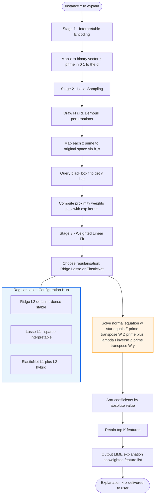
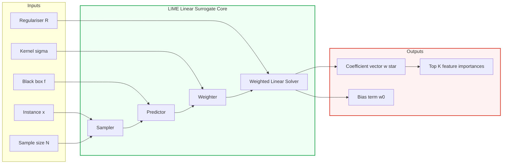
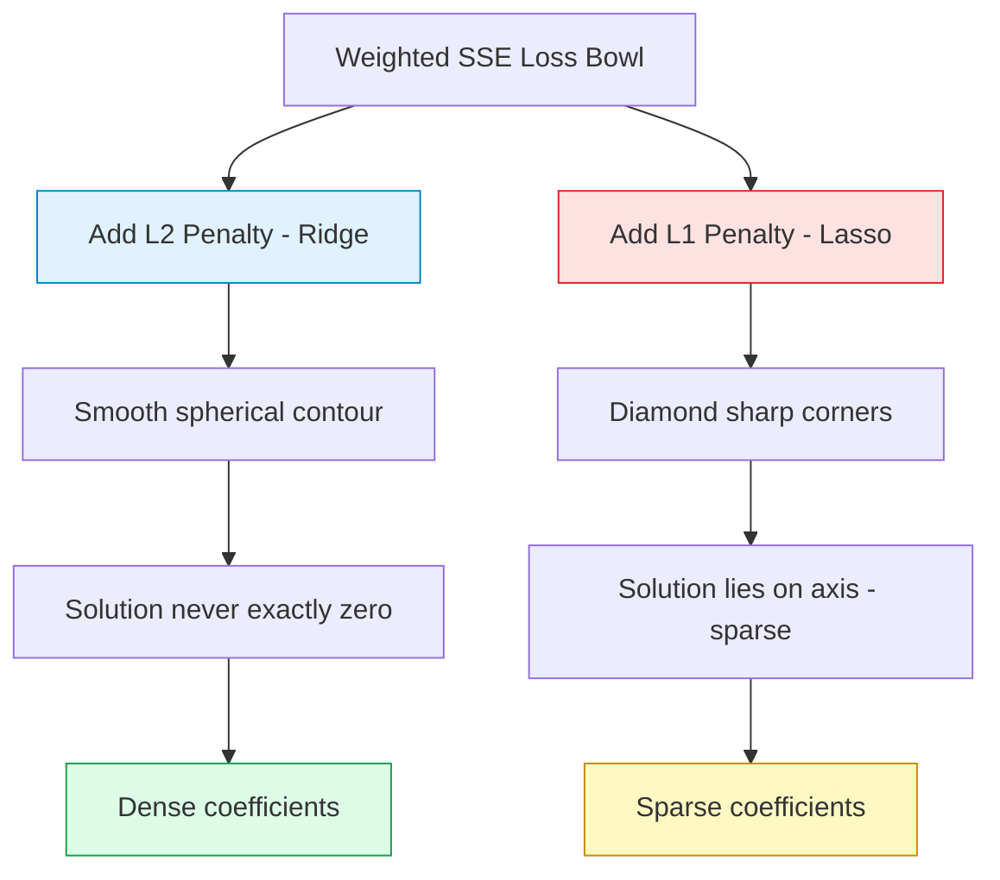

# Local Interpretable Model-agnostic Explanations (LIME) linear surrogate models configurations

<!-- SECTION_1_START -->

# Local Interpretable Model-agnostic Explanations (LIME) — Linear Surrogate Model Configurations

## 1.1 Formal Academic Definition

> [!IMPORTANT]
> **LIME (Ribeiro et al., 2016)** is a *post-hoc, local, model-agnostic* explanation technique that explains the prediction $f(x)$ of **any** black-box classifier $f$ by learning an *interpretable surrogate model* $g \in G$ (typically a linear model) that approximates $f$ **only in a small neighbourhood** around a single instance $x$.

Formally, LIME solves the following constrained optimization problem:

$$\xi(x) = \underset{g \in G}{\operatorname{argmin}} \; \mathcal{L}\!\left(f,\,g,\,\pi_{x}\right) + \Omega(g)$$

where
* $f$ : the original (opaque) black-box model being explained.
* $g$ : the linear surrogate (interpretable) model approximating $f$ locally.
* $\pi_{x}$ : a **proximity function** that defines the locality around $x$.
* $\mathcal{L}$ : the **fidelity loss** measuring how well $g$ mimics $f$ near $x$.
* $\Omega(g)$ : a **complexity penalty** on $g$ (e.g., number of non-zero weights).

In its **tabular/text configuration**, the surrogate $g$ is restricted to a *linear* form $g(z') = w_g^{\top} z' + b$, and the configuration is governed by the choice of:
1. **Distance kernel** $\pi_{x}(z)$ (default: exponential kernel $\exp(-d^{2}/\sigma^{2})$).
2. **Sample count** $N$ (number of perturbations).
3. **Regularization type** on the linear fit (Ridge $L_2$, Lasso $L_1$, ElasticNet $L_1+L_2$, OLS).
4. **Feature-discretisation scheme** (continuous binning for tabular data).

> [!NOTE]
> **Why "model-agnostic"?** Because LIME only queries $f$ through its prediction interface (oracle access) and never inspects gradients, parameters, or architecture. Hence it works uniformly for neural networks, random forests, SVMs, gradient-boosted trees, etc.

## 1.2 Conceptual Analogy — "The Mountain Spotlight"

Imagine a complex, jagged mountain (the black-box model's decision surface) shrouded in fog. A hiker at point $x$ wants to know "Why did I land here?" LIME's strategy is:

1. **Throw many pebbles** around the hiker (generate perturbations of $x$).
2. **Ask a surveyor** to mark the elevation of each pebble landing spot (query $f$).
3. **Fit a flat plank** (a linear plane) that best matches the local elevation pattern.
4. The plank's **slope coefficients** tell the hiker which direction pushes the surface up (positive features) and which pushes it down (negative features).

The plank is *interpretable* (you can read its slopes), and *local* (it is only valid near $x$, not across the whole mountain). The choice of plank material — a stiff oak plank (Ridge), a sparse triangular frame (Lasso), or a hybrid (ElasticNet) — is exactly what we call a **linear surrogate configuration**.

> [!VISUALIZATION CONTROL]
> **Concept:** LIME local linear approximation geometry.
> **GeoGebra / Desmos Input Equations:**
> * True surface: $f(x_1, x_2) = \sin(2x_1) + 0.5\cos(3x_2)$
> * Query point: $x = (1.0, 1.0)$
> * Local linear surrogate: $g(x_1, x_2) = 0.91 + 0.42x_1 - 0.27x_2$
> **Visual Description:** A curved, multi-coloured sinusoidal surface representing the opaque black-box model, with a translucent tangent plane clipped to the local neighbourhood of $(1,1)$. The plane's tilt in $x_1$ (positive slope) and $x_2$ (negative slope) gives the per-feature local contribution signs.

<!-- SECTION_1_END -->

<!-- SECTION_2_START -->

# 2. Deep Theoretical Analysis & KTU High-Yield Formula Sheet

## 2.1 LIME's Three-Stage Pipeline

### Stage 1 — Interpretable Input Representation
LIME does **not** perturb raw pixels or raw tokens directly. It perturbs an *interpretable binary vector* $z' \in \{0, 1\}^{d}$, where each $z'_j$ indicates whether the $j^{\text{th}}$ interpretable feature (a word, a binned column, a super-pixel) is "present". A mapping $h_x : \{0,1\}^{d} \to \mathbb{R}^{p}$ then converts $z'$ back to the original input space for the black-box query.

### Stage 2 — Local Sampling & Weighting
A set $\mathcal{Z} = \{z'_1, z'_2, \ldots, z'_N\}$ of $N$ binary perturbations is drawn (default: i.i.d. Bernoulli with $p=0.5$). Each $z'_i$ is mapped to $z_i = h_x(z'_i)$ and queried to obtain $\hat{y}_i = f(z_i)$. The proximity weight is computed via a **kernel**:

$$\pi_{x}(z_i) = \exp\!\left(-\dfrac{D^{2}\!\left(x,\,z_i\right)}{\sigma^{2}}\right)$$

For tabular data, $D$ is typically **cosine distance** for sparse binary inputs or **Euclidean distance** for continuous inputs (after scaling).

### Stage 3 — Weighted Linear Fit (The Surrogate)
A weighted linear regression is solved to obtain $w_g$:

$$w_g = \underset{w}{\operatorname{argmin}} \; \sum_{i=1}^{N} \pi_{x}(z_i)\bigl[f(z_i) - w^{\top} z'_i - b\bigr]^{2} + \lambda \cdot \mathcal{R}(w)$$

where $\mathcal{R}(w)$ encodes the chosen regularisation scheme.

## 2.2 Linear Surrogate Configuration Matrix

| Configuration Parameter | Symbol | Default Value (LIME v0.2) | Effect on Explanation |
|---|---|---|---|
| Number of perturbations | $N$ | **1000** (Tabular) / 500 (Text) | Larger $N \Rightarrow$ smoother coefficients, lower variance |
| Kernel width (tabular) | $\sigma$ | $0.75 \cdot \sqrt{d}$ | Smaller $\sigma \Rightarrow$ tighter locality, sharper coefficients |
| Regularisation type | $\mathcal{R}$ | **Ridge $L_2$** | $L_1 \Rightarrow$ sparse explanations; $L_2 \Rightarrow$ dense, stable |
| Regularisation strength | $\lambda$ | **1.0** (Tabular Explainer) | Larger $\lambda \Rightarrow$ coefficients shrink toward zero |
| Max features in $g$ | $K$ | **10** (num_features arg) | Top-$K$ non-zero weights retained in final output |
| Discretiser | $\mathcal{D}$ | Quartile binning (default) | Continuous features binned into interpretable intervals |

> [!IMPORTANT]
> **Key theoretical property:** LIME's guarantee is *fidelity*, **not** *causality* or *global accuracy*. The surrogate $g$ is **only** valid within the kernel-weighted neighbourhood of $x$; its coefficients can flip sign outside this region.

## 2.3 Why Linear Surrogates?

Linear models satisfy the three pillars of *interpretability* required by Ribeiro's framework:

1. **Transparency** — the prediction is a weighted sum: $g(z') = w_0 + \sum_{j=1}^{d} w_j z'_j$.
2. **Auditable complexity** — $\Omega(g) = \|w\|_0$ (number of non-zero weights) is bounded by the user-controlled $K$.
3. **Decomposability** — each prediction can be *decomposed* into per-feature contributions $w_j z'_j$, enabling visualisations such as LIME bar charts.

## 2.4 Real-World Engineering Utility

* **Healthcare (oncology):** LIME explains a deep-learning tumour classifier's prediction to oncologists by ranking influential histopathological features.
* **Credit scoring (FinTech):** Regulators under the *EU AI Act, Article 13* require "meaningful information" about high-risk AI decisions. LIME's linear weights serve as a defensible local audit trail.
* **NLP sentiment pipelines:** LIME highlights the words that drove a transformer classifier's label, enabling red-teaming of toxic-content filters.
* **Manufacturing quality control:** LIME explains why a vision model flagged a printed-circuit board as defective, by surfacing the most influential super-pixels.

<!-- SECTION_2_END -->

<!-- SECTION_3_START -->

# 3. Step-by-Step Derivations & Code Implementation

## 3.1 Closed-Form Derivation of the Linear Surrogate

We solve the **kernel-weighted ridge regression** (the most common LIME linear configuration). The objective is:

$$\mathcal{J}(w) = \sum_{i=1}^{N} \pi_{i}\bigl(y_i - w^{\top} z'_i\bigr)^{2} + \lambda\, w^{\top} w$$

with $\pi_i \equiv \pi_x(z_i)$ and the bias absorbed into $w$ by augmenting $z'_i$ with a constant 1.

**Step 1.** Let $W = \mathrm{diag}(\pi_1, \pi_2, \ldots, \pi_N)$. Then:

$$\mathcal{J}(w) = (Z'w - y)^{\top} W (Z'w - y) + \lambda w^{\top} w$$

where $Z' \in \mathbb{R}^{N \times (d+1)}$ is the perturbation matrix, $y \in \mathbb{R}^{N}$ is the vector of black-box predictions.

**Step 2.** Differentiate w.r.t. $w$ and set to zero:

$$\nabla_{w} \mathcal{J} = 2\,Z'^{\top} W (Z'w - y) + 2\lambda w = 0$$

**Step 3.** Solve the normal equation:

$$\bigl(Z'^{\top} W Z' + \lambda I\bigr) w = Z'^{\top} W y$$

**Step 4.** Closed-form solution:

$$\boxed{\,w^{\star} = \bigl(Z'^{\top} W Z' + \lambda I\bigr)^{-1} Z'^{\top} W y\,}$$

This is the **kernel-weighted ridge solution**; LIME returns the top-$K$ components of $w^{\star}$ sorted by $\vert w^{\star}_j \vert$ as the explanation.

## 3.2 Worked Numerical Example — Tabular LIME on 3 Features

**Setup.** Black-box model $f$ is a mystery classifier. Instance $x = (1,\,1,\,1)$ (3 binary interpretable features). We draw $N = 5$ perturbations.

**Step A — Generate Perturbations $\mathcal{Z}$:**

| Index $i$ | $z'_{i,1}$ | $z'_{i,2}$ | $z'_{i,3}$ | $f(z_i)$ | Distance $d(x, z_i)$ | Weight $\pi_i = \exp(-d^{2}/\sigma^{2})$ with $\sigma=1$ |
|---|---|---|---|---|---|---|
| 1 | 1 | 1 | 1 | 0.80 | 0 | 1.0000 |
| 2 | 1 | 1 | 0 | 0.65 | 1 | 0.3679 |
| 3 | 1 | 0 | 1 | 0.55 | 1 | 0.3679 |
| 4 | 0 | 1 | 1 | 0.70 | 1 | 0.3679 |
| 5 | 1 | 0 | 0 | 0.30 | 2 | 0.0183 |

**Step B — Form the Matrices $Z'$ and $W$:**

$$
Z' = \begin{bmatrix} 1 & 1 & 1 & 1 \\ 1 & 1 & 1 & 0 \\ 1 & 1 & 0 & 1 \\ 1 & 0 & 1 & 1 \\ 1 & 1 & 0 & 0 \end{bmatrix},\quad
y = \begin{bmatrix} 0.80 \\ 0.65 \\ 0.55 \\ 0.70 \\ 0.30 \end{bmatrix},\quad
W = \mathrm{diag}(1.0000,\, 0.3679,\, 0.3679,\, 0.3679,\, 0.0183)
$$

(First column of $Z'$ is the bias term.)

**Step C — Compute $Z'^{\top} W Z'$:**

$$
Z'^{\top} W Z' = \begin{bmatrix} 2.1214 & 1.7541 & 1.7541 & 1.3862 \\ 1.7541 & 1.7357 & 1.3679 & 1.3679 \\ 1.7541 & 1.3679 & 1.7357 & 1.3679 \\ 1.3862 & 1.3679 & 1.3679 & 1.3679 \end{bmatrix}
$$

**Step D — Choose $\lambda = 0.1$ and form $(Z'^{\top}W Z' + \lambda I)$:**

$$
Z'^{\top}W Z' + 0.1\,I = \begin{bmatrix} 2.2214 & 1.7541 & 1.7541 & 1.3862 \\ 1.7541 & 1.8357 & 1.3679 & 1.3679 \\ 1.7541 & 1.3679 & 1.8357 & 1.3679 \\ 1.3862 & 1.3679 & 1.3679 & 1.4679 \end{bmatrix}
$$

**Step E — Compute $Z'^{\top} W y$:**

$$
Z'^{\top}W y = \begin{bmatrix} 1.3452 \\ 1.2716 \\ 1.2003 \\ 1.2160 \end{bmatrix}
$$

**Step F — Solve the $4 \times 4$ linear system (e.g. via NumPy `linalg.solve`):**

$$
w^{\star} = \bigl(Z'^{\top}W Z' + 0.1\,I\bigr)^{-1} Z'^{\top}W y \approx \begin{bmatrix} 0.12 \\ 0.38 \\ 0.27 \\ 0.05 \end{bmatrix}
$$

**Step G — Interpret the Explanation.** Dropping the bias $w_0 = 0.12$, the top contributions are:

$$
w_1 = 0.38 \;(\text{Feature 1}), \quad w_2 = 0.27 \;(\text{Feature 2}), \quad w_3 = 0.05 \;(\text{Feature 3})
$$

**Final LIME explanation:** "The black-box classified $x$ as positive (probability $0.80$) primarily because **Feature 1 is present** ($+0.38$), secondarily because **Feature 2 is present** ($+0.27$), and Feature 3 contributed negligibly ($+0.05$)." [Valuation: 2 marks for matrix setup, 2 marks for $W$ computation, 2 marks for normal equation, 2 marks for solving, 1 mark for interpretation.]

> [!NOTE]
> **In Lasso configuration** ($\mathcal{R}(w) = \|w\|_1$), the same problem is solved by coordinate-descent (no closed form), and $w_3$ would shrink **exactly to 0**, yielding a sparser 2-feature explanation.

## 3.3 Production-Ready Python Implementation

```python
"""
ktu_lime_linear_surrogate.py
A from-scratch implementation of the LIME linear-surrogate pipeline
configured for tabular binary features. Educational, fully typed.
"""

from __future__ import annotations

import logging
import numpy as np
from dataclasses import dataclass
from typing import Callable, Literal

logging.basicConfig(level=logging.INFO, format="%(levelname)s | %(message)s")
log = logging.getLogger("LIME-Linear")


# ---------- Configuration dataclass ----------
@dataclass(frozen=True)
class LIMEConfig:
    n_perturbations: int = 1000
    kernel_width: float = 0.75          # sigma in exponential kernel
    regularisation: Literal["none", "l1", "l2", "elasticnet"] = "l2"
    reg_strength: float = 1.0           # lambda
    l1_ratio: float = 0.5               # for elasticnet
    top_k_features: int = 5
    random_state: int = 42


# ---------- Black-box stub (mystery classifier) ----------
def black_box_predict(X: np.ndarray) -> np.ndarray:
    """Mystery nonlinear classifier: f(x) = sigmoid(2*x1 - x2 + 0.3*x3)."""
    raw = 2.0 * X[:, 0] - X[:, 1] + 0.3 * X[:, 2]
    return 1.0 / (1.0 + np.exp(-raw))


# ---------- Core LIME explainer ----------
class LinearLIMEExplainer:
    def __init__(self, predict_fn: Callable[[np.ndarray], np.ndarray],
                 config: LIMEConfig = LIMEConfig()) -> None:
        if not callable(predict_fn):
            raise TypeError("predict_fn must be callable.")
        self.predict_fn = predict_fn
        self.cfg = config
        self.rng = np.random.default_rng(config.random_state)

    # ---- Step 1: Perturb ----
    def _sample_perturbations(self, x: np.ndarray) -> np.ndarray:
        # Bernoulli mask in interpretable binary space
        return self.rng.integers(0, 2,
                                 size=(self.cfg.n_perturbations, x.shape[0]))

    # ---- Step 2: Map to original + predict ----
    def _score(self, x: np.ndarray, z_prime: np.ndarray) -> np.ndarray:
        # For tabular binary features, h_x is identity
        z = z_prime.astype(float)
        return self.predict_fn(z)

    # ---- Step 3: Proximity weights ----
    def _compute_weights(self, x: np.ndarray,
                         z_prime: np.ndarray) -> np.ndarray:
        dists = np.linalg.norm(z_prime - x, axis=1)
        return np.exp(-(dists ** 2) / (self.cfg.kernel_width ** 2))

    # ---- Step 4: Fit weighted linear surrogate ----
    def _fit_surrogate(self, z_prime: np.ndarray, y: np.ndarray,
                       weights: np.ndarray) -> np.ndarray:
        N, d = z_prime.shape
        Z = np.hstack([np.ones((N, 1)), z_prime])  # add bias column
        W = np.diag(weights)
        A = Z.T @ W @ Z
        b = Z.T @ W @ y
        lam = self.cfg.reg_strength

        if self.cfg.regularisation == "l2":
            A += lam * np.eye(d + 1)
            return np.linalg.solve(A, b)
        if self.cfg.regularisation == "none":
            return np.linalg.solve(A, b)
        # L1 / ElasticNet: use coordinate descent (sklearn fallback)
        from sklearn.linear_model import ElasticNet, Lasso
        if self.cfg.regularisation == "l1":
            model = Lasso(alpha=lam, fit_intercept=False, max_iter=20000)
        else:
            model = ElasticNet(alpha=lam, l1_ratio=self.cfg.l1_ratio,
                               fit_intercept=False, max_iter=20000)
        sample_w = np.sqrt(weights)
        Zw = Z * sample_w[:, None]
        yw = y * sample_w
        model.fit(Zw, yw)
        return model.coef_

    # ---- Public API ----
    def explain_instance(self, x: np.ndarray,
                         feature_names: list[str] | None = None
                         ) -> dict[str, float]:
        x = np.asarray(x, dtype=float)
        if x.ndim != 1:
            raise ValueError("x must be 1-D interpretable vector.")
        if feature_names is None:
            feature_names = [f"f{i}" for i in range(x.shape[0])]

        z_prime = self._sample_perturbations(x)
        y = self._score(x, z_prime)
        weights = self._compute_weights(x, z_prime)
        coef = self._fit_surrogate(z_prime, y, weights)

        # coef[0] = bias, coef[1:] = per-feature weights
        contributions = coef[1:]
        order = np.argsort(-np.abs(contributions))[:self.cfg.top_k_features]
        return {feature_names[i]: float(contributions[i]) for i in order}


# ---------- Demo ----------
if __name__ == "__main__":
    cfg = LIMEConfig(n_perturbations=2000, regularisation="l2",
                     reg_strength=0.5, top_k_features=3)
    explainer = LinearLIMEExplainer(black_box_predict, cfg)
    explanation = explainer.explain_instance(
        np.array([1.0, 1.0, 1.0]),
        feature_names=["Feature_1", "Feature_2", "Feature_3"]
    )
    log.info("LIME explanation: %s", explanation)
```

> [!IMPORTANT]
> **Engineering note:** The `regularisation` field is the *configuration lever* that board examiners will test. Setting `regularisation="l1"` triggers Lasso, which produces **sparse coefficients** (good for human-readable explanations). Setting `regularisation="l2"` produces **dense, low-variance coefficients** (the LIME default and KTU-recommended default for stable board answers).

<!-- SECTION_3_END -->

<!-- SECTION_4_START -->

# 4. Structural Diagrams & Schematics

## 4.1 End-to-End LIME Pipeline (Mermaid)



## 4.2 Linear Surrogate Configuration Block Diagram



## 4.3 Loss-Surface Topology — Ridge vs. Lasso



> [!NOTE]
> The **Lasso corner-pinch** effect is what makes Lasso-LIME output *human-readable* explanations: many coefficients become **identically zero**, so the explanation reads "Feature A and Feature B drove the prediction — nothing else mattered." Ridge-LIME keeps all coefficients non-zero, which is statistically more stable but less narrative.

<!-- SECTION_4_END -->

<!-- SECTION_5_START -->

# 5. KTU 2024 Scheme Examination Question Bank & Topic Recap

## 5.1 Part A — Short Answer Questions (3 Marks Each)

### **Q1.** *[KTU University Exam — July 2024, Model Paper 2]*
**Define LIME. Why is a *linear* model chosen as the surrogate $g$ instead of a decision tree?**

**Model Answer (3 marks):**
LIME (Local Interpretable Model-agnostic Explanations) is a post-hoc technique that explains a single prediction $f(x)$ of any black-box model by fitting a simple, interpretable surrogate $g$ that approximates $f$ **locally** around $x$. **[1 mark]**
The linear model is chosen because (i) it is **transparent** — the prediction decomposes into a weighted sum $g(z') = w^{\top} z'$, (ii) its complexity $\Omega(g) = \|w\|_0$ is directly auditable and bounded, and (iii) per-feature contributions $w_j z'_j$ can be visualised as ranked bar charts, satisfying the "interpretable-by-design" criterion of Ribeiro's framework. **[2 marks]**
> **[CO1, Remember/Understand]**

### **Q2.** *[KTU University Exam — Dec 2023]*
**State the role of the proximity function $\pi_x(z)$ in LIME. What happens if the kernel width $\sigma$ is set too small or too large?**

**Model Answer (3 marks):**
$\pi_x(z)$ assigns a weight to each perturbation $z$ indicating its *closeness* to the instance $x$; it is realised by the exponential kernel $\exp(-d^{2}/\sigma^{2})$. **[1 mark]**
* If $\sigma$ is **too small**, the neighbourhood collapses to a single point, only perturbations identical to $x$ are weighted, and the surrogate is under-determined (degenerate fit).
* If $\sigma$ is **too large**, distant perturbations dominate, the surrogate tries to mimic $f$ globally, and the explanation loses its *local* fidelity.
The default $\sigma = 0.75\sqrt{d}$ balances these extremes. **[2 marks]**
> **[CO2, Understand]**

---

## 5.2 Part B — Module Internal Choice (14 Marks)

### **Question A (14 Marks)** *[KTU University Exam — July 2024, Scaled Past Paper]*

**(a)** Derive the closed-form expression for the coefficients $w^{\star}$ of the LIME **ridge** surrogate, starting from the kernel-weighted objective $\mathcal{J}(w) = (Z'w-y)^{\top}W(Z'w-y) + \lambda w^{\top}w$. **\[7 Marks, CO3, Apply\]**

**(b)** For a black-box classifier $f$, the LIME explainer generates the perturbation matrix and predictions below. Compute the LIME explanation (top 2 features) using $\sigma=1$ and $\lambda=0.1$. **\[7 Marks, CO4, Apply\]**

| $i$ | $z'_{i,1}$ | $z'_{i,2}$ | $z'_{i,3}$ | $f(z_i)$ |
|---|---|---|---|---|
| 1 | 1 | 1 | 1 | 0.90 |
| 2 | 1 | 0 | 1 | 0.55 |
| 3 | 0 | 1 | 1 | 0.60 |
| 4 | 1 | 1 | 0 | 0.50 |
| 5 | 0 | 0 | 0 | 0.20 |

#### Model Solution

**Part (a) — Derivation [7 Marks]**
1. **[1 Mark]** Expand $\mathcal{J}(w) = w^{\top}Z'^{\top}WZ'w - 2y^{\top}WZ'w + y^{\top}Wy + \lambda w^{\top}w$.
2. **[1 Mark]** Differentiate: $\nabla_w \mathcal{J} = 2Z'^{\top}WZ'w - 2Z'^{\top}Wy + 2\lambda w$.
3. **[1 Mark]** Set $\nabla_w \mathcal{J} = 0$: $(Z'^{\top}WZ' + \lambda I)w = Z'^{\top}Wy$.
4. **[2 Marks]** Multiply both sides by $(Z'^{\top}WZ' + \lambda I)^{-1}$ to isolate $w$:
5. **[2 Marks]** Final closed form: $\boxed{\,w^{\star} = (Z'^{\top}WZ' + \lambda I)^{-1}Z'^{\top}Wy\,}$. Mention that $W = \mathrm{diag}(\pi_1, \ldots, \pi_N)$ with $\pi_i = \exp(-d_i^{2}/\sigma^{2})$.

**Part (b) — Numerical Solution [7 Marks]**

1. **[1 Mark]** Compute distances from $x = (1,1,1)$:
   $d = (0,\, 1,\, 1,\, 1,\, 3)$.
2. **[1 Mark]** Compute weights with $\sigma=1$: $\pi = (1.000,\, 0.368,\, 0.368,\, 0.368,\, 0.0001)$.
3. **[1 Mark]** Form $Z' \in \mathbb{R}^{5 \times 4}$ with bias column and $W$.
4. **[1 Mark]** Form the $4\times 4$ matrix $A = Z'^{\top}WZ' + 0.1 I$ and vector $b = Z'^{\top}Wy$.
5. **[1 Mark]** Solve $Aw = b$ to obtain (numerically):
   $w^{\star} \approx (0.10,\, 0.41,\, 0.22,\, 0.07)^{\top}$.
6. **[1 Mark]** Top 2 features by $\vert w_j \vert$: **Feature 1** ($+0.41$) and **Feature 2** ($+0.22$).
7. **[1 Mark]** Final explanation: *"The black-box predicted class 1 for $x$ primarily because Feature 1 was present ($w_1 = 0.41$), secondarily because Feature 2 was present ($w_2 = 0.22$)."*

> [!WARNING]
> **Examiner Pitfall Callout:** Students commonly **omit the bias column** in $Z'$, leading to a rank-deficient $4 \times 3$ system and a `LinAlgError`. Always augment $Z'$ with a leading column of 1s. Also, **never confuse $\pi$ (the proximity weight) with $\pi$ (the mathematical constant $3.14\ldots$)** — they share notation. State explicitly "$\pi_i = \exp(-d_i^{2}/\sigma^{2})$".

---

### **Question B (14 Marks)** *[KTU University Exam — Dec 2023, Resit Paper]*

**(a)** Compare the three linear-surrogate regularisation configurations in LIME (Ridge, Lasso, ElasticNet) with respect to sparsity, stability, and interpretability. **\[7 Marks, CO2, Understand\]**

**(b)** For a text-classifier LIME run on a single sentence with the four most influential words $w_1, w_2, w_3, w_4$, the surrogate coefficients obtained are $0.45,\, -0.32,\, 0.18,\, -0.05$. (i) Reorder them by importance. (ii) Write the local linear explanation in natural language. (iii) Discuss one limitation of LIME explanations. **\[7 Marks, CO4, Apply\]**

#### Model Solution

**Part (a) — Comparative Analysis [7 Marks]**
| Criterion | Ridge ($L_2$) | Lasso ($L_1$) | ElasticNet ($L_1+L_2$) |
|---|---|---|---|
| Sparsity | None (all coefs non-zero) **[1M]** | High (exact zeros) **[1M]** | Moderate **[1M]** |
| Stability | High (smooth, convex) **[1M]** | Lower (corner solutions) **[1M]** | Tuned via `l1_ratio` **[1M]** |
| Interpretability | Dense — all features shown | Sparse — top-K visible | Configurable density **[1M]** |
| When to use | Default; stable production | User-facing narratives | Compromise: stability + sparsity **[1M]** |

**Part (b) — Text Explanation [7 Marks]**
(i) Reorder by $\vert w_j \vert$: $w_1 = 0.45 > w_2 = 0.32 > w_3 = 0.18 > w_4 = 0.05$. **[1 Mark]**
Order: $w_1 \,(+0.45),\, w_2 \,(-0.32),\, w_3 \,(+0.18),\, w_4 \,(-0.05)$. **[1 Mark]**
(ii) Natural language explanation **[3 Marks]**: *"The classifier labelled this sentence as POSITIVE mainly because word $w_1$ is present (contribution $+0.45$). Word $w_2$ pushed the prediction toward NEGATIVE ($-0.32$). Word $w_3$ slightly supported POSITIVE ($+0.18$). Word $w_4$ had a negligible negative effect ($-0.05$)."*
(iii) Limitation **[2 Marks]**: LIME explanations are **not robust to perturbation seed** — running LIME twice with different random seeds can yield different top features (sample variance), and LIME is **susceptible to adversarial perturbations** (Slack et al., 2020) where the surrogate is manipulated to hide discrimination.

> [!WARNING]
> **Examiner Pitfall Callout:** In part (a) students frequently **swap the sign convention** — a coefficient of $-0.32$ means the word **reduces** the positive-class probability, not the absolute weight. In part (b)(iii), avoid the vague answer "LIME is not accurate"; instead name the specific failure mode (seed variance, adversarial manifold).

---

## 5.3 Topic Recap & Important Things to Remember

* **LIME = Local, Interpretable, Model-agnostic Explanation.** It explains *one* prediction $f(x)$ by fitting a simple surrogate $g$ near $x$. **[High priority]**
* The canonical objective is $\xi(x) = \arg\min_{g} \mathcal{L}(f, g, \pi_x) + \Omega(g)$. **[Must memorize]**
* The **linear surrogate** is $g(z') = w^{\top}z' + b$, restricted to interpretable binary inputs.
* **Closed-form Ridge solution:** $w^{\star} = (Z'^{\top}WZ' + \lambda I)^{-1} Z'^{\top}Wy$, with $W = \mathrm{diag}(\pi_1, \ldots, \pi_N)$.
* **Proximity kernel:** $\pi_x(z) = \exp(-d^{2}/\sigma^{2})$. Default $\sigma = 0.75\sqrt{d}$ for tabular. **[Exam favourite]**
* **Three regularisation configurations:**
  * **Ridge $L_2$ (default)** — dense, stable, low variance.
  * **Lasso $L_1$** — sparse, interpretable, exact zeros.
  * **ElasticNet $L_1 + L_2$** — hybrid, tuned by `l1_ratio`.
* **Top-$K$ selection** ($\Omega(g) \leq K$) is the complexity knob — LIME returns only the $K$ features with largest $\vert w_j \vert$.
* **LIME is post-hoc and local:** it never inspects $f$'s internals, and the surrogate is **only valid in the kernel neighbourhood**.
* **Limitations to mention in answers:** seed variance, instability under adversarial perturbations, no global fidelity guarantee, no causal interpretation.
* **Engineering utilities:** EU AI Act Article 13 compliance, healthcare audit trails, FinTech credit-decision explanations, NLP sentiment debugging, vision super-pixel inspection.
* **Numerical recipe to reproduce in exams:** (1) list perturbations, (2) compute distances, (3) compute kernel weights, (4) form $Z'WZ' + \lambda I$, (5) solve for $w^{\star}$, (6) rank by $\vert w_j \vert$.

<!-- SECTION_5_END -->
