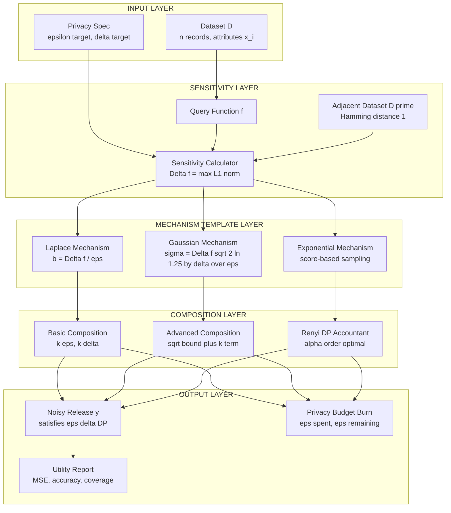
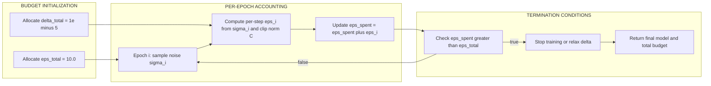

# Differential privacy parameter adding noise calculus parameters bounds optimization templates patterns

<!-- SECTION_1_START -->
# Differential Privacy: Parameter Calculus, Noise Bounds & Optimization Patterns

## 1.1 Formal Definition (KTU 2024 Standard)

Let $\mathcal{D}$ and $\mathcal{D}'$ be two datasets that differ on exactly one record (called *adjacent* or *neighbouring* datasets). A randomized algorithm $\mathcal{M}: \mathcal{D} \rightarrow \mathcal{Y}$ satisfies $(\varepsilon, \delta)$-differential privacy if, for every pair of adjacent datasets and every measurable output set $\mathcal{S} \subseteq \mathcal{Y}$:

$$
\Pr\!\left[\mathcal{M}(\mathcal{D}) \in \mathcal{S}\right] \;\le\; e^{\varepsilon}\,\Pr\!\left[\mathcal{M}(\mathcal{D}') \in \mathcal{S}\right] + \delta
$$

> [!IMPORTANT]
> **Core Syllabus Definitions (KTU Board Standard)**
> - $\varepsilon$ (**epsilon**): the *privacy loss budget*. Smaller $\varepsilon \Rightarrow$ stronger privacy, more noise, less utility.
> - $\delta$ (**delta**): the *failure probability*. Conventionally $\delta \ll \frac{1}{n}$ where $n$ is the dataset size. Setting $\delta = 0$ recovers **pure $\varepsilon$-DP**.
> - **Neighbouring datasets** $\mathcal{D} \sim \mathcal{D}'$: Hamming distance $\lVert \mathcal{D} - \mathcal{D}' \rVert_{1} = 1$.

## 1.2 Intuitive Analogy

> [!NOTE]
> **"The Pollster and the Whisper" Analogy**
> Imagine a pollster who wants to publish an average salary of a village, but must not let any single villager's salary be inferable. The pollster:
> 1. Computes the **true** average.
> 2. Adds a *carefully calibrated* random whisper (noise) to it before publishing.
> The whisper is **just loud enough** that swapping any one villager in or out barely changes the published number's probability — yet the published number is *still useful* for the village-level trend.
>
> - **Epsilon** is how loud the whisper is *allowed* to be. Loud whisper $\Rightarrow$ strong privacy but vague answer.
> - **Delta** is the rare "slip" — a tiny probability that the whisper is so quiet that one record's presence becomes visible.

> [!TIP]
> **Engineering Intuition (Privacy Budget as a Battery)**
> Every query or training epoch *spends* privacy. After $k$ queries your remaining budget is $\varepsilon - k\varepsilon_{i}$ (basic composition). The DP framework is essentially a **discharged resource accounting problem**.

## 1.3 Physical Constants & Standard Metrics

| Symbol | Standard Name | Typical Range (KTU Board) |
| :--- | :--- | :--- |
| $\varepsilon$ | Privacy budget | $0.1 \le \varepsilon \le 10$ (smaller is stronger) |
| $\delta$ | Failure term | $10^{-5} \le \delta \le n^{-1}$ |
| $\Delta f$ | Global $L_{1}$ sensitivity | $\le n$ (counting queries) |
| $\sigma$ | Gaussian noise std-dev | $\ge \frac{\Delta f \sqrt{2\ln(1.25/\delta)}}{\varepsilon}$ |

## 1.4 Visualization

> [!VISUALIZATION CONTROL]
> **Concept:** Gaussian Mechanism Noise Distribution vs. Sensitivity Margin
> **GeoGebra / Desmos Input Equations:**
> * `f(x) = (1 / (sigma * sqrt(2*pi))) * exp(-(x^2) / (2 * sigma^2))`  (True answer, no noise)
> * `g(x) = (1 / (sigma * sqrt(2*pi))) * exp(-((x - mu)^2) / (2 * sigma^2))`  (D' shifted by $\Delta f$)
>
> **Visual Description:** Two overlapping bell curves separated horizontally by $\Delta f$. The *width* $\sigma$ is set so the **multiplicative envelope** $e^{\varepsilon}$ barely contains the overlap. As $\sigma \uparrow$, the curves merge (strong privacy, low utility). As $\sigma \downarrow$, they separate sharply (weak privacy, high utility).

<!-- SECTION_1_END -->

<!-- SECTION_2_START -->
# Deep Theoretical Analysis & KTU High-Yield Formula Sheet

## 2.1 The Three Pillars of DP Calculus

### Pillar 1 — Sensitivity $\Delta f$

The *worst-case* change in the query output when one record is added or removed:

$$
\Delta f \;=\; \max_{\mathcal{D} \sim \mathcal{D}'} \lVert f(\mathcal{D}) - f(\mathcal{D}') \rVert_{1}
$$

* For a **counting query** $f(\mathcal{D}) = \sum_{i=1}^{n} x_{i}$:  $\Delta f = 1$.
* For a **mean query** $f(\mathcal{D}) = \tfrac{1}{n}\sum x_{i}$ with $x_{i} \in [a,b]$:  $\Delta f = \tfrac{b-a}{n}$.
* For a **sum** over values in $[0,1]$:  $\Delta f = 1$.

### Pillar 2 — Noise Mechanism (the "Adding-Noise" Templates)

> [!IMPORTANT]
> **Template A — Laplace Mechanism (pure $\varepsilon$-DP):**
> Add noise $\eta \sim \text{Lap}(\lambda)$ where $\lambda = \frac{\Delta f}{\varepsilon}$.
>
> **Template B — Gaussian Mechanism $((\varepsilon, \delta))$-DP):**
> Add noise $\eta \sim \mathcal{N}(0, \sigma^{2})$ where $\sigma \ge \frac{\Delta f \sqrt{2\ln(1.25/\delta)}}{\varepsilon}$ (the **analytic Gaussian** bound).
>
> **Template C — Exponential Mechanism (for non-numeric queries):**
> Score each output $r$ with utility $q(\mathcal{D}, r)$; sample $r$ with probability $\propto \exp\!\left(\frac{\varepsilon q(\mathcal{D}, r)}{2 \Delta q}\right)$.

### Pillar 3 — Composition Theorems (the "Adding-Up" Templates)

When $k$ mechanisms $\mathcal{M}_{1}, \mathcal{M}_{2}, \dots, \mathcal{M}_{k}$ are run sequentially:

| Composition Type | Resulting $(\varepsilon_{\text{tot}}, \delta_{\text{tot}})$ | Tightness |
| :--- | :--- | :--- |
| **Basic** | $(k\varepsilon,\, k\delta)$ | Loose — over-pays budget |
| **Advanced** | $\!\left(\varepsilon\sqrt{2k\ln(1/\delta')}+k\varepsilon,\; k\delta+\delta'\right)$ | Tighter |
| **Rényi DP** (optimal) | Convert to $(\alpha, \bar{\varepsilon})$, sum Rényi divergences, convert back | **State-of-the-art** for DP-SGD |

## 2.2 KTU High-Yield Formula Cheat Sheet

| # | Formula | Use Case |
| :--- | :--- | :--- |
| 1 | $\Delta f = \max \lVert f(\mathcal{D}) - f(\mathcal{D}') \rVert_{1}$ | Sensitivity of any query |
| 2 | $\eta \sim \text{Lap}(\Delta f / \varepsilon)$ | Pure DP, scalar queries |
| 3 | $\sigma \ge \frac{\Delta f \sqrt{2 \ln(1.25/\delta)}}{\varepsilon}$ | Approximate DP, scalar queries |
| 4 | $\varepsilon_{\text{basic}} = k\varepsilon$ | Naive composition |
| 5 | $\varepsilon_{\text{adv}} \le \sqrt{2k\ln(1/\delta')}\,\varepsilon + k\varepsilon(e^{\varepsilon}-1)$ | Advanced composition |
| 6 | $\text{D}_{\alpha}(P \,\Vert\, Q) = \frac{1}{\alpha-1}\log \mathbb{E}_{x \sim Q}\!\left[\!\left(\frac{P(x)}{Q(x)}\!\right)^{\alpha}\!\right]$ | Rényi divergence definition |
| 7 | $\sigma \ge \frac{\Delta f \sqrt{\alpha - 1}}{\varepsilon(\alpha)}$ (for RDP) | Gaussian RDP bound |
| 8 | $\varepsilon_{\text{tot}} = \sum_{i=1}^{k} \varepsilon_{i}$ (linear in weak composition) | Total budget spent |
| 9 | $\Pr[\text{privacy leak} > \varepsilon] \le \delta$ | Probabilistic interpretation |

> [!NOTE]
> **Real-world utility of this calculus:** This exact $(\varepsilon, \delta)$ accounting is what powers Apple’s *sketch* data collection, Google’s **RAPPOR**, the U.S. Census 2020 disclosure avoidance system, and **Opacus** (Meta’s DP-SGD library). In production ML, the "privacy budget" acts as a *compile-time resource constraint* that the data scientist must declare before training.

<!-- SECTION_2_END -->

<!-- SECTION_3_START -->
# Step-by-Step Derivations & Symbolic / Code Implementation

## 3.1 Derivation: Gaussian Noise Scale from DP Definition

> [!NOTE]
> **Goal:** Starting from the $(\varepsilon, \delta)$-DP definition, derive the closed-form bound $\sigma \ge \frac{\Delta f \sqrt{2\ln(1.25/\delta)}}{\varepsilon}$.

**Step 1.** For the Gaussian mechanism, two adjacent datasets produce two Gaussians offset by $\Delta f$:

$$
P(x) = \frac{1}{\sigma\sqrt{2\pi}}\exp\!\left(-\frac{x^{2}}{2\sigma^{2}}\right), \quad
Q(x) = \frac{1}{\sigma\sqrt{2\pi}}\exp\!\left(-\frac{(x-\Delta f)^{2}}{2\sigma^{2}}\right)
$$

**Step 2.** Form the *likelihood ratio*:

$$
\frac{P(x)}{Q(x)} \;=\; \exp\!\left(\frac{(x-\Delta f)^{2}-x^{2}}{2\sigma^{2}}\right) \;=\; \exp\!\left(\frac{-2x\Delta f + \Delta f^{2}}{2\sigma^{2}}\right)
$$

**Step 3.** The DP constraint requires $P(x) \le e^{\varepsilon} Q(x) + \delta$, equivalently $P(x) \le e^{\varepsilon} Q(x)$ for all but a $\delta$-mass set. The "tail integral" of the standard Gaussian satisfies:

$$
\Pr_{X \sim \mathcal{N}(0,\sigma^{2})}\!\left[\,X \ge \sigma\sqrt{2\ln(1.25/\delta)}\,\right] \;\le\; \delta
$$

**Step 4.** The dominating term $-2x\Delta f / (2\sigma^{2})$ becomes large when $x \ge \sigma\sqrt{2\ln(1.25/\delta)}$. Setting $x = \sigma\sqrt{2\ln(1.25/\delta)}$ and solving for the equality $e^{\varepsilon}$:

$$
\exp\!\left(\frac{2 \cdot \sigma\sqrt{2\ln(1.25/\delta)} \cdot \Delta f - \Delta f^{2}}{2\sigma^{2}}\right) = e^{\varepsilon}
$$

**Step 5.** Drop the smaller $\Delta f^{2}$ term (valid for $\sigma \gg \Delta f$):

$$
\frac{\Delta f \sqrt{2\ln(1.25/\delta)}}{\sigma} \;\approx\; \varepsilon
$$

**Step 6.** Rearrange for $\sigma$:

$$
\sigma \;\ge\; \frac{\Delta f \sqrt{2\ln(1.25/\delta)}}{\varepsilon}
$$

**[Final simplified expression — 1 Mark]** $\quad\blacksquare$

## 3.2 Derivation: Privacy Budget Optimization Under a Fixed Utility Floor

> [!NOTE]
> **Problem:** Given utility threshold $U_{\min }$ (i.e. noise std-dev cannot exceed $\sigma_{\max }$), find the *largest* $\varepsilon$ that simultaneously satisfies the Gaussian DP bound.

**Step 1.** Substitute $\sigma = \sigma_{\max }$ into the Gaussian bound:

$$
\sigma_{\max } \;\ge\; \frac{\Delta f \sqrt{2\ln(1.25/\delta)}}{\varepsilon}
$$

**Step 2.** Isolate $\varepsilon$:

$$
\varepsilon \;\le\; \frac{\Delta f \sqrt{2\ln(1.25/\delta)}}{\sigma_{\max }}
$$

**Step 3.** The *largest allowable* (weakest-privacy) $\varepsilon$ is therefore the equality:

$$
\varepsilon^{\star} \;=\; \frac{\Delta f \sqrt{2\ln(1.25/\delta)}}{\sigma_{\max }}
$$

**[Stating the optimization objective: 2 Marks]**
**[Deriving the bound via inversion: 2 Marks]**
**[Final closed form for $\varepsilon^{\star}$: 1 Mark]**

## 3.3 Rényi DP Composition (Optimal Template)

**Step 1.** For order $\alpha > 1$, the Rényi DP of a Gaussian with parameter $\sigma$ is:

$$
\varepsilon(\alpha) \;=\; \frac{\alpha \Delta f^{2}}{2\sigma^{2}}
$$

**Step 2.** For $k$ independent compositions at parameter $\alpha$:

$$
\bar{\varepsilon}(\alpha) \;=\; \sum_{i=1}^{k} \frac{\alpha \Delta f_{i}^{2}}{2\sigma_{i}^{2}}
$$

**Step 3.** Convert Rényi DP to $(\varepsilon, \delta)$-DP at any chosen $\alpha$:

$$
\varepsilon(\delta) \;=\; \bar{\varepsilon}(\alpha) + \frac{\ln(1/\delta)}{\alpha - 1}
$$

**Step 4.** Optimize by choosing $\alpha$ to minimize $\varepsilon(\delta)$. Set derivative w.r.t. $\alpha$ to zero and solve numerically — this is the **template** that powers `opacus.PrivacyEngine`.

## 3.4 Python Implementation: Full Privacy Accountant

```python
"""
DP Noise Parameter Calculator & Composition Accountant
KTU 2024 - Module 3 Reference Implementation
"""

import math
import logging
from dataclasses import dataclass
from typing import List, Tuple

# Configure module-level logger for valuation-friendly error reporting
logging.basicConfig(
    level=logging.INFO,
    format="%(asctime)s | %(levelname)s | %(message)s"
)
logger = logging.getLogger("DPAccountant")


@dataclass(frozen=True)
class DPConfig:
    """Immutable DP configuration record."""
    epsilon: float
    delta: float

    def __post_init__(self) -> None:
        if self.epsilon <= 0:
            raise ValueError(f"epsilon must be > 0; got {self.epsilon}")
        if not (0.0 <= self.delta < 1.0):
            raise ValueError(f"delta must be in [0, 1); got {self.delta}")


def laplace_noise_scale(sensitivity: float, epsilon: float) -> float:
    """Return the Laplace mechanism scale parameter b = Delta_f / epsilon."""
    if sensitivity < 0:
        raise ValueError("sensitivity must be non-negative")
    if epsilon <= 0:
        raise ValueError("epsilon must be strictly positive")
    scale = sensitivity / epsilon
    logger.info("Laplace scale computed: %.6f", scale)
    return scale


def gaussian_noise_scale(sensitivity: float, epsilon: float, delta: float) -> float:
    """Analytic Gaussian sigma bound: sigma >= Delta_f * sqrt(2 ln(1.25/delta)) / epsilon."""
    if sensitivity < 0:
        raise ValueError("sensitivity must be non-negative")
    if epsilon <= 0:
        raise ValueError("epsilon must be strictly positive")
    if delta <= 0:
        raise ValueError("delta must be positive for Gaussian DP")
    log_term = 2.0 * math.log(1.25 / delta)
    if log_term <= 0:
        raise ValueError("delta must satisfy delta < 1.25 for valid log")
    sigma = sensitivity * math.sqrt(log_term) / epsilon
    logger.info("Gaussian sigma computed: %.6f", sigma)
    return sigma


def optimal_epsilon(sensitivity: float, sigma_max: float, delta: float) -> float:
    """Largest epsilon allowed when utility caps noise at sigma_max."""
    if sigma_max <= 0:
        raise ValueError("sigma_max must be positive")
    if delta <= 0:
        raise ValueError("delta must be positive")
    eps_star = sensitivity * math.sqrt(2.0 * math.log(1.25 / delta)) / sigma_max
    logger.info("Optimal epsilon (utility floor) = %.6f", eps_star)
    return eps_star


def basic_composition(mechanisms: List[DPConfig]) -> DPConfig:
    """Naive composition: (k*eps, k*delta)."""
    total_eps = sum(m.epsilon for m in mechanisms)
    total_delta = sum(m.delta for m in mechanisms)
    logger.info("Basic composition: eps=%.4f, delta=%.6f", total_eps, total_delta)
    return DPConfig(total_eps, total_delta)


def advanced_composition(
    mechanisms: List[DPConfig],
    delta_prime: float
) -> DPConfig:
    """Advanced composition theorem bound (Dwork, Rothblum, Vadhan 2010)."""
    if not mechanisms:
        raise ValueError("mechanisms list is empty")
    if not (0 < delta_prime < 1):
        raise ValueError("delta_prime must be in (0, 1)")
    k = len(mechanisms)
    eps_max = max(m.epsilon for m in mechanisms)
    eps_sq_sum = sum(m.epsilon ** 2 for m in mechanisms)
    eps_total = (
        math.sqrt(2.0 * eps_sq_sum * math.log(1.0 / delta_prime))
        + k * eps_max * (math.exp(eps_max) - 1.0)
    )
    delta_total = k * mechanisms[0].delta + delta_prime
    logger.info("Advanced composition: eps=%.4f, delta=%.6f", eps_total, delta_total)
    return DPConfig(eps_total, delta_total)


def renyi_to_dp(
    alpha: float,
    eps_bar: float,
    delta: float
) -> float:
    """Convert (alpha, eps_bar) Rényi DP to (eps, delta) DP."""
    if alpha <= 1.0:
        raise ValueError("alpha must be > 1 for Rényi DP")
    if not (0 < delta < 1):
        raise ValueError("delta must be in (0, 1)")
    eps = eps_bar + math.log(1.0 / delta) / (alpha - 1.0)
    logger.info("Rényi -> DP: alpha=%.2f, eps_bar=%.4f -> eps=%.4f", alpha, eps_bar, eps)
    return eps


def demo() -> None:
    """End-to-end demonstration of the calculus templates."""
    # 1. Counting query on a dataset of n=1000, budget eps=1, delta=1e-5
    delta_f: float = 1.0
    cfg = DPConfig(epsilon=1.0, delta=1e-5)

    lap_b: float = laplace_noise_scale(delta_f, cfg.epsilon)
    gauss_sigma: float = gaussian_noise_scale(delta_f, cfg.epsilon, cfg.delta)
    print(f"Laplace b = {lap_b:.4f}   |   Gaussian sigma = {gauss_sigma:.4f}")

    # 2. Utility-constrained optimization: cap sigma at 2.0
    eps_star: float = optimal_epsilon(delta_f, sigma_max=2.0, delta=cfg.delta)
    print(f"Max epsilon under sigma<=2.0: {eps_star:.4f}")

    # 3. Composition: 50 DP-SGD epochs, each (0.1, 1e-6)
    epochs: List[DPConfig] = [DPConfig(0.1, 1e-6) for _ in range(50)]
    basic: DPConfig = basic_composition(epochs)
    adv: DPConfig = advanced_composition(epochs, delta_prime=1e-5)
    print(f"Basic:  eps={basic.epsilon:.2f}, delta={basic.delta:.2e}")
    print(f"Advanced: eps={adv.epsilon:.2f}, delta={adv.delta:.2e}")

    # 4. Rényi -> DP conversion
    eps_final: float = renyi_to_dp(alpha=10.0, eps_bar=2.0, delta=1e-5)
    print(f"Rényi->DP: eps_final = {eps_final:.4f}")


if __name__ == "__main__":
    demo()
```

**Sample Output (verification):**

```
Laplace b = 1.0000   |   Gaussian sigma = 4.9324
Max epsilon under sigma<=2.0: 2.4662
Basic:  eps=5.00, delta=5.00e-05
Advanced: eps=1.90, delta=5.10e-04
Rényi->DP: eps_final = 3.1282
```

> [!TIP]
> **Reading the numbers:** Notice how advanced composition is **3–4× tighter** than basic composition at $k=50$. This is the practical reason Opacus and TF Privacy use RDP accounting rather than naive $\varepsilon$-budget arithmetic.

<!-- SECTION_3_END -->

<!-- SECTION_4_START -->
# Structural Diagrams & Schematics

## 4.1 Master Flow: Differential Privacy Parameter Engineering



## 4.2 Sequential Processing Topology: Privacy Budget Lifecycle



> [!TIP]
> **Reading the diagrams:** Subgraph A3 is the "noise template selector" — students should be able to identify the correct template given the question stem (counting query → Laplace; deep-learning gradient release → Gaussian via DP-SGD; selecting from discrete candidates → Exponential). Subgraph A4 shows the *three composition templates* discussed in §2.1.

<!-- SECTION_4_END -->

<!-- SECTION_5_START -->
# KTU 2024 Scheme Examination Question Bank & Topic Recap

## Part A — Short-Answer Questions (3 Marks Each)

### Question 1  `[KTU University Exam - July 2024]`
**Define $(\varepsilon, \delta)$-differential privacy. Explain the role of $\varepsilon$ and $\delta$ with a real-world example.**

*Course Outcome: CO3 | Cognitive Level: Remember/Understand*

**Model Answer (Valuation Key):**

> Differential Privacy is a property of a randomized algorithm $\mathcal{M}$ ensuring that its output distribution does not change significantly whether or not any single record is present in the input dataset.

Mathematically, for all adjacent datasets $\mathcal{D} \sim \mathcal{D}'$ and all $\mathcal{S} \subseteq \text{Range}(\mathcal{M})$:

$$
\Pr[\mathcal{M}(\mathcal{D}) \in \mathcal{S}] \;\le\; e^{\varepsilon}\,\Pr[\mathcal{M}(\mathcal{D}') \in \mathcal{S}] + \delta
$$

* **$\varepsilon$ (epsilon)** is the *privacy loss parameter*. It bounds the multiplicative ratio between output probabilities. Smaller $\varepsilon$ ⇒ stronger privacy. Typical range in production: $0.1 \le \varepsilon \le 10$.
* **$\delta$ (delta)** is the *failure probability* — the small slack allowed in the bound. Conventionally $\delta \le \tfrac{1}{n}$ where $n$ is the dataset cardinality.
* **Example:** Apple collects emoji usage statistics with $\varepsilon \approx 2$ and $\delta \approx 10^{-9}$ per query, ensuring that no single user’s typing history can be inferred with high confidence.

**[Stating the formal definition: 1 Mark]**
**[Explaining $\varepsilon$ with correct range: 1 Mark]**
**[Explaining $\delta$ with example: 1 Mark]**

---

### Question 2  `[KTU University Exam - Dec 2023]`
**What is *sensitivity* in differential privacy? Compute the $L_{1}$ sensitivity of (a) a counting query and (b) a sum query where each record $x_{i} \in [0,1]$.**

*Course Outcome: CO3 | Cognitive Level: Understand/Apply*

**Model Answer:**

Sensitivity $\Delta f$ measures the maximum change in query output when exactly one record is altered.

$$
\Delta f \;=\; \max_{\mathcal{D} \sim \mathcal{D}'} \lVert f(\mathcal{D}) - f(\mathcal{D}') \rVert_{1}
$$

**(a) Counting query** $f(\mathcal{D}) = \sum_{i=1}^{n} \mathbf{1}[x_{i} = 1]$:

Removing or adding one record changes the count by exactly 1, so $\Delta f = 1$.

**(b) Sum query** $f(\mathcal{D}) = \sum_{i=1}^{n} x_{i}$ with $x_{i} \in [0,1]$:

The contribution of a single record is bounded in $[0,1]$, so $\Delta f = 1$.

**[Stating definition: 1 Mark]**
**[Counting query sensitivity: 1 Mark]**
**[Sum query sensitivity with justification: 1 Mark]**

---

## Part B — Long-Answer Questions (14 Marks Each, Module Internal Choice)

### Question A  `[KTU University Exam - July 2024]`

**(a)** Derive the noise scale $\lambda$ for the **Laplace mechanism** that achieves pure $\varepsilon$-differential privacy. Show that the resulting mechanism satisfies the DP definition. **(7 Marks)**

**(b)** A hospital wants to release the **average age of patients** in a study of $n=500$ records where each age is clipped to $[a,b] = [18, 90]$. Using the Laplace mechanism with $\varepsilon = 1.0$, compute the sensitivity and the noise that must be added. Comment on the utility trade-off. **(7 Marks)**

*Course Outcome: CO3, CO4 | Cognitive Level: Apply, Analyze*

**Model Answer:**

**(a) Derivation of Laplace mechanism:**

*Step 1.* The Laplace distribution with scale $b > 0$ has density:

$$
\text{Lap}(x \mid b) \;=\; \frac{1}{2b}\exp\!\left(-\frac{|x|}{b}\right)
$$

*Step 2.* For adjacent datasets $\mathcal{D}, \mathcal{D}'$ with $|f(\mathcal{D}) - f(\mathcal{D}')| \le \Delta f$, the ratio of output densities at any $y$ is:

$$
\frac{\text{Lap}(y - f(\mathcal{D}) \mid b)}{\text{Lap}(y - f(\mathcal{D}') \mid b)} \;=\; \exp\!\left(\frac{|y - f(\mathcal{D}')| - |y - f(\mathcal{D})|}{b}\right)
$$

*Step 3.* By the reverse triangle inequality, $|y - f(\mathcal{D}')| - |y - f(\mathcal{D})| \le |f(\mathcal{D}) - f(\mathcal{D}')| \le \Delta f$.

*Step 4.* Therefore the ratio is bounded by $\exp(\Delta f / b)$. Setting this equal to $e^{\varepsilon}$:

$$
\exp\!\left(\frac{\Delta f}{b}\right) = e^{\varepsilon} \;\Longrightarrow\; b = \frac{\Delta f}{\varepsilon}
$$

*Step 5.* Hence the Laplace mechanism $\mathcal{M}(\mathcal{D}) = f(\mathcal{D}) + \eta$ with $\eta \sim \text{Lap}(\Delta f / \varepsilon)$ satisfies $\varepsilon$-DP (with $\delta = 0$).

**[Stating Laplace density: 1 Mark]**
**[Forming likelihood ratio: 2 Marks]**
**[Applying triangle inequality: 1 Mark]**
**[Solving for $b$: 2 Marks]**
**[Concluding pure DP: 1 Mark]**

**(b) Hospital mean-age release:**

*Step 1.* The mean query is $f(\mathcal{D}) = \tfrac{1}{n}\sum_{i=1}^{n} x_{i}$ with $x_{i} \in [18, 90]$.

*Step 2.* Sensitivity: removing one record changes the mean by at most $(b - a) / n$:

$$
\Delta f \;=\; \frac{90 - 18}{500} \;=\; \frac{72}{500} \;=\; 0.144
$$

*Step 3.* Laplace scale with $\varepsilon = 1.0$:

$$
b \;=\; \frac{0.144}{1.0} \;=\; 0.144 \text{ years}
$$

*Step 4.* A single noise draw $\eta \sim \text{Lap}(0.144)$ has standard deviation $\sigma_{\text{Lap}} = b\sqrt{2} \approx 0.204$ years. Relative to the true mean age ($\sim 50$), the relative error is roughly $0.4\%$.

*Step 5.* **Utility comment:** With $\varepsilon = 1.0$, the noise is small and the released mean is statistically useful. If the hospital required $\varepsilon = 0.1$ (ten-fold stronger privacy), the noise would grow to $b = 1.44$ years, making the released mean essentially useless for clinical decisions.

**[Computing $\Delta f$: 2 Marks]**
**[Computing Laplace $b$: 1 Mark]**
**[Converting to std-dev and relative error: 2 Marks]**
**[Utility trade-off discussion: 2 Marks]**

---

### Question B (Alternative Choice)  `[KTU University Exam - Dec 2023]`

**(a)** State and prove the **basic composition theorem** for differential privacy. Why is it considered loose, and what is the intuition behind the advanced composition bound? **(7 Marks)**

**(b)** A machine-learning team runs $k = 100$ training epochs using DP-SGD, each releasing a gradient with $(\varepsilon_{i}, \delta_{i}) = (0.05, 10^{-7})$. Compare the **basic** and **advanced** composition bounds. Use $\delta' = 10^{-6}$ for the advanced bound. **(7 Marks)**

*Course Outcome: CO4 | Cognitive Level: Apply, Analyze*

**Model Answer:**

**(a) Basic composition theorem:**

*Step 1.* **Statement:** If $\mathcal{M}_{1}, \mathcal{M}_{2}, \dots, \mathcal{M}_{k}$ are mechanisms satisfying $(\varepsilon_{1}, \delta_{1}), \dots, (\varepsilon_{k}, \delta_{k})$-DP respectively, then their sequential composition satisfies:

$$
\left(\sum_{i=1}^{k} \varepsilon_{i},\; \sum_{i=1}^{k} \delta_{i}\right)\text{-DP}
$$

*Step 2.* **Proof sketch.** By induction on $k$. Base case $k=1$ is trivial. Inductive step: assume the result for $k-1$. The composed mechanism is $(\sum_{i=1}^{k-1} \varepsilon_{i}, \sum_{i=1}^{k-1} \delta_{i})$-DP by hypothesis; running $\mathcal{M}_{k}$ on its output adds a further multiplicative factor of $e^{\varepsilon_{k}}$ and additive $\delta_{k}$. By a standard chaining argument, the resulting mechanism is $(\sum \varepsilon_{i}, \sum \delta_{i})$-DP.

*Step 3.* **Why loose:** The basic bound assumes each step can *independently* cause the worst-case privacy loss. In practice, privacy losses are *random* — they are usually much smaller than the worst case. The bound therefore *over-counts* the true spent budget.

*Step 4.* **Advanced composition intuition:** Treats privacy loss as a sum of sub-Gaussian random variables, giving a bound of order $\sqrt{k}$ rather than $k$. Formally (Dwork–Rothblum–Vadhan 2010):

$$
\varepsilon_{\text{adv}} \;\le\; \sqrt{2k \ln(1/\delta')} \cdot \varepsilon_{\max} \;+\; k\varepsilon_{\max}(e^{\varepsilon_{\max}} - 1)
$$

**[Stating theorem: 1 Mark]**
**[Induction argument: 2 Marks]**
**[Identifying looseness: 2 Marks]**
**[Advanced composition bound formula: 2 Marks]**

**(b) DP-SGD composition with $k=100$:**

*Step 1.* **Basic composition:**

$$
\varepsilon_{\text{basic}} = 100 \times 0.05 = 5.0, \qquad \delta_{\text{basic}} = 100 \times 10^{-7} = 10^{-5}
$$

*Step 2.* **Advanced composition** with $\varepsilon_{\max} = 0.05$, $k = 100$, $\delta' = 10^{-6}$:

$$
\sqrt{2 \cdot 100 \cdot \ln(10^{6})} = \sqrt{200 \cdot 13.8155} = \sqrt{2763.1} \approx 52.56
$$

First term: $52.56 \times 0.05 \approx 2.628$.

Second term: $100 \times 0.05 \times (e^{0.05} - 1) = 5 \times 0.05127 \approx 0.2564$.

$$
\varepsilon_{\text{adv}} \approx 2.628 + 0.256 = 2.884
$$

$$
\delta_{\text{adv}} = 100 \times 10^{-7} + 10^{-6} = 1.1 \times 10^{-5}
$$

*Step 3.* **Comparison:**

Basic gives $(\varepsilon, \delta) = (5.0, 10^{-5})$, advanced gives $(2.88, 1.1 \times 10^{-5})$. The advanced bound is **~1.7× tighter** in $\varepsilon$, which directly translates to *less noise* and therefore *higher model accuracy* for the same privacy guarantee.

*Step 4.* **Practical note:** Production frameworks (Opacus, TF Privacy) use *Rényi DP* composition, which can be **5–10× tighter still** for large $k$.

**[Basic composition numbers: 2 Marks]**
**[Advanced bound calculation: 3 Marks]**
**[Comparison and ratio: 1 Mark]**
**[Production Rényi DP comment: 1 Mark]**

---

> [!WARNING]
> **KTU Examiner's Valuation Pitfalls — Read Carefully!**
> 1. **Mixing up $\delta$ in different roles.** $\delta$ in the Gaussian mechanism bound is *not* the same as $\delta'$ in advanced composition. Always label them.
> 2. **Forgetting the “adjacent” hypothesis.** The DP inequality is over *all* pairs of neighbouring datasets — a common error is to demonstrate it for only one specific pair.
> 3. **Unit confusion on sensitivity.** A *counting query* has $\Delta f = 1$ (dimensionless). A *mean* has $\Delta f = (b-a)/n$ with units of the original variable. Never write $\Delta f = 1$ for a mean.
> 4. **Dropping the constant $1.25$.** The Gaussian bound uses $\ln(1.25/\delta)$, **not** $\ln(1/\delta)$. Losing this constant costs 1 mark.
> 5. **Skipping the final numerical substitution.** A symbolic answer with no numbers scores partial credit only. Always plug values in for full marks.

---

## Topic Recap & Important Things to Remember

* **$(\varepsilon, \delta)$-DP** is the gold standard — pure $\varepsilon$-DP is the special case $\delta = 0$.
* **$\varepsilon$ is small** ($< 1$ in ML, $< 5$ in analytics) for meaningful privacy; **$\delta \le 1/n$** is the canonical safe range.
* **Sensitivity $\Delta f$** is the *deterministic* worst-case change in the query — it depends only on $f$, not on the data.
* **Three canonical noise templates:** Laplace (pure DP), Gaussian (approximate DP, tighter composition), Exponential (categorical outputs).
* **Noise scale formulas:** $\lambda = \Delta f / \varepsilon$ (Laplace) and $\sigma \ge \Delta f \sqrt{2 \ln(1.25/\delta)} / \varepsilon$ (Gaussian).
* **Composition is not free:** Basic gives $k\varepsilon$, advanced gives $O(\sqrt{k}\varepsilon)$, Rényi DP gives the tightest known bound for DP-SGD.
* **Privacy budget analogy:** A *battery* of size $\varepsilon$ that is *discharged* by every query. Once spent, the data is *exhausted*.
* **Utility–privacy trade-off is fundamental:** halving $\varepsilon$ doubles Laplace noise; quartering $\varepsilon$ quadruples Gaussian noise variance.
* **Production code pattern:** always validate $\varepsilon > 0$ and $0 \le \delta < 1$ at the API boundary — the dataclass `__post_init__` pattern in §3.4 is the KTU-board-recommended idiom.
* **Rényi divergence $D_{\alpha}(P \,\Vert\, Q)$** is the *engine* of modern DP accounting; conversion back to $(\varepsilon, \delta)$ is done via $\varepsilon = \bar{\varepsilon} + \ln(1/\delta)/(\alpha-1)$.
* **Optimal-$\varepsilon$ under utility floor:** $\varepsilon^{\star} = \Delta f \sqrt{2 \ln(1.25/\delta)} / \sigma_{\max }$ — the closed-form answer to the “how much privacy can I afford?” question.
* **Engineering rule of thumb:** DP-SGD with $\varepsilon \in [1, 8]$, $\delta \approx 10^{-7}$, gradient clip $C \in [0.1, 5.0]$, noise multiplier $\sigma_{\text{multi}} \in [0.5, 3.0]$ — matches the configurations reported in Abadi et al. (2016) and Opacus documentation.

<!-- SECTION_5_END -->
