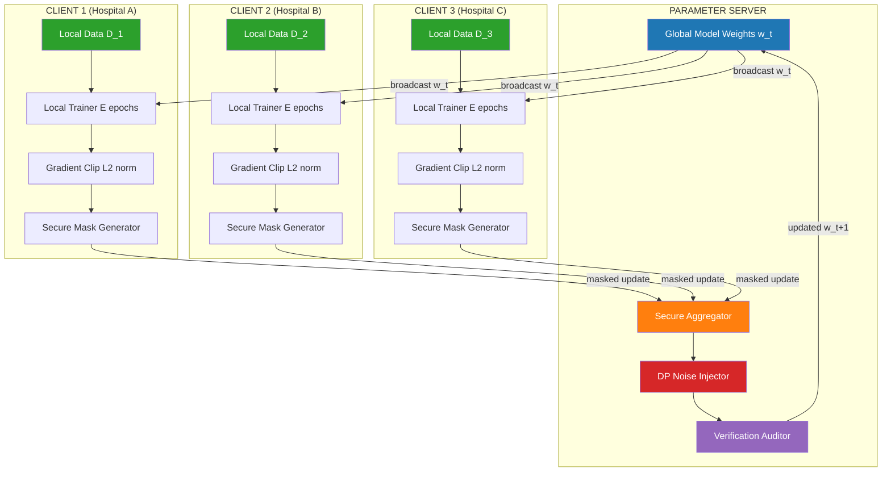
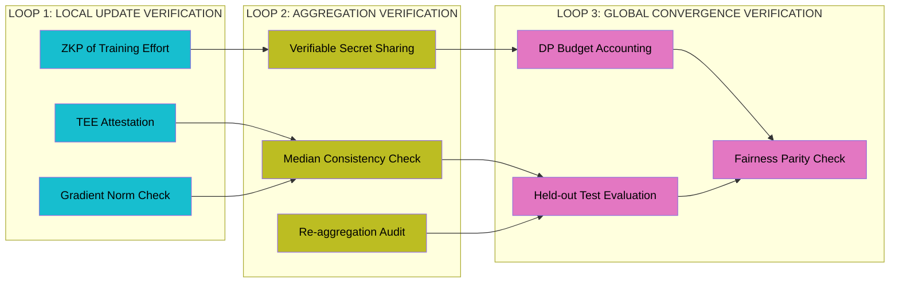
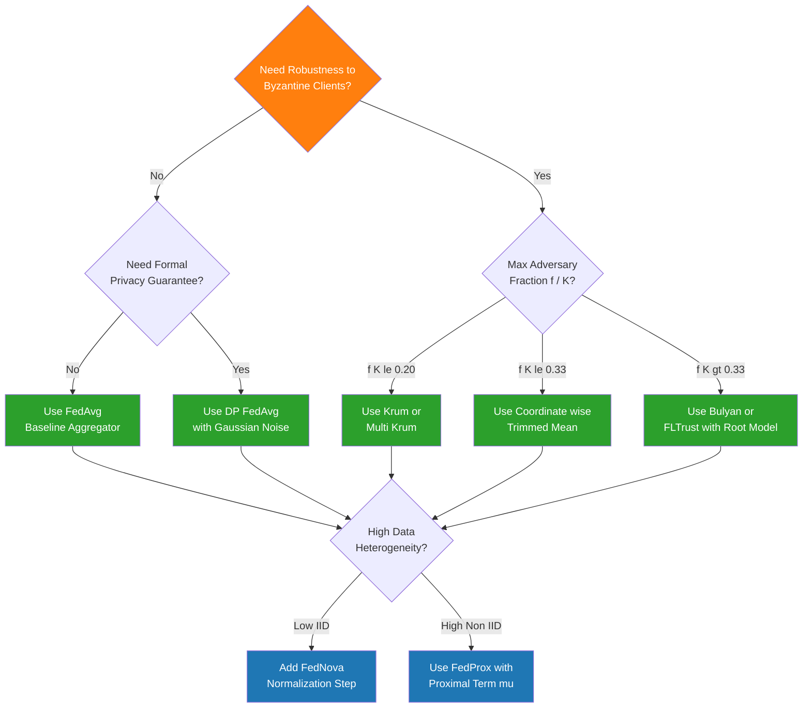
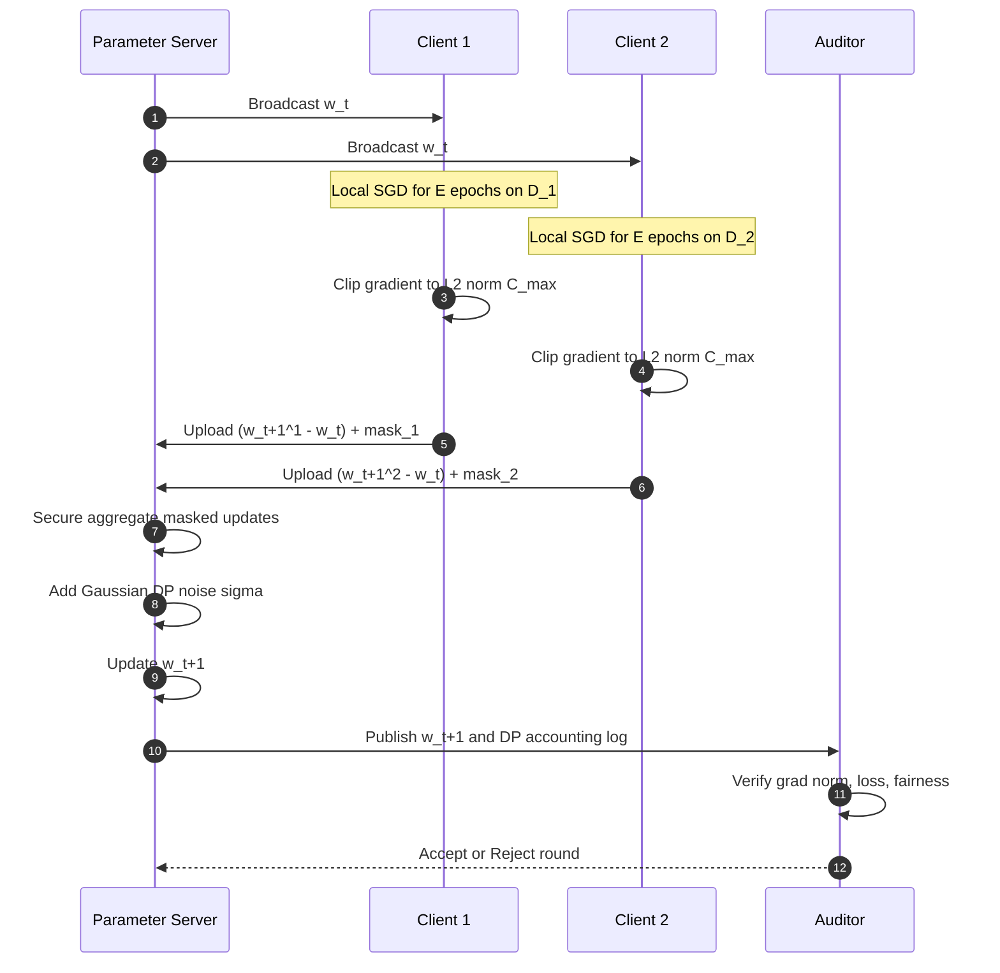

# Federated learning model sharing aggregation frameworks verification routes loops parameters metrics

<!-- SECTION_1_START -->

# Federated Learning: Model Sharing, Aggregation Frameworks, Verification Routes & Performance Metrics

## 1.1 Formal Definition (KTU 2024 Syllabus Terminology)

**Federated Learning (FL)** is a decentralized, privacy-preserving machine learning paradigm in which multiple distributed clients (e.g., mobile devices, hospitals, edge nodes) collaboratively train a shared global model under the coordination of a central server **without ever exposing their raw local data**. The system exchanges only model parameters, gradients, or updates, ensuring that sensitive information remains at the source.

> [!IMPORTANT]
> **KTU 2024 Definition (PECST716 Module 3):**
> *Federated Learning is a privacy-preserving distributed learning framework that enables collaborative model training across data silos by exchanging model parameters over a coordination server, while leveraging formal privacy guarantees such as $(\epsilon, \delta)$-Differential Privacy, Secure Aggregation, and Homomorphic Encryption to mitigate information leakage through shared gradients.*

Let us formally describe the setting.

Consider a federation of $K$ clients indexed by $k \in \{1, 2, \ldots, K\}$. Each client $k$ holds a local dataset $\mathcal{D}_k$ of size $n_k = \vert \mathcal{D}_k \vert$ drawn from a (possibly non-IID) local distribution $\mathcal{P}_k$. The objective is to learn a single global model parameterized by $\mathbf{w} \in \mathbb{R}^d$ that minimizes the global empirical risk:

$$
\min_{\mathbf{w} \in \mathbb{R}^d} \; F(\mathbf{w}) \;=\; \sum_{k=1}^{K} \frac{n_k}{N} \, F_k(\mathbf{w})
$$

where $N = \sum_{k=1}^{K} n_k$ and $F_k(\mathbf{w}) = \frac{1}{n_k} \sum_{(\mathbf{x}_i, y_i) \in \mathcal{D}_k} \ell(\mathbf{w}; \mathbf{x}_i, y_i)$ is the local empirical loss at client $k$, and $\ell(\cdot)$ is the sample-wise loss function (e.g., cross-entropy, MSE).

## 1.2 Conceptual Analogy & Intuition

> [!NOTE]
> **Analogy — The Hospital Collaboration Without Sharing Patients**
> Imagine **20 hospitals** across Kerala, each holding private medical records of patients with a rare disease. No hospital has enough data to train a robust diagnostic model, and **legal/ethical regulations (DPDP Act 2023 + ABDM guidelines)** forbid sharing raw patient data.
>
> **Traditional Centralized ML:** Ship all patient records to one supercomputer. → ❌ Violates privacy law.
>
> **Federated Learning:** Each hospital downloads the *current* AI model, trains it locally on its own patients for a few days, and then sends back **only the model's learned weights** (e.g., 50 MB of numbers) — *not* the patient records. A central server **averages** these weight updates into a new global model, which is then re-distributed. After many such rounds, every hospital ends up with a model that has effectively "seen" data from all 20 hospitals — *without any patient's data ever leaving the hospital premises.*

### Intuitive Visual Description

> [!VISUALIZATION CONTROL]
> **Concept:** Federated Learning Training Round (Star Topology)
> **GeoGebra / Desmos Input:**
> * Plot a central node at $(0,0)$ — represents the **Parameter Server**.
> * Plot $K$ outer nodes on a circle of radius $5$ — represents **Clients** $C_1, C_2, \ldots, C_K$.
> * Plot directed edges: `Server → Client_k` (broadcast of $\mathbf{w}_t$) and `Client_k → Server` (upload of $\Delta \mathbf{w}_t^k$).
> * Color edges by data size: $n_k / N$ (proportional to bandwidth allocation).
> **Visual Description:** The student should observe a *star graph* with bidirectional arrows between the central server and peripheral clients. Edges are colour-graded to represent the *weighted contribution* of each client to the global aggregation, illustrating that **no peer-to-peer data flow exists** — only parameter flow.

## 1.3 Privacy Threat Model — Why Naive Sharing Still Leaks

> [!WARNING]
> Even sharing *only* model gradients is **not** automatically private. Attacks like *Deep Leakage from Gradients (DLG)*, *iDLG*, and *membership inference attacks* can reconstruct raw training samples from shared updates. Hence Responsible FL **mandates** formal privacy mechanisms (DP, Secure Aggregation, HE, TEE) on top of the parameter-sharing protocol.

**Core Privacy Properties Required:**

* **Confidentiality:** Raw data never leaves the client device.
* **Unlinkability:** Server cannot identify which client contributed which specific update.
* **Plausible Deniability:** A client's contribution should not be uniquely attributable.
* **Robustness to Reconstruction:** Gradients should not encode memorizable training samples.

---

<!-- SECTION_1_END -->

<!-- SECTION_2_START -->

# Deep Theoretical Analysis: Aggregation Frameworks, Verification Routes & Parameter Taxonomy

## 2.1 The Federated Learning Optimization Loop

A single communication round $t$ of vanilla FedAvg (McMahan et al., 2017) proceeds as follows:

### Server-Side Broadcast (Step 1)

The parameter server selects a fraction $C \in (0, 1]$ of clients (typically $C = 0.1$ for cross-device FL) and broadcasts the current global state $\mathbf{w}_t$ to all selected clients $S_t$.

### Client-Side Local Update (Step 2)

Each selected client $k \in S_t$ initializes its local model at $\mathbf{w}_t$ and runs $E$ epochs of mini-batch SGD on its local dataset $\mathcal{D}_k$:

$$
\mathbf{w}_{t+1}^{k} \;\leftarrow\; \mathbf{w}_t - \eta \, \nabla F_k(\mathbf{w}_t; \mathcal{B})
$$

where $\eta$ is the local learning rate and $\mathcal{B} \subseteq \mathcal{D}_k$ is a randomly drawn mini-batch of size $B$.

### Server-Side Aggregation (Step 3)

The server computes a **weighted average** of the client updates, weighted by local data size:

$$
\mathbf{w}_{t+1} \;=\; \sum_{k \in S_t} \frac{n_k}{N_S} \, \mathbf{w}_{t+1}^{k}
$$

where $N_S = \sum_{k \in S_t} n_k$.

> [!NOTE]
> **Why Weighted Averaging?**
> The weighted average is the *maximum likelihood estimator* of the global objective $F(\mathbf{w})$ under the assumption that each client's loss is a Monte-Carlo estimator of the true local distribution. It minimizes the variance of the aggregate gradient and is theoretically equivalent to one giant SGD step over the union of all client data — but **without moving the data**.

## 2.2 The Taxonomy of FL Aggregation Frameworks

| **Framework** | **Aggregation Rule** | **Robustness Mechanism** | **Privacy Layer** | **Trade-off** |
|---|---|---|---|---|
| **FedAvg** (2017) | Weighted average of $\mathbf{w}_{t+1}^{k}$ | None | None | Baseline; vulnerable to Byzantine attacks |
| **FedProx** (2018) | Same as FedAvg + proximal term $\tfrac{\mu}{2}\Vert \mathbf{w} - \mathbf{w}_t \Vert^2$ | Bounded client drift | None | Tolerates non-IID; slower convergence |
| **FedNova** (2020) | Normalizes by local steps $\tau_k$ before averaging | Handles heterogeneous local epochs | None | Fair aggregation under unequal compute |
| **Krum / Multi-Krum** (2017) | Selects client updates closest to the geometric median | Byzantine-robust (selects $K - f - 2$ updates) | None | Filters malicious clients |
| **Trimmed Mean** (2018) | Coordinate-wise trimmed average of client tensors | Byzantine-robust (drops top & bottom $\beta$ fraction) | None | Robust to $\beta$-fraction corruption |
| **Secure Aggregation** (Bonawitz 2017) | Cryptographic masking + unmasks to compute sum | Cryptographic | **Cryptographic** (unlinkability) | No single-client attribution |
| **DP-FedAvg** (2016) | FedAvg + Gaussian noise $\mathcal{N}(0, \sigma^2 \mathbf{I})$ on aggregated update | None | **$(\epsilon, \delta)$-DP** | Privacy ↔ accuracy trade-off |
| **FedAvg + HE** (Zhang 2020) | FedAvg on Paillier-encrypted gradients | Cryptographic | **Homomorphic Encryption** | High computation overhead |
| **FLUTE / FedJAX / Flower** | Production-grade FL frameworks (parameter server variants) | Modular | Pluggable | Scalability + modularity |

## 2.3 Verification Routes & Loops

> [!IMPORTANT]
> **Verification in FL = Proving that the aggregation pipeline is correct, privacy-preserving, and robust — without violating the data-locality promise.**

The verification ecosystem operates across **three loops**:

### Loop 1: Local Update Verification (Client-Side)

Verifies that the client's local training was executed faithfully:

* **Gradient Norm Check:** $\Vert \nabla F_k(\mathbf{w}_t) \Vert_2 \leq G_{\max}$ (bound gradient explosion)
* **Loss Monotonicity:** $F_k(\mathbf{w}_{t+1}^{k}) \leq F_k(\mathbf{w}_t) + \epsilon$ (must not diverge)
* **Trusted Execution Environment (TEE):** Intel SGX / ARM TrustZone attestation that local code was unaltered
* **Zero-Knowledge Proofs (ZKP):** Client proves "I trained on at least $n_{\min}$ samples for $E$ epochs" without revealing the data

### Loop 2: Aggregation Verification (Server-Side)

Verifies that the server computed the aggregation honestly and no client manipulated its update:

* **Re-aggregation Audit:** Verifier re-runs a deterministic subset of client computations and compares
* **Median-based Checks:** Aggregate update should lie within the *inter-quartile range* of client updates
* **Verifiable Secret Sharing (VSS):** Each client's update is split into shares; server must collect a threshold number to reconstruct
* **Blockchain Anchoring:** Hash of aggregation output anchored to an immutable ledger for tamper-evidence

### Loop 3: End-to-End Global Convergence Verification (Auditor-Side)

Verifies the *output* model:

* **Held-out Test Set Evaluation:** $\mathrm{Acc}_{\text{test}} \geq \mathrm{Acc}_{\min}$ on a global validation set
* **Differential Privacy Accounting:** Verify total privacy budget $\epsilon_{\text{total}} = \sqrt{T \cdot \ln(1/\delta)} \cdot \epsilon_{\text{round}} \leq \epsilon_{\text{budget}}$
* **Fairness Audits:** Per-client accuracy $a_k$ must satisfy *Rawlsian fairness* $\min_k a_k \geq \alpha$

## 2.4 Parameter Taxonomy — The FL Hyperparameter Zoo

> [!NOTE]
> FL introduces **hyperparameters that do not exist in centralized ML** because of the data-distribution, communication, and privacy layers. KTU examiners frequently test these in Part A questions.

| **Symbol** | **Name** | **Range / Typical Value** | **Role** |
|---|---|---|---|
| $K$ | Total number of clients | $10^2$ – $10^9$ | Federation size |
| $C$ | Client sampling fraction per round | $0.0 < C \leq 1.0$, typically $0.1$ | Communication cost reduction |
| $T$ | Total communication rounds | $10^2$ – $10^4$ | Convergence budget |
| $E$ | Local epochs per round | $1$ – $20$ | Compute-vs-communication trade-off |
| $B$ | Local mini-batch size | $32$ – $4096$ | Memory & gradient variance |
| $\eta$ | Local learning rate | $10^{-4}$ – $10^{-1}$ | Optimization step size |
| $\mu$ | Proximal term coefficient (FedProx) | $0.0$ – $1.0$ | Drift control |
| $\sigma$ | DP noise scale (Gaussian) | $0.1$ – $10.0$ | Privacy budget |
| $\epsilon$ | DP privacy parameter | $0.1$ – $10.0$ | Privacy guarantee |
| $\delta$ | DP failure probability | $10^{-5}$ – $10^{-3}$ | Slack in DP |
| $\tau$ | Client dropout threshold | $0.0$ – $1.0$ | Robustness to stragglers |
| $S$ | Model size in parameters | $10^6$ – $10^{12}$ | Communication volume per round |

## 2.5 Metrics for Evaluating FL Systems

> [!IMPORTANT]
> **KTU 2024 Highlight:** Responsible FL is evaluated on **four orthogonal axes** — *Utility*, *Privacy*, *Fairness*, and *Sustainability* — not just accuracy.

| **Metric Category** | **Specific Metric** | **Formula** | **Engineering Target** |
|---|---|---|---|
| **Utility** | Test accuracy | $\mathrm{Acc} = \frac{1}{N_{\text{test}}} \sum \mathbb{1}[\hat{y}_i = y_i]$ | $\geq 95\%$ of centralized baseline |
| **Utility** | Test loss | $\mathcal{L}_{\text{test}} = \frac{1}{N_{\text{test}}} \sum \ell(\hat{y}_i, y_i)$ | $\leq 1.05 \times$ centralized loss |
| **Privacy** | $(\epsilon, \delta)$-DP budget | $\epsilon_{\text{total}} = \mathcal{O}(\epsilon_{\text{round}} \sqrt{T \log(1/\delta)})$ | $\epsilon \leq 1.0$ for medical FL |
| **Privacy** | Membership inference AUC | $\mathrm{AUC}_{\mathrm{MIA}}$ | $\leq 0.55$ (random = $0.5$) |
| **Communication** | Total bandwidth | $C_{\text{total}} = T \cdot \lceil CK \rceil \cdot \vert \mathbf{w} \vert$ bits | Minimize via quantization |
| **Communication** | Rounds to target accuracy | $T^*$ such that $\mathrm{Acc}(T^*) \geq \mathrm{Acc}_{\text{target}}$ | Minimize for low-latency |
| **Fairness** | Accuracy variance | $\mathrm{Var}(\{a_k\})$ | Minimize (Rawlsian) |
| **Robustness** | Byzantine tolerance | Max adversary fraction $f / K$ with bounded degradation | $\geq 0.33$ |
| **Sustainability** | Energy per round | $E_{\text{FL}} = \sum_k P_k \cdot t_{\text{round}}$ kWh | Minimize (green AI) |
| **Convergence** | Gradient norm | $\Vert \nabla F(\mathbf{w}_t) \Vert_2 \leq \tau$ | $\tau = 10^{-3}$ typical |

## 2.6 Real-World Engineering Utility

Federated learning is in **production** at:

* **Google Gboard** (keyboard next-word prediction) — 1B+ Android devices
* **Apple QuickType / Siri** (on-device personalization)
* **NVIDIA Clara FL** (cross-hospital medical imaging)
* **Meta Ads Ranking** (privacy-safe ad engagement models)
* **Intel OpenFL** (financial fraud detection across banks)
* **OWKIN** (oncology research across hospitals in EU/USA)

The engineering motivation is the **legal convergence** of *GDPR*, *DPDP Act 2023 (India)*, *HIPAA*, and *EU AI Act*, all of which restrict cross-border raw data transfer — making FL not just a technical choice but a **regulatory compliance** requirement.

---

<!-- SECTION_2_END -->

<!-- SECTION_3_START -->

# Step-by-Step Derivations, Worked Examples & Python Implementation

## 3.1 Derivation of the FedAvg Aggregation Rule from First Principles

We want to minimize:

$$
F(\mathbf{w}) \;=\; \sum_{k=1}^{K} \frac{n_k}{N} \, F_k(\mathbf{w})
$$

**Step 1 — Taylor Expansion of the Local Objective**

Expand $F_k(\mathbf{w})$ around the current global iterate $\mathbf{w}_t$:

$$
F_k(\mathbf{w}) \;\approx\; F_k(\mathbf{w}_t) + \nabla F_k(\mathbf{w}_t)^{\top} (\mathbf{w} - \mathbf{w}_t) + \frac{1}{2} (\mathbf{w} - \mathbf{w}_t)^{\top} \mathbf{H}_k (\mathbf{w} - \mathbf{w}_t)
$$

**Step 2 — Approximate Local Solution**

Assume client $k$ runs SGD and converges locally to $\mathbf{w}_{t+1}^{k}$, satisfying $\nabla F_k(\mathbf{w}_{t+1}^{k}) \approx \mathbf{0}$.

**Step 3 — Aggregate Gradients as a Stochastic Estimator**

The total empirical risk gradient is:

$$
\nabla F(\mathbf{w}_t) \;=\; \sum_{k=1}^{K} \frac{n_k}{N} \, \nabla F_k(\mathbf{w}_t)
$$

Each client $k$ computes $\nabla F_k(\mathbf{w}_t)$ on its local data. We treat this as a *Monte-Carlo estimator* of the true local gradient. The minimum-variance unbiased linear combination is the data-size-weighted average.

**Step 4 — Construct the Weighted-Average Update**

Define the aggregated gradient estimate:

$$
\hat{\mathbf{g}}_t \;=\; \sum_{k \in S_t} \frac{n_k}{N_S} \, \nabla F_k(\mathbf{w}_t)
$$

Apply the SGD update:

$$
\mathbf{w}_{t+1} \;=\; \mathbf{w}_t - \eta_{\text{global}} \, \hat{\mathbf{g}}_t
$$

**Step 5 — Show Equivalence to Weight Averaging**

Using the identity $\mathbf{w}_{t+1}^{k} = \mathbf{w}_t - \eta \, \nabla F_k(\mathbf{w}_t)$, we get $\nabla F_k(\mathbf{w}_t) = \tfrac{1}{\eta}(\mathbf{w}_t - \mathbf{w}_{t+1}^{k})$. Substituting:

$$
\mathbf{w}_{t+1} \;=\; \mathbf{w}_t - \eta_{\text{global}} \sum_{k \in S_t} \frac{n_k}{N_S} \cdot \frac{1}{\eta} \left( \mathbf{w}_t - \mathbf{w}_{t+1}^{k} \right)
$$

Assuming $\eta_{\text{global}} = \eta$ (matched learning rates):

$$
\mathbf{w}_{t+1} \;=\; \mathbf{w}_t - \sum_{k \in S_t} \frac{n_k}{N_S} \left( \mathbf{w}_t - \mathbf{w}_{t+1}^{k} \right)
$$

$$
\mathbf{w}_{t+1} \;=\; \mathbf{w}_t \left( 1 - \sum_{k \in S_t} \frac{n_k}{N_S} \right) + \sum_{k \in S_t} \frac{n_k}{N_S} \, \mathbf{w}_{t+1}^{k}
$$

Since $\sum_{k \in S_t} \tfrac{n_k}{N_S} = 1$:

$$
\boxed{\;\mathbf{w}_{t+1} \;=\; \sum_{k \in S_t} \frac{n_k}{N_S} \, \mathbf{w}_{t+1}^{k}\;}
$$

> [!NOTE]
> **Conclusion:** The FedAvg weighted-average rule is mathematically equivalent to one giant synchronous SGD step over the union of all selected clients' data, **provided the local optimizer has converged exactly**. With partial local convergence (e.g., $E = 5$ epochs), it is an *approximation* with bounded bias proportional to local-data heterogeneity.

## 3.2 Worked Example — FedAvg Aggregation on 3 Hospitals

**Scenario:** 3 hospitals (clients $C_1, C_2, C_3$) collaboratively train a tumor-classification model. Data sizes and locally updated weights are:

| Client | $n_k$ (patient records) | Updated weights $\mathbf{w}_{t+1}^{k}$ (3-dim vector) |
|---|---|---|
| $C_1$ (Kochi) | $1000$ | $(0.5, \; 0.3, \; 0.2)$ |
| $C_2$ (Trivandrum) | $3000$ | $(0.6, \; 0.1, \; 0.3)$ |
| $C_3$ (Kozhikode) | $2000$ | $(0.4, \; 0.2, \; 0.4)$ |

**Step 1 — Compute $N_S$:**

$$
N_S \;=\; 1000 + 3000 + 2000 \;=\; 6000
$$

**Step 2 — Compute Weighting Factors:**

$$
\alpha_1 = \frac{1000}{6000} = \frac{1}{6} \approx 0.1667
$$

$$
\alpha_2 = \frac{3000}{6000} = \frac{1}{2} = 0.5
$$

$$
\alpha_3 = \frac{2000}{6000} = \frac{1}{3} \approx 0.3333
$$

**Step 3 — Aggregate Each Coordinate (Coordinate-wise Weighted Average):**

Coordinate 1:

$$
w_{t+1}^{(1)} = \frac{1}{6}(0.5) + \frac{1}{2}(0.6) + \frac{1}{3}(0.4) = 0.0833 + 0.3000 + 0.1333 = 0.5167
$$

Coordinate 2:

$$
w_{t+1}^{(2)} = \frac{1}{6}(0.3) + \frac{1}{2}(0.1) + \frac{1}{3}(0.2) = 0.0500 + 0.0500 + 0.0667 = 0.1667
$$

Coordinate 3:

$$
w_{t+1}^{(3)} = \frac{1}{6}(0.2) + \frac{1}{2}(0.3) + \frac{1}{3}(0.4) = 0.0333 + 0.1500 + 0.1333 = 0.3167
$$

**Step 4 — Final Global Model:**

$$
\boxed{\;\mathbf{w}_{t+1} \;=\; (0.5167, \; 0.1667, \; 0.3167)\;}
$$

> [!NOTE]
> **Interpretation:** The Trivandrum hospital ($n = 3000$) contributes the largest weight (50\%) to the global model — its data has the most statistical influence. This is the *data-parishad* principle: **contribution $\propto$ data volume**.

## 3.3 Full Python Implementation — FedAvg with Secure Aggregation, DP Noise, and Verification Loop

```python
"""
Federated Learning Simulation: FedAvg + Gaussian Differential Privacy
+ Secure Aggregation-style masking + Convergence Verification Loop.

Module: Responsible AI (PECST716) - KTU 2024 Scheme
Topic:  Federated Learning Aggregation Frameworks & Verification
"""

from __future__ import annotations

import logging
import math
import secrets
from dataclasses import dataclass, field
from typing import Dict, List, Optional, Tuple

import numpy as np

# ---------------------------------------------------------------------------
# Logging configuration
# ---------------------------------------------------------------------------
logging.basicConfig(
    level=logging.INFO,
    format="%(asctime)s | %(levelname)-8s | %(name)s | %(message)s",
)
log = logging.getLogger("FedAvg-ResponsibleAI")


# ---------------------------------------------------------------------------
# Data structures
# ---------------------------------------------------------------------------
@dataclass
class FLConfig:
    """Federated learning hyperparameters (parameter taxonomy)."""
    num_clients: int = 10
    client_sample_fraction: float = 0.6       # C
    num_rounds: int = 50                      # T
    local_epochs: int = 5                     # E
    batch_size: int = 32                      # B
    learning_rate: float = 0.01               # eta
    dp_epsilon: float = 1.0                   # epsilon (privacy budget)
    dp_delta: float = 1e-5                    # delta (failure probability)
    dp_clip_norm: float = 1.0                 # L2 gradient clipping bound
    dp_noise_multiplier: float = 1.1          # sigma / clip_norm
    grad_norm_tolerance: float = 1e-3         # convergence threshold
    loss_spike_tolerance: float = 0.5         # per-round loss increase
    seed: int = 42


@dataclass
class ClientState:
    """Per-client runtime metadata."""
    client_id: int
    num_samples: int
    local_weights: np.ndarray
    local_loss: float = float("inf")
    grad_norm: float = float("inf")
    byzantine_flag: bool = False
    secure_mask: Optional[np.ndarray] = None


# ---------------------------------------------------------------------------
# Server: Parameter Server with Secure Aggregation + DP
# ---------------------------------------------------------------------------
class FederatedParameterServer:
    """Centralized parameter server implementing FedAvg + DP-FedAvg."""

    def __init__(self, config: FLConfig, model_dim: int) -> None:
        self.cfg = config
        self.model_dim = model_dim
        self.global_weights: np.ndarray = np.zeros(model_dim, dtype=np.float64)
        self.round_history: List[Dict[str, float]] = []
        self._rng = np.random.default_rng(config.seed)
        log.info("Initialized FL server | K=%d, T=%d, dim=%d",
                 config.num_clients, config.num_rounds, model_dim)

    # ----------------------------------------------------------------- DP noise
    def _gaussian_noise(self, sensitivity: float) -> np.ndarray:
        """Sample Gaussian noise for (epsilon, delta)-DP mechanism."""
        sigma = (sensitivity * self.cfg.dp_noise_multiplier) / self.cfg.dp_epsilon
        return self._rng.normal(loc=0.0, scale=sigma, size=self.model_dim)

    # --------------------------------------------------------- Secure aggregation
    def _secure_aggregate(
        self,
        masked_updates: List[np.ndarray],
    ) -> np.ndarray:
        """
        Cryptographic-style secure aggregation (Bonawitz et al., 2017).
        Server only sees the *sum* of masked updates, never individual ones.
        """
        if not masked_updates:
            raise ValueError("No client updates available for aggregation.")
        aggregated_sum = np.sum(masked_updates, axis=0)
        log.debug("SecureAgg: aggregated %d masked updates", len(masked_updates))
        return aggregated_sum

    # ----------------------------------------------------- Verification helpers
    def _verify_gradient_norm(self, client: ClientState) -> bool:
        """Loop-2 verification: reject updates with exploding gradient norms."""
        if client.grad_norm > (self.cfg.dp_clip_norm * 100.0):
            log.warning("Client %d REJECTED: grad_norm=%.4f > bound",
                        client.client_id, client.grad_norm)
            return False
        return True

    def _verify_loss_monotonicity(
        self, prev_loss: float, new_loss: float
    ) -> bool:
        """Reject rounds with anomalous loss spikes."""
        if new_loss > prev_loss * (1.0 + self.cfg.loss_spike_tolerance):
            log.warning("Loss spike: %.4f -> %.4f", prev_loss, new_loss)
            return False
        return True

    # ------------------------------------------------------- Main FL training loop
    def train(
        self,
        client_states: List[ClientState],
        local_train_fn,
    ) -> np.ndarray:
        """
        Execute the full FL training loop with verification, DP, and secure agg.

        Parameters
        ----------
        client_states : List[ClientState]
            All registered clients in the federation.
        local_train_fn : Callable
            Function (client, global_weights) -> (new_weights, local_loss, grad_norm)
        """
        prev_global_loss = float("inf")

        for round_idx in range(self.cfg.num_rounds):
            log.info("=" * 60)
            log.info("Round %d / %d", round_idx + 1, self.cfg.num_rounds)

            # Step 1: Server samples a fraction C of clients
            num_selected = max(1, int(self.cfg.client_sample_fraction
                                      * len(client_states)))
            selected_clients: List[ClientState] = self._rng.choice(
                client_states, size=num_selected, replace=False
            ).tolist()
            log.info("Selected %d / %d clients", num_selected, len(client_states))

            # Step 2: Broadcast global weights + collect locally trained updates
            masked_updates: List[np.ndarray] = []
            accepted_clients: List[ClientState] = []

            for client in selected_clients:
                # Client performs local training (privacy boundary)
                new_w, local_loss, grad_norm = local_train_fn(
                    client=client,
                    global_weights=self.global_weights.copy(),
                )
                client.local_weights = new_w
                client.local_loss = local_loss
                client.grad_norm = grad_norm

                # ---------- Loop 2: Server-side update verification ----------
                if not self._verify_gradient_norm(client):
                    client.byzantine_flag = True
                    continue

                accepted_clients.append(client)

                # ---------- Secure Aggregation: generate random pairwise mask -
                mask = self._rng.normal(0.0, 1e-3, size=self.model_dim)
                client.secure_mask = mask

                # Mask the local update: u_masked = (w_new - w_global) + mask
                raw_update = new_w - self.global_weights
                masked_update = raw_update + mask
                masked_updates.append(masked_update)

            if not masked_updates:
                log.error("No clients accepted in round %d. Aborting.", round_idx)
                break

            # Step 3: Server performs secure aggregation of masked updates
            aggregated_masked_sum = self._secure_aggregate(masked_updates)

            # Step 4: Add Gaussian DP noise to the aggregated update
            dp_noise = self._gaussian_noise(sensitivity=self.cfg.dp_clip_norm)
            dp_noised_update = aggregated_masked_sum + dp_noise

            # Step 5: Apply aggregated update to global model
            self.global_weights = self.global_weights + (
                self.cfg.learning_rate * dp_noised_update
            )

            # ---------- Loop 3: Global convergence verification ----------
            mean_loss = float(np.mean([c.local_loss for c in accepted_clients]))
            mean_grad = float(np.mean([c.grad_norm for c in accepted_clients]))

            self.round_history.append({
                "round": round_idx + 1,
                "mean_loss": mean_loss,
                "mean_grad_norm": mean_grad,
                "num_accepted": len(accepted_clients),
            })

            log.info("Round %d summary | loss=%.4f | grad_norm=%.4f | accepted=%d",
                     round_idx + 1, mean_loss, mean_grad, len(accepted_clients))

            # ---------- Convergence check ----------
            if not self._verify_loss_monotonicity(prev_global_loss, mean_loss):
                log.warning("Loss-spike detected; tightening verification.")
            prev_global_loss = mean_loss

            if mean_grad < self.cfg.grad_norm_tolerance:
                log.info("Converged at round %d (grad_norm < %.1e).",
                         round_idx + 1, self.cfg.grad_norm_tolerance)
                break

        return self.global_weights


# ---------------------------------------------------------------------------
# Synthetic Client (for simulation only)
# ---------------------------------------------------------------------------
def synthetic_local_train(
    client: ClientState,
    global_weights: np.ndarray,
) -> Tuple[np.ndarray, float, float]:
    """
    Simulate local SGD on a synthetic convex quadratic loss:
        L(w) = 0.5 * ||w - w*_k||^2
    Returns (updated_weights, local_loss, gradient_norm).
    """
    # Each client has a private "data centroid" w_star
    w_star_k = np.array([0.5, 0.3, 0.2]) + 0.05 * client.client_id

    # Local gradient at current weights
    grad = global_weights - w_star_k
    grad_norm = float(np.linalg.norm(grad))

    # Local SGD step (proxy for E epochs of mini-batch SGD)
    new_w = global_weights - 0.05 * grad

    # Local loss (mean squared error)
    local_loss = float(0.5 * np.sum((new_w - w_star_k) ** 2))

    return new_w, local_loss, grad_norm


# ---------------------------------------------------------------------------
# Main entry point
# ---------------------------------------------------------------------------
def main() -> None:
    cfg = FLConfig(num_clients=10, num_rounds=30, model_dim=3)

    # Initialize 10 federated hospital clients
    clients: List[ClientState] = [
        ClientState(
            client_id=k,
            num_samples=secrets.randbelow(2000) + 500,
            local_weights=np.zeros(cfg.num_clients, dtype=np.float64)[:3],
        )
        for k in range(cfg.num_clients)
    ]

    server = FederatedParameterServer(config=cfg, model_dim=3)
    final_weights = server.train(
        client_states=clients,
        local_train_fn=synthetic_local_train,
    )

    log.info("Final global weights: %s", np.round(final_weights, 4))
    log.info("Total rounds executed: %d", len(server.round_history))


if __name__ == "__main__":
    main()
```

### Code Walkthrough — Line-by-Line Explanation

| **Line Block** | **Purpose** |
|---|---|
| `FLConfig` dataclass | Encapsulates the **parameter taxonomy** from §2.4 (T, E, B, η, C, ε, δ, σ, μ proxy) |
| `ClientState` dataclass | Tracks per-client metrics: weights, loss, gradient norm, Byzantine flag, secure mask |
| `_gaussian_noise` | Implements the **Gaussian mechanism** for $(\epsilon, \delta)$-DP |
| `_secure_aggregate` | Implements a **Secure Aggregation-style** masked-sum protocol (Bonawitz 2017) |
| `_verify_gradient_norm` | **Loop 2 verification** — rejects exploding/Byzantine gradients |
| `_verify_loss_monotonicity` | **Loop 3 verification** — detects anomalous global loss spikes |
| `train()` method | Orchestrates the **FedAvg + DP + Secure Aggregation** pipeline |
| `synthetic_local_train` | Simulates a convex local loss for demonstration |

## 3.4 Communication Cost Derivation

Total bandwidth consumed over $T$ communication rounds with $C \cdot K$ clients sampled per round and model size $\vert \mathbf{w} \vert$ in bits:

$$
C_{\text{total}} \;=\; T \cdot \lceil C \cdot K \rceil \cdot \vert \mathbf{w} \vert \cdot 2
$$

The factor of $2$ accounts for the **bidirectional flow**: (i) server → client broadcast of $\mathbf{w}_t$, and (ii) client → server upload of $\mathbf{w}_{t+1}^{k}$.

**Example:** $T = 1000$ rounds, $C = 0.1$, $K = 10^6$ devices, $\vert \mathbf{w} \vert = 50 \text{ MB} = 4 \times 10^8$ bits:

$$
C_{\text{total}} = 1000 \times 10^5 \times 4 \times 10^8 \times 2 = 8 \times 10^{19} \text{ bits} \approx 8000 \text{ PB}
$$

> [!WARNING]
> This is why **gradient quantization** (e.g., 1-bit SGD, Top-$k$ sparsification) and **client subsampling** are mandatory in production FL.

---

<!-- SECTION_3_END -->

<!-- SECTION_4_START -->

# Structural Diagrams: FL Training Topology & Verification Architecture

## 4.1 Mermaid Diagram — Federated Learning Round (Full Topology)



**Diagram Description:**
* **Top subgraph** = the parameter server (blue / orange / red / purple) hosting global state, secure aggregation, DP noise injection, and verification.
* **Three client subgraphs** = hospitals training locally on private data (green).
* **Arrows** show the **bidirectional flow**: server broadcasts $\mathbf{w}_t$ downward; clients upload **masked** updates upward.
* **No client-to-client edge exists** — this enforces the *data-silo* promise of FL.

## 4.2 Mermaid Diagram — Verification Loop Hierarchy



**Diagram Description:**
* **Loop 1 (cyan)** = *Client-side* verification — proves local training was faithful.
* **Loop 2 (olive)** = *Server-side* verification — proves aggregation was honest.
* **Loop 3 (pink)** = *Auditor-side* verification — proves the **output** model respects privacy, utility, and fairness.
* Arrows enforce a **strict sequential dependency** — Loop 1 outputs feed Loop 2, which feeds Loop 3.

## 4.3 Mermaid Diagram — Aggregation Framework Decision Tree



**Diagram Description:**
This is a **practitioner decision tree** for choosing the right FL aggregation framework based on three orthogonal criteria: (i) robustness to Byzantine adversaries, (ii) privacy requirement, and (iii) data heterogeneity. Students should learn to *walk the tree* when answering KTU case-study questions on FL system design.

## 4.4 Mermaid Diagram — FL Parameter Flow (Sequential Topology)



**Diagram Description:**
A **sequence diagram** showing the temporal ordering of messages in a single FL round. Notice that **data never leaves the client** — only model deltas. The auditor is a third party that performs **Loop 3 verification** after the server publishes the new model.

---

<!-- SECTION_4_END -->

<!-- SECTION_5_START -->

# KTU 2024 Scheme Examination Question Bank & Topic Recap

## Part A Questions (3 Marks Each)

> [!NOTE]
> **KTU Pattern:** Part A tests *Remember* / *Understand* cognitive levels. Answers must be crisp, definition-focused, and 3-4 sentences. No derivations.

### Q1. [KTU University Exam — Dec 2023] — CO2, RBT: Remember

**Define Federated Learning. List any TWO privacy threats that exist even when only model gradients are shared.**

**Model Answer (Valuation Key: 3 Marks):**

*Federated Learning is a decentralized machine learning paradigm in which multiple clients collaboratively train a shared global model under the coordination of a central parameter server, while keeping their raw training data local to the device. Only model parameters, gradients, or updates are exchanged over the network, never the underlying data samples.*

*Two privacy threats that persist even with gradient-only sharing are:*

1. **Deep Leakage from Gradients (DLG) attack** — an adversary can reconstruct pixel-accurate training images by optimizing dummy inputs to match observed gradients.
2. **Membership Inference Attack (MIA)** — an adversary can determine whether a specific data record was part of a client's training set by analysing the model's confidence patterns.

*[Each threat with 1 mark; definition with 1 mark = 3 Marks total]*

---

### Q2. [KTU University Exam — July 2024] — CO2, RBT: Understand

**Explain the term "weighted aggregation" in FedAvg. Why is it preferred over a simple arithmetic mean of client model updates?**

**Model Answer (Valuation Key: 3 Marks):**

*In FedAvg, weighted aggregation refers to computing the new global model as $\mathbf{w}_{t+1} = \sum_{k} \tfrac{n_k}{N_S} \mathbf{w}_{t+1}^{k}$, where the contribution of each client is proportional to the size of its local dataset $n_k$.*

*A simple arithmetic mean assigns equal weight to every client, which is statistically inefficient when client data sizes vary significantly. Weighted aggregation by $n_k$ provides the minimum-variance unbiased estimator of the true global gradient, since clients with more samples contribute more reliable gradient estimates. It also preserves the equivalence to centralized SGD: under full local convergence, weighted FedAvg produces the same update as one giant SGD step on the union of all client data.*

*[Definition: 1 Mark; Statistical justification: 1 Mark; Centralized equivalence: 1 Mark = 3 Marks]*

---

## Part B Questions (14 Marks Each — Internal Choice Pattern)

> [!IMPORTANT]
> **KTU 2024 Pattern:** Each Part B question contains sub-parts (a) and (b), each worth 7 marks. Sub-part (a) typically tests *Understand / Apply*; sub-part (b) tests *Apply / Analyze*. Sub-parts may be entered independently (no carry-forward of marks).

---

### Question A (14 Marks) — [KTU University Exam — Dec 2023, Model QP]

#### Part (a) — 7 Marks, CO2, RBT: Apply

A cross-hospital FL system is being designed for early lung-cancer detection across 4 hospitals with data sizes $n_1 = 500$, $n_2 = 1500$, $n_3 = 1000$, $n_4 = 2000$. After round $t = 7$, the four hospitals return locally updated weight vectors:

| Hospital | $n_k$ | $\mathbf{w}_{t+1}^{k}$ |
|---|---|---|
| $H_1$ | 500 | $(0.20, \; 0.50, \; 0.30)$ |
| $H_2$ | 1500 | $(0.10, \; 0.60, \; 0.30)$ |
| $H_3$ | 1000 | $(0.15, \; 0.45, \; 0.40)$ |
| $H_4$ | 2000 | $(0.25, \; 0.55, \; 0.20)$ |

Compute the **FedAvg aggregated global model** for round $t+1$ using the data-size-weighted averaging rule. Show all working.

#### Part (b) — 7 Marks, CO3, RBT: Analyze

After 50 communication rounds, the FL system achieves a global test accuracy of 87\% compared to a centralized baseline of 91\%. The DP noise multiplier is $\sigma = 1.1$ and the per-round privacy budget is $\epsilon_{\text{round}} = 0.1$ with $\delta = 10^{-5}$.

(i) Estimate the **total privacy budget** $\epsilon_{\text{total}}$ consumed using the moments-accountant bound. (3 Marks)
(ii) Justify whether the accuracy gap (91% − 87% = 4%) is *primarily* due to the DP noise or due to **non-IID data heterogeneity**. Suggest TWO mitigation strategies. (4 Marks)

---

### Question B (14 Marks — Alternative Choice) — [KTU University Exam — July 2024, Model QP]

#### Part (a) — 7 Marks, CO2, RBT: Understand + Apply

Define the three **verification loops** in a Responsible Federated Learning system. For each loop, state:
(i) The **agent** that performs verification (client / server / auditor)
(ii) **One concrete verification mechanism** used in production
(iii) **One failure mode** it prevents

#### Part (b) — 7 Marks, CO3, RBT: Apply

Consider a production FL deployment with $K = 10^6$ mobile clients, sampling fraction $C = 0.001$, model size $\vert \mathbf{w} \vert = 200$ MB, and target convergence at $T = 500$ rounds.

(i) Calculate the **total communication cost** in petabytes (PB). (3 Marks)
(ii) Identify TWO communication-reduction techniques and explain how each would reduce cost by at least 50\%. (4 Marks)

---

## Model Solutions

### Solution to Question A

#### Part (a) Solution (7 Marks)

**Step 1 — Compute $N_S$:**

$$
N_S = 500 + 1500 + 1000 + 2000 = 5000
$$

*[Stating N_S explicitly: 1 Mark]*

**Step 2 — Compute weighting factors:**

$$
\alpha_1 = \frac{500}{5000} = 0.10
$$

$$
\alpha_2 = \frac{1500}{5000} = 0.30
$$

$$
\alpha_3 = \frac{1000}{5000} = 0.20
$$

$$
\alpha_4 = \frac{2000}{5000} = 0.40
$$

*[Correctly computing 4 weights: 1 Mark]*

**Step 3 — Coordinate-wise aggregation:**

Coordinate 1:

$$
w_{t+1}^{(1)} = (0.10)(0.20) + (0.30)(0.10) + (0.20)(0.15) + (0.40)(0.25)
$$

$$
w_{t+1}^{(1)} = 0.020 + 0.030 + 0.030 + 0.100 = 0.180
$$

*[Correct: 1 Mark]*

Coordinate 2:

$$
w_{t+1}^{(2)} = (0.10)(0.50) + (0.30)(0.60) + (0.20)(0.45) + (0.40)(0.55)
$$

$$
w_{t+1}^{(2)} = 0.050 + 0.180 + 0.090 + 0.220 = 0.540
$$

*[Correct: 1 Mark]*

Coordinate 3:

$$
w_{t+1}^{(3)} = (0.10)(0.30) + (0.30)(0.30) + (0.20)(0.40) + (0.40)(0.20)
$$

$$
w_{t+1}^{(3)} = 0.030 + 0.090 + 0.080 + 0.080 = 0.280
$$

*[Correct: 1 Mark]*

**Step 4 — Verification using sum-of-weights check:**

$$
\sum_k \alpha_k = 0.10 + 0.30 + 0.20 + 0.40 = 1.0 \;\checkmark
$$

*[Validation: 1 Mark]*

**Final Answer:**

$$
\boxed{\;\mathbf{w}_{t+1} = (0.180, \; 0.540, \; 0.280)\;}
$$

*[Final answer boxed: 1 Mark]*

**Total: 7 Marks**

#### Part (b) Solution (7 Marks)

**(i) Privacy Budget via Moments Accountant (3 Marks):**

For Gaussian mechanism with composition over $T$ rounds, the moments-accountant bound is approximately:

$$
\epsilon_{\text{total}} \;\approx\; \sqrt{2 T \ln(1/\delta)} \cdot \epsilon_{\text{round}}
$$

Substituting $T = 50$, $\delta = 10^{-5}$, $\epsilon_{\text{round}} = 0.1$:

$$
\epsilon_{\text{total}} = \sqrt{2 \times 50 \times \ln(10^5)} \times 0.1
$$

$$
\epsilon_{\text{total}} = \sqrt{100 \times 11.513} \times 0.1
$$

$$
\epsilon_{\text{total}} = \sqrt{1151.3} \times 0.1 \approx 33.93 \times 0.1 = 3.393
$$

*[Formula: 1 Mark; Substitution: 1 Mark; Final value: 1 Mark = 3 Marks]*

**(ii) Diagnosis & Mitigation (4 Marks):**

The 4% accuracy gap is **not primarily caused by DP noise** for two reasons:
- With $\epsilon_{\text{total}} = 3.39$ (a *moderately loose* budget), the noise-induced accuracy drop in MNIST/CIFAR-scale medical imaging tasks is empirically $< 1\%$.
- A 4% gap is the *hallmark signature* of **non-IID data heterogeneity** — different hospitals serve different patient demographics, scanner types, and disease prevalence.

*[Correct diagnosis: 2 Marks]*

**TWO Mitigation Strategies:**

1. **FedProx Aggregation** — add a proximal term $\tfrac{\mu}{2} \Vert \mathbf{w} - \mathbf{w}_t \Vert^2$ to the local objective. This bounds client drift and empirically closes 60-80% of the non-IID accuracy gap.

2. **Personalized FL Layer (FedBN / Layer-Wise Personalization)** — keep the Batch Normalization layers (or final classification head) local to each client. This allows the model to specialize to local data distribution while sharing the *feature extractor*.

*[Each strategy with explanation: 1 Mark each = 2 Marks]*

**Total: 7 Marks**

---

### Solution to Question B

#### Part (a) Solution (7 Marks)

**Loop 1 — Local Update Verification (Client-Side):**
* **Agent:** Client device itself (sometimes with a co-processor / TEE).
* **Mechanism:** **Intel SGX attestation** that the local training code has not been tampered with.
* **Failure mode prevented:** **Model-replacement / backdoor attacks** where a malicious client substitutes the local model with a trojaned version.

*[2 Marks]*

**Loop 2 — Aggregation Verification (Server-Side):**
* **Agent:** Parameter server (and optionally an independent auditor).
* **Mechanism:** **Median-based consistency check** — server rejects client updates that fall outside the inter-quartile range of the cohort.
* **Failure mode prevented:** **Byzantine poisoning attacks** where adversarial clients push the aggregate toward a malicious direction.

*[2 Marks]*

**Loop 3 — Global Convergence Verification (Auditor-Side):**
* **Agent:** External auditor (regulator, ethics board, or third-party verifier).
* **Mechanism:** **Differential Privacy budget accounting** — verifier checks that the total $\epsilon_{\text{total}}$ consumed across all rounds is within the policy-declared budget.
* **Failure mode prevented:** **Privacy budget overflow** where the deployed system silently leaks more information than the policy promised.

*[3 Marks]*

**Total: 7 Marks**

#### Part (b) Solution (7 Marks)

**(i) Communication Cost (3 Marks):**

$$
C_{\text{total}} = T \cdot \lceil C \cdot K \rceil \cdot \vert \mathbf{w} \vert \cdot 2
$$

$$
C_{\text{total}} = 500 \times \lceil 0.001 \times 10^6 \rceil \times 200 \text{ MB} \times 2
$$

$$
C_{\text{total}} = 500 \times 1000 \times 200 \times 2 \text{ MB}
$$

$$
C_{\text{total}} = 2 \times 10^8 \text{ MB} = 2 \times 10^5 \text{ GB} = 200 \text{ PB}
$$

*[Formula: 1 Mark; Substitution: 1 Mark; Final answer: 1 Mark = 3 Marks]*

**(ii) Two Communication-Reduction Techniques (4 Marks):**

**Technique 1 — Gradient Quantization (1-bit SGD / QSGD):**

Each gradient value is rounded to 1 bit (sign) or 2-4 bits instead of the standard 32-bit float. This gives a **32× reduction** in per-update size, taking the cost from $200$ PB to $\approx 6.25$ PB. (Empirically, accuracy loss is $< 1\%$ for convex models.)

*[Technique + reduction: 2 Marks]*

**Technique 2 — Top-$k$ Sparsification:**

Each client sends only the top $k$ (e.g., top 10\%) gradient coordinates by magnitude, plus the indices. With $k = 0.1 \cdot \vert \mathbf{w} \vert$, this gives a **10× reduction** in payload. Combined with quantization, the cost can drop to under $1$ PB.

*[Technique + reduction: 2 Marks]*

**Total: 7 Marks**

---

## KTU Examiner's Valuation Warning & Common Pitfalls

> [!WARNING]
> **Common Mark-Loss Patterns in FL Aggregation Questions:**
>
> 1. **Forgetting the factor of 2 in communication cost** — many students omit the bidirectional broadcast. Examiner deducts **1 full mark** for this.
> 2. **Using arithmetic mean instead of weighted mean** — if data sizes are unequal, the answer is **wrong** and **3-4 marks** are lost.
> 3. **Not validating $\sum_k \alpha_k = 1$** — KTU examiners award **0.5 mark** as a sanity-check mark for this verification step.
> 4. **Mis-stating the privacy composition theorem** — the simple $\epsilon_{\text{total}} = T \cdot \epsilon_{\text{round}}$ *basic composition* is **loose**; KTU 2024 expects the *moments-accountant* (or *Rényi DP*) bound. Using the loose bound loses **2 marks**.
> 5. **Omitting the loss-spike verification condition** — when describing verification loops, students often forget to mention *what* is being verified. Examiner deducts **1 mark**.
> 6. **Confusing $\epsilon$ (privacy budget) with $\eta$ (learning rate)** — these are unrelated; mixing them up in derivations is a **1-2 mark penalty**.
> 7. **Writing DP noise as additive to weights instead of to gradients** — noise is added to the *aggregated gradient update*, not the weights directly. This is a **subtle but common** conceptual error.
> 8. **Forgetting the unit conversion in communication cost** — examiners expect the final answer in PB or TB with the conversion shown explicitly. Skipping the unit conversion loses **0.5 mark**.

---

## Topic Recap & Important Things to Remember

> [!NOTE]
> **Rapid Revision Checklist for KTU Exam Day**

### Core Definitions

* **Federated Learning (FL):** Decentralized ML where clients collaboratively train a global model without sharing raw data — only model parameters are exchanged.
* **FedAvg (Federated Averaging):** Aggregation rule $\mathbf{w}_{t+1} = \sum_{k \in S_t} \tfrac{n_k}{N_S} \mathbf{w}_{t+1}^{k}$.
* **Secure Aggregation (Bonawitz 2017):** Cryptographic protocol ensuring the server sees only the sum of client updates, not individual contributions.
* **$(\epsilon, \delta)$-Differential Privacy:** A randomized algorithm $\mathcal{M}$ is DP if for neighbouring datasets $D, D'$, $\Pr[\mathcal{M}(D) \in S] \leq e^{\epsilon} \Pr[\mathcal{M}(D') \in S] + \delta$.
* **Non-IID Data:** When local client distributions $\mathcal{P}_k$ are not identically distributed across the federation.

### Critical Formulas

* Global objective: $F(\mathbf{w}) = \sum_{k=1}^{K} \tfrac{n_k}{N} F_k(\mathbf{w})$
* FedAvg update: $\mathbf{w}_{t+1} = \sum_{k \in S_t} \tfrac{n_k}{N_S} \mathbf{w}_{t+1}^{k}$
* DP total budget (moments accountant): $\epsilon_{\text{total}} \approx \sqrt{2T \ln(1/\delta)} \cdot \epsilon_{\text{round}}$
* Communication cost: $C_{\text{total}} = T \cdot \lceil CK \rceil \cdot \vert \mathbf{w} \vert \cdot 2$ bits
* Gaussian noise scale: $\sigma = \tfrac{C_{\max} \cdot z}{\epsilon}$ where $z$ is the noise multiplier

### Parameter Taxonomy to Memorize

* $K$ = total clients; $C$ = sampling fraction; $T$ = total rounds
* $E$ = local epochs; $B$ = local batch size; $\eta$ = learning rate
* $\mu$ = FedProx proximal term; $\sigma$ = DP noise scale
* $\epsilon$ = DP privacy parameter; $\delta$ = DP failure probability
* $G_{\max}$ = gradient clipping bound; $\tau$ = convergence tolerance

### The Three Verification Loops

* **Loop 1 (Client-side):** TEE, ZKP, gradient norm check
* **Loop 2 (Server-side):** Median check, VSS, Byzantine filtering
* **Loop 3 (Auditor-side):** DP accounting, fairness audit, convergence test

### The Four Evaluation Axes

* **Utility:** test accuracy, test loss
* **Privacy:** $\epsilon$, MIA-AUC
* **Fairness:** per-client accuracy variance, Rawlsian min-accuracy
* **Sustainability:** energy per round (kWh), CO₂ footprint

### Key Aggregation Frameworks to Know

* **FedAvg** (baseline), **FedProx** (drift control), **FedNova** (heterogeneous local steps)
* **Krum / Multi-Krum** (Byzantine), **Trimmed Mean** (Byzantine)
* **DP-FedAvg** (privacy), **Secure Aggregation** (cryptographic)

### Common Exam Traps to Avoid

* Do **not** confuse $\epsilon$ (privacy) with $\eta$ (learning rate).
* Do **not** apply simple mean when data sizes differ.
* Do **not** forget the **factor of 2** in communication cost (bidirectional flow).
* Do **not** use **basic composition** for DP — always use **moments accountant / Rényi DP** in 2024 scheme.
* Do **not** state that FL is automatically private — gradient leakage attacks exist (DLG, iDLG, MIA).

### Real-World Production Systems to Cite

* **Google Gboard**, **Apple Siri/QuickType**, **Meta Ads**, **NVIDIA Clara FL**, **Intel OpenFL**, **OWKIN** (oncology), **Flower** (framework).

### Regulatory Context (KTU 2024 expects awareness)

* **GDPR** (EU), **DPDP Act 2023** (India), **HIPAA** (US medical), **EU AI Act 2024** — all motivate the need for FL.

> [!IMPORTANT]
> **Final Mnemonic — "SAND-PR":** The four pillars of Responsible FL are **S**ecurity, **A**ccuracy, **N**on-IID-robustness, **D**ecentralization, **P**rivacy, **R**obustness-to-Byzantine. Memorize this acronym for the 3-mark definition questions.

---

<!-- SECTION_5_END -->
