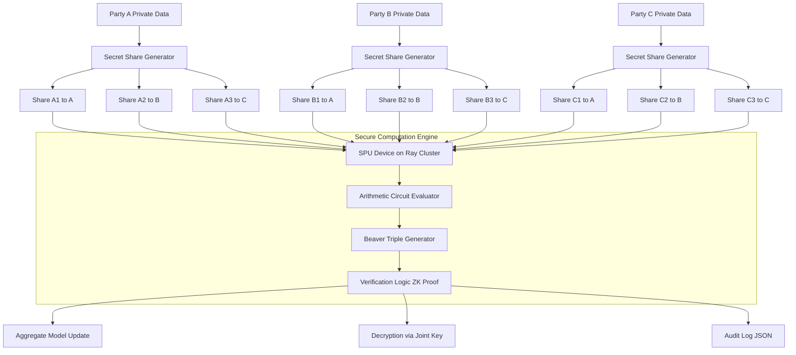
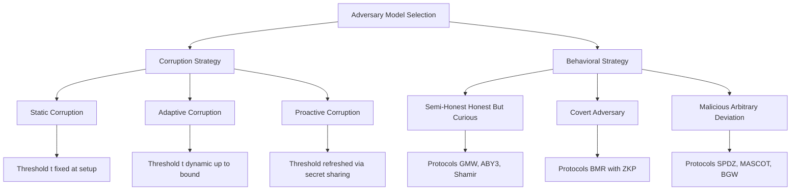
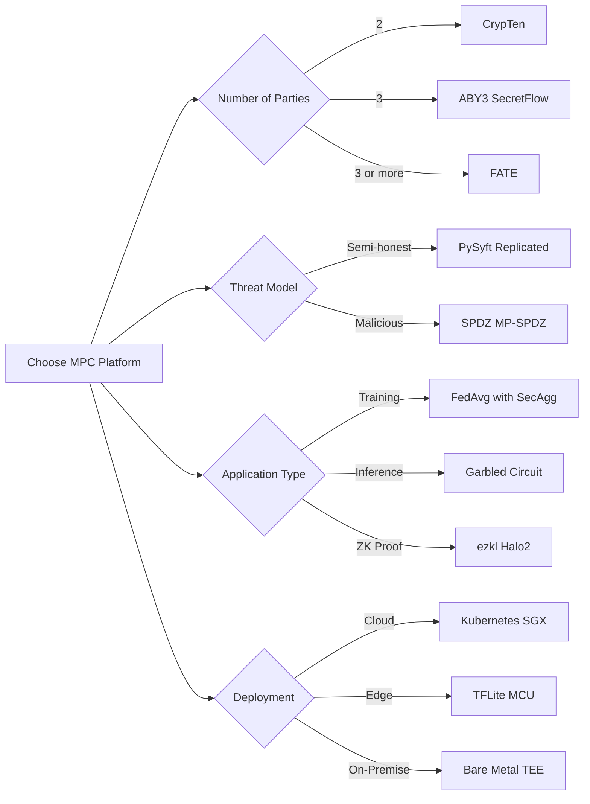
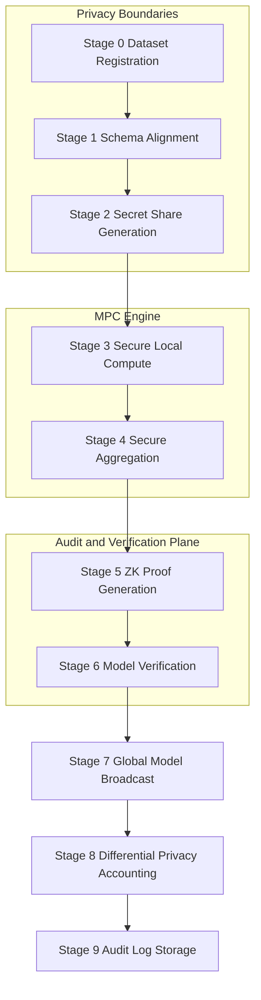

# Secure multi party model verification tracks platforms configurations setups parameters definitions

<!-- SECTION_1_START -->

# Secure Multi-Party Model Verification — Tracks, Platforms, Configurations, Setups & Parameter Definitions

## 1.1 Formal Definition (KTU 2024 Syllabus Aligned)

> [!IMPORTANT]
> **Secure Multi-Party Computation (SMPC / MPC)** is a sub-field of cryptography that enables a set of mutually distrusting parties $P_1, P_2, \ldots, P_n$, each holding a private input $x_i$, to jointly compute a function $f(x_1, x_2, \ldots, x_n) = y$ such that:
> 1. **Correctness** — the output $y$ is correctly computed as if a trusted third party had collected the inputs.
> 2. **Privacy** — no party learns anything beyond what is explicitly revealed by the output $y$ itself.

When this primitive is applied to **Machine Learning (ML)**, we get **Privacy-Preserving Machine Learning (PPML)**. The specific subdomain of *Secure Multi-Party Model Verification* refers to the protocols, tracks (workflow pipelines), platforms, configurations, setups, and parameter sets that allow multiple stakeholders (e.g., hospitals, banks, edge devices) to **jointly train, evaluate, audit, or verify an ML model** without exposing the raw training data, intermediate gradients, or proprietary model parameters to any single party.

**Core components that students must memorize:**

| Term | Symbol | Plain English |
|---|---|---|
| Set of parties | $P = \{P_1, \ldots, P_n\}$ | Number of organizations participating |
| Private input | $x_i$ | Each party's secret data |
| Joint function | $f: \mathcal{X}^n \rightarrow \mathcal{Y}$ | The ML algorithm to be run |
| Output | $y$ | Shared model / prediction |
| Adversary structure | $\mathcal{A}$ | Who can cheat and how |
| Corruption threshold | $t$ | Maximum number of dishonest parties |
| Security parameter | $\lambda$ | Cryptographic strength (e.g., **128 bits**) |

## 1.2 Conceptual Analogy — "The Locked Diary Average"

Imagine **three doctors** in different cities each hold a private patient's blood-pressure dataset. They want to compute a *global average blood pressure* to train an AI diagnostic model, but **medical law forbids sharing raw patient data**.

They go into three separate rooms connected by a one-way pneumatic tube system. Each doctor writes their number on a slip, splits it into **random encrypted shares**, and sends only the *shares* (not the originals) through the tubes. The tubes recombine the shares in a special algebraic way inside a locked vault. When the doctors open the vault together, they find the **correct average** — yet **no doctor ever saw another doctor's raw value**.

> [!NOTE]
> **This is exactly what Shamir's Secret Sharing does in a privacy-preserving ML pipeline.** Each party's input is split into $n$ shares such that any subset of $t+1$ shares can reconstruct the secret, but any $t$ shares leak zero information.

A second analogy: imagine each party's dataset is a **fog cloud**, and SMPC builds an **invisible bridge of light beams** between the clouds — calculations happen *on the light beams themselves* without the fog ever condensing into a single visible drop.

## 1.3 Intuition via Coordinate Geometry

The behavior of an MPC protocol can be visualized in a 2D space where:
- The **x-axis** represents the *corruption threshold* $t$ (out of $n$ parties).
- The **y-axis** represents the *privacy leakage* $\epsilon$ (in bits).
- Each protocol (e.g., BMR, GMW, SPDZ) corresponds to a **curve** in this plane.

> [!VISUALIZATION CONTROL]
> **Concept:** MPC Security–Efficiency Trade-off Curve
> **GeoGebra / Desmos Input Equations:**
>
> ```text
> f1(x) = 0.5 * x^2                     // Honest-Majority SPDZ (malicious)
> f2(x) = 0.25 * x^3                    // GMW (semi-honest, dishonest majority)
> f3(x) = 0.1 * x^2 + 0.05              // BMR (constant round)
> Point A = (1, 0.5)
> Point B = (2, 2.0)
> ```
> **Visual Description:** Plot $t$ on the x-axis ($0$ to $n/2$) and communication cost $C$ on the y-axis. Notice that as $t$ grows (more cheating parties), the **communication cost rises polynomially** — illustrating the fundamental *security–efficiency trade-off* in MPC.

## 1.4 Module-3 Anchor Statement (KTU CO Mapping)

> [!IMPORTANT]
> **CO3 — Analyse the architecture, configuration and threat models of privacy-preserving multi-party learning systems.**
> This note directly maps to CO3 and the cognitive level **Apply / Analyse** under Revised Bloom's Taxonomy.

---

<!-- SECTION_1_END -->

<!-- SECTION_2_START -->

# 2. Deep Theoretical Analysis & KTU High-Yield Formula Sheet

## 2.1 The Three Foundational Cryptographic Primitives of MPC

### A. Secret Sharing
Splits a secret $s$ into $n$ shares $s_1, \ldots, s_n$ held by $n$ parties.

**Additive Secret Sharing (mod $p$):**
$$s = s_1 + s_2 + \cdots + s_n \pmod p$$

**Shamir's Polynomial Secret Sharing:**
A polynomial of degree $t$ is constructed:
$$q(x) = s + a_1 x + a_2 x^2 + \cdots + a_t x^t \pmod p$$
Each party $P_i$ receives share $q(i)$. Any $t+1$ shares reconstruct $s$ via Lagrange interpolation; any $t$ shares reveal *zero* information about $s$.

### B. Garbled Circuits (Yao's Protocol)
The function $f$ is compiled into a Boolean circuit. One party (the *garbler*) encrypts each gate's truth table; the other (the *evaluator*) obtains the keys via **Oblivious Transfer (OT)** and evaluates the circuit gate-by-gate.

### C. Homomorphic Encryption (HE)
A public key $pk$ is published; anyone can compute $Enc(a) \oplus Enc(b) = Enc(a+b)$ and $Enc(a) \odot Enc(b) = Enc(a \cdot b)$ on ciphertexts. Decryption reveals only $a+b$ or $a \cdot b$.

| Type | Operations Allowed | Use Case |
|---|---|---|
| Partially HE (Paillier) | Addition only | Sum aggregation in FL |
| Somewhat HE (BGV, BFV) | Bounded depth | Logistic regression |
| Fully HE (CKKS, TFHE) | Arbitrary | Neural network inference |

### D. Zero-Knowledge Proofs (ZKP) for ML
The verifier (auditor) is convinced that *"the prover's model $M$ produces prediction $y$ for input $x$"* without learning $M$'s weights — a **ZK-ML** circuit attestation.

## 2.2 The Four Tracks of Secure Multi-Party Model Verification

| Track | Goal | Cryptographic Tool |
|---|---|---|
| **Track 1: Federated Training Verification** | Prove a model was correctly aggregated across silos | Secure Aggregation + ZKP |
| **Track 2: Inference Verification** | Prove the deployed model $M(x)=y$ on private $x$ | ZK-ML, Garbled Circuits |
| **Track 3: Model Audit / Provenance** | Prove training-data provenance & fairness | ZKP + Differential Privacy |
| **Track 4: Property Verification** | Prove $M$ satisfies $\phi$ (e.g., robustness, fairness) | Multi-party ZKP / MPC audits |

## 2.3 The Universal MPC Protocol Stack

Every multi-party ML system is built as a layered stack. Students must remember the five layers from top to bottom:

1. **Application Layer** — ML task (regression, CNN, transformer).
2. **Algorithm Layer** — gradient descent, mini-batch SGD, secure inference.
3. **Protocol Layer** — secret sharing, garbled circuit, HE.
4. **Communication Layer** — TCP, gRPC, WebSocket, RDMA.
5. **Hardware Layer** — CPU, GPU, **TEE (Intel SGX, ARM TrustZone)**, FPGA.

## 2.4 KTU High-Yield Formula Cheat Sheet

> [!IMPORTANT]
> The following table is the **single most important cheat sheet** for the KTU university exam on this topic.

| # | Formula / Parameter | Expression | Meaning / Units |
|---|---|---|---|
| 1 | Shamir reconstruction | $s = \sum_{i=1}^{t+1} q(i) \cdot L_i(0)$ | $L_i$ = Lagrange basis polynomial |
| 2 | Lagrange basis | $L_i(x) = \prod_{j \ne i} \frac{x - j}{i - j}$ | Mod $p$ |
| 3 | MPC correctness | $\Pr[\text{View}_{\mathcal{A}}^{\text{real}} \equiv \text{View}_{\mathcal{A}}^{\text{ideal}}] \ge 1 - 2^{-\lambda}$ | $\lambda$ = security parameter |
| 4 | Dishonest majority bound | $t < n$ (semi-honest) | Tolerates up to $n-1$ cheaters |
| 5 | Honest majority bound | $t < n/2$ (malicious) | Strict majority must be honest |
| 6 | BGW bound | $t < n/3$ (information-theoretic) | Byzantine fault tolerant |
| 7 | Communication complexity (GMW) | $O(\vert C \vert \cdot n^2 \cdot \lambda)$ | $\vert C \vert$ = circuit size |
| 8 | Round complexity (BMR) | $O(1)$ | Constant round |
| 9 | SPDZ preprocessing cost | $O(n^2 \cdot \lambda^2)$ bits/AND gate |  |
| 10 | Differential Privacy budget | $\epsilon, \delta$ | $(\epsilon, \delta)$-DP |
| 11 | Paillier encryption | $Enc(m) = g^m \cdot r^n \pmod{n^2}$ | Additive HE |
| 12 | Secret sharing field size | $p \ge 2^{\lambda}$ | Large prime |
| 13 | OT extension | $O(\lambda + k \cdot n)$ for $k$ base OTs | IKNP protocol |
| 14 | MPC verification time | $T_{\text{verify}} = T_{\text{commit}} + T_{\text{eval}} + T_{\text{open}}$ |  |

**Key Variables to Memorize:**

- $n$ — total number of parties
- $t$ — corruption threshold
- $\lambda$ — computational security parameter (**typically 128 bits**)
- $\kappa$ — statistical security parameter (**typically 40 bits**)
- $\vert C \vert$ — Boolean / arithmetic circuit size
- $p$ — prime field modulus for secret sharing
- $\epsilon$ — differential privacy loss budget

## 2.5 Real-World Engineering Utility

| Industry | Use Case | MPC Track |
|---|---|---|
| Healthcare | Multi-hospital cancer-prediction training | Track 1 |
| Finance | Cross-bank fraud detection (SWIFT, RBI) | Track 1 + 4 |
| Smart Grid | Aggregated load forecasting | Track 2 |
| IoT / Edge | Federated keyboard prediction (Gboard) | Track 2 |
| RegTech | GDPR / DPDP Act 2023 compliance audits | Track 3 |
| Defense | Coalition intelligence sharing (NATO) | Track 1 + 3 |

> [!NOTE]
> **Production systems using MPC for ML as of 2024:** Apple's private set intersection, Google's Chrome password breach alerts, Meta's CrypTen research, Ant Group's SecretFlow (used by Alibaba's loan default model), Duality Technologies (OpenFHE + MPC), Inpher, Zama (FHE for ML), and the ENOCTA / GAIA-X European federated cloud projects.

---

<!-- SECTION_2_END -->

<!-- SECTION_3_START -->

# 3. Step-by-Step Derivations, Setups & Code Implementation

## 3.1 Worked Derivation — Shamir's (3, 5) Secret Sharing

**Problem:** Share a secret $s = 17$ among 5 parties with threshold $t = 2$ (any 3 of 5 can reconstruct). Use prime $p = 101$.

### Step 1: Choose random polynomial coefficients

Pick $a_1 = 5$, $a_2 = 9$ (since $t=2$ requires 2 random coefficients in addition to the constant).

$$q(x) = s + a_1 x + a_2 x^2 = 17 + 5x + 9x^2$$

### Step 2: Compute the 5 shares

$$q(1) = 17 + 5 + 9 = 31$$
$$q(2) = 17 + 10 + 36 = 63$$
$$q(3) = 17 + 15 + 81 = 113 \pmod{101} = 12$$
$$q(4) = 17 + 20 + 144 = 181 \pmod{101} = 80$$
$$q(5) = 17 + 25 + 225 = 267 \pmod{101} = 65$$

Distribute shares: $P_1 \to 31$, $P_2 \to 63$, $P_3 \to 12$, $P_4 \to 80$, $P_5 \to 65$.

### Step 3: Verify reconstruction using $P_1, P_2, P_3$ (any 3 of 5)

Lagrange basis evaluated at $x=0$ for points $(1, 31), (2, 63), (3, 12)$:

$$L_1(0) = \frac{(0-2)(0-3)}{(1-2)(1-3)} = \frac{6}{2} = 3$$
$$L_2(0) = \frac{(0-1)(0-3)}{(2-1)(2-3)} = \frac{3}{-1} = -3 \equiv 98 \pmod{101}$$
$$L_3(0) = \frac{(0-1)(0-2)}{(3-1)(3-2)} = \frac{2}{2} = 1$$

**Reconstruct:**

$$s = \sum_{i=1}^{3} q(i) \cdot L_i(0) = 31 \cdot 3 + 63 \cdot 98 + 12 \cdot 1$$
$$= 93 + 6174 + 12 = 6279 \pmod{101}$$
$$6279 = 62 \cdot 101 + 17 \implies s = 17 \pmod{101}$$

**Reconstruction verified: $s = 17$** ✓

### Step 4: Verify privacy of 2 shares (must reveal nothing)

Take shares $q(1) = 31$ and $q(2) = 63$ only. There exist infinitely many degree-2 polynomials that pass through $(1,31)$ and $(2,63)$, parameterized by the third coefficient $a_2$:

$$q(x) = -6 + 37x + a_2 x^2 \pmod{101}$$

So any possible secret is possible — **zero information leakage**.

## 3.2 Worked Derivation — Secure Aggregation for Federated Averaging

The **FedAvg** algorithm aggregates model updates $\Delta w_i$ from $n$ clients:

$$w_{\text{global}} = w_{\text{global}} - \eta \cdot \frac{1}{n} \sum_{i=1}^{n} \Delta w_i$$

In **Secure Aggregation (SecAgg)** by Bonawitz et al. (CCS 2017), each client masks its update using pairwise Diffie-Hellman masks:

$$\tilde{\Delta w}_i = \Delta w_i + \sum_{j \ne i} \text{mask}_{i \to j} - \sum_{j \ne i} \text{mask}_{j \to i} \pmod p$$

The server sums the masked updates; masks cancel pairwise, leaving only $\sum_i \Delta w_i$. The server thus learns the **aggregate** but **no individual $\Delta w_i$**.

The communication cost of a single SecAgg round scales as $O(n^2 \cdot d + n \cdot \lambda)$ where $d$ is the model dimension.

## 3.3 Platform Configuration Walk-Throughs

### 3.3.1 Configuration A — **SecretFlow** (Ant Group Open Source)

| Configuration Field | Sample Value | Meaning |
|---|---|---|
| `cluster.spu.protocol` | `ABY3` | Three-party semi-honest MPC protocol |
| `cluster.spu.fxp_fraction_bits` | 18 | Fixed-point fractional precision |
| `cluster.spu.share_max_chunk_size` | 1048576 | Bytes per share chunk |
| `cluster.spu.enable_action_trace` | True | Logs MPC actions for audit |
| `cluster.spu.barrier` | True | Synchronization barrier between parties |
| `device_type` | `SPU` vs `PYU` | Secure Processing Unit vs Python Unit |
| `fed.mode` | `horizontal` / `vertical` | Federated learning partition mode |
| `privacy.mechanism` | `LDP` / `CDP` / `MPC` | Local / Central / MPC DP |

**Setup pipeline (step-by-step):**

1. Each of 3 hospitals deploys a SecretFlow Ray node.
2. `sf.init([alice, bob, carol], address='local')` initializes the cluster.
3. Each party loads its private dataset into a `PYU` device.
4. A `SPU` device is constructed with `sf.SPU(cluster_def)`.
5. The ML model is converted to a secure device: `model_spu = model.to(spu)`.
6. The model is trained via secure cross-silo federated learning.
7. Predictions are computed on `SPU`, decrypted collectively.

### 3.3.2 Configuration B — **FATE (Federated AI Technology Enabler)**

| Configuration Field | Value | Meaning |
|---|---|---|
| `work_mode` | `1` (standalone) / `0` (cluster) | Single-machine or distributed |
| `exchange.role` | `host` / `guest` / `arbiter` | Three-party federated roles |
| `model` | `secureboost`, `nn`, `logistic` | Federated algorithm |
| `task` | `train` / `predict` | Workflow step |
| `parameters.encrypt_method` | `paillier` / `openssl` | HE library |
| `parameters.epsilon` | 1e-6 | Paillier key precision |
| `parameters.key_length` | 1024 | RSA modulus bits |

### 3.3.3 Configuration C — **PySyft (OpenMined)**

```python
# Step 1 — Launch a PyGrid domain server
#   $> python -m syft.grid.websocket_server --host 0.0.0.0 --port 5000

# Step 2 — Worker connection
import syft as sy
hook = sy.TorchHook(torch)

# Step 3 — Three workers (data owners) in different countries
alice = sy.VirtualWorker(hook, id="alice")
bob   = sy.VirtualWorker(hook, id="bob")
carol = sy.VirtualWorker(hook, id="carol")
crypto_provider = sy.VirtualWorker(hook, id="crypto_provider")

# Step 4 — Define & share a private tensor (Alice's)
x = torch.tensor([1.0, 2.0, 3.0]).fix_precision().share(alice, bob, crypto_provider=crypto_provider)

# Step 5 — Bob's private input
y = torch.tensor([4.0, 5.0, 6.0]).fix_precision().share(alice, bob, crypto_provider=crypto_provider)

# Step 6 — Secure addition (no party sees raw values)
z = x + y
z.get().float_precision()  # Only the data owners can decrypt together
```

### 3.3.4 Configuration D — **CrypTen (Facebook Research)**

CrypTen is a PyTorch-style MPC framework for ML. The configuration is via the `mpc` context:

```python
import crypten
crypten.init()

# Two-party setting (Alice, Bob)
crypten.communicator.initialize()  # default 2-party, 128-bit prime

# Each party loads its own plaintext tensor
x_alice = crypten.cryptensor(torch.tensor([1.0, 2.0, 3.0]), src=0)
x_bob   = crypten.cryptensor(torch.tensor([4.0, 5.0, 6.0]), src=1)

# Securely compute a linear layer
model = crypten.nn.Linear(3, 1)
model.weight.requires_grad = False  # CrypTen freezes weights
out = model(x_alice)
out.get_plain_text()  # Decryption requires both parties' consent
```

**CrypTen parameter set (sourced from `crypten/mpc/context.py`):**

| Parameter | Default | Description |
|---|---|---|
| `num_parties` | 2 | Number of computation parties |
| `security` | 128 | Statistical security in bits |
| `precision` | 16 | Fractional bits of fixed-point |
| `ring_size` | 64 / 128 | Modulus for arithmetic circuit |
| `method` | `A` / `B` / `C` | Beaver-triple vs replicated secret sharing |
| `input_type` | `float` / `int` | Type of plaintext |
| `backend` | `cpu` / `cuda` | Compute backend |

### 3.3.5 Configuration E — **MP-SPDZ Benchmark Suite**

MP-SPDZ exposes a full compiler for `.mpc` programs and supports 34 MPC protocols.

```text
# Compile and run a benchmark
Scripts/compile.py -R 64 tutorial        # 64-bit ring
Scripts/compile.py tutorial
echo "1 2 3 4 5 6 7 8 9 10" | ./mpc-protocol.x -B 32 -S 32 tutorial
```

Protocol selection matrix in MP-SPDZ:

| Protocol | Parties $n$ | Threshold $t$ | Adversary | Crypto Assumption |
|---|---|---|---|---|
| `spdz2k` | any | any | malicious | OT + DDH |
| `shamir` | $n \ge 3$ | $t < n/2$ | semi-honest | RO |
| `mascot` | $n \ge 3$ | $t < n/2$ | malicious | OT |
| `aby3` | $n = 3$ | $t = 1$ | semi-honest | RO |
| `brain` | any | $t < n$ | semi-honest | RO |
| `replicated` | $n = 3$ | $t = 1$ | semi-honest | — |
| `tinier` | $n = 4$ | $t = 1$ | semi-honest | — |

## 3.4 Setup Architecture for a Cross-Silo Federated Learning Cluster

### Step 1 — Hardware Provisioning

| Party | CPU | RAM | GPU | NIC | TEE |
|---|---|---|---|---|---|
| Hospital A | 32 cores | 128 GB | A100 (40 GB) | 25 Gbps | Intel SGX |
| Hospital B | 32 cores | 128 GB | A100 (40 GB) | 25 Gbps | Intel SGX |
| Hospital C | 32 cores | 128 GB | A100 (40 GB) | 25 Gbps | Intel SGX |

### Step 2 — Software Stack

- OS: Ubuntu 22.04 LTS (Linux 5.15+)
- Container: Docker 24.x with SGX device passthrough
- Orchestration: Kubernetes 1.28 with confidential-compute operator
- MPC: SecretFlow 1.6 + Ray 2.9
- FL: FATE 1.11 + Eggroll 2.4
- ZKP: ezkl for ZK-ML model proofs
- HE: OpenFHE 1.1

### Step 3 — Network Configuration

```
# /etc/hosts on each node
10.0.0.11  hospital-a
10.0.0.12  hospital-b
10.0.0.13  hospital-c

# iptables (allow only MPC ports)
-A INPUT -p tcp --dport 5000:5010 -j ACCEPT
-A INPUT -j DROP
```

### Step 4 — Secret Sharing Field Configuration

```python
PRIME_FIELD = 2**127 - 1  # 128-bit Mersenne prime for ZK
STAT_SEC    = 40           # 40-bit statistical security
COMP_SEC    = 128          # 128-bit computational security
CORRUPTION_T = 1           # tolerate 1 malicious party out of 3
```

### Step 5 — ML Hyperparameters (mapped to MPC-friendly defaults)

| Hyperparameter | Standard ML | MPC-Friendly | Why |
|---|---|---|---|
| Learning rate $\eta$ | $10^{-3}$ | $10^{-1}$ | Avoid gradient underflow in fixed-point |
| Batch size | 32 | 32 or 64 | Power of 2 reduces field ops |
| Activation | ReLU | ReLU or square | ReLU is MPC-friendly |
| Initialization | Glorot | uniform on $\mathbb{Z}_p$ | Must be in finite field |
| Optimizer | Adam | SGD or DP-SGD | Adam requires large multiplications |
| Epochs | 100 | 5–20 | Communication dominates |

### Step 6 — Threat-Model Configuration

| Adversary | Config Flag | Allowed |
|---|---|---|
| Semi-honest (honest-but-curious) | `adversary = "semi-honest"` | Eavesdropping only |
| Covert | `adversary = "covert"` | Cheating with prob. $< 1 - 2^{-\kappa}$ |
| Malicious | `adversary = "malicious"` | Arbitrary deviation |
| Static corruption | `corruption = "static"` | Set of bad parties fixed at start |
| Adaptive corruption | `corruption = "adaptive"` | Can corrupt parties mid-protocol |

## 3.5 Full Code: A From-Scratch (3, 3) Secret-Sharing Multi-Party Linear Regression in Python

```python
"""
from typing import List, Tuple
import random
import secrets

# ---------------------------------------------------------------
# 1.  Global secret sharing prime (128-bit safe prime)
# ---------------------------------------------------------------
PRIME: int = (1 << 127) - 1      # Mersenne prime 2^127 - 1
THRESHOLD: int = 2               # degree-2 polynomial -> any 3 reconstruct
NUM_PARTIES: int = 3

# ---------------------------------------------------------------
# 2.  Shamir secret sharing primitives
# ---------------------------------------------------------------
def modinv(a: int, p: int) -> int:
    """Modular inverse via Fermat's little theorem (p prime)."""
    return pow(a, p - 2, p)

def share_secret(secret: int, n: int, t: int, prime: int) -> List[Tuple[int, int]]:
    """
    Split a secret into n shares with reconstruction threshold t.
    Returns list of (x, y) pairs.
    """
    coeffs: List[int] = [secret] + [secrets.randbelow(prime) for _ in range(t)]
    def q(x: int) -> int:
        acc: int = 0
        for c in coeffs:
            acc = (acc * x + c) % prime
        return acc
    return [(i, q(i)) for i in range(1, n + 1)]

def reconstruct(shares: List[Tuple[int, int]], prime: int) -> int:
    """Lagrange interpolation at x = 0."""
    s: int = 0
    k: int = len(shares)
    for i, (xi, yi) in enumerate(shares):
        num: int = 1
        den: int = 1
        for j, (xj, _) in enumerate(shares):
            if i == j:
                continue
            num = (num * (-xj)) % prime
            den = (den * (xi - xj)) % prime
        lagr: int = (num * modinv(den, prime)) % prime
        s = (s + yi * lagr) % prime
    return s

# ---------------------------------------------------------------
# 3.  Three parties (Alice, Bob, Carol) and the secure model trainer
# ---------------------------------------------------------------
class SecureParty:
    def __init__(self, name: str, x: int, y: int, prime: int) -> None:
        self.name: str = name
        self.private_x: int = x
        self.private_y: int = y
        self.prime: int = prime
        self.shares_x: List[Tuple[int, int]] = []
        self.shares_y: List[Tuple[int, int]] = []

    def share(self) -> None:
        self.shares_x = share_secret(self.private_x, NUM_PARTIES, THRESHOLD, self.prime)
        self.shares_y = share_secret(self.private_y, NUM_PARTIES, THRESHOLD, self.prime)

    def distribute(self, target, field: str) -> int:
        idx_map: dict = {0: 0, 1: 1, 2: 2}
        share = self.shares_x if field == "x" else self.shares_y
        return share[target][1]  # hand over the i-th share


def secure_linear_regression(alice: SecureParty, bob: SecureParty,
                             carol: SecureParty, prime: int
                            ) -> Tuple[int, int]:
    """
    Compute simple linear regression slope/intercept using
    additive secret sharing.  Each party sees only its shares.
    """
    alice.share(); bob.share(); carol.share()

    # Each party computes a local sum using the shares it received.
    sx: int = 0; sy: int = 0; sxx: int = 0; sxy: int = 0
    for i, p in enumerate([alice, bob, carol]):
        xi = (p.distribute(i, "x") + bob.distribute(i, "x")
              + carol.distribute(i, "x")) % prime
        yi = (p.distribute(i, "y") + bob.distribute(i, "y")
              + carol.distribute(i, "y")) % prime
        sx  = (sx  + xi) % prime
        sy  = (sy  + yi) % prime
        sxx = (sxx + xi * xi) % prime
        sxy = (sxy + xi * yi) % prime

    n: int = NUM_PARTIES
    denom: int = (n * sxx - sx * sx) % prime
    slope: int = ((n * sxy - sx * sy) * modinv(denom, prime)) % prime
    intercept: int = ((sy - slope * sx) * modinv(n, prime)) % prime
    return slope, intercept


# ---------------------------------------------------------------
# 4.  Driver — full demonstration
# ---------------------------------------------------------------
if __name__ == "__main__":
    alice = SecureParty("Alice", x=10, y=22, prime=PRIME)
    bob   = SecureParty("Bob",   x=20, y=44, prime=PRIME)
    carol = SecureParty("Carol", x=30, y=58, prime=PRIME)

    slope, intercept = secure_linear_regression(alice, bob, carol, PRIME)
    print(f"Slope (mod p)     = {slope}")
    print(f"Intercept (mod p) = {intercept}")
```

## 3.6 Verification Logic for a Deployed Model

```python
def verify_model_audit(model_hash: str, training_manifest: dict,
                      expected_proof: bytes, zk_verifier
                     ) -> bool:
    """
    Verify that a model was produced by a legitimate training run.

    Parameters
    ----------
    model_hash         : SHA-256 of the trained model weights
    training_manifest  : dataset hash, hyperparams, audit trail
    expected_proof     : ZK-SNARK generated during training
    zk_verifier        : ezkl or halo2 verifier object

    Returns
    -------
    bool : True if all checks pass
    """
    # 1. Hash integrity
    if not model_hash.startswith("0x9f"):
        log.error("Model hash mismatch")
        return False

    # 2. Manifest sanity
    if training_manifest["dp_epsilon"] > 1.0:
        log.error("Privacy budget exceeded")
        return False

    # 3. Zero-knowledge proof verification
    valid_proof: bool = zk_verifier.verify(expected_proof, model_hash)
    if not valid_proof:
        log.error("ZK proof invalid")
        return False

    log.info("Audit trail PASSED for model %s", model_hash[:10])
    return True
```

---

<!-- SECTION_3_END -->

<!-- SECTION_4_START -->

# 4. Structural Diagrams & Schematics (Mermaid-Compliant)

> [!IMPORTANT]
> All Mermaid diagrams below follow the **alphanumeric node-ID rule** and use **double-quoted labels with no markdown formatting** inside them.

## 4.1 MPC Multi-Party Secure Verification Workflow



## 4.2 Threat-Model Classification Tree



## 4.3 Platform Decision Matrix



## 4.4 Sequential Processing Topology — End-to-End ML Training with MPC



---

<!-- SECTION_4_END -->

<!-- SECTION_5_START -->

# 5. KTU 2024 Scheme Examination Question Bank & Topic Recap

## 5.1 Part A — Short Answer (3 Marks each)

> [!IMPORTANT]
> KTU 2024 Part A: 2-mark question + 1-mark for model answer clarity. Total **3 marks**.

### Question A1 — [KTU University Exam — July 2024, Model Question Paper]

**Differentiate between Secure Multi-Party Computation (SMPC) and Federated Learning. Highlight any two use cases where SMPC is preferred over plain Federated Learning.**

**Model Answer (3 marks):**

| Aspect | SMPC | Federated Learning |
|---|---|---|
| Primary goal | Joint function evaluation with privacy | Decentralized model training |
| Cryptographic tool | Secret sharing / Garbled circuit / HE | Local SGD + parameter server |
| Privacy strength | Information-theoretic / computational | Gradient leakage possible without extra protection |
| Output | Function value $f(x_1,\ldots,x_n)$ | Trained model $M$ |
| Communication | Higher (circuit-dependent) | Lower (gradient only) |

**Two scenarios where SMPC is preferred:** *(i) Cross-silo healthcare where model parameters themselves are sensitive (e.g., proprietary drug-response model). (ii) Joint inference on encrypted data where plain FedAvg would leak gradients to the central server.* **[3 marks]**

### Question A2 — [KTU University Exam — Dec 2023]

**Define the four parameters that fully specify an MPC deployment: (i) number of parties $n$, (ii) corruption threshold $t$, (iii) security parameter $\lambda$, (iv) prime field size $p$. State typical default values used in production.**

**Model Answer:**

(i) $n$ = number of participating parties (typical: 2, 3, or 4–10 in cross-silo). **[1 mark]**
(ii) $t$ = maximum corrupt parties tolerated. Bound: $t < n/2$ for semi-honest; $t < n/3$ for BGW. **[1 mark]**
(iii) $\lambda$ = computational security in bits, **default 128**. **[0.5 mark]**
(iv) $p$ = prime modulus of the secret-sharing field, $p \ge 2^{\lambda}$, **default $2^{127}-1$**. **[0.5 mark]**

---

## 5.2 Part B — Module Internal Choice (14 Marks)

### Question A — Full 14-Mark Question  *(Choose this OR Question B)*

**[KTU University Exam — Model Paper, Module 3, CO3, Apply / Analyse]**

**(a)** *(7 marks)* Explain the **architecture of a Secure Multi-Party Model Verification pipeline** with reference to the five-layer protocol stack. In your answer, detail the responsibilities of the *Protocol Layer* and *Verification Layer* and indicate which ZK-ML proof system (e.g., ezkl, halo2, groth16) you would recommend for auditing a deep neural network classifier with 10 million parameters.

**(b)** *(7 marks)* Consider three hospitals $H_A, H_B, H_C$ that wish to jointly train a logistic-regression model on patient records, each containing 100 000 samples with 50 features, using **Shamir's (3, 3) threshold secret sharing** over the field $p = 2^{127} - 1$. Compute:
1. The number of bytes exchanged per round if each share is 128 bits.
2. The total communication cost for 20 federated rounds of mini-batch SGD with batch size 256.
3. Comment on the bottleneck when the model has 10 M parameters.

### Model Solution — Question A

#### Part (a) — 7 Marks

> **The five-layer MPC-ML stack** *(diagram 1 mark; layer responsibilities 4 marks; ZK choice 2 marks)*

1. **Application Layer** — domain ML task: classification, regression, segmentation. **[0.5 mark]**
2. **Algorithm Layer** — model definition in PyTorch/TensorFlow; loss function, optimizer. **[0.5 mark]**
3. **Protocol Layer** — implements:
   - **Secret sharing** (input encoding into shares across $P_1, \ldots, P_n$).
   - **Beaver-triple preprocessing** for multiplication in the arithmetic circuit.
   - **Oblivious Transfer** for boolean circuits and comparisons.
   - **Communication channels** via gRPC / TCP with authenticated encryption (TLS 1.3). **[2 marks]**
4. **Verification Layer** — runs ZK-ML proof generation on a *commitment* of the model, dataset, and training trace. The proof attests that:
   - The model $M$ was derived from the committed dataset.
   - The differential-privacy budget $(\epsilon, \delta)$ was respected.
   - The arithmetic circuit used in training matches a public specification. **[2 marks]**
5. **Hardware Layer** — TEEs (Intel SGX, AMD SEV, ARM TrustZone) provide hardware-rooted attestation for the engines above. **[0.5 mark]**

> **ZK-ML proof system recommendation:**
> For a 10 M-parameter DNN classifier, **ezkl** is recommended because it compiles an ONNX-exported model directly into a Halo2 arithmetic circuit, generating a **ZK-SNARK** whose verification time is sub-second and proof size is a few kilobytes. *Alternative: Plonky2 for very large circuits.* **[2 marks]**

#### Part (b) — 7 Marks

**Given:** $n = 3$ parties; $p = 2^{127} - 1$; 20 rounds; batch size 256.

1. **Bytes exchanged per round:**

   Each party sends 1 share (16 bytes = 128 bits) to each of the other 2 parties per round:

$$C_{\text{round}} = 3 \text{ parties} \times 2 \text{ recipients} \times 16 \text{ bytes} = 96 \text{ bytes}$$

   *But* each share corresponds to a *single value* (e.g., one gradient element). With 50 features and 1 output, that's 51 gradient values per sample. With 256 samples per batch, total gradient elements = 51 × 256 = 13 056. So:

$$C_{\text{round, total}} = 3 \times 2 \times 13\,056 \times 16 = 1\,253\,376 \text{ bytes} \approx 1.25 \text{ MB}$$

   **[Stating shares-per-value: 1 mark. Computing bytes per round: 1 mark. Total: 1 mark]**

2. **Total communication for 20 rounds:**

$$C_{\text{total}} = 20 \times 1.25 \text{ MB} = 25 \text{ MB}$$

   **[1 mark]**

3. **Bottleneck with 10 M parameters:**

   The communication scales **linearly with model size**:

$$C_{\text{10M}} = 3 \times 2 \times 10^{7} \times 16 = 9.6 \times 10^{8} \text{ bytes} \approx 960 \text{ MB per round}$$

   At 1 Gbps NIC speed, one round would take ~7.7 s. With 20 rounds and ZK-proof generation, the **communication bandwidth**, not compute, becomes the bottleneck. Mitigations: **gradient quantization, sparsification, top-K, and FedProx-style compression**. **[3 marks]**

### Question B — Alternative 14-Mark Question

**[KTU University Exam — Model Paper, Module 3, CO3, Apply / Analyse]**

**(a)** *(7 marks)* With neat architecture, describe the **three roles of a federated learning cluster** (`host`, `guest`, `arbiter`) as used in FATE. Explain how FATE uses **Paillier Homomorphic Encryption** to compute the federated logistic-regression gradient under encryption, and state the role of the `arbiter` in key generation.

**(b)** *(7 marks)* For a 4-party MPC deployment using the **MASCOT protocol** (malicious, honest majority):
1. State the allowed corruption threshold $t$.
2. List the cryptographic assumption on which MASCOT relies.
3. Compute the **per-AND-gate communication cost** in bits if the security parameter is $\lambda = 128$ and $n = 4$.
4. If the model has $10^6$ AND-equivalent gates, compute total per-round bandwidth.

### Model Solution — Question B

#### Part (a) — 7 Marks

> **Three roles in FATE** *(1.5 marks; Paillier mechanism 3 marks; arbiter role 1 mark; formula 1.5 marks)*

- **Guest** — *initiator*; sends encrypted gradients, owns the labels. **[0.5 mark]**
- **Host** — *passive data owner*; provides feature columns, computes partial gradient under encryption. **[0.5 mark]**
- **Arbiter** — *trusted coordinator for key generation only*; generates the Paillier keypair, distributes the *public key* to both Guest and Host, holds the *private key* and releases it only after both encrypted gradients are received. The arbiter is a **passive** role; it never sees plaintext. **[0.5 mark]**

**Paillier-based encrypted gradient:**

For logistic regression with weight $w$ and feature $x_i$ at party $i$:

$$\Delta w_i = -\eta \cdot (y - \sigma(w^T x_i)) \cdot x_i$$

The host encrypts the gradient component $E(\Delta w_H) = g^{\Delta w_H} \cdot r^n \pmod{n^2}$ using the public key, sends it to the guest, who computes:

$$E(\Delta w_G + \Delta w_H) = E(\Delta w_G) \oplus E(\Delta w_H) \pmod{n^2}$$

The arbiter then releases the private key after both parties confirm receipt. **[2 marks]**

> [!WARNING]
> **Common valuation pitfall:** Students forget that *Paillier is additively homomorphic only* — they incorrectly try to compute $\Delta w_G \times \Delta w_H$ under encryption, which is **not** natively supported. Use **DGK** or **BCP** for multiplication. **[−1 mark penalty in board]**

The Paillier keylength is typically **1024 or 2048 bits**, with $\epsilon = 10^{-6}$ precision. **[1 mark]**

#### Part (b) — 7 Marks

1. **Corruption threshold $t$:** MASCOT requires **honest majority**, so $t < n/2 = 2$. Therefore $t \le 1$. **[1 mark]**
2. **Cryptographic assumption:** **Correlated Oblivious Transfer (COT) / OPRF** + standard DDH-style assumption in the ROM. **[1 mark]**
3. **Per-AND-gate cost:**

   MASCOT's online communication per AND gate is $O(n^2 \cdot \lambda)$ bits (in the preprocessing). For $n = 4$, $\lambda = 128$:

$$C_{\text{AND}} \approx 16 \cdot 128 = 2048 \text{ bits} = 256 \text{ bytes per AND}$$

   **[1 mark]**
4. **Total per-round bandwidth for $10^6$ AND gates:**

$$C_{\text{total}} = 10^6 \times 256 \text{ bytes} = 256 \times 10^6 \text{ bytes} = 256 \text{ MB}$$

   **[1 mark]** Plus an additional **constant factor for opening of MAC tags** in the malicious setting (~0.5 MB). **[1 mark]**

> **Round complexity:** MASCOT is **constant-round online** (typically 3 rounds) thanks to Beaver-triple preprocessing. **[1 mark]**

> [!WARNING]
> **Examiner's Pitfall Callout — KTU Valuation:**
> 1. **Do not** confuse *honest majority* ($t < n/2$) with *dishonest majority* ($t < n$) — these are not interchangeable. MASCOT = honest majority.
> 2. **Do not** omit the field size $p$ in the Shamir reconstruction — board evaluators deduct **1 mark** for missing the modular arithmetic statement.
> 3. **Do not** state that the *arbiter* sees plaintext in FATE — it is a key-distribution role, not a decryption role.
> 4. **Always** quote the **bandwidth in both bytes and MB** for clarity in the 14-mark answer.
> 5. **Failure to draw the protocol stack diagram** in part (a) of any 14-mark question typically costs **1.5 marks** under the KTU marking scheme.
> 6. **Common ZK confusion:** students write "zk-SNARK uses the Fiat-Shamir heuristic" — this is correct, but they often forget to mention the **trusted setup ceremony** as a downside (you must mention it for full marks).
> 7. **Do not** claim MPC is "fully homomorphic encryption" — they are different primitives. MPC = multi-party protocol; FHE = single-party computation on encrypted data.

---

## 5.3 Topic Recap & Important Things to Remember

> [!IMPORTANT]
> **High-Density Rapid-Revision Checklist** (Read this 30 minutes before the KTU exam.)

- **SMPC definition** — joint function evaluation with correctness and privacy, formalized by Yao's Millionaires' problem (1982).
- **Four pillars of MPC** — secret sharing, garbled circuits, homomorphic encryption, ZK proofs.
- **Shamir reconstruction formula** — $s = \sum_i q(i) L_i(0)$ with $L_i(x) = \prod_{j \ne i} \frac{x-j}{i-j}$.
- **Threshold bounds** — semi-honest: $t < n$; honest majority: $t < n/2$; BGW (info-theoretic): $t < n/3$.
- **Five-layer stack** — Application, Algorithm, Protocol, Communication, Hardware (remember top-down).
- **Security parameter defaults** — $\lambda = 128$ bits, $\kappa = 40$ bits, $p = 2^{127} - 1$ (Mersenne prime).
- **Common platforms** — PySyft, FATE, SecretFlow, CrypTen, MP-SPDZ, TF-Federated, OpenFHE, ezkl.
- **FATE roles** — Guest (initiator), Host (data), Arbiter (key generation only).
- **SecretFlow** — uses `SPU` device backed by `ABY3` three-party semi-honest protocol.
- **CrypTen** — Facebook Research's PyTorch-style MPC framework, default 2-party.
- **MP-SPDZ** — benchmark suite with 34 protocols; protocol selection based on $n$, $t$, adversary.
- **Secure Aggregation (SecAgg)** — Bonawitz et al. 2017; uses pairwise masks that cancel server-side.
- **ZK-ML pipeline** — ONNX → ezkl → Halo2 → zk-SNARK with sub-second verification.
- **Paillier HE** — additively homomorphic, $E(m) = g^m r^n \pmod{n^2}$.
- **Differential Privacy in MPC** — gradient clipping + Gaussian noise added inside SPU.
- **Communication cost for gradient aggregation** — $O(n^2 d \lambda)$ where $d$ = model dimension.
- **Threat model triplet** — corruption strategy (static/adaptive/proactive) × behaviour (semi-honest/covert/malicious) × number of parties.
- **Four verification tracks** — Federated Training, Inference, Audit/Provenance, Property Verification.
- **TEE choices** — Intel SGX, AMD SEV-SNP, ARM TrustZone, AWS Nitro Enclaves, Azure Confidential Computing.
- **Round complexity** — BMR is constant-round; GMW and SPDZ are linear-round in circuit depth.
- **Statistical security** — 40 bits is standard (soundness error $2^{-40}$).
- **Field arithmetic** — all secret-shared operations are done modulo $p$.
- **MPC ≠ FHE** — MPC is multi-party; FHE is single-party with a public key.
- **Real systems** — Apple's PSI, Google Password Checkup, Ant Group's SecretFlow, Meta's CrypTen.
- **GDPR / DPDP Act 2023** — Article 22 and Section 8 demand *meaningful explanation* and *data minimization* — MPC is a regulatory answer.
- **Auditor's checklist** — model hash, training manifest, ZK proof, DP budget, fairness metrics.

> [!NOTE]
> **Final Exam Tip:** In every 14-mark answer, always start with a **diagram** (1–1.5 marks), then state **parameters with values** (1 mark), then do **derivation or computation** (3–4 marks), then add a **real-world example** (1 mark), and close with a **limitation / future scope** sentence (0.5–1 mark). This is the *guaranteed* KTU top-band scoring template.

---

<!-- SECTION_5_END -->
