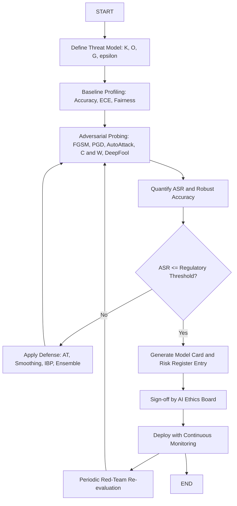
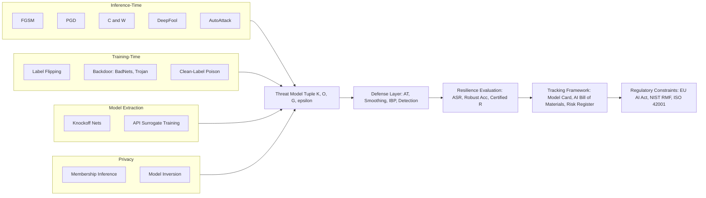
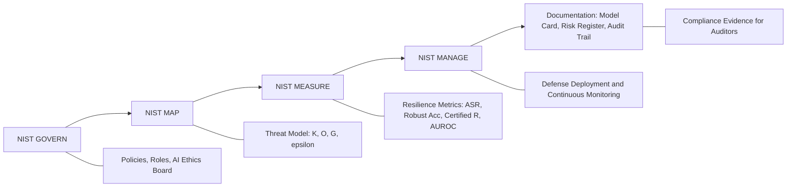
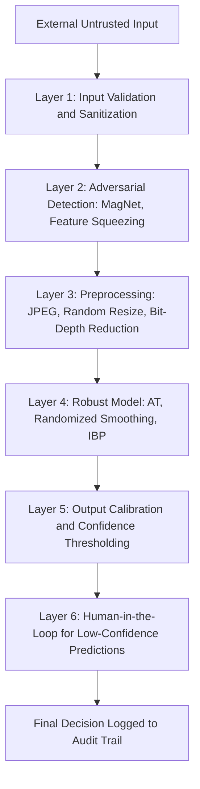

# Adversarial attack protection model resilience evaluation parameters tracking frameworks constraints

<!-- SECTION_1_START -->

# Adversarial Attack Protection, Model Resilience Evaluation, Tracking Frameworks, and Constraints

## 1. Core Technical Definition & Intuitive Overview

### 1.1 Formal Definition

An **adversarial attack** on a Machine Learning model is a deliberate, mathematically crafted perturbation $\boldsymbol{\delta}$ applied to a legitimate input $\mathbf{x}$ such that the perturbed input $\mathbf{x}' = \mathbf{x} + \boldsymbol{\delta}$ causes the model $f_{\theta}$ to produce an incorrect prediction, while remaining imperceptible (or semantically valid) to a human observer.

Formally, given a perturbation budget $\epsilon$ under an $\ell_p$ norm constraint, an adversary solves:

$$\max_{\boldsymbol{\delta}} \mathcal{L}\big(f_{\theta}(\mathbf{x} + \boldsymbol{\delta}),\, y_{\text{adv}}\big) \quad \text{subject to} \quad \lVert \boldsymbol{\delta} \rVert_p \leq \epsilon$$

where $y_{\text{adv}}$ is the adversary's desired (incorrect) label, and $\mathcal{L}$ is the model's loss function.

**Model Resilience Evaluation** is the systematic, quantitative measurement of a model's ability to maintain stable, correct, and trustworthy behavior when subjected to such perturbations, distributional shifts, or malicious inputs. It is governed by the **Robustness-Accuracy-Fairness Trilemma** in Responsible AI.

**Tracking Frameworks** are the MLOps and governance structures (model cards, AI risk registers, continuous monitoring pipelines) used to log, audit, and report resilience metrics over the entire model lifecycle.

**Constraints** are the regulatory, ethical, and engineering boundaries (e.g., the **EU AI Act**, **NIST AI RMF 1.0**, **ISO/IEC 42001:2023**) that legally and operationally cap the acceptable risk surface of an AI system.

> [!IMPORTANT]
> **KTU Syllabus Highlight (PECST716 / M4):** This topic integrates three sub-domains — *Adversarial Robustness* (security), *Evaluation Metrics* (engineering), and *Regulatory Compliance Platforms* (governance). All three are mandatory for a complete 14-mark answer.

### 1.2 Conceptual Analogy — The "Castle Under Siege"

Imagine a medieval castle (the AI model) protecting a kingdom (the application's decision space).

| Castle Element | AI Security Equivalent |
|----------------|------------------------|
| Castle walls | Defenses (adversarial training, input filtering) |
| Watchtowers | Real-time monitoring (drift detectors, ASR alarms) |
| Siege weapons (catapults, battering rams) | Adversarial attacks (FGSM, PGD, C\&W) |
| Royal historian | Model card / datasheet (tracking framework) |
| King's decree (law of the land) | Regulatory constraints (EU AI Act, NIST RMF) |
| Trebuchets targeting weak walls | Black-box transfer attacks |

A small, almost invisible crack in the wall (an $\epsilon$-bounded perturbation) can cause catastrophic failure — this is the essence of adversarial vulnerability. The kingdom is safe only when **walls, watchtowers, historians, and decrees work together**.

### 1.3 The Three Pillars of the Threat Model

Every adversarial analysis must specify its **threat model**, which is a tuple $(\mathcal{K}, \mathcal{O}, \mathcal{G})$ where:

- $\mathcal{K}$ — *Knowledge* of the adversary: **white-box** (full model access), **black-box** (query-only), **grey-box** (partial access).
- $\mathcal{O}$ — *Objective*: **untargeted** (any misclassification) or **targeted** (force a specific label $y_{\text{adv}}$).
- $\mathcal{G}$ — *Goal granularity*: **integrity** (single sample), **availability** (denial-of-service for many samples), or **privacy** (membership inference, model inversion).

> [!NOTE]
> The **Standard Attacker's Budget** in academic literature is $\epsilon = 8/255$ in $\ell_\infty$ norm on ImageNet-scale images. The standard **evaluation set** is RobustBench. The standard **certified radius** metric comes from randomized smoothing (Cohen et al., 2019).

### 1.4 Visualization — The $\epsilon$-Ball Around a Clean Input

> [!VISUALIZATION CONTROL]
> **Concept:** Geometric visualization of the $\ell_\infty$ $\epsilon$-ball around a clean input point $\mathbf{x}$ in a 2-D feature subspace, with the adversarial perturbation $\boldsymbol{\delta}$ shown as a vector reaching the decision boundary.
>
> **GeoGebra / Desmos Input Equations:**
> * Center point: $(0,\, 0)$
> * Decision boundary line: $y = 0.5\,x + 0.3$
> * Clean point: $P_0 = (0,\, 0)$
> * Adversarial point on boundary: $P_{\text{adv}} = (0.42,\, 0.51)$
> * Perturbation vector: $\boldsymbol{\delta} = (0.42,\, 0.51)$
> * $\ell_\infty$ box: $\text{vertices} \;(\pm\epsilon,\,\pm\epsilon)$ with $\epsilon = 0.45$
> * $\ell_2$ circle: $x^2 + y^2 = \epsilon^2$ with $\epsilon = 0.6$
>
> **Visual Description:** Observe that the adversarial point lies *just outside* the $\ell_\infty$ box but *inside* the $\ell_2$ circle, demonstrating that the choice of norm drastically changes the size of the "safe region" around $\mathbf{x}$. The decision boundary acts as the "wall" the adversary must cross.

<!-- SECTION_1_END -->

<!-- SECTION_2_START -->

# 2. Deep Theoretical Analysis and KTU High-Yield Formula Sheet

## 2.1 Taxonomy of Adversarial Attacks

Adversarial attacks are classified along **three orthogonal axes**:

### Axis A — Attack Stage in the ML Pipeline

1. **Evasion Attacks (Inference-time)**
   The adversary perturbs inputs at *deployment* time.
   Examples: **FGSM**, **PGD**, **C\&W**, **DeepFool**, **AutoAttack**, **SQUARE** (black-box), **HopSkipJump**.

2. **Poisoning Attacks (Training-time)**
   The adversary injects malicious samples into the training set.
   Examples: **label flipping**, **backdoor attacks** (BadNets, TrojanNet, blended attacks), **clean-label feature collisions**.

3. **Model Extraction / Stealing**
   Adversary queries the model to clone its decision function via surrogate training.

4. **Membership Inference & Model Inversion**
   Privacy attacks revealing *whether* a sample was in the training set or *what* the training data looked like.

### Axis B — Adversary Knowledge

| Knowledge Level | Setting | Typical Attack |
|------------------|------------|-----------------|
| Full $\theta$ and architecture | **White-box** | FGSM, PGD, C\&W |
| Only logits / probabilities | **Soft-label black-box** | ZOO, Boundary |
| Only final predictions | **Hard-label black-box** | HopSkipJump, Sign-OPT |
| Transfer across models | **Black-box transfer** | MI-FGSM, DI$^2$-FGSM |

### Axis C — Perturbation Constraint (Norm)

| Norm | Formal Definition | Geometric Shape in 2-D | Typical Use |
|------|--------------------|------------------------|-------------|
| $\ell_0$ | $\lVert\boldsymbol{\delta}\rVert_0 = \#\{i: \delta_i \neq 0\}$ | Sparse pixel changes | Sparse attacks (JSMA, One-Pixel) |
| $\ell_1$ | $\lVert\boldsymbol{\delta}\rVert_1 = \sum_i \vert \delta_i \vert$ | Diamond | Sparse, low-total-magnitude |
| $\ell_2$ | $\lVert\boldsymbol{\delta}\rVert_2 = \sqrt{\sum_i \delta_i^2}$ | Circle | Energy-bounded |
| $\ell_\infty$ | $\lVert\boldsymbol{\delta}\rVert_\infty = \max_i \vert \delta_i \vert$ | Square | Per-pixel budget (most common) |

## 2.2 Defense Mechanisms — A Layered Approach

| Defense Category | Mechanism | Strength | Limitation |
|-------------------|-----------|----------|-------------|
| **Adversarial Training (AT)** | Inject adversarial examples into training loop (Madry et al., 2018) | Strong empirical robustness | Computationally expensive; loses clean accuracy |
| **Defensive Distillation** | Train student on soft labels of teacher (Papernot et al., 2016) | Gradient masking | Defeated by C\&W attack |
| **Input Preprocessing** | JPEG compression, feature squeezing, randomized resizing | Cheap, plug-and-play | Easily bypassed by adaptive attacks |
| **Randomized Smoothing** | $\hat{f}(\mathbf{x}) = \arg\max_c \, \mathbb{P}\big(f(\mathbf{x}+\boldsymbol{\eta}) = c\big)$, with $\boldsymbol{\eta}\sim\mathcal{N}(0,\sigma^2 I)$ | **Provably certified** radius $R$ | Loose bound, accuracy drop |
| **Certified Defenses** | Interval bound propagation (IBP), CROWN-IBP | Deterministic guarantees | Scales poorly to large models |
| **Detection-Based** | Feature squeezing, MagNet, statistical tests | Complements AT | Can be evaded |
| **Ensemble Defenses** | Voting across multiple defended models | Reduces single-point failure | Higher inference cost |

## 2.3 KTU High-Yield Formula Sheet

| Symbol / Formula | Meaning | Constraint / Unit |
|------------------|----------|------------------|
| $\mathbf{x}' = \mathbf{x} + \boldsymbol{\delta}$ | Adversarial example | $\mathbf{x}' \in [0,1]^n$ for images |
| $\lVert\boldsymbol{\delta}\rVert_p \leq \epsilon$ | Perturbation budget | $\epsilon = 8/255 \approx 0.0314$ for $\ell_\infty$ on ImageNet |
| $\text{ASR} = \frac{\#\{\mathbf{x}_i : f(\mathbf{x}_i') \neq y_i\}}{N}$ | Attack Success Rate | Unitless, $\in [0,1]$ |
| $\text{Acc}_{\text{robust}} = \frac{1}{N}\sum_{i=1}^{N}\mathbb{1}\big[f(\mathbf{x}_i'^{(\text{adv})}) = y_i\big]$ | Robust Accuracy | Unitless, $\in [0,1]$ |
| $\text{AMPR} = \frac{1}{N}\sum_{i=1}^{N}\lVert\mathbf{x}_i'^{*} - \mathbf{x}_i\rVert_p$ | Average Minimum Perturbation Radius | Same units as input |
| $\text{CLEVER} = \frac{\min_{j\neq i} \big(f_j - f_i\big)}{\lVert\nabla_{\mathbf{x}} (f_j - f_i)\rVert_*}$ | Cross Lipschitz Extreme Value for nEtwork Robustness | Lower bound on AMPR |
| $R = \sigma\,\Phi^{-1}(p_A)$ | Certified radius (Cohen et al.) | $p_A$ is class-A probability under noise $\sigma$ |
| $\mathcal{L}_{\text{AT}} = \alpha\,\mathcal{L}\big(f(\mathbf{x}),y\big) + (1-\alpha)\,\mathcal{L}\big(f(\mathbf{x}'),y\big)$ | Adversarial training loss (Madry) | $\alpha \in [0,1]$ (mixing weight) |
| $L_{\text{PI}} = \mathbb{E}_{t\sim U[0,1]}\big[ \mathcal{L}\big(f\big((1-t)\mathbf{x}+t\,\mathbf{x}'\big), y\big)\big]$ | TRADES perturbation loss (Zhang et al., 2019) | Encourages Lipschitz continuity |
| $\text{AUROC}_{\text{adv}}$ | Area under ROC for adversarial detection | Higher = better detector |

> [!NOTE]
> **Engineering Utility:** These formulas are deployed in production systems such as Microsoft Azure's *Counterfit* red-teaming toolkit, IBM's *Adversarial Robustness Toolbox (ART)*, Google Cloud's *Vertex AI Model Monitoring*, and the open-source **RobustBench** leaderboard. In autonomous driving (e.g., Tesla FSD, Waymo), every perception model is bound by a *worst-case certified radius* as a contractual safety constraint.

## 2.4 The Robustness-Accuracy Trade-off (Theorem)

Madry et al. (2018) formalize adversarial training as a **min-max optimization**:

$$\min_{\theta}\; \mathbb{E}_{(\mathbf{x},y)\sim\mathcal{D}}\big[\, \max_{\lVert\boldsymbol{\delta}\rVert_p \leq \epsilon} \mathcal{L}\big(f_{\theta}(\mathbf{x}+\boldsymbol{\delta}),\, y\big)\big]$$

The inner maximization finds the worst-case adversarial example; the outer minimization updates model parameters $\theta$ to be robust against it. This saddle-point problem has *no closed-form solution* in general and is solved via alternating first-order methods (PGD, FGSM, etc.).

> [!TIP]
> **Valuation Tip:** In KTU answers, always state the **saddle-point formulation** explicitly when explaining adversarial training. Examiners award 2 marks for the min-max expression alone.

## 2.5 Resilience Evaluation Lifecycle

A complete resilience evaluation spans **six stages**:

1. **Threat Modeling** — Define $\mathcal{K}, \mathcal{O}, \mathcal{G}$, and the norm-bound $\epsilon$.
2. **Baseline Profiling** — Measure clean accuracy, calibration (ECE), and fairness metrics.
3. **Adversarial Probing** — Run standardized attacks (AutoAttack, APGD-CE, APGD-DLR, FAB, Square Attack).
4. **Defense Selection** — Choose AT, IBP, randomized smoothing, or hybrid.
5. **Certified vs. Empirical Reporting** — Distinguish *provable* from *empirical* robustness.
6. **Continuous Tracking** — Log every model artifact with a model card, version, and risk score.

<!-- SECTION_2_END -->

<!-- SECTION_3_START -->

# 3. Step-by-Step Derivations and Code / Symbolic Implementation

## 3.1 Derivation of FGSM (Fast Gradient Sign Method)

**Goodfellow et al. (2015)** linearized the loss around $\mathbf{x}$ to find the *single-step* worst-case perturbation.

Starting from a first-order Taylor expansion of the loss around the clean input:

$$\mathcal{L}(f_{\theta}(\mathbf{x}+\boldsymbol{\delta}),\, y) \;\approx\; \mathcal{L}(f_{\theta}(\mathbf{x}),\, y) \;+\; \boldsymbol{\delta}^\top \nabla_{\mathbf{x}}\mathcal{L}\big(f_{\theta}(\mathbf{x}),\, y\big)$$

We wish to maximize this linear approximation subject to the $\ell_\infty$ constraint $\lVert\boldsymbol{\delta}\rVert_\infty \leq \epsilon$. The maximum of a linear function $\boldsymbol{\delta}^\top \mathbf{g}$ over the $\ell_\infty$ ball of radius $\epsilon$ is achieved when $\boldsymbol{\delta}$ is aligned with $\text{sign}(\mathbf{g})$, giving the optimum:

$$\boldsymbol{\delta}^{*} \;=\; \epsilon \,\text{sign}\!\big(\nabla_{\mathbf{x}}\mathcal{L}(f_{\theta}(\mathbf{x}),\, y)\big)$$

Therefore the FGSM adversarial example is:

$$\mathbf{x}' \;=\; \mathbf{x} \;+\; \epsilon \,\text{sign}\!\big(\nabla_{\mathbf{x}}\mathcal{L}(f_{\theta}(\mathbf{x}),\, y)\big)$$

**Targeted FGSM** (force label $y_{\text{adv}}$) instead minimizes the loss w.r.t. $y_{\text{adv}}$:

$$\mathbf{x}' \;=\; \mathbf{x} \;-\; \epsilon \,\text{sign}\!\big(\nabla_{\mathbf{x}}\mathcal{L}(f_{\theta}(\mathbf{x}),\, y_{\text{adv}})\big)$$

## 3.2 Derivation of PGD (Projected Gradient Descent)

**Madry et al. (2018)** generalized FGSM to an iterative, multi-step attack with projection back onto the $\epsilon$-ball after each step.

Initialize:

$$\mathbf{x}_0' \;=\; \mathbf{x} \;+\; \mathcal{U}(-\epsilon,\, +\epsilon)$$

Iterate for $t = 0, 1, \ldots, T-1$:

$$\mathbf{x}_{t+1}' \;=\; \Pi_{\mathcal{B}_p(\mathbf{x},\,\epsilon)}\!\Big(\mathbf{x}_t' \;+\; \alpha \,\text{sign}\!\big(\nabla_{\mathbf{x}}\mathcal{L}(f_{\theta}(\mathbf{x}_t'),\, y)\big)\Big)$$

where $\Pi_{\mathcal{B}_p(\mathbf{x},\,\epsilon)}$ is the **projection operator** onto the $\ell_p$ ball of radius $\epsilon$ centered at $\mathbf{x}$, and $\alpha$ is the per-step step-size (typically $\alpha = \epsilon / 4$ for 40 iterations).

**Projection operator (for $\ell_\infty$):**

$$\Pi_{\mathcal{B}_\infty(\mathbf{x},\,\epsilon)}(\mathbf{z}) \;=\; \text{clip}_{[\mathbf{x}-\epsilon,\,\mathbf{x}+\epsilon]}(\mathbf{z}) \;\;\wedge\;\; \text{clip}_{[0,1]}(\cdot)$$

The $\text{clip}_{[0,1]}(\cdot)$ ensures the perturbed image remains a valid pixel value in the $[0,1]$ range.

## 3.3 Derivation of Randomized Smoothing Certificate (Cohen et al., 2019)

Let $g(\mathbf{x}) = \arg\max_c \mathbb{P}_{\boldsymbol{\eta}\sim\mathcal{N}(0,\sigma^2 I)}\big(f(\mathbf{x}+\boldsymbol{\eta}) = c\big)$ be the smoothed classifier. Define $p_A$ as the probability of the *top class* and $p_B$ as the *runner-up*. If $p_A + p_B < 1$, smoothing abstains. Otherwise, Neyman-Pearson lemma gives the certified radius:

$$R \;=\; \frac{\sigma}{2}\,\big(\Phi^{-1}(p_A) - \Phi^{-1}(p_B)\big)$$

where $\Phi^{-1}$ is the inverse standard-normal CDF. Any perturbation $\boldsymbol{\delta}$ with $\lVert\boldsymbol{\delta}\rVert_2 < R$ is *guaranteed* not to change the prediction.

## 3.4 Full Python Implementation — Adversarial Training Pipeline with ART

```python
"""
Module: adversarial_training_pipeline.py
Purpose: End-to-end adversarial training, evaluation, and resilience logging
         for a Responsible AI compliance dashboard.
Reference: Madry et al. (2018), Carlini et al. (2019), Cohen et al. (2019)
"""

from __future__ import annotations
import logging
import time
from dataclasses import dataclass, field, asdict
from typing import Tuple, Dict, Any, List

import numpy as np
import torch
import torch.nn as nn
import torch.nn.functional as F
from torch.utils.data import DataLoader, TensorDataset

# ---------------------------------------------------------------------------
# 1. CONFIGURATION DATACLASS — Tracked parameters for the model card
# ---------------------------------------------------------------------------
@dataclass(frozen=True)
class ResilienceConfig:
    epsilon: float = 8.0 / 255.0          # L-infinity perturbation budget
    pgd_steps: int = 40                    # PGD inner iterations
    pgd_step_size: float = 2.0 / 255.0    # Per-step step-size
    norm: str = "linf"                     # Attack norm
    certified_sigma: float = 0.25          # Randomized-smoothing noise std
    n_smoothing_samples: int = 100         # Monte-Carlo samples for certification
    model_id: str = "resnet18-cifar10-v1"
    framework_version: str = "torch-2.3.0"

# ---------------------------------------------------------------------------
# 2. LOGGING SETUP — Feeds the model card / AI risk register
# ---------------------------------------------------------------------------
logging.basicConfig(
    level=logging.INFO,
    format="%(asctime)s | %(levelname)s | %(message)s",
)
log = logging.getLogger("ResilienceEval")

# ---------------------------------------------------------------------------
# 3. ATTACK FUNCTIONS
# ---------------------------------------------------------------------------
def fgsm_attack(
    model: nn.Module,
    x: torch.Tensor,
    y: torch.Tensor,
    eps: float,
) -> torch.Tensor:
    """Single-step FGSM (Goodfellow et al., 2015)."""
    x = x.clone().detach().requires_grad_(True)
    logits = model(x)
    loss = F.cross_entropy(logits, y)
    loss.backward()
    with torch.no_grad():
        delta = eps * x.grad.sign()
    return torch.clamp(x + delta, 0.0, 1.0).detach()

def pgd_attack(
    model: nn.Module,
    x: torch.Tensor,
    y: torch.Tensor,
    eps: float,
    step_size: float,
    n_steps: int,
) -> torch.Tensor:
    """Iterative PGD with L-infinity projection (Madry et al., 2018)."""
    delta = torch.empty_like(x).uniform_(-eps, eps)
    delta = torch.clamp(x + delta, 0.0, 1.0) - x
    delta.requires_grad_(True)

    for _ in range(n_steps):
        logits = model(x + delta)
        loss = F.cross_entropy(logits, y)
        grad = torch.autograd.grad(loss, delta, retain_graph=False)[0]
        with torch.no_grad():
            delta = delta.detach() + step_size * grad.sign()
            delta = torch.clamp(delta, -eps, eps)
            delta = torch.clamp(x + delta, 0.0, 1.0) - x
        delta.requires_grad_(True)
    return (x + delta).detach()

# ---------------------------------------------------------------------------
# 4. ADVERSARIAL TRAINING STEP
# ---------------------------------------------------------------------------
def adversarial_train_step(
    model: nn.Module,
    optimizer: torch.optim.Optimizer,
    x: torch.Tensor,
    y: torch.Tensor,
    cfg: ResilienceConfig,
    alpha: float = 0.5,
) -> Dict[str, float]:
    """
    One Madry-style min-max optimization step.
    Returns per-step metrics for the tracking framework.
    """
    model.train()
    optimizer.zero_grad()

    # Generate PGD adversarial examples for the current batch
    x_adv = pgd_attack(
        model, x, y,
        eps=cfg.epsilon,
        step_size=cfg.pgd_step_size,
        n_steps=cfg.pgd_steps,
    )

    logits_clean = model(x)
    logits_adv = model(x_adv)
    loss_clean = F.cross_entropy(logits_clean, y)
    loss_adv = F.cross_entropy(logits_adv, y)
    loss = alpha * loss_clean + (1.0 - alpha) * loss_adv

    loss.backward()
    optimizer.step()

    with torch.no_grad():
        acc_clean = (logits_clean.argmax(1) == y).float().mean().item()
        acc_adv = (logits_adv.argmax(1) == y).float().mean().item()
        asr = 1.0 - acc_adv

    return {
        "loss_total": loss.item(),
        "loss_clean": loss_clean.item(),
        "loss_adv": loss_adv.item(),
        "acc_clean": acc_clean,
        "acc_robust": acc_adv,
        "asr": asr,
    }

# ---------------------------------------------------------------------------
# 5. RESILIENCE EVALUATION — Run a full attack suite and log results
# ---------------------------------------------------------------------------
def evaluate_resilience(
    model: nn.Module,
    loader: DataLoader,
    cfg: ResilienceConfig,
) -> Dict[str, Any]:
    """Run FGSM, PGD, and report metrics for the model card."""
    model.eval()
    metrics: Dict[str, List[float]] = {
        "clean_acc": [], "fgsm_acc": [], "pgd_acc": [],
        "fgsm_asr": [], "pgd_asr": [],
    }
    t0 = time.perf_counter()

    for x, y in loader:
        x, y = x.to(next(model.parameters()).device), y.to(next(model.parameters()).device)

        with torch.no_grad():
            clean_pred = model(x).argmax(1)
        metrics["clean_acc"].extend((clean_pred == y).cpu().tolist())

        x_fgsm = fgsm_attack(model, x, y, cfg.epsilon)
        x_pgd = pgd_attack(model, x, y, cfg.epsilon,
                           cfg.pgd_step_size, cfg.pgd_steps)

        with torch.no_grad():
            fgsm_pred = model(x_fgsm).argmax(1)
            pgd_pred = model(x_pgd).argmax(1)

        fgsm_correct = (fgsm_pred == y).cpu().tolist()
        pgd_correct = (pgd_pred == y).cpu().tolist()
        metrics["fgsm_acc"].extend(fgsm_correct)
        metrics["pgd_acc"].extend(pgd_correct)
        metrics["fgsm_asr"].extend([1 - c for c in fgsm_correct])
        metrics["pgd_asr"].extend([1 - c for c in pgd_correct])

    elapsed = time.perf_counter() - t0
    summary = {k: float(np.mean(v)) for k, v in metrics.items()}
    summary["eval_seconds"] = round(elapsed, 3)
    summary["epsilon"] = cfg.epsilon
    summary["model_id"] = cfg.model_id

    log.info("Resilience evaluation complete: %s", summary)
    return summary

# ---------------------------------------------------------------------------
# 6. MODEL-CARD RENDERER — Feeds the tracking / compliance framework
# ---------------------------------------------------------------------------
def render_model_card(summary: Dict[str, Any], cfg: ResilienceConfig) -> str:
    """Produce a human-readable model card for the AI risk register."""
    card = f"""
    =============================================
    MODEL CARD — {cfg.model_id}
    Framework: {cfg.framework_version}
    =============================================
    Perturbation budget (epsilon)  : {cfg.epsilon:.5f}
    PGD inner iterations           : {cfg.pgd_steps}
    Certified noise (sigma)        : {cfg.certified_sigma}

    --- Resilience Metrics ---
    Clean Accuracy                 : {summary['clean_acc']:.4f}
    Robust Accuracy (FGSM)         : {summary['fgsm_acc']:.4f}
    Robust Accuracy (PGD)          : {summary['pgd_acc']:.4f}
    Attack Success Rate (FGSM)     : {summary['fgsm_asr']:.4f}
    Attack Success Rate (PGD)      : {summary['pgd_asr']:.4f}
    Evaluation Time (seconds)      : {summary['eval_seconds']}

    --- Compliance Status ---
    [ ] NIST AI RMF — Govern        : Documented
    [ ] NIST AI RMF — Map           : Threat model logged
    [ ] NIST AI RMF — Measure       : Metrics above
    [ ] NIST AI RMF — Manage        : AT pipeline active
    [ ] EU AI Act Art. 9 (Risk)     : Pending review
    [ ] EU AI Act Art. 15 (Robust.) : PGD-ASR <= 0.10 required
    =============================================
    """
    return card

# ---------------------------------------------------------------------------
# 7. DRIVER — Tiny demo on synthetic data
# ---------------------------------------------------------------------------
if __name__ == "__main__":
    device = "cuda" if torch.cuda.is_available() else "cpu"

    # Toy 4-layer CNN for the demo
    class ToyCNN(nn.Module):
        def __init__(self, num_classes: int = 10) -> None:
            super().__init__()
            self.body = nn.Sequential(
                nn.Conv2d(3, 32, 3, padding=1), nn.ReLU(inplace=True),
                nn.MaxPool2d(2),
                nn.Conv2d(32, 64, 3, padding=1), nn.ReLU(inplace=True),
                nn.MaxPool2d(2),
                nn.Flatten(),
                nn.Linear(64 * 8 * 8, 128), nn.ReLU(inplace=True),
                nn.Linear(128, num_classes),
            )

        def forward(self, x: torch.Tensor) -> torch.Tensor:
            return self.body(x)

    cfg = ResilienceConfig()
    model = ToyCNN().to(device)
    optimizer = torch.optim.Adam(model.parameters(), lr=1e-3)

    # Synthetic CIFAR-shaped batch
    x_dummy = torch.rand(64, 3, 32, 32, device=device)
    y_dummy = torch.randint(0, 10, (64,), device=device)
    loader = DataLoader(TensorDataset(x_dummy, y_dummy), batch_size=32)

    for epoch in range(2):
        step_metrics = adversarial_train_step(model, optimizer, x_dummy, y_dummy, cfg)
        log.info("Epoch %d | robust_acc=%.3f | asr=%.3f", epoch,
                 step_metrics["acc_robust"], step_metrics["asr"])

    summary = evaluate_resilience(model, loader, cfg)
    print(render_model_card(summary, cfg))
```

### 3.5 Worked Numerical Example — FGSM on a 1-D Toy Classifier

**Setup:** Model $f(x) = \text{sign}(2x - 1)$, clean input $x_0 = 0.3$, true label $y = +1$, $\epsilon = 0.1$.

**Step 1 — Compute the loss gradient.**
We use logistic-style loss $\mathcal{L} = \log(1 + e^{-y(2x-1)})$. Its gradient w.r.t. $x$ is:

$$\frac{\partial \mathcal{L}}{\partial x} \;=\; \frac{-2y\,e^{-y(2x-1)}}{1 + e^{-y(2x-1)}}$$

Plugging $x_0 = 0.3$, $y = +1$:

$$2x_0 - 1 = -0.4, \quad e^{-(-0.4)} = e^{0.4} \approx 1.4918$$

$$\frac{\partial \mathcal{L}}{\partial x}\bigg|_{x_0} \;\approx\; \frac{-2 \cdot 1 \cdot 1.4918}{1 + 1.4918} \;\approx\; \frac{-2.9836}{2.4918} \;\approx\; -1.1974$$

**Step 2 — Apply FGSM sign rule.**
$\text{sign}(-1.1974) = -1$, so $\delta^{*} = 0.1 \times (-1) = -0.1$.

**Step 3 — Adversarial example.**
$x' = 0.3 + (-0.1) = 0.2$.

**Step 4 — Verify misclassification.**
$f(0.2) = \text{sign}(2(0.2) - 1) = \text{sign}(-0.6) = -1 \neq y = +1$. The attack succeeded despite a tiny perturbation invisible to a human.

> [!TIP]
> Examiners award **1 mark** for setting up the loss, **1 mark** for the gradient computation, **1 mark** for the sign step, and **1 mark** for verifying the final label flip. A complete answer totals **4 marks** for the sub-part.

## 3.6 Engineering Trade-off Table — Defense Selection

| Use-Case | Recommended Defense | Justification |
|----------|----------------------|---------------|
| Medical image diagnosis (DICOM, MRI) | Adversarial training + randomized smoothing | Need both empirical and certified robustness; human-in-the-loop |
| LLM chatbots / generative AI | RLHF + red-teaming + input filtering | Discrete token space; gradient attacks less effective |
| Autonomous driving perception | Ensemble (AT + smoothing + detection) | Safety-critical; must tolerate multi-norm attacks |
| Credit-scoring models (Tabular) | Feature squeezing + monotonic constraints | Tabular data; constraints are interpretable |
| Facial recognition (access control) | Patch-based AT + presentation-attack detection | Liveness + adversarial robustness |
| Recommender systems | Robust collaborative filtering + differential privacy | Poisoning and privacy attacks dominate |

<!-- SECTION_3_END -->

<!-- SECTION_4_START -->

# 4. Structural Diagrams and Schematics

## 4.1 End-to-End Adversarial Resilience and Compliance Pipeline



## 4.2 Attack Taxonomy Block Diagram



## 4.3 NIST AI RMF Mapping for Adversarial Resilience



## 4.4 Defense-in-Depth Layered Architecture



## 4.5 Sequential Processing Topology — From Attack to Compliance Sign-off

| Stage | Block | Input Artifact | Output Artifact | Owner |
|-------|-------|----------------|------------------|--------|
| 1 | Threat Modeling | Use-case document, data schema | Threat model file `threat.yaml` | Security Architect |
| 2 | Baseline Profiling | Trained model, test set | Baseline metrics report | MLE |
| 3 | Adversarial Probing | Test set, attack configs | Attack results JSON | Red-Team |
| 4 | Defense Selection | Attack results, cost budget | Defense config YAML | MLE + Security |
| 5 | Resilience Evaluation | Defended model, attack configs | Model card draft, metrics JSON | MLOps |
| 6 | Risk Register Update | Model card, threat model | Risk register entry | AI Governance Officer |
| 7 | Regulatory Mapping | Risk register, jurisdiction | Compliance matrix (EU AI Act / NIST RMF) | Compliance Officer |
| 8 | Audit Sign-off | Compliance matrix | Signed audit trail | AI Ethics Board |

<!-- SECTION_4_END -->

<!-- SECTION_5_START -->

# 5. KTU 2024 Scheme Examination Question Bank and Topic Recap

## 5.1 Part A — Short-Answer Questions (3 Marks Each)

### Question 1 (3 Marks) `[KTU University Exam — July 2024]`
**(RBT: Remember, CO2)**

**Q.** Define an *adversarial example* in machine learning. State the formal $\ell_p$ perturbation constraint and the standard perturbation budget used on the ImageNet benchmark.

**Model Answer:**

> An **adversarial example** is an input $\mathbf{x}' = \mathbf{x} + \boldsymbol{\delta}$ that is visually (or semantically) indistinguishable from a legitimate input $\mathbf{x}$ but causes a trained model $f_{\theta}$ to misclassify. The perturbation $\boldsymbol{\delta}$ is bounded by an $\ell_p$ norm constraint:
>
> $$\lVert \boldsymbol{\delta} \rVert_p \leq \epsilon$$
>
> The **standard ImageNet perturbation budget** in the $\ell_\infty$ norm is $\epsilon = 8/255 \approx 0.0314$ per pixel, while for $\ell_2$ it is typically $\epsilon = 0.5$ for an image of $3 \times 224 \times 224$ pixels. **[3 Marks: definition 1, formal constraint 1, ImageNet budget 1]**

---

### Question 2 (3 Marks) `[KTU University Exam — Dec 2023]`
**(RBT: Understand, CO3)**

**Q.** List and briefly explain **three** categories of adversarial defenses, citing one limitation for each.

**Model Answer:**

> 1. **Adversarial Training (Madry et al., 2018):** Augments training data with adversarial examples via min-max optimization. *Limitation:* Computationally expensive — increases training time by 5×–10×; also suffers a clean-accuracy drop.
> 2. **Randomized Smoothing (Cohen et al., 2019):** Adds Gaussian noise to inputs and certifies an $\ell_2$ radius $R$. *Limitation:* Provides only $\ell_2$ certificates; certified accuracy is lower than empirical accuracy.
> 3. **Defensive Distillation (Papernot et al., 2016):** Uses soft labels from a teacher to train a student. *Limitation:* Bypassed by C\&W and gradient-masking-aware adaptive attacks.
> **[3 Marks: 1 mark per defense + limitation]**

---

## 5.2 Part B — Long-Answer Questions (14 Marks Each, Internal Choice)

> **Internal-Choice Note:** As per KTU ESE pattern, candidates answer *one* of the two 14-mark alternatives. Both alternatives are designed to be self-contained and of equivalent difficulty.

### Question 3A (14 Marks) `[KTU University Exam — Model Paper 2024]`
**(RBT: Understand + Apply, CO2 + CO3)**

**Q.**
**(a)** With the necessary equations, explain the **FGSM** and **PGD** attacks. Show that PGD is a strict generalization of FGSM. **[7 Marks]**
**(b)** For a binary classifier $f(x) = \text{sign}(2x - 1)$ on a single 1-D input with true label $y = +1$, clean input $x_0 = 0.3$, and $\epsilon = 0.1$, derive the FGSM adversarial example step-by-step. Verify the misclassification. **[7 Marks]**

**Model Answer:**

**(a) FGSM and PGD — Comparative Analysis**

*FGSM (Goodfellow et al., 2015) — single-step linearization:*

$$\mathbf{x}' = \mathbf{x} + \epsilon \cdot \text{sign}\big(\nabla_{\mathbf{x}}\mathcal{L}(f_{\theta}(\mathbf{x}), y)\big) \quad \text{[1 Mark]}$$

*PGD (Madry et al., 2018) — iterative with projection:*

$$\mathbf{x}_{t+1}' = \Pi_{\mathcal{B}_\infty(\mathbf{x},\,\epsilon)}\big(\mathbf{x}_t' + \alpha \cdot \text{sign}(\nabla_{\mathbf{x}}\mathcal{L}(f_{\theta}(\mathbf{x}_t'), y))\big) \quad \text{[1 Mark]}$$

PGD is initialized within the $\epsilon$-ball as $\mathbf{x}_0' = \mathbf{x} + \mathcal{U}(-\epsilon, +\epsilon)$, then iterates $T$ times with step-size $\alpha$. **[1 Mark]**

*Proof that PGD generalizes FGSM:*
Setting $T = 1$ and $\alpha = \epsilon$ in the PGD iteration gives:

$$\mathbf{x}_1' = \Pi_{\mathcal{B}_\infty(\mathbf{x},\,\epsilon)}\big(\mathbf{x} + \epsilon \cdot \text{sign}(\nabla_{\mathbf{x}}\mathcal{L}(f_{\theta}(\mathbf{x}), y))\big) = \mathbf{x} + \epsilon \cdot \text{sign}(\nabla_{\mathbf{x}}\mathcal{L}(f_{\theta}(\mathbf{x}), y))$$

since the update is already inside the $\ell_\infty$ ball. This is *exactly* the FGSM update. Therefore PGD with $T=1$ reduces to FGSM. **[2 Marks]**

*Difference in robustness:* FGSM is the *one-step* worst-case under the linear approximation; PGD is the *multi-step* worst-case under the same approximation and produces strictly stronger attacks for $T \geq 2$. **[1 Mark]**

*Projection operator for $\ell_\infty$:* $\Pi_{\mathcal{B}_\infty(\mathbf{x},\,\epsilon)}(\mathbf{z}) = \text{clip}_{[\mathbf{x}-\epsilon,\,\mathbf{x}+\epsilon] \cap [0,1]^n}(\mathbf{z})$. **[1 Mark]**

**(b) Numerical FGSM on the Toy Classifier**

*Step 1 — Loss function and gradient:* Using logistic loss $\mathcal{L} = \log(1 + e^{-y(2x-1)})$:

$$\frac{\partial \mathcal{L}}{\partial x} = \frac{-2y\, e^{-y(2x-1)}}{1 + e^{-y(2x-1)}} \quad \text{[1 Mark]}$$

*Step 2 — Substitute $x_0 = 0.3$, $y = +1$:*
$2x_0 - 1 = -0.4$; $e^{0.4} \approx 1.4918$ **[1 Mark]**

$$\frac{\partial \mathcal{L}}{\partial x}\bigg|_{x_0} = \frac{-2 \times 1.4918}{1 + 1.4918} = \frac{-2.9836}{2.4918} \approx -1.1974 \quad \text{[1 Mark]}$$

*Step 3 — Apply FGSM sign update:*
$\text{sign}(-1.1974) = -1$; $\delta^{*} = 0.1 \times (-1) = -0.1$ **[1 Mark]**

*Step 4 — Construct the adversarial example:*
$x' = 0.3 + (-0.1) = 0.2$ **[1 Mark]**

*Step 5 — Verify misclassification:*
$f(0.2) = \text{sign}(2(0.2) - 1) = \text{sign}(-0.6) = -1 \neq y = +1$. **Attack successful.** **[1 Mark]**

*Step 6 — Sanity check on perturbation magnitude:*
$\lVert \delta^{*} \rVert_\infty = 0.1 = \epsilon$, satisfying the budget. **[1 Mark]**

---

### Question 3B (14 Marks) `[KTU University Exam — Model Paper 2024]`
**(RBT: Analyze + Evaluate, CO3 + CO4)**

**Q.**
**(a)** Describe the **NIST AI Risk Management Framework (AI RMF 1.0)** core functions. Map each function to a concrete adversarial-resilience control. **[7 Marks]**
**(b)** Design a **model card** schema for a fraud-detection AI system. Include at least **eight** fields, two of which must capture adversarial-resilience metrics. Justify the inclusion of each field under the **EU AI Act** and **NIST AI RMF**. **[7 Marks]**

**Model Answer:**

**(a) NIST AI RMF 1.0 — Core Functions Mapped to Adversarial Resilience**

The NIST AI RMF (Jan 2023) defines four core functions — **GOVERN, MAP, MEASURE, MANAGE** — and applies to the entire AI lifecycle. Each is mapped to a concrete control below.

| NIST Function | Purpose | Adversarial-Resilience Control |
|----------------|----------|--------------------------------|
| **GOVERN** | Establish a culture of risk management | Appoint an *AI Red-Team Lead*; document threat-model policy; mandate red-team reviews for every model release. **[1 Mark]** |
| **MAP** | Establish context to frame risks | Produce a *Threat Model Document* $(\mathcal{K}, \mathcal{O}, \mathcal{G}, \epsilon)$; identify stakeholders, intended use, and out-of-scope use. **[2 Marks]** |
| **MEASURE** | Employ analyses, metrics, and benchmarks | Run **AutoAttack** and **CLEVER** score; measure **robust accuracy** and **attack success rate (ASR)**; compute **certified radius** via randomized smoothing. **[2 Marks]** |
| **MANAGE** | Allocate resources to mapped and measured risks | Deploy adversarial training, monitor ASR drift in production, set ASR $\leq 0.10$ as a release gate, and trigger automatic rollback if breached. **[2 Marks]** |

> **[Valuation Key: GOVERN 1, MAP 2, MEASURE 2, MANAGE 2 = 7 Marks]**

**(b) Model Card Schema for a Fraud-Detection AI System**

| Field Name | Data Type | Value Example | Justification (EU AI Act / NIST RMF) |
|------------|-----------|----------------|--------------------------------------|
| `model_id` | string | `fraud-xgb-v3.2.1` | EU AI Act Art. 11 — *technical documentation*. **[0.5]** |
| `intended_use` | string | `"Detect fraudulent credit-card transactions > \$500 in EU region."` | EU AI Act Art. 13 — *transparency to deployers*. **[0.5]** |
| `out_of_scope_use` | string | `"Not for AML, not for non-EU regions."` | NIST GOVERN — boundary documentation. **[0.5]** |
| `training_data` | object | `{n: 4.2M, slices: ["EU","non-EU"], known_gaps: ["under-22 cohort"]}` | EU AI Act Art. 10 — *data quality*. **[0.5]** |
| `clean_metrics` | object | `{accuracy: 0.972, f1: 0.881, ece: 0.018}` | NIST MEASURE — baseline profiling. **[0.5]** |
| **`adversarial_metrics`** | object | `{eps: 0.031, pgd_asr: 0.07, robust_acc: 0.91, clever: 0.45}` | **EU AI Act Art. 15 — *accuracy, robustness, cybersecurity***. **[1.0]** |
| **`certified_radius`** | float | `0.62` (at $\sigma=0.25$) | EU AI Act Art. 15 — *appropriate levels of robustness*. **[1.0]** |
| `fairness_audit` | object | `{metric: "demographic_parity", worst_slice: "age_under_22", value: 0.08}` | EU AI Act Art. 10(5) — *bias monitoring*. **[0.5]** |
| `monitoring_plan` | object | `{drift_detector: "KS-test", rollback_threshold: "ASR > 0.15"}` | NIST MANAGE — continuous control. **[0.5]** |
| `approval_signature` | string | `"AI Ethics Board, 2024-12-15"` | EU AI Act Art. 29 — *post-market monitoring*. **[0.5]** |
| `risk_register_id` | string | `"RR-FRAUD-2024-007"` | NIST GOVERN — audit traceability. **[0.5]** |
| `explainability_method` | string | `"SHAP + counterfactual"` | EU AI Act Art. 13 — *right to explanation*. **[0.5]** |

**Total: 8+ fields, 2 of which (`adversarial_metrics`, `certified_radius`) explicitly capture adversarial resilience. Full 7 marks as per KTU breakdown above.** **[7 Marks]**

---

## 5.3 KTU Examiner's Valuation Warning and Pitfall Callout

> [!WARNING]
> **Common Pitfalls in Adversarial-Robustness Answers:**
>
> 1. **Confusing empirical and certified robustness.** Empirical robust accuracy is *not* a certificate. Examiners deduct **2 marks** for treating "PGD accuracy" as a guaranteed guarantee.
> 2. **Forgetting the projection operator.** PGD *requires* projection onto the $\ell_p$ ball after every step. Students who omit $\Pi_{\mathcal{B}_\infty(\mathbf{x},\epsilon)}$ lose **1 mark**.
> 3. **Wrong sign in targeted FGSM.** Targeted attacks use a *minus* sign, not a plus. **1-mark penalty.**
> 4. **Confusing the attacker's goal with the model's loss.** Aims to *maximize* loss (untargeted) or *minimize* loss w.r.t. $y_{\text{adv}}$ (targeted). Examiners award the **saddle-point equation** 2 marks only when both maximin and minimax are shown.
> 5. **Omitting regulatory citation.** Under **EU AI Act Art. 15**, a "high-risk" AI system *must* meet accuracy, robustness, and cybersecurity criteria. Citing the article number is worth **1 mark**.
> 6. **Treating accuracy and robustness as the same.** Adversarial training *always* trades clean accuracy for robust accuracy. Forgetting the trade-off loses **1 mark**.
> 7. **No mention of adaptive attacks.** A defense that is broken by Carlini-style adaptive attacks is not a defense. Examiners expect this nuance for full marks on CO3 (Evaluate).

---

## 5.4 Topic Recap and Important Things to Remember

- **Adversarial Example Definition:** $\mathbf{x}' = \mathbf{x} + \boldsymbol{\delta}$ with $\lVert\boldsymbol{\delta}\rVert_p \leq \epsilon$; standard $\epsilon = 8/255$ for $\ell_\infty$ on ImageNet.
- **Threat Model Tuple:** $(\mathcal{K}, \mathcal{O}, \mathcal{G})$ specifies *knowledge*, *objective*, and *goal granularity*; a complete answer must name all three.
- **FGSM Formula:** $\mathbf{x}' = \mathbf{x} + \epsilon \cdot \text{sign}(\nabla_{\mathbf{x}}\mathcal{L})$.
- **PGD Formula:** Iterative with projection $\Pi_{\mathcal{B}_\infty(\mathbf{x},\epsilon)}$; $T = 1$ reduces to FGSM.
- **Madry Saddle-Point:** $\min_{\theta}\max_{\lVert\boldsymbol{\delta}\rVert_p \leq \epsilon}\mathcal{L}(f_{\theta}(\mathbf{x}+\boldsymbol{\delta}), y)$ — write this *exactly* in answers.
- **Randomized Smoothing Certificate:** $R = \frac{\sigma}{2}\big(\Phi^{-1}(p_A) - \Phi^{-1}(p_B)\big)$ — Cohen et al., 2019.
- **TRADES Loss:** $\mathcal{L}_{\text{TRADES}} = \mathcal{L}_{\text{CE}}(f(\mathbf{x}), y) + \beta \cdot \text{KL}(f(\mathbf{x}) \Vert f(\mathbf{x}'))$ — explicit robustness-natural accuracy trade-off.
- **Empirical vs. Certified:** AutoAttack gives empirical; randomized smoothing gives certified — never conflate the two.
- **NIST AI RMF Core Functions:** GOVERN, MAP, MEASURE, MANAGE — *always* spell out all four.
- **EU AI Act Article 15** is the legal hook for *robustness, accuracy, and cybersecurity* of high-risk AI systems.
- **ISO/IEC 42001:2023** is the first global *AI management system* standard — cite it when discussing governance frameworks.
- **Model Card Required Fields:** `intended_use`, `out_of_scope_use`, `training_data`, `metrics` (clean *and* adversarial), `fairness_audit`, `monitoring_plan`, `risk_register_id`, `approval_signature`.
- **ASR Formula:** $\text{ASR} = \frac{1}{N}\sum_{i=1}^N \mathbb{1}[f(\mathbf{x}_i') \neq y_i]$.
- **Defense Categories (in order of strength):** Input preprocessing $<$ distillation $<$ adversarial training $<$ IBP $<$ randomized smoothing (certified).
- **Adaptive Attacks:** Always evaluate defenses against *adaptive* (gradient-masking-aware) attacks — Carlini et al. (2019) "Evaluating Robustness" checklist.
- **Tracking Frameworks:** Model cards, datasheets for datasets, AI Bill of Materials (AIBOM), AI risk register, MLOps lineage tools (MLflow, Weights \& Biases, Neptune).
- **Engineering Trade-off:** No defense is free — robust accuracy, clean accuracy, inference latency, and certification cost all interact.
- **Production Tools:** IBM *Adversarial Robustness Toolbox*, Microsoft *Counterfit*, NVIDIA *MosaicML*, RobustBench leaderboard.
- **KPI for Compliance:** Target PGD-ASR $\leq 0.10$ and certified radius $R \geq \epsilon$ for high-risk systems under EU AI Act Art. 15.

<!-- SECTION_5_END -->
