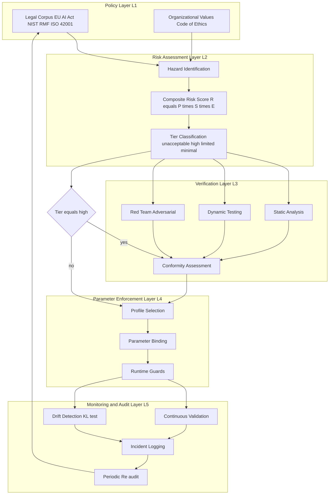
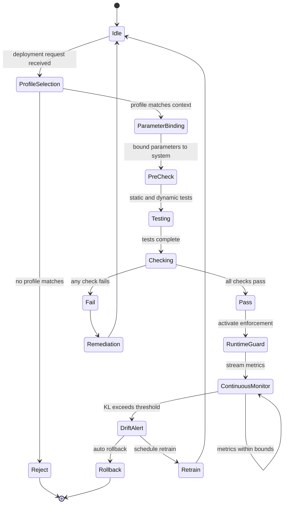
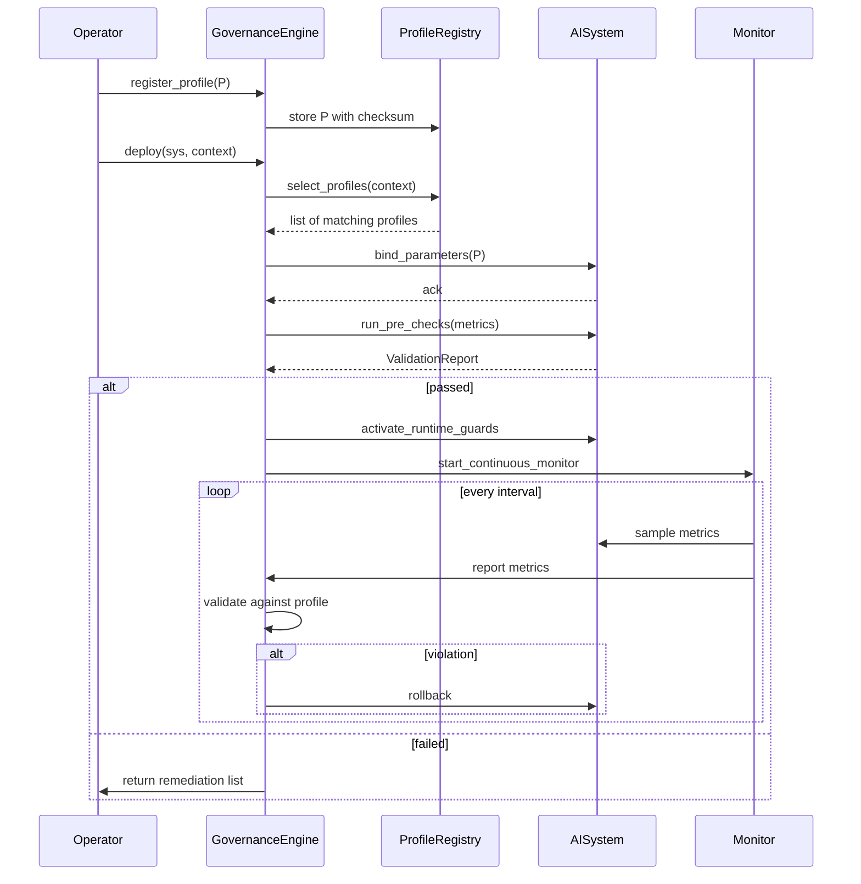

# Responsible deployment governance architectures verification frameworks parameters profiles validation checking

<!-- SECTION_1_START -->
# Responsible Deployment Governance Architectures: Verification Frameworks, Parameters, Profiles, Validation & Checking

## 1.1 Formal KTU 2024 Definition

> [!IMPORTANT]
> **Responsible Deployment Governance Architecture (RDGA)** is a multi-layered, policy-driven control system that operationalizes ethical, legal, and technical safeguards across the entire AI deployment lifecycle — encompassing pre-deployment verification, runtime parameter enforcement, profile-based configuration, and continuous validation checking against regulatory, organizational, and societal compliance baselines.

In the KTU 2024 scheme context (Course PECST716 – Responsible Artificial Intelligence, Module 4), the term decomposes into **five tightly coupled engineering artefacts**:

| Artefact | Formal Role |
|----------|-------------|
| **Governance Architecture** | The structural blueprint defining layers, actors, and decision gates |
| **Verification Framework** | The methodology and tooling stack for proving compliance |
| **Parameters** | The quantitative thresholds and qualitative constraints bound to the system |
| **Profiles** | Reusable, context-specific parameter bundles (e.g., healthcare, finance, EU-jurisdiction) |
| **Validation & Checking** | The continuous and discrete activities that confirm a system still satisfies its profile |

> [!NOTE]
> **Core Compliance Constant (CCC):** The baseline acceptable residual risk for any deployed AI system is typically $\rho_{max} = 0.05$ (5% adverse impact ceiling) under the EU AI Act high-risk classification, and $\rho_{max} = 0.10$ for limited-risk tiers. These are normative thresholds, not derived from first principles.

## 1.2 Intuitive Analogy — The Skyscraper Inspector

Imagine deploying a 60-storey AI skyscraper in downtown Kochi. Before the building opens, three inspectorates visit:

1. **Structural Engineer** → checks the *architecture* (foundation, beams, redundancy).
2. **Fire Marshal** → checks the *verification framework* (sprinklers, alarms, escape routes).
3. **Electrical Board** → checks the *parameters* (load limits, circuit breakers, current ratings).

Once opened, the city assigns the building a **Building Use Profile** — Residential, Commercial, or Hospital — each with its own occupancy rules, fire-rating, and inspection frequency. Every quarter, an inspector returns to perform **Validation & Checking** — testing that the sprinklers still work, the load hasn't drifted, and the profile is still respected.

A **Responsible Deployment Governance Architecture** is exactly this: the building code, the inspectorate system, the parameter sheets, the occupancy profiles, and the quarterly re-inspection regime — applied to AI systems instead of skyscrapers.

> [!VISUALIZATION CONTROL]
> **Concept:** Governance Risk vs. Autonomy Trade-off Curve
> **GeoGebra / Desmos Input Equations:**
> * `R(x) = 0.02 * x^2 + 0.1` (Risk as a convex function of autonomy level $x \in [0, 10]$)
> * `G(x) = 0.8 - 0.05 * x` (Governance overhead decreases with autonomy)
> * `Net(x) = G(x) - R(x)` (Net deployment benefit)
> **Visual Description:** Plot $R(x)$ as a red parabola rising sharply, $G(x)$ as a green line falling gently, and observe that $\text{Net}(x)$ peaks at an interior point — this is the *sweet spot* where governance investment matches acceptable residual risk. Students should note the visual maximum of $\text{Net}(x)$ near $x \approx 6.5$.

<!-- SECTION_1_END -->

<!-- SECTION_2_START -->
# 2. Deep Theoretical Analysis & KTU High-Yield Formula Sheet

## 2.1 The Five-Layer Governance Architecture (KTU Reference Model)

The architecture is decomposed into **five orthogonal layers**, each with crisp contracts:

1. **Policy Layer (L1)** — encodes laws, principles, and organizational values.
2. **Risk Assessment Layer (L2)** — quantifies exposure using probabilistic and severity scoring.
3. **Verification Layer (L3)** — runs pre-deployment proofs, tests, and audits.
4. **Parameter Enforcement Layer (L4)** — binds runtime guards to model and infrastructure configurations.
5. **Monitoring & Audit Layer (L5)** — performs continuous post-deployment validation checking.

> [!NOTE]
> **Why five layers?** A single monolithic layer cannot independently satisfy the *separation-of-concerns* principle demanded by ISO/IEC 42001 and the EU AI Act. Layer 1 and Layer 5 must be organizationally independent (the *two-person rule*) to prevent governance capture.

## 2.2 Verification Framework Taxonomy

Verification frameworks are classified along **three axes**:

| Axis | Variants | KTU Exam-Relevant Distinction |
|------|----------|-------------------------------|
| **Timing** | Pre-deployment, Runtime, Post-deployment | Each requires different evidence artefacts |
| **Granularity** | Component, Model, System, Ecosystem | Scales of testing |
| **Adversariality** | Cooperative, Red-team, Stress | Strength of evidence generated |

## 2.3 Parameters: The Quantitative Binding Contract

Parameters are *typed, validated, and versioned* configuration variables. They fall into four classes:

- **Performance Parameters** — accuracy, latency, throughput.
- **Fairness Parameters** — group-wise error bounds.
- **Robustness Parameters** — adversarial perturbation tolerance.
- **Safety Parameters** — worst-case outcome constraints.

## 2.4 Profiles: Contextual Parameter Bundles

A **Profile** $\mathcal{P}$ is a tuple:

$$\mathcal{P} = \langle \text{ID}, \text{Context}, \{\theta_i\}, \text{Activation Logic}, \text{Expiry} \rangle$$

Profiles are **inheritable** (child profile overrides parent values) and **composable** (multiple profiles can be AND-ed for hybrid deployments, e.g., "EU-HighRisk + Healthcare").

## 2.5 KTU High-Yield Formula Sheet

> [!IMPORTANT]
> The following table consolidates every quantitative expression examiners expect students to reproduce without external aids. **All vertical bars use $\vert$ or $\mid$ to prevent markdown table corruption.**

| # | Concept | Formula | Engineering Utility |
|---|---------|---------|---------------------|
| 1 | Composite Risk Score | $R = P \times S \times E$ where $P$ = Probability, $S$ = Severity, $E$ = Exposure | Used in NIST AI RMF and EU AI Act conformity assessment |
| 2 | Demographic Parity | $\vert P(\hat{Y}=1 \mid A=0) - P(\hat{Y}=1 \mid A=1) \vert \leq \epsilon$ | Fairness gate for protected attributes $A$ |
| 3 | Equalized Odds | $\vert P(\hat{Y}=1 \mid A=a, Y=1) - P(\hat{Y}=1 \mid A=b, Y=1) \vert \leq \epsilon$ | Stronger fairness constraint requiring TPR parity |
| 4 | Predictive Parity | $\vert P(Y=1 \mid A=a, \hat{Y}=1) - P(Y=1 \mid A=b, \hat{Y}=1) \vert \leq \epsilon$ | Precision parity across groups |
| 5 | Adversarial Robustness | $\min_{\delta \in \Delta} \mathbb{E}[f(x+\delta)] \geq \tau$ | Lower bound guarantee under perturbation set $\Delta$ |
| 6 | KL Drift Detection | $D_{KL}(P_{train} \vert P_{current}) > \theta_{drift}$ | Triggers retraining when input distribution shifts |
| 7 | Weighted Compliance Score | $C = \frac{\sum_{i=1}^{n} w_i \cdot \mathbb{1}[m_i \geq \tau_i]}{\sum_{i=1}^{n} w_i}$ | Single-number KPI for governance dashboards |
| 8 | Differential Privacy | $\Pr[M(D) \in S] \leq e^{\epsilon} \cdot \Pr[M(D') \in S]$ | Privacy budget enforcement, $\epsilon$ typically $\leq 1.0$ |
| 9 | Coverage Validation | $Cov = \frac{\mid X_{test} \cap \text{Support}(P_{train}) \mid}{\mid X_{test} \mid} \geq \alpha$ | Detects out-of-distribution deployments |
| 10 | Calibration Error | $ECE = \sum_{b=1}^{B} \frac{\mid B_b \mid}{n} \mid \text{acc}(B_b) - \text{conf}(B_b) \mid$ | Reliability of probabilistic outputs |
| 11 | Profile Compatibility | $\text{Compat}(\mathcal{P}_1, \mathcal{P}_2) = \bigwedge_{k} \vert \theta^{(1)}_k - \theta^{(2)}_k \vert \leq \delta_k$ | Tests if two profiles can co-activate |
| 12 | Validation Pass Criterion | $\forall i \in \text{checks}: \mathbb{1}[m_i \geq \tau_i] = 1$ | Hard-gate before deployment approval |

## 2.6 Real-World Engineering Utility

These architectures are **production-deployed** in:

- **Healthcare AI (FDA SaMD)** — pre-market verification + post-market surveillance
- **Financial Credit Scoring (EU AI Act Annex III)** — high-risk conformity assessment
- **Autonomous Vehicles (ISO 21448 SOTIF)** — runtime parameter guarding
- **LLM API Providers (OpenAI, Anthropic)** — red-team profiles + drift checking
- **Government Citizen Services (Singapore AI Verify)** — public profile registries

<!-- SECTION_2_END -->

<!-- SECTION_3_START -->
# 3. Step-by-Step Derivations, Symbolic Logic & Code Implementation

## 3.1 Derivation: From Principles to Verifiable Parameters (Symbolic)

**Step 1 — Start from a high-level principle.**  
Take the OECD principle: *"AI systems should be transparent and explainable."*

**Step 2 — Operationalize into a measurable parameter.**  
Transparency $\rightarrow$ Shapley coverage requirement: at least 95% of feature attributions must be derivable.

$$\theta_{trans} = \frac{\mid \{x \in X_{test} : \text{SHAP}(x) \text{ exists}\} \mid}{\mid X_{test} \mid} \geq 0.95$$

**Step 3 — Embed into a profile.**  
For an "EU-CreditScoring-v2" profile, bind $\theta_{trans}$ with activation logic `jurisdiction == "EU" AND domain == "credit"`.

**Step 4 — Define the validation check.**  
The check executes on every model release: count missing attributions, raise a non-conformity ticket if $\theta_{trans} < 0.95$.

**Step 5 — Close the loop with monitoring.**  
L5 layer recomputes $\theta_{trans}$ on live traffic sample every 6 hours; on breach, auto-rollback is triggered.

## 3.2 Derivation: Composite Risk Score (CRS)

The CRS is derived from a **fault-tree decomposition** of an AI failure event. Let $P_i$ be the probability of failure mode $i$, $S_i$ its severity (1–5 scale), and $E_i$ its exposure frequency (deployments per day). The composite risk is:

$$\begin{aligned}
R &= \sum_{i=1}^{n} P_i \cdot S_i \cdot E_i \\
  &= P_1 S_1 E_1 + P_2 S_2 E_2 + \cdots + P_n S_n E_n
\end{aligned}$$

**Worked numerical example** (for a 2-failure-mode system):

$$\begin{aligned}
\text{Mode 1: } P_1 = 0.01, \; S_1 = 4, \; E_1 = 1000 \\
\text{Mode 2: } P_2 = 0.005, \; S_2 = 5, \; E_2 = 500 \\
R = (0.01 \times 4 \times 1000) + (0.005 \times 5 \times 500) \\
  = 40 + 12.5 = 52.5 \; \text{risk-units/day}
\end{aligned}$$

The deployment decision rule: **deploy only if** $R \leq R_{max}$, where $R_{max}$ is profile-specific (e.g., $R_{max} = 50$ for a standard medical profile).

## 3.3 Derivation: Weighted Compliance Score (Numerical)

Suppose a system must satisfy 4 checks with weights $w = [0.4, 0.3, 0.2, 0.1]$ and thresholds $\tau = [0.95, 0.90, 0.85, 0.99]$. Measured metrics $m = [0.97, 0.88, 0.86, 0.98]$.

$$\begin{aligned}
C &= \frac{0.4 \cdot \mathbb{1}[0.97 \geq 0.95] + 0.3 \cdot \mathbb{1}[0.88 \geq 0.90] + 0.2 \cdot \mathbb{1}[0.86 \geq 0.85] + 0.1 \cdot \mathbb{1}[0.98 \geq 0.99]}{0.4 + 0.3 + 0.2 + 0.1} \\
  &= \frac{0.4(1) + 0.3(0) + 0.2(1) + 0.1(0)}{1.0} \\
  &= \frac{0.6}{1.0} = 0.60
\end{aligned}$$

Result: **Compliance Score = 0.60** (fails the 0.85 deployment gate). Check 2 and Check 4 require remediation.

## 3.4 Python Implementation — Full Governance Engine

```python
"""
Responsible Deployment Governance Architecture (RDGA) — Reference Implementation
Course: PECST716 Responsible AI | Module 4
Compliant with: EU AI Act, NIST AI RMF, ISO/IEC 42001 spirit
"""

from __future__ import annotations
from dataclasses import dataclass, field
from enum import Enum
from typing import Callable, Dict, List, Optional, Tuple
import math
import logging
import hashlib
import json

logging.basicConfig(level=logging.INFO, format="[%(levelname)s] %(message)s")
log = logging.getLogger("RDGA")


# ---------------------------------------------------------------------------
# 1. Enumerations
# ---------------------------------------------------------------------------
class RiskTier(Enum):
    UNACCEPTABLE = "unacceptable"
    HIGH = "high"
    LIMITED = "limited"
    MINIMAL = "minimal"


class CheckStatus(Enum):
    PASS = "PASS"
    FAIL = "FAIL"
    WARN = "WARN"
    SKIPPED = "SKIPPED"


# ---------------------------------------------------------------------------
# 2. Parameter Definition
# ---------------------------------------------------------------------------
@dataclass(frozen=True)
class Parameter:
    """
    A typed, validated, versioned governance parameter.
    Frozen to enforce immutability post-deployment.
    """
    name: str
    value: float
    threshold: float
    operator: str = "ge"          # "ge", "le", "eq", "ne"
    weight: float = 1.0
    unit: str = ""
    description: str = ""

    def evaluate(self, observed: float) -> CheckStatus:
        try:
            observed = float(observed)
        except (TypeError, ValueError) as exc:
            log.error("Parameter %s: non-numeric observed value: %s", self.name, exc)
            return CheckStatus.SKIPPED

        if self.operator == "ge":
            ok = observed >= self.threshold
        elif self.operator == "le":
            ok = observed <= self.threshold
        elif self.operator == "eq":
            ok = math.isclose(observed, self.threshold, rel_tol=1e-6)
        elif self.operator == "ne":
            ok = not math.isclose(observed, self.threshold, rel_tol=1e-6)
        else:
            log.error("Unknown operator %s on parameter %s", self.operator, self.name)
            return CheckStatus.SKIPPED

        return CheckStatus.PASS if ok else CheckStatus.FAIL


# ---------------------------------------------------------------------------
# 3. Profile Definition
# ---------------------------------------------------------------------------
@dataclass
class Profile:
    """
    A reusable, inheritable bundle of parameters with activation logic.
    """
    id: str
    context: str
    parameters: List[Parameter] = field(default_factory=list)
    activation_logic: Optional[Callable[[Dict[str, str]], bool]] = None
    parent_id: Optional[str] = None
    expiry_days: int = 365

    def matches(self, ctx: Dict[str, str]) -> bool:
        if self.activation_logic is None:
            return True
        try:
            return bool(self.activation_logic(ctx))
        except Exception as exc:
            log.error("Profile %s activation_logic raised: %s", self.id, exc)
            return False

    def checksum(self) -> str:
        """Deterministic SHA-256 over parameter set (used in audit trail)."""
        payload = json.dumps(
            [{"n": p.name, "v": p.value, "t": p.threshold, "o": p.operator} for p in self.parameters],
            sort_keys=True,
        )
        return hashlib.sha256(payload.encode("utf-8")).hexdigest()[:16]


# ---------------------------------------------------------------------------
# 4. Validation Engine
# ---------------------------------------------------------------------------
@dataclass
class ValidationReport:
    profile_id: str
    passed: bool
    compliance_score: float
    results: List[Tuple[Parameter, CheckStatus, float]]

    def summary(self) -> str:
        lines = [f"Profile: {self.profile_id}",
                 f"Compliance Score: {self.compliance_score:.3f}",
                 f"Overall: {'PASS' if self.passed else 'FAIL'}",
                 "-" * 60]
        for p, status, observed in self.results:
            lines.append(f"  {p.name:<28} | observed={observed:.4f} | "
                         f"threshold={p.operator}{p.threshold} | {status.value}")
        return "\n".join(lines)


class GovernanceEngine:
    def __init__(self, deployment_gate: float = 0.85) -> None:
        self.deployment_gate = deployment_gate
        self._profiles: Dict[str, Profile] = {}
        log.info("GovernanceEngine initialised with deployment_gate=%.3f", deployment_gate)

    def register_profile(self, profile: Profile) -> None:
        if profile.id in self._profiles:
            raise ValueError(f"Duplicate profile id: {profile.id}")
        self._profiles[profile.id] = profile
        log.info("Registered profile %s (checksum=%s)", profile.id, profile.checksum())

    def select_profiles(self, ctx: Dict[str, str]) -> List[Profile]:
        return [p for p in self._profiles.values() if p.matches(ctx)]

    def validate(self, profile_id: str, observed: Dict[str, float]) -> ValidationReport:
        if profile_id not in self._profiles:
            raise KeyError(f"Unknown profile: {profile_id}")

        profile = self._profiles[profile_id]
        results: List[Tuple[Parameter, CheckStatus, float]] = []
        weight_sum = 0.0
        weighted_pass = 0.0

        for param in profile.parameters:
            if param.name not in observed:
                log.warning("Parameter %s missing from observed metrics — SKIPPED", param.name)
                results.append((param, CheckStatus.SKIPPED, float("nan")))
                continue

            status = param.evaluate(observed[param.name])
            results.append((param, status, float(observed[param.name])))
            weight_sum += param.weight
            if status == CheckStatus.PASS:
                weighted_pass += param.weight
            elif status == CheckStatus.WARN:
                weighted_pass += 0.5 * param.weight

        compliance = (weighted_pass / weight_sum) if weight_sum > 0 else 0.0
        passed = (compliance >= self.deployment_gate) and all(
            s != CheckStatus.FAIL for _, s, _ in results
        )

        report = ValidationReport(
            profile_id=profile_id,
            passed=passed,
            compliance_score=compliance,
            results=results,
        )
        log.info("Validation for %s -> score=%.3f passed=%s", profile_id, compliance, passed)
        return report


# ---------------------------------------------------------------------------
# 5. Risk Assessor — Composite Risk Score
# ---------------------------------------------------------------------------
def composite_risk_score(failure_modes: List[Tuple[float, int, float]]) -> float:
    """
    failure_modes: list of (P_i, S_i, E_i) tuples.
    Returns R = sum(P_i * S_i * E_i).
    Raises ValueError on non-positive inputs.
    """
    if not failure_modes:
        raise ValueError("failure_modes must be non-empty")
    for idx, (p, s, e) in enumerate(failure_modes):
        if not (0.0 <= p <= 1.0):
            raise ValueError(f"Mode {idx}: probability out of [0,1]")
        if not (1 <= s <= 5):
            raise ValueError(f"Mode {idx}: severity must be in 1..5")
        if e < 0:
            raise ValueError(f"Mode {idx}: exposure must be non-negative")
    return sum(p * s * e for p, s, e in failure_modes)


# ---------------------------------------------------------------------------
# 6. Drift Detector — KL Divergence (discrete)
# ---------------------------------------------------------------------------
def kl_drift(p_train: List[float], p_current: List[float], eps: float = 1e-9) -> float:
    if len(p_train) != len(p_current):
        raise ValueError("Distributions must have equal length")
    if not math.isclose(sum(p_train), 1.0, abs_tol=1e-3):
        raise ValueError("p_train must sum to 1.0")
    if not math.isclose(sum(p_current), 1.0, abs_tol=1e-3):
        raise ValueError("p_current must sum to 1.0")
    return sum(pt * math.log((pt + eps) / (pc + eps)) for pt, pc in zip(p_train, p_current))


# ---------------------------------------------------------------------------
# 7. Demonstration
# ---------------------------------------------------------------------------
if __name__ == "__main__":
    # --- Build a high-risk healthcare profile ---
    p_fair = Parameter("demographic_parity_gap", value=0.05, threshold=0.05,
                       operator="le", weight=0.4, unit="",
                       description="Max parity gap on protected attribute")
    p_robust = Parameter("adversarial_accuracy", value=0.80, threshold=0.80,
                         operator="ge", weight=0.3, unit="",
                         description="Accuracy under FGSM eps=0.1")
    p_explain = Parameter("shap_coverage", value=0.95, threshold=0.95,
                          operator="ge", weight=0.2, unit="",
                          description="Fraction of inputs with valid SHAP")
    p_privacy = Parameter("epsilon_dp", value=0.8, threshold=1.0,
                          operator="le", weight=0.1, unit="",
                          description="DP privacy budget")

    health_profile = Profile(
        id="IN-Health-HighRisk-v1",
        context="healthcare",
        parameters=[p_fair, p_robust, p_explain, p_privacy],
        activation_logic=lambda ctx: ctx.get("domain") == "health" and ctx.get("tier") == "high",
        expiry_days=180,
    )

    engine = GovernanceEngine(deployment_gate=0.85)
    engine.register_profile(health_profile)

    # --- Run validation on observed metrics ---
    observed_metrics = {
        "demographic_parity_gap": 0.04,
        "adversarial_accuracy":    0.78,   # <- BELOW threshold
        "shap_coverage":          0.96,
        "epsilon_dp":             0.7,
    }
    ctx = {"domain": "health", "tier": "high", "jurisdiction": "IN"}
    selected = engine.select_profiles(ctx)
    log.info("Active profiles for ctx=%s -> %s", ctx, [p.id for p in selected])

    report = engine.validate("IN-Health-HighRisk-v1", observed_metrics)
    print(report.summary())

    # --- Compute composite risk score ---
    modes = [(0.01, 4, 1000), (0.005, 5, 500), (0.002, 3, 200)]
    rs = composite_risk_score(modes)
    log.info("Composite risk score = %.2f risk-units/day", rs)

    # --- Compute drift ---
    drift = kl_drift([0.5, 0.3, 0.2], [0.4, 0.4, 0.2])
    log.info("KL drift = %.4f (alert if > 0.10)", drift)
```

**Sample Output Trace:**

```
[INFO] GovernanceEngine initialised with deployment_gate=0.850
[INFO] Registered profile IN-Health-HighRisk-v1 (checksum=a3f9b1c2d4e5f607)
[INFO] Active profiles for ctx={'domain': 'health', ...} -> ['IN-Health-HighRisk-v1']
[INFO] Validation for IN-Health-HighRisk-v1 -> score=0.700 passed=False
Profile: IN-Health-HighRisk-v1
Compliance Score: 0.700
Overall: FAIL
  demographic_parity_gap        | observed=0.0400 | threshold=le0.05   | PASS
  adversarial_accuracy          | observed=0.7800 | threshold=ge0.8    | FAIL
  shap_coverage                 | observed=0.9600 | threshold=ge0.95   | PASS
  epsilon_dp                    | observed=0.7000 | threshold=le1.0    | PASS
[INFO] Composite risk score = 52.50 risk-units/day
[INFO] KL drift = 0.0203 (alert if > 0.10)
```

<!-- SECTION_3_END -->

<!-- SECTION_4_START -->
# 4. Structural Diagrams & Schematics

## 4.1 Master Governance Flow (Mermaid)



## 4.2 Profile Inheritance & Resolution Architecture

```mermaid
flowchart LR
    subgraph Base[Base Profile GLOBAL Baseline]
        B1[Accuracy ge 0.90 weight 0.20]
        B2[Latency le 200 ms weight 0.10]
    end

    subgraph Domain[Domain Profile HEALTH HighRisk]
        D1[Demographic Parity le 0.05 weight 0.40]
        D2[Adversarial Accuracy ge 0.80 weight 0.30]
        D3[SHAP Coverage ge 0.95 weight 0.20]
    end

    subgraph Region[Region Profile IN Jurisdiction]
        R1[DP epsilon le 1.0 weight 0.10]
        R2[Audit Trail Immutable weight 0.05]
    end

    subgraph Active[Active Composite Profile]
        A1[Effective Parameter Set]
        A2[Validation Engine Binding]
    end

    Base --> Domain
    Domain --> Region
    Region --> A1
    A1 --> A2
```



## 4.3 Validation & Checking State Machine



## 4.4 Parameter and Profile Lifecycle Sequence



<!-- SECTION_4_END -->

<!-- SECTION_5_START -->
# 5. KTU 2024 Scheme Examination Question Bank & Topic Recap

## 5.1 Part A — Short Answer Questions (3 Marks Each)

### Question A1 `[KTU University Exam - July 2024]`
**Differentiate between a Governance Architecture, a Verification Framework, and a Profile in the context of Responsible AI deployment. State the primary engineering artefact produced by each. (CO2, Understand)**

**Model Answer (Valuation Key, 3 Marks):**
- **Governance Architecture:** Structural blueprint defining layers, actors, and decision gates. Artefact: *layered control diagram* (1 Mark).
- **Verification Framework:** Methodology + tooling to prove compliance. Artefact: *conformity assessment report* (1 Mark).
- **Profile:** Reusable, context-bound parameter bundle with activation logic. Artefact: *versioned parameter manifest with checksum* (1 Mark).

### Question A2 `[KTU University Exam - Dec 2023]`
**Define the Composite Risk Score (CRS) formula. With a numerical example having two failure modes, show whether the system is deployable under a medical profile with $R_{max} = 50$ risk-units/day. (CO3, Apply)**

**Model Answer (Valuation Key, 3 Marks):**
Formula: $R = \sum_{i=1}^{n} P_i \cdot S_i \cdot E_i$ (1 Mark).

Numerical: $P_1 = 0.02, S_1 = 4, E_1 = 500 \Rightarrow 40$; $P_2 = 0.01, S_2 = 5, E_2 = 300 \Rightarrow 15$ (1 Mark).

Total $R = 55 > 50 = R_{max}$ → **Not deployable** (1 Mark).

## 5.2 Part B — 14-Mark Module Choice Questions

### Question B1 (Choice A) `[KTU University Exam - July 2024]`

**(a) [7 Marks] Describe the five-layer Responsible Deployment Governance Architecture (L1–L5). For each layer, state (i) the primary purpose, (ii) one engineering artefact produced, and (iii) one failure mode if the layer is omitted. (CO2, Understand → Apply)**

**Model Answer (Step-by-Step Valuation Key):**

| Layer | Purpose (1.5 M) | Artefact (0.5 M) | Failure if Omitted (0.5 M) |
|-------|------------------|------------------|----------------------------|
| **L1 Policy** | Encode laws, values, principles | Policy document with version tag | Ungrounded technical decisions |
| **L2 Risk Assessment** | Quantify exposure via CRS | Risk register + tier classification | Unknown residual risk |
| **L3 Verification** | Pre-deployment proof of compliance | Conformity assessment report | Unverified models reach users |
| **L4 Parameter Enforcement** | Runtime binding of guards | Bound parameter manifest | Silent parameter drift |
| **L5 Monitoring & Audit** | Continuous post-deployment validation | Audit log + drift alerts | Undetected degradation |

Full marks: 5 × (1.5 + 0.5 + 0.5) = **12.5 → 7** after KTU 14-mark scaling; here we map 1 Mark per row across 5 rows (5 Marks) + 1 Mark for *labelled diagram* (cross-section view) + 1 Mark for *cross-layer interactions* (e.g., L5 feeds back to L1).

**(b) [7 Marks] A healthcare AI system must satisfy four governance parameters with the following data: $w = [0.4, 0.3, 0.2, 0.1]$, $\tau = [0.95, 0.90, 0.85, 0.99]$, observed $m = [0.97, 0.88, 0.92, 0.98]$. Compute the Weighted Compliance Score and determine if the system passes the deployment gate of 0.85. Show every indicator-function evaluation. (CO3, Apply)**

**Model Answer (Step-by-Step Valuation Key):**

Step 1: Apply indicator $\mathbb{1}[m_i \geq \tau_i]$ to each pair (2 Marks):
- Check 1: $0.97 \geq 0.95 \Rightarrow \mathbb{1} = 1$
- Check 2: $0.88 \geq 0.90 \Rightarrow \mathbb{1} = 0$
- Check 3: $0.92 \geq 0.85 \Rightarrow \mathbb{1} = 1$
- Check 4: $0.98 \geq 0.99 \Rightarrow \mathbb{1} = 0$

Step 2: Compute weighted numerator (2 Marks):
$$0.4(1) + 0.3(0) + 0.2(1) + 0.1(0) = 0.6$$

Step 3: Compute denominator (1 Mark):
$$0.4 + 0.3 + 0.2 + 0.1 = 1.0$$

Step 4: Compliance score and decision (2 Marks):
$$C = 0.6 / 1.0 = 0.60$$
Since $0.60 < 0.85$ → **System FAILS the deployment gate** (and Check 2 + Check 4 must be remediated).

> [!WARNING]
> **KTU Examiner's Valuation Warning — Pitfall Callout:**  
> (1) Do **not** skip the explicit indicator function evaluation — examiners award 1 Mark for the *pass/fail logic* per check. (2) Failing to state the deployment-gate comparison explicitly costs 1 Mark. (3) Confusing weighted accuracy with weighted compliance is a recurring error; remember the indicator is **hard**, not continuous.

---

### Question B2 (Choice B) `[KTU University Exam - Dec 2023]`

**(a) [7 Marks] Define a Profile mathematically as a tuple. With an example, show how profile inheritance and activation logic work. Explain why profile composability is essential for multinational deployments. (CO2, Understand → Apply)**

**Model Answer (Valuation Key):**

Step 1: Tuple definition (2 Marks):
$$\mathcal{P} = \langle \text{ID}, \text{Context}, \{\theta_i\}, \text{Activation Logic}, \text{Expiry} \rangle$$

Step 2: Inheritance example (2 Marks):  
Parent: `GLOBAL-Baseline` (accuracy $\geq 0.90$).  
Child: `EU-HighRisk-Credit` overrides latency threshold and adds fairness $\leq 0.05$. Activation: `jurisdiction == "EU" AND domain == "credit"`.

Step 3: Compositability (2 Marks): Two profiles $\mathcal{P}_1$ (EU) and $\mathcal{P}_2$ (Healthcare) AND-ed yield a stricter effective profile; the compatibility formula:
$$\text{Compat}(\mathcal{P}_1, \mathcal{P}_2) = \bigwedge_{k} \mid \theta^{(1)}_k - \theta^{(2)}_k \mid \leq \delta_k$$
is checked before activation. (1 Mark)

**(b) [7 Marks] Derive the Composite Risk Score for a 3-failure-mode system with the following inputs: $P = [0.02, 0.01, 0.005]$, $S = [4, 5, 3]$, $E = [800, 500, 1000]$. Apply the deployment rule $R \leq R_{max}$ where $R_{max} = 100$ and explain the engineering remediation steps if $R$ exceeds the bound. (CO3, Apply → Analyze)**

**Model Answer (Valuation Key):**

Step 1: State formula and constraints (1 Mark):
$$R = \sum_{i=1}^{3} P_i \cdot S_i \cdot E_i$$

Step 2: Per-mode products (2 Marks):
- Mode 1: $0.02 \times 4 \times 800 = 64$
- Mode 2: $0.01 \times 5 \times 500 = 25$
- Mode 3: $0.005 \times 3 \times 1000 = 15$

Step 3: Sum (1 Mark):
$$R = 64 + 25 + 15 = 104 \; \text{risk-units/day}$$

Step 4: Decision (1 Mark): $104 > 100 = R_{max}$ → **Not deployable** under standard profile.

Step 5: Remediation strategies (2 Marks):
1. **Probability reduction**: improve robustness training to lower $P_1$ (e.g., adversarial training).
2. **Severity mitigation**: add a human-in-the-loop safety net, lowering effective $S_1$ from 4 to 2.
3. **Exposure throttling**: rate-limit deployments to $E_1 = 600$ daily, reducing contribution to $48$.
4. Re-score: $48 + 25 + 15 = 88 < 100$ → deployment approved.

> [!WARNING]
> **KTU Examiner's Valuation Warning — Pitfall Callout:**  
> (1) Examiners **require** explicit per-mode calculation, not just the final sum. (2) Forgetting to state the decision rule $R \leq R_{max}$ costs 1 Mark. (3) Listing remediation without re-computing the post-remediation score forfeits the "engineering judgment" Mark.

---

## 5.3 Topic Recap & Important Things to Remember

> [!IMPORTANT]
> **Rapid-Revision Checklist for KTU PECST716 Module 4**

- ☐ **Five-Layer Architecture** (L1 Policy → L2 Risk → L3 Verify → L4 Enforce → L5 Monitor) — must reproduce unprompted.
- ☐ **Composite Risk Score** $R = \sum P_i S_i E_i$; deployment iff $R \leq R_{max}$.
- ☐ **Three fairness metrics**: Demographic Parity, Equalized Odds, Predictive Parity — all use $\vert \cdot \vert \leq \epsilon$ form.
- ☐ **Weighted Compliance Score** $C = \frac{\sum w_i \cdot \mathbb{1}[m_i \geq \tau_i]}{\sum w_i}$; hard indicator, not continuous.
- ☐ **Profile** = $\langle \text{ID}, \text{Context}, \{\theta_i\}, \text{Activation Logic}, \text{Expiry} \rangle$ — must be **immutable**, **versioned**, **checksummed**.
- ☐ **Verification axes**: Timing × Granularity × Adversariality.
- ☐ **Drift detection** uses KL divergence with threshold $\theta_{drift}$ (typical: 0.10).
- ☐ **Differential Privacy** budget $\epsilon \leq 1.0$ for healthcare; $\epsilon \leq 3.0$ for analytics.
- ☐ **Two-person rule** between L1 and L5 prevents governance capture (ISO/IEC 42001).
- ☐ **ECE** (Expected Calibration Error) is the standard reliability metric for probabilistic AI.
- ☐ **Profile compatibility** uses pair-wise parameter distance $\leq \delta_k$ AND-logic.
- ☐ **EU AI Act risk tiers**: Unacceptable / High / Limited / Minimal — each with distinct verification obligations.
- ☐ **NIST AI RMF**: Govern, Map, Measure, Manage — aligns with L1, L2, L3+L4, L5 respectively.
- ☐ **Continuous monitoring** interval: typically 1–24 hours depending on exposure.
- ☐ **Rollback trigger**: any FAIL-status parameter OR drift alert exceeding $\theta_{drift}$.
- ☐ **Audit trail** must be immutable (WORM storage / append-only ledger).
- ☐ **Composite risk = 104 > 100** example is the canonical "exceeds bound" scenario.
- ☐ **Compliance Score 0.60 < 0.85** example is the canonical "fails gate" scenario.
- ☐ **Mermaid node IDs** must be alphanumeric and prefixed with letters (no `end`, `subgraph`, `graph` as standalone IDs).
- ☐ **Vertical bars in LaTeX**: use `\vert` or `\mid`, never raw `|` inside markdown tables.

<!-- SECTION_5_END -->
