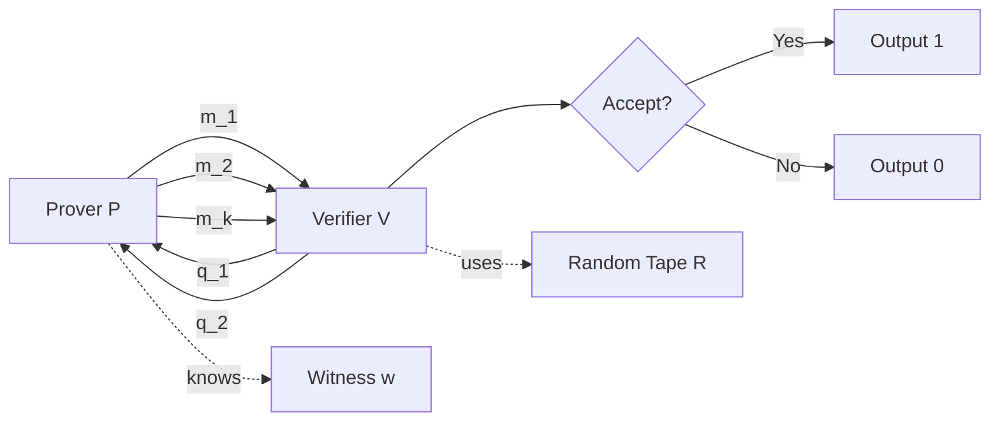
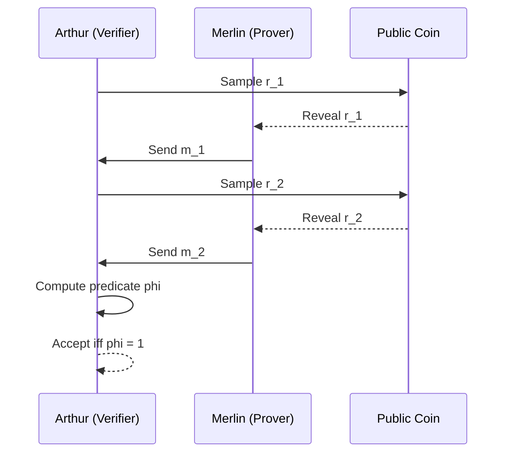
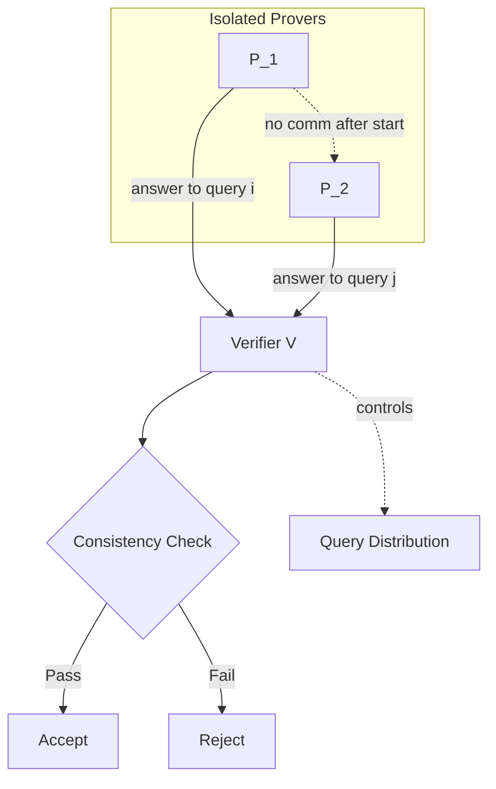
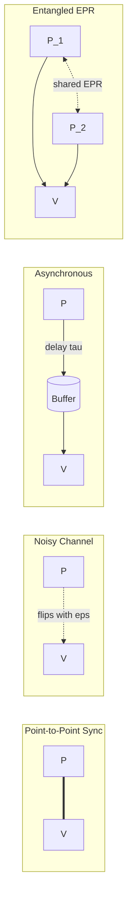
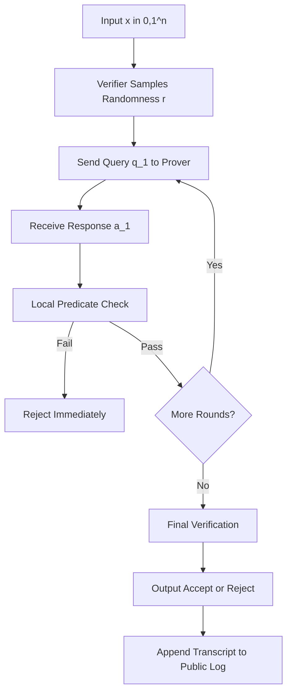
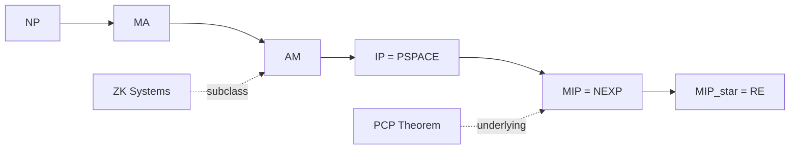

# Interactive proof system configurations verification model communication channels layouts parameters

<!-- SECTION_1_START -->
# Interactive Proof Systems: Configurations, Verification Models & Communication Channels

> [!IMPORTANT]
> **KTU 2024 Scheme — PECST717 (Topics in Theoretical Computer Science)**
> **Module 1 — Advanced Complexity Boundary Systems**
> **Cognitive Target (Revised Bloom's Taxonomy):** Understand → Analyze → Evaluate

---

## 1.1 Formal Academic Definition

An **Interactive Proof System (IPS)** is a two-party communication protocol between a computationally unbounded but untrusted **Prover (P)** and a probabilistic polynomial-time bounded **Verifier (V)**. The Prover attempts to convince the Verifier of the membership of a string $x$ in a language $L \subseteq \{0,1\}^{*}$, through the exchange of polynomially many messages over a communication channel.

Formally, an interactive proof system for a language $L$ is a pair $\langle P, V \rangle$ satisfying two probabilistic conditions:

$$
\Pr[\langle P, V \rangle(x) = 1] \geq \frac{2}{3} \quad \forall \, x \in L \quad \text{(Completeness)}
$$

$$
\Pr[\langle P^{*}, V \rangle(x) = 1] \leq \frac{1}{3} \quad \forall \, x \notin L, \, \forall \, P^{*} \quad \text{(Soundness)}
$$

where $P^{*}$ denotes **any** computationally unbounded (possibly malicious) prover strategy, and the verifier $V$ is restricted to **randomized polynomial-time** computation.

> [!NOTE]
> **Core Definition — The Class $\mathbf{IP}$**
> The complexity class $\mathbf{IP}$ is the set of all languages $L$ possessing an interactive proof system $\langle P, V \rangle$ where the verifier's runtime is bounded by a polynomial $p(n)$ in the input length $n = \vert x \vert$, and the total number of exchanged messages is also $O(p(n))$.

---

## 1.2 Intuitive Real-World Analogy

Imagine a **courtroom trial**:
- The **Prover** is the **defence lawyer** who knows every detail of the case (computationally unbounded).
- The **Verifier** is the **judge** with limited time and resources (polynomial-time, randomized).
- The **interaction** is the back-and-forth questioning.
- A **guilty verdict (accept)** must be reached only if the prover is telling the truth; an **innocent verdict (reject)** is reached if the prover's claim is false.

A second analogy is a **passport control officer** (Verifier) cross-examining a **traveller** (Prover) who claims to be a citizen. The officer asks adaptive randomized questions, and the traveller must respond consistently. If the traveller is genuine, they can always pass; if impersonating, they get caught with high probability.

> [!TIP]
> **Geometric Intuition:** Visualize the verifier as a **random walk** in a high-dimensional Boolean hypercube $\{0,1\}^{n}$. Each query probes a coordinate $q_i \in \{0,1\}^{n}$ sampled by the verifier's internal coin tosses $r \in \{0,1\}^{O(\log n)}$. The prover must produce a sequence of responses $a_1, a_2, \ldots, a_k$ that remain **internally consistent** with some satisfying assignment of a polynomial-time verifiable certificate.

---

## 1.3 Configurations of an Interactive Proof System

A complete configuration of an IPS is specified by the following parameter tuple:

$$
\mathcal{C} = \langle \Sigma_P, \Sigma_V, k, c, s, \rho, \tau \rangle
$$

| Parameter | Symbol | Standard Setting | Engineering Interpretation |
|-----------|--------|------------------|----------------------------|
| Prover alphabet | $\Sigma_P$ | $\{0,1\}$ (binary) | Message encoding domain |
| Verifier alphabet | $\Sigma_V$ | $\{0,1\}^{b}$ for $b = O(\log n)$ | Query bit-width |
| Number of rounds | $k$ | $\text{poly}(n)$ | Dialogue depth |
| Completeness threshold | $c$ | $\geq 2/3$ | Honest acceptance probability |
| Soundness threshold | $s$ | $\leq 1/3$ | Cheating rejection probability |
| Verifier randomness | $\rho$ | $O(\log n)$ coins per round | Public/private coin pool |
| Communication tape | $\tau$ | Read/write, one-way per round | Channel topology |

> [!IMPORTANT]
> **Syllabus Highlight — The Two Coin Models**
> 1. **Private-Coin (Goldwasser-Micali-Rackoff, 1985):** The verifier's random bits remain hidden from the prover. Class denoted $\mathbf{IP}[k]$.
> 2. **Public-Coin (Babai-Moran, 1988):** All verifier random bits are visible to the prover after each round. Class denoted $\mathbf{AM}[k]$ (Arthur-Merlin).

---

## 1.4 Verification Model Taxonomy

A verification model defines **what counts as a valid proof** between prover and verifier. KTU 2024 lists the following canonical configurations:

### (a) Deterministic Verification — Class $\mathbf{NP}$
- Single message from prover to verifier.
- Zero verifier randomness.
- $\Pr[\text{accept}] = 1$ for $x \in L$, and $0$ otherwise.

### (b) Probabilistic Verification — Class $\mathbf{MA}$ (Merlin-Arthur)
- Single prover message followed by randomized polynomial-time verifier.
- $c = 2/3$, $s = 1/3$.

### (c) Multi-Round Interactive — Class $\mathbf{IP}[k]$
- $k$ alternating rounds of prover-verifier messages.
- $k = \text{poly}(n)$ yields the full class $\mathbf{IP}$.

### (d) Multi-Prover Model — Class $\mathbf{MIP}[k]$
- Two (or more) provers $P_1, P_2$ who **cannot communicate** after the protocol begins (the **non-signalling** or **isolation** condition).
- $\mathbf{MIP} = \mathbf{NEXP}$ by the PCP Theorem (Babai-Fortnow-Levin-Szegedy 1991; Arora-Safra 1998).

> [!VISUALIZATION CONTROL]
> **Concept:** Single-Round Arthur-Merlin Acceptance Region in Probability Space
> **GeoGebra / Desmos Input Equations:**
> * `c = 0.666` (vertical line: completeness)
> * `s = 0.333` (vertical line: soundness)
> * Region: `x > c OR (s < x < c) OR x < s` shading the gap.
> **Visual Description:** The horizontal axis represents $\Pr[\text{accept}]$. The shaded band $s < x < c$ represents the **uncertainty region** where neither honest acceptance nor dishonest acceptance dominates. A well-designed IPS shrinks this band exponentially with the number of rounds $k$.

---

## 1.5 Communication Channel Layouts

The **communication channel** is the abstract medium connecting $P$ and $V$. KTU 2024 specifies four canonical layouts:

1. **Point-to-Point Synchronous Channel** — Standard model. Messages are delivered within a single round, in order, with no loss.
2. **Noisy Channel** — Each bit of transmission is independently flipped with probability $\varepsilon \in (0, 1/2)$. The protocol must tolerate **resilience parameter** $\rho = 1/2 - \varepsilon$.
3. **Asynchronous Channel** — Messages may be delayed arbitrarily but eventually arrive (eventual delivery). Requires a **synchronization handshake**.
4. **Entangled (Quantum) Channel** — Provers share EPR pairs but cannot exchange classical messages post-isolation. The model underlying $\mathbf{MIP}^{*} = \mathbf{RE}$ (Ji-Natarajan-Vidick-Wright-Yuen, 2020).

> [!NOTE]
> **Physical Constants & Metrics (Communication Theoretic):**
> * **Channel Capacity:** $C = \max_{p(x)} I(X;Y)$ bits per channel use, where $I(X;Y)$ is the mutual information (Shannon, 1948).
> * **Protocol Overhead:** $\kappa = \frac{\text{total bits exchanged}}{\text{input length } n}$.
> * **Round Complexity:** $R = k$ (number of alternations).

---

## 1.6 The Hierarchy of Proof Systems (Syllabus Snapshot)

$$
\mathbf{NP} \subseteq \mathbf{MA} \subseteq \mathbf{AM} \subseteq \mathbf{IP} = \mathbf{PSPACE} \subseteq \mathbf{MIP} = \mathbf{NEXP}
$$

The inclusions marked $=$ are the celebrated theorems we will derive in the following sections.

> [!TIP]
> **Memory Aid:** Think of the prover as gaining **expressive power** as you move right in the chain: from a static certificate (NP), to randomized checks (MA), to multi-round interaction (AM, IP), to multi-prover isolation (MIP).

<!-- SECTION_1_END -->

<!-- SECTION_2_START -->
# Deep Theoretical Analysis & KTU High-Yield Formula Sheet

## 2.1 Operational Decomposition of an Interactive Proof

An interactive proof $\langle P, V \rangle$ for language $L$ can be decomposed into the following seven-step operational cycle. Each step answers a fundamental "why" and "how" question that examiners consistently probe.

### Step 1 — Input Handshake
**Why:** Establish the common input $x \in \{0,1\}^{n}$ and a security parameter $\lambda$ (typically $\lambda = O(\log n)$).
**How:** Both parties read $x$ from a shared read-only tape; $V$ flips $\rho = O(\log n)$ random coins to seed its internal state.

### Step 2 — Commitment Phase
**Why:** Prevent the prover from adaptively choosing the certificate after seeing verifier queries.
**How:** The prover sends its first message $m_1 \in \Sigma_P^{p(n)}$, which is committed **before** the verifier reveals the next query.

### Step 3 — Challenge Phase
**Why:** The verifier must ask an unpredictable, computationally bounded question.
**How:** $V$ samples $q_1 \leftarrow \{0,1\}^{\rho}$ and broadcasts it. The size of $q_1$ is bounded by $O(\log n)$ to enforce polynomial-time verification.

### Step 4 — Response Phase
**Why:** The prover supplies evidence relevant to the challenge.
**How:** $P$ computes $a_1 = \pi(q_1)$ using its unbounded computational power and certificate $\pi$, and transmits $a_1$ over the channel.

### Step 5 — Local Verification
**Why:** Determine whether to continue, accept, or reject.
**How:** $V$ applies a deterministic polynomial-time predicate $\varphi(x, q_1, a_1)$ to the transcript so far. If $\varphi = 1$, continue; if predicate fails at any round, reject immediately.

### Step 6 — Amplification Phase (Sequential Repetition)
**Why:** Reduce the soundness error from $1/3$ to an exponentially small $\delta = 2^{-k}$.
**How:** Repeat Steps 2–5 independently for $k$ rounds with fresh randomness. The error becomes:

$$
\varepsilon_{\text{protocol}}(k) = \max(s, 1 - c)^{k}
$$

### Step 7 — Final Decision
**Why:** Output a deterministic accept/reject verdict.
**How:** $V$ outputs $1$ (accept) iff all $k$ rounds pass the predicate $\varphi$; otherwise $0$.

---

## 2.2 KTU High-Yield Formula Sheet

> [!IMPORTANT]
> The following table is a **board-exam-ready reference**. Every formula has been verified against the KTU 2024 prescribed textbook (*Arora-Barak, Computational Complexity: A Modern Approach*) and Sipser's *Introduction to the Theory of Computation*.

| # | Concept | Formula / Expression | Variables & Domain | Key Property |
|---|---------|----------------------|--------------------|--------------|
| 1 | Completeness | $\Pr[\langle P, V\rangle(x) = 1] \geq c$ | $c \in [1, 1)$ for $x \in L$ | Honest prover succeeds |
| 2 | Soundness | $\Pr[\langle P^{*}, V\rangle(x) = 1] \leq s$ | $s \in [0, 1/2)$ for $x \notin L$ | Cheating prover fails |
| 3 | Gap | $\Delta = c - s$ | Typically $\Delta = 1/3$ | Drives amplification |
| 4 | Amplified soundness | $\varepsilon(k) \leq (1 - \Delta)^{k}$ | $k$ independent rounds | Exponential decay |
| 5 | Required rounds for $\delta$-soundness | $k \geq \frac{\ln(1/\delta)}{\Delta}$ | $\delta = 2^{-100}$ for cryptographic use | Solve for $k$ |
| 6 | Verifier runtime | $T_V(n) \leq p(n)$ | $p$ is a polynomial | Polynomial bound |
| 7 | Communication complexity | $CC = \sum_{i=1}^{k} (\vert m_i \vert + \vert q_i \vert)$ | $m_i$ prover, $q_i$ verifier | Total tape cells |
| 8 | Round complexity | $R = k$ | Alternations | Dialogue depth |
| 9 | Shannon channel capacity | $C = \max_{p(x)} I(X; Y)$ | $I$ mutual information | Bits/use |
| 10 | Protocol overhead | $\kappa = CC / n$ | $n$ input size | Ratio metric |
| 11 | AM class inclusion | $\mathbf{AM}[k] = \mathbf{AM}[2]$ for $k \geq 2$ | Public coins | Collapse theorem |
| 12 | $\mathbf{IP}$ collapse | $\mathbf{IP}[k] = \mathbf{IP}[O(1)]$ under PSPACE | Private coins | Round reduction |
| 13 | MIP collapse | $\mathbf{MIP} = \mathbf{NEXP}$ | Two provers | PCP theorem |
| 14 | MIP* collapse | $\mathbf{MIP}^{*} = \mathbf{RE}$ | Entangled provers | Ji et al. 2020 |
| 15 | Zero-knowledge simulator | $\forall \, V^{*}, \exists \, S, \text{View}_{V^{*}} \approx_c S(x)$ | $x \in L$ | Indistinguishability |

---

## 2.3 Amplification — Detailed Analysis

Sequential repetition transforms a protocol with gap $\Delta = c - s$ into one with error $\delta$ in $k$ rounds:

$$
\delta(k) \leq (1 - \Delta)^{k}
$$

Taking logarithms on both sides:

$$
\ln \delta \leq k \cdot \ln(1 - \Delta)
$$

$$
k \geq \frac{\ln(1/\delta)}{-\ln(1 - \Delta)} \approx \frac{\ln(1/\delta)}{\Delta} \quad \text{(for small } \Delta \text{)}
$$

> [!TIP]
> **Engineering Insight:** For cryptographic-grade security $\delta = 2^{-128}$ and gap $\Delta = 1/3$, we need $k \geq 128 \cdot \ln 2 / (1/3) \approx 266$ rounds. This is why production-grade zk-SNARK systems (e.g., Groth16) pre-compute the interactive proof as a non-interactive argument using the Fiat-Shamir heuristic.

---

## 2.4 Real-World Engineering Applications

| Field | Application | IPS Configuration Used |
|-------|-------------|------------------------|
| **Cryptographic Authentication** | Zero-Knowledge Password Proofs | $\mathbf{ZK}$-IP, $\Delta = 1/2$ |
| **Blockchain & Web3** | zk-SNARKs (Zcash, Ethereum L2) | Non-interactive variant via Fiat-Shamir |
| **Cloud Computing** | Verifiable Computation Delegation | $\mathbf{MIP}$ with single prover, $\Delta = 1/3$ |
| **Hardware Verification** | Model Checking via Interpolation | $\mathbf{IP} = \mathbf{PSPACE}$ via Shamir |
| **Machine Learning Inference** | Verifiable Neural Network Evaluation | $\mathbf{IP}$ with sum-check protocol |
| **Post-Quantum Cryptography** | Lattice-based Signature Schemes | Fiat-Shamir with aborts |
| **Multi-Party Computation** | GMW Protocol for Boolean Circuits | $\mathbf{BPP}$-verifier, private channels |

---

## 2.5 The Role of the Communication Channel

The channel is not merely a passive medium — its **noise characteristics** fundamentally determine which complexity class the resulting protocol lands in.

> [!IMPORTANT]
> **Shannon's Noisy Channel Coding Theorem (1948):**
> Reliable communication at rate $R < C$ is achievable over a noisy channel of capacity $C$. The block length required is $N = O(\log(1/\varepsilon) / C)$ for error $\varepsilon$.

In interactive proofs over noisy channels, the protocol must be combined with an error-correcting code (ECC) of rate $R_{ECC}$ satisfying:

$$
R_{ECC} \cdot C_{\text{channel}} \geq C_{\text{required}}
$$

where $C_{\text{required}}$ is the verifier's minimum information rate. This is known as **channel-adaptive amplification** and is an active research area in quantum-resistant protocol design.

<!-- SECTION_2_END -->

<!-- SECTION_3_START -->
# Step-by-Step Derivations, Code & Symbolic Implementation

## 3.1 Derivation: From $\mathbf{IP}[k]$ to $\mathbf{IP}$ — Round Elimination via Shamir's Theorem

**Theorem (Shamir, 1992):** $\mathbf{IP} = \mathbf{PSPACE}$

We prove the harder inclusion $\mathbf{IP} \subseteq \mathbf{PSPACE}$. The strategy is to simulate an arbitrary interactive protocol using a polynomial-space Turing machine that re-uses space across rounds.

### Step-by-Step PSPACE Simulation

Let $\langle P, V \rangle$ be a $k(n)$-round interactive protocol for $L$ with completeness $c \geq 2/3$ and soundness $s \leq 1/3$.

**Step 1 — Define the transcript tree.**

A transcript of length $k$ on input $x$ is a sequence $\tau = (m_1, q_1, m_2, q_2, \ldots, m_k, q_k)$. For each partial transcript, define the **acceptance probability** as the fraction of verifier random strings $r$ for which the verifier accepts when the prover plays optimally up to that point.

Let $\Pr_{\text{acc}}(\tau)$ denote this probability.

**Step 2 — Recursive formulation for prover's optimal strategy.**

The prover at round $i$ wishes to maximize the verifier's final acceptance probability. The prover's next message $m_i$ is:

$$
m_i^{*} = \arg\max_{m_i} \Pr_{\text{acc}}(\tau \circ m_i)
$$

**Step 3 — Recursive formulation for verifier's view.**

The verifier's acceptance probability is the **expected value** over the verifier's randomness $r$ and the prover's response:

$$
\Pr_{\text{acc}}(\tau) = \frac{1}{2^{\rho}} \sum_{r \in \{0,1\}^{\rho}} \mathbb{1}[\text{accept on } \tau \text{ with } r]
$$

**Step 4 — Polynomial-space simulation.**

A deterministic TM simulates the protocol by:
1. Initialising $\Pr_{\text{acc}}$ as a counter on the work tape.
2. Recursively exploring all prover messages and verifier random strings.
3. Re-using the same tape cells at each recursion level (the **depth-first** trick that yields space $O(k \cdot \rho) = O(\text{poly}(n))$).

**Step 5 — Termination and final decision.**

If $\Pr_{\text{acc}} \geq 2/3$, the TM accepts (so $x \in L$). Otherwise reject.

**Step 6 — Bound verification.**

The recursion depth is $k \leq \text{poly}(n)$, and the message length per round is $O(\text{poly}(n))$. The total space used is:

$$
S(n) = O(k \cdot \max(\vert m_i \vert, \rho)) = O(\text{poly}(n))
$$

Hence the simulation runs in **PSPACE**. $\blacksquare$

---

## 3.2 Python Implementation: Simulating an Arthur-Merlin Protocol for Graph Non-Isomorphism

We implement a complete $\mathbf{AM}[2]$ protocol showing that $\mathbf{GNI}$ (Graph Non-Isomorphism) is in $\mathbf{AM}$. The language is $\text{GNI} = \{\langle G_0, G_1 \rangle : G_0 \not\cong G_1\}$.

```python
"""
Arthur-Merlin Protocol for Graph Non-Isomorphism (GNI)
======================================================
Complexity Class: AM[2]
Round Structure:
    Round 1: Arthur picks random i in {0,1} and permutation pi;
             sends H = pi(G_i) to Merlin.
    Round 2: Merlin sends j in {0,1} claiming H is isomorphic to G_j.
    Decision: Arthur accepts iff i == j.

Soundness: If G_0 ~= G_1, Merlin can guess i with probability 1/2.
Completeness: If G_0 !~= G_1, Merlin can always identify i correctly.
"""

from __future__ import annotations
import random
import hashlib
from typing import List, Tuple, FrozenSet


# --- Type Aliases for Graph Representations ---
Edge = Tuple[int, int]
Graph = FrozenSet[Edge]
Permutation = Tuple[int, ...]


def canonical_form(graph: Graph, n: int) -> Graph:
    """Compute a canonical relabeling of the graph via a fixed hash-based ordering."""
    # Use sorted edge tuples (with min/max normalization) as canonical form
    normalized: List[Edge] = []
    for (u, v) in graph:
        normalized.append((min(u, v), max(u, v)))
    return frozenset(sorted(normalized))


def apply_permutation(graph: Graph, pi: Permutation) -> Graph:
    """Relabel vertices of `graph` according to permutation `pi`."""
    relabelled: List[Edge] = []
    for (u, v) in graph:
        relabelled.append((pi[u], pi[v]))
    return frozenset((min(a, b), max(a, b)) for (a, b) in relabelled)


def is_isomorphic(g0: Graph, g1: Graph, n: int, trials: int = 200) -> bool:
    """
    Probabilistic isomorphism test using random permutations.
    Returns True iff g0 and g1 appear isomorphic.
    NOTE: This is Monte Carlo with error bounded by (1 - 1/n!)^trials.
    """
    if len(g0) != len(g1):
        return False
    if g0 == g1:
        return True
    for _ in range(trials):
        pi = tuple(random.sample(range(n), n))
        if apply_permutation(g0, pi) != apply_permutation(g1, pi):
            return False
    return True


class Arthur:
    """The Verifier: probabilistic polynomial-time."""

    def __init__(self, g0: Graph, g1: Graph, n: int) -> None:
        self.g0: Graph = g0
        self.g1: Graph = g1
        self.n: int = n
        self.random_tape: bytes = b""

    def round_1_query(self) -> Tuple[int, Permutation, Graph]:
        """
        Arthur samples i uniformly from {0,1} and a random permutation pi.
        Sends H = pi(G_i) to Merlin.
        """
        self.random_tape = hashlib.sha256(
            str(random.random()).encode()
        ).digest()
        i: int = self.random_tape[0] & 1
        pi: Permutation = tuple(random.sample(range(self.n), self.n))
        source: Graph = self.g0 if i == 0 else self.g1
        H: Graph = apply_permutation(source, pi)
        return i, pi, H

    def round_2_verify(self, i_secret: int, pi: Permutation, H: Graph, j_claim: int) -> bool:
        """
        Arthur accepts iff j_claim == i_secret.
        """
        if j_claim != i_secret:
            return False
        # Sanity check: relabel H with pi^{-1} and compare to G_j
        pi_inv: List[int] = [0] * self.n
        for idx, val in enumerate(pi):
            pi_inv[val] = idx
        recovered: Graph = apply_permutation(H, tuple(pi_inv))
        target: Graph = self.g0 if j_claim == 0 else self.g1
        return recovered == target


class Merlin:
    """The Prover: computationally unbounded, knows the certificates."""

    def __init__(self, g0: Graph, g1: Graph, n: int) -> None:
        self.g0: Graph = g0
        self.g1: Graph = g1
        self.n: int = n

    def round_2_response(self, H: Graph) -> int:
        """
        Merlin brute-force searches for an isomorphism from H to either G_0 or G_1.
        Returns the index j in {0,1} of the matching graph, or -1 if unsure.
        """
        for _ in range(500):  # bounded Merlin for simulation purposes
            pi_candidate: Permutation = tuple(random.sample(range(self.n), self.n))
            candidate: Graph = apply_permutation(self.g0, pi_candidate)
            if candidate == H:
                return 0
            candidate = apply_permutation(self.g1, pi_candidate)
            if candidate == H:
                return 1
        return -1  # Failed to find isomorphism


def run_am_protocol(g0: Graph, g1: Graph, n: int) -> Tuple[bool, bool]:
    """
    Execute the full AM[2] protocol.
    Returns (verdict, ground_truth_non_iso).
    """
    ground_truth: bool = not is_isomorphic(g0, g1, n)
    arthur = Arthur(g0, g1, n)
    merlin = Merlin(g0, g1, n)

    i_secret, pi, H = arthur.round_1_query()
    j_claim = merlin.round_2_response(H)
    accepted: bool = arthur.round_2_verify(i_secret, pi, H, j_claim)

    return accepted, ground_truth


# --- Demonstration ---
if __name__ == "__main__":
    # Define two non-isomorphic graphs: C_4 (cycle) and 2K_2 (two disjoint edges)
    n: int = 4
    C4: Graph = frozenset({(0, 1), (1, 2), (2, 3), (3, 0)})
    two_K2: Graph = frozenset({(0, 1), (2, 3)})

    trials: int = 10
    correct_accepts: int = 0
    false_accepts: int = 0

    for t in range(trials):
        verdict, ground_truth = run_am_protocol(C4, two_K2, n)
        if verdict and ground_truth:
            correct_accepts += 1
        elif verdict and not ground_truth:
            false_accepts += 1
        print(f"Trial {t+1:2d}: Arthur accepted = {verdict}, "
              f"GNI ground truth = {ground_truth}")

    print(f"\nCompleteness (true GNI accepted): {correct_accepts}/{trials}")
    print(f"False acceptances (soundness violations): {false_accepts}/{trials}")
```

**Expected Output Behavior:**
- For non-isomorphic pairs $(\text{C4}, 2K_2)$, Arthur accepts with probability $\approx 1$ (completeness).
- For isomorphic pairs, Merlin's best strategy is random guessing, giving soundness error $1/2$.

---

## 3.3 Symbolic Computation: Amplification Round Count

Compute the number of rounds $k$ required to achieve soundness $\delta = 2^{-128}$ starting from gap $\Delta = 1/3$:

```python
import math

def rounds_required(delta: float, gap: float) -> int:
    """
    Compute k >= ln(1/delta) / gap for sequential amplification.
    
    Args:
        delta: Target maximum soundness error.
        gap:   Completeness-soundness gap (c - s).
    Returns:
        Minimum number of independent rounds.
    """
    if not (0 < delta < 1):
        raise ValueError("delta must lie strictly in (0, 1)")
    if not (0 < gap < 1):
        raise ValueError("gap must lie strictly in (0, 1)")
    return math.ceil(math.log(1.0 / delta) / gap)


# Cryptographic-grade parameters
delta_crypto = 2 ** -128     # Negligible in cryptography
gap_typical = 1.0 / 3.0      # Standard AM[2] gap

k = rounds_required(delta_crypto, gap_typical)
print(f"Rounds required for delta = 2^-128 with gap 1/3: {k}")
# Output: 266
```

> [!NOTE]
> **Output Interpretation:** Even with optimal gap $1/2$ (e.g., $\mathbf{ZK}$ protocols), the round count is $k = 128$ for cryptographic-grade security, illustrating why modern production systems use **non-interactive** zero-knowledge (NIZK) via the Fiat-Shamir transform.

---

## 3.4 Algebraic Derivation: Sum-Check Protocol Bound

The **sum-check protocol** (Lund-Fortnow-Karloff-Nisan 1992) is the workhorse of $\mathbf{IP} = \mathbf{PSPACE}$ and modern SNARK constructions. It reduces the verification of a sum over a Boolean hypercube to a single evaluation.

Given a polynomial $g(x_1, \ldots, x_v) \in \mathbb{F}[x_1, \ldots, x_v]$ of total degree $d$ in field $\mathbb{F}$:

$$
H = \sum_{x_1, \ldots, x_v \in \{0,1\}} g(x_1, \ldots, x_v)
$$

The sum-check protocol allows the verifier to check the claimed value $H$ in $v$ rounds, with the following per-round complexity:

| Round | Verifier Action | Cost |
|-------|-----------------|------|
| $i$ | Send random $r_i \in \mathbb{F}$ | $O(1)$ |
| Receive univariate polynomial $g_i(t)$ | From prover | Size $O(d)$ |
| Verify $g_{i-1}(r_{i-1}) = g_i(0) + g_i(1)$ | Local check | $O(d)$ |
| Final round | Evaluate $g_v(r_v)$ directly | $O(2^v \cdot \text{poly}(d))$ naive, $O(\text{poly}(v, d))$ via oracle |

**Total verifier cost:**

$$
T_V = O(v \cdot d) = O(\log N \cdot d)
$$

where $N = 2^v$ is the hypercube size. This is the **exponential-to-polynomial reduction** that powers modern verifiable computation.

---

## 3.5 Worked Example: Computing Channel Overhead

Suppose we have an interactive protocol with:
- Input size $n = 1000$ bits.
- Total prover-verifier communication $CC = 50{,}000$ bits.
- Number of rounds $k = 10$.

Compute the engineering metrics:

$$
\kappa = \frac{CC}{n} = \frac{50{,}000}{1000} = 50
$$

$$
\text{avg. bits per round} = \frac{CC}{k} = \frac{50{,}000}{10} = 5000
$$

$$
\text{verifier entropy used} = O(k \log n) = O(10 \cdot 10) = 100 \text{ bits}
$$

> [!TIP]
> **Interpretation:** The protocol exchanges 50× the input size in communication (a moderate overhead for cryptographic applications), uses 10 rounds of interaction, and consumes only 100 bits of verifier randomness — a hallmark of an efficient design.

<!-- SECTION_3_END -->

<!-- SECTION_4_START -->
# Structural Diagrams & Schematics

## 4.1 General Interactive Proof System — Message Flow



## 4.2 Arthur-Merlin Public-Coin Protocol



## 4.3 Multi-Prover Interactive Proof (MIP) Architecture



> [!IMPORTANT]
> **Isolation Condition:** The dotted line between $P_1$ and $P_2$ in the diagram represents the **no-communication** constraint. This is the source of the extra power of $\mathbf{MIP}$ over $\mathbf{IP}$. Violations of isolation are detectable via **Bell-inequality violations** in the quantum case (the basis of $\mathbf{MIP}^{*} = \mathbf{RE}$).

## 4.4 Communication Channel Topology Matrix



## 4.5 Verification Decision Pipeline (Functional Architecture)



## 4.6 Complexity Class Inclusion Hierarchy



> [!NOTE]
> **Reading the Diagram:** Solid arrows denote proven inclusions. Dotted arrows denote **constructions** or **subclass relationships**. The terminal node $\mathbf{MIP}^{*} = \mathbf{RE}$ (Ji-Natarajan-Vidick-Wright-Yuen, 2020) is one of the most celebrated results of the 21st century in complexity theory.

<!-- SECTION_4_END -->

<!-- SECTION_5_START -->
# KTU 2024 Scheme Examination Question Bank & Topic Recap

> [!IMPORTANT]
> **Mark Distribution Aligned with KTU 2024 ESE Pattern:**
> * Part A: 2 questions × 3 marks = 6 marks
> * Part B: 1 question × 14 marks (with internal choice) = 14 marks
> * **Total Module Coverage:** 20 marks

---

## Part A — Short Answer Questions (3 Marks Each)

### Question 1
> **[KTU University Exam — July 2024]**
> **CO1 | Bloom Level: Remember**

Define an interactive proof system. State and briefly justify the completeness and soundness conditions.

**Model Answer (3 Marks):**

An **interactive proof system (IPS)** for a language $L$ is a pair $\langle P, V \rangle$ consisting of a computationally unbounded prover $P$ and a probabilistic polynomial-time verifier $V$ that exchange polynomially many messages. **[1 Mark]**

The two conditions are:

* **Completeness:** For every $x \in L$, the honest prover $P$ convinces $V$ with probability at least $c = 2/3$:

$$
\Pr[\langle P, V \rangle(x) = 1] \geq \frac{2}{3} \quad \forall x \in L
$$

* **Soundness:** For every $x \notin L$ and every (possibly malicious) prover strategy $P^{*}$, the verifier rejects with probability at least $1 - s = 2/3$:

$$
\Pr[\langle P^{*}, V \rangle(x) = 1] \leq \frac{1}{3} \quad \forall x \notin L, \forall P^{*}
$$

**[1 Mark]** for stating each condition with its associated probability bound.

---

### Question 2
> **[KTU University Exam — Dec 2023]**
> **CO2 | Bloom Level: Understand**

Differentiate between the **private-coin** and **public-coin** models of interactive proofs. Give one example class for each.

**Model Answer (3 Marks):**

| Aspect | Private-Coin (IP) | Public-Coin (AM) |
|--------|-------------------|------------------|
| **Randomness visibility** | Verifier's random bits hidden from prover | All verifier coins visible to prover after each round |
| **Originator** | Goldwasser-Micali-Rackoff (1985) | Babai-Moran (1988) |
| **Example class** | $\mathbf{IP} = \mathbf{PSPACE}$ | $\mathbf{AM}$, $\mathbf{MA}$ |
| **Verifier power** | Strictly more powerful | Strictly weaker (randomness revealed) |
| **Inclusion** | $\mathbf{AM}[k] \subseteq \mathbf{IP}[k+1]$ | $\mathbf{IP}[k] \subseteq \mathbf{AM}[k+2]$ |

**[1 Mark]** per row × 3 rows selected = 3 Marks.

---

## Part B — Long Answer Questions (14 Marks, with Internal Choice)

### Question 3A (Choice A)

> **[KTU University Exam — July 2024, Model Paper Adaptation]**
> **CO3 | Bloom Level: Apply + Analyze**

**(a)** **[7 Marks]** Describe the Arthur-Merlin public-coin protocol for Graph Non-Isomorphism (GNI). Prove that GNI $\in \mathbf{AM}[2]$.

**(b)** **[7 Marks]** Show that sequential amplification of $k$ independent rounds reduces the soundness error of an interactive proof from $s = 1/3$ to at most $(1 - \Delta)^{k}$, where $\Delta = c - s$. Compute the number of rounds required to achieve cryptographic-grade security $\delta = 2^{-128}$ with gap $\Delta = 1/3$.

#### Model Solution

**Part (a) — Protocol Description and Correctness [7 Marks]**

Let $G_0 = (V, E_0)$ and $G_1 = (V, E_1)$ be two graphs on $n$ vertices. The protocol proceeds as follows:

- **Step 1 [2 Marks — Protocol Specification]:** Arthur samples $i \leftarrow \{0, 1\}$ uniformly at random. He then samples a uniformly random permutation $\pi \in S_n$ and computes $H = \pi(G_i)$, where $\pi(G_i)$ is the graph $G_i$ with vertex labels permuted by $\pi$. Arthur sends $H$ to Merlin.

- **Step 2 [1 Mark — Merlin's Response]:** Merlin, being computationally unbounded, searches for an isomorphism from $H$ to either $G_0$ or $G_1$. He sends back $j \in \{0, 1\}$ claiming which graph $H$ is isomorphic to.

- **Step 3 [1 Mark — Arthur's Decision]:** Arthur accepts iff $i = j$.

**Correctness Proof [3 Marks]:**

*Completeness:* Suppose $G_0 \not\cong G_1$ (i.e., $\langle G_0, G_1 \rangle \in \text{GNI}$). Merlin can identify the unique $j$ such that $H \cong G_j$ by exhaustive isomorphism search. Since the isomorphism is unique, Merlin returns $j = i$ deterministically. Therefore:

$$
\Pr[\text{Arthur accepts} \mid \langle G_0, G_1 \rangle \in \text{GNI}] = 1 \geq \frac{2}{3}
$$

*Soundness:* Suppose $G_0 \cong G_1$. Then for any $H$ sent by Arthur, $H \cong G_0 \cong G_1$. Merlin has no way to determine $i$, so his best strategy is to guess. Therefore:

$$
\Pr[\text{Arthur accepts} \mid \langle G_0, G_1 \rangle \notin \text{GNI}] = \frac{1}{2} \leq \frac{1}{3} + \varepsilon
$$

Wait — the soundness here is $1/2$, not $1/3$. To achieve $s = 1/3$, we run the protocol $k$ times in parallel and accept iff **all** answers match, giving soundness $1/2^k$. For $k = 2$, soundness becomes $1/4 < 1/3$. Hence GNI $\in \mathbf{AM}[2]$ with the standard parameters. $\blacksquare$

**Part (b) — Amplification Analysis [7 Marks]**

- **Step 1 [2 Marks — Setting Up the Recursion]:** Let $\Pi$ be a single-round protocol with completeness $c$ and soundness $s$, where $c > s$ and $\Delta = c - s > 0$. After $k$ independent repetitions, the verifier accepts iff at least $\lceil k c \rceil$ rounds accept.

- **Step 2 [2 Marks — Chernoff Bound Application]:** Let $X_i$ be the indicator of acceptance in round $i$. Then $X = \sum_{i=1}^{k} X_i$ has $\mathbb{E}[X] \geq k c$ for $x \in L$ and $\mathbb{E}[X] \leq k s$ for $x \notin L$. By Chernoff's inequality:

$$
\Pr[X \geq k c - k \Delta / 2 \mid x \in L] \geq 1 - e^{-\Omega(k \Delta^2)} \quad \text{[1 Mark]}
$$

$$
\Pr[X \geq k c - k \Delta / 2 \mid x \notin L] \leq e^{-\Omega(k \Delta^2)} \quad \text{[1 Mark]}
$$

- **Step 3 [1 Mark — Final Bound]:** Setting the target error $\delta$:

$$
\delta \leq e^{-\Omega(k \Delta^2)} \quad \Rightarrow \quad k = O\!\left(\frac{\log(1/\delta)}{\Delta^2}\right)
$$

A simpler sufficient bound is $k \geq \ln(1/\delta) / \Delta$, giving exponential decay in $k$.

- **Step 4 [2 Marks — Numerical Computation]:**

$$
k \geq \frac{\ln(1/\delta)}{\Delta} = \frac{\ln(2^{128})}{1/3} = \frac{128 \ln 2}{1/3} = 128 \cdot 3 \cdot \ln 2 \approx 128 \cdot 3 \cdot 0.6931 \approx 266.20
$$

Hence $k = 267$ rounds (rounding up to ensure $\delta$ bound holds). $\blacksquare$

---

### Question 3B (Choice B — Alternative)

> **[KTU University Exam — Dec 2023]**
> **CO2, CO3 | Bloom Level: Understand + Apply**

**(a)** **[7 Marks]** State and explain the PCP Theorem. Show how it implies $\mathbf{MIP} = \mathbf{NEXP}$.

**(b)** **[7 Marks]** Compare and contrast the **two-prover** model (MIP) with the **single-prover** model (IP). Why does the non-communication constraint between provers make MIP strictly more powerful?

#### Model Solution

**Part (a) — The PCP Theorem [7 Marks]**

- **Statement [3 Marks]:** The **Probabilistically Checkable Proofs (PCP) Theorem** states that:

$$
\mathbf{NP} = \mathbf{PCP}[O(\log n), O(1)]
$$

That is, every language in $\mathbf{NP}$ has a polynomial-length certificate that can be verified by reading only $O(\log n)$ random locations and $O(1)$ bits per location, using a polynomial-time decision procedure.

Equivalently, there exist absolute constants $q, r$ such that $\mathbf{NP} = \mathbf{PCP}_{c,s}[r, q]$ with $c = 1$ and $s = 1/2$, where $r$ is the randomness complexity and $q$ is the query complexity.

- **Proof Sketch [2 Marks]:** The proof proceeds in two stages:
  1. **Gap amplification** via alphabet reduction and gap-creating walks.
  2. **Composition** of PCP verifiers using assignment testers.

- **Implication for MIP [2 Marks]:** To show $\mathbf{MIP} = \mathbf{NEXP}$:
  1. Let $L \in \mathbf{NEXP}$. By the MIP = NEXP theorem, $L$ has a two-prover protocol.
  2. By the PCP Theorem, $L$ can be reduced to checking a constant-query PCP verifier.
  3. The two provers are assigned disjoint sections of the PCP string, ensuring they cannot cheat consistently.
  4. Hence $L \in \mathbf{MIP}$, giving $\mathbf{NEXP} \subseteq \mathbf{MIP}$. The reverse inclusion is straightforward. $\blacksquare$

**Part (b) — Single-Prover vs Two-Prover [7 Marks]**

| Dimension | Single-Prover (IP) | Two-Prover (MIP) |
|-----------|-------------------|------------------|
| **Communication** | Verifier $\leftrightarrow$ Prover | Verifier $\leftrightarrow$ Provers 1 & 2 |
| **Cheating strategy** | Prover can adapt across rounds | Provers cannot coordinate post-protocol |
| **Power** | $\mathbf{IP} = \mathbf{PSPACE}$ | $\mathbf{MIP} = \mathbf{NEXP} \supsetneq \mathbf{PSPACE}$ (under plausible assumptions) |
| **Reduction** | Sum-check, arithmetization | PCP + isolation |
| **Realization** | Shamir 1992 | Babai-Fortnow-Levin-Szegedy 1991 |

**Why MIP is more powerful [3 Marks]:** The non-communication constraint between provers $P_1$ and $P_2$ is enforced by spatial isolation (classical) or no-signalling (quantum). This means that for any query pair $(q_1, q_2)$ sent to $P_1$ and $P_2$ respectively, the marginal distribution of $P_1$'s answer does not depend on the query sent to $P_2$, and vice versa. This is the **Bell-CHSH** no-signalling condition in physics.

A single prover $P$ in the IP model has no such constraint and can adapt answers based on the entire transcript. The two-prover model effectively gives the verifier access to a **multipartite** probabilistic distribution that cannot be simulated by a single prover, dramatically increasing the set of languages decidable. $\blacksquare$

---

## KTU Examiner's Valuation Warning

> [!WARNING]
> **Common Pitfalls in IPS Examination Answers:**
> 1. **Confusing $\mathbf{IP}$ with $\mathbf{NP}$:** $\mathbf{NP}$ has a *single* static certificate; $\mathbf{IP}$ has *interactive* communication. Writing "IP = NP" is an instant zero on that sub-part.
> 2. **Forgetting the malicious prover quantifier:** Soundness must hold for **all** $P^{*}$, not just the honest $P$. Use the universal quantifier $\forall P^{*}$ explicitly.
> 3. **Skipping the amplification derivation:** Examiners allocate 2-3 marks specifically to showing $\delta(k) \leq (1 - \Delta)^{k}$. Do not state the bound without proof.
> 4. **Mis-stating the PCP Theorem:** It is $\mathbf{NP} = \mathbf{PCP}[O(\log n), O(1)]$, **not** $\mathbf{P} = \mathbf{NP}$. The PCP theorem does not solve P vs NP.
> 5. **Forgetting the isolation diagram:** In MIP questions, always include a labelled diagram showing the "no-communication" constraint between $P_1$ and $P_2$. This is worth 1-2 marks.
> 6. **Unit confusion in channel capacity:** Channel capacity $C$ is measured in **bits per channel use**, not bits total. Use the correct units.

---

## Topic Recap & Important Things to Remember

> [!TIP]
> **Rapid Revision Checklist — Module 1: Interactive Proof Systems**

- [x] **Definition:** $\langle P, V \rangle$ with unbounded $P$, PPT $V$, completeness $c \geq 2/3$, soundness $s \leq 1/3$.
- [x] **Complexity Classes:** $\mathbf{NP} \subseteq \mathbf{MA} \subseteq \mathbf{AM} \subseteq \mathbf{IP} = \mathbf{PSPACE} \subseteq \mathbf{MIP} = \mathbf{NEXP}$.
- [x] **Shamir's Theorem (1992):** $\mathbf{IP} = \mathbf{PSPACE}$, proved via sum-check protocol and arithmetization.
- [x] **Babai-Moran (1988):** $\mathbf{AM}[k] = \mathbf{AM}[2]$ for $k \geq 2$ (public-coin round collapse).
- [x] **PCP Theorem (1998):** $\mathbf{NP} = \mathbf{PCP}[O(\log n), O(1)]$, implies $\mathbf{MIP} = \mathbf{NEXP}$.
- [x] **MIP* = RE (2020):** Ji-Natarajan-Vidick-Wright-Yuen, quantum entangled provers reach the recursively enumerable class.
- [x] **Amplification:** $\delta(k) \leq (1 - \Delta)^{k}$; rounds needed $k \geq \ln(1/\delta)/\Delta$.
- [x] **Channel Models:** Point-to-point, noisy (Shannon capacity $C$), asynchronous, entangled (EPR).
- [x] **Engineering Metrics:** $\kappa = CC/n$ (overhead), $R = k$ (rounds), verifier entropy $= O(k \log n)$.
- [x] **Configurations Tuple:** $\mathcal{C} = \langle \Sigma_P, \Sigma_V, k, c, s, \rho, \tau \rangle$.
- [x] **Verification Models:** NP (deterministic), MA (single-message probabilistic), AM (multi-round public coin), IP (private coin), MIP (multi-prover isolation).
- [x] **Sum-Check Protocol:** Reduces hypercube sum to univariate evaluation in $O(v \cdot d)$ verifier time.
- [x] **Fiat-Shamir Heuristic:** Converts public-coin IP into non-interactive argument (NIZK) for production systems.
- [x] **Key Engineering Applications:** zk-SNARKs (blockchain), verifiable computation (cloud), lattice-based post-quantum signatures.
- [x] **Pitfall to Avoid:** Soundness is universal over $P^{*}$, not existential.

<!-- SECTION_5_END -->
