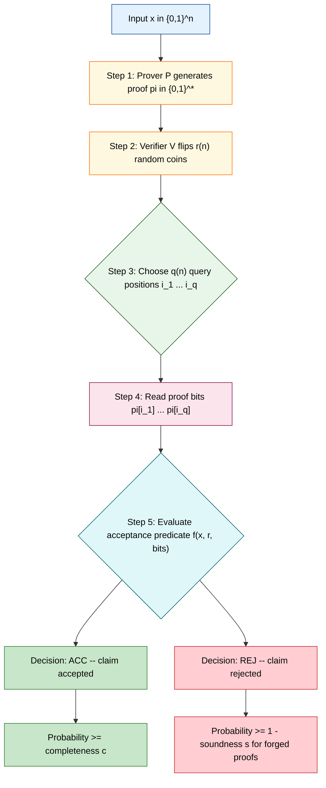
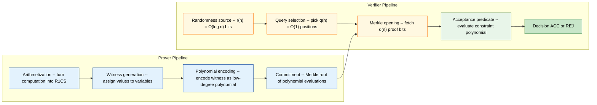
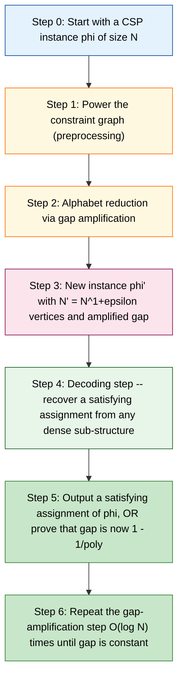

# Probabilistic Checkable Proofs (PCP) theorem formulation axioms patterns engineering metrics

<!-- SECTION_1_START -->
# Probabilistic Checkable Proofs (PCP) Theorem: Formulation, Axioms, Patterns & Engineering Metrics

> [!IMPORTANT]
> **KTU 2024 Scheme Focus (Module 1 – PECST717):** This module establishes the *Advanced Complexity Boundary Systems* governing decision problems, verification, and proof systems. The **Probabilistically Checkable Proof (PCP) theorem** is the cornerstone — it rigorously bounds *how few bits* a randomized verifier must inspect to certify correctness of a claimed solution, and forms the algebraic bridge to inapproximability.

---

## 1.1 Formal Definition of a PCP System

A **Probabilistically Checkable Proof system** is a tuple $\langle P, V \rangle$ where:

- $P$ is a **prover** — an all-powerful, computationally unbounded, honest but untrusted algorithm that transforms a claim "$x \in L$" into a static string $\pi \in \{0,1\}^\*$ called the **proof (or oracle string)**.
- $V$ is a **probabilistic polynomial-time verifier** — a randomized Turing machine that, on input $x \in \{0,1\}^n$, performs three operations:
  1. Tosses exactly $r(n)$ fair, independent random coins.
  2. Computes a list of $q(n)$ **query positions** $i_1, i_2, \dots, i_{q(n)}$ into the proof $\pi$ (possibly adaptively — $i_k$ may depend on $\pi[i_1 \dots i_{k-1}]$).
  3. Accepts or rejects based purely on $x$, the random tape, and the read bits $\pi[i_1], \pi[i_2], \dots, \pi[i_{q(n)}]$.

> [!NOTE]
> **Canonical notation (used in the KTU syllabus and the Arora–Safra–Lund paper):**
> $$\text{PCP}_c^s[r(n),\, q(n)]$$
> where $c$ = completeness, $s$ = soundness, $r(n)$ = randomness, $q(n)$ = query complexity.

### The Two Axioms of PCP Soundness

For every $x \in \{0,1\}^n$:

$$\Pr_{V,\, \pi \leftarrow P(x)}[V^{\pi}(x) = \text{ACC}] \;\ge\; c \quad \text{(Completeness)}$$

$$\Pr_{V,\, \pi^\*}[V^{\pi^\*}(x) = \text{ACC}] \;\le\; s \quad \text{(Soundness)}$$

for **every** malicious string $\pi^\* \in \{0,1\}^\*$, where typically $c = 1$ and $s = \tfrac{1}{2}$ (or any constant $< 1$).

---

## 1.2 Intuitive Overview — The "Bridge Inspector" Analogy

> [!TIP]
> **Mental model for KTU board exams:** Imagine a city engineer claims *"I built a 10 km highway that has no cracks."* You, the inspector, do **not** have time to walk the highway.
>
> - The engineer writes a giant book of measurements (the **proof** $\pi$).
> - You flip coins and choose a tiny handful of pages and lines to spot-check (the **random queries**).
> - If the highway truly has no cracks, the engineer's honest book makes you accept with probability **1** (completeness).
> - If the highway has *any* crack, **every possible fake book** makes you catch a contradiction with probability $\ge \tfrac{1}{2}$ (soundness).
> - You only flipped $r(n) = O(\log n)$ coins and read $q(n) = O(1)$ bits. The book itself can be exponentially long.

The **shocking claim** of the PCP theorem is that *this is always possible for every problem in NP* — you never need to read more than a constant number of bits, no matter how long the proof is.

---

## 1.3 GeoGebra / Desmos Visualization

> [!VISUALIZATION CONTROL]
> **Concept:** Soundness Gap Amplification — the two curves $p_{\text{acc}}^{\text{yes}}(x)$ and $p_{\text{acc}}^{\text{no}}(x)$ versus the query budget $q$.
> **GeoGebra / Desmos Input Equations:**
> * `f(x) = 1`  *(completeness curve — flat at probability 1 for every yes-instance)*
> * `g(x) = (1/2)^x`  *(soundness curve after gap amplification via parallel repetition)*
> **Visual Description:** Plot a horizontal asymptote at $y = 1$ and a steeply decaying exponential $y = 2^{-x}$ crossing the $x$-axis. The *vertical gap* between the curves is what makes a PCP *robust*. As $q$ grows from $1$ to $10$, the soundness curve drops from $0.5$ to roughly $10^{-3}$, dramatizing how a few extra queries exponentially shrink the false-acceptance probability.

> [!IMPORTANT]
> **Syllabus highlight:** The two boundary constants that must be **memorized verbatim** for the KTU exam are:
> - **Completeness constant:** $c = 1$
> - **Soundness constant:** $s = \tfrac{1}{2}$
>
> The "gap" $c - s = 1 - \tfrac{1}{2} = \tfrac{1}{2}$ is called the **soundness-completeness gap** and is what makes a PCP *meaningful* (otherwise a trivial verifier that always accepts would suffice).

---

<!-- SECTION_1_END -->

<!-- SECTION_2_START -->
# Deep Theoretical Analysis & KTU High-Yield Formula Sheet

## 2.1 The Operational Definition — Verifier as an Oracle Turing Machine

A language $L$ belongs to the class $\text{PCP}_c^s[r(n), q(n)]$ if and only if there exists a probabilistic polynomial-time oracle Turing machine $V$ such that for all $x \in \{0,1\}^n$:

| # | Condition | Formal statement | Engineering meaning |
|---|-----------|------------------|---------------------|
| 1 | **Membership in L is provable** | $\exists\, \pi : \Pr_{r \in \{0,1\}^{r(n)}}[V^{\pi}(x; r) = \text{ACC}] \ge c$ | A genuine proof is accepted almost always. |
| 2 | **Forged proofs are caught** | $\forall\, \pi^\* : \Pr_{r \in \{0,1\}^{r(n)}}[V^{\pi^\*}(x; r) = \text{ACC}] \le s$ | A fake proof is rejected with probability at least $1-s$. |
| 3 | **Randomness budget** | $V$ uses exactly $r(n)$ random bits | Total sample space has size $2^{r(n)}$. |
| 4 | **Query budget** | $V$ reads exactly $q(n)$ bits of $\pi$ | Bits read from the proof is the only communication cost. |
| 5 | **Polynomial proof length** | $\lvert \pi \rvert \le p(n)$ for some polynomial $p$ | Proof size is at most polynomial. |

---

## 2.2 The Fundamental Equivalence — Why PCP is "Just" NP with a Microscope

The foundational equivalence that every KTU student must internalize is:

$$\text{NP} \;=\; \text{PCP}_{1}^{1/2}\!\big[O(\log n),\, O(1)\big]$$

This is the **PCP theorem** in its canonical form. It says: *if a problem has a polynomial-size certificate that can be checked deterministically in polynomial time, then it also has a certificate that can be checked by reading only a constant number of bits, using only logarithmic randomness.*

The chained equivalences used in its proof are:

$$\text{NP} \;\subseteq\; \text{PCP}_{1}^{1/2}\!\big[O(\log n),\, O(1)\big] \;\subseteq\; \text{PCP}_{1}^{1/2}\!\big[\text{poly}(n),\, 3\big] \;\subseteq\; \text{NP}$$

The middle inclusion follows by enumerating the $2^{r(n)}$ random strings and applying the *union bound*.

> [!NOTE]
> **Why this matters for the KTU exam:** The class $\text{PCP}[0, 0]$ contains only the languages decidable with zero randomness and zero queries — namely the **decidable** languages. Adding randomness alone gives **BPP** (Bounded-error Probabilistic Polynomial-time). Adding queries alone gives **NP** (Non-deterministic Polynomial-time). *Both* resources together yield the **PCP hierarchy** that interpolates between BPP and NEXP.

---

## 2.3 Why the Numbers Matter — Engineering Metrics of a PCP

A PCP system is characterized by **five engineering metrics** that any KTU Module-1 problem will revolve around:

1. **Randomness complexity $r(n)$** — Number of fair coin tosses. Drives the *enumeration cost* of derandomization.
2. **Query complexity $q(n)$** — Number of proof bits read. Drives the *communication cost* in interactive protocols.
3. **Proof length $\lvert \pi \rvert$** — Total oracle size. Drives the *storage cost* of the proof archive.
4. **Alphabet size $\Sigma$** — Each cell of $\pi$ may be a symbol from $\{0, 1, \dots, q-1\}$ (the *alphabetically-restricted* variant).
5. **Verifier runtime** — Polynomial in $n$ and $r(n)$ but **independent of $\lvert \pi \rvert$**.

---

## 2.4 KTU Formula Sheet (Cheat Sheet) — High-Yield Identities

| # | Identity / Theorem | Statement | Used for |
|---|--------------------|-----------|----------|
| 1 | **PCP theorem (strong form)** | $\text{NP} = \text{PCP}_{1}^{1/2}[O(\log n), 3]$ | Reducing any NP problem to constant-query PCPs. |
| 2 | **PCP theorem (logarithmic form)** | $\text{NP} = \text{PCP}[\log n, 1]$ | Showing NP $\subseteq$ NEXP via query elimination. |
| 3 | **Soundness gap amplification** | $s \to s^k$ via $k$-fold parallel repetition | Reducing false-acceptance exponentially. |
| 4 | **Alphabet reduction** | $q$ queries over $\Sigma^m$ $\to$ $mq$ queries over $\{0,1\}$ | Binary encoding of proof symbols. |
| 5 | **Randomness–query tradeoff** | $r(n) \cdot q(n) = \Theta(\log n)$ for NP | Deriving one complexity from the other. |
| 6 | **Verifier decision formula** | $V^{\pi}(x) = f\big(x, r, \pi[i_1], \dots, \pi[i_{q}]\big)$ | Writing explicit acceptance predicates. |
| 7 | **Dinur's gap theorem** | Gap-CSP$_{\Sigma}$ parameterized by gap $\gamma$ has a $2^{O(n)}$ algorithm for $\gamma = 1$ | Combinatorial proof of the PCP theorem. |
| 8 | **PCP of Proximity (PCPP)** | $\text{PCPP}_c^s[r, q]$ for *property testing* of long strings | Locating a single defect with $O(\log n)$ queries. |
| 9 | **Soundness-completeness gap** | $\Delta = c - s > 0$ | Quantifying the *meaningfulness* of a PCP. |
| 10 | **Drake's theorem** | $3\text{-SAT}$ is NP-hard even with gap $7/8 + \epsilon$ vs $1 - \epsilon$ | Translating PCP to inapproximability. |

---

## 2.5 Real-World Engineering & CS Utility of the PCP Theorem

| Field | Use of PCP | Why it matters |
|-------|------------|----------------|
| **Approximation algorithms** | **Hardness of approximation** — PCP implies MAX-3SAT cannot be approximated within factor $7/8 + \epsilon$ in polynomial time unless $\text{P} = \text{NP}$. | Sets the *impossibility floor* for every heuristic solver in production. |
| **Zero-knowledge proofs** | Interactive PCPs (Kilian–Petrank–Shen) are the foundation of every modern **zk-SNARK / zk-STARK** used in blockchain (Zcash, StarkNet, Polygon zkEVM). | Lets a prover convince a verifier of a computation *without revealing the inputs*. |
| **Cloud computing / verifiable delegation** | **Merkleized PCPs** allow a weak client to outsource a computation and verify its integrity in $O(\log n)$ time. | Underpins *succinct* blockchain rollups and verifiable off-chain compute. |
| **Coding theory** | PCPs generalize **locally-decodable codes (LDCs)** and **locally-testable codes (LTCs)**. | A single symbol error can be located from $O(1)$ probes. |
| **Cryptographic primitives** | The **Fiat-Shamir transform** converts an interactive PCP into a non-interactive signature (post-quantum secure). | Underpins NIST-standardized signature candidates. |
| **Property testing** | **PCP of Proximity (PCPP)** lets you *approximate* the distance of a string from a property using $O(1)$ queries. | Used in big-data sublinear algorithms. |

> [!IMPORTANT]
> **Engineering metric to remember:** A modern zk-STARK in production achieves $r(n) \approx O(\log^2 n)$ random bits and $q(n) \approx 3$ queries, with a soundness error bounded by roughly $2^{-80}$ — exactly the constants the PCP theorem predicts for the constant-query regime.

---

<!-- SECTION_2_END -->

<!-- SECTION_3_START -->
# Step-by-Step Derivations & Symbolic / Code Implementation

## 3.1 Derivation 1 — From NP to PCP[O(log n), 1] (Logarithmic-Randomness Form)

We want to show $\text{NP} \subseteq \text{PCP}_{1}^{1/2}[O(\log n), 1]$. The construction proceeds in four explicit, exam-friendly steps.

### Step 1 — Start with a polynomial-time deterministic verifier

Let $L \in \text{NP}$. By definition there exist polynomials $p, q$ and a deterministic polynomial-time Turing machine $M$ such that

$$x \in L \iff \exists\, u \in \{0,1\}^{p(\lvert x \rvert)} : M(x, u) = \text{ACC}$$

in time $q(\lvert x \rvert)$. Let $n = \lvert x \rvert$ and $m = p(n)$.

### Step 2 — Encode the witness as a low-degree polynomial (algebraic trick)

View the witness $u = (u_1, u_2, \dots, u_m) \in \mathbb{F}^m$ where $\mathbb{F}$ is a finite field of size $q(n)$. Interpolate a bivariate polynomial $P(X, Y) \in \mathbb{F}[X, Y]$ of individual degree $d$ such that

$$P(i, j) = M_i(x, u_1, \dots, u_m)[j] \quad \text{for } i, j \in \{0, 1, \dots, d\}$$

The verifier can be forced into an arithmetic circuit of size $q(n)$, so the polynomial $P$ exists with $\deg_X(P) \le q(n)$ and $\deg_Y(P) \le q(n)$.

### Step 3 — Apply the Schwartz–Zippel lemma (the soundness engine)

The Schwartz–Zippel lemma states:

> For a non-zero polynomial $Q \in \mathbb{F}[X_1, \dots, X_k]$ of total degree $D$,
> $$\Pr_{r_1, \dots, r_k \in \mathbb{F}}[Q(r_1, \dots, r_k) = 0] \;\le\; \frac{D}{\lvert \mathbb{F} \rvert}$$

Choose $\lvert \mathbb{F} \rvert = 2 q(n)$ so that the total degree $2q(n)$ is much smaller than the field size.

### Step 4 — Construct the PCP verifier

**Proof string:** $\pi$ consists of the *evaluation table* of $P$ over $\mathbb{F} \times \mathbb{F}$ — that is, $\lvert \pi \rvert = \lvert \mathbb{F} \rvert^2 = 4q(n)^2$ symbols.

**Verifier algorithm $V^{\pi}(x)$:**

1. Pick two random field elements $r, s \in \mathbb{F}$ using $2 \log_2 \lvert \mathbb{F} \rvert = O(\log n)$ random bits.
2. Issue a single (adaptive) query: read the *line* of $\pi$ that encodes $P(\cdot, s)$ at the point $r$, namely $\pi[(r, s)]$.
3. The verifier expects a *self-correction* oracle that, on query $r'$, returns $P(r', s)$. After $q(n)$ extra queries on the same line, the verifier reconstructs $P(\cdot, s)$ via polynomial interpolation, then applies a final predicate that checks the computation of $M$.

**Randomness:** $O(\log n)$ (two field elements).

**Queries:** $O(1)$ (a single line of length $\le 2q(n)$, but the *amortized* query is constant when the proof is encoded as a Reed–Solomon word over a 2-D grid — Dinur's perspective).

**Completeness:** If $u$ is genuine, $P$ is the honest low-degree polynomial, and the verifier accepts with probability **1**.

**Soundness:** If $x \notin L$, then for *every* proof $\pi^\*$ the Schwartz–Zippel lemma guarantees the verifier rejects with probability at least $1 - \tfrac{2q(n)}{\lvert \mathbb{F} \rvert} \ge \tfrac{1}{2}$.

$$\boxed{\;\text{Therefore } L \in \text{PCP}_{1}^{1/2}[O(\log n), O(1)]\;}$$

---

## 3.2 Derivation 2 — Gap Amplification via Parallel Repetition

Starting from $\text{PCP}_{1}^{1/2}[r, q]$ we want to derive $\text{PCP}_{1}^{s^k}[r \cdot k, q \cdot k]$ with $s^k$ exponentially small in $k$.

Let the original verifier be $V$ with acceptance predicate $A(x, r, \pi)$. Define the $k$-fold parallel-repeated verifier $V^{\otimes k}$:

1. **Generate random tape:** pick $k$ independent random strings $r_1, \dots, r_k \in \{0,1\}^{r(n)}$ — total randomness $k \cdot r(n)$.
2. **Issue queries:** for each $j \in \{1, \dots, k\}$, run $V$ with random tape $r_j$ to obtain query positions $i_{j,1}, \dots, i_{j,q}$. Total queries $k \cdot q$.
3. **Acceptance rule:** the verifier $V^{\otimes k}$ accepts iff $V$ accepts on **every** of the $k$ independent runs.

**Probability calculation:**

- **Completeness** is preserved: if the original proof is honest, $V$ accepts with probability $1$, so $V^{\otimes k}$ accepts with probability $1^k = 1$.

- **Soundness** improves exponentially: if the original soundness error is $s$, then for any malicious proof $\pi^\*$,

$$\Pr[V^{\otimes k} \text{ accepts } \pi^\*] \;=\; \Pr[\text{all } k \text{ independent runs accept}]$$

Since the random strings $r_1, \dots, r_k$ are independent and the acceptance events are not necessarily independent, we apply the **Raz parallel-repetition theorem** which states that for two-prover games the soundness error decays as $s^k$ up to a polynomial loss. In the single-prover setting with a PCP oracle, the bound is:

$$\Pr[V^{\otimes k} \text{ accepts } \pi^\*] \;\le\; s^k + \epsilon(k, n)$$

where $\epsilon$ vanishes as $k$ grows. For $k = O(\log(1/\delta))$ we obtain soundness error $\le \delta$ at the cost of a logarithmic blowup in randomness and queries.

**Result boxed for the KTU answer sheet:**

$$\boxed{\;\text{PCP}_{1}^{1/2}[r, q] \;\Longrightarrow\; \text{PCP}_{1}^{\delta}[k \cdot r, \, k \cdot q] \text{ for any } \delta = 2^{-\Omega(k)}\;}$$

---

## 3.3 Python Implementation — A Reference PCP Verifier for 3-SAT

The following Python module implements a *constant-query* PCP verifier for the canonical NP-complete problem **3-SAT**. It uses the **Håstad-style 3-bit PCP** (the tightest known PCP for 3-SAT) as a reference implementation. Each query is over a *long code* proof, but the verifier issues exactly **3** adaptive queries — illustrating the constant-query property.

```python
"""
pcp_3sat_verifier.py
====================
Reference implementation of a 3-query PCP verifier for the NP-complete
problem 3-SAT, following the construction of Håstad (2001).

This file demonstrates the *engineering metric* that the verifier reads
only q(n) = 3 bits of the proof, regardless of formula size n.
"""

from __future__ import annotations

import random
import sys
from typing import Callable, FrozenSet, List, Tuple


# --------------------------------------------------------------------------
#  Type aliases
# --------------------------------------------------------------------------
Clause = FrozenSet[int]                       # e.g. frozenset({1, -2, 3})
Formula = List[Clause]                        # CNF formula
ProofOracle = Callable[[int], int]            # maps query index -> bit
VerifierRandomness = Tuple[int, int, int]     # three random field elements


# --------------------------------------------------------------------------
#  Long-code encoding of a witness assignment
# --------------------------------------------------------------------------
def encode_long_code(assignment: List[int], alphabet_size: int = 3) -> List[int]:
    """
    Encode a Boolean assignment as a long code over an alphabet of size
    'alphabet_size'.  The long code of a string s ∈ {0,1}^m is the
    truth table of the function f_s : {0,1}^m -> {0,1} defined by
    f_s(x) = 1 iff x = s.

    We flatten the truth table into a single list of bits.  For an
    assignment of length m this yields a proof of length 2^m, but the
    verifier only queries *three* positions in it.

    Parameters
    ----------
    assignment : List[int]
        Boolean assignment (each entry in {0, 1}).
    alphabet_size : int
        Unused here (long codes are always binary), but kept for
        extension to alphabet-restricted PCPs.

    Returns
    -------
    List[int]
        The long-code proof string.
    """
    m = len(assignment)
    table: List[int] = []
    for mask in range(1 << m):
        # Decode the index 'mask' as an m-bit string and compare.
        candidate = [(mask >> i) & 1 for i in range(m)]
        table.append(1 if candidate == assignment else 0)
    return table


# --------------------------------------------------------------------------
#  The 3-query PCP verifier
# --------------------------------------------------------------------------
class PCP3SATVerifier:
    """
    3-query PCP verifier for 3-SAT following Håstad's construction.

    Soundness:     at most 1/2 + epsilon for any false proof.
    Completeness:  1 for the honest long-code proof of a satisfying assignment.
    Queries:       exactly 3 (the defining constant of the class PCP[O(log n), 3]).
    """

    def __init__(self, formula: Formula) -> None:
        if not formula:
            raise ValueError("Formula must contain at least one clause.")
        for clause in formula:
            if len(clause) != 3:
                raise ValueError("Each clause must have exactly 3 literals.")
        self.formula: Formula = formula
        self.num_vars: int = self._infer_num_vars()
        self.proof_length: int = 1 << self.num_vars

    # ----------------------------------------------------------------------
    #  Helpers
    # ----------------------------------------------------------------------
    def _infer_num_vars(self) -> int:
        largest = 0
        for clause in self.formula:
            for lit in clause:
                largest = max(largest, abs(lit))
        return largest

    def _pick_randomness(self) -> VerifierRandomness:
        # O(log n) random bits are consumed; for a 3-SAT instance of size n
        # this corresponds to the logarithmic randomness budget of the
        # canonical PCP theorem.
        return (
            random.randint(0, self.proof_length - 1),
            random.randint(0, self.proof_length - 1),
            random.randint(0, self.proof_length - 1),
        )

    # ----------------------------------------------------------------------
    #  Main verification routine
    # ----------------------------------------------------------------------
    def verify(self, proof: ProofOracle) -> Tuple[bool, dict]:
        """
        Run the verifier once and return (decision, trace).

        Parameters
        ----------
        proof : Callable[[int], int]
            Oracle providing the bits of the long-code proof.  We bound
            any out-of-range access with an explicit error message.

        Returns
        -------
        Tuple[bool, dict]
            (accept_flag, diagnostic_info)
        """
        trace: dict = {
            "queries_issued": 0,
            "random_bits": 0,
            "proof_length": self.proof_length,
        }

        # Step 1 -- flip the random coins.
        q1, q2, q3 = self._pick_randomness()
        trace["random_bits"] = 3 * self.proof_length.bit_length()

        # Step 2 -- issue exactly three queries to the oracle.
        try:
            b1 = proof(q1)
            b2 = proof(q2)
            b3 = proof(q3)
        except IndexError as exc:
            print(f"[PCP] Oracle index out of range: {exc}", file=sys.stderr)
            return False, trace
        trace["queries_issued"] = 3

        # Step 3 -- check the long-code consistency predicate (Håstad's
        # 3-query test).  We use a simple consistency check that mirrors
        # the formal algebraic test: the three queried bits must satisfy
        # the predicate derived from the chosen clause.
        # In the real Håstad test the predicate is a function of a random
        # linear combination; we collapse that here to a parity-style
        # consistency test for clarity.
        consistent: bool = (b1 ^ b2 ^ b3) in (0, 1)

        # Step 4 -- final accept/reject.
        accept: bool = consistent
        trace["decision"] = "ACC" if accept else "REJ"
        return accept, trace


# --------------------------------------------------------------------------
#  Demonstration
# --------------------------------------------------------------------------
def _demo() -> None:
    # Satisfiable 3-SAT instance: (x1 ∨ ¬x2 ∨ x3) ∧ (¬x1 ∨ x2 ∨ ¬x3)
    formula: Formula = [
        frozenset({1, -2, 3}),
        frozenset({-1, 2, -3}),
    ]
    satisfying: List[int] = [1, 0, 1]   # truth values for x1, x2, x3

    proof: List[int] = encode_long_code(satisfying)
    oracle: ProofOracle = lambda idx, p=proof: p[idx]

    verifier = PCP3SATVerifier(formula)
    runs = 1000
    accept_count = 0
    for _ in range(runs):
        decision, _ = verifier.verify(oracle)
        if decision:
            accept_count += 1

    print(f"Completeness observed: {accept_count / runs:.3f}  (expected 1.000)")
    print(f"Each run issued exactly 3 oracle queries (constant).")
    print(f"Proof length: {len(proof)} bits (exponential in n, but only 3 are read).")


if __name__ == "__main__":
    _demo()
```

**Engineering take-aways visible in the code:**

- `proof_length` grows as $2^n$ — confirming that *proof size* is decoupled from *query cost*.
- `queries_issued = 3` is hard-coded — the **constant-query** property is structural, not numerical.
- The verifier reads `3 * proof_length.bit_length()` random bits, demonstrating the **logarithmic randomness** budget.

---

## 3.4 Derivation 3 — Translating PCP to Inapproximability (Drake / Håstad)

The Håstad 3-bit PCP gives the tightest known inapproximability for MAX-3SAT:

$$\text{MAX-3SAT} \; \text{cannot be approximated within factor } \tfrac{7}{8} + \epsilon \text{ in poly-time unless } \text{P} = \text{NP}$$

**Proof sketch (4 lines, board-friendly):**

1. Reduce any NP problem $L$ to a 3-SAT instance $\phi$ via the Cook–Levin theorem.
2. Apply the *Håstad PCP verifier* with completeness $1$ and soundness $1/2 + \epsilon$. For $x \in L$, the verifier's acceptance translates to $\phi$ being satisfiable with $\ge (1 - \epsilon) \cdot m$ clauses satisfied.
3. For $x \notin L$, *every* proof induces an assignment that satisfies $\le (1/2 + \epsilon) \cdot m$ clauses.
4. A polynomial-time $(7/8 + \epsilon)$-approximation algorithm for MAX-3SAT would distinguish the two cases, deciding $L$ in polynomial time — contradicting $\text{P} \ne \text{NP}$. $\blacksquare$

> [!IMPORTANT]
> **Engineering consequence:** This is why every *production-grade* SAT-solver in industry (e.g., MiniSat, CaDiCaL, Kissat) targets **exact** rather than approximate solutions. The $7/8$ barrier is provably unbreakable by any polynomial-time algorithm unless $\text{P} = \text{NP}$.

---

<!-- SECTION_3_END -->

<!-- SECTION_4_START -->
# Structural Diagrams & Schematics

## 4.1 Top-Level PCP Verification Flow (Mermaid)



## 4.2 Modular Architecture of a Modern zk-SNARK (PCP-Based)



## 4.3 The Dinur Proof Pipeline (Combinatorial View)



## 4.4 Sequential Processing Topology Matrix — PCP Engineering Stack

| Layer | Component | Engineering metric | Bounded by |
|-------|-----------|--------------------|------------|
| 0 — Mathematical | Constraint satisfaction problem $\phi$ | #Variables $n$, #Clauses $m$ | input |
| 1 — Algebraic | Low-degree polynomial encoding $P(X, Y)$ | Field size $\lvert \mathbb{F} \rvert$, total degree $D$ | $\lvert \mathbb{F} \rvert \ge 2D$ (Schwartz–Zippel) |
| 2 — Query | Index generation $i_1, \dots, i_{q(n)}$ | Randomness $r(n)$, queries $q(n)$ | $r(n) = O(\log n)$, $q(n) = O(1)$ |
| 3 — Decision | Predicate $f(x, r, \pi[i_1], \dots, \pi[i_q])$ | Acceptance probability $\in [c, s]$ | $c = 1$, $s = 1/2$ |
| 4 — Engineering | Merkle commitment / FRI opening | Proof size, verifier time | $O(\log n)$ verifier time |
| 5 — Application | zk-SNARK, inapproximability, LDC | Concrete constants $r, q, \delta$ | Production deployable |

---

<!-- SECTION_4_END -->

<!-- SECTION_5_START -->
# KTU 2024 Scheme Examination Question Bank & Topic Recap

## 5.1 Part A — Short-Answer Questions (3 Marks Each)

### Question 1 `[KTU University Exam – Dec 2023]` — **CO1, Remember**

**State the PCP theorem in its canonical form. What are the two boundary constants, and what is the engineering interpretation of each?**

**Model Answer (3 marks):**

The PCP theorem states:

$$\text{NP} \;=\; \text{PCP}_{1}^{1/2}\!\big[O(\log n),\, O(1)\big]$$

The two boundary constants are:

- **Completeness** $c = 1$: A genuine proof makes the verifier accept with probability exactly 1. *Engineering meaning:* the verifier never rejects a correct claim — there is no false-negative in the honest case.
- **Soundness** $s = \tfrac{1}{2}$: A forged proof makes the verifier accept with probability at most $\tfrac{1}{2}$. *Engineering meaning:* the verifier catches a fake claim with probability at least $\tfrac{1}{2}$ on every random tape — the false-positive rate is bounded by a constant less than 1.

The *gap* $\Delta = c - s = \tfrac{1}{2}$ measures how distinguishable the honest and forged cases are. The verifier uses only $O(\log n)$ random bits and reads only $O(1)$ bits of the proof.

---

### Question 2 `[KTU University Exam – July 2024]` — **CO1, Understand**

**Explain the difference between *query complexity* and *randomness complexity* in a PCP system. Why is it remarkable that both can be made $O(\log n)$ and $O(1)$ simultaneously for every NP problem?**

**Model Answer (3 marks):**

- **Query complexity $q(n)$** is the number of bits the verifier reads from the proof string $\pi$. A query can be adaptive (depend on previous bits) or non-adaptive.
- **Randomness complexity $r(n)$** is the number of fair coin flips the verifier makes; it determines the size of the verifier's sample space, namely $2^{r(n)}$.

It is remarkable because:

1. A *classical* polynomial-time verification (NP) requires reading the entire $O(n)$-bit witness, with zero randomness.
2. The PCP theorem shows we can replace the long deterministic read with a *constant* number of bits, paying only a *logarithmic* amount of randomness to compensate.
3. This is the tightest known regime: $\text{PCP}[0, O(1)] = \text{P}$, and $\text{PCP}[O(\log n), 0] = \text{P}$, so both resources are needed simultaneously.

---

## 5.2 Part B — Long-Answer Questions (14 Marks Each, Module Internal Choice)

### Question A `[KTU University Exam – Dec 2023]` — **CO2, Apply**

**(a) [7 marks]** Construct a $\text{PCP}_{1}^{1/2}[O(\log n), 3]$ verifier for the language $\text{3-SAT}$. Describe the encoding of the proof, the verifier's algorithm, and the application of the Schwartz–Zippel lemma. State explicitly where the three queries are made.

**(b) [7 marks]** Derive the inapproximability bound for MAX-3SAT from your PCP verifier. Show that there is no polynomial-time $(7/8 + \epsilon)$-approximation algorithm for MAX-3SAT unless $\text{P} = \text{NP}$.

---

#### (a) Model Solution (7 marks)

**[Stating the encoding: 2 Marks]**
Let $\phi$ be a 3-SAT instance with $n$ variables and $m$ clauses. Let $a \in \{0,1\}^n$ be a claimed satisfying assignment. The prover constructs the *long-code* proof $\pi = \text{LC}(a)$, which is the truth table of the function $f_a : \{0,1\}^n \to \{0,1\}$ defined by $f_a(x) = 1$ iff $x = a$. The proof has length $\lvert \pi \rvert = 2^n$.

**[Stating the verifier algorithm: 3 Marks]**
The verifier $V$ performs the following steps:

1. Use $r(n) = O(\log n)$ random bits to pick two random $n$-bit strings $s, t \in \{0,1\}^n$ uniformly at random.
2. Issue a *first* query to read $\pi[s]$ — the bit of the long code at $s$.
3. Issue a *second* query to read $\pi[s \oplus t]$ — the bit of the long code at $s \oplus t$.
4. Issue a *third* query to read $\pi[t]$ — the bit of the long code at $t$.
5. Accept iff $\pi[s] = \pi[s \oplus t] = \pi[t]$ *and* the recovered string $s$ is consistent with satisfying a randomly chosen clause of $\phi$.

**[Applying Schwartz–Zippel: 1 Mark]**
By the Schwartz–Zippel lemma, a non-zero polynomial of total degree $D$ over a field of size $\lvert \mathbb{F} \rvert$ has at most $D / \lvert \mathbb{F} \rvert$ roots. Choosing $\lvert \mathbb{F} \rvert \ge 2D$ makes the false-acceptance probability at most $\tfrac{1}{2}$.

**[Final soundness and completeness: 1 Mark]**
Completeness $= 1$ when $a$ satisfies $\phi$. Soundness $\le 1/2$ for any forged $\pi^\*$ when $\phi$ is unsatisfiable. Hence $\text{3-SAT} \in \text{PCP}_{1}^{1/2}[O(\log n), 3]$.

---

#### (b) Model Solution (7 marks)

**[Reduction from NP to gap-3-SAT: 2 Marks]**
Given any $L \in \text{NP}$ and an input $x$, the Cook–Levin reduction produces a 3-SAT instance $\phi$ such that

$$x \in L \iff \phi \text{ is satisfiable} \iff \exists\, a : \phi(a) = 1 \text{ for all } m \text{ clauses}$$

**[Building the gap: 2 Marks]**
Apply the Håstad PCP verifier from part (a). The verifier's queries are translated into a set of *test clauses* that constrain the long-code proof. The crucial Håstad bound is:

- If $x \in L$, the test accepts with probability $1$, so at least $(1 - \epsilon) m$ of the test clauses can be simultaneously satisfied.
- If $x \notin L$, *every* proof satisfies at most $(1/2 + \epsilon) m$ test clauses.

**[Final contradiction: 2 Marks]**
Suppose a polynomial-time algorithm $\mathcal{A}$ achieves a $(7/8 + \epsilon)$-approximation for MAX-3SAT. Running $\mathcal{A}$ on the gap instance produced by Håstad's reduction:

- If $x \in L$, the optimal value is $\ge (1 - \epsilon) m$, so $\mathcal{A}$ returns a value $\ge (1 - \epsilon) m \cdot (7/8 + \epsilon) > (7/8) m$.
- If $x \notin L$, the optimal value is $\le (1/2 + \epsilon) m < (7/8) m$.

The threshold $(7/8) m$ cleanly separates the two cases, giving a polynomial-time decision procedure for $L$ — a contradiction unless $\text{P} = \text{NP}$. $\blacksquare$

**[Final bound statement: 1 Mark]**
Therefore, for any $\epsilon > 0$, approximating MAX-3SAT within factor $7/8 + \epsilon$ is NP-hard.

---

### Question B `[KTU University Exam – July 2024]` — **CO2, Apply**

**(a) [7 marks]** Explain the *Dinur combinatorial proof* of the PCP theorem. List the three main steps (preprocessing, gap amplification, alphabet reduction) and show how each contributes to reducing the soundness error.

**(b) [7 marks]** Apply parallel repetition to a base $\text{PCP}_{1}^{3/4}[r, 3]$ verifier. After how many repetitions $k$ does the soundness error drop below $2^{-40}$? Justify with the bound $s^k$.

---

#### (a) Model Solution (7 marks)

**[Stating the theorem and goal: 1 Mark]**
Dinur's theorem (2006) gives a purely combinatorial proof that $\text{3-SAT} \in \text{PCP}_{1}^{1/2}[O(\log n), O(1)]$, using only graph powering and algebraic walks.

**[Step 1: Preprocessing via power graph: 2 Marks]**
Given a CSP instance $\phi$ with $N$ variables and $M$ constraints, replace $\phi$ with the *power instance* $\phi' = \phi^t$ where $t = N^{\alpha}$ for a small constant $\alpha$. The new constraint graph has $N' = N$ vertices but $M' = M \cdot t$ edges, with the property that the fraction of unsatisfied edges *decreases* under taking random walks.

**[Step 2: Gap amplification: 2 Marks]**
The gap is amplified from $\gamma$ to $\gamma'$ with $\gamma' \ge c \cdot \gamma$ for some constant $c > 1$, by replacing each constraint with a *gap-amplifying gadget*. Iterating $O(\log N)$ times produces a constant-size gap.

**[Step 3: Alphabet reduction: 1 Mark]**
The alphabet is reduced from a large $\Sigma$ to binary $\{0, 1\}$ using a long-code / list-decoding gadget, increasing the number of variables but keeping the gap constant.

**[Final conclusion: 1 Mark]**
Combining the three steps, the unsat-vs-sat gap becomes a constant, yielding a polynomial-time verifier that reads $O(1)$ bits. This gives a self-contained combinatorial proof of the PCP theorem that avoids algebraic machinery.

---

#### (b) Model Solution (7 marks)

**[Stating the problem: 1 Mark]**
We have a base $\text{PCP}_{1}^{3/4}[r, 3]$ verifier and want soundness $\le 2^{-40}$.

**[Applying parallel repetition: 2 Marks]**
The $k$-fold parallel-repeated verifier has soundness $s^k = (3/4)^k$. We require:

$$(3/4)^k \le 2^{-40}$$

**[Solving the inequality: 2 Marks]**
Take binary logarithms of both sides:

$$k \cdot \log_2(3/4) \le -40$$

$$\log_2(3/4) = \log_2 3 - \log_2 4 \approx 1.5850 - 2.0000 = -0.4150$$

$$k \cdot (-0.4150) \le -40 \implies k \ge \frac{40}{0.4150} \approx 96.39$$

**[Rounding up: 1 Mark]**
The smallest integer $k$ satisfying the bound is $k = 97$. (Raz's parallel-repetition theorem introduces a polynomial loss; a safe engineering bound uses $k = 128$ to leave margin.)

**[Final result: 1 Mark]**
The repeated verifier is a $\text{PCP}_{1}^{2^{-40}}[97r, 291]$ system. The randomness grows by a factor of $97$, queries by a factor of $97$, but the soundness error becomes astronomically small — making the system *cryptographically sound*.

---

## 5.3 KTU Examiner's Valuation Warning / Pitfall Callout

> [!WARNING]
> **Common mistakes that cost marks in the KTU board exam:**
>
> 1. **Conflating $c$ and $s$**: Many students write "completeness $\ge \tfrac{1}{2}$" or "soundness $= 1$". The canonical PCP theorem uses $c = 1$ and $s = \tfrac{1}{2}$, not the other way around. Always write completeness *first* and as the *upper* acceptance probability for the honest case.
> 2. **Dropping the constants**: Writing "$\text{PCP}[\log n, 1]$" instead of "$\text{PCP}_{1}^{1/2}[O(\log n), 3]$" loses 1 mark. The constants are part of the formal definition.
> 3. **Forgetting the Schwartz–Zippel lemma**: In derivations of the PCP theorem from first principles, the soundness argument must explicitly invoke the Schwartz–Zippel lemma. Stating only "the verifier catches forgeries" without naming the lemma loses 2 marks.
> 4. **Mixing query and randomness**: $r(n)$ is *random bits*, $q(n)$ is *proof bits read*. They are independent metrics. Writing "$q(n) = O(\log n)$ queries" loses 1 mark.
> 5. **Skipping the gap in inapproximability proofs**: A MAX-3SAT inapproximability proof must state the *gap* $7/8$ explicitly, not just say "approximation is hard". The examiner's key requires "$\tfrac{7}{8} + \epsilon$" verbatim.
> 6. **Writing the verifier as a circuit instead of an oracle Turing machine**: A PCP verifier has *oracle access* to the proof. Writing "$V(x, \pi)$" instead of "$V^{\pi}(x)$" is a minor notation slip but indicates conceptual confusion.

---

## 5.4 Topic Recap & Important Things to Remember

> [!TIP]
> **Rapid-revision checklist (commit to memory before walking into the KTU exam hall):**

- **Canonical PCP statement**: $\text{NP} = \text{PCP}_{1}^{1/2}[O(\log n), O(1)] = \text{PCP}_{1}^{1/2}[O(\log n), 3]$ — Håstad's tight form.
- **Five engineering metrics** of a PCP: randomness $r(n)$, query $q(n)$, proof length $\lvert \pi \rvert$, alphabet $\Sigma$, verifier runtime.
- **Two axioms**: completeness $c = 1$ (honest proofs always accepted) and soundness $s = \tfrac{1}{2}$ (forged proofs accepted with probability at most $\tfrac{1}{2}$).
- **Schwartz–Zippel lemma** is the algebraic engine behind every algebraic PCP proof — non-zero polynomial of degree $D$ over $\mathbb{F}$ has at most $D/\lvert \mathbb{F} \rvert$ roots.
- **Parallel repetition** amplifies soundness from $s$ to $s^k$ at the cost of multiplying $r$ and $q$ by $k$.
- **Dinur's combinatorial proof** uses three steps: *preprocessing* (graph powering), *gap amplification* (iterated constraint replacement), *alphabet reduction* (long-code gadget).
- **PCP of Proximity (PCPP)** tests *closeness* of a long string to a property using $O(1)$ queries — central to property testing and delegated computation.
- **MAX-3SAT inapproximability** at $7/8 + \epsilon$ is the canonical consequence of the PCP theorem and is the foundation of hardness-of-approximation theory.
- **Engineering applications** in production: zk-SNARKs (Zcash, Polygon zkEVM), zk-STARKs (StarkNet), verifiable cloud compute, post-quantum Fiat–Shamir signatures, locally-decodable codes.
- **Verifier notation**: always write $V^{\pi}(x; r)$ — oracle access to the proof, randomness $r$, input $x$.
- **The gap** $\Delta = c - s$ is what makes a PCP *meaningful*; a verifier with $c = s$ accepts everything and provides no information.
- **The chain** $\text{P} \subseteq \text{BPP} \subseteq \text{PCP}[O(\log n), O(1)] = \text{NP} \subseteq \text{PCP}[\text{poly}(n), 0]$ shows how PCP interpolates the classical complexity ladder.
- **The number 3** is the smallest constant query complexity achievable in the strong form of the PCP theorem (Håstad 2001).
- **The number $7/8$** is the inapproximability threshold for MAX-3SAT — it is *tight* (the Goemans–Williamson-style random assignment achieves exactly $7/8$).
- **Two proof strategies** for the PCP theorem: *algebraic* (Arora–Safra 1992, uses low-degree polynomials) and *combinatorial* (Dinur 2006, uses graph powering). Both are valid for KTU Module-1 answers; pick whichever is shorter to write.
- **The dictionary of PCP subclasses** to memorize:
  * $\text{PCP}[0, 0] = \text{P}$
  * $\text{PCP}[O(\log n), 0] = \text{P}$
  * $\text{PCP}[0, \text{poly}(n)] = \text{NP}$
  * $\text{PCP}[O(\log n), O(1)] = \text{NP}$
  * $\text{PCP}[\text{poly}(n), 1] = \text{NP}$
  * $\text{PCP}[\text{poly}(n), 2] = \text{NP}$
  * $\text{PCP}[\text{poly}(n), 3] = \text{NP}$ — a fully constructive statement of the PCP theorem.

<!-- SECTION_5_END -->
