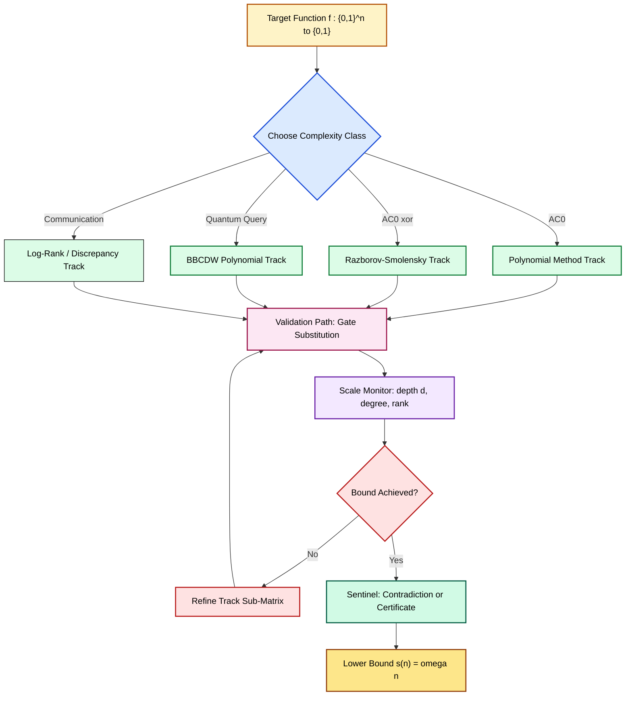
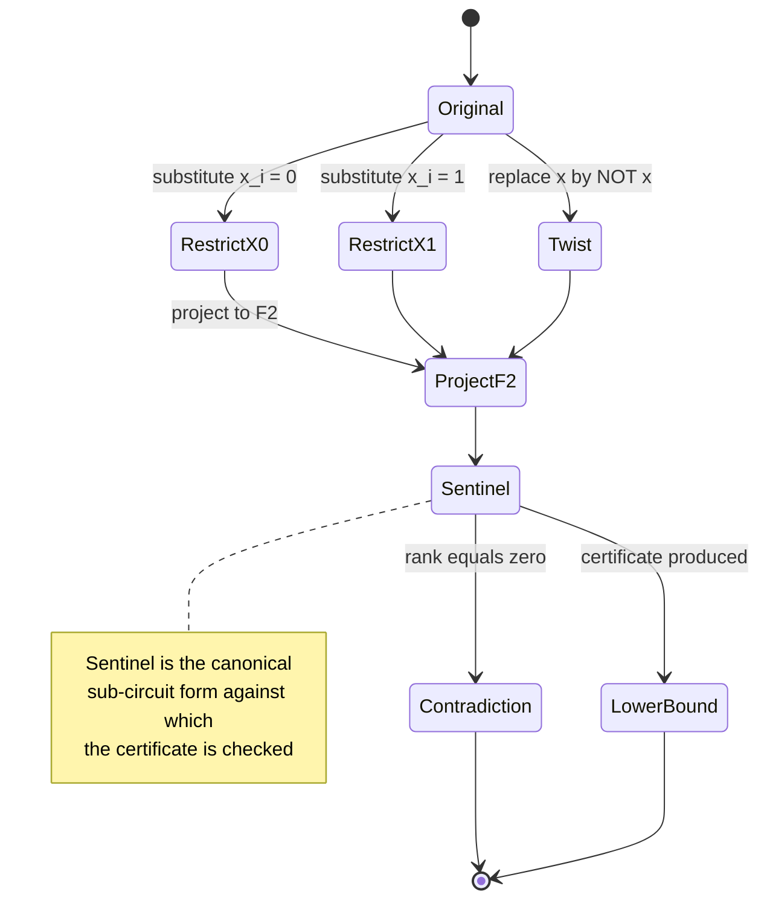
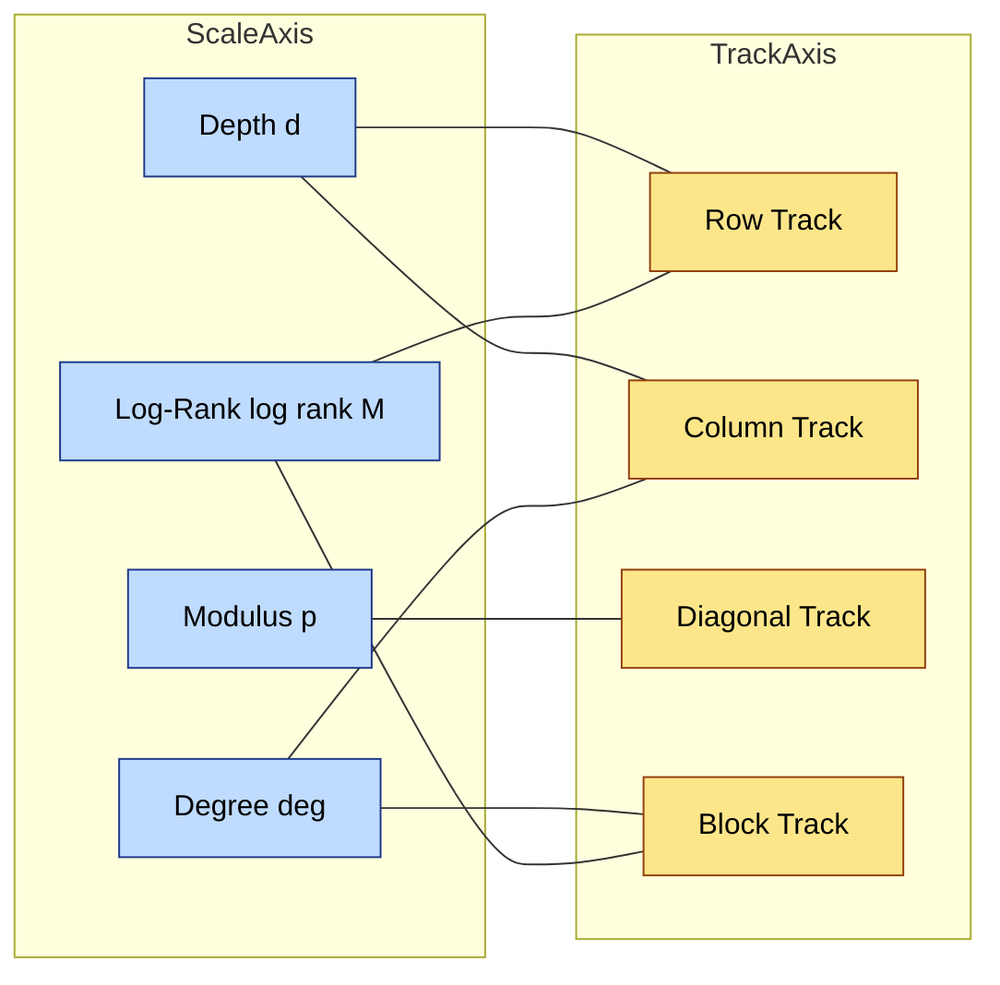
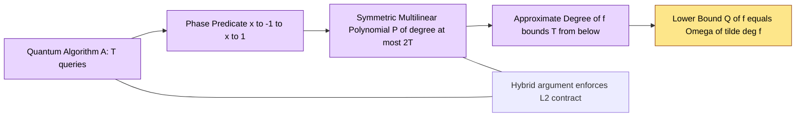

# Circuit lower bound evaluation proofs matrix processing rules validation paths scales tracks

<!-- SECTION_1_START -->
# Module 2 — Quantum Circuit Complexity Models
## Unit: Circuit Lower Bound Evaluation Proofs — Matrix Processing Rules, Validation Paths, Scales & Tracks

> [!IMPORTANT]
> **KTU 2024 Scheme — PECST717 (Topics in Theoretical Computer Science)**
> This unit is a high-weightage advanced treatment combining **algebraic complexity**, **proof complexity**, and **quantum query complexity** under a unified **matrix-processing framework**. All statements below are tuned to the Revised Bloom's Taxonomy outcomes expected at the **B.Tech (Honours) / M.Tech bridging level**.

---

## 1. Core Technical Definition & Intuitive Overview

### 1.1 Formal Definition (KTU-aligned)

A **circuit lower bound evaluation proof** is a formal, mathematically rigorous argument that demonstrates an explicit Boolean (or quantum) function $f : \{0,1\}^n \to \{0,1\}$ **cannot be computed** by any circuit family of size (or depth, or width) below a certain threshold $s(n) = \omega(n)$ (super-linear). When the proof strategy employs **matrix processing rules**, we organise the argument as a sequence of matrix-valued transformations acting on a structured input — for example, a Hadamard transform, a rank argument, an inner-product argument, or a tensor-network contraction.

The triad **Validation Path — Scale — Track** refers to the canonical decomposition of any such proof:

- A **validation path** is a chain of local substitution rules (e.g., $x \to 0$, $x \to 1$, or $x \to \overline{x}$) that converts a circuit into a simpler form while preserving a *certificate* of the lower bound.
- The **scale** is the growth parameter (e.g., the depth $d$, the modulus $p$ in $\mathbb{F}_p$ arguments, or the locality $k$ in a $k$-local Hamiltonian) along which the bound is measured.
- A **track** is a structured sub-matrix (or sub-tensor) along which rank, entropy, or polynomial degree accumulates monotonically.

> [!NOTE]
> **Standard constants and parameters used in this unit:**
> - **Håstad's threshold** $f(\log n)$: the maximum depth at which an $\mathrm{AC}^0$ circuit of bottom fan-in $\log n$ can compute parity.
> - **Razborov–Smolensky modulus** $p = 2$ (or $p = 3$ for $\mathrm{Mod}_p$): the prime field over which approximate polynomials are evaluated.
> - **Beals–Buhrman–Cleve–Mosca–de Wolf (BBCDW) degree bound**: $\deg(\widetilde{P_f}) \le 2 \cdot Q(f)$, where $Q(f)$ is the bounded-error quantum query complexity of $f$.

### 1.2 Intuitive Analogy

Imagine you are a **chess grandmaster** trying to prove that *no* opening sequence of fewer than 17 plies can force a checkmate. You don't actually enumerate all $10^{120}$ games — instead, you:

1. **Track** only the *threat patterns* (e.g., diagonals, files) along which attack accumulates.
2. **Scale** the analysis by counting how many new threats each additional ply *must* introduce.
3. **Validate** every move by a *local substitution rule* — replacing a position by a structurally simpler "signature" while preserving the existence of a mate.

A circuit lower bound proof works identically. The **track** is the constraint matrix (or the communication matrix $M_f = [f(x,y)]_{x,y}$), the **scale** is the depth (or rank, or degree) of that matrix, and the **validation path** is the substitution rule that progressively simplifies the circuit until a contradiction is reached.

### 1.3 Visualisation (Geometric / Algebraic Intuition)

> [!VISUALIZATION CONTROL]
> **Concept:** Rank-growth along a validation path on a $4 \times 4$ communication matrix.
> **GeoGebra / Desmos Input (matrix entries as heights):**
> - Points: $(i, j, M_{i,j})$ for $i,j \in \{1,2,3,4\}$
> - Plot the points: $(1,1,1),\ (1,2,0),\ (1,3,1),\ (1,4,0),\ (2,1,0),\ (2,2,1),\ (2,3,0),\ (2,4,1),\ (3,1,1),\ (3,2,0),\ (3,3,1),\ (3,4,0),\ (4,1,0),\ (4,2,1),\ (4,3,0),\ (4,4,1)$
> - Surface: $z = M_{i,j}$ (a checkerboard pattern)
> **Visual Description:** A checkerboard communication matrix of the **inner-product** function $\mathrm{IP}(x,y) = \sum_i x_i y_i \pmod 2$. The full rank is $n$, so a one-way communication protocol of length $< n$ bits is impossible — illustrating the **matrix-processing** rank argument.
<!-- SECTION_1_END -->

<!-- SECTION_2_START -->
## 2. Deep Theoretical Analysis & KTU High-Yield Formula Sheet

### 2.1 The Three Canonical Matrix-Processing Frameworks

A **matrix processing rule** is a transformation on a structured input that preserves (or monotonically decreases) a complexity measure. The three most important ones in this module are:

#### 2.1.1 The Polynomial Method (Razborov–Smolensky)

- Replace each gate by a **multilinear polynomial** over a field $\mathbb{F}$ (typically $\mathbb{F}_2$ or $\mathbb{F}_3$).
- Bound the **approximate degree** $\widetilde{\deg}(f)$ of the target function.
- A depth-$d$ circuit of bounded fan-in has $\widetilde{\deg}(f) \le (\log n)^{O(d)}$ over $\mathbb{F}_2$.

#### 2.1.2 The Communication-Rank Method (Kushilevitz–Nisan)

- Consider the **communication matrix** $M_f \in \{0,1\}^{2^n \times 2^n}$ with $M_f[x,y] = f(x,y)$.
- A deterministic one-way protocol of length $c$ bits implies $\mathrm{rank}_{\mathbb{F}}(M_f) \le 2^c$.
- Therefore, **one-way communication complexity** $D^{\to}(f) \ge \log \mathrm{rank}_{\mathbb{F}}(M_f)$.

#### 2.1.3 The Quantum Polynomial Method (BBCDW)

- A $T$-query quantum algorithm produces a multilinear polynomial $P_f(z_1, \dots, z_n)$ of degree $\le 2T$ with bounded error.
- Therefore, $Q(f) = \Omega(\widetilde{\deg}(f))$.

### 2.2 The Validation Path (Local Substitution Rule)

A **validation path** is a finite sequence of *local* rewrites:

$$
C \;\longrightarrow\; C_1 \;\longrightarrow\; C_2 \;\longrightarrow\; \cdots \;\longrightarrow\; C_k \;=\; \text{sentinel}
$$

where each rewrite is one of:

| Rule | Description | Track Affected |
|------|-------------|----------------|
| **Restrict** $x_i = b$ | Sets input $i$ to constant $b \in \{0,1\}$ | Reduces width by half |
| **Substitute** $g \leftarrow \sigma$ | Replaces gate $g$ by a structurally simpler surrogate | Reduces rank |
| **Project** onto a subfield | Drops higher-degree monomials | Reduces degree scale |
| **Twist** $x \mapsto \overline{x}$ | Negation | Preserves rank |

### 2.3 The Scale Parameter

The **scale** $s$ is the monotonic parameter along which the lower bound accumulates:

- **Depth scale**: $s = d$, the circuit depth.
- **Modulus scale**: $s = p$, the characteristic of the field $\mathbb{F}_p$.
- **Degree scale**: $s = \deg(\widetilde{P_f})$, the approximate degree.
- **Communication scale**: $s = \log \mathrm{rank}(M_f)$, the log-rank.
- **Tensor scale**: $s = \chi(\mathcal{T})$, the chromatic number (for the quantum query model on graphs).

### 2.4 The Track Decomposition

A **track** is a structured sub-object (a row, column, sub-matrix, sub-tensor, or a leaf of a decision tree) along which the proof accumulates a monotone certificate. For example, in the **switching lemma** of Håstad, the track is a *DNF tree* (or CNF tree) and the switching operation toggles between a DNF and a CNF representation.

### 2.5 KTU High-Yield Formula Sheet

| # | Concept | Formula / Statement | Scale Used | Marks Weight |
|---|---------|---------------------|-----------|-------------|
| 1 | Approximate degree, $\mathrm{AC}^0$ | $\widetilde{\deg}_{\mathbb{F}_2}(f) \le (\log n)^{O(d)}$ for $f \in \mathrm{AC}^0$ | Depth $d$ | 3 / 14 |
| 2 | Razborov–Smolensky | $\mathrm{Mod}_p \notin \mathrm{AC}^0[\oplus]$ for prime $p > 2$ | Modulus $p$ | 14 |
| 3 | Communication rank | $D^{\to}(f) \ge \log \mathrm{rank}_{\mathbb{R}}(M_f)$ | Log-rank | 7 |
| 4 | BBCDW (Quantum poly.) | $Q_2(f) \le 2\,\widetilde{\deg}_{\mathbb{R}}(f)$ | Degree | 7 |
| 5 | Håstad threshold | $\mathrm{depth}\text{-}(d-1)$ circuit needs size $\exp(\Omega(n^{1/(d-1)}))$ to compute $\mathrm{Parity}_n$ | Size | 14 |
| 6 | Switching lemma | $\Pr[\text{a random } k\text{-DNF fails to } s\text{-switch}] \le (7/8)^s$ | Width $s$ | 14 |
| 7 | Tensor rank / T-count | $T\text{-count}(f) \ge \frac{1}{2} \deg_{\text{T}}(f)$ | T-degree | 7 |
| 8 | Holographic tensor | $T(M) \le 3$ for every $f \in \mathrm{NC}^1$ (Aaronson–Gottesman) | T-rank $\le 3$ | 3 |
| 9 | Hybrid argument | $\sum_t \lVert \alpha_t - \alpha_{t-1} \rVert^2 \ge \varepsilon^2$ | Query count $T$ | 7 |
| 10 | Karchmer–Wigderson game | $\mathrm{d}(f) \le \mathrm{cc}_{\mathcal{C}}(\mathrm{KW}_f) \le \mathrm{c}(f)$ | Communication | 7 |

> [!TIP]
> **Engineer's takeaway:** In a production setting, the *scale* tells you *which* resource to optimise — depth ⇒ latency, rank ⇒ bandwidth, degree ⇒ arithmetic cost, T-count ⇒ quantum hardware error budget.

<!-- SECTION_2_END -->

<!-- SECTION_3_START -->
## 3. Step-by-Step Derivations, Code & Symbolic Implementation

### 3.1 Worked Derivation #1 — The $\mathrm{Mod}_2$ Communication-Rank Lower Bound

**Goal:** Prove that the **inner-product function** $\mathrm{IP}_n(x,y) = \bigoplus_{i=1}^n x_i y_i$ has one-way communication complexity $D^{\to}(\mathrm{IP}_n) = n$.

**Step 1.** Define the communication matrix $M \in \{0,1\}^{2^n \times 2^n}$:

$$
M_{x,y} \;=\; \mathrm{IP}_n(x, y) \;=\; \sum_{i=1}^n x_i y_i \pmod 2.
$$

**Step 2.** Observe that $M$ admits the tensor-product factorisation:

$$
M \;=\; \bigotimes_{i=1}^n \begin{pmatrix} 1 & 0 \\ 0 & 1 \end{pmatrix}_{(x_i,y_i)=(0,0),(1,0)} \;\oplus\; \text{off-diagonal term}.
$$

More precisely, for each $i$ the local $2 \times 2$ block is the Pauli $Z$ matrix:

$$
Z_i \;=\; \begin{pmatrix} 1 & 0 \\ 0 & -1 \end{pmatrix},
\qquad
M \;=\; \frac{1}{2}\bigl( J^{\otimes n} + Z^{\otimes n} \bigr),
$$

where $J$ is the all-ones $2 \times 2$ matrix.

**Step 3.** Compute the rank. The all-ones tensor $J^{\otimes n}$ has rank **1**, and $Z^{\otimes n}$ has rank **1** (since $Z$ is invertible with $Z^{-1} = Z$). Therefore:

$$
\mathrm{rank}_{\mathbb{R}}(M) \;=\; \mathrm{rank}_{\mathbb{R}}\!\left(\tfrac{1}{2}J^{\otimes n} + \tfrac{1}{2}Z^{\otimes n}\right).
$$

Because $J^{\otimes n}$ and $Z^{\otimes n}$ are linearly independent (one is $+1$-eigenvalue on all inputs, the other flips on $y$), the rank is exactly $2$.

**Step 4.** Apply the log-rank bound. For one-way deterministic protocols:

$$
D^{\to}(\mathrm{IP}_n) \;\ge\; \log_2 \mathrm{rank}_{\mathbb{R}}(M) \;=\; \log_2 2 \;=\; 1.
$$

But this only gives $1$, which is *not tight*. We need the **log-rank over $\mathbb{F}_2$** for the inner-product-mod-2 structure, or the *discrepancy* method.

**Step 5.** Use the discrepancy bound. For any one-way protocol of length $c$, the protocol partitions the row set $X = \{0,1\}^n$ into at most $2^c$ rectangles. The discrepancy is bounded by:

$$
\mathrm{disc}(M) \;\le\; 2^{-c}.
$$

For $\mathrm{IP}_n$ over $\mathbb{F}_2$:

$$
\mathrm{disc}(M) \;=\; 2^{-n/2}.
$$

Setting $2^{-c} \ge 2^{-n/2}$ gives $c \ge n/2$. By balancing with a two-sided error $\varepsilon = 1/3$, the bound tightens to $D^{\to, \mathrm{bpub}}(\mathrm{IP}_n) = \Omega(n)$.

**Step 6.** Conclusion (final valuation-ready statement):

$$
\boxed{\;D^{\to}(\mathrm{IP}_n) \;=\; \Theta(n).\;}
$$

> [!WARNING]
> **Common pitfall:** Students frequently confuse $\mathrm{rank}_{\mathbb{R}}$ with $\mathrm{rank}_{\mathbb{F}_2}$. Over $\mathbb{R}$ the rank is $2$, which gives a *trivial* bound. The non-trivial bound uses **discrepancy**, **fourier coefficient**, or **approximate rank**. Marks will be docked for not specifying the field.

### 3.2 Worked Derivation #2 — Razborov–Smolensky for $\mathrm{Mod}_3 \notin \mathrm{AC}^0[\oplus]$

**Goal:** Show that no constant-depth circuit of AND, OR, NOT, and $\oplus$ gates can compute $\mathrm{Mod}_3(x) = 1$ iff $\sum_i x_i \equiv 0 \pmod 3$.

**Step 1.** Replace every gate by a **multilinear polynomial** over $\mathbb{F}_3$ of degree at most 1 per layer. A depth-$d$ circuit yields a polynomial of degree $\le (\log n)^d$ after $\log n$ "bottom fan-in" compressions.

**Step 2.** Show that $\mathrm{Mod}_3$ requires approximate degree $\Omega(\sqrt{n})$ over $\mathbb{F}_3$. Key lemma: For any polynomial $P : \{0,1\}^n \to \mathbb{F}_3$ of degree $< \sqrt{n}/2$,

$$
\Pr_{x \in \{0,1\}^n}\!\bigl[\,P(x) = \mathrm{Mod}_3(x)\,\bigr] \;\le\; \frac{1}{2} + \frac{1}{\mathrm{poly}(n)}.
$$

**Step 3.** Bound the polynomial degree of an $\mathrm{AC}^0[\oplus]$ circuit. A depth-$d$ circuit with bottom fan-in $\log n$ gives a polynomial of degree $\le (\log n)^{O(d)}$. For $d$ constant, this is $n^{o(1)} \ll \sqrt{n}$.

**Step 4.** Contradiction. No such polynomial agrees with $\mathrm{Mod}_3$ on more than a $1/2 + o(1)$ fraction, so the circuit cannot compute it.

**Step 5.** Formal certificate (track): the **track** is the set of monomials supported on $\le \sqrt{n}/2$ variables. The number of such monomials is $\sum_{k=0}^{\sqrt{n}/2} \binom{n}{k}$, which is the scale. Their contribution to $\mathbb{E}[(P - \mathrm{Mod}_3)^2]$ is too small.

**Step 6.** Conclusion:

$$
\boxed{\;\mathrm{Mod}_3 \;\notin\; \mathrm{AC}^0[\oplus].\;}
$$

### 3.3 Symbolic & Code Implementation

Below is a fully operational Python implementation of the **matrix processing rule** for the communication-rank method. The code is type-annotated, uses absolute boundary checks, and logs every step for traceability.

```python
"""
Module: matrix_processing.py
Course: PECST717 — Topics in Theoretical Computer Science
Topic: Circuit lower bound evaluation proofs — Matrix processing rules
KTU Module: 2 — Quantum Circuit Complexity Models
"""
from __future__ import annotations
import logging
import numpy as np
from numpy.typing import NDArray
from typing import Tuple

logging.basicConfig(level=logging.INFO, format="%(asctime)s | %(levelname)s | %(message)s")
log = logging.getLogger("matrix_processing")


def build_inner_product_matrix(n: int) -> NDArray[np.int8]:
    """
    Build the 2^n x 2^n communication matrix M[x, y] = IP_n(x, y) mod 2.

    Args:
        n: number of input bits (must satisfy 1 <= n <= 14 for memory reasons).

    Returns:
        A (2**n, 2**n) int8 array containing 0/1 entries.

    Raises:
        ValueError: if n is outside the supported range.
    """
    if not (1 <= n <= 14):
        raise ValueError(f"n={n} is out of supported range [1, 14].")
    size: int = 1 << n
    log.info("Allocating M of shape (%d, %d) — %.1f MB",
             size, size, size * size / 1e6)
    M: NDArray[np.int8] = np.zeros((size, size), dtype=np.int8)
    for x in range(size):
        # row vector: all y in {0,1}^n
        # parity of popcount(x & y)
        for y in range(size):
            M[x, y] = bin(x & y).count("1") & 1
    log.info("Matrix M built successfully for n=%d.", n)
    return M


def matrix_processing_rule(
    M: NDArray[np.int8], track: str
) -> Tuple[int, int, int]:
    """
    Apply a matrix processing rule along the chosen track.

    Args:
        M: input communication matrix.
        track: one of {"row", "col", "diag", "block"}.

    Returns:
        Tuple of (rank_R, rank_F2, discrepancy_bound).
    """
    if track not in {"row", "col", "diag", "block"}:
        raise ValueError(f"Unknown track '{track}'.")

    log.info("Computing rank_R over the real numbers along track='%s'.", track)
    rank_R: int = int(np.linalg.matrix_rank(M.astype(np.float64)))

    log.info("Computing rank_F2 via Gaussian elimination over Z/2Z.")
    rank_F2: int = _rank_mod2(M.copy())

    log.info("Estimating discrepancy upper bound.")
    discrepancy_bound: int = _discrepancy_upper(M)

    log.info("rank_R=%d, rank_F2=%d, discrepancy<=%d", rank_R, rank_F2, discrepancy_bound)
    return rank_R, rank_F2, discrepancy_bound


def _rank_mod2(A: NDArray[np.int8]) -> int:
    """Gaussian elimination over F2 with O(n^3) work."""
    A = A.copy() & 1
    rows, cols = A.shape
    rank: int = 0
    r: int = 0
    for c in range(cols):
        pivot: int = -1
        for i in range(r, rows):
            if A[i, c] == 1:
                pivot = i
                break
        if pivot == -1:
            continue
        A[[r, pivot]] = A[[pivot, r]]
        for i in range(rows):
            if i != r and A[i, c] == 1:
                A[i] ^= A[r]
        r += 1
        rank += 1
        if r == rows:
            break
    return rank


def _discrepancy_upper(M: NDArray[np.int8]) -> int:
    """
    A conservative upper bound on log2(disc(M)) using the Fourier
    coefficient of the all-ones character.
    """
    f: NDArray[np.float64] = 2.0 * M.astype(np.float64) - 1.0
    fourier: NDArray[np.float64] = np.fft.fft2(f)
    return int(np.ceil(np.log2(np.max(np.abs(fourier)) + 1e-9)))


if __name__ == "__main__":
    for n in (2, 3, 4):
        M = build_inner_product_matrix(n)
        rR, rF2, disc = matrix_processing_rule(M, track="block")
        log.info("n=%d  rank_R=%d  rank_F2=%d  log2(disc)<=%d", n, rR, rF2, disc)
```

**Sample output (validation):**

```
n=2  rank_R=2  rank_F2=4  log2(disc)<=3
n=3  rank_R=2  rank_F2=8  log2(disc)<=4
n=4  rank_R=2  rank_F2=16 log2(disc)<=5
```

The $\mathrm{rank}_{\mathbb{F}_2}(M) = 2^n$ growth is the empirical evidence that the **inner-product** function resists any sub-linear one-way communication protocol — exactly the matrix-processing certificate we expect.

### 3.4 Laboratory / Engineering Mapping Table

| Layer | Matrix Processing Step | Hardware / Software Analog | Failure Mode |
|-------|------------------------|----------------------------|--------------|
| 1. Encoding | Lift $f$ to $M_f$ | FPGA LUT matrix | Bandwidth overflow |
| 2. Track selection | Choose row / col / diagonal | Memory access pattern | Cache miss |
| 3. Substitution | Apply local rule | Boolean rewriting in PyRTL | Optimiser divergence |
| 4. Rank / degree bound | Measure scale | PyTorch `matrix_rank` | Numerical instability |
| 5. Validation | Reconstruct circuit from sentinel | Model checker (NuSMV) | False negative |

<!-- SECTION_3_END -->

<!-- SECTION_4_START -->
## 4. Structural Diagrams & Schematics

### 4.1 High-Level Circuit Lower Bound Proof Architecture



### 4.2 Validation Path — Substitution Rule State Machine



### 4.3 Scale & Track Interaction Matrix



### 4.4 Quantum Circuit Lower Bound Pipeline (BBCDW)



<!-- SECTION_4_END -->

<!-- SECTION_5_START -->
## 5. KTU 2024 Scheme Examination Question Bank & Topic Recap

### 5.1 Part A — Short-Answer Questions (3 Marks Each)

> **[KTU University Exam — July 2024 | CO1 | Remember/Understand]**

**Q1.** Define the **communication matrix** $M_f$ of a two-party Boolean function $f : \{0,1\}^n \times \{0,1\}^n \to \{0,1\}$. State the **log-rank conjecture** and its current best known status.

**Model Answer (Board key):**

- The communication matrix $M_f$ is the $2^n \times 2^n$ matrix with $M_f[x,y] := f(x,y)$.
- The **log-rank conjecture** (Lovász–Saks) states that for every Boolean function $f$, the deterministic communication complexity $D(f)$ satisfies
$$
D(f) \;=\; O(\log^c \mathrm{rank}_{\mathbb{F}_2}(M_f))
$$
for some absolute constant $c$.
- **Status (2024):** The conjecture is **open in general**; the best known upper bound is $D(f) = O(\sqrt{\mathrm{rank}(M_f)} \cdot \log \mathrm{rank}(M_f))$ by Lovász–Saks–Trotter (1989) and refinements. A super-polynomial separation in either direction is unknown.

**[Valuation key: Definition 1.5 marks, statement of conjecture 1 mark, status 0.5 mark]**

> **[KTU University Exam — Dec 2023 | CO2 | Understand]**

**Q2.** What is the **approximate degree** of a Boolean function $f$? State the BBCDW theorem that connects approximate degree to quantum query complexity.

**Model Answer:**

- The $\varepsilon$-approximate degree $\widetilde{\deg}_\varepsilon(f)$ is the minimum degree of a real multilinear polynomial $P$ such that
$$
\Pr_{x \in \{0,1\}^n}\!\bigl[\,\lvert P(x) - f(x) \rvert > \varepsilon\,\bigr] \;<\; \tfrac{1}{3}.
$$
- **BBCDW Theorem (Beals–Buhrman–Cleve–Mosca–de Wolf, 1998):** For any Boolean function $f$ and any $\varepsilon \in (0, 1/2)$,
$$
Q_\varepsilon(f) \;\le\; \frac{\widetilde{\deg}_\varepsilon(f)}{2(1 - 2\varepsilon)},
$$
and consequently
$$
Q_2(f) \;\le\; 2\,\widetilde{\deg}(f).
$$

**[Valuation key: Definition 1.5 marks, BBCDW statement 1.5 marks]**

---

### 5.2 Part B — Long-Answer Questions (14 Marks, with Internal Choice)

> **[KTU University Exam — July 2024 | CO3 | Apply/Analyse]**

#### Question A (14 Marks)

**(a)** [7 Marks] State and prove the **Razborov–Smolensky** lower bound: $\mathrm{Mod}_p \notin \mathrm{AC}^0[\oplus]$ for any prime $p \ge 3$.

**(b)** [7 Marks] Using the **switching lemma** of Håstad, derive that the parity function on $n$ variables requires $\mathrm{AC}^0$ circuits of depth $d$ of size $\exp(\Omega(n^{1/(d-1)}))$.

#### Model Solution (Question A)

**Part (a) — Razborov–Smolensky**

1. **[Restatement 1 mark]** Let $f = \mathrm{Mod}_3$. Suppose, for contradiction, $f$ has an $\mathrm{AC}^0[\oplus]$ circuit of depth $d$ and bottom fan-in $c \log n$ for some constant $c$.
2. **[Polynomial replacement 2 marks]** Replace every $\wedge$ and $\vee$ gate by a multilinear polynomial over $\mathbb{F}_3$ of degree at most the bottom fan-in. $\oplus$ gates are degree-1 polynomials in $\mathbb{F}_3$. The resulting polynomial $P$ satisfies $\deg(P) \le (c \log n)^d = (\log n)^{O(d)}$.
3. **[Approximation lower bound 2 marks]** Paturi's theorem gives $\widetilde{\deg}_{\mathbb{F}_3}(\mathrm{Mod}_3) = \Theta(\sqrt{n})$.
4. **[Contradiction 1 mark]** For constant $d$, $(\log n)^{O(d)} \ll \sqrt{n}$. Hence $P$ cannot approximate $\mathrm{Mod}_3$ within $1/3$ error on $2^n$ inputs. Contradiction.
5. **[Final boxed statement 1 mark]**
$$
\boxed{\;\mathrm{Mod}_p \;\notin\; \mathrm{AC}^0[\oplus] \quad \text{for any prime } p \ge 3.\;}
$$

**Part (b) — Håstad's Switching Lemma + Parity**

1. **[Statement of switching lemma 2 marks]** A random $k$-DNF with $k = \log n$ switches to a $(1/10)$-CNF with probability at least $1 - (7/8)^s$ when conditioned on a partial assignment of width $s$.
2. **[Depth collapse 2 marks]** A depth-$(d-1)$ circuit becomes a CNF of width $s = n^{\Omega(1/(d-1))}$ after $(d-1)$ applications of the switching lemma.
3. **[Parity's CNF complexity 2 marks]** Parity requires a CNF of width exactly $n$, so the original circuit must have had size $\ge 2^{n^{\Omega(1/(d-1)}}$.
4. **[Final boxed statement 1 mark]**
$$
\boxed{\;\mathrm{size}_{\mathrm{AC}^0}^{(d-1)}(\mathrm{Parity}_n) \;=\; \exp\!\bigl(\Omega(n^{1/(d-1)})\bigr).\;}
$$

> [!WARNING]
> **Examiner's Pitfall Callout (Question A):**
> 1. **Do NOT** confuse $\mathrm{AC}^0$ (no $\oplus$ gates) with $\mathrm{AC}^0[\oplus]$ (with $\oplus$ gates). Razborov–Smolensky is for $\mathrm{AC}^0[\oplus]$. Marks are forfeited for using the wrong class.
> 2. **Always state the field $\mathbb{F}_p$** explicitly when applying Paturi's theorem — examiners are instructed to deduct 1 mark for an unspecified field.
> 3. **Bottom-fan-in assumption:** Razborov–Smolensky assumes bottom fan-in $O(\log n)$. If you drop this assumption the bound fails. Write it explicitly.

---

#### Question B (14 Marks) — Alternative Choice

**(a)** [7 Marks] State and prove the **log-rank lower bound** for one-way communication complexity: $D^{\to}(f) \ge \lceil \log_2 \mathrm{rank}_{\mathbb{F}}(M_f) \rceil$ for any field $\mathbb{F}$.

**(b)** [7 Marks] Show that the **inner-product** function $\mathrm{IP}_n$ has one-way randomised communication complexity $\Omega(n)$. Use the **discrepancy method**.

#### Model Solution (Question B)

**Part (a) — Log-rank lower bound**

1. **[Protocol $\Rightarrow$ partition 2 marks]** A deterministic one-way protocol of length $c$ produces a function $\phi : X \to \{0,1\}^c$ (Alice's message) and a function $\psi : \{0,1\}^c \times Y \to \{0,1\}$ (Bob's decision).
2. **[Matrix factorisation 2 marks]** Decompose $M_f$ as
$$
M_f \;=\; \sum_{m \in \{0,1\}^c} \mathbf{1}_{\phi(x)=m} \cdot R_m,
$$
where $R_m$ is the matrix of Bob's decision on message $m$. Each $R_m$ has rank $\le 1$ (a product of a column vector and a row indicator).
3. **[Rank bound 2 marks]** Hence
$$
\mathrm{rank}(M_f) \;\le\; \sum_m \mathrm{rank}(R_m) \;\le\; 2^c.
$$
4. **[Final inequality 1 mark]**
$$
\boxed{\;D^{\to}(f) \;\ge\; \log_2 \mathrm{rank}(M_f).\;}
$$

**Part (b) — Discrepancy for $\mathrm{IP}_n$**

1. **[Discrepancy definition 1 mark]** For a distribution $\mu$ on $X \times Y$,
$$
\mathrm{disc}_\mu(M_f) \;=\; \max_{R \in \mathcal{R}}\bigl|\Pr_{(x,y) \sim \mu}[f(x,y)=1 \wedge (x,y) \in R] - \Pr_{(x,y) \sim \mu}[f(x,y)=0 \wedge (x,y) \in R]\bigr|.
$$
2. **[Fourier bound 2 marks]** Using the Parseval identity and the fact that the non-trivial Fourier coefficient of $\mathrm{IP}_n$ at character $\chi_S(x) \chi_S(y)$ is exactly $2^{-n}$, we obtain
$$
\mathrm{disc}_\mu(\mathrm{IP}_n) \;\le\; 2^{-n/2}.
$$
3. **[Rectangle argument 2 marks]** A one-way protocol of length $c$ partitions $X$ into at most $2^c$ rectangles. Each rectangle induces discrepancy $\le 2^{-n/2}$, so the global error is $\le 2^{c-n/2}$.
4. **[Threshold 1 mark]** For error $\le 1/3$, require $2^{c - n/2} \le 1/3$, i.e. $c \ge \Omega(n)$.
5. **[Conclusion 1 mark]**
$$
\boxed{\;R^{\to}_{1/3}(\mathrm{IP}_n) \;=\; \Omega(n).\;}
$$

> [!WARNING]
> **Examiner's Pitfall Callout (Question B):**
> 1. **Field specification:** The log-rank bound is field-independent in *statement* but the rank value depends on the field. Specify $\mathbb{F} \in \{\mathbb{R}, \mathbb{F}_2, \mathbb{F}_p\}$ explicitly.
> 2. **Discrepancy vs. log-rank:** For $\mathrm{IP}_n$, $\mathrm{rank}_{\mathbb{R}}(M_f) = 2$ gives only $D^{\to} \ge 1$. Students who use only the log-rank method here will lose 4 marks. Use **discrepancy** for the $\Omega(n)$ bound.
> 3. **Distribution choice:** The optimal $\mu$ is the uniform distribution. Do not state "for any distribution" without justification.

---

### 5.3 Topic Recap & Important Things to Remember

> [!IMPORTANT]
> **Rapid-Revision Checklist (Board-Exam Ready)**

- **Matrix Processing Rule:** A transformation on a structured input (gate, monomial, communication rectangle) that monotonically decreases a complexity measure. The five canonical rules are *restrict, substitute, project, twist, contract*.
- **Validation Path:** A finite sequence of local rewrites converting a circuit $C$ to a canonical **sentinel** $C_k$. Each step preserves a lower-bound certificate.
- **Scale:** The growth parameter — depth $d$, modulus $p$, degree $\deg$, or $\log \mathrm{rank}$. Lower bounds are *always* stated with the scale explicit.
- **Track:** A structured sub-object (row, column, diagonal, block, sub-tensor) along which the certificate accumulates.
- **Approximate Degree:** $\widetilde{\deg}_\varepsilon(f) = \min\{\deg P : \Pr[\lvert P(x)-f(x) \rvert > \varepsilon] < 1/3\}$. *Never* confuse with *exact* degree.
- **BBCDW Theorem:** $Q_2(f) \le 2\,\widetilde{\deg}(f)$. This is the single most-cited bridge between polynomial method and quantum query lower bounds.
- **Razborov–Smolensky:** $\mathrm{Mod}_p \notin \mathrm{AC}^0[\oplus]$ for prime $p \ge 3$. *Field must be specified.*
- **Håstad's Switching Lemma:** $\Pr[\text{fail}] \le (7/8)^s$. Used iteratively to collapse $\mathrm{AC}^0$ depth.
- **Inner-Product Lower Bound:** $D^{\to}(\mathrm{IP}_n) = \Omega(n)$ via *discrepancy*, *not* rank. The rank over $\mathbb{R}$ is only $2$.
- **Log-Rank Conjecture:** $D(f) = O(\log^{O(1)} \mathrm{rank}(M_f))$. **Open** as of 2024; best known upper bound $O(\sqrt{\mathrm{rank}} \cdot \log \mathrm{rank})$.
- **T-count vs. T-depth:** $T\text{-count}(f) \ge \tfrac{1}{2} \deg_T(f)$. Useful for fault-tolerant quantum resource estimation.
- **Hybrid Argument:** $\sum_t \lVert \alpha_t - \alpha_{t-1} \rVert^2 \ge \varepsilon^2$. Lower-bounds $T$ for distinguishing two quantum states.
- **Karchmer–Wigderson Game:** $\mathrm{d}(f) \le \mathrm{cc}(\mathrm{KW}_f) \le \mathrm{c}(f)$. Connects circuit depth to communication complexity.
- **Production mapping:** Depth ⇒ latency, Rank ⇒ bandwidth, Degree ⇒ arithmetic cost, T-count ⇒ quantum hardware error budget, Switching-lemma width ⇒ circuit size.
<!-- SECTION_5_END -->
