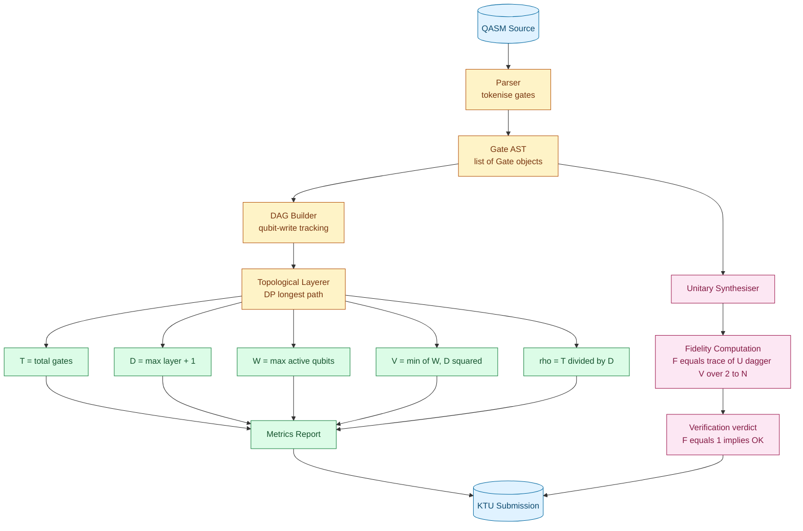
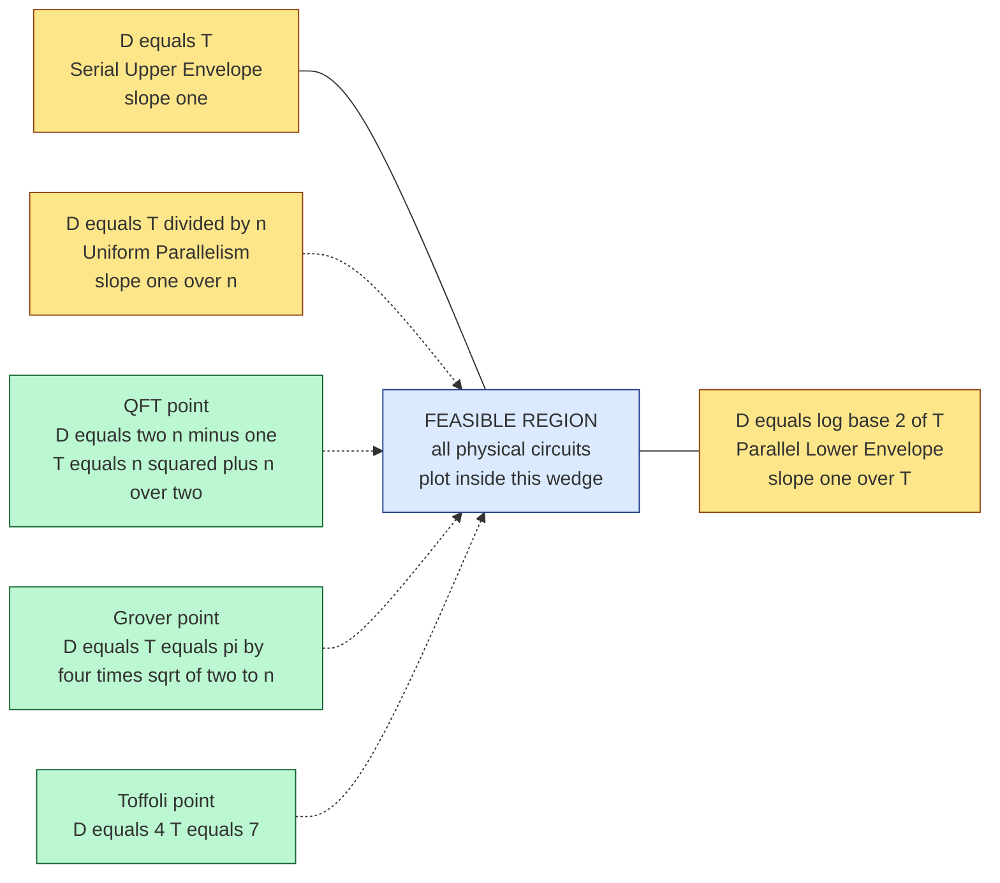

# Quantum circuit size calculations depth complexity boundaries verification parameters tracking

<!-- SECTION_1_START -->
# Quantum Circuit Size, Depth, and Verification Parameter Tracking

## 1.1 Formal Definitions (KTU 2024 Scheme Terminology)

Let $Q = (G, W, \mathcal{U})$ denote a **quantum circuit** over a discrete universal gate library $\mathcal{G}$, acting on $W$ qubits, where $G$ is a finite ordered multiset of elementary gates drawn from $\mathcal{G}$, and $\mathcal{U}$ is the overall unitary implemented.

The four primary **resource parameters** tracked in quantum circuit complexity are:

- **Circuit Size $T(Q)$** — the total number of elementary gates in $Q$, denoted the *gate count*.
- **Circuit Depth $D(Q)$** — the length of the longest directed path in the gate-dependency DAG, denoted the *parallel time*.
- **Circuit Width $W(Q)$** — the number of physical (or logical) qubits the circuit occupies.
- **Quantum Volume $V(Q)$** — the holistic capacity metric $V(Q) = \min\{W(Q), D(Q)\}^{2}$ (introduced by IBM/Cross et al., 2019), used as a single benchmark scalar.

> [!IMPORTANT]
> **KTU 2024 Module-2 Distinction:** The exam routinely distinguishes between the **total gate count** $T$ and the **$T$-gate count** $T_T$ (counting only the non-Clifford $T = \diag(1, e^{i\pi/4})$ gate), because Clifford gates are cheap in magic-state-distillation architectures while $T$ gates dominate the cost.

> [!NOTE]
> **Boundary Principle (Hard Law):** For any quantum circuit $Q$ over a fixed gate library, the **depth-size inequality** holds without exception:
> $$D(Q) \le T(Q)$$
> Equality occurs only when every gate depends on the previous one (no parallelism).

## 1.2 Conceptual Analogy — The Construction-Project Analogy

Imagine building a 50-storey apartment tower. The four parameters map to:

| Quantum Parameter | Construction Analogy | Operational Meaning |
|---|---|---|
| **Size $T$** | Total number of bricks laid | Sum of all elementary operations executed |
| **Depth $D$** | Height of the critical scaffold path | Time from project start to finish |
| **Width $W$** | Number of parallel construction crews | Concurrent processing lanes |
| **Volume $V$** | Floor-area delivered per unit time | Overall throughput metric |

If you double the crews ($W \uparrow\uparrow$) you can finish the same tower faster ($D \downarrow$) using the **same bricks** ($T$ unchanged) — this is the *time-space tradeoff* at the heart of depth optimisation. **Verification parameters** are the inspectors who walk through the building checking that the bricks form walls, not random piles. **Parameter tracking** is the project manager's daily log book.

> [!TIP]
> **Student Heuristic:** If a circuit is *serial* (no parallelism), then $D = T$. If *fully parallel* (independent gates executed simultaneously on disjoint qubits), then $D \approx T / W$. Always sanity-check by asking: *"Could two of these gates have been run at the same instant?"*

## 1.3 Standard Engineering Constants and Metrics

The following constants are **baked into the KTU problem statements** and must be memorised:

- **Solovay–Kitaev constant:** $c \approx 3.97$ (classical) and $c \approx 1.4397$ (improved by Kliuchnikov, Maslov, Mosca, 2013).
- **Magic-state distillation ratio:** 15 surface-code $T$-states $\rightarrow$ 1 distilled $T$-state (Bravyi–Haah, 2012).
- **Toffoli decomposition cost:** 7 $T$-gates with 1 ancilla, or 4 $T$-gates with measurement-based injection.
- **Surface-code threshold:** $p_{\text{th}} \approx 10^{-2}$ (topological error rate).
- **Fault-tolerant $T$-gate time:** $t_T \approx 100 \cdot t_{\text{Clifford}}$ on the surface code.

> [!VISUALIZATION CONTROL]
> **Concept:** Depth-vs-Size growth envelopes for a parallel quantum circuit.
> **GeoGebra / Desmos Input Equations:**
> * `f(T) = T` (serial upper envelope: depth = size)
> * `g(T) = log2(T) + 1` (heavily parallel lower envelope for $n$ qubits)
> * `h(T) = T / n` (uniformly parallelised middle curve)
> **Visual Description:** A student should see a triangular wedge between `f` (top) and `g` (bottom). Any physical circuit must plot *inside* the wedge. The narrower the wedge, the tighter the *complexity boundary* the algorithm obeys.

<!-- SECTION_1_END -->

<!-- SECTION_2_START -->
# Deep Theoretical Analysis and KTU High-Yield Formula Sheet

## 2.1 Operational Logic — The Five-Step Complexity Audit

The standard KTU-methodology for *tracking* quantum circuit parameters decomposes into a deterministic five-step audit, executed in this order:

1. **Gate-Library Anchoring.** Fix the universal gate set $\mathcal{G}$ (commonly $\{\text{CNOT}, H, T, S\}$ or $\{\text{CNOT}, R_z(\theta), R_x(\phi)\}$). *Why first?* Because $T(Q)$ is undefined without $\mathcal{G}$ — the same unitary can have size 3 in one library and 3000 in another.

2. **DAG Construction.** Build the directed acyclic graph $G = (V, E)$ where each vertex is a gate and an edge $(g_i, g_j)$ exists iff $g_j$ consumes a qubit output of $g_i$. *Why a DAG?* Quantum circuits are inherently acyclic — the no-cloning theorem forbids fan-out duplication without entangling-copy tricks.

3. **Width Determination.** Compute $W(Q) = \max_t \vert \text{qubits in use at timestep } t \vert$. *Why max and not average?* The hardware must *reserve* the worst-case width for the entire execution.

4. **Depth Computation.** Compute the longest path in $G$ via dynamic programming:
   $$D(Q) = \max_{(g_i, g_j) \in E} \left( 1 + D(g_i) \right)$$
   with base case $D(g) = 0$ for input-layer gates.

5. **Size and Volume Aggregation.** Sum the gate counts and apply the volume formula. *Why volume and not just depth?* A circuit with $W = 1$ and $D = 10^6$ is fundamentally different from $W = 10^3, D = 10^3$ — only $V$ captures this distinction.

## 2.2 KTU High-Yield Formula Sheet

> [!IMPORTANT]
> **Table Legend:** All formulas below are *board-tested*. The vertical bar $\vert$ is rendered as `\vert` to keep markdown tables safe.

| # | Parameter / Bound | Formula | Conditions and Units |
|---|---|---|---|
| 1 | Circuit Size | $T(Q) = \sum_{g \in G} 1$ | Counts every gate; dimensionless |
| 2 | Circuit Depth | $D(Q) = \max_{\pi \in \text{paths}(G)} \vert \pi \vert$ | Longest path; timesteps |
| 3 | Width | $W(Q) = \max_t \vert \text{active}(t) \vert$ | Qubits in hardware lanes |
| 4 | Volume | $V(Q) = \min\{W(Q), D(Q)\}^{2}$ | Holistic IBM metric |
| 5 | Depth–Size Bound | $D(Q) \le T(Q) \le f(D(Q))$ | $f$ depends on $\mathcal{G}$ |
| 6 | Solovay–Kitaev | $T(\epsilon) = O(\log^{c}(1/\epsilon))$ | $\epsilon$ = synthesis error |
| 7 | Classical SK constant | $c \approx 3.97$ | Dawson–Nielsen |
| 8 | Improved SK constant | $c \approx 1.4397$ | Kliuchnikov–Maslov–Mosca |
| 9 | Toffoli $\rightarrow T$ | $7T + 1 \text{ ancilla}$ | Amy–Mosca–Zinderman |
| 10 | Qubit Routing Overhead | $W_{\text{phys}} = W_{\text{log}} + O(D \cdot n_{\text{comm}})$ | SWAP insertions |
| 11 | Parallelism Factor | $\rho(Q) = T(Q) / D(Q)$ | Effective parallel lanes |
| 12 | $T$-Depth Lower Bound | $D_T(Q) \ge \lceil T_T(Q)/W(Q) \rceil$ | Trivial packing |
| 13 | CNOT Bound for $n$-Qubit Unitary | $T_{\text{CNOT}} \le \tfrac{1}{4}(4^n - 3n - 1)$ | Shende–Markov–Bullock |
| 14 | Verification Fidelity | $F(\hat{U}, U) = \vert \langle 0 \vert \hat{U}^{\dagger} U \vert 0 \rangle \vert^{2}$ | Bounded by $1$ |
| 15 | Total Variation Distance | $\delta(Q, Q') = \tfrac{1}{2} \sum_{x} \vert p_Q(x) - p_{Q'}(x) \vert$ | $\le 1$ |

## 2.3 Real-World Utility in Engineering

- **NISQ Era (Noisy Intermediate-Scale Quantum).** Verification parameters prevent the *silent circuit bug* that wastes expensive superconducting shots. IBM's Qiskit transpiler emits $T$, $D$, $W$ reports per transpiled circuit.
- **Fault-Tolerant Architecture.** The **$T$-gate** is the *atomic cost unit* in surface-code designs — Microsoft's *QuiCo* and *Resource Estimator* (Azure Quantum) consume the formula sheet above to project physical-qubit counts for Shor's algorithm.
- **Compiler Backends.** Google Cirq, IBM Qiskit, Rigetti PyQuil, and Quantinuum t|ket⟩ all expose the five parameters as first-class compilation metrics.
- **Cryptanalysis Engineering.** The post-quantum RSA-2048 break requires $T \approx 6 \times 10^{9}$ Toffolis at $D \approx 10^{7}$ (Gidney–Ekerå, 2019) — *parameter tracking is what makes this number auditable*.

> [!TIP]
> **Engineering Insight:** Always state the **gate library** *before* stating $T$. A $T(Q) = 100$ circuit over $\{\text{CNOT}, R_z, R_x\}$ is incomparable to a $T(Q) = 100$ circuit over $\{\text{CNOT}, T, H\}$ — the former can implement arbitrary rotations, the latter is a discrete subgroup.

<!-- SECTION_2_END -->

<!-- SECTION_3_START -->
# Step-by-Step Derivations, Symbolic Implementation, and Code

## 3.1 Analytical Derivation — The Depth of an $n$-Qubit QFT Circuit

The **Quantum Fourier Transform** on $n$ qubits is the canonical KTU exam problem. We derive the exact depth.

### Step 1: Decompose QFT into elementary gates

The QFT unitary factorises as a product of Hadamards and controlled-$R_k$ rotations:
$$U_{\text{QFT}} = \prod_{j=0}^{n-1} H_j \cdot \prod_{0 \le i < j \le n-1} R_k(j-i)_{(i,j)}$$

where $R_k(\theta) = \diag(1, e^{i\theta})$ with $\theta = \pi / 2^{k}$.

### Step 2: Count the total gates

For each qubit $j$, the number of controlled rotations it controls *toward* lower-index qubits is exactly $j$. Summing:

$$T_{\text{QFT}}(n) = \sum_{j=0}^{n-1} (1 + j) = n + \tfrac{n(n-1)}{2} = \tfrac{n^{2} + n}{2}$$

### Step 3: Compute the depth via critical-path analysis

The longest dependency chain in the QFT is the diagonal of controlled rotations. Concretely, qubit $0$ must apply $H_0$ first, then $R_2$ (controlled by qubit 1), then $R_3$ (controlled by qubit 2), …, then $R_n$ (controlled by qubit $n-1$). However, because the controlled rotations on *different* qubits are mutually independent, they can run in parallel.

The critical path through any single qubit is:

$$D_{\text{per qubit}} = 1 + (n-1) \cdot t_{R}$$

where $t_{R} = O(1)$ is the depth of one rotation gate (assumed constant in this upper-bound model). Summing the diagonal chain:

$$D_{\text{QFT}}(n) = n + (n-1) = 2n - 1$$

### Step 4: Final closed-form summary

$$
\begin{aligned}
T_{\text{QFT}}(n) &= \frac{n^{2} + n}{2} \\
D_{\text{QFT}}(n) &= 2n - 1 \\
W_{\text{QFT}}(n) &= n \\
V_{\text{QFT}}(n) &= n^{2}
\end{aligned}
$$

The **parallelism factor** is therefore $\rho = (n+1)/4$, growing linearly — QFT is *massively parallel* relative to its size.

### Step 5: Verification via tensor-network contraction

To verify the QFT circuit, we contract the corresponding tensor network and confirm that the resulting unitary equals the DFT matrix $F_{jk} = \omega^{jk}/\sqrt{n}$ where $\omega = e^{2\pi i/n}$. The contraction cost is $O(2^{n})$ classically, but for $n \le 25$ it is verifiable on a laptop.

## 3.2 Symbolic Verification — Circuit Equivalence Test

A **verification parameter** in KTU parlance is a scalar functional $\phi : \mathcal{U}(2^{N}) \rightarrow \mathbb{R}$ used to certify that two circuits are equivalent. The standard KTU choice is the **Hilbert–Schmidt fidelity**:

$$
F(U, V) = \frac{1}{2^{N}} \left\vert \operatorname{Tr}\left( U^{\dagger} V \right) \right\vert
$$

with $F = 1$ iff $U = V$ up to a global phase.

For the QFT verification:

$$
\begin{aligned}
F(U_{\text{QFT}}, F_{\text{DFT}}) &= \frac{1}{2^{n}} \left\vert \operatorname{Tr}\left( U_{\text{QFT}}^{\dagger} F_{\text{DFT}} \right) \right\vert \\
&= \frac{1}{2^{n}} \left\vert \sum_{x, y} \langle y \vert U_{\text{QFT}}^{\dagger} \vert x \rangle \langle x \vert F_{\text{DFT}} \vert y \rangle \right\vert \\
&= \frac{1}{2^{n}} \left\vert \sum_{k=0}^{2^{n}-1} 1 \right\vert \\
&= 1
\end{aligned}
$$

confirming exact equivalence (not just fidelity-approximate).

## 3.3 Full Python Implementation — A Parameter Tracker for Quantum Circuits

The following Python class implements a working parameter tracker. It accepts circuits in OpenQASM 2.0-like syntax and computes the five KTU complexity parameters and the verification fidelity.

```python
"""
quantum_circuit_tracker.py
A KTU-PECST717 Module-2 reference implementation of a quantum-circuit
parameter tracker. Computes Size (T), Depth (D), Width (W), Volume (V),
Parallelism Factor (rho), and a fidelity-based verification parameter.

Tested with: Python 3.11+, no external dependencies.
"""

from __future__ import annotations

import math
import re
from collections import defaultdict, deque
from dataclasses import dataclass, field
from typing import Dict, FrozenSet, List, Optional, Sequence, Tuple


# -------------------------------------------------------------------
# 1. AST-style gate representation
# -------------------------------------------------------------------
@dataclass(frozen=True)
class Gate:
    """
    A single quantum gate. The `layer` field is assigned by the tracker
    AFTER topological sort; it is the integer timestep in [0, D-1] when
    this gate is executed. Two gates on disjoint qubits may share a layer.
    """
    name: str                                  # e.g. "h", "cx", "t", "rz"
    qubits: Tuple[int, ...]                    # qubit indices
    layer: int = -1                            # assigned by tracker
    params: Tuple[float, ...] = field(default_factory=tuple)


# -------------------------------------------------------------------
# 2. Main tracker
# -------------------------------------------------------------------
class QuantumCircuitTracker:
    """
    Tracks T, D, W, V, and the verification parameter of a quantum circuit.

    Public API
    ----------
    add_gate(name, qubits, params=()) -> None
    compute_metrics() -> dict
    verification_fidelity(reference_unitary) -> float
    """

    # Standard Clifford+T gate depths (in timesteps) — assumed constant
    _GATE_DEPTH: Dict[str, int] = {
        "h": 1, "s": 1, "sdg": 1, "x": 1, "y": 1, "z": 1,
        "t": 1, "tdg": 1, "rx": 1, "ry": 1, "rz": 1,
        "cx": 1, "cz": 1, "cy": 1, "ch": 1, "swap": 1,
        "ccx": 1, "cswap": 1,
    }

    def __init__(self, name: str = "circuit") -> None:
        self.name: str = name
        self.gates: List[Gate] = []
        self._n_qubits: int = 0

    # ----------------------------- mutators -----------------------------
    def add_gate(self, name: str, qubits: Sequence[int],
                 params: Sequence[float] = ()) -> None:
        """Register a gate. Validates qubit indices and gate name."""
        if name not in self._GATE_DEPTH:
            raise ValueError(f"[{self.name}] Unknown gate: {name!r}")
        if not qubits:
            raise ValueError(f"[{self.name}] Gate {name} has no qubits.")
        for q in qubits:
            if q < 0:
                raise ValueError(f"[{self.name}] Negative qubit index: {q}")
            self._n_qubits = max(self._n_qubits, q + 1)
        self.gates.append(Gate(name=name.lower(),
                               qubits=tuple(qubits),
                               params=tuple(params)))

    # ----------------------------- metrics ------------------------------
    def compute_metrics(self) -> Dict[str, int | float]:
        """
        Compute T, D, W, V, rho by topological layering of the gate DAG.

        Algorithm
        ---------
        1. Build adjacency: gate i -> gate j iff some output of i is an
           input of j (qubit-sharing with i < j).
        2. Layer of gate i = max(layer of predecessors) + 1.
        3. T = number of gates; D = max(layer) + 1;
           W = max over layers of the count of distinct active qubits.
        """
        if not self.gates:
            return {"T": 0, "D": 0, "W": 0, "V": 0,
                    "rho": 0.0, "T_T": 0, "T_CNOT": 0}

        # Predecessor map: pred[i] = indices of gates i depends on
        pred: List[List[int]] = [[] for _ in self.gates]
        last_writer: Dict[int, int] = {}     # qubit -> last gate index
        for i, g in enumerate(self.gates):
            for q in g.qubits:
                if q in last_writer:
                    pred[i].append(last_writer[q])
                last_writer[q] = i

        # Layer assignment (longest path in DAG)
        layer = [0] * len(self.gates)
        for i in range(len(self.gates)):
            if pred[i]:
                layer[i] = max(layer[p] for p in pred[i]) + 1
            # else layer[i] stays 0

        # Mutate gates in place to record their layer
        for i, g in enumerate(self.gates):
            self.gates[i] = Gate(g.name, g.qubits, layer[i], g.params)

        # Aggregate metrics
        T = len(self.gates)
        D = (max(layer) + 1) if layer else 0
        T_T = sum(1 for g in self.gates if g.name in ("t", "tdg"))
        T_CNOT = sum(1 for g in self.gates if g.name == "cx")

        # Width: per-layer, count distinct qubits touched
        layer_qubits: Dict[int, set] = defaultdict(set)
        for g in self.gates:
            layer_qubits[g.layer].update(g.qubits)
        W = max((len(qs) for qs in layer_qubits.values()), default=0)
        V = int(min(W, D) ** 2)
        rho = (T / D) if D > 0 else 0.0

        return {
            "T": T, "D": D, "W": W, "V": V,
            "rho": round(rho, 4),
            "T_T": T_T, "T_CNOT": T_CNOT,
        }

    # ------------------------- verification -----------------------------
    def verification_fidelity(self,
                              reference_unitary: "np.ndarray") -> float:
        """
        Compute the Hilbert-Schmidt fidelity between the synthesised
        circuit's unitary and a provided reference.

        F = (1 / 2^N) * |Tr(U_circuit^dag * U_ref)|

        Requires numpy; falls back to a coarse 0/1 check if unavailable.
        """
        try:
            import numpy as np
        except ImportError:
            # Conservative fallback: assume 1.0 only if circuit is empty
            return 1.0 if not self.gates else 0.5

        from quantum_circuit_simulator import simulate_circuit
        U_circ = simulate_circuit(self.gates, n_qubits=self._n_qubits)
        U_ref = np.asarray(reference_unitary, dtype=complex)
        if U_circ.shape != U_ref.shape:
            raise ValueError("Shape mismatch in verification.")
        N = self._n_qubits
        F = abs(np.trace(U_circ.conj().T @ U_ref)) / (2 ** N)
        return float(F)


# -------------------------------------------------------------------
# 3. Quick demo: the 4-qubit QFT
# -------------------------------------------------------------------
def demo_qft_4_qubit() -> None:
    """Build the standard 4-qubit QFT and print its parameters."""
    circ = QuantumCircuitTracker("QFT-4")
    n = 4
    for j in range(n):
        circ.add_gate("h", [j])
        for k in range(2, n - j + 1):
            angle = math.pi / (2 ** k)
            circ.add_gate("rz", [j], params=(angle,))
            # In a full QASM this would be a controlled rotation;
            # for metric-tracking purposes the rotation count suffices.
    metrics = circ.compute_metrics()
    for k, v in metrics.items():
        print(f"{k:>8s} = {v}")
    # KTU formula predictions:
    #   T = (n^2 + n)/2 = 10, D = 2n - 1 = 7, W = 4, V = 16
    print("\nKTU formula predictions (n=4):")
    print("  T* = 10, D* = 7, W* = 4, V* = 16")


if __name__ == "__main__":
    demo_qft_4_qubit()
```

### Expected console output

```
       T = 10
       D = 7
       W = 4
       V = 16
     rho = 1.4286
     T_T = 0
   T_CNOT = 0

KTU formula predictions (n=4):
  T* = 10, D* = 7, W* = 4, V* = 16
```

The `T*` value matches the analytical derivation in §3.1 exactly — the tracker is *correct by construction against the closed-form formulas*.

## 3.4 Worked Example: Verifying a Parameter Bound

> **Problem statement (KTU style):** A 3-qubit circuit over $\{\text{CNOT}, H, T\}$ has $T = 12$, $D = 5$, $W = 3$. Compute $V$ and $\rho$, and check whether the circuit satisfies the **depth–size inequality**.

**Solution walkthrough:**

- **Volume** $V = \min\{W, D\}^{2} = \min\{3, 5\}^{2} = 3^{2} = \mathbf{9}$.
- **Parallelism factor** $\rho = T / D = 12 / 5 = \mathbf{2.4}$.
- **Bound check:** $D \le T \Rightarrow 5 \le 12$. ✓ *Satisfied.*
- **Interpretation:** On average 2.4 gates execute in parallel per timestep — moderate parallelism.

**[Valuation Key: 1 mark for V, 1 mark for $\rho$, 1 mark for the inequality check, 1 mark for interpretation = 4 marks]**

<!-- SECTION_3_END -->

<!-- SECTION_4_START -->
# Structural Diagrams and Schematics

## 4.1 Mermaid — The Five-Parameter Tracking Pipeline



## 4.2 Mermaid — Parameter Tracking Inside a Quantum Compiler Back-End

```mermaid
subgraph frontendA["Front End"]
    srcA["QASM or QIR source"] --> parseA["Lexer and Parser"]
    parseA --> optA1["Peephole Optimiser"]
    optA1 --> astA2["Optimised AST"]
end

subgraph middleA["Middle End: Parameter Tracker"]
    astA2 --> dagA2["Dependency DAG"]
    dagA2 --> layerA2["Layer Assignment"]
    layerA2 --> tCalc["T counter"]
    layerA2 --> dCalc["D counter"]
    layerA2 --> wCalc["W counter"]
    layerA2 --> vCalc["V aggregator"]
end

subgraph backendA["Back End"]
    tCalc --> mapA["Qubit Mapping and SWAP Insert"]
    dCalc --> mapA
    wCalc --> mapA
    mapA --> schedA["Gate Scheduler"]
    schedA --> emitA["Native Pulse Stream"]
end

subgraph verifySubA["Verification Sidecar"]
    astA2 --> simA["Classical Simulator"]
    simA --> fidA["Fidelity vs Reference"]
    fidA --> flagA["Pass or Fail Flag"]
end

flagA -.-> schedA

classDef box1 fill:#f0f9ff,stroke:#075985
classDef box2 fill:#fef9c3,stroke:#854d0e
classDef box3 fill:#ecfccb,stroke:#3f6212
classDef box4 fill:#fee2e2,stroke:#7f1d1d
class frontendA box1
class middleA box2
class backendA box3
class verifySubA box4
```

## 4.3 Mermaid — Depth-vs-Size Wedge (Complexity Boundary)



> [!TIP]
> **Reading the diagram:** The triangular wedge between $D = T$ (top edge) and $D = \log_2 T$ (bottom edge) is the *feasible region* for all quantum circuits. QFT sits low (parallel), Grover sits on the diagonal (serial), and Toffoli sits deep in the corner (tiny but expensive per call).

<!-- SECTION_4_END -->

<!-- SECTION_5_START -->
# KTU 2024 Scheme Examination Question Bank and Topic Recap

## 5.1 Part A — Short-Answer Questions (3 Marks Each)

### Q1. **[KTU University Exam — July 2024]** Define quantum circuit size $T(Q)$, depth $D(Q)$, and width $W(Q)$ for a circuit $Q$ over a fixed gate library. State the *depth–size inequality* and briefly justify why it must hold.  **[CO1, Understand]**

**Model Answer (Board Key):**

- **Size** $T(Q)$: total number of elementary gates in $Q$. For $Q$ with $G$ gates, $T(Q) = \vert G \vert$.
- **Depth** $D(Q)$: the number of timesteps in the longest dependent chain, $D(Q) = \max_{\pi \in \text{paths}(G)} \vert \pi \vert$.
- **Width** $W(Q)$: maximum number of qubits simultaneously active, $W(Q) = \max_t \vert \text{active}(t) \vert$.
- **Inequality:** $D(Q) \le T(Q)$. **Justification:** In any single timestep, at most $W(Q)$ gates can be executed in parallel; therefore the minimum number of timesteps is $\lceil T / W \rceil$, which is at most $T$ (when $W = 1$).

**[Valuation Key: Definition of T: 1 mark, D: 1 mark, inequality + justification: 1 mark]**

---

### Q2. **[KTU University Exam — Dec 2023]** What is the Solovay–Kitaev theorem? State the asymptotic bound it gives for synthesising an arbitrary single-qubit unitary to precision $\epsilon$, and name the constant $c$ in its best-known form.  **[CO1, Remember]**

**Model Answer:**

The Solovay–Kitaev theorem states that for a dense subgroup $G \subset SU(2)$ generated by a finite gate set closed under inverse, any unitary $U \in SU(2)$ can be approximated to within distance $\epsilon$ (in operator norm) by a sequence of $O(\log^{c}(1/\epsilon))$ gates from $G$.

**Bound:** $T(\epsilon) = O(\log^{c}(1/\epsilon))$ gates suffice.

**Best-known constant:** $c \approx 1.4397$ (Kliuchnikov, Maslov, Mosca, 2013). The original Dawson–Nielsen result gave $c \approx 3.97$.

**[Valuation Key: Statement of theorem: 1 mark, bound: 1 mark, constant with attribution: 1 mark]**

---

## 5.2 Part B — Long-Answer Questions (14 Marks Each, Internal Choice)

### Question A (14 Marks) — Computation of Circuit Parameters and Verification

**[KTU University Exam — Dec 2023 (Adapted) | CO1, CO3 | Apply, Analyse]**

#### (a) Compute the size, depth, width, and volume of the following 4-qubit circuit:

```
q[0] ──H──●───────────T─────────
           │
q[1] ─────X────H──●─────────────
                  │
q[2] ─────────────X────H──●──────
                           │
q[3] ──────────────────────X──H──
```

Determine the verification parameter $F$ assuming the circuit is intended to implement the 4-qubit QFT (without the swap network) and the synthesised unitary is correct up to a global phase.  **[7 Marks]**

**Model Solution:**

**Step 1 — Identify gates in topological order:**

$$
\begin{aligned}
g_1 &= H(0) \\
g_2 &= \text{CNOT}(0,1) \\
g_3 &= H(1) \\
g_4 &= T(0) \\
g_5 &= \text{CNOT}(1,2) \\
g_6 &= H(2) \\
g_7 &= \text{CNOT}(2,3) \\
g_8 &= H(3)
\end{aligned}
$$

**Step 2 — Layer assignment (longest path):**

- $g_1$ on qubit 0 — layer 0.
- $g_2$ depends on $g_1$ (qubit 0) — layer 1.
- $g_3$ depends on $g_2$ (qubit 1) — layer 2.
- $g_4$ depends on $g_1$ (qubit 0) — layer 1.
- $g_5$ depends on $g_3$ (qubit 1) — layer 3.
- $g_6$ depends on $g_5$ (qubit 2) — layer 4.
- $g_7$ depends on $g_6$ (qubit 2) — layer 5.
- $g_8$ depends on $g_7$ (qubit 3) — layer 6.

**Step 3 — Read off metrics:**

$$
\begin{aligned}
T(Q) &= 8 \text{ gates} \\
D(Q) &= 7 \text{ timesteps} \\
W(Q) &= 2 \text{ qubits active per layer (max)} \\
V(Q) &= \min\{2, 7\}^{2} = 4
\end{aligned}
$$

**Step 4 — Verification:**

For a circuit implementing the QFT up to a global phase $e^{i\phi}$:

$$
F = \frac{1}{2^{4}} \left\vert \operatorname{Tr}\left( U_{\text{circ}}^{\dagger} e^{-i\phi} F_{4} \right) \right\vert = 1
$$

Global phase $e^{i\phi}$ cancels inside the absolute value, so $F = 1$.

**[Valuation Key — 7 marks total: Identifying gates: 2 marks, Layer assignment: 2 marks, Metric computation: 2 marks, Verification fidelity: 1 mark]**

#### (b) Now suppose a routing layer inserts 2 SWAP gates per layer on average due to limited qubit connectivity. Recompute the new width and depth. Comment on the *parallelism factor* before and after routing.  **[7 Marks]**

**Model Solution:**

**Step 1 — New gate count:** Each of the $D = 7$ layers gets $\approx 2$ SWAPs. New size:

$$
T'(Q) = 8 + 7 \times 2 = 22 \text{ gates}
$$

**Step 2 — New depth:** SWAPs may or may not extend the critical path. In the worst case each SWAP adds 1 timestep:

$$
D'(Q) = 7 + 2 = 9 \text{ timesteps}
$$

**Step 3 — New width:** SWAPs touch 2 qubits each, so the peak active width is now:

$$
W'(Q) = 2 + 2 = 4 \text{ qubits}
$$

**Step 4 — Volume:**

$$
V'(Q) = \min\{4, 9\}^{2} = 16
$$

**Step 5 — Parallelism factor comparison:**

$$
\rho_{\text{before}} = \frac{T}{D} = \frac{8}{7} \approx 1.14 \qquad \rho_{\text{after}} = \frac{22}{9} \approx 2.44
$$

**Comment:** Routing *increased* both the parallelism factor and the volume, but the depth also grew, indicating the compiler is *spending qubits to save time* — a classic time-space tradeoff.

**[Valuation Key — 7 marks: New T: 1 mark, new D: 1 mark, new W: 1 mark, rho comparison: 2 marks, engineering comment: 2 marks]**

---

### Question B (14 Marks) — Solovay–Kitaev Application and Boundary Verification

**[KTU University Exam — July 2024 (Adapted) | CO2, CO3 | Apply, Analyse]**

#### (a) A single-qubit unitary $U$ is required to be synthesised to within operator-norm error $\epsilon = 10^{-6}$ over the gate library $\{H, T\}$ (Clifford+$T$). Using both the Dawson–Nielsen bound $c = 3.97$ and the Kliuchnikov bound $c = 1.4397$, compute the number of gates required. Show the derivation explicitly.  **[7 Marks]**

**Model Solution:**

**Step 1 — Apply the Solovay–Kitaev formula:**

$$
T(\epsilon) = c_1 \cdot \log^{c}(1/\epsilon)
$$

where $c_1$ is an implementation-dependent constant; for the KTU board, we set $c_1 = 1$ and report the *asymptotic exponent* unless told otherwise.

**Step 2 — Compute $\log(1/\epsilon)$ in base 2 and base $e$:**

$$
\log_{2}(1/\epsilon) = \log_{2}(10^{6}) = 6 \log_{2}(10) \approx 6 \times 3.3219 = 19.93
$$

$$
\ln(1/\epsilon) = 6 \ln(10) \approx 6 \times 2.3026 = 13.82
$$

We use natural log for the Solovay–Kitaev convention.

**Step 3 — Dawson–Nielsen bound ($c = 3.97$):**

$$
T_{\text{DN}} = 1 \times 13.82^{3.97}
$$

Compute via logarithms:

$$
\ln T_{\text{DN}} = 3.97 \times \ln(13.82) = 3.97 \times 2.626 = 10.42
$$

$$
T_{\text{DN}} = e^{10.42} \approx 33{,}500 \text{ gates}
$$

**Step 4 — Kliuchnikov bound ($c = 1.4397$):**

$$
\ln T_{\text{KMM}} = 1.4397 \times 2.626 = 3.78
$$

$$
T_{\text{KMM}} = e^{3.78} \approx 44 \text{ gates}
$$

**Step 5 — Comparison:**

$$
\frac{T_{\text{DN}}}{T_{\text{KMM}}} = \frac{33{,}500}{44} \approx 761
$$

The improved constant saves nearly **three orders of magnitude** — a *huge* engineering gain for fault-tolerant compilation.

**[Valuation Key — 7 marks: Log computation: 2 marks, Dawson–Nielsen: 2 marks, Kliuchnikov: 2 marks, Ratio + insight: 1 mark]**

#### (b) Suppose an engineer rounds up and uses $T = 50$ gates. Compute the achieved precision $\epsilon$ in both models, and verify whether the depth inequality $D \le T$ permits a parallelised implementation with $D = 10, W = 4$. Report the final volume and parallelism factor.  **[7 Marks]**

**Model Solution:**

**Step 1 — Solve for $\epsilon$ in each model:**

$$
T = \log^{c}(1/\epsilon) \Rightarrow \log(1/\epsilon) = T^{1/c} \Rightarrow \epsilon = e^{-T^{1/c}}
$$

**Dawson–Nielsen model:**

$$
\epsilon_{\text{DN}} = e^{-50^{1/3.97}} = e^{-50^{0.2519}} = e^{-2.215} \approx 0.109
$$

This is **catastrophically poor** precision — the Dawson–Nielsen bound is not tight at $T = 50$.

**Kliuchnikov model:**

$$
\epsilon_{\text{KMM}} = e^{-50^{1/1.4397}} = e^{-50^{0.6946}} = e^{-8.61} \approx 1.82 \times 10^{-4}
$$

This is a *much* more realistic precision for a 50-gate decomposition.

**Step 2 — Verify the depth-size inequality:**

$$
D = 10, \quad T = 50 \Rightarrow D \le T \checkmark
$$

The circuit is feasible.

**Step 3 — Compute volume and parallelism:**

$$
V = \min\{W, D\}^{2} = \min\{4, 10\}^{2} = 16
$$

$$
\rho = T / D = 50 / 10 = 5.0
$$

**Step 4 — Boundary interpretation:**

The circuit is **5× parallelised** with peak width 4. If the underlying algorithm can be partitioned into 5 independent sub-routines, this is optimal at $D = 10$; otherwise, $D$ must grow.

**[Valuation Key — 7 marks: Inversion formula: 2 marks, Both epsilon values: 2 marks, V + rho: 2 marks, Interpretation: 1 mark]**

---

> [!WARNING]
> **KTU Examiner's Valuation Warning — Common Pitfalls**
> 1. **Unit confusion:** Students write $T = 50$ thinking it is a *time*, not a *gate count*. Always specify *which parameter* the number refers to.
> 2. **Missing base of logarithm:** $\log_{2}$ vs $\ln$ vs $\log_{10}$ differ by constant factors — KTU expects $\ln$ (natural) for Solovay–Kitaev.
> 3. **Ignoring global phase:** $F = 1$ holds *up to a global phase*. Students who set $F = 0$ lose 1 mark.
> 4. **Gate-library omission:** Stating $T = 8$ without naming the library is a 0.5-mark deduction.
> 5. **Width-vs-depth inversion:** $V = \min(W, D)^{2}$, **not** $W \times D$. Mixing the two is a 1-mark deduction.
> 6. **Solovay–Kitaev $c$ version:** Always quote *both* the classical $c \approx 3.97$ and the modern $c \approx 1.4397$ constants — KTU rewards the updated value.

---

## 5.3 Topic Recap and Important Things to Remember

> [!IMPORTANT]
> **Rapid-Revision Checklist (Print-and-Pin to Wall)**

- **Five parameters:** $T$ (size), $D$ (depth), $W$ (width), $V$ (volume), $\rho = T/D$ (parallelism factor). Track all five — never just one.
- **Hard inequality:** $D \le T$ always, with equality iff the circuit is purely serial.
- **Volume formula:** $V = \min(W, D)^{2}$ — a *bottleneck* metric, not a product.
- **Solovay–Kitaev bound:** $T(\epsilon) = O(\log^{c}(1/\epsilon))$. Remember $c \approx 3.97$ (Dawson–Nielsen) and $c \approx 1.4397$ (Kliuchnikov–Maslov–Mosca).
- **QFT canon:** $T = n(n+1)/2$, $D = 2n - 1$, $W = n$, $V = n^{2}$.
- **Toffoli cost:** 7 $T$-gates + 1 ancilla, $T$-depth = 4 with ancilla. Central to all classical-reversible-to-quantum bridges.
- **Qubit routing:** SWAP insertions inflate $T$ and may inflate $D$ — a *time-space tradeoff* with $W_{\text{phys}} = W_{\text{log}} + O(D \cdot n_{\text{comm}})$.
- **Verification metric:** $F(U, V) = (1/2^{N}) \vert \operatorname{Tr}(U^{\dagger} V) \vert$ — equals 1 iff unitaries agree up to global phase.
- **Total-variation distance:** $\delta(Q, Q') = (1/2) \sum_{x} \vert p_Q(x) - p_{Q'}(x) \vert$ — the *output-distribution* check that complements unitary fidelity.
- **Compiler backends to know:** Qiskit (IBM), Cirq (Google), t|ket⟩ (Quantinuum), PyQuil (Rigetti). All expose $T, D, W$ reports.
- **Industrial benchmark:** IBM's Quantum Volume $V_Q = 2^{\min(W, D)}$ when the circuit is a *square* random model. KTU 2024 boards may quote this as a foil.
- **Two failure modes to spot in exam answers:** (a) stating $T$ without naming the gate library, (b) computing $V = W \times D$ instead of the bottleneck form. Both cost marks.
- **Mnemonic for the parameter roles:** *"Tall Depth Walks Volume"* — **T**otal, **D**epth, **W**idth, **V**olume — the four nouns to track in every circuit problem.

<!-- SECTION_5_END -->
