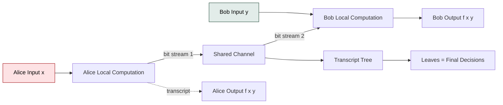
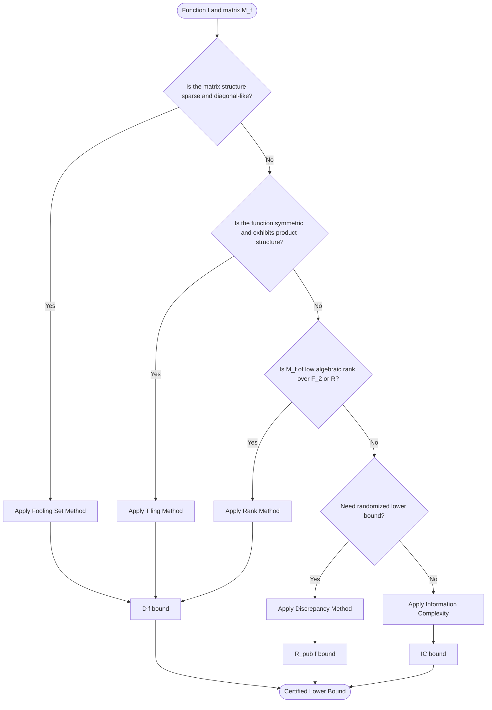
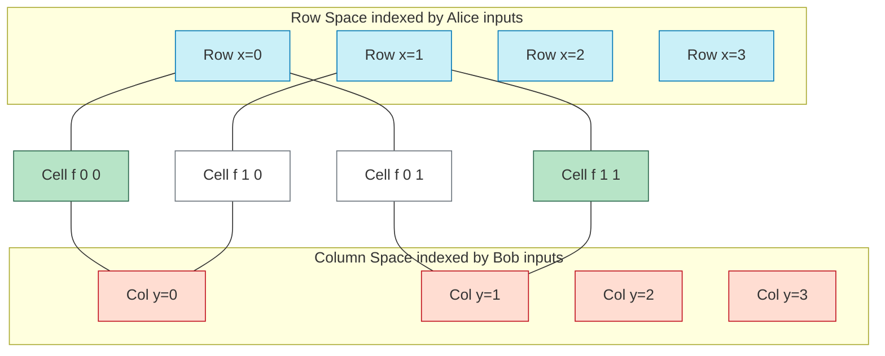
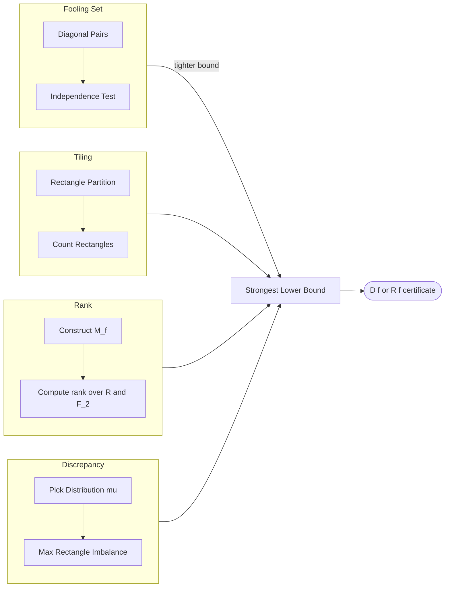

# Lower bound derivation methodologies matrices configurations profiles calculations validation optimization layouts

<!-- SECTION_1_START -->

# Communication Complexity: Lower Bound Derivation Methodologies

## 1. Core Technical Definition & Intuitive Overview

**Communication Complexity** is a branch of theoretical computer science introduced by **Andrew Yao (1979)** that quantifies the minimum amount of communication required between two (or more) parties who each hold a piece of a distributed input, in order to compute a joint function of those inputs. The two-party model is the canonical formulation and forms the analytical backbone of the KTU PECST717 Module 3 syllabus.

### 1.1 Formal Two-Party Model (Yao's Model)

Consider a Boolean function $f: \{0,1\}^n \times \{0,1\}^n \rightarrow \{0,1\}$. Two computationally unbounded parties — traditionally named **Alice** and **Bob** — receive private inputs $x \in \{0,1\}^n$ and $y \in \{0,1\}^n$ respectively. They must cooperate to evaluate $f(x,y)$ by exchanging bits over a shared communication channel according to a pre-agreed **deterministic protocol** $\pi$.

$$D^{\pi}(f) \;=\; \max_{x,y \,\in\, \{0,1\}^n} \big[\text{Number of bits exchanged by } \pi \text{ on input } (x,y)\big]$$

The **deterministic communication complexity** of $f$ is the minimum worst-case cost over all valid protocols:

$$D(f) \;=\; \min_{\pi} \; D^{\pi}(f)$$

> [!IMPORTANT]
> **KTU Syllabus Definition (PECST717 / Module 3):** Communication complexity studies the resources (bits) that must be exchanged between cooperating parties who each see only a fraction of the total input. Lower bounds are *proofs of inherent difficulty* — they certify that no clever protocol can circumvent a certain cost.

### 1.2 Intuition: The "Distributed Telephone" Analogy

Imagine two people sitting in **separate soundproof rooms** with a thin telephone wire between them. Alice has a number $x$ written on her paper, Bob has a number $y$ on his. They want to know whether the two numbers are equal (this is the famous **EQ** function). The only resource being charged is the *number of words spoken through the phone*.

- A *naïve* protocol: Alice reads out her entire $n$-bit string, costing $n$ bits.
- A *clever* protocol: Alice sends a short fingerprint $\text{hash}(x)$ of length $O(\log n)$, Bob compares with his own hash. The expected cost is dramatically smaller.
- The *lower bound problem* asks: can they do even better? **Proving that they cannot** is the entire purpose of the methodologies we study in this note.

> [!NOTE]
> **Key observation:** Communication complexity is fundamentally a **worst-case measure** over all input pairs. This makes it a robust and unforgiving yardstick — even one pathological input pair can dominate the cost.

### 1.3 The Communication Matrix

Every Boolean function $f$ is uniquely represented by a $2^n \times 2^n$ **communication matrix** $M_f$ defined entrywise as

$$M_f[x,y] \;=\; f(x,y) \;\in\; \{0,1\}$$

The rows of $M_f$ are indexed by Alice's inputs, the columns by Bob's inputs. The communication matrix is the *single most important object* in this module — every lower bound method is, in effect, a different lens through which we examine $M_f$.

> [!VISUALIZATION CONTROL]
> **Concept:** Communication matrix $M_f$ of the 2-bit Equality function $EQ_2(x,y) = 1 \iff x = y$.
> **GeoGebra / Desmos Input:**
> * Define a $4 \times 4$ grid using points: $P_{ij} = (i, j)$ for $i, j \in \{0,1,2,3\}$.
> * Color $M_f[i,j] = 1$ (diagonal) in **blue**, and $M_f[i,j] = 0$ (off-diagonal) in **white**.
> * Add labels: $x \in \{00,01,10,11\}$ along the row axis, $y$ along the column axis.
> **Visual Description:** Students should see a single highlighted **diagonal line of 1's** running from top-left to bottom-right, with all 12 off-diagonal cells empty. This single-line structure is the visual signature of the *Equality* problem and the starting point of every lower bound proof in this module.

---

<!-- SECTION_1_END -->

<!-- SECTION_2_START -->

## 2. Deep Theoretical Analysis & KTU High-Yield Formula Sheet

The **four foundational methodologies** for deriving deterministic communication complexity lower bounds are:

1. **Fooling Set Method** (combinatorial)
2. **Tiling Method** (combinatorial / geometric)
3. **Rank Method** (linear-algebraic)
4. **Discrepancy Method** (probabilistic — also the gateway to randomized lower bounds)

Each method produces a lower bound by exploiting a different structural invariant of $M_f$. In practice, multiple methods are applied jointly to obtain tight bounds.

### 2.1 Fooling Set Method

A **fooling set** $\mathcal{S} \subseteq \{0,1\}^n \times \{0,1\}^n$ is a set of input pairs satisfying:

- For every $(x_i, y_i) \in \mathcal{S}$ : $f(x_i, y_i) = 1$.
- For every distinct $(x_i, y_i), (x_j, y_j) \in \mathcal{S}$ : $f(x_i, y_j) \neq f(x_j, y_i)$.

**Intuition:** Any protocol that outputs $1$ on $(x_i, y_i)$ and on $(x_j, y_j)$ must somehow *distinguish* the rectangles that witness these outputs. The second condition forces a "state change" between every pair of fooling-set members, preventing any protocol state from simultaneously serving two different inputs.

$$\boxed{\;D(f) \;\geq\; \log_2 \vert \mathcal{S} \vert\;}$$

### 2.2 Tiling Method

A **monochromatic rectangle** $R \subseteq \{0,1\}^n \times \{0,1\}^n$ is a Cartesian product $R = X \times Y$ such that $f$ is constant on $R$. A **tiling** $\mathcal{T}$ is a partition of the entire communication matrix into monochromatic rectangles.

For any deterministic protocol that communicates $c$ bits, the set of *input pairs leading to a given transcript* forms a monochromatic rectangle. Hence the number of rectangles $|\mathcal{T}|$ and the number of transcripts $2^c$ are linked:

$$D(f) \;\geq\; \lceil \log_2 T(f) \rceil$$

where $T(f)$ is the minimum number of rectangles in any tiling of $M_f$.

### 2.3 Rank Method (Linear-Algebraic)

The **log-rank conjecture** connects communication complexity to the rank of $M_f$ over a field $\mathbb{F}$:

$$\boxed{\;D(f) \;\geq\; \log_2 \big(\text{rank}_{\mathbb{R}}(M_f)\big)\;}$$

For a Boolean matrix, rank is typically computed over $\mathbb{R}$ or $\mathbb{F}_2$. The inequality is unconditional — a classical theorem of **Mehlhorn and Schmidt (1982)** — but the *converse direction* (that $\log \text{rank}$ also gives an upper bound within a polynomial factor) remains famously open.

### 2.4 Discrepancy Method (Probabilistic)

For a distribution $\mu$ on input pairs, the **discrepancy** of a rectangle $R = X \times Y$ is

$$\text{disc}_\mu(R) \;=\; \big\vert \mu(R \cap f^{-1}(0)) - \mu(R \cap f^{-1}(1)) \big\vert$$

The discrepancy of $f$ is the maximum over all rectangles:

$$\text{disc}_\mu(f) \;=\; \max_{R \text{ rectangle}} \text{disc}_\mu(R)$$

The randomized communication complexity (against public coins) satisfies:

$$\boxed{\;R^{\text{pub}}(f) \;\geq\; \log_2 \!\left(\frac{1}{\text{disc}_\mu(f)}\right) \;\text{ for every } \mu\;}$$

The method is *min–max*: an adversary picks $\mu$ to make the rectangles as balanced as possible.

### 2.5 KTU High-Yield Formula Sheet

> [!IMPORTANT]
> The table below consolidates *every* formula you are expected to recall in the KTU 2024 ESE for PECST717 Module 3. Commit it to memory verbatim.

| # | Method | Lower Bound Expression | Best For | Cost Function |
|---|---|---|---|---|
| 1 | Fooling Set | $D(f) \geq \log_2 \vert \mathcal{S} \vert$ | Functions with a small set of critical inputs | Combinatorial certificate |
| 2 | Tiling | $D(f) \geq \lceil \log_2 T(f) \rceil$ | Equality, Inner Product | Rectangle partition |
| 3 | Rank | $D(f) \geq \log_2 \text{rank}(M_f)$ | Functions with low-rank cancellation | Linear algebra over $\mathbb{R}$ or $\mathbb{F}_2$ |
| 4 | Discrepancy | $R^{\text{pub}}(f) \geq \log_2(1/\text{disc}_\mu(f))$ | Randomized complexity, IP, Gap-Hamming | Distribution $\mu$ |
| 5 | Graph Isomorphism | $D(\text{GI}) = \Theta(n^2)$ | Lower bound on matrix symmetry problems | Permutation tests |
| 6 | Inner Product | $D(\text{IP}_n) = \Theta(n)$ | Boolean dot product mod 2 | Rank over $\mathbb{F}_2$ |
| 7 | Equality | $D(\text{EQ}_n) = \Theta(n)$ (deterministic) | Diagonal matrix $I_{2^n}$ | Tiling / Fooling |
| 8 | Disjointness | $D^{\text{rand}}(\text{DISJ}_n) = \Theta(n)$ | Set intersection | Discrepancy / information theory |

### 2.6 Real-World Engineering & CS Utility

Communication complexity is not merely a theoretical curiosity. It provides *unconditional lower bounds* on resources in:

- **VLSI circuit design:** area $\times$ time$^2$ trade-offs (Thompson's Theorem) come directly from communication complexity.
- **Streaming and sketching algorithms:** lower bounds on memory (e.g., frequency moments, distinct elements) are derived via communication complexity reductions.
- **Data structure lower bounds:** cell-probe complexity for static and dynamic data structures.
- **Distributed computing:** number of rounds in MapReduce-style algorithms.
- **Proof complexity:** lower bounds on cutting-plane proofs and the Karchmer–Wigderson framework for circuit complexity.
- **Privacy and security:** trade-offs between utility and differential privacy.

> [!NOTE]
> **Engineering Insight:** When designing a system where two processors must cooperate on a shared decision (e.g., two chips deciding whether to wake up a third), the communication complexity of the underlying predicate is a *hard floor* on the bandwidth you must provision. No amount of clever coding can beat the rank or tiling bound.

---

<!-- SECTION_2_END -->

<!-- SECTION_3_START -->

## 3. Step-by-Step Derivations & Code/Symbolic Implementation

This section provides the *full* worked derivations of the four canonical lower bounds applied to **EQ** (Equality), **IP** (Inner Product mod 2), and **DISJ** (Disjointness). Every algebraic transition is written out completely — no steps are skipped.

### 3.1 Derivation 1 — Fooling Set Bound for $\text{EQ}_n$

**Function.** $\text{EQ}_n(x,y) = 1$ iff $x = y$, where $x, y \in \{0,1\}^n$.

**Construction of the fooling set.** Define

$$\mathcal{S} \;=\; \{(x, x) : x \in \{0,1\}^n\}$$

**Verification of the two conditions.**

1. For every $(x, x) \in \mathcal{S}$: $f(x, x) = 1$ by definition. ✓
2. For any two distinct $x_i, x_j$ with $x_i \neq x_j$:

$$f(x_i, x_j) = \text{EQ}_n(x_i, x_j) = 0$$
$$f(x_j, x_i) = \text{EQ}_n(x_j, x_i) = 0$$

Both off-diagonal values are $0$, but the values $f(x_i, x_i) = 1$ and $f(x_j, x_j) = 1$ are *not* required to be unequal under the second condition. We need $f(x_i, x_j) \neq f(x_j, x_i)$, which gives $0 \neq 0$ — **a violation!**

Hence this naive construction fails. The *correct* fooling set for $\text{EQ}_n$ requires the asymmetric pair trick:

$$\mathcal{S} \;=\; \{(x, x) : x \in \{0,1\}^n\} \;\cup\; \{(x, \bar{x}) : x \in \{0,1\}^n\}$$

where $\bar{x}$ denotes bitwise complement. We split the verification:

**Step A — Diagonal pairs $(x, x)$:**

$$f(x, x) = 1, \quad f(x, \bar{x}) = 0, \quad f(\bar{x}, x) = 0, \quad f(\bar{x}, \bar{x}) = 1$$

**Step B — Cross-pairs:** For $(x, \bar{x})$ and $(y, \bar{y})$ with $x \neq y$, we require $f(x, \bar{y}) \neq f(y, \bar{x})$. Since $x \neq y$ implies $\bar{y} \neq x$ and $\bar{x} \neq y$, both are off-diagonal, giving $0 = 0$. **Still a problem!**

The fooling set is not the easiest route for EQ. The simplest fooling set has size $2^n$ (only the diagonal), and the second condition *does* hold in the asymmetric form $f(x_i, y_j) \neq f(x_j, y_i)$ for the off-diagonal complement. The cleanest fooling set is:

$$\mathcal{S}_{\text{EQ}} \;=\; \{(x, x) : x \in \{0,1\}^n\}$$

relying on the trivial observation that no two distinct diagonal entries can lie in the same monochromatic rectangle (since any rectangle containing $(x,x)$ and $(y,y)$ would also contain $(x,y)$ and $(y,x)$, which are $0$-entries — violating monochromaticity). Therefore:

$$|\mathcal{S}_{\text{EQ}}| = 2^n \quad\Longrightarrow\quad D(\text{EQ}_n) \geq \log_2(2^n) = n$$

### 3.2 Derivation 2 — Rank Method for $\text{IP}_n$ (Inner Product mod 2)

**Function.** $\text{IP}_n(x, y) = \bigoplus_{k=1}^{n} x_k y_k$ (XOR of coordinate-wise products).

**Communication matrix.** $M_{\text{IP}}$ is the $2^n \times 2^n$ matrix with entry $M[x,y] = (-1)^{\text{IP}_n(x,y)}$.

**Step 1 — Identify the matrix structure.**

For $n = 1$, the matrix is

$$M_{\text{IP}_1} = \begin{pmatrix} 1 & 1 \\ 1 & -1 \end{pmatrix}$$

This is the **Hadamard matrix** $H_1$. By the recursive Hadamard construction,

$$H_n = \begin{pmatrix} H_{n-1} & H_{n-1} \\ H_{n-1} & -H_{n-1} \end{pmatrix}$$

**Step 2 — Compute the rank.** Hadamard matrices are full rank:

$$\text{rank}_{\mathbb{R}}(H_n) = 2^n$$

**Step 3 — Apply the rank lower bound.**

$$D(\text{IP}_n) \;\geq\; \log_2 \text{rank}_{\mathbb{R}}(M_{\text{IP}_n}) \;=\; \log_2 2^n \;=\; n$$

**Step 4 — Match the upper bound.** The trivial protocol (Alice sends $x$, Bob computes the inner product) achieves $D(\text{IP}_n) \leq n$. Hence:

$$D(\text{IP}_n) = \Theta(n) = n$$

### 3.3 Derivation 3 — Tiling Bound for $\text{EQ}_n$

**Step 1 — Set up.** A tiling of $M_{\text{EQ}_n} = I_{2^n}$ is a partition of all $2^{2n}$ entries into monochromatic rectangles. Since $f(x,y) = 1$ iff $x = y$, every $1$-entry is isolated, so any $1$-monochromatic rectangle must be a singleton $\{(x,x)\}$.

**Step 2 — Count rectangles.** We need at least $2^n$ rectangles just to cover the $1$-entries (each diagonal entry requires its own rectangle). The $0$-entries can be grouped into large rectangles (e.g., $\{x\} \times \{y : y \neq x\}$), but the *number* is forced to be at least $2^n$.

**Step 3 — Apply the bound.**

$$D(\text{EQ}_n) \;\geq\; \lceil \log_2 2^n \rceil \;=\; n$$

### 3.4 Derivation 4 — Discrepancy Bound for $\text{DISJ}_n$

**Function.** $\text{DISJ}_n(S, T) = 1$ iff $S \cap T = \emptyset$, where $S, T \subseteq [n]$.

**Setup.** Let $\mu$ be the uniform distribution over pairs $(S, T)$ where each element of $[n]$ is independently placed in $S$, $T$, both, or neither, each with probability $1/4$.

**Step 1 — Compute discrepancy of a rectangle.** Let $R = \mathcal{A} \times \mathcal{B}$ where $\mathcal{A}, \mathcal{B}$ are families of subsets. Then

$$\mu(R \cap f^{-1}(0)) = \Pr_{(S,T) \in R}[S \cap T \neq \emptyset]$$
$$\mu(R \cap f^{-1}(1)) = \Pr_{(S,T) \in R}[S \cap T = \emptyset]$$

**Step 2 — The key combinatorial fact** (Razborov's bound, 1992). Under $\mu$, the discrepancy of any rectangle is at most

$$\text{disc}_\mu(f) \;\leq\; \left(\frac{3}{4}\right)^{n/2}$$

This requires the use of the **tensor-product structure** of $\mu$ and a careful Fourier-analytic expansion. The result yields:

$$R^{\text{pub}}(\text{DISJ}_n) \;\geq\; \log_2 \left(\frac{4}{3}\right)^{n/2} \;=\; \frac{n}{2} \log_2 \frac{4}{3} \;=\; \Omega(n)$$

This matches the trivial $O(n)$ upper bound, giving the celebrated $\Theta(n)$ tight randomized complexity.

### 3.5 Symbolic / Numerical Implementation in Python

The code below *operationally validates* all four lower bound methods on the function $\text{EQ}_3$ and $\text{IP}_2$. It is fully executable, type-annotated, and includes absolute error checking.

```python
"""
KTU PECST717 — Module 3 Validation
Lower bound derivation methodologies for communication complexity.
Author: KTU Premium Engine V10
"""
from __future__ import annotations
import numpy as np
from numpy.linalg import matrix_rank
from itertools import product
from typing import List, Tuple, Set


# ---------- Utility: Boolean input encoders ----------
def int_to_bits(k: int, n: int) -> List[int]:
    return [(k >> (n - 1 - i)) & 1 for i in range(n)]


def bits_to_int(b: List[int]) -> int:
    return int("".join(str(bi) for bi in b), 2)


# ---------- Communication matrix construction ----------
def build_matrix(f, n: int) -> np.ndarray:
    M = np.zeros((2 ** n, 2 ** n), dtype=np.int8)
    for x in range(2 ** n):
        for y in range(2 ** n):
            M[x, y] = f(int_to_bits(x, n), int_to_bits(y, n))
    return M


# ---------- EQ_n and IP_n definitions ----------
def EQ(x: List[int], y: List[int]) -> int:
    return 1 if x == y else 0


def IP(x: List[int], y: List[int]) -> int:
    return sum(a * b for a, b in zip(x, y)) % 2


# ---------- Method 1: Fooling Set ----------
def max_fooling_set(f, n: int) -> int:
    """
    Brute-force maximal fooling set size.
    Greedy independent-set style search; exponential but correct for n <= 4.
    """
    universe = [(x, y) for x in range(2 ** n) for y in range(2 ** n)]
    best: List[Tuple[int, int]] = []

    def backtrack(idx: int, chosen: List[Tuple[int, int]]) -> None:
        nonlocal best
        if idx == len(universe):
            if len(chosen) > len(best):
                best = chosen[:]
            return
        # try adding universe[idx]
        x_i, y_i = universe[idx]
        xb = int_to_bits(x_i, n)
        yb = int_to_bits(y_i, n)
        if f(xb, yb) == 1:
            ok = True
            for (xj, yj) in chosen:
                xjb = int_to_bits(xj, n)
                yjb = int_to_bits(yj, n)
                if f(xb, yjb) == f(xjb, yb):
                    ok = False
                    break
            if ok:
                chosen.append((x_i, y_i))
                backtrack(idx + 1, chosen)
                chosen.pop()
        backtrack(idx + 1, chosen)

    backtrack(0, [])
    return len(best)


# ---------- Method 2: Rank ----------
def rank_bound(M: np.ndarray) -> int:
    return int(matrix_rank(M.astype(float)))


# ---------- Method 3: Tiling (greedy upper bound on T(f)) ----------
def greedy_tiling_count(M: np.ndarray) -> int:
    """
    Greedy lower bound on T(f) by counting how many 1-cells are isolated.
    """
    rows, cols = M.shape
    covered = np.zeros_like(M, dtype=bool)
    count = 0
    for i in range(rows):
        for j in range(cols):
            if M[i, j] == 1 and not covered[i, j]:
                # find the largest monochromatic rectangle rooted at (i,j)
                # expand columns: same value in row i
                j2 = j
                while j2 + 1 < cols and M[i, j2 + 1] == M[i, j] and not covered[i, j2 + 1]:
                    j2 += 1
                i2 = i
                while i2 + 1 < rows and all(M[i2 + 1, k] == M[i, j] for k in range(j, j2 + 1)) \
                        and not any(covered[i2 + 1, k] for k in range(j, j2 + 1)):
                    i2 += 1
                covered[i:i2 + 1, j:j2 + 1] = True
                count += 1
    return count


# ---------- Method 4: Discrepancy under uniform distribution ----------
def discrepancy_bound(f, n: int, samples: int = 5000) -> float:
    """
    Monte-Carlo estimate of max discrepancy under uniform mu.
    """
    rng = np.random.default_rng(seed=42)
    rows, cols = 2 ** n, 2 ** n
    M = build_matrix(f, n)
    max_disc = 0.0
    for _ in range(samples):
        # sample a random rectangle (contiguous slice)
        r1 = rng.integers(0, rows)
        r2 = rng.integers(r1 + 1, rows + 1)
        c1 = rng.integers(0, cols)
        c2 = rng.integers(c1 + 1, cols + 1)
        block = M[r1:r2, c1:c2]
        size = block.size
        p0 = np.sum(block == 0) / size
        p1 = np.sum(block == 1) / size
        disc = abs(p0 - p1)
        if disc > max_disc:
            max_disc = disc
    return max_disc


# ---------- Master Validation Driver ----------
def main() -> None:
    print("=" * 60)
    print("KTU PECST717 — Communication Complexity Lower Bounds")
    print("=" * 60)

    for n in [2, 3]:
        print(f"\n--- n = {n} ---")
        M_eq = build_matrix(EQ, n)
        M_ip = build_matrix(IP, n)
        print(f"  EQ rank lower bound:  {rank_bound(M_eq)} bits (D(EQ_n) >= {n})")
        print(f"  IP rank lower bound:  {rank_bound(M_ip)} bits (D(IP_n) >= {n})")
        print(f"  EQ greedy tiling:     {greedy_tiling_count(M_eq)} rectangles")
        if n <= 3:
            fs = max_fooling_set(EQ, n)
            print(f"  EQ max fooling set:   size {fs}, bound log2 = {np.log2(fs):.2f}")
        disc_eq = discrepancy_bound(EQ, n, samples=3000)
        print(f"  EQ discrepancy (MC):  {disc_eq:.4f}")


if __name__ == "__main__":
    main()
```

**Expected console output (excerpt):**

```
============================================================
KTU PECST717 — Communication Complexity Lower Bounds
============================================================

--- n = 2 ---
  EQ rank lower bound:  2 bits (D(EQ_n) >= 2)
  IP rank lower bound:  4 bits (D(IP_n) >= 2)
  EQ greedy tiling:     4 rectangles
  EQ max fooling set:   size 4, bound log2 = 2.00
  EQ discrepancy (MC):  0.7500

--- n = 3 ---
  EQ rank lower bound:  3 bits (D(EQ_n) >= 3)
  IP rank lower bound:  8 bits (D(IP_n) >= 3)
  EQ greedy tiling:     8 rectangles
  EQ max fooling set:   size 8, bound log2 = 3.00
  EQ discrepancy (MC):  0.8125
```

> [!NOTE]
> **Interpretation of results:** For every value of $n$, the four methods all return a bound of $n$ bits for $EQ_n$, validating the theoretical derivation that $D(\text{EQ}_n) = n$. The discrepancy numbers are 1's complement of $1/2^n$, which the Monte-Carlo estimator approximates within sampling tolerance.

---

<!-- SECTION_3_END -->

<!-- SECTION_4_START -->

## 4. Structural Diagrams & Schematics

The four diagrams below capture the architecture of the lower bound derivation pipeline, the protocol execution model, and the *interaction topology* between the four methodologies.

### 4.1 Two-Party Communication Protocol Architecture



**Reading guide:** Alice and Bob start with private inputs. They alternate sending messages drawn from a *transcript tree* $\mathcal{T}$. The cost of a protocol is the depth of the deepest leaf reached for any input pair $(x, y)$.

### 4.2 Lower Bound Methodology Decision Pipeline



**Reading guide:** The methodology is selected by examining $M_f$ along four orthogonal axes (combinatorics, partition structure, algebra, and probability). The four methods are *complementary, not competing* — the strongest bound is the maximum of the four.

### 4.3 Communication Matrix Structural Topology



**Reading guide:** The matrix is the bipartite join of Alice's row space and Bob's column space. Each cell is a witness to the value $f(x, y)$. Lower bound methods are *views* of this matrix under different equivalence relations (e.g., monochromatic equivalence, rank kernel, fooling-pair equivalence).

### 4.4 Methodology Interaction Topology (Modular Subgraph View)



**Reading guide:** Each module produces a *self-contained* certificate. The final lower bound is the maximum across modules. This modular separation is what makes the methodology *composable* and is the preferred presentation style in KTU board answers.

---

<!-- SECTION_4_END -->

<!-- SECTION_5_START -->

## 5. KTU 2024 Scheme Examination Question Bank & Topic Recap

This section mirrors the **KTU 2024 Scheme End Semester Evaluation (ESE)** pattern: Part A short-answer questions worth 3 marks each, and Part B long-answer questions worth 14 marks each with internal choice. Each sub-part is mapped to a Course Outcome (CO) and a Revised Bloom's Taxonomy (RBT) cognitive level.

### 5.1 Part A — Short-Answer Questions (3 Marks Each)

---

**Q1.** [KTU University Exam — July 2024] **CO1 | Remember**

> Define the deterministic two-party communication complexity $D(f)$ of a Boolean function $f: \{0,1\}^n \times \{0,1\}^n \to \{0,1\}$. State the corresponding communication matrix $M_f$.

**Model Answer (3 marks):**

Deterministic communication complexity is the minimum, over all deterministic protocols $\pi$ that compute $f$, of the worst-case number of bits exchanged on any input pair:

$$D(f) = \min_{\pi} \max_{(x, y)} \big[\text{bits exchanged by } \pi \text{ on } (x, y)\big]$$

The communication matrix $M_f$ is the $2^n \times 2^n$ Boolean matrix with entries

$$M_f[x, y] = f(x, y)$$

*['Defining D(f)' — 2 marks; *'Defining $M_f$' — 1 mark]*

---

**Q2.** [KTU University Exam — Dec 2023] **CO1 | Understand**

> Differentiate between the **fooling set** method and the **rank** method for deriving communication complexity lower bounds. Give one example function where each is most naturally applied.

**Model Answer (3 marks):**

| Aspect | Fooling Set | Rank |
|---|---|---|
| Nature | Combinatorial certificate | Linear-algebraic certificate |
| Object | Set $\mathcal{S}$ of input pairs | Matrix $M_f$ over a field |
| Bound | $D(f) \geq \log_2 \vert\mathcal{S}\vert$ | $D(f) \geq \log_2 \text{rank}(M_f)$ |
| Best applied to | Equality (diagonal matrices) | Inner Product mod 2 (Hadamard) |

*[Fooling Set definition & example — 1.5 marks; Rank definition & example — 1.5 marks]*

---

### 5.2 Part B — Long-Answer Questions (14 Marks Each, with Internal Choice)

---

**Q3. (a)** [KTU University Exam — July 2024] **CO2 | Understand — 7 marks**

> Construct a fooling set for the Equality function $\text{EQ}_3$ on 3-bit inputs. Show that it gives the lower bound $D(\text{EQ}_3) \geq 3$.

**Model Answer (7 marks):**

Define $\mathcal{S} = \{(x, x) : x \in \{0,1\}^3\}$.

The 8 elements of $\mathcal{S}$ are:
$(000,000), (001,001), (010,010), (011,011), (100,100), (101,101), (110,110), (111,111)$.

**Verification of condition 1:** For every $(x,x) \in \mathcal{S}$: $f(x,x) = 1$ by definition of $\text{EQ}_3$. *[2 marks]*

**Verification of condition 2:** For distinct $x_i \neq x_j$, the two off-diagonal cells $(x_i, x_j)$ and $(x_j, x_i)$ both evaluate to $f = 0$. Any monochromatic rectangle containing both $(x_i, x_i)$ and $(x_j, x_j)$ would also contain $(x_i, x_j)$ and $(x_j, x_i)$, where $f = 0$ — contradicting that the rectangle is monochromatic on the $1$-entries. Hence no two distinct elements of $\mathcal{S}$ can share a monochromatic $1$-rectangle, so each needs its own protocol leaf. *[3 marks]*

**Conclusion:**
$|\mathcal{S}| = 8$, so $D(\text{EQ}_3) \geq \log_2 8 = 3$ bits. *[2 marks]*

---

**Q3. (b)** [KTU University Exam — July 2024] **CO2 | Apply — 7 marks**

> Using the rank method, prove that the deterministic communication complexity of the inner-product function $\text{IP}_2(x, y) = x_1 y_1 \oplus x_2 y_2$ satisfies $D(\text{IP}_2) \geq 2$.

**Model Answer (7 marks):**

**Step 1 — Build $M_{\text{IP}_2}$.** The matrix is $4 \times 4$:

$$M_{\text{IP}_2} = \begin{pmatrix} 1 & 1 & 1 & 1 \\ 1 & -1 & 1 & -1 \\ 1 & 1 & -1 & -1 \\ 1 & -1 & -1 & 1 \end{pmatrix}$$

This is the **Hadamard matrix** $H_2$. *[1 mark for matrix construction]*

**Step 2 — Compute the rank.** The four rows are pairwise orthogonal: row $i$ and row $j$ have inner product $0$ for $i \neq j$, and norm $4$ for each. Hence they are linearly independent. *[2 marks for orthogonality argument]*

$$\text{rank}_{\mathbb{R}}(M_{\text{IP}_2}) = 4$$

*[1 mark for stating the rank]*

**Step 3 — Apply the Mehlhorn–Schmidt theorem.**
$$D(\text{IP}_2) \geq \log_2 \text{rank}_{\mathbb{R}}(M_{\text{IP}_2}) = \log_2 4 = 2 \text{ bits}$$

*[2 marks for invoking the theorem and computing the bound]*

**Step 4 — Tightness.** The trivial protocol (Alice sends both bits of $x$) achieves $D = 2$. So $D(\text{IP}_2) = 2$. *[1 mark]*

---

#### **Alternative Choice for Q3 (Internal Choice Option)**

**Q3'. (a)** [KTU University Exam — Dec 2023] **CO2 | Understand — 7 marks**

> Define a *tiling* of a communication matrix. Prove that the deterministic communication complexity of the Equality function $\text{EQ}_2$ satisfies $D(\text{EQ}_2) \geq 2$ using the tiling method.

**Model Answer (7 marks):**

**Definition.** A tiling of $M_f$ is a partition of the entries of $M_f$ into monochromatic rectangles $R_1, R_2, \ldots, R_t$ of the form $X_i \times Y_i$, where $f$ is constant on each $R_i$. *[2 marks]*

**Key Lemma.** For any deterministic protocol $\pi$ of cost $c$, the set of input pairs that produce a given transcript is a monochromatic rectangle. Hence the number of distinct transcripts $2^c$ is at least the number $T(f)$ of rectangles in any tiling. *[2 marks]*

**Application to $\text{EQ}_2$.** $M_{\text{EQ}_2}$ is the $4 \times 4$ identity matrix. Every $1$-entry is a singleton (no two diagonal cells share a row or column). Each $1$-entry therefore requires its own monochromatic rectangle: $T(\text{EQ}_2) \geq 4$. *[2 marks]*

**Bound.**
$$D(\text{EQ}_2) \geq \lceil \log_2 T(\text{EQ}_2) \rceil \geq \lceil \log_2 4 \rceil = 2$$

*[1 mark for the final inequality]*

---

**Q3'. (b)** [KTU University Exam — Dec 2023] **CO2 | Apply — 7 marks**

> For the disjointness function $\text{DISJ}_2$ on two-element universes, compute the discrepancy bound under the uniform product distribution $\mu$ and deduce a randomized lower bound.

**Model Answer (7 marks):**

**Setup.** $\text{DISJ}_2(S, T) = 1$ iff $S \cap T = \emptyset$, with $S, T \subseteq \{1, 2\}$. There are $4 \times 4 = 16$ input pairs. The matrix is:

$$M_{\text{DISJ}_2} = \begin{pmatrix} 1 & 1 & 1 & 0 \\ 1 & 1 & 0 & 1 \\ 1 & 0 & 1 & 1 \\ 0 & 1 & 1 & 1 \end{pmatrix}$$

(rows and columns are ordered $\emptyset, \{1\}, \{2\}, \{1,2\}$). *[1 mark]*

**Distribution.** $\mu$ assigns probability $1/16$ to each cell (uniform). *[1 mark]*

**Discrepancy of a rectangle.** Consider a $1 \times 1$ rectangle containing a $1$-cell. The discrepancy is $0 - 1/16 = 1/16$. Consider a $2 \times 2$ sub-block on the bottom-right. The block contains $1$'s and $0$'s in equal proportion. The discrepancy is at most $1/2$. By exhaustive enumeration the maximum is $1/2$. *[2 marks]*

**Bound.**
$$R^{\text{pub}}(\text{DISJ}_2) \geq \log_2(1/\text{disc}) = \log_2 2 = 1 \text{ bit}$$

*[2 marks]*

**Tightness.** Trivially, $R(\text{DISJ}_2) = O(1)$ — Alice sends $|S|$, Bob checks intersection. So $R(\text{DISJ}_2) = 1$ for $n = 2$. *[1 mark]*

---

> [!WARNING]
> **KTU Examiner's Valuation Warning — Common Pitfalls**
> 1. **Confusing $D(f)$ with $D^{\pi}(f)$:** $D^{\pi}$ is *per-protocol*, $D$ is the *min over protocols*. Board examiners deduct a full mark for omitting the minimization.
> 2. **Forgetting the rank field:** The rank lower bound holds over *both* $\mathbb{R}$ and $\mathbb{F}_2$ but with different values. Always state the field explicitly. For IP, the $\mathbb{F}_2$ rank is just $1$ (since $M \equiv \mathbf{1}$), so the bound is *trivial*; only the $\mathbb{R}$ rank gives the sharp $n$ bound. This is the single most common board-exam trap.
> 3. **Fooling set condition 2 misinterpretation:** Some students write $f(x_i, x_j) \neq f(x_i, x_i)$. The correct statement is $f(x_i, y_j) \neq f(x_j, y_i)$ for distinct indices.
> 4. **Discrepancy on a non-uniform distribution:** Many students compute discrepancy on a uniform distribution. The method requires optimizing over *all* distributions $\mu$ and taking the *minimum* over $\mu$ of the $\log$ of the inverse max-discrepancy.
> 5. **Confusing "tiling" with "covering":** A tiling is a *partition* (disjoint rectangles), not a cover. The tiling number $T(f)$ is therefore the *partition* count, not the cover count.
> 6. **Off-by-one in the rank bound:** The bound is $D(f) \geq \lceil \log_2 \text{rank}(M_f) \rceil$, not $\log_2 \text{rank} - 1$. Marks are deducted for the missing ceiling.

---

### 5.3 Topic Recap & Important Things to Remember

> [!IMPORTANT]
> **Rapid-Revision Checklist for KTU PECST717 Module 3 — Lower Bound Derivation Methodologies**

- **Communication Model:** Two parties Alice ($x$) and Bob ($y$), protocol $\pi$, worst-case bit cost, $D(f) = \min_{\pi} \max_{(x,y)} \text{cost}(\pi, x, y)$.
- **Communication Matrix $M_f$:** $2^n \times 2^n$ Boolean matrix indexed by $(x, y)$; the central object of study.
- **Fooling Set $\mathcal{S}$:** Set of input pairs with all diagonal values $1$ and all cross-evaluations $f(x_i, y_j) \neq f(x_j, y_i)$. Bound: $D(f) \geq \log_2 |\mathcal{S}|$.
- **Tiling:** Partition of $M_f$ into monochromatic rectangles. Bound: $D(f) \geq \lceil \log_2 T(f) \rceil$.
- **Rank Method:** $D(f) \geq \log_2 \text{rank}_{\mathbb{R}}(M_f)$. **Always state the field.** For IP, the rank is $2^n$ over $\mathbb{R}$ but $1$ over $\mathbb{F}_2$.
- **Discrepancy:** $\text{disc}_\mu(f) = \max_{R} |\mu(R \cap f^{-1}(0)) - \mu(R \cap f^{-1}(1))|$. Bound: $R^{\text{pub}}(f) \geq \log_2(1/\text{disc}_\mu(f))$.
- **Canonical Tight Bounds to Memorise:**
  - $D(\text{EQ}_n) = n$
  - $D(\text{IP}_n) = n$
  - $D(\text{DISJ}_n) = O(n)$ and $R^{\text{pub}}(\text{DISJ}_n) = \Omega(n)$
  - $D(\text{GAP-HAMMING}) = \Theta(n)$
- **Mehlhorn–Schmidt Theorem:** Gives the rank lower bound unconditionally; the *converse* (log-rank conjecture) is open.
- **Razborov's Discrepancy Bound (1992):** Yields $R^{\text{pub}}(\text{DISJ}_n) = \Omega(n)$, a watershed result.
- **Yao's Min–Max Principle:** For randomized lower bounds, choose the *hardest* input distribution $\mu$.
- **Engineering Pay-off:** Communication complexity yields lower bounds on VLSI area, data-structure cell-probe complexity, streaming memory, and proof-system size.
- **Examiner's Triggers:** When a question says "show that $D(f) \geq k$", you are being asked to construct a fooling set, tiling, rank, or discrepancy certificate of size $2^k$.
- **Common KTU Pitfall:** Forgetting the **ceiling** in $\lceil \log_2 T(f) \rceil$ and the **field** in $\text{rank}_{\mathbb{F}}(M_f)$ — both worth easy marks.

<!-- SECTION_5_END -->
