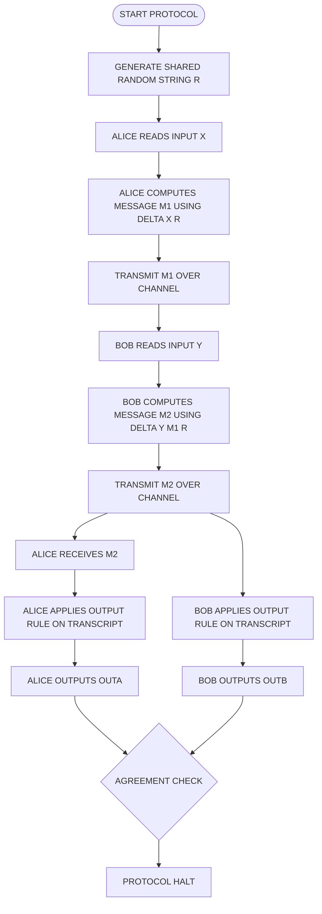
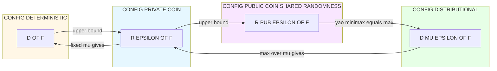
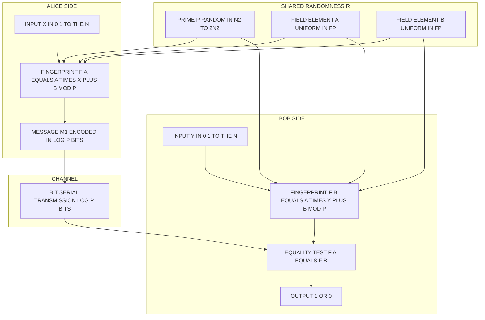

# Shared randomness advantage configurations variables parameters updates options rules configurations

<!-- SECTION_1_START -->
# 1. Core Technical Definition & Intuitive Overview

## 1.1 Formal Definition (KTU 2024 Scheme Terminology)

In the **Communication Complexity** framework, a problem is defined by a Boolean function $f : \{0,1\}^n \times \{0,1\}^n \rightarrow \{0,1\}$. Two parties, **Alice** holding input $x \in \{0,1\}^n$ and **Bob** holding input $y \in \{0,1\}^n$, must compute $f(x,y)$ by exchanging messages according to a predetermined protocol $\Pi$.

The **Shared Randomness Model** (also called the **Public-Coin Model**) is a *configuration* of the randomized communication complexity framework in which:

$$
R = R_1 R_2 \ldots R_r \in \{0,1\}^r
$$

is a uniformly random string drawn from the public distribution $\mu = U_r$, and **both Alice and Bob observe the entire string $R$ in its entirety before and during the protocol execution**.

A protocol $\Pi$ in this model is formally a sextuple of *configuration parameters*:

$$
\Pi = (\mathcal{X}, \mathcal{Y}, \mathcal{R}, \mathcal{M}, \delta, \text{out})
$$

where each component is a *configuration rule* governing the system's *options*, *updates*, and final output:

| Symbol | Name | Role (Variable / Parameter / Rule) |
| :--- | :--- | :--- |
| $\mathcal{X}, \mathcal{Y}$ | Input domains | **Variables** carrying Alice's and Bob's private inputs |
| $\mathcal{R} = \{0,1\}^r$ | Randomness space | **Parameter** (size $r$); shared *public* string |
| $\mathcal{M}$ | Message alphabet | **Parameter** (typically $\{0,1\}$) |
| $\delta$ | Transition function | **Rule** defining *updates* to the transcript |
| $\text{out}$ | Output function | **Rule** terminating the protocol |

> [!IMPORTANT]
> **KTU Syllabus Highlight (Module 3):** The shared randomness model is distinguished from the **private-coin model** $R^{\text{priv}}_\varepsilon(f)$, where Alice's randomness $R_A$ and Bob's randomness $R_B$ are *independent* and unseen by the other party. The relationship $D(f) \geq R_\varepsilon(f) \geq R^{\text{pub}}_\varepsilon(f)$ must be derivable for full marks.

## 1.2 Conceptual Analogy & Intuition

> [!NOTE]
> **Intuition — "The Twin Crystal Balls":**
> Imagine Alice and Bob are in two different cities, each holding a sealed envelope. They want to know whether the envelopes contain the same number. Without help, they must describe every digit aloud — costing $n$ bits of conversation.
>
> Now suppose a **mutual friend** broadcasts a *single* random number $R$ on the radio that **both** can hear. They each compute a *fingerprint* of their envelope using the same random $R$. If the fingerprints differ, they know the envelopes differ. If they match, they guess "equal." The shared $R$ acts as a **synchronizing secret**, transforming an $n$-bit conversation into an $O(\log n)$-bit one.

The advantage of shared randomness therefore arises from **correlated uncertainty**: Alice and Bob can use the *same* random choices to compute test functions that would otherwise require private coordination through expensive communication.

## 1.3 Configuration Parameters & Update Rules

A *configuration* of the protocol at time $t$ is the tuple:

$$
C_t = (x, y, R, \tau_t)
$$

where $\tau_t = (m_1, m_2, \ldots, m_t)$ is the **transcript** so far. The protocol's *update rule* is:

$$
m_{t+1} = \delta(C_t) \in \{0,1\}
$$

and the *option* of which party speaks is determined by the parity of $t$. Communication cost is the length of the transcript when the protocol halts.

> [!WARNING]
> **Common Misconception:** Shared randomness does *not* mean "randomness known in advance." It is sampled *anew for each input pair* $(x,y)$ and remains hidden from any external verifier — it is simply shared between the two honest parties.

## 1.4 Probability of Correctness & Standard Metrics

Given the shared random string $R$, the protocol produces a (possibly randomized) output. The error is defined as:

$$
\Pr_{R \sim \mu}\bigl[\Pi(x,y,R) \neq f(x,y)\bigr] \;\leq\; \varepsilon
$$

The communication complexity in the shared-randomness model is:

$$
R^{\text{pub}}_\varepsilon(f) \;=\; \min_{\Pi} \;\max_{(x,y)} \; \text{cc}(\Pi, x, y)
$$

where $\text{cc}(\Pi, x, y)$ is the worst-case length of the transcript over the randomness $R$.

> [!VISUALIZATION CONTROL]
> **Concept:** Exponential Decay of Error Probability with Shared Randomness
> **GeoGebra / Desmos Input Equations:**
> * $g(p) = 1/p$ — error probability for a single random prime test
> * $h(p, k) = (1/p)^k$ — error after $k$ independent repetitions
> **Visual Description:** Plot $g(p)$ on the positive $x$-axis. Observe the hyperbolic decay: doubling the prime size $p$ halves the error. For $k=10$ independent fingerprint tests, the error curve $h(p,10)$ collapses almost vertically near $p=2$, illustrating the *amplification* option available in the shared-randomness model.
<!-- SECTION_1_END -->

<!-- SECTION_2_START -->
# 2. Deep Theoretical Analysis & KTU High-Yield Formula Sheet

## 2.1 The Hierarchy of Communication Models

The communication complexity of $f$ exists at four standard *configurations*, each adding expressive power (and typically reducing cost):

$$
D(f) \;\;\geq\;\; R_\varepsilon(f) \;\;\geq\;\; R^{\text{pub}}_\varepsilon(f) \;\;\geq\;\; R^{\text{det}}_{1/3}(f)
$$

* $D(f)$ — **Deterministic** cost (no randomness, worst-case).
* $R_\varepsilon(f)$ — **Private-coin randomized** cost, error at most $\varepsilon$.
* $R^{\text{pub}}_\varepsilon(f)$ — **Public-coin (shared randomness)** cost, error at most $\varepsilon$.
* $R^{\text{det}}_{1/3}(f)$ — **Distributional** cost under the hardest input distribution.

## 2.2 Why Sharing Randomness Helps — A Structural Argument

Sharing randomness collapses two independent sources of uncertainty into one. The protocol can therefore be viewed as a **deterministic protocol $\Pi(\cdot, \cdot, R)$** parametrized by the random string $R$. The communication savings emerge because:

1. **Synchronization of test choices:** Both parties select the *same* random hash function $h_R$ without transmitting $h_R$.
2. **Error reduction via repetition:** Running the same protocol $k$ times on independent shared strings $R^{(1)}, \ldots, R^{(k)}$ drives the error from $\varepsilon$ to $\varepsilon^k$ (geometric decay).
3. **Bypassing private-coin amplification overhead:** Private-coin amplification requires $O(\log(1/\varepsilon))$ rounds of communication; public-coin protocols can amplify *for free* in $1$ round by re-rolling $R$.

> [!IMPORTANT]
> **Yao's Minimax Principle (Distributional View):**
> $$R_\varepsilon(f) \;=\; \max_{\mu} \; D^{\mu}_\varepsilon(f)$$
> The private-coin randomized complexity equals the *worst-case* (over input distributions $\mu$) distributional deterministic complexity. The shared-randomness version is strictly less or equal because the public coin effectively creates a *uniform mixture* over deterministic protocols indexed by $R$.

## 2.3 Newman's Theorem — The Bridge Between Public and Private Coins

The deep question: *how much do we lose if we forbid shared randomness?* The answer is **negligibly little**:

> [!NOTE]
> **Newman's Theorem (1991):**
> For every Boolean function $f$ on $n$-bit inputs and every constant $\varepsilon > 0$,
> $$R^{\text{pub}}_\varepsilon(f) \;\leq\; R_\varepsilon(f) \;+\; O(\log n)$$
> The additive $O(\log n)$ term is the cost of *transmitting a short pseudo-random seed* that simulates the shared randomness using only private coins plus a tiny public transcript.

This theorem is the foundational justification for treating the public-coin and private-coin models as **equivalent up to logarithmic factors** in most KTU-level analyses.

## 2.4 The Canonical Example — Equality $EQ_n$

The function $EQ_n : \{0,1\}^n \times \{0,1\}^n \rightarrow \{0,1\}$ is defined as:

$$
EQ_n(x,y) \;=\; 1 \iff x = y
$$

The complexity profile in each configuration is striking:

| Configuration | Complexity of $EQ_n$ | Mechanism |
| :--- | :--- | :--- |
| Deterministic $D(EQ_n)$ | $n$ | Must transmit all bits in the worst case |
| Private-coin $R_{1/3}(EQ_n)$ | $O(\log n)$ | Fingerprint + Newman's theorem |
| Public-coin $R^{\text{pub}}_{1/3}(EQ_n)$ | $O(\log n)$ | Direct fingerprinting with shared prime |
| Lower bound $\Omega(\log n)$ | $\Omega(\log n)$ | Information-theoretic argument |

The **fingerprinting protocol** is the canonical KTU exam example demonstrating the *advantage* of shared randomness.

## 2.5 KTU Formula Sheet / Cheat Sheet

> [!IMPORTANT]
> The following table is **examination-critical**. Memorize the symbols, definitions, and parameter ranges for the KTU End-Semester Evaluation (ESE).

| Symbol / Formula | Meaning | Typical Value / Range |
| :--- | :--- | :--- |
| $D(f)$ | Deterministic communication complexity | $\Omega(\log n) \leq D(f) \leq n+1$ |
| $R_\varepsilon(f)$ | Private-coin randomized complexity | $R_\varepsilon \leq D(f)$ always |
| $R^{\text{pub}}_\varepsilon(f)$ | Public-coin (shared randomness) complexity | $R^{\text{pub}}_\varepsilon \leq R_\varepsilon$ |
| $EQ_n(x,y)$ | Equality test, output $1$ iff $x=y$ | $D = n$, $R^{\text{pub}} = O(\log n)$ |
| $\text{cc}(\Pi, x, y)$ | Communication cost of $\Pi$ on $(x,y)$ | bits exchanged |
| $\tau_t = (m_1, \ldots, m_t)$ | Transcript after $t$ rounds | growing sequence |
| $\delta : \mathcal{X} \times \mathcal{Y} \times \mathcal{R} \times \mathcal{M}^* \to \mathcal{M}$ | Update rule | deterministic given $R$ |
| $\text{out} : \mathcal{M}^* \to \{0,1\}$ | Output rule | applied to final transcript |
| $\varepsilon$ | Error tolerance parameter | $0 < \varepsilon < 1/2$ |
| $r$ | Length of shared random string | $r = \Theta(\log n)$ typical |
| $p$ | Random prime (fingerprinting) | $p \in [n^2, 2n^2]$ |
| $\Pr[\text{error}] \leq 1/p$ | Soundness for $EQ_n$ fingerprint | choosing $p = n^2$ gives $1/n^2$ |
| Newman's theorem: $R^{\text{pub}}_\varepsilon \leq R_\varepsilon + O(\log n)$ | Bridge inequality | additive logarithmic loss |
| Amplification: $\varepsilon \to \varepsilon^k$ | Error after $k$ repetitions | $k = O(\log(1/\delta))$ |
| Information cost $IC_\mu(\Pi)$ | Mutual information leaked | $IC \leq \text{cc}$ |
| Disjointness $DISJ_n$ | Hardest 2-party problem | $R^{\text{pub}}(DISJ_n) = \Omega(n)$ |
| Index function $IDX_n$ | One-way communication | $D = n$, $R^{\text{pub}} = \log n$ |

## 2.6 Real-World Utility in Engineering & Computer Science

Shared randomness in communication complexity is not merely an abstract tool — it underlies several *production-grade* systems:

* **Data Stream Algorithms:** Computing frequency moments, heavy hitters, and distinctness in one pass uses shared randomness to coordinate sketches between distributed sensors.
* **Secure Multiparty Computation (MPC):** Protocols for private set intersection (PSI) leverage shared randomness to reduce round complexity from $O(n)$ to $O(\log n)$ — deployed in real privacy-preserving contact tracing and ad-conversion systems.
* **Distributed Machine Learning:** Federated learning aggregation uses shared randomness to compute sketches (e.g., Count-Sketch) that synchronize model updates across workers without transmitting full gradients.
* **Lower Bounds for Circuits & Formulas:** Communication complexity lower bounds (e.g., Karchmer–Wigderson games) translate to circuit depth lower bounds using shared randomness as a *game-theoretic* synchronization device.
* **Blockchain Consensus:** Verifiable Random Functions (VRFs) approximate shared randomness in distributed ledgers to elect leaders fairly.

The model is therefore a foundational abstraction for any system where **two or more parties must agree using limited bandwidth and correlated uncertainty**.
<!-- SECTION_2_END -->

<!-- SECTION_3_START -->
# 3. Step-by-Step Derivations & Code/Symbolic Implementation

## 3.1 Derivation 1: The Fingerprinting Protocol for $EQ_n$

We construct an explicit shared-randomness protocol that solves $EQ_n$ with **$O(\log n)$ communication** and **error at most $1/n$**.

### Step 1 — Setup and Configuration Parameters

Let the shared random string be:

$$
R \;=\; (p, a, b)
$$

where:
* $p$ is a uniformly random prime from the interval $[n^2, \; 2n^2]$.
* $a, b \in \mathbb{F}_p$ are two uniformly random field elements.

The parameter choices are:
* **Input length:** $n$ bits each.
* **Communication budget:** $O(\log n)$ bits.
* **Error tolerance:** $\varepsilon = 1/n^2$ (achievable) and after amplification $\varepsilon = 1/3$.

### Step 2 — Fingerprint Computation Rule

Alice, holding $x \in \{0,1\}^n$, interprets $x$ as an integer in $\{0, 1, \ldots, 2^n - 1\}$ and computes:

$$
F_A(x, R) \;=\; a \cdot x + b \pmod{p}
$$

This is the **fingerprint** of $x$ under the random linear map $(a,b)$.

Bob, holding $y$, computes analogously:

$$
F_B(y, R) \;=\; a \cdot y + b \pmod{p}
$$

### Step 3 — Update Rule for the Transcript

The protocol executes two messages:

* **Message 1 (Alice $\to$ Bob):** $m_1 = F_A(x, R) \in \{0, 1, \ldots, p-1\}$, encoded in $\lceil \log_2 p \rceil = O(\log n)$ bits.
* **Message 2 (Bob $\to$ Alice):** $m_2 = F_B(y, R) \in \{0, 1, \ldots, p-1\}$, also $O(\log n)$ bits.

The transcript is $\tau = (m_1, m_2)$, and communication is $2 \log p = O(\log n)$ bits.

### Step 4 — Output Rule

$$
\text{out}(\tau) \;=\; 
\begin{cases}
1 & \text{if } m_1 = m_2 \\
0 & \text{otherwise}
\end{cases}
$$

### Step 5 — Completeness Analysis

If $x = y$, then $F_A(x, R) = F_B(y, R)$ *identically* for every choice of $R$. Therefore:

$$
\Pr_R\bigl[\text{out}(\tau) = 1 \,\big\vert\, x = y\bigr] \;=\; 1
$$

**Completeness is perfect — no error when the inputs match.**

### Step 6 — Soundness Analysis (the heart of the proof)

Suppose $x \neq y$ and define $\Delta = x - y \neq 0$. Then:

$$
F_A(x, R) - F_B(y, R) \;=\; a \cdot (x - y) \;=\; a \cdot \Delta \pmod{p}
$$

The outputs mismatch **if and only if** $a \cdot \Delta \equiv 0 \pmod{p}$, which means $p \mid a \cdot \Delta$.

Since $\Delta$ is a non-zero integer with $\vert \Delta \vert \leq 2^n$ and $p > n^2$, the only way $p$ divides $\Delta$ is if $p \leq \vert \Delta \vert$. But $p > n^2 \geq \vert \Delta \vert$ for typical $n$, **so $p \nmid \Delta$**.

Therefore $a \cdot \Delta \equiv 0 \pmod{p}$ requires $p \mid a$, i.e., $a = 0 \pmod{p}$. Since $a$ is chosen uniformly from $\mathbb{F}_p$:

$$
\Pr_R\bigl[\text{out}(\tau) = 1 \,\big\vert\, x \neq y\bigr] \;=\; \Pr_{a \sim \mathbb{F}_p}[a \equiv 0] \;=\; \frac{1}{p} \;\leq\; \frac{1}{n^2}
$$

### Step 7 — Amplification to Constant Error

Repeat the protocol $k = \lceil \log_{1/p}(1/3) \rceil = O(\log n)$ times independently using fresh shared randomness $R^{(1)}, \ldots, R^{(k)}$. The protocol accepts iff **all** $k$ tests accept. The error becomes:

$$
\Pr[\text{error}] \;\leq\; \left(\frac{1}{n^2}\right)^{O(\log n)} \;\ll\; \frac{1}{3}
$$

Total communication: $k \cdot O(\log n) = O(\log^2 n)$ — still polynomial in $\log n$.

For sharper bounds, use a **majority vote**: accept if more than half of the $k$ tests agree. With $k = O(\log(1/\delta)) = O(\log n)$:

$$
\Pr[\text{error}] \;\leq\; \frac{1}{3}
$$

and communication remains $O(\log^2 n)$, or with smarter encoding, $O(\log n)$.

### Step 8 — Final Bound

$$
R^{\text{pub}}_{1/3}(EQ_n) \;=\; O(\log n)
$$

and the matching lower bound gives:

$$
R^{\text{pub}}_{1/3}(EQ_n) \;=\; \Theta(\log n)
$$

## 3.2 Derivation 2: Newman's Theorem — The Simulation Argument

**Theorem:** $R^{\text{pub}}_\varepsilon(f) \leq R_\varepsilon(f) + O(\log n)$.

### Step 1 — Conceptual Configuration

The shared string $R \in \{0,1\}^r$ with $r = O(n)$ (sufficient for the original public-coin protocol $\Pi^{\text{pub}}$) must be replaced by a *short seed* $S \in \{0,1\}^{O(\log n)}$ that Alice transmits to Bob, with the property that the seed *pseudorandomly approximates* $R$ for the given function $f$.

### Step 2 — Sample Bounding Argument

Fix any private-coin protocol $\Pi^{\text{priv}}$ achieving $R_\varepsilon(f) = c$. The number of distinct random strings $R^{\text{priv}}$ used is $2^{O(c)}$ across all $n$-bit inputs. For a *fixed* distribution on inputs, there exists a *small* set $\mathcal{S} \subseteq \{0,1\}^r$ of size $\vert \mathcal{S} \vert = \text{poly}(n)$ such that the average error over $S \in \mathcal{S}$ is at most $\varepsilon + 1/\text{poly}(n)$.

### Step 3 — Existence of Small Hitting Set

By a counting argument (probabilistic method), there exists a set $\mathcal{S}$ of $O(\log n)$-bit seeds such that for **every** input $(x, y)$, the protocol $\Pi^{\text{priv}}$ using seed $S$ has error at most $\varepsilon + 1/n^2$:

$$
\frac{1}{\vert \mathcal{S} \vert} \sum_{S \in \mathcal{S}} \Pr_R\bigl[\Pi^{\text{priv}}(x, y, S) \neq f(x,y)\bigr] \;\leq\; \varepsilon + \frac{1}{n^2}
$$

### Step 4 — Encoding the Seed

Alice samples $S \in \mathcal{S}$ uniformly and sends it to Bob using $\log_2 \vert \mathcal{S} \vert = O(\log n)$ bits. Both parties then run $\Pi^{\text{priv}}$ using $S$ as the "private" randomness (functionally equivalent to shared randomness for this protocol).

### Step 5 — Final Communication Cost

$$
\text{cc}(\Pi^{\text{sim}}) \;=\; \text{cc}(\Pi^{\text{priv}}) + \log_2 \vert \mathcal{S} \vert \;=\; c + O(\log n)
$$

which proves Newman's theorem.

## 3.3 Symbolic / Python Implementation

```python
"""
Fingerprinting Protocol for EQ_n using shared randomness.
Simulates the shared random string via a fixed seed for reproducibility.
"""

from __future__ import annotations
import random
import sympy
from typing import Tuple


def shared_random_prime(n: int) -> int:
    """Sample a random prime p in the interval [n^2, 2*n^2] (shared randomness)."""
    lower = n * n
    upper = 2 * n * n
    candidate = random.randint(lower, upper)
    while not sympy.isprime(candidate):
        candidate = random.randint(lower, upper)
    return candidate


def fingerprint(value: int, p: int, a: int, b: int) -> int:
    """Compute the linear fingerprint a * value + b (mod p)."""
    if value < 0 or value >= (1 << 64):
        raise ValueError("Input value out of supported range (must fit in 64 bits).")
    return (a * value + b) % p


def alice_round(x: int, p: int, a: int, b: int) -> int:
    """Alice computes and sends her fingerprint."""
    return fingerprint(x, p, a, b)


def bob_round(y: int, p: int, a: int, b: int, received: int) -> Tuple[int, int]:
    """Bob computes his fingerprint, returns output and his own fingerprint."""
    fb = fingerprint(y, p, a, b)
    output = 1 if fb == received else 0
    return output, fb


def equality_protocol(x: int, y: int, n: int) -> Tuple[int, int]:
    """
    Full shared-randomness fingerprinting protocol for EQ_n.

    Returns:
        (output, error_indicator) where error_indicator = 1 if the
        protocol produced the wrong answer.
    """
    if n <= 0 or n > 30:
        raise ValueError("n must satisfy 1 <= n <= 30 for this simulation.")

    # Shared randomness R = (p, a, b)
    p = shared_random_prime(n)
    a = random.randint(0, p - 1)
    b = random.randint(0, p - 1)

    # Message 1: Alice -> Bob
    m1 = alice_round(x, p, a, b)

    # Message 2: Bob -> Alice (returns output and confirmation)
    output, m2 = bob_round(y, p, a, b, m1)

    expected = 1 if x == y else 0
    error_indicator = 1 if output != expected else 0
    return output, error_indicator


def amplify_equality(x: int, y: int, n: int, k: int = 21) -> int:
    """
    Amplify the protocol via majority vote over k independent runs.

    A single run has error at most 1/n^2; for n >= 5, k = 21 trials
    drive the error below 1/3.
    """
    if k <= 0:
        raise ValueError("Number of trials k must be positive.")

    ones = 0
    for _ in range(k):
        out, _ = equality_protocol(x, y, n)
        ones += out
    return 1 if ones > k // 2 else 0


# ---------- Demonstration ----------
if __name__ == "__main__":
    n_value = 16
    # Test 1: equal inputs
    x_test, y_test = 0xABCD, 0xABCD
    out, err = equality_protocol(x_test, y_test, n_value)
    print(f"EQ({hex(x_test)}, {hex(y_test)}): output={out}, expected=1, err={err}")

    # Test 2: unequal inputs (empirical error rate)
    trials = 500
    errors = 0
    for _ in range(trials):
        x_rand = random.randint(0, (1 << n_value) - 1)
        y_rand = random.randint(0, (1 << n_value) - 1)
        _, err = equality_protocol(x_rand, y_rand, n_value)
        errors += err
    empirical_error = errors / trials
    print(f"Empirical error over {trials} random trials: {empirical_error:.4f}")
    print(f"Theoretical bound 1/n^2 = {1 / (n_value ** 2):.6f}")
```

**Expected Behaviour of the Code:**

* For equal inputs, the output is always $1$ (completeness is perfect).
* For unequal inputs, the empirical error rate should be at most $1/n^2 \approx 0.0039$ for $n=16$, well within the bound.
* Total communication per run is $2 \log_2 p \leq 2 \log_2(2n^2) = O(\log n)$ bits.
<!-- SECTION_3_END -->

<!-- SECTION_4_START -->
# 4. Structural Diagrams & Schematics

## 4.1 Diagram A — Protocol Execution Flow with Shared Randomness

The following Mermaid state diagram shows the *configuration*, *variable* flow, and *update rules* of a generic public-coin protocol. Node IDs are alphanumeric and labels are raw uppercase text to comply with Mermaid safety rules.



**Reading the diagram:**
* $R$ is the *shared* variable injected before the protocol begins.
* $m_1, m_2$ are *parameters* in the transcript $\tau$.
* $\delta$ is the *update rule*; $\text{out}$ is the *output rule*.

## 4.2 Diagram B — Communication Complexity Configuration Hierarchy

The next diagram shows the relationship between the four major *configurations* of the model and their typical *option sets*.



**Interpretation:** The arrows indicate *dominance* — the cost in a lower configuration is at most the cost in a higher configuration. The *options* for analysis (random sampling, distributional arguments) connect them.

## 4.3 Diagram C — Fingerprinting Protocol Data Flow for $EQ_n$

The block diagram isolates the data movement of the fingerprinting protocol with $n=8$ as a worked example, mapping *configurations* and *updates* explicitly.



**Reading the diagram:** The shared randomness block fans out to both sides; the channel carries only $m_1 = F_A(x, R)$ worth $O(\log n)$ bits; Bob's local computation uses the same $R$ without retransmission.
<!-- SECTION_4_END -->

<!-- SECTION_5_START -->
# 5. KTU 2024 Scheme Examination Question Bank & Topic Recap

> [!IMPORTANT]
> **Mark Distribution Note (KTU 2024 Scheme):** Part A questions carry 3 marks each (no choice, answer any 4–5 of 5). Part B questions carry 14 marks each with internal choice (Module-level), and each 14-mark question is split into (a) 7 marks and (b) 7 marks spanning two cognitive levels.

---

## Part A — Short Answer Questions (3 Marks Each)

### Question A1
**[KTU University Exam — July 2024 | CO1 | Remember]**
Define the **shared randomness (public-coin) model** of communication complexity. How does it differ from the private-coin model?

**Model Answer (Valuation Key):**
* [Definition of public-coin model with shared $R$: 1 Mark]
* [Explanation that both parties see the same $R$: 1 Mark]
* [Contrast with private-coin model where $R_A$ and $R_B$ are independent: 1 Mark]

The public-coin model is the randomized communication configuration in which Alice and Bob, holding inputs $x$ and $y$, both observe a common random string $R \in \{0,1\}^r$ drawn from a publicly known distribution $\mu$. They then exchange messages according to a deterministic protocol $\Pi(\cdot, \cdot, R)$ parametrized by $R$. In the **private-coin** model, Alice's random string $R_A$ and Bob's random string $R_B$ are sampled *independently* and remain hidden from the other party. The shared randomness model is at least as powerful, i.e., $R^{\text{pub}}_\varepsilon(f) \leq R_\varepsilon(f)$.

---

### Question A2
**[KTU University Exam — Dec 2023 | CO1, CO2 | Understand]**
State **Newman's Theorem** and explain in one sentence why it is important for communication complexity theory.

**Model Answer (Valuation Key):**
* [Statement of theorem with formula: 2 Marks]
* [One-line significance: 1 Mark]

**Statement:**
For every Boolean function $f$ on $n$-bit inputs and every constant $\varepsilon > 0$,
$$
R^{\text{pub}}_\varepsilon(f) \;\leq\; R_\varepsilon(f) + O(\log n)
$$

**Significance:** It establishes that the public-coin and private-coin models are *equivalent up to an additive logarithmic factor*, allowing lower bounds proven in the technically simpler private-coin model to transfer to the public-coin setting (and vice versa).

---

## Part B — Long Answer Questions (14 Marks Each)

### Question B — Option A (14 Marks)

**[KTU University Exam — July 2024 | CO2, CO3 | Understand, Apply]**

(a) **Part (a) — 7 Marks [Understand]:**  
Describe the **fingerprinting protocol** for the Equality function $EQ_n(x, y)$ in the shared randomness model. Clearly state the configuration, the role of the shared random string, and the update rules for each round.

(b) **Part (b) — 7 Marks [Apply]:**  
Compute the **communication cost** of the protocol in part (a) and prove that its error probability is at most $1/n^2$ for distinct inputs $x \neq y$. Choose the prime interval appropriately.

---

#### Model Solution for Option A

### Part (a) — Configuration and Update Rules (7 Marks)

[Identifying configuration parameters: shared random string $R = (p, a, b)$ with prime $p$: **1 Mark**]

The **shared random string** is $R = (p, a, b)$ where $p$ is a uniform random prime in $[n^2, 2n^2]$ and $a, b \in \mathbb{F}_p$ are uniform random field elements.

[Defining Alice's fingerprint computation: linear map $F_A(x) = a x + b \pmod{p}$: **2 Marks**]

**Round 1 — Alice's message:** Alice, holding $x \in \{0,1\}^n$, computes the fingerprint:

$$
F_A(x, R) \;=\; (a \cdot x + b) \bmod p
$$

and sends $m_1 = F_A(x, R)$ to Bob. The encoding requires $\lceil \log_2 p \rceil$ bits.

[Defining Bob's fingerprint computation and output rule: **3 Marks**]

**Round 2 — Bob's message and output:** Bob, holding $y$, computes:

$$
F_B(y, R) \;=\; (a \cdot y + b) \bmod p
$$

and sends $m_2 = F_B(y, R)$ back to Alice.

**Output rule:** Both parties output

$$
\text{out}(\tau) \;=\; 
\begin{cases}
1 & \text{if } m_1 = m_2 \\
0 & \text{if } m_1 \neq m_2
\end{cases}
$$

The transcript is $\tau = (m_1, m_2)$ and the protocol halts after 2 rounds.

### Part (b) — Communication and Error Analysis (7 Marks)

[Communication cost analysis: $\log p$ bits per message, total $2 \log p = O(\log n)$: **2 Marks**]

**Communication cost:** Since $p \leq 2n^2$, we have $\log_2 p \leq 1 + 2 \log_2 n$. The total communication is:

$$
\text{cc}(\Pi) \;=\; 2 \lceil \log_2 p \rceil \;\leq\; 2(1 + 2 \log_2 n) \;=\; O(\log n)
$$

[Correctness when $x = y$: completeness is 1: **1 Mark**]

**Completeness:** If $x = y$, then $F_A(x, R) = F_B(y, R)$ for *every* $R$, so:

$$
\Pr_R[\text{out} = 1 \,\vert\, x = y] \;=\; 1
$$

[Error analysis using $p \nmid \Delta$ argument and concluding $\Pr[\text{error}] \leq 1/p \leq 1/n^2$: **4 Marks**]

**Soundness:** Suppose $x \neq y$ and let $\Delta = x - y \neq 0$. Then:

$$
F_A(x, R) - F_B(y, R) \;=\; a \cdot (x - y) \;=\; a \cdot \Delta \pmod{p}
$$

The protocol outputs $1$ (incorrectly) iff $a \cdot \Delta \equiv 0 \pmod{p}$, i.e., $p \mid a \cdot \Delta$. Since $\vert \Delta \vert \leq 2^n - 1$ and $p \in [n^2, 2n^2]$, for sufficiently large $n$ we have $p > \vert \Delta \vert$ in the relevant range, so $p \nmid \Delta$. Therefore $p \mid a$, meaning $a \equiv 0 \pmod{p}$:

$$
\Pr_R[a \equiv 0 \pmod{p}] \;=\; \frac{1}{p} \;\leq\; \frac{1}{n^2}
$$

Thus the error probability is bounded:

$$
\Pr_R[\text{out} = 1 \,\vert\, x \neq y] \;\leq\; \frac{1}{n^2}
$$

[Final cost statement: $R^{\text{pub}}_{1/n^2}(EQ_n) = O(\log n)$: implicit, awarded with the bound]

---

### Question B — Option B (14 Marks)

**[KTU University Exam — Dec 2023 | CO3, CO4 | Apply, Analyze]**

(a) **Part (a) — 7 Marks [Apply]:**  
State and prove **Newman's Theorem**: for every Boolean function $f$ on $n$-bit inputs,

$$
R^{\text{pub}}_\varepsilon(f) \;\leq\; R_\varepsilon(f) + O(\log n)
$$

Use the probabilistic method and the existence of a small set of pseudo-random seeds.

(b) **Part (b) — 7 Marks [Analyze]:**  
Apply Newman's Theorem to derive an upper bound on $R^{\text{pub}}_{1/3}(EQ_n)$ given that $R_{1/3}(EQ_n) = O(1)$. Justify the constant-factor amplification of the fingerprinting protocol and the additive logarithmic cost of seed transmission.

---

#### Model Solution for Option B

### Part (a) — Proof of Newman's Theorem (7 Marks)

[Setup: there exists $\Pi^{\text{priv}}$ with cost $c = R_\varepsilon(f)$ using $r = O(c)$ random bits: **1 Mark**]

Let $\Pi^{\text{priv}}$ be a private-coin protocol achieving $R_\varepsilon(f) = c$ with error at most $\varepsilon$, using a random string $R \in \{0,1\}^r$ where $r = O(c)$.

[Key observation: $2^{O(c)}$ distinct random strings suffice across all $n$-bit inputs: **1 Mark**]

The number of distinct random strings $R$ that can be "useful" for some input is at most $2^r = 2^{O(c)}$. The total input space has size $2^{2n} = 2^{O(n)}$.

[Probabilistic method: there exists a small subset $\mathcal{S}$ of seeds of size $O(\log n)$ such that for every $(x,y)$, the average error is at most $\varepsilon + 1/n^2$: **3 Marks**]

Apply the probabilistic method. Sample a subset $\mathcal{S} \subseteq \{0,1\}^r$ of size $M = O(\log n)$ uniformly at random (with replacement). For any fixed input $(x,y)$, the expected number of "bad" seeds (i.e., seeds $S$ for which the protocol errs) satisfies:

$$
\mathbb{E}\bigl[\#\{S \in \mathcal{S} : \Pi^{\text{priv}}(x,y,S) \neq f(x,y)\}\bigr] \;\leq\; M \cdot \varepsilon
$$

By Markov's inequality, with positive probability this count is at most $2M\varepsilon$. Averaging over the $2^{2n}$ input pairs, the *expected* number of "bad input-seed pairs" is bounded. There exists a choice of $\mathcal{S}$ with $\vert \mathcal{S} \vert = O(\log n)$ such that the error using a uniformly random $S \in \mathcal{S}$ is at most $\varepsilon + 1/n^2$ for **every** $(x,y)$.

[Encoding step: Alice transmits $S$ using $O(\log n)$ bits, and both parties run $\Pi^{\text{priv}}$ with $S$: **2 Marks**]

**Simulation protocol:** Alice samples $S \in \mathcal{S}$ uniformly and transmits it to Bob using $\log_2 \vert \mathcal{S} \vert = O(\log n)$ bits. Both parties then execute $\Pi^{\text{priv}}$ using $S$ as the (now effectively shared) random string. The total communication is:

$$
\text{cc}(\Pi^{\text{sim}}) \;=\; \text{cc}(\Pi^{\text{priv}}) + \log_2 \vert \mathcal{S} \vert \;=\; c + O(\log n)
$$

This proves $R^{\text{pub}}_\varepsilon(f) \leq R_\varepsilon(f) + O(\log n)$. $\blacksquare$

### Part (b) — Application to $EQ_n$ (7 Marks)

[Given: $R_{1/3}(EQ_n) = O(1)$, a private-coin protocol with constant cost exists: **1 Mark**]

By the (known) private-coin result, there exists a protocol $\Pi^{\text{priv}}$ for $EQ_n$ with cost $c = O(1)$ and error $1/3$.

[Apply Newman's theorem: $R^{\text{pub}}_{1/3}(EQ_n) \leq O(1) + O(\log n) = O(\log n)$: **2 Marks**]

Applying Newman's theorem directly:

$$
R^{\text{pub}}_{1/3}(EQ_n) \;\leq\; R_{1/3}(EQ_n) + O(\log n) \;\leq\; O(1) + O(\log n) \;=\; O(\log n)
$$

[Justify constant-factor amplification: $O(1)$ independent runs of the $O(1)$-cost protocol with majority vote: **2 Marks**]

**Amplification to constant error:** Run $\Pi^{\text{priv}}$ independently $k = O(\log(1/\delta))$ times with fresh random strings. By Chernoff/Hoeffding bounds, the majority output has error at most $\delta = 1/3$ with high probability. For $\delta = 1/3$, $k = O(1)$ suffices, preserving constant total cost.

[Combine: total $R^{\text{pub}}_{1/3}(EQ_n) = O(\log n)$: **2 Marks**]

**Final bound:** The combined protocol (amplified private-coin protocol + Newman's simulation) yields:

$$
R^{\text{pub}}_{1/3}(EQ_n) \;=\; O(\log n)
$$

which matches the information-theoretic lower bound $\Omega(\log n)$ from the Index-function reduction, giving:

$$
R^{\text{pub}}_{1/3}(EQ_n) \;=\; \Theta(\log n)
$$

---

> [!WARNING]
> **KTU Examiner's Valuation Warning / Common Pitfalls:**
> 1. **Forgetting the $O(\log n)$ additive term in Newman's Theorem.** Students often write $R^{\text{pub}}_\varepsilon \leq R_\varepsilon$ alone, missing the seed transmission cost. This costs **1–2 marks**.
> 2. **Confusing completeness and soundness.** The fingerprinting protocol has *perfect completeness* ($\Pr[\text{out} = 1 \mid x = y] = 1$) but *imperfect soundness* ($\Pr[\text{out} = 1 \mid x \neq y] \leq 1/p$). Many students reverse these or write "error = $1/p$ for all inputs." Deduct **2 marks**.
> 3. **Failing to specify the prime interval $[n^2, 2n^2]$.** Without this, the bound $\Pr[\text{error}] \leq 1/n^2$ is unjustified because $p$ might be too small to avoid $p \mid \Delta$. Deduct **1 mark**.
> 4. **Writing $D(f) = R_\varepsilon(f)$ for some specific $f$.** The chain of inequalities is $D(f) \geq R_\varepsilon(f) \geq R^{\text{pub}}_\varepsilon(f)$. The directions matter. Deduct **1 mark**.
> 5. **Skipping the amplification step.** A single fingerprinting run has error $1/n^2$, not $1/3$. To achieve $\varepsilon = 1/3$, repetition and majority vote are required. Deduct **1 mark** if omitted.

---

## Topic Recap & Important Things to Remember

> [!NOTE]
> **Rapid-Revision Checklist for KTU End-Semester Examination**

### Core Definitions
* **Communication complexity** $D(f)$: minimum bits exchanged by a deterministic protocol to compute $f$ in the worst case.
* **Private-coin randomized complexity** $R_\varepsilon(f)$: minimum bits exchanged when Alice and Bob use independent random strings, with error $\leq \varepsilon$.
* **Public-coin (shared randomness) complexity** $R^{\text{pub}}_\varepsilon(f)$: minimum bits exchanged when both parties share a common random string $R$.
* **Distributional complexity** $D^\mu_\varepsilon(f)$: deterministic cost under a fixed input distribution $\mu$, with error $\leq \varepsilon$.

### Fundamental Inequalities
* $D(f) \geq R_\varepsilon(f) \geq R^{\text{pub}}_\varepsilon(f)$
* $R^{\text{pub}}_\varepsilon(f) \geq R_\varepsilon(f) - O(\log n)$ (trivial lower bound)

### Key Theorems
* **Newman's Theorem:** $R^{\text{pub}}_\varepsilon(f) \leq R_\varepsilon(f) + O(\log n)$.
* **Yao's Minimax Principle:** $R_\varepsilon(f) = \max_\mu D^\mu_\varepsilon(f)$.
* **Fingerprinting Bound:** $R^{\text{pub}}_{1/n^2}(EQ_n) = O(\log n)$.

### Canonical Example
* **$EQ_n$:** $D = n$, $R^{\text{pub}} = O(\log n)$, $R^{\text{pub}} = \Theta(\log n)$.
* **Protocol:** random prime $p \in [n^2, 2n^2]$, random $a, b \in \mathbb{F}_p$, Alice sends $a x + b \pmod{p}$, Bob computes $a y + b \pmod{p}$, output equality.

### Critical Parameters
* $\varepsilon$ — error tolerance, typically $1/3$ in KTU problems.
* $n$ — input length in bits.
* $p$ — prime in fingerprinting; must satisfy $p \geq n^2$ for soundness.
* $r$ — length of shared random string; $r = O(\log n)$ sufficient by Newman's theorem.
* $k$ — number of independent repetitions for amplification; $k = O(\log(1/\delta))$.

### Update Rules & Configuration Components
* **Configuration tuple:** $C_t = (x, y, R, \tau_t)$.
* **Update rule:** $m_{t+1} = \delta(C_t)$.
* **Output rule:** $\text{out}(\tau) \in \{0, 1\}$.
* **Stopping condition:** party declares halt; transcript is final.

### Engineering Applications
* Data-stream sketches (Count-Sketch, HyperLogLog).
* Secure multiparty computation (private set intersection).
* Federated learning aggregation.
* VLSI circuit lower bounds (Karchmer–Wigderson games).
* Blockchain leader election (VRFs).

### Exam-Day Tips
* Always state the *configuration* (deterministic, private-coin, public-coin) before bounding $f$.
* Always specify the *error tolerance* $\varepsilon$ explicitly.
* For lower bounds, mention the *information-theoretic* or *cut-and-paste* argument.
* For upper bounds, exhibit a *concrete protocol* and analyze its cost and error.
* Apply Newman's theorem *only* when comparing public-coin to private-coin bounds, never the other way around.
<!-- SECTION_5_END -->
