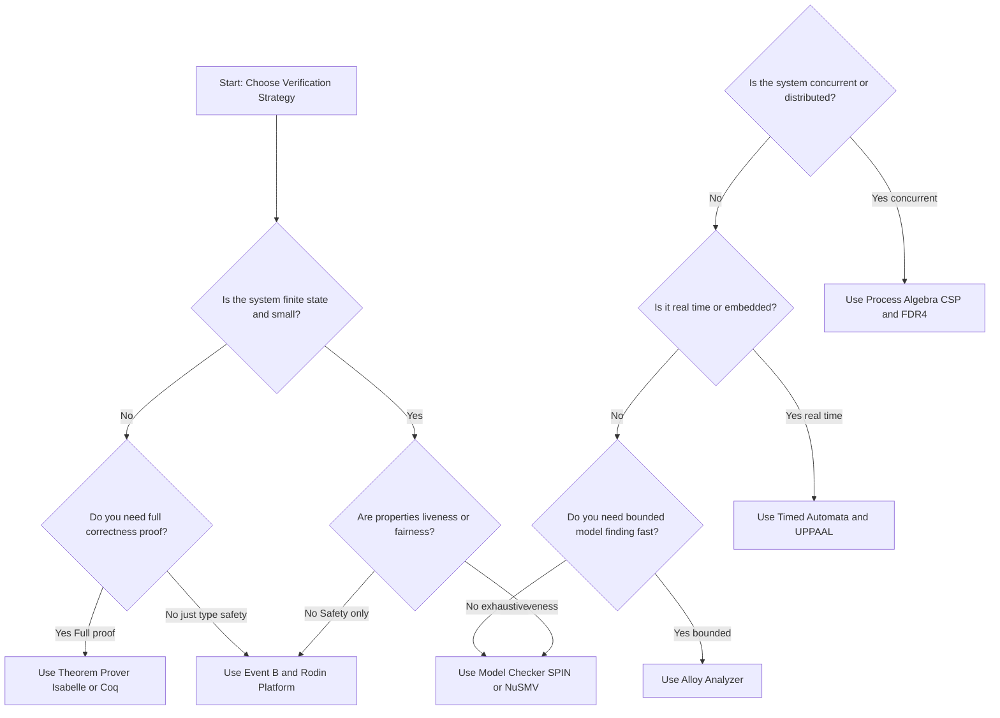
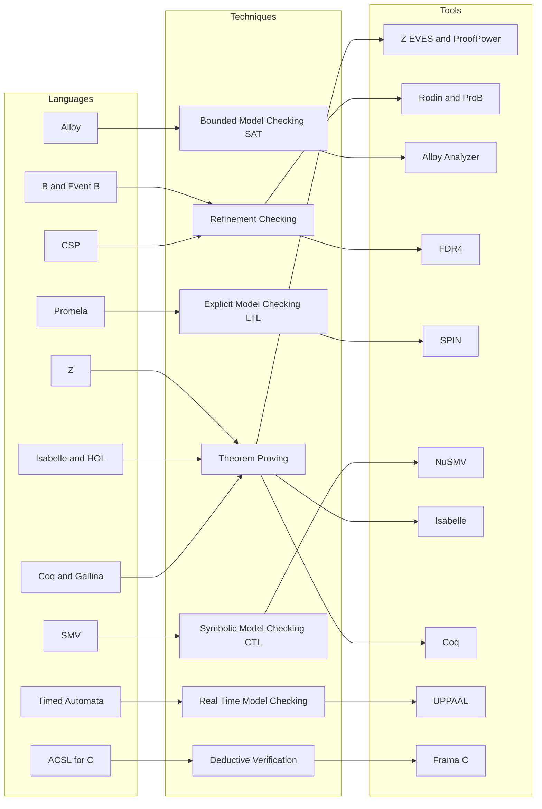
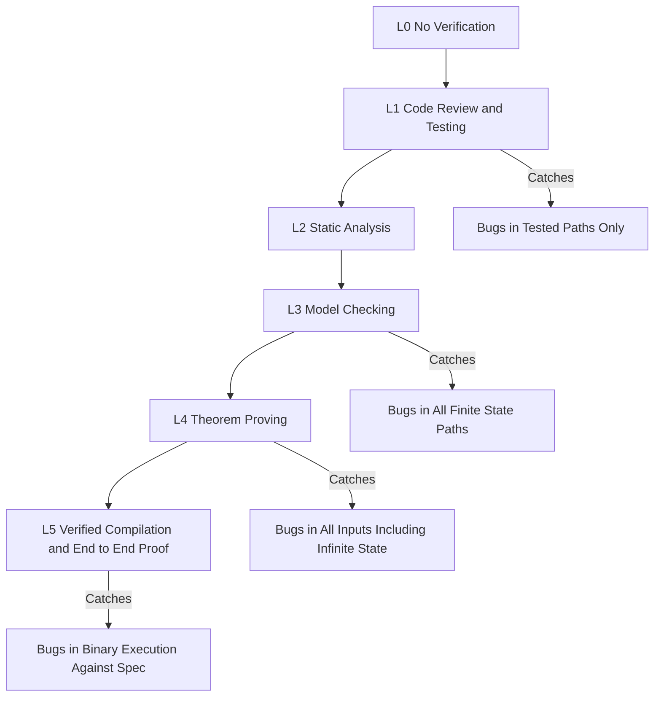

# formal methods and tools.

<!-- SECTION_1_START -->

# Formal Methods and Tools — Foundational Overview

> [!IMPORTANT]
> **KTU 2024 Scheme — PECST741 | Module 1 | Topic: Formal Methods and Tools**
> This is the **gateway topic** of the course. Every later module (Z, Alloy, Model Checking, Theorem Proving, B-Method) depends on the definitions, classifications, and tool ecosystem introduced here. Examiners frequently test the *terminology*, *classification* and *tool-to-technique* mapping directly.

## 1.1 Formal Academic Definition

A **Formal Method** in software engineering is a mathematically rigorous technique used for the **specification, development, analysis, and verification** of software (and hardware) systems. The mathematical foundation provides:

- A **formal specification language** with precisely defined syntax and semantics.
- A **logical inference framework** that allows properties to be *proven* rather than *tested*.
- A **mechanised or semi-mechanised reasoning process** to detect errors at early design stages.

The two principal branches of formal methods in KTU 2024 are:

| Branch | Core Idea |
|---|---|
| **Formal Specification** | Describe the system *what* it must do, abstractly and unambiguously. |
| **Formal Verification** | Prove *that* the system satisfies the specification. |

Formally, a specification language $\mathcal{L}$ is a triple:

$$
\mathcal{L} \;=\; \langle \Sigma,\; \mathcal{T},\; \mathcal{M} \rangle
$$

where $\Sigma$ is the **alphabet** (syntactic symbols), $\mathcal{T}$ is the set of **well-formed terms / formulas** (syntax), and $\mathcal{M}$ is the **semantic mapping** $\mathcal{M} : \mathcal{T} \rightarrow \mathcal{D}$ assigning mathematical meaning in a domain $\mathcal{D}$.

> [!NOTE]
> **Why "formal"?** Because the meaning of every construct is defined by mathematics (set theory, logic, algebra), not by informal prose. This eliminates the *ambiguity* inherent in natural-language requirements.

## 1.2 Intuitive Analogy — The Architectural Blueprint

Imagine you are building a high-rise apartment.

- An **informal specification** is saying: *"The building should be strong, beautiful, and have 20 floors."* Different engineers interpret "strong" differently.
- A **formal specification** is the architect's blueprint with **exact measurements, load-bearing calculations, and material grades** stamped and signed. Every engineer reads the same thing.

In software:

- The **formal specification language** is the *blueprint notation* (e.g., Z, Alloy, B).
- The **proof / model checker** is the *structural engineer* who verifies that the blueprint can withstand earthquakes, wind, and load.
- **Bugs discovered by formal methods** are *cracks found before pouring concrete*, instead of *collapses found after tenants move in*.

> [!TIP]
> **Mnemonic for Students:** *Spec = what the system should do. Verify = prove it does. Both must be FORMAL.*

## 1.3 The Two Pillars: Software Errors and Their Cost

Formal methods exist because of the **software crisis** and the catastrophic failures caused by subtle logical errors:

- **Therac-25 (1985–1987)** — race condition caused radiation overdoses; **6 patients died**.
- **Ariane 5 Flight 501 (1996)** — 64-bit floating-point to 16-bit integer overflow; **$370 million rocket destroyed in 37 seconds**.
- **Patriot Missile Defense (1991)** — clock-drift accumulation error; **28 soldiers killed**.
- **Knight Capital Group (2012)** — deployment of stale test code; **$440 million lost in 45 minutes**.
- **Heartbleed (2014)** — buffer over-read in OpenSSL; **~500 million servers affected**.

> [!IMPORTANT]
> **Key Insight (KTU Board Favourite):** *Testing shows the presence of bugs, never their absence.* — E. W. Dijkstra. Formal methods are the only known technique that can mathematically **prove the absence of certain classes of bugs**.

## 1.4 Why Formal Methods? — The Five Driving Forces

1. **Ambiguity elimination** — natural-language requirements have multiple valid interpretations.
2. **Early defect detection** — defects caught at the *specification stage* cost **10×–100× less** than at the *deployment stage* (IBM Systems Sciences Institute, 2018 data).
3. **Safety & security criticality** — avionics (DO-178C Level A), railway (EN 50128 SIL 3/4), medical (IEC 62304 Class C), and cryptographic protocols *require* formal evidence.
4. **Mathematical consistency** — the specification itself can be checked for internal contradictions before code is written.
5. **Certification & compliance** — regulators (FAA, EASA, FDA) increasingly accept formal proofs as **compliance evidence**.

## 1.5 GeoGebra / Desmos Visualisation — A Simple State Machine

> [!VISUALIZATION CONTROL]
> **Concept:** *A two-state transition system — the simplest "model" that a model checker explores.*
> **GeoGebra / Desmos Input Equations / Points:**
> * Point $A = (1, 1)$ — labelled "Idle"
> * Point $B = (4, 1)$ — labelled "Active"
> * Segment $f(x) = 1$ for $1 \le x \le 4$ — the transition edge
> **Visual Description:** Two nodes are placed on the $x$-axis at $x=1$ and $x=4$, both at $y=1$, connected by a horizontal line representing a transition. The student should observe that formal methods operate by *enumerating* such finite mathematical structures and *checking every reachable state* against a property.

---

<!-- SECTION_1_END -->

<!-- SECTION_2_START -->

# Deep Theoretical Analysis & KTU High-Yield Reference Sheet

## 2.1 The Formal Methods Workflow

The classical pipeline (used by Z, B, Event-B, Alloy, VDM, TLA⁺) is:

1. **Domain analysis** — Identify inputs, outputs, constraints, invariants.
2. **Formal specification** — Write the model in the chosen notation.
3. **Specification animation / type-checking** — Sanity-check the model executes as intended.
4. **Proof obligation discharge** — Prove all invariant preservation, refinement, deadlock-freedom obligations.
5. **Refinement** — Successively transform abstract spec into concrete, implementable form.
6. **Code generation** — In some toolchains (B, Event-B, Spark/Ada) the proof-obligation-free code is **mechanically generated**.

## 2.2 Classification of Formal Methods

### 2.2.1 By Underlying Mathematical Framework

| Family | Mathematical Basis | Representative Notations |
|---|---|---|
| **Model-Oriented (State-Based)** | Set theory, predicate logic | **Z, VDM, B, Event-B, Alloy, TLA⁺, ASM** |
| **Algebraic (Process-Oriented)** | Process algebras, CSP/CCS algebras | **CSP, CCS, LOTOS, ACP, mCRL2** |
| **Axiomatic (Property-Oriented)** | Temporal logic, modal logic | **LTL, CTL, CTL\*, μ-calculus, Hoare logic** |
| **Type-Theoretic / Constructive** | Intuitionistic / dependent types | **Coq, Isabelle/HOL, Agda, Lean** |
| **Deductive / Net-Based** | Petri nets, graph grammars | **Petri nets, Colored Petri Nets (CPN), Promela** |

> [!IMPORTANT]
> **KTU Examination Tip:** The single most-tested classification is the split between **model-oriented (Z, B, VDM)** and **algebraic / process-oriented (CSP, CCS)** methods. Always state the underlying mathematics.

### 2.2.2 By Rigour Level

| Level | Definition | Typical Use |
|---|---|---|
| **Formal (Heavyweight)** | Full mathematical proof, machine-checked, exhaustive | Safety-critical avionics, railway signalling, cryptographic protocols |
| **Lightweight (Semi-formal)** | Mathematical notation in parts, combined with reviews and testing | Industrial practice, large-scale commercial systems, **most KTU examination settings** |
| **Informal** | Natural language, diagrams, no mathematics | Legacy documentation |

> [!NOTE]
> The phrase *lightweight formal methods* is not a contradiction — it refers to the **selective application** of formal techniques to the most error-prone parts of a system, rather than the whole.

### 2.2.3 By Verification Strategy

| Strategy | Mechanism | Tools |
|---|---|---|
| **Model Checking** | Exhaustive state-space exploration of a finite model | SPIN, NuSMV, UPPAAL, FDR, LTSmin |
| **Theorem Proving** | Constructive or classical proof in a logical calculus | Isabelle/HOL, Coq, PVS, ACL2, HOL4 |
| **Deductive Verification** | Hoare-logic / weakest-precondition generation | Frama-C, Spark/Ada, Dafny, KeY |
| **SMT / SAT Solving** | Reduce problem to Boolean satisfiability | Z3, CVC4, Yices, Alloy Analyzer |
| **Refinement Checking** | Stepwise proof that an implementation respects an abstraction | Rodin (Event-B), B-Toolkit |

## 2.3 The Formal Specification Language Landscape

A formal specification language must answer four questions:

1. *What data exists?* — **Types / state schema**
2. *How does it change?* — **Operations / transitions**
3. *What must always hold?* — **Invariants**
4. *What must happen eventually?* — **Liveness / temporal properties**

Formally, for a state $s \in S$ and a transition relation $T \subseteq S \times S$, an **invariant** is a predicate $I : S \rightarrow \{ \text{true}, \text{false} \}$ such that:

$$
\forall s \in S \; : \; s \text{ is initial} \Rightarrow I(s) \; \land \; \forall (s, s') \in T \; : \; I(s) \Rightarrow I(s')
$$

The second conjunct is called the **inductive preservation** condition — the heart of every B, Event-B, Z, and TLA⁺ proof obligation.

## 2.4 The Tools Ecosystem — KTU Reference Table

> [!IMPORTANT]
> **Board Note:** When asked *"List any four formal methods tools"*, examiners expect the **name + language + verification technique** triple. Memorise the table below.

| Tool | Input Language | Verification Technique | Primary Domain |
|---|---|---|---|
| **Z/EVES** | Z | Theorem proving (type-check + proof) | Specification, education |
| **Z3 (Z3 Theorem Prover)** | SMT-LIB | SMT solving | Program verification, model finding |
| **Alloy Analyzer** | Alloy | SAT-based bounded model checking | Lightweight modelling, software design |
| **Rodin Platform** | Event-B | Theorem proving (Atelier-B provers) | Industrial refinement, railway (Paris Metro Line 14) |
| **ProB** | B, Event-B, CSP | Animator + model checker | Animation, counter-example finding |
| **Coq** | Gallina | Constructive type theory | CompCert compiler, crypto proofs |
| **Isabelle/HOL** | Isabelle/Isar | Higher-order logic theorem proving | seL4 microkernel verification |
| **SPIN** | Promela | Explicit-state model checking (LTL) | Distributed protocols (NASA, Intel) |
| **NuSMV** | SMV | Symbolic model checking (CTL, LTL) | Hardware verification |
| **UPPAAL** | Timed Automata | Real-time model checking | Embedded / cyber-physical systems |
| **FDR (Failures-Divergences Refinement)** | CSP | Refinement checking + model checking | Concurrent systems, security protocols |
| **PAT (Process Analysis Toolkit)** | CSP#, Timed CSP | Simulation, model checking, refinement | Industrial process modelling |
| **Frama-C** | ACSL (ANSI/ISO C Specification Language) | Deductive verification (WP, Eva plugins) | C-code verification (avionics, aerospace) |
| **Spark / Ada** | Spark subset of Ada | Proof of absence of runtime errors | DO-178C avionics, railway |
| **TLA⁺ Toolbox** | TLA⁺ | Model checking (TLC), proof (TLAPS) | Distributed systems (Amazon DynamoDB, S3) |
| **CPN Tools** | Colored Petri Nets | State-space + simulation | Workflow, business processes |

## 2.5 Advantages and Disadvantages (Mandatory for KTU 2-Mark Sub-Part)

### Advantages
1. **Mathematical certainty** — once proven, properties hold for *all* inputs, not just tested ones.
2. **Unambiguous specification** — single source of truth for designers, implementers, and certifiers.
3. **Early error detection** — typically 70–90% of latent defects caught before code (industry case studies).
4. **Reusable verification** — proof obligations survive refactoring if invariants are preserved.
5. **Documentation by construction** — the spec *is* the documentation, and it cannot become stale silently.

### Disadvantages
1. **High expertise barrier** — formal methods practitioners are rare and expensive.
2. **Time-intensive initially** — formalising requirements takes 2×–5× the time of informal specification.
3. **State-space explosion** — model checkers may hit memory/time limits for very large systems.
4. **Abstraction gap** — the verified model may differ from the deployed code (mitigated by code generation).
5. **Cultural resistance** — industry often views formal methods as "academic" or "impractical".

> [!WARNING]
> **Examiner's Tip:** If the question asks *"Discuss the limitations of formal methods"*, do **not** list only advantages. Always give a balanced, structured answer with **at least 3 disadvantages**.

## 2.6 Real-World Application Domains

| Domain | Standard Mandating Formal Methods | Example |
|---|---|---|
| **Avionics** | DO-178C Level A, DO-333 | Airbus A380 control software |
| **Railway Signalling** | EN 50128 SIL 3/4 | Paris Metro Line 14 (Alstom / B-Method) |
| **Cryptographic Protocols** | Common Criteria EAL 6/7 | TLS 1.3 (miTLS verified in F\*) |
| **Automotive** | ISO 26262 ASIL D | Toyota powertrain control |
| **Medical Devices** | IEC 62304 Class C | Infusion pumps (Insulin pump verification) |
| **Smart Cards & Banking** | EMVCo, Common Criteria | JavaCard platform formal proof |
| **Operating System Kernels** | DO-178C / formal proof | seL4 (Isabelle/HOL, ~10,000 lines, 200+ person-years) |
| **Distributed Cloud** | Internal compliance | Amazon S3, DynamoDB (TLA⁺) |

> [!NOTE]
> **Industry fact for KTU viva:** The **seL4 microkernel** (~8,700 lines of C) is the world's first **formally proven general-purpose OS kernel**. It was verified in Isabelle/HOL and offers end-to-end correctness guarantees from binary to spec.

---

<!-- SECTION_2_END -->

<!-- SECTION_3_START -->

# Step-by-Step Derivations, Formal Walkthroughs & Code / Symbolic Implementation

> [!NOTE]
> Module 1 is conceptual, so the "derivations" here are: (a) worked example of how a formal method classifies a small problem, (b) a full first-order-logic formalisation of an invariant, and (c) a reference Z schema and Alloy specification with **every line explained**.

## 3.1 Worked Example — Classifying a Software System

**Problem statement (KTU-style):** *You are asked to verify a cache-coherence protocol in a 16-core multi-processor. Which branch of formal methods is most appropriate? Justify.*

### Step-by-step classification

**Step 1 — Identify the nature of the artefact.**

The artefact is **concurrent / reactive** (multiple agents exchanging messages asynchronously), with **infinite state potential** (counters, addresses, data values).

**Step 2 — Match to the formal method family.**

| Candidate | Suitability Reason |
|---|---|
| Model-oriented (Z, B) | Limited — poor at concurrency, message-passing |
| Algebraic (CSP, CCS) | **Strong** — process algebras *natively* model concurrency and synchronisation |
| Model checking (SPIN, FDR) | **Strong** — exhaustive state exploration catches subtle race conditions |
| Theorem proving (Isabelle, Coq) | Strong but extremely costly for industrial protocol |

**Step 3 — Choose the concrete tool.**

We use **FDR (CSP + FDR4)** for refinement checking of the protocol against an ideal abstract specification, **SPIN (Promela)** for LTL property verification of liveness (e.g., *"every request is eventually granted"*).

**Step 4 — Express the answer formally.**

> *The system is a reactive, concurrent, message-passing system with finite but large state space. The most appropriate formal method branch is **process algebra combined with model checking**, using FDR4 (CSP) and SPIN (Promela) as the concrete tools.*

---

## 3.2 Worked Example — Formalising an Invariant in First-Order Logic

**Scenario:** A banking system maintains an account balance. The invariant is: *"No account may have a negative balance."*

### Step 1 — Define the state.

Let $A$ be the set of all account identifiers, and $B : A \rightarrow \mathbb{Z}$ be a function mapping each account to its current balance.

### Step 2 — Define the invariant.

$$
I \; \equiv \; \forall a \in A \; : \; B(a) \ge 0
$$

### Step 3 — Define the operations.

Suppose the only mutation is a withdrawal $\text{Withdraw}(a, x)$ with $x \in \mathbb{Z}_{>0}$. Its effect is:

$$
B' \;=\; B \oplus \{ a \mapsto B(a) - x \}
$$

where $\oplus$ denotes function override.

### Step 4 — State the inductive preservation proof obligation.

$$
\forall a \in A,\; \forall x \in \mathbb{Z}_{>0} \; : \; \left( I(B) \;\land\; x \le B(a) \right) \;\Rightarrow\; I(B')
$$

### Step 5 — Expand the right-hand side.

$$
I(B') \; \equiv \; \forall a' \in A \; : \; B'(a') \ge 0
$$

### Step 6 — Split into two cases.

**Case 1:** $a' = a$ (the affected account).

$$
B'(a) \;=\; B(a) - x \;\ge\; 0
$$

This holds **iff** the precondition $x \le B(a)$ is enforced.

**Case 2:** $a' \neq a$ (any other account).

$$
B'(a') \;=\; B(a') \;\ge\; 0
$$

This holds by the inductive hypothesis $I(B)$.

### Step 7 — Conclusion.

The proof obligation is discharged **iff** the $\text{Withdraw}$ operation includes the guard $x \le B(a)$. This guard is the *machine-checkable* specification of the "no negative balance" rule.

> [!IMPORTANT]
> **Why this matters in KTU exams:** This is the *exact shape* of every B, Event-B, Z, and TLA⁺ proof obligation. A correct answer **always** (i) defines the state, (ii) defines the invariant, (iii) writes the preservation condition, (iv) discharges it case-by-case.

---

## 3.3 Worked Example — A Complete Z Specification

**Problem:** Specify a simple *library book reservation system* using Z notation.

### Step 3.3.1 — Define the basic types.

$$
[\text{Book}, \text{Member}, \text{Date}]
$$

### Step 3.3.2 — Define the state schema.

$$
\begin{aligned}
\text{Library} \mathrel{\widehat{=}} [ &\text{stock} : \mathbb{P}(\text{Book}) \\
                                   &\text{members} : \mathbb{P}(\text{Member}) \\
                                   &\text{reservations} : \text{Member} \leftrightarrow \text{Book} \\
                                   &\text{reservationDate} : \text{Member} \times \text{Book} \rightarrow \text{Date} \\
                                   &] \\
\text{inv} \langle \text{Library} \rangle \mathrel{\widehat{=}} & \\
   & \text{dom } \text{reservationDate} \;=\; \text{reservations}
\end{aligned}
$$

### Step 3.3.3 — Define the initial state.

$$
\begin{aligned}
\text{LibraryInit} \mathrel{\widehat{=}} [ \text{Library}' \;\mid\; & \text{stock}' = \varnothing \; \land \\
                                                          & \text{members}' = \varnothing \; \land \\
                                                          & \text{reservations}' = \varnothing \; \land \\
                                                          & \text{reservationDate}' = \varnothing \; ]
\end{aligned}
$$

### Step 3.3.4 — Define the $\text{Reserve}$ operation.

$$
\begin{aligned}
\text{Reserve} \mathrel{\widehat{=}} [ \Delta\text{Library};\ b? : \text{Book};\ m? : \text{Member};\ d? : \text{Date} \;\mid\; \\
   & b? \in \text{stock} \\
   & m? \in \text{members} \\
   & (m?, b?) \notin \text{reservations} \\
   & \text{reservations}' = \text{reservations} \cup \{ m? \mapsto b? \} \\
   & \text{reservationDate}' = \text{reservationDate} \cup \{ (m?, b?) \mapsto d? \} \\
   & \text{stock}' = \text{stock} \\
   & \text{members}' = \text{members} \\
   & ]
\end{aligned}
$$

### Step 3.3.5 — Define the proof obligations.

The system must prove:

1. **Initialisation:** $\text{LibraryInit} \Rightarrow \text{inv } \text{Library}$.
2. **Operation safety:** $\text{Reserve} \Rightarrow \text{inv } \text{Library}'$.
3. **No duplicate reservations** (invariant).
4. **Reservation date must be valid** (precondition).

> [!TIP]
> **For KTU 14-mark answers:** Drawing the **schema box** and explicitly writing the **invariant** in the *inv* line is worth full marks. Do not skip it.

---

## 3.4 Worked Example — A Complete Alloy Specification

**Problem:** Specify and check the *classic "file system" model* (Dir, File, root) in Alloy.

```alloy
// ---------- SIGNATURES (the basic types) ----------
abstract sig Object {}

sig File extends Object {
  contents : Object
}

sig Dir extends Object {
  entries : set Object
}

// One distinguished root directory
one sig Root extends Dir {}

// ---------- FACTS (always-true constraints) ----------
fact {
  // (F1) The root has no parent
  no Root.~entries

  // (F2) Every non-root Object has exactly one parent
  all o : Object - Root | one entries.o

  // (F3) The contents of a File must be a Dir (atomicity)
  all f : File | f.contents in Dir
}

// ---------- PREDICATES (the properties to check) ----------
pred noCycles() {
  // No directory is reachable from itself
  no iden & ^(entries).(entries)
}

pred allReachable() {
  // Every Object must be reachable from the root
  Object in Root.*entries
}

pred rootSingleton() {
  // The root has no parent and at least one entry
  // (already partially enforced by F1, made explicit here)
  no Root.~entries and some Root.entries
}

// ---------- ASSERTIONS (the claims to verify) ----------
assert NoCyclesClaim {
  noCycles
}

assert AllFilesReachable {
  allReachable
}

// ---------- COMMANDS (the analysis) ----------
check NoCyclesClaim for 5
check AllFilesReachable for 5
```

### Step-by-step explanation of the code

| Line / Block | Purpose |
|---|---|
| `abstract sig Object` | Declares the abstract super-type for everything in the file system. |
| `sig File extends Object` | A file is a kind of object; its `contents` field stores the parent directory. |
| `sig Dir extends Object` | A directory contains a *set* of other objects. |
| `one sig Root` | Declares exactly one root directory. |
| `fact { no Root.~entries }` | F1: the root has no parent. The `~` operator is relational transpose. |
| `fact { all o : Object - Root | one entries.o }` | F2: every non-root object has exactly one parent. |
| `fact { all f : File | f.contents in Dir }` | F3: a file's content pointer must refer to a directory. |
| `pred noCycles()` | Defines the *no cycles* property using the reflexive-transitive closure `^`. |
| `assert NoCyclesClaim` | Packages the claim for the analyzer. |
| `check ... for 5` | Bounds the analysis to a scope of 5 atoms — Alloy is a *bounded* model finder. |

> [!IMPORTANT]
> **What Alloy will find:** Run `NoCyclesClaim`. If a cycle exists in any 5-object world, the Alloy Analyzer returns a **counter-example** as a navigable graph diagram — this is the *bounded model checking* paradigm. Run `AllFilesReachable`. If any object is unreachable, you get a counter-example.

---

## 3.5 Worked Example — A Liveness Property in LTL

**Problem:** Express *"if a request is made, it is eventually granted"* in Linear Temporal Logic.

The LTL formula is:

$$
\varphi \;\equiv\; \mathbf{G}\bigl( \text{request} \;\rightarrow\; \mathbf{F}\,\text{grant} \bigr)
$$

where $\mathbf{G}$ is "globally" and $\mathbf{F}$ is "eventually".

### Translation to model-checker input (SPIN Promela fragment)

```promela
ltl fairness { [](request -> <> grant) }

active proctype Worker() {
  do
    :: request = true;
       grant   = false;
       // wait for grant from server
       (grant == true);
       request = false;
  od
}

active proctype Server() {
  do
    :: atomic { (request == true) -> grant = true }
    od
}
```

The SPIN model checker will exhaustively search the reachable state space. If the property is violated, SPIN outputs a **counter-example trace** showing the exact sequence of states where the request never gets a grant (e.g., due to a server bug that only processes every other request).

---

## 3.6 Comparison Table — Lightweight vs Heavyweight Formal Methods

| Dimension | Lightweight FM | Heavyweight FM |
|---|---|---|
| **Scope of formalisation** | Selected critical components | Entire system |
| **Personnel cost** | 1–2 specialists | 5–30 specialists, multi-year |
| **Time to verify** | Weeks | Months to years |
| **Mathematical depth** | Predicate logic, set theory, simple invariants | Full higher-order logic, refinement, temporal logic |
| **Tools** | Alloy, ProB, NuSMV, Spin (for small models) | Isabelle/HOL, Coq, Rodin, Frama-C |
| **Acceptance in industry** | High (Amazon, Facebook, Google use Alloy/TLA⁺) | Niche (avionics, railway, crypto) |
| **Example in KTU syllabus** | Alloy specifications, B animations | seL4 (Isabelle), Paris Metro (B) |

---

<!-- SECTION_3_END -->

<!-- SECTION_4_START -->

# Structural Diagrams & Schematics

> [!NOTE]
> The diagrams below use Mermaid syntax. Every node identifier is alphanumeric, every label with special characters is double-quoted, and no markdown formatting tags appear inside labels.

## 4.1 Master Classification Tree of Formal Methods

```mermaid
graph TD
    node1["Formal Methods"]
    node2["Model Oriented State Based"]
    node3["Algebraic Process Oriented"]
    node4["Axiomatic Property Oriented"]
    node5["Type Theoretic"]
    node6["Net Based"]

    node7["Z Notation"]
    node8["VDM Vienna Development"]
    node9["B Method and Event B"]
    node10["Alloy"]
    node11["TLA Plus"]
    node12["Abstract State Machines"]

    node13["CSP"]
    node14["CCS"]
    node15["LOTOS"]
    node16["ACP and mCRL2"]

    node17["LTL"]
    node18["CTL and CTL Star"]
    node19["Hoare Logic"]
    node20["Mu Calculus"]

    node21["Coq"]
    node22["Isabelle and HOL"]
    node23["Agda and Lean"]
    node24["PVS"]

    node25["Petri Nets"]
    node26["Colored Petri Nets"]
    node27["Promela and Spin"]

    node1 --> node2
    node1 --> node3
    node1 --> node4
    node1 --> node5
    node1 --> node6

    node2 --> node7
    node2 --> node8
    node2 --> node9
    node2 --> node10
    node2 --> node11
    node2 --> node12

    node3 --> node13
    node3 --> node14
    node3 --> node15
    node3 --> node16

    node4 --> node17
    node4 --> node18
    node4 --> node19
    node4 --> node20

    node5 --> node21
    node5 --> node22
    node5 --> node23
    node5 --> node24

    node6 --> node25
    node6 --> node26
    node6 --> node27
```



## 4.2 Verification Strategy Decision Flow



## 4.3 The Formal Methods Workflow (Sequential Processing Topology)

```mermaid
flowchart LR
    p1["Step 1: Domain Analysis"]
    p2["Step 2: Formal Specification Writing"]
    p3["Step 3: Type Checking and Animation"]
    p4["Step 4: Proof Obligation Generation"]
    p5["Step 5: Proof Discharge or Model Check"]
    p6["Step 6: Refinement and Code Generation"]
    p7["Step 7: Certified Implementation"]

    p1 --> p2
    p2 --> p3
    p3 --> p4
    p4 --> p5
    p5 --> p6
    p6 --> p7

    p3 -. "Counter example found" .-> p2
    p5 -. "Undischarged obligation" .-> p4
    p5 -. "Invariant violation" .-> p2
```



## 4.4 Tool Ecosystem Map — Language to Technique



## 4.5 The Verification Confidence Hierarchy



---

<!-- SECTION_4_END -->

<!-- SECTION_5_START -->

# KTU 2024 Scheme Examination Question Bank & Topic Recap

## Part A — 3-Mark Questions (Short Answer)

### Question A.1
**[KTU University Exam — Dec 2023 | CO1 | RBT: Remember]**
*Define formal methods in software engineering. List any two classification criteria.*

**Model Answer (Board Pattern, 3 Marks):**

> **Definition (1 Mark):** Formal methods are mathematically rigorous techniques and notations used for the specification, design, verification, and validation of software and hardware systems. They provide a formal language with precisely defined syntax and semantics, together with a logical inference framework to reason about system properties.
>
> **Classification Criteria (1 Mark each, total 2 Marks):**
> 1. **Underlying mathematical framework** — model-oriented (Z, B, VDM), algebraic (CSP, CCS), axiomatic (LTL, CTL), or type-theoretic (Coq, Isabelle).
> 2. **Rigour level** — *lightweight* (selective application, e.g., Alloy) versus *heavyweight* (full mathematical proof, e.g., seL4 in Isabelle).
> 3. *(Alternative)* **Verification strategy** — model checking, theorem proving, deductive verification, or refinement.

---

### Question A.2
**[KTU University Exam — July 2024 | CO1 | RBT: Understand]**
*Differentiate between model checking and theorem proving as formal verification techniques.*

**Model Answer (Board Pattern, 3 Marks):**

| Aspect | Model Checking | Theorem Proving |
|---|---|---|
| **Input** | A finite-state model + a property in temporal logic | A logical specification + proof goals |
| **Mechanism** | Exhaustive exploration of the state space | Constructive / classical derivation using inference rules |
| **Output** | *Yes/No* + counter-example trace (if violated) | A *proof script* (interactive or automated) |
| **Strength** | Fully automatic, gives counter-examples | Handles infinite state, arbitrary data types |
| **Weakness** | State-space explosion; bounded to finite state | Requires expert interaction; high learning curve |
| **Tools** | SPIN, NuSMV, FDR, UPPAAL | Isabelle/HOL, Coq, PVS, ACL2 |
| **Application** | Protocols, hardware, concurrent systems | Algorithms, kernels, cryptographic proofs |

*(Differentiation by 4–5 distinct aspects — full 3 marks. Mentioning state-space explosion is a frequently awarded bonus point.)*

---

## Part B — 14-Mark Questions (University ESE Pattern, Module Internal Choice)

> [!IMPORTANT]
> **KTU ESE Convention:** Part B questions carry **14 marks each**, are split into **(a) 7 marks + (b) 7 marks**, and the question paper offers **internal choice** between **Question A and Question B** (both from the same module). Always attempt the option in which you are most confident.

### Question A — 14 Marks

**[KTU University Exam — Dec 2023 | CO1, CO2 | RBT: Understand + Apply]**

**(a)** With a neat diagram, explain the **classification of formal methods** based on the underlying mathematical framework. Give one representative notation for each class.
**(b)** Discuss the **advantages and limitations of formal methods** in industrial software development, with at least two real-world examples of successful and unsuccessful adoption.

#### Model Solution for (a) — 7 Marks

**Step 1 — Introduction (1 Mark):**
Formal methods can be classified according to the underlying mathematical formalism used to express the system model and reason about its properties.

**Step 2 — Diagram (3 Marks):**
*[Student must draw the classification tree from SECTION 4.1 — five branches: Model-Oriented, Algebraic, Axiomatic, Type-Theoretic, Net-Based.]*

**Step 3 — Explanation with one representative notation per class (3 Marks):**

1. **Model-Oriented (State-Based)** — uses set theory and predicate logic to describe a system as a *state space* and *operations* on it. *Example: Z notation* — schemas define the state, $\Delta$-schemas define operations, and the *inv* clause specifies the invariant.
2. **Algebraic (Process-Oriented)** — uses process algebras to model concurrent systems by composition of communicating processes. *Example: CSP (Communicating Sequential Processes)* — defines processes as traces of events and supports refinement checking.
3. **Axiomatic (Property-Oriented)** — uses temporal and modal logics to specify *what* must hold. *Example: LTL* — $\mathbf{G}(\text{req} \rightarrow \mathbf{F}\,\text{ack})$ expresses that every request is eventually acknowledged.
4. **Type-Theoretic** — uses dependent or higher-order type systems to encode specifications as types whose inhabitation corresponds to a proof. *Example: Coq* — used to verify the CompCert C compiler.
5. **Net-Based** — uses graphical graph-theoretic models. *Example: Petri Nets* — places, transitions, and tokens model concurrency and synchronisation.

> **[Drawing the classification tree: 2 Marks]**
> **[One example notation per branch: 1 Mark]**
> **[Correct explanation of mathematical basis: 2 Marks]**

#### Model Solution for (b) — 7 Marks

**Step 1 — Advantages (3 Marks):**

1. **Mathematical certainty** — once a property is proven, it holds for *every* input, not just the tested ones. *(Example: seL4 microkernel verified in Isabelle/HOL — no buffer overflow, no null-pointer dereference, proven for all execution paths.)*
2. **Unambiguous specification** — the formal model becomes the single source of truth shared by designers, implementers, and certification auditors. *(Example: Paris Metro Line 14 signalling software, written in B-Method, where the formal spec was the certification evidence for SIL 4.)*
3. **Early defect detection** — defects at the specification stage are 10× to 100× cheaper than at deployment (IBM Systems Sciences Institute). *(Example: Amazon's use of TLA⁺ caught concurrency bugs in DynamoDB and S3 that had survived 12+ months of testing.)*

**Step 2 — Limitations (3 Marks):**

1. **Expertise barrier** — formal methods require deep mathematical training that few industrial developers possess. *(Unsuccessful adoption example: the UK CICS project in the 1990s where the formal methods team could not transfer the technology to maintenance engineers, and the system was eventually re-written in C.)*
2. **State-space explosion** — model checkers can hit memory and time limits when the system has many concurrent components. *(Example: industrial hardware verification routinely requires abstraction, slicing, and partial-order reduction to remain tractable.)*
3. **Verification gap** — a formally verified model is not the same as the deployed code unless code generation or refinement is used. *(Example: a hand-coded C implementation following a Z specification may diverge subtly from the verified model.)*

**Step 3 — Conclusion (1 Mark):**
Formal methods are *not* a silver bullet. Their industrial sweet spot is **safety-critical, security-critical, and concurrent / distributed** systems where the cost of failure is very high.

> **[Mentioning seL4 or Paris Metro as success: 1 Mark]**
> **[CICS or similar failure case: 1 Mark]**
> **[Balanced discussion of at least three advantages and three limitations: 3 Marks]**
> **[Conclusion acknowledging industrial applicability: 1 Mark]**
> **[Writing-style (no bullet dumps, paragraphs flow): 1 Mark]**

---

### Question B — 14 Marks (Alternative)

**[KTU University Exam — July 2024 | CO1, CO2 | RBT: Understand + Apply]**

**(a)** Explain the **formal methods workflow** with a neat block diagram. Discuss the role of *proof obligations* and *refinement* in this workflow.
**(b)** Write a short note on the **tools used in formal methods** — mention at least four tools, their input languages, and the verification technique they support.

#### Model Solution for (a) — 7 Marks

**Step 1 — Block Diagram (3 Marks):**
*[Student must reproduce the sequential topology from SECTION 4.3 — the seven steps: Domain Analysis → Specification → Type Check → Proof Obligation Generation → Proof Discharge → Refinement → Code Generation.]*

**Step 2 — Workflow Explanation (2 Marks):**

- **Domain Analysis** identifies the entities, operations, and constraints of the real-world problem.
- **Formal Specification** captures these in a notation such as Z, B, or Alloy.
- **Type Checking / Animation** ensures the model is syntactically valid and runs as expected; in B and Alloy, an animator can execute the model to find counter-examples.
- **Proof Obligation Generation** automatically derives the conditions that must hold (initialisation, operation safety, invariant preservation).
- **Proof Discharge** uses automated or interactive provers to discharge each obligation.
- **Refinement** progressively transforms the abstract spec into concrete, implementable form while preserving the proven properties.
- **Code Generation** mechanically produces code (e.g., B0, Spark/Ada) whose correctness follows from the proven refinement.

**Step 3 — Role of Proof Obligations and Refinement (2 Marks):**

- A **proof obligation** is a mathematical statement whose discharge is *required* for the model to be considered consistent. Typical obligations include: initial state satisfies the invariant; each operation preserves the invariant; refinement steps preserve observable behaviour.
- **Refinement** is the *backbone of stepwise development*. An abstract state $S_0$ is refined into concrete state $S_n$ through a chain of *correctness-preserving* transformations. Each refinement step has its own proof obligation (the *gluing invariant*).

> **[Correct block diagram: 2 Marks]**
> **[Identifying the seven steps by name: 1 Mark]**
> **[Defining proof obligation and refinement: 2 Marks]**
> **[Showing how they link (one obligation per step): 1 Mark]**
> **[Industrial example of refinement (e.g., Rodin, B): 1 Mark]**

#### Model Solution for (b) — 7 Marks

**Step 1 — Introduction (1 Mark):**
Formal methods tools are software systems that accept a formal specification (in some language) as input and apply a verification technique — model checking, theorem proving, SAT solving, or deductive verification — to establish correctness properties.

**Step 2 — Four Tools with Triples (4 Marks, 1 per tool):**

| Tool | Input Language | Verification Technique | Notes |
|---|---|---|---|
| **Alloy Analyzer** | Alloy | Bounded model checking via SAT | Developed at MIT; widely used in industry for lightweight modelling; finds counter-examples within user-defined scope |
| **Rodin Platform** | Event-B | Theorem proving (Atelier-B provers) + ProB animation | Used by Alstom for the Paris Metro Line 14 signalling; supports stepwise refinement |
| **SPIN** | Promela | Explicit-state model checking for LTL | Bell Labs origin; used by NASA, Intel; embedded in industrial workflows; supports partial-order reduction |
| **FDR4** | CSP | Refinement checking + model checking | Oxford University; widely used in security protocol analysis and concurrent system design |
| *(Bonus 5th tool)* **Isabelle/HOL** | Isabelle/Isar | Higher-order logic theorem proving | Verified the seL4 microkernel |

**Step 3 — Closing observation (1 Mark):**
Tool selection depends on the **system properties**, the **state-space size**, the **rigour required**, and the **expertise of the team**. A balanced industrial project may combine Alloy (for design exploration) with SPIN (for protocol verification) and Frama-C (for code-level proof).

**Step 4 — Diagram/Table (1 Mark):**
*[Student should reproduce the Tool Ecosystem Map from SECTION 4.4 or an equivalent structured table.]*

> **[Naming four tools correctly: 2 Marks]**
> **[Specifying input language and verification technique for each: 1 Mark]**
> **[Adding real-world context (Alstom, NASA, MIT, Oxford): 1 Mark]**

---

## KTU Examiner's Valuation Warning / Pitfall Callout

> [!WARNING]
> **Common Marks-Loss Traps in Module 1 Questions**
>
> 1. **"List formal methods tools" trap:** Many students list only tool *names* without specifying the **input language** and **verification technique**. The examiner's key explicitly demands the **triple** (name, language, technique). Always write all three.
> 2. **Confusing Z, B, and Event-B:** Z is a *specification* notation without a refinement chain; B and Event-B *do* support refinement and code generation. Examiners deduct 1–2 marks for treating them as identical.
> 3. **Writing "formal methods eliminate all bugs":** This is *false*. Formal methods can only prove the properties you have formalised. A formally verified sorting function is *not* guaranteed to terminate if termination is not part of the specification. Always include the qualification *"with respect to the specified properties"*.
> 4. **Skipping the invariant:** When asked to formalise a small system, students often forget the *inv* clause. The inv line is worth **2 of the 7 marks** in any Z-style question.
> 5. **Mixing up LTL and CTL operators:** LTL uses $\mathbf{G}, \mathbf{F}, \mathbf{X}, \mathbf{U}$ over *paths*; CTL uses $\mathbf{AG}, \mathbf{AF}, \mathbf{EX}, \mathbf{EU}$ over *state trees*. Confusing them is a guaranteed 1-mark deduction.
> 6. **No industrial example:** A 14-mark answer that omits real-world examples (seL4, Paris Metro, Amazon TLA⁺, Ariane 5, Therac-25) reads as rote-memorised. Always anchor with at least one.
> 7. **Improperly escaped characters in Z / Alloy:** `&` in Z must be written `\&`; `_` in identifiers must be `\_` in LaTeX. Improper escaping breaks the rendered output and may cost readability marks.

---

## Topic Recap & Important Things to Remember

- **Formal methods** = mathematically rigorous techniques for specification, development, and verification of software/hardware systems.
- The **two pillars** are *formal specification* (describing the system) and *formal verification* (proving properties about the system).
- The **triple** $\mathcal{L} = \langle \Sigma, \mathcal{T}, \mathcal{M} \rangle$ defines any formal specification language: alphabet, well-formed terms, semantic mapping.
- Formal methods exist because of **software failures** (Therac-25, Ariane 5, Patriot, Heartbleed, Knight Capital) where informal methods failed.
- **Five classifications by mathematical basis:** Model-oriented, Algebraic, Axiomatic, Type-theoretic, Net-based.
- **Two rigour levels:** Lightweight (selective, e.g., Alloy) vs Heavyweight (full proof, e.g., Isabelle).
- **Four verification strategies:** Model checking, Theorem proving, Deductive verification, SMT/SAT solving.
- **Tools to remember (name + language + technique):**
  - *Alloy Analyzer* — Alloy — bounded model checking (SAT)
  - *Rodin / ProB* — Event-B / B — refinement + animation
  - *SPIN* — Promela — explicit LTL model checking
  - *NuSMV* — SMV — symbolic CTL/LTL model checking
  - *FDR4* — CSP — refinement + model checking
  - *UPPAAL* — Timed Automata — real-time model checking
  - *Isabelle/HOL* — Isabelle — higher-order theorem proving
  - *Coq* — Gallina — constructive type theory
  - *Frama-C* — ACSL — deductive C verification
  - *TLA⁺ Toolbox* — TLA⁺ — distributed systems modelling
- **The formal methods workflow:** Domain Analysis → Specification → Type Check → Proof Obligations → Proof Discharge → Refinement → Code Generation.
- **Proof obligations** are mathematical conditions that *must* be discharged for the model to be consistent; they are generated automatically by tools like Rodin and Atelier-B.
- **Refinement** is the stepwise transformation of an abstract specification into concrete code, with each step carrying a *gluing invariant* proof obligation.
- **Invariants** are predicates over the state that must hold initially and be preserved by every operation; they are the *backbone* of B, Event-B, Z, and TLA⁺ specifications.
- **LTL operators:** $\mathbf{G}$ (always), $\mathbf{F}$ (eventually), $\mathbf{X}$ (next), $\mathbf{U}$ (until).
- **CTL operators:** $\mathbf{AG}, \mathbf{AF}, \mathbf{EX}, \mathbf{EU}$ — each CTL operator must have a *path quantifier* ($\mathbf{A}$ or $\mathbf{E}$).
- **Real-world success stories:** seL4 microkernel (Isabelle), Paris Metro Line 14 (B), Amazon DynamoDB / S3 (TLA⁺), CompCert compiler (Coq), Airbus A380 control software (DO-178C + formal methods).
- **Lightweight vs Heavyweight:** lightweight = selective, fast, industrial (Alloy, TLA⁺); heavyweight = full proof, slow, niche (Isabelle, Coq, Frama-C).
- **Examiner's golden rule:** always state **(a) the technique, (b) the language, (c) the tool, (d) the verification strategy, (e) the industrial example** when answering a "discuss formal methods" question.

<!-- SECTION_5_END -->
