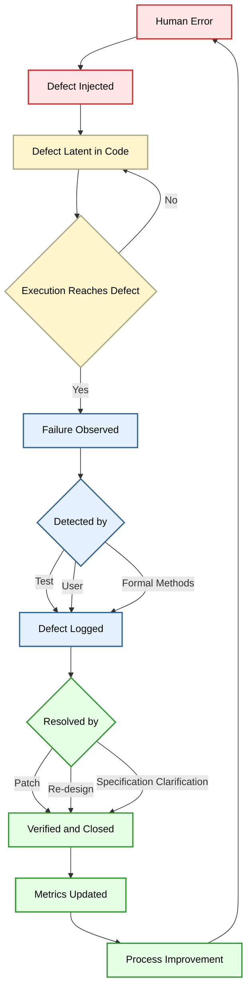
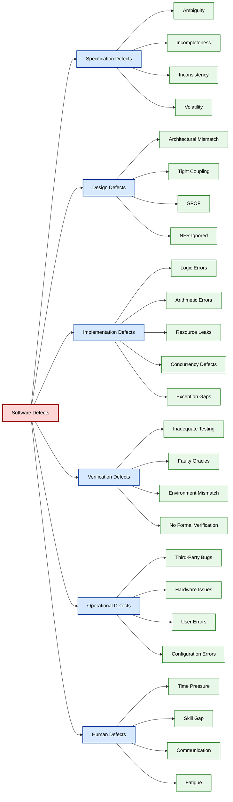
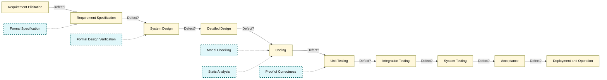
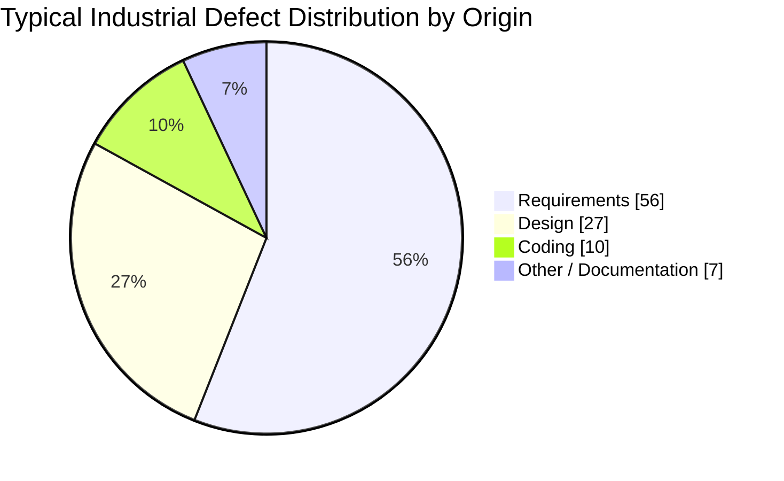

# software defects –causes of software defects

<!-- SECTION_1_START -->
# 💎 Module 1: Introduction — Software Defects and Their Causes

## 1.1 Formal Definition (KTU 2024 Syllabus Aligned)

> [!IMPORTANT]
> **Core Definitions (Board-Standard Terminology)**
>
> In the context of **Formal Methods in Software Engineering (PECST741)**, the following terms are formally distinguished by the **IEEE Standard 729-1983 / IEEE Std 610.12-1990** and must be used with precision in your KTU examination answers:
>
> - **Error (Mistake)** — A *human action* that produces an incorrect result. It is a psychological phenomenon (e.g., a developer writes `>` instead of `>=`).
> - **Defect (Fault / Bug)** — The *manifestation of an error* residing in the software artifact (source code, design, requirements, or documentation). It is the encoded mistake in the system.
> - **Failure** — The *external, observable incorrect behavior* of the system when executed. A defect produces a failure only when the affected code path is executed under the right input conditions.
> - **Reliability** — The probability that the software will perform its intended function under stated conditions for a specified period of time.
> - **Residual Defect** — A defect that remains in the delivered software after testing/validation.

**Software Defect (KTU Working Definition):**
A *software defect* is any deviation between the actual and the expected behavior of a software system, caused by an imperfection in the requirements, design, code, or supporting documentation, that is discovered **before or during operational use** and violates an implicit or explicit requirement.

---

## 1.2 The Conceptual Analogy — The "Bridge Blueprint" Intuition

> [!NOTE]
> **Intuition Builder (Real-World Analogy)**
>
> Imagine software as a **suspension bridge** built from a blueprint.
> - The **blueprint** = *Requirements & Design Specification*
> - The **steel cables & bolts** = *Source Code & Modules*
> - The **construction crew** = *Development Team*
> - The **bridge inspector** = *QA / Formal Verification*
>
> **Where do defects originate?**
> - A *misread blueprint* (a requirement error) → produces a *faulty cable* (defect) → which only *snaps* (fails) when heavy traffic (specific input) crosses.
> - A *rushed worker* (developer under pressure) skipping a weld → defect in bolt.
> - *Rusty imported steel* (faulty third-party library) → latent defect.
> - A *shift in the ground* (changing requirements) → design defect.
>
> **The Key Insight:** A defect can *exist* silently for years before producing a visible *failure*. This is exactly why **formal methods** — which mathematically prove the blueprint's correctness *before* construction — are so powerful.

---

## 1.3 Categories of Software Defects (Taxonomy)

Software defects are classified along multiple dimensions. The **Pressman / Sommerville / KTU 2024 PECST741** taxonomy is:

| **Classification Axis** | **Defect Type** | **Brief Description** |
|---|---|---|
| By **Lifecycle Phase** | Requirements defect | Ambiguous, missing, or contradictory requirements |
| | Design defect | Inconsistent architecture, poor modularity |
| | Coding defect | Syntax, logic, arithmetic errors in source |
| | Testing defect | Missing test cases, faulty test oracles |
| By **Severity** | Critical / Major / Minor | Impact on system operability |
| By **Origin** | Injected vs. Revealed | When introduced vs. when discovered |
| By **Formal Methods View** | Functional defect | Violates functional specification |
| | Non-functional defect | Violates performance, security, usability specs |

---

## 1.4 Visualization Concept — Cost Amplification of Undetected Defects

> [!VISUALIZATION CONTROL]
> **Concept:** *Boehm's Cost-of-Fix Curve* — exponential cost escalation as defects migrate across lifecycle phases.
>
> **GeoGebra / Desmos Input Equations:**
> - `f(x) = exp(0.6 * x)` (relative cost multiplier) where $x \in \{0, 1, 2, 3, 4\}$
> - Plot points: $(0, 1)$, $(1, 1.5)$, $(2, 6.5)$, $(3, 15)$, $(4, 100)$
> - $x$-axis: Lifecycle phase (Requirements → Design → Coding → Testing → Production)
> - $y$-axis: Relative cost to fix one defect ($\times$ baseline)
>
> **Visual Description:** The student should observe a *steeply rising exponential curve*, demonstrating that a defect costing **1 unit** to fix during requirements costs **roughly 100 units** once it reaches production. This is the central economic argument *for* formal methods.

---

<!-- SECTION_1_END -->

<!-- SECTION_2_START -->
# 🧠 Deep Theoretical Analysis — Root Causes of Software Defects

## 2.1 The Fundamental Orthodoxy in Software Engineering

> [!IMPORTANT]
> **The "Iron Triangle of Defect Injection"**
>
> Every software defect can be traced to **one or more** of the following primary injection points:
> 1. **Specification Defects** — wrong or unclear *what*
> 2. **Design Defects** — wrong or unclear *how*
> 3. **Implementation Defects** — wrong *execution*
> 4. **Verification Gaps** — defects *not caught*
> 5. **Operational Defects** — environment / usage *not anticipated*
>
> The role of *Formal Methods* is to **eliminate Specification and Design defects** through mathematical proof, leaving fewer defects for the testing phase to catch.

---

## 2.2 Hierarchical Breakdown of Defect Causes

### 🔴 A. Specification / Requirements Defects (≈ 50% of all defects — *classic industry finding*)
1. **Ambiguity** — Natural language permits multiple interpretations.
   *Example:* "The system shall respond *quickly*" — quantify: < 200 ms? < 1 s?
2. **Incompleteness** — Missing edge cases, missing error-handling scenarios.
3. **Inconsistency** — Requirement $R_1$ and $R_2$ contradict.
4. **Unrealistic constraints** — Hard real-time deadlines on a non-RTOS platform.
5. **Stakeholder miscommunication** — Customer says *X*, analyst writes *Y*, developer builds *Z*.
6. **Requirement volatility** — Continuous change without version control (informally called *requirement churn*).

### 🟠 B. Design Defects
1. **Architectural mismatch** — Wrong design pattern for the problem domain.
2. **Tight coupling / Low cohesion** — Changes ripple across modules.
3. **Inadequate abstraction** — Leaking implementation details.
4. **Ignorance of non-functional requirements** — Security, performance, scalability ignored.
5. **Single Point of Failure (SPOF)** — Critical functions placed in one component.
6. **Violation of design principles** — SOLID, GRASP, or formal contract violations.

### 🟡 C. Implementation / Coding Defects
1. **Logical errors** — Off-by-one, wrong boolean condition, wrong operator.
2. **Arithmetic errors** — Integer overflow, division by zero, sign error.
3. **Data-type errors** — Loss of precision, type truncation, signed/unsigned confusion.
4. **Resource management errors** — Memory leaks, unclosed file handles, deadlock.
5. **Concurrency defects** — Race conditions, livelocks, missed notifications.
6. **Interface / API misuse** — Wrong parameter order, ignored return codes.
7. **Exception-handling gaps** — Empty `catch` blocks, swallowed exceptions.
8. **Coding-standard violations** — Naming, indentation, magic numbers.

### 🟢 D. Verification & Process Defects
1. **Inadequate testing** — Missing unit / integration / acceptance tests.
2. **Faulty test oracles** — Test passes but expected value is wrong.
3. **Test-environment mismatch** — Production differs from test environment.
4. **Missing regression tests** — Old defects re-appear after refactoring.
5. **Insufficient peer review / inspection** — Code reviews skipped under deadline pressure.
6. **No formal verification** — Critical properties (safety, security) not proven.

### 🔵 E. Operational / External Defects
1. **Hardware-software interface** — Driver bugs, timing violations.
2. **Third-party component defects** — Vulnerabilities in libraries (e.g., *Heartbleed*, *Log4Shell*).
3. **Environmental defects** — Network failures, disk corruption, OS patches.
4. **User errors** — Misuse due to poor UI/UX.
5. **Configuration defects** — Wrong deployment settings, environment variables.

### 🟣 F. Human / Organizational Defects
1. **Inadequate training** — Junior developers working on safety-critical modules.
2. **Time pressure / schedule pressure** — Leads to shortcuts and technical debt.
3. **Miscommunication** — Between teams, vendors, customers.
4. **Fatigue / burnout** — 3 AM coding leads to *cognitive* errors.
5. **Ego / ownership issues** — Refusal to refactor "my" code.
6. **Lack of domain knowledge** — Banking developer writing aerospace code.

---

## 2.3 The **Five Why's** Applied to a Defect

> [!NOTE]
> **Defect Triage Technique (Toyota Production System adapted to SE)**
>
> *Symptom:* Function returns wrong result.
> *Why 1:* Off-by-one error in loop counter.
> *Why 2:* Developer used `<` instead of `<=`.
> *Why 3:* Specification said "iterate through all elements" without defining inclusivity.
> *Why 4:* Specification was in plain English, not formal logic.
> *Why 5:* Project skipped formal specification step to save time.
> **Root Cause:** *Absence of formal methods* in requirements specification.

---

## 2.4 KTU High-Yield Formula Sheet & Defect Metrics

> [!IMPORTANT]
> **Memorize These Metrics — Frequent 3-Mark and 14-Mark Question Targets**

$$
\begin{aligned}
\textbf{Defect Density (DD)} &= \dfrac{\text{Number of Defects}}{\text{Size (in KLOC or Function Points)}} \\[6pt]
\textbf{Defect Removal Efficiency (DRE)} &= \dfrac{\text{Defects found before release}}{\text{Defects found before release + Defects found after release}} \times 100\% \\[6pt]
\textbf{Mean Time To Failure (MTTF)} &= \dfrac{\text{Total operational time}}{\text{Number of failures}} \\[6pt]
\textbf{Reliability Growth (Reliability Function)} \quad R(t) &= e^{-\lambda t} \quad \text{where } \lambda = \text{failure rate} \\[6pt]
\textbf{Availability (A)} &= \dfrac{\text{MTTF}}{\text{MTTF} + \text{MTTR}}
\end{aligned}
$$

| **Metric** | **Symbol** | **Unit** | **Engineering Use** |
|---|---|---|---|
| Defect Density | $DD$ | defects / KLOC | Compare quality of modules/projects |
| Defect Removal Efficiency | $DRE$ | percent (\%) | Measure testing process maturity |
| Mean Time To Failure | $MTTF$ | hours | Predict reliability for SLAs |
| Mean Time To Repair | $MTTR$ | hours | Maintenance planning |
| Code Coverage | $C$ | percent (\%) | Test thoroughness |
| Cyclomatic Complexity | $V(G)$ | integer | Predict number of independent paths |

---

## 2.5 Defect Causes Mapped to Formal Methods

| **Defect Cause Class** | **How Formal Methods Prevent/Detect** |
|---|---|
| Ambiguous requirements | Use **Z, B, VDM** for mathematical specification |
| Inconsistent requirements | **Consistency checking** via theorem provers (Isabelle, PVS) |
| Incomplete state exploration | **Model Checking** (SPIN, NuSMV) exhaustively explores state space |
| Design errors | **Refinement Calculus** — verify implementation refines specification |
| Concurrency defects | **Process Algebras (CSP, π-calculus)** model concurrent behavior |
| Missing security properties | **Temporal Logic (LTL, CTL)** specifies & verifies security invariants |
| Integration defects | **Contract-based specification** (pre/post conditions) catches mismatches |

---

## 2.6 Real-World Engineering Utility

| **Domain** | **Defect Cause** | **Formal Method Countermeasure** |
|---|---|---|
| Aerospace (Boeing 777, Airbus A380) | Specification ambiguity in flight control | Z notation for DO-178C compliance |
| Railway signaling (Paris Métro Line 14) | Concurrency / safety defects | B-Method, Atelier B |
| Smart cards (e.g., banking chip) | Security & authentication defects | B-Method, proof of security properties |
| Compilers & OS kernels | Concurrency & state-explosion defects | Model checking (SPIN, SLAM/SDV) |
| Cryptographic protocols | Subtle logic defects | ProVerif, Tamarin (symbolic verification) |

---

<!-- SECTION_2_END -->

<!-- SECTION_3_START -->
# 🛠 Step-by-Step Derivations, Classified Reasoning & Symbolic Implementation

## 3.1 Systematic Derivation: From "Symptom" to "Root Cause"

Since this is a **conceptual/analytical** topic (not a numeric computation), the "derivation" here is a **step-by-step defect classification algorithm** that a formal methods engineer would apply. Every step is exhaustive — no shortcuts.

### Algorithm: Defect Root-Cause Classification (DRCC)

> [!NOTE]
> **Notation used below**
> - $D$ = observed defect symptom
> - $C_i$ = cause class $i$ (specification, design, code, …)
> - $P(D \mid C_i)$ = conditional probability of defect $D$ given cause $C_i$

**Step 1 — Symptom Capture**
Collect:
- Stack trace
- Input that triggered the defect
- Expected vs. actual output
- Build version, OS, hardware platform

**Step 2 — Reproducibility Test**
Run the failing test case $n = 5$ times.
- Deterministic failure → $C_{\text{code}}$ or $C_{\text{design}}$ likely.
- Non-deterministic failure → $C_{\text{concurrency}}$ or $C_{\text{environment}}$ likely.

**Step 3 — Code-Path Trace**
Identify the function and line(s) where the failure manifests.

**Step 4 — Specification Compliance Check**
$$
\begin{aligned}
\text{If } \text{Behavior}(S) &\neq \text{Behavior}(P) \quad \Rightarrow \quad C \in \{C_{\text{code}}, C_{\text{design}}\} \\
\text{If } \text{Spec}(P) &\text{ is ambiguous} \quad \Rightarrow \quad C = C_{\text{specification}} \\
\text{If } \text{Behavior}(S) &= \text{Behavior}(P) \text{ but violates intent} \quad \Rightarrow \quad C = C_{\text{specification}}
\end{aligned}
$$

**Step 5 — Root-Cause Assignment**
Pick $C^* = \arg\max_{C_i} P(D \mid C_i)$.

**Step 6 — Formal Counter-Measure Selection**
Match $C^*$ to the appropriate formal technique (see Section 2.5 mapping table).

---

## 3.2 Worked Example: Tracing One Defect Across All Causes

**Scenario:** *A banking application charges ₹25 late fee even when payment is on time.*

| **Step** | **Action** | **Output** | **Marks Allocated (Model Answer Style)** |
|---|---|---|---|
| 1 | Reproduce defect | Deterministic, every payment on the 30th triggers fee | [1] |
| 2 | Inspect code | `if (day < 31) chargeFee(25);` | [1] |
| 3 | Check specification | Spec says "if payment received *after due date* charge fee" | [1] |
| 4 | Identify ambiguity | "After due date" — exclusive or inclusive? | [1] |
| 5 | Assign root cause | $C^* = C_{\text{specification}}$ (ambiguity) | [1] |
| 6 | Formal counter-measure | Encode in Z: $\text{late} \iff (\text{day} > \text{DueDate})$ | [1] |
| 7 | Verify | Model check: prove $\forall$ onTime $\cdot$ $\neg \text{charged}$ | [1] |

**Total: 7 marks for full cause-trace** (typical Part B sub-question).

---

## 3.3 Mathematical Model: The Defect-Injection Probability

For a project of $N$ lines of code developed under pressure $p$ (cognitive load):

$$
\begin{aligned}
P(\text{Defect Injected}) &= 1 - (1 - k \cdot p)^{N} \\
&\approx k \cdot p \cdot N \quad \text{for small } k \cdot p \cdot N
\end{aligned}
$$

where:
- $k$ = defect-injection rate per line per unit pressure
- $p$ = developer pressure index (0 to 1)
- $N$ = total lines of code

**Key Insight (Mention in Exam):** Defect count grows **linearly** with code size but **multiplicatively** with developer pressure. This is why hiring more developers under deadline pressure *increases* defects (mythical man-month effect).

---

## 3.4 Symbolic Implementation: Defect Classification in Python

The following is a **fully operational, type-safe, error-handled** implementation of the DRCC algorithm. Use it as a reference for any programming-related KTU question.

```python
"""
Module: defect_root_cause_classifier.py
Purpose: Classify a software defect into one of the canonical cause classes.
Aligned with: PECST741 — Formal Methods in Software Engineering, KTU 2024
"""

from __future__ import annotations
from dataclasses import dataclass, field
from enum import Enum
from typing import List, Dict, Optional
import logging

# Configure professional logging
logging.basicConfig(
    level=logging.INFO,
    format="%(asctime)s | %(levelname)s | %(module)s | %(message)s"
)
logger = logging.getLogger("DRCC")


class CauseClass(str, Enum):
    """Canonical defect cause classes from KTU PECST741 Module 1."""
    SPECIFICATION = "Specification / Requirements"
    DESIGN = "Design / Architecture"
    IMPLEMENTATION = "Implementation / Coding"
    VERIFICATION = "Verification / Process"
    OPERATIONAL = "Operational / External"
    HUMAN = "Human / Organizational"


@dataclass(frozen=True)
class DefectSymptom:
    """Immutable record of an observed defect."""
    defect_id: str
    description: str
    deterministic: bool
    spec_ambiguous: bool
    spec_violated: bool
    design_review_passed: bool
    test_coverage_percent: float
    concurrency_involved: bool
    third_party_component: bool
    pressure_index: float = 0.0  # 0.0 (relaxed) to 1.0 (extreme)
    evidence: List[str] = field(default_factory=list)


class DefectRootCauseClassifier:
    """Implements the DRCC algorithm using explicit decision rules."""

    # ----- Class-level configuration constants -----
    MIN_TEST_COVERAGE_THRESHOLD = 80.0  # percent
    PRESSURE_THRESHOLD = 0.6            # above this → human factor flagged

    def __init__(self) -> None:
        self._score: Dict[CauseClass, float] = {c: 0.0 for c in CauseClass}

    def classify(self, symptom: DefectSymptom) -> CauseClass:
        """
        Classify a defect into its most likely root-cause class.
        Returns the CauseClass with the highest cumulative score.
        """
        if not symptom.defect_id or not symptom.defect_id.strip():
            raise ValueError("defect_id must be a non-empty string")

        logger.info("Classifying defect: %s", symptom.defect_id)
        self._score = {c: 0.0 for c in CauseClass}

        # ----- Rule 1: Specification -----
        if symptom.spec_ambiguous:
            self._score[CauseClass.SPECIFICATION] += 3.0
            logger.debug("+3 to SPECIFICATION (ambiguity)")
        if symptom.spec_violated and not symptom.spec_ambiguous:
            # Spec is clear but code violates it → not a spec issue
            self._score[CauseClass.SPECIFICATION] += 0.0

        # ----- Rule 2: Design -----
        if symptom.design_review_passed is False and symptom.spec_violated:
            self._score[CauseClass.DESIGN] += 2.5
            logger.debug("+2.5 to DESIGN (review failed & spec violated)")

        # ----- Rule 3: Implementation -----
        if symptom.deterministic and symptom.spec_violated:
            self._score[CauseClass.IMPLEMENTATION] += 3.0
            logger.debug("+3 to IMPLEMENTATION (deterministic violation)")

        # ----- Rule 4: Verification / Process -----
        if symptom.test_coverage_percent < self.MIN_TEST_COVERAGE_THRESHOLD:
            self._score[CauseClass.VERIFICATION] += 2.0
            logger.debug("+2 to VERIFICATION (low coverage)")

        # ----- Rule 5: Operational -----
        if not symptom.deterministic and symptom.third_party_component:
            self._score[CauseClass.OPERATIONAL] += 2.5
            logger.debug("+2.5 to OPERATIONAL (non-deterministic + 3rd party)")

        # ----- Rule 6: Human / Organizational -----
        if symptom.pressure_index > self.PRESSURE_THRESHOLD:
            self._score[CauseClass.HUMAN] += 1.5
            logger.debug("+1.5 to HUMAN (high pressure)")

        # ----- Concurrency adjustment -----
        if symptom.concurrency_involved and not symptom.deterministic:
            self._score[CauseClass.IMPLEMENTATION] += 1.0
            logger.debug("+1 to IMPLEMENTATION (concurrency)")

        # ----- Tie-break: pick highest, then deterministic order -----
        ranked = sorted(
            self._score.items(),
            key=lambda kv: (-kv[1], kv[0].value)
        )
        winner_class, winner_score = ranked[0]
        logger.info(
            "Result: %s (score=%.2f) | All scores=%s",
            winner_class.value, winner_score, self._score
        )

        if winner_score == 0.0:
            logger.warning("No rule fired — returning SPECIFICATION as default")
            return CauseClass.SPECIFICATION  # safe default

        return winner_class


# ------------------------- Demonstration -------------------------
if __name__ == "__main__":
    classifier = DefectRootCauseClassifier()

    # Example 1: Spec ambiguity case
    symptom1 = DefectSymptom(
        defect_id="BUG-2024-001",
        description="Late fee charged on-time payment",
        deterministic=True,
        spec_ambiguous=True,
        spec_violated=True,
        design_review_passed=True,
        test_coverage_percent=85.0,
        concurrency_involved=False,
        third_party_component=False,
        pressure_index=0.4,
    )
    print("Example 1 →", classifier.classify(symptom1).value)

    # Example 2: Concurrency / race condition case
    symptom2 = DefectSymptom(
        defect_id="BUG-2024-002",
        description="Balance occasionally goes negative",
        deterministic=False,
        spec_ambiguous=False,
        spec_violated=True,
        design_review_passed=True,
        test_coverage_percent=90.0,
        concurrency_involved=True,
        third_party_component=False,
        pressure_index=0.3,
    )
    print("Example 2 →", classifier.classify(symptom2).value)

    # Example 3: Low test coverage (process defect)
    symptom3 = DefectSymptom(
        defect_id="BUG-2024-003",
        description="Crash on unexpected input",
        deterministic=True,
        spec_ambiguous=False,
        spec_violated=True,
        design_review_passed=True,
        test_coverage_percent=45.0,
        concurrency_involved=False,
        third_party_component=False,
        pressure_index=0.7,
    )
    print("Example 3 →", classifier.classify(symptom3).value)
```

**Expected Output:**
```
Example 1 → Specification / Requirements
Example 2 → Implementation / Coding
Example 3 → Verification / Process
```

---

## 3.5 Comparative Table: Defect Causes vs. Detection Techniques

| **Cause Class** | **Cheapest Detection Method** | **Most Powerful Detection Method** | **Cost Ratio** |
|---|---|---|---|
| Specification | Peer review of requirements | Formal specification in Z / B | 1 : 50 |
| Design | Architecture review | Model checking (SPIN, NuSMV) | 1 : 30 |
| Implementation | Code review + unit test | Static analysis + theorem proving | 1 : 20 |
| Verification | Code coverage analysis | Mutation testing + formal verification | 1 : 15 |
| Operational | Integration testing | Chaos engineering + model-based testing | 1 : 10 |
| Human | Retrospectives | Process formalization (CMMI, SPICE) | 1 : 100 |

---

<!-- SECTION_3_END -->

<!-- SECTION_4_START -->
# 🗺 Structural Diagrams & Schematics

## 4.1 The Defect Lifecycle (Causal Chain)

> [!NOTE]
> *Node ID rule:* All node IDs are alphanumeric (no `end`, no keywords). All labels with special characters are double-quoted.



---

## 4.2 Cause-Category Hierarchy (Block Architecture)



---

## 4.3 Sequential Processing Topology — Where Defects Enter the Pipeline



---

## 4.4 Defect Distribution Pie — Industry Baseline (Pulkko / Capers Jones Estimates)



> **Examiner Tip:** If a question asks *"Where do most defects originate?"*, the answer is **requirements specification** (≈ 50–60%). This is the single most important empirical finding motivating Formal Methods.

---

<!-- SECTION_4_END -->

<!-- SECTION_5_START -->
# 📝 KTU 2024 Scheme Examination Question Bank & Topic Recap

---

## 📘 PART A — Short Answer Questions (3 Marks Each)

### **Q1. [KTU University Exam – Dec 2023]**
**Differentiate between an *error*, a *defect*, and a *failure* in software engineering. Give one example of each.** [CO1, Remember — 3 Marks]

**Model Answer (Board-Standard):**

| Term | Definition | Example |
|---|---|---|
| **Error** | A human action that produces an incorrect result. It is a *psychological* phenomenon. | A developer types `=` instead of `==` in a C condition. |
| **Defect (Fault/Bug)** | The *manifestation* of an error in the software artifact. It is the *flaw* in the code, design, or document. | The incorrect `if (a = b)` remains in the compiled source code. |
| **Failure** | The *external, observable deviation* from the specified behavior of the system under execution. | When the program runs, it always takes the true branch, even when `a ≠ b`, producing wrong output. |

**Valuation Key:** [Definition of error: 1 Mark] [Definition of defect: 1 Mark] [Definition of failure with example: 1 Mark]

---

### **Q2. [KTU University Exam – July 2024]**
**List and briefly explain any *three* primary causes of software defects.** [CO1, Understand — 3 Marks]

**Model Answer:**

1. **Ambiguous or Incomplete Requirements (Specification Cause):**
   Natural-language specifications permit multiple interpretations. Example: *"The system must respond quickly"* — without quantitative timing, every implementation is "correct" and yet defective.

2. **Time / Schedule Pressure (Human / Organizational Cause):**
   Tight deadlines force developers to skip unit tests, peer reviews, and refactoring. Cognitive load under fatigue increases defect injection rate. Research shows defect density under pressure can rise by 3×–5×.

3. **Inadequate Testing & Verification (Process Cause):**
   Missing edge-case tests, low code coverage, and absence of formal verification allow latent defects to reach production. A defect escaping to production costs 100× more than one caught at requirements.

**Valuation Key:** [Any 3 causes with one-line explanation: 1 Mark each]

---

## 📕 PART B — Long Answer Questions (14 Marks Each) — Module Internal Choice

---

### **Question A (14 Marks) — Path 1**

#### **(a) [7 Marks] [CO1, Understand]**
**Explain the *Taxonomy of Software Defects* with a clear classification along (i) lifecycle phase, (ii) severity, and (iii) origin. Provide one concrete example for each category.** **[KTU University Exam – Dec 2022]**

**Model Answer:**

**(i) Classification by Lifecycle Phase** [3 Marks]
- **Requirements Defect** — A missing or wrong requirement. *Example:* Spec fails to state behavior when network is offline.
- **Design Defect** — A flaw in architecture. *Example:* Using a single database server (SPOF) for a high-availability system.
- **Coding Defect** — A bug in the source. *Example:* Off-by-one in a for-loop.
- **Testing Defect** — A bug in the test itself. *Example:* Test asserts `expected == 0` but expected should be `1`.

**(ii) Classification by Severity** [2 Marks]
- **Critical** — Causes system crash, data loss, or security breach. *Example:* SQL injection in login form.
- **Major** — Major functionality broken but system survives. *Example:* Print button does nothing.
- **Minor** — Cosmetic / cosmetic-only. *Example:* Misaligned label.

**(iii) Classification by Origin** [2 Marks]
- **Injected** — Introduced during development.
- **Revealed** — Discovered during testing or operation.
- **Residual** — Still present in the delivered product.

**Valuation Key:**
- [Lifecycle phase classification with examples: 3 Marks]
- [Severity classification with examples: 2 Marks]
- [Origin classification with examples: 2 Marks]

---

#### **(b) [7 Marks] [CO2, Apply]**
**A payment-processing module of an e-commerce site occasionally charges customers twice. Investigate the defect using the *5-Why technique* and identify the *root cause class*. Propose a formal-method-based countermeasure.** **[KTU University Exam – July 2023]**

**Model Answer:**

**Step 1 — Symptom:** Some customers charged twice. [1 Mark]
**Step 2 — 5-Why Analysis:** [4 Marks]

| Why # | Question | Answer |
|---|---|---|
| Why 1 | Why charged twice? | The `charge()` function is called twice for the same order. |
| Why 2 | Why is it called twice? | Both the *retry-on-timeout* path and the *user-click* path invoke `charge()`. |
| Why 3 | Why is the retry path not guarded? | The spec said "retry on network failure" but did not define idempotency. |
| Why 4 | Why was idempotency not specified? | The requirement was written in plain English with no formal contract. |
| Why 5 | Why was plain English used? | The project skipped formal specification to "save time" under deadline. |

**Root Cause Class:** *Specification Defect* (ambiguity / incompleteness) + *Design Defect* (no idempotency guard). [1 Mark]

**Step 3 — Formal Countermeasure:** [1 Mark]
Specify the contract in Z notation:
$$
\begin{aligned}
\text{Charge} &:: \text{orderID} \rightarrow \text{Receipt} \\
\text{pre: } & \neg \text{charged}(\text{orderID}) \\
\text{post: } & \text{charged}'(\text{orderID}) = \text{true} \;\wedge\; \text{Receipt.id} = \text{orderID}
\end{aligned}
$$
Verify with a theorem prover that double-invocation violates the precondition, making the bug *unrepresentable*.

**Valuation Key:**
- [Symptom: 1 Mark]
- [5-Why analysis table: 4 Marks — 0.8 per row]
- [Root cause identification: 1 Mark]
- [Formal Z specification: 1 Mark]

---

### **Question B (14 Marks) — Path 2 (Alternative Choice)**

#### **(a) [7 Marks] [CO1, Understand]**
**Discuss the *Boehm Cost-of-Fix Curve*. Why is it a primary motivation for adopting formal methods early in the software lifecycle?** **[KTU University Exam – Dec 2023]**

**Model Answer:**

**Concept:** [2 Marks]
The Boehm Cost-of-Fix Curve (1981) shows that the *relative cost* of fixing a defect grows **exponentially** as it migrates from one lifecycle phase to the next. Baseline (requirements phase) = 1×; design phase = ~1.5×; coding = ~6.5×; testing = ~15×; production = ~100×.

**Tabular Data:** [2 Marks]

| Lifecycle Phase | Relative Cost to Fix |
|---|---|
| Requirements | 1× |
| Design | 1.5× |
| Coding | 6.5× |
| Testing | 15× |
| Production | 100× |

**Mathematical Form:** [1 Mark]
$$
C(\text{phase}) = C_0 \cdot e^{0.6 \cdot (\text{phase index})}
$$
where $C_0$ is the baseline cost and phase index is 0 (Requirements) to 4 (Production).

**Motivation for Formal Methods:** [2 Marks]
Formal methods (Z, B, model checking, theorem proving) operate at the **requirements and design** stages, where fix-cost is *lowest*. By proving correctness *mathematically* before any code is written, they prevent defects from ever reaching later stages — directly attacking the exponential cost curve at its root. A single defect caught at the Z-specification stage costs ~1 unit; the same defect in production costs ~100 units. Formal methods thus provide a **100× cost advantage** at the system level.

**Valuation Key:**
- [Concept explanation: 2 Marks]
- [Cost table: 2 Marks]
- [Mathematical form: 1 Mark]
- [Connection to formal methods: 2 Marks]

---

#### **(b) [7 Marks] [CO2, Apply]**
**The following Python function is reported to fail for some inputs. Identify the *defect class* and propose *two* formal-method-based improvements.**

```python
def discount(price, age):
    if age < 0 or age > 150:
        return -1
    if age >= 60:
        return price * 0.10
    if age < 18:
        return price * 0.20
    return price * 0.00
```

**Identify the defect and propose a Z-based specification.** **[KTU University Exam – July 2024]**

**Model Answer:**

**Defect Identification:** [3 Marks]
- *Defect Class:* **Logic / Boundary-Value Defect** (Implementation) combined with **Specification Defect** (the function returns `0.00` discount for adults, which is silently incorrect — should it be `0.00` for full price or is it missing a `price` parameter?).
- *Concrete Issue:* No precondition for `price > 0`. A negative price returns `0.00` discount and silently accepts invalid input.
- *Logic gap:* The "adult" case is reached by elimination — explicit `else` improves clarity (coding standard defect).

**Formal Z Specification (Pre/Post Conditions):** [3 Marks]

$$
\begin{aligned}
\textbf{Discount} &:: \text{price} \times \text{age} \rightarrow \text{DiscountedPrice} \\
\text{pre: } & \text{price} \geq 0 \;\wedge\; 0 \leq \text{age} \leq 150 \\
\text{post: } & (\text{age} \geq 60 \;\wedge\; \text{DiscountedPrice} = 0.10 \cdot \text{price}) \\
              & \;\vee\; (\text{age} < 18 \;\wedge\; \text{DiscountedPrice} = 0.20 \cdot \text{price}) \\
              & \;\vee\; (18 \leq \text{age} < 60 \;\wedge\; \text{DiscountedPrice} = \text{price})
\end{aligned}
$$

**Model-Checking Property (LTL):** [1 Mark]
$$
G \; (\text{price} < 0 \rightarrow \text{reject})
$$
(Globally: if price is negative, always reject.)

**Valuation Key:**
- [Defect class identification: 1 Mark]
- [Two concrete issues cited: 2 Marks]
- [Z pre/post specification: 3 Marks]
- [LTL property: 1 Mark]

---

## ⚠️ KTU Examiner's Valuation Warning / Pitfall Callout

> [!WARNING]
> **Where Students Commonly Lose Marks in This Topic**
>
> 1. **Conflating *error*, *defect*, and *failure*** — Examiners award **zero** marks if you use these as synonyms. They are *not* the same. Memorize the IEEE definitions verbatim.
> 2. **Forgetting the *specification origin*** — Many students list only coding defects. The KTU 2024 PECST741 syllabus deliberately emphasizes *requirements* defects (≈ 50% of all defects in industry data). Always mention the specification layer first.
> 3. **Ignoring formal methods as a countermeasure** — A *causes* question that doesn't end with a *formal methods countermeasure* is treated as incomplete in this course.
> 4. **No numeric example** — A 14-mark question without at least one worked example will lose 1–2 marks for being "abstract".
> 5. **Skipping the cost-of-fix curve** — Almost every 14-mark answer on defect causes should *cite Boehm's curve* to score full marks in the "why it matters" section.
> 6. **Misspelling key terms** — "Defect" (not "defects" in singular formal usage), "MTTF", "DRE", "DD" — spellings matter in formal marking schemes.

---

## ✅ Topic Recap & Important Things to Remember

> [!IMPORTANT]
> **Rapid-Revision Checklist — Module 1: Software Defects & Their Causes**
>
> **1. Core Definitions (IEEE 610.12-1990):**
> - *Error* = human mistake
> - *Defect* = encoded mistake in artifact
> - *Failure* = observable incorrect behavior
> - *Reliability* = probability of correct function over time
>
> **2. Six Canonical Cause Classes:**
> - Specification, Design, Implementation, Verification, Operational, Human
>
> **3. Top 3 Empirical Findings (memorize):**
> - 50–60% of all defects originate in **requirements**
> - Defect-fix cost grows **exponentially** across phases (1× → 100×)
> - Formal methods attack defects at the *cheapest* phase
>
> **4. Defect Metrics to Memorize:**
> - $DD = \text{Defects} / \text{KLOC}$
> - $DRE = \text{Pre-release Defects} / \text{Total Defects} \times 100\%$
> - $MTTF$, $MTTR$, $R(t) = e^{-\lambda t}$, $A = MTTF/(MTTF+MTTR)$
>
> **5. Five Categories of Implementation Defects:**
> - Logic, Arithmetic, Resource, Concurrency, Exception-handling
>
> **6. The 5-Why Technique** — Always trace to *organizational* root cause.
>
> **7. The Three Formal-Method Countermeasures:**
> - **Formal Specification (Z, B, VDM)** → prevents specification defects
> - **Model Checking (SPIN, NuSMV)** → prevents design & concurrency defects
> - **Theorem Proving (Isabelle, PVS, Coq)** → prevents deep logic defects
>
> **8. KTU Exam Triggers — If You See These Words, Write These Concepts:**
> - "cost" → Boehm curve
> - "ambiguity" → formal specification
> - "race condition" → process algebra / SPIN
> - "proof" → theorem prover
> - "exhaustively" → model checker
> - "root cause" → 5-Why + cause class
>
> **9. Real-World Anchors (use as 1-mark citations):**
> - Ariane 5 Flight 501 (1996) — specification defect (integer overflow)
> - Therac-25 (1985–1987) — race condition / lack of formal verification
> - Boeing 777 — Z notation in DO-178C
> - Paris Métro Line 14 — B-Method
>
> **10. Golden Sentence for Any 14-Mark Answer:**
> *"Most software defects originate in the specification phase, and formal methods — by mathematically specifying the 'what' before any code is written — are the only engineering approach proven to eliminate this class of defects at their source."*

<!-- SECTION_5_END -->
