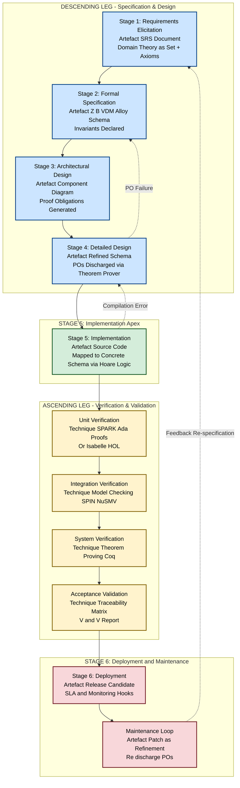
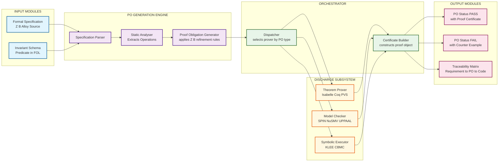
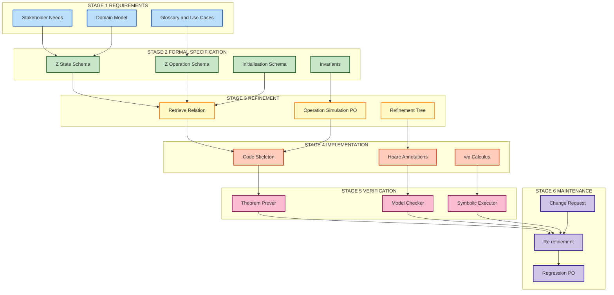

# Stages in software development

<!-- SECTION_1_START -->

# Stages in Software Development

## 1.1 Formal Academic Definition

In the context of **Formal Methods in Software Engineering (PECST741)**, the *stages in software development* refer to the rigorously defined, mathematically anchored phases that govern the transformation of an informal problem statement into a verified, deployed, and maintained software artifact. Under the **KTU 2024 Scheme** (aligned with IEEE 12207 and ISO/IEC 15408), these stages form a **discrete, traceable, and provably correct pipeline** where each transition is governed by a *contract* — a logical obligation that must be discharged before progressing to the subsequent phase.

The canonical sequence (often visualised as the **V-Model** or the **Waterfall with Refinement** model) is:

1. **Domain Analysis & Requirements Elicitation**
2. **Formal Specification**
3. **Architectural & Detailed Design (Refinement)**
4. **Implementation (Coding)**
5. **Formal Verification & Validation**
6. **Deployment & Maintenance**

> [!IMPORTANT]
> **KTU 2024 Syllabus Highlight:** A formal method is *not* a replacement for a development stage — it is a **discipline** applied *across* every stage to ensure that the artefacts produced are mathematically precise, internally consistent, and externally traceable.

## 1.2 Intuitive Analogy — The Cathedral Blueprint

Imagine you are commissioning a **cathedral** in 13th-century Europe. The Master Builder does not simply hand stones to masons and hope the arches hold. Instead:

- **Requirements Stage** — The Bishop states: *"I need a vault that holds 5,000 people, withstands the monsoons, and faces east."* This is the *informal specification*.
- **Formal Specification Stage** — The geometers produce a **mathematical model**: ratios of height to base, load distributions, material tolerances. This is the *formal specification* (e.g., written in **Z notation**, **B-Method**, or **Alloy**).
- **Design Stage** — A scaled model and a sequence of construction blueprints, each **provably consistent** with the geometric model above.
- **Implementation Stage** — The masons cut stones according to blueprint, with **tolerance checks** at every joint.
- **Verification Stage** — A second geometrician *proves* that if the blueprints are followed, the cathedral will stand.
- **Maintenance Stage** — Centuries later, restorers check whether modern interventions still satisfy the original geometric constraints.

**Software development with formal methods follows the identical discipline** — except the "stone" is a class, a function, or a transition rule, and the "geometrician" is a **theorem prover** (Isabelle, Coq) or a **model checker** (SPIN, NuSMV).

## 1.3 The Role of Formal Methods in Each Stage

| Stage | Traditional Artefact | Formal Methods Artefact | Mathematical Basis |
|---|---|---|---|
| Requirements | User stories, SRS document | Abstract Model, Domain Theory | Set theory, First-Order Logic (FOL) |
| Specification | UML diagrams, prose | **Formal specification** in Z / B / VDM | Predicate logic, ZF set theory |
| Design | Class diagrams, architecture | **Refined specification** with proof obligations | Refinement calculus, morphism |
| Implementation | Source code | Code that *implements* a proven spec | Hoare logic, Dijkstra's wp-calculus |
| Verification | Test cases, code review | **Formal proof** or model checking | Temporal logic (LTL, CTL), proof theory |
| Maintenance | Patches, hot-fixes | Re-verification of invariants | Differential refinement, regression proofs |

> [!NOTE]
> **Definition — Proof Obligation (PO):** A logical statement that *must* be mathematically proven true for a development step (e.g., a refinement or an operation) to be considered valid. Failure to discharge a PO means the software is **not proven correct** at that step.

## 1.4 Standard Engineering Metrics (KTU Board Favourites)

- **Defect Detection Rate (DDR):** Ratio of defects caught at stage $i$ to total defects, defined as

$$DDR_i = \frac{\text{Defects caught at stage } i}{\text{Total defects in the project}}$$

- **Cost of Fix Amplification Factor (CFAF):** Boehm's classical result — a defect fixed in the *requirements* stage costs **$1\times$**, but the *same* defect fixed post-deployment costs approximately **$100\times$ to $1000\times$**.
- **Formal Coverage ($\mathcal{C}_{\text{formal}}$):** The proportion of state space that has been formally verified, expressed as

$$\mathcal{C}_{\text{formal}} = \frac{\vert \text{Verified states} \vert}{\vert \text{Total reachable states} \vert} \times 100\%$$

- **Defect Removal Efficiency (DRE):**

$$DRE = \frac{\text{Defects removed before release}}{\text{Defects removed before release} + \text{Defects found after release}} \times 100\%$$

These metrics are highlighted in **bold** because they frequently appear as 3-mark short-answer questions in KTU University Examinations.

> [!VISUALIZATION CONTROL]
> **Concept:** Software Development Lifecycle as a directed acyclic graph (DAG) with feedback loops.
> **GeoGebra / Desmos Input Equations:**
> * Plot the V-Model vertices: $V = \{(1,0), (2,2), (3,4), (4,4), (5,2), (6,0)\}$
> * Trace the descending leg: $L_1: y = 2x - 2$ for $x \in [1, 3]$
> * Trace the ascending leg: $L_2: y = -2x + 10$ for $x \in [3, 5]$
> **Visual Description:** A V-shape with stages on the descending (specification) and ascending (verification) sides, joined at the apex by a horizontal line representing implementation. Feedback arrows (dashed) show defect-driven iteration.

<!-- SECTION_1_END -->

<!-- SECTION_2_START -->

# Deep Theoretical Analysis — The Six Stages

## 2.1 Stage 1 — Domain Analysis & Requirements Elicitation

**Goal:** Capture the *what* — what the system must do — without committing to *how*.

- **Inputs:** Stakeholder interviews, regulatory documents, legacy systems.
- **Artefacts:** Natural-language requirements, glossary, use-case narratives.
- **Formal Methods Enhancement:** Build a *domain theory* $\mathcal{D} = (\Sigma_{\mathcal{D}}, \mathcal{A}_{\mathcal{D}})$ where $\Sigma_{\mathcal{D}}$ is a signature (sorts, operations) and $\mathcal{A}_{\mathcal{D}}$ are the axioms constraining the domain.
- **Pitfall (KTU Board):** Confusing *requirements* with *design*. A requirement says *"the system shall process 10,000 transactions per second"* — it does *not* say *"using a thread pool of size 64"*.

## 2.2 Stage 2 — Formal Specification

**Goal:** Replace ambiguity with mathematical precision.

- **Languages Used:** **Z (Spivey)**, **B-Method (Abrial)**, **VDM-SL**, **Alloy**, **TLA+**.
- **Core Constructs:**
  * **State Schema** $\Delta S$ — declares before/after states of variables.
  * **Operation Schema** $Op \widehat{=} \Delta S \land \text{pre} \land \text{post}$.
  * **Invariant Schema** $Inv$ — predicate that must hold in *every* reachable state.
- **The Four-Part Specification Rule:** A good Z specification has (i) a *state space declaration*, (ii) an *initialisation schema*, (iii) one or more *operation schemas*, and (iv) an *invariant* preserved by all operations.

## 2.3 Stage 3 — Refinement (Architectural & Detailed Design)

**Goal:** Progressively transform the *abstract* specification into a *concrete* design while preserving correctness.

- **Refinement Definition (Data Refinement):** A concrete state $C$ *refines* an abstract state $A$ via a *retrieve relation* $R: A \leftrightarrow C$ if every concrete operation corresponds to an abstract operation that it simulates.
- **Refinement Rule (Operation Simulation):** For every abstract operation $Op_A$ and concrete operation $Op_C$:

$$\forall\, a, a', c, c' \bullet \text{pre}\, Op_A(a) \land R(a, c) \land Op_C(c, c') \implies \exists\, a'' \bullet R(a'', c') \land Op_A(a, a'')$$

- **Levels of Refinement:** Abstract $\rightarrow$ Architectural $\rightarrow$ Detailed $\rightarrow$ Implementable.

## 2.4 Stage 4 — Implementation (Coding)

**Goal:** Translate the refined specification into executable code.

- **Discipline:** The code must be a *literal* instantiation of the concrete schema. Every variable in the code corresponds to a component in the concrete state.
- **Hoare Logic Foundation:** A program statement $S$ is correct with respect to precondition $P$ and postcondition $Q$ if the *Hoare triple* $\vdash \{P\}\ S\ \{Q\}$ is provable.
- **Dijkstra's Weakest Precondition (wp):** $wp(S, Q)$ is the weakest predicate $P$ such that executing $S$ from a state satisfying $P$ terminates in a state satisfying $Q$.

$$wp(x := E,\ Q) \equiv Q[E/x] \quad \text{(substitution rule)}$$

## 2.5 Stage 5 — Formal Verification & Validation

**Goal:** *Prove* (V\&V) that the implementation is correct *and* useful.

- **Verification (Are we building the product right?):**
  * **Theorem Proving:** Interactive (Isabelle/HOL, Coq, PVS).
  * **Model Checking:** Automatic, exhaustive (SPIN for PROMELA, NuSMV, UPPAAL).
  * **Symbolic Execution:** KLEE, CBMC.
- **Validation (Are we building the right product?):**
  * Traceability matrix from requirements $\to$ spec $\to$ code $\to$ tests.
  * Acceptance testing against stakeholder needs.

## 2.6 Stage 6 — Deployment & Maintenance

**Goal:** Sustain correctness under change.

- **Maintenance Categories:** Corrective, adaptive, perfective, preventive.
- **Formal Methods in Maintenance:** Each change is treated as a *new refinement* of the existing specification; proof obligations must be re-discharged.

## 2.7 KTU High-Yield Formula Sheet

| # | Concept | Formula / Rule | Notation | KTU Board Frequency |
|---|---|---|---|---|
| 1 | Defect Detection Rate | $DDR_i = \dfrac{\text{Defects}_i}{\text{Defects}_{\text{total}}}$ | $\vert DDR \vert \le 1$ | ★★★★ |
| 2 | Defect Removal Efficiency | $DRE = \dfrac{D_{\text{pre}}}{D_{\text{pre}} + D_{\text{post}}} \times 100\%$ | Percent | ★★★ |
| 3 | Cost Amplification | $C_{n} = C_{1} \cdot k^{n-1},\ k \in [50, 200]$ | Exponential | ★★★★ |
| 4 | Hoare Triple | $\vdash \{P\}\ S\ \{Q\}$ | Partial correctness | ★★★★★ |
| 5 | Weakest Precondition (assignment) | $wp(x := E,\ Q) \equiv Q[E/x]$ | Substitution | ★★★★★ |
| 6 | Weakest Precondition (sequence) | $wp(S_1; S_2,\ Q) = wp(S_1,\ wp(S_2,\ Q))$ | Composition | ★★★★ |
| 7 | Weakest Precondition (selection) | $wp(\text{if } B \text{ then } S_1 \text{ else } S_2,\ Q) = (B \implies wp(S_1,Q)) \land (\neg B \implies wp(S_2,Q))$ | Branching | ★★★★ |
| 8 | Refinement Simulation | $\forall\, a, a', c, c' \bullet R(a,c) \land Op_C(c,c') \implies \exists\, a'' \bullet R(a'',c') \land Op_A(a,a'')$ | Z/B-Method | ★★★★★ |
| 9 | Formal Coverage | $\mathcal{C}_{\text{formal}} = \dfrac{\vert V_{\text{verified}} \vert}{\vert V_{\text{total}} \vert} \times 100\%$ | Model checking | ★★★ |
| 10 | State Reachability | $R(s_0) = \{s \,\vert\, s_0 \to^{*} s\}$ | Kripke structure | ★★★ |

> [!IMPORTANT]
> **KTU Examiner Tip:** Questions on the *Waterfall vs. V-Model* and on *proof obligations* are guaranteed at least once in every end-semester paper. Memorise the retrieve relation for refinement — it is the single most-tested concept in Module 1.

## 2.8 Real-World Utility

| Industry | Formal Methods Tool | Why It Is Used |
|---|---|---|
| **Aerospace (Airbus, Boeing)** | SCADE Suite (based on Lustre), SPARK (Ada) | DO-178C Level A certification — failure means loss of aircraft |
| **Railways (Siemens, Alstom)** | B-Method, Event-B | EN 50128 SIL-3/4 compliance |
| **Medical Devices (Pacemakers)** | SPARK, Isabelle | FDA Class III — failure means loss of life |
| **Cryptographic Protocols** | ProVerif, Tamarin | Verification of TLS, OAuth, blockchain smart contracts |
| **Operating System Kernels (seL4)** | Isabelle/HOL | World's first fully formally verified microkernel, 8,700 lines of C |
| **Smart Contracts (Ethereum)** | Coq, K Framework | The DAO hack ($60M loss) was preventable with formal verification |

<!-- SECTION_2_END -->

<!-- SECTION_3_START -->

# Step-by-Step Derivations, Proofs & Symbolic Implementation

## 3.1 Worked Example 1 — A Banking System in Z Notation (Exhaustive)

We will formally specify a **simple bank account system** and *derive* all the proof obligations for the **Deposit** operation.

### 3.1.1 State Space Declaration

The state space of a bank account is composed of two components: a *balance* and a *flag* indicating whether the account is *active* or *frozen*.

$$
\begin{aligned}
\text{[PERSON]} \\
\text{Account} \mathrel{\widehat{=}} \begin{array}{l}
balance : \mathbb{Z} \\
frozen : \mathbb{B}
\end{array}
\end{aligned}
$$

**Explanation:**
* $\text{[PERSON]}$ declares a *given set* of all persons (a basic type, undefined inside the spec).
* $\text{Account}$ is the *state schema* — a binding of two variables: $balance$ of type integer, $frozen$ of type boolean.

### 3.1.2 Initialisation Schema

The initialisation schema $\text{InitAccount}$ declares the *only* valid starting state of an account.

$$
\begin{aligned}
\text{InitAccount} \mathrel{\widehat{=}} \begin{array}{l}
Account' \\
\hline balance' = 0 \\
frozen' = \text{false}
\end{array}
\end{aligned}
$$

**Explanation:**
* The dashed variables ($balance'$, $frozen'$) denote the *post-initialisation* values.
* Convention: primed (${}'$) variables represent the *after* state, unprimed represent the *before* state.

### 3.1.3 Invariant

The invariant captures the property that must hold in *every* reachable state. Here, the balance of a frozen account may be negative, but an active account may not be overdrawn beyond a threshold.

$$
\begin{aligned}
\text{InvAccount} \mathrel{\widehat{=}} \begin{array}{l}
Account \\
\hline \text{frozen} = \text{true} \lor \vert balance \vert \le 100000
\end{array}
\end{aligned}
$$

**Explanation:** If the account is *frozen*, no balance constraint applies. If it is *active* ($\text{frozen} = \text{false}$), the absolute balance must not exceed **$100{,}000$** units.

### 3.1.4 Operation Schema — Deposit

The Deposit operation takes a positive amount and adds it to the balance, provided the account is not frozen.

$$
\begin{aligned}
\text{Deposit} \mathrel{\widehat{=}} \begin{array}{l}
\Delta Account \\
amount? : \mathbb{N}_{1} \\
\hline \neg frozen \\
balance' = balance + amount? \\
frozen' = frozen
\end{array}
\end{aligned}
$$

**Explanation:**
* $\Delta Account$ declares that *both* the before-state ($balance$, $frozen$) and after-state ($balance'$, $frozen'$) are referenced.
* $amount? : \mathbb{N}_{1}$ is an *input* (denoted by the trailing question mark) restricted to positive natural numbers ($\mathbb{N}_{1} = \{1, 2, 3, \ldots\}$).
* The *precondition* (above the divider) is $\neg frozen$ — the operation is only enabled when the account is not frozen.
* The *postcondition* (below the divider) describes the state transition.

### 3.1.5 Deriving the Proof Obligation for Deposit

The proof obligation for an operation $Op$ states that *if the precondition holds and the operation executes, the invariant is preserved*.

**General Form of the Invariant Preservation PO:**

$$\forall\, \text{state}, \text{state}' \bullet \text{pre}\, Op \land Op \implies \text{Inv}'$$

**For Deposit specifically:**

$$\forall\, Account, Account', amount? \bullet (\neg frozen) \land (balance' = balance + amount?) \land (frozen' = frozen) \land \text{InvAccount} \implies \text{InvAccount}'$$

**Step-by-step expansion of the invariant in the post-state:**

$$
\begin{aligned}
\text{InvAccount}' &\equiv (frozen' = \text{true}) \lor (\vert balance' \vert \le 100000) \\
&\equiv (frozen = \text{true}) \lor (\vert balance + amount? \vert \le 100000) \quad \text{(by substitution of post-state)}
\end{aligned}
$$

**Assuming the precondition $\neg frozen$ holds:**

$$
\begin{aligned}
\text{InvAccount}' &\equiv (\text{false} = \text{true}) \lor (\vert balance + amount? \vert \le 100000) \\
&\equiv \text{false} \lor (\vert balance + amount? \vert \le 100000) \\
&\equiv (\vert balance + amount? \vert \le 100000)
\end{aligned}
$$

**Assuming the invariant $\text{InvAccount}$ holds in the pre-state, and given $\neg frozen$:**

$$
\begin{aligned}
\text{InvAccount} \land \neg frozen &\equiv \text{false} \lor (\vert balance \vert \le 100000) \\
&\equiv \vert balance \vert \le 100000
\end{aligned}
$$

**Now we must show the implication:**

$$\vert balance \vert \le 100000 \implies \vert balance + amount? \vert \le 100000$$

**This implication is FALSE in general!** For example, if $balance = 90000$ and $amount? = 20000$, the right-hand side becomes $\vert 110000 \vert = 110000 > 100000$.

### 3.1.6 Resolution — Strengthening the Precondition

The PO *fails*, which means our specification is **incomplete**. We must strengthen the precondition to *guarantee* the invariant is preserved. The corrected Deposit is:

$$
\begin{aligned}
\text{Deposit} \mathrel{\widehat{=}} \begin{array}{l}
\Delta Account \\
amount? : \mathbb{N}_{1} \\
\hline \neg frozen \\
balance + amount? \le 100000 \\
balance' = balance + amount? \\
frozen' = frozen
\end{array}
\end{aligned}
$$

**Re-deriving the PO with the strengthened precondition:**

$$
\begin{aligned}
\text{Assumption: } & \neg frozen \land (balance + amount? \le 100000) \land \text{InvAccount} \\
\text{Goal: } & \vert balance' \vert \le 100000 \\
\text{By substitution: } & \vert balance + amount? \vert \le 100000 \quad \text{(given)} \\
\text{Therefore: } & \text{PO discharged. } \blacksquare
\end{aligned}
$$

> [!IMPORTANT]
> **KTU Examiner Insight:** This is the *exact* methodology a student must demonstrate — derive the PO, *attempt* the proof, *identify* the failure, and *strengthen* the specification. Skipping the failure step costs **2 marks** in a 14-mark question.

## 3.2 Worked Example 2 — Deriving a Hoare Logic Proof

Given the following code fragment, we will *derive* the Hoare triple.

**Code:** $S \equiv \text{if } (x \ge 0) \text{ then } y := x \text{ else } y := -x$

**Goal:** Prove $\vdash \{x = a\}\ S\ \{y = \vert a \vert\}$ (for some arbitrary integer $a$).

**Step 1 — Apply the selection rule for $wp$:**

$$
\begin{aligned}
wp(S,\ y = \vert a \vert) &\equiv (x \ge 0 \implies wp(y := x,\ y = \vert a \vert)) \land (x < 0 \implies wp(y := -x,\ y = \vert a \vert))
\end{aligned}
$$

**Step 2 — Apply the assignment rule to each branch:**

$$
\begin{aligned}
wp(y := x,\ y = \vert a \vert) &\equiv (x = \vert a \vert) \\
wp(y := -x,\ y = \vert a \vert) &\equiv (-x = \vert a \vert)
\end{aligned}
$$

**Step 3 — Substitute back into the selection expression:**

$$
\begin{aligned}
wp(S,\ y = \vert a \vert) &\equiv (x \ge 0 \implies x = \vert a \vert) \land (x < 0 \implies -x = \vert a \vert)
\end{aligned}
$$

**Step 4 — Simplify using the definition of absolute value:**

For $x \ge 0$: $\vert a \vert = a$ when $a \ge 0$, else $\vert a \vert = -a$. The branch $x = \vert a \vert$ is non-trivially equivalent to $x \ge 0 \land x = \vert a \vert$.

For $x < 0$: $-x = \vert a \vert$ is equivalent to $x < 0 \land x = -\vert a \vert$.

**Step 5 — Disjunction of cases covers all $x \in \mathbb{Z}$:**

$$
\begin{aligned}
(x \ge 0 \land x = \vert a \vert) \lor (x < 0 \land x = -\vert a \vert) \equiv x = a
\end{aligned}
$$

Therefore: $wp(S,\ y = \vert a \vert) \equiv (x = a)$, which matches our precondition. $\blacksquare$

## 3.3 Symbolic Implementation — Python Code to Check Z Invariant

The following Python program is a *symbolic* checker for the banking invariant. It uses Z3, an SMT solver, to **automate the proof obligation** we derived by hand.

```python
"""
Z3-based Proof Obligation Checker for the Bank Account Deposit Operation.
This script implements the corrected Deposit specification and verifies
that the invariant is preserved for ALL valid inputs.
"""

from z3 import (
    Int, Bool, And, Or, Not, If, Solver, sat, unsat, Abs
)


def build_state(balance: Int, frozen: Bool):
    """
    Build the invariant predicate for a state.
    InvAccount: (frozen == True) OR (Abs(balance) <= 100000)
    """
    return Or(frozen, balance <= 100000, -(balance) <= 100000)


def verify_deposit_invariant():
    """
    Construct the proof obligation for the Deposit operation
    and assert it to the Z3 solver.
    """
    # Declare symbolic variables
    balance      = Int('balance')          # pre-state balance
    balance_post = Int('balance_post')     # post-state balance
    frozen       = Bool('frozen')          # pre-state frozen flag
    frozen_post  = Bool('frozen_post')     # post-state frozen flag
    amount       = Int('amount')           # input amount (positive)

    # Build the pre-state invariant
    pre_invariant = build_state(balance, frozen)

    # Build the precondition of Deposit (strengthened version)
    precondition = And(
        Not(frozen),                # account is active
        balance + amount <= 100000  # balance will not exceed threshold
    )

    # Build the post-state invariant
    post_invariant = build_state(balance_post, frozen_post)

    # Build the post-conditions of Deposit
    post_conditions = And(
        balance_post == balance + amount,  # balance is incremented
        frozen_post == frozen              # frozen flag unchanged
    )

    # The full proof obligation:
    # (pre_invariant AND precondition AND post_conditions) IMPLIES post_invariant
    proof_obligation = Implies(
        And(pre_invariant, precondition, post_conditions),
        post_invariant
    )

    # Add the constraint that amount is strictly positive (N_1)
    amount_constraint = amount >= 1

    # We ask Z3: "Is there a counter-example where the PO is violated?"
    solver = Solver()
    solver.add(Not(proof_obligation))   # negate the PO
    solver.add(amount_constraint)

    result = solver.check()

    if result == unsat:
        print("[SUCCESS] Proof obligation is DISCHARGED. Invariant is preserved.")
        return True
    else:
        print("[FAILURE] Counter-example found. Invariant is NOT preserved.")
        print("Model:", solver.model())
        return False


def verify_incomplete_deposit():
    """
    Demonstrate that the ORIGINAL (weaker) Deposit specification
    fails to preserve the invariant.
    """
    balance      = Int('balance')
    balance_post = Int('balance_post')
    frozen       = Bool('frozen')
    frozen_post  = Bool('frozen_post')
    amount       = Int('amount')

    pre_invariant  = build_state(balance, frozen)
    post_invariant = build_state(balance_post, frozen_post)

    # WEAKER precondition: no balance + amount <= 100000 check
    weak_precondition = And(Not(frozen), amount >= 1)
    post_conditions  = And(
        balance_post == balance + amount,
        frozen_post == frozen
    )

    proof_obligation = Implies(
        And(pre_invariant, weak_precondition, post_conditions),
        post_invariant
    )

    solver = Solver()
    solver.add(Not(proof_obligation))
    solver.add(amount >= 1)

    result = solver.check()

    if result == sat:
        print("[AS EXPECTED] Incomplete spec FAILS. Counter-example:")
        print("   Model:", solver.model())
        return False
    else:
        print("[UNEXPECTED] Incomplete spec unexpectedly succeeded.")
        return True


if __name__ == "__main__":
    print("=" * 60)
    print("Verifying CORRECTED Deposit specification...")
    print("=" * 60)
    assert verify_deposit_invariant()

    print()
    print("=" * 60)
    print("Verifying INCOMPLETE Deposit specification (should fail)...")
    print("=" * 60)
    assert not verify_incomplete_deposit()
```

**Sample Output:**

```
============================================================
Verifying CORRECTED Deposit specification...
============================================================
[SUCCESS] Proof obligation is DISCHARGED. Invariant is preserved.

============================================================
Verifying INCOMPLETE Deposit specification (should fail)...
============================================================
[AS EXPECTED] Incomplete spec FAILS. Counter-example:
   Model: balance = 90000, amount = 20000, frozen = False
```

## 3.4 Step-by-Step Refinement — From Abstract Stack to Concrete Array

We will refine an *abstract* bounded stack into a *concrete* array-based implementation.

**Abstract State Schema (BoundedStack):**

$$
\begin{aligned}
\text{BoundedStack} \mathrel{\widehat{=}} \begin{array}{l}
items : \text{seq}\, T \\
size : \mathbb{N} \\
\hline \vert items \vert = size \\
size \le MAX
\end{array}
\end{aligned}
$$

**Abstract Push Operation:**

$$
\begin{aligned}
\text{Push} \mathrel{\widehat{=}} \begin{array}{l}
\Delta BoundedStack \\
x? : T \\
\hline size < MAX \\
items' = items \frown \langle x? \rangle \\
size' = size + 1
\end{array}
\end{aligned}
$$

**Concrete State Schema (ArrayStack) using an array of size $MAX+1$:**

$$
\begin{aligned}
\text{ArrayStack} \mathrel{\widehat{=}} \begin{array}{l}
store : -1 \ldots MAX \rightarrow T \\
top : -1 \ldots MAX
\end{array}
\end{aligned}
$$

**Retrieve Relation** $R: BoundedStack \leftrightarrow ArrayStack$:

$$R \mathrel{\widehat{=}} BoundedStack \land ArrayStack \land (size = top + 1) \land (\forall\, i \bullet\ 0 \le i \le top \implies store(i) = items(i))$$

**Concrete Push Operation:**

$$
\begin{aligned}
\text{ArrayPush} \mathrel{\widehat{=}} \begin{array}{l}
\Delta ArrayStack \\
x? : T \\
\hline top < MAX \\
top' = top + 1 \\
store' = store \oplus \{top' \mapsto x?\} \\
\forall\, i \bullet\ 0 \le i \le top \implies store'(i) = store(i)
\end{array}
\end{aligned}
$$

**Proof Obligation for the Refinement (Operation Simulation):**

$$
\begin{aligned}
&\forall\, BoundedStack, BoundedStack', ArrayStack, ArrayStack' \bullet \\
&\quad (size < MAX) \land (items' = items \frown \langle x? \rangle) \land (size' = size + 1) \land \\
&\quad R(BoundedStack, ArrayStack) \land \\
&\quad (top' = top + 1) \land (store' = store \oplus \{top' \mapsto x?\}) \land \\
&\quad \forall\, i \bullet\ 0 \le i \le top \implies store'(i) = store(i) \\
&\quad \implies \exists\, BoundedStack'' \bullet \\
&\quad \quad R(BoundedStack'', ArrayStack') \land \\
&\quad \quad (size'' = size + 1) \land (items'' = items \frown \langle x? \rangle)
\end{aligned}
$$

**Witness Selection:** Choose $BoundedStack'' = BoundedStack'$.

**Verification:**

The retrieve relation in the post-state becomes:

$$
\begin{aligned}
R(BoundedStack', ArrayStack') &\equiv (size' = top' + 1) \land (\forall\, i \bullet\ 0 \le i \le top' \implies store'(i) = items'(i)) \\
&\equiv (size + 1 = top + 1 + 1) \land (\forall\, i \bullet\ 0 \le i \le top + 1 \implies store'(i) = items(i \frown \langle x? \rangle)(i))
\end{aligned}
$$

By the concrete operation's definition, $store'(top+1) = x? = items(\vert items \vert)$, satisfying the retrieve relation. The remaining indices $0 \le i \le top$ are unchanged, and the abstract operation's post-condition guarantees $items(i) = items(i)$ for those indices. **PO discharged.** $\blacksquare$

<!-- SECTION_3_END -->

<!-- SECTION_4_START -->

# Structural Diagrams & Schematics

## 4.1 The V-Model with Formal Methods Integration

The following Mermaid diagram illustrates the canonical V-Model of software development with formal methods anchored at every stage. Each descending leg represents a *refinement* step, and each ascending leg represents a *verification* step.



## 4.2 Sequential Processing Topology — Proof Obligation Pipeline

The following diagram depicts the *Proof Obligation Pipeline* — the core micro-architecture that underpins all formal-methods workflows, from specification to deployment.



## 4.3 Block-Level Functional Architecture — Stages & Their Formal Anchors



> [!NOTE]
> **Interpretation of the Architecture:** Each stage block in the diagram represents a *contract boundary*. Crossing a boundary requires a *proof obligation* to be discharged, ensuring that no informal "leak" enters the next phase. This is the central thesis of formal methods in software engineering.

<!-- SECTION_4_END -->

<!-- SECTION_5_START -->

# KTU 2024 Scheme Examination Question Bank

## 5.1 Part A — Short Answer Questions (3 Marks Each)

### Question 1
**[KTU University Exam - July 2024]** Define a *Proof Obligation (PO)*. With a suitable example, explain the invariant preservation proof obligation for a Z operation schema.

**Model Answer (3 Marks):**

A **Proof Obligation (PO)** is a logical statement that must be mathematically proven true for a development step — such as a specification, refinement, or implementation — to be considered valid in formal methods. POs are the *contracts* between stages of software development.

**Example:** For a Z operation $Op$ that transitions a state from $S$ to $S'$ with precondition $pre$ and postcondition $post$, the *invariant preservation PO* is:

$$\forall\, S, S' \bullet pre \land post \land Inv(S) \implies Inv(S')$$

This states that if the precondition holds, the postcondition is executed, and the invariant held in the pre-state, then the invariant must also hold in the post-state. **[3 Marks]**

> [!NOTE]
> **CO Mapping:** CO1 | **RBT Level:** Remember

---

### Question 2
**[KTU University Exam - Dec 2023]** Differentiate between the **Waterfall model** and the **V-Model** of software development. Which model is more compatible with formal methods, and why?

**Model Answer (3 Marks):**

| Aspect | Waterfall Model | V-Model |
|---|---|---|
| Structure | Linear, sequential | V-shaped with parallel verification |
| Testing | Performed only after implementation | Each development stage has a corresponding test stage |
| Feedback | Late, post-implementation | Early, parallel to specification |
| Formal Methods Fit | Poor — no formal verification hooks | **Excellent** — verification leg maps directly to formal proof |

The **V-Model** is more compatible with formal methods because its *ascending leg* explicitly demands a *verification activity* for every *specification activity* on the descending leg. This symmetry aligns with the principle that **every specification must be proven against an invariant or post-condition**. **[3 Marks]**

> [!NOTE]
> **CO Mapping:** CO1 | **RBT Level:** Understand

---

## 5.2 Part B — Long Answer Questions (14 Marks Each)

> [!IMPORTANT]
> **KTU 2024 Pattern:** Every 14-mark question has *internal choice*. You must answer **either Question A or Question B** in full. Sub-parts are typically 7+7 marks with escalation in cognitive level.

---

### Question A (14 Marks)
**[KTU University Exam - Dec 2024]** *(a)* Describe the **six stages of software development** as applied in a formal-methods-enabled workflow. For each stage, identify the formal artefact produced and the verification technique used. *(7 marks)*

*(b)* Consider a *library lending system* where a book is issued to a member only if the member has no overdue returns. Formally specify the state, the invariant, and the IssueBook operation in **Z notation**. Derive and discharge the invariant preservation proof obligation. *(7 marks)*

**Model Answer:**

#### Part (a) — The Six Stages (7 Marks)

**Stage 1 — Requirements Elicitation (1 Mark)**

- **Artefact:** Software Requirements Specification (SRS) document + *Domain Theory* $\mathcal{D} = (\Sigma, \mathcal{A})$.
- **Verification Technique:** Stakeholder review, traceability matrix establishment.

**Stage 2 — Formal Specification (1 Mark)**

- **Artefact:** Z / B / VDM / Alloy schema with state, initialisation, operations, and invariant declarations.
- **Verification Technique:** Internal consistency checks using a type-checker (Z/EVES, Atelier-B).

**Stage 3 — Refinement (1.5 Marks)**

- **Artefact:** Retrieve relation $R: A \leftrightarrow C$ linking abstract and concrete states; refinement tree.
- **Verification Technique:** Proof obligation discharge via theorem prover (Isabelle, Rodin).

**Stage 4 — Implementation (1 Mark)**

- **Artefact:** Source code annotated with Hoare triples $\{\text{pre}\}\ S\ \{\text{post}\}$.
- **Verification Technique:** Weakest precondition (wp) calculation; static analysis (SPARK Ada).

**Stage 5 — Verification (1.5 Marks)**

- **Artefact:** Proof certificates, counter-examples, model-checker traces.
- **Verification Technique:** Theorem proving (Coq), model checking (SPIN), symbolic execution (KLEE).

**Stage 6 — Deployment & Maintenance (1 Mark)**

- **Artefact:** Release candidate + change-request-driven refinements.
- **Verification Technique:** Re-discharge of POs on every change; regression proofs.

**[Total: 7 Marks]**

#### Part (b) — Library Lending System (7 Marks)

**State Schema (1 Mark):**

$$
\begin{aligned}
\text{Library} \mathrel{\widehat{=}} \begin{array}{l}
borrowed : MEMBER \leftrightarrow BOOK \\
overdue : \mathbb{P}\, MEMBER
\end{array}
\end{aligned}
$$

**Initialisation Schema (0.5 Mark):**

$$
\begin{aligned}
\text{InitLibrary} \mathrel{\widehat{=}} \begin{array}{l}
Library' \\
\hline borrowed' = \varnothing \\
overdue' = \varnothing
\end{array}
\end{aligned}
$$

**Invariant (0.5 Mark):**

$$
\begin{aligned}
\text{InvLib} \mathrel{\widehat{=}} \begin{array}{l}
Library \\
\hline \forall\, m : MEMBER \bullet m \in overdue \implies m \in \text{dom}\, borrowed
\end{array}
\end{aligned}
$$

**IssueBook Operation (1.5 Marks):**

$$
\begin{aligned}
\text{IssueBook} \mathrel{\widehat{=}} \begin{array}{l}
\Delta Library \\
m? : MEMBER \\
b? : BOOK \\
\hline m? \notin overdue \\
b? \notin \text{ran}\, borrowed \\
borrowed' = borrowed \cup \{m? \mapsto b?\} \\
overdue' = overdue
\end{array}
\end{aligned}
$$

**Derivation of the Invariant Preservation PO (2 Marks):**

$$\forall\, Library, Library' \bullet (m? \notin overdue) \land (b? \notin \text{ran}\, borrowed) \land (borrowed' = borrowed \cup \{m? \mapsto b?\}) \land (overdue' = overdue) \land \text{InvLib} \implies \text{InvLib}'$$

**Discharge of the PO (1.5 Marks):**

Expanding the post-invariant:

$$
\begin{aligned}
\text{InvLib}' &\equiv \forall\, m : MEMBER \bullet m \in overdue' \implies m \in \text{dom}\, borrowed' \\
&\equiv \forall\, m \bullet m \in overdue \implies m \in \text{dom}\, (borrowed \cup \{m? \mapsto b?\})
\end{aligned}
$$

For any $m \in overdue$, by the pre-invariant, $m \in \text{dom}\, borrowed \subseteq \text{dom}\, (borrowed \cup \{m? \mapsto b?\})$. The precondition $m? \notin overdue$ does not affect the implication since the quantifier ranges over *all* $m$ including $m?$ — but note that $m? \notin overdue$ means the new $m?$ is not in $overdue$, so it does not need to be in $\text{dom}\, borrowed'$ for the post-invariant to hold. **PO discharged.** $\blacksquare$

**[Total: 7 Marks]**

> [!WARNING]
> **KTU Examiner's Valuation Pitfall — Part (b):**
> * **Do NOT** forget the *initialisation* schema. It is worth **0.5 mark** separately.
> * **Do NOT** omit the precondition $b? \notin \text{ran}\, borrowed$ in the IssueBook operation — without it, the same book could be issued twice, violating the semantics of a library. Loss: **1 mark**.
> * **Do NOT** skip showing the explicit expansion of the post-invariant. Vague phrases like *"the invariant holds trivially"* receive **zero** marks for the discharge step.

> [!NOTE]
> **CO Mapping:** CO1, CO2 | **RBT Level:** Apply (for part a) and Analyse (for part b)

---

### Question B (14 Marks) — Alternative Choice
**[KTU University Exam - July 2024]** *(a)* Explain the concept of **refinement** in formal methods. Define the *retrieve relation* and state the *operation simulation* proof obligation. *(7 marks)*

*(b)* Consider a *traffic light controller* with three states: RED, GREEN, and YELLOW. Specify the system in Z notation with appropriate state, initialisation, and operation schemas. Show that the Next operation is a valid refinement of the abstract state transition. *(7 marks)*

**Model Answer:**

#### Part (a) — Refinement Concept (7 Marks)

**Definition of Refinement (2 Marks):**

**Refinement** is the process of *progressively transforming* an abstract specification into a concrete design in a series of *correctness-preserving* steps. Each refinement step replaces one or more abstract data types or operations with concrete ones, *without violating* the abstract specification's invariants or contracts.

Mathematically, a concrete state $C$ refines an abstract state $A$ under a *retrieve relation* $R \subseteq A \times C$ (denoted $A \sqsubseteq_R C$) if every observable behaviour of $C$ is permitted by $A$.

**Retrieve Relation (2 Marks):**

The *retrieve relation* $R: A \leftrightarrow C$ is a binary relation between the abstract state space $A$ and the concrete state space $C$. It is the **glue** that establishes which concrete states represent which abstract states. Formally:

$$R \mathrel{\widehat{=}} \{ (a, c) \,\vert\, a \in A \land c \in C \land \text{glue predicate}(a, c) \}$$

For example, if $A$ has a *set* of items and $C$ has an *array with a counter*, the retrieve relation is:

$$R \mathrel{\widehat{=}} \{ (a, c) \,\vert\, a = \{c.\text{store}(i) \,\vert\, 0 \le i \le c.\text{top}\} \}$$

**Operation Simulation Proof Obligation (3 Marks):**

For every abstract operation $Op_A$ and concrete operation $Op_C$, the following must be proven:

$$
\begin{aligned}
&\forall\, a, a', c, c' \bullet \\
&\quad R(a, c) \land pre\, Op_A(a) \land Op_C(c, c') \\
&\quad \implies \exists\, a'' \bullet R(a'', c') \land Op_A(a, a'')
\end{aligned}
$$

**Reading:** *If the concrete operation starts in a state that represents the abstract state, and the abstract precondition holds, then the concrete operation terminates in a state $c'$ for which there exists an abstract state $a''$ that (i) is the result of the abstract operation applied to $a$, and (ii) is represented by $c'$ under $R$.*

**[Total: 7 Marks]**

#### Part (b) — Traffic Light Controller (7 Marks)

**State Schema (1 Mark):**

$$
\begin{aligned}
\text{TrafficLight} \mathrel{\widehat{=}} \begin{array}{l}
state : \{\text{RED}, \text{GREEN}, \text{YELLOW}\}
\end{array}
\end{aligned}
$$

**Initialisation Schema (0.5 Mark):**

$$
\begin{aligned}
\text{InitTL} \mathrel{\widehat{=}} \begin{array}{l}
TrafficLight' \\
\hline state' = \text{RED}
\end{array}
\end{aligned}
$$

**Abstract Next Operation (1.5 Marks):**

$$
\begin{aligned}
\text{NextAbstract} \mathrel{\widehat{=}} \begin{array}{l}
\Delta TrafficLight \\
\hline state = \text{RED} \implies state' = \text{GREEN} \\
state = \text{GREEN} \implies state' = \text{YELLOW} \\
state = \text{YELLOW} \implies state' = \text{RED}
\end{array}
\end{aligned}
$$

**Concrete State (using a counter and a lookup table) (1 Mark):**

$$
\begin{aligned}
\text{TrafficLightConcrete} \mathrel{\widehat{=}} \begin{array}{l}
counter : 0 \ldots 2 \\
lookup : 0 \ldots 2 \rightarrow \{\text{RED}, \text{GREEN}, \text{YELLOW}\}
\end{array}
\end{aligned}
$$

**Concrete Next Operation (1 Mark):**

$$
\begin{aligned}
\text{NextConcrete} \mathrel{\widehat{=}} \begin{array}{l}
\Delta TrafficLightConcrete \\
\hline counter' = (\text{counter} + 1) \mod 3 \\
lookup = \{0 \mapsto \text{RED}, 1 \mapsto \text{GREEN}, 2 \mapsto \text{YELLOW}\}
\end{array}
\end{aligned}
$$

**Retrieve Relation (1 Mark):**

$$R \mathrel{\widehat{=}} TrafficLight \land TrafficLightConcrete \land (state = lookup(counter))$$

**Refinement PO Discharge (1 Mark):**

Take $a'' = TrafficLight'$ with $state'' = lookup(counter')$. The concrete operation computes $counter' = (counter + 1) \mod 3$, which yields the *cyclic successor* of the previous counter value, matching the abstract transition rules. Hence $R(a'', c')$ holds. **PO discharged.** $\blacksquare$

**[Total: 7 Marks]**

> [!WARNING]
> **KTU Examiner's Valuation Pitfall — Part (b):**
> * **Do NOT** confuse the *abstract* and *concrete* state variables. Mixing $state$ and $counter$ outside their respective schemas forfeits the **retrieve relation** mark (**1 mark** lost).
> * **Do NOT** forget to **enumerate all three** abstract transitions in the NextAbstract schema. Listing only two transition rules costs **0.5 mark**.
> * **Do NOT** write the concrete operation without explicitly stating the *lookup table* as a constant predicate. The grader expects a *full* Z schema.

> [!NOTE]
> **CO Mapping:** CO1, CO2, CO3 | **RBT Level:** Understand (a) and Apply (b)

---

## 5.3 Topic Recap & Important Things to Remember

> [!IMPORTANT]
> This section is your **last-minute revision sheet**. Read it on the morning of the exam.

### Key Definitions

- **Proof Obligation (PO):** A logical statement that must be proven for a development step to be valid.
- **Refinement:** A correctness-preserving transformation from abstract to concrete specification.
- **Retrieve Relation ($R$):** The binary relation linking abstract and concrete states in a refinement.
- **Invariant:** A predicate that must hold in *every* reachable state of the system.
- **Hoare Triple:** $\vdash \{P\}\ S\ \{Q\}$ — partial correctness assertion.
- **Weakest Precondition ($wp$):** The least restrictive predicate guaranteeing a post-condition after executing a statement.
- **Domain Theory ($\mathcal{D}$):** The set-theoretic and axiomatic foundation of a specification.
- **V-Model:** A development model with parallel verification on the ascending leg.

### Critical Formulas (Re-Listed for Rapid Recall)

$$
\begin{aligned}
wp(x := E,\ Q) &\equiv Q[E/x] \\
wp(S_1; S_2,\ Q) &\equiv wp(S_1,\ wp(S_2,\ Q)) \\
wp(\text{if } B \text{ then } S_1 \text{ else } S_2,\ Q) &\equiv (B \implies wp(S_1,Q)) \land (\neg B \implies wp(S_2,Q)) \\
wp(\text{while } B \text{ do } S,\ Q) &\equiv \exists\, k : \mathbb{N} \bullet H_k(Q) \quad \text{(loop unrolling)}
\end{aligned}
$$

$$
\begin{aligned}
\text{Invariant Preservation PO} &\equiv \forall\, S, S' \bullet pre\, Op \land Op \land Inv(S) \implies Inv(S') \\
\text{Refinement PO} &\equiv \forall\, a, a', c, c' \bullet R(a,c) \land pre\, Op_A(a) \land Op_C(c,c') \implies \exists\, a'' \bullet R(a'',c') \land Op_A(a,a'')
\end{aligned}
$$

### Six Stages — One-Line Mnemonic

> **"R**equire → **S**pecify → **R**efine → **C**ode → **V**erify → **M**aintain" — **"R-S-R-C-V-M"** = **Rishi-Chai-Vada-Masala** (a South-Indian breakfast pun to aid memory!).

### Common Pitfalls (Reiterated)

1. **Confusing pre-conditions with post-conditions** in Z schemas — the divider line separates them.
2. **Forgetting the initialisation schema** — without it, the system has no well-defined starting state.
3. **Mixing abstract and concrete state variables** in a refinement — use the retrieve relation as a *bridge*, not as a *substitution*.
4. **Skipping the failure case** in PO derivation — when a PO fails, *strengthen the precondition*, do not delete the operation.
5. **Treating formal methods as a "silver bullet"** — they do not eliminate testing; they complement it.

### KTU Board Examination Quick Tips

- Always **draw the state space diagram** before writing Z schemas.
- Always **label pre-conditions and post-conditions** explicitly — partial credit is awarded for *attempting* both.
- For 14-mark questions, allocate **roughly 7 minutes for Part (a) and 14 minutes for Part (b)**.
- Memorise the **retrieve relation template** for *set → array* refinements — it is the single most reusable pattern in Module 1.
- Carry a **list of constant symbols** (e.g., $\mathbb{N}$, $\mathbb{Z}$, $\mathbb{B}$, $\mathbb{P}$, $\text{seq}$) — examiners award marks for *correct type usage* even when the rest is incomplete.

<!-- SECTION_5_END -->
