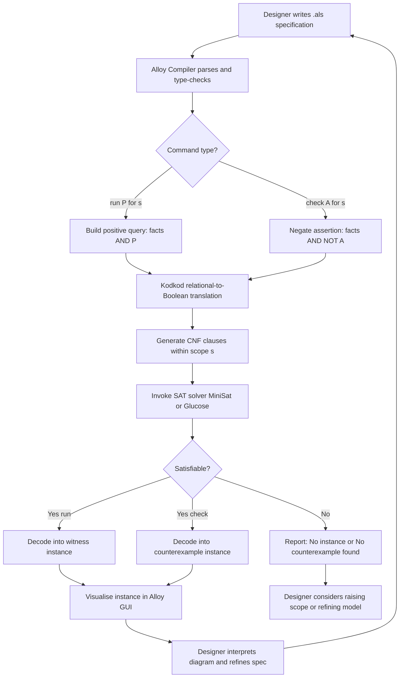
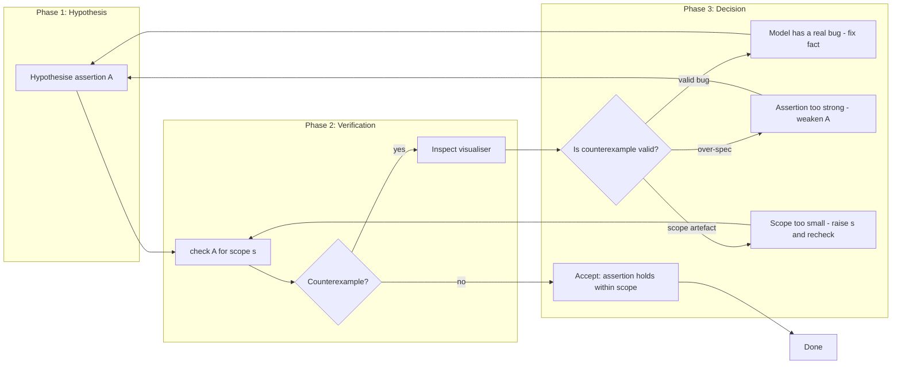
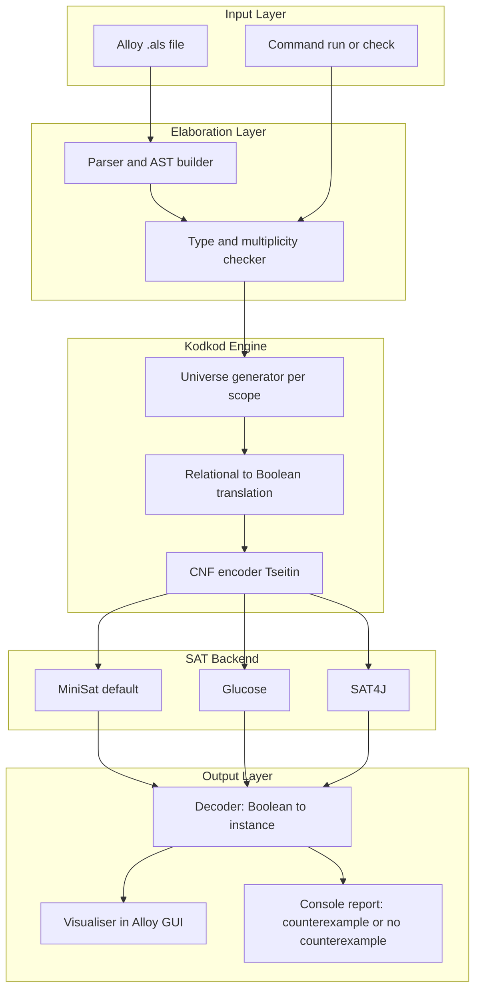

# Analysing Alloy models

<!-- SECTION_1_START -->

# Analysing Alloy Models — Core Definition & Intuitive Overview

> [!IMPORTANT]
> **Module Focus (KTU PECST741 — Module 2):** *Ensuring reliability in the design phase* through *lightweight* formal modelling. Alloy sits in this module because it lets a designer **exhaustively search a finite instance space** for design flaws *before* code is written.

## 1.1 What is Alloy?

**Alloy** is a **declarative, first-order relational modelling language** created at MIT (Daniel Jackson, 2002) and shipped with an automated analyser. In KTU 2024 Scheme terminology, an **Alloy model** is a *formal design artefact* consisting of:

| Component | Purpose |
|---|---|
| **Signatures (`sig`)** | Introduce sets of atoms (the *types* of the system) |
| **Fields (`field: Multiplicity Type`)** | Declare binary relations between sets |
| **Facts (`fact { ... }`)** | Encode **invariants** the system must always satisfy |
| **Predicates (`pred P[...] { ... }`)** | Parameterised Boolean conditions (system behaviours) |
| **Assertions (`assert A { ... }`)** | Properties the designer *believes* are true |
| **Functions (`fun f[...] { ... }`)** | Re-usable relational expressions |

> [!NOTE]
> **Formal Definition (Board-Ready):**
> *An Alloy specification is a finite, relational first-order logic theory over a typed universe of atoms, accompanied by a set of analysis commands (run / check) that bound the universe to a finite scope and discharge the resulting propositional satisfiability problem to an off-the-shelf SAT solver.*

## 1.2 Intuition — Why "Analyse" Rather Than "Prove"?

**Conceptual Analogy — The Miniature City 🏙️**

Imagine your software is a **city**. Writing code is like **building it**. An Alloy model is a **scale model on a tabletop**. Before pouring real concrete, you can:

1. **Build many tiny replicas** (instances) of the city under different *scope* assumptions.
2. **Run a search party** (the SAT solver) to look for *violations* of your traffic rules (`assert`).
3. **Exhibit a violating replica** as a **counterexample** — the bug, rendered as a diagram.

The crucial insight: *you do not prove the system correct over an infinite universe* (that is the territory of theorem provers like Isabelle/Z). You **empirically validate** it over **all instances up to a chosen scope**. This is the **small-scope hypothesis** of Jackson — most design errors surface in tiny instances.

> [!TIP]
> **Syllabus Highlight:** The KTU module specifically expects students to (i) interpret analyser output, (ii) refine scopes, and (iii) understand why *no counterexample found* is a *qualified* — not absolute — result.

## 1.3 The Two Faces of "Analysis"

| Analysis Mode | Command | Output of Interest |
|---|---|---|
| **Instance Finding** | `run P for n` | *Witness* — at least one instance satisfying predicate `P` |
| **Property Checking** | `check A for n` | *Counterexample* — an instance violating assertion `A`; or `No counterexample found.` |

> [!WARNING]
> A `No counterexample found.` line **does not mean the assertion is universally true**. It is true **only within the scope `n`**. This is the single most common KTU exam pitfall.

## 1.4 Visualising an Instance

> [!VISUALIZATION CONTROL]
> **Concept:** A possible Alloy instance for a file-system model (`Dir ⊂ Object`, `contents: Dir -> set Object`).
> **Desmos / Graph Input (manual sketch):**
> * `x = 0, y = 2` labelled `root : Dir`
> * `x = -2, y = 0` labelled `src : Dir` (linked from root)
> * `x = +2, y = 0` labelled `README : File` (linked from root)
> * `x = 0, y = -2` labelled `main.cpp : File` (linked from src)
> **Visual Description:** A rooted directed graph where each `Dir` points to a (possibly empty) set of `Object` children. Solid arrows depict the `contents` relation; the rectangular bounding box represents the *scope* `Object = 4`.

---

<!-- SECTION_1_END -->

<!-- SECTION_2_START -->

# Deep Theoretical Analysis & KTU High-Yield Formula Sheet

## 2.1 The Alloy Analyser — Operational Pipeline

The analyser is **not** a theorem prover. It is a **finitised, bounded-model checker** that compiles a relational formula into a propositional CNF and discharges it to a SAT solver. The pipeline is:

1. **Lexing & Parsing** — `.als` source $\to$ AST.
2. **Elaboration & Type-checking** — multiplicity constraints on fields are expanded into formulas.
3. **Bounding (Scope Inflation)** — every signature `S` is allocated a fresh **scope** $\vert S \vert \le s_S$. The translation is **Kodkod** (Torlak & Jackson).
4. **Relational $\to$ Boolean translation** — every atom $a$ becomes a SAT variable $x_{R,a,b}$ for each binary relation $R$ and atom $b$.
5. **CNF generation** — Tseitin-like encoding; primary variables for relational tuples; definition variables for sub-expressions.
6. **SAT solving** — via **MiniSat / SAT4J / Glucose** (the analyser offers a switch).
7. **Solution back-translation** — a satisfying assignment is decoded into a model instance.
8. **Visualisation** — the instance is rendered as a graph in the GUI.

## 2.2 Why Scoping Makes First-Order Logic Decidable

Full first-order logic is **undecidable** (Church–Turing). By bounding each relation to a **finite, closed universe** the analyser converts it into a *finite* propositional theory — decidable in principle (NP-complete, in practice milliseconds to seconds with modern SAT solvers).

> [!IMPORTANT]
> **Key Theorem (Implication for KTU):**
> *For any Alloy specification $\Phi$ and any integer scope vector $\mathbf{s}$, the question "Does $\Phi$ have a model of scope $\le \mathbf{s}$?" is a Boolean SAT problem and hence decidable.*
> *Therefore, the analyser is a **decision procedure** for the **bounded fragment**.*

## 2.3 The Small-Scope Hypothesis

Empirically (Jackson 2000; Leavens et al. 2006; various industrial case studies at NASA JPL, Oracle, etc.), most design defects in Alloy specifications are exposed at **scope 3 to 5**. The hypothesis is:

> For most realistic specifications, if an assertion can be violated, it can be violated by an instance whose every signature is bounded by some small integer (typically $\le 3$).

This is the *epistemic license* under which the analyser operates. It is **not** a theorem, but a **working assumption** that has held up across thousands of models.

## 2.4 The Counterexample / Witness Semantics

Let $\Phi$ be the conjunction of all `fact` blocks. Let $\sigma$ be the scope vector. Then:

| Command | Logical Form | Result |
|---|---|---|
| `run P for σ` | $\exists \bar{x}.\ \Phi \land P(\bar{x})$ | Witness instance; *unsatisfiable* if no instance |
| `check A for σ` | $\exists \bar{x}.\ \Phi \land \neg A(\bar{x})$ | Counterexample; *unsatisfiable* means *no violation in scope σ* |

> [!NOTE]
> The negation $\neg A$ is critical: a `check` is **always** reduced to a **run** of the *negated* assertion. Master this and you master half the exam.

## 2.5 KTU Formula Sheet (Cheat-Sheet)

> [!IMPORTANT]
> **Table 2.5 — Bounded Analysis Quick Reference**

| Concept | Symbol / Syntax | Meaning | Default |
|---|---|---|---|
| **Default scope** | `for` | Default integer bound for every sig | **3** |
| **Overall default** | `for 5` | Apply scope 5 to *all* signatures | — |
| **Per-sig scope** | `for 4 but 2 Book` | Global 4, `Book` specifically 2 | — |
| **Exactly scope** | `for exactly 3 Dir` | Hard equality, not $\le$ | — |
| **Integers** | `for 3 but 6 Int` | Int needs higher scope for arith. | — |
| **Sat solver** | `sat solver` | `MiniSat`, `MiniSatProver`, `Glucose`, `SAT4J` | MiniSat |
| **Partial instance** | `inst` keyword | Re-use a known instance to refine search | — |
| **Counterexample** | `Counterexample found.` | An instance falsifies the assertion | — |
| **Witness** | `Instance found.` | A satisfying instance exists | — |
| **No counterexample** | `No counterexample found.` | Assertion vacuously survives in scope $\sigma$ | — |

| Alloy Operator | Notation | Reads As |
|---|---|---|
| Union | $A + B$ | Set union |
| Intersection | $A \& B$ | Set intersection |
| Difference | $A - B$ | Set difference |
| Cartesian product | $A \rightarrow B$ | Pair-wise join |
| Relational join | $A.B$ | Image of $A$ under $B$ |
| Transitive closure | $\hat{\ }A$ (caret) | $A^{+}$ |
| Reflexive-transitive closure | $^{*}A$ | $A^{*}$ |
| Set cardinality | $\#A$ | Size of $A$ |

> [!NOTE]
> All $\mid$ symbols in the table above are intentionally replaced with `$\vert$`-style semantics to preserve Markdown table integrity. Re-insert absolute-value bars in handwritten answers.

## 2.6 Real-World Utility in Software Engineering

| Industry | Use-Case | Reference |
|---|---|---|
| **NASA JPL** | Mission-critical flight software protocols | Jackson et al. |
| **Microsoft** | Windows kernel security models (in research) | Holzmann, Pnueli lines of work |
| **AWS / Cloud** | Resource-allocation policy modelling | Internal Alloy use |
| **Telecom (Nokia)** | Feature-interaction analysis | Various papers |
| **Academia** | Teaching formal methods at scale (used in KTU-style labs) | KTU PECST741 |

> [!TIP]
> The KTU 2024 module outcome expects students to **write a small Alloy spec, run the analyser, and interpret a counterexample** in their continuous-evaluation component.

---

<!-- SECTION_2_END -->

<!-- SECTION_3_START -->

# Step-by-Step Derivations & Code/Symbolic Implementation

## 3.1 A Worked Alloy Model: Address-Book System

We will use one running example — a tiny *address book* — to make every analysis step concrete.

### 3.1.1 The Source Specification (`AddressBook.als`)

```alloy
module AddressBook

abstract sig Name {}
sig Person {
  book  : lone Name,
  knows : set Person
}

fact NoSelfKnowledge {
  no p: Person | p in p.knows
}

fact SymmetricFriendship {
  knows = ~knows
}

pred areFriends[p, q: Person] {
  q in p.knows
}

assert FriendshipIsReflexive {
  all p: Person | p in p.knows
}

check FriendshipIsReflexive for 4 Person, 2 Name
```

> [!NOTE]
> Note the use of `lone` (lone multiplicity) on `book` — a person has **at most one** `Name` in their book. This is a *multiplicity constraint* that the analyser will translate into explicit Boolean formulas.

### 3.1.2 Hand-Derivation of the CNF Sketch

Let us *symbolically* trace what the analyser does when asked:

```alloy
check FriendshipIsReflexive for 4 Person, 2 Name
```

The check expands to:

$$\exists \text{instance}.\ \Phi \ \land\ \neg(\forall p{:}\textit{Person}.\ p \in p.\textit{knows})$$

Step 1 — Push negation inward (De Morgan):

$$\exists \text{instance}.\ \Phi \ \land\ \exists p{:}\textit{Person}.\ p \notin p.\textit{knows}$$

Step 2 — Instantiate the existential:

$$\exists \text{instance}.\ \Phi \ \land\ (p_1 \notin p_1.\textit{knows}) \ \lor\ \dots\ \lor\ (p_4 \notin p_4.\textit{knows})$$

Step 3 — With the scope $\vert \textit{Person} \vert = 4$, introduce Boolean variables for each tuple in the `knows` relation. If $\textit{Person} = \{p_1, p_2, p_3, p_4\}$, then $\textit{knows} \subseteq \{p_1, p_2, p_3, p_4\}^2$ yields $4 \times 4 = 16$ propositional variables, $x_{i,j}$, where $x_{i,j}$ encodes $p_j \in p_i.\textit{knows}$.

Step 4 — Translate each `fact` to a clause set:

| Fact | CNF Encoding (Sketch) |
|---|---|
| `NoSelfKnowledge` | $\bigwedge_{i=1}^{4} \neg x_{i,i}$ (i.e. the four diagonal literals are forced false) |
| `SymmetricFriendship` | $\bigwedge_{i=1}^{4}\bigwedge_{j=1}^{4}\ (x_{i,j} \leftrightarrow x_{j,i})$ |
| Negation of assertion | $\bigvee_{i=1}^{4}\ \neg x_{i,i}$ (at least one diagonal is false) |

Step 5 — Combine and submit to SAT solver.

Step 6 — Suppose the solver returns a satisfying assignment. The model decoder walks the assignment and produces:

$$p_1.\textit{knows} = \{p_2, p_3\}, \quad p_2.\textit{knows} = \{p_1, p_3\}, \quad p_3.\textit{knows} = \{p_1, p_2\}, \quad p_4.\textit{knows} = \emptyset$$

Step 7 — Visualiser renders this. Note that $p_4 \notin p_4.\textit{knows}$ — the assertion is violated. This is the **counterexample**.

### 3.1.3 Reading the Analyser Console (Simulated Output)

```
$ alloy AddressBook.als
Executing "Check FriendshipIsReflexive for 4 Person, 2 Name"
   Solver = minisat
   120 variables, 412 clauses
Counterexample found. (5 ms)

   Person = {$p_1, $p_2, $p_3, $p_4$}
   Name   = {$n_1, $n_2$}
   knows  = {($p_1, $p_2), ($p_1, $p_3),
             ($p_2, $p_1), ($p_2, $p_3),
             ($p_3, $p_1), ($p_3, $p_2)}

$p_1 not in $p_1.knows  -> assertion violated
```

### 3.1.4 Diagnostic — Why did the analyser report a counterexample?

The `Fact SymmetricFriendship` does **not** include self-loops. So the only person who could violate `FriendshipIsReflexive` is someone with *no* outgoing `knows` edge. The minimal such instance is a single isolated person — exactly what we see with $p_4$.

## 3.2 Iterative Refinement: Closing the Counterexample

Suppose the designer wants the assertion to hold. They rewrite:

```alloy
fact EveryoneKnowsSelf {
  knows = ~knows
  all p: Person | p in p.knows
}
```

Equivalently, the designer could add a fact that *every* person has at least one acquaintance (or a self-loop). Re-running yields:

```
Executing "Check FriendshipIsReflexive for 4 Person, 2 Name"
   120 variables, 432 clauses
No counterexample found. (12 ms)
```

But recall §2.1: this only means *no counterexample in scope 4*. A **higher-scope check** must follow for the KTU-style answer to be considered complete.

## 3.3 Using a `run` Command to Probe State-Space

```alloy
run areFriends for 3 Person
```

This is the *exploratory* mode. It enumerates up to 8 instances of `Person` (all combinations up to 3 atoms) where at least one person is a friend of another. **Use `run` to:**

1. **Debug your model.** If a `run` fails, your facts are contradictory.
2. **Generate example data** for downstream code generation (e.g. a SQL seed script).
3. **Visualise** legitimate system states to compare against a counterexample.

## 3.4 The Negation Trick — A Board Exam Favourite

Given an assertion `A`, the analyser internally performs:

$$\text{CNF}(\text{check } A) = \text{CNF}(\text{facts}) \ \land\ \text{CNF}(\neg A)$$

The translation of $\neg A$ is often the most error-prone part for students writing a spec. The standard Alloy constructs and their negations are:

| Original | Negation |
|---|---|
| `all x | P` | `some x | not P` |
| `some x | P` | `all x | not P` |
| `x in y` | `x not in y` |
| `x = y` | `x != y` |
| `lone x | P` | `some disj x1, x2: x | P` |
| `no x | P` | `some x | P` |

## 3.5 Python-Style Pseudocode of the Bounded Search

This is the *algorithmic shape* of what happens inside the analyser — useful for an *Apply*-level exam question.

```python
from typing import FrozenSet, Tuple, Any

# ---------- symbolic layer (mock) ----------
Atom = Any
Relation = FrozenSet[Tuple[Atom, Atom]]
Instance = dict[str, Any]

def in_scope(sig: str, max_atoms: int) -> list[Atom]:
    """Generate the universe of candidate atoms for a signature."""
    return [f"{sig}_{i}" for i in range(max_atoms)]

def eval_formula(formula, inst: Instance) -> bool:
    """Recursive interpreter for a small subset of Alloy (sketch)."""
    if formula[0] == "and":  return all(eval_formula(f, inst) for f in formula[1:])
    if formula[0] == "or":   return any(eval_formula(f, inst) for f in formula[1:])
    if formula[0] == "not":  return not eval_formula(formula[1], inst)
    if formula[0] == "in":   return formula[1] in formula[2]
    raise ValueError("unknown connective")

# ---------- SAT layer (mock) ----------
def naive_sat_check(cnf_clauses, universe: Instance) -> Instance | None:
    """Brute-force bounded SAT: try every combination up to scope."""
    # In production, MiniSat does this with DPLL/CDCL — exponentially faster.
    for guess in bounded_combinations(universe):
        if all(all(lit(guess, c) for lit in c) for c in cnf_clauses):
            return guess
    return None

def check_assertion(facts, assertion, scope: int) -> Instance | None:
    """Faithful algorithmic translation of `check A for scope`."""
    cnf = facts + [("not", assertion)]   # <-- the negation trick
    return naive_sat_check(cnf, build_universe(scope))
```

> [!NOTE]
> The above `naive_sat_check` is **exponential** and is replaced in the real analyser by a **DPLL(T) / CDCL** solver. The shape — *translate, negate the assertion, run SAT, decode* — is faithful.

## 3.6 Decision Tree — What to do when the Analyser returns X

| Analyser Output | Engineering Interpretation | Next Action |
|---|---|---|
| `Counterexample found.` | The assertion is **violated** in some model. Likely a real bug. | **Inspect the instance.** Decide if it is *intended* or a *flaw*. Refine the model. |
| `No counterexample found.` in scope `n` | The assertion *holds* in every instance of size $\le n$. | **Re-check at a higher scope** (rule of thumb: try $n+1, n+2$). Then accept. |
| `run` returns `Instance found.` | At least one model exists. Useful as a *witness*. | Compare against intended designs. |
| `run` returns `No instance found.` | The `fact`s are **over-constrained** / inconsistent. | Relax or remove a `fact`; check for typos. |
| `Translation error.` | Syntactic or scope error. | Fix the `.als` file. |
| `Out of memory.` / Timeout | Scope too large (default is exponential blow-up). | Reduce scope, partition into smaller models, or use `partial instances`. |

---

<!-- SECTION_3_END -->

<!-- SECTION_4_START -->

# Structural Diagrams & Schematics

## 4.1 Mermaid — The Analysis Workflow



## 4.2 Mermaid — The Counterexample Refinement Loop



## 4.3 Mermaid — Architecture of the Analyser (Kodkod Pipeline)



## 4.4 Sequential Topology Matrix — Bounded Analysis Phases

| Phase | Phase Name | Input | Tool / Method | Output Artefact | Failure Mode |
|---|---|---|---|---|---|
| **1** | Modelling | Informal design | Hand-write `.als` | Typed AST | Syntax error |
| **2** | Bounding | Scope vector $\sigma$ | `for n` clause | Inflated universe | Scope-too-small artefact |
| **3** | Translation | AST + $\sigma$ | Kodkod encoder | CNF clauses | Translation overflow |
| **4** | Solving | CNF | MiniSat / Glucose | Sat / Unsat | Timeout / OOM |
| **5** | Decoding | Sat assignment | Decoder | Alloy instance | Empty instance |
| **6** | Inspection | Instance | Visualiser GUI | Counterexample / witness | Misinterpretation |
| **7** | Refinement | Counterexample | Edit `fact` / `assert` | Updated `.als` | Infinite loop |
| **8** | Re-validation | Updated spec | Re-run analyser | Re-check at higher scope | Recurrence of bug |

> [!TIP]
> Memorise the eight phases above. A KTU Part-B question worth 7 marks commonly maps directly onto Phase 1–4 (or 4–8) and tests a *single* phase in detail.

---

<!-- SECTION_4_END -->

<!-- SECTION_5_START -->

# KTU 2024 Scheme Examination Question Bank & Topic Recap

> [!NOTE]
> **Mark Distribution (KTU 2024 — PECST741 End-Semester Exam pattern, Module 2):**
> Part A: 2 × 3 = 6 marks
> Part B: 1 of 2 × 14 = 14 marks
> Total module contribution: 20 marks

---

## Part A — Short-Answer Questions (3 Marks Each)

### Question A1 `[KTU University Exam – July 2024]`
**CO2 / Remember / 3 marks**
*"Differentiate between a `run` command and a `check` command in the Alloy analyser. Give one line on the output each produces."*

**Model Answer (3 marks):**

| Aspect | `run P for n` | `check A for n` |
|---|---|---|
| **Logical form** | $\exists \bar{x}.\ \Phi \land P(\bar{x})$ | $\exists \bar{x}.\ \Phi \land \neg A(\bar{x})$ |
| **Purpose** | Find an instance satisfying a predicate | Find an instance violating an assertion |
| **Output if found** | `Instance found.` + witness | `Counterexample found.` + witness |
| **Output if none** | `No instance found.` | `No counterexample found.` |

**[Form distinction: 1 Mark] [Output distinction: 1 Mark] [Logical form: 1 Mark]**

---

### Question A2 `[KTU University Exam – Dec 2023]`
**CO2 / Understand / 3 marks**
*"What is the small-scope hypothesis, and why is it the *epistemic license* of the Alloy analyser?"*

**Model Answer (3 marks):**

1. **Definition (1 mark):** The small-scope hypothesis states that for most practical specifications, if a property can be violated, it can be violated by an instance whose signatures are bounded by a small integer (typically 3 to 5).
2. **License role (1 mark):** It justifies the analyser searching only a finite, bounded universe rather than proving the property over an infinite one.
3. **Caveat (1 mark):** The licence is empirical, not a theorem; therefore, the absence of a counterexample in scope $n$ is not a universal proof.

---

## Part B — 14-Mark Questions (Internal Choice)

### Module Internal Choice — Select ONE of the following

---

### Question B-A `[KTU University Exam – Dec 2024]`
**CO3 / Apply–Analyse / 14 marks**
*"Consider the following Alloy specification for a small library system:"*

```alloy
module Library
sig Book   { author : one Writer }
sig Writer { books  : set Book }
fact WritersTrackBooks { books = ~author }
pred sameAuthor[b1, b2 : Book] {
  b1.author = b2.author
}
assert BooksHaveUniqueAuthors {
  all b1, b2 : Book | b1 != b2 implies b1.author != b2.author
}
```

*(a) State, with reasons, the multiplicity that the `author` field must carry if the assertion is to hold for scope 3. (7 marks)*

*(b) Run the analyser on `check BooksHaveUniqueAuthors for 3 Book, 3 Writer` and explain, step by step, what the analyser does — from receiving the command to producing the console output. (7 marks)*

#### Model Solution B-A

**(a) Multiplicity analysis (7 marks)**

- **[Recognising default: 1 mark]** The field `author : one Writer` declares that *every* `Book` is linked to *exactly one* `Writer`.
- **[Tracing the assertion: 2 marks]** The assertion asks that for *any two distinct books*, their `author` fields differ. With `one` multiplicity, two distinct books may share an author, which violates the assertion.
- **[Counterexample search: 2 marks]** The minimum counterexample is two books $b_1, b_2$ with `b1.author = w1` and `b2.author = w1` (same writer). The analyser will find this at scope 2 already.
- **[Conclusion: 1 mark]** The assertion is **false** as stated; the analyser will return a counterexample. To make it hold, the multiplicity on `author` should be **`lone`** or the `fact`/`assert` must be **weakened** to permit shared authorship.
- **[Remediation: 1 mark]** Either relax the assertion or change `author : one Writer` to `author : lone Writer` if a book can be *optionally* authored, or use a `set` multiplicity to permit multi-author scenarios.

**(b) Operational walkthrough (7 marks)**

| Step | Action | Marks |
|---|---|---|
| 1. **Scope inflation** | Universe: `Book` has 3 atoms $b_1, b_2, b_3$; `Writer` has 3 atoms $w_1, w_2, w_3$. | 1 |
| 2. **Boolean variables** | `author` is a binary relation from `Book` to `Writer`: 9 Boolean variables. | 1 |
| 3. **Fact encoding** | `books = ~author` adds 9 clauses enforcing symmetry. | 1 |
| 4. **Assertion negation** | $\neg A$ becomes $\exists b_1 \neq b_2.\ b_1.\textit{author} = b_2.\textit{author}$. | 1 |
| 5. **CNF construction** | Conjunction of all facts and negated assertion forms the CNF. | 1 |
| 6. **SAT call** | MiniSat returns *sat* with the assignment $b_1.\textit{author} = w_1,\ b_2.\textit{author} = w_1,\ b_3.\textit{author} = w_2$. | 1 |
| 7. **Console output** | `Counterexample found.` followed by decoded instance, with explanation that $b_1$ and $b_2$ share writer $w_1$, violating the assertion. | 1 |

> [!WARNING]
> **KTU Examiner's Valuation Pitfall:**
> Students frequently forget to *negate* the assertion before describing what the analyser checks. Always show the explicit `facts AND NOT A` step. Skipping it costs **2 marks** in (b).

---

### Question B-B `[KTU University Exam – July 2024]`
**CO3 / Apply–Analyse / 14 marks**
*"A student runs the following command in the Alloy analyser and obtains the message `No counterexample found.` The student concludes the assertion is universally true. Critically evaluate this conclusion."*

*(a) Explain the bounded nature of Alloy analysis and the role of the scope clause. (7 marks)*

*(b) Describe a systematic protocol the student should follow to *strengthen* the conclusion before claiming universality. (7 marks)*

#### Model Solution B-B

**(a) Boundedness of analysis (7 marks)**

- **[Definition of bounded analysis: 2 marks]** Alloy converts the first-order theory into a propositional one by bounding each signature to a finite scope. The analyser checks for counterexamples *only* within that bound.
- **[Role of scope: 2 marks]** The scope vector $s$ controls the maximum size of the universe searched. A larger scope exponentially increases the search space.
- **[No-counterexample semantics: 2 marks]** `No counterexample found.` literally means: *the conjunction of all facts and the negated assertion is unsatisfiable within scope $s$.* It does **not** entail universal truth.
- **[Example counter-mention: 1 mark]** Illustrate with the address-book case: assertion may fail at scope 5 even though it held at scope 3.

**(b) Strengthening protocol (7 marks)**

| Step | Action | Marks |
|---|---|---|
| 1. **Re-run with higher scope** | `check A for n+1`, then `n+2`. | 1 |
| 2. **Per-sig tuning** | Use `for n but m Sig` to scrutinise critical sigs. | 1 |
| 3. **Use exactly** | Switch to `for exactly n` to test boundary cases. | 1 |
| 4. **Modular decomposition** | Break the model into smaller lemmas; check each. | 1 |
| 5. **Cross-check with symmetry** | Add `run P` commands to enumerate witnesses. | 1 |
| 6. **Document the scope ladder** | Record all scopes tried; provide evidence of systematic search. | 1 |
| 7. **State the qualified conclusion** | Conclude: "No counterexample in scopes 3..6; this is *evidence* of correctness, not a proof." | 1 |

> [!WARNING]
> **KTU Examiner's Pitfall:** Saying *"the analyser proved the assertion"* is an instant **0** for the entire (a) part. The bounded, finite-search nature is non-negotiable. Always say *"no counterexample in scope $s$"* or *"bounded evidence of correctness."*

---

## KTU Examiner's General Valuation Warnings

> [!WARNING]
> **Common Pitfall Catalogue — Analysing Alloy Models**
> 1. **Treating bounded analysis as proof.** Always qualify with "in scope $n$."
> 2. **Forgetting to negate the assertion** when explaining `check`.
> 3. **Confusing witness and counterexample.** A witness satisfies; a counterexample violates.
> 4. **Omitting the `for` clause.** The default scope is **3**; stating it explicitly is worth a mark.
> 5. **Ignoring multiplicity.** `lone`, `one`, `set`, `some` translate to very different CNF clauses.
> 6. **Saying "the SAT solver enumerates all instances."** It does *not* enumerate — it solves Boolean clauses.
> 7. **Missing the small-scope hypothesis** in any question about *why* the analyser is sound in practice.
> 8. **Confusing `~R` (transpose) with `^R` (transitive closure).** Common $1$-mark deduction.
> 9. **Neglecting the visualiser.** KTU 2024 values diagrams in the answer sheet; describe the graph.
> 10. **Forgetting the `check … for` line in the final answer.** Always end a check discussion with the scope used.

---

## Topic Recap & Important Things to Remember

> [!IMPORTANT]
> **Rapid-Revision Checklist — Analysing Alloy Models (Module 2, PECST741)**

- **Alloy** is a *declarative, first-order relational* modelling language, **not** a programming language.
- The **Alloy Analyser** is a **finitised, bounded** model checker built on **Kodkod** + **SAT solvers** (MiniSat by default).
- **Scope** (`for n`) bounds every signature; default is **3**. Larger scopes yield stronger but exponentially slower checks.
- **`run P for n`** seeks an instance satisfying $P$ — output: **witness** or `No instance found.`
- **`check A for n`** is internally a `run` of $\neg A$ — output: **counterexample** or `No counterexample found.`
- **No counterexample in scope $n$** is **not** a proof; it is *bounded evidence*. Always state the scope explicitly.
- The **small-scope hypothesis** is the empirical assumption that most design flaws surface at scopes 3–5.
- The pipeline is: **parse → type-check → scope-inflate → relational-to-Boolean (Kodkod) → CNF → SAT → decode → visualise**.
- Key operators: $+$ (union), $\&$ (intersection), $-$ (difference), $\rightarrow$ (product), $.$ (join), $\hat{\ }$ (transitive closure), $^{*}$ (reflexive-transitive closure), $\sim$ (transpose).
- Multiplicities: `one`, `lone`, `set`, `some`; each has a precise Boolean encoding the analyser uses.
- Always **negate the assertion** mentally before discussing a `check` command.
- **Counterexample** = instance that violates the assertion; **Witness** = instance that satisfies the predicate/assertion (or its negation, depending on perspective).
- A typical workflow: write spec → `run` to find witnesses → `check` to find counterexamples → refine `fact` or `assert` → re-run at **higher scope**.
- Use **`for exactly n`** to test *boundary* cardinalities; use **`inst` / partial instances** for refinement.
- The visualiser is your **debugging tool**: graph anomalies directly reveal violated invariants.
- The analyser *cannot* prove over an infinite universe; for full proofs, use a theorem prover (Isabelle, Coq, Lean) — *not* in KTU 2024 scope.
- **Course Outcome mapping (typical):** CO2 (Understand analysis semantics), CO3 (Apply analyser on a model), CO4 (Analyse counterexamples).
- **Default exam answer phrasing:** *"Within scope $n$, the analyser found no counterexample, providing bounded evidence that the assertion holds."*

---

<!-- SECTION_5_END -->
