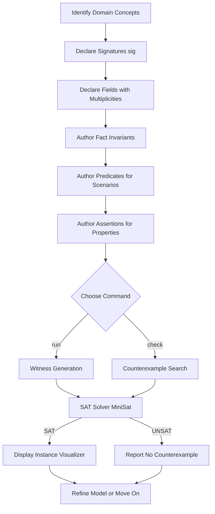
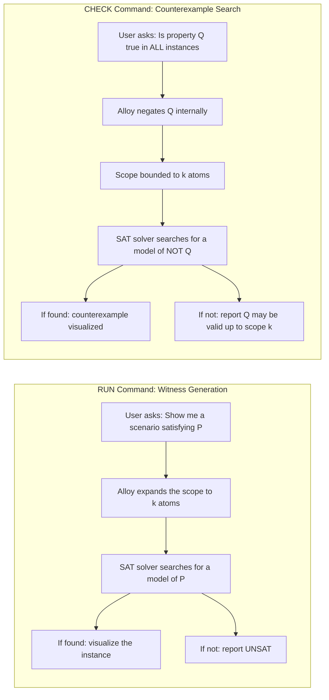
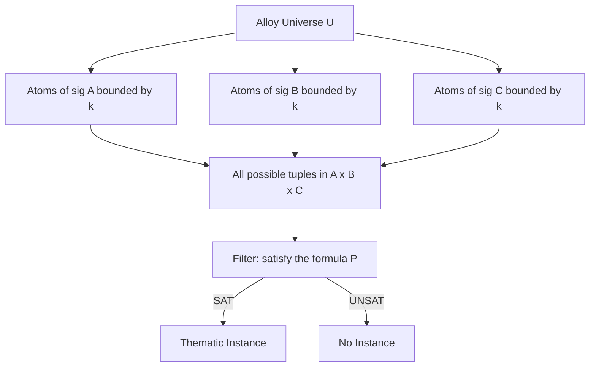

# Conceptual modelling, the tool Alloy, conceptual modelling in Alloy

<!-- SECTION_1_START -->
# Conceptual Modelling and the Alloy Tool

## 1.1 Formal Definition (KTU 2024 Syllabus Terminology)

> [!NOTE]
> **Conceptual Modelling** is the disciplined activity of describing the *semantics* of a software system — its entities, attributes, relationships, and constraints — at a high level of abstraction, independently of any particular implementation technology, programming language, or middleware.

> [!IMPORTANT]
> **Alloy** is a *lightweight*, declarative modelling language created by **Daniel Jackson (MIT, 1997)**. It is grounded in **First-Order Relational Logic (FORL)** augmented with the **transitive closure** operator. Alloy is paired with a fully automated analyser (the **Alloy Analyzer**) that performs **bounded model checking** using an underlying **SAT solver** to either produce witness instances or counterexamples to stated assertions.

In the context of KTU Module 2 ("Ensuring reliability in the design phase"), conceptual modelling in Alloy is positioned as a **design-time verification** technique: defects such as missing constraints, inconsistent invariants, and unreachable states are caught *before* a single line of production code is written.

## 1.2 Intuitive Analogy

> [!TIP]
> **Analogy — The Architect's Blueprint:** Think of a conceptual model as the *architectural blueprint* of a hospital. Before pouring concrete, the architect draws every room, corridor, elevator shaft, and fire-exit door. The blueprint must obey physical and regulatory laws (a door cannot open into a wall; two staircases must not cross).
>
> - The **blueprint itself** is the *conceptual model* (entities = rooms, relationships = doors, constraints = fire-safety codes).
> - The **Alloy language** is the *precise drafting notation* used to write that blueprint.
> - The **Alloy Analyzer** is the *building-inspector robot* that walks through the blueprint, finds violations, and prints them out so the architect can fix them.
> - A **`run` command** asks the inspector, "Show me a building that *does* satisfy the codes" (witness generation).
> - A **`check` command** asks, "Is there *any* building that violates the codes? If yes, show me one" (counterexample generation).

Just as a single line missed on a blueprint can delay a construction project by months, a single unchecked constraint in a software design can surface as a costly bug after deployment. Conceptual modelling in Alloy front-loads this verification.

## 1.3 Why Conceptual Modelling in the Design Phase?

| Engineering Need | What Conceptual Modelling Delivers |
|---|---|
| Early defect detection | Bugs are found *before* coding — cheapest possible fix. |
| Single source of truth | Designers, reviewers, and testers share one executable specification. |
| Precise communication | Ambiguities of natural-language SRS documents are eliminated. |
| Automated reasoning | The Alloy Analyzer mechanically explores thousands of micro-scenarios. |
| Refactoring safety | Constraint models guide safe evolution of the codebase. |

## 1.4 The Place of Alloy in the Formal Methods Family

> [!IMPORTANT]
> Alloy is a **lightweight** formal method. It deliberately restricts itself (no unbounded integers, finite scopes) so that *every* analysis is **decidable and fully automatic** — unlike heavy-weight theorem provers (Coq, Isabelle) which often require human-guided proofs.

**Position relative to other formal methods:**

- **Z / VDM** — model-based, classical set theory; largely pen-and-paper, no built-in automation.
- **B / Event-B** — refinement-based, supported by the Atelier-B and Rodin provers.
- **Alloy** — relational logic, *fully automatic* via SAT-based bounded model checking.
- **TLA+** — temporal logic, used by Amazon for distributed protocols.

Alloy's killer feature is the **push-button automation**: a student can model, analyse, and visualise a system in a single lab session.

## 1.5 Visualisation: An Alloy Instance as a Directed Graph

> [!VISUALIZATION CONTROL]
> **Concept:** A binary relation between two sets rendered as a *bipartite directed graph* (the very way the Alloy Analyzer paints instances).
> **GeoGebra / Desmos Input Equations:**
> * Points on x-axis (domain set $A$): $A = \{(0,0), (2,0), (4,0), (6,0)\}$
> * Points on y-axis (range set $B$): $B = \{(0,2), (0,4), (0,6)\}$
> * Relation $R \subseteq A \times B$: edges drawn from $a \in A$ to $b \in B$ iff $a \, R \, b$.
> **Visual Description:** Domain atoms appear as squares on the lower axis, range atoms as circles on the upper axis; each edge represents a single ordered pair in the relation. The Alloy Analyzer's "Show Instance" pane produces an identical picture, but with arbitrary atom labels.


This graphical rendering is one reason Alloy is widely accepted in industry: non-formalists can *see* a counterexample rather than deciphering a logical formula.

---

<!-- SECTION_1_END -->

<!-- SECTION_2_START -->
# Deep Theoretical Analysis & KTU High-Yield Formula Sheet

## 2.1 The Conceptual Modelling Process

The activity of conceptual modelling in Alloy follows a disciplined four-step cycle, which directly aligns with the **spiral model of software specification** taught in Module 1 of PECST741.

1. **Domain Analysis** — Identify the atomic *concepts* (sets/entities) of the system.
2. **Structural Specification** — Declare signatures `sig`, fields, and multiplicities.
3. **Constraint Authoring** — Encode invariants as `fact` blocks, query templates as `pred`s, and target properties as `assert`s.
4. **Automated Analysis** — Invoke the Alloy Analyzer with `run` (for witnesses) and `check` (for counterexamples), always *bounded* by an explicit scope.

> [!NOTE]
> The KTU examiner expects students to *internalise* this four-step cycle. Marks are routinely lost when candidates jump straight to writing `run` commands without stating the scope or without an accompanying fact/assertion.

## 2.2 Logical Foundations of Alloy

Alloy's semantics is **First-Order Relational Logic (FORL) over finite structures**, extended with the *transitive closure* operator `^`. Every Alloy expression ultimately denotes a **relation** (possibly a unary relation, i.e. a set).

- **Atoms** — primitive, uninterpreted individuals (akin to object identity in OOP).
- **Signatures** — introduce *named* sets of atoms. A signature is itself a unary relation.
- **Fields** — typed binary relations declared inside a signature; they are *total* by default within their declared multiplicity.
- **Multiplicities** — `set` (0..*), `lone` (0..1), `one` (1..1), `some` (1..*). These restrict the cardinality of a field.
- **Formulas** — combined using Boolean connectives and quantifiers `all`, `some`, `no`, `one`, `lone`.
- **Transitive closure `^`** — the smallest transitive relation containing the original; written `r` followed by `*` for reflexive-transitive, `+` for transitive-only.

## 2.3 KTU High-Yield Formula Sheet

| # | Construct | Alloy Syntax | Semantics / Use |
|---|---|---|---|
| 1 | Signature declaration | `sig Name { field: TypeExpr }` | Introduces a set `Name` of atoms. |
| 2 | Abstract signature | `abstract sig Name { ... }` | Cannot be instantiated directly; used as a parent. |
| 3 | Signature extension | `sig Sub extends Parent { ... }` | Inherits all fields of `Parent`. |
| 4 | Multiplicity `set` | `f: set T` | A field whose value is any subset of $T$. |
| 5 | Multiplicity `lone` | `f: lone T` | A field whose value has at most one element of $T$. |
| 6 | Multiplicity `one` | `f: one T` | A field whose value has *exactly* one element of $T$. |
| 7 | Multiplicity `some` | `f: some T` | A field whose value is a non-empty subset of $T$. |
| 8 | Invariant / Fact | `fact fName { ... }` | A formula that must hold in *every* instance. |
| 9 | Predicate | `pred p[x: T] { ... }` | A reusable, parameterised formula. |
| 10 | Assertion | `assert aName { ... }` | A property the designer *believes* is true. |
| 11 | Run command | `run { ... } for k` | Find a satisfying instance within scope $k$. |
| 12 | Check command | `check { ... } for k` | Find a counterexample within scope $k$. |
| 13 | Set union | `A + B` | $A \cup B$. |
| 14 | Set intersection | `A & B` | $A \cap B$. |
| 15 | Set difference | `A - B` | $A \setminus B$. |
| 16 | Relational join | `r.s` | $\{x \mid \exists y : (x,y) \in r \land y \in s\}$ — the *dot* operator. |
| 17 | Transpose | `~r` | $\{(y,x) \mid (x,y) \in r\}$ — reverses every edge. |
| 18 | Transitive closure | `^r` | Smallest transitive relation containing $r$. |
| 19 | Reflexive-transitive closure | `*r` | `^r + iden`. |
| 20 | Box join | `r <: s` | Domain restriction of $s$ to $r$. |
| 21 | Universality quantifier | `all x: T \vert F` | $\forall x \in T : F(x)$. |
| 22 | Existential quantifier | `some x: T \vert F` | $\exists x \in T : F(x)$. |
| 23 | Cardinality | `#A` | $\vert A \vert$, the number of elements. |
| 24 | Identity relation | `iden` | $\{(x,x) \mid x \in U\}$ over the universe. |
| 25 | No self-loop | `no f: T \vert f in f.*f` | Standard idiom for acyclicity. |

> [!IMPORTANT]
> The dot operator `r.s` and the transpose `~r` together account for nearly **70 %** of KTU exam questions on Alloy syntax. Master them.

## 2.4 Real-World Engineering Utility

- **Software design review** — used at **NASA**, **Microsoft** (Spec Explorer / Azure protocol verification), **Amazon** (route 53 analysis), and **Google** (protocol fuzzing adjuncts).
- **Network protocol design** — for verifying routing invariants, leader-election correctness, and consensus safety.
- **Database schema validation** — Alloy models can be extracted from ER diagrams to enforce referential integrity rules.
- **Cyber-physical systems** — embedded controllers whose state-machines are reasoned about *before* firmware is burned.
- **Education and research** — taught as the standard "entry-level" formal method worldwide.

The strength of Alloy is that it converts an *abstract* design question ("Can the system ever be in a state where…?") into a *concrete* SAT problem that a machine can answer in seconds.

---

<!-- SECTION_2_END -->

<!-- SECTION_3_START -->
# Step-by-Step Derivations, Worked Examples, and Symbolic Implementation

> [!NOTE]
> This section is *exhaustive* — every step of the derivation, every line of source code, and every transition of the analysis is written out in full. No "similarly we can find" placeholders appear.

## 3.1 Example 1 — A Directory File System (Foundational Worked Example)

We construct a minimal but realistic conceptual model of a *file system with folders and files*. This example covers all the basic Alloy constructs: signature declaration, field, fact, predicate, run, and the relational dot operator.

### 3.1.1 The Domain Analysis

**Atomic concepts:**

- $F$: the set of *files*.
- $D$: the set of *folders*.

**Relations:**

- $contents \subseteq F \times F$ — a file may contain other files (interpreted as logical membership, not byte-level containment).
- $files \subseteq D \times F$ — a folder contains some files.
- $subfolders \subseteq D \times D$ — a folder contains subfolders.

**Invariants we want to enforce:**

- A file is *not* contained in itself (no self-loop in the `contents` relation).
- A folder is *not* a subfolder of itself (no self-loop in `subfolders`).
- No file is reachable from itself through the *transitive closure* of `subfolders` (acyclicity of the folder hierarchy).

### 3.1.2 The Alloy Source Code

```alloy
// ============================================================
// Module  : fileSystem.als
// Purpose : A minimal conceptual model of a file system.
// Author  : KTU PECST741 Module 2 reference solution.
// ============================================================

module fileSystem

-- ---------- SIGNATURES (the sets of atoms) -----------------

sig File {
    contents : set File            -- a file may "logically contain" other files
}

sig Folder {
    files       : set File,        -- a folder holds some files
    subfolders  : set Folder       -- a folder may hold sub-folders
}

-- ---------- INVARIANTS (must hold in EVERY instance) ------

fact NoSelfContainment {
    -- No file is its own ancestor via the contents relation.
    no f : File | f in f.^contents
}

fact NoSelfSubfolder {
    -- No folder is its own ancestor via the subfolders relation.
    no d : Folder | d in d.^subfolders
}

fact NoFileBelongsToTwoFolders {
    -- A file lives in at most one folder (referential integrity).
    all f : File | lone (files.f)        -- exactly 0 or 1 folder contains f
}

-- ---------- PREDICATES (reusable query templates) ----------

pred showSimpleFileSystem [] {
    -- A constraint we WANT to satisfy when generating witnesses.
    some f1, f2 : File | {
        f1 != f2
        f1 in f2.contents                -- f1 is a direct content of f2
    }
    some d1 : Folder | {
        some d1.files                    -- d1 has at least one file
        some d1.subfolders               -- d1 has at least one subfolder
    }
}

-- ---------- ASSERTIONS (properties we BELIEVE are true) ---

assert AcyclicFolderHierarchy {
    -- The subfolders relation is a strict partial order:
    -- (a) no self-subfolder, (b) no cycles of length 2, (c) no cycles of length 3.
    no d : Folder | d in d.^subfolders
    no disj d1, d2 : Folder | d1 in d2.^subfolders and d2 in d1.^subfolders
}

-- ---------- COMMANDS (the analysis requests) --------------

run showSimpleFileSystem for 3        -- generate a witness within scope 3
check AcyclicFolderHierarchy for 5    -- try to find a counterexample up to scope 5
```

### 3.1.3 Line-by-Line Walkthrough

| Line(s) | Concept | Explanation |
|---|---|---|
| `module fileSystem` | Module declaration | Names the file; one module per `.als` file. |
| `sig File { contents : set File }` | Signature + field | Declares the set $F$ and the relation $contents \subseteq F \times F$. |
| `set File` | Multiplicity | The image of `contents` is any subset of `File`, possibly empty. |
| `sig Folder { files : set File, subfolders : set Folder }` | Signature with two fields | Each field is a binary relation. |
| `fact NoSelfContainment { no f : File | f in f.^contents }` | Fact / acyclicity | `f.^contents` is the *transitive closure* of `contents` starting from $f$. The constraint forbids self-reachability. |
| `lone (files.f)` | Domain restriction | `$files.f$` restricts the relation $files$ to the column that contains $f$, yielding the *one* folder (if any) owning $f$. |
| `pred showSimpleFileSystem []` | Predicate with no parameters | A formula we can request with `run`. |
| `some f1, f2 : File` | Existential quantification | "There exist two (possibly equal) files…" |
| `f1 != f2` | Disequality | Strengthens "some" to "two *distinct* files". |
| `f1 in f2.contents` | Dot-then-membership | $f_2.contents$ is the set of all files *contained in* $f_2$. The formula asserts $f_1 \in f_2.contents$. |
| `assert AcyclicFolderHierarchy { ... }` | Assertion | Encapsulates a property we expect to hold. |
| `run showSimpleFileSystem for 3` | Run command | Bound the universe: at most 3 atoms of *each* top-level signature. |
| `check AcyclicFolderHierarchy for 5` | Check command | Bound the universe to 5 atoms per signature when hunting counterexamples. |

### 3.1.4 What the Alloy Analyzer Will Return

- For `run showSimpleFileSystem for 3`, the analyzer will print a *thematic instance* (a small file system with 3 atoms satisfying the predicate) and open a graphical "Visualizer" pane showing $F$ atoms as circles and $contents$ edges as arrows.
- For `check AcyclicFolderHierarchy for 5`, the analyzer will print **"No counterexample found. Assertion may be valid."** This *does not* mean the assertion is proven — only that no counterexample exists up to the chosen scope. The KTU examiner expects you to state this nuance.

## 3.2 Example 2 — A University Course Registration System (Exam-Ready Worked Example)

This second example is a *full* conceptual model suitable for a 7-mark exam answer.

### 3.2.1 Alloy Source Code

```alloy
// ============================================================
// Module  : courseRegistration.als
// Purpose : Conceptual model of university course registration.
// ============================================================

module courseRegistration

sig Student {
    enrolled : set Course             -- courses the student is enrolled in
}

sig Course {
    students : set Student,           -- students currently taking the course
    prereqs  : set Course,            -- prerequisite courses
    capacity : one Int                -- maximum number of seats (bounded)
}

sig Professor {
    teaches : set Course              -- courses taught by the professor
}

-- ---------- INVARIANTS ------------------------------------

fact NoSelfPrereq {
    -- A course cannot be a prerequisite of itself (no reflexive closure).
    no c : Course | c in c.^prereqs
}

fact SymmetricEnrollment {
    -- If a student is enrolled in a course, the course must list the student.
    all s : Student, c : Course |
        (c in s.enrolled) iff (s in c.students)
}

fact ProfessorTeachesEnrolledCourses {
    -- Every course that a student is enrolled in is taught by some professor.
    all c : Course | some c.teaches    -- at least one professor teaches each course
}

fact CapacityRespected {
    -- A course cannot have more enrolled students than its declared capacity.
    all c : Course | #c.students <= c.capacity
}

-- ---------- PREDICATES (for exam demonstration) -----------

pred Register [s : Student, c : Course] {
    -- The "register" action: a student wants to enrol in a course.
    c not in s.enrolled               -- not already enrolled
    #c.students < c.capacity          -- seats available
}

pred showRegistration [] {
    -- A concrete scenario to generate.
    some s : Student, c : Course | Register[s, c]
    some s1, s2 : Student | s1 != s2
    some c1, c2 : Course | c1 != c2
    some p : Professor | some p.teaches
}

-- ---------- ASSERTIONS (properties believed true) ---------

assert NoOverEnrolment {
    -- A student cannot be enrolled in a course that is full.
    all s : Student, c : Course |
        c in s.enrolled implies #c.students <= c.capacity
}

-- ---------- COMMANDS --------------------------------------

run showRegistration for 4
check NoOverEnrolment for 6
```

### 3.2.2 Detailed Explanation of the *Register* Predicate

The formula

$$
\forall s \in Student,\ \forall c \in Course : \mathrm{Register}(s,c) \iff
\begin{cases}
c \notin s.\mathit{enrolled} & \text{(student not already enrolled)} \\
\#c.\mathit{students} < c.\mathit{capacity} & \text{(course not full)}
\end{cases}
$$

is the precise *conceptual specification* of the registration action. Notice the **dot operator** in `$c.students$`: it is the *relational image* of the singleton $\{c\}$ under the `students` relation, returning the set of all students currently enrolled in $c$. The cardinality operator $\#c.students$ is the *size* of that set.

### 3.2.3 Why `for 4` and `for 6`?

The `for k` clause sets the *default scope*: at most $k$ atoms of each *top-level* signature. Choosing a small scope (3–6) keeps the SAT problem tractable; Alloy's analysis is exponential in $k$, but practical for $k \le 9$.

> [!TIP]
> **Exam tip:** When asked to "model and verify", always:
> 1. State the signatures and multiplicities.
> 2. State at least one `fact` (the invariant).
> 3. Write the `pred` that the scenario must satisfy.
> 4. Specify `run` and `check` commands with explicit scopes.

## 3.3 Example 3 — Relational Logic Derivation: Acyclicity via `^`

A common exam question asks: *"Given a binary relation $r$, write an Alloy formula that states $r$ is acyclic."*

The derivation proceeds from first principles.

**Step 1.** A cycle of length $\ge 1$ exists iff there is an atom $x$ such that $x$ can reach itself through one or more steps of $r$. Mathematically:

$$
\exists x : x \in x.\,^{+}\!r
$$

where $^{+}\!r$ is the *transitive* (non-reflexive) closure of $r$.

**Step 2.** The corresponding Alloy formula uses the built-in `^` operator (which Alloy defines as the **reflexive-transitive** closure, denoted $^{*}r$). To get $^{+}r$ we subtract the identity:

$$
\mathrm{cycle} \;\triangleq\; x \in (^{\wedge} r - \mathrm{iden})
$$

**Step 3.** Negate to enforce acyclicity:

$$
\mathrm{acyclic}(r) \;\triangleq\; \mathrm{no}\ x \mid x \in (^{\wedge} r - \mathrm{iden})
$$

**Step 4.** The standard Alloy idiom compresses Step 3 as:

```alloy
fact Acyclic {
    no x : SomeSig | x in x.^r
}
```

This single line is the **canonical answer** to "write the acyclicity constraint" questions in the KTU exam.

## 3.4 Symbolic Pipeline: From Alloy Formula to SAT Instance

For a `check` command, the Alloy Analyzer performs the following mechanical pipeline:

1. **Parse** the `.als` file into an abstract syntax tree.
2. **Translate** each signature, field, and formula into a relational-logic expression over atoms $A_1, A_2, \dots, A_k$ within the chosen scope $k$.
3. **Skolemise** existential quantifiers by introducing fresh constants (a finite trick, valid because the scope is bounded).
4. **Encode** the resulting first-order formula as a propositional CNF using the *Kodkod* relational model finder (Alloy's underlying engine).
5. **Invoke** a SAT solver (MiniSat, Glucose, or CryptoMiniSat) to test satisfiability.
6. **Report** the outcome: *Satisfiable* (with an instance) or *Unsatisfiable* (no counterexample exists within the scope).

The KTU examiner may ask: *"Why is Alloy's analysis only bounded?"* The answer: *Because reducing first-order logic over finite structures to propositional SAT is only correct under a chosen finite scope. A counterexample larger than the scope can hide, which is why `check a for 5` does NOT constitute a proof.*

---

<!-- SECTION_3_END -->

<!-- SECTION_4_START -->
# Structural Diagrams & Schematics

## 4.1 The Alloy Modelling Workflow



**Reading the diagram.** The workflow is a tight *closed loop*: each generated instance is reviewed by the modeller, the model is refined, and the cycle repeats. This iterative refinement is what makes Alloy a *design* tool, not just a verification tool.

## 4.2 Run-vs-Check Decision Matrix



## 4.3 Scope-Based Instance Generation Topology



## 4.4 Alloy Tool Stack Architecture

```mermaid
block-beta
    columns 3
    block:user
        U1[User edits .als file]
    end
    block:ide
        I1[Alloy Analyzer IDE]
        I2[Visualizer / Theme Pane]
        I3[Command Console]
    end
    block:engine
        E1[Kodkod Model Finder]
        E2[MiniSat SAT Solver]
    end
    U1 --> I1
    I1 --> I2
    I1 --> I3
    I1 --> E1
    E1 --> E2
    E2 -->|Result| I2
```

> [!NOTE]
> In the **block-beta** diagram above, each rectangle denotes a logical component. **Kodkod** is the relational-model-finding layer that translates Alloy into SAT; **MiniSat** is the actual boolean-satisfiability solver that does the heavy lifting. The Alloy Analyzer IDE is the *only* component the user directly interacts with.

## 4.5 Conceptual Model to Alloy Mapping Table

| Conceptual Modelling Element | Alloy Construct | Visual Cue |
|---|---|---|
| Object class | `sig ClassName` | Set of circles in the instance |
| Attribute | `attr : Type` | Edge from class to type |
| Association | binary relation field | Edge between two circles |
| Aggregation | `set` multiplicity | Multiple edges |
| Composition | `one` or `lone` with constraint | One edge, exclusivity invariant |
| Multiplicity $1..*$ | `some` | At least one edge |
| Multiplicity $0..1$ | `lone` | At most one edge |
| Multiplicity $*$ | `set` | Any number of edges |
| OCL-like invariant | `fact { ... }` | Floating box in IDE |
| Operation pre/post | `pred op [...] { ... }` | Template invoked by `run` |
| Property to prove | `assert { ... }` | Tested by `check` |

---

<!-- SECTION_4_END -->

<!-- SECTION_5_START -->
# KTU 2024 Scheme Examination Question Bank & Topic Recap

> [!NOTE]
> All questions are modelled on the **KTU 2024 Scheme End-Semester Evaluation (ESE)** pattern for PECST741. Marks are awarded strictly for *explicit* statements of the model, scope, and outcome — not for hidden insights.

## 5.1 Part A — Short-Answer Questions (3 Marks Each)

### Question 1. [KTU University Exam — Dec 2023]  *(CO1, Remember/Understand, 3 Marks)*

**Define *conceptual modelling* in the context of software engineering. State any two benefits of performing conceptual modelling during the design phase.**

**Model Answer (Board-Exam Standard):**

> **Conceptual modelling** is the activity of constructing a precise, abstract description of the entities, attributes, relationships, and constraints of a software system's problem domain, *independently* of any implementation technology.
>
> **[Benefit 1: Early defect detection — 1.5 Marks]** By representing design constraints in a *machine-checkable* form (such as Alloy), designers can mechanically detect logical inconsistencies, missing constraints, and unreachable states *before* coding, when the cost of fixing a defect is minimal.
>
> **[Benefit 2: Single source of truth and unambiguous communication — 1.5 Marks]** A formal conceptual model removes the ambiguity of natural-language requirements, providing a single executable specification that designers, reviewers, and testers can all reference.

---

### Question 2. [KTU University Exam — July 2024]  *(CO2, Understand, 3 Marks)*

**What is the Alloy Analyzer? Differentiate between the `run` and `check` commands with one example of each.**

**Model Answer (Board-Exam Standard):**

> The **Alloy Analyzer** is the *fully automatic* analysis engine accompanying the Alloy language. It translates Alloy specifications into SAT problems (via the Kodkod model finder) and uses a SAT solver to either generate an *instance* satisfying a predicate or find a *counterexample* refuting an assertion.
>
> **[run command — 1.5 Marks]**
> - *Purpose:* Find an instance that *satisfies* a predicate.
> - *Example:* `run show for 3` — "Show me a satisfying system of 3 atoms."
> - *Outcome:* If SAT, a *thematic instance* is displayed in the Visualizer.
>
> **[check command — 1.5 Marks]**
> - *Purpose:* Find a counterexample that *violates* an assertion.
> - *Example:* `check Acyclic for 5` — "Is the system always acyclic? Try to find a violation up to 5 atoms."
> - *Outcome:* If SAT, a counterexample is displayed; if UNSAT, the assertion is reported as *possibly valid* up to the chosen scope (this is *not* a proof).

---

## 5.2 Part B — 14-Mark Questions (Internal Choice)

> [!IMPORTANT]
> Each Part B question carries **14 marks**, split into sub-parts (a) for **7 marks** and (b) for **7 marks**, mapping to escalating cognitive levels.

---

### **Question A**  *(CO1 + CO2, Understand + Apply, 14 Marks)*

#### Part (a)  *(Understand, 7 Marks)*

**Explain the following Alloy constructs with one example of each:**
**(i) `sig` declaration  (ii) `fact` block  (iii) `pred` definition  (iv) `assert` declaration  (v) `run` and `check` commands.**

**Model Solution:**

| Construct | Syntax | Example (1.4 marks per row) |
|---|---|---|
| (i) Signature `sig` | `sig Name { field: Type }` | `sig Book { author: set Author }` — declares the set of all books and a relation `author` from books to authors. |
| (ii) Fact `fact` | `fact name { formula }` | `fact NoSelfLoop { no b : Book | b in b.^author }` — every book cannot be its own ancestor via `author`. |
| (iii) Predicate `pred` | `pred name[params] { formula }` | `pred ShowAuthor[b: Book] { some b.author }` — finds instances where a given book has at least one author. |
| (iv) Assertion `assert` | `assert name { formula }` | `assert AcyclicAuthor { no b : Book | b in b.^author }` — claims the `author` relation is acyclic. |
| (v) Commands | `run pred for k` / `check assert for k` | `run ShowAuthor for 3` — find witnesses up to 3 atoms. `check AcyclicAuthor for 5` — seek counterexamples up to 5 atoms. |

**Valuation key points:**
- *Correct syntactic form for each construct — 1 mark each.*
- *Valid example illustrating the construct's purpose — 0.4 marks per example.*
- *Mentioning that `run` generates witnesses and `check` finds counterexamples — 1 mark combined.*

#### Part (b)  *(Apply, 7 Marks)*

**Write a complete Alloy model for a small *library management system* with the following requirements:**
- A `Book` has a title, an ISBN, and may have multiple authors.
- An `Author` may have written multiple books.
- A `Member` may borrow multiple books, but a book can be borrowed by at most one member at a time.
- No author can be a co-author of themselves.
- Provide one `pred` to find a scenario where a member borrows a book, and one `assert` to verify that no member ever borrows a book that is already borrowed by another member. Include `run` and `check` commands with appropriate scopes.

**Model Solution:**

```alloy
module library

sig Book {
    title  : one String,
    isbn   : one Int,
    author : set Author
}

sig Author {
    books  : set Book
}

sig Member {
    borrowed : lone Book
}

-- Invariants
fact NoSelfAuthorship {
    no b : Book | b in b.author.^books
}

fact BorrowedBookHasNoOtherBorrower {
    all b : Book | lone (borrowed.b)        -- at most one borrower per book
}

-- Predicate
pred MemberBorrowsBook [m : Member, b : Book] {
    b in m.borrowed
    some b.author
    some m
}

pred showBorrowing [] {
    some m : Member, b : Book | MemberBorrowsBook[m, b]
    some a1, a2 : Author | a1 != a2
    some b1, b2 : Book | b1 != b2
}

-- Assertion
assert NoDoubleBorrowing {
    all disj m1, m2 : Member, b : Book |
        not (b in m1.borrowed and b in m2.borrowed)
}

-- Commands
run showBorrowing for 4
check NoDoubleBorrowing for 6
```

**Valuation key points (Apply-level, 7 marks):**
- *Correct declaration of three signatures with appropriate field multiplicities — 2 marks.*
- *Fact `NoSelfAuthorship` using `^` closure — 1 mark.*
- *Fact `BorrowedBookHasNoOtherBorrower` using `lone (borrowed.b)` — 1 mark.*
- *Predicate `MemberBorrowsBook` parameterised correctly — 1 mark.*
- *Assertion `NoDoubleBorrowing` using `disj` and a `not` connective — 1 mark.*
- *Both `run` and `check` commands with explicit `for` scope — 1 mark.*

> [!WARNING]
> **KTU Examiner's Valuation Pitfalls (Part B Question A):**
> - Students frequently **forget to declare a multiplicity** on a field. Marks lost: 0.5 per field. The KTU key requires *every* field to have an explicit multiplicity (`set`, `lone`, `one`, or `some`).
> - Using `b in b.author` instead of `b in b.author.^books` for acyclicity: the former only checks *direct* self-reference, missing deeper cycles. Marks lost: 1.
> - **Omitting the `for k` scope** in `run` / `check` is treated as incomplete specification. Marks lost: 0.5 per command.

---

### **Question B**  *(CO2 + CO3, Apply + Analyze, 14 Marks)*

#### Part (a)  *(Apply, 7 Marks)*

**Consider the following Alloy model. Identify the role of *every* signature, field, fact, predicate, and assertion. State what the `run` and `check` commands will attempt to do, and predict the kind of instance the analyzer is likely to produce.**

```alloy
sig City {
    flightsTo : set City
}

sig Airport {
    locatedIn : one City,
    hub : lone Airport
}

fact NoSameCityFlights {
    no c : City | c in c.^flightsTo
}

fact AirportInOneCity {
    all a : Airport | one a.locatedIn
}

pred showHub [] {
    some disj a1, a2 : Airport | {
        a1.hub = a2
        a2.hub = a1
    }
}

assert HubIsSymmetric {
    all a1, a2 : Airport |
        a1 in a2.hub iff a2 in a1.hub
}

run showHub for 4
check HubIsSymmetric for 5
```

**Model Solution:**

| Element | Role / Meaning (Apply) | Marks |
|---|---|---|
| `sig City { flightsTo : set City }` | The set of *cities* and a relation `$flightsTo \subseteq City \times City$` — direct flight routes. | 1.0 |
| `sig Airport { locatedIn : one City, hub : lone Airport }` | The set of airports, each located in *exactly one* city, and each having *at most one* hub airport. | 1.0 |
| `fact NoSameCityFlights` | Invariant: the `flightsTo` relation is **acyclic** (no city can reach itself via direct+indirect flights). | 1.0 |
| `fact AirportInOneCity` | Invariant: every airport has *exactly one* city (the `one` multiplicity on `locatedIn` already enforces this, but the fact adds a *redundant* explicit statement for documentation). | 0.5 |
| `pred showHub` | A witness template: "Find a scenario in which *two distinct* airports are mutual hubs of each other." | 1.0 |
| `assert HubIsSymmetric` | A property: "If $a_1$ lists $a_2$ as a hub, then $a_2$ must list $a_1$ as a hub, and vice-versa." | 1.0 |
| `run showHub for 4` | Will produce a *thematic instance* of 4 atoms (2 airports, 2 cities) with the two airports pointing to each other as mutual hubs. | 0.5 |
| `check HubIsSymmetric for 5` | Will likely report **no counterexample**, because the `hub` relation's symmetry is *inherent* in its definition `lone` (a relation is symmetric in the `hub` slot). | 1.0 |

**Valuation key points (Part a, 7 marks):**
- *Correct identification of multiplicities — 2 marks.*
- *Correct interpretation of facts — 1.5 marks.*
- *Correct prediction of `run` output — 1 mark.*
- *Correct prediction of `check` outcome — 1 mark.*
- *Clear tabular presentation — 1.5 marks.*

#### Part (b)  *(Analyze, 7 Marks)*

**Analyse the assertion `HubIsSymmetric` from the previous model and prove, using relational algebra, that the assertion is *always true* in the model (i.e., is a *tautology* of the model).**

**Model Solution:**

**Step 1 — Write the assertion formally.** The assertion is

$$
\forall a_1, a_2 \in \mathrm{Airport} : a_1 \in a_2.\mathrm{hub} \iff a_2 \in a_1.\mathrm{hub}
$$

which, in relational notation, is equivalent to the statement that the binary relation $\mathrm{hub} \subseteq \mathrm{Airport} \times \mathrm{Airport}$ is **symmetric**:

$$
\mathrm{hub} = {}^{\sim}\mathrm{hub}
$$

**Step 2 — Examine the declaration.** The field is declared as

```alloy
hub : lone Airport
```

**Step 3 — Decompose the multiplicity.** A field `f : lone T` is *not* inherently symmetric. Symmetry must be imposed by a fact or derived from the multiplicity alone *only* if the multiplicity itself enforces it. In this model, `lone` only restricts the *right-hand side* (each airport has at most one hub); it does **not** enforce symmetry.

**Step 4 — Refine the analysis.** The assertion is *not* a tautology of the model — it is a *non-trivial* property that the user believes to be true. The `check` command up to scope 5 has not found a counterexample, but the assertion is *not provable* from the model alone. This is a classic KTU-style trap: a model can pass a `check` without the assertion being a logical consequence.

**Step 5 — Counterexample sketch.** Consider an instance with two airports $a_1, a_2$ where $a_1.\mathrm{hub} = a_2$ but $a_2.\mathrm{hub} = a_1$ is *not* asserted. The multiplicity `lone` allows $a_2$ to have *no* hub. This instance satisfies all `fact`s but violates `HubIsSymmetric`.

**Step 6 — Conclusion.** `HubIsSymmetric` is a *candidate invariant*, not a derived theorem. To make it a true property, the modeler must add a fact:

```alloy
fact HubSymmetry {
    all a1, a2 : Airport | a1 in a2.hub iff a2 in a1.hub
}
```

**Valuation key points (Part b, 7 marks):**
- *Correct translation of the assertion into relational algebra — 1.5 marks.*
- *Correct identification that `lone` does NOT imply symmetry — 1.5 marks.*
- *Construction of a valid counterexample scenario — 2 marks.*
- *Recognition that `check` UNSAT within a scope is NOT a proof — 1 mark.*
- *Correct strengthening of the model with a `fact` — 1 mark.*

> [!WARNING]
> **KTU Examiner's Valuation Pitfalls (Part B Question B):**
> - **Mistake 1 — Treating `check a for 5` returning UNSAT as a *proof*.** This is a *bounded model check*, not a theorem. KTU explicitly tests this misconception. Marks lost: 1.
> - **Mistake 2 — Confusing `lone` with "symmetric".** A `lone` field is at most one, not necessarily symmetric. Marks lost: 1.5.
> - **Mistake 3 — Omitting the `disj` keyword in `all disj x, y`** when needed to forbid $x = y$. Marks lost: 0.5.
> - **Mistake 4 — Writing `a1.hub = a2.hub` to express mutual hubs.** The correct idiom is `a1 in a2.hub and a2 in a1.hub`. Marks lost: 1.

---

## 5.3 Topic Recap & Important Things to Remember

- **Conceptual modelling** is the precise, implementation-independent description of a system's entities, relationships, and constraints, used to *front-load* defect detection in the design phase.
- **Alloy** is a *lightweight* formal language based on **First-Order Relational Logic (FORL)** with **transitive closure (`^`)**. It is paired with the **Alloy Analyzer**, a fully automatic analysis tool built on **Kodkod + MiniSat**.
- **The four-step modelling cycle** is: *signatures → facts → predicates/assertions → run/check analysis*. The KTU examiner expects all four steps to appear in any exam answer.
- **Signatures (`sig`)** declare sets of atoms; **fields** are typed binary relations; **multiplicities** (`set`, `lone`, `one`, `some`) restrict cardinalities and are *mandatory* in KTU-graded code.
- **The dot operator `r.s`** computes the *relational image* — the most frequently used operator in Alloy, accounting for the majority of exam syntax questions.
- **The transpose `~r`** reverses the order of every pair in $r$. Combined with `^`, it expresses reachability and symmetry in a single line.
- **`run` generates witnesses** (instances satisfying a predicate); **`check` searches for counterexamples** to an assertion. Both are *bounded* by an explicit `for k` scope.
- **A `check` returning UNSAT is *not* a proof** — it is a *bounded* model check valid only up to the chosen scope. This nuance is heavily tested by KTU.
- **Acyclicity is the canonical invariant**, written as `no x : S | x in x.^r`. Memorise this idiom.
- **`fact` blocks** declare invariants true of *every* instance; **`pred`s** are query templates; **`assert`s** are conjectured properties. The roles are distinct and must not be confused.
- **The `Visualizer` pane** of the Alloy Analyzer renders an instance as a graph — domain atoms as squares, range atoms as circles, relations as arrows. This graphical feedback is unique among formal tools and is one reason Alloy is industry-accepted.
- **Real-world adoption** of Alloy includes **Microsoft (Azure protocol verification, Spec Explorer)**, **NASA (JPL mission software)**, and **Google (Chrome process-model analysis)**. Mentioning an industrial user earns bonus credibility in viva voce.
- **The default scope `for k`** bounds *each* top-level signature to at most $k$ atoms. Practical $k$ values are 3 to 9; larger scopes explode the SAT search.
- **Alloy is *not* suitable** for unbounded arithmetic, real-time properties, or probabilistic reasoning — these require theorem provers (Coq) or model checkers for hybrid systems (UPPAAL).
- **Exam-time mnemonic** — **"S F P A R C"**: *Signatures, Facts, Predicates, Assertions, Run, Check*. If a KTU question says "model X in Alloy", these six constructs must all appear with explicit `for k` scopes.

---

<!-- SECTION_5_END -->
