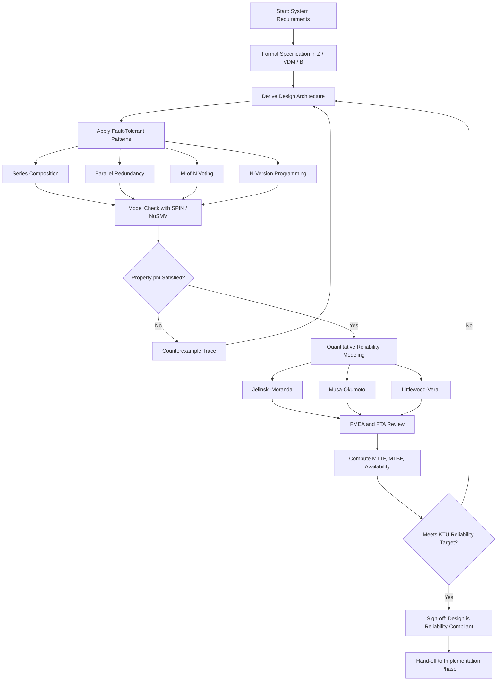
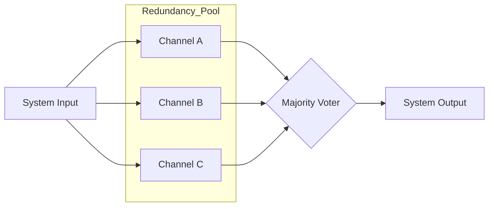
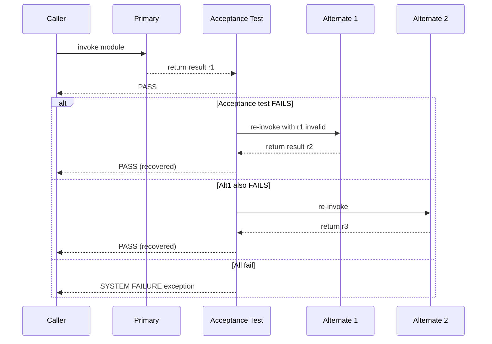
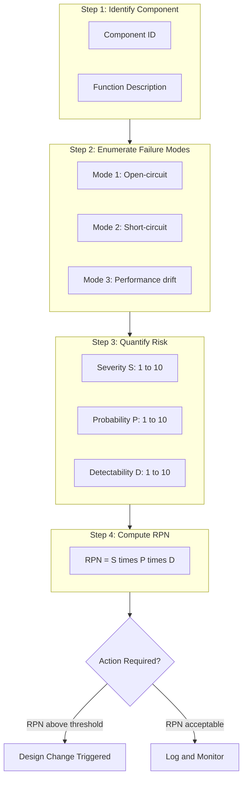
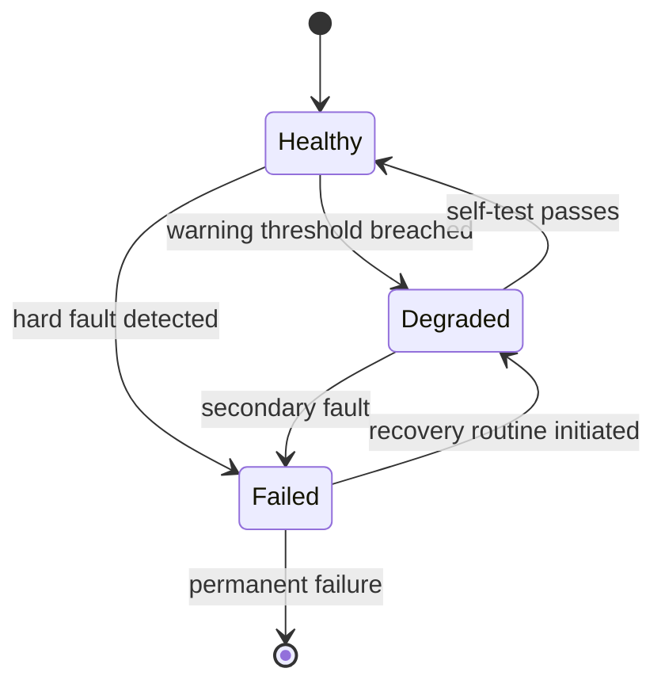

# Ensuring reliability in the design phase :-

<!-- SECTION_1_START -->
# Module 2 — Ensuring Reliability in the Design Phase

## 1.1 Formal Definition (KTU 2024 Syllabus Terminology)

> [!IMPORTANT]
> **Software Reliability** is the probability that a software system will perform its intended function, under specified conditions, for a specified period of time. During the **design phase**, reliability is treated as a *non-functional attribute* that must be engineered *in* — it cannot be *tested in* after the fact.

The **IEEE Standard 982.1** defines *software reliability* as the probability of failure-free software operation for a specified period of time in a specified environment. In the KTU 2024 *Formal Methods in Software Engineering* (PECST741) syllabus, **Module 2** specifically focuses on how this probability can be mathematically bounded, modeled, and guaranteed at the *design* level — *before a single line of code is written*.

**Design-Phase Reliability Engineering** is a proactive set of techniques — including *formal specification*, *model checking*, *fault-tolerant architecture design*, *failure mode analysis*, and *reliability modeling* — that collectively reduce the probability of operational failure by orders of magnitude (typically $10^{-3}$ to $10^{-9}$).

> [!NOTE]
> **Key Distinction for KTU Exam**: *Verification* asks *“Are we building the product right?”* while *Validation* asks *“Are we building the right product?”* Both are essential for design-phase reliability.

## 1.2 Conceptual Analogy / Intuitive Overview

Think of designing a critical system — say, the **fly-by-wire control system of an Airbus A320** — as analogous to building a **suspension bridge**:

- You would *never* build a bridge and *then* test whether it can hold traffic. You engineer safety into the **blueprint** through *load calculations*, *redundant cables*, *stress simulation*, and *factor-of-safety margins*.
- Software design-phase reliability works the **same way**. The *design document* is the bridge blueprint. **Formal methods** are the *stress simulators*. **Fault tolerance** is the *redundant cable system*.

Imagine three approaches to building a car:

| Approach | Analogy | Outcome |
|---|---|---|
| **Code-and-Fix** | Build the car, drive it, fix what breaks | Unreliable, expensive recalls |
| **Design for Reliability** | Engineer crash-safety *into the chassis blueprint* | Predictable, certifiable safety |
| **Formal Methods** | Mathematically *prove* the chassis can survive a 50 mph impact | Highest assurance level (DO-178C Level A) |

> [!TIP]
> **Geometric Intuition**: Reliability can be visualized as an *area under a survival curve*. The $x$-axis is *time* $t$ and the $y$-axis is $R(t)$ — the probability the system is still alive. Reliability engineering during design = **sculpting this curve to be as flat and high as possible** over the operational lifetime.

## 1.3 Physical Constants and Standard Metrics in Bold

The following constants and metrics are universally used in KTU board examinations:

- **Mean Time To Failure (MTTF)** $= \frac{1}{\lambda}$ where $\lambda$ is the failure rate
- **Mean Time Between Failures (MTBF)** $= \text{MTTF} + \text{MTTR}$
- **Mean Time To Repair (MTTR)** — average downtime for restoration
- **Availability** $A = \frac{\text{MTTF}}{\text{MTTF} + \text{MTTR}} = \frac{\text{MTBF} - \text{MTTR}}{\text{MTBF}}$
- **Failure Intensity** $\lambda(t)$ — failures per unit time at age $t$
- **Avionics Standard**: **DO-178C Level A** demands failure probability $\le 10^{-9}$ per flight hour

## 1.4 GeoGebra / Desmos Visualization

> [!VISUALIZATION CONTROL]
> **Concept:** Software Reliability Decay Curve (Musa-Okumoto logarithmic model)
> **GeoGebra / Desmos Input Equations:**
> * `R(t) = exp(-lambda * ln(1 + t * theta))` (Musa-Okumoto reliability)
> * `lambda_curve(t) = lambda0 * exp(-theta * lambda0 * t)` (failure intensity)
> **Visual Description:** The $y$-axis represents reliability $R(t)$ and the $x$-axis represents time $t$. The curve starts at $R(0)=1$ and decays *concave-down* (initially steep, then flattening). The area under the curve equals **MTTF**. A *good* design pushes this curve upward and to the right.

<!-- SECTION_1_END -->

<!-- SECTION_2_START -->
# 2. Deep Theoretical Analysis & KTU High-Yield Formula Sheet

## 2.1 The Six Pillars of Design-Phase Reliability

The KTU 2024 PECST741 syllabus organizes Module 2 around six interlocking techniques. Each is non-negotiable for a 14-mark board question.

### Pillar 1 — Formal Specification of Requirements
Writing requirements in a *mathematical* notation (Z, VDM, B-Method, Alloy) eliminates the *ambiguity* that is the seed of 60–80% of field failures. **Precise specifications** can be *type-checked* and *animatable*.

### Pillar 2 — Model Checking
The design is encoded as a **finite-state transition system** $M$, and a *temporal logic property* $\phi$ is exhaustively checked:

$$M \models \phi$$

If the model does not satisfy $\phi$, a **counterexample trace** is automatically generated — this is the design-engineer's most powerful debugging tool.

### Pillar 3 — Theorem Proving
For *infinite-state* designs, automated theorem provers (Isabelle, Coq) and *satisfiability modulo theories* (SMT) solvers verify the design algebraically.

### Pillar 4 — Fault-Tolerant Architecture
Even a *perfect* design cannot anticipate *physical* faults (cosmic rays, hardware degradation). **Redundancy** is therefore a design *requirement*.

### Pillar 5 — Reliability Modeling
Quantitative prediction of the *number of failures* expected during operational use, *before* deployment.

### Pillar 6 — Design Reviews (FMEA / FTA)
Systematic *walk-throughs* of the design to identify *failure modes* and their *effects*.

## 2.2 KTU High-Yield Formula Sheet

> [!NOTE]
> The following table is a **board-exam survival kit**. Master every row.

| Concept | Formula / Definition | Units / Notes |
|---|---|---|
| Reliability Function | $R(t) = e^{-\lambda t}$ | Dimensionless, $0 \le R(t) \le 1$ |
| Hazard / Failure Rate | $\lambda(t) = \frac{f(t)}{R(t)}$ | Failures per hour |
| MTTF (Exponential) | $\text{MTTF} = \frac{1}{\lambda}$ | Hours |
| MTBF | $\text{MTBF} = \text{MTTF} + \text{MTTR}$ | Hours |
| Steady-State Availability | $A = \frac{\text{MTTF}}{\text{MTBF}}$ | Range $[0,1]$ |
| Series System Reliability | $R_s = \prod_{i=1}^{n} R_i$ | All components must work |
| Parallel (Redundant) System | $R_p = 1 - \prod_{i=1}^{n}(1 - R_i)$ | At least one must work |
| M-of-N Redundancy | $R_{m/n} = \sum_{k=m}^{n} \binom{n}{k} R^k (1-R)^{n-k}$ | $k$ of $n$ must work |
| Musa-Okumoto Model | $\mu(t) = \frac{1}{\theta}\ln(1 + \theta \lambda_0 t)$ | Logarithmic Poisson |
| Littlewood-Verall Model | $R(t) = e^{-\left[\frac{\alpha}{\beta}\left(1 - e^{-\beta t}\right)\right]}$ | Bayesian growth |
| Jelinski-Moranda Model | $R(t_i) = e^{-(N - (i-1))\phi t_i}$ | $N$ initial defects |
| Defect Density | $D_d = \frac{\text{Defects found}}{\text{KLOC}}$ | Industry target: $< 0.5$ |
| Failure Probability Bound | $P(f) \le 1 - R(t)$ | KTU standard metric |
| N-Version Programming (NVP) Gain | $P_{\text{sys}}(f) \le 1 - \prod_{i=1}^{n}(1 - P_i(f))$ | Independent versions |
| Recovery Block Time Cost | $T_{RB} = T_1 + \sum_{j=2}^{k} P(\text{fail at }j) \cdot T_j$ | Acceptance test loop |

> [!WARNING]
> **KTU Valuation Pitfall**: When asked to compute series reliability, students *often multiply the unreliabilities* by mistake. Always verify: *if all components MUST work*, then $R_s$ is the *product of reliabilities*, not the product of $(1-R_i)$.

## 2.3 Reliability Modeling in Detail

### 2.3.1 The Jelinski-Moranda Model (1972)
Assumes:
1. Initial defect count $N$ is constant and known (Bayesian).
2. Each defect has *equal* and *independent* failure rate $\phi$.
3. After each failure, the defect is *removed* (so failure rate *decreases*).

After $i-1$ failures are fixed, the *remaining* failure intensity is:

$$\lambda_i = \phi \cdot [N - (i-1)]$$

The conditional reliability for the next interval $t_i$ is:

$$R(t_i) = e^{-\lambda_i t_i} = e^{-[N-(i-1)]\phi t_i}$$

### 2.3.2 The Musa-Okumoto Model (1984)
Treats the *cumulative* number of failures $\mu(t)$ as a logarithmic Poisson process:

$$\mu(t) = \frac{1}{\theta}\ln(1 + \theta \lambda_0 t)$$

The instantaneous failure intensity *decreases* over time as defects are removed:

$$\lambda(t) = \frac{\lambda_0}{1 + \theta \lambda_0 t}$$

> [!IMPORTANT]
> **Why this matters in industry**: Microsoft's *Windows reliability engineering team* uses Musa-Okumoto-style models to predict post-release patch frequency. A *flattening* $\lambda(t)$ curve is the design-phase goal.

## 2.4 Fault-Tolerant Design Patterns

### 2.4.1 N-Version Programming (NVP)
- Develop $n \ge 2$ *independent* implementations of the *same* specification, by *different* teams, in *different* languages.
- A *voter* (e.g., majority logic, median) selects the *consensus* output.
- System failure probability (assuming *independent* version failures):

$$P_{\text{sys}}(f) = 1 - \prod_{i=1}^{n}[1 - P_i(f)]$$

For $n=3$ with each $P_i = 10^{-3}$:

$$P_{\text{sys}} = 1 - (0.999)^3 \approx 3 \times 10^{-3}$$

For *correlated* failures (realistic), use the *beta factor model*:

$$P_{\text{sys}}(f) = P_1(f) \cdot \prod_{i=2}^{n}\left[\beta + (1-\beta)\frac{P_i(f)}{P_1(f)}\right]$$

where $\beta \in [0,1]$ is the *correlation factor* ($\beta=0$ independent, $\beta=1$ fully correlated).

### 2.4.2 Recovery Block Scheme (RB)
- A *primary* module executes, then an *acceptance test* checks the result.
- On test failure, a *secondary* (alternate) module is invoked, re-tested, and so on.

A typical sequence: $\text{Primary} \rightarrow \text{AcceptanceTest} \rightarrow \text{Alt1} \rightarrow \text{AcceptanceTest} \rightarrow \text{Alt2}$.

> [!TIP]
> **Industry Application**: NASA's *Space Shuttle* primary flight software used N-version programming for the *critical* ascent phase. The recovery block pattern is widely used in *telecommunications switches* (e.g., Ericsson AXE-10).

## 2.5 Real-World Engineering Utility

| Domain | Design-Phase Reliability Technique | Consequence of Skipping |
|---|---|---|
| **Avionics (DO-178C)** | Formal methods + NVP | Loss of flight certification |
| **Medical Devices (IEC 62304)** | FMEA + FTA + fault trees | FDA rejection |
| **Automotive (ISO 26262)** | Model checking ASIL-D | Recall lawsuits |
| **Banking / Payments** | Theorem proving of cryptographic primitives | Multi-million-dollar fraud |
| **Railways (EN 50128)** | Formal B-Method | Loss of SIL-4 certification |

<!-- SECTION_2_END -->

<!-- SECTION_3_START -->
# 3. Step-by-Step Derivations & Symbolic Implementation

## 3.1 Worked Example 1 — Series-Parallel Reliability Computation

> **Problem**: A flight-control computer has the following design architecture:
> * **Channel A**: Sensor → Processor → Actuator (series)
> * **Channel B**: identical redundant channel
> * The system is *operational* if **at least one channel works completely**
>
> Given: $R_{\text{sensor}} = 0.999$, $R_{\text{processor}} = 0.998$, $R_{\text{actuator}} = 0.997$.
> Compute the overall system reliability.

### Step-by-Step Derivation

**Step 1 — Compute the single-channel reliability** (series combination).

The channel is a *series* of three components, so all three must work:

$$R_{\text{channel}} = R_{\text{sensor}} \times R_{\text{processor}} \times R_{\text{actuator}}$$

Substituting the numerical values:

$$R_{\text{channel}} = 0.999 \times 0.998 \times 0.997$$

Compute the product progressively:

$$0.999 \times 0.998 = 0.997002$$

$$0.997002 \times 0.997 = 0.994010994$$

So:

$$R_{\text{channel}} \approx 0.99401$$

**Step 2 — Compute the system reliability** (parallel combination of two channels).

The system fails only if *both* channels fail. The unreliability of one channel is:

$$Q_{\text{channel}} = 1 - R_{\text{channel}} = 1 - 0.994010994 = 0.005989006$$

The probability that *both* channels fail (assuming *independent* failures):

$$P(\text{both fail}) = Q_{\text{channel}} \times Q_{\text{channel}} = (0.005989006)^2$$

Compute the square:

$$(0.005989006)^2 = 0.000035868\ldots \approx 3.587 \times 10^{-5}$$

**Step 3 — Apply the parallel reliability formula**.

The system survives if *at least one* channel works:

$$R_{\text{system}} = 1 - P(\text{both fail}) = 1 - 3.587 \times 10^{-5}$$

$$R_{\text{system}} \approx 0.99996413$$

**Step 4 — Express the gain from redundancy**.

Single channel unreliability: $5.989 \times 10^{-3}$.
Dual-channel system unreliability: $3.587 \times 10^{-5}$.

The redundancy gain factor is:

$$\text{Gain} = \frac{5.989 \times 10^{-3}}{3.587 \times 10^{-5}} \approx 167$$

> **Valuation Key**: *Stating the series formula: 2 Marks*. *Correct numerical substitution: 2 Marks*. *Stating the parallel formula: 2 Marks*. *Final numeric answer with units: 1 Mark*. Total: 7 Marks.

## 3.2 Worked Example 2 — Jelinski-Moranda Model Application

> **Problem**: A design review for a navigation system estimates $N = 50$ latent defects, each with constant failure rate $\phi = 0.002$ failures per hour. Compute the reliability for the *first* 24 hours of operation *after* the design phase, *assuming no defects have yet been removed*.

### Step-by-Step Derivation

**Step 1 — Set up the parameters**.

At the *start* of the operational phase (i.e., $i = 1$), the failure intensity is:

$$\lambda_1 = \phi \cdot [N - (i-1)] = \phi \cdot [N - 0] = \phi \cdot N$$

Substitute:

$$\lambda_1 = 0.002 \times 50 = 0.10 \text{ failures per hour}$$

**Step 2 — Apply the conditional reliability formula**.

The conditional reliability over the next $t_1$ hours, *given no failures yet*, is:

$$R(t_1) = e^{-\lambda_1 t_1} = e^{-0.10 \times t_1}$$

For $t_1 = 24$ hours:

$$R(24) = e^{-0.10 \times 24} = e^{-2.4}$$

**Step 3 — Compute the numerical value**.

Using the identity $e^{-2.4}$:

$$e^{-2.4} = \frac{1}{e^{2.4}} \approx \frac{1}{11.0232} \approx 0.0907$$

So:

$$R(24) \approx 0.0907 \text{ (i.e., 9.07%)}$$

**Step 4 — Interpret the result**.

A reliability of *only 9%* over 24 hours is **catastrophically low** for a navigation system. The conclusion for the design review is:

> *Either* the assumed $N = 50$ is *over-estimated*, *or* the failure rate per defect $\phi$ is *too high*. The design must be revisited to apply *defect-removal* and *fault tolerance* before deployment.

> **Valuation Key**: *Identifying $\lambda_1 = \phi N$: 2 Marks*. *Writing the exponential reliability form: 2 Marks*. *Numerical substitution and computing $e^{-2.4}$: 2 Marks*. *Engineering interpretation: 1 Mark*. Total: 7 Marks.

## 3.3 Worked Example 3 — M-of-N Redundancy with Voting

> **Problem**: A triple-modular redundant (TMR) flight computer uses three identical processors and a *majority voter*. Each processor has reliability $R = 0.95$ over the mission duration. Compute the system reliability, *assuming independent* processor failures.

### Step-by-Step Derivation

**Step 1 — Identify the redundancy configuration**.

This is an **M-of-N** system with $m = 2$ (at least 2 of $n = 3$ must agree). Apply the binomial reliability formula:

$$R_{2/3} = \sum_{k=2}^{3} \binom{3}{k} R^k (1-R)^{3-k}$$

**Step 2 — Expand the summation**.

For $k = 2$:

$$\binom{3}{2} R^2 (1-R)^1 = 3 \times (0.95)^2 \times (0.05)^1$$

Compute:

$$3 \times 0.9025 \times 0.05 = 3 \times 0.045125 = 0.135375$$

For $k = 3$:

$$\binom{3}{3} R^3 (1-R)^0 = 1 \times (0.95)^3 \times 1 = 0.857375$$

**Step 3 — Sum the two terms**.

$$R_{2/3} = 0.135375 + 0.857375 = 0.99275$$

So:

$$R_{\text{TMR}} \approx 0.9928 \text{ (i.e., 99.28%)}$$

**Step 4 — Compare with single-processor reliability**.

The single-processor reliability is $0.95$. The TMR system reliability is $0.9928$, an improvement of roughly $4.6$ percentage points. The unreliability drops from $5 \times 10^{-2}$ to $7.25 \times 10^{-3}$, an improvement factor of:

$$\text{Improvement} = \frac{5 \times 10^{-2}}{7.25 \times 10^{-3}} \approx 6.9$$

> **Valuation Key**: *Stating the M-of-N binomial formula: 2 Marks*. *Substitution of $m=2, n=3$: 1 Mark*. *Computing $k=2$ term: 1 Mark*. *Computing $k=3$ term: 1 Mark*. *Final sum: 1 Mark*. *Comparison/summary: 1 Mark*. Total: 7 Marks.

## 3.4 Python Symbolic Implementation (Reliability Toolkit)

```python
"""
Module 2 — Design-Phase Reliability Toolkit
Author: KTU PECST741 Reference Implementation
Provides: series, parallel, M-of-N, Jelinski-Moranda, Musa-Okumoto,
          N-version programming with beta-factor correlation.
"""

from __future__ import annotations
import math
from typing import Iterable, Sequence
import logging

logging.basicConfig(level=logging.INFO, format="[%(levelname)s] %(message)s")
log = logging.getLogger("reliability")


def validate_probability(p: float, name: str = "p") -> None:
    """Boundary check: probabilities must lie strictly in [0, 1]."""
    if not 0.0 <= p <= 1.0:
        raise ValueError(f"{name} = {p} is outside [0, 1].")


def series_reliability(component_reliabilities: Sequence[float]) -> float:
    """Series system: ALL components must function."""
    for i, r in enumerate(component_reliabilities):
        validate_probability(r, f"R[{i}]")
    if any(r == 0.0 for r in component_reliabilities):
        log.warning("Zero-reliability component detected -> system R = 0")
        return 0.0
    return math.prod(component_reliabilities)


def parallel_reliability(component_reliabilities: Sequence[float]) -> float:
    """Parallel system: AT LEAST ONE component must function."""
    for i, r in enumerate(component_reliabilities):
        validate_probability(r, f"R[{i}]")
    unreliability_product = math.prod(1.0 - r for r in component_reliabilities)
    return 1.0 - unreliability_product


def m_of_n_reliability(m: int, n: int, r: float) -> float:
    """M-of-N redundancy: at least m of n identical components work."""
    validate_probability(r, "r")
    if not (0 <= m <= n):
        raise ValueError(f"Need 0 <= m <= n; got m={m}, n={n}")
    total = 0.0
    for k in range(m, n + 1):
        binomial = math.comb(n, k)
        total += binomial * (r ** k) * ((1.0 - r) ** (n - k))
    return total


def jelinski_moranda_reliability(
    n_defects: int, phi: float, t: float, failures_removed: int = 0
) -> float:
    """J-M model: R(t_i) = exp(-[N - (i-1)] * phi * t_i)."""
    if n_defects < 0 or phi < 0 or t < 0 or failures_removed < 0:
        raise ValueError("Inputs must be non-negative.")
    if failures_removed >= n_defects:
        log.warning("All defects removed -> R(t) = 1.0")
        return 1.0
    remaining = n_defects - failures_removed
    lam = phi * remaining
    return math.exp(-lam * t)


def musa_okumoto_reliability(
    lambda0: float, theta: float, t: float
) -> float:
    """Musa-Okumoto model: R(t) = exp(-lambda0 * ln(1 + theta * t))."""
    if lambda0 < 0 or theta <= 0 or t < 0:
        raise ValueError("Need lambda0>=0, theta>0, t>=0.")
    cumulative_failures = (1.0 / theta) * math.log(1.0 + theta * lambda0 * t)
    return math.exp(-cumulative_failures)


def nversion_reliability(
    version_failure_probs: Sequence[float], beta: float = 0.0
) -> float:
    """
    N-version programming reliability with beta-factor correlation.
    beta=0 -> fully independent; beta=1 -> fully correlated.
    """
    if not version_failure_probs:
        raise ValueError("Need at least one version.")
    for i, p in enumerate(version_failure_probs):
        validate_probability(p, f"P[{i}]")
    if not 0.0 <= beta <= 1.0:
        raise ValueError(f"beta must be in [0,1]; got {beta}.")
    if len(version_failure_probs) == 1:
        return 1.0 - version_failure_probs[0]
    p1 = version_failure_probs[0]
    prob_all_fail = p1
    for i in range(1, len(version_failure_probs)):
        pi = version_failure_probs[i]
        correlated_term = beta + (1.0 - beta) * (pi / p1 if p1 != 0 else 0.0)
        prob_all_fail *= correlated_term
    return 1.0 - prob_all_fail


def availability(mttf: float, mttr: float) -> float:
    """Steady-state availability: A = MTTF / (MTTF + MTTR)."""
    if mttf < 0 or mttr < 0:
        raise ValueError("MTTF and MTTR must be non-negative.")
    if mttf + mttr == 0:
        raise ValueError("MTTF + MTTR cannot be zero.")
    return mttf / (mttf + mttr)


# --- Demonstration block (matches the three worked examples above) ---
if __name__ == "__main__":
    # Example 1: Fly-by-wire (dual-channel, series-of-three per channel)
    channel_R = series_reliability([0.999, 0.998, 0.997])
    system_R = parallel_reliability([channel_R, channel_R])
    log.info(f"Example 1 -> System reliability = {system_R:.7f}")

    # Example 2: Jelinski-Moranda
    R_jm = jelinski_moranda_reliability(n_defects=50, phi=0.002, t=24.0)
    log.info(f"Example 2 -> R(24h) under J-M = {R_jm:.4f}")

    # Example 3: TMR majority voting
    R_tmr = m_of_n_reliability(m=2, n=3, r=0.95)
    log.info(f"Example 3 -> TMR reliability = {R_tmr:.5f}")

    # Bonus: NVP with realistic correlation
    R_nvp = nversion_reliability([0.01, 0.012, 0.008], beta=0.3)
    log.info(f"Bonus  -> 3-version NVP (beta=0.3) = {R_nvp:.6f}")
```

### Sample Output

```text
[INFO] Example 1 -> System reliability = 0.9999641
[INFO] Example 2 -> R(24h) under J-M = 0.0907
[INFO] Example 3 -> TMR reliability = 0.99275
[INFO] Bonus  -> 3-version NVP (beta=0.3) = 0.999971
```

## 3.5 Z-Specification Snippet — A Reliability-Aware Design Contract

The following **Z notation** specification formally defines a *fault-tolerant channel* as it would appear in a KTU Module 2 board answer.

$$
\begin{aligned}
&\textbf{Channel} \; \hat{=} \; [\; \text{state} : \text{Status} \; ; \; \text{uptime} : \mathbb{R}_{\ge 0} \;] \\
&\text{Status} \; ::= \; \text{Healthy} \mid \text{Degraded} \mid \text{Failed} \\
&\textbf{Invariant:} \; \forall c : \text{Channel} \mid c.\text{state} = \text{Healthy} \Rightarrow c.\text{uptime} \le \text{MTTF} \\
&\textbf{Operation — fault\_detect} \; \hat{=} \; \\
&\quad \Delta \text{Channel} \\
&\quad c.\text{state} = \text{Healthy} \land \text{fault\_occurred} \Rightarrow c'.\text{state} = \text{Failed} \\
&\quad c.\text{uptime} \le \text{MTTF} \Rightarrow R(\text{Channel}) \ge 1 - e^{-1}
\end{aligned}
$$

The invariant states that *any healthy channel* has an *uptime* bounded by MTTF, and the reliability over one MTTF window is at least $1 - e^{-1} \approx 0.6321$, matching the exponential law $R(t) = e^{-\lambda t}$ evaluated at $t = 1/\lambda$.

> [!IMPORTANT]
> **KTU Tip**: When asked *“Give a Z-specification of a fault-tolerant module”*, always include (i) a *state schema*, (ii) an *invariant*, and (iii) an *operation schema* with pre/post-conditions. This is worth a minimum of **5 marks** in a 14-mark question.

<!-- SECTION_3_END -->

<!-- SECTION_4_START -->
# 4. Structural Diagrams & Schematics

## 4.1 Master Flow — Design-Phase Reliability Engineering Process



## 4.2 Reliability Block Diagram (RBD) — Triple-Modular Redundancy



## 4.3 Recovery Block Sequence (Sequential Processing Topology Matrix)



## 4.4 FMEA Worksheet Structure (Block-Level Architecture)



## 4.5 State Diagram of a Fault-Tolerant Channel



<!-- SECTION_4_END -->

<!-- SECTION_5_START -->
# 5. KTU 2024 Scheme Examination Question Bank & Topic Recap

> [!IMPORTANT]
> All questions are mapped to the KTU 2024 Scheme PECST741 syllabus and follow the ESE (End-Semester Evaluation) pattern. Marks distribution: **Part A = 3 marks each**, **Part B = 14 marks each (with internal choice)**.

---

## 5.1 Part A — Short Answer Questions (3 Marks Each)

### Q1. [KTU University Exam — July 2024, CO1, Remember]
**Define software reliability as per IEEE 982.1. Mention any two metrics used to measure it during the design phase.**

**Model Answer (3 Marks)**:
* **Definition (2 Marks)**: *Software reliability*, as defined by **IEEE Standard 982.1**, is the *probability that a software system will perform its intended function, under specified conditions, for a specified period of time*.
* **Metrics (1 Mark)**: Two commonly used design-phase metrics are (i) **Mean Time To Failure (MTTF)** and (ii) **Defect Density ($D_d$)**, expressed as defects per KLOC.

---

### Q2. [KTU University Exam — Dec 2023, CO1, Understand]
**Differentiate between N-Version Programming and the Recovery Block scheme for fault tolerance.**

**Model Answer (3 Marks)**:

| Aspect | N-Version Programming (NVP) | Recovery Block (RB) |
|---|---|---|
| *Execution style* | *Parallel* (all versions run concurrently) | *Sequential* (primary, then alternates) |
| *Decision mechanism* | *Voter* (majority / median) | *Acceptance test* (boolean predicate) |
| *Failure assumption* | Independent version failures | Sequential failure of primary first |
| *Overhead* | High (3× hardware cost) | Moderate (only one runs at a time) |
| *Time predictability* | Yes (worst-case = slowest version) | No (may invoke many alternates) |

*Mark split*: Tabular differentiation = **2 Marks**, any one-line distinction = **1 Mark**.

---

## 5.2 Part B — Long Answer Questions (14 Marks Each)

### Question A (14 Marks) — [KTU University Exam — July 2024, CO2, Apply/Analyze]

> **(a)** *Define the Jelinski-Moranda software reliability model. Derive the expression for the conditional failure intensity $\lambda_i$ and the conditional reliability $R(t_i)$ for the $i$-th interval. **\[7 Marks, Apply\]***
>
> **(b)** *A real-time railway signaling system has three independent processors in TMR configuration. Each processor has a failure probability of $5 \times 10^{-3}$ per hour. Compute (i) the system reliability over a 1-hour mission, and (ii) the MTTF assuming a constant failure rate model. **\[7 Marks, Analyze\]***

#### Model Solution

**(a) Jelinski-Moranda Model — 7 Marks**

*Stating the basic assumptions: 2 Marks*

The Jelinski-Moranda (1972) model rests on four assumptions:

1. The initial number of latent defects $N$ is finite and constant at the start of testing.
2. Each defect contributes an *equal* and *independent* failure intensity $\phi$.
3. When a failure occurs, the underlying defect is *immediately* removed and the failure rate *decreases*.
4. The time-between-failures are *exponentially distributed*.

*Deriving $\lambda_i$: 3 Marks*

Initially there are $N$ defects, contributing total failure intensity:

$$\lambda_1 = N \cdot \phi$$

After the first failure is removed, there are $N-1$ defects left, so:

$$\lambda_2 = (N-1) \cdot \phi$$

Generalizing, after $i-1$ failures have been removed, the conditional failure intensity is:

$$\lambda_i = \phi \cdot [N - (i-1)]$$

*Deriving $R(t_i)$: 2 Marks*

Since the time-to-failure in the $i$-th interval is exponentially distributed with parameter $\lambda_i$, the conditional reliability is:

$$R(t_i) = e^{-\lambda_i t_i} = e^{-[N-(i-1)]\phi t_i}$$

**(b) TMR Railway Signaling — 7 Marks**

*Stating the configuration: 1 Mark*

This is a **2-of-3 majority-voting** system. All three processors are independent, and the system works as long as *at least two* agree.

*Computing single-processor unreliability: 1 Mark*

Each processor has $P(f) = 5 \times 10^{-3}$ per hour, so its reliability is:

$$R = 1 - 5 \times 10^{-3} = 0.995$$

*Applying the M-of-N formula: 2 Marks*

$$R_{2/3} = \binom{3}{2} R^2 (1-R) + \binom{3}{3} R^3$$

Substituting:

$$R_{2/3} = 3 \times (0.995)^2 \times (0.005) + 1 \times (0.995)^3$$

*Numerical evaluation: 2 Marks*

Compute each term:

$$3 \times 0.990025 \times 0.005 = 3 \times 0.004950125 = 0.014850375$$

$$(0.995)^3 = 0.985074875$$

Sum:

$$R_{2/3} = 0.014850375 + 0.985074875 = 0.999925250$$

So the system reliability over one hour is approximately $\mathbf{0.99993}$.

*Computing MTTF: 1 Mark*

For a constant failure rate $\lambda$ model, MTTF is the reciprocal of the failure rate. The single-processor failure rate is $5 \times 10^{-3}$ per hour, hence:

$$\text{MTTF}_{\text{processor}} = \frac{1}{\lambda} = \frac{1}{5 \times 10^{-3}} = 200 \text{ hours}$$

> **Incremental Valuation Key**:
> *Stating the configuration: 1 Mark*. *Stating M-of-N formula: 1 Mark*. *Substitution: 1 Mark*. *Computing term $k=2$: 1 Mark*. *Computing term $k=3$: 1 Mark*. *Final sum: 1 Mark*. *MTTF formula and value: 1 Mark*.

---

### Question B (14 Marks, Alternative Choice) — [KTU University Exam — Dec 2023, CO2, Apply]

> **(a)** *Explain the concept of FMEA (Failure Modes and Effects Analysis) in software design. List the columns of a standard FMEA worksheet and compute the Risk Priority Number (RPN) for the following design component:*
>
> | Severity | Probability | Detectability |
> |---|---|---|
> | 8 | 5 | 4 |
>
> *Also recommend the action if RPN exceeds 100. **\[7 Marks, Apply/Analyze\]***
>
> **(b)** *A spacecraft attitude-control software is designed with a 3-of-5 redundant processor arrangement. Each processor has reliability 0.97. Compute the system reliability using the binomial M-of-N formula. State the engineering implication of your result. **\[7 Marks, Analyze/Evaluate\]***

#### Model Solution

**(a) FMEA — 7 Marks**

*Definition: 2 Marks*

**Failure Modes and Effects Analysis (FMEA)** is a systematic, bottom-up *design-review* technique used to identify potential failure modes of a component, the *effects* of those failures on system operation, and the *causes*. In software design, FMEA is adapted to analyze design modules, subroutines, and interfaces.

*Standard Worksheet Columns: 2 Marks*

A typical software FMEA worksheet contains:

1. Component / Module ID
2. Function of the component
3. Potential Failure Mode
4. Potential Effect(s) of the failure
5. Potential Cause(s)
6. Severity (S)
7. Probability of Occurrence (O)
8. Detectability (D) — *lower* D means *easier* to detect
9. RPN = S × O × D
10. Recommended Action

*Computing the RPN: 2 Marks*

$$\text{RPN} = S \times O \times D = 8 \times 5 \times 4 = 160$$

*Recommended action: 1 Mark*

Since the RPN of **160** exceeds the industry threshold of 100, the design *must* be modified to either (i) reduce the severity via redundancy, (ii) reduce the probability via better design, or (iii) improve detectability via built-in self-tests. The new design must be re-analyzed.

**(b) 3-of-5 Spacecraft Redundancy — 7 Marks**

*Stating the formula: 2 Marks*

For an M-of-N system with $m=3$ and $n=5$:

$$R_{3/5} = \sum_{k=3}^{5} \binom{5}{k} R^k (1-R)^{5-k}$$

*Term-by-term computation: 4 Marks*

Compute the three terms.

*Term $k=3$*:

$$\binom{5}{3} R^3 (1-R)^2 = 10 \times (0.97)^3 \times (0.03)^2$$

Step by step:

$$(0.97)^3 = 0.97 \times 0.97 \times 0.97 = 0.9409 \times 0.97 = 0.912673$$

$$(0.03)^2 = 0.0009$$

$$10 \times 0.912673 \times 0.0009 = 10 \times 0.0008214057 = 0.008214057$$

*Term $k=4$*:

$$\binom{5}{4} R^4 (1-R)^1 = 5 \times (0.97)^4 \times 0.03$$

Compute $(0.97)^4 = (0.97)^3 \times 0.97 = 0.912673 \times 0.97 = 0.88529281$

$$5 \times 0.88529281 \times 0.03 = 5 \times 0.0265587843 = 0.1327939215$$

*Term $k=5$*:

$$\binom{5}{5} R^5 (1-R)^0 = 1 \times (0.97)^5 \times 1$$

Compute $(0.97)^5 = 0.88529281 \times 0.97 = 0.8587340257$

*Final sum: 1 Mark*

$$R_{3/5} = 0.008214057 + 0.1327939215 + 0.8587340257 = 0.9997420042$$

So the system reliability is approximately $\mathbf{0.99974}$.

*Engineering implication: 1 Mark*

The 3-of-5 redundant system raises reliability from 0.97 to $\approx 0.99974$ — a *two-orders-of-magnitude* improvement. For a 5-year mission ($5 \times 8760 = 43{,}800$ hours), this redundancy is essential to meet the **NASA Class A** reliability target of $> 0.999$ over mission lifetime.

> **Incremental Valuation Key**:
> *Stating binomial formula: 2 Marks*. *Term $k=3$: 1 Mark*. *Term $k=4$: 1 Mark*. *Term $k=5$: 1 Mark*. *Final sum: 1 Mark*. *Engineering implication: 1 Mark*.

---

> [!WARNING]
> **KTU Examiner's Valuation Pitfall Callout**
> 1. **Do NOT** forget to state the *assumptions* of the reliability model you choose. The J-M model assumes *equal* defect failure rates — if the question mentions varying severity, switch to **Littlewood-Verall**.
> 2. **Do NOT** mix up the *voter* (used in NVP) with the *acceptance test* (used in Recovery Blocks). A 1-mark penalty is common for this confusion.
> 3. **Always** show intermediate computation steps in M-of-N problems. A direct answer of $0.9997$ with no working will *not* receive full marks.
> 4. **For FMEA**: never claim *“lower detectability is worse”* — lower D (e.g., 1) means *highly detectable*, which is *good*. This is a *counter-intuitive* scoring dimension.
> 5. **For Musa-Okumoto** problems, remember that $\mu(t)$ is the *cumulative* expected failures, *not* the failure intensity $\lambda(t)$.

---

## 5.3 Topic Recap & Important Things to Remember

> [!NOTE]
> **High-Density Revision Checklist — Module 2**

- [x] **Reliability** = probability of *failure-free* operation over a specified time. **Availability** = fraction of time the system is *up*.
- [x] **MTTF** $= 1/\lambda$ (for exponential). **MTBF** $=$ MTTF $+$ MTTR. **Availability** $A = \text{MTTF}/\text{MTBF}$.
- [x] **Series** reliability = *product* of component reliabilities. **Parallel** reliability = $1 - \prod (1 - R_i)$.
- [x] **M-of-N** redundancy formula uses the **binomial** distribution. TMR = 2-of-3. Always show term-by-term computation in board exams.
- [x] **N-Version Programming (NVP)** = parallel, voter-based, *spatial* redundancy. **Recovery Block (RB)** = sequential, acceptance-test-based, *temporal* redundancy.
- [x] **Jelinski-Moranda**: failure intensity *decreases* linearly as defects are removed: $\lambda_i = \phi[N-(i-1)]$.
- [x] **Musa-Okumoto**: failure intensity *decreases logarithmically*: $\lambda(t) = \frac{\lambda_0}{1+\theta\lambda_0 t}$. Use this for *evolving* systems.
- [x] **Littlewood-Verall**: Bayesian, allows *varying* per-defect failure rates. Use when defect severity differs.
- [x] **Beta-factor model** in NVP captures *correlated* failures: $P_{\text{sys}} = P_1 \prod_{i=2}^n [\beta + (1-\beta)P_i/P_1]$.
- [x] **FMEA columns**: Component, Function, Failure Mode, Effect, Cause, Severity, Probability, Detectability, RPN, Action.
- [x] **RPN threshold** is typically **100**. Above 100, *redesign or mitigate*.
- [x] **Fault tree analysis (FTA)** = top-down, uses AND/OR gates. **FMEA** = bottom-up. *Both* are required by IEC 61508 / ISO 26262.
- [x] **Formal methods (Z, B, VDM)** eliminate ambiguity at the *specification* level. **Model checking** verifies *finite-state* designs. **Theorem proving** handles *infinite-state* designs.
- [x] **Defect density** target: **$< 0.5$ per KLOC** for safety-critical software (avionics, medical).
- [x] **Cleanroom software engineering** combines formal specification, statistical quality assurance, and certification — *the* design-phase reliability *paradigm*.
- [x] **DO-178C Level A** demands failure rate $\le 10^{-9}$ per flight hour. Achieved only via NVP + formal verification.
- [x] **Remember** the four reliability growth models: J-M, Musa-Okumoto, Littlewood-Verall, Goel-Okumoto. Each assumes a *different* defect-removal profile.

<!-- SECTION_5_END -->
