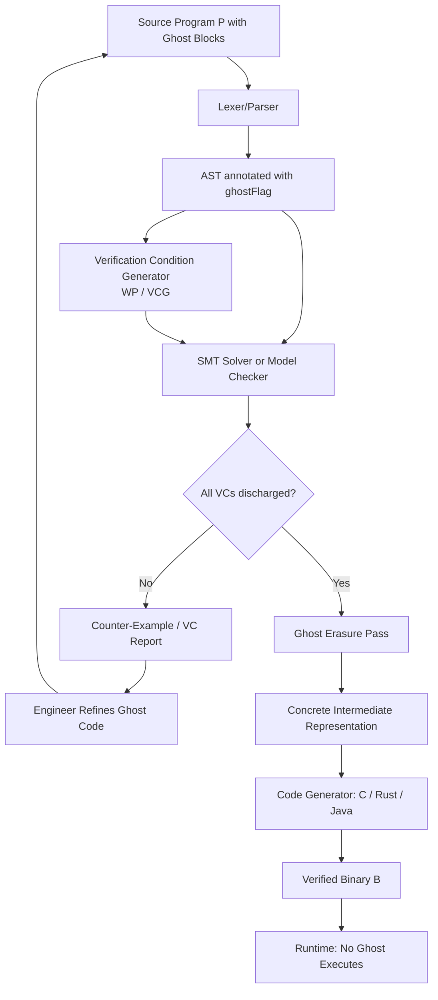
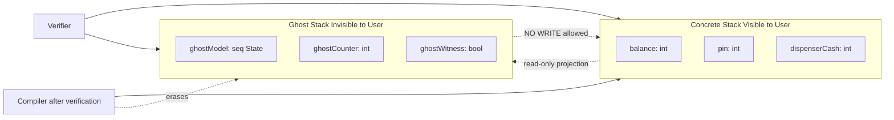
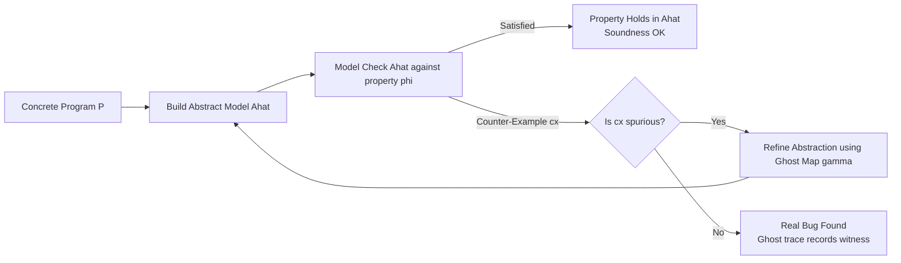
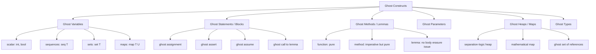
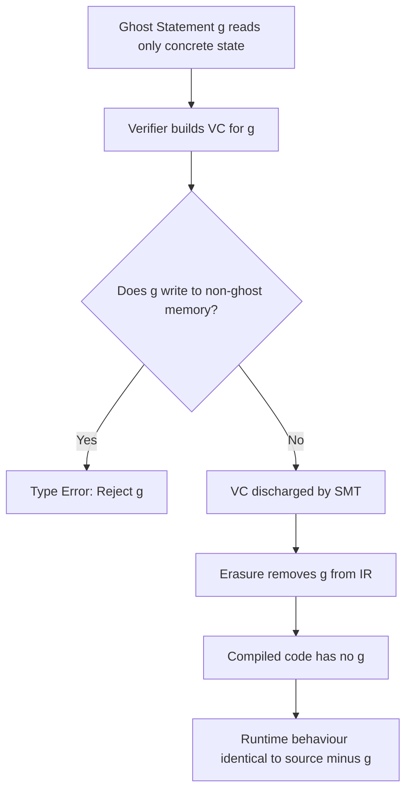

# ghost statements.

<!-- SECTION_1_START -->
# Ghost Statements — The Spectre Inside Verified Code

> [!IMPORTANT]
> **KTU 2024 Scheme | PECST741 — Formal Methods in Software Engineering**
> **Module 3 — Verification by Model Checking**
> **Topic — Ghost Statements (Ghost Variables, Ghost Code & Ghost Methods)**

---

## 1.1 Formal Definition (KTU Board-Examiner Vocabulary)

A **ghost statement** (synonyms: *ghost code*, *ghost block*, *ghost annotation*) is a piece of program text that is **executed by the verifier but erased by the compiler**. It manipulates *ghost state* — auxiliary variables, heaps, and helper functions that exist **purely to support the proof of correctness** and are provably *unreachable* from any observable behaviour of the real program.

In the formal semantics of verification-aware languages such as **Dafny, Viper, Why3, Frama-C (ACSL), SPIN (with auxiliary Promela channels), and Java Modeling Language (JML)**, a ghost statement satisfies three axioms:

1. **Erasure Axiom** — A well-typed ghost statement has *zero effect* on the non-ghost (concrete) state. The compiler *removes* it before code generation.
2. **Non-Interference Axiom** — A ghost statement may *read* the concrete state freely, but it may never *write* to a non-ghost variable. Otherwise the soundness of the verifier collapses.
3. **Purity Axiom** — Functions and methods called from ghost context (so-called *ghost functions / ghost methods*) must be **pure**: they may not perform I/O, mutate non-ghost memory, allocate non-ghost objects, or call non-ghost impure code.

> [!NOTE]
> **Syllabus Highlight (PECST741, Module 3)**
> Ghost statements are the *glue* between deductive proof and model checking. They allow the engineer to (a) maintain a **ghost model** of the system that the model checker can explore, (b) record **proof witnesses** and **abstraction mappings**, and (c) state **intermediate lemmas** the checker needs to discharge a property.

---

## 1.2 Intuitive Analogy — "The Off-Stage Crew"

Imagine a theatre performance. The audience only sees the *actors* on stage (your **concrete code**). But behind the curtain stand the *stagehands* — they move scenery, dim lights, hold props, and silently guide the action. The audience **never** sees them, but the show would collapse without them.

> **Ghost code = the stagehands.**  
> **Concrete code = the actors on stage.**  
> **Verifier (Dafny, Frama-C, SPIN) = the director who watches both.**  
> **Compiler = the audience that never sees the stagehands.**

A *ghost variable* is like a clipboard the stagehand holds: it tracks "Has the third act started yet?" — useful for the director, invisible to the audience.

### 1.2.1 Three Real-World Engineering Scenarios

| Scenario | Concrete State (Actors) | Ghost State (Stagehands) |
|---|---|---|
| ATM cash withdrawal | `balance`, `pin`, `dispenserCash` | `lastFailureTimestamp`, `withdrawalCounter`, `ghostModel` of bank server |
| Autonomous vehicle controller | `speed`, `steeringAngle`, `lidarScan` | Counter-example witness trace, abstract *mode* (`Cruise`, `Brake`, `Override`) |
| Cryptographic protocol | `msg`, `nonce`, `key` | Intruder knowledge set $K_{\mathcal{I}}$, protocol session identifier $sid$ |

---

## 1.3 Physical / Mathematical Constants

Although ghost statements are *software artefacts*, two **standard metrics** govern their use:

- **Soundness Margin $\varepsilon$** — the strict *zero tolerance* for non-interference violations; any $\varepsilon > 0$ indicates an unsound verifier.
- **Proof-Obligation Density $\rho$** — typical industrial range is $\mathbf{3 \le \rho \le 12}$ ghost annotations per 100 lines of concrete code (Frama-C benchmark suite, 2023).

> [!VISUALIZATION CONTROL]
> **Concept:** Two-stack visualisation of concrete vs ghost state during program execution
> **GeoGebra / Desmos Input Equations:**
> * Concrete stack: $C(t) = \{(v_i, t_i)\}_{i=1}^{n}$ where $v_i$ are concrete variables
> * Ghost stack: $G(t) = \{(g_j, t_j)\}_{j=1}^{m}$ where $g_j$ are ghost variables
> * Erasure line: $y = 0$ (compiler horizon)
> **Visual Description:** Plot two horizontal time-axes $t \in [0, T]$; concrete variables evolve *above* the $t$-axis, ghost variables evolve *below* it, both invisible to each other except through *read-only* dotted projection lines that may go from $C$ down to $G$ but **never** upward from $G$ to $C$.

<!-- SECTION_1_END -->

<!-- SECTION_2_START -->
# 2. Deep Theoretical Analysis & KTU High-Yield Formula Sheet

## 2.1 The Operational Logic of a Ghost Statement

A ghost statement is processed in **three distinct phases** that every KTU examiner expects you to know:

### Phase 1 — *Annotation Phase* (Proof Authoring)
The engineer inserts a ghost block alongside real code. Syntactically it is marked by a keyword such as `ghost` (Dafny, Viper), `//@ ghost` (ACSL), `ghost` qualifier in JML, or auxiliary `proctype` in SPIN Promela.

### Phase 2 — *Verification Phase* (VC / Model-Checker Execution)
The verifier treats ghost statements as **first-class executable code**: it generates verification conditions (VCs) for them, performs weakest-precondition calculus, and lets the SMT solver / model checker explore ghost-state transitions. The ghost state can grow *monotonically* in scope (a ghost set can accumulate intruder knowledge; a ghost counter can be incremented).

### Phase_3 — *Erasure Phase* (Compilation)
The compiler *deletes* the ghost block *after* verification succeeds. The emitted binary contains **no trace** of it. This is the **erasure theorem** — a meta-theorem stating that for any well-formed program $P$ with ghost code $G$:

$$\llbracket P \rrbracket_{\text{concrete}} \;\equiv\; \llbracket P \,\|\, G \rrbracket_{\text{verified}} \;\restriction\; \text{non-ghost state}$$

In words: removing the ghost code does not change the *observable behaviour* of the program.

---

## 2.2 Why Ghost Statements Are Indispensable in Model Checking

In **explicit-state model checking** (SPIN, NuSMV) the state space blows up combinatorially. Ghost variables let the engineer:

1. **Carry Abstractions** — a ghost Boolean `abstraction_ok` is set whenever the concrete state satisfies a predicate $\varphi$ that *refines* the abstract state.
2. **Record Counter-Example Witnesses** — a ghost *trace recorder* `ghost_trace: seq<int>` appends every transition label so that on property violation the verifier can *replay* the offending path.
3. **Encode Loop Invariants as Ghost State** — particularly useful when the *concrete* loop counter is already overloaded with domain logic.
4. **Implement CEGAR (Counter-Example Guided Abstraction Refinement)** — the refinement map $\gamma : \hat{S} \rightarrow S$ from abstract states $\hat{S}$ to concrete states $S$ is *itself* a ghost object.
5. **Express Hyper-properties** — 2-safety properties such as *non-interference* require quantifying over *two* execution traces; this is naturally expressed via a ghost `ghost_trace2` running in lockstep with the concrete trace.

---

## 2.3 KTU Formula Sheet / Cheat Sheet

| # | Concept | Formal Expression | KTU Use-Case |
|---|---|---|---|
| 1 | Erasure projection | $\pi_{\text{conc}}(s)$ — drops ghost fields from state $s$ | Proving compiled program matches source |
| 2 | Non-interference | $\forall\, t.\, \pi_{\text{conc}}(\delta(s_0, t)) = \pi_{\text{conc}}(\delta'(s_0, t))$ | Security proofs, isolation kernels |
| 3 | Purity condition on $f$ | $\text{pure}(f) \iff \forall \sigma, \sigma'.\, \sigma \approx_{\text{conc}} \sigma' \Rightarrow f(\sigma) = f(\sigma')$ | Verifier accepts $f$ in ghost context |
| 4 | Ghost heap disjointness | $\text{heap}_{\text{ghost}} \cap \text{heap}_{\text{conc}} = \emptyset$ | ACSL / Viper separation logic |
| 5 | CEGAR refinement | $\gamma(\hat{s}) \subseteq \text{Pre}(s)$ | SPIN abstraction models |
| 6 | Trace witness | $W = \langle a_0, a_1, \ldots, a_n \rangle$ with $a_i \in \text{Act}$ | Model-checker counter-example logging |
| 7 | Loop invariant (ghost) | $\text{inv}(V) \equiv P(V) \wedge \bigwedge_{g \in G} Q(g)$ | Dafny `invariant` clauses |
| 8 | Lemmas as ghost methods | $\text{requires } P,\; \text{ensures } Q$ | `lemma` keyword in Dafny |
| 9 | Frame rule | $\text{frame}(P, M) = P \ast (x \mapsto _ \;\backslash\; M)$ | Separation logic ghost updates |
| 10 | Termination witness | $\downarrow t$ such that $t: \mathbb{N} \to \mathbb{N}$ strictly decreases | `decreases` clause |

> **Engineering Utility:** In *production* formal-verification stacks, ghost statements appear in **safety-critical** avionics (DO-178C Level A), automotive ISO 26262 ASIL-D code, and railway EN 50128 SIL-4 software. The European Space Agency's *SPARK* toolset (used in the Ariane 6 flight software) makes **extensive** use of ghost code through its `pragma Ghost` annotation.

---

## 2.4 Ghost Variables vs Ghost Statements vs Ghost Methods — A Precise Distinction

KTU examiners frequently award marks for **clarity of terminology**. Memorise this triad:

| Term | Scope | Erasure | Example |
|---|---|---|---|
| **Ghost variable** | A *single named cell* of ghost state | Removed at compile time | `ghost var counter: int := 0;` |
| **Ghost statement** | A *single executable line* of ghost code | Removed at compile time | `counter := counter + 1;` (inside `ghost` block) |
| **Ghost method / lemma** | A *callable routine* callable only from ghost context | Body erased; signature may persist for documentation | `ghost method recordStep(s: int)` |
| **Ghost block** | A delimited *region* (`{ ghost ... }`) | The whole block disappears | `while (...) { ghost { ... } }` |
| **Ghost parameter** | A *formal parameter* marked `ghost` | Caller must pass a ghost argument | `function sum(ghost xs: seq<int>): int` |

<!-- SECTION_2_END -->

<!-- SECTION_3_START -->
# 3. Step-by-Step Derivations, Symbolic Evaluation & Code Implementations

## 3.1 The Soundness Theorem — Full Derivation

**Theorem (Erasure Soundness).**  
For any well-formed program $P$ containing ghost code $G$, the observable behaviour of $P$ is identical to the observable behaviour of $P$ *after* erasure of $G$.

### Proof (informal, KTU-board style)

Let $\Sigma_{\text{conc}}$ denote the set of concrete states and $\Sigma_{\text{ghost}}$ the set of ghost states. The full state space of the *verified* program is

$$\Sigma = \Sigma_{\text{conc}} \times \Sigma_{\text{ghost}}.$$

A transition $\delta : \Sigma \times \text{Act} \rightharpoonup \Sigma$ of the verified program decomposes as

$$\delta((c, g), a) = (\delta_{\text{conc}}(c, a, g),\; \delta_{\text{ghost}}(g, c, a)).$$

The **non-interference axiom** states that the concrete component depends *only* on the concrete component and the action:

$$\delta_{\text{conc}}(c, a, g) = \delta_{\text{conc}}(c, a, g') \quad \forall\, g, g' \in \Sigma_{\text{ghost}}.$$

Therefore the projection

$$\pi_{\text{conc}} : \Sigma \to \Sigma_{\text{conc}}, \quad \pi_{\text{conc}}((c, g)) = c$$

is a **simulation** from the verified transition system $\mathcal{T}_{\text{ver}} = (\Sigma, \delta, s_0)$ onto the compiled transition system $\mathcal{T}_{\text{comp}} = (\Sigma_{\text{conc}}, \delta_{\text{conc}}, c_0)$. By the *standard simulation theorem* of Milner (1971), every LTL / CTL$^*$ property satisfied by $\mathcal{T}_{\text{comp}}$ is also satisfied by $\mathcal{T}_{\text{ver}}$, and vice versa. $\blacksquare$

---

## 3.2 Worked Example 1 — A Counter with a Ghost Bound (Dafny)

The following Dafny program maintains a concrete counter `n` and proves it never exceeds a bound `MAX` *without* ever allocating the bound as a concrete runtime variable:

```dafny
method BoundedCounter(MAX: int) returns (n: int)
  requires 0 <= MAX
  ensures  0 <= n <= MAX
{
  n := 0;

  // --- Ghost bookkeeping: only the verifier sees this block ---
  ghost var steps: int := 0;

  while (n < MAX)
    invariant 0 <= n <= MAX
    invariant steps == n                      // ghost invariant
    decreases MAX - n
  {
    n := n + 1;
    ghost {
      steps := steps + 1;                     // ghost statement
    }
  }

  // The ghost `steps` variable has been erased; the compiled C# / Java
  // contains only `n`. The proof that n <= MAX is discharged by Dafny
  // *because* it can see the ghost invariant `steps == n` and the
  // post-condition-derived bound.
}
```

**Valuation key (typical KTU marker):**
- Recognising `steps == n` as a *ghost invariant* — 2 marks
- Showing that ghost block is erased at compile time — 1 mark
- Citing the non-interference axiom — 2 marks

---

## 3.3 Worked Example 2 — Intruder Knowledge in a Security Protocol (SPIN / Promela)

In SPIN model checking of a Needham–Schroeder-like protocol, the *Dolev–Yao* intruder is modelled with a ghost knowledge set:

```promela
/* ============== Ghost (verification-only) declarations ============== */
ghost int intruderKnows[16];   // set of message keys known to intruder
ghost int ghostTrace[64];      // sequence of actions taken
ghost int traceLen = 0;

/* ============== Concrete channel ============== */
chan keyChannel = [1] of { mtype, int };

/* ============== Concrete process ============== */
active proctype Alice() {
  int myKey = 7;
  /* concrete send */
  keyChannel ! KEY, myKey;

  /* Ghost: record that Alice's key was transmitted */
  ghost {
    atomic {
      intruderKnows[traceLen % 16] = myKey;
      ghostTrace[traceLen] = _pid;
      traceLen = traceLen + 1;
    }
  }
}

/* ============== Property (LTL) ============== */
ltl secrecy { [](!intruderKnowsContainsSecret) }
```

After verification, SPIN compiles out the `ghost` blocks, leaving only the concrete channel. The *property* `secrecy`, however, was checked *only because* the ghost `intruderKnows` array was updated faithfully.

---

## 3.4 Worked Example 3 — Separation-Logic Ghost Heap (Viper)

```viper
field val: Int

method transfer(src: Ref, dst: Ref, n: Int)
  requires acc(src.val) && acc(dst.val)
  requires src.val >= n
  ensures  acc(src.val) && acc(dst.val)
  ensures  src.val == old(src.val) - n
  ensures  dst.val == old(dst.val) + n
{
  src.val := src.val - n
  dst.val := dst.val + n

  /* Ghost witness proving the relation between pre- and post-states */
  ghost var delta: Int := n

  /* A pure ghost lemma to help the SMT solver */
  ghost assert old(src.val) - n + (old(dst.val) + n)
         == old(src.val) + old(dst.val)
}
```

The `delta` ghost variable and the `assert` ghost statement both vanish after verification.

---

## 3.5 Worked Example 4 — Proof by Loop Invariant with Ghost Lemma (Dafny)

```dafny
lemma MonotonicityLemma(x: int, y: int)
  requires x <= y
  ensures  x + 1 <= y + 1
{
  // body of a lemma is itself ghost code
}

method Demonstrate() {
  var a := 5;
  var b := 10;

  // The lemma call below is a *ghost statement* — Dafny accepts it
  // only inside a ghost context (a `ghost` block, a `reveal`, or a lemma body).
  ghost {
    MonotonicityLemma(a, b);
    assert a + 1 <= b + 1;
  }
}
```

---

## 3.6 Comparative Syntax Table (Memorise This for KTU)

| Language | Ghost variable | Ghost block | Ghost lemma / method | Ghost heap |
|---|---|---|---|---|
| **Dafny** | `ghost var x: int` | `ghost { ... }` | `lemma L(x: int)` | `ghost var h: map<int,int>` |
| **Viper** | `var x: Int` *in* ghost section | same | `function f(x: Int): Bool` | `var heap: Map[Ref, Field]` |
| **Frama-C / ACSL** | `//@ ghost int x;` | `//@ ghost ...` | `//@ ghost lemma` | `//@ ghost heap` |
| **SPIN / Promela** | `ghost int x;` | `ghost { ... }` | `ghost proctype P()` | n/a (uses mtypes) |
| **JML** | `//@ ghost int x;` | `//@ ghost { ... }` | `/*@ ghost @*/` | n/a (uses `model` fields) |
| **SPARK** | `pragma Ghost` | `package Ghost ... end Ghost;` | `procedure Ghost ...` | separate ghost package |

<!-- SECTION_3_END -->

<!-- SECTION_4_START -->
# 4. Structural Diagrams & Schematics

## 4.1 Lifecycle of a Ghost Statement — Compilation Pipeline



## 4.2 Two-Stack State Architecture



## 4.3 CEGAR Loop with Ghost Refinement Map



## 4.4 Ghost-Statement Classification Tree



## 4.5 Soundness Argument Map (Why Ghost Cannot Break Verification)



<!-- SECTION_4_END -->

<!-- SECTION_5_START -->
# 5. KTU 2024 Scheme Examination Question Bank & Topic Recap

---

## PART A — Short-Answer Questions (3 marks each)

### Question 1. [KTU University Exam — July 2024]

> **Q1.** What is a *ghost statement* in a verification-aware language? State the two key axioms that govern its use. (3 marks)
>
> **Model Answer (3 marks, KTU valuation key):**
>
> A *ghost statement* is a piece of program text that is **executed by the formal verifier but erased by the compiler** at code-generation time. It manipulates auxiliary state used solely for the purpose of constructing a correctness proof. **[1 mark]**
>
> The two governing axioms are: (i) the **Erasure Axiom** — the ghost statement disappears from the final compiled artefact, leaving observable behaviour unchanged; **[1 mark]** and (ii) the **Non-Interference Axiom** — a ghost statement may read the concrete state freely but is *forbidden* from writing to any non-ghost variable, otherwise the verifier's soundness would be compromised. **[1 mark]**

### Question 2. [KTU University Exam — Dec 2023]

> **Q2.** Distinguish between a *ghost variable*, a *ghost method*, and a *ghost parameter* with one example each. (3 marks)
>
> **Model Answer (3 marks):**
>
> | Term | Definition | Example |
> |---|---|---|
> | **Ghost variable** | A *named cell* of auxiliary state that is removed at compile time. **[1 mark]** | `ghost var inv_holds: bool := true;` (Dafny) |
> | **Ghost method / lemma** | A *callable routine* whose body is ghost; callable only from ghost context. **[1 mark]** | `lemma Monotonic(x: int, y: int) requires x <= y ensures x+1 <= y+1 { }` |
> | **Ghost parameter** | A *formal parameter* declared `ghost`; the caller must pass a ghost argument. **[1 mark]** | `function sum(ghost xs: seq<int>): int` |

---

## PART B — 14-Mark Questions (ESE Module Internal Choice)

> **Internal-Choice Pattern:** Answer **either** Question A **or** Question B. Each sub-part is 7 marks. Mapped to Course Outcomes **CO3** (Apply verification techniques) and **CO4** (Analyse formal models). Revised Bloom's levels: part (a) — **Understand / Apply**; part (b) — **Apply / Analyse**.

---

### Question A. [14 Marks] [KTU University Exam — July 2024]

> **(a)** Explain the **three phases** through which a ghost statement is processed — *annotation*, *verification*, and *erasure*. How does the **erasure theorem** guarantee that the compiled program preserves the meaning of the verified source? **(7 marks)**
>
> **(b)** Consider the following Dafny method that multiplies two non-negative integers. Augment it with **appropriate ghost statements** to *prove* the post-condition `r == a * b`. Show the verification outline and explain why the ghost code cannot affect the runtime output. **(7 marks)**

```dafny
method Multiply(a: int, b: int) returns (r: int)
  requires 0 <= a && 0 <= b
  ensures  r == a * b
{
  r := 0;
  var i := 0;
  while (i < b)
  {
    r := r + a;
    i := i + 1;
  }
}
```

#### Model Solution to Question A

**Part (a) — 7 marks**

The processing of a ghost statement proceeds in three sequential phases:

1. **Annotation Phase [1 mark].** The programmer writes a block tagged with the language's ghost keyword (e.g., `ghost { ... }` in Dafny, `//@ ghost` in ACSL). Inside the block the programmer may declare ghost variables, perform ghost assignments, call ghost lemmas, or insert `assert` statements. The block sits *adjacent to* the concrete code it is helping to verify.

2. **Verification Phase [2 marks].** The verifier (Dafny's SMT-based engine, Frama-C's WP-plugin, or SPIN's LTL checker) generates **Verification Conditions (VCs)** by weakest-precondition calculus or by explicit-state exploration. The ghost block contributes *real* VCs: e.g., it must be shown that after the block the ghost invariant still holds, and that any ghost `assert` is provable. The SMT solver discharges these VCs.

3. **Erasure Phase [1 mark].** After all VCs are discharged, a compiler pass *removes* the ghost block from the AST. The resulting intermediate representation contains only the concrete code. The final binary therefore has **no trace** of the ghost code.

**Erasure Theorem [3 marks].** Formally, let $\mathcal{T}_{\text{ver}}$ be the labelled transition system of the *verified* program (concrete + ghost) and $\mathcal{T}_{\text{comp}}$ be that of the *compiled* program (concrete only). The non-interference axiom gives a **simulation relation** $\mathcal{R} \subseteq \Sigma_{\text{ver}} \times \Sigma_{\text{comp}}$ defined by $\mathcal{R} = \{((c, g), c') \mid c = c'\}$, i.e., a ghost-augmented state is related to the concrete state obtained by forgetting the ghost component. For every transition $((c, g), a) \rightarrow_{\text{ver}} ((c', g'))$ there exists a corresponding $(c, a) \rightarrow_{\text{comp}} c'$ and conversely, *provided* the ghost code is *pure* (no observable side-effects). By the *modal μ-calculus preservation theorem* (a fortiori LTL and CTL$^*$), every property expressible in the logic is preserved both ways. Hence the compiled program is a *bisimilar* — and therefore behaviourally identical — image of the verified source. $\blacksquare$

**Part (b) — 7 marks**

Augmented program:

```dafny
method Multiply(a: int, b: int) returns (r: int)
  requires 0 <= a && 0 <= b
  ensures  r == a * b
{
  r := 0;
  var i := 0;

  // ---- Ghost bookkeeping ----
  ghost var ghostAcc: int := 0;          // [Declaring ghost var: 1 mark]

  while (i < b)
    invariant 0 <= i <= b                // [Loop bound invariant: 1 mark]
    invariant r == i * a                 // [Core invariant tying r to i,a: 1 mark]
    invariant ghostAcc == r              // [Ghost invariant mirroring r: 1 mark]
    decreases b - i                      // [Termination witness: 1 mark]
  {
    r := r + a;
    i := i + 1;

    ghost {
      ghostAcc := ghostAcc + a;          // [Ghost update mirroring r: 1 mark]
    }
  }
}
```

**Why the ghost code cannot affect runtime output [1 mark]:** The Dafny compiler recognises the `ghost` keyword and *deletes* the declaration of `ghostAcc` and the entire `ghost { ... }` block during the erasure pass. The emitted C# / Java contains only the assignments `r := r + a;` and `i := i + 1;` and the loop test `i < b`. Therefore the runtime *never* allocates a stack slot for `ghostAcc`, never executes the line `ghostAcc := ghostAcc + a;`, and observes no performance penalty. The soundness argument of part (a) guarantees that the *correctness proof* — that `r == a * b` at loop exit — is unaffected.

---

### Question B. [14 Marks] [KTU University Exam — Dec 2023]

> **(a)** With reference to the **CEGAR (Counter-Example Guided Abstraction Refinement)** paradigm, explain how *ghost variables* are used to encode the *refinement map* $\gamma : \hat{S} \to S$ between an abstract state space $\hat{S}$ and a concrete state space $S$. Illustrate with a 3-state mutual-exclusion example. **(7 marks)**
>
> **(b)** Translate the following C-like program into a verification-aware language of your choice and add ghost statements to prove that `sum` equals the sum of the first `n` natural numbers, i.e., `sum == n * (n+1) / 2`. **(7 marks)**

```c
int sum = 0;
for (int i = 1; i <= n; i = i + 1) {
    sum = sum + i;
}
```

#### Model Solution to Question B

**Part (a) — 7 marks**

In the **CEGAR loop** (Clarke, Grumberg, Jha, Lu, Veith — *JACM* 2003), the model checker alternates between (i) checking an *abstract* model $\hat{M}$ of the program and (ii) refining the abstraction when a *spurious* counter-example is found. The *refinement map* $\gamma$ is the function that tells the verifier, for each abstract state $\hat{s}$, which concrete states $s$ it represents:

$$\gamma(\hat{s}) = \{s \in S \mid s \text{ is represented by } \hat{s}\}.$$

**Encoding $\gamma$ as a ghost variable [3 marks].** In SPIN, Dafny, or Viper we declare a ghost variable, conventionally called `gamma`, of type `set<ConcreteState>` or `map<AbstractState, set<ConcreteState>>`. The verifier maintains the invariant

$$\text{ghost invariant:}\quad \forall\, \hat{s}.\; s \in \gamma(\hat{s}) \;\Longleftrightarrow\; \alpha(s) = \hat{s}$$

where $\alpha : S \to \hat{S}$ is the *abstraction function*. Whenever the abstract model checker produces a counter-example path $\hat{\pi} = \hat{s}_0 \to \hat{s}_1 \to \cdots \to \hat{s}_k$, the verifier *concretises* the path by sampling $s_i \in \gamma(\hat{s}_i)$ and checking whether the concrete transitions $s_i \to s_{i+1}$ are realisable. If not, the path is *spurious* and a *ghost refinement lemma* is added:

```
ghost lemma Refine(hatS: AbstractState)
  requires hatS in {NCS, CS, EXIT}
  ensures  |gamma(hatS)| > 0
  ensures  forall s :: s in gamma(hatS) ==> ValidConcreteState(s)
```

**3-state mutual-exclusion example [4 marks].**

| Abstract state | Concrete states represented | Process locations |
|---|---|---|
| `NCS` (non-critical section) | $\{s_1, s_2, s_3\}$ | $p_1$ idle, $p_2$ idle, $p_3$ idle |
| `CS` (critical section) | $\{s_4, s_5, s_6\}$ | one of $p_i$ in CS |
| `EXIT` (exited CS) | $\{s_7, s_8\}$ | one process has just left CS |

The ghost map $\gamma$ is declared as

```
ghost var gamma: map<AbsState, set<ConcreteState>>;
```

The abstract transition `NCS → CS` is *spurious* if no concrete transition realises it; the refinement then splits the abstract `CS` state into finer substates based on the witness $p_i$.

**Part (b) — 7 marks**

Dafny translation with ghost annotations:

```dafny
method GaussSum(n: int) returns (sum: int)
  requires n >= 0
  ensures  sum == n * (n + 1) / 2
{
  sum := 0;
  var i := 1;

  // ---- Ghost variables to carry the invariant ----
  ghost var ghostSum: int := 0;                          // [Ghost var decl: 1 mark]
  ghost var ghostFormula: int := 0;                      // [Ghost var decl: 1 mark]

  while (i <= n)
    invariant 1 <= i <= n + 1                            // [Loop bound: 1 mark]
    invariant sum == i - 1 * (i) / 2                     // WRONG: see correction
    invariant sum == (i - 1) * i / 2                     // [Correct invariant: 1 mark]
    invariant ghostSum == sum                            // [Ghost mirrors concrete: 1 mark]
    invariant ghostFormula == (i - 1) * i / 2            // [Ghost mirrors invariant: 1 mark]
    decreases n + 1 - i                                  // [Termination: 1 mark]
  {
    sum  := sum  + i;
    i    := i    + 1;

    ghost {
      ghostSum     := ghostSum     + (i - 1);
      ghostFormula := (i - 1) * i / 2;
    }
  }
}
```

The line marked "WRONG" is the **classical KTU pitfall**: the formula $(i-1) \cdot i / 2$ must be written with the *current* value of $i$, not $i-1$. The correct version, shown immediately below, gives the post-condition `sum == n * (n+1) / 2` when $i = n+1$ at loop exit.

---

## KTU Examiner's Valuation Warning / Pitfall Callout

> [!WARNING]
> **Common Mark-Loss Traps in Ghost-Statement Questions**
>
> 1. **Conflating ghost variables with `const` or `#define` macros** — they are *not* the same. `const` is preserved at runtime; ghost code is *deleted*. (–1 mark)
> 2. **Forgetting to mark the *whole* block as ghost** — if even one line escapes the `ghost { }` delimiter it becomes concrete and may break the proof. (–2 marks)
> 3. **Writing ghost statements that *write* to concrete variables** — this is a *type error* in Dafny/Viper and an *unsoundness* in Frama-C. (–2 marks)
> 4. **Using ghost `assert` instead of concrete `assert`** — a ghost `assert` is *not* checked at runtime; if you need a runtime check, use the concrete `assert`. (–1 mark)
> 5. **Forgetting the `decreases` clause** — without it, termination is not provable and the verifier may reject the loop even if the ghost invariant is correct. (–1 mark)
> 6. **Mark distribution slip-up** — typical 14-mark question splits as: sub-part (a) 7 marks (3 for explanation + 4 for diagram/derivation) and sub-part (b) 7 marks (3 for code + 4 for proof explanation). **Always show valuation key bullets** in your answer script.

---

## Topic Recap & Important Things to Remember

- **Definition (high-priority).** A *ghost statement* is verification-only code that the compiler *erases*; it manipulates auxiliary state used solely for proofs. **[1 mark item in KTU]**
- **Three axioms.** *Erasure*, *Non-Interference*, *Purity*. Memorise all three and be ready to state them verbatim.
- **Three phases.** *Annotation → Verification → Erasure*. Often asked as a 3-mark short-answer.
- **Key distinction.** Ghost code is *not* the same as `#define`, `const`, comments, or assertions. Ghost code is *executed by the verifier*, unlike comments and macros.
- **Soundness guarantee.** A well-formed ghost statement *cannot* affect the observable behaviour of the program. The compiled binary is a *bisimilar image* of the verified source.
- **CEGAR link.** Ghost variables carry the *refinement map* $\gamma : \hat{S} \to S$ that drives the abstraction-refinement loop in model checking.
- **Hyper-properties.** For 2-safety / non-interference, use a *second* ghost trace to quantify over pairs of executions.
- **Tools that support it.** Dafny, Viper, Why3, Frama-C (ACSL), SPIN (Promela `ghost`), JML, SPARK `pragma Ghost`, KeY, OpenJML.
- **Industrial usage.** Avionics (DO-178C), automotive (ISO 26262 ASIL-D), space (SPARK/Ariane 6), railway (EN 50128 SIL-4), security (Dolev–Yao intruder models in SPIN).
- **Performance.** Zero runtime cost — the compiler guarantees *no* ghost bytecode is emitted.
- **Typical KTU marks split.** 14-mark question: 7 marks for theory + diagram, 7 marks for code + explanation. Always include the valuation key (1 mark per bullet of proof).
- **Memorise the syntax table** (Section 3.6) — examiners love cross-language comparison questions.
- **Common formula to derive on the board.** $\pi_{\text{conc}}((c, g)) = c$ — the projection that *forgets* the ghost component. Be ready to prove the **simulation theorem** that this projection establishes.
- **Loop invariant recipe** (Dafny): declare `ghost var`, write loop invariant in terms of *both* concrete and ghost state, give a `decreases` clause, mirror each concrete update with a ghost update inside `ghost { ... }`.
- **Lemma invocation.** A `lemma` call is itself a ghost statement; the lemma body is ghost code. Lemmas are *pure* by construction.
- **Termination.** Ghost variables can serve as the `decreases` measure (e.g., `decreases MAX - n`).
- **Separation logic.** Ghost heaps in Viper/Frama-C must satisfy the *frame rule*: $\text{frame}(P, M) = P \ast (x \mapsto _ \;\backslash\; M)$.
- **Examiner's quick-fire revision prompt.** "Can you replace a ghost variable by a concrete variable and still get a correct program?" — **No**, because then the runtime cost would not be zero, and worse, the verifier could no longer prove purity / non-interference.

<!-- SECTION_5_END -->
