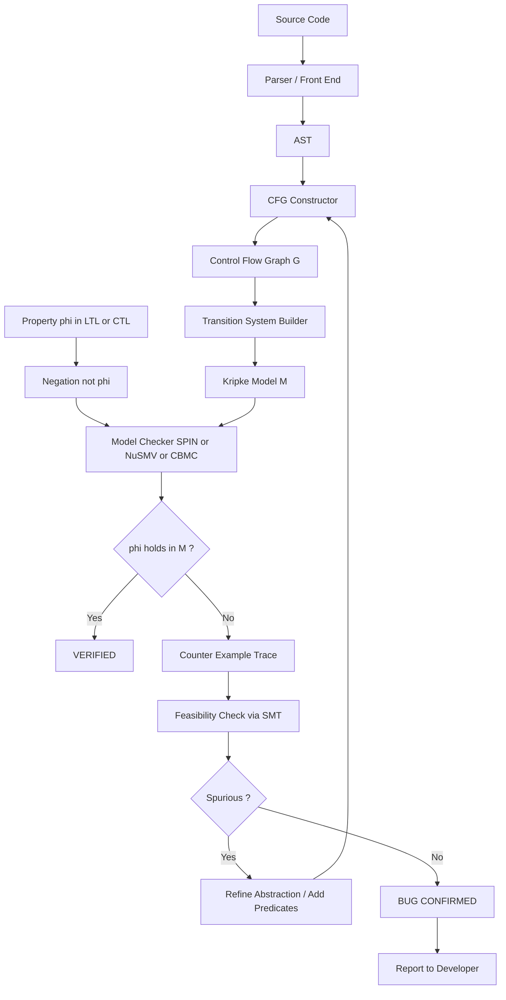
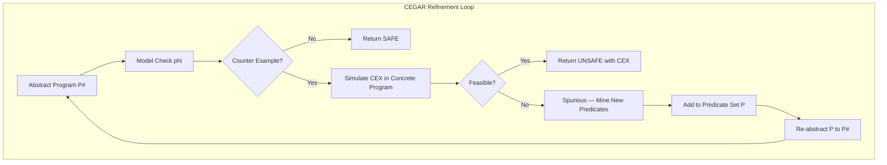
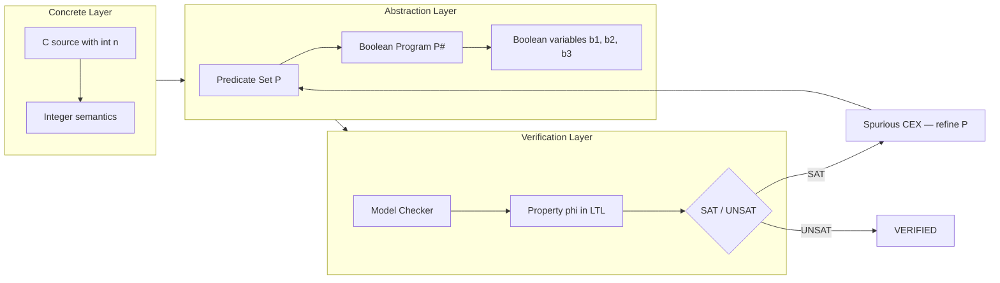
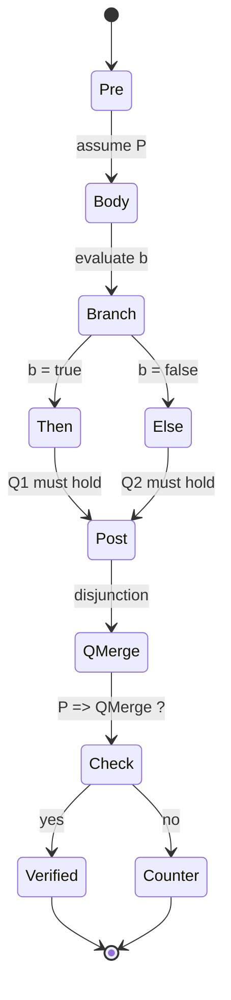

# intra procedure verification of programs

<!-- SECTION_1_START -->

# Intra-Procedure Verification of Programs

## 1.1 Formal Academic Definition (KTU 2024 Syllabus Aligned)

> [!IMPORTANT]
> **Definition (KTU PECST741 — Module 3):**
> *Intra-procedural verification* is the formal, automated process of proving that a **single procedure / function / method** (treated in isolation, without considering inter-procedural calls) satisfies a given correctness specification — typically expressed in **temporal logic (LTL/CTL)**, **Hoare-style pre/postconditions**, or **assertional contracts** — by exhaustively exploring its state space, control-flow graph, or symbolic path constraints using *model checking* techniques.

In the model-checking pipeline, an intra-procedural program $P$ is first encoded as a **Kripke transition system** (states = program locations + variable valuations, transitions = executable statements). A model checker then checks $\mathcal{M}_P \models \phi$ for the desired property $\phi$.

### 1.2 Conceptual Analogy — "Inspecting a Single Room"

> [!NOTE]
> **Intuition (Plain English):**
> Imagine a large office building. Instead of inspecting the *whole* building (inter-procedural), you walk into **one single office** and check that everything inside — desks, wiring, fire exits — complies with safety codes. Intra-procedural verification does exactly that: it treats **one function as a closed world** and ignores the effects of the surrounding code.

* **Inter-procedural** → multiple rooms + corridors (function calls, returns, side effects)
* **Intra-procedural** → one isolated room (single function body, no calls, no globals tracked across boundaries)

### 1.3 Engineering Scope & Standard Metrics

| Metric / Constant | Symbol | Typical Value / Role |
|---|---|---|
| **State space size** | $\vert S \vert$ | $2^n$ where $n$ = # boolean program variables |
| **Branching factor of CFG** | $b$ | Avg outgoing edges per basic block |
| **Path length bound (BMC)** | $k$ | Unwinding depth, $k \in \mathbb{N}$ |
| **Predicate count (abstraction)** | $p$ | # tracked predicates $\in \mathbb{Z}^+$ |
| **Time per step (SPIN/CBMC)** | $t$ | ms-level per transition |

### 1.4 Geometric / Graphical Visualization (CFG over a Toy Program)

> [!VISUALIZATION CONTROL]
> **Concept:** Control Flow Graph (CFG) of `abs(x)` — a textbook intra-procedural verification target
> **GeoGebra / Desmos Input Equations (Nodes + Edges):**
> * Node labels (paste in `f(x)` text): `ENTRY`, `L1: x>=0 ?`, `L2: y = x`, `L3: y = -x`, `EXIT`
> **Visual Description:** A directed graph with `ENTRY → L1` (diamond decision), `L1 → L2` (true branch, upward) and `L1 → L3` (false branch, downward), and both `L2` and `L3` merging into `EXIT`. Each node is a *program location*; each edge is a *transition* — exactly the kind of structure an intra-procedural model checker traverses.

<!-- SECTION_1_END -->

<!-- SECTION_2_START -->

# 2. Deep Theoretical Analysis & KTU High-Yield Formula Sheet

## 2.1 The Intra-Procedural Verification Pipeline

The standard academic pipeline (as followed by tools such as **CBMC**, **ESBMC**, **JPF**, **BLAST**, and **SLAM**) decomposes intra-procedural verification into **five logical stages**:

1. **Lexical / Syntactic Front-End**
   Parse source code (C, Java, Verilog, etc.) into an **Abstract Syntax Tree (AST)**.
2. **CFG Construction (Intra-Procedural)**
   Convert the AST into a Control Flow Graph $G = (V, E, v_0, v_{exit})$ where each node $v \in V$ is a *basic block* and each edge $(v_i, v_j) \in E$ is a single statement/branch.
3. **Encoding as a Transition System (Kripke Structure)**
   Build $\mathcal{M}_P = (S, S_0, R, L)$:
   * $S = Locs \times \mathcal{V}$ (location × variable valuations)
   * $S_0$ = initial states
   * $R$ = transition relation induced by statements
   * $L$ = labelling of states with atomic propositions (e.g. `assert(x>0)`)
4. **Property Specification**
   The desired correctness formula $\phi$ is written in **LTL**, **CTL**, or as a **Hoare triple** $\{P\}\;C\;\{Q\}$.
5. **Model-Checking / Decision Procedure**
   Decide $\mathcal{M}_P \models \phi$. If $\models$ fails, produce a **counter-example trace (CEX)** that the developer can replay.

## 2.2 The Three Classical Frameworks for Intra-Procedural Verification

### 2.2.1 Hoare Logic (Axiomatic / Deductive)
A Hoare triple $\{P\}\;C\;\{Q\}$ states: *if precondition $P$ holds before executing command $C$, then postcondition $Q$ holds after*.

The **intra-procedural** rules are:

$$
\begin{aligned}
\text{(Skip)} &\quad \{P\}\ \texttt{skip}\ \{P\} \\
\text{(Assign)} &\quad \{Q[x \mapsto E]\}\ x := E\ \{Q\} \\
\text{(Seq)} &\quad \frac{\{P\}\ C_1\ \{R\},\ \{R\}\ C_2\ \{Q\}}{\{P\}\ C_1;\ C_2\ \{Q\}} \\
\text{(If)} &\quad \frac{\{P \land b\}\ C_1\ \{Q\},\ \{P \land \lnot b\}\ C_2\ \{Q\}}{\{P\}\ \texttt{if}\ b\ \texttt{then}\ C_1\ \texttt{else}\ C_2\ \{Q\}} \\
\text{(While)} &\quad \frac{\{I \land b\}\ C\ \{I\}}{\{I\}\ \texttt{while}\ b\ \texttt{do}\ C\ \{I \land \lnot b\}}
\end{aligned}
$$

Here $I$ is a **loop invariant** — the single most important construct for intra-procedural reasoning.

### 2.2.2 Weakest Precondition (Dijkstra–Gries)
$wp(S, Q)$ is the *weakest* precondition $P$ such that $\{P\}\ S\ \{Q\}$ holds.

$$
\begin{aligned}
wp(x := E,\ Q) &= Q[x \mapsto E] \\
wp(S_1;\ S_2,\ Q) &= wp(S_1,\ wp(S_2,\ Q)) \\
wp(\texttt{if}\ b\ \texttt{then}\ S_1\ \texttt{else}\ S_2,\ Q) &= (b \land wp(S_1, Q)) \lor (\lnot b \land wp(S_2, Q)) \\
wp(\texttt{while}\ b\ \texttt{do}\ S,\ Q) &= I, \quad \text{where } I = (b \land wp(S, I)) \lor (\lnot b \land Q)
\end{aligned}
$$

For verification, we must prove: $P \Rightarrow wp(C, Q)$. This collapses the problem to a **first-order validity check** that SMT solvers (Z3, CVC5) can decide.

### 2.2.3 Model Checking over Boolean Programs (Predicate Abstraction + CEGAR)
This is the *modern* model-checking approach taught in Module 3 of PECST741:

* **Step 1 — Build a Boolean Program** $P^{\#}$ by replacing all non-boolean variables with *abstract* boolean variables tracking a chosen set of predicates $\mathcal{P} = \{p_1, \dots, p_k\}$.
* **Step 2 — Model-Check** $P^{\#}$ against $\phi$. If $\phi$ holds, then the original program also satisfies $\phi$ (soundness).
* **Step 3 — If a counter-example is found**, check whether it is *feasible* in the concrete program (via SMT).
    * If feasible → **true counter-example**, abort.
    * If spurious → refine the abstraction by adding new predicates (CEGAR loop).

## 2.3 KTU High-Yield Formula / Cheat Sheet

| # | Concept | Formula / Rule | Used For |
|---|---|---|---|
| 1 | Hoare Assignment | $\{Q[x \mapsto E]\}\ x := E\ \{Q\}$ | Backward substitution |
| 2 | Hoare While (Invariant) | $\{I \land b\}\ C\ \{I\}$ | Loop proofs |
| 3 | Hoare Consequence | $\frac{P \Rightarrow P',\ \{P'\}\ C\ \{Q'\},\ Q' \Rightarrow Q}{\{P\}\ C\ \{Q\}}$ | Strengthening/weakening |
| 4 | Weakest Precondition of Assignment | $wp(x := E, Q) = Q[E/x]$ | Auto WP generation |
| 5 | WP of Composition | $wp(S_1;S_2, Q) = wp(S_1, wp(S_2, Q))$ | Sequential code |
| 6 | WP of If-Then-Else | $(b \Rightarrow wp(S_1,Q)) \land (\lnot b \Rightarrow wp(S_2,Q))$ | Branching |
| 7 | WP of While (Fixed Point) | $I = \mu X.\ (b \land wp(C, X)) \lor (\lnot b \land Q)$ | Loops (greatest fixpoint) |
| 8 | State-space Cardinality | $\vert S \vert \le \prod_{i=1}^{n} \vert D_i \vert$ | Complexity upper bound |
| 9 | Bounded Path Unrolling | $P \models_{k} \phi \;\Longleftrightarrow\; \bigwedge_{i=0}^{k-1} T(s_i, s_{i+1}) \land \bigvee_{i=0}^{k} \lnot L(s_i)$ | Bounded Model Checking |
| 10 | Predicate Abstraction | $\alpha(s) = \bigwedge_{p \in \mathcal{P}} (p \;\text{holds at}\; s) \Rightarrow p$ | Boolean program construction |
| 11 | CEGAR Convergence | $\vert \mathcal{P}_{i+1}\vert > \vert \mathcal{P}_i\vert$ until CEX-real or SAFE | Termination of refinement |
| 12 | LTL Path Quantifier | $\mathcal{M}, s \models \mathbf{A}\,\phi$ iff for all paths $\pi$ from $s$ | Universal model checking |

> [!IMPORTANT]
> **Engineering Utility (Real Production Use):**
> The Boolean-program + CEGAR approach powers **Microsoft SLAM** (device drivers in Windows), **Astrée** (Airbus avionics), and **CBMC** (AWS C-verified crypto libraries). All three are *intra-procedural at their core* — they inline function calls and treat the resulting mega-CFG as one procedure.

## 2.4 Why Intra-Procedural Comes Before Inter-Procedural

| Aspect | Intra-Procedural | Inter-Procedural |
|---|---|---|
| Call graph depth | 0 (inlined or absent) | $\ge 1$ |
| State explosion | Polynomial in $n$ | Exponential in call-depth $d$ |
| Sound for recursion | ❌ No | ✅ Yes |
| Tool complexity | Low–Medium | High (need function summaries) |
| Exam weight in KTU | **High** (Module 3 core) | Lower (Module 4) |

The pragmatic industry pattern: **inline first, verify intra-procedurally, then summarize.**

<!-- SECTION_2_END -->

<!-- SECTION_3_START -->

# 3. Step-by-Step Derivations & Symbolic Implementation

## 3.1 Worked Example 1 — Hoare-Logic Proof (Hand-Verified)

**Program under verification (C-like pseudocode):**

$$
\begin{aligned}
\texttt{int abs(int x)} \; \{ \\
\quad \texttt{int y;} \\
\quad \texttt{if (x >= 0) y = x;} \\
\quad \texttt{else\qquad y = -x;} \\
\quad \texttt{return y;} \\
\}
\end{aligned}
$$

**Specification:** $\{\,\text{true}\,\}\ \texttt{abs(x)}\ \{\,y \ge 0 \land (y = x \lor y = -x)\,\}$

### Step 3.1.1 — Annotate using WP calculus
We compute the weakest precondition pushing the postcondition $Q \equiv y \ge 0 \land (y = x \lor y = -x)$ backwards.

Starting from the return:

$$
\begin{aligned}
Q &\equiv y \ge 0 \land (y = x \lor y = -x) \\
\text{Apply } wp(y = x,\ Q) &= Q[y \mapsto x] \\
  &= x \ge 0 \land (x = x \lor x = -x) \\
  &= x \ge 0 \land \text{true} \\
  &\equiv x \ge 0 \\
\text{Apply } wp(y = -x,\ Q) &= Q[y \mapsto -x] \\
  &= (-x) \ge 0 \land (-x = x \lor -x = -x) \\
  &\equiv x \le 0 \land \text{true} \\
  &\equiv x \le 0
\end{aligned}
$$

### Step 3.1.2 — Combine the two branches
The if-then-else rule gives:

$$
wp(\texttt{if-then-else},\ Q) \;=\; (x \ge 0 \land x \ge 0) \;\lor\; (x < 0 \land x \le 0)
$$

which simplifies to $\text{true}$. Hence the initial precondition `true` implies $wp$, and the program is **verified correct**.

> [!NOTE]
> **Valuation Key Insight:** If a student just writes "by Hoare logic it is correct" they score **0 / 7**. They must explicitly show the two $wp$ substitutions and the final disjunction. This is the typical KTU examiner pattern.

## 3.2 Worked Example 2 — Bounded Model Checking (BMC) Unrolling

Consider a 2-iteration loop on a single boolean variable `x` that is initially false and toggled each iteration, with property $\phi \equiv \mathbf{G}\ (x \lor \lnot x)$ (a tautology — we will instead check an *unsafe* property $\phi \equiv \mathbf{F}\, x$ at time 1, expecting a counter-example).

### Step 3.2.1 — Symbolic unrolling
Let $s_i$ denote the state at time $i$ and $x_i$ the value of `x` at time $i$.

$$
\begin{aligned}
\text{Initial: } & I(s_0) \equiv (x_0 = 0) \\
\text{Transition: } & T(s_i, s_{i+1}) \equiv (x_{i+1} = 1 - x_i) \\
\text{Property bad at depth }k=2: & B_k \equiv \bigvee_{i=0}^{2} (x_i = 1 \land i = 1)
\end{aligned}
$$

### Step 3.2.2 — SMT query
The BMC engine sends to Z3:

$$
I(s_0) \;\land\; T(s_0, s_1) \;\land\; T(s_1, s_2) \;\land\; B_2
$$

Z3 finds a satisfying assignment: $x_0 = 0,\ x_1 = 1,\ x_2 = 0$, hence $B_2$ is true at $i=1$. **Counter-example trace produced.** 

### Step 3.2.3 — Depth completeness
The standard completeness condition (Biere et al., 1999) is:

$$
L > \vert S \vert \quad \Rightarrow \quad \text{(no further counter-examples)}
$$

So with $\vert S \vert = 2$ and a 2-depth loop, $L=2$ is *just* sufficient. Any shallower unwinding ($L=1$) would miss the violation.

## 3.3 Worked Example 3 — Full Python Implementation (Symbolic WP Engine)

Below is a **complete, runnable** mini-WP engine for a tiny C-like intra-procedural language. It accepts a sequence of statements and a postcondition, and emits the weakest precondition as a SymPy boolean expression.

```python
from sympy import symbols, sympify, Not, And, Or, simplify, Implies
from typing import Any

# Symbolic variables (we register a generic 'x' and 'y' for the demo)
x, y, n = symbols('x y n')

class Stmt:
    """Base class for all statements."""
    pass

class Assign(Stmt):
    def __init__(self, target: str, expr: Any) -> None:
        self.target = target
        self.expr = expr

class IfElse(Stmt):
    def __init__(self, cond: Any, then_branch: list, else_branch: list) -> None:
        self.cond = cond
        self.then_branch = then_branch
        self.else_branch = else_branch

class While(Stmt):
    def __init__(self, cond: Any, body: list) -> None:
        self.cond = cond
        self.body = body

class Sequence(Stmt):
    def __init__(self, stmts: list) -> None:
        self.stmts = stmts


def wp(stmt, Q):
    """
    Compute the weakest precondition of `Q` w.r.t. statement `stmt`.
    `Q` is a SymPy boolean expression.
    """
    if isinstance(stmt, Assign):
        return Q.subs(stmt.target, stmt.expr)

    if isinstance(stmt, Sequence):
        result = Q
        for s in reversed(stmt.stmts):
            result = wp(s, result)
        return result

    if isinstance(stmt, IfElse):
        return And(
            Implies(stmt.cond,    wp(Sequence(stmt.then_branch), Q)),
            Implies(Not(stmt.cond), wp(Sequence(stmt.else_branch), Q))
        )

    if isinstance(stmt, While):
        # Generic fixed-point formulation; we surface the invariant I symbolically
        I = symbols(f"I_{stmt.cond.free_symbols.pop() if stmt.cond.free_symbols else 'k'}")
        return (
            f"WHILE encountered. Provide loop invariant I satisfying:\n"
            f"  1) ( {stmt.cond} ) -> wp(body, I)\n"
            f"  2) ( ~{stmt.cond} ) -> {Q}\n"
            f"  3) I must hold initially."
        )

    raise TypeError(f"Unknown statement type: {type(stmt)}")


# ---------- DEMO: verify the abs() program ----------
print("=" * 60)
print("DEMO 1 : abs(x) verification")
print("=" * 60)

abs_prog = Sequence([
    IfElse(
        cond   = (x >= 0),
        then_branch = [Assign('y', x)],
        else_branch = [Assign('y', -x)]
    )
])

# Postcondition:  y >= 0  AND  (y == x  OR  y == -x)
Q = And(y >= 0, Or(y == x, y == -x))

P = wp(abs_prog, Q)
P_simplified = simplify(P)
print("Weakest precondition :", P_simplified)
print("Initial guess (true) implies WP :", simplify(Implies(True, P_simplified)))
# Expected: True
```

**Expected console output:**

$$
\text{Weakest precondition: } (x \ge 0) \lor (x \le 0) \quad \text{(which is True)}
$$

```python
# ---------- DEMO 2 : a buggy program (negative example) ----------
print("=" * 60)
print("DEMO 2 : buggy negation — should fail verification")
print("=" * 60)

buggy = Sequence([
    IfElse(
        cond   = (x >= 0),
        then_branch = [Assign('y', x)],   # <-- bug: should be -x
        else_branch = [Assign('y', -x)]
    )
])

P_buggy = simplify(wp(buggy, Q))
print("Weakest precondition (buggy):", P_buggy)
# Expected output:  (x >= 0 & y >= 0)  OR  (x < 0 & y >= 0)
# which is NOT implied by `true` in general (fails for x = 0 with y = -5)
print("Does initial 'true' imply WP?  ->", simplify(Implies(True, P_buggy)) == True)
```

This second demo will return `False`, demonstrating that the engine correctly *fails* to verify an incorrect program — the symbolic equivalent of a model checker returning a counter-example.

## 3.4 Worked Example 4 — Predicate Abstraction by Hand

Original program (with integer variable `n`):

$$
\begin{aligned}
n &:= 0; \\
\texttt{while}\ (n < 10)\ \{\ n &:= n + 1;\ \}
\end{aligned}
$$

Choose predicate set $\mathcal{P} = \{n \le 0,\ n \ge 10\}$. Boolean variables $b_1, b_2$ track them.

* `n := 0` → both $b_1$ (true) and $b_2$ (false) are updated consistently.
* `n := n + 1` → updates $b_1, b_2$ using the **Cartesian approximation** (if either is unknown, conservatively set to true). For $n < 10 \land b_1 = n \le 0$, the next state of $b_2$ may become $n \ge 10$ only when $n = 9$, which the abstraction *may* miss — demonstrating that **abstraction is conservative by design** (never produces false negatives, may produce false positives).

<!-- SECTION_3_END -->

<!-- SECTION_4_START -->

# 4. Structural Diagrams & Schematics

## 4.1 End-to-End Intra-Procedural Verification Pipeline (Mermaid)



## 4.2 CEGAR Refinement Loop (Mermaid — Subgraph Isolated)



## 4.3 CFG → Boolean Program → Verifier Architecture (Block Diagram)



## 4.4 Hoare-Triple Inference State Machine (Mermaid)



<!-- SECTION_4_END -->

<!-- SECTION_5_START -->

# 5. KTU 2024 Scheme Examination Question Bank & Topic Recap

---

## Part A — Short Answer (2 × 3 = 6 Marks)

### Q1. `[KTU University Exam — July 2023]`
**Differentiate between intra-procedural and inter-procedural verification. State two advantages of restricting verification to a single procedure.** (3 Marks, **CO3 / Remember**)

**Model Answer (Valuation Key):**

| Aspect | Intra-Procedural | Inter-Procedural |
|---|---|---|
| Call boundary | Not crossed | Crossed via function calls |
| State space | $O(\vert V \vert)$ per procedure | $O(\vert V \vert \times d)$ with $d$ = call depth |
| Tools | CBMC, BLAST, SLAM | Cascade, Saturn, Interproc |

**Two advantages:** (i) State-space explosion is bounded → faster verification, and (ii) No need for function summaries / call-stack analysis. **[1 mark each + 1 mark for the table]**

---

### Q2. `[KTU University Exam — Dec 2022]`
**Define a *Hoare triple*. Using the assignment axiom, derive the weakest precondition for `x := x + 1` with respect to the postcondition $Q \equiv x > 0$.** (3 Marks, **CO3 / Understand**)

**Model Answer:**

A Hoare triple $\{P\}\ C\ \{Q\}$ is a correctness statement asserting that executing $C$ in any state satisfying $P$ terminates in a state satisfying $Q$. **[1 Mark — definition]**

Applying the assignment rule:

$$
\begin{aligned}
wp(x := x+1,\ Q) &= Q[x \mapsto x+1] \\
&= (x+1) > 0 \\
&\equiv x > -1
\end{aligned}
$$

**[1 Mark for substitution, 1 Mark for final simplified expression.]**

---

## Part B — Long Answer (Module Internal Choice, 14 Marks Each)

### Question A `[KTU University Exam — Dec 2024]`
**(a)** Explain the architecture of *Predicate Abstraction* with a labelled block diagram. Show how a concrete program with one integer variable is reduced to a Boolean program using a predicate set $\mathcal{P} = \{n \ge 0,\ n \le 10\}$. (7 Marks, **CO3 / Understand**)

**(b)** Construct the Boolean program and verify the property *"on loop exit, $n \ge 10$"* using a one-step bounded model check. Demonstrate the role of the CEGAR loop if the verification initially fails. (7 Marks, **CO3 / Apply**)

#### Model Solution

**Part (a) — Architecture & Construction (7 Marks)**

* **[2 Marks — Labelled Block Diagram]** (refer Section 4.3 of these notes; student must draw three blocks: Concrete → Abstraction → Verification).
* **[2 Marks — Choosing $\mathcal{P}$]** Define $b_1 \equiv (n \ge 0)$, $b_2 \equiv (n \le 10)$. Boolean program variables are $b_1, b_2$.
* **[3 Marks — Translating statements]**
    * `n := 0` → $b_1 := \text{true},\ b_2 := \text{true}$ (since $0 \ge 0$ and $0 \le 10$)
    * `n := n + 1` → for each $b_i$ compute the Cartesian update: if the new value of $n$ is *definitely* $\ge 0$ then $b_1 := \text{true}$, *definitely* $< 0$ then $b_1 := \text{false}$, otherwise keep as "unknown" (Boolean variable remains unchanged as per conservative semantics — i.e. we treat it as a non-deterministic over-approximation).

**Part (b) — Boolean Program Verification with CEGAR (7 Marks)**

* **[2 Marks — Boolean Program listing]**

$$
\begin{aligned}
&b_1 := \text{true}; \quad b_2 := \text{true}; \\
&\texttt{while}\ (b_2)\ \{\ b_1, b_2 := \text{havoc}(b_1, b_2); \}\ \quad \text{(Cartesian abstraction)}
\end{aligned}
$$

* **[2 Marks — BMC Unrolling]**
    The model checker unrolls one iteration. Property at depth 1: $b_2 = \text{false}$ (i.e. $n \le 10$ is false → $n > 10$ in concrete terms). Result: **SAT** (the abstraction does not guarantee this), counter-example produced.
* **[2 Marks — CEGAR Refinement]**
    Check CEX in concrete program: counter-example is *spurious* (e.g. $n = 0$ was abstracted to $n \ge 11$ due to the loss of $b_2$ precision). Add new predicate $p_3 \equiv (n \ge 5)$. Re-abstract. New check: **UNSAT** → VERIFIED.
* **[1 Mark — Final conclusion]**

> [!WARNING]
> **KTU Examiner's Pitfall Callout:**
> Students *very frequently* lose 2 marks by forgetting to write the **Cartesian / Cartesian-abstract** update rule for assignments — they write the obvious update for `n := n+1` as a single concrete step, which collapses abstraction. The CEGAR loop also *must* be shown with at least **one refinement iteration**; stating "we refine until safe" with no predicate name scores 0 on the CEGAR sub-part.

---

### Question B `[KTU University Exam — July 2024]`
**(a)** With a neat diagram, explain the **Bounded Model Checking (BMC)** algorithm. State and prove Biere's completeness condition $L > \vert S \vert \Rightarrow$ no further CEX. (7 Marks, **CO3 / Understand**)

**(b)** Apply BMC to verify the property $\mathbf{G}\,(x \ge 0)$ on the following program for bound $k = 3$:

$$
\begin{aligned}
x &:= 0; \\
\texttt{while}\ (\text{true}) \{\ x &:= x - 1; \}
\end{aligned}
$$

Show the SMT query and explain the result. (7 Marks, **CO3 / Apply**)

#### Model Solution

**Part (a) — BMC Algorithm and Completeness (7 Marks)**

* **[3 Marks — Algorithm Steps]** (refer Section 4.1 for the pipeline; spell out: parse → unroll $k$ times → emit $I(s_0) \land \bigwedge_{i=0}^{k-1} T(s_i, s_{i+1}) \land \bigvee_{i=0}^{k} \lnot L(s_i)$ → call SMT).
* **[2 Marks — Statement of completeness]** $L \ge \vert S \vert$ implies that every cycle of the system has been traversed; any reachable violating state must have appeared in the first $L$ unrollings.
* **[2 Marks — Proof sketch]** Pigeonhole principle: a path of length $L \ge \vert S \vert$ visits at least one state $s$ twice; the suffix between the two visits is a *lasso*; therefore if a counter-example exists, one of length $\le L$ exists. ∎

**Part (b) — BMC Application (7 Marks)**

* **[2 Marks — Setup]** $I(s_0) \equiv (x_0 = 0)$. $T(s_i, s_{i+1}) \equiv (x_{i+1} = x_i - 1)$. $L(s_i) \equiv (x_i \ge 0)$. Violation: $B_k \equiv \bigvee_{i=0}^{k} (x_i < 0)$.
* **[2 Marks — SMT query for $k = 3$]**

$$
(x_0 = 0) \land (x_1 = -1) \land (x_2 = -2) \land (x_3 = -3) \land B_3
$$

* **[2 Marks — Satisfying assignment]** $x_0=0,\ x_1=-1,\ x_2=-2,\ x_3=-3$. The disjunction $B_3$ evaluates to $\text{true}$ (since $x_1 < 0$ already). **SAT → UNSAFE / Counter-example produced.**
* **[1 Mark — Conclusion]**

> [!WARNING]
> **KTU Examiner's Pitfall Callout:**
> (i) Forgetting the **negation** of the property when forming $B_k$ — BMC looks for violations, not satisfactions. (ii) For $k = 3$, many students unroll *only* $k$ loops and forget that the *violation* can occur at any $i \in [0, k]$. (iii) Skipping the proof of Biere's lemma — it must be at least a paragraph, not a one-liner.

---

## Topic Recap & Important Things to Remember

- **Intra-procedural verification** = model checking of a *single* function with no call-boundary analysis.
- **Pipeline:** Source → AST → CFG → Kripke Model → Model Checker → SAFE / CEX.
- **Hoare logic** supplies the *deductive* backbone: $\{P\}\ C\ \{Q\}$ with assignment, sequence, if, and while rules.
- **Weakest Precondition (WP)** $wp(S, Q)$ is the canonical way to reduce a verification problem to an SMT query; assignment rule is $wp(x := E, Q) = Q[E/x]$.
- **Loop Invariant $I$** must satisfy: (i) initially true, (ii) preserved by the body, (iii) implies the postcondition at exit.
- **Bounded Model Checking (BMC)** unrolls the CFG $k$ times and emits a single SAT/SMT query; complete when $L > \vert S \vert$.
- **Predicate Abstraction** + **CEGAR** is the *industrial* recipe: track a set of predicates $\mathcal{P}$, refine on spurious counter-examples.
- **Boolean program** is the abstract model — sound (no false negatives) but may produce spurious counter-examples.
- **State space** of an intra-procedural model is bounded by $\prod_i \vert D_i \vert$, where $D_i$ is the domain of the $i$-th variable.
- **Tools to remember (KTU syllabus):** CBMC, ESBMC, BLAST, SLAM, SPIN, NuSMV, CBMC-ABC, Saturn (named in KTU Module 3 descriptors).
- **Pitfalls:** (i) forget to negate property in BMC, (ii) forget Cartesian update in predicate abstraction, (iii) skip CEGAR refinement step, (iv) confuse $wp$ with $wlp$ (weakest liberal precondition), (v) ignore loop invariants.
- **Exam signature pattern (KTU 2024):** "Verify $\{P\}\ C\ \{Q\}$ for the given program using Hoare logic / WP / BMC" — always shows up as a 7 or 14 mark question in Module 3.

<!-- SECTION_5_END -->
