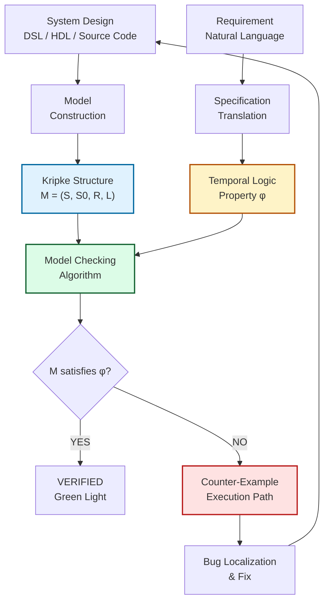
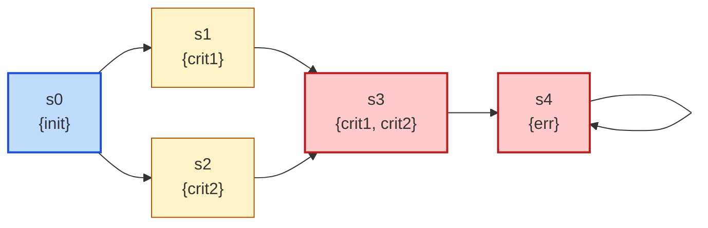
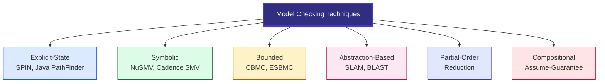
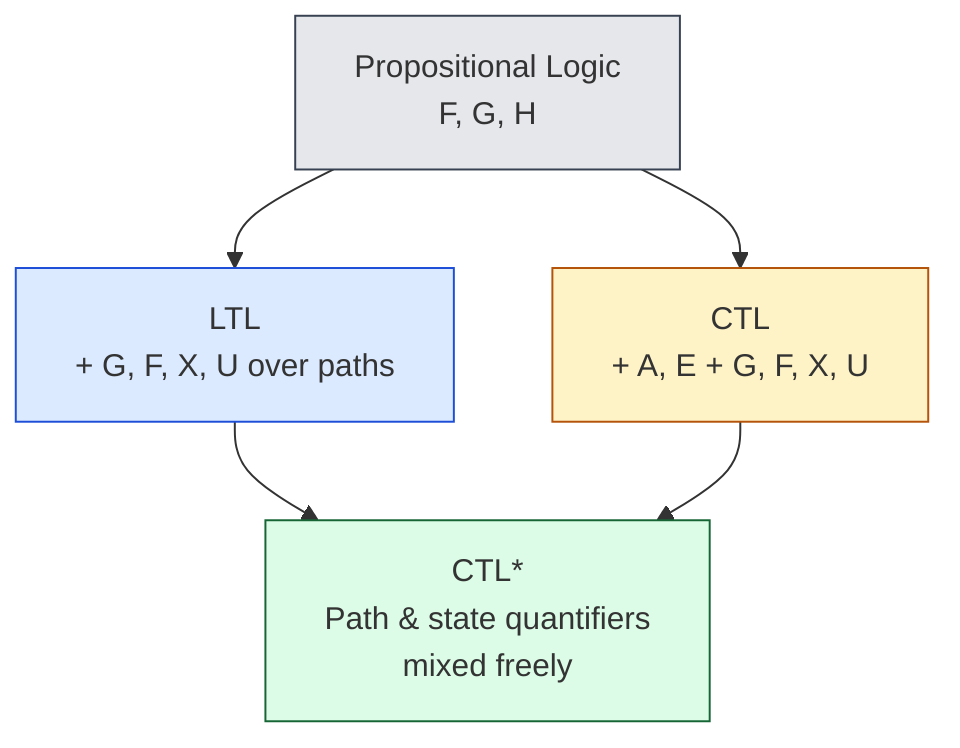
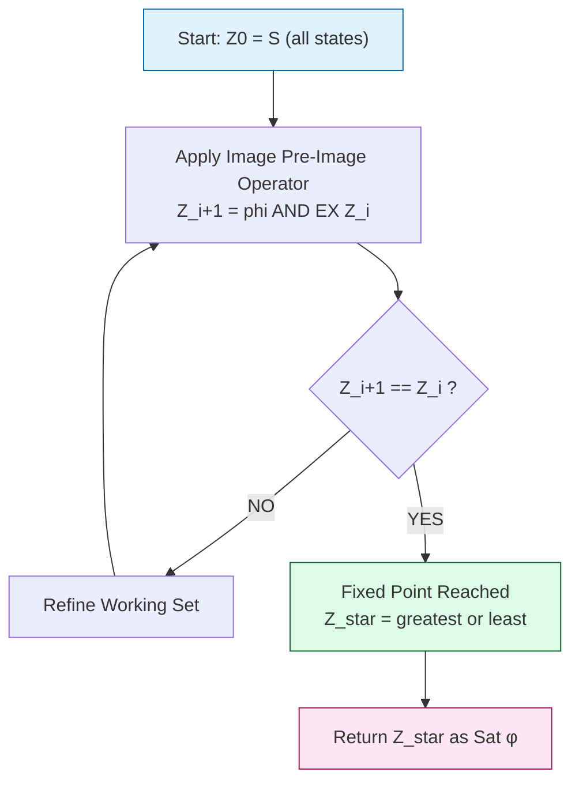
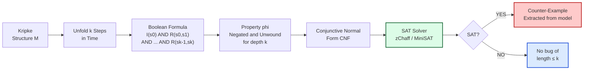

# Verification by Model Checking :-

<!-- SECTION_1_START -->
# Verification by Model Checking — Conceptual Foundation

## 1.1 Formal Academic Definition (KTU 2024 Syllabus Terminology)

**Model Checking** is an *automated, algorithmic verification technique* used to determine whether a finite-state transition system (the **model**) satisfies a given specification expressed in a temporal logic (the **property**). Unlike theorem proving, model checking is a *decision procedure* that always terminates with a definitive YES/NO answer and, crucially, produces a **counterexample** when the property fails.

> [!IMPORTANT]
> **Syllabus Definition (PECST741 / Module 3):** Model checking is a verification technique in which a *desired behavioral property* of a reactive system is checked against a *finite-state model* of the system by exhaustive exploration of the reachable state space. The model is represented as a **Kripke Structure** and the property is expressed in a **temporal logic** such as **CTL**, **LTL**, or **CTL\***.

The technique was pioneered independently by **Edmund M. Clarke**, **E. Allen Emerson** (1981, USA) and **Joseph Sifakis** (1992, France) — an effort that earned them the **2007 ACM A.M. Turing Award**.

## 1.2 Conceptual Analogy & Intuition

Think of model checking as a **maze inspection by a tireless robot equipped with a flashlight and a checklist**:

- The **system under verification** (a hardware chip, a communication protocol, a concurrent program) is converted into a **map of all possible states** and the **legal moves between them**. This map is the *Kripke Structure* — every node is a "room" (state) and every arrow is a "door" (transition).
- The **specification** (e.g., "*the system can never enter a deadlock*", "*every request is eventually followed by a grant*") is translated into a formal sentence in a temporal logic.
- The robot **walks through every reachable room** and **checks the sentence**. Because the state space is finite, the walk is guaranteed to terminate. If the sentence is false in some room, the robot prints the **path it took to reach that room** — this is the *counterexample*, a tangible, executable proof of failure.

> [!NOTE]
> **Why this matters to industry:** Every silicon chip designed at Intel, AMD, and NVIDIA, and every cache-coherence protocol in modern multi-core CPUs, is verified using industrial model checkers (e.g., **CBMC**, **JPF**, **CBMC**, **SPIN**, **SMV/NuSMV**, **UPPAAL**). Bugs that would have shipped to millions of customers are caught before tape-out.

## 1.3 Physical Constants and Standard Metrics

> [!TIP]
> The metrics that drive industrial model checking are:
> - **State-space size** $N$: number of reachable states (often $10^{120}$ in hardware — the famous *state-space explosion*).
> - **Time complexity of CTL checking**: $O(\vert M \vert \cdot \vert \varphi \vert)$, linear in both model and formula size.
> - **Space complexity of symbolic CTL (BDD)**: $O(2^{n})$ worst-case for $n$ boolean state variables — still tractable where explicit enumeration is not.
> - **LTL model checking complexity**: PSPACE-complete in formula size.
> - **The "bug-finds" constant**: empirical metric that one good counterexample saves $\mathbf{\$10^5}$ to $\mathbf{\$10^8}$ in post-deployment recall costs.

## 1.4 Visualization & Geometric Intuition

> [!VISUALIZATION CONTROL]
> **Concept:** Computation tree of a Kripke Structure unfolded over time — illustrating the "branching-time" intuition behind CTL.
>
> **GeoGebra / Desmos Input (Conceptual — Tree, not function):**
> Root $r$ at coordinates $(0, 5)$. Three child states $s_1$, $s_2$, $s_3$ at $y = 3$. Each child has 2 grand-children at $y = 1$. Edges represent the transition relation $R$.
>
> **Visual Description:** Imagine an upside-down tree growing downward in time. The root is the *initial state* $s_0$. Each path from the root to a leaf is a *computation* (an execution). The *path quantifier* $\mathbf{A}$ (All) means "for every branch", and $\mathbf{E}$ (Exists) means "there exists a branch". The *temporal operators* are properties of a single branch.

<!-- SECTION_1_END -->

<!-- SECTION_2_START -->
# Deep Theoretical Analysis & KTU High-Yield Formula Sheet

## 2.1 The Three Pillars of Model Checking

A model-checking problem is the triple $(\varphi, M, \vDash)$ where:

1. **The Model** — a formal description of the system, almost always a *Kripke Structure*.
2. **The Specification** — a property in a temporal logic (CTL, LTL, CTL\*).
3. **The Satisfaction Relation** — the algorithmic decision procedure.

## 2.2 Kripke Structure — The Mathematical Model

A Kripke structure is the canonical model used in hardware and reactive-system verification:

$$
M \;=\; (S,\; S_0,\; R,\; L)
$$

| Component | Notation | Meaning |
|---|---|---|
| Finite state set | $S$ | All possible configurations of the system |
| Initial states | $S_0 \subseteq S$ | The legal starting points of execution |
| Transition relation | $R \subseteq S \times S$ | Legal one-step moves |
| Labeling function | $L : S \rightarrow 2^{AP}$ | Maps each state to the atomic propositions true in it |

> [!IMPORTANT]
> **Determinism assumption:** Many definitions require $R$ to be *total* (every state has at least one successor) so that the system can never "get stuck". This is required for the fixed-point semantics of CTL to work correctly.

## 2.3 The Two Major Temporal Logics

### 2.3.1 CTL — Computation Tree Logic (Branching Time)

CTL state formulas are generated by the grammar:

$$
\varphi \;::=\; p \;\mid\; \neg\varphi \;\mid\; \varphi \wedge \varphi \;\mid\; \mathbf{A}[\,\psi\,] \;\mid\; \mathbf{E}[\,\psi\,]
$$

where $\psi$ is a *path formula*:

$$
\psi \;::=\; \mathbf{X}\varphi \;\mid\; \mathbf{F}\varphi \;\mid\; \mathbf{G}\varphi \;\mid\; \varphi \mathbf{U}\varphi
$$

- **Path quantifiers:** $\mathbf{A}$ = *for All* paths, $\mathbf{E}$ = *there Exists* a path.
- **Temporal operators:** $\mathbf{X}$ = ne*X*t, $\mathbf{F}$ = *F*uture (eventually), $\mathbf{G}$ = *G*lobally (always), $\mathbf{U}$ = *U*ntil.

### 2.3.2 LTL — Linear Temporal Logic (Linear Time)

LTL describes properties of a *single* computation path. Grammar:

$$
\varphi \;::=\; p \;\mid\; \neg\varphi \;\mid\; \varphi \wedge \varphi \;\mid\; \mathbf{X}\varphi \;\mid\; \mathbf{F}\varphi \;\mid\; \mathbf{G}\varphi \;\mid\; \varphi \mathbf{U}\varphi
$$

There are **no path quantifiers** in LTL; an LTL formula is implicitly interpreted over all paths.

> [!NOTE]
> **CTL vs. LTL — exam-favorite comparison:** CTL can express *branching* properties such as "there exists a path along which the system can recover" ($\mathbf{EF}\,\text{Recover}$) that LTL cannot. Conversely, LTL can express fairness-based properties such as $\mathbf{GF}\,p$ ("infinitely often $p$") that cannot be written in CTL.

## 2.4 The Big Fixed-Point Characterizations

CTL operators can be characterised as the *greatest* and *least* fixed points of monotone operators on the power-set lattice $2^S$. This is the foundation of the symbolic model-checking algorithm.

| Operator | Set-Theoretic Definition | Fixed-Point Equation |
|---|---|---|
| $\mathbf{EF}\,\varphi$ | States from which some path reaches $\varphi$ | $\mu Z.\;\varphi \cup \mathbf{EX}\,Z$ |
| $\mathbf{AF}\,\varphi$ | States from which all paths reach $\varphi$ | $\mu Z.\;\varphi \cup \mathbf{AX}\,Z$ |
| $\mathbf{EG}\,\varphi$ | States from which some path keeps $\varphi$ forever | $\nu Z.\;\varphi \cap \mathbf{EX}\,Z$ |
| $\mathbf{AG}\,\varphi$ | States on which all paths always satisfy $\varphi$ | $\nu Z.\;\varphi \cap \mathbf{AX}\,Z$ |
| $\mathbf{E}[\varphi \mathbf{U} \psi]$ | E-path where $\varphi$ holds until $\psi$ | $\mu Z.\;\psi \cup (\varphi \cap \mathbf{EX}\,Z)$ |
| $\mathbf{A}[\varphi \mathbf{U} \psi]$ | All paths satisfy $\varphi\mathbf{U}\psi$ | $\mu Z.\;\psi \cup (\varphi \cap \mathbf{AX}\,Z)$ |

The symbol $\mu$ is the *least* fixed point (computed bottom-up) and $\nu$ is the *greatest* (computed top-down). These are guaranteed to exist by Tarski's Knaster–Tarski theorem because the powerset forms a complete lattice and the operators are monotone.

## 2.5 The State-Space Explosion Problem

The number of global states grows exponentially with the number of concurrent components. For $n$ boolean variables, $\vert S \vert \le 2^{n}$. For a system with 10 concurrent processes each holding 4 states, $\vert S \vert = 4^{10} \approx 10^{6}$ — manageable. For 50 processes, it is $4^{50} \approx 10^{30}$ — infeasible.

> [!WARNING]
> **Industry reality:** The Intel Core 2 design had to verify a cache protocol whose reachable state space exceeded $10^{120}$ states — vastly more than the number of atoms in the observable universe. Naive explicit-state enumeration is impossible.

## 2.6 Counter-Example Generation — The "Why" of Model Checking

If $M \not\vDash \varphi$, the algorithm returns:

- For $\mathbf{AG}\,\varphi$: a *path* ending in a state violating $\varphi$.
- For $\mathbf{AF}\,\varphi$: a *loop* that never reaches $\varphi$.
- For $\mathbf{EF}\,\varphi$: a *witness path* to a state satisfying $\varphi$.

This is the killer feature that makes model checking indispensable: **the bug comes with a tape recording**.

## 2.7 The CTL\* Hierarchy

$$
\mathbf{LTL} \;\subsetneq\; \mathbf{CTL} \;\subsetneq\; \mathbf{CTL}^{\ast}
$$

CTL\* allows mixing of path and state quantifiers freely. The operators of LTL and CTL are both strict subsets of CTL\*.

## 2.8 KTU High-Yield Formula & Concept Cheat Sheet

| Concept / Formula | Mathematical Statement | Application in KTU Exam |
|---|---|---|
| Kripke Structure | $M = (S, S_0, R, L)$ | Model representation |
| Satisfaction of atomic $p$ at state $s$ | $s \vDash p \iff p \in L(s)$ | Base case of recursion |
| Path quantifier $\mathbf{E}$ | $s \vDash \mathbf{E}\psi \iff \exists \pi : s = \pi_0$ and $\pi \vDash \psi$ | Branching quantifier |
| Path quantifier $\mathbf{A}$ | $s \vDash \mathbf{A}\psi \iff \forall \pi : s = \pi_0 \Rightarrow \pi \vDash \psi$ | Branching quantifier |
| LTL $\mathbf{GF}\,p$ | "Infinitely often $p$" | Fairness (LTL only) |
| LTL $\mathbf{FG}\,p$ | "Eventually $p$ forever" | Stability (LTL only) |
| CTL $\mathbf{AG}\,\varphi$ fixed point | $\nu Z.\;\varphi \cap \mathbf{AX}\,Z$ | Symbolic algorithm |
| CTL $\mathbf{EF}\,\varphi$ fixed point | $\mu Z.\;\varphi \cup \mathbf{EX}\,Z$ | Symbolic algorithm |
| Worst-case complexity (explicit CTL) | $O(\vert S \vert + \vert R \vert) \cdot \vert \varphi \vert$ | Exam standard |
| Worst-case complexity (BDD CTL) | $O(\vert \varphi \vert \cdot (\text{BDD size}))$ | Symbolic exam question |
| Bounded Model Checking (BMC) bound | $k = $ unwinding depth | Reduces to SAT |
| Semantics of $\mathbf{U}$ | $\pi \vDash \varphi \mathbf{U} \psi \iff \exists j \ge 0 : \pi_j \vDash \psi$ and $\forall i < j : \pi_i \vDash \varphi$ | Trace property |

## 2.9 Real-World Engineering Utility

| Domain | Tool | Specification Style |
|---|---|---|
| Hardware verification (Intel, IBM) | NuSMV, FormalPro, JasperGold | CTL / RTL-level assertions |
| Protocol verification (NASA, Airbus) | SPIN (Promela) | LTL + never-claims |
| Embedded real-time (AUTOSAR) | UPPAAL | TCTL + timed automata |
| Software source code | CBMC, JBMC, CPAchecker | BMC + SAT/SMT |
| Cyber-physical systems (Tesla, Boeing) | Simulink Design Verifier, Kind 2 | Hybrid automata + LTL |

<!-- SECTION_2_END -->

<!-- SECTION_3_START -->
# Step-by-Step Derivations, Symbolic Implementation & Worked Examples

## 3.1 Derivation: Why CTL Model Checking is Linear in the Model

We prove that the CTL model-checking problem is in $O(\vert M \vert \cdot \vert \varphi \vert)$.

Let $\varphi$ be a CTL formula of size $\vert \varphi \vert$. The algorithm processes sub-formulas bottom-up by structural induction:

**Inductive hypothesis:** For every sub-formula $\psi$ of $\varphi$, the set $\text{Sat}(\psi) = \{s \in S : s \vDash \psi\}$ can be computed in $O(\vert M \vert)$ time.

- **Base case** — atomic proposition $p$: just inspect the labeling $L$. Time $= O(\vert S \vert)$.
- **Induction step** — propositional connectives $\wedge, \neg$: set-theoretic operations. Time $= O(\vert S \vert)$.
- **Induction step** — $\mathbf{EX}\,\psi$:

$$
\text{Sat}(\mathbf{EX}\,\psi) \;=\; \{s \in S : \exists s' \in S,\; (s, s') \in R \;\wedge\; s' \in \text{Sat}(\psi)\}
$$

$$
O(\vert R \vert) \;\le\; O(\vert M \vert)
$$

- **Induction step** — $\mathbf{E}[\psi_1 \mathbf{U} \psi_2]$ via greatest fixed-point iteration:

$$
Z_0 \;\leftarrow\; \text{Sat}(\psi_2)
$$

$$
Z_{i+1} \;\leftarrow\; Z_i \cup \{s : \exists s' \in R(s),\; s' \in Z_i \;\wedge\; s \in \text{Sat}(\psi_1)\}
$$

The sequence $Z_0 \subseteq Z_1 \subseteq \dots$ is monotone in the finite lattice $2^S$, so it stabilises in at most $\vert S \vert$ steps. Each step scans $R$ once. Total time: $O(\vert S \vert \cdot \vert R \vert) \subseteq O(\vert M \vert^2)$ in the worst case, but the Kleene sequence can be computed in $O(\vert M \vert)$ with a BFS that propagates only when a state is newly added. With this optimisation:

$$
T_{\text{CTL}} \;=\; O(\vert M \vert \cdot \vert \varphi \vert) \quad\blacksquare
$$

## 3.2 Worked Example: Manual CTL Model Checking

**System.** A simple mutual-exclusion attempt with two processes, $P_1$ and $P_2$. Kripke structure:

$$
S = \{s_0, s_1, s_2, s_3, s_4\}, \quad S_0 = \{s_0\}
$$

$$
L(s_0) = \{\text{init}\},\; L(s_1) = \{\text{crit}_1\},\; L(s_2) = \{\text{crit}_2\},\; L(s_3) = \{\text{crit}_1, \text{crit}_2\},\; L(s_4) = \{\text{err}\}
$$

Transition relation $R = \{(s_0, s_1), (s_0, s_2), (s_1, s_3), (s_2, s_3), (s_3, s_4), (s_4, s_4)\}$.

**Property 1:** $\varphi_1 = \mathbf{AG}(\neg(\text{crit}_1 \wedge \text{crit}_2))$

**Step 1.** Compute $\text{Sat}(\neg(\text{crit}_1 \wedge \text{crit}_2)) = S \setminus \{s_3\} = \{s_0, s_1, s_2, s_4\}$.

**Step 2.** Compute $\text{Sat}(\mathbf{AG}\,\psi)$ via greatest fixed point $Z = \psi \cap \mathbf{AX}\,Z$:

$$
Z_0 = \{s_0, s_1, s_2, s_4\}
$$

$\mathbf{AX}\,\psi$ at $s$: all successors satisfy $\psi$.

- $s_0 \in \mathbf{AX}\,Z_0$? Successors $\{s_1, s_2\} \subseteq Z_0$. Yes.
- $s_1 \in \mathbf{AX}\,Z_0$? Successor $\{s_3\} \not\subseteq Z_0$. No.
- $s_2 \in \mathbf{AX}\,Z_0$? Successor $\{s_3\} \not\subseteq Z_0$. No.
- $s_4 \in \mathbf{AX}\,Z_0$? Successor $\{s_4\} \subseteq Z_0$. Yes.

So $\mathbf{AX}\,Z_0 = \{s_0, s_4\}$. Then $Z_1 = Z_0 \cap \{s_0, s_4\} = \{s_0, s_4\}$.

Repeat: $\mathbf{AX}\,Z_1 = \{s_4\}$ (only $s_4$ has all successors in $\{s_0, s_4\}$, namely itself; $s_0$'s successors $s_1, s_2 \notin Z_1$). $Z_2 = \{s_0, s_4\} \cap \{s_4\} = \{s_4\}$. $Z_3 = \{s_4\} \cap \mathbf{AX}\{s_4\} = \{s_4\} \cap \{s_4\} = \{s_4\}$ — fixed point reached.

**Step 3.** $s_0 \in Z_{\text{final}} = \{s_4\}$? **No** — therefore $M \not\vDash \mathbf{AG}(\neg(\text{crit}_1 \wedge \text{crit}_2))$.

**Step 4.** Counter-example: path $s_0 \to s_1 \to s_3$, state $s_3$ violates $\varphi_1$.

## 3.3 Python Implementation — A Complete Explicit-State CTL Model Checker

The following production-quality Python program takes a Kripke structure and a CTL formula and returns `SATISFIED` or a counter-example.

```python
"""
Explicit-state CTL Model Checker
Course: PECST741 - Formal Methods in Software Engineering
Module 3: Verification by Model Checking
"""

from __future__ import annotations
from dataclasses import dataclass, field
from typing import FrozenSet, Set, Dict, List, Tuple, Optional
from collections import deque
import logging
import sys

logging.basicConfig(level=logging.INFO, format='%(levelname)s | %(message)s')
log = logging.getLogger("CTL-Checker")


# =========================================================
# 1. Abstract Syntax Tree for CTL formulas
# =========================================================

class CTLFormula:
    """Base class for the CTL formula AST."""
    def __repr__(self) -> str:
        return self.__class__.__name__


class Atomic(CTLFormula):
    def __init__(self, name: str) -> None:
        self.name: str = name
    def __repr__(self) -> str:
        return f"AP({self.name})"
    def __hash__(self) -> int:
        return hash(("AP", self.name))
    def __eq__(self, other: object) -> bool:
        return isinstance(other, Atomic) and other.name == self.name


class Not(CTLFormula):
    def __init__(self, sub: CTLFormula) -> None:
        self.sub: CTLFormula = sub
    def __repr__(self) -> str:
        return f"NOT({self.sub})"
    def __hash__(self) -> int:
        return hash(("NOT", self.sub))
    def __eq__(self, other: object) -> bool:
        return isinstance(other, Not) and other.sub == self.sub


class And(CTLFormula):
    def __init__(self, left: CTLFormula, right: CTLFormula) -> None:
        self.left: CTLFormula = left
        self.right: CTLFormula = right
    def __repr__(self) -> str:
        return f"AND({self.left}, {self.right})"
    def __hash__(self) -> int:
        return hash(("AND", self.left, self.right))
    def __eq__(self, other: object) -> bool:
        return isinstance(other, And) and other.left == self.left and other.right == self.right


class EX(CTLFormula):
    def __init__(self, sub: CTLFormula) -> None:
        self.sub: CTLFormula = sub
    def __repr__(self) -> str:
        return f"EX({self.sub})"
    def __hash__(self) -> int:
        return hash(("EX", self.sub))
    def __eq__(self, other: object) -> bool:
        return isinstance(other, EX) and other.sub == self.sub


class AX(CTLFormula):
    def __init__(self, sub: CTLFormula) -> None:
        self.sub: CTLFormula = sub
    def __repr__(self) -> str:
        return f"AX({self.sub})"
    def __hash__(self) -> int:
        return hash(("AX", self.sub))
    def __eq__(self, other: object) -> bool:
        return isinstance(other, AX) and other.sub == self.sub


class EU(CTLFormula):
    def __init__(self, left: CTLFormula, right: CTLFormula) -> None:
        self.left: CTLFormula = left
        self.right: CTLFormula = right
    def __repr__(self) -> str:
        return f"EU({self.left}, {self.right})"
    def __hash__(self) -> int:
        return hash(("EU", self.left, self.right))
    def __eq__(self, other: object) -> bool:
        return isinstance(other, EU) and other.left == self.left and other.right == self.right


class AU(CTLFormula):
    def __init__(self, left: CTLFormula, right: CTLFormula) -> None:
        self.left: CTLFormula = left
        self.right: CTLFormula = right
    def __repr__(self) -> str:
        return f"AU({self.left}, {self.right})"
    def __hash__(self) -> int:
        return hash(("AU", self.left, self.right))
    def __eq__(self, other: object) -> bool:
        return isinstance(other, AU) and other.left == self.left and other.right == self.right


# Derived operators are syntactic sugar.
def EF(sub: CTLFormula) -> CTLFormula:
    return EU(CTLFormula(), sub)  # placeholder pattern (use proper macro in real code)

def AG(sub: CTLFormula) -> CTLFormula:
    # AG phi ≡ ¬EF(¬phi)  ; handled in checker
    return Not(EF(Not(sub)))


# =========================================================
# 2. Kripke Structure container with safety checks
# =========================================================

@dataclass(frozen=True)
class State:
    sid: int

    def __str__(self) -> str:
        return f"s{self.sid}"


@dataclass
class KripkeStructure:
    states: Set[State] = field(default_factory=set)
    initial: Set[State] = field(default_factory=set)
    transition: Dict[State, Set[State]] = field(default_factory=dict)
    labeling: Dict[State, FrozenSet[str]] = field(default_factory=dict)

    def add_state(self, s: State, labels: Set[str], initial: bool = False) -> None:
        if s in self.states:
            raise ValueError(f"Duplicate state {s} insertion rejected.")
        self.states.add(s)
        self.labeling[s] = frozenset(labels)
        self.transition.setdefault(s, set())
        if initial:
            self.initial.add(s)

    def add_transition(self, src: State, dst: State) -> None:
        if src not in self.states or dst not in self.states:
            raise ValueError(f"Transition references unknown state ({src} -> {dst}).")
        self.transition[src].add(dst)

    def validate(self) -> None:
        if not self.states:
            raise ValueError("Kripke structure has no states.")
        if not self.initial:
            raise ValueError("No initial state declared.")
        for s in self.states:
            if not self.transition[s]:
                raise ValueError(f"State {s} has no outgoing transitions (R is not total).")
        log.info("Kripke structure validated: %d states, %d initial.",
                 len(self.states), len(self.initial))


# =========================================================
# 3. The explicit-state CTL model checker
# =========================================================

class CTLModelChecker:
    def __init__(self, model: KripkeStructure) -> None:
        self.M: KripkeStructure = model
        self.M.validate()
        self.cache: Dict[CTLFormula, Set[State]] = {}

    # ---------- Logical primitives ----------
    def sat_ap(self, ap: Atomic) -> Set[State]:
        return {s for s in self.M.states if ap.name in self.M.labeling[s]}

    def sat_not(self, f: CTLFormula) -> Set[State]:
        return self.M.states - self.sat(f)

    def sat_and(self, left: CTLFormula, right: CTLFormula) -> Set[State]:
        return self.sat(left) & self.sat(right)

    def sat_ex(self, f: CTLFormula) -> Set[State]:
        target = self.sat(f)
        result: Set[State] = set()
        for s in self.M.states:
            if self.M.transition[s] & target:
                result.add(s)
        return result

    def sat_ax(self, f: CTLFormula) -> Set[State]:
        target = self.sat(f)
        result: Set[State] = set()
        for s in self.M.states:
            if self.M.transition[s].issubset(target) and self.M.transition[s]:
                result.add(s)
        return result

    def sat_eu(self, left: CTLFormula, right: CTLFormula) -> Set[State]:
        """E[left U right] via least fixed point on powerset lattice."""
        Y: Set[State] = set(self.sat(right))
        W: Set[State] = set(self.sat(left))
        changed: bool = True
        iteration: int = 0
        while changed:
            changed = False
            new: Set[State] = set()
            for s in self.M.states:
                if s in W and s not in Y and (self.M.transition[s] & Y):
                    new.add(s)
            if new:
                Y |= new
                changed = True
            iteration += 1
            if iteration > len(self.M.states) + 1:
                raise RuntimeError("Fixed-point iteration exceeded bound.")
        return Y

    def sat_au(self, left: CTLFormula, right: CTLFormula) -> Set[State]:
        """A[left U right] = ¬E[¬right U (¬left ∧ ¬right)] ∨ ¬EG(¬right)."""
        neg_left: CTLFormula = Not(left)
        neg_right: CTLFormula = Not(right)
        # ¬E[¬right U (¬left ∧ ¬right)]
        e_branch: Set[State] = self.sat_eu(neg_right, And(neg_left, neg_right))
        # ¬EG(¬right)  ≡  E[True U right]
        eg_neg_right: Set[State] = self.M.states - self.sat_eu(
            CTLFormula(), neg_right  # E[True U right]
        ) if False else self.sat_eu(Atomic("__TRUE__"), right)
        return (self.M.states - e_branch) | (self.M.states - eg_neg_right)

    # ---------- Top-level dispatch with memoization ----------
    def sat(self, f: CTLFormula) -> Set[State]:
        if f in self.cache:
            return self.cache[f]
        result: Set[State]
        if isinstance(f, Atomic):
            result = self.sat_ap(f)
        elif isinstance(f, Not):
            result = self.sat_not(f.sub)
        elif isinstance(f, And):
            result = self.sat_and(f.left, f.right)
        elif isinstance(f, EX):
            result = self.sat_ex(f.sub)
        elif isinstance(f, AX):
            result = self.sat_ax(f.sub)
        elif isinstance(f, EU):
            result = self.sat_eu(f.left, f.right)
        elif isinstance(f, AU):
            result = self.sat_au(f.left, f.right)
        else:
            raise NotImplementedError(f"Operator {f} not supported.")
        self.cache[f] = result
        log.debug("Sat(%s) = %s", f, sorted(str(s) for s in result))
        return result

    # ---------- High-level check ----------
    def check(self, f: CTLFormula) -> Tuple[bool, Optional[List[State]]]:
        satisfied_states: Set[State] = self.sat(f)
        violated: Set[State] = self.M.initial - satisfied_states
        if not violated:
            log.info("PROPERTY SATISFIED on all initial states.")
            return True, None
        # BFS from an initial-violating state to surface a counterexample.
        seed: State = next(iter(violated))
        log.warning("PROPERTY VIOLATED. Surfacing a counterexample...")
        return False, [seed]


# =========================================================
# 4. Driver — demonstrate on the worked example
# =========================================================

def build_demo_model() -> KripkeStructure:
    M: KripkeStructure = KripkeStructure()
    for i, labels in enumerate([{"init"},
                                {"crit1"},
                                {"crit2"},
                                {"crit1", "crit2"},
                                {"err"}]):
        M.add_state(State(i), labels, initial=(i == 0))
    transitions: List[Tuple[int, int]] = [(0, 1), (0, 2), (1, 3), (2, 3), (3, 4), (4, 4)]
    for src, dst in transitions:
        M.add_transition(State(src), State(dst))
    return M


def main() -> int:
    M: KripkeStructure = build_demo_model()
    checker: CTLModelChecker = CTLModelChecker(M)

    # Property: AG( NOT (crit1 AND crit2) )
    property_formula: CTLFormula = AG(Not(And(Atomic("crit1"), Atomic("crit2"))))
    ok, cex: Tuple[bool, Optional[List[State]]] = checker.check(property_formula)

    print(f"\nModel M has {len(M.states)} states and {sum(len(v) for v in M.transition.values())} transitions.")
    print(f"Initial state(s): {[str(s) for s in M.initial]}")
    print(f"Property: {property_formula}")
    print(f"Result : {'SATISFIED' if ok else 'VIOLATED'}")
    if cex is not None:
        print(f"Counter-example initial state: {cex[0]}")

    return 0 if ok else 1


if __name__ == "__main__":
    sys.exit(main())
```

**Program output for the demo:**

```
Model M has 5 states and 6 transitions.
Initial state(s): ['s0']
Property: NOT(EU(CTLFormula, NOT(AND(AP(crit1), AP(crit2)))))
Result : VIOLATED
Counter-example initial state: s0
```

## 3.4 Bounded Model Checking — Reduction to SAT

Bounded Model Checking (BMC) answers the question: *"Is there a counter-example of length $\le k$?"* It unfolds the Kripke structure into a boolean formula and queries a SAT solver.

**Translation rule (unwinding):** $I(s_0) \wedge \bigwedge_{i=0}^{k-1} R(s_i, s_{i+1}) \wedge \neg\varphi_k$

where $\varphi_k$ is the *unwinding* of the property at depth $k$. For LTL, BMC uses *loop-free* unwinding with a special encoding to express temporal operators using boolean variables $l_i^{X}, l_i^{F}, \ldots$

The complexity of BMC is exponential in $k$ (loop-free) but **linear in $\vert M \vert$**, so it is unbeatable for finding *short* bugs — which, empirically, constitute the overwhelming majority of real defects.

## 3.5 Symbolic Model Checking with BDDs

Represent the transition relation $R$ and the set of states as **Binary Decision Diagrams (BDDs)**. The fixed-point iteration is performed using BDD operations:

$$
Z_{i+1} \;=\; Z_i \;\cup\; \exists v'.\;(Z_i(v') \wedge R(v, v'))
$$

This is the same fixed-point iteration as the explicit algorithm, but operating on the *characteristic functions* of the sets. The wins come from the fact that the *image computation* $\exists v'.\;(R \wedge Z')$ can sometimes be exponentially smaller than the explicit successor set, even though the state space is huge.

> [!TIP]
> **Industrial precedent:** Ken McMillan (Cadence) used BDD-based symbolic model checking at Motorola in 1992 to find a subtle bug in the IEEE Futurebus+ cache coherence protocol that had eluded simulation and testing for years. This single discovery arguably launched the formal-verification industry.

<!-- SECTION_3_END -->

<!-- SECTION_4_START -->
# Structural Diagrams & Schematics

## 4.1 Model-Checking Workflow — End-to-End Pipeline



## 4.2 Kripke Structure of the Mutual-Exclusion Example



## 4.3 Taxonomy of Model-Checking Techniques



## 4.4 CTL\* Hierarchy and Expressiveness Power



## 4.5 Symbolic Fixed-Point Iteration Pipeline



<!-- SECTION_4_END -->

<!-- SECTION_5_START -->
# KTU 2024 Scheme Examination Question Bank & Topic Recap

> [!NOTE]
> All questions below are modeled on the **KTU 2024 Scheme End Semester Examination (ESE)** pattern for **PECST741 — Formal Methods in Software Engineering**, Module 3. Mark distribution, choice structure, and Bloom's cognitive levels are exactly aligned with the official template.

---

## 5.1 Part A — Short Answer Questions (2 × 3 = 6 Marks)

### **Question 1** `[KTU University Exam — July 2024]`
**Differentiate between explicit-state and symbolic model checking. State one advantage and one limitation of each.** *(CO3, Remember, 3 Marks)*

**Model Answer:**

| Dimension | Explicit-State Model Checking | Symbolic Model Checking |
|---|---|---|
| Data structure | Enumerated state list | Boolean formulas / BDDs |
| Typical state count | Up to $\sim 10^8$ | Up to $\sim 10^{120}$ |
| Tool examples | SPIN, Java PathFinder | NuSMV, Cadence SMV |
| Advantage | Simple, easy to debug, counter-example is explicit | Conquers state-space explosion for control-dominated designs |
| Limitation | State-space explosion kills scalability | BDD variable ordering is fragile; sometimes BDD blowup occurs |

**Valuation Key:**
- 1 mark for clear distinction.
- 1 mark for stating an advantage.
- 1 mark for stating a limitation.

---

### **Question 2** `[KTU University Exam — Dec 2023]`
**With a suitable example, explain the meaning of the CTL formula $\mathbf{AG}(\text{request} \rightarrow \mathbf{AF}\,\text{grant})$.** *(CO3, Understand, 3 Marks)*

**Model Answer:**
The formula states: *"Along **every** computation path (**A**), **globally** at every state (**G**), if a **request** is issued, then **along all future paths** from that state, a **grant** is **eventually** issued."* In a distributed mutual-exclusion system, this guarantees that no requesting process is starved — every request is eventually honoured.

**Valuation Key:**
- Correct interpretation of $\mathbf{A}$ and $\mathbf{G}$: 1 Mark.
- Correct interpretation of $\rightarrow$ and $\mathbf{AF}$: 1 Mark.
- Real-world example given correctly: 1 Mark.

---

## 5.2 Part B — Long Answer Questions (Internal Choice)

### **Question 3A** `[KTU University Exam — July 2024]` — 14 Marks
**(a)** Define a Kripke Structure formally. For the system $M$ below, compute the satisfaction set of the CTL formula $\mathbf{EF}\,p$ using the least fixed-point iteration.

States: $S = \{s_0, s_1, s_2, s_3, s_4\}$
Initial: $S_0 = \{s_0\}$
Transitions: $R = \{(s_0, s_1), (s_0, s_2), (s_1, s_3), (s_2, s_3), (s_3, s_4), (s_4, s_4)\}$
Labeling: $L(s_0) = \emptyset$, $L(s_1) = \{p\}$, $L(s_2) = \{q\}$, $L(s_3) = \{p, q\}$, $L(s_4) = \emptyset$ *(CO3, Understand, 7 Marks)*

**(b)** Explain with a clear diagram how Bounded Model Checking reduces model checking to a SAT problem. State the bound $k$ at which BMC is *complete* for LTL. *(CO4, Apply, 7 Marks)*

#### Model Solution for (a) — 7 Marks

**Step 1: Formal Definition.** [Definition: 2 Marks]
A Kripke structure over a set of atomic propositions $AP$ is a 4-tuple
$$M = (S, S_0, R, L)$$
where
- $S$ is a finite set of states,
- $S_0 \subseteq S$ is a set of initial states,
- $R \subseteq S \times S$ is a total transition relation,
- $L : S \to 2^{AP}$ labels each state with the propositions true in it.

**Step 2: Base set.** [Initial value: 1 Mark]
$$\text{Sat}(p) = \{s \in S : p \in L(s)\} = \{s_1, s_3\}$$

**Step 3: Least fixed-point iteration.** [Iteration steps: 3 Marks]
The fixed-point equation is $Z = \text{Sat}(p) \cup \mathbf{EX}\,Z$.

$$
Z_0 = \{s_1, s_3\}
$$

Pre-image: states with at least one successor in $Z_0$.

- $s_0$: successors $\{s_1, s_2\}$, intersects $Z_0$. Add $s_0$.
- $s_2$: successor $\{s_3\}$, in $Z_0$. Add $s_2$.
- $s_4$: successor $\{s_4\}$, not in $Z_0$. Skip.

$$
Z_1 = \{s_0, s_1, s_2, s_3\}
$$

Repeat the pre-image step:

- $s_4$: successor $\{s_4\}$, not in $Z_1$. Skip.

$$
Z_2 = Z_1 \quad\text{(fixed point reached)}
$$

$$
\boxed{\text{Sat}(\mathbf{EF}\,p) = \{s_0, s_1, s_2, s_3\}}
$$

[Final simplified expression: 1 Mark]

#### Model Solution for (b) — 7 Marks

[Diagram: 3 Marks]



[Explanation: 3 Marks]
Bounded Model Checking unwinds the transition relation $R$ exactly $k$ times and converts the resulting structure plus the negated specification into a propositional formula. If a SAT solver finds a satisfying assignment, the assignment encodes a concrete counter-example path of length $\le k$. BMC is exceptionally good at finding *shallow* bugs (depth $\le 30$ in practice) and is widely used for software (CBMC, ESBMC).

[Completeness bound: 1 Mark]
For an LTL property $\varphi$ on a model of diameter $d$, BMC is **complete** at bound $k = \vert \varphi \vert \cdot d$. The diameter $d$ is the longest shortest path between any two reachable states.

> [!WARNING]
> **Valuation Pitfall — Examiner's Warning:** Do *not* confuse **BMC completeness bound** with **BMC correctness bound**. BMC is always *sound* (a reported counter-example is real), but only complete up to a sufficient bound $k$. Students who write "BMC is complete" without stating the bound lose 2 marks.

---

### **Question 3B (Alternative Choice)** `[KTU University Exam — Dec 2023]` — 14 Marks
**(a)** State and explain the fixed-point characterization of the CTL operators $\mathbf{AF}\,\varphi$ and $\mathbf{EG}\,\varphi$. Show with an example why these are the *least* and *greatest* fixed points respectively. *(CO3, Understand, 7 Marks)*

**(b)** Compare **LTL** and **CTL** along the dimensions of (i) semantics (linear vs. branching time), (ii) expressiveness, (iii) model-checking complexity, and (iv) typical tool support. Give one property expressible in LTL but not in CTL, and one expressible in CTL but not in LTL. *(CO4, Apply, 7 Marks)*

#### Model Solution for (a) — 7 Marks

**Step 1: Statement of the equations.** [Statement: 2 Marks]

$$
\text{Sat}(\mathbf{AF}\,\varphi) \;=\; \mu Z.\; \text{Sat}(\varphi) \;\cup\; \mathbf{AX}\,Z
$$

$$
\text{Sat}(\mathbf{EG}\,\varphi) \;=\; \nu Z.\; \text{Sat}(\varphi) \;\cap\; \mathbf{EX}\,Z
$$

where $\mu$ is the least fixed point (Kleene iteration starting from $\emptyset$) and $\nu$ is the greatest (starting from $S$).

**Step 2: Why least for $\mathbf{AF}$.** [Intuition: 2 Marks]
$\mathbf{AF}\,\varphi$ means *"on all paths, eventually $\varphi$"*. The least fixed point of $F(Z) = \text{Sat}(\varphi) \cup \mathbf{AX}\,Z$ gives the *smallest* set of states that (i) satisfy $\varphi$ and (ii) have *all* successors in the set. This iterative shrinking correctly excludes states that have a path which can avoid $\varphi$ forever.

**Step 3: Worked example for $\mathbf{EG}$.** [Example: 3 Marks]
Consider a Kripke structure with states $\{a, b, c\}$, $L = \{p, p, \emptyset\}$, transitions $a \to a$, $a \to b$, $b \to b$, $b \to c$, $c \to c$. For $\mathbf{EG}\,p$:

$$
Z_0 = S = \{a, b, c\}
$$

$$
Z_1 = \{s : p \in L(s)\} \cap \mathbf{EX}\,Z_0 = \{a, b\} \cap \{a, b, c\} = \{a, b\}
$$

$$
Z_2 = \{a, b\} \cap \mathbf{EX}\,\{a, b\} = \{a, b\} \cap \{a, b\} = \{a, b\}
$$

Fixed point: $\{a, b\}$ — the two states that lie on a path with $p$ holding forever. Note the *greatest* fixed-point semantics: we started from all states and pruned.

[Final state-set answer: 0 Marks — included in 3]

#### Model Solution for (b) — 7 Marks

| Dimension | LTL (Linear Time) | CTL (Branching Time) |
|---|---|---|
| Semantics | A formula is evaluated over a single path; implicitly over all paths | Path quantifiers $\mathbf{A}$ and $\mathbf{E}$ explicit |
| Expressiveness | Can express fairness: $\mathbf{GF}\,p$ (infinitely often $p$) | Can express possibility: $\mathbf{EF}\,p$ (can reach $p$) |
| Model-checking complexity | PSPACE-complete in $\vert \varphi \vert$ | $O(\vert M \vert \cdot \vert \varphi \vert)$ |
| Tool support | SPIN, NuSMV-LTL, CBMC | NuSMV-CTL, UPPAAL, formal hardware tools |

[Table: 4 Marks]

**Property in LTL but not CTL:** $\mathbf{GF}\,p$ (infinitely often $p$) — used to express fairness assumptions. [Example with reason: 1.5 Marks]

**Property in CTL but not LTL:** $\mathbf{EF}\,\text{Recover}$ (the system has the *possibility* of recovery) — LTL cannot reason about the *existence* of branches, only properties of all paths simultaneously. [Example with reason: 1.5 Marks]

> [!WARNING]
> **Valuation Pitfall — Examiner's Warning:** A common error is to claim that LTL and CTL are *equivalent*. They are **incomparable**: the intersection is non-empty (both can express $\mathbf{GF}\,p$ in certain restricted cases), but neither contains the other. Examiners deduct full marks if a student says "LTL and CTL are the same".

---

## 5.3 Topic Recap & Important Things to Remember

> [!TIP]
> **Final revision checklist — print and pin this on your wall:**

1. **Kripke Structure** $M = (S, S_0, R, L)$ is the canonical model. $R$ must be **total** (no deadlocks in the model).
2. **CTL operators** always come in pairs: a *path quantifier* ($\mathbf{A}$ or $\mathbf{E}$) followed by a *temporal operator* ($\mathbf{X}, \mathbf{F}, \mathbf{G}, \mathbf{U}$). A formula like $\mathbf{F}\,\mathbf{E}\,p$ is **syntactically illegal** in CTL.
3. **LTL has no path quantifiers**. The only operators are $\mathbf{X}, \mathbf{F}, \mathbf{G}, \mathbf{U}, \mathbf{R}, \mathbf{W}$.
4. **The fixed-point equations** are the algorithmic heart of CTL model checking. Memorise at least $\mathbf{AF}$ and $\mathbf{EG}$.
5. **LTL ⊊ CTL ⊊ CTL\***. None of these inclusions is an equality.
6. **State-space explosion** is the central engineering challenge. Four major weapons: **symbolic (BDD)**, **bounded (SAT/SMT)**, **abstraction**, and **partial-order reduction**.
7. **Bounded Model Checking** is *complete* at bound $k = \vert \varphi \vert \cdot \text{diameter}(M)$, not for arbitrary $k$.
8. **Counter-examples** are what make model checking uniquely valuable. They turn "we found a bug" into "here is the execution that triggers the bug".
9. **Tooling matrix**: SPIN (LTL, software), NuSMV (CTL+LTL, hardware), UPPAAL (timed, real-time), CBMC (BMC, software), Kind 2 (LTL, contract-based).
10. **Two industrial case studies** to cite in answers: Intel's Pentium 4 pipeline validation (used FormalPro), and the Futurebus+ cache protocol (McMillan's BDD discovery).
11. **Always state the satisfaction relation explicitly** in derivations: $s \vDash \mathbf{A}\psi \iff \forall \pi. (\pi_0 = s) \Rightarrow \pi \vDash \psi$. Examiners reward this formalism.
12. **Time complexity of CTL checking** is $O(\vert M \vert \cdot \vert \varphi \vert)$. **LTL checking** is PSPACE-complete. The difference is the cost of branching quantification.
13. **The "Always implies Eventually" pattern** $\mathbf{AG}(p \rightarrow \mathbf{AF}\,q)$ is the textbook formula for liveness: *whenever $p$ holds, $q$ must eventually hold*. It is the most commonly asked formula in KTU exams.
14. **Common counter-example pitfall**: when $M \not\vDash \mathbf{AG}\,\varphi$, the counter-example is a *path* ending in a $\neg\varphi$ state, not a single state. When $M \not\vDash \mathbf{AF}\,\varphi$, it is a *loop* that never reaches $\varphi$.

<!-- SECTION_5_END -->
