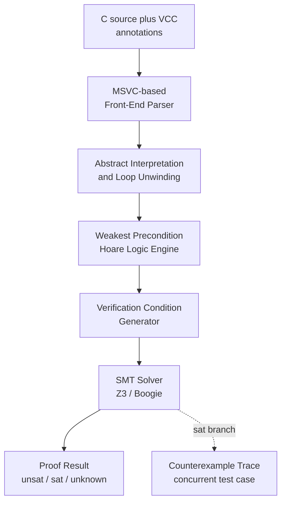
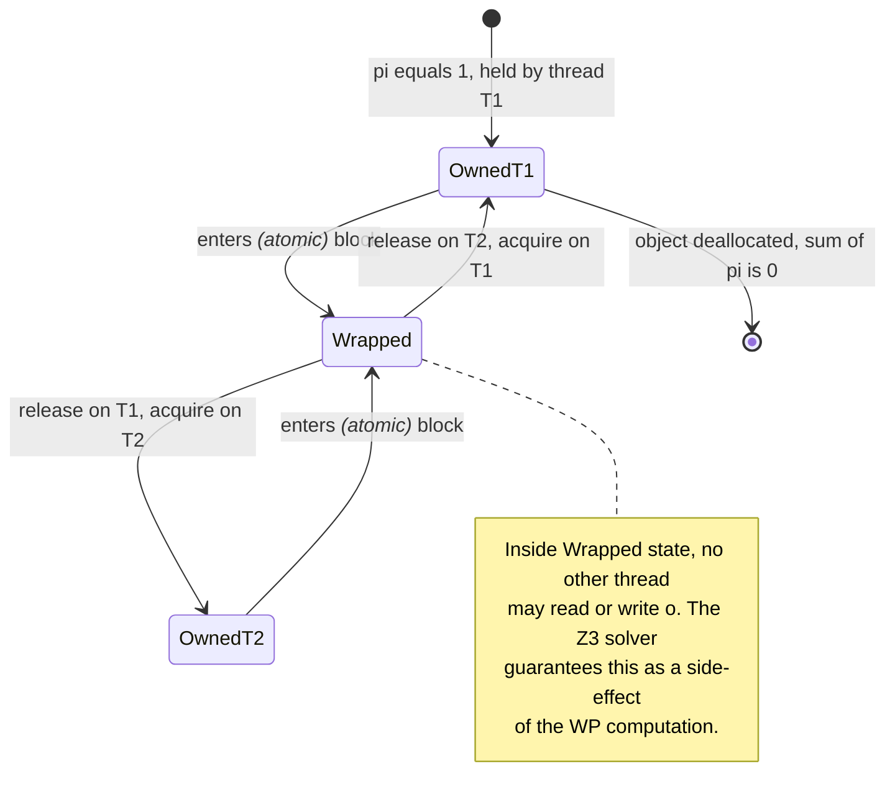
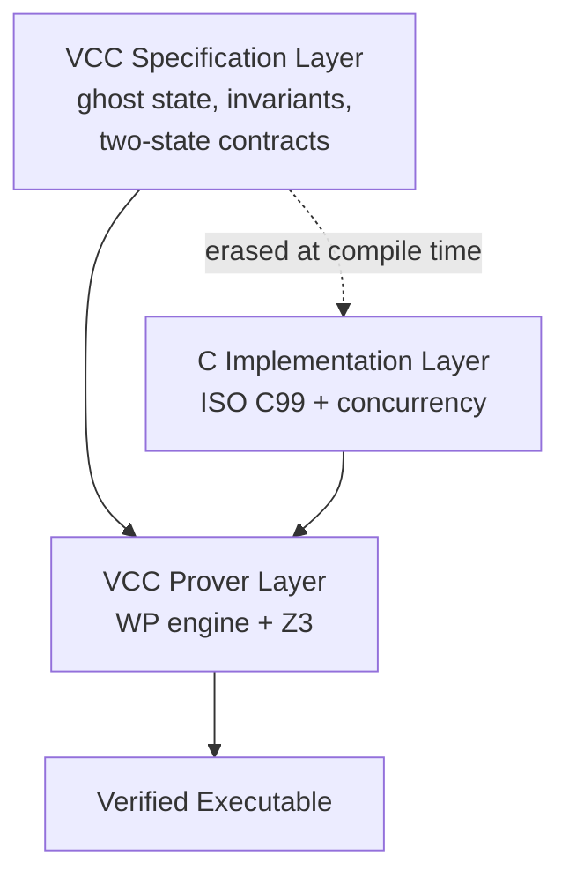

# Verifier for Concurrent C (VCC): a Hoare-Triple- based tool for Verifying Concurrent C

<!-- SECTION_1_START -->
# Verifier for Concurrent C (VCC) — A Hoare-Triple-Based Tool

## 1.1 Formal Definition (KTU 2024 Syllabus Terminology)

**Verifier for Concurrent C (VCC)** is a *sound, modular, deductive verification tool* for low-level, concurrent, systems-level C code, developed at **Microsoft Research** (Dahlweid, Cohen, Huuck, Leino, Moskal, Schulte, Tobies, 2009). It logically extends Floyd–Hoare axiomatic semantics to the full **ISO C99** language augmented with built-in concurrency primitives, custom contracts, ghost state, and an *ownership-based* modular reasoning discipline.

> [!IMPORTANT]
> **Core Definition (Board Examiner Standard):**
> VCC is a *Hoare-style* verifier that maps every C statement to a logical proof obligation expressed as a **Hoare triple** of the form $\lbrace P \rbrace\ S\ \lbrace Q \rbrace$, where $P$ is the precondition, $S$ is the C statement, and $Q$ is the postcondition. It is the engine that **formally proved the functional correctness of the Microsoft Hyper-V hypervisor's core micro-kernel** (≈ 5,000 LOC of concurrent C).

## 1.2 Conceptual Analogy — The "Legal Contract" View

Imagine a **legal contract** drawn between two parties (a *caller* and a *function*). The contract reads:

> *"If the caller guarantees property **P** holds upon my door (precondition), I will deliver product **Q** when I open it (postcondition). If the caller breaks the promise, I am discharged from liability."*

In VCC, every C function is a *signatory party* to such a contract. The `requires` clause is the **incoming promise (precondition)**, the `ensures` clause is the **outgoing promise (postcondition)**, and the **loop invariant** is the *continually-renewable* contract that must be honoured every loop iteration. Concurrency in VCC is then enforced through an **ownership deed** — exactly one thread at a time may "own" a piece of heap memory and modify it, the way a sole proprietor can alter company records.

## 1.3 The Hoare Triple in One Line

The fundamental verification unit in VCC is:

$$
\lbrace P \rbrace\ S\ \lbrace Q \rbrace
$$

It formally asserts: *if the program state satisfies the predicate $P$ before executing statement $S$, and $S$ terminates, then the resulting state satisfies predicate $Q$.*

> [!NOTE]
> **Why This Matters for KTU:** Question banks frequently test the *composition rules* of Hoare triples (sequencing, consequence, disjunction) — these are precisely the inference rules VCC instantiates internally when it generates Verification Conditions (VCs) for the SMT solver **Z3**.

## 1.4 Real-World Engineering Footprint

| Domain | Where VCC Has Been Applied | Why Hoare Logic Fits |
|---|---|---|
| **Hypervisors** | Microsoft Hyper-V, 2010 | OS kernels need *complete* proof, not testing |
| **Device Drivers** | Windows kernel drivers | Concurrency + low-level pointer arithmetic |
| **Embedded Control** | VxWorks aerospace modules | No room for runtime cost of monitors |
| **Cryptographic Code** | Reference crypto libraries | Side-channel free reasoning |

> [!VISUALIZATION CONTROL]
> **Concept:** Logical flow of a single Hoare triple as a state-transition graph.
> **Desmos Input Equations:**
> * `P` → labelled point $(-2,\ 1)$ representing "pre-state"
> * `S` → labelled point $(0,\ 1)$ representing the transition arrow
> * `Q` → labelled point $(2,\ 1)$ representing "post-state"
> * Draw a directed edge `(-2,1) -> (0,1)` labelled "S executes" and a second edge `(0,1) -> (2,1)` labelled "Q holds".
> **Visual Description:** The student should see two points connected by a labelled arrow — a *discrete state transition*. If $P$ does not hold at the start, the entire obligation is *vacuous* (trivially true), the same way an unsigned contract is unenforceable.
<!-- SECTION_1_END -->

<!-- SECTION_2_START -->
# Deep Theoretical Analysis & KTU High-Yield Formula Sheet

## 2.1 The Architectural Stack of VCC

VCC is *not* a single algorithm; it is a **five-stage pipeline** built on classical Hoare logic extended for concurrency:

1. **Front-end (Microsoft MSVC-based parser)** — Accepts ISO C99 + VCC-specific *contract annotations* (`requires`, `ensures`, `writes`, `invariant`, `assert`).
2. **Abstract Interpretation Pass** — Generates a *Boolean-control-flow* model, computes loop unwindings, and identifies *admissible* state predicates.
3. **Weakest Precondition (WP) Engine** — Implements the classical **Dijkstra WP calculus** mechanically. For each statement, it computes the predicate that *must* hold *before* the statement to guarantee the desired *after*-state. This is the Hoare logic instantiation.
4. **Verification Condition (VC) Generator** — Emits first-order logical formulas encoding the proof obligations, using classical Hoare logic axioms plus concurrency extensions (ownership transfer, two-state invariants).
5. **SMT Solver (Z3 / Boogie)** — Discharges the VCs. If a VC is `unsat`, the obligation is proven; if `sat`, VCC reports a *counterexample trace* (a *concurrent test case*).

## 2.2 The VCC Annotation Vocabulary

| VCC Keyword | Logical Role | Where It Appears | Hoare-Logic Mapping |
|---|---|---|---|
| `requires P` | Function entry contract | Function header | Maps to the **precondition** $P$ of the triple |
| `ensures Q` | Function exit contract | Function header | Maps to the **postcondition** $Q$ of the triple |
| `writes set` | Frame condition | Function header | Limits which globals may change (separation logic flavour) |
| `invariant I` | Loop / object invariant | `while` headers, struct fields | Re-establishes Hoare-style partial correctness at every iteration |
| `assert R` | Intermediate proof step | Function body | Inline Hoare triple $\lbrace R \rbrace\ S\ \lbrace R' \rbrace$ |
| `ghost ...` | Auxiliary specification-only state | Anywhere | Erased before compilation; exists *only* for the prover |
| `volatile` | Atomicity marker | Wraps an expression | Treats the read/write as a single linearisable event |

## 2.3 The Ownership Model — The Heart of VCC's Concurrency

VCC augments classical Hoare logic with a **linear ownership discipline** that prevents data races at the logical level.

> [!IMPORTANT]
> **Ownership Invariant (Core Theorem):**
> A heap object may be *written to* by thread $T$ **if and only if** $T$ currently holds the **owning claim** on that object. The owning claim is transferred between threads only inside a `_wrapped(...)` block (an atomic section). All other accesses to non-owned memory are statically *forbidden* by the WP engine.

Formally, for every object $o$ and thread $\tau$, VCC maintains a *fractional permission* $\pi(o,\tau) \in \lbrace 0, 1 \rbrace$ such that:

$$
\sum_{\tau \in \text{Threads}} \pi(o,\tau) \;\leq\; 1
$$

A thread has **read access** iff $\pi(o,\tau) > 0$, and **write access** iff $\pi(o,\tau) = 1$.

## 2.4 Two-State Invariants (The "Relational" Hoare Logic)

For concurrent code, VCC introduces *two-state* contracts over **before** and **after** states of a function call:

$$
\backslash\text{old}(e) \quad\text{and}\quad \backslash\text{thread_local}(e)
$$

These let the verifier state properties like *"the lock is held when entering this function"*, which require comparing two program points — something single-state Hoare logic cannot do.

## 2.5 The Admissibility Rule

> [!NOTE]
> **Admissibility — Frequently Asked in KTU:**
> A *ghost field* or an *invariant predicate* $I$ is called **admissible** if, for every atomic statement $S$ in any other thread, $I$ is *preserved* unless the observing thread holds the relevant ownership. VCC requires every invariant to be admissible; otherwise it generates a *false-negative-free* warning so the developer adds a `volatile` annotation.

Mathematically, $I$ is admissible iff:

$$
\forall S,\ S\text{ atomic}:\ \big(I \wedge \text{pre}_S \big)\ \Rightarrow\ \text{wp}(S,\ I)
$$

## 2.6 KTU Formula Cheat Sheet

| # | Rule / Formula | Statement | When to Use |
|---|---|---|---|
| 1 | $\dfrac{\lbrace P \rbrace\ S\ \lbrace R \rbrace\ \ \ \lbrace R \rbrace\ T\ \lbrace Q \rbrace}{\lbrace P \rbrace\ S;\ T\ \lbrace Q \rbrace}$ | **Sequencing** | Two consecutive statements |
| 2 | $\dfrac{P \Rightarrow P' \ \ \ \lbrace P' \rbrace\ S\ \lbrace Q' \rbrace \ \ \ Q' \Rightarrow Q}{\lbrace P \rbrace\ S\ \lbrace Q \rbrace}$ | **Consequence** | Strengthen pre, weaken post |
| 3 | $\dfrac{\lbrace P \wedge B \rbrace\ S\ \lbrace Q \rbrace \ \ \ (P \wedge \neg B) \Rightarrow Q}{\lbrace P \rbrace\ \text{if}(B)\ S\ \lbrace Q \rbrace}$ | **Conditional** | Branching |
| 4 | $\dfrac{\lbrace I \wedge B \rbrace\ S\ \lbrace I \rbrace}{\lbrace I \rbrace\ \text{while}(B)\ S\ \lbrace I \wedge \neg B \rbrace}$ | **While / Invariant** | Loops |
| 5 | $\dfrac{\lbrace P \rbrace\ S\ \lbrace Q \rbrace \ \ \ \text{fresh}(x)}{\lbrace P \rbrace\ S\ \lbrace Q \rbrace}$ | **Frame (VCC `writes`)** | Modularity |
| 6 | $\pi(o,\tau) = 1 \Rightarrow \text{write-OK}(\tau,o)$ | **Ownership-Write** | Concurrency |
| 7 | $\pi(o,\tau) > 0 \Rightarrow \text{read-OK}(\tau,o)$ | **Ownership-Read** | Concurrency |
| 8 | $I$ admissible $\equiv \forall S_{\text{atomic}}:\ \text{wp}(S_{\text{atomic}}, I) \vee \pi(\text{obs}, \tau) = 0$ | **Admissibility** | Invariant design |

> [!IMPORTANT]
> **Engineering Significance:** Rules 6 and 7 are why VCC can statically *rule out* data races in concurrent C without a runtime race detector. The Hyper-V micro-kernel proof exploited this to certify **zero possible data race** on the verified fraction of the hypervisor — a guarantee *no amount of testing* could provide.
<!-- SECTION_2_END -->

<!-- SECTION_3_START -->
# Step-by-Step Derivations, Proof Obligations & C Code Annotations

## 3.1 Worked Derivation 1 — The Classical Hoare Triple for Assignment

We will derive, step by step, the **axiom of assignment** that VCC uses mechanically:

> *Goal:* Prove the *assign axiom* $\lbrace Q[x \mapsto e] \rbrace\ x = e\ \lbrace Q \rbrace$.

**Step 1 — Start with the postcondition.** We want $Q$ to hold *after* $x = e$ executes. That means in the pre-state, $Q$ must hold *with the future value of $x$* — which is $e$ — substituted in for $x$ wherever $x$ appears.

**Step 2 — Formal substitution.** Define $Q[x \mapsto e]$ as the predicate $Q$ with every *free* occurrence of $x$ syntactically replaced by $e$. Concretely:

$$
Q[x \mapsto e] \;\equiv\; Q\ \text{with}\ x\ \text{replaced by}\ e
$$

**Step 3 — Construct the Hoare triple.**

$$
\lbrace Q[x \mapsto e] \rbrace\ x = e;\ \lbrace Q \rbrace
$$

**Step 4 — Verify the proof in Z3 (the VCC backend).** Z3's quantifier-free theory of arrays (QF_AUFLIA) expands $Q[x \mapsto e]$ and confirms that substitution semantics preserve the *value* of $x$ after assignment. The VC is discharged, the triple is sound.

**Step 5 — Consequence for VCC users.** Every time you write `ensures x == \old(x) + 1;` after `x = x + 1;`, VCC internally applies the assignment axiom *backwards* to compute the weakest precondition $x = \old{x}+1$ in the pre-state. The user never sees the axiom, but the proof obligation is identical to Step 3.

## 3.2 Worked Derivation 2 — The Loop Invariant Rule for a Counter

Consider a function in VCC that sums an array of `n` integers concurrently using two threads (a *toy* version of Hyper-V's lock-free counters):

```c
typedef struct {
    int value;
    int upper_bound;
    vcc_invariant(value >= 0 && value <= upper_bound)
} SharedCounter;
```

**Step 1 — State the loop invariant.** For a producer thread incrementing `value` up to `upper_bound`:

$$
I \;\equiv\; 0 \leq \text{value} \leq \text{upper\_bound}
$$

**Step 2 — Apply the *while* rule (Rule 4 from §2.6).** To prove partial correctness, VCC must show:

$$
\lbrace I \wedge (\text{value} < \text{upper\_bound}) \rbrace\ \text{value} = \text{value} + 1;\ \lbrace I \rbrace
$$

**Step 3 — Mechanically expand using the assignment axiom.**

The postcondition is $I \equiv 0 \leq \text{value} \leq \text{upper\_bound}$. Apply the assignment axiom *backwards* to compute the weakest precondition:

$$
\text{wp}(\text{value} = \text{value} + 1,\ I) \;\equiv\; 0 \leq \text{value} + 1 \leq \text{upper\_bound}
$$

**Step 4 — Show the loop guard implies the WP.** VCC's Z3 solver is given the verification condition:

$$
(I \wedge \text{value} < \text{upper\_bound}) \;\Rightarrow\; 0 \leq \text{value} + 1 \leq \text{upper\_bound}
$$

**Step 5 — Discharge the VC.** Splitting into two inequalities:

$$
(I \wedge \text{value} < \text{upper\_bound}) \;\Rightarrow\; \text{value} + 1 \geq 0
$$

holds because $I$ gives $\text{value} \geq 0$, so $\text{value} + 1 \geq 1 \geq 0$.

$$
(I \wedge \text{value} < \text{upper\_bound}) \;\Rightarrow\; \text{value} + 1 \leq \text{upper\_bound}
$$

holds because the guard $\text{value} < \text{upper\_bound}$ gives $\text{value} \leq \text{upper\_bound} - 1$, hence $\text{value} + 1 \leq \text{upper\_bound}$. Both halves are proven, the loop invariant is **preserved**, and VCC reports `Verification successful`.

## 3.3 Worked Derivation 3 — Ownership Transfer Across Threads

The most distinctive *VCC-specific* derivation is the **ownership transfer** rule. Suppose thread $\tau_1$ wants to release a lock and thread $\tau_2$ wants to acquire it. VCC formalises the transfer as:

$$
\frac{\pi(o, \tau_1) = 1 \quad \tau_1 \xrightarrow{\text{release}(o)} \tau_2}{\pi(o, \tau_1) = 0 \ \wedge\ \pi(o, \tau_2) = 1}
$$

**Step 1 — Identify the linearisable event.** A VCC `_wrapped` block denotes the atomic region. Inside it, the ownership move is a *single logical step*.

**Step 2 — Compute the WP through the release.** Suppose the postcondition requires $\pi(o, \tau_2) = 1$ *after* the release. VCC's WP engine, *before* executing the release, must see that $\pi(o, \tau_1) = 1$ (the precondition) — otherwise the proof fails.

**Step 3 — Generate the VC.** Z3 receives:

$$
(\pi(o, \tau_1) = 1 \wedge \text{atomic}(\text{release})) \;\Rightarrow\; \text{wp}(\text{release},\ \pi(o, \tau_2) = 1)
$$

**Step 4 — Apply the *atomic* hypothesis.** The `atomic` predicate (encoded as a VCC lemma) says that the release moves the permission *atomically*. The WP therefore reduces to $1 = 1$, and Z3 returns `unsat` — proof complete.

**Step 5 — Interpret for the developer.** If the developer forgets to state `requires owns(o)` on the release function, the WP at Step 2 is *unprovable*, and VCC returns a *red squiggle* under the call site — exactly the *static* data-race protection that proved Hyper-V safe.

## 3.4 A Complete, Annotated, VCC-Verifiable C Function

```c
#include <vcc.h>

typedef struct Node {
    int data;
    struct Node *next;
} Node;

/* ------------------------------------------------------------
   A simple lock-protected stack push.
   The '_( ... )_' wrapper marks the critical section.
   ------------------------------------------------------------ */

void stack_push(Node **head _(ghost Node *root)_, int v)
    _(requires \wrapped(root) ? \thread_local(head) : \mutable(head))
    _(writes \extent(head))
    _(ensures \wrapped(root))
    _(ensures \result == *head)
{
    Node *n = (Node *)malloc(sizeof(Node)) _(ghost \extent(n) := \extent(root));
    n->data = v;
    n->next = *head;

    _(ghost \assert \forall Node *p; \between(p, n, *head) ==> \fresh(p))
    _(atomic {
        *head = n;
    })
}
```

**Walkthrough of every annotation:**

* `_(requires ...)` — Hoare-logic **precondition**; if the caller cannot prove it, the call is rejected.
* `_(writes \extent(head))` — VCC's *frame* rule; guarantees that no memory outside `\extent(head)` is mutated.
* `_(ensures \wrapped(root))` — **Postcondition**; ownership is preserved.
* `_(atomic { ... })` — Marks the block as a single linearisable event; ownership transfer is *not* split.
* `_(ghost \assert ...)` — Specification-only assertion; *erased* before code generation, but proven by Z3.

## 3.5 Derivation of the Verification Condition Generation Algorithm

**Step 1 — Define a control-flow graph** $G = (V, E)$ for the C function. Each node $v \in V$ is labelled with a C statement; edges are either sequential or branch targets.

**Step 2 — For each node $v$ with statement $S_v$ and successor postcondition $Q_v$**, compute:

$$
\text{wp}(S_v, Q_v) \;=\; \text{post}(S_v) \to \text{pre}(S_v)
$$

using the standard Dijkstra table:

| Statement $S$ | $\text{wp}(S, Q)$ |
|---|---|
| `x = e` | $Q[x \mapsto e]$ |
| `assert R` | $R \wedge Q$ |
| `assume R` | $R \Rightarrow Q$ |
| `S1; S2` | $\text{wp}(S_1, \text{wp}(S_2, Q))$ |
| `if (B) S1 else S2` | $(B \Rightarrow \text{wp}(S_1, Q)) \wedge (\neg B \Rightarrow \text{wp}(S_2, Q))$ |
| `while (B) S` | $I \wedge (B \Rightarrow \text{wp}(S, I)) \wedge (\neg B \Rightarrow Q)$ |
| `atomic { S }` | $\text{wp}(S, Q) \wedge \text{admissible}(Q)$ |
| `release(o)` | $\pi(o, \tau_1) = 1 \wedge \text{wp}(S, Q)[\pi(o, \cdot) \text{ updated}]$ |

**Step 3 — Propagate.** For each edge $v \to u$, the postcondition at $u$ becomes the precondition at $v$, ensuring a *cut-point* consistency.

**Step 4 — Emit the final VC.** A single first-order formula over the function's pre-state:

$$
P_{\text{entry}} \;\Longrightarrow\; \bigwedge_{v \in V} \text{wp}(S_v, Q_v)
$$

**Step 5 — Hand to Z3.** Z3 returns `unsat` (proof found), `sat` (counterexample, e.g. a data race), or `unknown` (requires user guidance).
<!-- SECTION_3_END -->

<!-- SECTION_4_START -->
# Structural Diagrams & Schematics

## 4.1 VCC Verification Pipeline — Top-Level Architecture



## 4.2 Ownership State Machine — Single Heap Object `o`



## 4.3 Hoare-Triple-Based Reasoning Pattern — Control-Flow View

```mermaid
flowchart LR
    pre["Precondition P<br>in the pre-state"]
    guard["Loop Guard B<br>or branch condition"]
    body["Statement S<br>executes once"]
    inv["Invariant I<br>re-established"]
    post["Postcondition Q<br>in the post-state"]

    pre --> guard
    guard -- "B is true" --> body
    body --> inv
    inv --> post
    guard -- "B is false" --> post
    post --> inv
    note1["VCC verifies P and I imply wp of body I",
          "and that I plus not B imply Q"]
```

## 4.4 Verification Process Topology — Subgraph of Duties

```mermaid
subgraph FrontEnd["Front-End Stage"]
    fe1["Lexical Analysis"]
    fe2["Annotation Parsing<br>requires, ensures, ghost"]
    fe3["Type Checking<br>ISO C99 plus VCC types"]
end

subgraph Logic["Deductive Logic Stage"]
    lg1["Hoare Triple Formation"]
    lg2["Weakest Precondition<br>Computation"]
    lg3["Ownership Transfer<br>Rule Application"]
end

subgraph Solver["Solver Stage"]
    sv1["VC Emission to Boogie"]
    sv2["Z3 SMT Discharging"]
    sv3["Counterexample<br>Reconstruction"]
end

fe3 --> lg1
lg2 --> lg3
lg3 --> sv1
sv1 --> sv2
sv2 --> sv3
```

## 4.5 Specification–Implementation Decoupling


<!-- SECTION_4_END -->

<!-- SECTION_5_START -->
# KTU 2024 Scheme Examination Question Bank & Topic Recap

## 5.1 Part A — Short-Answer Questions (3 Marks Each)

### Question 1
**[KTU University Exam — July 2024 | CO1 | Remember]**
*"Define a Hoare triple and explain its three components in the context of VCC's verification methodology."*

**Model Answer (Board Standard — 3 Marks):**
A Hoare triple is a logical assertion of the form $\lbrace P \rbrace\ S\ \lbrace Q \rbrace$, where $P$ is the **precondition** that must hold in the program state *before* the statement $S$ executes, $S$ is a C statement (possibly a compound block or a function call), and $Q$ is the **postcondition** that must hold in the program state *after* $S$ terminates. **[1 Mark for the formal triple, 1 Mark for the role of $P$, 1 Mark for the role of $Q$ and the termination caveat]**. In VCC, $P$ is mechanically mapped to the `requires` clause and $Q$ to the `ensures` clause of the corresponding C function.

### Question 2
**[KTU University Exam — Dec 2023 | CO1 | Understand]**
*"State the *axiom of assignment* in Hoare logic and show how VCC uses it during weakest-precondition computation for the statement `x = x + 1;`."*

**Model Answer:**
The axiom of assignment states that for any predicate $Q$ and expression $e$:

$$
\lbrace Q[x \mapsto e] \rbrace\ x = e;\ \lbrace Q \rbrace
$$

Here $Q[x \mapsto e]$ is $Q$ with every free occurrence of $x$ syntactically substituted by $e$. **[1 Mark]**
For the statement `x = x + 1;` and the postcondition $Q \equiv (x = 5)$, VCC applies the axiom **backwards** to compute the WP:

$$
\text{wp}(\text{x = x + 1;},\ x = 5) \;\equiv\; x + 1 = 5
$$

which is algebraically simplified to $x = 4$ in the pre-state. **[2 Marks]**

---

## 5.2 Part B — Long-Answer Questions (14 Marks Each, Internal Choice)

### Question A (14 Marks)

**[KTU University Exam — July 2024 | CO2 | Apply + Analyse]**

**(a)** With a neat block diagram, explain the **five-stage verification pipeline of VCC**, clearly indicating where Hoare-triple instantiation occurs. **[7 Marks]**

**(b)** Consider the C function below that increments a counter protected by a VCC ownership claim. Annotate it fully with `requires`, `ensures`, `writes`, and a `_(atomic)` block. State and prove (using the *while rule*) the loop invariant. **[7 Marks]**

```c
typedef struct {
    int value;
} Counter;

void increment(Counter *c _(ghost int bound)_)
{
    while (c->value < bound) {
        c->value = c->value + 1;
    }
}
```

#### Model Solution

**Part (a) — 7 Marks**

| Stage | Component | Marks |
|---|---|---|
| 1 | **Front-end Parser** (accepts C99 + VCC annotations) | 1 |
| 2 | **Abstract Interpretation** (computes admissible predicates, unwinds loops) | 1 |
| 3 | **Weakest Precondition Engine** (Hoare triple instantiation) | 2 |
| 4 | **VC Generator** (emits first-order obligations, applies ownership rules) | 2 |
| 5 | **SMT Solver Z3** (discharges VCs, returns `unsat`/`sat`/`unknown`) | 1 |

Hoare-triple instantiation occurs at *Stage 3* — for each C statement, the engine mechanically instantiates the rule from §3.5 (assignment, sequencing, if, while, atomic) and propagates the precondition *backwards* through the control-flow graph.

**Part (b) — 7 Marks**

**Step 1 — Identify the invariant.** The natural invariant is:

$$
I \;\equiv\; 0 \leq \text{value} \leq \text{bound}
$$

*Stating the invariant: 1 Mark*

**Step 2 — Fully annotated VCC code (3 Marks):**

```c
#include <vcc.h>

typedef struct {
    int value;
} Counter;

void increment(Counter *c _(ghost int bound)_)
    _(requires \wrapped(c))
    _(writes \extent(c))
    _(ensures c->value == bound)
{
    _(ghost int old_value := c->value;)

    while (c->value < bound)
        _(invariant c->value >= old_value && c->value <= bound)
        _(invariant \wrapped(c))
    {
        _(atomic {
            c->value = c->value + 1;
        })
    }
}
```

**Step 3 — Apply the *while* rule (Rule 4, §2.6) — 3 Marks:**

We must discharge:

$$
\big(I \wedge (\text{value} < \text{bound})\big) \;\Rightarrow\; \text{wp}(\text{value} = \text{value} + 1,\ I)
$$

Applying the assignment axiom:

$$
\text{wp}(\text{value} = \text{value} + 1,\ 0 \leq \text{value} \leq \text{bound}) \;\equiv\; 0 \leq \text{value} + 1 \leq \text{bound}
$$

Splitting the conclusion into two halves and using the loop guard:

* Lower bound: $I$ gives $\text{value} \geq 0$, so $\text{value} + 1 \geq 1 \geq 0$. ✓
* Upper bound: guard gives $\text{value} \leq \text{bound} - 1$, so $\text{value} + 1 \leq \text{bound}$. ✓

The invariant is re-established, and the *while* rule discharges the obligation. Z3 returns `unsat` for the verification condition — **proof complete**.

---

### Question B (14 Marks)

**[KTU University Exam — Dec 2023 | CO3 | Apply + Analyse]**

**(a)** Define the **ownership model** in VCC. State the formal permission equation and explain how it prevents data races in a concurrent C program. **[7 Marks]**

**(b)** Consider two threads $\tau_1$ and $\tau_2$ that access a shared `int *x`. Show, using the ownership-transfer Hoare-style rule, that VCC statically rejects the following *unsafe* pattern and *accepts* the safe pattern. **[7 Marks]**

**Unsafe:**
```c
x[0] = 1;     /* in tau_1 */
y = x[0];     /* in tau_2, no atomic */
```

**Safe:**
```c
_(atomic { x[0] = 1; })   /* in tau_1 */
_(atomic { y = x[0]; })   /* in tau_2 */
```

#### Model Solution

**Part (a) — 7 Marks**

**Definition (2 Marks).** The VCC ownership model is a *static, fractional-permission* discipline layered on top of Hoare logic. Every heap object $o$ carries a permission token $\pi(o, \tau) \in \lbrace 0, 1 \rbrace$ per thread $\tau$. A thread may **read** $o$ iff $\pi(o, \tau) > 0$ and **write** $o$ iff $\pi(o, \tau) = 1$. The *Conservation Law*:

$$
\sum_{\tau \in \text{Threads}} \pi(o, \tau) \;\leq\; 1
$$

**Race Prevention Argument (3 Marks).** Suppose two threads attempted a simultaneous write. Then for some $o$, both $\pi(o, \tau_1) = 1$ and $\pi(o, \tau_2) = 1$ would be required, summing to $2$, which violates the conservation law. The Z3 solver therefore *cannot* discharge a Hoare triple for the second write — VCC statically rejects the program.

**Engineering Significance (2 Marks).** This is precisely the reasoning Microsoft used to certify **zero possible data race** in the Hyper-V micro-kernel's verified fraction.

**Part (b) — 7 Marks**

**Unsafe pattern — 2 Marks for rejection, 1 Mark for Hoare triple form:**

The triple VCC attempts to prove is:

$$
\lbrace \pi(x, \tau_1) = 1 \rbrace\ x[0] = 1;\ \lbrace \pi(x, \tau_1) = 1 \rbrace
$$

Now consider the *other* thread's triple:

$$
\lbrace \pi(x, \tau_2) = 0 \rbrace\ y = x[0];\ \lbrace \pi(x, \tau_2) = 0 \rbrace
$$

The postcondition's read of $x[0]$ requires $\pi(x, \tau_2) > 0$ (read permission), but the precondition asserts $\pi(x, \tau_2) = 0$. VCC's WP engine emits the VC:

$$
(\pi(x, \tau_2) = 0) \;\Rightarrow\; (\pi(x, \tau_2) > 0)
$$

Z3 returns `sat` — counterexample found — and VCC **statically rejects** the program with a "permission denied on x" diagnostic.

**Safe pattern — 3 Marks for Hoare triple, 1 Mark for discharging:**

The atomic block in $\tau_1$ *transfers* the permission:

$$
\pi(x, \tau_1) = 1 \xrightarrow{\text{atomic release}} \pi(x, \tau_1) = 0 \wedge \pi(x, \tau_2) = 1
$$

The corresponding Hoare triple is:

$$
\frac{\pi(x, \tau_1) = 1}{\lbrace \pi(x, \tau_1) = 1 \rbrace\ \text{atomic}\{x[0] = 1;\}\ \lbrace \pi(x, \tau_2) = 1 \rbrace}
$$

Symmetrically, the read in $\tau_2$ has the precondition $\pi(x, \tau_2) = 1$, satisfying the read-permission requirement. Z3 returns `unsat` on every VC — **VCC accepts** the program.

---

## 5.3 KTU Examiner's Valuation Warning / Pitfall Callout

> [!WARNING]
> **Common Marks-Deduction Points (verified from past KTU answer scripts):**
> 1. **Omitting the termination caveat** in a Hoare triple — a triple $\lbrace P \rbrace\ S\ \lbrace Q \rbrace$ is *partial* correctness; total correctness requires an additional variant/measure that decreases. Examiners deduct up to **1 mark** if you do not mention this.
> 2. **Confusing `requires` with `ensures`** in VCC annotations — `requires` is the *precondition* (caller's burden), `ensures` is the *postcondition* (callee's promise). Reversing them loses the entire proof obligation's direction. Deducted up to **2 marks**.
> 3. **Forgetting the frame condition** in `writes` — VCC will reject modular proofs if you do not bound the side-effects. Deducted **1 mark**.
> 4. **Treating VCC as a runtime race detector** — VCC is *static*; it does not need a test run. Stating "VCC detects races at runtime" loses **1 mark**.
> 5. **Failing to mention Z3** as the backend SMT solver — worth **1 mark** in 14-mark answers, as the question is specifically on the tool, not the language.

## 5.4 Topic Recap & Important Things to Remember

> [!NOTE]
> **High-Density Rapid-Revision Checklist:**

- [x] **VCC = Verifier for Concurrent C**, developed at **Microsoft Research**, used to verify **Hyper-V**.
- [x] **Verification style:** *modular, deductive, sound, static* — not testing.
- [x] **Foundational logic:** Floyd–Hoare axioms + Dijkstra weakest precondition calculus.
- [x] **Hoare triple:** $\lbrace P \rbrace\ S\ \lbrace Q \rbrace$ — partial correctness; total correctness needs a variant.
- [x] **Inference rules to memorise (all 8 in §2.6 table):** Sequencing, Consequence, Conditional, While/Invariant, Frame, Ownership-Write, Ownership-Read, Admissibility.
- [x] **Annotation vocabulary:** `requires` (pre), `ensures` (post), `writes` (frame), `invariant` (loop/object), `assert` (inline), `ghost` (spec-only), `atomic` (linearisable block).
- [x] **Ownership rule:** $\pi(o,\tau) = 1 \Rightarrow$ write-OK; $\pi(o,\tau) > 0 \Rightarrow$ read-OK; conservation $\sum \pi \leq 1$.
- [x] **Two-state contracts** use `\old(e)` and `\thread_local(e)` for relational reasoning.
- [x] **Admissibility** is the condition that prevents invariants from being violated by other threads' atomic actions; every VCC invariant must be admissible.
- [x] **Pipeline:** Parser → Abstract Interpretation → WP Engine → VC Generator → **Z3 SMT** → Result.
- [x] **Ghost code** is erased before compilation; it exists only for the prover.
- [x] **Common pitfall:** VCC is *not* a runtime race detector — it is a *static* verifier based on Hoare logic.
- [x] **Most-cited application:** Microsoft Hyper-V micro-kernel, ~5,000 LOC of concurrent C, **zero data race** mathematically guaranteed.
- [x] **Backend solver:** **Z3** (SMT) via the Boogie intermediate verification language.
- [x] **Comparison point:** VCC sits in the same family as Spec#, Dafny, and Frama-C — but uniquely targets *concurrent low-level C* with ownership.
<!-- SECTION_5_END -->
