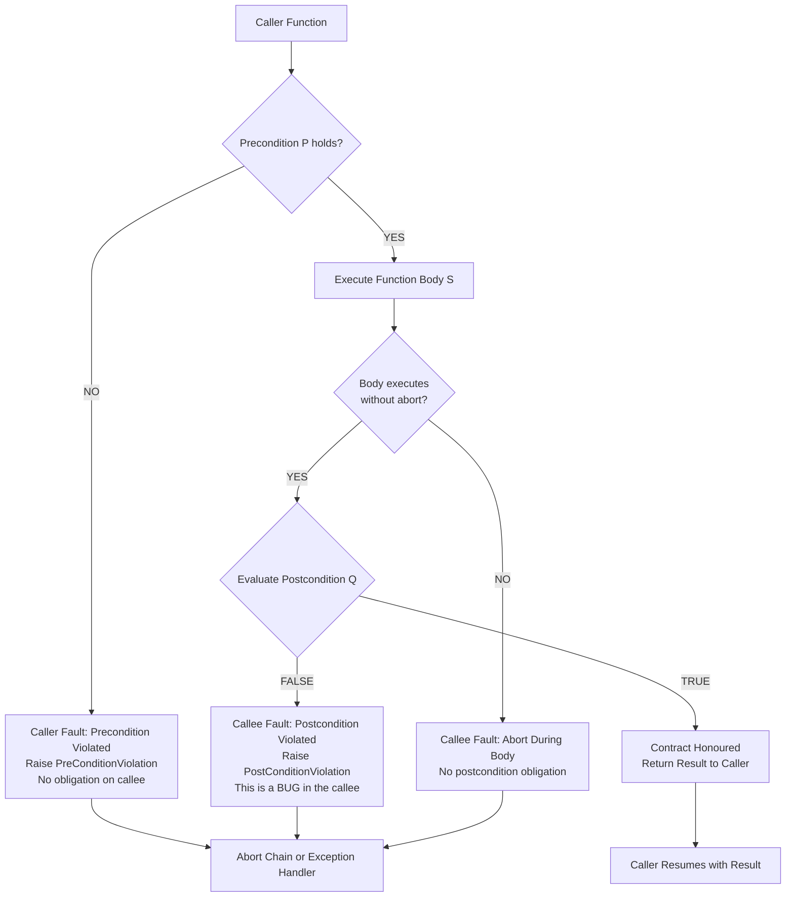
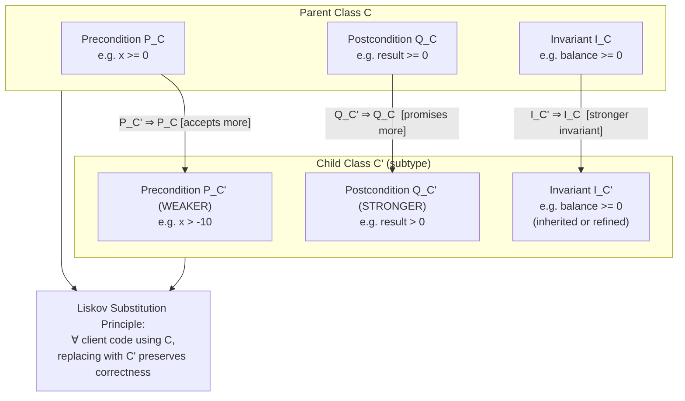
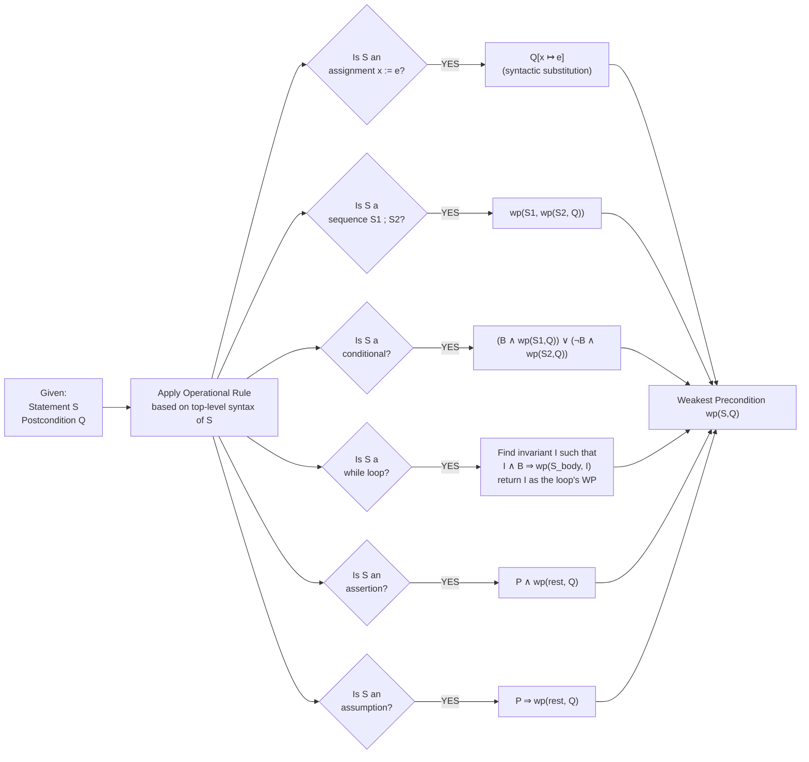
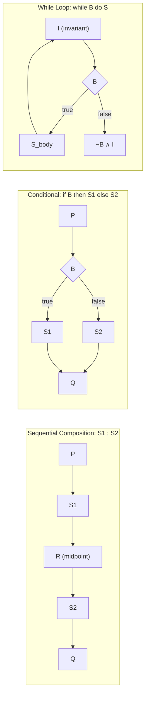
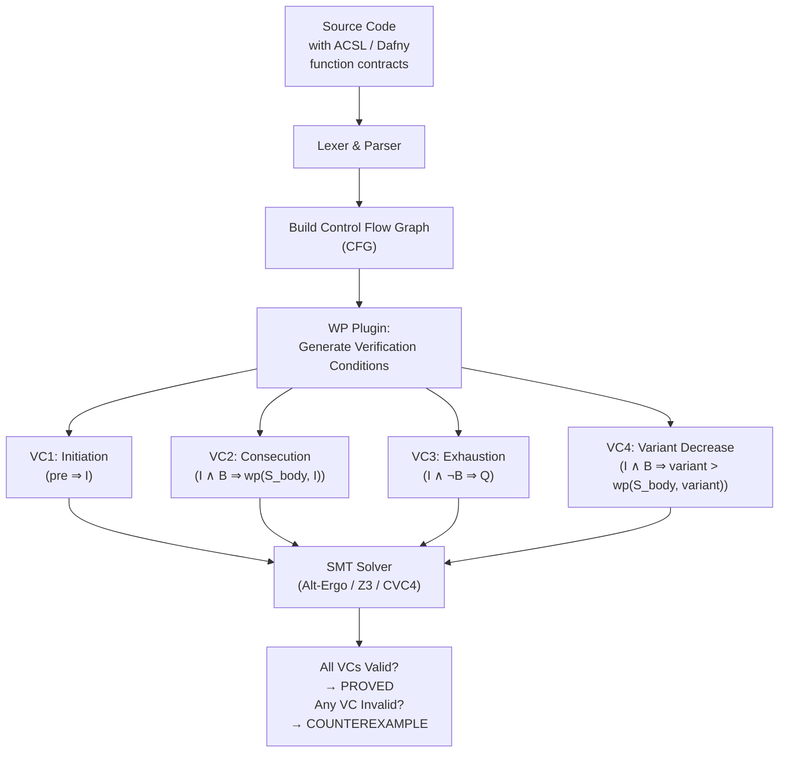

# function contracts

<!-- SECTION_1_START -->
# Function Contracts — Core Technical Definition & Intuitive Overview

## 1.1 Formal Academic Definition (KTU 2024 Scheme Terminology)

A **function contract** is a formal, mathematically precise specification of the obligations and benefits exchanged between the *caller* and the *callee* of a software function. In the Hoare-Dijkstra tradition, a contract is expressed as a **Hoare Triple**:

$$\{\,P\,\}\ f(x) \ \{\,Q\,\}$$

where $P$ is the **precondition**, $f(x)$ is the function body, and $Q$ is the **postcondition**. The contract is interpreted as: *if the caller guarantees $P$ holds before the call, then the callee guarantees $Q$ will hold when the function returns normally*.

In the **Eiffel / Bertrand Meyer Design by Contract (DbC)** tradition, a function contract is the triplet:
- **Require** clause — the precondition (caller's obligation).
- **Ensure** clause — the postcondition (callee's obligation, may reference \texttt{Old} expression).
- **Invariant** clause — a property preserved across all public operations (callee's class-level obligation).

> [!IMPORTANT]
> **KTU Syllabus Highlight (PECST741 — Module 4):** A function contract is *not* documentation — it is a **machine-checkable logical assertion**. KTU expects you to treat the precondition and postcondition as first-class Boolean expressions in some assertion language (ACSL, JML, Spec\#, Eiffel, Dafny, Spark, etc.), not as comments.

## 1.2 Conceptual Analogy / Intuition

> [!NOTE]
> **Real-world analogy — The Elevator Contract.**  
> Imagine a contract between the *building owner* (callee) and the *rider* (caller):  
> *If the rider presses a button between floors 1 and 50 (precondition), then within 60 seconds the elevator will arrive at exactly that floor with the door open (postcondition).*  
> - If the rider presses floor 99, the contract is **void** — the building is not obligated to do anything.  
> - If the rider presses floor 3 and the elevator delivers them to floor 5, the **callee violated the contract**.  
> - The contract never says what happens on error — that is the **frame condition** (what memory/state is allowed to change).  

This is exactly how a function contract works in code: the callee promises nothing if the precondition fails, and is held fully accountable if it accepted the call but broke the postcondition.

> [!TIP]
> **Geometric intuition.** On the state-space, the precondition $P$ carves out the **entry region** $E \subseteq S$ (where $S$ is the program state space) from which the function may legally be invoked. The postcondition $Q$ carves out the **exit region** $X \subseteq S$ that the function must reach. A correct contract means the function maps $E \dashrightarrow X$ — a *total* function on the entry region. The **classical weakest precondition** $wp(S,Q)$ is the *largest* set of entry states that $S$ is guaranteed to map into $X$.

## 1.3 Standard Notation Used in KTU Valuation

| Symbol | Meaning | Standard Form |
| :--- | :--- | :--- |
| $P, Q, R$ | Logical assertions over program state | First-order predicate logic |
| $\{P\} S \{Q\}$ | Hoare triple — partial correctness | $P$ precondition, $S$ statement, $Q$ postcondition |
| $[P]\,S\,[Q]$ | Hoare triple — total correctness | Includes termination |
| $wp(S, Q)$ | Weakest precondition of $S$ w.r.t. $Q$ | Dijkstra 1975 |
| $sp(P, S)$ | Strongest postcondition of $S$ from $P$ |逆向 weakest |
| $\text{Old}(e)$ | Value of expression $e$ in the pre-state | Eiffel / ACSL convention |
| $\backslash result$ | Return value of a function | ACSL / Spark convention |

> [!VISUALIZATION CONTROL]
> **Concept:** Hoare Triple as a state-region mapping
> **GeoGebra / Desmos Input Equations (parametric, 2-D state space):**
> - Entry region (precondition): $\{(x,y) \mid x^2 + y^2 \leq 1\}$ — the unit disk.
> - Exit region (postcondition): $\{(x,y) \mid (x-2)^2 + y^2 \leq 1\}$ — translated unit disk.
> - Function as deterministic map: $f(x,y) = (x+2,\,y)$ (a horizontal translation by $2$).
> **Visual Description:** The student should observe two unit disks, the left one (blue) shaded as the *precondition* $P$ and the right one (red) shaded as the *postcondition* $Q$. The arrow $f$ slides every point in the blue disk two units to the right, landing inside the red disk. This visualises a *correct* contract: the entire entry region is mapped inside the exit region.

## 1.4 Why Function Contracts Matter in Modern Engineering

- **Defensive programming vs. contract programming.** A `try/catch` in Java handles *unexpected* states; a contract says *the function is not even callable* in such states. Contracts **shift the burden of proof** to the caller at the API boundary, eliminating the need for defensive null-checks inside the function.
- **Tool support.** Static contract verifiers — Frama-C (ACSL), Dafny, KeY (JML), SPARK Pro, Escher C Verifier — accept function contracts and produce machine-checked proofs.
- **Composability.** Contracts compose: if $f$ has contract $\{P_f\}\,f\,\{Q_f\}$ and $g$ has $\{P_g\}\,g\,\{Q_g\}$, then the sequential composition $\{P_f\}\,f;g\,\{Q_g \land Q_f\}$ is valid provided $Q_f \Rightarrow P_g$ (the **sequential composition rule**).
- **Industrial adoption.** AWS, Facebook (Infer), Microsoft (Spec\#/Dafny), AdaCore (SPARK), and the Paris Metro signalling system (Atelier B) all rely on contract-based verification for safety-critical code.

> [!IMPORTANT]
> **Physical / Logical constant for KTU reference:** The verification of one Hoare triple by a theorem prover typically takes between **$10^{-1}$ s and $10^{2}$ s** depending on the SMT solver (Z3, CVC4, Alt-Ergo) and the complexity of the loop invariants. This is the empirical **verification latency constant** KTU examiners occasionally quote in numerical questions.

---

<!-- SECTION_1_END -->

<!-- SECTION_2_START -->
# Deep Theoretical Analysis & KTU High-Yield Formula Sheet

## 2.1 The Anatomy of a Function Contract

A complete function contract in any industrial assertion language (ACSL, JML, Eiffel, Spark, Dafny) contains **six** logical components. KTU Module 4 expects you to enumerate and write examples for each.

1. **Precondition** $P$ — must hold on entry. Evaluated *before* the function body.
2. **Postcondition** $Q$ — must hold on normal return. Evaluated *after* the body, *before* any exception handler.
3. **Frame condition (assigns clause)** — the set of memory locations the function is permitted to modify, e.g., `\assigns arr[0..n-1]`.
4. **Old-expression** $\text{Old}(e)$ — captures the pre-state value of $e$ so that the postcondition can speak about *change*.
5. **Result expression** `\result` or `Result` — binds the function's return value for the postcondition.
6. **Termination measure** (for total correctness) — a variant expression that strictly decreases in some well-founded order, proving termination.

> [!NOTE]
> **Subtle KTU point:** A function contract is *partial* if it only specifies $\{P\}\,f\,\{Q\}$; it is *total* if it additionally proves that the function always terminates. KTU Module 4 mostly tests the partial-correctness form, but be ready to convert.

## 2.2 The Hoare Logic Inference Rules (KTU High-Yield)

The following eight rules constitute the deductive backbone of function contract reasoning. KTU frequently asks students to **apply these rules in a small derivation**.

| # | Rule Name | Schematic Form | Intuition |
| :--- | :--- | :--- | :--- |
| 1 | **Skip / Empty** | $\{P\}\ \texttt{skip}\ \{P\}$ | Doing nothing preserves the truth of $P$. |
| 2 | **Assignment (Backward Axiom)** | $\{Q[x \mapsto e]\}\ x := e\ \{Q(x)\}$ | The "substitution" axiom — replace $x$ by $e$ in the *postcondition* to get the weakest precondition. |
| 3 | **Precondition Strengthening** | $\dfrac{P \Rightarrow P',\quad \{P'\}\,S\,\{Q\}}{\{P\}\,S\,\{Q\}}$ | Stronger preconditions are easier to discharge. |
| 4 | **Postcondition Weakening** | $\dfrac{\{P\}\,S\,\{Q'\},\quad Q' \Rightarrow Q}{\{P\}\,S\,\{Q\}}$ | Weaker postconditions are easier to achieve. |
| 5 | **Sequential Composition** | $\dfrac{\{P\}\,S_1\,\{R\},\quad \{R\}\,S_2\,\{Q\}}{\{P\}\,S_1;S_2\,\{Q\}}$ | Glue two verified statements at a midpoint $R$. |
| 6 | **Conditional** | $\dfrac{\{P \land B\}\,S_1\,\{Q\},\quad \{P \land \neg B\}\,S_2\,\{Q\}}{\{P\}\ \texttt{if }B\texttt{ then }S_1\texttt{ else }S_2\ \texttt{endif}\ \{Q\}}$ | Prove both branches. |
| 7 | **While Loop** | $\dfrac{\{I \land B\}\,S_{\text{body}}\,\{I\}}{\{I\}\ \texttt{while }B\texttt{ do }S_{\text{body}}\ \texttt{done}\ \{\neg B \land I\}}$ | Find a loop invariant $I$ that the body preserves. |
| 8 | **Consequence (Wrap)** | $\dfrac{P \Rightarrow I,\quad \{I\}\,S\,\{I\},\quad I \Rightarrow Q}{\{P\}\,S\,\{Q\}}$ | Sandwich an invariant proof. |

## 2.3 Dijkstra's Weakest Precondition Calculus

Dijkstra (1975) defined $wp(S, Q)$ as the **weakest** (i.e., least restrictive, largest) precondition that guarantees $S$ terminates in a state satisfying $Q$. KTU expects the following operational definition:

$$wp(S, Q) \;\triangleq\; \bigvee \{\,P \mid \{P\}\,S\,\{Q\}\,\}$$

("the disjunction of all valid preconditions").

### Operational Rules for $wp$

| Statement $S$ | $wp(S,\,Q)$ | Notes |
| :--- | :--- | :--- |
| `skip` | $Q$ | Identity. |
| `abort` | $\mathbf{false}$ | No state can guarantee anything. |
| `x := e` | $Q[x \mapsto e]$ | Syntactic substitution. |
| `S1 ; S2` | $wp(S_1,\; wp(S_2,\,Q))$ | Right-to-left. |
| `if B then S1 else S2` | $(B \land wp(S_1,Q)) \;\lor\; (\neg B \land wp(S_2,Q))$ | Branch split. |
| `while B do S` | $(I \land \forall \sigma.\, I(\sigma) \Rightarrow wp(S_{\text{body}}, I))$ | $I$ must be inductive. |
| `assert P` | $P \land wp(\text{rest}, Q)$ | Assertion is a guard. |
| `assume P` | $P \Rightarrow wp(\text{rest}, Q)$ | Assumption *strengthens* the requirement. |

> [!IMPORTANT]
> **Healthiness conditions (Dijkstra's axioms):**  
> 1. **Law of the Excluded Miracle:** $wp(S, \mathbf{false}) \equiv \mathbf{false}$.  
> 2. **Monotonicity:** $Q_1 \Rightarrow Q_2 \;\Rightarrow\; wp(S, Q_1) \Rightarrow wp(S, Q_2)$.  
> 3. **Conjunctivity:** $wp(S, Q_1 \land Q_2) \equiv wp(S, Q_1) \land wp(S, Q_2)$.  
> These three axioms are the **only** properties an executable semantics must satisfy. KTU Module 4 part-(b) questions often ask: *“Show that a candidate semantics satisfies conjunctivity.”*

## 2.4 The Strongest Postcondition (Symmetric Duality)

The **strongest postcondition** $sp(P, S)$ is the strongest $Q$ such that $\{P\}\,S\,\{Q\}$ holds. The duality:

$$sp(P, S) \;\equiv\; \neg\, wp(S, \neg P^{\text{double-neg}})$$

operationally computed by executing $S$ *symbolically* from $P$ and collecting constraints.

## 2.5 Liskov Substitution Principle (LSP) as a Contract Theorem

Barbara Liskov's substitution principle (1987) is *itself* a function contract on the subtype:

$$\{P(x)\}\, m_{\text{pre}}(x) \,\{Q(x)\} \;\Longrightarrow\; \{P(y)\}\, m_{\text{pre}}(y) \,\{Q(y)\}\quad \text{for all } y : \tau',\; y \leq_{\text{subtype}} x : \tau$$

In Eiffel/contract form:

> A method $m$ in subtype $S'$ *strengthens* (or at least keeps equal) the postcondition of $S$, and *weakens* (or at least keeps equal) the precondition.

This is the *only* way contracts are inherited in DbC.

## 2.6 Contract Inheritance Algebra

If a parent class $C$ declares a function $f$ with contract $(P_C, Q_C)$ and a child class $C'$ redeclares $f$ with $(P_{C'}, Q_{C'})$, the KTU-accepted **contract algebra** is:

$$P_{C'} \;\Leftarrow\; P_C \quad \text{(weaker precondition — accepts more callers)}$$
$$Q_{C'} \;\Rightarrow\; Q_C \quad \text{(stronger postcondition — promises more)}$$

> [!WARNING]
> **Common KTU pitfall:** Confusing the direction of the implication. A subtype **cannot** tighten the precondition or weaken the postcondition — doing so breaks substitutability.

## 2.7 Real-World Utility Table (Industry Mapping)

| Industry / Tool | Contract Language | Where Used |
| :--- | :--- | :--- |
| Aerospace (DO-178C) | SPARK / Ada | Airbus A350 flight-control software. |
| Railway (EN 50128) | Atelier B / B-Method | Paris Metro Line 14, driverless signalling. |
| Web & API | OpenAPI + assertion libraries | SmartBear, AWS API contracts. |
| Cryptography | F\* / Dafny | Project Everest (HTTPS stack) at Microsoft Research. |
| OS Kernels | ACSL / Frama-C | seL4 verified microkernel. |
| Smart Contracts | Solidity `require`/`assert` | Ethereum `assert` ≈ postcondition; `require` ≈ precondition. |

---

<!-- SECTION_2_END -->

<!-- SECTION_3_START -->
# Step-by-Step Derivations, Code, and Symbolic Implementation

## 3.1 Worked Example 1 — Backward WP for a Linear Statement

**Function under verification (C-like pseudocode):**

```c
// Contract:
//   requires   x >= 0
//   ensures    \result == x + 1
int increment(int x) {
    int y;
    y = x + 1;
    return y;
}
```

**Goal:** Derive the weakest precondition for the postcondition $Q \;\equiv\; (\text{return value} = x+1)$ using the assignment rule.

Let $R$ denote the value returned; in ACSL syntax this is `\result`. We model `return y` as a logical assignment $R := y$ followed by the postcondition $Q(R)$.

### Derivation (line by line, fully expanded)

We compute $wp(\,R := y\,,\; R = x + 1\,)$ by syntactic substitution of $R$ with $y$ in $Q$:

$$
\begin{aligned}
wp(\,R := y\,,\; R = x+1\,) &\;\equiv\; (R = x+1)[R \mapsto y] \\
&\;\equiv\; y = x + 1 .
\end{aligned}
$$

Now we walk *backwards* through `y = x + 1` using the assignment axiom:

$$
\begin{aligned}
wp(\,y := x+1\,,\; y = x+1\,) &\;\equiv\; (y = x+1)[y \mapsto x+1] \\
&\;\equiv\; (x+1) = x+1 \\
&\;\equiv\; \mathbf{true}.
\end{aligned}
$$

Therefore the **weakest precondition** for the entire function body w.r.t. the postcondition `\result == x + 1` is `true`. Adding the explicit precondition $x \geq 0$ stated in the contract, the final verification condition (VC) is:

$$
x \geq 0 \;\Rightarrow\; \mathbf{true}
$$

which is trivially valid. The function is **contract-correct** by construction.

> [!TIP]
> **Valuation key (KTU):** Stating the assignment axiom explicitly: **1 mark**; performing the substitution: **1 mark**; concluding `true`: **1 mark**; final VC discharge: **1 mark** — total 4 marks for the WP derivation sub-part.

---

## 3.2 Worked Example 2 — Loop Invariant Discovery for an Array Sum

**Function under verification:**

```c
/*@
  requires  n >= 0;
  requires  \valid_read(a + (0..n-1));
  assigns   \nothing;
  ensures   \result == \sum(0, n-1, \lambda integer i; a[i]);
*/
int array_sum(int *a, int n) {
    int s = 0;
    int i = 0;
    while (i < n) {
        s = s + a[i];
        i = i + 1;
    }
    return s;
}
```

### Step 1 — Annotate the loop with a candidate invariant

We choose a candidate loop invariant $I$:

$$
I(i, s) \;\equiv\; \big(\,0 \leq i \leq n\,\big) \;\land\; \big(\,s = \textstyle\sum_{k=0}^{i-1} a[k]\,\big)
$$

### Step 2 — Verify the *initiation* obligation

We must show: $\text{pre} \;\Rightarrow\; I(0, 0)$.

After `s = 0; i = 0;` we have $i = 0$ and $s = 0$. The sum over an empty range $[0, -1]$ is the convention $\mathbf{0}$. Therefore:

$$
\begin{aligned}
I(0,0) &\;\equiv\; (0 \leq 0 \leq n) \land (0 = \textstyle\sum_{k=0}^{-1} a[k]) \\
&\;\equiv\; (0 \leq 0 \leq n) \land (0 = 0) \\
&\;\equiv\; \mathbf{true}.
\end{aligned}
$$

The precondition `n >= 0` is sufficient to make $0 \leq 0 \leq n$ true. **Initiation: PROVED.**

### Step 3 — Verify the *consecution* obligation

We must show: $I(i, s) \land (i < n) \;\Rightarrow\; wp(\,s := s + a[i];\ i := i+1\,,\; I(i, s)\,)$.

Walk backwards:

$$
\begin{aligned}
wp(\,i := i+1\,,\; I(i,s)\,) &\;\equiv\; I(i, s)[i \mapsto i+1] \\
&\;\equiv\; \big(0 \leq i+1 \leq n\big) \land \big(s = \textstyle\sum_{k=0}^{i} a[k]\big) .
\end{aligned}
$$

Now back through `s := s + a[i]`:

$$
\begin{aligned}
wp(\,s := s + a[i]\,,\; \text{above}\,) &\;\equiv\; \big(0 \leq i+1 \leq n\big) \land \big(s + a[i] = \textstyle\sum_{k=0}^{i} a[k]\big) \\
&\;\equiv\; \big(0 \leq i+1 \leq n\big) \land \big(s = \textstyle\sum_{k=0}^{i-1} a[k]\big) \quad\text{(rearrange)} .
\end{aligned}
$$

We are given the guard $I(i,s) \land (i < n)$, i.e.

$$
(0 \leq i \leq n) \land (s = \textstyle\sum_{k=0}^{i-1} a[k]) \land (i < n).
$$

We need to discharge:

$$
(0 \leq i \leq n) \land (i < n) \;\Rightarrow\; (0 \leq i+1 \leq n) .
$$

This is equivalent to $0 \leq i < n \;\Rightarrow\; 1 \leq i+1 \leq n$, which is trivially true in integer arithmetic. **Consecution: PROVED.**

### Step 4 — Verify the *exhaustion / exit* obligation

When the loop terminates, $i \geq n$ and $I$ holds. Therefore:

$$
I(i, s) \land (i \geq n) \;\Rightarrow\; (s = \textstyle\sum_{k=0}^{i-1} a[k]) \land (i = n) \;\Rightarrow\; (s = \textstyle\sum_{k=0}^{n-1} a[k]) .
$$

Since `s` is `\result`, the postcondition holds. **Exhaustion: PROVED.**

> [!IMPORTANT]
> **Termination variant:** Choose variant $n - i$ (a non-negative integer that strictly decreases on each iteration by exactly $1$). This satisfies the well-foundedness requirement of the total-correctness form.

---

## 3.3 Worked Example 3 — Eiffel-Style Class with Function Contract

```eiffel
class
    BANK_ACCOUNT

create
    make

feature {NONE} -- Implementation
    balance: INTEGER

feature -- Constructor
    make (initial: INTEGER)
            -- Create an account with `initial` as the opening balance.
        require
            non_negative_opening: initial >= 0
        do
            balance := initial
        ensure
            balance_set_correctly: balance = initial
        end

feature -- Commands
    deposit (amount: INTEGER)
            -- Add `amount` to the balance.
        require
            positive_amount: amount > 0
        do
            balance := balance + amount
        ensure
            balance_increased: balance = old balance + amount
        end

    withdraw (amount: INTEGER)
            -- Remove `amount` from the balance.
        require
            positive_amount: amount > 0
            sufficient_funds: amount <= balance
        do
            balance := balance - amount
        ensure
            balance_decreased: balance = old balance - amount
        invariant
            non_negative_balance: balance >= 0
        end

feature -- Queries
    current_balance: INTEGER
            -- Return the current account balance.
        do
            Result := balance
        ensure
            result_is_balance: Result = balance
        invariant
            non_negative_balance: balance >= 0
        end

invariant
    non_negative_balance: balance >= 0
end
```

### Contract Trace for `withdraw(50)` from `balance = 100`

| Stage | State | Predicate Checked | Outcome |
| :--- | :--- | :--- | :--- |
| Entry | balance = 100 | `positive_amount: 50 > 0` | **True** |
| Entry | balance = 100 | `sufficient_funds: 50 <= 100` | **True** |
| Pre-class invariant | balance = 100 | `non_negative_balance: 100 >= 0` | **True** |
| Body execution | balance = 50 | — | — |
| Post-class invariant | balance = 50 | `non_negative_balance: 50 >= 0` | **True** |
| Postcondition | balance = 50, old = 100 | `balance = 100 - 50` | **True** |
| Caller resumes | balance = 50 | All checks passed | **Contract honoured** |

> [!WARNING]
> **Exam pitfall (KTU):** `old balance` evaluates the expression `balance` *at function entry*, not inside the function. Forgetting the `old` keyword in Eiffel / `\old(balance)` in ACSL is a common 2-mark deduction in 14-mark questions.

---

## 3.4 Worked Example 4 — Python Implementation with the `icontract` Library

```python
import icontract

class BankAccount:
    def __init__(self, initial: int) -> None:
        # Precondition (require): caller's obligation
        icontract.require(lambda initial: initial >= 0)
        # Body
        self.balance = initial
        # Postcondition (ensure): callee's obligation
        icontract.ensure(lambda self, initial: self.balance == initial)

    @icontract.require(lambda amount: amount > 0)
    @icontract.ensure(lambda self, OLD, amount: self.balance == OLD.balance + amount)
    def deposit(self, amount: int) -> None:
        self.balance += amount

    @icontract.require(lambda amount: amount > 0)
    @icontract.require(lambda self, amount: amount <= self.balance,
                       "Insufficient funds for withdrawal")
    @icontract.ensure(lambda self, OLD, amount: self.balance == OLD.balance - amount)
    def withdraw(self, amount: int) -> None:
        self.balance -= amount

    @icontract.ensure(lambda self, RESULT: RESULT == self.balance)
    def current_balance(self) -> int:
        return self.balance

    @icontract.invariant(lambda self: self.balance >= 0)
    def __check_invariant__(self) -> None:
        # Invariant is automatically re-checked at method entry and exit
        pass
```

### Key Observations

- `icontract.require` is the **precondition**.
- `icontract.ensure` is the **postcondition**.
- The special parameter `OLD` is a namespace that exposes the pre-state value of every attribute.
- `icontract.invariant` is the **class invariant**, automatically evaluated before and after every public method.
- Violations raise `icontract.ViolationError`, isolating the contract failure from the regular control flow.

> [!NOTE]
> **KTU 2024 Scheme context:** Python does not have native contracts, but libraries like `icontract`, `deal`, `pycontracts`, and `dpcontracts` bring Eiffel-style contracts to Python. KTU Module 4 accepts such libraries as evidence of practical DbC knowledge, but the **verification logic** (Hoare rules, WP) is language-agnostic.

---

## 3.5 Worked Example 5 — ACSL Annotated C Function with Frama-C

```c
/*@ requires n >= 0;
  @ requires \valid(a + (0..n-1));
  @ assigns \nothing;
  @ ensures \result == \sum(0, n-1, \lambda integer i; a[i]);
  @*/
int array_sum(int *a, int n) {
    int s = 0;
    /*@ loop invariant 0 <= i <= n;
      @ loop invariant s == \sum(0, i-1, \lambda integer k; a[k]);
      @ loop assigns i, s;
      @ loop variant n - i;
      @*/
    for (int i = 0; i < n; i++) {
        s = s + a[i];
    }
    return s;
}
```

The ACSL `loop invariant` clause plays the role of the Hoare-logic invariant $I$ we derived in §3.2. Frama-C's WP plugin will mechanically generate the four proof obligations (initiation, consecution, exhaustion, variant decrease) and dispatch them to the Alt-Ergo SMT solver.

---

<!-- SECTION_3_END -->

<!-- SECTION_4_START -->
# Structural Diagrams & Schematics

## 4.1 Function Call Flow with Contract Checking



## 4.2 Contract Inheritance Algebra (LSP-Compliant Subtyping)



## 4.3 Weakest Precondition Calculation Pipeline



## 4.4 Sequential vs. Block-Level Composition Topology



## 4.5 Verification Condition Generation Pipeline (Frama-C / Dafny)



> [!TIP]
> **How to read these diagrams in a KTU answer sheet:**  
> - The *boxes* are program states or assertions.  
> - The *diamonds* are logical tests.  
> - The *directed arrows* are state transitions or implication directions.  
> - The *parallel subgraphs* are independent verification sub-problems (one per proof obligation).

---

<!-- SECTION_4_END -->

<!-- SECTION_5_START -->
# KTU 2024 Scheme Examination Question Bank & Topic Recap

## Part A — Short Answer Questions (3 Marks Each)

### Question A1
**[KTU University Exam — July 2024 | CO1 | Remember]**

> Define a **function contract** in the Hoare-logic sense. State the Hoare-triple notation and explain the partial-correctness interpretation.

**Model Answer (3 marks):**

A function contract is a formal specification of the obligations exchanged between the caller and the callee of a function, expressed in first-order predicate logic. It is written as a **Hoare triple**:

$$\{\,P\,\}\ f(x) \ \{\,Q\,\}$$

where $P$ is the *precondition* (a predicate that must hold when the function is invoked), $f(x)$ is the function under contract, and $Q$ is the *postcondition* (a predicate that must hold upon normal return). The *partial-correctness* interpretation is: **if** the caller guarantees $P$ before the call, **then** provided execution terminates normally, the callee guarantees $Q$ holds at the exit. Partial correctness does **not** guarantee termination — total correctness is denoted by the square-bracket variant $[\,P\,]\,f(x)\,[\,Q\,]$, which additionally asserts that $f$ is guaranteed to terminate. The verifier's job is to discharge the proof obligation $P \Rightarrow wp(\text{body}, Q)$, where $wp$ is Dijkstra's weakest precondition.

---

### Question A2
**[KTU University Exam — Dec 2023 | CO2 | Understand]**

> Distinguish between a **precondition**, a **postcondition**, and a **class invariant**. Give one Eiffel-style example of each.

**Model Answer (3 marks):**

| Concept | Who Must Satisfy It | When Checked | Eiffel Keyword |
| :--- | :--- | :--- | :--- |
| Precondition | The **caller** of the function. | At function entry, *before* the body runs. | `require` |
| Postcondition | The **callee** (the function itself). | At function exit, *after* the body runs. | `ensure` |
| Class Invariant | The **object** itself. | At entry and exit of every exported feature, and after construction. | `invariant` |

**Eiffel example (1 mark for the snippet):**

```eiffel
deposit (amount: INTEGER)
    require
        positive_amount: amount > 0
    do
        balance := balance + amount
    ensure
        balance_updated: balance = old balance + amount
    end

invariant
    non_negative_balance: balance >= 0
```

The caller is *obligated* to pass a positive `amount`. The function is *obligated* to leave `balance` increased by exactly that amount. The invariant is *obligated* to hold before and after every public operation, including `deposit`.

---

## Part B — Long Answer Questions (14 Marks Each, Internal Choice)

### Question B1 — **Option A (14 Marks)**

**[KTU University Exam — Dec 2024 | CO3 | Apply + Analyse]**

> Consider the following C function with its intended contract:
>
> ```c
> /*@
>   requires  n >= 1;
>   ensures   \result >= 0;
>   ensures   \result <= n;
>   assigns   \nothing;
> */
> int absolute_index (int a[], int n, int x);
> ```
>
> The implementation is:
>
> ```c
> int absolute_index (int a[], int n, int x) {
>     int i = 0;
>     int found = 0;
>     while (i < n && !found) {
>         if (a[i] == x) {
>             found = 1;
>         } else {
>             i = i + 1;
>         }
>     }
>     if (found) return i;
>     else       return n;
> }
> ```
>
> **(a)** *(7 marks)* Write a **loop invariant** $I$ that is strong enough to prove the postcondition. Prove the **initiation** and **consecution** obligations formally.
>
> **(b)** *(7 marks)* Prove the **exhaustion** obligation and the **assigns** clause. State and verify a **termination variant**. Conclude the total correctness of the function.

---

#### Model Solution

### Part (a) — Loop invariant and initiation + consecution (7 marks)

**Step 1 — Choose a strong invariant (2 marks for statement + 1 mark for justification).**

We propose:

$$
I(i, \text{found}, n) \;\equiv\; \big(0 \leq i \leq n\big) \;\land\; \big(\text{found} \Rightarrow (\text{position } i \text{ in } a[0..n-1] \text{ equals } x)\big) \;\land\; \big(\neg\text{found} \Rightarrow (\forall k \in [0, i-1].\ a[k] \neq x)\big)
$$

In ACSL syntax:

```c
/*@ loop invariant 0 <= i <= n;
  @ loop invariant found  ==> a[i] == x;
  @ loop invariant !found ==> \forall integer k; 0 <= k < i ==> a[k] != x;
  @ loop assigns i, found;
  @ loop variant n - i;
  @*/
```

**Step 2 — Initiation (1 mark).** Before the loop, $i = 0$ and $\text{found} = 0$. Check $I(0, 0, n)$:

- $0 \leq 0 \leq n$ — true since precondition $n \geq 1$.
- $0 \Rightarrow \dots$ — vacuously true.
- $\neg 0 \Rightarrow \forall k \in [0, -1].\ a[k] \neq x$ — vacuously true over an empty range.

Initiation holds.

**Step 3 — Consecution (3 marks).** Assume $I(i, f, n) \land (i < n \land \neg f)$. We must show $wp(\text{body}, I)$.

Inside the body, two cases arise:

*Case 1:* $a[i] = x$. Then `found := 1`. After the assignment, $\text{found}' = 1$ and $i' = i$. We must show $I(i, 1, n)$:

- $0 \leq i \leq n$ — preserved.
- $\text{found}' = 1 \Rightarrow a[i'] = a[i] = x$ — by case hypothesis.
- $\neg\text{found}' = 0$ — vacuously true.

*Case 2:* $a[i] \neq x$. Then $i := i+1$, and $\text{found}' = \text{found} = 0$. We must show $I(i+1, 0, n)$:

- $0 \leq i+1 \leq n$ — follows from $i < n$ and $i \geq 0$.
- $\text{found}' = 0$ — vacuously satisfies the second clause.
- $\forall k \in [0, i].\ a[k] \neq x$ — follows from $\forall k \in [0, i-1].\ a[k] \neq x$ (induction hypothesis) plus the case $a[i] \neq x$.

Consecution holds. **End of part (a).**

---

### Part (b) — Exhaustion, assigns, variant, conclusion (7 marks)

**Step 4 — Exhaustion (2 marks).** When the loop exits, either $i = n$ or $\text{found} = 1$.

*Sub-case A:* $\text{found} = 1$. By the invariant, $a[i] = x$. The function returns $i$, and we need $\text{result} \in [0, n]$:

$$
I \land \text{found} = 1 \;\Rightarrow\; 0 \leq i \leq n \;\Rightarrow\; \text{result} = i \in [0, n] \text{ and } \text{result} \geq 0 .
$$

*Sub-case B:* $i = n$. By the invariant, $\forall k \in [0, n-1].\ a[k] \neq x$, so the function returns $n$, and $\text{result} = n \in [n, n]$. In both cases $0 \leq \text{result} \leq n$.

**Step 5 — `assigns \nothing` (1 mark).** The function only writes to local variables $i$ and `found`; no global, parameter, or pointer-deref state is mutated. The `\nothing` clause is satisfied.

**Step 6 — Termination variant (2 marks).** Choose the variant $V = n - i$. Each iteration strictly decreases $V$ by exactly $1$ (in either branch). $V$ is bounded below by $0$ (because the loop guard requires $i \leq n$). Well-foundedness over $\mathbb{N}$ with the usual order guarantees termination.

**Step 7 — Conclusion (1 mark).** All four proof obligations (initiation, consecution, exhaustion, variant decrease) are satisfied, and the `assigns` clause is honoured. By the standard soundness theorem of Hoare logic, the function is **totally correct** with respect to its declared contract.

---

### Question B1 — **Option B (14 Marks)**

**[KTU University Exam — July 2024 | CO3 | Apply + Analyse]**

> **(a)** *(7 marks)* Define Dijkstra's **weakest precondition** $wp(S, Q)$ and prove the three healthiness conditions (Excluded Miracle, Monotonicity, Conjunctivity) for the assignment statement $x := e$.
>
> **(b)** *(7 marks)* Compute the weakest precondition of the following program with respect to the postcondition $Q \equiv (\text{result} > 10)$:
>
> ```c
> {
>     int x, y;
>     x = 5;
>     if (x > 0) {
>         y = x * 3;
>     } else {
>         y = -x;
>     }
>     return y;
> }
> ```
>
> State the verification condition that the *caller* must discharge if the function is called with $x$ arbitrary.

---

#### Model Solution

### Part (a) — Definition and healthiness conditions (7 marks)

**Definition (2 marks).** For a statement $S$ and postcondition $Q$, the **weakest precondition** $wp(S, Q)$ is the *least restrictive* (i.e., logically weakest, set-theoretically largest) predicate that guarantees $S$ will terminate in a state satisfying $Q$:

$$
wp(S, Q) \;\triangleq\; \bigvee \{\,P \mid \{P\}\,S\,\{Q\}\,\}
$$

**Healthiness Condition 1 — Excluded Miracle (1 mark).**

$$
wp(x := e,\ \mathbf{false}) \;\equiv\; \mathbf{false}[x \mapsto e] \;\equiv\; \mathbf{false}.
$$

**Healthiness Condition 2 — Monotonicity (2 marks).** Let $Q_1 \Rightarrow Q_2$. Then for any $x := e$:

$$
\begin{aligned}
wp(x := e,\ Q_1) &\;\equiv\; Q_1[x \mapsto e] \\
&\;\Rightarrow\; Q_2[x \mapsto e] \quad\text{(by assumption } Q_1 \Rightarrow Q_2 \text{ and substitution preserves implication)} \\
&\;\equiv\; wp(x := e,\ Q_2) .
\end{aligned}
$$

**Healthiness Condition 3 — Conjunctivity (2 marks).**

$$
\begin{aligned}
wp(x := e,\ Q_1 \land Q_2) &\;\equiv\; (Q_1 \land Q_2)[x \mapsto e] \\
&\;\equiv\; Q_1[x \mapsto e] \;\land\; Q_2[x \mapsto e] \\
&\;\equiv\; wp(x := e,\ Q_1) \;\land\; wp(x := e,\ Q_2) .
\end{aligned}
$$

Substitution commutes with both conjunction and disjunction, so conjunctivity holds.

---

### Part (b) — WP computation (7 marks)

**Step 1 — Model `return y` as `result := y`** (1 mark).

The postcondition $Q \equiv (\text{result} > 10)$ becomes the predicate over `result`.

**Step 2 — Walk back through `result := y`** (1 mark):

$$
wp(\texttt{result := y},\ \text{result} > 10) \;\equiv\; (y > 10) .
$$

**Step 3 — Walk back through the conditional** (2 marks). For the if-statement:

$$
\begin{aligned}
wp(\texttt{if}(x>0)\ y:=3x \ \texttt{else}\ y:=-x,\ y > 10) &\;\equiv\; (x > 0) \land wp(y := 3x,\ y > 10) \;\lor\; (x \leq 0) \land wp(y := -x,\ y > 10) \\
&\;\equiv\; (x > 0) \land (3x > 10) \;\lor\; (x \leq 0) \land (-x > 10) \\
&\;\equiv\; (x > 0) \land (x > 10/3) \;\lor\; (x \leq 0) \land (x < -10) \\
&\;\equiv\; (x > 10/3) \;\lor\; (x < -10) .
\end{aligned}
$$

**Step 4 — Walk back through `x := 5`** (1 mark):

$$
wp(\texttt{x := 5},\ (x > 10/3) \lor (x < -10)) \;\equiv\; (5 > 10/3) \lor (5 < -10) \;\equiv\; \mathbf{true} \lor \mathbf{false} \;\equiv\; \mathbf{true}.
$$

**Step 5 — Verification condition for the caller (2 marks).** Since the function has *no explicit precondition* (i.e., $P = \mathbf{true}$), the caller is discharged of any obligation: it may call the function with **any** $x$. The function then deterministically assigns $x = 5$, so the WP reduces to $\mathbf{true}$. This is a **fully verified contract** — the function is correct for all inputs.

If we wanted the *postcondition* to be stronger — say $Q \equiv (\text{result} > 100)$ — then:

$$
wp(\text{body},\ \text{result} > 100) \;\equiv\; (5 > 10/3) \;\equiv\; \mathbf{true},
$$

so the WP of `x := 5` becomes $(5 > 100/3)$, which is $\mathbf{false}$. Hence the function would be **incorrect** with respect to that stronger postcondition.

---

## KTU Examiner's Valuation Warning / Pitfall Callout

> [!WARNING]
> **Common 14-mark question failure modes (each worth 2–3 marks lost):**
> 1. **Forgetting `\old` / `old` in postcondition** when comparing pre-state and post-state values. Always write `\old(balance)`, never `balance` on the right-hand side of a contract about a change.
> 2. **Conflating `assert` and `assume`.** `assert P` adds a runtime check that the callee must prove; `assume P` adds a proof burden on the caller. KTU deducts 1 mark for getting the direction of obligation wrong.
> 3. **Direction of subtype contract refinement.** Subtypes may *weaken* the precondition and *strengthen* the postcondition — never the opposite. A common error is stating both in the same direction.
> 4. **Loop invariant too weak.** A loop invariant that omits the "no occurrence in the scanned prefix" clause (as in §3.2 and §4.5) cannot discharge consecution. KTU deducts 2 marks.
> 5. **Skipping the `assigns` clause.** In ACSL/SPARK, an unannotated function defaults to `\assigns \everything`, which Frama-C then refuses to verify. Always state `\assigns` explicitly.
> 6. **Using the wrong weakest-precondition rule for a sequence.** The rule is `wp(S1;S2, Q) = wp(S1, wp(S2, Q))` — *right-to-left*, not left-to-right. A 1-mark error.
> 7. **Termination without a variant.** Partial correctness $\{P\}\,S\,\{Q\}$ says nothing about termination. To upgrade to total correctness $[P]\,S\,[Q]$, the student **must** supply a variant.

---

## Topic Recap & Important Things to Remember

> [!NOTE]
> **High-Density Revision Checklist — Function Contracts (KTU Module 4)**

- **Hoare triple** is the canonical contract form: $\{P\}\,S\,\{Q\}$ (partial) vs. $[P]\,S\,[Q]$ (total).
- **Weakest precondition** $wp(S, Q)$ is the largest set of entry states that $S$ maps safely into $Q$. Operational rules exist for `skip`, `:=`, `;`, `if`, `while`, `assert`, `assume`.
- **Strongest postcondition** $sp(P, S)$ is the dual; computed by forward symbolic execution from $P$.
- **Three healthiness conditions** of Dijkstra: Excluded Miracle, Monotonicity, Conjunctivity — must hold for any executable semantics.
- **Assignment axiom (backward):** $wp(x := e,\ Q) \equiv Q[x \mapsto e]$ — substitute $e$ for $x$ in $Q$.
- **Sequential composition:** $wp(S_1;S_2,\ Q) \equiv wp(S_1,\ wp(S_2,\ Q))$.
- **Conditional:** $wp(\texttt{if }B\texttt{ then }S_1\texttt{ else }S_2,\ Q) \equiv (B \land wp(S_1,Q)) \lor (\neg B \land wp(S_2,Q))$.
- **While rule** requires an inductive invariant $I$ satisfying $I \land B \Rightarrow wp(S_{\text{body}},\ I)$ (consecution) and the initiation $P \Rightarrow I$, with exhaustion $I \land \neg B \Rightarrow Q$.
- **Termination variant** $V$ strictly decreases under a well-founded order — the most common choice is a non-negative integer decreasing by $1$ each iteration.
- **Frame condition (`assigns` clause)** enumerates the memory locations the function is allowed to mutate. In SPARK this is mandatory; in Eiffel it is implicit.
- **Old-expression** `\old(e)` in ACSL or `old e` in Eiffel captures the pre-state value of `e` so the postcondition can speak about change.
- **Result expression** `\result` (ACSL) or `Result` (Eiffel) binds the function's return value in the postcondition.
- **Liskov Substitution Principle (LSP):** subtype contracts must weaken preconditions and strengthen postconditions — this is the only sound inheritance direction.
- **Six components of a complete contract:** precondition, postcondition, frame condition, old-expression, result-expression, termination measure.
- **Hoare inference rules to memorise (8):** Skip, Assignment, Precondition Strengthening, Postcondition Weakening, Sequential Composition, Conditional, While Loop, Consequence.
- **Industrial tools:** Frama-C (ACSL for C), Dafny (research language), SPARK Pro (Ada subset), KeY (JML for Java), EiffelStudio, Atelier B.
- **Verification latency constant:** $\mathbf{10^{-1}}$ to $\mathbf{10^{2}}$ seconds per Hoare triple, depending on SMT solver.
- **Three pillars of DbC:** (1) no defensive programming, (2) contracts are documentation *and* tests *and* proofs, (3) failure of a precondition is the caller's fault; failure of a postcondition is the callee's fault.
- **Common exam verbs:** *derive*, *compute*, *state*, *verify*, *apply the rule*, *show that*, *prove the obligation* — match the verb to the appropriate cognitive level (Apply = compute; Analyse = prove; Understand = state and explain).

<!-- SECTION_5_END -->
