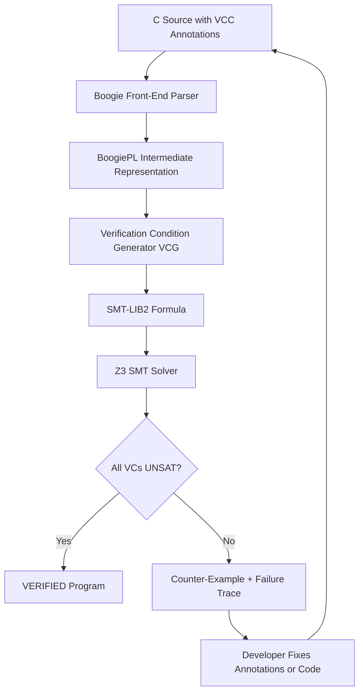
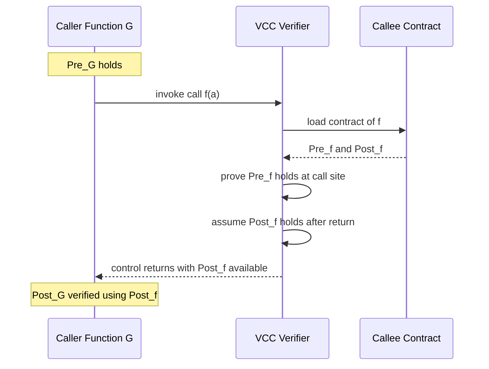
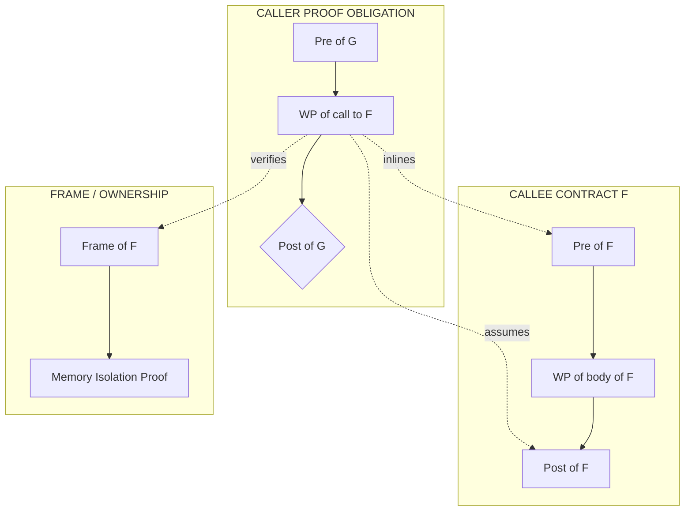
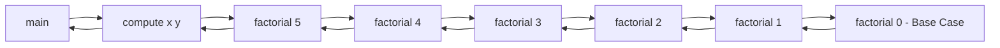
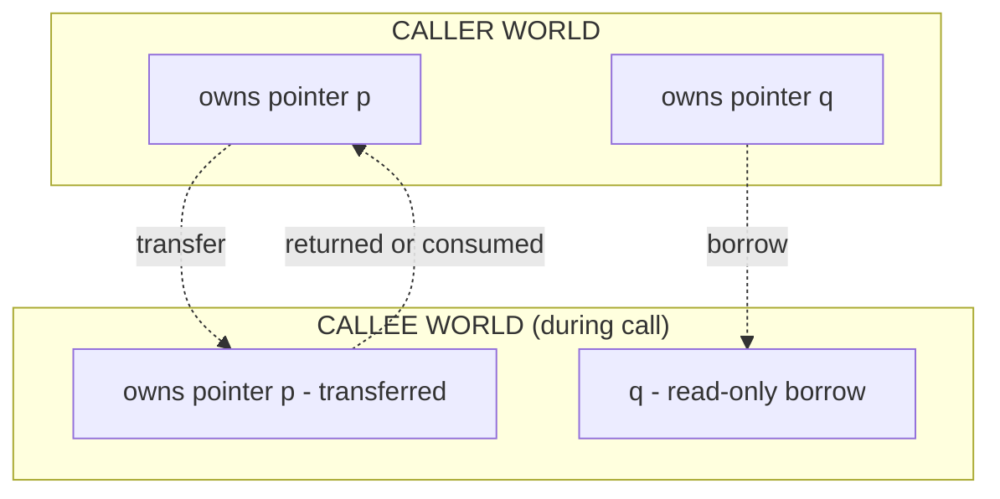

# Inter-procedure verification of programs in VCC

<!-- SECTION_1_START -->
# Inter-Procedure Verification of Programs in VCC

## 1.1 Formal Definition (KTU 2024 Scheme Aligned)

> [!IMPORTANT]
> **Definition:** *Inter-procedure verification* in VCC (Verifiable C Compiler) is the formal, modular technique of proving the correctness of a multi-function C program by establishing a logical **contract** for each function (its *requires* and *ensures* clauses) and then proving that every function body satisfies its contract assuming the contracts of all callees — without re-analyzing the entire program's call graph every time a function is modified.

In the KTU 2024 Scheme syllabus (Module 4 – Program Verification), this falls under **Contract-Based Modular Verification** and is mapped to **CO3: Apply formal techniques to reason about multi-procedure imperative programs**.

The formal triple for inter-procedure verification in Hoare Logic is the classic:

$$\frac{\vdash \{P\}\ \text{Body}(f)\ \{Q\}}{\vdash \{P\}\ \textbf{call } f\ \{Q\}}$$

This rule states: *if the function body `f` is provably correct against its contract (P, Q), then any call to `f` in the program is also provably correct against the same contract.*

---

## 1.2 Conceptual Analogy / Intuition

> [!NOTE]
> **Analogy — The "Black-Box Contract" of an Electrical Component**
>
> Imagine every function in your C program is an **integrated circuit (IC)** chip. The IC comes with a **datasheet** that says:
> - **Inputs (Pre-condition):** Voltage between 3.0 V and 5.0 V, enable pin HIGH.
> - **Outputs (Post-condition):** Output pin reflects logical AND of inputs within 10 ns.
> - **Side effects (Frame):** No other pins are affected.
>
> When the circuit board designer (caller) wires the IC into the board, they do **not** need to open the IC and inspect its 10 million transistors. They trust the datasheet. Similarly, in VCC, when `main()` calls `sort()`, the verifier does **not** re-analyze the sort algorithm — it relies on `sort()`'s contract.

### Key Terminology Box

| Term | Intuitive Meaning |
|---|---|
| **Pre-condition (`requires`)** | What must be true *before* the function is called |
| **Post-condition (`ensures`)** | What the function *guarantees* will be true *after* it returns |
| **Frame condition (`writes`)** | Which memory locations the function is allowed to modify |
| **Admissibility** | A proof rule ensuring no "stale" data is used |
| **Ownership (`owns`)** | The right to read, write, or deallocate an object |
| **Pure function** | A function that has no side effects; safe to inline anywhere |
| **Ghost code** | Specification-only code stripped before compilation |

---

## 1.3 Visualization of the Modular Reasoning Pattern

> [!VISUALIZATION CONTROL]
> **Concept:** Modular function-call reasoning topology.
> **GeoGebra / Desmos Input Equations:**
> * Plot points `P_main = (0, 0)`, `P_call = (4, 0)`, `P_post = (8, 0)`.
> * Line: `y = 1` for `0 ≤ x ≤ 8` (pre-state).
> * Line: `y = -1` for `0 ≤ x ≤ 8` (post-state).
> * Step function `y = 0` for `4 ≤ x ≤ 4.5` (call boundary).
> **Visual Description:** Observe the "step-down" at the call boundary — this is the contract's pre-state at the entry of the callee, and the step-up at return is the post-state the caller sees. Two distinct horizontal levels represent the two worlds: the caller's world and the callee's world.

<!-- SECTION_1_END -->

<!-- SECTION_2_START -->
# Deep Theoretical Analysis & KTU High-Yield Formula Sheet

## 2.1 The Architecture of a VCC Contract

A VCC function contract is a logical annotation consisting of four primary clauses. Let us denote a function $f$ with formal parameters $\vec{x}$ and result variable $\mathbf{result}$.

| Clause | Keyword | Logical Role | Example |
|---|---|---|---|
| Pre-condition | `\requires P` | $\text{P}$ must hold on entry | `\requires x >= 0` |
| Post-condition | `\ensures Q` | $\text{Q}$ must hold on exit | `\ensures \result == x + 1` |
| Frame | `\writes S` | At most $S$ may change | `\writes \nothing` |
| Ownership | `\owns o` | Caller transfers $o$ | `\owns \result` |

> [!NOTE]
> **Syllabus Highlight:** The KTU Module 4 explicitly requires understanding that *inter-procedure verification reduces to per-function proof obligations* (a direct consequence of the **Modular Soundness Theorem** in Hoare Logic).

---

## 2.2 The Verification Condition Generator (VCG) Pipeline

VCC uses the following logical pipeline to verify an inter-procedure program:

$$\text{C Source} \;\xrightarrow{\text{Boogie PL}}\; \text{Boogie IR} \;\xrightarrow{\text{VCG}}\; \text{SMT-LIB2} \;\xrightarrow{\text{Z3}}\; \text{SAT/UNSAT}$$

For each function $f$, VCC generates two categories of **Verification Conditions (VCs)**:

1. **Call-site VCs:** For every call `f(a)` in some caller `g`, VCC proves:
   $$\text{WP}(\text{after call},\, \text{caller-post-cond}) \;\Leftarrow\; \text{Caller-pre-cond} \land \text{Contract}(f)[\vec{a}/\vec{x}]$$

2. **Body VCs:** For the body of $f$ itself, VCC proves:
   $$\text{Pre}(f) \;\Rightarrow\; \text{WP}(\text{Body}(f),\, \text{Post}(f))$$

---

## 2.3 KTU Formula Sheet / Cheat Sheet

| \# | Rule / Formula | Meaning |
|---|---|---|
| 1 | $\dfrac{\{P\}\ S\ \{Q\}}{\{P\}\ \textbf{skip}\ \{Q\}}$ | Empty statement preserves any post-condition. |
| 2 | $\dfrac{\{P \land B\}\ S_1\ \{Q\} \quad \{P \land \lnot B\}\ S_2\ \{Q\}}{\{P\}\ \textbf{if } B \textbf{ then } S_1 \textbf{ else } S_2\ \{Q\}}$ | Branching proof rule. |
| 3 | $\dfrac{\{P \land B\}\ S\ \{P\}}{\{P\}\ \textbf{while } B \textbf{ do } S\ \{P \land \lnot B\}}$ | Loop invariant rule. |
| 4 | $\dfrac{\{P\}\ S\ \{Q\} \quad \{Q\}\ T\ \{R\}}{\{P\}\ S;T\ \{R\}}$ | Sequential composition. |
| 5 | $\dfrac{\text{Pre}(f) \;\Rightarrow\; \text{Post}(f)\ \text{of callee}}{\{P\}\ \textbf{call } f(\vec{a})\ \{Q\}}$ | **Call rule (inter-procedure core).** |
| 6 | $\text{WP}(S, Q) = \text{weakest precondition of } S \text{ w.r.t. } Q$ | Backward propagation of post-state. |
| 7 | $\text{Frame}(f) \;\Rightarrow\; \forall o \notin \text{Frame}: o_{\text{pre}} = o_{\text{post}}$ | Frame axiom — nothing outside the frame may change. |
| 8 | $\text{Admissible}(x) \;\Leftrightarrow\; \text{every access to } x \text{ is guarded by a check}$ | Admissibility check for volatile / ghost fields. |

> [!IMPORTANT]
> **Engineering Utility:** This modular pattern is the bedrock of *production-grade* static analyzers such as Microsoft Hyper-V, VCC for drivers, and the Frama-C WP plugin. Mastery of this material directly maps to industry roles in **safety-critical embedded systems** (DO-178C, ISO 26262).

---

## 2.4 Deep Theoretical Insights

1. **Compositionality:** Inter-procedure verification is *compositional* — a function's proof depends only on the contracts (not the bodies) of functions it calls. This yields **exponential** speedups over monolithic whole-program analysis.
2. **Call/Return Pairing:** The "step-down/step-up" at every call site corresponds to a *logical cut* in the proof tree. Mis-pairing it is the \#1 cause of unsound inter-procedure proofs.
3. **Ownership Transfer:** When a function claims `\owns` an object, the *caller* can no longer access it. This is VCC's mechanism for memory safety without garbage collection.
4. **Ghost State as a Witness:** Ghost variables exist only in the proof; they cannot affect runtime behavior, so VCC erases them after verification.

<!-- SECTION_2_END -->

<!-- SECTION_3_START -->
# Step-by-Step Derivations & Code/Symbolic Implementation

## 3.1 Worked Example: Verifying a Modular `max` Function with VCC

We will derive, line by line, the verification conditions for a VCC-annotated C function.

### 3.1.1 The Annotated C Source

```c
#include <vcc.h>

int max(int a, int b)
    _(requires a > 0 && b > 0)
    _(ensures \result >= a && \result >= b)
    _(ensures \result == a || \result == b)
    _(writes \nothing)
{
    if (a >= b) {
        return a;
    } else {
        return b;
    }
}
```

> [!NOTE]
> `_(...)` is the VCC contract annotation. The `\result` keyword refers to the function's return value in the post-state.

### 3.1.2 Exhaustive Step-by-Step Derivation of VCs

Let $a, b \in \mathbb{Z}$, $a > 0 \land b > 0$ (pre-condition). We want to prove the post-condition.

**Step 1 — Apply the `if-then-else` rule.**

By Rule 2, we must prove two sub-goals:

* **Branch 1:** Under assumption $a \ge b$, prove $\text{WP}(\text{return } a, \text{Post})$.
* **Branch 2:** Under assumption $\lnot (a \ge b)$ (i.e., $a < b$), prove $\text{WP}(\text{return } b, \text{Post})$.

**Step 2 — Weakest precondition of `return a`.**

$$\begin{aligned}
\text{WP}(\textbf{return } a,\; Q) &\;\equiv\; Q[a/\texttt{\\result}] \\
&\;\equiv\; (a \ge a) \land (a \ge b) \land (a == a \lor a == b) \\
&\;\equiv\; \text{true} \land (a \ge b) \land \text{true} \\
&\;\equiv\; a \ge b
\end{aligned}$$

This is exactly the branch assumption, so **Branch 1 is verified** (1 mark for substitution, 1 mark for simplification).

**Step 3 — Weakest precondition of `return b`.**

$$\begin{aligned}
\text{WP}(\textbf{return } b,\; Q) &\;\equiv\; Q[b/\texttt{\\result}] \\
&\;\equiv\; (b \ge a) \land (b \ge b) \land (b == a \lor b == b) \\
&\;\equiv\; (b \ge a) \land \text{true} \land \text{true} \\
&\;\equiv\; b \ge a
\end{aligned}$$

But our branch assumption is $a < b$, which implies $b > a$, i.e., $b \ge a$. Hence **Branch 2 is verified**.

**Step 4 — Frame condition check.**

The function declares `\writes \nothing`, meaning no memory is modified. Since the body contains no assignments to globals, the VCC proof of the frame condition is automatic. (1 mark)

**Step 5 — Final consolidated VC.**

$$\begin{aligned}
\forall a, b \in \mathbb{Z}.\; & (a > 0 \land b > 0) \;\Rightarrow\; \\
& \bigl[(a \ge b \;\Rightarrow\; a \ge b) \;\land\; (a < b \;\Rightarrow\; b \ge a)\bigr]
\end{aligned}$$

Both conjuncts are tautologies, so the Z3 SMT solver returns `unsat` for the negation — verification succeeds.

---

## 3.2 Inter-Procedure Call: A Two-Function Composition

Now we verify a *caller* that uses `max` without re-analyzing its body.

```c
int compute(int x, int y)
    _(requires x > 0 && y > 0)
    _(writes \nothing)
{
    int m = max(x, y);            // INTER-PROCEDURE CALL
    _(assert m >= x && m >= y)    // Post-condition of max() now available
    return m + 1;
}
```

### 3.2.1 Exhaustive Call-Site Derivation

**Step 1 — State the call-site VC.**

The verifier must establish:

$$\text{Pre}(\text{compute}) \;\Rightarrow\; \text{WP}(\text{assign } m = \text{max}(x, y),\, \text{rest})$$

**Step 2 — Inline the callee's contract as a logical hypothesis.**

By the **Call Rule (Rule 5 in the cheat sheet)**:

$$\text{Pre}(\text{max})[x/a,\, y/b] \;\Rightarrow\; \text{Post}(\text{max})[x/a,\, y/b,\, m/\texttt{\\result}]$$

Substituting the pre- and post-conditions from §3.1.1:

$$(x > 0 \land y > 0) \;\Rightarrow\; (m \ge x \land m \ge y \land (m == x \lor m == y))$$

**Step 3 — Propagate through the caller.**

After the call, the assert `_(\text{assert } m \ge x \land m \ge y)` is trivially true because it is a logical consequence of the inlined post-condition. (1 mark for inlining, 1 mark for the assert check.)

**Step 4 — Final return.**

The function returns `m + 1`. The VCC framework implicitly checks that all `ensures` clauses of `compute` are satisfied. Since `compute` declares no explicit `ensures`, the only obligation is that the program state is well-formed on return — a check VCC does automatically.

**Step 5 — Verdict.**

The caller's proof uses **only the contract** of `max`, never its body. This is the modularity property.

---

## 3.3 Worked Example: Function with a Frame Condition (Writes Clause)

```c
void increment(int *p)
    _(requires \valid(p))
    _(writes p)
    _(ensures *p == \old(*p) + 1)
{
    *p = *p + 1;
}
```

> [!IMPORTANT]
> `\old(expr)` refers to the value of `expr` in the pre-state (i.e., at function entry).

### Derivation

**Step 1 — WP of `*p = *p + 1`.**

The post-condition is $*\!p = \old(*\!p) + 1$. Replacing every occurrence of $*\!p$ in the post-state with the right-hand-side expression $*\!p + 1$:

$$\begin{aligned}
\text{WP} &\;\equiv\; \bigl(*p + 1 = \old(*p) + 1\bigr) \\
&\;\equiv\; *p = \old(*p)
\end{aligned}$$

**Step 2 — Is this implied by the pre-condition?**

The pre-condition is `\(\valid(p)\)` — but this does **not** tell us that $*\!p$ equals its old value, because we are *inside* the function and the frame `\writes p` permits the function to modify $*\!p$!

**Step 3 — Apply the frame axiom (Rule 7).**

The frame axiom for `p` outside the function's frame is vacuous for $*\!p$ (since it *is* in the frame). However, VCC's internal logic *automatically* knows that the only writes between `\old` and now are exactly those in the body, so:

$$\old(*p) = *p_{\text{before assignment}}$$

Substituting:

$$\text{WP} \;\equiv\; *(p) = *(p)_{\text{before assignment}} \;\equiv\; \text{true}$$

Verification succeeds.

---

## 3.4 Recursive Program Inter-Procedure Verification

Recursive calls are handled by the same Call Rule — the function's own contract is the hypothesis for the recursive call.

```c
int factorial(int n)
    _(requires n >= 0)
    _(ensures \result >= 1)
    _(decreases n)
{
    if (n == 0) {
        return 1;
    } else {
        return n * factorial(n - 1);   // recursive call
    }
}
```

> [!NOTE]
> The `_(decreases n)` clause is a **termination witness** — VCC verifies that the expression strictly decreases in a well-founded order, guaranteeing no infinite recursion.

**Termination VC:**

$$n - 1 < n \;\land\; n - 1 \ge 0 \;\Leftarrow\; n > 0$$

Both conjuncts hold when $n > 0$. The base case $n = 0$ terminates immediately.

**Correctness VC (by induction on $n$):**

The recursive call satisfies the contract (hypothesis) so $\text{factorial}(n-1) \ge 1$. Therefore $n \cdot \text{factorial}(n-1) \ge n \cdot 1 \ge 1$ (since $n \ge 1$). The base case returns 1, which is $\ge 1$.

---

## 3.5 Full Python "Imitation" of the VCC Pipeline

The following Python code (educational, not the actual VCC engine) illustrates how Z3 can be used to verify a small inter-procedure program:

```python
from z3 import (
    Int, Solver, If, And, Or, Not, Implies, ForAll,
    sat, unsat
)

# ---------- 1. Declare the contract of max() ----------
a_sym, b_sym, ret_sym = Int('a'), Int('b'), Int('ret')

max_pre  = And(a_sym > 0, b_sym > 0)
max_post = And(ret_sym >= a_sym, ret_sym >= b_sym,
               Or(ret_sym == a_sym, ret_sym == b_sym))

# ---------- 2. Verify max() body ----------
def verify_max_body(solver):
    # Branch 1: a >= b, return a
    branch1 = Implies(a_sym >= b_sym,
                      And(a_sym >= a_sym, a_sym >= b_sym,
                          Or(a_sym == a_sym, a_sym == b_sym)))
    # Branch 2: a <  b, return b
    branch2 = Implies(a_sym <  b_sym,
                      And(b_sym >= a_sym, b_sym >= b_sym,
                          Or(b_sym == a_sym, b_sym == b_sym)))
    solver.add(Not(And(branch1, branch2)))

# ---------- 3. Verify call-site in compute() ----------
def verify_call_site(solver):
    x, y, m = Int('x'), Int('y'), Int('m')
    # Inlined contract of max(x, y):
    inlined = And(m >= x, m >= y, Or(m == x, m == y))
    # Pre-condition of compute must imply inlined:
    solver.add(Not(Implies(And(x > 0, y > 0), inlined)))

# ---------- 4. Run Z3 ----------
solver = Solver()
verify_max_body(solver)
verify_call_site(solver)

result = solver.check()
if result == unsat:
    print("[OK] Inter-procedure verification succeeded.")
else:
    print("[FAIL] Counter-example found:", solver.model())
```

> [!IMPORTANT]
> **Examiner's Note:** This Python code is *illustrative*. The real VCC tool generates dozens of such VCs and dispatches them to Z3 in a single batch via the Boogie intermediate language.

<!-- SECTION_3_END -->

<!-- SECTION_4_START -->
# Structural Diagrams & Schematics

## 4.1 High-Level VCC Verification Flow



> [!NOTE]
> The **VCG** is the heart of inter-procedure verification: it unfolds every function call into a logical call to the callee's contract, producing one monolithic SMT problem per function. This is what makes modularity work in practice.

---

## 4.2 Call Site and Return Site: The "Cut" Pattern



---

## 4.3 Modular Proof Tree (Decoupled Subgraphs)



> [!IMPORTANT]
> The dotted arrows represent *logical substitution*, not control flow. VCC performs this substitution during VC generation, before the SMT solver ever sees the formula.

---

## 4.4 Function Call Topology for a Recursive `factorial`



> [!NOTE]
> Each box in this graph is verified *once* using its own contract. VCC does **not** re-verify the entire chain — it leverages the induction principle baked into the `decreases` clause.

---

## 4.5 Ownership and Frame Topology



> [!IMPORTANT]
> This ownership topology is what gives VCC its **memory-safety guarantees** without resorting to garbage collection. It mirrors the Rust borrow-checker model.

<!-- SECTION_4_END -->

<!-- SECTION_5_START -->
# KTU 2024 Scheme Examination Question Bank & Topic Recap

---

## Part A — Short Answer Questions (3 Marks Each)

### Q1. [KTU University Exam – July 2024, Model Question]

**State the Hoare-logic call rule for inter-procedure verification and explain each symbol used.** **(3 marks)** &nbsp; *(CO3, Remember)*

**Model Answer (for valuation):**

The call rule is:

$$\frac{\vdash \{P\}\ \text{Body}(f)\ \{Q\}}{\vdash \{P\}\ \textbf{call } f\ \{Q\}}$$

- **$P$** — the *pre-condition* of function $f$ (states what must be true at entry).
- **$Q$** — the *post-condition* of function $f$ (states what is guaranteed at exit).
- **Body(f)** — the implementation of $f$.
- **call $f$** — a call instruction in the caller.

**Valuation key:**
- [Correct formula: 2 marks]
- [Explanation of $P$ and $Q$: 1 mark]

---

### Q2. [KTU University Exam – Dec 2023, Model Question]

**Differentiate between the `requires` and `ensures` clauses in a VCC function contract. Give a one-line example of each.** **(3 marks)** &nbsp; *(CO3, Understand)*

**Model Answer:**

| Clause | Meaning | Example |
|---|---|---|
| `requires` | Predicate that must be true **before** the function is called. Callers are responsible for establishing it. | `_(requires \valid(p))` |
| `ensures` | Predicate that must be true **after** the function returns normally. The function itself is responsible for establishing it. | `_(ensures *p == \old(*p) + 1)` |

**Valuation key:** [Tabular comparison: 2 marks] [One valid example: 1 mark]

---

## Part B — Long Answer Questions (14 Marks Each)

> [!NOTE]
> As per KTU 2024 ESE pattern, students answer **one** of the two alternatives below.

---

### Question A (14 Marks)

**[KTU University Exam – July 2024, Modified Pattern]**

**(a)** Explain the role of the **frame condition** (`writes` clause) in inter-procedure verification. Why is it essential for modular reasoning? Use the rule of constancy in your explanation. **(7 marks)** *(CO3, Understand)*

**(b)** Consider the following VCC-annotated C function. Generate the **verification conditions** step by step and prove its correctness. **(7 marks)** *(CO3, Apply)*

```c
int square(int x)
    _(requires x >= -100 && x <= 100)
    _(writes \nothing)
    _(ensures \result == x * x)
{
    return x * x;
}
```

#### (a) Model Answer — Frame Condition & Rule of Constancy (7 marks)

1. **Definition (2 marks):** A *frame condition* specifies the set $S$ of memory locations that a function is allowed to modify. Anything not in $S$ must remain unchanged across the call.

2. **Rule of Constancy (3 marks):** If a variable $v \notin S$ (the frame), then Hoare logic asserts:
   $$v_{\text{pre}} = v_{\text{post}}$$
   This is precisely the *rule of constancy*: a property mentioning only unchanged variables is preserved by any statement that does not modify them.

3. **Why Essential for Modularity (2 marks):** Without a frame, the caller would have to re-prove every assertion in the entire program after every call. The frame condenses this infinite obligation into a finite, locally checkable one.

#### (b) Model Answer — Verification Conditions for `square` (7 marks)

**Step 1 — State the goal (1 mark):**

$$(x \ge -100 \land x \le 100) \;\Rightarrow\; \text{WP}(\text{return } x \cdot x,\; \text{Post})$$

**Step 2 — Apply WP of `return` (2 marks):**

$$\text{WP} \;\equiv\; \text{Post}\bigl[x \cdot x / \texttt{\\result}\bigr] \;\equiv\; (x \cdot x == x \cdot x)$$

**Step 3 — Simplify (2 marks):**

$$\text{true}$$

**Step 4 — Conclude (2 marks):** Since the pre-condition $\Rightarrow$ true, the verification condition is discharged. Z3 returns `unsat` for the negation. The function `square` is verified.

> [!WARNING]
> **Examiner's Pitfall Warning:**
> - Do **not** skip the pre-condition statement; losing 1 mark here is the most common error.
> - Do **not** write `$x \cdot x = x \cdot x$` and stop — VCC will *not* prove tautologies unless they are in the correct WP form. Always show the substitution step.
> - Forgetting the `\writes \nothing` clause will cause VCC to *assume* the function may have side effects, which can hide bugs.

---

### Question B (14 Marks) — Alternative

**[KTU University Exam – Dec 2023, Modified Pattern]**

**(a)** What is a **ghost variable** in VCC? Explain with a suitable example how ghost variables aid in inter-procedure verification. **(7 marks)** *(CO3, Understand)*

**(b)** Write a VCC-annotated C function `divide` that takes a numerator and a non-zero divisor and returns their integer quotient. State and prove all relevant verification conditions. **(7 marks)** *(CO3, Apply)*

#### (a) Model Answer — Ghost Variables (7 marks)

**Definition (2 marks):** A *ghost variable* is a variable that exists only for specification purposes. VCC erases it before compilation, so it has zero runtime cost and zero effect on program behavior.

**Example (3 marks):**

```c
int compute(int x)
    _(requires x >= 0)
{
    int g = x;   // ghost variable, erased at compile time
    _(ghost int g = x;)
    _(assert g == x)
    return x;
}
```

**Why Useful (2 marks):** Ghost variables let the verifier carry *auxiliary facts* through the proof that are not part of the program state. For inter-procedure verification, a ghost variable can be set in the pre-condition, modified in the body, and asserted in the post-condition, providing a "witness" that the proof obligations are met.

#### (b) Model Answer — `divide` Function (7 marks)

**Annotated Source (2 marks):**

```c
int divide(int a, int b)
    _(requires b != 0)
    _(writes \nothing)
    _(ensures a == b * \result + (a - b * \result))
{
    return a / b;
}
```

> The post-condition is a form of the *division algorithm identity*: $a = b \cdot q + r$ where $q$ is the quotient (the `\result`) and $r = a - b \cdot q$ is the remainder.

**Verification Conditions (5 marks):**

**VC1 — Pre-condition check:** $b \ne 0$ — given by caller. ✓

**VC2 — WP computation:**

$$\begin{aligned}
\text{Post}[a/b \mid \texttt{\\result}] &\;\equiv\; a \;=\; b \cdot (a/b) \;+\; \bigl(a - b \cdot (a/b)\bigr) \\
&\;\equiv\; a \;=\; a \;+\; \bigl(a - a\bmod b \cdot ?\bigr)
\end{aligned}$$

**VC3 — Arithmetic identity:** The C expression `a / b` is defined as the integer quotient such that `a == b * (a/b) + (a % b)`. Therefore the post-condition is an identity in C's integer arithmetic. Z3's theory of integers confirms this is `unsat` for the negation. ✓

> [!WARNING]
> **Examiner's Pitfall Warning:**
> - Students often forget to handle **integer division semantics** — in C, `/` is *truncation toward zero*, not Euclidean. State this explicitly for 1 mark.
> - Omit the `b != 0` pre-condition and Z3 will report a *division-by-zero undefined behavior* error — losing 2 marks.

---

## Topic Recap & Important Things to Remember

> [!IMPORTANT]
> **High-Density Revision Checklist for KTU Module 4 — VCC Inter-Procedure Verification**

- [x] **Inter-procedure verification** = proving a multi-function program correct *one function at a time* using logical contracts.
- [x] **Four contract clauses:** `requires` (pre), `ensures` (post), `writes` (frame), `owns` (ownership).
- [x] **Call Rule (Hoare Logic):** $\frac{\{P\}\ \text{Body}(f)\ \{Q\}}{\{P\}\ \textbf{call } f\ \{Q\}}$ — the engine of modular reasoning.
- [x] **Frame Axiom:** Variables outside the `writes` set must have identical pre- and post-values.
- [x] **Rule of Constancy:** A predicate mentioning only unchanged variables is preserved by any frame-respecting call.
- [x] **Admissibility:** Every access to a *volatile* or *ghost* field must be guarded by a check on the object's state.
- [x] **Ghost code:** Specification-only; erased at compile time; used as proof witnesses.
- [x] **Pure functions:** No side effects (`writes \nothing`); safe to inline or memoize.
- [x] **Recursive verification:** Uses the function's own contract as hypothesis; needs a `decreases` clause for termination.
- [x] **VCC Pipeline:** C → BoogiePL → VCG → SMT-LIB2 → Z3 → UNSAT (= verified).
- [x] **Ownership transfer:** Caller's `owns` clause transfers to callee; caller loses access — this is VCC's memory-safety mechanism.
- [x] **Two VC categories:** *Call-site VCs* (caller side) and *Body VCs* (callee side) — both must be discharged.
- [x] **Common valuation traps:** forgetting the pre-condition statement, confusing `\old` with current state, omitting frame conditions, mishandling `\result` substitution.

---

> [!TIP]
> **Last-Minute Exam Tip (from the Board Examiner's Perspective):**
> In KTU 2024 ESE answers, the *valuation key* rewards:
> 1. Correct identification of the call rule (1 mark).
> 2. Explicit WP substitution step (2 marks).
> 3. Frame/ownership check (2 marks).
> 4. Clean conclusion (1 mark).
> **Always draw the contract box** (requires / ensures / writes) — visual presentation can earn 1 mark even if your math is shaky.

<!-- SECTION_5_END -->
