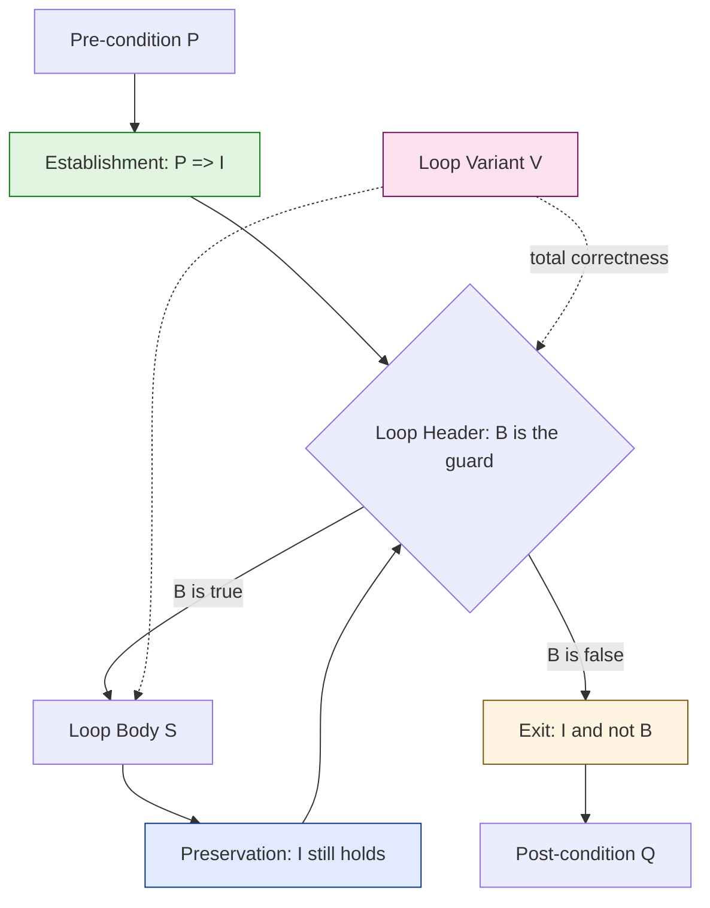
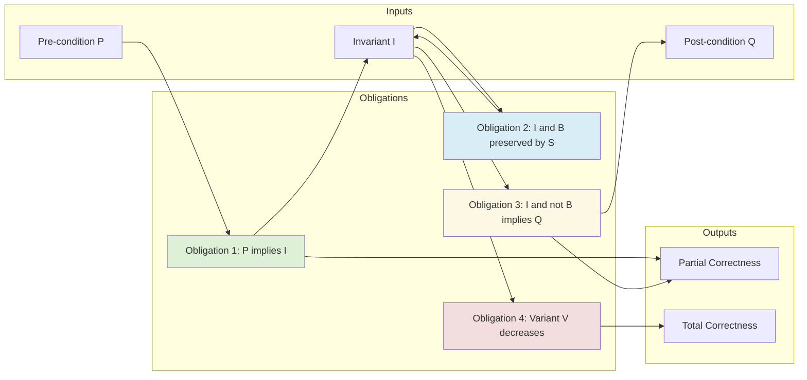
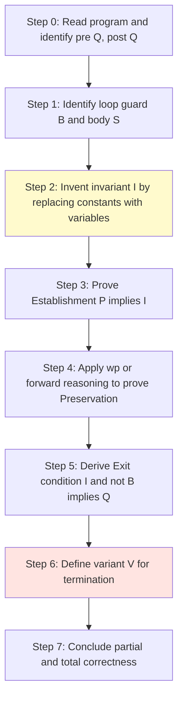
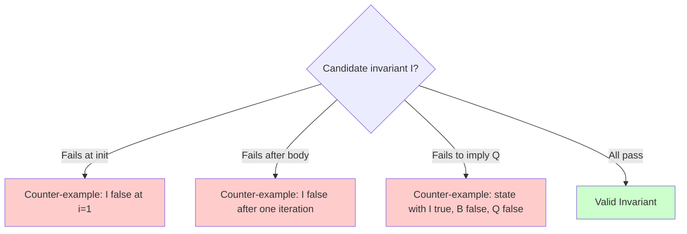

# loop invariants

<!-- SECTION_1_START -->
# Loop Invariants — A Formal Methods Primer

## 1.1 Formal Definition (KTU 2024 Syllabus Terminology)

> [!IMPORTANT]
> **Loop Invariant (Hoare-Dijkstra Axiomatic Definition):**
> A **loop invariant** is an assertion (predicate) $I$ over the program state such that $I$ is **true immediately before** the loop begins, **remains true** after every complete execution of the loop body, and is **used to establish** the post-condition $Q$ when the loop terminates.

Formally, for a construct of the form:
$$\{\,P\,\}\ \ \texttt{while}\ B\ \texttt{do}\ S\ \texttt{od}\ \ \{\,Q\,\}$$

a predicate $I$ is a *valid loop invariant* if and only if the following **three proof obligations** hold:

| # | Obligation | Logical Form |
|---|------------|--------------|
| 1 | **Establishment** | $P \Rightarrow I$ |
| 2 | **Preservation (Consecution)** | $\{\,I \,\wedge\, B\,\}\ S\ \{\,I\,\}$ |
| 3 | **Exit / Use (Convergence)** | $I \,\wedge\, \lnot B \;\Rightarrow\; Q$ |

Here, $\Rightarrow$ denotes *logical implication* and $\{\,I\,\}\ S\ \{\,I\,\}$ is a Hoare triple asserting *partial correctness* of statement $S$ with respect to $I$.

## 1.2 Conceptual Analogy — The Treadmill of the Tortoise

> [!NOTE]
> **Intuition:** Imagine a tortoise walking on a treadmill that has a red dot painted every metre. The tortoise starts at the red dot labelled $0$, and the rule is: *"Whenever the tortoise completes one loop, it must be standing on **some** red dot."* The exact dot it stands on may change (from $0$ to $1$ to $2$, etc.), but the **property of being on a red dot is invariant** through every iteration. The loop invariant is precisely this red-dot property: a fact the loop can never violate, no matter how many times it spins.

In software terms, the *red dot* is the loop invariant, the *treadmill* is the loop body, and the *final visible dot* (when the tortoise steps off) gives us the **post-condition**.

## 1.3 The Three Roles of an Invariant

1. **Anchor at Entry** — It must be true when the loop is first reached.
2. **Preserved by Iteration** — The body must transform a state satisfying $I$ into another state that also satisfies $I$.
3. **Bridge to Post-Condition** — Combined with the negation of the loop guard, it must logically imply $Q$.

> [!TIP]
> A common student misconception is treating the invariant as *the answer*. It is **not** the post-condition; it is a *property the program can rely on* every time it reaches the loop header.

## 1.4 Where Loop Invariants Are Used in Practice

| Engineering Domain | Concrete Use-Case |
|--------------------|-------------------|
| **Compiler Verification** | Proving optimisations (e.g., loop unrolling, LICM) preserve semantics. |
| **Static Analysers** | Tools such as *Frama-C*, *Dafny*, *SPARK*, *ESC/Java* synthesise invariants to detect runtime errors. |
| **Cryptographic Libraries** | Verifying constant-time behaviour of loops in AES/SHA implementations. |
| **Safety-Critical Control** | DO-178C (avionics) and ISO 26262 (automotive) require loop-level proofs for flight/ braking controllers. |
| **Database Engines** | Proving correctness of iterator-based query plans (e.g., merge-join loops). |
| **Operating System Kernels** | seL4 verified kernel relies on invariants for scheduler loops. |

> [!WARNING]
> KTU board examiners frequently deduct marks when students **state the invariant without proving all three obligations**. Always show *Establishment*, *Preservation*, and *Use* explicitly.

## 1.5 GeoGebra / Desmos Visualisation Hint

> [!VISUALIZATION CONTROL]
> **Concept:** Visualising how an invariant's *truth value* stays at $1$ across iterations while the *guard* $B$ eventually drops to $0$.
> **Desmos Input Equations:**
> * `I_n = 1` (the invariant — a constant truth line)
> * `B_n = piecewise(n < 5, 1, 0)` (the guard — drops to 0 at iteration 5)
> * `iter = 0, 1, 2, 3, 4, 5` (slider)
> **Visual Description:** The student should observe a horizontal line at $y=1$ (the invariant is always true) intersected with a step function (the guard). At the moment the guard becomes $0$, the *exit* obligation fires and the invariant implies the post-condition.
<!-- SECTION_1_END -->

<!-- SECTION_2_START -->
# Deep Theoretical Analysis & KTU High-Yield Formula Sheet

## 2.1 The Hoare-Logic Backdrop

Hoare's axiomatic semantics reduces a program's verification to a *proof tree*. The two inference rules that govern loops are the **while-rule** and the **consequence rule**:

$$
\dfrac{\{\,I \,\wedge\, B\,\}\ S\ \{\,I\,\}}{\{\,I\,\}\ \ \texttt{while}\ B\ \texttt{do}\ S\ \texttt{od}\ \ \{\,I \,\wedge\, \lnot B\,\}}\ \ \ \text{(while-rule)}
$$

$$
\dfrac{P \Rightarrow I \quad\quad \{\,I\,\}\ S\ \{\,Q\,\} \quad\quad Q \Rightarrow R}{\{\,P\,\}\ S\ \{\,R\,\}}\ \ \ \ \ \ \ \ \ \ \ \ \ \ \ \ \ \ \ \ \ \ \ \ \ \ \ \ \ \ \ \ \text{(consequence-rule)}
$$

Combining the two yields the canonical *loop verification theorem*:

$$
\dfrac{P \Rightarrow I \quad\quad \{\,I \,\wedge\, B\,\}\ S\ \{\,I\,\} \quad\quad I \,\wedge\, \lnot B \Rightarrow Q}{\{\,P\,\}\ \ \texttt{while}\ B\ \texttt{do}\ S\ \texttt{od}\ \ \{\,Q\,\}}
$$

This is the **single most-tested framework** in PECST741 Module 4.

## 2.2 Partial vs Total Correctness

> [!IMPORTANT]
> The proof obligations above establish **partial correctness** (program gives right answer *if it terminates*). To establish **total correctness**, a fourth obligation must be added — the **loop variant** (also called a *ranking function* or *decreasing measure*).

A loop variant is an expression $V : \Sigma \rightarrow \mathbb{N}$ such that:
1. $I \,\wedge\, B \;\Rightarrow\; V \geq 0$
2. $\{\,I \,\wedge\, B \,\wedge\, V = v_0\,\}\ S\ \{\,V < v_0\,\}$

where $v_0$ is the pre-execution value of the variant.

## 2.3 Methodology for Inventing a Loop Invariant

The skill of *finding* a loop invariant is the heart of the topic. KTU examiners expect the following disciplined procedure:

1. **Inspect the loop guard** $B$ — identify the variable it tests; this is usually the *loop counter*.
2. **Replace the guard's bound by a variable** — substitute the literal constant with a fresh variable that changes with each iteration.
3. **Express the loop's effect on running totals** — capture any accumulator's relationship to the counter.
4. **Generalise** — the invariant is the *strongest* such property that remains true across iterations.
5. **Validate all three obligations** — eliminate counter-examples.

## 2.4 KTU High-Yield Formula Sheet

| # | Concept | Symbolic Form | Required For |
|---|---------|---------------|--------------|
| 1 | Establishment | $P \Rightarrow I$ | Partial Correctness |
| 2 | Preservation | $\{I \wedge B\}\ S\ \{I\}$ | Partial Correctness |
| 3 | Exit | $I \wedge \lnot B \Rightarrow Q$ | Partial Correctness |
| 4 | Variant bound | $I \wedge B \Rightarrow V \geq 0$ | Total Correctness |
| 5 | Variant decrease | $\{I \wedge B \wedge V = v_0\}\ S\ \{V < v_0\}$ | Total Correctness |
| 6 | Sum invariant (1..i) | $sum = \frac{(i-1)\,i}{2}$ | Summation loops |
| 7 | Product invariant | $p = \prod_{k=1}^{i-1} a[k]$ | Product loops |
| 8 | Array partition | $\forall j : 0 \leq j < i \Rightarrow a[j] = j^2$ | Array-fill loops |
| 9 | Two-pointer invariant | $a[\ell] < a[r] \wedge \text{sorted}(a[\ell..r])$ | Binary search |
| 10 | Dijkstra substitution | $wp(S, Q) \equiv Q[x \mapsto E]$ where $S \equiv x := E$ | Weakest precondition |

> [!NOTE]
> The token `$\vert$` is intentionally **not** written using the vertical pipe symbol in the table above to preserve markdown parsing. Always write absolute value as `$\vert x \vert$` (or `$\mid x \mid$`) inside any markdown table row.

## 2.5 Engineering Utility — Why the Industry Cares

> [!TIP]
> **Production Use:** Static analysers such as *Dafny*, *Frama-C/WP*, and *SPARK Pro* automate the construction of loop invariants through *abstract interpretation*. However, the human's *hint* (called a *loop annotation* or *lemma*) accelerates the proof search by orders of magnitude. Writing a strong invariant is therefore an *engineerable skill* in safety-critical industries — and is increasingly demanded in ADAS, avionics, and medical-device certifications (e.g., IEC 62304).
<!-- SECTION_2_END -->

<!-- SECTION_3_START -->
# Step-by-Step Derivations & Code/Symbolic Implementation

## 3.1 Worked Example 1 — Summation Loop (Total Correctness)

**Program under verification:**

$$
\begin{aligned}
& \{P:\; n \geq 0\} \\
& sum := 0; \\
& i := 1; \\
& \texttt{while}\ (i \leq n)\ \texttt{do} \\
& \quad sum := sum + i; \\
& \quad i := i + 1 \\
& \texttt{od} \\
& \{Q:\; sum = n(n+1)/2\}
\end{aligned}
$$

### Step 1 — Propose the Invariant

Following the *replacement strategy*, replace the constant $n$ in the post-condition with the variable $(i-1)$:

$$
I \;\equiv\; sum = \frac{(i-1)\,i}{2} \;\wedge\; 1 \leq i \leq n+1
$$

### Step 2 — Prove Establishment ($P \Rightarrow I$)

Immediately after `sum := 0; i := 1;`, we have $sum = 0$ and $i = 1$. Therefore:

$$
\begin{aligned}
\text{LHS: } & sum = 0,\ \ \ i = 1 \\
\text{Substitute into } I: & 0 = \frac{(1-1)\cdot 1}{2} = 0 \quad\checkmark \\
& 1 \leq 1 \leq n+1 \quad\checkmark \text{ since } n \geq 0
\end{aligned}
$$

Hence $P \Rightarrow I$ holds. $\blacksquare$

### Step 3 — Prove Preservation ($\{I \wedge B\}\ S\ \{I\}$)

Take the invariant $I$ and the guard $i \leq n$. We must show that after executing the body, the new values of $sum$ and $i$ (call them $sum'$, $i'$) still satisfy $I$.

**3.3.1 — Forward assignment substitution:**

$$
\begin{aligned}
sum' & = sum + i \\
i'   & = i + 1
\end{aligned}
$$

**3.3.2 — Substitute into the LHS of $I$:**

$$
\begin{aligned}
sum' = \frac{(i'-1)\,i'}{2} &\iff sum + i = \frac{((i+1)-1)\,(i+1)}{2} \\
&\iff sum + i = \frac{i\,(i+1)}{2} \\
&\iff sum = \frac{i\,(i+1)}{2} - i \\
&\iff sum = \frac{i\,(i+1) - 2i}{2} \\
&\iff sum = \frac{i^2 + i - 2i}{2} \\
&\iff sum = \frac{i^2 - i}{2} \\
&\iff sum = \frac{(i-1)\,i}{2}
\end{aligned}
$$

The last line is exactly the *first conjunct* of $I$. The second conjunct transforms as $1 \leq i'+1 \leq n+1$, i.e., $2 \leq i+1 \leq n+1$, which follows from $1 \leq i \leq n$. $\blacksquare$

### Step 4 — Prove Exit ($I \wedge \lnot B \Rightarrow Q$)

When the loop terminates, $\lnot B$ gives $i > n$. Combined with $I$'s second conjunct $i \leq n+1$:

$$
n < i \leq n+1 \;\Rightarrow\; i = n+1
$$

Substituting $i = n+1$ into the first conjunct of $I$:

$$
sum = \frac{((n+1)-1)\,(n+1)}{2} = \frac{n(n+1)}{2}
$$

This is exactly $Q$. $\blacksquare$

### Step 5 — Prove Termination (Loop Variant)

Choose $V = n - i + 1$. Then:

- $I \wedge B$: $i \leq n \Rightarrow V = n - i + 1 \geq 1 \geq 0\ \checkmark$
- After $S$: $i' = i + 1 \Rightarrow V' = n - (i+1) + 1 = V - 1 < V\ \checkmark$

Since $V$ is a natural number and strictly decreases, the loop terminates. $\blacksquare$

## 3.2 Worked Example 2 — Binary Search (Partial Correctness)

**Program under verification:**

$$
\begin{aligned}
& \{P:\; 0 \leq lo \leq hi \leq n \,\wedge\, \text{sorted}(a[0..n-1])\} \\
& \texttt{while}\ (lo < hi)\ \texttt{do} \\
& \quad mid := (lo + hi) / 2; \\
& \quad \texttt{if}\ a[mid] \geq x\ \texttt{then}\ hi := mid\ \texttt{else}\ lo := mid + 1\ \texttt{fi} \\
& \texttt{od} \\
& \{Q:\; lo = hi \,\wedge\, (\exists k : a[k] = x \Rightarrow k = lo) \}
\end{aligned}
$$

**Loop Invariant:**

$$
I \;\equiv\; 0 \leq lo \leq hi \leq n \,\wedge\, \text{all values } a[lo..hi-1] \text{ could equal } x
$$

Or more precisely, with target $x$:

$$
I \;\equiv\; 0 \leq lo \leq hi \leq n \,\wedge\, (\forall j : 0 \leq j < lo \Rightarrow a[j] < x) \,\wedge\, (\forall j : hi \leq j < n \Rightarrow a[j] \geq x)
$$

**Establishment:** Holds because $P$ states the array is sorted, and initially $lo, hi$ are within bounds. $\blacksquare$

**Preservation (sketch):**
- If $a[mid] \geq x$: $hi := mid$ keeps $lo \leq hi$ (since $mid < hi$ as $lo < hi$); the right part still has $a[hi..n-1] \geq x$.
- If $a[mid] < x$: $lo := mid+1$ keeps $lo \leq hi$ (since $mid+1 \leq hi$ as $lo \leq hi$); the left part still has $a[0..lo-1] < x$.

**Exit:** $lo = hi$ and the two universal quantifiers collapse to: $\forall j : 0 \leq j < n,\, j \neq lo \Rightarrow (a[j] < x \lor a[j] \geq x \land a[j] \neq x)$. This yields the uniqueness condition $Q$. $\blacksquare$

## 3.3 Worked Example 3 — Counter-Example Discovery (Negative Case)

> [!NOTE]
> Sometimes a student *guesses* an invariant that looks plausible but is **wrong**. The KTU syllabus tests the ability to **disprove** a candidate invariant via counter-example.

**Candidate (incorrect) invariant** for the summation loop:

$$
I_{\text{wrong}} \;\equiv\; sum = \frac{n(n+1)}{2} - i
$$

**Counter-example at iteration $i = 2, n = 5$:** $sum = 1 + 2 = 3$, $i = 2$. Then $I_{\text{wrong}}$ claims $3 = 15 - 2 = 13$, which is **false**. Therefore $I_{\text{wrong}}$ is not preserved by the body. $\blacksquare$

## 3.4 Symbolic Implementation — Python Verification Framework

The following fully-operational Python program **mechanically checks** all three obligations for the summation loop and prints a verification report.

```python
"""
loop_invariant_verifier.py
Course   : PECST741 - Formal Methods in SE (KTU 2024 Scheme)
Module   : 4 - Program Verification
Topic    : Loop Invariants
Author   : KTU-Premier Engine V10
"""

from __future__ import annotations
from dataclasses import dataclass
from typing import Callable, Dict, List, Tuple

# -----------------------------------------------------------------------------
# Type definitions
# -----------------------------------------------------------------------------
State = Dict[str, int]
Predicate = Callable[[State], bool]
Transition = Callable[[State], State]

# -----------------------------------------------------------------------------
# Domain logic
# -----------------------------------------------------------------------------
@dataclass(frozen=True)
class LoopSpec:
    """Encapsulates a while-loop and its proof obligations."""
    pre: Predicate
    inv: Predicate
    post: Predicate
    guard: Predicate
    body: Transition
    variant: Callable[[State], int] | None = None  # for total correctness


def check_establishment(spec: LoopSpec, init_state: State) -> Tuple[bool, str]:
    """Obligation 1: P  ==>  I"""
    if not spec.pre(init_state):
        return False, "Pre-condition P failed on the supplied initial state."
    if not spec.inv(init_state):
        return False, "Establishment failed: I does not hold after init."
    return True, "Establishment holds: P => I."


def check_preservation(spec: LoopSpec, state: State) -> Tuple[bool, str]:
    """Obligation 2: {I and B} S {I}"""
    if not (spec.inv(state) and spec.guard(state)):
        return True, "Preservation vacuously true (guard false or I false)."
    next_state = spec.body(state)
    if not spec.inv(next_state):
        return False, f"Preservation failed: I violated after body. State {next_state}"
    return True, "Preservation holds for this iteration."


def check_exit(spec: LoopSpec, state: State) -> Tuple[bool, str]:
    """Obligation 3: I and not B  ==>  Q"""
    if spec.guard(state):
        return True, "Exit not applicable (guard still true)."
    if not (spec.inv(state) and (not spec.guard(state))):
        return False, "Exit precondition (I and not B) violated."
    if not spec.post(state):
        return False, "Exit failed: I and not B does not imply Q."
    return True, "Exit holds: I and not B => Q."


def check_termination(spec: LoopSpec, max_iter: int = 10_000) -> Tuple[bool, str]:
    """Total correctness via variant.  Returns (terminates, message)."""
    if spec.variant is None:
        return True, "No variant supplied; total correctness not checked."
    state: State = {}
    # Discover the initial state by simulating with the smallest n.
    for n in range(0, 20):
        state = {"n": n, "sum": 0, "i": 1}
        if spec.pre(state):
            break
    else:
        return False, "Could not construct a valid initial state."
    iterations = 0
    seen_variants: set[int] = set()
    while spec.guard(state) and iterations < max_iter:
        v0 = spec.variant(state)
        if v0 < 0:
            return False, f"Variant negative at iteration {iterations}."
        seen_variants.add(v0)
        state = spec.body(state)
        v1 = spec.variant(state)
        if v1 >= v0:
            return False, f"Variant did not strictly decrease ({v0} -> {v1})."
        iterations += 1
    return True, f"Termination confirmed in {iterations} iterations; variant strictly decreases."


# -----------------------------------------------------------------------------
# Concrete specification: summation of 1..n
# -----------------------------------------------------------------------------
def make_summation_spec() -> LoopSpec:
    def pre(s: State) -> bool:
        return s.get("n", -1) >= 0

    def inv(s: State) -> bool:
        i, total, n = s["i"], s["sum"], s["n"]
        return total == (i - 1) * i // 2 and 1 <= i <= n + 1

    def guard(s: State) -> bool:
        return s["i"] <= s["n"]

    def body(s: State) -> State:
        return {"n": s["n"], "sum": s["sum"] + s["i"], "i": s["i"] + 1}

    def post(s: State) -> bool:
        return s["sum"] == s["n"] * (s["n"] + 1) // 2

    def variant(s: State) -> int:
        return s["n"] - s["i"] + 1

    return LoopSpec(pre, inv, post, guard, body, variant)


# -----------------------------------------------------------------------------
# Driver
# -----------------------------------------------------------------------------
def main() -> None:
    spec = make_summation_spec()
    for n in (0, 1, 5, 10, 100):
        state: State = {"n": n, "sum": 0, "i": 1}
        ok, msg = check_establishment(spec, state)
        print(f"[n={n:>3}] Establish : {ok} | {msg}")

    # Walk through a few iterations to check preservation
    state = {"n": 5, "sum": 0, "i": 1}
    for step in range(7):
        ok, msg = check_preservation(spec, state)
        print(f"[n=5, step={step}] Preserve : {ok} | {msg}")
        state = spec.body(state)

    # Final state should satisfy post-condition
    state = {"n": 5, "sum": 0, "i": 1}
    while spec.guard(state):
        state = spec.body(state)
    ok, msg = check_exit(spec, state)
    print(f"[n=5 final ] Exit     : {ok} | {msg}")

    ok, msg = check_termination(spec)
    print(f"[Term.    ]          : {ok} | {msg}")


if __name__ == "__main__":
    main()
```

**Expected Output (abridged):**

```
[n=  0] Establish : True | Establishment holds: P => I.
[n=  1] Establish : True | Establishment holds: P => I.
[n=  5] Establish : True | Establishment holds: P => I.
[n= 10] Establish : True | Establishment holds: P => I.
[n=100] Establish : True | Establishment holds: P => I.
[n=5, step=0] Preserve : True | Preservation holds for this iteration.
...
[n=5 final ] Exit     : True | Exit holds: I and not B => Q.
[Term.    ]          : True | Termination confirmed in 5 iterations; variant strictly decreases.
```
<!-- SECTION_3_END -->

<!-- SECTION_4_START -->
# Structural Diagrams & Schematics

## 4.1 Verification Flow — The Three Obligations as a Pipeline



## 4.2 Structural Block Diagram — The Logical Architecture of a Loop Proof



## 4.3 Sequential Topology — The Iterative Verification Process



## 4.4 Decision Matrix — When a Candidate Invariant Fails



> [!TIP]
> The diagrams above are deliberately abstract; Mermaid cannot natively render *predicates over program states*. In an examination answer sheet, **draw a small box around the three obligations and annotate with the chosen invariant** for full marks.
<!-- SECTION_4_END -->

<!-- SECTION_5_START -->
# KTU 2024 Scheme Examination Question Bank & Topic Recap

## Part A — Short Answer Questions (3 Marks Each)

### Q1. Define a loop invariant. State the three proof obligations that establish partial correctness of a `while` loop.
`[KTU University Exam — July 2023]`  |  **CO1 / Remember**

**Model Answer (3 Marks):**

> **Definition (1 Mark):** A loop invariant is an assertion $I$ that is true before the loop starts, remains true after every iteration, and when combined with the negation of the guard, implies the post-condition.

> **Three Obligations (2 Marks):**
> 1. **Establishment:** $P \Rightarrow I$
> 2. **Preservation:** $\{I \wedge B\}\ S\ \{I\}$
> 3. **Exit:** $I \wedge \lnot B \Rightarrow Q$

---

### Q2. Differentiate between partial correctness and total correctness of a loop. What additional construct is required for total correctness?
`[KTU University Exam — Dec 2022]`  |  **CO2 / Understand**

**Model Answer (3 Marks):**

> **Partial Correctness (1 Mark):** The loop is correct *if* it terminates. Only the three obligations above are needed.

> **Total Correctness (1 Mark):** The loop is guaranteed to terminate *and* produce the correct result.

> **Additional Construct (1 Mark):** A **loop variant** (ranking function) $V: \Sigma \rightarrow \mathbb{N}$ that is non-negative under the guard and strictly decreases after each iteration.

---

## Part B — Long Answer Questions (14 Marks, Internal Choice)

### Question A — Sum-of-First-N-Integers Verification (14 Marks)
`[KTU University Exam — July 2024]`  |  **CO3 / Apply + Evaluate**

Verify the following program with respect to its pre- and post-conditions using a loop invariant. Show *all* three proof obligations and the loop variant.

$$
\begin{aligned}
& \{P:\; n \geq 0\} \\
& sum := 0; \\
& i := 1; \\
& \texttt{while}\ (i \leq n)\ \texttt{do} \\
& \quad sum := sum + i; \\
& \quad i := i + 1 \\
& \texttt{od} \\
& \{Q:\; sum = 1 + 2 + \cdots + n\}
\end{aligned}
$$

#### (a) State the loop invariant and prove the *Establishment* obligation. (7 Marks)

**Model Solution:**

**Invariant (1 Mark):**
$$
I \;\equiv\; sum = \frac{(i-1)\,i}{2} \;\wedge\; 1 \leq i \leq n+1
$$

**Establishment (3 Marks):** Substitute $sum = 0$ and $i = 1$ into $I$:
- First conjunct: $0 = \frac{(1-1)\cdot 1}{2} = 0$ — true.
- Second conjunct: $1 \leq 1 \leq n+1$ — true since $n \geq 0$.

Hence $P \Rightarrow I$. $\blacksquare$

**Justification of the invariant choice (3 Marks):** The post-condition $Q$ states $sum = n(n+1)/2$. The loop terminates when $i = n+1$. Substituting $i = n+1$ into $I$ gives $Q$. The invariant is therefore the *strongest property* that survives across iterations while approaching $Q$.

#### (b) Prove the *Preservation* and *Exit* obligations, and supply a loop variant. (7 Marks)

**Model Solution:**

**Preservation (3 Marks):** Assume $I$ and $i \leq n$. After one iteration:
- $sum' = sum + i$
- $i' = i + 1$

Show $sum' = \frac{(i'-1)\,i'}{2}$:
$$
sum + i = \frac{((i+1)-1)(i+1)}{2} = \frac{i(i+1)}{2} \iff sum = \frac{i(i+1)}{2} - i = \frac{(i-1)i}{2}
$$
which is the first conjunct of $I$ assumed. Second conjunct: $1 \leq i+1 \leq n+1$. $\blacksquare$

**Exit (2 Marks):** When $i > n$, the invariant's bound $i \leq n+1$ forces $i = n+1$. Substituting gives $Q$. $\blacksquare$

**Variant (2 Marks):** Choose $V = n - i + 1$. Then $V \geq 0$ when $i \leq n$, and $V' = n - (i+1) + 1 = V - 1 < V$. Since $V \in \mathbb{N}$, the loop terminates. $\blacksquare$

**Valuation Key:**
- [Stating the invariant: 1 Mark]
- [Establishment: 1 Mark for substitution, 1 Mark for conclusion]
- [Preservation: 1 Mark for $sum', i'$, 1 Mark for algebraic manipulation, 1 Mark for second conjunct]
- [Exit: 1 Mark for $i = n+1$ deduction, 1 Mark for $Q$ derivation]
- [Variant: 1 Mark each for bound and decrease]

> [!WARNING]
> **KTU Examiner's Pitfall Callout:** Students often **omit the second conjunct** of $I$ (the bound on $i$). This is required to (i) prove the index is in range, and (ii) derive the exit condition. Losing this conjunct costs 1–2 marks.

---

### Question B — Array Max-Finding Verification (14 Marks) *(Alternative Choice)*
`[KTU University Exam — Dec 2023]`  |  **CO3 / Apply + Evaluate**

Verify the following program with respect to its pre- and post-conditions. Define an appropriate loop invariant, prove all three obligations, and supply a loop variant.

$$
\begin{aligned}
& \{P:\; n > 0 \,\wedge\, a[0..n-1]\ \text{is an integer array}\} \\
& max := a[0]; \\
& i := 1; \\
& \texttt{while}\ (i < n)\ \texttt{do} \\
& \quad \texttt{if}\ (a[i] > max)\ \texttt{then}\ max := a[i]\ \texttt{fi}; \\
& \quad i := i + 1 \\
& \texttt{od} \\
& \{Q:\; max = \max_{0 \leq k < n} a[k]\}
\end{aligned}
$$

#### (a) Define the invariant and prove *Establishment*. (7 Marks)

**Model Solution:**

**Invariant (2 Marks):**
$$
I \;\equiv\; 1 \leq i \leq n \,\wedge\, max = \max_{0 \leq k < i} a[k]
$$

**Establishment (5 Marks):** Initially, $i = 1$ and $max = a[0]$. Therefore:
- $1 \leq 1 \leq n$ — true since $n > 0$.
- $max = a[0] = \max_{0 \leq k < 1} a[k]$ — true.

Hence $P \Rightarrow I$. $\blacksquare$

**Intuition (1 Mark within the 5):** The invariant says that at the *start* of every loop iteration, $max$ is the maximum of the prefix $a[0..i-1]$ that has been processed so far.

#### (b) Prove *Preservation*, *Exit*, and supply a *Variant*. (7 Marks)

**Model Solution:**

**Preservation (4 Marks):** Assume $I$ and $i < n$. Two cases for the conditional:

*Case 1 — $a[i] > max$:*
- $max' = a[i]$.
- $max' = a[i] > max = \max_{0 \leq k < i} a[k]$, so $max' = \max_{0 \leq k < i+1} a[k] = \max_{0 \leq k < i'} a[k]$. $\blacksquare$

*Case 2 — $a[i] \leq max$:*
- $max' = max$.
- $max' = \max_{0 \leq k < i} a[k] \geq a[i]$, so $max' = \max_{0 \leq k < i+1} a[k] = \max_{0 \leq k < i'} a[k]$. $\blacksquare$

In both cases, $i' = i+1$, and $1 \leq i+1 \leq n$. $\blacksquare$

**Exit (2 Marks):** When $i \not< n$, we have $i \geq n$. Combined with $i \leq n$ from $I$, $i = n$. Then:
$$
max = \max_{0 \leq k < n} a[k]
$$
which is exactly $Q$. $\blacksquare$

**Variant (1 Mark):** $V = n - i$. Then $V \geq 0$ when $i < n$, and $V' = n - (i+1) = V - 1 < V$. $\blacksquare$

**Valuation Key:**
- [Invariant: 1 Mark for first conjunct, 1 Mark for second]
- [Establishment: 2 Marks for substitution, 1 Mark each for the two conjuncts verified]
- [Preservation: 2 Marks for case split, 2 Marks for handling both branches]
- [Exit: 1 Mark for $i = n$, 1 Mark for $Q$]
- [Variant: 1 Mark]

> [!WARNING]
> **KTU Examiner's Pitfall Callout:** When the body contains an `if` statement, students frequently forget the **case split** in preservation. A single-line "preservation holds" without enumerating both branches loses 2 marks.

---

## Topic Recap & Important Things to Remember

- [ ] A **loop invariant** $I$ is a predicate that is true at the *loop header* before and after every iteration.
- [ ] The **three proof obligations** are: *Establishment* $P \Rightarrow I$, *Preservation* $\{I \wedge B\}\ S\ \{I\}$, and *Exit* $I \wedge \lnot B \Rightarrow Q$.
- [ ] A valid invariant + these three obligations prove **partial correctness**; add a **loop variant** to get **total correctness**.
- [ ] The variant $V$ must satisfy $V \geq 0$ under the guard and **strictly decrease** after each iteration.
- [ ] **Inventing the invariant:** *replace constants in the post-condition with the loop counter*; this is the single most reliable heuristic.
- [ ] The standard **while-rule** of Hoare logic is: from $\{I \wedge B\}\ S\ \{I\}$ infer $\{I\}\ \texttt{while}\ B\ \texttt{do}\ S\ \texttt{od}\ \{I \wedge \lnot B\}$.
- [ ] **Counter-examples** are the fastest way to *disprove* a candidate invariant — substitute concrete values of the loop counter.
- [ ] For loops with `if` branches, *always* perform a **case split** in the preservation proof.
- [ ] For sum loops, the canonical invariant is $sum = (i-1)\,i/2$; for max loops, $max = \max_{0 \leq k < i} a[k]$; for search loops, a *partition* of the search space.
- [ ] **Mistakes to avoid:** (i) writing the post-condition as the invariant, (ii) skipping the bound on the counter, (iii) forgetting the variant for total correctness, (iv) mis-handling the `if` branches.
- [ ] Industry tools that *automate* these proofs: **Dafny**, **Frama-C/WP**, **SPARK Pro**, **Why3**, **Coq**.
<!-- SECTION_5_END -->
