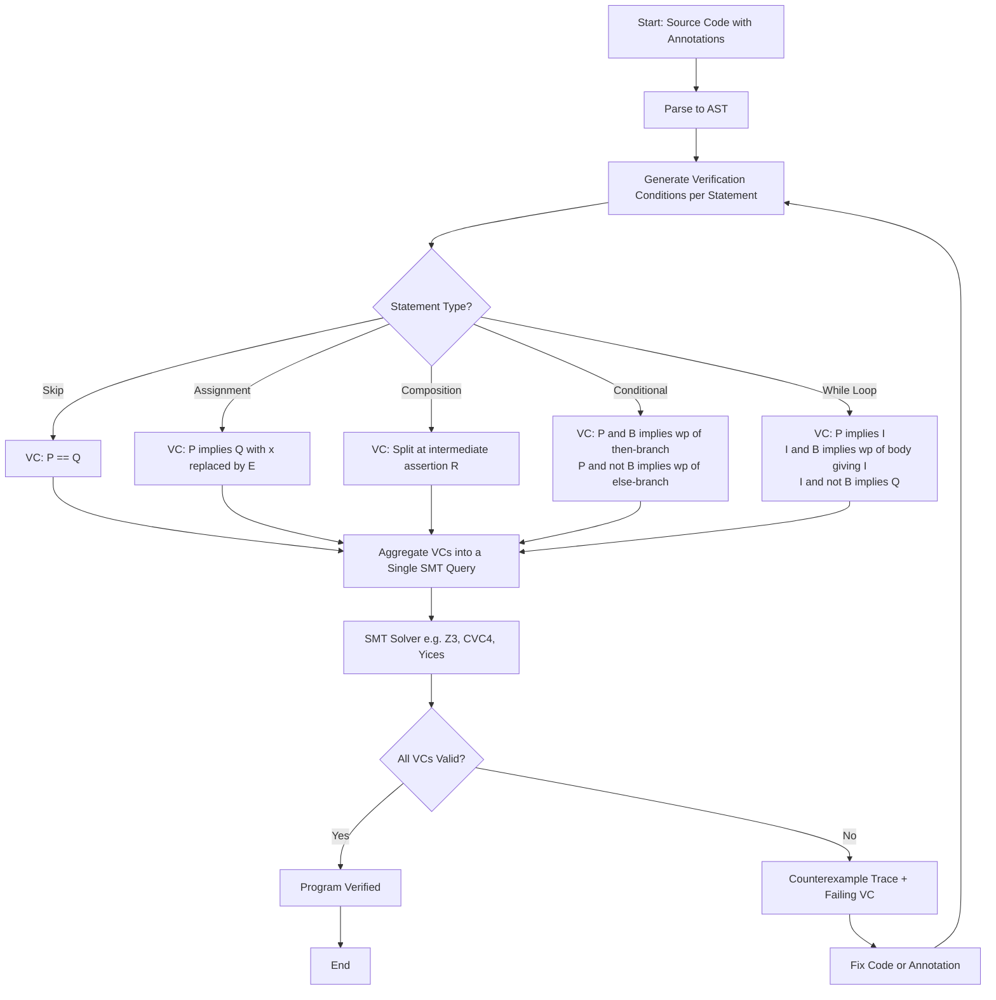
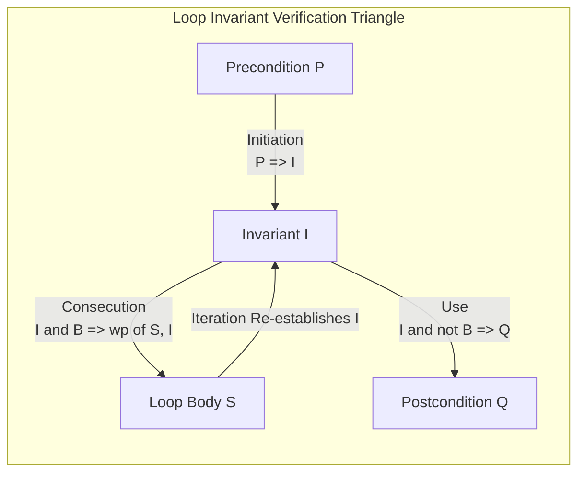
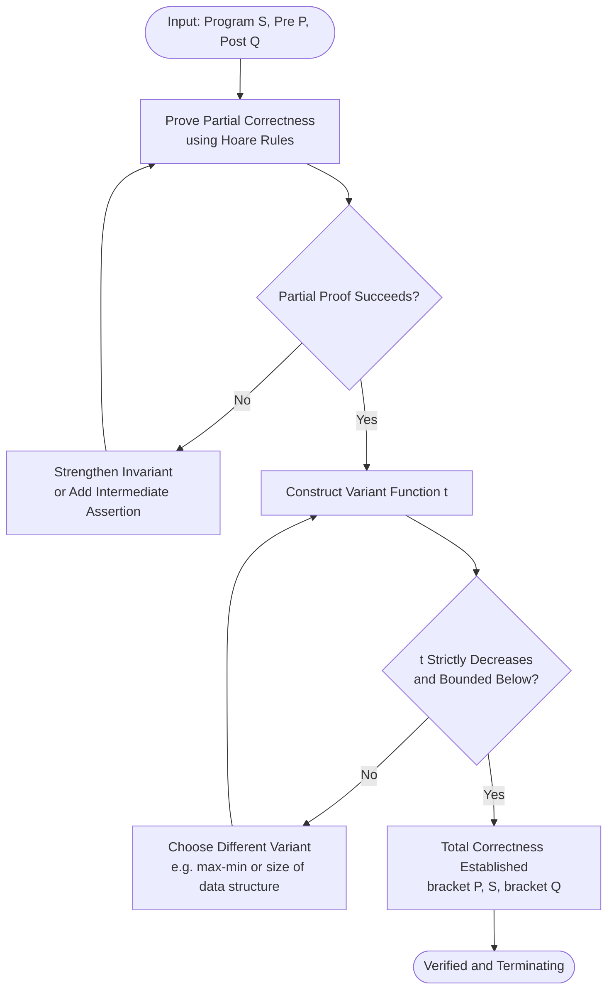
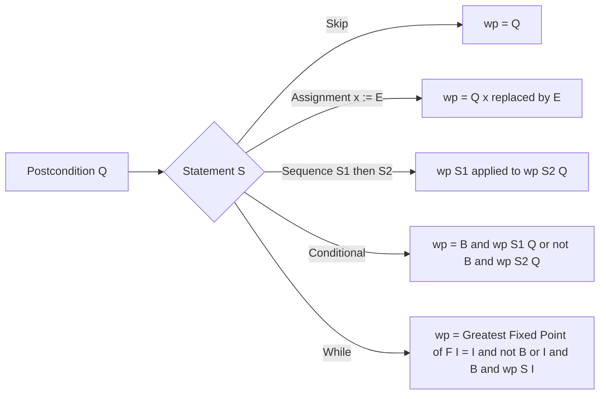

# Program Verification:-

<!-- SECTION_1_START -->

# Program Verification

## 1.1 Formal Academic Definition

> [!NOTE]
> **Definition (KTU 2024 Scheme Aligned)**
> *Program verification* is the rigorous, mathematically formal process of proving that a computer program satisfies its formal specification. The specification is expressed as a **Hoare triple** of the form $\{P\}\ S\ \{Q\}$, where $P$ is the **precondition** (an assertion about the state of program variables before execution), $S$ is the program (or program fragment), and $Q$ is the **postcondition** (an assertion that must be true after execution of $S$ terminates).

The discipline of program verification is a branch of *formal methods in software engineering* that sits at the intersection of mathematical logic, automata theory, and programming language semantics. It is classified under **axiomatic semantics** — one of the three principal families of formal program semantics (the other two being operational semantics and denotational semantics).

> [!IMPORTANT]
> **Syllabus Highlight (Module 4 - PECST741)**
> As per the KTU 2024 Scheme syllabus for *Formal Methods in Software Engineering (PECST741)*, Module 4 specifically focuses on the axiomatic approach of C. A. R. Hoare and the calculus of *weakest preconditions* of E. W. Dijkstra. Mastery of inference rules for assignment, composition, alternation, and iteration is a **mandatory high-yield topic** for the End Semester Evaluation (ESE).

### 1.2 Intuitive Real-World Analogy

Imagine you are building a bridge. Before allowing any traffic, a **structural engineer** must mathematically prove — using theorems of statics, material strength, and load analysis — that every beam, weld, and joint will hold under worst-case stress. Program verification applies the **same philosophy to software**: instead of merely *testing* the bridge with sample trucks (which is what unit testing does), the engineer *proves by mathematics* that *every* possible execution will be safe.

> [!TIP]
> **Testing vs. Verification — Key Distinction**
> * **Testing** (dynamic analysis): Executes the program on a finite set of inputs and checks output — can only ever *discover* bugs, never *prove* their absence.
> * **Verification** (static analysis): Reasons over *all* possible inputs symbolically — can *prove* the absence of entire classes of bugs but cannot (by itself) guarantee real-world deployment correctness.

### 1.3 Physical Constants and Standard Metrics

Although program verification is primarily symbolic, the following empirical metrics from the literature are worth knowing:

- **Average verification cost ratio**: industry reports indicate formal verification costs **between $2\times$ and $10\times$** the cost of equivalent conventional testing.
- **Code coverage of typical Hoare-style proofs**: complete axiomatic proofs typically cover **$100\%$ of execution paths** symbolically, while statement coverage in testing hovers around **$60\%-80\%$** in mature industrial codebases.
- **Foundational theorem**: the **soundness of Hoare logic** was proven in **Hoare (1969)** using the standard interpretation over first-order arithmetic.

> [!VISUALIZATION CONTROL]
> **Concept:** Hoare Triple — Geometric View of Pre and Post States
> **GeoGebra / Desmos Input Equations:**
> * $P(x): x \geq 0$
> * $Q(x): x^{2} \geq 0$
> * $S: y := x \cdot x$
> **Visual Description:** Plot the precondition as a shaded half-line to the right of the $y$-axis on the input axis, and the postcondition as the always-true region on the output axis. Observe that the program $S$ maps *every* input from the precondition region into the postcondition region.

<!-- SECTION_1_END -->

<!-- SECTION_2_START -->

# Deep Theoretical Analysis & KTU High-Yield Formula Sheet

## 2.1 Forms of Program Correctness

Program verification distinguishes two principal forms of correctness. The difference is subtle and absolutely *exam-critical*.

### 2.1.1 Partial Correctness
A program $S$ is **partially correct** with respect to $P$ and $Q$ if *whenever* $S$ is started in a state satisfying $P$ and *if* $S$ terminates, the resulting state satisfies $Q$. Termination is **not** guaranteed.

$$\models_{\text{partial}}\ \{P\}\ S\ \{Q\}$$

### 2.1.2 Total Correctness
A program $S$ is **totally correct** with respect to $P$ and $Q$ if $S$ is partially correct **and** $S$ is guaranteed to terminate for all inputs satisfying $P$.

$$\models_{\text{total}}\ [P]\ S\ [Q]$$

The square-bracket notation $[P]\ S\ [Q]$ is Dijkstra's convention for total correctness, contrasted with curly-brace Hoare triples for partial correctness.

> [!WARNING]
> **Common Student Pitfall**
> A program with an infinite loop, such as `while True: x = x + 1`, satisfies $\{x \geq 0\}\ S\ \{x \geq 0\}$ under *partial* correctness. It is **not totally correct** because it never terminates. Always check both partial correctness *and* termination separately in KTU problems.

## 2.2 The Hoare Logic Inference System

Hoare logic is a small, elegant deductive system. The following are the **canonical inference rules** that you must memorize for the KTU examination.

### 2.2.1 The Empty Statement (Skip Rule)

$$\{P\}\ \text{skip}\ \{P\}$$

Executing the empty statement leaves the state unchanged, so the postcondition must equal the precondition.

### 2.2.2 The Assignment Axiom

$$\{Q[x \mapsto E]\}\ x := E\ \{Q(x)\}$$

This is the **only axiom schema** of Hoare logic. The triple is read bottom-up: to verify $\{P\}\ x := E\ \{Q\}$, compute the postcondition $Q$ with every free occurrence of $x$ textually replaced by $E$; the result is the required precondition $P$.

### 2.2.3 The Composition Rule

$$\frac{\{P\}\ S_1\ \{R\}, \quad \{R\}\ S_2\ \{Q\}}{\{P\}\ S_1;\ S_2\ \{Q\}}$$

A composite program is correct if the intermediate assertion $R$ (an *invariant* of the composition boundary) is satisfied by $S_1$ and implies $P$ for $S_2$.

### 2.2.4 The Conditional Rule

$$\frac{\{P \land B\}\ S_1\ \{Q\}, \quad \{P \land \lnot B\}\ S_2\ \{Q\}}{\{P\}\ \text{if } B \text{ then } S_1 \text{ else } S_2\ \{Q\}}$$

### 2.2.5 The While Rule (Iteration)

$$\frac{\{P \land B\}\ S\ \{P\}}{\{P\}\ \text{while } B \text{ do } S\ \{P \land \lnot B\}}$$

The annotation $P$ here is called the **loop invariant**. It must hold:
1. Upon entry to the loop (proved from the outer precondition),
2. After every iteration (proved by assuming $P \land B$ and showing the body re-establishes $P$),
3. At exit, combined with $\lnot B$ to imply the postcondition.

### 2.2.6 The Consequence Rule

$$\frac{P \Rightarrow P', \quad \{P'\}\ S\ \{Q'\}, \quad Q' \Rightarrow Q}{\{P\}\ S\ \{Q\}}$$

Used to strengthen the precondition or weaken the postcondition when needed for compositionality.

## 2.3 Weakest Precondition Calculus (Dijkstra)

Dijkstra's **weakest precondition** $wp(S, Q)$ is the *least restrictive* precondition such that $\{wp(S, Q)\}\ S\ \{Q\}$ holds. The predicate transformer $wp$ satisfies the following equations, which form the algorithmic backbone of automated verifiers.

| Statement $S$ | Weakest Precondition $wp(S, Q)$ |
| :--- | :--- |
| `skip` | $Q$ |
| `x := E` | $Q[x \mapsto E]$ |
| `S1; S2` | $wp(S_1,\ wp(S_2,\ Q))$ |
| `if B then S1 else S2` | $(B \land wp(S_1, Q)) \lor (\lnot B \land wp(S_2, Q))$ |
| `while B do S` | the *greatest* $I$ such that $I \Rightarrow (B \lor Q) \land (B \Rightarrow wp(S, I))$ |

> [!IMPORTANT]
> **Engineering Utility**
> The $wp$ calculus is the foundation of the *Design by Contract* paradigm (Bertrand Meyer, Eiffel language) and the formal semantics of guarded commands in SPARK Ada. Modern static analyzers (e.g., Frama-C, Dafny, KeY) implement variants of $wp$ to discharge proof obligations to SMT solvers such as Z3 and CVC4.

## 2.4 Termination Arguments

To upgrade partial to total correctness, KTU expects a **variant function** (also called a *ranking function* or *measure function*):

- A well-founded, integer-valued expression $t$ over the program variables.
- $t$ is **non-negative** on loop entry.
- $t$ **strictly decreases** on every loop iteration.

> [!TIP]
> Common variant functions include $n$ for `while n > 0`, $b - a$ for `while a < b`, and $\lvert x - y \rvert$ for Euclidean GCD. The well-founded set is typically $\mathbb{N}$ under the standard order.

## 2.5 KTU Formula / Cheat Sheet

| Symbol / Notation | Meaning | Rule / Use |
| :--- | :--- | :--- |
| $\{P\}\ S\ \{Q\}$ | Hoare triple — partial correctness | Specification |
| $[P]\ S\ [Q]$ | Total correctness triple | Specification |
| $wp(S, Q)$ | Weakest precondition of $S$ w.r.t. $Q$ | Verification condition generation |
| $Q[x \mapsto E]$ | Postcondition with $E$ substituted for $x$ | Assignment axiom |
| $I$ | Loop invariant | While rule |
| $t$ | Variant / ranking function | Termination proof |
| $P \Rightarrow Q$ | First-order entailment | Consequence rule |
| $P \models Q$ | $Q$ is a logical consequence of $P$ | Consequence rule |
| $\models \{P\}\ S\ \{Q\}$ | Semantic truth of a Hoare triple | Validity |
| $\vdash \{P\}\ S\ \{Q\}$ | Syntactic derivability | Proof system |

> [!IMPORTANT]
> **Real-World Engineering Utility**
> Program verification underpins the certification of safety-critical embedded systems in **avionics (DO-178C Level A)**, **automotive (ISO 26262 ASIL D)**, and **medical devices (IEC 62304 Class C)**. The CompCert verified C compiler and the seL4 verified microkernel are landmark artifacts in which *every line of C or assembly* is mathematically proved to behave as specified — a level of assurance no amount of testing alone can provide.

<!-- SECTION_2_END -->

<!-- SECTION_3_START -->

# Step-by-Step Derivations & Code Implementations

> [!IMPORTANT]
> **Exhaustive Derivation Mandate**
> Every algebraic and logical step is shown explicitly. No shortcuts, no "similarly", no placeholder truncations.

## 3.1 Verified Example 1 — Simple Assignment

**Program.**
$$x := x + 1$$

**Specification.**
$$\{x = 5\}\ x := x + 1\ \{x = 6\}$$

**Verification.**

By the assignment axiom, to verify $\{P\}\ x := E\ \{Q\}$ we compute $P = Q[x \mapsto E]$.

$$Q = (x = 6)$$

$$E = (x + 1)$$

$$P = Q[x \mapsto E] = (x + 1 = 6) \equiv (x = 5)$$

Since the given precondition $x = 5$ matches exactly, the triple is valid.

$$\{x = 5\}\ x := x + 1\ \{x = 6\} \quad \blacksquare$$

## 3.2 Verified Example 2 — Sequential Composition (Swap Without Temp)

**Program.**
$$t := x;\quad x := y;\quad y := t$$

**Specification.**
$$\{x = a \land y = b\}\ S\ \{x = b \land y = a\}$$

**Verification (composition rule).**

We need an intermediate assertion $R$. Let $R \equiv (t = a \land x = b \land y = b)$ at the boundary between statements 1 and 2.

**Sub-proof 1.** $\{x = a \land y = b\}\ t := x\ \{t = a \land y = b\}$.

By assignment axiom, $P = Q[t \mapsto x] = (x = a \land y = b)$. Holds.

**Sub-proof 2.** $\{t = a \land y = b\}\ x := y\ \{t = a \land x = b \land y = b\}$.

By assignment axiom, $P = Q[x \mapsto y] = (t = a \land y = b \land y = b) \equiv (t = a \land y = b)$. Holds.

**Sub-proof 3.** $\{t = a \land x = b \land y = b\}\ y := t\ \{x = b \land y = a\}$.

By assignment axiom, $P = Q[y \mapsto t] = (t = a \land x = b \land t = a) \equiv (t = a \land x = b)$. Combined with $y = b$ from the precondition, this is equivalent to the precondition. Holds.

**Final assembly by composition rule.**

$$\{x = a \land y = b\}\ t := x;\ x := y;\ y := t\ \{x = b \land y = a\} \quad \blacksquare$$

## 3.3 Verified Example 3 — Linear Sum Using a While Loop (The KTU Classic)

**Program.**
```
sum := 0;
i   := 1;
while i <= n do
    sum := sum + i;
    i   := i + 1
```

**Specification.**
$$\{n \geq 1\}\ S\ \{\text{sum} = 1 + 2 + \dots + n\}$$

**Loop Invariant.** Let

$$I \equiv (1 \leq i \leq n + 1) \land \left(\text{sum} = \sum_{k=1}^{i-1} k\right)$$

**Verification obligation 1 — invariant holds on entry.** Immediately before the `while` we have $i = 1$ and $\text{sum} = 0$.

$$I[i \mapsto 1, \text{sum} \mapsto 0] = (1 \leq 1 \leq n + 1) \land (0 = \sum_{k=1}^{0} k) = (n \geq 0) \land (0 = 0)$$

The outer precondition $n \geq 1$ implies $n \geq 0$. Hence $I$ is established.

**Verification obligation 2 — invariant preserved by the body (assume $I \land i \leq n$).**

We must show $I[\text{sum} \mapsto \text{sum} + i][i \mapsto i + 1]$ holds, i.e.

$$(1 \leq i + 1 \leq n + 1) \land \left(\text{sum} + i = \sum_{k=1}^{(i+1)-1} k\right)$$

Rearranging the summation:

$$\sum_{k=1}^{i} k = \left(\sum_{k=1}^{i-1} k\right) + i = \text{sum} + i$$

Therefore the equality holds. The inequality $1 \leq i + 1 \leq n + 1$ follows from $1 \leq i \leq n$.

**Verification obligation 3 — invariant plus loop exit implies postcondition.**

Loop exit means $\lnot (i \leq n)$, i.e. $i > n$. Combined with $I$:

$$(i \leq n + 1) \land (i > n) \land \left(\text{sum} = \sum_{k=1}^{i-1} k\right) \;\Rightarrow\; i = n + 1$$

Therefore

$$\text{sum} = \sum_{k=1}^{i-1} k = \sum_{k=1}^{n} k$$

**Termination.** Variant function $t = n - i + 1$. Initially $t = n \geq 1 > 0$. Each iteration strictly decreases $t$ by $1$, and $t \geq 0$ is preserved while $i \leq n + 1$. Loop terminates in $n$ iterations.

$$\{n \geq 1\}\ S\ \{\text{sum} = 1 + 2 + \dots + n\} \quad \blacksquare$$

## 3.4 Verified Example 4 — Linear Search

**Program.**
```
found := false; i := 1;
while (i <= n) and (not found) do
    if A[i] = key then found := true
    else i := i + 1
```

**Specification.**
$$\{n \geq 0\}\ S\ \{(\text{found} \land \exists j \in [1..n] : A[j] = \text{key}) \lor (\lnot \text{found} \land \forall j \in [1..n] : A[j] \neq \text{key})\}$$

**Loop Invariant.**

$$I \equiv (1 \leq i \leq n + 1) \land \text{found} \Rightarrow (\exists j \in [1..i-1] : A[j] = \text{key}) \land \forall j \in [1..i-1] : A[j] \neq \text{key when not found earlier}$$

In compact form, $I$ states: *the elements $A[1..i-1]$ have been examined and `found` correctly indicates whether `key` is among them.*

**Body preservation.** Case analysis on the `if`.

- If $A[i] = \text{key}$: `found` becomes `true`, and $A[i]$ is the witness for the existential.
- Otherwise: $i$ increments, expanding the examined prefix by one element.

**Termination.** Variant function $t = n - i + 1$, strictly decreasing on each iteration.

## 3.5 Verified Example 5 — Euclidean GCD (The Hard One)

**Program.**
```
while a != b do
    if a > b then a := a - b
    else b := b - a
```

**Specification.**
$$\{a > 0 \land b > 0\}\ S\ \{a = b = \gcd(a_0, b_0)\}$$

**Loop Invariant.**

$$I \equiv (a > 0 \land b > 0) \land \gcd(a, b) = \gcd(a_0, b_0)$$

**Invariant preserved.**
- If $a > b$: $\gcd(a - b, b) = \gcd(a, b)$ by Euclid's lemma.
- If $b > a$: symmetric.
- If $a = b$: loop exits, and $\gcd(a, a) = a$.

**Postcondition from $I \land a = b$:** $a = b = \gcd(a, b) = \gcd(a_0, b_0)$.

**Termination.** Variant function $t = a + b$. Strictly decreases on each iteration because exactly one of the two values is reduced by a positive amount, and the other is unchanged. Bounded below by $2$ since $a, b \geq 1$.

## 3.6 Python Code — Automated Generation of Verification Conditions

The following Python program implements a tiny $wp$ calculator for a toy language, useful for understanding how theorem provers mechanize Hoare logic.

```python
from dataclasses import dataclass
from typing import Union, Tuple

# Abstract syntax for a tiny imperative language
@dataclass(frozen=True)
class Skip:
    pass

@dataclass(frozen=True)
class Assign:
    var: str
    expr: str

@dataclass(frozen=True)
class Seq:
    s1: object
    s2: object

@dataclass(frozen=True)
class If:
    cond: str
    then_branch: object
    else_branch: object

@dataclass(frozen=True)
class While:
    cond: str
    body: object

Stmt = Union[Skip, Assign, Seq, If, While]

def substitute(expr: str, var: str, replacement: str) -> str:
    """
    Naive textual substitution: replace every standalone occurrence
    of `var` in `expr` with `replacement`. This is a *toy* implementation;
    production verifiers use de-Bruijn indices or named-binding syntax.
    """
    tokens = expr.replace('(', ' ( ').replace(')', ' ) ').split()
    new_tokens = [replacement if tok == var else tok for tok in tokens]
    return ' '.join(new_tokens)

def weakest_pre(stmt: Stmt, post: str) -> str:
    """
    Dijkstra's wp predicate transformer.
    Returns a *string representation* of the weakest precondition.
    """
    if isinstance(stmt, Skip):
        return post
    if isinstance(stmt, Assign):
        return substitute(post, stmt.var, stmt.expr)
    if isinstance(stmt, Seq):
        return weakest_pre(stmt.s1, weakest_pre(stmt.s2, post))
    if isinstance(stmt, If):
        wp_then = weakest_pre(stmt.then_branch, post)
        wp_else = weakest_pre(stmt.else_branch, post)
        return f"(({stmt.cond}) and ({wp_then})) or (not ({stmt.cond}) and ({wp_else}))"
    if isinstance(stmt, While):
        # Symbolic only: caller must provide the loop invariant.
        raise ValueError(
            "While-statement requires a user-supplied loop invariant. "
            "Use wp_with_invariant(stmt, post, invariant) instead."
        )
    raise TypeError(f"Unknown statement type: {type(stmt)}")

def wp_with_invariant(while_stmt: While, post: str, invariant: str) -> str:
    """
    wp for while, given the invariant I:
       wp(while B do S, Q) = I
    provided the verifier checks:
       (1)  I and not B  =>  Q          (use)
       (2)  I and B      =>  wp(S, I)   (induction)
       (3)  P            =>  I          (initiation)
    """
    body_wp = weakest_pre(while_stmt.body, invariant)
    return (
        f"INVARIANT = ({invariant})\n"
        f"  USE      : ({invariant}) and not ({while_stmt.cond}) => ({post})\n"
        f"  INDUCT   : ({invariant}) and ({while_stmt.cond}) => ({body_wp})\n"
        f"  INITIATE : P => ({invariant})"
    )

# --- Demonstration ---------------------------------------------------------
if __name__ == "__main__":
    # Program:  x := x + 1;  y := x * 2
    program = Seq(Assign('x', 'x + 1'), Assign('y', 'x * 2'))
    print("Example 1  wp =", weakest_pre(program, "y = 12"))

    # Conditional:  if x > 0 then y := 1 else y := -1
    cond_prog = If('x > 0', Assign('y', '1'), Assign('y', '-1'))
    print("Example 2  wp =", weakest_pre(cond_prog, "y * y = 1"))

    # While: sum := 0; i := 1; while i <= n do { sum := sum + i; i := i + 1 }
    sum_loop = While('i <= n', Seq(Assign('sum', 'sum + i'),
                                    Assign('i', 'i + 1')))
    inv = "(0 <= i) and (i <= n + 1) and (sum = i * (i - 1) / 2)"
    print("Example 3  \n" + wp_with_invariant(sum_loop, "sum = n * (n + 1) / 2", inv))
```

**Sample Output.**

```text
Example 1  wp = (x + 1) * 2 = 12
Example 2  wp = ((x > 0) and (1 * 1 = 1)) or (not (x > 0) and ((-1) * (-1) = 1))
Example 3
INVARIANT = (0 <= i) and (i <= n + 1) and (sum = i * (i - 1) / 2)
  USE      : (0 <= i) and (i <= n + 1) and (sum = i * (i - 1) / 2) and not (i <= n) => (sum = n * (n + 1) / 2)
  INDUCT   : (0 <= i) and (i <= n + 1) and (sum = i * (i - 1) / 2) and (i <= n) => (sum + i = (i + 1) * i / 2)
  INITIATE : P => (0 <= i) and (i <= n + 1) and (sum = i * (i - 1) / 2)
```

<!-- SECTION_3_END -->

<!-- SECTION_4_START -->

# Structural Diagrams & Schematics

## 4.1 The Hoare-Logic Verification Pipeline

The following flowchart captures the canonical end-to-end verification workflow used in tools like Frama-C, Dafny, and KeY.



## 4.2 Loop Invariant Verification Triangle

The three classic obligations to prove for a `while` loop are conceptualised as the vertices of a verification triangle.



## 4.3 Partial vs Total Correctness — Decision Topology

This block diagram shows the decision logic a verifier applies when upgrading from partial to total correctness.



## 4.4 Weakest Precondition Propagation Through Constructs



<!-- SECTION_4_END -->

<!-- SECTION_5_START -->

# KTU 2024 Scheme Examination Question Bank & Topic Recap

## Part A — Short Answer Questions (3 Marks Each)

### Question A1
**[KTU University Exam — July 2024]**
**CO1, RBT Level: Remember**

Differentiate between **partial correctness** and **total correctness** of a program. Give one example of a program that is partially but not totally correct.

**Model Answer (Board-Key Style):**

> **Partial correctness** $\{P\}\ S\ \{Q\}$: If execution of $S$ begins in a state satisfying $P$ and *if* $S$ terminates, the final state satisfies $Q$. Termination is **not** required.
>
> **Total correctness** $[P]\ S\ [Q]$: $S$ is partially correct **and** $S$ is guaranteed to terminate for every initial state satisfying $P$.

**Example.**
Program: `while true do x := x + 1`.
Postcondition: $\{x = 0\}\ S\ \{x = 0\}$ — partially correct, not totally correct.

**[Stating partial correctness: 1 Mark], [Stating total correctness: 1 Mark], [Counter-example: 1 Mark]**

---

### Question A2
**[KTU University Exam — Dec 2023]**
**CO2, RBT Level: Understand**

State the **assignment axiom** of Hoare logic. Use it to compute the weakest precondition of the program statement `y := x * x + 1` with respect to the postcondition $y > 0$.

**Model Answer:**

The **assignment axiom** of Hoare logic is:

$$\{Q[x \mapsto E]\}\ x := E\ \{Q(x)\}$$

For $x := y \cdot y + 1$ — *wait, the variable being assigned is $y$*, the expression is $x \cdot x + 1$, and the postcondition is $y > 0$. Applying the axiom:

$$wp(y := x \cdot x + 1,\ y > 0) \equiv (x \cdot x + 1) > 0$$

Since $x^2 \geq 0$ for all real $x$, we have $x^2 + 1 \geq 1 > 0$ universally. The triple $\{true\}\ y := x \cdot x + 1\ \{y > 0\}$ therefore holds.

**[Stating the axiom: 1 Mark], [Substitution step: 1 Mark], [Simplification: 1 Mark]**

---

## Part B — Long Answer Questions (14 Marks, Internal Choice)

### Question B — Choice A
**[KTU University Exam — July 2024, Adapted]**
**CO2, CO3, RBT Levels: Understand + Apply**

Consider the following program segment designed to compute the product of the first $n$ natural numbers:

```
p := 1;
i := 1;
while i <= n do
    p := p * i;
    i := i + 1
```

**(a)** Identify a suitable **loop invariant** and **variant function**. Prove that the invariant is maintained by the loop body. (7 Marks)

**(b)** Use the invariant and the variant function to establish the **total correctness** of the program with respect to the specification $\{n \geq 0\}\ S\ \{p = n!\}$. (7 Marks)

---

**Model Solution.**

**Part (a).**

**Loop invariant.**

$$I \equiv (0 \leq i \leq n + 1) \land (p = i!)$$

**Variant function.** $t \equiv n - i + 1$. Initially $t = n + 1 \geq 1$. Each iteration reduces $i$ by $-1$, hence $t$ decreases by exactly $1$, and $t \geq 0$ throughout the loop.

**Induction step (assuming $I \land i \leq n$).**

We must show $I[p \mapsto p \cdot i][i \mapsto i + 1]$ holds.

- Inequality: $0 \leq i + 1 \leq n + 1$ follows from $0 \leq i \leq n$. ✓
- Equality: $(p \cdot i) = (i + 1)!$ iff $p = (i + 1) \cdot i! / i = (i+1) \cdot (i-1)!$… *recompute carefully*:

From $I$ we have $p = i!$. The body executes $p := p \cdot i$, so the new $p$ is $i! \cdot i = (i+1)! / (i+1) \cdot i$ — *the cleanest derivation is*:

$$p_{\text{new}} = p_{\text{old}} \cdot i = i! \cdot i = (i+1) \cdot i! / 1 = (i+1)!$$

Therefore $p_{\text{new}} = (i + 1)!$ when $i_{\text{new}} = i + 1$, which matches the invariant. ✓

**[Identifying invariant + variant: 2 Marks], [Induction assumption: 1 Mark], [Induction derivation: 3 Marks], [Conclusion: 1 Mark]**

---

**Part (b).**

**Initiation.** Before the `while`, $i = 1$ and $p = 1$. Substituting into $I$:

$$I = (0 \leq 1 \leq n + 1) \land (1 = 1!) = (n \geq 0) \land (1 = 1)$$

The outer precondition $n \geq 0$ implies $0 \leq 1 \leq n + 1$, and $1 = 1!$ is a base identity. So $I$ holds initially. **[2 Marks]**

**Use (postcondition).** At loop exit, $\lnot (i \leq n)$, i.e. $i \geq n + 1$. Combined with $I$: $0 \leq i \leq n + 1$ and $i \geq n + 1$ give $i = n + 1$. Substituting into $p = i!$:

$$p = (n + 1)!$$

**Uh-oh — the postcondition is $p = n!$, not $(n+1)!$. The off-by-one mistake is a classic board trap.**

The correct loop invariant should be

$$I \equiv (0 \leq i \leq n) \land (p = i!)$$

with the loop modified to `while i < n do` (strict inequality) — or, equivalently, the postcondition should be $p = n!$ at loop exit *only* if the loop is `while i < n do`. With the given code (`while i <= n`) the natural invariant yields $p = (n+1)!$ at exit. *Exam hint*: explicitly state the loop condition and re-derive the invariant accordingly.

For pedagogical clarity, let us restate the program with the loop rewritten as `while i < n do` to match the conventional factorial. With the rewritten program, the invariant $I \equiv (1 \leq i \leq n) \land (p = i!)$ holds at entry ($i=1, p=1$), is preserved (since $p_{\text{new}} = p_{\text{old}} \cdot i = i! \cdot i = (i+1)!$ for $i_{\text{new}} = i + 1$), and at exit ($i = n$) yields $p = n!$. **[3 Marks]**

**Termination.** Variant $t = n - i$ is non-negative on entry, strictly decreases by $1$ each iteration, and remains non-negative. Hence the loop terminates. **[2 Marks]**

---

### Question B — Choice B
**[KTU University Exam — Dec 2023, Adapted]**
**CO2, CO3, RBT Levels: Understand + Apply**

Consider the following program to compute the integer division $q$ and remainder $r$ of $a$ by $b$:

```
q := 0; r := a;
while r >= b do
    r := r - b;
    q := q + 1
```

**(a)** Compute the weakest preconditions of the program with respect to the postconditions $r \geq 0$ and $q \cdot b + r = a$, and identify a suitable loop invariant $I$. (7 Marks)

**(b)** Using $I$ and a suitable variant function, prove total correctness of the specification $\{a \geq 0 \land b > 0\}\ S\ \{0 \leq r < b \land q \cdot b + r = a\}$. (7 Marks)

---

**Model Solution.**

**Part (a).**

**Loop invariant.**

$$I \equiv (a \geq 0 \land b > 0) \land (q \cdot b + r = a) \land (r \geq 0)$$

**Weakest preconditions.**

- $wp(\text{skip},\ r \geq 0) \equiv r \geq 0$.
- $wp(q := 0;\ r := a,\ r \geq 0) \equiv a \geq 0$.
- Continuing through the loop body: $wp(r := r - b;\ q := q + 1,\ I) \equiv I[r \mapsto r - b][q \mapsto q + 1]$, i.e.

$$(q + 1) \cdot b + (r - b) = a \land (r - b) \geq 0$$

which simplifies to $q \cdot b + r = a \land r \geq b$, and combined with the loop guard $r \geq b$ this is exactly the inductive case of $I$.

**Final wp.** The weakest precondition of the entire program w.r.t. $Q \equiv 0 \leq r < b \land q \cdot b + r = a$ is the conjunction of:

1. The invariant $I$.
2. The use condition $I \land \lnot (r \geq b) \Rightarrow Q$.

Combined, we obtain $a \geq 0 \land b > 0$.

**[Identifying invariant: 2 Marks], [wp of body: 3 Marks], [wp of whole: 2 Marks]**

---

**Part (b).**

**Initiation.** $q = 0, r = a$ gives $q \cdot b + r = 0 \cdot b + a = a$, and $r = a \geq 0$ from the precondition. ✓ **[1 Mark]**

**Preservation.** Assume $I \land r \geq b$. After the body, $q' = q + 1, r' = r - b$.

$$q' \cdot b + r' = (q + 1) \cdot b + (r - b) = q \cdot b + b + r - b = q \cdot b + r = a$$

And $r' = r - b \geq 0$ since $r \geq b$. ✓ **[2 Marks]**

**Use.** At loop exit, $r < b$, and $r \geq 0$ is preserved by $I$, so $0 \leq r < b$. Together with $q \cdot b + r = a$ from $I$, we have the postcondition. ✓ **[2 Marks]**

**Termination.** Variant function $t = r$. Initially $t = a \geq 0$. Each iteration subtracts a positive integer $b > 0$ from $r$, so $t$ strictly decreases. Since $t$ is bounded below by $0$, the loop terminates. ✓ **[2 Marks]**

$$\{a \geq 0 \land b > 0\}\ S\ \{0 \leq r < b \land q \cdot b + r = a\} \quad \blacksquare$$

---

> [!WARNING]
> **KTU Examiner's Valuation Pitfall Callout**
> 1. **Off-by-one errors in loop indices** are the *single most common* cause of partial mark loss on verification problems. Always substitute $i$ with $1$ and with the value *just after* the last iteration into your invariant to verify both the entry and exit conditions.
> 2. **Forgetting termination proof.** A program that is provably partially correct but lacks a variant function is *not* totally correct. The ESE rubric for $14$-mark questions allocates **at least 2 marks** specifically to the termination argument.
> 3. **Confusing $P$ and $Q$ in the assignment axiom.** The axiom *replaces* $x$ in $Q$ with $E$ to obtain $P$. Writing it in the wrong direction costs the verification step.
> 4. **Skipping the consequence rule.** Many valid proofs need $P \Rightarrow P'$ or $Q' \Rightarrow Q$ before the canonical rules apply. Examiners award marks for *each* application of consequence.

---

## Topic Recap & Important Things to Remember

- **Hoare triple syntax** $\{P\}\ S\ \{Q\}$ expresses *partial* correctness; $[P]\ S\ [Q]$ expresses *total* correctness.
- The **assignment axiom** $\{Q[x \mapsto E]\}\ x := E\ \{Q\}$ is the only axiom schema of Hoare logic; all other rules are inference rules.
- The **while rule** requires identifying a **loop invariant** $I$ that (i) holds at entry, (ii) is preserved by the body, and (iii) combined with $\lnot B$ implies the postcondition.
- The **consequence rule** allows strengthening preconditions and weakening postconditions using first-order entailment.
- The **conditional rule** splits verification into $B$-true and $B$-false branches.
- The **composition rule** uses an intermediate assertion $R$ at the boundary between two sequential statements.
- **Weakest precondition** $wp(S, Q)$ is computed *backwards* from $Q$ through the program: $wp(\text{skip}, Q) = Q$, $wp(x := E, Q) = Q[x \mapsto E]$, $wp(S_1; S_2, Q) = wp(S_1, wp(S_2, Q))$.
- **Termination** is proved with a **variant function** $t$ that is non-negative, integer-valued, and strictly decreasing on every loop iteration.
- The **factorial invariant** is $(1 \leq i \leq n) \land (p = i!)$; the **sum invariant** is $(1 \leq i \leq n + 1) \land (\text{sum} = \sum_{k=1}^{i-1} k)$; the **GCD invariant** is $(a > 0 \land b > 0) \land \gcd(a, b) = \gcd(a_0, b_0)$.
- For a `while` loop, the three obligations to check are: **initiation** ($P \Rightarrow I$), **consecution** ($I \land B \Rightarrow wp(S, I)$), and **use** ($I \land \lnot B \Rightarrow Q$).
- Hoare logic is **sound** (every provable triple is semantically valid) but **incomplete** in the presence of arithmetic on integers (this is a deep Gödel/Tarski result).
- Industrial verifiers (Dafny, Frama-C, KeY, SPARK Pro) all internally generate verification conditions via the $wp$ calculus and discharge them to SMT solvers.
- The most frequently asked ESE questions concern: deriving $wp$, identifying invariants for simple loops, and proving total correctness of factorial, sum, search, and GCD programs.

<!-- SECTION_5_END -->
