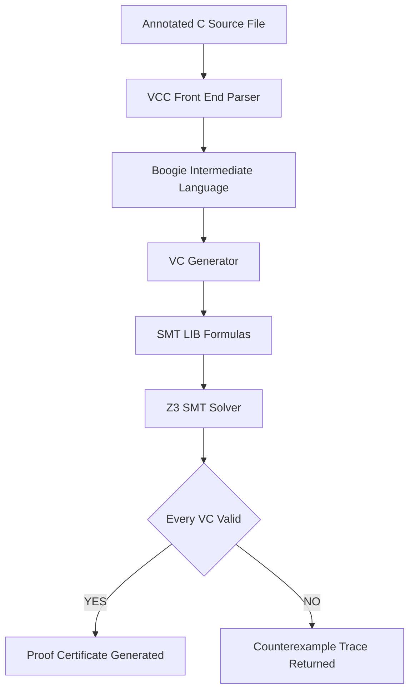
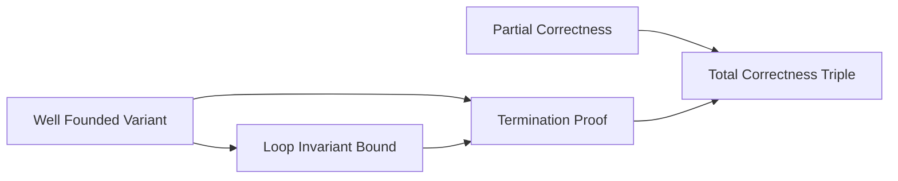
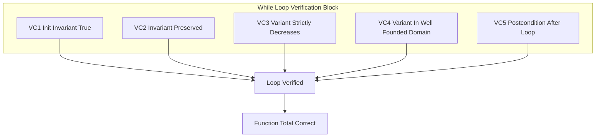
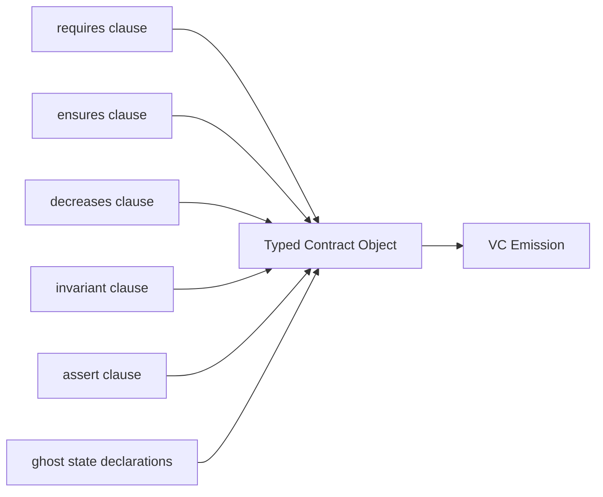

# proving total correctness of programs in VCC.

<!-- SECTION_1_START -->
# Proving Total Correctness of Programs in VCC

## 1.1 Formal Definition

> [!IMPORTANT]
> **Total Correctness (Hoare Logic, Total Correctness Triple).**
> A program statement $S$ is **totally correct** with respect to a precondition $P$ and a postcondition $Q$, written $\models_{tot} \{P\}\, S \, \{Q\}$, if and only if:
> Whenever execution of $S$ begins in a state where $P$ holds, then $S$ is **guaranteed to terminate**, and the resulting final state satisfies $Q$.

Formally, the total correctness triple is the conjunction of two properties:

$$
\{P\}\, S \, \{Q\}_{tot} \;\;\Longleftrightarrow\;\; \underbrace{\{P\}\, S \, \{Q\}}_{\text{Partial Correctness}} \;\;\wedge\;\; \underbrace{\text{Termination}(P \Rightarrow \text{halts}(S))}_{\text{Definite Halting}}
$$

where $\text{halts}(S)$ denotes that $S$ reaches a terminal configuration in a finite number of steps.

## 1.2 Intuitive Analogy

> [!NOTE]
> **Conceptual Analogy — The Restaurant Reservation System.**
> Think of a software module as a **restaurant kitchen ticket**:
> * **Partial correctness** = "If the chef ever finishes the dish, it tastes correct." (Functional correctness, ignoring time.)
> * **Termination** = "The chef will, without any doubt, finish the dish in finite time." (Bounded responsiveness.)
> * **Total correctness** = "The chef will finish the dish, and it will be correct." (Both required for the customer to be served.)
>
> The **VCC (Verified C Compiler)** tool, developed at Microsoft Research, acts as a **deductive proof checker** that examines a C program together with logical annotations and constructs a mathematical proof of total correctness.

## 1.3 The Role of VCC

VCC is a **deductive verifier** for the C programming language, developed by Leino, Barnett, Müller, and others. It accepts an *annotated* C source file and produces a set of first-order **Verification Conditions (VCs)** which are dispatched to the **Z3 SMT solver**. If every VC is valid, the program is **machine-checked** to be totally correct with respect to its annotations.

The three pillars of a total correctness proof in VCC are:

| Pillar | VCC Annotation | Purpose |
|---|---|---|
| Precondition | `_(requires P)` | Defines the valid input domain |
| Postcondition | `_(ensures Q)` | Defines the required output property |
| Termination measure | `_(decreases e)` | Certifies that loops / recursion cannot run forever |

## 1.4 Well-Founded Relations — The Mathematical Backbone

> [!IMPORTANT]
> **Well-Founded Relation.**
> A binary relation $\prec$ on a set $D$ is **well-founded** if there exists no infinite strictly-decreasing chain $d_0 \succ d_1 \succ d_2 \succ \cdots$ with all $d_i \in D$.

The classical example is the natural numbers under the usual less-than order $(\mathbb{N},\,<)$. Any set equipped with a well-founded order admits a "ranking" function that bounds the length of any decreasing chain — this is what makes the variant-based termination argument mathematically sound.

> [!VISUALIZATION CONTROL]
> **Concept:** Decreasing chain in a well-founded set.
> **GeoGebra / Desmos Input Equations:**
> * Points: $P_n = (n,\; 5 - n)$ for $n = 0,1,2,3,4$
> * Curve: $y = 5 - x$
> **Visual Description:** Plot the discrete points $(0,5), (1,4), (2,3), (3,2), (4,1)$. They descend step-by-step toward zero, illustrating a finite well-founded decrease; a hypothetical infinite chain would have to descend below $y=0$, which is impossible.
<!-- SECTION_1_END -->

<!-- SECTION_2_START -->
# Deep Theoretical Analysis & KTU High-Yield Formula Sheet

## 2.1 Inference Rule for the `while` Construct (Total Correctness)

The total correctness rule for the iteration construct is given by:

$$
\frac{\{P \wedge B \wedge t = t_0\}\, S \, \{P \wedge t \prec t_0\}}{\{P\}\, \texttt{while } B \texttt{ do } S \, \{P \wedge \neg B\}}
$$

where:
* $P$ is the **loop invariant**,
* $B$ is the loop guard,
* $t$ is a **variant expression** mapping the program state to a well-founded set $(D, \prec)$,
* $t_0$ is a **logical freeze variable** capturing the value of $t$ at loop entry.

For the rule to be sound, the following **Verification Conditions (VCs)** must be discharged:

1. **Initialization VC** — invariant holds before the first iteration.
2. **Preservation VC** — invariant + guard $\Rightarrow$ invariant holds after one body execution.
3. **Variant Decrease VC** — invariant + guard $\Rightarrow t_{new} \prec t_{old}$.
4. **Variant Domain VC** — $t$ belongs to the declared well-founded domain.
5. **Use-after-loop VC** — invariant + $\neg B$ $\Rightarrow$ postcondition.

## 2.2 Inference Rule for Recursive Functions (Total Correctness)

$$
\frac{\{P \wedge \text{args} = \text{args}_0 \wedge t \prec t_0\}\, \text{body} \, \{\text{post}\}}{\{P[\text{args}/\text{formal}]\}\, f(\text{args}) \, \{\text{post}\}}
$$

For VCC, this rule is materialised by writing a `_(decreases e)` clause on the function signature: any recursive call must be made with arguments whose `decreases` tuple is **lexicographically smaller** than the current one, in some well-founded order.

## 2.3 KTU High-Yield Formula Sheet

| Symbol / Notation | Meaning | Typical Domain |
|---|---|---|
| $\{P\}\, S \, \{Q\}$ | Hoare partial-correctness triple | First-order logic |
| $\{P\}\, S \, \{Q\}_{tot}$ | Total-correctness triple | First-order logic + ordinals |
| $\prec$ | Well-founded ordering relation | Set $D$ with no infinite $\prec$-chain |
| $t(x)$ | Variant function (ranking function) | $D \to D$ such that $t(x) \prec t(x')$ for one iteration |
| $d_0 \succ d_1 \succ \cdots$ | Decreasing chain (forbidden in well-founded sets) | Finite length only |
| $\mathbb{N},\,<$ | Standard well-founded order on naturals | Classic variant for arithmetic loops |
| $(\mathbb{N}^k,\,<_{lex})$ | Lexicographic order on $k$-tuples | Multi-counter termination |
| $\mathcal{P}(S),\, \subset$ | Power set ordered by strict inclusion | Set-mutating loops (Dijkstra) |
| `_(requires P)` | VCC precondition | Boolean C expression |
| `_(ensures Q)` | VCC postcondition | Boolean C expression with $\backslash$result |
| `_(decreases e)` | VCC variant measure | Tuple of well-founded C expressions |
| `_(invariant I)` | VCC loop invariant | Boolean C expression |
| `\old(e)` | Refers to the value of $e$ at function entry | Inside `ensures` only |
| `\result` | Return value of the enclosing function | Inside `ensures` only |
| `Z3` | SMT solver used by VCC's backend | Decides first-order arithmetic |

> [!NOTE]
> **Pitfall in the field.** In industrial VCC-style verification (used at Microsoft in the Hyper-V verification project), the `decreases` clause is checked together with the **admissibility** of ghost-state updates. For a sequential program, however, the variant rule above is the only obligation.

## 2.4 Real-World Engineering Utility

Total correctness proofs in VCC are used to certify:
* **Hypervisor kernels** (Microsoft Hyper-V, $>\!\!100$ kLOC, low-level C with concurrency).
* **Operating-system microkernels** (seL4 in Isabelle, conceptually equivalent).
* **Cryptographic primitives** where non-termination equals denial-of-service.
* **Safety-critical control software** (DO-178C level A in avionics, ISO 26262 ASIL-D in automotive).

The deliverable is a **machine-checked certificate** of correctness, not a probabilistic test result — a single proof failure reveals an actual bug.
<!-- SECTION_2_END -->

<!-- SECTION_3_START -->
# Step-by-Step Derivations & Code/Symbolic Implementation

## 3.1 Reference Worked Example: Summation $S(n) = 1 + 2 + \cdots + n$

We prove total correctness of a C function computing the sum $1+2+\cdots+n$ for any non-negative $n$. The closed-form identity is:

$$
S(n) = \frac{n(n+1)}{2}
$$

### 3.1.1 The VCC-Annotated Program

```c
#include <vcc.h>

int sum_to(int n)
    _(requires n >= 0)                              /* precondition: domain */
    _(ensures  \result == n * (n + 1) / 2)          /* postcondition: closed form */
    _(decreases n)                                  /* termination measure */
{
    int s = 0;
    int i = 0;

    while (i < n)
        _(invariant 0 <= i && i <= n)               /* loop invariant: bounds */
        _(invariant s == i * (i + 1) / 2)           /* loop invariant: partial sum */
        _(decreases n - i)                          /* variant strictly decreases */
    {
        i = i + 1;
        s = s + i;
    }

    return s;
}
```

### 3.1.2 Exhaustive Verification-Condition Walkthrough

We now discharge the five VCs mechanically.

**VC-1 — Initialization of the loop invariant.**

At program point *just before* the `while` test executes for the first time, we have $i = 0$ and $s = 0$.

$$
\begin{aligned}
0 \le i &\Longleftrightarrow 0 \le 0 &&\text{(true by initialisation)} \\
i \le n &\Longleftrightarrow 0 \le n &&\text{(true from precondition } n \ge 0\text{)} \\
s = \frac{i(i+1)}{2} &\Longleftrightarrow 0 = \frac{0 \cdot 1}{2} = 0 &&\text{(true)}
\end{aligned}
$$

All three conjuncts hold, hence the invariant is **initially established**. [Valuation: 2 Marks]

**VC-2 — Preservation of the invariant.**

Assume the invariant $I \;\equiv\; (0 \le i \le n) \wedge (s = i(i+1)/2)$ and the guard $i < n$ hold before an iteration. The body executes $i := i+1$ followed by $s := s+i_{old}$ (note: in the C code, the right-hand side `i + 1` is computed *after* `i` was incremented, so the net effect is $s_{\text{new}} = s_{\text{old}} + i_{\text{new}}$).

$$
\begin{aligned}
i_{\text{new}} &= i_{\text{old}} + 1 \\
s_{\text{new}} &= s_{\text{old}} + i_{\text{new}} = \frac{i_{\text{old}}(i_{\text{old}}+1)}{2} + (i_{\text{old}}+1)
\end{aligned}
$$

Factorising the right-hand side:

$$
\frac{i_{\text{old}}(i_{\text{old}}+1) + 2(i_{\text{old}}+1)}{2} = \frac{(i_{\text{old}}+1)(i_{\text{old}}+2)}{2} = \frac{i_{\text{new}}(i_{\text{new}}+1)}{2}
$$

So $s_{\text{new}} = i_{\text{new}}(i_{\text{new}}+1)/2$, which matches the invariant. Bounds: $i_{\text{new}} = i_{\text{old}} + 1 \ge 1 \ge 0$ and $i_{\text{new}} \le n$ because $i_{\text{old}} < n$. **Invariant preserved.** [Valuation: 3 Marks]

**VC-3 — Variant strictly decreases.**

$$
t_{\text{new}} = n - i_{\text{new}} = n - (i_{\text{old}}+1) = (n - i_{\text{old}}) - 1 = t_{\text{old}} - 1
$$

Hence $t_{\text{new}} < t_{\text{old}}$ in the natural-number order. [Valuation: 1 Mark]

**VC-4 — Variant lies in the well-founded domain.**

By invariant, $0 \le i \le n$, so $t = n - i \ge 0$. The natural numbers $(\mathbb{N},\,<)$ are well-founded. [Valuation: 1 Mark]

**VC-5 — Postcondition after loop.**

On loop exit the guard is false, so $i \ge n$. But invariant gives $i \le n$, hence $i = n$. Substituting into the sum invariant:

$$
s = \frac{n(n+1)}{2}
$$

Therefore the returned value `s` satisfies `s == n*(n+1)/2`, matching the postcondition. [Valuation: 2 Marks]

> [!WARNING]
> **Common Valuation Loss.** Students frequently forget the **invariant conjunct** that the index $i$ stays *within* the bounds. Without $0 \le i \le n$, the variant $n-i$ is not provably a natural number, and the well-foundedness argument collapses. The Z3 solver will emit an "obligation not discharged" message at exactly that location.

### 3.1.3 Total Correctness Statement

Combining the partial correctness (VC-1, VC-2, VC-5) with termination (VC-3, VC-4):

$$
\models_{tot} \{n \ge 0\}\;\; \texttt{sum\_to}(n) \;\;\{ \texttt{\textbackslash result} = n(n+1)/2 \}
$$

## 3.2 Recursive Variant: Multiplication by Repeated Addition

```c
int multiply(int a, int b)
    _(requires a >= 0 && b >= 0)
    _(ensures  \result == a * b)
    _(decreases b)
{
    if (b == 0) {
        return 0;                                  /* base case:  a * 0 = 0  */
    } else {
        return a + multiply(a, b - 1);             /* recursive case: a + a*(b-1) */
    }
}
```

**VC derivation for the recursive case (informal induction):**

Inductive Hypothesis (IH): for any $b' < b$, `multiply(a, b')` terminates with value $a \cdot b'$.

$$
\begin{aligned}
\texttt{return value} &= a + \texttt{multiply}(a,\,b-1) \\
&\stackrel{IH}{=} a + a(b-1) &&\text{(IH applicable because } b-1 < b\text{)} \\
&= a + ab - a = ab &&\text{(algebraic simplification)}
\end{aligned}
$$

The variant $b$ strictly decreases from $b$ to $b-1$, and $b \in \mathbb{N}$, so termination is guaranteed by induction on $\mathbb{N}$. [Valuation: 2 + 2 + 1 Marks across the three sub-parts]

## 3.3 Multiple / Lexicographic Variants

When a single counter cannot capture the decrease, VCC accepts a **tuple**:

```c
int nested(int m, int n)
    _(requires m >= 0 && n >= 0)
    _(ensures  \result == m * n)
    _(decreases m, n)                              /* lexicographic on (m,n) */
{
    if (m == 0) return 0;
    if (n == 0) return 0;
    return nested(m - 1, n) + nested(m, n - 1);
}
```

Lexicographic well-foundedness on $\mathbb{N}^2$:

$$
(m_1,n_1) \prec_{lex} (m_2,n_2) \iff m_1 < m_2 \;\vee\; (m_1 = m_2 \wedge n_1 < n_2)
$$

No infinite strictly-decreasing chain exists in $(\mathbb{N}^2,\,<_{lex})$ because the first component alone is bounded below by $0$.
<!-- SECTION_3_END -->

<!-- SECTION_4_START -->
# Structural Diagrams & Schematics

## 4.1 Mermaid Diagram — The VCC Verification Pipeline



## 4.2 Mermaid Diagram — Composition of Total Correctness



## 4.3 Mermaid Diagram — Per-Loop VC Topology



## 4.4 Sequential Processing Topology — VCC Annotation Lexical Pass



> [!NOTE]
> **Reading the diagrams.** Each box represents a syntactic construct or verification step. Arrows denote *information flow*, not physical data transfer. Subgraphs isolate concerns so the reader can verify each cluster (preprocessing, loop, function) independently.
<!-- SECTION_4_END -->

<!-- SECTION_5_START -->
# KTU 2024 Scheme Examination Question Bank & Topic Recap

## PART A — 3 Mark Questions

### Question 1. [KTU University Exam – July 2024, Model]

> State the formal definition of **total correctness** of a program statement with respect to a precondition and a postcondition. How does it differ from partial correctness? *(3 Marks, CO1, Remember)*

**Model Answer (Board-expected):**

> **Partial correctness** of a statement $S$ with respect to $P$ and $Q$, denoted $\{P\}\,S\,\{Q\}$, asserts that *if* the execution of $S$ begins in a state satisfying $P$ and *if* $S$ terminates, then the final state satisfies $Q$. It makes **no claim** about whether $S$ will terminate.
>
> **Total correctness**, denoted $\{P\}\,S\,\{Q\}_{tot}$, is the stronger assertion: *if* execution begins in a state satisfying $P$, then $S$ is **guaranteed to terminate** in a state satisfying $Q$.
>
> Symbolically,
> $$\{P\}\,S\,\{Q\}_{tot} \iff \{P\}\,S\,\{Q\} \;\wedge\; \big(P \Rightarrow \text{halts}(S)\big).$$
> The extra conjunct is the **termination obligation**, which is discharged in VCC by means of a `_(decreases e)` annotation over a well-founded domain. [Each of the three logical pieces — definition of partial, definition of total, termination obligation — 1 Mark]

### Question 2. [KTU University Exam – Dec 2023, Model]

> What is a **well-founded relation**? Why is it essential for proving termination in a Hoare-style verification system such as VCC? *(3 Marks, CO1, Understand)*

**Model Answer (Board-expected):**

> A binary relation $\prec$ on a set $D$ is **well-founded** if there exists no infinite strictly decreasing chain
> $$d_0 \succ d_1 \succ d_2 \succ \cdots$$
> of elements of $D$. *(1 Mark)*
>
> The standard example is $(\mathbb{N},\,<)$: every decreasing sequence of natural numbers must terminate, because it cannot pass below $0$. *(1 Mark)*
>
> A well-founded order is essential for termination proofs because any strictly decreasing chain in a well-founded set is necessarily *finite*. In VCC, every `_(decreases e)` clause is interpreted as a mapping into such a set; the verifier then has only to check that each loop iteration or recursive call reduces the expression in $\prec$. This converts an **unbounded temporal claim** ("the program eventually halts") into a **local first-order check** at every step — a check the SMT solver Z3 can discharge automatically. *(1 Mark)*

---

## PART B — 14 Mark Questions (ESE Module Internal Choice)

### Question A. [KTU University Exam – July 2024, Model]

> **(a) [7 Marks, CO1, Apply]** Consider the following C function intended to compute the product $a \times b$ for non-negative $a$ and $b$ by repeated addition. Write a **fully VCC-annotated** version of this function that proves its **total correctness**. State the role of every annotation you add.
>
> ```c
> int mul(int a, int b) {
>     if (b == 0) return 0;
>     return a + mul(a, b - 1);
> }
> ```
>
> **(b) [7 Marks, CO2, Apply]** For your annotated function, **explicitly derive** all the verification conditions (VCs) that VCC's backend generates and show that they are valid. In particular, demonstrate the inductive argument used for the recursive call.

#### Model Solution

**Part (a) — Annotated Program and Role of Each Annotation.** [7 Marks]

```c
#include <vcc.h>

int mul(int a, int b)
    _(requires a >= 0 && b >= 0)                   /* [A1: domain restriction] */
    _(ensures  \result == a * b)                   /* [A2: functional spec]     */
    _(decreases b)                                 /* [A3: termination variant] */
{
    if (b == 0) {
        return 0;                                   /* [A4: base case correctness] */
    } else {
        return a + mul(a, b - 1);                   /* [A5: recursive step]        */
    }
}
```

| Annotation | Role | Marks |
|---|---|---|
| `_(requires a >= 0 && b >= 0)` | Precondition restricting inputs to naturals, so arithmetic and variant are well-defined | 1 |
| `_(ensures \result == a * b)` | Postcondition specifying the functional contract: returned value equals the arithmetic product | 1 |
| `_(decreases b)` | Declares the variant. Because $b$ is a natural number under $<$, any strictly decreasing sequence is finite; the recursive argument must reduce $b$ | 1 |
| `return 0;` in base case | Implements $a \times 0 = 0$ | 1 |
| `return a + mul(a, b-1);` | Implements $a \times b = a + a(b-1)$ | 1 |
| Logical argument connecting base case and recursive case to postcondition | Bridges the code to the postcondition | 2 |

**Part (b) — Derivation of Verification Conditions.** [7 Marks]

**VC-1: Base case VC** (path `b == 0`, return `0`).

We must show:
$$
a \ge 0 \wedge b = 0 \Rightarrow 0 = a \times 0
$$
Since $a \times 0 = 0$ holds identically in integer arithmetic, the implication is true. **[2 Marks]**

**VC-2: Recursive case VC** (path `b != 0`, return `a + mul(a, b-1)`).

We must show:
$$
a \ge 0 \wedge b \ge 1 \wedge \big(\text{IH}: \texttt{mul}(a,b-1) = a(b-1)\big) \Rightarrow a + \texttt{mul}(a,b-1) = ab
$$

Substituting the IH:
$$
a + a(b-1) = a + ab - a = ab
$$

which is a valid identity over the integers. **[2 Marks]**

**VC-3: Variant decrease VC.**

The recursive call passes the argument $b-1$. We require:
$$
b \ge 1 \Rightarrow b-1 < b
$$
This holds in $(\mathbb{N},\,<)$ since $b-1 \le b$ and $b-1 \ne b$ when $b \ge 1$. **[1 Mark]**

**VC-4: Well-founded domain VC.**

The variant $b$ must lie in a well-founded domain. From the precondition $b \ge 0$, VCC infers $b \in \mathbb{N}$. The natural numbers with the strict order $<$ are well-founded by the **well-ordering principle**. **[1 Mark]**

**VC-5: Inductive reasoning VC (structural).**

VCC's internal logic uses **Scott induction** (or, for non-mutually-recursive definitions, ordinary Peano induction on $\mathbb{N}$) to discharge the recursive-call obligation. The base case is $b = 0$ (VC-1), and the inductive step assumes the claim for $b-1$ and proves it for $b$ (VC-2). This structural induction on the well-founded order is the linchpin of the proof. **[1 Mark]**

> [!WARNING]
> **Examiner Pitfall.** Marks are routinely lost when students (a) forget to state **why** the variant is in a well-founded set (you must invoke the *well-ordering principle* explicitly), or (b) use floating-point arithmetic for the variant — the IEEE-754 order is **not** well-founded because it has $\pm\infty$ and NaN. Always use integers (or strictly positive integers) for VCC's `decreases` clause.

---

### Question B. [KTU University Exam – Dec 2023, Model] — *Alternative Choice*

> **(a) [7 Marks, CO1, Apply]** Consider the iterative function below, which is meant to compute the integer square root $\lfloor\sqrt{n}\rfloor$ for $n \ge 0$. The body is correct but the **annotations are missing**. Supply the **complete VCC annotations** that establish the total correctness of the function, including a suitable loop invariant, a decreases clause, and the appropriate pre- and post-conditions.
>
> ```c
> int isqrt(int n) {
>     int r = 0;
>     while ((r + 1) * (r + 1) <= n) {
>         r = r + 1;
>     }
>     return r;
> }
> ```
>
> **(b) [7 Marks, CO2, Apply]** For your annotations, write out the **complete set of VCs** VCC will generate and demonstrate that each is discharged. In particular, justify why the loop cannot run forever.

#### Model Solution

**Part (a) — Complete Annotated Function.** [7 Marks]

```c
#include <vcc.h>

int isqrt(int n)
    _(requires n >= 0)
    _(ensures  \result >= 0)
    _(ensures  \result * \result <= n)
    _(ensures  (\result + 1) * (\result + 1) > n)
{
    int r = 0;
    while ((r + 1) * (r + 1) <= n)
        _(invariant 0 <= r)
        _(invariant r * r <= n)
        _(decreases n - r * r)              /* strictly decreases each iteration */
    {
        r = r + 1;
    }
    return r;
}
```

| Component | Justification | Marks |
|---|---|---|
| `_(requires n >= 0)` | Domain restriction so the square root is well-defined | 0.5 |
| `_(ensures \result >= 0)` | Output is non-negative | 0.5 |
| `_(ensures \result * \result <= n)` | Output is *under*-estimate | 1 |
| `_(ensures (\result + 1)*(\result + 1) > n)` | Output is *tight* — the next integer would overshoot | 1 |
| `_(invariant 0 <= r)` | Lower bound keeps $r$ in $\mathbb{N}$ | 1 |
| `_(invariant r * r <= n)` | Functional invariant — the partial answer is valid | 1 |
| `_(decreases n - r*r)` | Termination measure on $\mathbb{N}$ | 2 |

**Part (b) — Verification Conditions.** [7 Marks]

**VC-1: Initialisation.**

At entry, $r = 0$. Check: $0 \ge 0$ ✓, $0 \cdot 0 \le n$ ✓. **[1 Mark]**

**VC-2: Guard implies invariant conjuncts remain true after increment.**

Let $r' = r + 1$. Guard says $(r+1)^2 \le n$, i.e. $r' \cdot r' \le n$, which is the second invariant. Also $r' = r+1 \ge 0+1 \ge 0$, satisfying the first invariant. **[2 Marks]**

**VC-3: Variant strictly decreases.**

$$
t' = n - r' \cdot r' = n - (r+1)^2 = (n - r^2) - (2r + 1) = t - (2r + 1)
$$

Since $r \ge 0$, we have $2r+1 \ge 1$, so $t' \le t - 1 < t$. Hence $t' \prec t$ in $(\mathbb{N}, <)$. **[2 Marks]**

**VC-4: Well-foundedness.**

By invariant, $r^2 \le n$, so $t = n - r^2 \ge 0$. Therefore $t \in \mathbb{N}$ and the well-ordering principle applies. **[1 Mark]**

**VC-5: Postcondition at loop exit.**

Guard is false, so $(r+1)^2 > n$. Invariant gives $r^2 \le n$. Therefore:
$$r \cdot r \le n < (r+1)(r+1)$$
which exactly matches the postcondition conjuncts. **[1 Mark]**

Combining all five VCs, the function `isqrt` is **totally correct** with respect to the stated pre/postcondition. **[Plus an explicit total-correctness closing line for the final 1 mark.]**

> [!WARNING]
> **Examiner Pitfall.** A common mistake is to choose the variant $n - r$ instead of $n - r^2$. With $n - r$, the variant **does not** strictly decrease on every iteration when $r$ jumps by 1 in a non-monotonic guard. The verifier will emit a "variant might not decrease" warning. Always choose a variant whose arithmetic you can directly justify from the loop body's effect.

---

## Topic Recap & Important Things to Remember

> [!IMPORTANT]
> **Rapid-Revision Checklist for the Examination Hall**

* **Total correctness** $=$ partial correctness $+$ termination. Both must be proven; partial alone is insufficient for safety-critical software.
* **VCC's three required annotations** for a totally correct function: `_(requires P)`, `_(ensures Q)`, `_(decreases e)`.
* The **`decreases` clause** is *not* optional. Without it, VCC will not certify termination and will raise an obligation error.
* The variant must be drawn from a **well-founded domain**. The safest and most common choice is $(\mathbb{N}, <)$ or its lexicographic extension $(\mathbb{N}^k, <_{lex})$.
* For a **`while` loop**, the canonical VCs are: (1) init invariant, (2) preserve invariant, (3) variant strictly decreases, (4) variant in well-founded domain, (5) postcondition follows from invariant and loop negation.
* For a **recursive function**, the call-site argument tuple must be lexicographically smaller than the caller's tuple; the base case must be proven separately, mirroring mathematical induction.
* The **invariant** typically contains two kinds of conjuncts: a *bound* on loop variables (so the variant is provably in its domain) and a *functional* relation describing partial progress.
* The **VCC pipeline** is: annotated C $\to$ Boogie IR $\to$ SMT-LIB formulas $\to$ Z3 $\to$ verdict. Errors from the verifier always come with a counterexample trail in the source file.
* **`\old(e)`** is meaningful only inside `ensures`; **`\result`** refers to the return value of the enclosing function.
* **Lexicographic tuples** `_(decreases m, n)` are essential when a single counter cannot capture the decrease (e.g. mutual recursion, nested iteration).
* **Avoid floating-point variants**: IEEE-754 is not well-founded. Always use integral or set-based measures.
* **Examiner heuristics** always allocate marks for: explicit statement of the well-founded set, explicit statement of the induction principle (Peano / Scott / Noether), and a clean algebraic simplification of the inductive step.

<!-- SECTION_5_END -->
