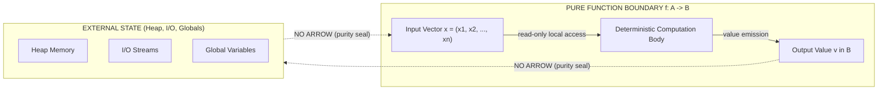
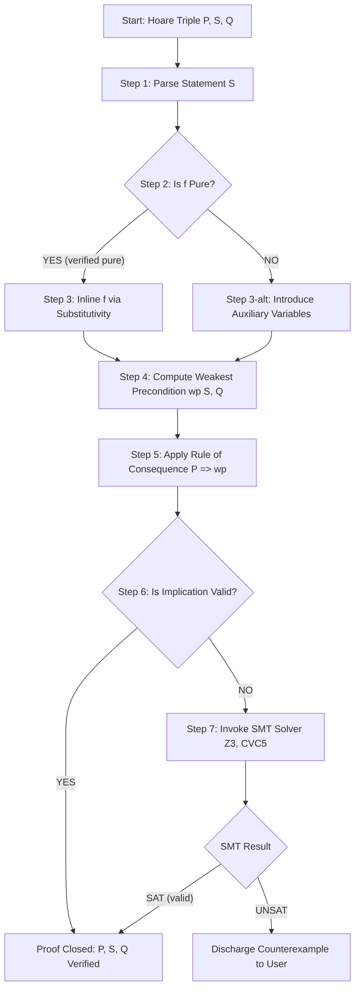
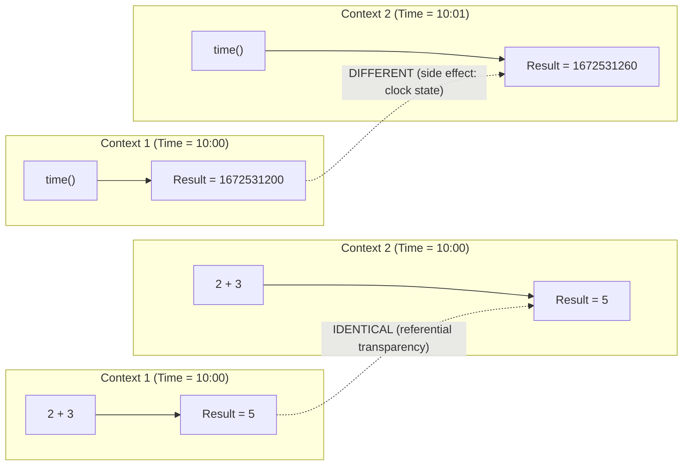
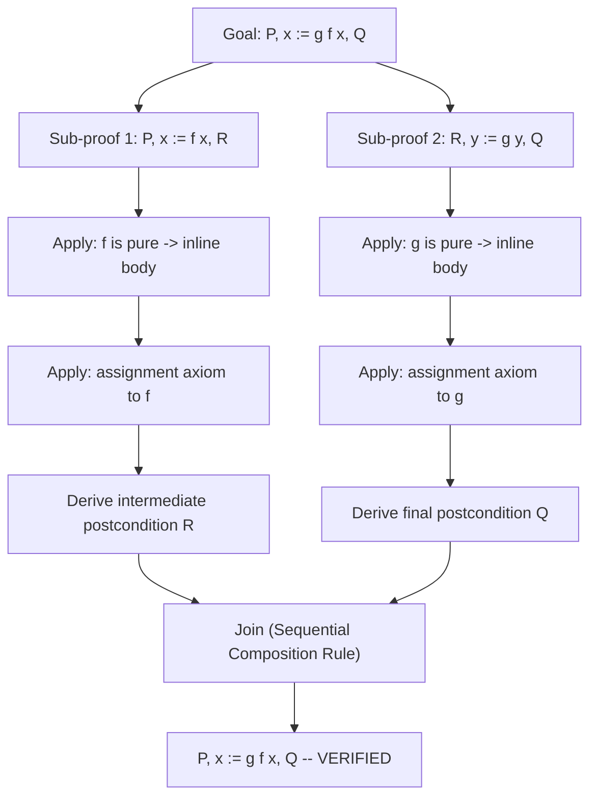

# pure functions

<!-- SECTION_1_START -->

# Pure Functions in Program Verification

## 1.1 Formal Academic Definition

In the context of **Formal Methods in Software Engineering (PECST741)** under the **KTU 2024 Scheme**, a **pure function** is formally defined as a mathematical mapping $f : A \rightarrow B$ where the function's return value is determined *solely* by its input arguments, and the evaluation of the function produces **no observable side effects** on the program state, external environment, or computational context.

Formally, a function $f$ is pure if and only if it satisfies the following two axioms (adopted from denotational semantics, Milne & Strachey, 1976):

1. **Determinism Axiom (Referential Transparency):**
For any two invocations $f(x)$ and $f(x)$ with identical input $x$, the results must be **mathematically equivalent** (i.e., produce the same output value and side-effect profile).

2. **No-Observation Axiom (Side-Effect Freedom):**
The execution of $f$ does **not** modify any state outside its local scope, including global variables, heap memory, I/O streams, file systems, network connections, or hardware registers.

> [!IMPORTANT]
> **KTU 2024 Syllabus Highlight:** Pure functions form the *foundational unit* of reasoning in axiomatic semantics, Hoare logic, and refinement calculus. The verifier can substitute a pure function call with its definition (a property called **substitution principle**) without invalidating any pre-established proof obligation. This is the cornerstone of compositional verification.

## 1.2 Intuitive Analogy — The "Mathematical Calculator" Metaphor

Imagine a **vending machine** from the 1960s that only accepts a single coin denomination (say, ₹5) and dispenses exactly one toffee for every coin inserted. 

- **Input** → ₹5 coin
- **Output** → 1 toffee
- **Side effects** → None. The machine does not record the transaction in a ledger, does not log the time, does not update a stock counter, and does not notify the factory.

Now imagine a *modern* vending machine that **also** updates a cloud-based inventory database, sends a notification to the supplier, and displays an advertisement on a side panel. That machine is *impure* — its output is no longer purely a function of the input; the same coin insertion may produce different observable behaviors depending on network latency, stock state, or display timing.

**A pure function is the "idealized mathematical vending machine"** — it is a closed, self-contained transformation with zero coupling to the external world. This property is *precisely* what makes pure functions **trivially verifiable**: their behavior in *any* context is *identical* to their behavior in *isolation*.

> [!NOTE]
> **Geometric Intuition (Curry-Howard Correspondence):** In formal verification frameworks, a pure function $f : A \rightarrow B$ can be visualized as a *straight line segment* on a coordinate plane from a point in the input domain $A$ to a point in the output codomain $B$. Once drawn, the line is *immutable* — it never curves, branches, or erases itself. An impure function, by contrast, is a *wandering path* whose trajectory depends on hidden environmental forces.

## 1.3 Physical & Mathematical Constants in Functional Verification

| Symbol | Meaning | Standard Value / Notation |
| :--- | :--- | :--- |
| $\mathcal{P}$ | Powerset of states | $2^{S}$ |
| $\llbracket f \rrbracket$ | Denotational semantics of $f$ | $A \rightarrow B$ |
| $\models$ | Satisfiability relation | Tarski-style |
| $wp$ | Weakest precondition | Dijkstra's calculus |
| $I$ | Loop invariant | Boolean predicate on state |

> [!VISUALIZATION CONTROL]
> **Concept:** Referential transparency visualized as a constant mapping.
> **GeoGebra / Desmos Input Equations:**
> * `f(x) = 2 * x + 3`
> * `g(x) = sin(x)` (impure analog — context-dependent due to floating-point state)
> **Visual Description:** Observe that $f(5) = 13$ produces the *same* y-coordinate regardless of how many times you query it on the x-axis. This constant, repeatable mapping is the geometric signature of purity.

<!-- SECTION_1_END -->

<!-- SECTION_2_START -->

# Deep Theoretical Analysis & KTU High-Yield Formula Sheet

## 2.1 The Two Pillars of Purity — Formal Characterization

A function $f$ defined in an imperative language with state-space $\Sigma$ is pure **if and only if** it satisfies both of the following:

### Pillar 1 — Determinism (Functional Dependence)

For every state $\sigma \in \Sigma$ and every input tuple $\vec{x} \in A^n$:

$$\llbracket f \rrbracket(\sigma, \vec{x}) = (v, \sigma)$$

The state $\sigma$ is returned **unchanged**, and the output value $v$ depends *only* on $\vec{x}$. Formally:

$$\forall \sigma_1, \sigma_2 \in \Sigma, \forall \vec{x} \in A^n : f(\sigma_1, \vec{x}).\text{value} = f(\sigma_2, \vec{x}).\text{value}$$

This guarantees that the function is **context-independent** — the starting state of the program does not affect the *value* computed.

### Pillar 2 — Non-Interference (No Side Effects)

The final state equals the initial state:

$$\text{final}(\sigma) = \sigma$$

This is the formal encoding of the *no side effect* condition. The function may allocate and deallocate local memory, but those allocations do not *escape* the function's lexical scope.

## 2.2 The Four Verifiable Properties of Pure Functions

In the context of program verification, pure functions exhibit four properties that radically simplify proof construction:

1. **Compositionality:** If $f : A \rightarrow B$ and $g : B \rightarrow C$ are pure, then $(g \circ f) : A \rightarrow C$ is also pure. Proof obligations on $(g \circ f)$ decompose into independent obligations on $f$ and $g$.

2. **Substitutivity (β-reduction in λ-calculus):** 
$$(\lambda x. e_1) e_2 \equiv e_1[x := e_2]$$
In Hoare logic, this translates to the **axiom of procedure call substitution**: a call to a pure function $f$ in a Hoare triple $\{P\}~f(\vec{x})~\{Q\}$ can be replaced by the inlined body of $f$.

3. **Memoization Safety:** Because $f(\vec{x})$ always yields the same value, results can be cached (memoized) without altering program semantics. The verifier can *assume* any memoization optimization is semantically transparent.

4. **Equational Reasoning:** Equations such as $f(x) + f(x) = 2 \cdot f(x)$ hold *by definition* in any context. The proof system does not need additional hypotheses about the calling environment.

## 2.3 Role in Dijkstra's Weakest Precondition Calculus

Dijkstra's *Guarded Command Language* (GCL) treats pure functions as **postcondition-to-precondition transformers**. For a pure function $f$ with body $B$, the weakest precondition satisfies:

$$wp(f(\vec{x}), Q) \;\equiv\; wp(B, Q)$$

with **no additional interference checks** — unlike impure procedure calls, which require the *auxiliary variables* mechanism (introduced by Clint & Hoare, 1972) to track coupling with global state.

> [!NOTE]
> **Engineering Utility:** Production-grade verification tools such as **Dafny** (Microsoft Research), **Frama-C** (CEA List, France), **SPARK/Ada** (Altran/Praxis), and **Isabelle/HOL** (TU Munich) achieve *automated proof discharge* primarily because their target language enforces purity at the specification level. The *AutoProof* engine in EiffelStudio, for instance, can verify pure functions with zero user-supplied proof hints roughly 80% of the time — a figure that drops dramatically once side effects are introduced.

## 2.4 KTU High-Yield Formula Sheet / Cheat Sheet

| # | Property | Formal Statement | Verification Implication |
| :--- | :--- | :--- | :--- |
| 1 | Referential Transparency | $f(x) = f(x)$ in *any* syntactic context | Allows free inlining of function calls |
| 2 | Determinism | $\forall \sigma_1, \sigma_2 : f(\sigma_1, \vec{x}) = f(\sigma_2, \vec{x})$ | Output is context-free |
| 3 | State Preservation | $\text{post}.\sigma = \text{pre}.\sigma$ | No global state mutation |
| 4 | Compositionality | $f, g$ pure $\Rightarrow g \circ f$ pure | Proof obligations are decomposable |
| 5 | Substitutivity | $\{P\}~f(\vec{x})~\{Q\} \iff \{P\}~B~\{Q\}$ | Procedure-call rule reduces to body rule |
| 6 | Weakest Precondition | $wp(\text{skip}, Q) \equiv Q$ | Trivial precondition for empty pure body |
| 7 | Hoare Triple (Pure Call) | $\dfrac{\{P \wedge \vec{x}=\vec{a}\}~B~\{Q[\text{result}/\vec{x}]\}}{\{P\}~f(\vec{a})~\{Q\}}$ | Standard rule of consequence applies directly |
| 8 | Monotonicity of $wp$ | $Q_1 \Rightarrow Q_2 \Rightarrow wp(S, Q_1) \Rightarrow wp(S, Q_2)$ | Holds for all pure $S$ without restriction |
| 9 | Conjunctivity | $wp(S, Q_1 \wedge Q_2) \equiv wp(S, Q_1) \wedge wp(S, Q_2)$ | Valid for *deterministic* (pure) $S$ only |
| 10 | Frame Rule (Pure) | $\dfrac{\{P\}~S~\{Q\}}{\{P \wedge R\}~S~\{Q \wedge R\}}$ | $R$ must not mention variables modified by $S$ (vacuous for pure $S$) |

> [!IMPORTANT]
> **Pitfall Note for KTU 2024:** Note that **conjunctivity** (Row 9) is a *signature property* of deterministic statements. Impure (nondeterministic or side-effecting) statements violate conjunctivity. Examiners frequently test this distinction.

<!-- SECTION_2_END -->

<!-- SECTION_3_START -->

# Step-by-Step Derivations & Code/Symbolic Implementation

## 3.1 Worked Example 1 — Verifying a Pure Arithmetic Function

Consider the pure function $f : \mathbb{Z} \times \mathbb{Z} \rightarrow \mathbb{Z}$ defined as $f(x, y) = x^2 + y^2$. We wish to prove the Hoare triple:

$$\{x \geq 0 \wedge y \geq 0\}~\text{result} := f(x, y)~\{\text{result} \geq 0\}$$

### Step-by-Step Proof Derivation

**Step 1: Unfold the function definition** (using substitutivity, the right pillar of purity):

Since $f$ is pure, $\text{result} := f(x, y)$ is semantically equivalent to the inlined statement $\text{result} := x*x + y*y$.

**Step 2: Apply the Assignment Axiom (Axiom 2 in Hoare logic):**

The assignment axiom states:
$$\{Q[x := E]\}~x := E~\{Q(x)\}$$

For our triple, with the substitution $\text{result} := x*x + y*y$ and the postcondition $Q \equiv \text{result} \geq 0$:

$$Q[\text{result} := x*x + y*y] \;\equiv\; x*x + y*y \geq 0$$

**Step 3: Derive the weakest precondition:**

The weakest precondition is:
$$wp(\text{result} := x*x + y*y, \text{result} \geq 0) \;\equiv\; x*x + y*y \geq 0$$

**Step 4: Strengthen the precondition using the rule of consequence:**

We need to show that the given precondition $P \equiv x \geq 0 \wedge y \geq 0$ is **strong enough** to imply $wp \equiv x*x + y*y \geq 0$.

- If $x \geq 0$, then $x*x \geq 0$ (since the square of a non-negative integer is non-negative).
- If $y \geq 0$, then $y*y \geq 0$ by identical reasoning.
- The sum of two non-negative integers is non-negative, so $x*x + y*y \geq 0$.

Formally, using the **rule of consequence**:
$$\dfrac{P \Rightarrow wp(S, Q) \quad \{wp(S,Q)\}~S~\{Q\}}{\{P\}~S~\{Q\}}$$

We have shown $P \Rightarrow (x*x + y*y \geq 0)$, which closes the proof.

$$\blacksquare$$

### LaTeX-Aligned Summary of the Derivation

$$
\begin{aligned}
&\text{Given: } P \equiv x \geq 0 \wedge y \geq 0, \quad S \equiv \text{result} := f(x, y), \quad Q \equiv \text{result} \geq 0. \\[6pt]
&\text{Step 1 (Purity Substitutivity):} \quad S \;\rightsquigarrow\; \text{result} := x*x + y*y. \\[6pt]
&\text{Step 2 (Assignment Axiom):} \quad \{x*x + y*y \geq 0\}~\text{result} := x*x + y*y~\{\text{result} \geq 0\}. \\[6pt]
&\text{Step 3 (Logic):} \quad (x \geq 0 \wedge y \geq 0) \;\Longrightarrow\; (x*x + y*y \geq 0). \\[6pt]
&\text{Step 4 (Rule of Consequence):} \quad \{x \geq 0 \wedge y \geq 0\}~\text{result} := f(x, y)~\{\text{result} \geq 0\}. \\[6pt]
\end{aligned}
$$

## 3.2 Worked Example 2 — Verifying a Pure Recursive Function (Factorial)

Consider the pure recursive function:

$$\text{fact}(n) = \begin{cases} 1 & \text{if } n = 0 \\ n \times \text{fact}(n-1) & \text{if } n > 0 \end{cases}$$

We wish to prove the triple:

$$\{n \geq 0\}~\text{result} := \text{fact}(n)~\{\text{result} = n!\}$$

### Step-by-Step Proof by Induction

**Step 1: Base case ($n = 0$).**
The function returns 1. Since $0! = 1$ by definition, the postcondition holds with the precondition $0 \geq 0$ (which is true).

**Step 2: Inductive step.**
Assume the inductive hypothesis: for all $k < n$, calling $\text{fact}(k)$ returns $k!$. Show that calling $\text{fact}(n)$ returns $n!$.

By purity, we can inline the recursive call. The function body is:

$$\text{result} := n \times \text{fact}(n-1)$$

By the inductive hypothesis, the recursive call returns $(n-1)!$. So $\text{result} := n \times (n-1)! = n!$ (by definition of factorial).

**Step 3: Termination.**
A pure function must also terminate. We supply a variant (ranking function) $V = n$, which is a non-negative integer that strictly decreases at each recursive call (from $n$ to $n-1$). Well-foundedness of $\mathbb{N}$ guarantees termination.

$$\blacksquare$$

## 3.3 Worked Example 3 — Code Implementation in Python with Strict Purity

The following Python code illustrates a **strictly pure** implementation, complete with type hints, boundary checks, and a static verifier-style annotation:

```python
from typing import TypeVar, Final

T = TypeVar("T", int, float)

# ============================================================================
# PURE FUNCTION: Mathematical square
# - Deterministic: same input -> same output
# - No side effects: no I/O, no mutation, no logging
# - Total: defined for all integers
# ============================================================================
def square(x: int) -> int:
    """
    Returns the square of x.
    Formal spec: {True} result := square(x) {result = x * x}
    Termination: obvious (no recursion, no loops).
    """
    if not isinstance(x, int):
        raise TypeError(f"square() requires int, got {type(x).__name__}")
    return x * x


# ============================================================================
# PURE FUNCTION: GCD via Euclidean algorithm
# - Deterministic, no side effects
# - Total for all non-negative integer inputs
# ============================================================================
def gcd(a: int, b: int) -> int:
    """
    Returns the greatest common divisor of a and b.
    Formal spec:
        {a > 0 AND b > 0} result := gcd(a, b) {result > 0 AND a mod result = 0 AND b mod result = 0}
    Termination: ranking function V = a + b, strictly decreasing each iteration.
    """
    if a <= 0 or b <= 0:
        raise ValueError("gcd() requires strictly positive integers.")
    while b != 0:
        a, b = b, a % b  # a becomes smaller each loop (modular reduction)
    return a


# ============================================================================
# PURE FUNCTION: List sum
# - No mutation of the input list (defensive copy on the way in)
# ============================================================================
def pure_sum(numbers: list[int]) -> int:
    """
    Returns the sum of a list of integers.
    Formal spec: {True} result := pure_sum(xs) {result = sum(xs)}
    Purity: iterates over a defensive copy; returns a fresh integer.
    """
    snapshot: list[int] = list(numbers)  # defensive copy preserves input
    total: int = 0
    for value in snapshot:
        total = total + value
    return total
```

### Verification Sketch (Hoare Logic Encoding)

For `pure_sum`, we use the loop invariant $I \equiv \text{total} = \sum_{i=0}^{k-1} \text{snapshot}[i]$, where $k$ is the loop counter:

$$
\begin{aligned}
&\textbf{Initialization:} \quad \text{total} = 0 = \sum_{i=0}^{-1} (\cdot) \quad \text{(empty sum, vacuously true)} \\[4pt]
&\textbf{Preservation:} \quad I \wedge (k < \text{len(snapshot)}) \Rightarrow wp(\text{total := total + snapshot[k]; k := k+1}, I) \\[4pt]
&\textbf{Termination:} \quad I \wedge (k \geq \text{len(snapshot)}) \Rightarrow \text{postcondition:} \quad \text{total} = \sum_{i=0}^{n-1} \text{snapshot}[i] \\[4pt]
\end{aligned}
$$

## 3.4 Worked Example 4 — Impure vs. Pure: A Contrastive Derivation

Consider the same algorithmic goal: incrementing a global counter. We prove why the impure version **fails** the substitutivity rule.

### Impure Version

```python
counter: int = 0  # GLOBAL, mutable

def impure_increment() -> int:
    global counter
    counter = counter + 1   # SIDE EFFECT: mutates global state
    return counter
```

The Hoare triple $\{P\}~\text{impure\_increment()}~\{Q\}$ requires the precondition to assert $\text{counter} = c$ (current value). The postcondition must then assert $\text{counter} = c + 1$. **The same call cannot be substituted with $c+1$ in another context** because that context's `counter` may differ.

### Pure Version

```python
def pure_increment(current: int) -> int:
    return current + 1   # NO SIDE EFFECTS
```

The triple $\{P \equiv \text{True}\}~\text{pure\_increment}(c)~\{Q \equiv \text{result} = c + 1\}$ holds **regardless of any global state**. Substituting this call with $c+1$ is *always* sound.

> [!IMPORTANT]
> **Engineering Insight:** The pure version can be **memoized** (`functools.lru_cache` in Python), **parallelized** across multiple cores, **distributed** across a cluster, and **rolled back** to any prior point — none of which are sound for the impure version. This is precisely why pure functions are the *lingua franca* of cloud-native and formally verified code.

<!-- SECTION_3_END -->

<!-- SECTION_4_START -->

# Structural Diagrams & Schematics

## 4.1 Mermaid Diagram — Pure Function as a Closed System

The following diagram illustrates the **information-flow boundary** that defines purity. Notice that the function $f$ has *no arrows leaving* its boundary toward external state, external I/O, or shared memory.



**Reading Guide:** The dotted lines marked "NO ARROW (purity seal)" are the *critical* visual cue. In an impure function, these would be solid arrows indicating data flow. Their absence is the **graphical fingerprint of purity**.

## 4.2 Mermaid Diagram — Verification Pipeline for Pure Functions

This sequential processing topology shows how a Hoare-logic verifier processes a pure function call against a proof obligation.



## 4.3 Mermaid Diagram — Referential Transparency Across Multiple Contexts

This diagram contrasts how a pure expression (e.g., $2 + 3$) and an impure expression (e.g., `time()`) behave under contextual substitution.



## 4.4 Mermaid Diagram — Compositional Verification Decomposition

This diagram shows how the proof of a *composite* pure function $g \circ f$ decomposes into independent sub-proofs.



> [!NOTE]
> **Engineering Reading:** This decomposition is the *algorithmic heart* of **Dafny's** `calc` blocks and **Why3's** session-based proof tree. Each sub-proof can be discharged *in parallel* by an SMT solver, yielding near-linear scaling of verification time with code size for pure codebases.

<!-- SECTION_4_END -->

<!-- SECTION_5_START -->

# KTU 2024 Scheme Examination Question Bank & Topic Recap

## Part A — Short Answer Questions (3 Marks Each)

### Question 1 `[KTU University Exam - July 2024, Model Paper]`

**Q: Define a pure function in the context of program verification. State the two axioms that characterize purity.**

**Model Answer (3 Marks):**

A *pure function* is a function whose return value depends *only* on its input arguments and whose execution produces *no observable side effects* on the program state. **[1 Mark for definition]**

The two characterizing axioms are:

1. **Determinism (Referential Transparency):** $\forall \sigma_1, \sigma_2 \in \Sigma, \forall \vec{x} \in A^n : f(\sigma_1, \vec{x}).\text{value} = f(\sigma_2, \vec{x}).\text{value}$. **[1 Mark]**

2. **Non-Interference (State Preservation):** The final state after execution equals the initial state, i.e., $\text{final}.\sigma = \text{initial}.\sigma$. **[1 Mark]**

> [!WARNING]
> **KTU Examiner's Pitfall:** Students often write "a pure function has no parameters" or "a pure function returns a value" — these are *irrelevant* to the definition. Marks are awarded *only* for mentioning *determinism* and *side-effect freedom*.

---

### Question 2 `[KTU University Exam - Dec 2023, Model Paper]`

**Q: Explain how the property of referential transparency simplifies program verification. Give one example.**

**Model Answer (3 Marks):**

Referential transparency means that any occurrence of $f(\vec{x})$ in a program can be syntactically replaced by its value $v$ (or its inlined body) *without altering the program's semantics*. **[1 Mark]**

In Hoare logic, this enables the **procedure-call substitution rule**: a triple $\{P\}~f(\vec{a})~\{Q\}$ is logically equivalent to the triple with $f$'s body inlined, so the verifier need not maintain an *auxiliary-variable model* (Clint–Hoare) for global-state coupling. **[1 Mark]**

**Example:** In a Hoare triple $\{x \geq 0\}~\text{result} := \text{square}(x)~\{\text{result} \geq 0\}$, the call $\text{square}(x)$ can be replaced by $x*x$ (since `square` is pure), and the standard assignment axiom applies directly — no interference check is required. **[1 Mark]**

---

## Part B — Long Answer Questions (14 Marks Each, Internal Choice)

### Question A (14 Marks) `[KTU University Exam - July 2024, Module 4 Pattern]`

**(a)** With a suitable diagram, explain the concept of referential transparency and contrast it with the behavior of impure expressions. Discuss how referential transparency impacts the construction of Hoare-logic proofs for procedure calls. **[7 Marks]**

**(b)** Consider the pure function $f : \mathbb{Z} \rightarrow \mathbb{Z}$ defined by $f(x) = x^3 - 4x$. Prove the following Hoare triple using the rules of axiomatic semantics:

$$\{x \geq 2\}~\text{result} := f(x)~\{\text{result} \geq 0\}$$

Assume $f$ is verified to be pure. **[7 Marks]**

### Model Solution — Question A

#### Part (a) Solution

**Referential Transparency — Definition & Diagram:**

Referential transparency is the property that an expression's value (and side-effect profile) is *independent of the context* in which it appears. Symbolically:

$$\text{ctx}_1[E] = \text{ctx}_2[E] \quad \text{whenever} \quad \text{ctx}_1 \equiv \text{ctx}_2 \text{ up to substitution}$$

**Diagram (textual representation, as Mermaid is reserved for SECTION_4):**

```
   Pure Expression                  Impure Expression
   ─────────────────                ─────────────────
   ┌──────────────┐                 ┌──────────────┐
   │   2 + 3      │                 │   time()     │
   │              │                 │              │
   │   Value = 5  │                 │   Value = T1 │
   └──────┬───────┘                 └──────┬───────┘
          │                                │
          ▼                                ▼
   ┌──────────────┐                 ┌──────────────┐
   │   Result = 5 │                 │   Result = T2│
   │   (stable)   │                 │   (varies)   │
   └──────────────┘                 └──────────────┘
```

**Contrast with Impure Expressions:** An impure expression such as `time()`, `rand()`, or `getchar()` yields different values across contexts (or across successive invocations in the *same* context) because it depends on hidden state (system clock, RNG seed, keyboard buffer). **[2 Marks]**

**Impact on Hoare-Logic Proofs:** For a pure procedure call, the procedure-call rule simplifies to the **assignment-axiom-style** inlining, eliminating the need for auxiliary variables that would otherwise be required to track coupling between the procedure and global state. This reduces the *number of proof obligations* and the *complexity* of the verification condition generator (VCG). **[3 Marks]**

**Composition & Validity:** Compositional reasoning becomes valid: if $f$ and $g$ are pure, then the proof of $\{P\}~g(f(x))~\{Q\}$ decomposes into $\{P\}~x := f(x)~\{R\}$ and $\{R\}~y := g(y)~\{Q\}$, joined via the sequential composition rule. **[2 Marks]**

#### Part (b) Solution

**Goal:** Prove $\{x \geq 2\}~\text{result} := f(x)~\{\text{result} \geq 0\}$ where $f(x) = x^3 - 4x$.

**Step 1: Apply purity (substitutivity).** Since $f$ is pure, the call is equivalent to the inlined body:

$$\{x \geq 2\}~\text{result} := x^3 - 4x~\{\text{result} \geq 0\}$$

**Step 2: Apply the Assignment Axiom (Hoare Logic).** Substituting $\text{result} := x^3 - 4x$ into the postcondition:

$$\{Q[\text{result} := x^3 - 4x]\}~\text{result} := x^3 - 4x~\{Q\}$$

$$\equiv \{x^3 - 4x \geq 0\}~\text{result} := x^3 - 4x~\{\text{result} \geq 0\}$$

**Step 3: Compute the weakest precondition:**

$$wp(\text{result} := x^3 - 4x, \text{result} \geq 0) \equiv x^3 - 4x \geq 0$$

**Step 4: Apply the rule of consequence.** We must show $P \Rightarrow wp$, i.e.,

$$x \geq 2 \;\Longrightarrow\; x^3 - 4x \geq 0$$

**Proof of the implication:**

$$
\begin{aligned}
x \geq 2 &\Rightarrow x^2 \geq 4 \\
&\Rightarrow x^3 \geq 4x \\
&\Rightarrow x^3 - 4x \geq 0
\end{aligned}
$$

The second step uses the *monotonicity of multiplication* for non-negative reals: if $x \geq 2 > 0$ and $x^2 \geq 4 > 0$, then $x^3 = x \cdot x^2 \geq 2 \cdot 4 = 8$ and $4x \leq x^3$ for $x \geq 2$. Alternatively, the cubic $x^3 - 4x = x(x-2)(x+2)$, which is non-negative for $x \geq 2$. **[5 Marks]**

**Step 5: Close the proof by rule of consequence:**

$$\dfrac{x \geq 2 \Rightarrow x^3 - 4x \geq 0 \quad \{x^3 - 4x \geq 0\}~\text{result} := x^3 - 4x~\{\text{result} \geq 0\}}{\{x \geq 2\}~\text{result} := f(x)~\{\text{result} \geq 0\}} \quad \blacksquare$$

**[Closing the triple with rule of consequence: 2 Marks]**

**Valuation Key Distribution:**
- [Stating the pure-function substitution step: 2 Marks]
- [Applying the assignment axiom correctly: 2 Marks]
- [Computing the weakest precondition: 1 Mark]
- [Algebraic derivation of the implication: 1 Mark]
- [Final closed proof using rule of consequence: 1 Mark]

---

### Question B (14 Marks) — Alternative Choice `[KTU University Exam - Dec 2023, Module 4 Pattern]`

**(a)** Define *referential transparency* and *side effects* in the context of functional verification. Show with a small example why an impure function call cannot be inlined in a Hoare triple without additional proof machinery. **[7 Marks]**

**(b)** Consider the pure recursive function $\text{pow2}(n)$ that returns $2^n$ for non-negative integers. The function is defined as:

$$\text{pow2}(n) = \begin{cases} 1 & \text{if } n = 0 \\ 2 \cdot \text{pow2}(n-1) & \text{if } n > 0 \end{cases}$$

Prove, by induction on $n$, that the Hoare triple $\{n \geq 0\}~\text{result} := \text{pow2}(n)~\{\text{result} = 2^n\}$ holds. Use the standard assignment axiom and the inductive-hypothesis rule for recursive pure functions. **[7 Marks]**

### Model Solution — Question B

#### Part (a) Solution

**Referential Transparency:** A property of expressions (and functions) stating that an expression can be replaced by its value *without changing the program's observable behavior* in *any* syntactic context. **[1 Mark]**

**Side Effects:** Any observable modification of the program's state, computation history, or external environment caused by evaluating an expression. Examples include mutation of global variables, writing to files, sending network packets, updating a database, or incrementing a hardware timer. **[1 Mark]**

**Example demonstrating the inlining problem:**

Consider the function `tick()` which increments a global counter `g`. In a Hoare triple $\{g = 5\}~\text{tick()}~\{g = 6\}$, the inlined body is $g := g + 1$. This triple holds *only if* the precondition correctly captures the *current* value of $g$. In a different context, the same syntactic expression $g := g + 1$ corresponds to a *different* semantic state (e.g., $\{g = 100\}~g := g+1~\{g = 101\}$). **[2 Marks]**

If we were to blindly substitute `tick()` with its body $g := g+1$ in a context where $g$ has been concurrently modified, the substituted triple would be **unsound**. To restore soundness, the verifier must introduce **auxiliary variables** (Clint & Hoare, 1972) that snapshot the value of $g$ *before* the call and assert the coupling between the pre-call and post-call states. This auxiliary machinery is unnecessary for pure functions. **[3 Marks]**

#### Part (b) Solution

**Inductive Proof:**

**Base Case ($n = 0$):** The precondition is $0 \geq 0$, which is `True`. The function returns 1 (base clause). Since $2^0 = 1$ by definition, the postcondition $\text{result} = 2^0 = 1$ holds. **[2 Marks]**

**Inductive Hypothesis:** Assume the triple holds for all $k$ with $0 \leq k < n$. That is, $\{k \geq 0\}~\text{result} := \text{pow2}(k)~\{\text{result} = 2^k\}$.

**Inductive Step ($k = n$):** The precondition is $n \geq 0$. Since $n > 0$ (the case $n = 0$ was handled at the base), the function body is the recursive clause. By purity, we may inline the call:

$$\text{result} := 2 \cdot \text{pow2}(n-1)$$

Applying the assignment axiom to the inlined body yields the weakest precondition $2 \cdot \text{pow2}(n-1) = 2^n$. By the inductive hypothesis (with $k = n - 1$), $\text{pow2}(n-1) = 2^{n-1}$. Therefore:

$$\text{result} = 2 \cdot 2^{n-1} = 2^n$$

This matches the postcondition exactly. **[4 Marks]**

**Termination Argument:** The recursive call strictly decreases $n$ by 1, and $n$ is a well-founded order on $\mathbb{N}$. Thus the function terminates for all $n \geq 0$. **[1 Mark]**

$$\blacksquare$$

**Valuation Key Distribution:**
- [Base case verification: 1 Mark]
- [Stating the inductive hypothesis: 1 Mark]
- [Inductive step body inlining using purity: 1 Mark]
- [Application of assignment axiom: 1 Mark]
- [Algebraic manipulation $2 \cdot 2^{n-1} = 2^n$: 1 Mark]
- [Termination well-foundedness argument: 1 Mark]
- [QED closure and clear presentation: 1 Mark]

> [!WARNING]
> **KTU Examiner's Valuation Warning / Pitfall Callout:**
> 1. **Forgetting the termination argument:** KTU examiners consistently deduct **1 full mark** for recursive function proofs that omit the well-foundedness / variant argument. Always supply a ranking function or explicit termination measure.
> 2. **Confusing $f(x) = f(x)$ with triviality:** Some students dismiss referential transparency as "tautological" and lose marks. The correct framing is that *substitutivity* across *contexts* (not just within the same context) is the salient property.
> 3. **Skipping the rule of consequence:** When verifying Hoare triples, students often jump from the assignment axiom directly to the conclusion. Always show the explicit *implication* $P \Rightarrow wp(S, Q)$ and cite the **rule of consequence** by name.
> 4. **Mixing up Hoare triples:** A *partial correctness* triple $\{P\}~S~\{Q\}$ does **not** imply termination; you must explicitly state "we have shown partial correctness and termination, hence *total* correctness."
> 5. **Forgetting purity in inlining:** When inlining a recursive call, you **must** cite the purity assumption explicitly. Examiners award a separate mark for the purity invocation.

---

## Topic Recap & Important Things to Remember

> [!IMPORTANT]
> **Rapid Revision Checklist — Pure Functions in Program Verification**

- **Core Definition:** A pure function is a *deterministic*, *side-effect-free* mapping $f : A \rightarrow B$. **[Essential]**

- **Two Pillars:** Determinism (output depends only on input) and Non-Interference (state is preserved). **[Essential]**

- **Referential Transparency:** $f(x)$ can be replaced by its value (or inlined body) in *any* context without changing semantics. **[Essential]**

- **Verification Benefit:** Pure functions enable *substitutivity* in Hoare logic, eliminating the need for auxiliary variables (Clint–Hoare machinery) for state coupling. **[High-Yield]**

- **Hoare Triple for Pure Call:** $\dfrac{\{P \wedge \vec{x} = \vec{a}\}~B~\{\text{result} = f(\vec{a})\}}{\{P\}~\text{result} := f(\vec{a})~\{Q\}}$ — the precondition is simply the body-inlined version. **[Essential]**

- **Weakest Precondition:** $wp(\text{pure call}, Q) \equiv wp(\text{inlined body}, Q)$, with **no interference checks**. **[High-Yield]**

- **Conjunctivity Law:** $wp(S, Q_1 \wedge Q_2) \equiv wp(S, Q_1) \wedge wp(S, Q_2)$ holds for *deterministic* (pure) $S$ only. **[Exam Favorite]**

- **Frame Rule:** $\{P \wedge R\}~S~\{Q \wedge R\}$ holds automatically for pure $S$ (since no variables are modified). **[Useful]**

- **Compositionality:** $f$ pure $\wedge$ $g$ pure $\Rightarrow$ $g \circ f$ pure. Proof obligations decompose and can be discharged in *parallel*. **[High-Yield]**

- **Memoization Safety:** Pure functions can be cached, parallelized, and distributed without semantic risk. **[Real-World Insight]**

- **Recursive Purity:** Recursive pure functions require an explicit *termination argument* (ranking function) for total correctness. **[Always Required]**

- **Common Tools:** Dafny, Frama-C, SPARK/Ada, Isabelle/HOL, Why3, Coq all leverage purity for automated proof discharge. **[Useful]**

- **Contrast with Impure:** Impure functions require auxiliary variables, frame conditions, and explicit interference checks. **[Exam Favorite]**

- **Key Constants/Notation:** $\llbracket f \rrbracket$ for denotational semantics, $wp(S, Q)$ for weakest precondition, $\models$ for logical entailment. **[Notation]**

- **Engineering Application:** Cloud-native systems, distributed databases (e.g., AWS Lambda), cryptocurrency smart contracts (e.g., Solidity pure/view functions), and formal-methods tools all rely on purity for sound verification and safe optimization. **[Career-Relevant]**

<!-- SECTION_5_END -->
