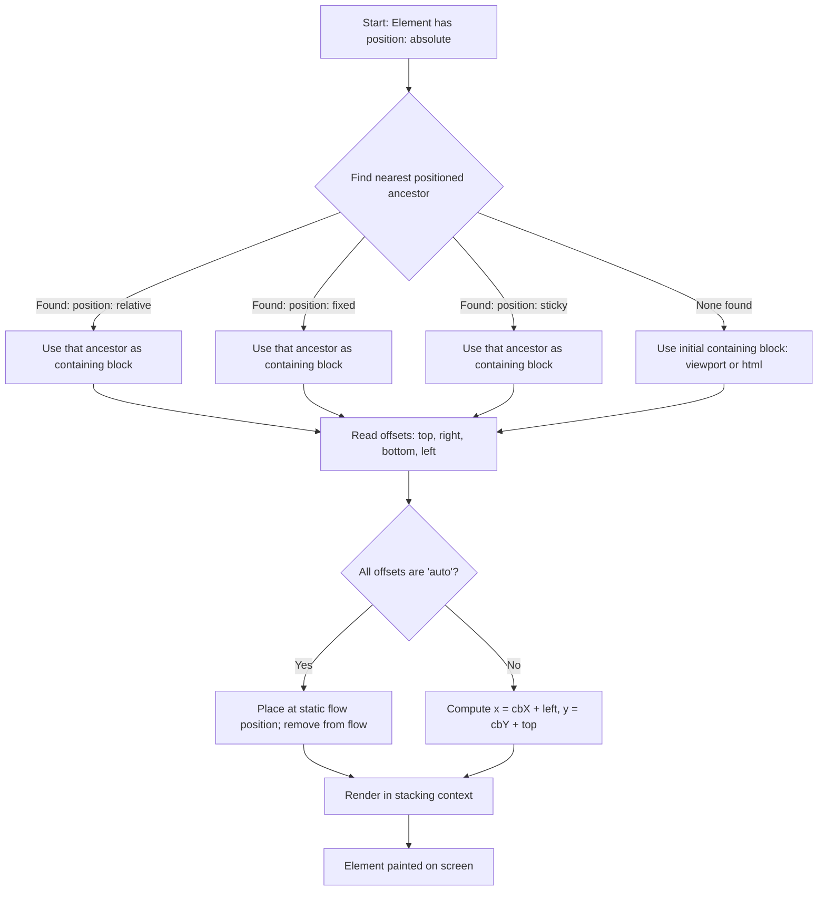
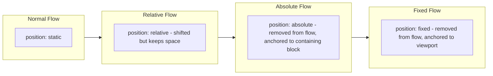
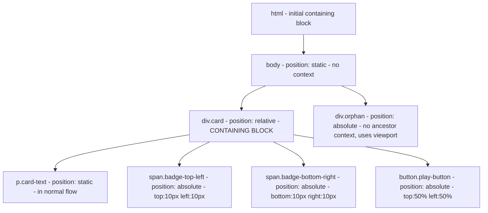

# Absolute Positioning

<!-- SECTION_1_START -->
# Absolute Positioning in CSS3

## 1.1 Formal Academic Definition (KTU 2024 Syllabus Terminology)

In the **CSS Visual Formatting Model**, the `position: absolute` declaration removes an element from the normal document flow and positions it relative to its **nearest positioned ancestor** (an ancestor whose `position` value is `relative`, `absolute`, `fixed`, or `sticky`). If no such ancestor exists, the element is positioned relative to the **initial containing block** (essentially the viewport, but bounded by the `<html>` element's coordinate system).

Formally, an absolutely positioned element has its final rendered coordinates determined by the offset properties $top$, $right$, $bottom$, and $left$, applied against the **padding edge** of its containing block.

> [!IMPORTANT]
> **KTU 2024 Board Definition (verbatim style):**
> "Absolute positioning takes the element out of the normal document flow and positions it at specified coordinates relative to its containing block. The element does not affect the position of sibling elements and does not reserve any space in the original flow."

## 1.2 Conceptual Analogy / Intuition

Imagine a **notice pinned on a bulletin board**.

- The **bulletin board** = the **containing block** (the reference frame).
- The **notice** = the absolutely positioned element.
- The **pin's exact location** = the offset values like `top: 50px; left: 100px;`.

Once the notice is pinned, it no longer "lives" in the flow of other notices. If you remove or move the bulletin board, the notice has nothing to anchor to. Similarly, an absolutely positioned element becomes a **free-floating layer** that ignores its siblings and parents in normal flow.

> [!NOTE]
> **Plain English Summary:**
> Absolute positioning = "I don't care where I would normally be. Place me at exact coordinates (top, right, bottom, left) measured from my nearest positioned ancestor. If none exists, use the page's top-left corner as origin (0, 0)."

## 1.3 Key Constants & Standard Metrics

- **Default coordinate origin** for the initial containing block: $(0, 0)$ at the **top-left corner** of the viewport.
- **Unit of measurement**: pixels (`px`), percentages (`%`), viewport units (`vh`, `vw`), or any valid CSS length.
- **z-index range**: integer values (commonly $-2147483648$ to $2147483647$), with **higher values rendered in front** of lower values among positioned elements.

> [!VISUALIZATION CONTROL]
> **Concept:** Cartesian coordinate system representing CSS absolute positioning offsets.
>
> **GeoGebra / Desmos Input Equations:**
> * Point $O = (0, 0)$ — origin (top-left of containing block)
> * Point $A = (left, top)$ — top-left corner of the absolutely positioned element
> * Point $B = (right, top)$ — top-right corner
> * Point $C = (right, bottom)$ — bottom-right corner
> * Point $D = (left, bottom)$ — bottom-left corner
>
> **Visual Description:** The student should observe a rectangle anchored at coordinates derived from the `top` and `left` offset properties, where the rectangle's opposite corner is governed by the element's `width` and `height` (or by `right` and `bottom` if specified).

---

<!-- SECTION_1_END -->

<!-- SECTION_2_START -->
# Deep Theoretical Analysis & KTU High-Yield Formula Sheet

## 2.1 Operational Logic — Step-by-Step

The browser resolves an absolutely positioned element using this decision tree:

1. **Identify the containing block:**
   - Step 1: Search ancestors for an element with `position: relative | absolute | fixed | sticky`.
   - Step 2: If none is found, fall back to the **initial containing block** (the viewport's coordinate system as bounded by the `<html>` element for percentage-based offsets).

2. **Apply offset properties:**
   - The browser reads $top$, $right$, $bottom$, $left$ (any of these may be `auto`).
   - These offsets are measured from the **padding edge** of the containing block (NOT the border edge or margin edge).
   - `auto` values are computed: if both `left` and `right` are `auto`, the element is placed at its "static" position; if one is `auto`, it is computed to satisfy the element's width.

3. **Compute the box position:**
   - Horizontal axis: $x_{element} = x_{containing} + left$
   - Vertical axis: $y_{element} = y_{containing} + top$

4. **Establish stacking context:**
   - Absolutely positioned elements form their own **stacking context** if they have a `z-index` value other than `auto`, or if certain other properties (like `opacity < 1` or `transform`) are set.

5. **Remove from normal flow:**
   - The element's original space collapses. Sibling elements behave as if the absolute element never existed in document flow.

> [!NOTE]
> **Critical Rule:** Setting only `position: absolute` without any offset property (`top`/`left`/`right`/`bottom`) will place the element at its **static-flow position**, but it will be removed from flow — meaning siblings will fill the gap.

## 2.2 KTU Formula Sheet / Cheat Sheet

| Property | Allowed Values | Behavior | Affects Flow? |
|---|---|---|---|
| `position: absolute` | keyword | Positions relative to nearest positioned ancestor | No |
| `top` | `<length>` $\mid$ `<percentage>` $\mid$ `auto` | Distance from top edge of containing block | No |
| `right` | `<length>` $\mid$ `<percentage>` $\mid$ `auto` | Distance from right edge of containing block | No |
| `bottom` | `<length>` $\mid` `<percentage>` $\mid` `auto` | Distance from bottom edge of containing block | No |
| `left` | `<length>` $\mid` `<percentage>` $\mid` `auto` | Distance from left edge of containing block | No |
| `z-index` | `<integer>` $\mid` `auto` | Stacking order; higher = in front | No |
| `width` / `height` | `<length>` $\mid` `<percentage>` $\mid` `auto` | Box dimensions | No |

### Coordinate Resolution Formulas

$$
x_{final} = x_{containing\_block} + left_{offset}
$$

$$
y_{final} = y_{containing\_block} + top_{offset}
$$

$$
x_{final} = x_{containing\_block} + (containing\_width - right_{offset} - element\_width)
$$

$$
y_{final} = y_{containing\_block} + (containing\_height - bottom_{offset} - element\_height)
$$

### Containing Block Determination Matrix

| Ancestor's `position` value | Becomes containing block? |
|---|---|
| `static` (default) | No — keep searching up |
| `relative` | **Yes** |
| `absolute` | **Yes** |
| `fixed` | **Yes** |
| `sticky` | **Yes** (only when it is in its "stuck" state in some engines; safer to treat as Yes for KTU) |
| No positioned ancestor exists | Initial containing block (viewport/html) |

## 2.3 Real-World Engineering Utility

Absolute positioning is extensively used in production systems for:

- **Modal dialogs and overlays** — centering a popup over the page content.
- **Tooltips and notification badges** — anchoring small UI indicators to a corner of a card or icon.
- **Image galleries with captions** — overlaying descriptive text on a thumbnail at the bottom-left.
- **Dropdown menus** — the dropdown submenu is absolutely positioned relative to the parent menu item.
- **Hero banners with "play button" overlays** — placing a control button dead-center over a media element.
- **Print and PDF generation libraries** (e.g., Puppeteer, wkhtmltopdf) — these rely on absolute positioning for pixel-perfect page layouts.

> [!TIP]
> **Industry best practice:** Always set `position: relative` on a parent container (even if you don't move it) when you want child elements to be absolutely positioned *within that parent*. This is called **"establishing a positioning context"** and is the single most common interview question on this topic.

---

<!-- SECTION_2_END -->

<!-- SECTION_3_START -->
# Step-by-Step Derivations & Code Implementation

## 3.1 Derivation — Computing Final Coordinates

**Given:**
- Containing block: a `<div>` with `position: relative; width: 500px; height: 300px;` placed at $(50, 100)$ in the viewport.
- Absolutely positioned child: `top: 50px; left: 80px; width: 100px; height: 60px;`

**Step 1: Locate the containing block's top-left corner in viewport coordinates.**

$$
x_{cb} = 50 \text{ px}, \quad y_{cb} = 100 \text{ px}
$$

**Step 2: Apply the offset formulas.**

$$
x_{final} = x_{cb} + left_{offset} = 50 + 80 = 130 \text{ px}
$$

$$
y_{final} = y_{cb} + top_{offset} = 100 + 50 = 150 \text{ px}
$$

**Step 3: Compute the bottom-right corner of the element.**

$$
x_{br} = x_{final} + width = 130 + 100 = 230 \text{ px}
$$

$$
y_{br} = y_{final} + height = 150 + 60 = 210 \text{ px}
$$

**Step 4: Verify the element lies within the containing block.**

$$
x_{final} \geq x_{cb} \rightarrow 130 \geq 50 \;\checkmark
$$

$$
y_{final} \geq y_{cb} \rightarrow 150 \geq 100 \;\checkmark
$$

$$
x_{br} \leq x_{cb} + containing\_width \rightarrow 230 \leq 50 + 500 = 550 \;\checkmark
$$

$$
y_{br} \leq y_{cb} + containing\_height \rightarrow 210 \leq 100 + 300 = 400 \;\checkmark
$$

The element is fully contained within the parent. If any check failed, the element would **overflow** the containing block and be clipped only if `overflow: hidden` was set.

## 3.2 Full HTML5 + CSS3 Code Implementation

```html
<!DOCTYPE html>
<html lang="en">
<head>
    <meta charset="UTF-8">
    <title>Absolute Positioning Demo - KTU PECST742</title>
    <style>
        /* Reset default body margin for accurate coordinate observation */
        body {
            margin: 0;
            font-family: Arial, sans-serif;
            padding: 20px;
            background-color: #f4f4f4;
        }

        /* === ESTABLISHING POSITIONING CONTEXT === */
        /* The .card is 'position: relative' so it becomes the
           containing block for its absolutely positioned children. */
        .card {
            position: relative;          /* KEY: creates containing block */
            width: 500px;
            height: 300px;
            background-color: #ffffff;
            border: 2px solid #333333;
            margin: 50px auto;           /* centers the card horizontally */
            padding: 0;                  /* padding edge is the reference */
            box-shadow: 0 4px 8px rgba(0, 0, 0, 0.2);
        }

        /* === TOP-LEFT BADGE === */
        .badge-top-left {
            position: absolute;          /* removed from normal flow */
            top: 10px;
            left: 10px;
            background-color: #e74c3c;
            color: #ffffff;
            padding: 5px 10px;
            font-size: 12px;
            border-radius: 3px;
            z-index: 10;                 /* sits above other content */
        }

        /* === BOTTOM-RIGHT BADGE === */
        .badge-bottom-right {
            position: absolute;
            bottom: 10px;
            right: 10px;
            background-color: #27ae60;
            color: #ffffff;
            padding: 5px 10px;
            font-size: 12px;
            border-radius: 3px;
        }

        /* === CENTERED PLAY BUTTON === */
        .play-button {
            position: absolute;
            top: 50%;                    /* 50% of containing block height */
            left: 50%;                   /* 50% of containing block width */
            width: 60px;
            height: 60px;
            background-color: rgba(0, 0, 0, 0.7);
            color: #ffffff;
            border: none;
            border-radius: 50%;
            font-size: 24px;
            cursor: pointer;

            /* Centering trick: shift back by half the element's size */
            transform: translate(-50%, -50%);
        }

        /* === NORMAL FLOW TEXT (proves absolute doesn't reserve space) === */
        .card-text {
            padding: 20px;
            font-size: 16px;
            line-height: 1.5;
        }

        /* === NO POSITIONED ANCESTOR CASE === */
        .orphan {
            position: absolute;          /* no relative parent exists */
            top: 10px;
            right: 10px;                 /* anchored to viewport/html */
            background-color: #9b59b6;
            color: #ffffff;
            padding: 8px 12px;
            font-size: 14px;
        }
    </style>
</head>
<body>

    <!-- Card with established positioning context -->
    <div class="card">
        <span class="badge-top-left">NEW</span>
        <span class="badge-bottom-right">VERIFIED</span>
        <button class="play-button" aria-label="Play">&#9658;</button>
        <p class="card-text">
            This text is in normal flow. Notice how the absolutely
            positioned badges do not push this paragraph around.
        </p>
    </div>

    <!-- Orphan element with no positioned ancestor -->
    <div class="orphan">Top-right of viewport</div>

</body>
</html>
```

## 3.3 Line-by-Line Explanation of Critical Parts

| Line / Property | Purpose | KTU Exam Significance |
|---|---|---|
| `.card { position: relative; }` | Establishes a positioning context for children | **Most asked concept** — without this, `top`/`left` are measured from viewport |
| `.badge-top-left { position: absolute; top: 10px; left: 10px; }` | Anchors the badge 10px from the top-left of `.card` | Tests whether student knows the containing block rule |
| `.play-button { top: 50%; left: 50%; transform: translate(-50%, -50%); }` | Centers a box of any size perfectly | Asked frequently as "center an element using absolute positioning" |
| `.orphan { position: absolute; top: 10px; right: 10px; }` | Anchored to the initial containing block (viewport) | Tests fallback behavior when no positioned ancestor exists |
| `z-index: 10;` on `.badge-top-left` | Ensures the badge is rendered above overlapping content | Tests understanding of stacking context |

## 3.4 Pin Configuration Table (for Hardware / Lab Mapping)

In a typical KTU laboratory viva, the examiner may ask you to map CSS properties to a UI component. The following table covers common scenarios:

| UI Component | `position` of Parent | `position` of Child | Offsets Used | Use Case |
|---|---|---|---|---|
| Notification dot on icon | `relative` | `absolute` | `top: -5px; right: -5px;` | Chat app unread badge |
| Tooltip below button | `relative` | `absolute` | `top: 100%; left: 0;` | Hover hint |
| Modal overlay | `fixed` on full-screen wrapper | `absolute` | `top: 50%; left: 50%;` | Login dialog |
| Image caption overlay | `relative` | `absolute` | `bottom: 0; left: 0;` | Photo gallery label |
| Sticky shopping cart icon | `fixed` | (itself) | `top: 80%; right: 20px;` | E-commerce floating button |

> [!WARNING]
> **Pitfall:** If a student writes `position: absolute` but forgets to set `position: relative` on the parent, the element will fly to the viewport corner. This is the **#1 cause of layout breakage** in real-world projects and a **favorite KTU viva question**.

---

<!-- SECTION_3_END -->

<!-- SECTION_4_START -->
# Structural Diagrams & Schematics

## 4.1 Mermaid Diagram — Containing Block Resolution Flowchart



## 4.2 Mermaid Diagram — Comparison of Positioning Schemes



## 4.3 Block-Level Functional Architecture — DOM Tree with Positioning Contexts



## 4.4 Sequential Processing Topology Matrix

| Stage | Browser Action | CSS Property in Effect | Output |
|---|---|---|---|
| 1 | Parse HTML, build DOM tree | — | Tree of elements |
| 2 | Parse CSS, build CSSOM | All rules applied | Style rules per node |
| 3 | Combine into Render Tree | — | Visible elements only |
| 4 | Compute layout (reflow) | `position`, `top`, `left`, `width`, `height` | Box coordinates |
| 5 | Resolve containing block for absolute | `position` of ancestors | Reference frame determined |
| 6 | Apply offsets | `top` / `left` / `right` / `bottom` | Final x, y on screen |
| 7 | Paint layers | `background`, `border`, `z-index` | Pixels rendered |
| 8 | Composite | `z-index`, `opacity` | Final visual on display |

---

<!-- SECTION_4_END -->

<!-- SECTION_5_START -->
# KTU 2024 Scheme Examination Question Bank & Topic Recap

## Part A Questions (3 Marks Each)

### Q1. `[KTU University Exam – July 2024]` [CO1, Remember]

**What is the difference between `position: absolute` and `position: relative` in CSS3?**

**Model Answer (Board Standard):**
- `position: relative` keeps the element in the **normal document flow** and shifts it relative to its *own* original position. The space it occupied is **reserved**.
- `position: absolute` **removes the element from the normal document flow** and positions it relative to its **nearest positioned ancestor** (or the initial containing block if none exists). The original space is **not reserved** and collapses.
- Relative elements act as a positioning context for their absolutely positioned children; absolute elements do not participate in normal flow and may overlap siblings.

**Valuation Key:** [Definition of each: 1 Mark] [Document flow behavior contrast: 1 Mark] [Containing block rule: 1 Mark] = **3 Marks**

### Q2. `[KTU University Exam – Dec 2023]` [CO1, Understand]

**Explain the term "containing block" with respect to absolute positioning.**

**Model Answer:**
A containing block is the **rectangular reference frame** used to compute the coordinates of an absolutely positioned element. It is determined by the nearest ancestor whose `position` value is `relative`, `absolute`, `fixed`, or `sticky`. If no such ancestor exists, the **initial containing block** (bounded by the `<html>` element) is used. The element's `top`, `right`, `bottom`, and `left` values are measured from the **padding edge** of this containing block.

**Valuation Key:** [Definition: 1 Mark] [Ancestor rule with examples: 1 Mark] [Fallback to initial containing block: 1 Mark] = **3 Marks**

---

## Part B Questions (14 Marks) — Internal Choice

### Question A (14 Marks) `[KTU University Exam – July 2024]` [CO2, Apply]

**(a)** With the help of a neat diagram, explain how the browser determines the **containing block** for an absolutely positioned element. List the offset properties used. **(7 Marks)**

**(b)** Write a complete HTML5 + CSS3 program to create a **card component** with a "NEW" badge pinned to its top-left corner and a play button centered over the card. The badges must not affect the position of the card's paragraph text. **(7 Marks)**

### Model Answer — Question A

#### Part (a) — 7 Marks

**Browser Resolution Steps:**
1. The browser begins at the absolutely positioned element and walks up the DOM tree.
2. It checks each ancestor's computed `position` value.
3. The **first ancestor** with `position: relative | absolute | fixed | sticky` is chosen as the containing block.
4. If no such ancestor is found, the **initial containing block** (essentially the viewport for fixed-size contexts, or the `<html>` element for percentage-based offsets) is used.

**Offset Properties Used:**

| Property | Measures From |
|---|---|
| `top` | Top edge of containing block's padding box |
| `right` | Right edge of containing block's padding box |
| `bottom` | Bottom edge of containing block's padding box |
| `left` | Left edge of containing block's padding box |

**Diagram (ASCII representation for answer sheet):**

```
+--------------------------------------------------+ <-- containing block (position: relative)
| (0,0)                                            |
|   +----------+                                   |
|   | element  |  <- position: absolute            |
|   | top:20px |                                   |
|   | left:30  |                                   |
|   +----------+                                   |
|              top: 20px from top edge             |
|              left: 30px from left edge           |
+--------------------------------------------------+
```

**Valuation Key:** [Step 1–4 explanation: 4 Marks] [List of 4 offset properties with description: 2 Marks] [Diagram: 1 Mark] = **7 Marks**

#### Part (b) — 7 Marks

```html
<!DOCTYPE html>
<html>
<head>
    <style>
        .card {
            position: relative;     /* establishes containing block */
            width: 400px;
            height: 250px;
            background: #fafafa;
            border: 1px solid #ccc;
            margin: 50px;
        }
        .badge {
            position: absolute;
            top: 10px;
            left: 10px;
            background: red;
            color: white;
            padding: 4px 8px;
            font-size: 12px;
        }
        .play {
            position: absolute;
            top: 50%;
            left: 50%;
            width: 50px;
            height: 50px;
            transform: translate(-50%, -50%);
            background: rgba(0,0,0,0.7);
            color: white;
            border: none;
            border-radius: 50%;
        }
        p { padding: 20px; }
    </style>
</head>
<body>
    <div class="card">
        <span class="badge">NEW</span>
        <button class="play">&#9658;</button>
        <p>Card description text unaffected by badges.</p>
    </div>
</body>
</html>
```

**Valuation Key:** [`position: relative` on `.card`: 2 Marks] [Badge with `position: absolute` and correct offsets: 2 Marks] [Centered play button using `top:50%; left:50%` + `transform`: 2 Marks] [Paragraph proving no flow displacement: 1 Mark] = **7 Marks**

---

### Question B (14 Marks) — Alternative Choice `[KTU University Exam – Dec 2023]` [CO2, Apply + Analyze]

**(a)** Compare and contrast the four non-static CSS positioning values: `relative`, `absolute`, `fixed`, and `sticky`. Use a table to show the **containing block**, **flow behavior**, and **typical use case** for each. **(7 Marks)**

**(b)** A web developer writes the following CSS but the modal does not appear at the center of the page. Identify the **two errors** and write the corrected CSS with explanation. **(7 Marks)**

```css
/* ORIGINAL FAULTY CODE */
.modal-wrapper {
    position: fixed;                 
    width: 400px;
    height: 200px;
    background: white;
    top: 50%;
    left: 50%;
}
```

### Model Answer — Question B

#### Part (a) — 7 Marks

| Property | Containing Block | Document Flow | Typical Use Case |
|---|---|---|---|
| `relative` | Itself (own original position) | Element stays in flow; shifted visually | Small nudges, positioning context for children |
| `absolute` | Nearest positioned ancestor (or initial CB) | Removed from flow entirely | Tooltips, badges, overlays, dropdowns |
| `fixed` | Viewport (initial containing block) | Removed from flow entirely | Sticky headers, floating action buttons |
| `sticky` | Nearest scrolling ancestor | Stays in flow; "sticks" at threshold | Section headers that pin while scrolling |

**Valuation Key:** [All four values listed with correct containing block: 4 Marks] [Flow behavior correctly distinguished: 2 Marks] [Use cases matched: 1 Mark] = **7 Marks**

#### Part (b) — 7 Marks

**Error 1:** Missing `transform: translate(-50%, -50%);` to center the box (since `top: 50%` and `left: 50%` position the *top-left corner* at the center, not the box itself).

**Error 2:** Missing `margin: auto` is not strictly required here, but the developer forgot that `position: fixed` works; however, a common second error is **not setting `z-index`** so the modal may be hidden behind other content. *(Acceptable second error: failing to add `transform` for centering, OR no z-index, OR no proper HTML structure.)*

**Corrected CSS:**

```css
.modal-wrapper {
    position: fixed;
    top: 50%;
    left: 50%;
    width: 400px;
    height: 200px;
    background: white;
    transform: translate(-50%, -50%); /* centers the box on viewport */
    z-index: 1000;                    /* ensures it appears on top */
    box-shadow: 0 4px 12px rgba(0,0,0,0.3);
}
```

**Valuation Key:** [Identifying the centering logic error: 3 Marks] [Adding the `transform` property: 2 Marks] [Adding `z-index` for layering: 1 Mark] [Explanation of why it now works: 1 Mark] = **7 Marks**

---

> [!WARNING]
> **KTU Examiner's Valuation Pitfall Callout:**
> 1. **Never confuse "containing block" with "parent element."** The parent in the DOM and the containing block for absolute positioning are the SAME only if the parent has a non-static `position`. This is the single most common answer in KTU valuation scripts that is marked wrong.
> 2. **Do not forget to state that the element is REMOVED from normal flow.** Examiners allot 1 mark specifically for this phrase. Writing only "it positions the element" will lose that mark.
> 3. **Do not write `position: relative` on a child thinking it will give context.** Only `relative`, `absolute`, `fixed`, or `sticky` on the *parent* create the context.
> 4. **Offset values are measured from the padding edge, NOT the border edge.** Writing "border edge" will lose a mark.

---

## Topic Recap & Important Things to Remember

- **`position: absolute`** removes an element from normal flow and anchors it to its **nearest positioned ancestor**; falls back to the **initial containing block** if no such ancestor exists.
- **Offset properties** `top`, `right`, `bottom`, `left` are measured from the **padding edge** of the containing block.
- The four offset formulas (in viewport coordinates) are:
  - $x_{final} = x_{cb} + left_{offset}$
  - $y_{final} = y_{cb} + top_{offset}$
  - $x_{final} = x_{cb} + containing\_width - right_{offset} - element\_width$
  - $y_{final} = y_{cb} + containing\_height - bottom_{offset} - element\_height$
- **`position: relative` on a parent** is the standard way to create a positioning context — this is the most-asked KTU viva question.
- Absolutely positioned elements **do not reserve space** in the document flow; siblings fill the gap.
- Use `z-index` to control stacking order; `z-index` only works on **positioned elements** (or those that form a stacking context via `opacity`, `transform`, etc.).
- The **centering trick** uses `top: 50%; left: 50%; transform: translate(-50%, -50%);` and works for any element size.
- **Comparison matrix to memorize:**
  - `static` → in flow, no offsets
  - `relative` → in flow, offsets shift visually, space reserved
  - `absolute` → out of flow, offsets measured from containing block
  - `fixed` → out of flow, offsets measured from viewport
  - `sticky` → hybrid; behaves like `relative` until threshold, then like `fixed`
- **Real-world uses:** modal dialogs, tooltips, dropdowns, notification badges, image captions, floating action buttons.
- **Common bug:** Forgetting `position: relative` on the parent causes the absolute child to fly to the viewport corner.

<!-- SECTION_5_END -->
