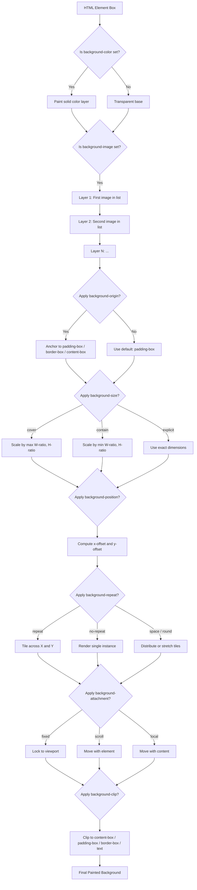
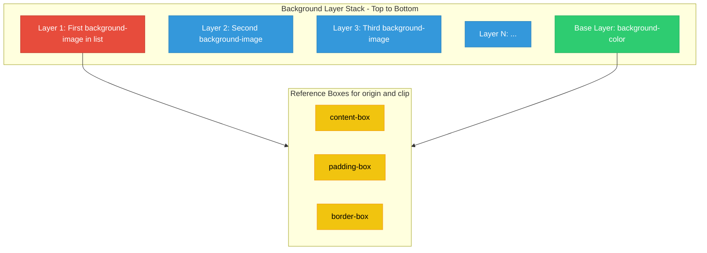
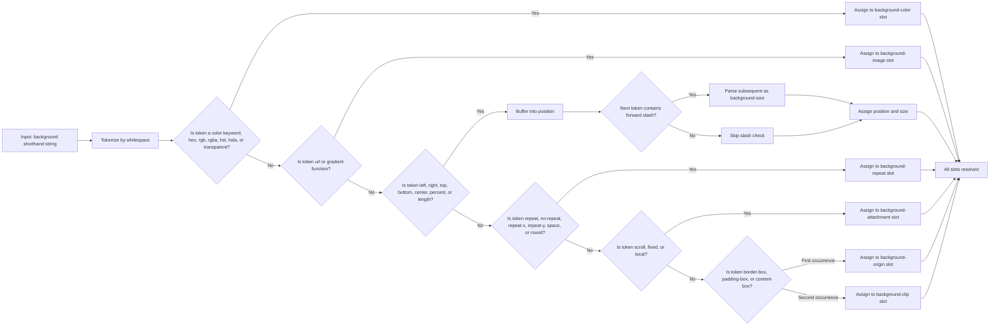
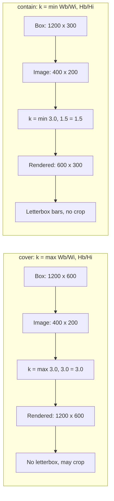

# Backgrounds

<!-- SECTION_1_START -->
# 1. Core Technical Definition & Intuitive Overview

## 1.1 Formal Academic Definition (KTU 2024 Syllabus Terminology)

> [!IMPORTANT]
> **HTML5 Backgrounds** refer to the comprehensive set of **Cascading Style Sheets (CSS3)** properties used to control the visual backdrop of any HTML5 element. These properties manage the background color, image, gradient, tiling pattern, positioning, sizing, attachment behavior, and clipping/origin regions of the rendering box.

In the **KTU 2024 Scheme (PECST742 - Web Programming)**, "Backgrounds" is classified under **Module 1: Creating Web Pages Using HTML5**, and falls within the **CSS3 Styling and Presentation Layer**. The official CSS specification governing this topic is **CSS Backgrounds and Borders Module Level 3 (W3C Recommendation)**.

The principal background properties recognized by the KTU syllabus are:

| # | CSS Property | Functional Role |
|---|--------------|-----------------|
| 1 | `background-color` | Sets a solid color fill |
| 2 | `background-image` | Sets one or more background images/gradients |
| 3 | `background-repeat` | Controls tiling behavior |
| 4 | `background-attachment` | Controls scroll behavior |
| 5 | `background-position` | Sets the origin coordinates |
| 6 | `background-size` | Controls the dimensions of the image |
| 7 | `background-origin` | Defines the reference box |
| 8 | `background-clip` | Defines the painting area |
| 9 | `background` | The shorthand composite property |

---

## 1.2 Conceptual Analogy / Intuition

> [!NOTE]
> **Analogy — The "Wall Painting" Metaphor**
> Imagine you are a painter decorating a rectangular wall (the HTML element). Before placing any decoration (text or images) on the wall, you must first prepare its **background**:
>
> - **The Paint Color** → `background-color` (the base coat).
> - **The Wallpaper / Stencil Art** → `background-image` (decorative layer applied over the paint).
> - **Tiling the Wallpaper** → `background-repeat` (do you repeat a small pattern across the wall, or use one giant sheet?).
> - **Anchoring the Wallpaper** → `background-position` (where exactly does the top-left corner of the wallpaper start?).
> - **Stretching the Wallpaper** → `background-size` (fit-to-wall, cover, or contain?).
> - **Scrolling Behavior** → `background-attachment` (does the wallpaper move when you walk past the wall, or stay fixed?).
> - **Border Between Wall and Frame** → `background-clip` (does the paint stop at the inner wall edge, or extend under the frame?).

This intuition translates directly to CSS, where every HTML element is a **box** that can be styled with these "wall-painting" rules.

---

## 1.3 The CSS Box Model Recap (Required Foundation)

> [!IMPORTANT]
> Every background in CSS is painted within the **Element Box Model**, which consists of (from innermost to outermost):
>
> 1. **Content Box** — where text and child elements live.
> 2. **Padding Box** — the breathing space around the content.
> 3. **Border Box** — the visible edge of the element.
> 4. **Margin Box** — external spacing (transparent; **never receives a background**).

The `background-clip` and `background-origin` properties decide **which** of the first three layers participate in background rendering.

---

## 1.4 GeoGebra / Desmos Integration (Geometric Visualization)

> [!VISUALIZATION CONTROL]
> **Concept:** The CSS Background Coordinate Plane (relative to an element box of width $W$ and height $H$).
>
> **GeoGebra / Desmos Input Equations:**
> * Origin Marker: `(0, 0)` — Top-Left Corner
> * X-axis: $0 \le x \le W$
> * Y-axis: $0 \le y \le H$
> * Keyword Mapping Points:
>   * `background-position: left top` $\rightarrow (0, 0)$
>   * `background-position: right bottom` $\rightarrow (W, H)$
>   * `background-position: center center` $\rightarrow (W/2, H/2)$
>   * `background-position: 25% 75%` $\rightarrow (0.25W, 0.75H)$
>
> **Visual Description:** Students should observe a rectangular box representing the element. The **top-left pixel is always (0, 0)** — unlike mathematical Cartesian planes — and coordinates extend rightward ($x$) and downward ($y$). This is the **CRITICAL** difference KTU examiners often test.

---

## 1.5 Standard Color Metrics Used in Backgrounds

The following are the **standard color value formats** accepted in CSS3 for `background-color` and within gradients:

> [!IMPORTANT]
> 1. **Named Colors** — e.g., `tomato`, `cornflowerblue` (147 standard names).
> 2. **Hexadecimal Notation** — `#RRGGBB` or shorthand `#RGB` where each channel is **00–FF** (base 16, range **0–255** decimal).
> 3. **RGB / RGBA Functional** — `rgb(255, 99, 71)` and `rgba(255, 99, 71, 0.5)`, where alpha $\in [0, 1]$.
> 4. **HSL / HSLA Functional** — `hsl(9, 100%, 64%)`, hue $\in [0, 360)$, saturation/lightness $\in [0\%, 100\%]$.
> 5. **Special Keywords** — `transparent`, `currentColor`, `inherit`, `initial`, `unset`.

<!-- SECTION_1_END -->

<!-- SECTION_2_START -->
# 2. Deep Theoretical Analysis & KTU High-Yield Formula Sheet

## 2.1 Theoretical Breakdown of Each Background Property

### 2.1.1 `background-color`

- **Purpose:** Sets a solid color as the element's backdrop.
- **Initial Value:** `transparent` (not `white` — a common KTU pitfall).
- **Inheritance:** Does **not** inherit.
- **Applies To:** All HTML elements.
- **Layer Position:** Always the **bottom-most** layer; any `background-image` is painted **above** it.

### 2.1.2 `background-image`

- **Purpose:** Sets one or more background images.
- **Syntax:** `background-image: url('path/to/image.png'), linear-gradient(...);`
- **Multiple Images:** The **first listed image is painted on top** (z-order: first = closest to user).
- **Special Value:** `none` (default).

### 2.1.3 `background-repeat`

Controls whether and how the image tiles.

| Value | Behavior |
|-------|----------|
| `repeat` | Tiles both horizontally and vertically (default). |
| `repeat-x` | Tiles only horizontally. |
| `repeat-y` | Tiles only vertically. |
| `no-repeat` | Displays the image once; no tiling. |
| `space` | Tiles without clipping; distributes equal spacing. |
| `round` | Tiles and stretches to fit (no gaps, no clipping). |

### 2.1.4 `background-attachment`

| Value | Behavior |
|-------|----------|
| `scroll` | Background moves with the element on scroll (default). |
| `fixed` | Background is fixed relative to the **viewport** (parallax effect). |
| `local` | Background moves with the element's **content** (useful for scrolling `<textarea>`). |

### 2.1.5 `background-position`

Defines the **starting position** of the background image.

- **Two-value syntax:** `background-position: <horizontal> <vertical>;`
- Accepted values:
  * Keywords: `left | center | right` and `top | center | bottom`
  * Percentages: `0%` = left/top edge, `100%` = right/bottom edge.
  * Lengths: e.g., `20px 50px`.
- **Mathematical Resolution Formula:**

$$
x_{\text{offset}} = \left( W_{\text{box}} - W_{\text{image}} \right) \times \frac{P_x}{100}
$$

$$
y_{\text{offset}} = \left( H_{\text{box}} - H_{\text{image}} \right) \times \frac{P_y}{100}
$$

where $P_x$ and $P_y$ are the percentage values, $W_{\text{box}}$ and $H_{\text{box}}$ are the box dimensions, and $W_{\text{image}}$, $H_{\text{image}}$ are the image dimensions.

### 2.1.6 `background-size`

| Value | Behavior |
|-------|----------|
| `auto` | Default; image retains intrinsic size. |
| `cover` | Image is scaled to **fully cover** the box (may crop). |
| `contain` | Image is scaled to **fully fit inside** the box (may letterbox). |
| `<length> <length>` | Explicit width and height (e.g., `200px 100px`). |
| `<length> auto` | Sets width; height auto-scales to preserve aspect ratio. |
| `<percentage> <percentage>` | Relative to the box dimensions. |

### 2.1.7 `background-origin`

Defines the **reference box** used by `background-position`.

| Value | Reference Box |
|-------|---------------|
| `padding-box` | The padding edge (default). |
| `border-box` | The border edge. |
| `content-box` | The content edge. |

### 2.1.8 `background-clip`

Defines the **painting area** of the background.

| Value | Painted Area |
|-------|--------------|
| `border-box` | Up to the outer border edge (default). |
| `padding-box` | Up to the padding edge (border excluded). |
| `content-box` | Only the content area. |
| `text` | Clipped to the text foreground (CSS4). |

### 2.1.9 `background` (Shorthand)

The order (per W3C recommendation) is:

```
background: <color> <image> <position> / <size> <repeat> <attachment> <origin> <clip>;
```

> [!IMPORTANT]
> The `/` separator between `position` and `size` is **mandatory** in the shorthand. Forgetting it is a frequent KTU exam error.

---

## 2.2 KTU Formula Sheet / Cheat Sheet

> [!NOTE]
> The following table consolidates every formula, syntax, and boundary constant needed for KTU board exams on this topic.

| # | Concept | Formula / Syntax | Units / Range | Notes |
|---|---------|------------------|---------------|-------|
| 1 | Hex Channel Range | $\text{Channel} \in [00, FF]$ | Base 16 | $FF_{16} = 255_{10}$ |
| 2 | RGB Channel Range | $\text{R,G,B} \in [0, 255]$ | Integer | Decimal scale |
| 3 | Alpha Channel | $\alpha \in [0, 1]$ | Float | $0$ = transparent, $1$ = opaque |
| 4 | Hue Range | $H \in [0^\circ, 360^\circ)$ | Degrees | Wraps modulo 360 |
| 5 | Saturation / Lightness | $S, L \in [0\%, 100\%]$ | Percentage | |
| 6 | Position Offset (px) | $x_{\text{off}} = (W_b - W_i) \cdot \frac{P_x}{100}$ | Pixels | $W_b$ = box width, $W_i$ = image width |
| 7 | Position Offset (px) | $y_{\text{off}} = (H_b - H_i) \cdot \frac{P_y}{100}$ | Pixels | |
| 8 | `cover` Scale Factor | $k = \max\!\left(\frac{W_b}{W_i}, \frac{H_b}{H_i}\right)$ | Ratio | Larger dimension wins; may crop |
| 9 | `contain` Scale Factor | $k = \min\!\left(\frac{W_b}{W_i}, \frac{H_b}{H_i}\right)$ | Ratio | Smaller dimension wins; may letterbox |
| 10 | Linear Gradient Angle | $\theta \in [0^\circ, 360^\circ)$ | Degrees | $0^\circ$ = bottom-to-top by default in W3C, but most browsers use `to top = 0°` |
| 11 | Radial Gradient Stops | $r \in [0\%, 100\%]$ or `<length>` | Percentage / Pixels | Distance from center |
| 12 | Box Layers (inner $\to$ outer) | $\text{Content} \subset \text{Padding} \subset \text{Border} \subset \text{Margin}$ | — | Margin is transparent |

---

## 2.3 Real-World Engineering Utility

> [!NOTE]
> **Why this matters in production systems:**
>
> 1. **Brand Identity & Theming** — Every corporate website (e.g., KTU's own portal) uses gradients and background images for visual identity. CSS3 backgrounds replaced older CSS2 hacks (such as sliced image tables) with **resolution-independent** designs, critical for **responsive design**.
>
> 2. **Performance Optimization** — Using `background-size: cover` and `background-position: center` with `object-fit` is the standard technique for **hero banners** in modern SPAs (React, Angular, Vue).
>
> 3. **Data Visualization** — Dashboard applications (e.g., Grafana, Power BI web) use semi-transparent backgrounds (`rgba(0,0,0,0.5)`) for overlay panels and **parallax effects** via `background-attachment: fixed`.
>
> 4. **Accessibility** — The `prefers-color-scheme` media query dynamically swaps background colors, supporting dark/light modes — a mandatory feature in production-grade web apps.
>
> 5. **Game UI & Canvas Overlays** — HTML5 game UIs layered over `<canvas>` use `background: rgba(0,0,0,0.7)` for modal dialogs.

---

## 2.4 Multiple Backgrounds (CSS3 Layering)

> [!IMPORTANT]
> CSS3 allows **stacking multiple backgrounds** as a comma-separated list. This is a high-yield KTU question topic.
>
> **Layering Rule:** The first background in the list is the **topmost** layer (closest to the viewer). Subsequent layers are painted beneath.
>
> ```css
> background:
>   url('foreground.png') no-repeat center top,    /* topmost */
>   url('midground.png')  no-repeat center center,
>   linear-gradient(45deg, #ff6, #06f)             /* bottom */
> ;
> ```

<!-- SECTION_2_END -->

<!-- SECTION_3_START -->
# 3. Step-by-Step Derivations & Code Implementation

## 3.1 Mathematical Derivation: `cover` vs `contain`

> [!NOTE]
> **Scenario:** An image of $W_i \times H_i = 400 \times 200$ pixels is placed inside a box of $W_b \times H_b = 1200 \times 600$ pixels.

### Deriving the `cover` Scale Factor

We need the image to **fully cover** the box. Both dimensions of the image must be $\ge$ the corresponding box dimensions after scaling. Hence we take the **maximum** of the two aspect ratios.

$$
k_{\text{width}} = \frac{W_b}{W_i} = \frac{1200}{400} = 3.0
$$

$$
k_{\text{height}} = \frac{H_b}{H_i} = \frac{600}{200} = 3.0
$$

Since $k_{\text{width}} = k_{\text{height}}$, the image is uniformly scaled by $k_{\text{cover}} = 3.0$ to a final rendered size of $1200 \times 600$, perfectly covering the box.

**General formula:**

$$
k_{\text{cover}} = \max\!\left( \frac{W_b}{W_i},\ \frac{H_b}{H_i} \right)
$$

### Deriving the `contain` Scale Factor

We need the image to fit **entirely within** the box without cropping. Both dimensions must be $\le$ the box. Hence we take the **minimum**.

$$
k_{\text{contain}} = \min\!\left( \frac{W_b}{W_i},\ \frac{H_b}{H_i} \right) = 3.0
$$

Since the aspect ratios are equal in this example, both formulas yield $3.0$. If the box were $1200 \times 300$, then:

$$
k_{\text{cover}} = \max(3.0,\ 1.5) = 3.0 \quad \Rightarrow \quad \text{Final size } 1200 \times 600\ \text{(clipped vertically)}
$$

$$
k_{\text{contain}} = \min(3.0,\ 1.5) = 1.5 \quad \Rightarrow \quad \text{Final size } 600 \times 300\ \text{(letterboxed)}
$$

---

## 3.2 Mathematical Derivation: Position Offset in Pixels

> [!NOTE]
> **Given:** Box of $W_b \times H_b = 500 \times 400$ px, image of $W_i \times H_i = 100 \times 50$ px, `background-position: 25% 50%`.

$$
x_{\text{off}} = (W_b - W_i) \cdot \frac{P_x}{100} = (500 - 100) \cdot \frac{25}{100} = 400 \cdot 0.25 = 100\ \text{px}
$$

$$
y_{\text{off}} = (H_b - H_i) \cdot \frac{P_y}{100} = (400 - 50) \cdot \frac{50}{100} = 350 \cdot 0.5 = 175\ \text{px}
$$

So the image's top-left corner is placed at coordinates $(100,\ 175)$ inside the box.

---

## 3.3 Algorithmic / Code Implementation

Below is a **production-grade HTML5 + CSS3** file that demonstrates every background property covered in the KTU Module 1 syllabus.

```html
<!DOCTYPE html>
<html lang="en">
<head>
  <meta charset="UTF-8">
  <title>KTU Module 1: HTML5 Backgrounds Demonstration</title>
  <style>
    /* ---------- Global Reset ---------- */
    * {
      box-sizing: border-box;
      margin: 0;
      padding: 0;
    }

    body {
      font-family: "Segoe UI", Arial, sans-serif;
      line-height: 1.6;
      color: #222;
      background-color: #f4f4f9;          /* Solid color base layer */
    }

    /* ---------- 1. Solid Background Color ---------- */
    .demo-color {
      background-color: #ff6347;           /* Tomato (hex) */
      color: white;
      padding: 20px;
      text-align: center;
    }

    /* ---------- 2. Background Image (Single, No-Repeat) ---------- */
    .demo-image {
      height: 300px;
      background-image: url("https://via.placeholder.com/200x150/3498db/ffffff?text=KTU");
      background-repeat: no-repeat;
      background-position: center;
      background-size: contain;            /* Fit within the box */
      border: 2px solid #2c3e50;
    }

    /* ---------- 3. Repeating Pattern (Tiling) ---------- */
    .demo-repeat {
      height: 200px;
      background-image: url("https://via.placeholder.com/50x50/e74c3c/ffffff?text=+");
      background-repeat: repeat;           /* Default behavior */
    }

    /* ---------- 4. Fixed Attachment (Parallax) ---------- */
    .demo-fixed {
      height: 300px;
      background-image: linear-gradient(45deg, #6a11cb 0%, #2575fc 100%);
      background-attachment: fixed;
      color: white;
      display: flex;
      align-items: center;
      justify-content: center;
      font-size: 1.5em;
    }

    /* ---------- 5. Linear Gradient ---------- */
    .demo-linear {
      height: 150px;
      background-image: linear-gradient(to right, #ff7e5f, #feb47b);
      display: flex;
      align-items: center;
      justify-content: center;
      color: white;
    }

    /* ---------- 6. Radial Gradient ---------- */
    .demo-radial {
      height: 200px;
      background-image: radial-gradient(circle, #ffd200, #f7971e, #ffd200);
    }

    /* ---------- 7. Conic Gradient ---------- */
    .demo-conic {
      height: 200px;
      background-image: conic-gradient(
        from 45deg,
        red, yellow, lime, aqua, blue, magenta, red
      );
    }

    /* ---------- 8. Multiple Backgrounds (Layering) ---------- */
    .demo-multiple {
      height: 300px;
      background:
        url("https://via.placeholder.com/80x80/2ecc71/ffffff?text=FG") no-repeat center center / 80px 80px,
        url("https://via.placeholder.com/200x200/9b59b6/ffffff?text=BG") no-repeat center center / 200px 200px,
        linear-gradient(135deg, #ecf0f1, #bdc3c7);
      border: 2px dashed #2c3e50;
    }

    /* ---------- 9. background-origin & background-clip ---------- */
    .demo-clip {
      padding: 20px;
      border: 10px dotted #e74c3c;
      background-color: #3498db;
      background-clip: padding-box;         /* Stops at padding edge */
      color: white;
      margin: 20px;
    }

    /* ---------- 10. The Shorthand ---------- */
    .demo-shorthand {
      height: 200px;
      background:
        #2c3e50                              /* color */
        url("https://via.placeholder.com/100x100/e74c3c/ffffff?text=KTU")
        no-repeat                            /* repeat */
        center center                        /* position */
        / 100px 100px                        /* size */
        scroll                               /* attachment */
        padding-box                          /* origin */
        border-box;                          /* clip */
      color: white;
      display: flex;
      align-items: center;
      justify-content: center;
    }
  </style>
</head>
<body>

  <h1>KTU Web Programming &mdash; HTML5 Backgrounds</h1>

  <section class="demo-color">
    <h2>1. Background Color (Solid)</h2>
    <p>Hexadecimal value <code>#ff6347</code> (Tomato)</p>
  </section>

  <section class="demo-image">
    <h2>2. Background Image (No-Repeat, Centered)</h2>
  </section>

  <section class="demo-repeat">
    <h2>3. Repeating Tile Pattern</h2>
  </section>

  <section class="demo-fixed">
    <h2>4. Fixed Attachment (Parallax)</h2>
  </section>

  <section class="demo-linear">
    <h2>5. Linear Gradient</h2>
  </section>

  <section class="demo-radial">
    <h2>6. Radial Gradient</h2>
  </section>

  <section class="demo-conic">
    <h2>7. Conic Gradient</h2>
  </section>

  <section class="demo-multiple">
    <h2>8. Multiple Backgrounds</h2>
  </section>

  <section class="demo-clip">
    <h2>9. Background Clip (Padding-Box)</h2>
  </section>

  <section class="demo-shorthand">
    <h2>10. The Shorthand Property</h2>
  </section>

</body>
</html>
```

---

## 3.4 Python (Algorithmic) Implementation — Background Color Analyzer

For students who wish to algorithmically convert between color formats (a frequently tested KTU exercise):

```python
from __future__ import annotations
import re
from typing import Tuple, Union


def hex_to_rgb(hex_code: str) -> Tuple[int, int, int]:
    """
    Convert a 3- or 6-digit hex color string to an (R, G, B) tuple.
    Raises ValueError on invalid input.

    Parameters
    ----------
    hex_code : str
        Hexadecimal color, e.g. "#f00" or "#FF6347" (case-insensitive).

    Returns
    -------
    Tuple[int, int, int]
        Red, Green, Blue values in the inclusive range [0, 255].
    """
    if not isinstance(hex_code, str):
        raise TypeError("hex_code must be a string.")

    cleaned: str = hex_code.strip().lstrip("#")
    if not re.fullmatch(r"[0-9a-fA-F]{3}|[0-9a-fA-F]{6}", cleaned):
        raise ValueError(f"Invalid hex color: {hex_code!r}")

    if len(cleaned) == 3:
        cleaned = "".join(ch * 2 for ch in cleaned)

    r: int = int(cleaned[0:2], 16)
    g: int = int(cleaned[2:4], 16)
    b: int = int(cleaned[4:6], 16)
    return (r, g, b)


def rgb_to_hsl(rgb: Tuple[int, int, int]) -> Tuple[float, float, float]:
    """
    Convert an (R, G, B) tuple (0-255) to (H, S, L) in degrees and percentages.

    Returns
    -------
    Tuple[float, float, float]
        Hue in [0, 360), Saturation and Lightness in [0, 100].
    """
    r, g, b = (channel / 255.0 for channel in rgb)
    c_max: float = max(r, g, b)
    c_min: float = min(r, g, b)
    delta: float = c_max - c_min

    # Lightness
    lightness: float = (c_max + c_min) / 2.0

    # Saturation
    if delta == 0:
        saturation: float = 0.0
    else:
        saturation = delta / (1 - abs(2 * lightness - 1))

    # Hue
    if delta == 0:
        hue: float = 0.0
    elif c_max == r:
        hue = 60 * (((g - b) / delta) % 6)
    elif c_max == g:
        hue = 60 * (((b - r) / delta) + 2)
    else:  # c_max == b
        hue = 60 * (((r - g) / delta) + 4)

    return (round(hue, 2), round(saturation * 100, 2), round(lightness * 100, 2))


def analyze_background(hex_code: str) -> None:
    """Print a human-readable analysis of a hex background color."""
    try:
        rgb: Tuple[int, int, int] = hex_to_rgb(hex_code)
        hsl: Tuple[float, float, float] = rgb_to_hsl(rgb)
    except (ValueError, TypeError) as exc:
        print(f"[ERROR] {exc}")
        return

    print("=" * 50)
    print(f"Background Color Analysis for: {hex_code}")
    print("=" * 50)
    print(f"  RGB : rgb({rgb[0]}, {rgb[1]}, {rgb[2]})")
    print(f"  RGBA: rgba({rgb[0]}, {rgb[1]}, {rgb[2]}, 1.0)")
    print(f"  HSL : hsl({hsl[0]}, {hsl[1]}%, {hsl[2]}%)")
    print(f"  CSS : background-color: {hex_code.lower()};")
    print("=" * 50)


if __name__ == "__main__":
    samples: list[str] = ["#FF6347", "#3498db", "#f00", "#bdc3c7"]
    for sample in samples:
        analyze_background(sample)
```

**Expected Output:**

```
==================================================
Background Color Analysis for: #FF6347
==================================================
  RGB : rgb(255, 99, 71)
  RGBA: rgba(255, 99, 71, 1.0)
  HSL : hsl(10.59, 100.0%, 63.92%)
  CSS : background-color: #ff6347;
==================================================
...
```

<!-- SECTION_3_END -->

<!-- SECTION_4_START -->
# 4. Structural Diagrams & Schematics

## 4.1 Master Flow: The CSS3 Background Painting Pipeline



---

## 4.2 Multi-Stage Breakdown: Background Layer Stack (Subgraphs)



---

## 4.3 Sequential Processing Topology Matrix: Shorthand Parsing



> [!NOTE]
> **Reading the diagram:** Notice how the parser must distinguish between two `border-box` keywords — the **first** maps to `background-origin`, the **second** to `background-clip`. This is a classic KTU board question.

---

## 4.4 Comparative Matrix: `cover` vs `contain` (Visual Topology)



<!-- SECTION_4_END -->

<!-- SECTION_5_START -->
# 5. KTU 2024 Scheme Examination Question Bank & Topic Recap

---

## 5.1 Part A Questions (3 Marks Each)

### Question 1 `[KTU University Exam - July 2024]`
**CO1 | RBT Level: Remember**

**Q:** List any **three** values of the `background-repeat` property and explain the behavior of each.

**Model Answer:**

1. **`repeat`** — The background image is tiled both **horizontally (x-axis)** and **vertically (y-axis)** to cover the entire element box. This is the default behavior.
2. **`no-repeat`** — The image is displayed **only once**, without any tiling. The position is governed by `background-position`.
3. **`repeat-x`** — The image is tiled **only along the horizontal axis**, appearing as a single row of repeated images. **Vertical tiling is suppressed**.

> [!NOTE]
> **[Valuation Key: 1 Mark per correct value + behavior = 3 Marks]**

---

### Question 2 `[KTU University Exam - Dec 2023]`
**CO1 | RBT Level: Understand**

**Q:** Differentiate between `background-origin: padding-box` and `background-clip: padding-box` with a suitable example.

**Model Answer:**

| Property | Function | Example |
|----------|----------|---------|
| `background-origin` | Defines the **reference box** against which `background-position` is calculated. | With `padding-box`, the `0% 0%` position is the top-left corner of the **padding edge**. |
| `background-clip` | Defines the **painting boundary** up to which the background is actually rendered. | With `padding-box`, the background color/image **stops at the padding edge** and does not extend under the border. |

**Example:**
```css
.demo {
  border: 10px solid red;        /* thick border */
  padding: 20px;
  background-color: blue;
  background-origin: padding-box; /* position references padding edge */
  background-clip: content-box;  /* but paint only inside content */
}
```
Here the blue paint covers only the content area, while positioning math uses the padding edge.

> [!NOTE]
> **[Valuation Key: Definition 1M + Distinction Table 1M + Example 1M = 3 Marks]**

---

## 5.2 Part B Questions (14 Marks with Internal Choice)

### Question A `[KTU University Exam - July 2024]`
**CO2, CO3 | RBT Level: Understand + Apply**

**Q (a)** Explain the **CSS3 background shorthand property** in detail. Discuss the order of values, the role of the `/` separator, and any two important rules an examiner expects in a 7-mark answer. **\[7 Marks\]**

**Model Answer:**

The `background` shorthand consolidates **eight** individual background properties into a single declaration. The W3C-recommended order is:

```
background: <color> <image> <position> / <size> <repeat> <attachment> <origin> <clip>;
```

**Step-by-step breakdown:**

1. **`<color>`** — The bottom-most paint layer. Accepts any CSS color value (`#ff6347`, `rgb(...)`, `hsl(...)`, `transparent`, etc.).
2. **`<image>`** — A `url(...)` reference or a gradient function (`linear-gradient(...)`, `radial-gradient(...)`, `conic-gradient(...)`).
3. **`<position>`** — Two-value keyword/percentage/length syntax. **First value = horizontal**, **second value = vertical**.
4. **`<size>`** — Preceded by the **`/`** separator. Can be `cover`, `contain`, or `<length>`/`<percentage>` pairs.
5. **`<repeat>`** — `repeat`, `no-repeat`, `repeat-x`, `repeat-y`, `space`, or `round`.
6. **`<attachment>`** — `scroll`, `fixed`, or `local`.
7. **`<origin>`** — First occurrence of `border-box`, `padding-box`, or `content-box`.
8. **`<clip>`** — Second occurrence of the same three keywords.

**Two Critical Rules:**

- **Rule 1:** The `/` is **mandatory** only when `background-size` is explicitly included. Without it, the parser will misinterpret the size value as part of the position.
- **Rule 2:** When two `border-box`/`padding-box`/`content-box` keywords appear, the **first** is `background-origin` and the **second** is `background-clip`. Omitting one causes the missing property to revert to its initial value.

**Example:**
```css
.banner {
  background: #2c3e50 url("hero.jpg") center center / cover no-repeat fixed border-box content-box;
}
```

> [!NOTE]
> **[Stating the order: 2 Marks | Explaining `/` separator: 2 Marks | Two rules with example: 2 Marks | Full valid example: 1 Mark = 7 Marks]**

---

**Q (b)** Write a complete **HTML5 + CSS3** code segment that demonstrates the use of **multiple backgrounds**, a **linear gradient**, and a **radial gradient** on three different `<div>` elements of a webpage. **\[7 Marks\]**

**Model Answer:**

```html
<!DOCTYPE html>
<html>
<head>
  <meta charset="UTF-8">
  <title>Gradients and Multiple Backgrounds</title>
  <style>
    body { font-family: sans-serif; }

    /* 1. Multiple Backgrounds (two images + base gradient) */
    .layered {
      width: 600px;
      height: 300px;
      border: 2px solid #333;
      background:
        url("https://via.placeholder.com/100/ff0000/fff?text=FG") no-repeat top right / 100px 100px,
        url("https://via.placeholder.com/200/00ff00/fff?text=BG") no-repeat bottom left / 150px 150px,
        linear-gradient(135deg, #83a4d4, #b6fbff);
    }

    /* 2. Linear Gradient */
    .linear {
      width: 600px;
      height: 200px;
      margin-top: 20px;
      background-image: linear-gradient(to right, #ff7e5f, #feb47b);
      color: white;
      text-align: center;
      padding-top: 80px;
    }

    /* 3. Radial Gradient */
    .radial {
      width: 600px;
      height: 200px;
      margin-top: 20px;
      background-image: radial-gradient(circle at center,
        #ffd200 0%, #f7971e 50%, #ffd200 100%);
    }
  </style>
</head>
<body>
  <div class="layered"></div>
  <div class="linear">Linear Gradient Banner</div>
  <div class="radial"></div>
</body>
</html>
```

**Explanation of Key Parts:**

- The `.layered` div stacks three layers: a foreground red square at top-right, a green square at bottom-left, and a blue base gradient. The **first-listed** background is the **topmost** layer.
- The `.linear` div uses a `linear-gradient` flowing left-to-right between two warm colors.
- The `.radial` div uses a `radial-gradient` emanating from the center, with three color stops at $0\%$, $50\%$, and $100\%$.

> [!NOTE]
> **[Multiple backgrounds code + explanation: 3 Marks | Linear gradient code + explanation: 2 Marks | Radial gradient code + explanation: 2 Marks = 7 Marks]**

---

### Question B `[KTU University Exam - Dec 2023]`
**CO2, CO3 | RBT Level: Understand + Apply**

**Q (a)** Explain the differences between **`background-size: cover`** and **`background-size: contain`** with the help of a labeled diagram and a worked numerical example. **\[7 Marks\]**

**Model Answer:**

**Definitions:**

- **`cover`** — Scales the background image so that it **completely covers** the element box, **preserving the aspect ratio**. The image may be **clipped** if its aspect ratio differs from the box.
- **`contain`** — Scales the image so that it is **entirely visible inside** the box, **preserving the aspect ratio**. **Empty bands (letterboxing)** may appear if the ratios differ.

**Mathematical Formulas:**

$$
k_{\text{cover}} = \max\!\left( \frac{W_b}{W_i},\ \frac{H_b}{H_i} \right)
$$

$$
k_{\text{contain}} = \min\!\left( \frac{W_b}{W_i},\ \frac{H_b}{H_i} \right)
$$

**Worked Numerical Example:**

**Given:** Image $W_i \times H_i = 400 \times 200$ px; Box $W_b \times H_b = 1200 \times 300$ px.

**Step 1 — Compute width and height ratios:**

$$
r_w = \frac{W_b}{W_i} = \frac{1200}{400} = 3.0
$$

$$
r_h = \frac{H_b}{H_i} = \frac{300}{200} = 1.5
$$

**Step 2 — Apply `cover`:**

$$
k_{\text{cover}} = \max(3.0,\ 1.5) = 3.0
$$

Final rendered image size:

$$
W_{\text{rendered}} = 400 \times 3.0 = 1200\ \text{px}
$$

$$
H_{\text{rendered}} = 200 \times 3.0 = 600\ \text{px}
$$

Result: Image **fully covers** the 1200 × 300 box, but **300 px of vertical overflow is clipped** (hidden).

**Step 3 — Apply `contain`:**

$$
k_{\text{contain}} = \min(3.0,\ 1.5) = 1.5
$$

Final rendered image size:

$$
W_{\text{rendered}} = 400 \times 1.5 = 600\ \text{px}
$$

$$
H_{\text{rendered}} = 200 \times 1.5 = 300\ \text{px}
$$

Result: Image is **fully visible**, but **600 px-wide letterbox bands** appear on the left and right.

**Labeled Diagram (ASCII):**

```
COVER (k = 3.0):          CONTAIN (k = 1.5):
+----------------+        +----------------+
|████████████████|        |  +----------+  |
|████████████████|        |  |          |  |
|████████████████|        |  | (Image)  |  |
|████████████████|        |  |          |  |
|████████████████|        |  +----------+  |
+----------------+        +----------------+
   1200 x 300 Box            1200 x 300 Box
   Image: 1200x600           Image: 600x300
   (clipped)                 (letterboxed)
```

> [!NOTE]
> **[Definitions: 2 Marks | Formulas: 1 Mark | Step-by-step numerical example: 3 Marks | Diagram: 1 Mark = 7 Marks]**

---

**Q (b)** Design a webpage with a **fixed parallax background** and a **tiling pattern background** using CSS3. Provide the complete HTML5 source code with proper comments. **\[7 Marks\]**

**Model Answer:**

```html
<!DOCTYPE html>
<html lang="en">
<head>
  <meta charset="UTF-8">
  <title>Parallax and Tiling Demo</title>
  <style>
    body {
      margin: 0;
      font-family: "Segoe UI", Arial, sans-serif;
    }

    /* === Section 1: Fixed Parallax Hero === */
    .parallax {
      height: 100vh;                                  /* Full viewport height */
      background-image: linear-gradient(135deg,
        rgba(106,17,203,0.7), rgba(37,117,252,0.7)),
        url("https://via.placeholder.com/1600x900/2c3e50/ffffff?text=PARALLAX");
      background-attachment: fixed;                    /* Lock to viewport */
      background-size: cover;
      background-position: center;
      background-repeat: no-repeat;
      color: white;
      display: flex;
      align-items: center;
      justify-content: center;
      font-size: 3em;
    }

    /* === Section 2: Tiling Pattern === */
    .tiled {
      min-height: 50vh;
      padding: 40px;
      background-color: #ecf0f1;
      background-image: url("https://via.placeholder.com/40x40/95a5a6/ffffff?text=.");
      background-repeat: repeat;                      /* Tile both axes */
      background-size: 40px 40px;
    }
  </style>
</head>
<body>
  <section class="parallax">Welcome to KTU</section>
  <section class="tiled">
    <h1>Tiled Pattern Section</h1>
    <p>Scroll down to observe the parallax effect.</p>
  </section>
</body>
</html>
```

**Explanation:**

- The `.parallax` section uses `background-attachment: fixed` so the gradient/image layer does **not** scroll with the page; only the foreground text scrolls. This produces the **parallax illusion**.
- The `.tiled` section uses a **40×40 placeholder** as a tile. With `background-repeat: repeat` and `background-size: 40px 40px`, the tile repeats across the entire section.
- The `background-color` provides a fallback hue in case the image fails to load.

> [!NOTE]
> **[Fixed parallax CSS + explanation: 3 Marks | Tiling pattern CSS + explanation: 3 Marks | Complete valid HTML5 structure with comments: 1 Mark = 7 Marks]**

---

## 5.3 KTU Examiner's Valuation Warning / Pitfall Callout

> [!WARNING]
> **Common Pitfalls That Cost Marks in Background Questions:**
>
> 1. **Forgetting the `/` separator** in the shorthand when including `background-size`. Example: writing `background: center cover;` instead of `background: center / cover;`. This **silently breaks** the declaration.
> 2. **Confusing the order** in the shorthand. The W3C order is `<color> <image> <position> / <size> <repeat> <attachment> <origin> <clip>`. Writing them out of order works in some browsers (parsers are tolerant) but is **not guaranteed** and will lose marks on descriptive questions.
> 3. **Mixing up `background-origin` and `background-clip`.** Origin = reference for **position**; clip = boundary for **painting**. Examiners specifically test this distinction.
> 4. **Wrong gradient syntax.** `linear-gradient(to right, red, blue)` is correct; `linear-gradient(right, red, blue)` is **invalid**. Always use the `to <direction>` keyword syntax.
> 5. **Assuming `background-color` defaults to white.** It defaults to `transparent`. Marks are lost when describing fallback behavior.
> 6. **Multiple backgrounds layering direction.** The **first listed** image is the **topmost**. Many students reverse this.
> 7. **Using `cover` for hero banners with critical content.** `cover` can crop important text or logos; use `contain` or media queries instead.
> 8. **Omitting `background-attachment: fixed` from the scroll shorthand** — when using the shorthand, always include `scroll` or `fixed` explicitly to avoid relying on browser defaults.

---

## 5.4 Topic Recap & Important Things to Remember

- **The 9 Background Properties:** `background-color`, `background-image`, `background-repeat`, `background-attachment`, `background-position`, `background-size`, `background-origin`, `background-clip`, and the `background` shorthand.
- **Default Values:** `background-color: transparent`, `background-image: none`, `background-repeat: repeat`, `background-attachment: scroll`, `background-position: 0% 0%`, `background-size: auto`, `background-origin: padding-box`, `background-clip: border-box`.
- **Coordinate System:** Origin $(0, 0)$ is the **top-left** of the element box; $+x$ goes right, $+y$ goes down. **NOT** the Cartesian plane.
- **Shorthand Order:** `background: <color> <image> <position> / <size> <repeat> <attachment> <origin> <clip>;`
- **Slash Rule:** The `/` between `position` and `size` is **mandatory** when `size` is explicit.
- **Multiple Backgrounds:** Comma-separated; **first listed = topmost** layer.
- **`cover` Formula:** $k = \max(W_b/W_i,\ H_b/H_i)$ — scales to fully cover, may crop.
- **`contain` Formula:** $k = \min(W_b/W_i,\ H_b/H_i)$ — scales to fit, may letterbox.
- **Origin vs Clip:** `background-origin` = reference for **position math**; `background-clip` = boundary for **painting**.
- **Gradient Functions:** `linear-gradient(angle_or_direction, stops)`, `radial-gradient(shape_size_at_position, stops)`, `conic-gradient(from_angle_at_position, stops)`.
- **Color Formats:** Named, Hex (`#RRGGBB`), RGB/RGBA (0–255, alpha 0–1), HSL/HSLA (hue 0–360°, S/L 0–100%, alpha 0–1).
- **Box Layer Precedence (background stops at):** `content-box` ⊂ `padding-box` ⊂ `border-box`. **Margin is always transparent.**
- **Fixed Attachment:** `background-attachment: fixed` locks the background to the **viewport** — used for parallax.
- **Color Math:** Hex digits map to base-16; $FF_{16} = 255_{10}$.
- **Hue Wrapping:** HSL hue values wrap modulo 360° (e.g., 380° = 20°).
- **Always prefer the shorthand** in production code for readability, but expand it in exam answers to demonstrate understanding.

<!-- SECTION_5_END -->
