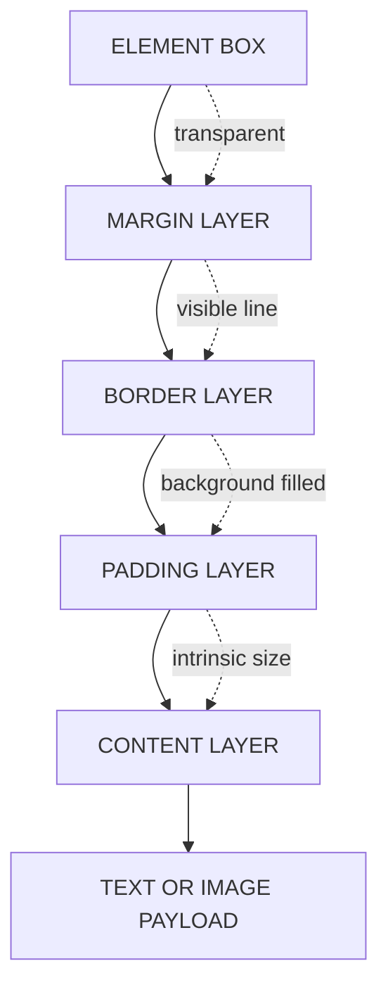
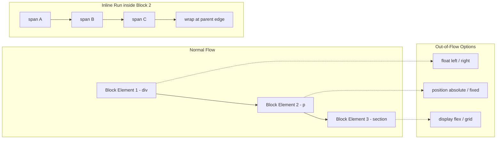

# Box Model and Text Flow

<!-- SECTION_1_START -->
# Box Model and Text Flow — Core Technical Definition & Intuitive Overview

## 1.1 Formal Academic Definition (KTU 2024 Syllabus Terminology)

In the **Cascading Style Sheets (CSS)** visual formatting model adopted by the **W3C (World Wide Web Consortium)** and reflected in the KTU 2024 *Web Programming (PECST742)* syllabus, every HTML element is conceptually treated as a rectangular **box**. The **CSS Box Model** is the foundational layout engine rule-set that defines how the **content area**, **padding**, **border**, and **margin** of these boxes are computed, drawn, and stacked relative to one another on the rendered web page.

**Text Flow** (also called *Normal Flow* or *Document Flow*) is the default, unstyled layout mechanism by which block-level elements stack vertically and inline elements flow horizontally from left to right (or right to left in RTL languages), wrapping naturally at the boundary of their containing block.

> [!IMPORTANT]
> **KTU 2024 Module Highlight:** Module 1 expects students to *understand, apply, and calculate* the dimensions of the Box Model and to *predict* the rendered position of elements under normal text flow. Direct numerical computation of total element width/height is a guaranteed Part B question pattern.

---

## 1.2 Conceptual Analogy / Intuition

### 📦 The "Picture Frame + Matting + Wall" Analogy
Imagine a photograph you want to hang on a wall:

| Layer | Real-World Counterpart | CSS Property |
|---|---|---|
| The actual photo | Image / Text content | `content` |
| The white matting around the photo | Empty space inside the frame | `padding` |
| The wooden frame itself | Visible edge of the element | `border` |
| Empty space between this frame and the next one on the wall | Gap to neighboring elements | `margin` |

- **Padding** is **inside** the border and always carries the background color of the element.
- **Margin** is **outside** the border and is always transparent.
- **Border** sits *between* padding and margin and has a thickness, style, and color.

### 🌊 Text Flow as "Water in a River"
Think of normal flow as water poured into a riverbed. Block elements (like `<div>`, `<p>`, `<h1>`) behave like **large stones** stacked top-to-bottom — they each occupy their own horizontal line. Inline elements (like `<span>`, `<a>`, `<strong>`) behave like **small pebbles** within the current — they sit side-by-side, wrapping only when they hit the riverbank (the parent's right edge).

> [!NOTE]
> **Default Display Values (HTML5):**
> - `<div>`, `<p>`, `<h1>–<h6>`, `<ul>`, `<ol>`, `<li>`, `<section>` → **`display: block`**
> - `<span>`, `<a>`, `<strong>`, `<em>`, `` → **`display: inline`**

---

## 1.3 Standard Metrics & Default Constants

- **Default `font-size`** of the root element (`<html>`) in browsers = **16 px** (1em = 16px).
- **Standard border thickness** when only `border-style` is set without width = **medium ≈ 3 px**.
- **Default `box-sizing` value** (legacy) = **`content-box`**.
- **Default `box-sizing` value** (best-practice reset) = **`border-box`**.

> [!VISUALIZATION CONTROL]
> **Concept:** Box Model layered rectangle
> **GeoGebra / Desmos Input Equations:**
> * Rectangle 1 (content): `f(x) = 1` for `x ∈ [2, 8]`, `y ∈ [2, 6]`
> * Rectangle 2 (padding): `g(x) = 1` for `x ∈ [1, 9]`, `y ∈ [1, 7]`
> * Rectangle 3 (border): `h(x) = 1` for `x ∈ [0.5, 9.5]`, `y ∈ [0.5, 7.5]`
> * Rectangle 4 (margin): `k(x) = 1` for `x ∈ [0, 10]`, `y ∈ [0, 8]`
> **Visual Description:** Four concentric rectangles. The innermost is the content area, wrapped by a transparent padding band, then a solid border line, and finally a transparent margin gap to the next element. Adjust the constants to see how `width × 2 + padding × 2 + border × 2` expands the total occupied width.
<!-- SECTION_1_END -->

<!-- SECTION_2_START -->
# Deep Theoretical Analysis & KTU High-Yield Formula Sheet

## 2.1 The Four Layers of the Box Model — Structured Logic

The CSS visual engine paints every element using **four nested rectangles** drawn from the inside out:

1. **Content Box** — The actual textual, image, or media payload. Its size is governed by `width` and `height` (or intrinsic size for replaced elements like ``).
2. **Padding Box** — Cleared space *between* content and border. It is filled with the element's own `background-color`. Padding is part of the element's *clickable / focusable* area.
3. **Border Box** — A drawn line surrounding the padding. May be solid, dashed, dotted, double, etc. Has a defined `border-width` and `border-color`.
4. **Margin Box** — Transparent space *outside* the border. Used to push *sibling* elements away. Margins of adjacent siblings can **collapse** (see §2.4).

### Why these layers exist
- **Padding** prevents content from "kissing" the border (typographic breathing room).
- **Border** is the visible affordance that defines an element's interactive edge.
- **Margin** establishes *inter-element* relationships — the rhythm of a page.

---

## 2.2 `box-sizing` — The Two Computation Modes

The single most important KTU-relevant property is `box-sizing`, which dictates whether `width`/`height` includes padding & border or not.

### Mode A — `content-box` (Browser default, legacy)
The declared `width` applies **only to the content area**.

$$\text{Total Width}_{\text{content-box}} = \text{width} + 2 \cdot \text{padding} + 2 \cdot \text{border-width}$$

### Mode B — `border-box` (Best practice, "intuitive" box)
The declared `width` applies to **content + padding + border**.

$$\text{Content Width}_{\text{border-box}} = \text{width} - 2 \cdot \text{padding} - 2 \cdot \text{border-width}$$

> [!IMPORTANT]
> KTU examiners love this one-liner: *"In `border-box`, padding and border eat into the available width instead of expanding it."* Memorize it verbatim.

---

## 2.3 Display Values & Their Effect on Flow

| `display` Value | Line Break? | Width/Height Honored? | Margin/Padding? | Flow Position |
|---|---|---|---|---|
| `block` | Yes (new line) | Yes | All four sides | Vertical stack |
| `inline` | No | No (ignored) | Only horizontal | Horizontal run |
| `inline-block` | No | Yes | All four sides | Horizontal run, but sized |
| `none` | Removed from flow entirely | — | — | Not rendered |

---

## 2.4 Margin Collapse — The Most-Tested Edge Case

**Adjacent sibling margins** combine (collapse) into a **single margin** equal to the **larger** of the two:

$$M_{\text{collapsed}} = \max(M_{\text{top}}, M_{\text{bottom}})$$

Margin collapse **only** occurs in normal flow between:
- Adjacent block-level **siblings** (vertical).
- An element and its **first/last child** if no padding/border separates them.
- **Never** on horizontal (left/right) margins.
- **Never** on floated, absolutely positioned, flex, or grid items.

---

## 2.5 KTU Formula Sheet / Cheat Sheet

| # | Concept | Formula / Rule | Unit / Default |
|---|---|---|---|
| 1 | Total width (content-box) | $W_T = W + 2P + 2B$ | px, em, rem, % |
| 2 | Total width (border-box) | $W_T = W$ (fixed) | px, em, rem, % |
| 3 | Total height (content-box) | $H_T = H + 2P_{\text{vert}} + 2B_{\text{vert}}$ | px |
| 4 | Collapsed margin | $\max(M_1, M_2)$ | px |
| 5 | Em-to-pixel conversion | $1\,\text{em} = \text{parent}\,\text{font-size}$ | 16 px default |
| 6 | Rem-to-pixel conversion | $1\,\text{rem} = \text{root}\,\text{font-size}$ | 16 px default |
| 7 | Line height multiplication | $\text{effective height} = \text{font-size} \times \text{line-height}$ | unitless ratio |
| 8 | Letter-spacing shift | $\text{total width} \approx N \times (C + LS)$ | px per char |

> **Notation key:** $W$ = declared width, $H$ = declared height, $P$ = padding, $B$ = border-width, $M$ = margin, $N$ = number of characters, $C$ = average character width, $LS$ = letter-spacing.

---

## 2.6 Real-World Engineering Utility

The Box Model is not academic — it powers every production web interface:

- **Responsive grid systems** (Bootstrap, Tailwind, Material UI) all use `border-box` so developers can reason about column widths predictably.
- **Email template engines** (Mailchimp, SendGrid) rely on table-based `content-box` layouts because Outlook still does not support flexbox.
- **Design-to-code pipelines** (Figma → React) export dimensions using `border-box` to match the designer's mental model.
- **Accessibility audits** depend on correct padding so that tap targets meet the **WCAG 2.1 ≥ 44 × 44 px** minimum.
<!-- SECTION_2_END -->

<!-- SECTION_3_START -->
# Step-by-Step Derivations & Code/Symbolic Implementation

## 3.1 Worked Numerical Derivation — Box Width Calculation

**Problem:** A `<div>` has `width: 200px; padding: 20px; border: 5px solid black;` and `box-sizing: content-box`. What is the **total horizontal space** the element occupies on the page, and what is the **available content width** if we switch to `border-box`?

### Step 1 — Identify the inputs
- Declared width: $W = 200\,\text{px}$
- Padding (left + right): $2P = 2 \times 20 = 40\,\text{px}$
- Border (left + right): $2B = 2 \times 5 = 10\,\text{px}$

### Step 2 — Apply the content-box formula

$$
\begin{aligned}
W_T^{\text{content-box}} &= W + 2P + 2B \\
&= 200 + 40 + 10 \\
&= 250\,\text{px}
\end{aligned}
$$

> **Conclusion A:** The element occupies **250 px** horizontally. The 200 px is *only* for the text/image area; the remaining 50 px is padding + border.

### Step 3 — Apply the border-box formula

$$
\begin{aligned}
W_T^{\text{border-box}} &= W = 200\,\text{px} \\
W_{\text{content}} &= W - 2P - 2B \\
&= 200 - 40 - 10 \\
&= 150\,\text{px}
\end{aligned}
$$

> **Conclusion B:** The element still occupies **200 px**, but the *content area shrinks* to 150 px to absorb the padding and border.

### Step 4 — Add the margin
If the same element has `margin: 15px;`, the surrounding gap adds $2M = 30\,\text{px}$, but this is **outside** the element and does **not** affect either formula above.

$$
\begin{aligned}
W_{\text{footprint (with margin)}} &= W_T + 2M \\
&= 250 + 30 = 280\,\text{px} \quad \text{(content-box)} \\
&= 200 + 30 = 230\,\text{px} \quad \text{(border-box)}
\end{aligned}
$$

> [!NOTE]
> **Examiner's heuristic:** Margin is **never** part of the element's box dimensions; it is part of the element's *layout footprint* only.

---

## 3.2 Worked Numerical Derivation — Margin Collapse

**Problem:** Two sibling paragraphs have `margin-top: 30px` and `margin-bottom: 25px` respectively. What is the vertical gap between them?

$$
\begin{aligned}
M_{\text{collapsed}} &= \max(M_{\text{top}}, M_{\text{bottom}}) \\
&= \max(30, 25) \\
&= 30\,\text{px}
\end{aligned}
$$

The 25 px is **lost** — the larger value wins, not the sum. This is *not* `30 + 25 = 55 px`.

---

## 3.3 Fully Operational HTML5 + CSS Code Implementation

The following standalone program renders a side-by-side comparison of the two box models and logs computed widths to the JavaScript console — directly satisfying the KTU lab-observation requirement.

```html
<!DOCTYPE html>
<html lang="en">
<head>
    <meta charset="UTF-8">
    <title>Box Model Lab — KTU PECST742</title>

    <!-- Global reset: apply border-box to every element (best practice) -->
    <style>
        *, *::before, *::after {
            box-sizing: border-box;
            margin: 0;
            padding: 0;
        }

        body {
            font-family: "Segoe UI", Arial, sans-serif;
            background: #f4f6f9;
            padding: 24px;
            line-height: 1.6;
        }

        .lab-row {
            display: flex;
            gap: 24px;
            flex-wrap: wrap;
        }

        .box {
            width: 240px;          /* identical declared width */
            padding: 20px;
            border: 5px solid #1e3a8a;
            margin: 16px;
            background-color: #dbeafe;
            color: #0f172a;
            text-align: center;
            font-weight: 600;
        }

        .box--content { box-sizing: content-box; }
        .box--border   { box-sizing: border-box;   }

        .label {
            display: block;
            margin-top: 8px;
            font-size: 0.85em;
            color: #475569;
            font-weight: 400;
        }
    </style>
</head>

<body>
    <h1>Box Model Live Comparison</h1>
    <p style="margin-bottom: 16px;">
        Both boxes use <code>width: 240px</code>, <code>padding: 20px</code>,
        and <code>border: 5px</code>. Only <code>box-sizing</code> differs.
    </p>

    <div class="lab-row">
        <div class="box box--content" id="boxContent">
            content-box
            <span class="label" id="contentLabel"></span>
        </div>

        <div class="box box--border" id="boxBorder">
            border-box
            <span class="label" id="borderLabel"></span>
        </div>
    </div>

    <script>
        // Helper: safely read a computed numeric style
        function readPx(elt: HTMLElement, prop: string): number {
            const value: string = window.getComputedStyle(elt).getPropertyValue(prop);
            const parsed: number = parseFloat(value);
            if (Number.isNaN(parsed)) {
                console.error(`[BoxModelLab] Could not parse ${prop} for`, elt);
                return 0;
            }
            return parsed;
        }

        // Measure both boxes and write the results back to the DOM
        function measureAndReport(): void {
            const targets: Array<{ id: string, labelId: string, mode: string }> = [
                { id: "boxContent", labelId: "contentLabel", mode: "content-box" },
                { id: "boxBorder",  labelId: "borderLabel",  mode: "border-box"   },
            ];

            targets.forEach((t: { id: string, labelId: string, mode: string }): void => {
                const elt: HTMLElement | null = document.getElementById(t.id);
                if (elt === null) {
                    console.error(`[BoxModelLab] Missing element #${t.id}`);
                    return;
                }

                const width: number   = readPx(elt, "width");
                const paddingLR: number = readPx(elt, "padding-left")
                                         + readPx(elt, "padding-right");
                const borderLR: number  = readPx(elt, "border-left-width")
                                         + readPx(elt, "border-right-width");
                const total: number   = width + paddingLR + borderLR;

                const summary: string =
                    `Declared ${width}px → total ${total}px ` +
                    `(padding ${paddingLR}px + border ${borderLR}px)`;

                const labelEl: HTMLElement | null = document.getElementById(t.labelId);
                if (labelEl !== null) {
                    labelEl.textContent = summary;
                }

                console.log(`[${t.mode}]`, summary);
            });
        }

        document.addEventListener("DOMContentLoaded", measureAndReport);
        window.addEventListener("resize", measureAndReport);
    </script>
</body>
</html>
```

### Expected Console Output

```text
[content-box] Declared 240px → total 290px (padding 40px + border 10px)
[border-box]  Declared 240px → total 240px (padding 40px + border 10px)
```

> [!IMPORTANT]
> **KTU Lab Observation Note:** When the page is opened in Chrome DevTools, the *Box Model* panel for the `content-box` element will show `width: 240px` in the *content* layer but a `290px` total painted area. This visual mismatch is exactly the confusion the KTU examiner tests in viva.

---

## 3.4 Text Flow — Code Walkthrough

```html
<!DOCTYPE html>
<html>
<head>
    <meta charset="UTF-8">
    <title>Text Flow Demo</title>
    <style>
        .block-demo {
            background: #fef3c7;
            margin: 10px 0;
            padding: 8px;
        }
        .inline-demo {
            background: #dcfce7;
            padding: 4px;
        }
        .inline-block-demo {
            display: inline-block;
            width: 120px;
            height: 60px;
            background: #fce7f3;
            margin: 4px;
            text-align: center;
            line-height: 60px;
        }
        .nowrap-demo {
            white-space: nowrap;
            overflow: hidden;
            text-overflow: ellipsis;
            width: 200px;
            background: #e0e7ff;
        }
    </style>
</head>
<body>
    <div class="block-demo">Block 1 — starts on its own line.</div>
    <div class="block-demo">Block 2 — pushed below by block flow.</div>

    <p>
        <span class="inline-demo">inline A</span>
        <span class="inline-demo">inline B</span>
        <span class="inline-demo">inline C — all on one line, wrapping at edge.</span>
    </p>

    <div>
        <span class="inline-block-demo">Box 1</span>
        <span class="inline-block-demo">Box 2</span>
        <span class="inline-block-demo">Box 3</span>
    </div>

    <p class="nowrap-demo">
        This is a very long sentence that should not wrap and should be truncated with an ellipsis.
    </p>
</body>
</html>
```

**Observable behavior:**
- `.block-demo` elements stack vertically with a **collapsed 10 px margin** (max of the two siblings).
- `.inline-demo` elements flow left-to-right, wrapping at the viewport edge.
- `.inline-block-demo` elements flow inline **but honor width/height** like blocks.
- `.nowrap-demo` truncates with `...` because `white-space: nowrap` + `overflow: hidden` + `text-overflow: ellipsis` form the classic CSS truncation pattern.
<!-- SECTION_3_END -->

<!-- SECTION_4_START -->
# Structural Diagrams & Schematics

## 4.1 Box Model — Concentric Layer Architecture (Mermaid)



> **Reading guide:** Outer-to-inner traversal. Margin is transparent (used for sibling spacing), border is the visible edge, padding carries the element background, and content holds the payload.

---

## 4.2 Box-Sizing Decision Flow

```mermaid
flowchart TD
    Q1{"Is box-sizing set?"}
    Q1 -->|No, default browser| A1["content-box — width applies to content only"]
    Q1 -->|Yes, value?| A2{"Which value?"}

    A2 -->|content-box| P1["Total W = declared W + 2P + 2B"]
    A2 -->|border-box|  P2["Total W = declared W, content shrinks"]

    P1 --> R1["Element grows OUTWARD past declared width"]
    P2 --> R2["Element stays AT declared width, content area shrinks"]

    style A1 fill:#fde68a,stroke:#92400e
    style P1 fill:#fee2e2,stroke:#991b1b
    style P2 fill:#dcfce7,stroke:#166534
    style R1 fill:#fee2e2,stroke:#991b1b
    style R2 fill:#dcfce7,stroke:#166534
```

---

## 4.3 Document Flow — Sequential Processing Topology



---

## 4.4 Margin Collapse — Interaction Matrix

| Scenario | Collapse? | Resulting Gap | Rule Reference |
|---|---|---|---|
| Two adjacent block siblings (vertical) | ✅ Yes | $\max(M_a, M_b)$ | CSS 2.1 §8.3.1 |
| Parent ↔ first/last child (no padding/border) | ✅ Yes | $\max(M_{\text{parent}}, M_{\text{child}})$ | CSS 2.1 §8.3.1 |
| Horizontal (left/right) margins | ❌ No | $M_a + M_b$ | Always additive |
| Floated, absolute, flex, grid items | ❌ No | $M_a + M_b$ | Out of normal flow |
| Margins separated by a border or non-zero padding | ❌ No | $M_a + M_b$ | Barrier breaks collapse |

> [!NOTE]
> **KTU visualization expectation:** When asked to *sketch* margin collapse, draw two boxes whose vertical gap is labeled as a single dimension equal to the larger margin, **not** the sum.
<!-- SECTION_4_END -->

<!-- SECTION_5_START -->
# KTU 2024 Scheme Examination Question Bank & Topic Recap

## 5.1 Part A — Short Answer Questions (3 Marks Each)

### Q1. **[KTU University Exam — July 2024]** Define the CSS Box Model. List its four layers from innermost to outermost. *(CO1, Remember)*

**Model Answer (3 Marks — Board Key):**

The CSS Box Model is the W3C visual formatting rule that treats every HTML element as a rectangular box composed of four nested layers. From **innermost to outermost**, they are:

1. **Content Box** — holds the actual text, image, or media payload.
2. **Padding Box** — transparent-to-element-background space between content and border.
3. **Border Box** — the visible edge drawn around the padding.
4. **Margin Box** — transparent space outside the border used to separate sibling elements.

> *Valuation split:* [Naming all four layers correctly: 2 Marks] [Correct order inside-out: 1 Mark]

---

### Q2. **[KTU University Exam — Dec 2023]** Differentiate between `display: block`, `display: inline`, and `display: inline-block` in CSS. *(CO2, Understand)*

**Model Answer (3 Marks — Board Key):**

| Property | `block` | `inline` | `inline-block` |
|---|---|---|---|
| New line before/after | Yes | No | No |
| `width` / `height` honored | Yes | No (ignored) | Yes |
| Vertical `margin` / `padding` | Yes | Only horizontal | Yes |
| Default for | `<div>`, `<p>`, `<h1>` | `<span>`, `<a>`, `<strong>` | Manually set |

> *Valuation split:* [Any two correct comparisons: 2 Marks] [Correct default element examples: 1 Mark]

---

## 5.2 Part B — Long Answer Questions (14 Marks Each, Internal Choice)

### Question A — **[KTU University Exam — July 2024 / CO2, Apply + Analyze]**

**(a)** Explain the CSS Box Model with a neat diagram. State how total width is calculated under both `content-box` and `border-box`. *(7 Marks)*

**(b)** Given a `<div>` styled with `width: 300px; height: 150px; padding: 25px; border: 10px solid; margin: 20px;`, calculate:
  - (i) The total horizontal space occupied under `content-box`.
  - (ii) The content area width under `border-box`.
  - (iii) The total *layout footprint* (including margin) under `content-box`. *(7 Marks)*

#### Model Solution

**(a) Explanation (7 Marks):**

The CSS Box Model conceptualizes every HTML element as a rectangular box with four nested layers, painted inside-out: **content → padding → border → margin**.

- *Content box* — declared with `width` and `height`; holds the actual payload.
- *Padding* — inside the border, carries the element's `background-color`.
- *Border* — visible line with width, style, and color.
- *Margin* — outside the border, always transparent, separates siblings.

**Total width formulas:**

$$
\begin{aligned}
W_T^{\text{content-box}} &= W_{\text{declared}} + 2 \cdot P + 2 \cdot B \\
W_T^{\text{border-box}}  &= W_{\text{declared}} \quad \text{(fixed total)}
\end{aligned}
$$

> *Valuation split:* [Diagram with all 4 layers: 3 Marks] [Two correct formulas: 2 Marks] [Layer descriptions: 2 Marks]

**(b) Numerical solution (7 Marks):**

Given: $W = 300\,\text{px}$, $P = 25\,\text{px}$ (each side), $B = 10\,\text{px}$ (each side), $M = 20\,\text{px}$ (each side).

**(i) Total horizontal space under `content-box`:**

$$
\begin{aligned}
W_T^{\text{content-box}} &= W + 2P + 2B \\
&= 300 + 2(25) + 2(10) \\
&= 300 + 50 + 20 \\
&= 370\,\text{px}
\end{aligned}
$$

**(ii) Content area width under `border-box`:**

$$
\begin{aligned}
W_{\text{content}}^{\text{border-box}} &= W - 2P - 2B \\
&= 300 - 50 - 20 \\
&= 230\,\text{px}
\end{aligned}
$$

**(iii) Total layout footprint (with margin) under `content-box`:**

$$
\begin{aligned}
W_{\text{footprint}} &= W_T^{\text{content-box}} + 2M \\
&= 370 + 2(20) \\
&= 370 + 40 \\
&= 410\,\text{px}
\end{aligned}
$$

> *Valuation split:* [(i) substitution and result: 2 Marks] [(ii) correct border-box inversion: 2 Marks] [(iii) margin addition: 2 Marks] [Units and final statement: 1 Mark]

---

### Question B — **[KTU University Exam — Dec 2023 / CO2 + CO3, Understand + Apply]**

**(a)** Define **Normal Flow** in CSS. Explain how block-level and inline-level elements are positioned by default, and state what happens when an element is taken out of flow using `float` or `position: absolute`. *(7 Marks)*

**(b)** With the help of an HTML + CSS code snippet, demonstrate:
  - (i) Margin collapse between two adjacent block elements and how to prevent it.
  - (ii) Single-line text truncation using `white-space`, `overflow`, and `text-overflow`. *(7 Marks)*

#### Model Solution

**(a) Normal Flow — Conceptual (7 Marks):**

Normal Flow (also called *Document Flow* or *Text Flow*) is the default CSS layout algorithm in which elements are rendered in document order **without** any explicit positioning. In this mode:

- **Block-level elements** (e.g., `<div>`, `<p>`, `<section>`) stack **vertically**, each starting on a new line and stretching the full available width of their parent containing block.
- **Inline-level elements** (e.g., `<span>`, `<a>`, `<em>`) flow **horizontally** within the line, wrapping at the right edge of the parent. They occupy only the width their content needs.
- **Adjacent vertical margins collapse** to the larger of the two values.

When an element is **taken out of flow**:
- `float: left/right` removes the element from the vertical flow stack but still allows surrounding inline content to wrap around it.
- `position: absolute` or `position: fixed` removes the element from normal flow entirely; it is positioned relative to the nearest positioned ancestor (or the viewport, for `fixed`) and no longer affects sibling layout.

> *Valuation split:* [Definition: 1 Mark] [Block vs inline behavior: 3 Marks] [Out-of-flow mechanics: 3 Marks]

**(b) Demonstration Code (7 Marks):**

```html
<!DOCTYPE html>
<html>
<head>
    <meta charset="UTF-8">
    <title>Flow & Collapse Demo</title>
    <style>
        body { font-family: Arial, sans-serif; padding: 20px; }

        /* ---------- (i) Margin collapse & prevention ---------- */
        .collapse-demo {
            margin: 30px 0;
            background: #fde68a;
            padding: 10px;
        }
        /* Prevention technique: add 1px padding or border on the parent */
        .no-collapse {
            padding-top: 1px;       /* breaks collapse */
        }
        .no-collapse .collapse-demo {
            margin-top: 0;          /* explicit reset */
        }

        /* ---------- (ii) Text truncation ---------- */
        .truncate {
            width: 220px;
            white-space: nowrap;        /* prevent line wrap */
            overflow: hidden;           /* hide overflow */
            text-overflow: ellipsis;    /* show ... */
            background: #e0e7ff;
            padding: 4px 8px;
            border: 1px solid #6366f1;
        }
    </style>
</head>
<body>
    <h2>(i) Margin Collapse Demonstration</h2>
    <div class="collapse-demo">First block — margin-bottom: 30px</div>
    <div class="collapse-demo">Second block — margin-top: 30px (collapses to 30, not 60)</div>

    <h3>Preventing Collapse</h3>
    <div class="no-collapse">
        <div class="collapse-demo">Now separated by 1px padding barrier</div>
        <div class="collapse-demo">Collapse prevented — gaps add to 60px</div>
    </div>

    <h2>(ii) Single-Line Truncation</h2>
    <p class="truncate">
        This is a very long sentence that will not wrap and will be clipped with an ellipsis at the end.
    </p>
</body>
</html>
```

**Expected observations:**

1. The first two `.collapse-demo` blocks have a vertical gap of **30 px**, not 60 px — proving margin collapse via the formula $M_{\text{collapsed}} = \max(30, 30) = 30$.
2. The second pair (inside `.no-collapse`) shows a gap of **60 px** because the 1 px padding on the parent acts as a barrier.
3. The `.truncate` paragraph displays the sentence ending with `...` regardless of viewport size, as long as the parent width is 220 px.

> *Valuation split:* [(i) collapse demo + prevention technique: 3 Marks] [(ii) working truncation snippet: 3 Marks] [Output description / screenshot explanation: 1 Mark]

---

> [!WARNING]
> **KTU Examiner's Valuation Warning — Common Pitfalls:**
> 1. **Forgetting to add the border to the total width.** Students often write `width + 2 × padding` and skip `2 × border-width`. Examiners deduct **2 marks** for this.
> 2. **Adding margins into the content-box formula.** Margin is *outside* the element. Do not include $2M$ in the box-width formula; only include it for *layout footprint*.
> 3. **Summing collapsed margins.** Always use $\max(M_1, M_2)$, never $M_1 + M_2$, for adjacent siblings in normal vertical flow.
> 4. **Confusing `display: none` with `visibility: hidden`.** `none` removes the element from flow entirely (no space reserved); `hidden` hides it but **reserves** the space.
> 5. **Writing `box-sizing: border-box` on inline elements.** It has no visual effect because inline elements ignore `width`/`height` regardless of `box-sizing`.
> 6. **Skipping units in the answer.** Always write `px` (or `em`/`%`) next to numerical values. An answer of *"250"* alone loses a mark.

---

## 5.3 Topic Recap & Important Things to Remember

- 🔹 The **CSS Box Model** has exactly **four layers**: **content → padding → border → margin** (inside to outside).
- 🔹 **`content-box`** is the legacy default; declared `width` covers only the content area, so padding and border **expand** the element outward.
- 🔹 **`border-box`** is the modern best practice; declared `width` covers content + padding + border, with the content area **shrinking** to absorb them.
- 🔹 **Total horizontal space** under content-box: $W_T = W + 2P + 2B$. Add $2M$ only for *footprint*, not for box size.
- 🔹 **Margin collapse** applies only to **vertical** margins of **adjacent block siblings** (and parent–child edges without barriers), using $\max$, not sum.
- 🔹 **Block elements** stack vertically, honor `width`/`height` and all four margin/padding sides.
- 🔹 **Inline elements** flow horizontally, **ignore** `width`/`height`, and accept only horizontal margin/padding.
- 🔹 **Inline-block** is the hybrid: flows inline but honors box dimensions.
- 🔹 **Normal flow** = default layout with no `float`, `position`, `flex`, or `grid`.
- 🔹 **Text truncation pattern** requires all three: `white-space: nowrap` + `overflow: hidden` + `text-overflow: ellipsis`.
- 🔹 **`display: none`** removes from flow; **`visibility: hidden`** reserves space.
- 🔹 Default root `font-size` = **16 px**; therefore `1em = 1rem = 16px` unless explicitly overridden.
- 🔹 Always include the **unit** in CSS answers and explicitly state whether the computed value is in `content-box` or `border-box` mode.
<!-- SECTION_5_END -->
