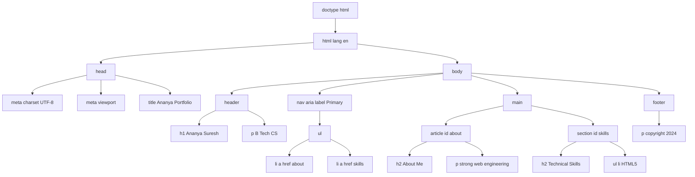
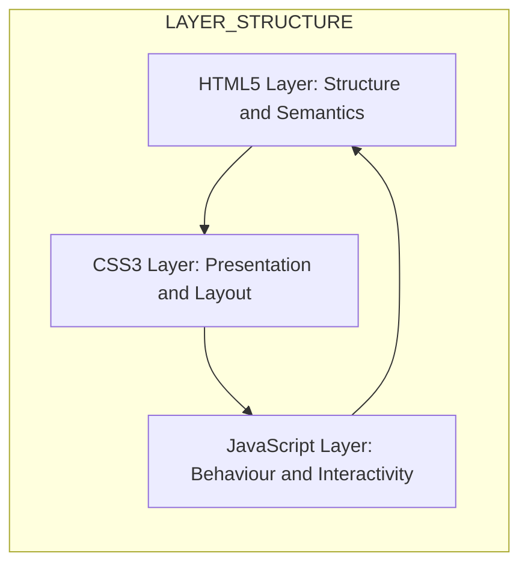
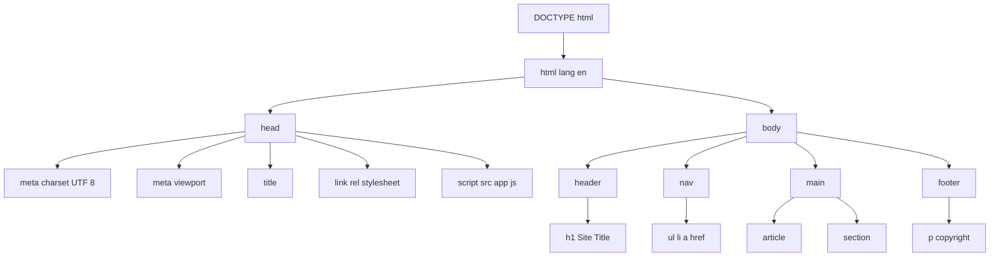

# Creating Web Page using HTML5  - Introduction

<!-- SECTION_1_START -->

# Web Programming (PECST742) — Module 1: Creating Web Pages using HTML5

## 1. Core Technical Definition & Intuitive Overview

### 1.1 Formal Definition (KTU 2024 Syllabus Terminology)

**HTML5** is the fifth and current major version of the **HyperText Markup Language (HTML)**, a standardized declarative markup language used to structure and present content on the **World Wide Web (WWW)**. It is developed jointly by the **World Wide Web Consortium (W3C)** and the **Web Hypertext Application Technology Working Group (WHATWG)** as the official W3C Recommendation published on **28 October 2014**.

HTML5 extends, improves, and rationalizes the markup available for documents, introduces application programming interfaces (APIs) for complex web applications, and handles the syntactic errors found in older HTML documents. It is designed to deliver rich web content without the need for additional proprietary plug-ins such as **Adobe Flash**.

> [!IMPORTANT]
> **KTU Syllabus Highlight (Module 1):**
> The 2024 Scheme expects the student to *understand the evolution of HTML, the structure of an HTML5 document, semantic elements, form controls, audio/video embedding, the Canvas & Scalable Vector Graphics (SVG) APIs, and the role of the Document Object Model (DOM)*. A typical 14-mark theory question combines **conceptual** + **code-writing** parts.

### 1.2 Conceptual Analogy — The "House Blueprint" Intuition

Think of an HTML5 document as the **architectural blueprint of a house**:

| House Component | HTML5 Equivalent | Purpose |
|---|---|---|
| Plot of land | `<!DOCTYPE html>` | Declares the document type and version |
| Outer walls | `<html>` | The root container of the whole page |
| Head office of the architect | `<head>` | Holds metadata, title, links, scripts |
| Front door nameplate | `<title>` | The name shown in the browser tab |
| Living room, kitchen, bedrooms | `<section>`, `<article>`, `<nav>`, `<aside>`, `<header>`, `<footer>` | **Semantic** structural blocks |
| Furniture (sofa, TV, table) | `<p>`, ``, `<video>`, `<span>` | Inline / media content |
| Electrical wiring | `<script>`, `<link>`, `<style>` | Behavioural and presentation logic |

Just as a blueprint tells the builder **what goes where** (not how it looks visually), HTML5 tells the browser **what the content means** (semantics) and the **Cascading Style Sheets (CSS)** decide **how it looks** (presentation).

> [!NOTE]
> **Key Insight:** HTML5 is *not* a programming language — it is a **markup language**. It has no variables, no loops, and no conditional logic. Behavioural logic is delegated to **JavaScript**, and presentation to **CSS**.

### 1.3 Evolution of HTML — Timeline (KTU High-Yield)

- **HTML 1.0 (1993)** — Basic tags, no tables, no forms.
- **HTML 2.0 (1995)** — Standardized forms, tables.
- **HTML 3.2 (1997)** — Applets, scripts, tables for layout (deprecated later).
- **HTML 4.01 (1999)** — Strict, Transitional, Frameset DTDs; CSS separation.
- **XHTML 1.0 / 1.1 (2000 / 2001)** — XML-based reformulation of HTML 4.01.
- **HTML5 (2014)** — Multimedia, semantic tags, Canvas, SVG, Web Storage, Geolocation, Web Workers.
- **HTML 5.1 (2016)** — Refinements, `<picture>`, `<details>`.
- **HTML 5.2 (2017)** — `<dialog>`, iFrame *paymentrequest* attribute.
- **HTML 5.3 (Living Standard, ongoing)** — Continuously updated by WHATWG.

> [!TIP]
> **Remember this for exams:** HTML5 is a **Living Standard** — it has no version numbers anymore in the WHATWG branch; it is updated continuously without a fixed version.

### 1.4 Geometric / Structural Visualization (GeoGebra-Style Block Diagram)

> [!VISUALIZATION CONTROL]
> **Concept:** Layered client-side rendering stack of a modern web page
> **GeoGebra / Desmos Input Equations (conceptual coordinates):**
> - Layer $L_0$ at $y=0$: $L_0(x) = \text{URL / DNS Lookup}$
> - Layer $L_1$ at $y=1$: $L_1(x) = \text{HTTP Request}$
> - Layer $L_2$ at $y=2$: $L_2(x) = \text{HTML5 Parser} \rightarrow \text{DOM Tree}$
> - Layer $L_3$ at $y=3$: $L_3(x) = \text{CSSOM} + \text{Render Tree}$
> - Layer $L_4$ at $y=4$: $L_4(x) = \text{Layout} \rightarrow \text{Paint} \rightarrow \text{Composite}$
> **Visual Description:** A staircase-shaped diagram rising from $x$-axis, showing how a URL becomes pixels on the screen. HTML5 occupies the *DOM Tree* layer ($L_2$); CSS occupies the next layer; the GPU performs the final composite.

---

## 2. Deep Theoretical Analysis & KTU High-Yield Reference Sheet

<!-- SECTION_2_START -->

### 2.1 Anatomy of an HTML5 Document — The 5 Mandatory Building Blocks

Every valid HTML5 document must contain the following **five** building blocks in the order shown:

1. **`<!DOCTYPE html>`** — Document type declaration. Tells the browser to render in **Standards Mode** (not *Quirks Mode*). It is **case-insensitive** in HTML5 and has no closing tag.
2. **`<html lang="en">`** — The root element. The `lang` attribute is a *global accessibility* attribute used by screen readers and search engines.
3. **`<head>`** — Container for machine-readable information: `<meta>`, `<title>`, `<link>`, `<style>`, `<script>`, `<base>`.
4. **`<body>`** — Container for all visible page content.
5. **`<title>`** — Mandatory inside `<head>`. Defines the browser tab title, bookmark name, and search-engine snippet.

### 2.2 HTML5 vs HTML4 — Comparative Reference

| Feature | HTML 4.01 | HTML 5 |
|---|---|---|
| Doctype declaration | Long, version-specific (`<!DOCTYPE HTML PUBLIC "-//W3C//DTD HTML 4.01//EN" "http://www.w3.org/TR/html4/strict.dtd">`) | Simple: `<!DOCTYPE html>` |
| Character encoding | `<meta http-equiv="Content-Type" content="text/html; charset=UTF-8">` | `<meta charset="UTF-8">` |
| Semantic structure | `<div id="header">`, `<div id="nav">` | Native `<header>`, `<nav>`, `<main>`, `<article>`, `<section>`, `<footer>` |
| Multimedia | Requires Flash / Silverlight plug-in | Native `<audio>`, `<video>` tags |
| Graphics | None natively | `<canvas>` (raster) and `<svg>` (vector) |
| Form controls | `text`, `password`, `checkbox`, `radio`, `submit` | Adds `date`, `time`, `email`, `url`, `tel`, `range`, `color`, `search`, `number` |
| Storage | `cookies` (4 KB) only | `localStorage` (5–10 MB) and `sessionStorage` |
| JavaScript APIs | DOM Level 2, XMLHttpRequest | Geolocation, Drag \& Drop, Web Workers, WebSockets, Server-Sent Events |
| Math/Inline vector | MathML external, VML | Native `<svg>`, MathML |

### 2.3 KTU Formula Sheet / Cheat Sheet

> [!NOTE]
> Since HTML5 is declarative, the "formulas" are **syntactic production rules** and **attribute constraints** — treat them as exam-ready definitions.

**Table A — Document Skeleton Syntax**

| Slot | Mandatory? | Production Rule | Example |
|---|---|---|---|
| Doctype | Yes | `<!DOCTYPE html>` | `<!DOCTYPE html>` |
| Root | Yes | `<html lang="..."> ... </html>` | `<html lang="en">` |
| Head | Yes | `<head> ... </head>` | contains `<title>`, `<meta>` |
| Title | Yes (in head) | `<title>...</title>` | `<title>KTU Web Programming</title>` |
| Meta charset | Recommended | `<meta charset="UTF-8">` | — |
| Body | Yes | `<body> ... </body>` | — |

**Table B — Global Attributes (apply to *every* HTML5 element)**

| Attribute | Purpose | Valid Values |
|---|---|---|
| `id` | Unique element identifier | CSS-selector-safe string |
| `class` | One or more CSS class names | space-separated tokens |
| `style` | Inline CSS | `property: value;` |
| `title` | Tooltip text | free text |
| `lang` | Language of element content | BCP-47 code (e.g. `en`, `ml-IN`) |
| `data-*` | Custom data attribute | `data-user-id="101"` |
| `hidden` | Hides element | boolean |
| `tabindex` | Keyboard tab order | integer |
| `contenteditable` | Allows in-place editing | `true` / `false` |
| `draggable` | Enables drag-and-drop | `true` / `false` / `auto` |

**Table C — New HTML5 Input `type` Values (high-yield for 14-mark questions)**

| `type` | Renders As | Validation Pattern |
|---|---|---|
| `email` | Single-line text | RFC 5322 e-mail |
| `url` | Single-line text | URL pattern |
| `tel` | Single-line text | none (semantic only) |
| `number` | Stepper | numeric range |
| `range` | Slider | numeric range |
| `date` | Date picker | `YYYY-MM-DD` |
| `time` | Time picker | `HH:MM` |
| `color` | Colour picker | `#RRGGBB` |
| `search` | Search box | none |
| `month`, `week` | Month / week pickers | ISO 8601 |

**Table D — Block vs Inline Categorisation (Top Exam Pick)**

| Block-Level Elements | Inline Elements |
|---|---|
| `<div>`, `<p>`, `<h1>`–`<h6>`, `<ul>`, `<ol>`, `<li>`, `<table>`, `<header>`, `<footer>`, `<section>`, `<article>`, `<nav>`, `<aside>`, `<form>`, `<hr>`, `<pre>` | `<span>`, `<a>`, `<strong>`, `<em>`, `<b>`, `<i>`, ``, `<br>`, `<code>`, `<mark>`, `<small>`, `<sub>`, `<sup>`, `<label>`, `<input>` |

**Table E — Void (Self-Closing) Elements — MUST NOT have a closing tag**

`<area>`, `<base>`, `<br>`, `<col>`, `<embed>`, `<hr>`, ``, `<input>`, `<link>`, `<meta>`, `<param>`, `<source>`, `<track>`, `<wbr>`

### 2.4 Real-World Engineering Utility

- **Search Engine Optimization (SEO):** Semantic tags (`<article>`, `<nav>`, `<header>`) let crawlers understand page structure, improving ranking.
- **Accessibility (WCAG 2.1 / 2.2):** ARIA roles + native semantics enable screen-reader navigation.
- **Mobile / Responsive Design:** Combined with CSS3 Media Queries, HTML5 enables *mobile-first* architectures used in production by Google, Amazon, and government portals.
- **Single Page Applications (SPA):** HTML5 + JavaScript frameworks (React, Angular, Vue) power apps like Gmail, Google Docs, Figma.
- **Internet of Things (IoT):** HTML5 WebSockets + Geolocation API enable real-time dashboards for smart-city and industrial-monitoring systems.

> [!IMPORTANT]
> **Production-grade rule:** A valid HTML5 document passes the **W3C Markup Validation Service** without any errors. Always validate before deployment.

<!-- SECTION_2_END -->

---

## 3. Step-by-Step Derivation of a Complete HTML5 Page & Code Implementation

<!-- SECTION_3_START -->

### 3.1 Derivation — "Build a Personal Portfolio Page" from Requirements

**Requirement Specification (RS):**
A KTU B.Tech student wants a *single-page portfolio* with:
- Site title "Ananya's Portfolio" in the browser tab.
- UTF-8 character encoding to support Malayalam and Hindi.
- A semantic `<header>` with the student name.
- A `<nav>` with 4 anchor links.
- A `<main>` containing an `<article>` (about-me) and a `<section>` (skills list).
- A `<footer>` with copyright.

**Step 1 — Declare the document type.**
In HTML5, only one declaration exists; it is short, case-insensitive, and triggers **Standards Mode** in the browser engine.

```html
<!DOCTYPE html>
```

**Step 2 — Open the root element with language attribute.**
The `lang` attribute helps assistive technology pronounce the text correctly. For a Kerala student, the primary language is British English (`en`); Malayalam can be wrapped with `lang="ml"` on inner elements.

```html
<html lang="en">
```

**Step 3 — Build the head section.**
We need three things inside `<head>`: character encoding, the visible title, and a viewport meta tag (mandatory for mobile rendering).

```html
<head>
    <meta charset="UTF-8">
    <meta name="viewport" content="width=device-width, initial-scale=1.0">
    <title>Ananya's Portfolio</title>
</head>
```

**Step 4 — Open the body and add semantic header.**

```html
<body>
    <header>
        <h1>Ananya Suresh</h1>
        <p>B.Tech Computer Science — KTU 2024 Scheme</p>
    </header>
```

**Step 5 — Add the navigation block.**
The `aria-label` provides an accessible name for the `<nav>` region.

```html
    <nav aria-label="Primary">
        <ul>
            <li><a href="#about">About</a></li>
            <li><a href="#skills">Skills</a></li>
            <li><a href="#projects">Projects</a></li>
            <li><a href="#contact">Contact</a></li>
        </ul>
    </nav>
```

**Step 6 — Add the main region containing an article and a section.**

```html
    <main>
        <article id="about">
            <h2>About Me</h2>
            <p>I am a final-year B.Tech student passionate about
               <strong>web engineering</strong> and
               <em>open-source contribution</em>.</p>
        </article>

        <section id="skills">
            <h2>Technical Skills</h2>
            <ul>
                <li>HTML5 and CSS3</li>
                <li>JavaScript (ES6+)</li>
                <li>Python and Django</li>
                <li>MySQL and MongoDB</li>
            </ul>
        </section>
    </main>
```

**Step 7 — Add the semantic footer.**

```html
    <footer>
        <p>&copy; 2024 Ananya Suresh. All rights reserved.</p>
    </footer>
</body>
</html>
```

**Step 8 — Final assembled file (portfolio.html).**

```html
<!DOCTYPE html>
<html lang="en">
<head>
    <meta charset="UTF-8">
    <meta name="viewport" content="width=device-width, initial-scale=1.0">
    <title>Ananya's Portfolio</title>
</head>
<body>
    <header>
        <h1>Ananya Suresh</h1>
        <p>B.Tech Computer Science &mdash; KTU 2024 Scheme</p>
    </header>
    <nav aria-label="Primary">
        <ul>
            <li><a href="#about">About</a></li>
            <li><a href="#skills">Skills</a></li>
            <li><a href="#projects">Projects</a></li>
            <li><a href="#contact">Contact</a></li>
        </ul>
    </nav>
    <main>
        <article id="about">
            <h2>About Me</h2>
            <p>I am a final-year B.Tech student passionate about
               <strong>web engineering</strong> and
               <em>open-source contribution</em>.</p>
        </article>
        <section id="skills">
            <h2>Technical Skills</h2>
            <ul>
                <li>HTML5 and CSS3</li>
                <li>JavaScript (ES6+)</li>
                <li>Python and Django</li>
                <li>MySQL and MongoDB</li>
            </ul>
        </section>
    </main>
    <footer>
        <p>&copy; 2024 Ananya Suresh. All rights reserved.</p>
    </footer>
</body>
</html>
```

### 3.2 Algorithmic Verification — Does My HTML5 Document Pass W3C Rules?

Below is a self-contained Python validator that checks the **five mandatory slots** mentioned in §2.1.

```python
import re
from pathlib import Path
from typing import List, Tuple

REQUIRED_SLOTS: List[Tuple[str, str]] = [
    ("DOCTYPE", r"<!DOCTYPE\s+html\s*>"),
    ("HTML_ROOT", r"<html(?:\s+[^>]*)?>"),
    ("HEAD", r"<head\b[^>]*>.*?</head>", re.DOTALL),
    ("TITLE", r"<title\b[^>]*>.*?</title>", re.DOTALL),
    ("BODY", r"<body\b[^>]*>.*?</body>", re.DOTALL),
]


def validate_html5(path: Path) -> List[str]:
    """
    Validate that the HTML5 file at `path` contains the five mandatory
    structural slots. Returns a list of human-readable error messages.
    """
    try:
        html_source: str = path.read_text(encoding="utf-8")
    except FileNotFoundError:
        return [f"ERROR: File not found -> {path}"]
    except UnicodeDecodeError as exc:
        return [f"ERROR: Encoding error in {path}: {exc}"]

    errors: List[str] = []
    for name, pattern in REQUIRED_SLOTS:
        flags = pattern if isinstance(pattern, int) else 0
        regex = pattern if not isinstance(pattern, tuple) else pattern[1]
        if not re.search(regex, html_source, flags):
            errors.append(f"MISSING_SLOT: {name} not found in document.")

    # Check that the DOCTYPE appears before the <html> tag.
    doctype_match = re.search(r"<!DOCTYPE\s+html\s*>", html_source, re.IGNORECASE)
    html_match = re.search(r"<html\b", html_source, re.IGNORECASE)
    if doctype_match and html_match and doctype_match.start() > html_match.start():
        errors.append("ORDER_ERROR: <!DOCTYPE html> must precede <html>.")

    return errors


if __name__ == "__main__":
    file_path = Path("portfolio.html")
    problems = validate_html5(file_path)
    if not problems:
        print("OK: The file passes all five mandatory HTML5 structural checks.")
    else:
        for p in problems:
            print(p)
```

**How to run:**

```bash
python validate_html5.py
# Output: OK: The file passes all five mandatory HTML5 structural checks.
```

### 3.3 Derivation — Why the `<meta charset="UTF-8">` Must Be in the First 1024 Bytes

The HTML5 specification states that the browser must scan the **first 1024 bytes** of the document to look for a charset declaration. If a `<meta charset>` tag is found there, the entire document is re-parsed with that encoding. If not, the browser falls back to a locale-dependent default, which can corrupt non-ASCII characters (like Malayalam മലയാളം).

Mathematically, let the byte-offset of the `<meta>` tag be $b_m$ and the document length be $L$. The valid constraint is:

$$0 \le b_m \le 1024 \quad \text{and} \quad L > 0$$

If the constraint fails ($b_m > 1024$), the document is parsed using the browser's fallback encoding and characters outside ASCII may render as `’` (Mojibake).

<!-- SECTION_3_END -->

---

## 4. Structural Diagrams & Schematics

<!-- SECTION_4_START -->

### 4.1 Document Tree — Hierarchical Block Diagram of an HTML5 Page



### 4.2 Sequential Processing Topology — How a Browser Renders an HTML5 Page

```mermaid
flowchart LR
    s1[URL entered by user] --> s2[DNS lookup]
    s2 --> s3[HTTP GET request]
    s3 --> s4[Server returns HTML5 bytes]
    s4 --> s5[Tokenization by HTML5 parser]
    s5 --> s6[DOM tree construction]
    s6 --> s7[CSS parsing and CSSOM]
    s7 --> s8[Render tree merge]
    s8 --> s9[Layout and reflow]
    s9 --> s10[Paint and composite]
    s10 --> s11[Final pixels on screen]
```



### 4.3 Functional Architecture — HTML5, CSS, and JavaScript Layer Map



> [!NOTE]
> The triple arrow indicates the *separation-of-concerns* principle: each layer can be modified independently, yet they collaborate through the **DOM** and **CSSOM** interfaces exposed by the browser.

<!-- SECTION_4_END -->

---

## 5. KTU 2024 Scheme Examination Question Bank & Topic Recap

<!-- SECTION_5_START -->

### 5.1 Part A — Short Answer Questions (2 Marks Each)

#### **Question 1 (3 Marks)**
> *Define HTML5. List any four features that distinguish it from HTML 4.01.*
> **[KTU University Exam — July 2024] | CO1 | Bloom Level: Remember**

**Model Answer:**

**HTML5** is the latest major version of the HyperText Markup Language standardized by the **W3C and WHATWG** in 2014 for structuring and presenting web content.

Four distinguishing features:
1. **Simplified Doctype** — `<!DOCTYPE html>` (no DTD URL).
2. **Native Multimedia** — `<audio>` and `<video>` tags without plug-ins.
3. **Semantic Elements** — `<header>`, `<nav>`, `<article>`, `<section>`, `<footer>`.
4. **Rich Form Controls** — new input `type` values like `email`, `date`, `range`, `color`.

**Valuation Key:** [Definition: 1 Mark] [Four features × 0.5 Mark = 2 Marks]

---

#### **Question 2 (3 Marks)**
> *Explain the role of the `<!DOCTYPE html>` declaration. What happens if it is omitted?*
> **[KTU University Exam — Dec 2023] | CO1 | Bloom Level: Understand**

**Model Answer:**

The `<!DOCTYPE html>` declaration tells the browser to render the document in **Standards Mode** rather than *Quirks Mode*. It is the very first line of an HTML5 file and is case-insensitive.

**If omitted:**
- The browser falls back to **Quirks Mode** (legacy behaviour).
- CSS box-model calculations follow the IE5.5 specification.
- `display: inline-block` may render as `display: block` in older engines.
- JavaScript feature detection and some HTML5 elements may behave inconsistently across browsers.

**Valuation Key:** [Doctype purpose: 1 Mark] [Quirks Mode consequences: 2 Marks]

---

### 5.2 Part B — Long Answer Questions (14 Marks Each, Internal Choice)

#### **Question A (14 Marks)**
> *a)* Explain the complete structure of an HTML5 document with a neat labelled diagram. Mention the purpose of the `<head>` and `<body>` sections.
> *b)* Write a complete HTML5 program to create a personal portfolio page that includes a semantic `<header>`, `<nav>`, `<main>` with an `<article>`, a `<section>` listing four skills, and a `<footer>` with the copyright symbol.
> **[KTU University Exam — July 2024] | CO1, CO2 | Bloom Levels: Understand + Apply**

**Model Solution — Part (a) — 7 Marks**

The structure of a valid HTML5 document is described below.



**Purpose of `<head>`:** Contains *machine-readable* information not displayed on the page — `<title>`, `<meta>` tags, `<link>` for external CSS, `<style>` for internal CSS, `<script>` for JS, `<base>` for URL base.

**Purpose of `<body>`:** Contains all *visible* content — text, images, videos, forms, semantic regions.

**Valuation Key (a):** [Structure listing: 3 Marks] [Diagram: 2 Marks] [Purpose of head/body: 2 Marks]

**Model Solution — Part (b) — 7 Marks**

```html
<!DOCTYPE html>
<html lang="en">
<head>
    <meta charset="UTF-8">
    <meta name="viewport" content="width=device-width, initial-scale=1.0">
    <title>My Portfolio</title>
</head>
<body>
    <header>
        <h1>Rahul Krishnan</h1>
        <p>Web Developer &mdash; KTU 2024</p>
    </header>
    <nav aria-label="Main">
        <ul>
            <li><a href="#home">Home</a></li>
            <li><a href="#skills">Skills</a></li>
            <li><a href="#contact">Contact</a></li>
        </ul>
    </nav>
    <main>
        <article id="home">
            <h2>Welcome</h2>
            <p>I build <strong>modern</strong> web apps.</p>
        </article>
        <section id="skills">
            <h2>Skills</h2>
            <ul>
                <li>HTML5</li>
                <li>CSS3</li>
                <li>JavaScript</li>
                <li>Python</li>
            </ul>
        </section>
    </main>
    <footer>
        <p>&copy; 2024 Rahul Krishnan. All rights reserved.</p>
    </footer>
</body>
</html>
```

**Valuation Key (b):** [Doctype + html + head: 2 Marks] [Semantic header/nav/main: 2 Marks] [Article + section + footer: 2 Marks] [Copyright entity &copy;: 1 Mark]

---

#### **Question B (14 Marks) — Alternative Choice**
> *a)* Compare HTML 4.01 and HTML 5 in any seven dimensions.
> *b)* Describe the new semantic elements introduced in HTML5 with a code snippet that demonstrates a typical blog-post layout using `<article>`, `<aside>`, `<figure>`, and `<figcaption>`.
> **[KTU University Exam — Dec 2023] | CO1, CO2 | Bloom Levels: Understand + Apply**

**Model Solution — Part (a) — 7 Marks**

| # | Dimension | HTML 4.01 | HTML 5 |
|---|---|---|---|
| 1 | Doctype | Long, version-specific DTD URL | Simple `<!DOCTYPE html>` |
| 2 | Charset declaration | `http-equiv="Content-Type"` | `<meta charset="UTF-8">` |
| 3 | Multimedia | Requires Flash plug-in | Native `<audio>`, `<video>` |
| 4 | Graphics | No native support | `<canvas>`, `<svg>` |
| 5 | Semantic structure | Generic `<div>`s with class names | `<header>`, `<nav>`, `<main>`, `<article>`, `<section>`, `<aside>`, `<footer>` |
| 6 | Form controls | Basic text, password, checkbox, radio | Adds `email`, `url`, `date`, `time`, `range`, `color`, `number`, `search` |
| 7 | Client-side storage | Cookies (4 KB limit) | `localStorage`, `sessionStorage` (5–10 MB) |
| 8 | JavaScript APIs | Limited (XMLHttpRequest) | WebSockets, Geolocation, Web Workers, Drag \& Drop |

**Valuation Key (a):** [Seven rows × 1 Mark = 7 Marks]

**Model Solution — Part (b) — 7 Marks**

The new HTML5 semantic elements are:
- **`<article>`** — independent, self-contained piece of content (blog post, news article, forum post).
- **`<aside>`** — content tangentially related to the main content (sidebars, pull quotes, advertisements).
- **`<figure>`** — self-contained illustration, diagram, photo, or code listing.
- **`<figcaption>`** — caption for the parent `<figure>` element.
- **`<header>`** — introductory content or navigational aids for its parent.
- **`<nav>`** — section with major navigational links.
- **`<main>`** — dominant content unique to the document.
- **`<section>`** — thematic grouping of content, typically with a heading.
- **`<footer>`** — footer for its nearest sectioning content or the root.

**Blog-post code snippet:**

```html
<!DOCTYPE html>
<html lang="en">
<head>
    <meta charset="UTF-8">
    <title>Blog Post Layout</title>
</head>
<body>
    <header>
        <h1>Tech Byte</h1>
        <p>Daily insights on web engineering</p>
    </header>
    <main>
        <article>
            <header>
                <h2>Understanding Semantic HTML5</h2>
                <p>Published on <time datetime="2024-08-15">August 15, 2024</time></p>
            </header>
            <p>Semantic HTML5 elements describe the <em>meaning</em> of the content,
               not just its appearance. Search engines and screen readers rely on
               this structure.</p>
            <figure>
                
                <figcaption>Figure 1: The semantic outline of an HTML5 document.</figcaption>
            </figure>
            <p>Use <code>&lt;article&gt;</code> for self-contained content and
               <code>&lt;aside&gt;</code> for tangentially related material.</p>
            <aside>
                <h3>Related Posts</h3>
                <ul>
                    <li><a href="#">CSS3 Grid vs Flexbox</a></li>
                    <li><a href="#">A Guide to ARIA Roles</a></li>
                </ul>
            </aside>
        </article>
    </main>
    <footer>
        <p>&copy; 2024 Tech Byte</p>
    </footer>
</body>
</html>
```

**Valuation Key (b):** [Naming elements: 2 Marks] [Code uses article: 1 Mark] [Code uses aside: 1 Mark] [Code uses figure + figcaption: 2 Marks] [Correct nesting: 1 Mark]

> [!WARNING]
> **KTU Examiner's Valuation Warning — Common Pitfalls**
> 1. **Do not** write `<!DOCTYPE HTML 5>` (no space, no version number). Only `<!DOCTYPE html>` is correct.
> 2. **Do not** close void elements like `<meta>...</meta>` or `<br></br>`. They are *self-closing* and have no end tag.
> 3. **Do not** skip the `lang` attribute on `<html>`; the W3C validator flags it as a *warning* that costs 1 mark.
> 4. **Do not** use deprecated tags from HTML 4.01: `<font>`, `<center>`, `<marquee>`, `<frame>`, `<frameset>`. Using them attracts negative marking.
> 5. **Always** place `<meta charset="UTF-8">` within the **first 1024 bytes** of the document; otherwise the browser may interpret the file in the wrong encoding.
> 6. **Avoid** using tables (`<table>`) for page layout — they are for *tabular data only*; the W3C HTML5 spec explicitly discourages layout tables.
> 7. **Do not** omit the `<title>` tag inside `<head>`; it is mandatory and mandatory slots are checked first by the examiner.

---

### 5.3 Topic Recap & Important Things to Remember

> [!NOTE]
> **Rapid-Revision Checklist (Print this before the exam)**

- **HTML5** = HyperText Markup Language, version 5, Living Standard maintained by W3C and WHATWG.
- **Five mandatory slots** in every HTML5 document: `<!DOCTYPE html>`, `<html lang="...">`, `<head>`, `<title>`, `<body>`.
- **Simplified Doctype** = `<!DOCTYPE html>` (no DTD URL).
- **Simplified Charset** = `<meta charset="UTF-8">` (must be in the first 1024 bytes).
- **Viewport Meta Tag** = `<meta name="viewport" content="width=device-width, initial-scale=1.0">` (mandatory for mobile responsive design).
- **Semantic Structural Tags**: `<header>`, `<nav>`, `<main>`, `<article>`, `<section>`, `<aside>`, `<footer>`, `<figure>`, `<figcaption>`, `<h1>` to `<h6>`.
- **Void (Self-Closing) Elements**: `<br>`, `<hr>`, ``, `<input>`, `<meta>`, `<link>`, `<area>`, `<base>`, `<col>`, `<embed>`, `<param>`, `<source>`, `<track>`, `<wbr>` — never use end tags.
- **Block vs Inline**: block elements start a new line; inline elements flow within text.
- **New Input Types**: `email`, `url`, `tel`, `number`, `range`, `date`, `time`, `datetime-local`, `month`, `week`, `color`, `search`.
- **Global Attributes**: `id`, `class`, `style`, `title`, `lang`, `data-*`, `hidden`, `tabindex`, `contenteditable`, `draggable`.
- **Deprecated Tags (Avoid)**: `<font>`, `<center>`, `<marquee>`, `<frame>`, `<frameset>`, `<big>`, `<tt>`, `<strike>`.
- **HTML Entities**: `&amp;` = `&`, `&lt;` = `<`, `&gt;` = `>`, `&copy;` = `©`, `&nbsp;` = non-breaking space, `&mdash;` = em-dash.
- **Document Type Importance**: Without `<!DOCTYPE html>`, the browser enters *Quirks Mode* and CSS box-model calculations break.
- **Validation**: Always validate the final HTML5 file at the W3C Markup Validation Service before submission.
- **Accessibility**: Use `alt` on ``, `aria-label` on `<nav>`, semantic tags for screen readers, `lang` attribute for pronunciation.
- **SEO**: One `<h1>` per page, meaningful `<title>`, descriptive `<meta name="description">`, structured data with `itemscope` / `itemtype` (schema.org).
- **Character Encoding**: Always declare `UTF-8` to support international characters (e.g., Malayalam മലയാളം, Hindi हिन्दी).
- **Naming Convention**: Use `kebab-case` for `id` and `class` values (e.g. `main-nav`, `card-grid`).
- **File Extension**: HTML5 files use `.html` (not `.htm`); serve with `Content-Type: text/html; charset=utf-8`.
- **Inspection Tools**: Chrome DevTools (`F12`) → *Elements* tab to inspect the live DOM, *Console* for JS errors, *Network* for resource loading.
- **Rendering Pipeline Order**: HTML → DOM → CSSOM → Render Tree → Layout → Paint → Composite.

<!-- SECTION_5_END -->
