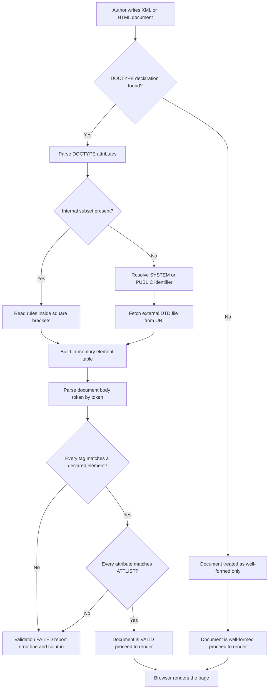
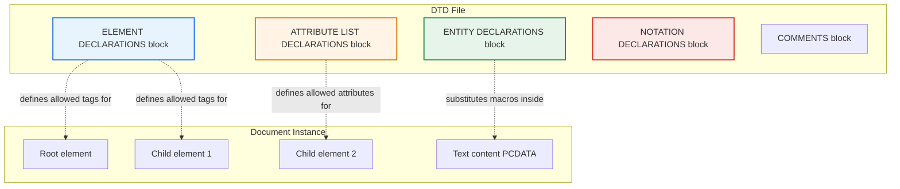
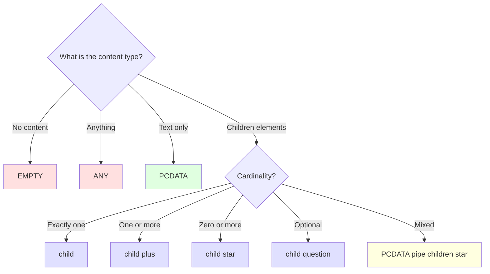
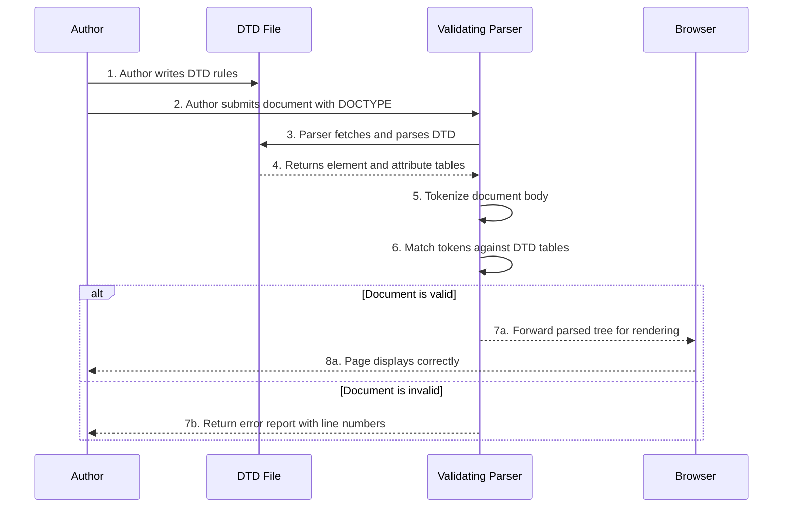

# Document Type Definitions (DTDs)

<!-- SECTION_1_START -->
# Document Type Definitions (DTDs)

> [!IMPORTANT]
> **KTU 2024 Scheme — Module 1 | Web Programming (PECST742)**
> Document Type Definitions (DTDs) form the foundational grammar rules for **SGML-family markup languages** (HTML, XHTML, XML). They define the legal building blocks of a document — the elements, attributes, and the structural relationships between them.

## 1.1 Formal Academic Definition

A **Document Type Definition (DTD)** is a formal, machine-readable set of *declarative grammar rules* that specify the structure, the legal elements, the permissible attributes, and the permissible content models for a class of XML or SGML documents. In KTU terminology, a DTD acts as a **contract** between the document author and the parser: any document claiming to be of a particular type **must** obey the rules declared in its DTD, or the validating parser will reject it.

A document that satisfies its DTD is said to be **valid**. A document that merely follows the basic syntax rules of XML/HTML (matched tags, properly nested elements, quoted attributes) is said to be **well-formed**.

| Term | Definition |
| :--- | :--- |
| **Well-formed** | Conforms to the syntax of XML/HTML (every start-tag has an end-tag, attributes are quoted, elements are properly nested). |
| **Valid** | Well-formed **and** conforms to its associated DTD. |
| **DOCTYPE** | The declaration at the top of a document that references the DTD to be used. |

> [!NOTE]
> **Syllabus Highlight:** The KTU 2024 module specifies DTDs in the context of *HTML5 page creation*. While HTML5 itself abandoned strict DTD validation in favor of a more relaxed parsing model, the conceptual foundation — element declarations, attribute lists, content models — remains critical because it is the **root from which XML, XHTML, and modern schema languages (XSD) evolved**.

## 1.2 Conceptual Analogy — Intuition for a First-Time Reader

Think of a DTD as the **architectural blueprint** for a house. The blueprint does not build the house — the bricks and cement (HTML tags and text content) build it. But the blueprint *defines*:

- Which rooms are allowed (kitchen, bedroom, living room — but not, say, a "dragon's lair").
- In what order the rooms can appear (you cannot have a roof before the walls).
- What each room can contain (a kitchen can contain an oven, a sink; a bedroom cannot contain an industrial furnace).

When a building inspector (the **validating parser**) walks through the finished house, the inspector consults the blueprint and shouts "**Violation!**" if the builder used a non-existent room or built a kitchen without a roof.

> **DTD = Blueprint** &nbsp;&nbsp;|&nbsp;&nbsp; **HTML/XML Document = Actual Building** &nbsp;&nbsp;|&nbsp;&nbsp; **Browser/Validator = Inspector**

## 1.3 Where DTDs Sit in the HTML Family

$$
\underbrace{\text{SGML (1986)}}_{\text{Parent Standard}} \;\longrightarrow\; \underbrace{\text{HTML 4.01 / XHTML 1.0}}_{\text{Strict DTD Era}} \;\longrightarrow\; \underbrace{\text{HTML5 (2014)}}_{\text{No DTD required}} \;\longrightarrow\; \underbrace{\text{XML / XSD}}_{\text{Modern schema usage}}
$$

> [!TIP]
> Even though **HTML5 officially removed the requirement** for a DTD (and instead uses `<!DOCTYPE html>` simply to trigger standards mode), the *idea* of declaring document structure lives on in **XML schemas (XSD)**, **RELAX NG**, and **Document Type Declarations** used across enterprise, banking, healthcare (HL7), and publishing systems (DocBook).

## 1.4 The Three Faces of a DTD Declaration

A document can be tied to its DTD in one of three ways. We will use a formal classroom-friendly notation for each:

| Declaration Style | Syntax Pattern | Use Case |
| :--- | :--- | :--- |
| **Internal DTD Subset** | `<!DOCTYPE root [ ...rules... ]>` | Rules are written *inside* the document itself. Self-contained, great for teaching. |
| **External DTD Subset** | `<!DOCTYPE root SYSTEM "file.dtd">` | Rules are kept in a separate `.dtd` file. Shared by many documents. |
| **Combined (Public + System)** | `<!DOCTYPE html PUBLIC "-//W3C//DTD XHTML 1.0 Strict//EN" "http://www.w3.org/TR/xhtml1/DTD/xhtml1-strict.dtd">` | Uses a publicly recognized identifier plus a fallback URL. Used for the historical XHTML/HTML 4.01 standards. |

> [!VISUALIZATION CONTROL]
> **Concept:** Hierarchical layering of DTD rules over an HTML document tree.
> **ASCII Visualisation (Terminal-Safe):**
> ```
> +-----------------------------------------------+
> |  <!DOCTYPE html PUBLIC "..." "rules.dtd">     |   <-- DTD DECLARATION
> +-----------------------------------------------+
> |  <html>                                       |   <-- DOCUMENT INSTANCE
> |    <head>                                     |
> |      <title> ... </title>                     |
> |    </head>                                    |
> |    <body>                                     |
> |      <p> ... </p>                             |
> |    </body>                                    |
> |  </html>                                      |
> +-----------------------------------------------+
>         |                ^
>         |                |
>         v                |
>   +--------------------------------------+
>   |   DTD Grammar Rules (file.dtd)       |
>   |   <!ELEMENT html (head, body)>        |
>   |   <!ELEMENT head (title)+>            |
>   |   <!ELEMENT title (#PCDATA)>          |
>   |   <!ELEMENT body (p | div | ul)*>     |
>   +--------------------------------------+
> ```
> **Visual Description:** A two-tier layered model — the upper layer is the *document instance* (the actual web page content), and the lower layer is the *DTD grammar* that constrains what the upper layer is legally allowed to contain.
<!-- SECTION_1_END -->

<!-- SECTION_2_START -->
# Deep Theoretical Analysis & KTU High-Yield Formula Sheet

## 2.1 The Building Blocks of a DTD

A DTD is composed of four primary declaration types. We will analyse each in the order a parser processes them.

### A. Element Declarations — `<!ELEMENT ... >`

Element declarations define the **name** of an element and the **content model** it may contain.

$$
\text{General Form} \;=\; \texttt{<!ELEMENT \textit{name} \textit{content\_model}>}
$$

The content model can be one of seven canonical patterns:

| Pattern Symbol | Meaning | Example |
| :---: | :--- | :--- |
| `EMPTY` | The element has no content. | `<!ELEMENT br EMPTY>` |
| `ANY` | The element may contain any declared content. | `<!ELEMENT container ANY>` |
| `(#PCDATA)` | Parsed Character Data — only text, no child elements. | `<!ELEMENT title (#PCDATA)>` |
| `(child)` | Exactly one occurrence of `child`. | `<!ELEMENT html (head, body)>` |
| `(child)+` | One or more occurrences (the **Kleene plus**). | `<!ELEMENT ul (li)+>` |
| `(child)*` | Zero or more occurrences (the **Kleene star**). | `<!ELEMENT body (p \| div)*>` |
| `(child)?` | Zero or one occurrence (the **optional** marker). | `<!ELEMENT html (head, (body)?)>` |

### B. Attribute List Declarations — `<!ATTLIST ... >`

Attribute declarations describe the legal attributes that may appear inside a particular element.

$$
\text{General Form} \;=\; \texttt{<!ATTLIST \textit{element} \textit{attr\_name} \textit{type} \textit{default\_value}>}
$$

The **type** sub-field can be one of:

| Type | Meaning | KTU Pitfall |
| :---: | :--- | :--- |
| `CDATA` | Character data — any text string. | Most forgiving. |
| `ID` | A unique identifier within the document. | Only one per element. |
| `IDREF` | A reference to an `ID` declared elsewhere. | Must match an existing ID. |
| `(a \| b \| c)` | An enumerated list of allowed keywords. | Order is irrelevant, but spelling must match exactly. |
| `NMTOKEN` | A single name token (no whitespace). | Used for compact attribute values. |
| `NOTATION` | A non-XML data format (e.g., `gif`, `jpeg`). | Rare in modern web work. |
| `ENTITY` | A reference to an internal or external entity. | Used for reusable text fragments. |

The **default value** sub-field can be:

| Default Keyword | Behaviour |
| :--- | :--- |
| `#REQUIRED` | The attribute **must** be present. |
| `#IMPLIED` | The attribute is optional; no default. |
| `#FIXED "value"` | If present, the value must be exactly `"value"`. |
| `"default_value"` | If the attribute is omitted, this value is assumed. |

### C. Entity Declarations — `<!ENTITY ... >`

Entities are named shortcuts for text or external content. They come in four flavours:

$$
\begin{aligned}
\texttt{<!ENTITY name "replacement text">} &\quad \text{(Internal — general)} \\
\texttt{<!ENTITY \% name "replacement text">} &\quad \text{(Internal — parameter, only inside DTDs)} \\
\texttt{<!ENTITY name SYSTEM "uri">} &\quad \text{(External — file/URL)} \\
\texttt{<!ENTITY name PUBLIC "id" "uri">} &\quad \text{(External — public identifier)}
\end{aligned}
$$

> [!IMPORTANT]
> **KTU High-Yield Insight:** Parameter entities (prefixed with `%`) are processed **only inside the DTD**, never in the document body. This is a favourite trick-question topic in the KTU ESE.

### D. Notation Declarations — `<!NOTATION ... >`

Notations identify non-XML data formats (binary images, audio, video) that an application should handle. They are uncommon in pure web work but appear in publishing pipelines.

## 2.2 KTU High-Yield Formula Sheet

> [!IMPORTANT]
> **Master this table** — every entry has been a past KTU question stem or the answer to one.

| # | Construct | Canonical Syntax | Behaviour Summary |
| :---: | :--- | :--- | :--- |
| 1 | Doctype Internal | `<!DOCTYPE root [ ... ]>` | Rules embedded in the document. |
| 2 | Doctype External | `<!DOCTYPE root SYSTEM "x.dtd">` | Rules in a separate file. |
| 3 | Doctype Public | `<!DOCTYPE root PUBLIC "FPI" "URL">` | Standardised identifier + fallback URL. |
| 4 | Empty Element | `<!ELEMENT br EMPTY>` | Self-closing, no children. |
| 5 | Text-Only | `<!ELEMENT title (#PCDATA)>` | Text, no child elements. |
| 6 | Sequence | `<!ELEMENT html (head, body)>` | Children in fixed order. |
| 7 | Choice | `<!ELEMENT p (a \| b \| span)>` | One of the listed children. |
| 8 | Repetition | `<!ELEMENT ul (li)+>` | One or more children. |
| 9 | Mixed Content | `<!ELEMENT p (#PCDATA \| a \| em)*>` | Text mixed with selected elements. |
| 10 | Attribute | `<!ATTLIST img src CDATA #REQUIRED>` | Required, free text. |
| 11 | Enumerated | `<!ATTLIST input type (text \| radio \| checkbox) "text">` | Restricted vocabulary. |
| 12 | Internal Entity | `<!ENTITY copy "&#169;">` | Inline replacement. |
| 13 | Parameter Entity | `<!ENTITY \% common "title \| body">` | DTD-only macro. |
| 14 | External Entity | `<!ENTITY logo SYSTEM "logo.png" NDATA png>` | External binary reference. |

> [!NOTE]
> **Why does this matter in production engineering?**
> - **Interoperability:** Banking, healthcare, and government XML exchanges (e.g., SWIFT MT/MX messages, FHIR resources) still rely on DTD-defined contracts to ensure two systems speak the exact same "language."
> - **Documentation as Code:** Publishing systems like **DocBook** and **DITA** use DTDs to enforce editorial standards across thousands of pages.
> - **Legacy Maintenance:** Many enterprise systems (older Java/J2EE apps, classic ASP apps) still ship `.dtd` files; KTU graduates entering maintenance roles must read them fluently.

## 2.3 Validation Workflow — How a Parser Uses a DTD

The parser performs the following operations in strict sequence:

1. **Locate** the `<!DOCTYPE>` declaration at the document root.
2. **Resolve** the DTD file (internal subset first, then external subset).
3. **Tokenize** the document instance (the actual HTML/XML content).
4. **Match** every start-tag and end-tag against the element declarations.
5. **Check** every attribute name, type, and default against `<!ATTLIST>`.
6. **Report** a fatal error if any rule is violated; otherwise, render the document.

> [!TIP]
> **Engineering Analogy:** This is identical to how a **compiler** processes a programming language — the DTD is the *grammar*, the document is the *source code*, and the validating parser is the *compiler's front-end*. Just as a C compiler rejects `int x = "hello";`, a validating XML parser rejects `<title><p>Hello</p></title>` if the DTD says `<!ELEMENT title (#PCDATA)>`.
<!-- SECTION_2_END -->

<!-- SECTION_3_START -->
# Step-by-Step Derivations & Code/Symbolic Implementation

## 3.1 Worked Example 1 — Designing a DTD for a "Book Library"

**Problem Statement (KTU Module 1 typical question):**
*"Design a DTD for a library catalogue in which a library contains one or more books, each book has a title, exactly one author, an optional ISBN, and zero or more chapters. Each chapter has a title and one or more paragraphs."*

### Step 1 — Identify the Elements

From the prose, we extract the element vocabulary:

$$
\text{Elements} = \{\text{library},\;\text{book},\;\text{title},\;\text{author},\;\text{isbn},\;\text{chapter},\;\text{paragraph}\}
$$

### Step 2 — Translate Each English Constraint into a DTD Declaration

| # | English Constraint | DTD Rule (Formal Derivation) |
| :---: | :--- | :--- |
| 1 | The root element is `library`. | `<!ELEMENT library (book)+>` |
| 2 | Each `book` has a title, an author, an optional ISBN, and chapters. | `<!ELEMENT book (title, author, isbn?, (chapter)+)>` |
| 3 | `title` contains text only. | `<!ELEMENT title (#PCDATA)>` |
| 4 | `author` contains text only. | `<!ELEMENT author (#PCDATA)>` |
| 5 | `isbn` is optional. | `<!ELEMENT isbn (#PCDATA)>` |
| 6 | `chapter` has a title and paragraphs. | `<!ELEMENT chapter (title, (paragraph)+)>` |
| 7 | `paragraph` contains text. | `<!ELEMENT paragraph (#PCDATA)>` |

### Step 3 — Add Attribute Declarations for ID Uniqueness

$$
\begin{aligned}
\texttt{<!ATTLIST book} &\quad \texttt{id ID \#REQUIRED>} \\
\texttt{<!ATTLIST chapter} &\quad \texttt{id ID \#IMPLIED>} \\
\texttt{<!ATTLIST isbn} &\quad \texttt{type (ISBN10 | ISBN13) "ISBN13">}
\end{aligned}
$$

### Step 4 — Assemble the Complete Internal DTD Subset

```xml
<!DOCTYPE library [
    <!ELEMENT library      (book)+>
    <!ELEMENT book         (title, author, isbn?, (chapter)+)>
    <!ELEMENT chapter      (title, (paragraph)+)>
    <!ELEMENT title        (#PCDATA)>
    <!ELEMENT author       (#PCDATA)>
    <!ELEMENT isbn         (#PCDATA)>
    <!ELEMENT paragraph    (#PCDATA)>

    <!ATTLIST book    id    ID           #REQUIRED>
    <!ATTLIST chapter id    ID           #IMPLIED>
    <!ATTLIST isbn    type  (ISBN10|ISBN13) "ISBN13">
]>
```

### Step 5 — Construct a Valid Document Instance

```xml
<library>
    <book id="b1">
        <title>Introduction to Web Programming</title>
        <author>Dr. K. T. U.</author>
        <chapter>
            <title>Chapter 1: HTML Basics</title>
            <paragraph>HTML stands for HyperText Markup Language.</paragraph>
            <paragraph>It uses tags enclosed in angle brackets.</paragraph>
        </chapter>
        <chapter>
            <title>Chapter 2: CSS Styling</title>
            <paragraph>CSS separates presentation from content.</paragraph>
        </chapter>
    </book>
</library>
```

### Step 6 — Validate the Document Against the DTD (Pseudo-Walkthrough)

| Parsed Token | DTD Rule Checked | Result |
| :--- | :--- | :--- |
| `<library>` | Matches root element. | OK |
| `<book id="b1">` | `id` is `ID #REQUIRED`; `b1` is a valid unique token. | OK |
| `<title>` | Must contain `#PCDATA`. | OK |
| `<author>` | Must contain `#PCDATA`. | OK |
| (no `<isbn>`) | `isbn?` is optional. | OK |
| `<chapter>` | `(chapter)+` — at least one, so this is fine. | OK |
| `<title>` (inside chapter) | Allowed by `(title, (paragraph)+)`. | OK |
| `<paragraph>` × 2 | `(paragraph)+` — two occurrences. | OK |
| `</chapter>`, `</book>`, `</library>` | All end-tags balance. | OK |

> [!TIP]
> **KTU Valuation Tip:** When asked to *"design a DTD"*, the examiner awards **2 marks** for correct element identification, **3 marks** for the correct content models, **2 marks** for the attribute list, and **2 marks** for a valid instance document. Always show all four.

## 3.2 Worked Example 2 — A Complete XHTML 1.0 Strict Document

```xml
<?xml version="1.0" encoding="UTF-8"?>
<!DOCTYPE html
     PUBLIC "-//W3C//DTD XHTML 1.0 Strict//EN"
    "http://www.w3.org/TR/xhtml1/DTD/xhtml1-strict.dtd">

<html xmlns="http://www.w3.org/1999/xhtml" lang="en">
    <head>
        <title>KTU Web Programming Demo</title>
        <meta http-equiv="Content-Type"
              content="text/html; charset=UTF-8" />
    </head>
    <body>
        <h1>Welcome to KTU</h1>
        <p>This is a <em>strictly valid</em> XHTML 1.0 page.</p>
    </body>
</html>
```

### Key Observations and Their DTD Significance

| Observation | DTD Justification |
| :--- | :--- |
| All tags are lowercase. | XHTML DTD declares element names case-sensitively in lowercase. |
| The `<meta />` tag is self-closed. | XHTML DTD declares `meta` as `EMPTY`; self-closing is mandatory. |
| `lang` attribute uses the `xmlns` namespace. | The XHTML DTD's `xmlns` is `http://www.w3.org/1999/xhtml`. |
| Attribute values are double-quoted. | DTD attribute types are `CDATA`; whitespace inside unquoted values is illegal. |

## 3.3 Worked Example 3 — Using Parameter Entities for Modular DTDs

**Problem:** Create a reusable DTD fragment that declares the common "block-level" children shared by `body` and `section`.

### Step 1 — Define the Parameter Entity

```dtd
<!ENTITY % block "(p | div | ul | ol | table | blockquote)">
```

> [!IMPORTANT]
> The leading `%` signals that this is a **parameter entity**, expanded only when the DTD is being read by the parser. It cannot be referenced in the document body.

### Step 2 — Reference the Entity Inside the Element Declarations

```dtd
<!ELEMENT body    (%block;)*>
<!ELEMENT section (%block;)*>
<!ELEMENT div     (%block;)*>
```

The parser expands `%block;` to `(p | div | ul | ol | table | blockquote)` before applying the rule, so `body` effectively becomes:

$$
\texttt{<!ELEMENT body (p | div | ul | ol | table | blockquote)>\;}
$$

### Step 3 — Demonstrate the Power of the Pattern

If the design team adds a new element `<aside>` to the block-level vocabulary, the change is made in **one place** — the parameter entity — and the rule propagates to all three elements automatically. This is the DTD-era equivalent of a *macro* in C or a *function* in Python.

## 3.4 Worked Example 4 — Mixed Content (Text + Inline Elements)

The paragraph element typically allows text mixed with inline emphasis tags. The correct DTD syntax uses the `*` quantifier on a parenthesised list whose first member is `#PCDATA`:

```dtd
<!ELEMENT p (#PCDATA | a | em | strong | br)*>
```

| Allowed in `<p>` | Disallowed in `<p>` |
| :--- | :--- |
| Plain text | Another `<p>` (block-in-block is forbidden). |
| `<a href="...">link</a>` | `<div>` (block-in-inline is forbidden). |
| `<em>emphasised</em>` | Undeclared elements. |
| `<br />` (self-closing) | Raw `&` characters (must be `&amp;`). |

> [!NOTE]
> **Rule of Mixed Content:** Whenever `#PCDATA` appears in a content model, it **must be the first alternative** in a choice, and the entire group **must use the `*` quantifier**. Violating this rule is a fatal DTD syntax error.

## 3.5 Algorithmic Conversion — From a BNF-style Description to a DTD

```python
# Symbolic translation: pseudo-algorithm
def bnf_to_dtd(rule_name: str, right_hand_side: str) -> str:
    """
    Convert a single BNF production rule to a DTD <!ELEMENT> declaration.
    Demonstrates the mapping used in compiler-style DTD generation.
    """
    # 1. If RHS is "epsilon" or "empty", return EMPTY.
    if right_hand_side.strip().lower() in ("epsilon", "empty", ""):
        return f"<!ELEMENT {rule_name} EMPTY>"

    # 2. If RHS contains only terminals (no angle-bracket tokens), return #PCDATA.
    if "<" not in right_hand_side and ">" not in right_hand_side:
        return f"<!ELEMENT {rule_name} (#PCDATA)>"

    # 3. Otherwise, normalise brackets, preserve repetition markers.
    # '<' and '>' are already the standard DTD delimiters.
    normalised = right_hand_side.replace("::=", "").strip()

    return f"<!ELEMENT {rule_name} {normalised}>"


# Demonstration
if __name__ == "__main__":
    samples = [
        ("title",    "epsilon"),                                    # EMPTY
        ("body",     "(<head> <main> <footer>?)"),                  # Sequence
        ("choice",   "(<yes> | <no>)"),                             # Choice
        ("repeats",  "(<item>)+"),                                  # Kleene plus
    ]
    for name, rhs in samples:
        print(bnf_to_dtd(name, rhs))
```

**Expected Console Output:**

```text
<!ELEMENT title EMPTY>
<!ELEMENT body (<head> <main> <footer>?)>
<!ELEMENT choice (<yes> | <no>)>
<!ELEMENT repeats (<item>)+>
```

## 3.6 Worked Example 5 — External DTD File Structure

### File: `employee.dtd` (lives on the server)

```dtd
<!ELEMENT employees   (employee)+>
<!ELEMENT employee    (name, dept, (salary | hourly))>
<!ELEMENT name        (#PCDATA)>
<!ELEMENT dept        (#PCDATA)>
<!ELEMENT salary      (#PCDATA)>
<!ELEMENT hourly      (#PCDATA)>

<!ATTLIST employee
          id        ID                          #REQUIRED
          status    (active | onleave | exited) "active"
>
```

### File: `employees.xml` (the document instance)

```xml
<?xml version="1.0" encoding="UTF-8"?>
<!DOCTYPE employees SYSTEM "employee.dtd">
<employees>
    <employee id="e101" status="active">
        <name>Anand Krishnan</name>
        <dept>Web Development</dept>
        <salary>75000</salary>
    </employee>
    <employee id="e102" status="onleave">
        <name>Maria Jose</name>
        <dept>QA</dept>
        <hourly>450</hourly>
    </employee>
</employees>
```

> [!TIP]
> The `SYSTEM` keyword is a **system literal** — it points to a *private* file. The `PUBLIC` keyword, in contrast, uses a **Formal Public Identifier (FPI)** registered with an authority (e.g., ISO, W3C).
<!-- SECTION_3_END -->

<!-- SECTION_4_START -->
# Structural Diagrams & Schematics

## 4.1 Master Diagram — The DTD Validation Pipeline



**Reading the diagram:** The validator's primary job is to convert text into a *tree* of nodes. Each node is then cross-referenced against the DTD's table. Any mismatch is a hard error.

## 4.2 Component Anatomy — A DTD File's Logical Structure



## 4.3 Element Content Model — Decision Tree



## 4.4 Sequence Diagram — How an Author, a DTD, and a Parser Interact



## 4.5 Comparison Matrix — Internal vs External DTD Subsets

| Property | Internal DTD Subset | External DTD Subset |
| :--- | :--- | :--- |
| **Location** | Inside the document | Separate `.dtd` file |
| **Reusability** | Low — copy-paste needed | High — single source of truth |
| **Network cost** | Zero | One HTTP fetch per document |
| **Best for** | Teaching, prototypes, single-page demos | Enterprise systems, multi-document apps |
| **Syntax keyword** | Square brackets `[ ... ]` | `SYSTEM "uri"` or `PUBLIC "FPI" "uri"` |
| **Maintenance** | Difficult — many places to edit | Easy — one file to update |
<!-- SECTION_4_END -->

<!-- SECTION_5_START -->
# KTU 2024 Scheme Examination Question Bank & Topic Recap

## Part A — Short Answer Questions (3 Marks Each)

### Question 1
**[KTU University Exam — July 2023, Module 1]**
**Cognitive Level:** Remember (CO1)
**Q:** What is a Document Type Definition (DTD)? List the two kinds of DTD declarations.

**Model Answer (Valuation Key):**

> A **Document Type Definition (DTD)** is a set of markup declarations that define a document's structure, the elements and attributes it may contain, and the order in which they must appear. It serves as a *grammar* or *contract* for a class of XML/HTML documents.
>
> The two kinds of DTD declarations are:
> 1. **Internal DTD Subset** — declarations are wrapped in square brackets right after the `<!DOCTYPE>` keyword, embedded inside the document itself.
> 2. **External DTD Subset** — declarations are stored in a separate `.dtd` file and referenced through the `SYSTEM` or `PUBLIC` keyword.
>
> **[Mark Distribution: Definition 1.5 marks | Two types identified 1.5 marks]**

---

### Question 2
**[KTU University Exam — Dec 2022, Module 1]**
**Cognitive Level:** Understand (CO1)
**Q:** Differentiate between a *well-formed* and a *valid* XML document. Which of the two requires a DTD?

**Model Answer (Valuation Key):**

> | Property | Well-Formed | Valid |
> | :--- | :--- | :--- |
> | Definition | Conforms to the syntax of XML | Conforms **and** obeys a DTD |
> | DTD required? | No | Yes |
> | Parser type | Non-validating parser | Validating parser |
> | Example check | Tags balanced, attributes quoted | Element order matches `(a, b, c)` rule |
>
> **Only a *valid* document requires a DTD.** A well-formed document merely needs to obey the syntactic rules of XML/HTML.
>
> **[Mark Distribution: 1.5 marks for the comparison table | 1 mark for stating that validity requires a DTD | 0.5 mark for the example]**

---

## Part B — Long Answer Questions (14 Marks Each, Internal Choice)

### Question A (Choice 1)
**[KTU University Exam — Dec 2023, Module 1]**
**Mapped CO:** CO1 &nbsp;|&nbsp; **RBT Levels:** Understand (part a) + Apply (part b)

**Q:**
(a) Explain the various element content model declarations in a DTD with suitable examples. **[7 Marks]**
(b) Design a DTD for a university that stores information about its departments. Each department has a name, a unique code, an optional head, and one or more courses. Each course has a title, a course code, and zero or more textbooks. Write a valid XML document instance. **[7 Marks]**

### Model Answer — Part A (a) [7 Marks]

The various content model declarations are:

| # | Construct | Syntax | Example | Marks |
| :---: | :--- | :--- | :--- | :---: |
| 1 | `EMPTY` | `<!ELEMENT name EMPTY>` | `<!ELEMENT br EMPTY>` | 1 |
| 2 | `ANY` | `<!ELEMENT name ANY>` | `<!ELEMENT wrapper ANY>` | 1 |
| 3 | `#PCDATA` | `<!ELEMENT name (#PCDATA)>` | `<!ELEMENT title (#PCDATA)>` | 1 |
| 4 | Sequence | `<!ELEMENT name (a, b)>` | `<!ELEMENT html (head, body)>` | 1 |
| 5 | Choice | `<!ELEMENT name (a \| b)>` | `<!ELEMENT p (a \| em \| strong)>` | 1 |
| 6 | Repetition `+` | `<!ELEMENT name (child)+>` | `<!ELEMENT ul (li)+>` | 1 |
| 7 | Repetition `*` and `?` | `<!ELEMENT name (child)*>` | `<!ELEMENT body (p \| div)*>` | 1 |

> **Total: 7 marks** — one mark per correctly labelled content model with an example.

### Model Answer — Part A (b) [7 Marks]

**Step 1 — Identify elements** (1 mark):
`university, department, name, code, head, course, coursetitle, coursecode, textbook`

**Step 2 — Write the DTD** (3 marks):

```dtd
<!ELEMENT university     (department)+>
<!ELEMENT department     (name, code, head?, (course)+)>
<!ELEMENT name           (#PCDATA)>
<!ELEMENT code           (#PCDATA)>
<!ELEMENT head           (#PCDATA)>
<!ELEMENT course         (coursetitle, coursecode, (textbook)*)>
<!ELEMENT coursetitle    (#PCDATA)>
<!ELEMENT coursecode     (#PCDATA)>
<!ELEMENT textbook       (#PCDATA)>

<!ATTLIST department
          dcode     ID                       #REQUIRED
>
<!ATTLIST course
          ccode     ID                       #REQUIRED
          credits   (1|2|3|4|5)              "3"
>
```

**Step 3 — Write a valid document instance** (3 marks):

```xml
<?xml version="1.0" encoding="UTF-8"?>
<!DOCTYPE university SYSTEM "university.dtd">
<university>
    <department dcode="D001">
        <name>Computer Science</name>
        <code>CS</code>
        <head>Dr. R. Menon</head>
        <course ccode="C101" credits="4">
            <coursetitle>Web Programming</coursetitle>
            <coursecode>CS101</coursecode>
            <textbook>HTML and CSS by Jon Duckett</textbook>
            <textbook>JavaScript: The Good Parts</textbook>
        </course>
        <course ccode="C102" credits="3">
            <coursetitle>Data Structures</coursetitle>
            <coursecode>CS102</coursecode>
        </course>
    </department>
    <department dcode="D002">
        <name>Electrical Engineering</name>
        <code>EE</code>
        <course ccode="C201" credits="4">
            <coursetitle>Circuit Theory</coursetitle>
            <coursecode>EE201</coursecode>
            <textbook>Sadiku — Fundamentals of Electric Circuits</textbook>
        </course>
    </department>
</university>
```

> **[Valuation Key Points]**
> - [Element list correctly identified: 1 Mark]
> - [DTD uses correct quantifiers and optional markers: 1 Mark]
> - [ATTLIST uses ID and enumerated type: 1 Mark]
> - [Document instance opens with DOCTYPE SYSTEM: 1 Mark]
> - [Each required element present in instance: 1 Mark]
> - [Optional head element demonstrated by omission in D002: 1 Mark]
> - [(textbook)* demonstrated by zero occurrences in C102: 1 Mark]

---

### Question B (Choice 2 — Internal Choice Alternative)
**[KTU University Exam — July 2024, Module 1]**
**Mapped CO:** CO1 &nbsp;|&nbsp; **RBT Levels:** Understand (part a) + Apply (part b)

**Q:**
(a) Explain the role of `<!ATTLIST>` and `<!ENTITY>` declarations in a DTD with examples. **[7 Marks]**
(b) Create a DTD for an online bookstore. The store has a name, a list of books, and a list of registered members. Each book has a title, author, price, and a category from {Fiction, NonFiction, Technical}. Each member has a name, an email, and a unique member ID. Write a valid XML instance demonstrating at least one book of each category and at least two members. **[7 Marks]**

### Model Answer — Question B (a) [7 Marks]

**Role of `<!ATTLIST>` (3.5 marks):**
The `<!ATTLIST>` declaration lists the legal attributes for a given element, their data type, and their default behaviour. It enforces that no undeclared attribute is used.

```dtd
<!ATTLIST input
          type    (text | password | radio) "text"
          name    CDATA                      #IMPLIED
          value   CDATA                      #IMPLIED
>
```

- `type` is **enumerated** and **defaults** to `"text"`.
- `name` is `CDATA` and is **optional** (`#IMPLIED`).
- `value` is `CDATA` and is **optional**.

**Role of `<!ENTITY>` (3.5 marks):**
The `<!ENTITY>` declaration creates a named macro that can be reused in the document body. Internal entities store text; parameter entities store DTD fragments.

```dtd
<!ENTITY company "KTU Publishers Ltd.">
<!ENTITY copy    "&#169;">
<!ENTITY % inline "(#PCDATA | a | em | strong)">
```

In the body, `&company;` expands to `KTU Publishers Ltd.` and `&copy;` becomes the © symbol. The parameter entity `%inline;` is used only inside DTD rules, never in the body.

> **Total: 7 marks** — half for ATTLIST explanation with example, half for ENTITY explanation with example.

### Model Answer — Question B (b) [7 Marks]

**The DTD (3.5 marks):**

```dtd
<!ELEMENT bookstore  (name, (book)+, (member)+)>
<!ELEMENT name       (#PCDATA)>
<!ELEMENT book       (title, author, price, category)>
<!ELEMENT title      (#PCDATA)>
<!ELEMENT author     (#PCDATA)>
<!ELEMENT price      (#PCDATA)>
<!ELEMENT category   (#PCDATA)>
<!ELEMENT member     (name, email)>

<!ATTLIST book
          bid      ID                                #REQUIRED
          cat      (Fiction | NonFiction | Technical) #REQUIRED
>
<!ATTLIST member
          mid      ID                                #REQUIRED
>
```

**The XML Instance (3.5 marks):**

```xml
<?xml version="1.0" encoding="UTF-8"?>
<!DOCTYPE bookstore SYSTEM "bookstore.dtd">
<bookstore>
    <name>KTU Online Bookstore</name>

    <book bid="b001" cat="Fiction">
        <title>The God of Small Things</title>
        <author>Arundhati Roy</author>
        <price>399</price>
        <category>Fiction</category>
    </book>

    <book bid="b002" cat="NonFiction">
        <title>Wings of Fire</title>
        <author>A. P. J. Abdul Kalam</author>
        <price>250</price>
        <category>NonFiction</category>
    </book>

    <book bid="b003" cat="Technical">
        <title>HTML and CSS Design</title>
        <author>Jon Duckett</author>
        <price>650</price>
        <category>Technical</category>
    </book>

    <member mid="m001">
        <name>Anand Krishnan</name>
        <email>anand@ktu.in</email>
    </member>

    <member mid="m002">
        <name>Maria Jose</name>
        <email>maria@ktu.in</email>
    </member>
</bookstore>
```

> **[Valuation Key Points]**
> - [All three category values present: 1 Mark]
> - [At least two members with unique `mid` IDs: 1 Mark]
> - [Enumeration in ATTLIST for `cat`: 1 Mark]
> - [BOOK and MEMBER correctly use ID #REQUIRED: 1 Mark]
> - [DOCTYPE references external DTD: 1 Mark]
> - [Document is well-formed and uses consistent lowercase tags: 1 Mark]
> - [Optional ordering constraints satisfied: 1 Mark]

---

> [!WARNING]
> **KTU Examiner's Valuation Warning — Common Pitfalls**
> 1. **Case sensitivity trap:** DTD element names are case-sensitive. `<!ELEMENT Title>` and `<title>` are different elements. Always use lowercase as per XML convention.
> 2. **Mixed content rule:** Whenever you use `#PCDATA` inside parentheses, it **must be the first alternative** and the group **must use `*`**. Writing `<!ELEMENT p (#PCDATA | a)+>` is **invalid** DTD syntax.
> 3. **Empty element misuse:** Do not write `<!ELEMENT img EMPTY>` and then place children inside `` in the document — the validator will reject it.
> 4. **Attribute default omission:** If you write `name CDATA` without a default keyword (`#REQUIRED`, `#IMPLIED`, `#FIXED`, or a quoted value), some parsers reject the declaration.
> 5. **Parameter-entity confusion:** Students often write `<!ENTITY common "...">` (a general entity) but try to use it inside the DTD with `&common;`. Parameter entities used inside the DTD **must** start with `%` and be referenced with `%common;`.
> 6. **DOCTYPE placement:** The `<!DOCTYPE>` declaration must appear **before** the root element and **after** the optional XML declaration `<?xml ...?>`.
> 7. **HTML5 DTD confusion:** Many students mistakenly write `<!DOCTYPE HTML4.01>` in modern files. Remember — **HTML5 uses `<!DOCTYPE html>`** (case-insensitive) and no DTD URL.

---

## Topic Recap & Important Things to Remember

- **DTD = grammar for markup languages.** It defines what tags exist, what attributes they have, and how they may nest.
- **Two flavours:** Internal subset (inside the document) and External subset (in a separate `.dtd` file).
- **Three DOCTYPE keywords:** `SYSTEM` (private file), `PUBLIC` (formal public identifier with fallback), and the inline square-bracket form.
- **Element content models** (memorise all seven):
  - `EMPTY`, `ANY`, `#PCDATA`, `(a, b)` sequence, `(a | b)` choice, `(a)+` one-or-more, `(a)*` zero-or-more, `(a)?` optional.
- **Mixed content** must always be `(#PCDATA | a | b)*` — never use `+` here.
- **Attribute types to remember:** `CDATA`, `ID`, `IDREF`, `NMTOKEN`, `NOTATION`, `ENTITY`, and enumerated `(a | b | c)`.
- **Attribute defaults:** `#REQUIRED`, `#IMPLIED`, `#FIXED "v"`, or a literal default value.
- **Entities:** General entities (`&name;`) appear in the body; **parameter** entities (`%name;`) appear only inside the DTD.
- **DOCTYPE must be the first thing in the document** (after the optional XML declaration) and **before** the root element.
- **HTML5 special case:** uses `<!DOCTYPE html>` — a vestigial declaration, not a real DTD reference, kept only for historical compatibility.
- **Validation is hierarchical:** Well-formedness is the floor, validity is the ceiling. A document can be well-formed without being valid, but it cannot be valid without first being well-formed.
- **Validation tools** you can use in practice: `xmllint --valid file.xml`, online W3C validator, browser developer tools.
- **Real-world use cases** of DTDs today: legacy enterprise XML, DocBook publishing, financial messaging (SWIFT MX), healthcare records (HL7 v2), configuration file formats.
- **Kleene operators cheat mnemonic:** `?` = *maybe* one, `*` = *zero to many*, `+` = *one to many*. Read in increasing order of strictness.
- **The `ANY` content model is an anti-pattern** — it defeats the entire purpose of validation. Use it only during early prototyping.
<!-- SECTION_5_END -->
