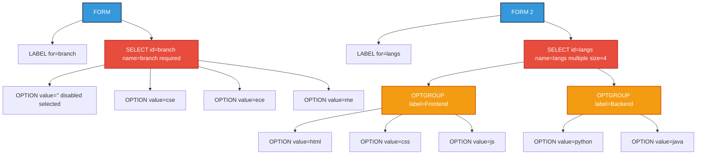
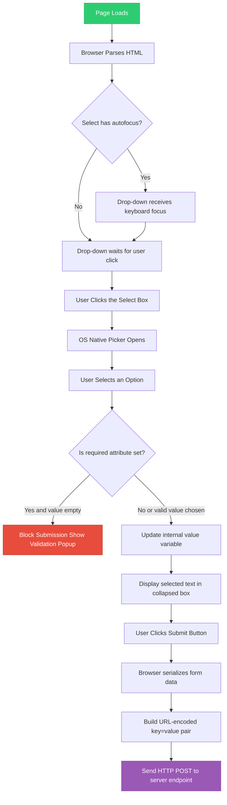

# Drop-Down Menus

<!-- SECTION_1_START -->
# Drop-Down Menus in HTML5

## 1. Core Technical Definition & Intuitive Overview

> [!NOTE]
> **Formal Definition (KTU 2024 Syllabus Aligned)**
> A **Drop-Down Menu** in HTML5 is a compact, space-efficient form control created using the `<select>` element, which renders a collapsible list of selectable options. Each option is represented by an `<option>` element nested inside the `<select>` tag. Optional grouping of related options is achieved using the `<optgroup>` element. Drop-down menus are formally classified as **list-based interactive widgets** in the HTML Living Standard and are essential components of graphical user interfaces for collecting a single value (or multiple values with the `multiple` attribute) from a predefined finite set of user choices.

### Conceptual Analogy / Intuition

Imagine you walk into a **cafeteria counter**. Instead of the cashier reading out every dish on the menu (which would take forever), you are handed a **printed paper menu** where you place a small **tick mark** next to one item, fold the paper, and hand it back. The cashier only sees your single final choice.

That printed paper menu is exactly what a **drop-down menu** does on a webpage:

- The **folded paper** = the closed `<select>` box (you only see the currently selected item).
- The **printed list of dishes** = the `<option>` elements (the full list of choices).
- The **categories on the menu** (Starters, Mains, Desserts) = the `<optgroup>` elements (visual section dividers).
- **Your single tick mark** = the `selected` attribute (the user's chosen value).

The result? A clean, compact interface that hides complexity until the user actually needs it, preventing cognitive overload and saving precious on-screen real estate.

### Key Terminology & Standard Metrics

- **W3C Standard**: HTML Living Standard (Web Forms 2.0 lineage from HTML5).
- **Default User-Agent Rendering**: The browser typically renders a `<select>` element with a width proportional to the **longest `<option>` text content** or its CSS-defined width (usually **150–250 pixels** in default rendering).
- **Maximum Visible Options (without `size` attribute)**: **1 option** (collapsed state).
- **With `size="n"` attribute**: Shows **n visible options** at once (transforms into a scrollable list box).
- **Default form submission encoding**: The `value` attribute of the selected `<option>` (defaults to inner text if `value` is absent).

> [!IMPORTANT]
> **Syllabus Highlight (KTU Module 1)**
> Drop-down menus fall under the broader topic *"Creating web pages using HTML5"*. The KTU board examiner expects students to be able to (a) construct a drop-down using `<select>` and `<option>`, (b) use `<optgroup>` to semantically group choices, (c) apply attributes like `selected`, `disabled`, `value`, and `multiple`, and (d) integrate the menu inside an HTML `<form>` for data submission to a server-side handler.

### GeoGebra / Desmos Integration (if relevant)

> [!VISUALIZATION CONTROL]
> **Concept:** Drop-Down Menu as a "Choice Filter" — Visualizing the mapping between user interaction and selected value.
> **GeoGebra / Desmos Input Equations:**
> * Let $x$ = index of option selected (a discrete integer).
> * Let $V(x)$ = the value submitted to the server.
> * Define: $V(x) = \text{option}_x.\text{value}$, where $x \in \{0, 1, 2, \dots, n-1\}$.
> * A piecewise step function: $f(x) = \sum_{i=0}^{n-1} v_i \cdot \mathbb{1}_{x=i}$ where $\mathbb{1}$ is the indicator function.
> **Visual Description:** Plot a horizontal axis representing option indices 0 to n-1. At each integer tick, a vertical bar shows the corresponding `value` attribute height. The user "drops down" the menu and "clicks" at index $x$, returning exactly one value $V(x)$. This visually confirms that a drop-down is fundamentally a **single-valued discrete mapping** from a finite set.

---

<!-- SECTION_1_END -->

<!-- SECTION_2_START -->
# 2. Deep Theoretical Analysis & KTU High-Yield Formula Sheet

## 2.1 Anatomy of a Drop-Down Menu — Structured Logic

A drop-down menu in HTML5 is built from **three core element types**, each with a specific role:

### 2.1.1 The Container — `<select>`

The `<select>` element is the **parent container** that holds all options. It is itself a **form control** and belongs inside (or be associated with) a `<form>`.

**Key Attributes of `<select>`:**

| Attribute | Purpose | Allowed Values | Default |
|---|---|---|---|
| `name` | Identifier sent to server on form submission | Any string (no spaces) | *(none)* |
| `id` | DOM identifier for CSS/JS targeting | Unique string | *(none)* |
| `required` | Makes selection mandatory before form submit | Boolean attribute | `false` |
| `disabled` | Greys out the entire control | Boolean attribute | `false` |
| `multiple` | Allows selecting more than one option (Ctrl+Click) | Boolean attribute | `false` |
| `size` | Number of options visible without scrolling | Positive integer | `1` |
| `autofocus` | Auto-focuses this control on page load | Boolean attribute | `false` |
| `form` | Associates the select with a form by id | Form `id` value | *(implicit parent form)* |

> [!IMPORTANT]
> **Critical Distinction for Board Exams:** The `multiple` attribute changes the submission format. Without `multiple`, the form sends `name=value`. With `multiple`, the form sends `name=value1&name=value2&name=value3` (i.e., the same key is repeated for every selected option). Many students lose marks here.

### 2.1.2 The Choice — `<option>`

Each `<option>` represents **one selectable item** inside the `<select>` container.

**Key Attributes of `<option>`:**

| Attribute | Purpose | Allowed Values |
|---|---|---|
| `value` | The data sent to the server when this option is chosen | String |
| `selected` | Marks this option as the default pre-selected one on page load | Boolean |
| `disabled` | Makes this individual option unselectable (greyed out) | Boolean |
| `label` | Shorter text shown in the list (overrides inner text) | String |

> [!NOTE]
> **Value Resolution Rule (CRITICAL):**
> * If `<option value="US">United States</option>` is chosen, the server receives `country=US`.
> * If `<option>United States</option>` (no `value` attribute) is chosen, the server receives `country=United%20States` (URL-encoded inner text).
> *Board examiners frequently test this distinction.*

### 2.1.3 The Grouping Wrapper — `<optgroup>`

The `<optgroup>` element is used to **logically group related `<option>` elements** within a `<select>`. It renders as a non-selectable, bold-headed sub-section in the drop-down.

**Key Attributes of `<optgroup>`:**

| Attribute | Purpose |
|---|---|
| `label` | The heading text shown for the group (mandatory) |
| `disabled` | Disables all options within the group simultaneously |

---

## 2.2 KTU Formula Sheet / Cheat Sheet

> [!IMPORTANT]
> Below is the high-yield reference table for board exam preparation. **Memorize the attribute → behaviour mapping** — it is the most tested aspect.

| Concept | Syntax Pattern | Behaviour | Submitted Value |
|---|---|---|---|
| Basic drop-down | `<select name="x"><option value="a">A</option></select>` | Shows 1 option collapsed | `x=a` |
| Default selected | `<option value="a" selected>A</option>` | Pre-chosen on load | `x=a` if unchanged |
| Disabled option | `<option value="a" disabled>A</option>` | Greyed, unclickable | *(never sent)* |
| Grouped options | `<optgroup label="Group"><option>...</option></optgroup>` | Bold group header | Per inner option |
| Multi-select | `<select name="x" multiple size="4">` | Visible list, Ctrl+Click | `x=a&x=b&x=c` |
| Required field | `<select name="x" required>` | Browser blocks empty submit | Empty form rejected |
| No value attr | `<option>Apple</option>` | Uses inner text | `x=Apple` (URL-encoded) |
| Label override | `<option label="Short">Long Text</option>` | "Short" displayed | `x=Long%20Text` |

## 2.3 Real-World Engineering Utility

Drop-down menus are the **backbone of structured data entry** across the entire web industry:

1. **E-Commerce Checkout Forms** — Country, State, Payment method selection (Amazon, Flipkart).
2. **Banking & KYC Portals** — Selecting IFSC codes, account types, branch names from finite regulated lists.
3. **Government Portals (e.g., Kerala MVD, KSEB)** — District, Taluk, Village selection in cascading drop-downs (the famous "Dependent Drop-Down" pattern implemented via AJAX in later modules).
4. **Search & Filter UIs** — Sort-by dropdowns (Price: Low to High), Category filters (Electronics / Fashion / Home).
5. **CMS & Admin Dashboards** — User role assignment (`<option value="admin">Administrator</option>`), content status (`draft` / `published` / `archived`).
6. **Accessibility-First Design** — Drop-downs are the **native accessible** alternative to custom JS dropdowns because they are inherently keyboard-navigable, screen-reader-friendly, and mobile-native (rendering as the OS-native picker wheel on iOS/Android).

> [!IMPORTANT]
> **Industry Note:** In modern React/Angular/Vue front-ends, native `<select>` is often preferred over fancy custom dropdowns precisely because of its built-in accessibility, mobile native rendering, and zero-JavaScript dependency.

---

<!-- SECTION_2_END -->

<!-- SECTION_3_START -->
# 3. Step-by-Step Derivations & Code/Symbolic Implementation

## 3.1 Minimal Working Example — The Foundation

The following is the **simplest, fully operational** drop-down menu in HTML5. Every line is annotated for board-exam clarity.

```html
<!DOCTYPE html>
<html lang="en">
<head>
    <meta charset="UTF-8">
    <title>KTU Drop-Down Demo</title>
</head>
<body>
    <form action="/submit" method="POST">
        
        <!-- Step 1: Open the select container with a name attribute -->
        <label for="branch">Select Your Branch:</label>
        <select id="branch" name="branch">
            
            <!-- Step 2: Provide a placeholder (default disabled option) -->
            <option value="" disabled selected>-- Choose Branch --</option>
            
            <!-- Step 3: Define each selectable option -->
            <option value="cse">Computer Science</option>
            <option value="ece">Electronics</option>
            <option value="me">Mechanical</option>
            <option value="ce">Civil</option>
            
        </select>
        <br><br>
        <input type="submit" value="Submit">
        
    </form>
</body>
</html>
```

**Walkthrough of the logical flow:**

1. The `<form>` wraps the drop-down and specifies that data is sent to `/submit` via `POST`.
2. The `<label>` is tied to the `<select>` using `for="branch"` (matches the select's `id`). Clicking the label focuses the drop-down — this is a **mandatory accessibility best practice**.
3. The first `<option>` uses `disabled selected` to act as a **non-selectable placeholder**, forcing the user to make a real choice (common UX pattern).
4. Each subsequent `<option>` has a short machine-readable `value` and a human-readable label.
5. On submit, the browser sends `branch=cse` (or whichever was picked) as a form-field pair.

## 3.2 Advanced Example — Grouped, Multi-Select, Disabled State

This example combines **all four high-yield features** tested in KTU exams: `<optgroup>`, `multiple`, `selected`, and `disabled`.

```html
<!DOCTYPE html>
<html lang="en">
<head>
    <meta charset="UTF-8">
    <title>KTU Advanced Drop-Down</title>
</head>
<body>
    <form action="/register" method="POST">
        
        <h2>KTU B.Tech Course Registration</h2>
        
        <!-- EXAMPLE 1: Single-select grouped drop-down (Semester selection) -->
        <label for="semester">Current Semester:</label>
        <select id="semester" name="semester" required>
            <optgroup label="Odd Semesters">
                <option value="s1">Semester 1</option>
                <option value="s3">Semester 3</option>
                <option value="s5" selected>Semester 5 (Current)</option>
                <option value="s7">Semester 7</option>
            </optgroup>
            <optgroup label="Even Semesters" disabled>
                <option value="s2">Semester 2</option>
                <option value="s4">Semester 4</option>
                <option value="s6">Semester 6</option>
                <option value="s8">Semester 8</option>
            </optgroup>
        </select>
        
        <br><br>
        
        <!-- EXAMPLE 2: Multi-select drop-down (Electives choice) -->
        <label for="electives">Choose Electives (hold Ctrl to select multiple):</label>
        <select id="electives" name="electives" multiple size="5" required>
            <option value="ai">Artificial Intelligence</option>
            <option value="ml">Machine Learning</option>
            <option value="cloud">Cloud Computing</option>
            <option value="iot">Internet of Things</option>
            <option value="cyber">Cyber Security</option>
            <option value="blockchain">Blockchain Technology</option>
        </select>
        
        <br><br>
        <input type="submit" value="Register">
        
    </form>
</body>
</html>
```

**Detailed Breakdown of Each Construct:**

### 3.2.1 The `<optgroup>` Block

* `<optgroup label="Odd Semesters">` creates a bold header labelled *"Odd Semesters"*.
* Inside it, four `<option>` elements belong to that group.
* `<option value="s5" selected>` makes *Semester 5* the default choice.
* The second `<optgroup label="Even Semesters" disabled>` shows all four even-semester options as **greyed out and unselectable** — perfect for representing "not yet eligible" semesters.

### 3.2.2 The `multiple size="5"` Block

* `multiple` allows Ctrl+Click (or Cmd+Click on Mac) to select more than one.
* `size="5"` forces the drop-down to display as an **always-open list box** showing 5 rows at a time.
* On submission, if the user picks `ai`, `ml`, and `cloud`, the browser generates:
  `electives=ai&electives=ml&electives=cloud`
* **Server-side implication:** In PHP, this becomes `$_POST['electives']` as an **array** (`['ai', 'ml', 'cloud']`). In Python Flask, you receive `request.form.getlist('electives')`.

### 3.2.3 The `required` Attribute

* Without selecting at least one elective, the browser will **block form submission** and display a native validation popup. This is HTML5's built-in client-side validation — no JavaScript required.

## 3.3 Mathematical Formulation — Submitted Data Structure

Let us formally model the data submitted by a multi-select drop-down. Suppose we have:

$$
S = \{ o_1, o_2, o_3, \dots, o_n \}
$$

where $S$ is the set of all available options and $o_i$ has value $v_i$.

Let the user select a subset $U \subseteq S$. The form submission is then a sequence:

$$
\text{FormData} = \bigcup_{o_i \in U} \text{key} = v_i
$$

For a single-select drop-down (default behaviour), $U$ is constrained:

$$
\vert U \vert = 1 \quad \Rightarrow \quad \text{FormData} = \{\text{name} \to v_{\text{selected}}\}
$$

For a multi-select drop-down (with `multiple`):

$$
1 \leq \vert U \vert \leq n \quad \Rightarrow \quad \text{FormData} = \bigcup_{o_i \in U} \{\text{name} \to v_i\}
$$

> [!NOTE]
> **Theoretical insight:** A drop-down menu is essentially a **function** $f: \text{User} \to S$ that maps user interaction to a single element of a finite set $S$. With `multiple`, it becomes a function to the power set $f: \text{User} \to \mathcal{P}(S) \setminus \{\emptyset\}$.

## 3.4 Styling Drop-Down Menus with CSS (Optional Extension)

While not mandatory in Module 1, a quick CSS styling block is provided for completeness:

```css
/* Target the select element */
select {
    width: 250px;
    padding: 8px 12px;
    font-size: 14px;
    border: 2px solid #3498db;
    border-radius: 6px;
    background-color: #f9f9f9;
    cursor: pointer;
}

/* Style individual options */
select option {
    padding: 10px;
    background-color: #ffffff;
    color: #2c3e50;
}

/* Style disabled options */
select option:disabled {
    color: #95a5a6;
    background-color: #ecf0f1;
}

/* Style optgroup labels */
select optgroup {
    font-weight: bold;
    color: #e74c3c;
    background-color: #fafafa;
}
```

---

<!-- SECTION_3_END -->

<!-- SECTION_4_START -->
# 4. Structural Diagrams & Schematics

## 4.1 Mermaid Block — DOM Tree of a Drop-Down Menu

The following diagram maps the **hierarchical Document Object Model (DOM) tree** of a typical drop-down menu, showing the parent-child nesting relationships.



**Interpretation:**
* The **blue nodes** represent the `<form>` containers (parent boundaries).
* The **red nodes** represent the `<select>` controls (the actual drop-downs).
* The **orange nodes** represent the `<optgroup>` grouping wrappers.
* The leaf nodes (no children) are the individual `<option>` elements — the actual user-selectable choices.

## 4.2 Mermaid Block — Sequential Processing Topology (User Interaction Flow)

This flowchart illustrates the **event flow** when a user interacts with a drop-down menu from page load to form submission.



## 4.3 Component Interaction Matrix

The following table maps the **interaction rules** between each element type and each attribute, which is invaluable for viva voce and board exam viva questions.

| Element | Attribute | Affects | Result on UI | Result on Submission |
|---|---|---|---|---|
| `<select>` | `disabled` | Whole control | Greyed, unclickable | Field is omitted from POST data |
| `<select>` | `multiple` | Selection rules | List box, Ctrl+Click enabled | Same key sent multiple times |
| `<option>` | `selected` | Default choice | Pre-highlighted on load | Becomes the default `value` sent |
| `<option>` | `disabled` | Single choice | Greyed, unclickable | Cannot be selected, not sent |
| `<option>` | *(no value)* | Submission data | Displays inner text | Inner text URL-encoded is sent |
| `<optgroup>` | `label` | Group heading | Bold non-selectable text | Not submitted |
| `<optgroup>` | `disabled` | All child options | All child options greyed | None of them can be selected |
| `<option>` | `label` | List display text | Shows label instead of inner text | Inner text (or value) is still sent |

---

<!-- SECTION_4_END -->

<!-- SECTION_5_START -->
# 5. KTU 2024 Scheme Examination Question Bank & Topic Recap

## Part A — Short Answer Questions (3 Marks Each)

### Question 1
`[KTU University Exam - July 2024]`
**Differentiate between the `disabled` attribute applied to a `<select>` element versus the `disabled` attribute applied to an individual `<option>` element. Give one example of each.**

**Model Answer (3 Marks):**

When `disabled` is applied to a `<select>` element, the **entire drop-down control** becomes inactive — the user cannot open it, cannot interact with it, and its value is **excluded from form submission** entirely. Example:

```html
<select name="country" disabled>
    <option value="in">India</option>
</select>
```

When `disabled` is applied to an individual `<option>` element, only **that single option** becomes unselectable (rendered in grey), while the rest of the drop-down remains fully functional. Example:

```html
<select name="country">
    <option value="in" disabled>India (Unavailable)</option>
    <option value="us">United States</option>
</select>
```

**[Scope of effect: 1 Mark | UI behaviour: 1 Mark | Submission impact: 1 Mark]**

---

### Question 2
`[KTU University Exam - Dec 2023]`
**Explain the role of the `<optgroup>` element in HTML5. Can a user select an `<optgroup>` itself? Justify.**

**Model Answer (3 Marks):**

The `<optgroup>` element is used to **logically group related `<option>` elements** inside a `<select>` drop-down. It renders as a **bold, non-selectable heading** (defined by its `label` attribute) that visually separates options into categories, improving readability for long lists.

**No, a user cannot select an `<optgroup>` element itself.** It is a purely structural and semantic grouping wrapper. Even if a user clicks on the group label, no value is submitted for it. Its sole purpose is to organize child `<option>` elements. A disabled `<optgroup>` will also disable all its child options at once.

**[Purpose: 1 Mark | Visual rendering: 1 Mark | Non-selectable nature with justification: 1 Mark]**

---

## Part B — Long Answer Questions (14 Marks Each, Internal Choice)

### Question A
`[KTU University Exam - July 2024]` **(CO1, Apply)**

**(a)** Design an HTML5 form for KTU student course registration that includes a drop-down menu for selecting the **department** (CSE, ECE, ME, CE) with *Computer Science and Engineering* as the default selected option, and a second drop-down for selecting the **semester** (S1 to S8) using `<optgroup>` to separate odd and even semesters. All even-semester options should be disabled. *(7 Marks)*

**(b)** Explain what data the form would submit to the server (a) if the user changes the department to *ECE* and the semester to *S7*, and (b) if the user adds the `multiple` attribute to the semester select and selects *S3, S5, S7*. Show the exact URL-encoded form-data strings. *(7 Marks)*

#### Model Solution

**Part (a) — HTML Code (7 Marks):**

```html
<!DOCTYPE html>
<html lang="en">
<head>
    <meta charset="UTF-8">
    <title>KTU Course Registration</title>
</head>
<body>
    <h2>KTU B.Tech Course Registration Form</h2>
    <form action="/register" method="POST">
        
        <!-- Department drop-down with CSE pre-selected -->
        <label for="dept">Department:</label>
        <select id="dept" name="department" required>
            <option value="cse" selected>Computer Science and Engineering</option>
            <option value="ece">Electronics and Communication</option>
            <option value="me">Mechanical Engineering</option>
            <option value="ce">Civil Engineering</option>
        </select>
        <br><br>
        
        <!-- Semester drop-down with grouped and disabled sections -->
        <label for="sem">Semester:</label>
        <select id="sem" name="semester" required>
            <optgroup label="Odd Semesters">
                <option value="s1">Semester 1</option>
                <option value="s3">Semester 3</option>
                <option value="s5">Semester 5</option>
                <option value="s7">Semester 7</option>
            </optgroup>
            <optgroup label="Even Semesters" disabled>
                <option value="s2">Semester 2</option>
                <option value="s4">Semester 4</option>
                <option value="s6">Semester 6</option>
                <option value="s8">Semester 8</option>
            </optgroup>
        </select>
        <br><br>
        
        <input type="submit" value="Register Now">
        
    </form>
</body>
</html>
```

**Valuation Key for Part (a):**
* `[Correct form structure with action and method: 1 Mark]`
* `[First select with all 4 departments and CSE as selected: 2 Marks]`
* `[Second select with optgroup structure: 1 Mark]`
* `[Even sem optgroup with disabled attribute: 1 Mark]`
* `[Required attribute on selects: 1 Mark]`
* `[Labels properly tied to selects: 1 Mark]`

**Part (b) — Submission Analysis (7 Marks):**

**Scenario 1: Single-select (no `multiple` attribute)**
* User picks: `department = ece` (Electronics and Communication)
* User picks: `semester = s7` (Semester 7)
* Submitted URL-encoded form data:
  ```
  department=ece&semester=s7
  ```
* The server receives exactly **two key-value pairs**. The `selected` attribute on CSE is overridden by the user's new click; the new selection wins.

**Scenario 2: With `multiple` attribute added, user Ctrl+Clicks S3, S5, S7**
* The semester select becomes: `<select name="semester" multiple size="4">`
* User picks: `semester = s3, s5, s7`
* Submitted URL-encoded form data:
  ```
  department=ece&semester=s3&semester=s5&semester=s7
  ```
* The `semester` key is **repeated three times**, once per selection. The server-side code must collect this as an array/list (e.g., in PHP: `$_POST['semester']` becomes `['s3', 's5', 's7']`; in Python Flask: `request.form.getlist('semester')` returns `['s3', 's5', 's7']`).

**Valuation Key for Part (b):**
* `[Single-select submission format: 1 Mark]`
* `[Correct single-select URL-encoded string: 1 Mark]`
* `[multi-select submission format explained: 2 Marks]`
* `[Correct multi-select URL-encoded string with repeated key: 2 Marks]`
* `[Server-side handling note (array/list): 1 Mark]`

---

### Question B (Alternative Choice)
`[KTU University Exam - Dec 2023]` **(CO1, Apply)**

**(a)** Write the complete HTML5 code to create a form titled *"Job Application Portal"* that contains a drop-down menu for **Job Role** with the following specifications: i) a default disabled placeholder *"Select a role"*, ii) three grouped categories: *Engineering* (Software Engineer, Hardware Engineer), *Management* (Project Manager, HR Manager), *Design* (UI Designer, UX Designer), and iii) UI Designer must be the pre-selected default option. *(7 Marks)*

**(b)** Explain the difference between using the `value` attribute versus omitting it inside an `<option>` tag. Provide two distinct examples demonstrating the form-data submitted in each case when the user selects that option. *(7 Marks)*

#### Model Solution

**Part (a) — HTML Code (7 Marks):**

```html
<!DOCTYPE html>
<html lang="en">
<head>
    <meta charset="UTF-8">
    <title>Job Application Portal</title>
</head>
<body>
    <h1>Job Application Portal</h1>
    <form action="/apply" method="POST">
        
        <label for="role">Job Role:</label>
        <select id="role" name="job_role" required>
            
            <!-- Disabled placeholder -->
            <option value="" disabled>Select a role</option>
            
            <optgroup label="Engineering">
                <option value="swe">Software Engineer</option>
                <option value="hwe">Hardware Engineer</option>
            </optgroup>
            
            <optgroup label="Management">
                <option value="pm">Project Manager</option>
                <option value="hrm">HR Manager</option>
            </optgroup>
            
            <optgroup label="Design">
                <option value="ui" selected>UI Designer</option>
                <option value="ux">UX Designer</option>
            </optgroup>
            
        </select>
        <br><br>
        
        <input type="submit" value="Apply Now">
        
    </form>
</body>
</html>
```

**Valuation Key for Part (a):**
* `[Form structure and title: 1 Mark]`
* `[Disabled placeholder option: 1 Mark]`
* `[Three optgroups with correct labels: 2 Marks]`
* `[Correct options inside each group: 1 Mark]`
* `[UI Designer pre-selected: 1 Mark]`
* `[Required attribute: 1 Mark]`

**Part (b) — `value` vs No `value` (7 Marks):**

When the `value` attribute is **present** inside an `<option>`, the browser sends the **value of the `value` attribute** to the server upon form submission. The inner text is shown to the user, but the data sent is from `value`.

**Example 1 (With `value`):**
```html
<option value="swe">Software Engineer</option>
```
If selected, the submitted form data is: `job_role=swe`

**When the `value` attribute is omitted** inside an `<option>`, the browser uses the **inner text content** of the option element as the submitted value, with characters URL-encoded.

**Example 2 (Without `value`):**
```html
<option>Software Engineer</option>
```
If selected, the submitted form data is: `job_role=Software%20Engineer` (the space is URL-encoded as `%20`).

**Practical Implications:**
* Using `value` is **strongly recommended** for production systems because it decouples the user-facing display text from the database-friendly machine code (e.g., `swe` vs `Software Engineer`).
* It also handles special characters (`&`, `=`, non-ASCII characters) safely without manual encoding.
* Without `value`, the server-side code must handle the full text, including spaces and special characters, which is error-prone.

**Valuation Key for Part (b):**
* `[With value — submitted data is value attribute: 1 Mark]`
* `[With value — example with correct submission: 1 Mark]`
* `[Without value — submitted data is inner text URL-encoded: 2 Marks]`
* `[Without value — example with URL-encoded submission: 1 Mark]`
* `[Practical recommendation with justification: 2 Marks]`

---

> [!WARNING]
> **KTU Examiner's Valuation Warning / Pitfall Callout**
> **Common mistakes students make in Drop-Down Menu questions (lose 2–4 marks easily):**
> 1. **Forgetting the `name` attribute on `<select>`** — without it, the form has no key for the value, and the data is silently dropped. *Always check: every `<select>` inside a form MUST have a `name`.*
> 2. **Forgetting to close `<optgroup>` tags** — unclosed optgroup tags cause the remaining options to be silently mis-grouped, and validators flag it as an error.
> 3. **Putting `selected` on multiple options** in a single-select drop-down — the browser will honour only the **last one**, not all of them. This is a frequent viva question: *"What happens if two options are marked selected?"* Answer: The last one wins.
> 4. **Writing `<option value="hello world">`** without URL-encoding — the browser does the encoding automatically, but if you pre-encode it manually as `value="hello%20world"`, it gets **double-encoded** to `hello%2520world`. Do not pre-encode values.
> 5. **Confusing `required` validation** — `required` on a `<select>` only validates that a non-empty value is chosen. If the first option is `<option value="">--Choose--</option>` without `disabled`, the user can still select it and the form will submit `field=` (empty), bypassing validation. *Always combine a placeholder with `disabled`.*
> 6. **Forgetting that `<optgroup>` itself is not selectable** — students sometimes write answers saying the user can choose an optgroup. They cannot. The label is purely cosmetic.

---

## Topic Recap & Important Things to Remember

> [!IMPORTANT]
> **Rapid-Revision Checklist for Drop-Down Menus in HTML5**

- **Core Elements (3):** `<select>` (container), `<option>` (single choice), `<optgroup>` (grouping wrapper).
- **Mandatory `<select>` attribute:** `name` — without it, no data is submitted.
- **Key `<select>` attributes:** `id`, `name`, `required`, `disabled`, `multiple`, `size`, `autofocus`, `form`.
- **Key `<option>` attributes:** `value`, `selected`, `disabled`, `label`.
- **Key `<optgroup>` attributes:** `label` (mandatory), `disabled`.
- **Value Resolution Rule:** If `value` is present → server gets `value`. If `value` is absent → server gets URL-encoded inner text.
- **`selected` on multiple options:** Only the *last* one is honoured by the browser.
- **`<optgroup>` is non-selectable:** Acts only as a bold group header; never submitted.
- **`disabled` scope:** On `<select>` → disables whole control. On `<option>` → disables single choice. On `<optgroup>` → disables entire group.
- **Multi-select submission format:** Same key is repeated, e.g., `subject=maths&subject=physics&subject=cs`. Server must treat it as an array/list.
- **`required` validation pitfall:** Combine with a `disabled` placeholder option to force a real choice.
- **Accessibility best practice:** Always pair `<select>` with a `<label for="select_id">` for screen-reader and keyboard navigation support.
- **`<select size="n">`:** Defines how many options are visible at once. Default is 1 (collapsed drop-down). Values > 1 render as a scrollable list box.
- **Browser-native rendering:** On mobile, `<select>` automatically renders as the **OS-native picker wheel** (iOS action sheet, Android material picker) — a major UX win.
- **Form-data encoding:** Drop-down values are submitted using `application/x-www-form-urlencoded` by default (key=value pairs joined by `&`).
- **Common KTU viva questions:** *"Difference between `selected` and `checked`?"* — `selected` is for `<option>`, `checked` is for `<input type="radio">` and `<input type="checkbox">`. *"Can `<select>` exist outside a `<form>`?"* — Yes, it can be standalone, but its value won't be submitted unless associated via the `form` attribute.

---

<!-- SECTION_5_END -->
