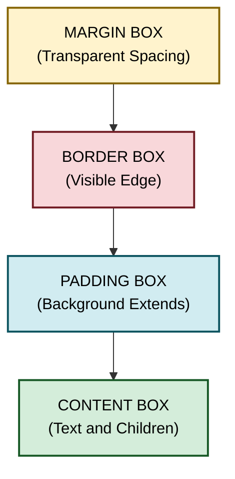
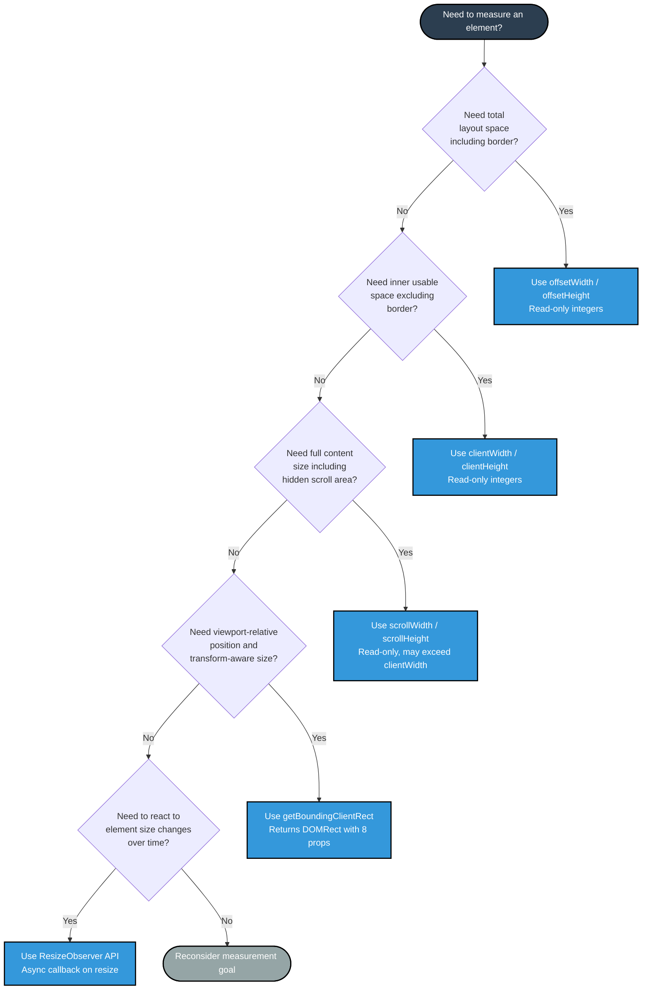
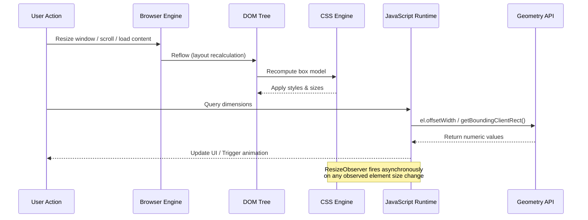

# Element Dimensions

<!-- SECTION_1_START -->
# Element Dimensions in HTML5 & CSS3

## 📘 Core Technical Definition

> [!NOTE]
> **Element Dimensions** refers to the precise measurement (in pixels, percentages, viewport units, or relative units) of an HTML element's geometric footprint, including its **content area, padding, border, and margin**, as well as its dynamic spatial relationship with the viewport, the document, and its offset parent.

In the **KTU 2024 Scheme (Web Programming - PECST742)** context, *Element Dimensions* spans two complementary domains:

1. **CSS Declarative Dimensions** — The static, stylesheet-driven sizing of elements using properties like `width`, `height`, `box-sizing`, `min-width`, `max-width`, and viewport units (`vw`, `vh`).
2. **JavaScript Programmatic Dimensions** — The dynamic, runtime measurement of rendered geometry through the **CSS Object Model (CSSOM)** and **Geometry Interfaces** (`clientWidth`, `offsetWidth`, `scrollWidth`, `getBoundingClientRect()`, `ResizeObserver`).

> [!IMPORTANT]
> **KTU 2024 Syllabus Highlight (Module 1):** Students must understand how browsers compute the *visual box* of an element and how JavaScript can read those values to build responsive, interactive web pages.

---

## 🧠 Conceptual Analogy / Intuition

Imagine every HTML element is a **framed painting hanging on a gallery wall**:

- 🖼️ **The Painting itself** → The **content area** (text, images). This is the *innermost* box.
- 🪟 **The Matting/Passe-partout** → The **padding** (breathing space between painting and frame).
- 🖼️ **The Frame** → The **border** (decorative edge that defines the visible boundary).
- 🌫️ **The Gap to the next painting** → The **margin** (transparent spacing separating elements).
- 📐 **The Wall (browser viewport)** → The containing block / viewport.

When JavaScript "measures" the painting, it can ask several different questions:
- *"How big is the painting and frame together?"* → `offsetWidth / offsetHeight`
- *"How big is the painting plus its matting (excluding the frame)?"* → `clientWidth / clientHeight`
- *"How big would the painting be if I unrolled the entire scroll?"* → `scrollWidth / scrollHeight`
- *"Where exactly is this painting on the wall right now?"* → `getBoundingClientRect()`

---

## 📊 Standard CSS Box-Sizing Reference (KTU High-Yield)

| Box-Sizing Value | What `width` / `height` Represents | Common Use Case |
|------------------|-----------------------------------|-----------------|
| `content-box` *(default)* | Content area **only** (excludes padding & border) | Legacy layouts |
| `border-box` | Content + Padding + Border | **Modern responsive design** ✅ |
| `inherit` | Inherits from parent | Inheritance demos |

> [!WARNING]
> In `content-box`, setting `width: 200px; padding: 20px;` makes the element render as **240px wide** on screen. In `border-box`, the *total* remains **200px**, and the content area shrinks to absorb the padding.

---

## 🔬 GeoGebra / Desmos Visualization Callout

> [!VISUALIZATION CONTROL]
> **Concept:** Visualizing the CSS Box Model as nested rectangles on a coordinate plane
> **GeoGebra / Desmos Input Equations:**
> * Outer rectangle (margin box): $R_1: (0,0) \text{ to } (W+2M, H+2M)$
> * Border box: $R_2: (M, M) \text{ to } (M+W, M+H)$
> * Padding box: $R_3: (M+B, M+B) \text{ to } (M+B+P_w, M+B+P_h)$
> * Content box: $R_4: (M+B+P_t, M+B+P_t) \text{ to } (M+B+P_t+C_w, M+B+P_t+C_b)$
> 
> Where $W$ = total width, $H$ = total height, $M$ = margin, $B$ = border, $P$ = padding, $C$ = content.
> 
> **Visual Description:** Students should see **four concentric rectangles** nested inside one another — the outermost being the margin area (transparent), then the border, then the padding zone (often tinted background), and finally the innermost content rectangle. For `box-sizing: border-box`, the total $W$ stays fixed and $C$ shrinks; for `content-box`, $C$ stays fixed and $W$ grows.

<!-- SECTION_1_END -->

<!-- SECTION_2_START -->
# Deep Theoretical Analysis & KTU High-Yield Formula Sheet

## ⚙️ The CSS Box Model — Operational Breakdown

The **CSS Box Model** is the foundational engine behind every dimension calculation. Each block-level element is decomposed into four concentric regions:

1. **Content Box** — Holds the actual content (text, images, child elements). Its size is governed by `width`, `height`, and intrinsic content size.
2. **Padding Box** — Surrounds the content; background color/imagery extends here, but no child content can exist. Sized by `padding-top/right/bottom/left` (shorthand: `padding`).
3. **Border Box** — Encloses the padding; supports styled edges via `border-width`, `border-style`, `border-color`.
4. **Margin Box** — The outermost transparent spacing layer; pushes neighboring elements away. Sized by `margin-*`. Notably, **vertical margins collapse** under specific rules.

> [!NOTE]
> **Box-Sizing & Universal Selector Trick (KTU-Favorite Trick):**
> Many professional stylesheets reset the box model globally:
> ```css
> *, *::before, *::after { box-sizing: border-box; }
> ```
> This single declaration is a hallmark of modern KTU practical answers.

---

## 📐 JavaScript Dimension APIs — Structured Logic

JavaScript exposes four primary geometry-reading mechanisms. Each answers a **different question** about the same element.

### 1. `offsetWidth` / `offsetHeight`
- **Returns:** Total visible size of the element = `content + padding + border + vertical scrollbar` (if rendered).
- **Includes:** Border, padding, horizontal scrollbar (for `offsetHeight`).
- **Excludes:** Margins.
- **Read-only integer** (rounded to nearest pixel).
- **Use case:** Detect "how much space does this element *occupy* in the layout?"

### 2. `clientWidth` / `clientHeight`
- **Returns:** Inner viewport size = `content + padding`.
- **Excludes:** Border, margin, scrollbars.
- **Read-only integer.**
- **Use case:** Determine "how much content area is *visually usable* inside the border?"

### 3. `scrollWidth` / `scrollHeight`
- **Returns:** Total size of the element's **content**, including the part that is **not currently visible** (i.e., scrolled out of view).
- **For non-scrollable elements:** Equivalent to `clientWidth / clientHeight`.
- **Use case:** Detect "how much content is *hidden* and needs scrolling?"

### 4. `Element.getBoundingClientRect()`
- **Returns:** A `DOMRect` object with **8 properties**: `top`, `right`, `bottom`, `left`, `width`, `height`, `x`, `y`.
- **Coordinates are relative to the viewport** (not the document!).
- **Includes** transforms (CSS `transform: scale/rotate/translate`).
- **Use case:** Collision detection, animation positioning, drag-and-drop.

### 5. `ResizeObserver` API (Modern Standard)
- **Purpose:** Asynchronously observe changes to an element's size.
- **Advantage over `window.resize`:** Works on **any element**, not just the window.
- **Use case:** Responsive component libraries (chart re-renders, canvas resizing).

---

## 📋 KTU Formula Sheet / Cheat Sheet

> [!IMPORTANT]
> **CRITICAL TABLE — Memorize this for KTU ESE. Never use raw `|` inside table cells (use `\vert` instead).**

| Dimension API | Formula (What it Returns) | Unit | Read/Write | Includes Border? | Includes Padding? | Includes Scroll Area? | Includes Margin? | Includes CSS Transforms? |
|---------------|---------------------------|------|------------|------------------|-------------------|------------------------|------------------|--------------------------|
| `offsetWidth` | $W_{content} + P_w + B_w + SB$ | px | Read-only | ✅ Yes | ✅ Yes | ❌ No | ❌ No | ❌ No |
| `offsetHeight` | $H_{content} + P_h + B_h + SB$ | px | Read-only | ✅ Yes | ✅ Yes | ❌ No | ❌ No | ❌ No |
| `clientWidth` | $W_{content} + P_w$ | px | Read-only | ❌ No | ✅ Yes | ❌ No | ❌ No | ❌ No |
| `clientHeight` | $H_{content} + P_h$ | px | Read-only | ❌ No | ✅ Yes | ❌ No | ❌ No | ❌ No |
| `scrollWidth` | $\max(W_{content}, clientWidth)$ | px | Read/Write* | ❌ No | ❌ No (typically) | ✅ Yes (full content) | ❌ No | ❌ No |
| `scrollHeight` | $\max(H_{content}, clientHeight)$ | px | Read/Write* | ❌ No | ❌ No (typically) | ✅ Yes (full content) | ❌ No | ❌ No |
| `getBoundingClientRect().width` | Visual rendered width | px | Read-only | ✅ Yes | ✅ Yes | ❌ No | ❌ No | ✅ Yes (post-transform) |
| `getBoundingClientRect().height` | Visual rendered height | px | Read-only | ✅ Yes | ✅ Yes | ❌ No | ❌ No | ✅ Yes (post-transform) |

> **Legend:** $W$ = width, $H$ = height, $P$ = padding, $B$ = border, $SB$ = scrollbar width (typically **15-17px** on desktop browsers), $*$ `scrollLeft`/`scrollTop` are writable; `scrollWidth`/`scrollHeight` are read-only.

---

### 🌍 Real-World Engineering Utility

| Application Domain | Why Element Dimensions Matter |
|--------------------|------------------------------|
| **Responsive Web Design** | Media queries and JS-driven breakpoints depend on accurate viewport (`window.innerWidth`) and element measurements. |
| **Infinite Scroll / Virtualization** | Libraries like React-Virtual calculate item heights via `scrollHeight` to render only visible rows, saving memory. |
| **Drag & Drop UIs** | `getBoundingClientRect()` powers collision detection (Kanban boards, file uploaders). |
| **Canvas / WebGL Rendering** | Canvas must be resized to match its container's `clientWidth` × `clientHeight` × `devicePixelRatio` to avoid pixelation. |
| **Sticky / Parallax Scrolling** | `offsetTop` (read-only coordinate of element relative to offsetParent) anchors elements to scroll positions. |
| **Modal & Tooltip Positioning** | `getBoundingClientRect()` calculates where to render popovers without overflow. |
| **Performance / CLS Prevention** | Reserving space using known dimensions prevents Cumulative Layout Shift in Core Web Vitals. |

<!-- SECTION_2_END -->

<!-- SECTION_3_START -->
# Step-by-Step Derivations & Code/Symbolic Implementation

## 🔢 Mathematical Derivation: The CSS Box Model Equation

Given a block element with the following CSS declarations:

```css
.box {
  width: 200px;
  height: 100px;
  padding: 20px;
  border: 5px solid #333;
  margin: 10px;
}
```

### Case 1: `box-sizing: content-box` (default)

The CSS specification defines the total occupied horizontal space as:

$$
W_{total} = W_{content} + 2 \times P_{horizontal} + 2 \times B_{horizontal} + 2 \times M_{horizontal}
$$

Substituting values:

$$
W_{total} = 200 + 2(20) + 2(5) + 2(10)
$$

$$
W_{total} = 200 + 40 + 10 + 20 = 270 \text{ px}
$$

The vertical occupied space:

$$
H_{total} = H_{content} + 2 \times P_{vertical} + 2 \times B_{vertical} + 2 \times M_{vertical}
$$

$$
H_{total} = 100 + 2(20) + 2(5) + 2(10)
$$

$$
H_{total} = 100 + 40 + 10 + 20 = 170 \text{ px}
$$

**Result:** `offsetWidth` returns **270px**, `offsetHeight` returns **170px**.

### Case 2: `box-sizing: border-box`

Now the `width` property **includes** padding and border. The total occupied space (excluding margin) is:

$$
W_{occupied} = W_{declared} + 2 \times M_{horizontal} = 200 + 2(10) = 220 \text{ px}
$$

The actual content width shrinks:

$$
W_{content} = W_{declared} - 2 \times P_{horizontal} - 2 \times B_{horizontal}
$$

$$
W_{content} = 200 - 2(20) - 2(5) = 200 - 40 - 10 = 150 \text{ px}
$$

**Result:** `offsetWidth` returns **220px**, the *content box* is **150px** wide.

---

## 🖥️ JavaScript Implementation — Full Working Examples

### Example 1: Diagnostic Function for Any Element

```html
<!DOCTYPE html>
<html lang="en">
<head>
  <meta charset="UTF-8">
  <title>Element Dimensions Diagnostic</title>
  <style>
    #target {
      width: 200px;
      height: 100px;
      padding: 20px;
      border: 5px solid #2c3e50;
      margin: 10px;
      box-sizing: content-box;     /* try toggling to border-box */
      background: #ecf0f1;
      overflow: auto;              /* enables scrollWidth/scrollHeight detection */
    }
    #innerContent {
      width: 400px;                /* intentionally wider than parent */
      height: 250px;               /* intentionally taller than parent */
      background: linear-gradient(45deg, #3498db, #9b59b6);
    }
  </style>
</head>
<body>
  <div id="target">
    <div id="innerContent">Scroll me horizontally and vertically</div>
  </div>
  <pre id="output"></pre>

  <script>
    /**
     * Returns a structured diagnostic object for an element's geometry.
     * @param {HTMLElement} el - The element to measure.
     * @returns {object} All major dimension properties.
     */
    function diagnoseElementDimensions(el) {
      if (!(el instanceof HTMLElement)) {
        throw new TypeError("Argument must be an HTMLElement");
      }
      const rect = el.getBoundingClientRect();
      const styles = window.getComputedStyle(el);
      return {
        offsetWidth: el.offsetWidth,
        offsetHeight: el.offsetHeight,
        clientWidth: el.clientWidth,
        clientHeight: el.clientHeight,
        scrollWidth: el.scrollWidth,
        scrollHeight: el.scrollHeight,
        boundingRect: {
          top: rect.top,
          left: rect.left,
          right: rect.right,
          bottom: rect.bottom,
          width: rect.width,
          height: rect.height
        },
        computed: {
          boxSizing: styles.boxSizing,
          paddingTop: styles.paddingTop,
          paddingLeft: styles.paddingLeft,
          borderTopWidth: styles.borderTopWidth,
          borderLeftWidth: styles.borderLeftWidth,
          marginTop: styles.marginTop,
          marginLeft: styles.marginLeft
        }
      };
    }

    const target = document.getElementById("target");
    const report = diagnoseElementDimensions(target);
    document.getElementById("output").textContent =
      JSON.stringify(report, null, 2);
  </script>
</body>
</html>
```

**Expected Output (with `content-box` and overflow):**
- `offsetWidth`: **270** (200 + 40 padding + 10 border)
- `clientWidth`: **240** (200 + 40 padding, scrollbar excluded by clientWidth convention in standards mode)
- `scrollWidth`: **440** (full inner content width including overflow)
- `boundingRect.width`: **270** (matches offsetWidth when no transforms applied)

---

### Example 2: ResizeObserver for Live Component Resize

```html
<!DOCTYPE html>
<html lang="en">
<head>
  <meta charset="UTF-8">
  <title>ResizeObserver Demo</title>
  <style>
    #resizable {
      width: 50%;
      height: 200px;
      resize: both;                /* user can drag corner to resize */
      overflow: auto;
      border: 2px dashed #e74c3c;
      background: #fdf2e9;
      padding: 10px;
    }
  </style>
</head>
<body>
  <div id="resizable">Drag my bottom-right corner to resize me!</div>
  <p id="liveSize">Initial measurement pending...</p>

  <script>
    const box = document.getElementById("resizable");
    const display = document.getElementById("liveSize");

    /**
     * ResizeObserver callback receives a list of ResizeObserverEntry objects.
     * Each entry exposes contentRect and target.
     * @param {ResizeObserverEntry[]} entries
     */
    const observer = new ResizeObserver((entries) => {
      for (const entry of entries) {
        const { width, height } = entry.contentRect;
        display.textContent =
          `Live size -> width: ${width.toFixed(1)}px, ` +
          `height: ${height.toFixed(1)}px`;
      }
    });

    observer.observe(box);

    // Cleanup pattern for SPA unmounting
    window.addEventListener("beforeunload", () => observer.disconnect());
  </script>
</body>
</html>
```

---

### Example 3: Viewport vs Document Dimensions

```javascript
/**
 * Distinguishes between the visible viewport and the entire scrollable document.
 * This is a common KTU viva question.
 */
function reportViewportVsDocument() {
  return {
    viewport: {
      innerWidth: window.innerWidth,           // viewport width  (excludes dev tools)
      innerHeight: window.innerHeight,         // viewport height (excludes dev tools)
      // Modern equivalent, with devicePixelRatio awareness:
      visualViewport: {
        width:  visualViewport.width,           // CSS px visible to user
        height: visualViewport.height,
        scale:  visualViewport.scale            // pinch-zoom factor
      }
    },
    document: {
      // Entire scrollable document dimensions:
      scrollWidth:  document.documentElement.scrollWidth,
      scrollHeight: document.documentElement.scrollHeight,
      // Current scroll position:
      scrollTop:    document.documentElement.scrollTop,
      scrollLeft:   document.documentElement.scrollLeft
    }
  };
}
```

---

### Example 4: Pinpoint Element Position (Canvas-Style Game Anchor)

```javascript
/**
 * Calculates the center of an element in document coordinates.
 * Useful for absolutely positioning child tooltips, popovers, or game entities.
 * @param {HTMLElement} el
 * @returns {{x: number, y: number}}
 */
function getElementCenterInDocument(el) {
  const rect = el.getBoundingClientRect();
  // getBoundingClientRect() returns viewport-relative coords.
  // To convert to document-relative, add the current scroll offsets.
  const docX = rect.left + window.scrollX + rect.width  / 2;
  const docY = rect.top  + window.scrollY + rect.height / 2;
  return { x: docX, y: docY };
}
```

---

## 🔍 Algebraic Derivation: Converting Viewport to Document Coordinates

Given a point $P_{viewport} = (x_v, y_v)$ returned by `getBoundingClientRect()`:

$$
P_{document} = (x_v + S_x,\ y_v + S_y)
$$

Where:
- $S_x = $ `window.scrollX` (or `document.documentElement.scrollLeft`)
- $S_y = $ `window.scrollY` (or `document.documentElement.scrollTop`)

**Numerical Example:** Suppose a `<div>` is at viewport position `(150, 80)` and the page has been scrolled vertically by 400px. Its document-relative position is:

$$
P_{document} = (150 + 0,\ 80 + 400) = (150,\ 480)
$$

> [!NOTE]
> **Why not use `el.offsetLeft` / `el.offsetTop`?** Those return coordinates relative to the **`offsetParent`** (the nearest positioned ancestor), not the document or viewport. KTU questions often test this distinction.

<!-- SECTION_3_END -->

<!-- SECTION_4_START -->
# Structural Diagrams & Schematics

## 🌐 Diagram 1: The CSS Box Model — Layered Topology



**Reading the diagram:** Each box nests inside the next. `offsetWidth` measures the *outer* dimensions of the Border Box; `clientWidth` stops at the inner edge of the Border Box; `scrollWidth` can extend beyond the Padding Box to include overflowing content.

---

## 🔁 Diagram 2: JavaScript Dimension API Decision Flow



---

## 🧮 Diagram 3: Coordinate System Hierarchy

```mermaid
flowchart LR
    subgraph DOC["DOCUMENT LAYER"]
        direction TB
        D1["document.documentElement<br/>scrollWidth, scrollHeight<br/>scrollLeft, scrollTop"]
    end

    subgraph WIN["VIEWPORT LAYER"]
        direction TB
        W1["window.innerWidth, innerHeight"]
        W2["getBoundingClientRect()<br/>returns viewport-relative coords"]
    end

    subgraph EL["ELEMENT LAYER"]
        direction TB
        E1["offsetLeft, offsetTop<br/>relative to offsetParent"]
        E2["offsetWidth, offsetHeight<br/>border + padding + content"]
        E3["clientWidth, clientHeight<br/>padding + content"]
        E4["scrollWidth, scrollHeight<br/>full content including overflow"]
    end

    DOC --- WIN
    WIN --- EL

    classDef docStyle fill:#fef9e7,stroke:#7d6608,stroke-width:2px,color:#000
    classDef winStyle fill:#ebdef0,stroke:#4a235a,stroke-width:2px,color:#000
    classDef elStyle  fill:#d6eaf8,stroke:#1b4f72,stroke-width:2px,color:#000

    class D1 docStyle
    class W1,W2 winStyle
    class E1,E2,E3,E4 elStyle
```



---

## 🧩 Diagram 4: Event-Triggered Dimension Pipeline



<!-- SECTION_4_END -->

<!-- SECTION_5_START -->
# KTU 2024 Scheme Examination Question Bank & Topic Recap

---

## 📝 Part A — Short Answer Questions (3 Marks Each)

### **Q1. [KTU University Exam – Dec 2023]**
**Differentiate between `clientWidth` and `offsetWidth` of an HTML element. Mention what each one includes and excludes. (CO1, Remember)**

**Model Answer:**

> `clientWidth` and `offsetWidth` are two read-only properties of the `HTMLElement` interface used to measure the geometric size of an element in the rendered web page.
>
> **1. `offsetWidth`:**
> - It returns the **total layout width** of an element measured in pixels.
> - It **includes** the content width, **padding** (both left and right), **border** (both left and right), and the vertical scrollbar (if rendered).
> - It **excludes** margins.
>
> **2. `clientWidth`:**
> - It returns the **inner width** of the element where content is displayed.
> - It **includes** the content width and **padding** (both left and right).
> - It **excludes** the border, margins, and scrollbars.
>
> **Example:** For a `<div>` with `width: 200px; padding: 20px; border: 5px;`:
> - `offsetWidth` = 200 + 40 + 10 = **250 px**
> - `clientWidth` = 200 + 40 = **240 px**

> [!IMPORTANT]
> **Valuation Tip (3-Mark Distribution):** [Defining each property: 1 Mark] [Listing inclusions/exclusions: 1 Mark] [Numerical example: 1 Mark].

---

### **Q2. [KTU University Exam – July 2024]**
**What is the purpose of the `getBoundingClientRect()` method in JavaScript? List its returned properties. (CO1, Remember)**

**Model Answer:**

> The `getBoundingClientRect()` method returns the **size** of an element and its **position relative to the viewport** (the visible portion of the browser window). It returns a `DOMRect` object containing **eight properties**:
>
> 1. **`top`** – Distance from the top edge of the viewport to the top of the element.
> 2. **`right`** – Distance from the left edge of the viewport to the right edge of the element.
> 3. **`bottom`** – Distance from the top edge of the viewport to the bottom edge of the element.
> 4. **`left`** – Distance from the left edge of the viewport to the left edge of the element.
> 5. **`width`** – Visual width of the element (including padding and border; *transform-aware*).
> 6. **`height`** – Visual height of the element (including padding and border; *transform-aware*).
> 7. **`x`** – Alias for `left` in modern browsers.
> 8. **`y`** – Alias for `top` in modern browsers.
>
> **Use case:** Positioning tooltips, drag-and-drop collision detection, and scroll-anchored animations.

> [!IMPORTANT]
> **Valuation Tip (3-Mark Distribution):** [Defining the method: 1 Mark] [Listing any 6 of 8 properties: 1.5 Marks] [Mentioning a use case: 0.5 Mark].

---

## 📚 Part B — Long Answer Questions (14 Marks Each, Internal Choice)

> [!NOTE]
> **KTU ESE Pattern:** Each question carries sub-parts (a) for 7 marks and (b) for 7 marks.

---

### **Q3. [KTU University Exam – Model Paper 2024]**

#### **Question A: (14 Marks)**

**(a)** Explain the **CSS Box Model** in detail with a neat diagram. Differentiate between `content-box` and `border-box` with examples. **(CO2, Understand — 7 Marks)**

**(b)** Write an HTML5 page that creates a styled card component and use **JavaScript** to dynamically read and display its `offsetWidth`, `clientWidth`, `scrollWidth`, and the result of `getBoundingClientRect()` when a button is clicked. **(CO3, Apply — 7 Marks)**

---

#### **Model Answer — Part (a): 7 Marks**

> **[Defining the Box Model: 2 Marks]**
> The CSS Box Model is a fundamental concept that describes how every HTML block element is rendered as a rectangular box composed of four concentric regions: **Content, Padding, Border, and Margin**. The total horizontal space occupied by an element is given by the formula:
>
> $$W_{total} = W_{content} + 2P_{horizontal} + 2B_{horizontal} + 2M_{horizontal}$$
>
> where $W_{content}$ is the content width, $P$ is padding, $B$ is border, and $M$ is margin.

> **[Differentiating content-box vs border-box: 4 Marks]**

| Aspect | `content-box` (Default) | `border-box` |
|--------|-------------------------|--------------|
| `width` property represents | Content area **only** | Content + Padding + Border |
| Effect of adding padding | Element grows wider (total exceeds declared width) | Total width stays fixed, content shrinks |
| Mental model | "I declare the content, padding is extra" | "I declare the total, content adjusts" |
| Preferred in | Legacy layouts | **Modern responsive design** |

> **[Numerical Demonstration: 1 Mark]**
> For `width: 200px; padding: 20px; border: 5px; margin: 10px;`:
> - `content-box` → total occupied width = 200 + 40 + 10 = **250px** (excluding margin)
> - `border-box` → total occupied width = 200px (excluding margin), content shrinks to **150px**

---

#### **Model Answer — Part (b): 7 Marks**

```html
<!DOCTYPE html>
<html lang="en">
<head>
  <meta charset="UTF-8">
  <title>Dimension Inspector</title>
  <style>
    body { font-family: system-ui, sans-serif; padding: 20px; }
    .card {
      width: 300px;
      height: 150px;
      padding: 25px;
      border: 8px solid #2c3e50;
      margin: 15px;
      background: #ecf0f1;
      box-sizing: content-box;
      overflow: auto;
    }
    .long-content {
      width: 600px;       /* wider than parent -> triggers horizontal scroll */
      height: 300px;      /* taller than parent -> triggers vertical scroll */
      background: linear-gradient(135deg, #3498db, #9b59b6);
      color: white;
      padding: 10px;
    }
    button { padding: 10px 20px; background: #27ae60; color: white; border: none; cursor: pointer; }
    pre { background: #2c3e50; color: #ecf0f1; padding: 15px; border-radius: 5px; }
  </style>
</head>
<body>
  <div id="card" class="card">
    <div class="long-content">I am intentionally larger than my parent to demonstrate scroll dimensions.</div>
  </div>
  <button id="inspectBtn">Measure Card Dimensions</button>
  <pre id="report">Click the button to measure dimensions...</pre>

  <script>
    /**
     * Reads and formats all major geometric properties of the card.
     * Demonstrates offsetWidth, clientWidth, scrollWidth, and DOMRect.
     * @returns {void}
     */
    function measureCard() {
      const card = document.getElementById("card");
      if (!card) {
        console.error("Card element not found");
        return;
      }
      const rect = card.getBoundingClientRect();
      const report = [
        "--- ELEMENT DIMENSION REPORT ---",
        `offsetWidth      : ${card.offsetWidth} px   (border + padding + content)`,
        `offsetHeight     : ${card.offsetHeight} px  (border + padding + content)`,
        `clientWidth      : ${card.clientWidth} px   (padding + content, no border)`,
        `clientHeight     : ${card.clientHeight} px  (padding + content, no border)`,
        `scrollWidth      : ${card.scrollWidth} px   (full content incl. hidden overflow)`,
        `scrollHeight     : ${card.scrollHeight} px  (full content incl. hidden overflow)`,
        "--- getBoundingClientRect() ---",
        `rect.left        : ${rect.left} px`,
        `rect.top         : ${rect.top} px`,
        `rect.right       : ${rect.right} px`,
        `rect.bottom      : ${rect.bottom} px`,
        `rect.width       : ${rect.width} px`,
        `rect.height      : ${rect.height} px`
      ].join("\n");
      document.getElementById("report").textContent = report;
    }
    document.getElementById("inspectBtn").addEventListener("click", measureCard);
  </script>
</body>
</html>
```

**Expected Output Snapshot:**
```
offsetWidth      : 366 px   (300 + 50 padding + 16 border)
offsetHeight     : 216 px   (150 + 50 padding + 16 border)
clientWidth      : 350 px   (300 + 50 padding)
clientHeight     : 200 px   (150 + 50 padding)
scrollWidth      : 620 px   (600 content + 20 inner padding)
scrollHeight     : 320 px
```

> [!IMPORTANT]
> **Valuation Key for Part (b) — 7 Marks:**
> - [Correct HTML5 boilerplate & CSS structure: 1 Mark]
> - [Defining element with width, padding, border: 1 Mark]
> - [Implementing offsetWidth & clientWidth read: 1.5 Marks]
> - [Implementing scrollWidth & getBoundingClientRect: 1.5 Marks]
> - [Click event handler with output display: 1 Mark]
> - [Code formatting & logical flow: 1 Mark]

---

#### **Question B (Alternative Choice): 14 Marks**

**(a)** Explain the working of the **CSS Box Model** with a labelled diagram. Discuss the role of `box-sizing: border-box` in responsive design. **(CO2, Understand — 7 Marks)**

**(b)** Write JavaScript code that uses **`ResizeObserver`** to monitor a `<textarea>` element and display its live width and height as the user resizes the window or the element. Include a fallback for older browsers using the `window.resize` event. **(CO3, Apply — 7 Marks)**

**Model Solution for (b):**

```html
<!DOCTYPE html>
<html lang="en">
<head>
  <meta charset="UTF-8">
  <title>ResizeObserver with Fallback</title>
  <style>
    body { font-family: system-ui, sans-serif; padding: 20px; }
    textarea {
      width: 80%;
      min-height: 120px;
      padding: 10px;
      border: 2px solid #2980b9;
      resize: both;          /* user can resize the textarea directly */
    }
    #liveSize { margin-top: 12px; font-weight: bold; color: #c0392b; }
  </style>
</head>
<body>
  <h2>Live Resize Monitor</h2>
  <textarea id="ta" placeholder="Resize me or resize the browser window..."></textarea>
  <div id="liveSize">Awaiting first measurement...</div>

  <script>
    const textarea = document.getElementById("ta");
    const display  = document.getElementById("liveSize");

    /**
     * Feature detection for ResizeObserver API.
     * @returns {boolean}
     */
    function supportsResizeObserver() {
      return typeof ResizeObserver !== "undefined";
    }

    /**
     * ResizeObserver callback: receives batched entries.
     * @param {ResizeObserverEntry[]} entries
     */
    function handleResize(entries) {
      for (const entry of entries) {
        const { width, height } = entry.contentRect;
        display.textContent = `Live: ${width.toFixed(1)} x ${height.toFixed(1)} px`;
      }
    }

    if (supportsResizeObserver()) {
      const ro = new ResizeObserver(handleResize);
      ro.observe(textarea);
      console.log("Using ResizeObserver");
    } else {
      // Fallback for older browsers (e.g., legacy mobile)
      window.addEventListener("resize", () => {
        const rect = textarea.getBoundingClientRect();
        display.textContent =
          `Fallback Live: ${rect.width.toFixed(1)} x ${rect.height.toFixed(1)} px`;
      });
      console.warn("ResizeObserver unsupported; using window.resize fallback");
    }
  </script>
</body>
</html>
```

> [!IMPORTANT]
> **Valuation Key for (b) — 7 Marks:**
> - [Feature detection for ResizeObserver: 1 Mark]
> - [Correct constructor usage & observe call: 1.5 Marks]
> - [Proper handling of contentRect.width/height: 1.5 Marks]
> - [Fallback implementation with window.resize: 1.5 Marks]
> - [Live DOM update & event cleanup consideration: 1.5 Marks]

---

## ⚠️ KTU Examiner's Valuation Warning / Pitfall Callout

> [!WARNING]
> **Common Mistakes That Cost Marks in Element Dimensions Questions:**
>
> 1. **Confusing `offsetWidth` with `clientWidth`:** Many students write `offsetWidth` when asked for "inner content area." Remember: **`offsetWidth` includes the border**, `clientWidth` does **not**.
> 2. **Forgetting to multiply padding/border by 2:** The Box Model formula is **symmetrical** — padding-left + padding-right = $2P$. Forgetting this gives wrong numerical answers.
> 3. **Mixing up `scrollWidth` and `clientWidth`:** When content fits, they are equal. When content overflows, `scrollWidth` becomes **larger**. Always mention "full content including hidden overflow" for `scrollWidth`.
> 4. **Treating `getBoundingClientRect()` coordinates as document-relative:** They are **viewport-relative**. Add `window.scrollX` / `window.scrollY` to convert to document coordinates.
> 5. **Ignoring `box-sizing` in calculations:** Failing to state whether the element uses `content-box` or `border-box` before computing dimensions is an automatic **partial-mark deduction**.
> 6. **Not stating units:** Always write **"px"** explicitly. A dimension without a unit is technically incomplete.
> 7. **Confusing `offsetParent` coordinate system:** `offsetLeft` / `offsetTop` are relative to the **nearest positioned ancestor**, not the document or viewport. KTU trick questions test this!

---

## 🧠 Topic Recap & Important Things to Remember

- 📦 **CSS Box Model** has 4 layers (outer to inner): **Margin → Border → Padding → Content**.
- 🧮 **Master formula:** $\;W_{total} = W_{content} + 2P_h + 2B_h + 2M_h\;$ (for `content-box`).
- 🔄 **`box-sizing: border-box`** makes `width` and `height` include padding + border — the **modern standard** for responsive layouts.
- 📏 **`offsetWidth`/`offsetHeight`** = content + padding + border (+ scrollbar) → **excludes margin**.
- 📐 **`clientWidth`/`clientHeight`** = content + padding → **excludes border & margin**.
- 📜 **`scrollWidth`/`scrollHeight`** = full content including **hidden overflow** (≥ clientWidth).
- 🗺️ **`getBoundingClientRect()`** returns a `DOMRect` with 8 properties; coords are **viewport-relative** and **transform-aware**.
- 🌐 **`window.innerWidth/innerHeight`** measure the **viewport**; `document.documentElement.scrollWidth/Height` measure the **whole document**.
- 👁️ **`ResizeObserver`** is the modern, **element-level** alternative to `window.resize` events.
- 🧭 **Conversion trick:** `docX = rect.left + window.scrollX`; `docY = rect.top + window.scrollY`.
- 🎯 **`offsetLeft`/`offsetTop`** are relative to `offsetParent` (the nearest positioned ancestor), **not** the document.
- 🛠️ **Universal reset trick** (KTU-favorite):
  ```css
  *, *::before, *::after { box-sizing: border-box; }
  ```
- 💡 **Always mention the unit** ("px") in dimension answers and **state the box-sizing mode** before computing.
- 🔁 **Margins collapse vertically** but not horizontally — a classic KTU viva trap.
- 🎨 **CSS transforms affect** `getBoundingClientRect()` but **do not affect** `offsetWidth` or `clientWidth`.

<!-- SECTION_5_END -->
