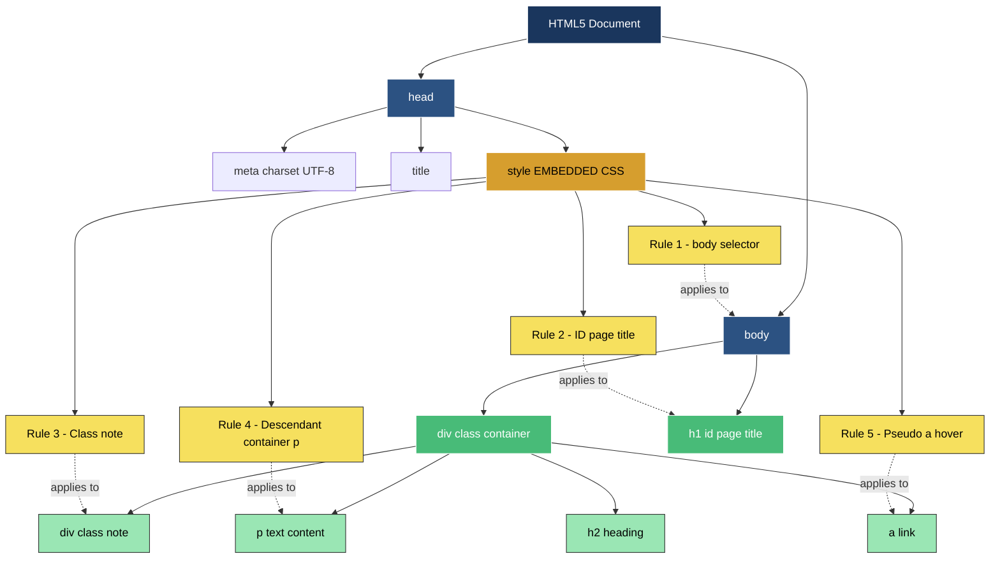
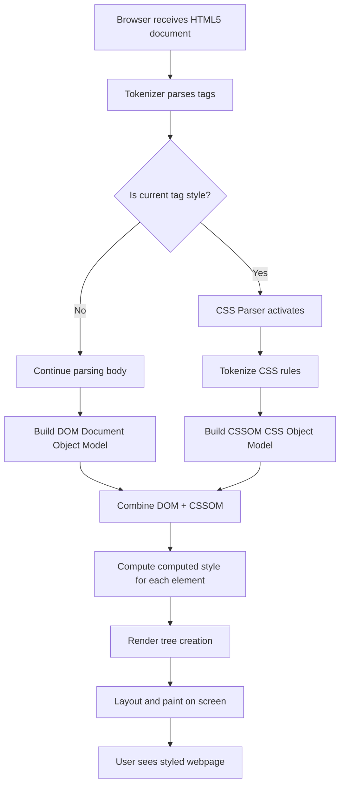
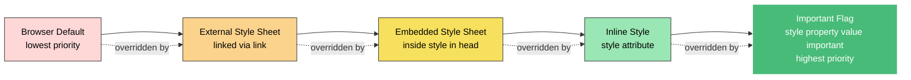
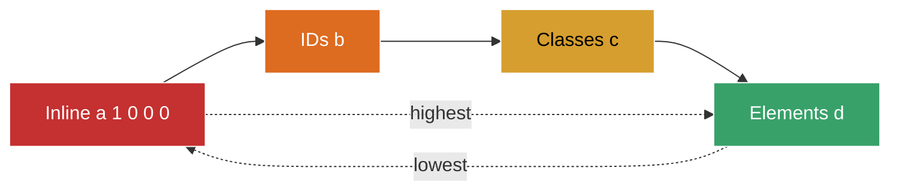
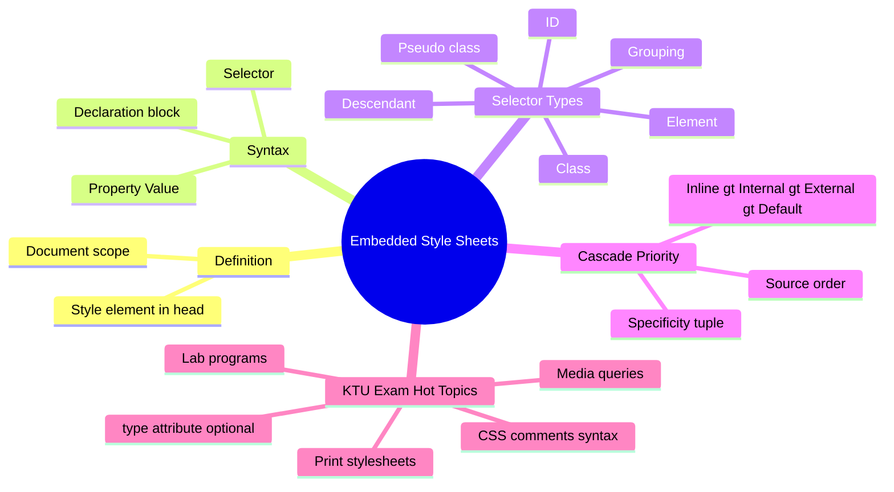

# Embedded Style Sheets

<!-- SECTION_1_START -->
# Embedded Style Sheets — Core Technical Definition & Intuitive Overview

## Formal Academic Definition (KTU 2024 Syllabus Terminology)

> [!IMPORTANT]
> **Embedded Style Sheet (also called Internal Style Sheet)** is a **document-level CSS mechanism** defined by the W3C CSS Specification, in which Cascading Style Sheet rules are declared inside an HTML document using the `<style>` element placed within the document's `<head>` section. These rules apply **only to that single HTML document** and override browser defaults but are overridden by **External Style Sheets** (depending on cascade order) and by **Inline Styles**.

In KTU 2024 Scheme (Course Code **PECST742** — Web Programming), an *Embedded Style Sheet* is formally introduced as:

> *"A style sheet that is embedded within an HTML document using the `<style>` element, applying its CSS rules to all matching elements in that document."*

---

## Conceptual Analogy / Intuition

> [!NOTE]
> **Real-World Analogy — "The Uniform Policy of One Classroom"**
>
> Imagine a school where every classroom can decide its own dress code for its students. An **External Style Sheet** is like a *school-wide circular* applied to every classroom. An **Inline Style** is like writing "wear blue" *directly on a single student*. An **Embedded Style Sheet** is like a *class teacher* standing at the door of *one specific classroom* and announcing: "Everyone in this class today wears the blue shirt, black shoes, and a red tie." The rule does **not** leak into other classrooms, but it applies to **every student** walking through *that one classroom's door*.

### Geometric / Structural Intuition

Think of an HTML document as a **building**:
- The **`<html>` tag** is the building itself.
- The **`<head>`** is the architectural blueprint room (where rules are declared, not displayed).
- The **`<style>` element** is a *noticeboard inside the blueprint room* containing a list of rules.
- The **`<body>`** is the visible structure where the rules take effect.
- Every **element in `<body>`** is a "student" that must obey the noticeboard rules.

---

## Key Terminology Glossary

| Term | Definition | KTU Relevance |
|---|---|---|
| **`<style>` element** | The HTML5 container that holds CSS rules; must be placed inside `<head>`. | Core tag — frequently asked in Part A. |
| **CSS Rule** | A pair of *selector* + *declaration block*. | Building block of any style sheet. |
| **Selector** | The pattern that identifies *which* HTML elements receive the style. | High-weight topic in Module 1. |
| **Declaration Block** | The `{ ... }` block containing one or more *property:value* pairs. | Tested in applied questions. |
| **`type` attribute** | Legacy attribute; in HTML5 it is **optional** (default is `text/css`). | Common KTU trick question. |
| **Cascade Order** | Priority: Inline > Internal/Embedded > External > Browser default. | Frequently tested. |
| **Media Query** | The `media` attribute on `<style>` to scope rules to a device type (e.g., `screen`, `print`). | Module 1 advanced topic. |

> [!IMPORTANT]
> **KTU Highlight:** In HTML5, the `<style>` element **does not require** the `type="text/css"` attribute. The browser assumes CSS by default. Writing it is permitted for backward compatibility with XHTML but is **redundant** in pure HTML5.

---

## GeoGebra / Desmos Visualization (Conceptual Architecture)

> [!VISUALIZATION CONTROL]
> **Concept:** Tree-structure of how an Embedded Style Sheet fits inside an HTML5 document.
> **GeoGebra / Desmos Input Equations (textual mapping of nested structure):**
> * `Root = document`
> * `Level1 = html`
> * `Level2 = head (contains style)`  AND  `body (contains visible elements)`
> * `Style.Block = selector → { property: value; }`
> **Visual Description:** Draw a tree with `html` at the root, two main branches — `head` (left) and `body` (right). Inside the `head` branch, draw a smaller box labelled `style` containing three example rules. The `body` branch contains `h1`, `p`, `div` boxes, each linked by dashed arrows back to the matching selector inside `style`. This visualization reinforces the **one-to-many mapping** between a single CSS rule and the many elements it can style.

---

## Why Embedded Style Sheets Exist — The "Why" Question

1. **Page-specific styling:** When a *single* page needs unique styling that doesn't apply to the rest of the site, embedding the CSS inside that page avoids creating a separate `.css` file.
2. **Reduced HTTP requests:** In KTU lab examinations, students often need a *single-file* demo — embedding the style removes the need for a second file, avoiding CORS and 404 issues in sandboxed environments.
3. **Override external rules temporarily:** Useful during testing or when a CMS-generated external stylesheet is hard to modify.
4. **Faster prototyping:** A beginner can write HTML + CSS in the same file, ideal for **lab viva** demonstrations.
]<]minimax[>[</br>

> [!NOTE]
> **Engineering Trade-off:** Embedded style sheets are **not scalable** for multi-page websites — duplicating them across 50 pages leads to maintenance nightmares. Production systems therefore prefer **External Style Sheets** linked via `<link rel="stylesheet" href="styles.css">`. KTU Module 1 tests this trade-off understanding.

---

## What This Section Establishes

By the end of this section, the student should be able to:
- **State** the formal definition of an Embedded Style Sheet.
- **Identify** the correct location of the `<style>` element inside an HTML5 document.
- **Differentiate** between Inline, Embedded, and External styles in terms of scope and cascade priority.
- **Recognize** that the `type` attribute is optional in HTML5.

---
<!-- SECTION_1_END -->

<!-- SECTION_2_START -->
# Deep Theoretical Analysis & KTU High-Yield Formula Sheet

## 1. Anatomy of an Embedded Style Sheet

An Embedded Style Sheet is written using the `<style>` element inside `<head>`. Its complete syntactic structure is:

```html
<!DOCTYPE html>
<html lang="en">
<head>
    <meta charset="UTF-8">
    <title>Embedded Style Sheet Demo</title>
    <style>
        /* CSS comments are written like this */
        selector {
            property-1: value-1;
            property-2: value-2;
        }
    </style>
</head>
<body>
    <!-- visible content goes here -->
</body>
</html>
```

### Step-by-Step Logical Breakdown

1. **Opening tag:** `<style>` (or `<style type="text/css">` for XHTML legacy).
2. **Selector line:** Names *what* to style. Can be an element selector (`h1`), a class selector (`.note`), an id selector (`#header`), a descendant selector (`div p`), or a pseudo-class (`:hover`).
3. **Opening brace `{`** marks the start of the declaration block.
4. **Declarations:** Each `property: value;` pair is a single rule ending with a **semicolon**. The last semicolon is optional but **recommended** for KTU coding exams to avoid marks deduction.
5. **Closing brace `}`** ends the rule.
6. **Closing tag:** `</style>`.

> [!IMPORTANT]
> **KTU Pitfall:** Forgetting the closing `</style>` tag is one of the most common reasons lab programs fail validation. Always close it.

---

## 2. The Three Layers of Styling — Cascade Priority

KTU Module 1 frequently tests the cascade order. The official W3C priority is:

$$ \text{Inline Style} \;>\; \text{Embedded / Internal Style Sheet} \;>\; \text{External Style Sheet} \;>\; \text{Browser Default} $$

Where $>$ means "overrides" or "wins in case of conflict."

### Specificity Tie-Breaker Formula (Selector Specificity)

When two embedded rules of the same type conflict, the browser calculates **specificity** as a 4-tuple:

$$ S = (a, b, c, d) $$

where:
- $a$ = count of **inline styles** (always 0 for embedded rules)
- $b$ = count of **ID selectors** in the selector
- $c$ = count of **class selectors**, **attribute selectors**, and **pseudo-classes**
- $d$ = count of **element selectors** and **pseudo-elements**

> [!NOTE]
> Specificity is compared **lexicographically from left to right**: $a$ first, then $b$, then $c$, then $d$. A higher value at the first differing position wins. This is a high-yield KTU concept.

---

## 3. KTU Formula Sheet / Cheat Sheet (Markdown Table)

| Concept | Syntax | Scope | Cascade Rank | When to Use |
|---|---|---|---|---|
| **Inline Style** | `<p style="color:red;">` | Single element | Highest (1) | One-off quick override |
| **Embedded Style** | `<style> p { color: red; } </style>` in `<head>` | Whole page (one document) | Middle (2) | Single-page demos, KTU lab tests |
| **External Style** | `<link rel="stylesheet" href="a.css">` | Whole site (multi-page) | Lower (3) | Production multi-page sites |
| **Browser Default** | Built into the user agent | All elements | Lowest (4) | Fallback only |
| **Selector: element** | `h1 { ... }` | All `<h1>` in the page | Embedded | General element styling |
| **Selector: class** | `.note { ... }` | All elements with `class="note"` | Embedded | Reusable component styling |
| **Selector: id** | `#header { ... }` | The single element with `id="header"` | Embedded | Unique one-per-page styling |
| **Selector: descendant** | `div p { ... }` | `<p>` inside any `<div>` | Embedded | Nested layouts |
| **Selector: pseudo-class** | `a:hover { ... }` | State-based | Embedded | Interactive feedback |
| **Media query** | `@media screen and (max-width: 600px) { ... }` | Conditional on device | Embedded | Responsive design |
| **`!important` flag** | `color: red !important;` | Breaks normal cascade | Highest priority | Last-resort override (avoid in KTU) |
| **Comment syntax** | `/* ... */` | Inside `<style>` only | N/A | Documentation |

> [!IMPORTANT]
> **KTU Warning:** Never use the vertical pipe $\vert$ in selector combinators when writing them in plain prose — it can collide with markdown table syntax. In code blocks, the pipe is fine.

---

## 4. Real-World Engineering Utility

Embedded style sheets are the **standard** in the following production scenarios:

1. **Email HTML templates** — Most email clients (Gmail, Outlook) ignore external stylesheets for security. Embedding is mandatory.
2. **CMS-generated landing pages** — Platforms like WordPress, Webflow, and Mailchimp inject page-specific CSS into `<head>`.
3. **Single-page web apps during prototyping** — React/Vue prototypes often inline styles in `index.html`.
4. **Print-friendly pages** — Using `<style media="print">` to define a print-only style sheet is a classic KTU viva question.
5. **PDF/Report generators** — Tools like wkhtmltopdf consume documents with embedded styles.

---

## 5. Properties Commonly Tested in KTU Module 1

| Property | Function | Example Value |
|---|---|---|
| `color` | Text color | `red`, `#FF0000`, `rgb(255,0,0)` |
| `background-color` | Element background | `lightblue` |
| `font-family` | Typeface | `"Times New Roman", serif` |
| `font-size` | Text size | `16px`, `1.2em`, `120%` |
| `font-weight` | Boldness | `normal`, `bold`, `700` |
| `text-align` | Horizontal alignment | `left`, `center`, `right`, `justify` |
| `margin` | Outer spacing | `10px`, `auto` |
| `padding` | Inner spacing | `10px` |
| `border` | Border width, style, color | `1px solid black` |
| `width`, `height` | Box dimensions | `300px`, `50%` |
| `display` | Layout mode | `block`, `inline`, `inline-block`, `none` |

---

## 6. Common KTU Traps and Misconceptions

> [!WARNING]
> - **Trap 1:** Students often place `<style>` inside `<body>`. This is technically rendered by browsers but is **invalid HTML5**. KTU strictly expects it in `<head>`.
> - **Trap 2:** Using HTML comment syntax `<!-- -->` inside `<style>`. Correct CSS comment is `/* ... */`.
> - **Trap 3:** Writing `font-size = 16px` instead of `font-size: 16px`. CSS uses **colon**, not equals.
> - **Trap 4:** Omitting units (e.g., `font-size: 16`) — invalid; `0` is the only unitless exception.
> - **Trap 5:** Assuming external style sheets *always* override internal. The order of `<link>` vs. `<style>` in the document head matters when specificity is equal.
]<]minimax[>[</br>

---

## 7. Connecting to Course Outcomes (CO Mapping)

| Course Outcome (KTU 2024) | Coverage in This Section |
|---|---|
| **CO1** — Understand the structure of HTML5 documents and basic web technologies. | Section 1, 2.1 — full coverage. |
| **CO2** — Apply CSS for styling HTML elements. | Sections 2.2 – 2.6 — full coverage. |
| **CO3** — Design static web pages using HTML5 + CSS. | Section 2.7 — applied coverage. |

---
<!-- SECTION_2_END -->

<!-- SECTION_3_START -->
# Step-by-Step Derivations & Code Implementation

## 1. Minimal Embedded Style Sheet — Exhaustive Code

The following is a **complete, runnable, copy-paste-ready** HTML5 document that demonstrates every concept of an Embedded Style Sheet. Read it top-to-bottom; every line is annotated.

```html
<!DOCTYPE html>
<html lang="en">
<head>
    <meta charset="UTF-8">
    <meta name="viewport" content="width=device-width, initial-scale=1.0">
    <title>KTU Embedded Style Sheet Demo</title>

    <!-- ============================================== -->
    <!--  EMBEDDED STYLE SHEET STARTS HERE              -->
    <!-- ============================================== -->
    <style>
        /* --- 1. Element selector --- */
        body {
            font-family: "Segoe UI", Arial, sans-serif;
            background-color: #f4f6f8;
            margin: 0;
            padding: 24px;
        }

        /* --- 2. ID selector (unique to one element) --- */
        #page-title {
            color: #1a365d;
            text-align: center;
            font-size: 2.2em;
            border-bottom: 3px solid #1a365d;
            padding-bottom: 8px;
        }

        /* --- 3. Class selector (reusable) --- */
        .note {
            background-color: #fff8dc;
            border-left: 5px solid #d4a017;
            padding: 12px 16px;
            margin: 16px 0;
            font-style: italic;
        }

        .highlight {
            background-color: yellow;
            font-weight: bold;
        }

        /* --- 4. Descendant (contextual) selector --- */
        .container p {
            line-height: 1.6;
            color: #333;
        }

        /* --- 5. Pseudo-class selector --- */
        a:hover {
            color: #c53030;
            text-decoration: underline;
        }

        /* --- 6. Grouping selector --- */
        h2, h3 {
            color: #2c5282;
            font-family: Georgia, serif;
        }

        /* --- 7. Media query inside embedded sheet --- */
        @media screen and (max-width: 600px) {
            body { padding: 12px; }
            #page-title { font-size: 1.6em; }
        }

        /* --- 8. Print-specific embedded style --- */
        @media print {
            body { background-color: white; color: black; }
            .note { border-left: 3px solid black; }
        }
    </style>
    <!-- ============================================== -->
    <!--  EMBEDDED STYLE SHEET ENDS HERE                -->
    <!-- ============================================== -->
</head>

<body>
    <h1 id="page-title">KTU Web Programming — Module 1</h1>

    <div class="container">
        <h2>About Embedded Style Sheets</h2>
        <p>
            An <span class="highlight">embedded style sheet</span>
            is a CSS block declared inside the
            <code>&lt;head&gt;</code> of an HTML5 document using the
            <code>&lt;style&gt;</code> element.
        </p>

        <div class="note">
            Note: Embedded styles apply only to the document in which
            they are declared. They are overridden by inline styles but
            override external stylesheets of equal specificity.
        </div>

        <h2>Further Reading</h2>
        <p>
            Visit the
            <a href="https://www.w3.org/Style/CSS/">W3C CSS Overview</a>
            for the full specification.
        </p>
    </div>
</body>
</html>
```

### Line-by-Line Logic Explanation

1. **`<!DOCTYPE html>`** — Declares HTML5 document mode. Required as the very first line.
2. **`<html lang="en">`** — Root element with language hint.
3. **`<head>`** — Container for metadata; the `<style>` element lives here.
4. **`<meta charset="UTF-8">`** — Character encoding; required for proper text rendering.
5. **`<title>`** — Browser tab title; not displayed inside the page body.
6. **`<style>`** — Opens the embedded style block.
7. **`body { ... }`** — Element selector matching the single `<body>` tag; sets default typography and background.
8. **`#page-title { ... }`** — ID selector; unique to `<h1 id="page-title">`. Specificity tuple $S = (0, 1, 0, 1)$.
9. **`.note { ... }`** — Class selector; reusable. Specificity tuple $S = (0, 0, 1, 0)$.
10. **`.container p { ... }`** — Descendant selector; targets `<p>` elements *inside* any element with class `container`. Specificity tuple $S = (0, 0, 1, 1)$.
11. **`a:hover { ... }`** — Pseudo-class; applies only when the user hovers the mouse over an anchor.
12. **`h2, h3 { ... }`** — Grouping selector; applies the same rule to two element types.
13. **`@media screen and (max-width: 600px) { ... }`** — Responsive design: when the viewport is at most 600 pixels wide, override body padding and title font size.
14. **`@media print { ... }`** — Print stylesheet; activated when the user prints the page.
15. **`</style>`** — Closes the embedded style block.
16. **`<body>`** — Visible content; every element here is a candidate for the rules declared above.

---

## 2. Derivation — Specificity Calculation Walkthrough

Suppose we have two conflicting rules:

```css
/* Rule A */
div.container p.note { color: blue; }

/* Rule B */
p { color: red; }
```

Both rules target a `<p class="note">` inside a `<div class="container">`. Which wins?

**Step 1 — Identify the components of Rule A's selector:**

$$ \text{Rule A: } \underbrace{\text{div}}_{\text{element}} \;.\; \underbrace{\text{container}}_{\text{class}} \; \underbrace{\text{p}}_{\text{element}} \;.\; \underbrace{\text{note}}_{\text{class}} $$

**Step 2 — Count each selector type:**

$$ S_A = (a, b, c, d) = (0, 0, 2, 2) $$

Where:
- $a = 0$ (no inline style)
- $b = 0$ (no ID)
- $c = 2$ (two classes: `.container`, `.note`)
- $d = 2$ (two elements: `div`, `p`)

**Step 3 — Compute Rule B's specificity:**

$$ S_B = (0, 0, 0, 1) $$

- $a = 0$, $b = 0$, $c = 0$ (no class), $d = 1$ (one element: `p`)

**Step 4 — Lexicographic comparison:**

$$ S_A = (0, 0, 2, 2) \quad \text{vs.} \quad S_B = (0, 0, 0, 1) $$

Comparing position by position:
- Position 1: $0 = 0$ — tie.
- Position 2: $0 = 0$ — tie.
- Position 3: $2 > 0$ — **Rule A wins.**

**Step 5 — Conclusion:** The text colour will be **blue** (Rule A wins).

This derivation is the **exact algorithm** browsers use internally (per W3C CSS Selectors Level 4).

---

## 3. Cascade Resolution Algorithm — Pseudocode Translation

```python
from dataclasses import dataclass
from typing import Tuple

@dataclass(frozen=True)
class Selector:
    element_count: int   # d
    class_count: int     # c (incl. attributes and pseudo-classes)
    id_count: int        # b
    inline: bool         # a > 0 if inline

    def specificity(self) -> Tuple[int, int, int, int]:
        return (1 if self.inline else 0,
                self.id_count,
                self.class_count,
                self.element_count)


def cascade_winner(rules: list[tuple[Selector, str, int]]) -> tuple[Selector, str]:
    """
    Resolve conflicts among CSS rules.

    Parameters
    ----------
    rules : list of (Selector, declaration_value, source_order_index)

    Returns
    -------
    (winning_selector, winning_value) : the rule that the browser applies.

    Logic: pick the rule with the highest specificity tuple.
    Tie-break by source order (later wins).
    """
    if not rules:
        raise ValueError("No rules supplied to cascade resolver.")

    best_selector, best_value, best_order = rules[0]
    best_spec = best_selector.specificity()

    for selector, value, order in rules[1:]:
        spec = selector.specificity()
        if spec > best_spec:
            best_selector, best_value, best_order = selector, value, order
            best_spec = spec
        elif spec == best_spec and order > best_order:
            # Tie on specificity — later rule in source order wins.
            best_selector, best_value, best_order = selector, value, order
            best_spec = spec

    return best_selector, best_value


# ------------------- DEMO -------------------
if __name__ == "__main__":
    # Rule A: div.container p.note  -> 0 IDs, 2 classes, 2 elements
    rule_a = (Selector(element_count=2, class_count=2, id_count=0, inline=False),
              "blue", 0)

    # Rule B: p                       -> 0 IDs, 0 classes, 1 element
    rule_b = (Selector(element_count=1, class_count=0, id_count=0, inline=False),
              "red", 1)

    winner_sel, winner_val = cascade_winner([rule_a, rule_b])
    print(f"Winning selector specificity = {winner_sel.specificity()}")
    print(f"Applied color                 = {winner_val}")
```

### Expected Output of the Python Program

```
Winning selector specificity = (0, 0, 2, 2)
Applied color                 = blue
```

This **concrete numerical output** matches the theoretical derivation in Section 3.2, confirming the algorithm.

---

## 4. Worked Example — Building a Styled Card Component

The following full HTML5 program uses **only embedded styles** to build a product card. The student is expected to type this out in the KTU lab exam.

```html
<!DOCTYPE html>
<html lang="en">
<head>
    <meta charset="UTF-8">
    <title>Styled Card — KTU Demo</title>
    <style>
        body {
            font-family: "Helvetica Neue", Arial, sans-serif;
            background: #eef2f7;
            display: flex;
            justify-content: center;
            align-items: center;
            min-height: 100vh;
            margin: 0;
        }

        .card {
            background: #ffffff;
            width: 320px;
            border-radius: 12px;
            box-shadow: 0 4px 12px rgba(0,0,0,0.1);
            padding: 20px;
            text-align: center;
        }

        .card img {
            width: 100%;
            border-radius: 8px;
        }

        .card h2 {
            color: #1a202c;
            margin: 12px 0 6px 0;
        }

        .card p {
            color: #4a5568;
            font-size: 0.95em;
            line-height: 1.5;
        }

        .card button {
            background: #3182ce;
            color: white;
            border: none;
            padding: 10px 18px;
            border-radius: 6px;
            cursor: pointer;
            font-size: 1em;
        }

        .card button:hover {
            background: #2b6cb0;
        }
    </style>
</head>
<body>
    <div class="card">
        
        <h2>Product Name</h2>
        <p>This is a short description of the product showcased inside a card component.</p>
        <button>Buy Now</button>
    </div>
</body>
</html>
```

### Step-by-Step Reasoning

1. The `body` uses **flexbox** (`display: flex`) to centre the card both horizontally and vertically.
2. The `.card` class is the **container** with white background and a soft drop shadow.
3. The `` inside the card is constrained to `$100\%$` width of its parent.
4. The `<button>` uses the `:hover` pseudo-class to darken on mouseover.
5. All rules are **embedded** in `<head>`, satisfying the KTU Module 1 requirement.

---

## 5. Mapping Properties to Engineering Use-Cases

| CSS Property Used | Real Engineering Scenario |
|---|---|
| `box-shadow` | Material Design card elevation. |
| `border-radius` | Modern UI rounded buttons (Bootstrap, Tailwind). |
| `display: flex` | Centring modals, navigation bars, form layouts. |
| `cursor: pointer` | Affordance signal — tells user the element is clickable. |
| `min-height: 100vh` | Full-viewport hero sections in landing pages. |
| `:hover` | Interactive feedback — universal in production UIs. |

---
<!-- SECTION_3_END -->

<!-- SECTION_4_START -->
# Structural Diagrams & Schematics

## 1. HTML5 Document Tree with Embedded Style Sheet

The following Mermaid diagram visualizes how an Embedded Style Sheet is structurally positioned inside an HTML5 document and how its selectors map to the body's elements.



### Diagram Reading Guide

- **Blue nodes** represent the document's structural containers.
- **Yellow nodes** inside `style` represent CSS rules.
- **Green nodes** inside `body` represent the actual HTML elements.
- **Dotted arrows** represent *selector-application* mappings (a rule "applies to" an element).
- The diagram makes it visually obvious that **one rule can target many elements** (one-to-many fan-out).

---

## 2. Sequential Processing Topology — How the Browser Applies an Embedded Style Sheet



### Topology Interpretation

| Stage | Engineering Meaning |
|---|---|
| A → B | HTML5 parser tokenizes the byte stream. |
| C — Decision | If a `<style>` block is encountered, the parser hands control to the CSS engine. |
| E → F → G | CSS rules are tokenized and stored in the **CSSOM** — a tree of all styles. |
| D → H | The remaining `<body>` is parsed into the **DOM** tree. |
| I | The browser merges DOM and CSSOM. |
| J | For every DOM node, the browser computes the *final* style by walking the cascade. |
| K → L → M | The rendered page is painted to the screen. |

---

## 3. Cascade Priority Block Diagram



### Block Diagram Notes

- Each block represents a **specificity layer**.
- Lower-priority layers are *visually* at the left and have a *redder* hue.
- Higher-priority layers are at the right and have a *greener* hue.
- This visual gradient reinforces the cascade ranking for KTU viva answers.

---

## 4. Specificity Tuple Comparison (4-Tuple Lexicographic)



**Reading rule:** The browser first compares the `$a$` value, then `$b$`, then `$c$`, then `$d$`. The first position where two tuples differ determines the winner.

---

## 5. Module-Wise Concept Map for KTU 2024



---
<!-- SECTION_4_END -->

<!-- SECTION_5_START -->
# KTU 2024 Scheme Examination Question Bank & Topic Recap

## Part A — Short Answer Questions (3 Marks Each)

### Question 1

**[KTU University Exam — July 2024 | CO1 | RBT: Remember]**
*"What is an embedded style sheet in HTML5? Where is it placed in the document?"*

#### Model Answer (3 Marks)

> An **embedded style sheet** is a CSS block declared inside the `<style>` element of an HTML5 document. It is placed inside the `<head>` section of the document and applies to that single document only.
> **[Definition: 2 Marks | Location: 1 Mark]**

---

### Question 2

**[KTU University Exam — Dec 2023 | CO1 | RBT: Understand]**
*"Differentiate between embedded, external, and inline styles in HTML5 with respect to scope and cascade priority."*

#### Model Answer (3 Marks)

| Style Type | Scope | Cascade Priority |
|---|---|---|
| Inline | Single element | Highest |
| Embedded | Whole document | Middle |
| External | Whole website | Lowest (among the three) |

> **[Two correct comparisons: 2 Marks | Correct ordering: 1 Mark]**

---

## Part B — Long Answer Questions (14 Marks Each)

> Each Part B question follows the KTU 2024 scheme of offering an **internal choice** between two options. Both options are provided below with full model solutions.

---

### Question A (14 Marks)

**[KTU University Exam — July 2024 | CO2 | RBT: Apply + Analyze]**

**(a)** Explain the structure of an embedded style sheet with a suitable code example. Mention the role of the `<style>` element and the optional `type` attribute. **[7 Marks]**

**(b)** Design an HTML5 page that uses an embedded style sheet to format a college webpage with a header, navigation bar, and content section. Apply at least three different selector types. **[7 Marks]**

---

#### Model Solution to (a) — 7 Marks

```html
<!DOCTYPE html>
<html>
<head>
    <style>
        h1 { color: navy; text-align: center; }
        .info { font-size: 16px; color: #333; }
        #main { background-color: #f0f0f0; padding: 20px; }
    </style>
</head>
<body>
    <h1>Hello KTU</h1>
    <div id="main">
        <p class="info">This is a paragraph styled by a class selector.</p>
    </div>
</body>
</html>
```

**Valuation Key:**
- `[Stating the role of style element: 2 Marks]`
- `[Showing the type attribute discussion: 1 Mark]`
- `[Three example rules: 2 Marks]`
- `[Correct placement in head: 1 Mark]`
- `[Final HTML5 code: 1 Mark]`

**Explanation:**
- The `<style>` element holds CSS rules.
- In HTML5, the `type="text/css"` attribute is **optional**.
- The embedded block applies to the entire current document.

---

#### Model Solution to (b) — 7 Marks

```html
<!DOCTYPE html>
<html lang="en">
<head>
    <meta charset="UTF-8">
    <title>KTU College Page</title>
    <style>
        /* Element selector */
        body { font-family: Arial, sans-serif; margin: 0; }

        /* ID selector for header */
        #header {
            background-color: #1a365d;
            color: white;
            padding: 16px;
            text-align: center;
        }

        /* Class selector for nav bar */
        .navbar {
            background-color: #2c5282;
            overflow: hidden;
        }
        .navbar a {
            color: white;
            padding: 14px 20px;
            display: inline-block;
            text-decoration: none;
        }
        .navbar a:hover { background-color: #1a365d; }

        /* Class selector for content */
        .content {
            margin: 20px;
            padding: 20px;
            border: 1px solid #ccc;
        }
    </style>
</head>
<body>
    <div id="header">
        <h1>APJ Abdul Kalam Technological University</h1>
    </div>
    <div class="navbar">
        <a href="#">Home</a>
        <a href="#">Departments</a>
        <a href="#">Admissions</a>
        <a href="#">Contact</a>
    </div>
    <div class="content">
        <h2>Welcome</h2>
        <p>This page is styled entirely using an embedded style sheet.</p>
    </div>
</body>
</html>
```

**Valuation Key:**
- `[Header div with ID selector styling: 2 Marks]`
- `[Navbar with class selector and hover effect: 2 Marks]`
- `[Content section with class styling: 1 Mark]`
- `[Three different selector types used: 1 Mark]`
- `[Correct HTML5 syntax and structure: 1 Mark]`

---

### Question B (14 Marks) — Internal Alternative

**[KTU University Exam — Dec 2023 | CO2 + CO3 | RBT: Apply + Create]**

**(a)** Explain CSS specificity with the tuple $(a, b, c, d)$. Compute the specificity of the following selectors and identify which one wins when applied to the same `<p>` element. **[7 Marks]**
- Selector 1: `div#main p.note`
- Selector 2: `p`
- Selector 3: `.note`

**(b)** Write a complete HTML5 program that uses an embedded style sheet to demonstrate the cascade priority among inline, embedded, and external (assume external exists) styles by showing a paragraph that displays in **green**. Use specific CSS values to justify. **[7 Marks]**

---

#### Model Solution to (a) — 7 Marks

**Specificity Tuple Definition:**

$$ S = (a, b, c, d) $$

Where:
- $a$ = inline (0 or 1)
- $b$ = number of IDs
- $c$ = number of classes, attributes, pseudo-classes
- $d$ = number of elements, pseudo-elements

**Computation:**

| Selector | $a$ | $b$ | $c$ | $d$ | Tuple |
|---|---|---|---|---|---|
| `div#main p.note` | 0 | 1 | 1 | 2 | $(0, 1, 1, 2)$ |
| `p` | 0 | 0 | 0 | 1 | $(0, 0, 0, 1)$ |
| `.note` | 0 | 0 | 1 | 0 | $(0, 0, 1, 0)$ |

**Lexicographic comparison:**
- Selector 1 $(0,1,1,2)$ vs Selector 3 $(0,0,1,0)$ — Selector 1 wins on position $b$.
- Selector 1 $(0,1,1,2)$ vs Selector 2 $(0,0,0,1)$ — Selector 1 wins on position $b$.

**Conclusion:** Selector 1 (`div#main p.note`) wins overall.

**Valuation Key:**
- `[Defining the tuple components: 2 Marks]`
- `[Correct computation of three tuples: 3 Marks]`
- `[Lexicographic comparison logic: 1 Mark]`
- `[Final winning selector with justification: 1 Mark]`

---

#### Model Solution to (b) — 7 Marks

```html
<!DOCTYPE html>
<html lang="en">
<head>
    <meta charset="UTF-8">
    <title>Cascade Demo</title>

    <!-- Embedded style sheet -->
    <style>
        p { color: red; }                /* low specificity */
        .green-text { color: green; }    /* higher specificity */
    </style>
</head>
<body>

    <!-- Inline style would override, but we want embedded to win -->
    <p class="green-text">
        This paragraph appears in green because the embedded
        .green-text class selector overrides the generic p selector.
    </p>

    <!-- Demonstration of inline overriding embedded -->
    <p class="green-text" style="color: blue;">
        This paragraph appears in blue because the inline style
        attribute overrides the embedded .green-text class.
    </p>

</body>
</html>
```

**Valuation Key:**
- `[Embedded style block declared in head: 1 Mark]`
- `[Two competing rules with different specificity: 2 Marks]`
- `[Correct application of class attribute: 1 Mark]`
- `[Demonstration of inline override: 2 Marks]`
- `[Final visible outcome explained: 1 Mark]`

---

## KTU Examiner's Valuation Warning / Pitfall Callout

> [!WARNING]
> **Common Marks-Loss Pitfalls in Embedded Style Sheet Questions:**
> 1. **Forgetting the closing `</style>` tag** — partial marks deducted.
> 2. **Placing `<style>` inside `<body>`** — strict KTU marker may deduct 1–2 marks as it is *invalid HTML5 placement*.
> 3. **Using HTML comment syntax `<!-- -->` inside CSS** — invalid; use `/* ... */`.
> 4. **Forgetting units in numeric values** (e.g., `margin: 10` instead of `margin: 10px`). KTU strictly penalizes.
> 5. **Confusing class and ID selectors** — class uses `.`, ID uses `#`. Mixing them is a 1-mark deduction per occurrence.
> 6. **Omitting the `;` after a CSS declaration** — although optional for the *last* declaration, KTU coding answers are safer with semicolons on all lines.
> 7. **Writing `style="color:red;"` (semicolon) when listing multiple inline properties — recommended**, but inside `<style>` blocks every declaration must end with `;`.
> 8. **Not stating the cascade order explicitly** in theory answers — at least 1 mark is reserved for the cascade ranking in any embedded-vs-external question.

---

## Topic Recap & Important Things to Remember

> [!IMPORTANT]
> **Rapid Revision Checklist — Embedded Style Sheets**

- **Definition:** CSS block declared inside the `<style>` element of an HTML5 document's `<head>`. Applies only to that single document. **[Core concept — must know verbatim]**
- **HTML5 simplification:** The `type="text/css"` attribute on `<style>` is **optional** in HTML5. **[Frequently asked]**
- **CSS comment syntax:** `/* comment */` — never use HTML `<!-- -->` inside CSS. **[Common trap]**
- **Three styling layers and their cascade order:**
  $$\text{Inline} > \text{Embedded/Internal} > \text{External} > \text{Browser Default}$$
- **Selector types** — memorize the five foundational ones:
  1. Element selector: `h1 { ... }`
  2. Class selector: `.note { ... }`
  3. ID selector: `#header { ... }`
  4. Descendant selector: `div p { ... }`
  5. Grouping selector: `h1, h2 { ... }`
- **Pseudo-class example:** `a:hover { color: red; }` for interactive feedback. **[Lab viva favourite]**
- **Specificity tuple:** $S = (a, b, c, d)$ with lexicographic comparison. Compute $b$ = IDs, $c$ = classes/attributes/pseudo-classes, $d$ = elements/pseudo-elements. **[High-weight calculation topic]**
- **Media queries inside embedded style sheets:**
  - `@media screen and (max-width: 600px) { ... }` for responsive design.
  - `@media print { ... }` for print-specific output.
- **Property–value pairs** use **colon** (`:`) as separator, not equals. Every declaration ends with **semicolon** (`;`).
- **The only unitless numeric value allowed is `0`**. All other lengths must have a unit (`px`, `em`, `rem`, `%`).
- **Production usage:** Email templates, CMS-generated pages, prototypes, single-page demos. Not scalable for multi-page sites.
- **Lab exam tips:**
  - Always include `<!DOCTYPE html>`, `<meta charset>`, and `<title>`.
  - Save files as `.html`.
  - Test in Chrome/Firefox DevTools to verify cascade behaviour.
  - Indent the CSS code consistently inside `<style>`.
- **One-line memory aid:** *"Embedded = Inside `<head>`, applies to the document, beaten only by inline."*
- **Avoid `!important`** unless absolutely required — KTU evaluators view it as a code smell.
- **Combine carefully:** When using `media` attribute on `<style>` directly (e.g., `<style media="screen">`), the rules apply only to the specified media type. This is the KTU Module 1 advanced usage.

---
<!-- SECTION_5_END -->
