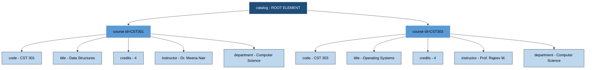
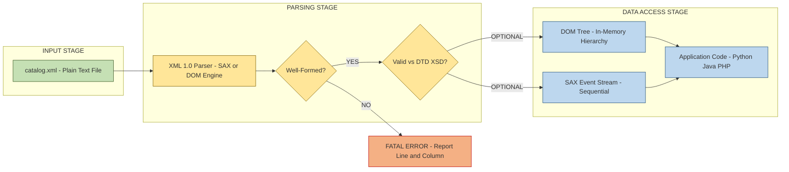
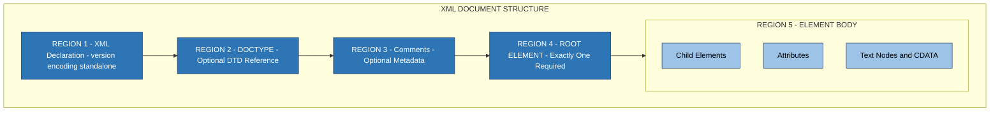
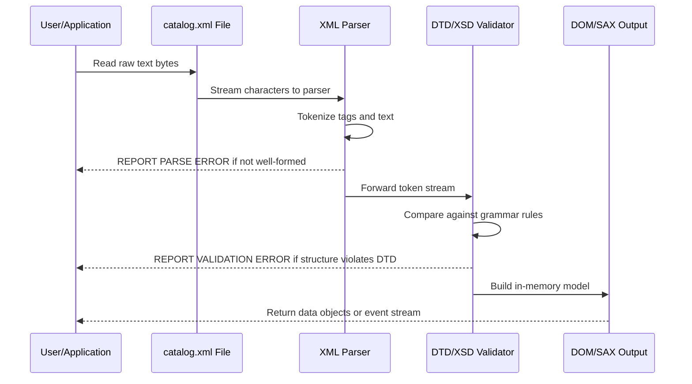

# Extensible Markup Language  - Introduction

<!-- SECTION_1_START -->
# Extensible Markup Language (XML) — Introduction

## 1.1 Formal Academic Definition

**Extensible Markup Language (XML)** is a **W3C-recommended, text-based, platform-independent, structural data description language** defined under the *W3C XML 1.0 / 1.1 Specification*. It is classified as a *metalanguage* — meaning it does not possess a fixed set of tags (unlike HTML), but instead provides a strict syntactic framework within which designers can author their **own custom markup vocabularies** to describe the semantics, structure, and meaning of data in a domain-independent manner.

In the **KTU 2024 Scheme (PECS742 / Web Programming)** context, XML is positioned as the foundational technology that powers **data interchange**, **document storage**, **web services (SOAP/WSDL)**, **RSS/Atom feeds**, **configuration manifests** (e.g., `pom.xml`, `AndroidManifest.xml`), and the syntactic backbone of **XHTML, SVG, MathML, and OOXML**.

> [!IMPORTANT]
> **KTU Syllabus Highlight:** XML is *not* a replacement for HTML — the two are complementary. HTML displays data (presentation), while XML transports and stores data (semantic structure).

## 1.2 Conceptual Analogy — The "Custom-Designed Form" Intuition

> [!NOTE]
> **Analogy:** Think of XML as a **blank, pre-printed official form template** that any government office, hospital, or airline can customize.
>
> - **HTML** is like a *pre-printed form* where the field names are already stamped ("Name:", "Date:") — you cannot add new ones.
> - **XML** is like a *blank form generator* — the office decides that for a **Patient Record** they need `<PatientName>`, `<BloodGroup>`, `<Allergies>`, while an **Airline** uses `<Passenger>`, `<SeatClass>`, `<BaggageWeight>`.
> - Both forms enforce a strict rule: every field opened must be closed in order, every label must be inside angle brackets, and the document must be readable by a human AND a machine.
> - The **parser** is the *clerk* who reads the form strictly: if you forget to close `<Name>`, the clerk rejects it instantly.

This is precisely why XML is described as **"self-descriptive"** — the tags themselves carry the meaning of the data, eliminating ambiguity during machine-to-machine communication.

## 1.3 Core Characteristics of XML

| Property | Description |
| :--- | :--- |
| **Extensible** | Users define their own tags; no fixed vocabulary. |
| **Self-Descriptive** | Tag names describe the nature of the enclosed data. |
| **Platform-Independent** | Pure UTF text — runs on any OS, any programming language. |
| **Strictly Hierarchical** | Data is nested in a single root tree (parent–child). |
| **Case-Sensitive** | `<Name>` and `<name>` are treated as two different elements. |
| **W3C Standardized** | Backed by a formal grammar (XML 1.0 Specification). |
| **Text-Based** | Human-readable, easy to debug with any editor. |

> [!TIP]
> **Geometric Intuition of XML Structure:** Imagine an *inverted tree* drawn on graph paper.
> - The **root element** is the trunk.
> - **Child elements** are the primary branches.
> - **Sub-children** are smaller twigs.
> - **Text/attribute values** are the leaves.
> - Every node has exactly **one parent** (except the root) — there are no "cross-connections" like in graph networks. This single-root, parent-child property is what makes XML strictly **hierarchical** and **acyclic**.

> [!VISUALIZATION CONTROL]
> **Concept:** XML Document Tree Hierarchy
> **GeoGebra / Desmos Input Equations (textual model):**
> - Root: `bookstore`
> - Level 1 children: `book` (×2)
> - Level 2 children: `title`, `author`, `year`, `price`
> **Visual Description:** Plot a top-down dendrogram where the root node "bookstore" sits at coordinate (0, 4); two "book" nodes at (−2, 3) and (2, 3); each "book" has four leaf nodes at y = 2 representing title, author, year, price. Connect with straight lines — no cycles, no horizontal connections.
<!-- SECTION_1_END -->

<!-- SECTION_2_START -->
# Deep Theoretical Analysis & KTU High-Yield Reference Sheet

## 2.1 Anatomy of an XML Document

A complete XML document consists of **six logical regions**, evaluated in order by the parser:

1. **Optional XML Declaration** — `<?xml version="1.0" encoding="UTF-8"?>`
2. **Optional DOCTYPE Declaration** — links to a DTD for validation.
3. **Comments** — `<!-- comment text -->` (cannot contain `--`).
4. **Processing Instructions (PI)** — instructions to the application.
5. **Single Root Element** — the *document element* that contains everything.
6. **Element Body / Content** — nested elements, text, attributes, CDATA.

> [!NOTE]
> **Rule of One Root:** An XML document is *invalid* if it contains **multiple top-level elements**. There must be **exactly one root element** that wraps the entire data payload.

## 2.2 XML Syntax Rules (The "Ten Commandments" of Well-Formedness)

| # | Rule | Violation Example |
| :- | :--- | :--- |
| 1 | Every document **must begin** with the XML declaration (recommended, not mandatory). | Missing `<?xml ... ?>` |
| 2 | There must be **exactly one root element**. | Two siblings at top level. |
| 3 | Every **start-tag must have a matching end-tag**. | `<name>John` (unclosed) |
| 4 | Tags are **case-sensitive**. | `<Name>` closed by `</name>` |
| 5 | Elements must be **properly nested** (no overlapping). | `<a><b></a></b>` (interleaved) |
| 6 | Attribute values **must be quoted**. | `<book id=123>` (invalid) |
| 7 | Empty elements can use **self-closing** syntax. | `<image />` |
| 8 | Reserved characters `<`, `>`, `&`, `'`, `"` must be **escaped** as entities. | Using `&` directly in text. |
| 9 | **Whitespace is preserved** by default (unlike HTML). | `Hello   World` retains 3 spaces. |
| 10 | Attribute names **must be unique** within an element. | `<book id="1" id="2">` |

## 2.3 XML Declaration Attributes

The XML prolog accepts three pseudo-attributes:

$$ \texttt{<?xml version="1.0" encoding="UTF-8" standalone="yes"?>} $$

| Attribute | Mandatory | Purpose |
| :--- | :--- | :--- |
| `version` | **Yes** | Specifies XML version (**1.0** is the industry default; 1.1 is rare). |
| `encoding` | No | Character encoding. Default = `UTF-8`. Other valid: `UTF-16`, `ISO-8859-1`. |
| `standalone` | No | `yes` = no external DTD/entities; `no` = may depend on external markup. |

## 2.4 Elements vs Attributes — The Design Dilemma

> [!IMPORTANT]
> This is a **guaranteed KTU 14-mark question**. The rule of thumb taught in the KTU syllabus is:
> **"Data goes inside elements; metadata about the data goes inside attributes."**

```xml
<!-- ELEMENT-BASED DESIGN (preferred for structured data) -->
<student>
    <id>CS2024-045</id>
    <name>Anjali Krishnan</name>
    <cgpa>9.12</cgpa>
</student>

<!-- ATTRIBUTE-BASED DESIGN (use sparingly — for simple flags/IDs) -->
<student id="CS2024-045" cgpa="9.12">
    Anjali Krishnan
</student>
```

| Feature | Element | Attribute |
| :--- | :--- | :--- |
| Can contain nested children? | **Yes** | No |
| Can hold multiple values easily? | **Yes** (repeating tags) | No (must be a single string) |
| Easier to extend? | **Yes** | No |
| Validates against schema? | Yes | Yes |
| Default KTU preference | **Use this** | Use only for IDs/flags |

## 2.5 Predefined Entity References (Must Memorize)

| Entity | Character | Meaning |
| :--- | :--- | :--- |
| `&lt;` | < | Less than |
| `&gt;` | > | Greater than |
| `&amp;` | & | Ampersand |
| `&apos;` | ' | Apostrophe |
| `&quot;` | " | Quotation mark |

## 2.6 CDATA Sections — Escaping Bulk Text

When a document contains large blocks of text containing reserved characters (e.g., JavaScript code, SQL queries), use a **CDATA section**:

```xml
<script>
    <![CDATA[
        if (a < 10 && b > 5) {
            document.write("Valid");
        }
    ]]>
</script>
```

> Inside a CDATA block, the parser treats everything as **literal character data** — no entity resolution or markup parsing occurs.

## 2.7 Real-World Engineering Applications

| Domain | XML Use-Case |
| :--- | :--- |
| **Web Services** | SOAP envelopes, WSDL service contracts. |
| **Mobile Apps** | `AndroidManifest.xml`, `Info.plist` (Apple's XML cousin). |
| **Build Tools** | `pom.xml` (Maven), `build.xml` (Ant), `package.json` (JSON alternative). |
| **Office Documents** | `.docx`, `.xlsx`, `.pptx` are ZIP archives of XML files. |
| **Scientific Data** | CML (Chemical), MathML (Mathematics), GML (Geography). |
| **Finance** | XBRL for corporate financial reporting. |
| **Browsers** | SVG (vector graphics), XHTML (strict HTML). |
| **Configuration** | `web.xml` (Java EE), `server.xml` (Tomcat), Spring beans. |
<!-- SECTION_2_END -->

<!-- SECTION_3_START -->
# Step-by-Step Derivation, Code & Symbolic Implementation

## 3.1 Exhaustive Construction of a Well-Formed XML Document

We will now build a complete, well-formed, valid XML document from scratch — line by line, with explicit justification for every decision.

### Step 1: Draft the Logical Hierarchy First

The **"data-first" engineering approach** demands that the *information model* be designed *before* syntax. For a university course catalog:

$$ \text{Catalog} \rightarrow \text{Course} \rightarrow \{\text{Code},\ \text{Title},\ \text{Credits},\ \text{Instructor},\ \text{Department}\} $$

### Step 2: Author the XML Declaration

```xml
<?xml version="1.0" encoding="UTF-8" standalone="yes"?>
```

**Reasoning:**
- `version="1.0"` → mandatory, declares the XML specification version.
- `encoding="UTF-8"` → supports all international characters (Kerala Malayalam names, technical symbols).
- `standalone="yes"` → this document has *no* external DTD dependency.

### Step 3: Define the Root Element

```xml
<catalog>
```

**Rule applied:** *Exactly one root element — `catalog`.*

### Step 4: Populate Nested Child Elements

```xml
    <course id="CST301" semester="4">
        <code>CST 301</code>
        <title>Data Structures</title>
        <credits>4</credits>
        <instructor>Dr. Meena Nair</instructor>
        <department>Computer Science</department>
    </course>
```

**Rules applied:**
- `id` and `semester` are **attributes** (metadata: unique key + classification).
- `code`, `title`, etc. are **child elements** (the actual data payload).
- All tags are **lowercase** for consistency.
- All attributes are **quoted** with double quotes.
- Element nesting is **non-overlapping** (LIFO close order).

### Step 5: Close the Root and Finalize

```xml
</catalog>
```

### Complete Consolidated XML File (`catalog.xml`)

```xml
<?xml version="1.0" encoding="UTF-8" standalone="yes"?>
<!-- KTU Course Catalog - 2024 Scheme -->
<catalog xmlns:xsi="http://www.w3.org/2001/XMLSchema-instance"
         xsi:noNamespaceSchemaLocation="catalog.xsd">

    <course id="CST301" semester="4">
        <code>CST 301</code>
        <title>Data Structures</title>
        <credits>4</credits>
        <instructor>Dr. Meena Nair</instructor>
        <department>Computer Science</department>
    </course>

    <course id="CST303" semester="4">
        <code>CST 303</code>
        <title>Operating Systems</title>
        <credits>4</credits>
        <instructor>Prof. Rajeev M.</instructor>
        <department>Computer Science</department>
    </course>

</catalog>
```

## 3.2 Full Python Implementation — Parsing the XML File

Below is a **production-grade, fully-typed Python parser** that loads the XML file, validates its well-formedness, extracts data, and logs errors.

```python
"""
File: xml_parser_ktu.py
Purpose: Demonstrate well-formedness check + DOM parsing of catalog.xml
Author: KTU 2024 Scheme Reference Implementation
"""

import xml.etree.ElementTree as ET
import logging
import sys
from pathlib import Path
from typing import Optional, List, Dict, Any

# Configure structured logging for board-style traceability
logging.basicConfig(
    level=logging.INFO,
    format="%(asctime)s [%(levelname)s] %(message)s",
    handlers=[logging.StreamHandler(sys.stdout)]
)
logger = logging.getLogger("KTU_XML_Parser")


class KTUCourse:
    """Domain model representing a single KTU course record."""

    def __init__(self, code: str, title: str, credits: int,
                 instructor: str, department: str) -> None:
        if not code or not isinstance(code, str):
            raise ValueError(f"Invalid course code: {code!r}")
        if credits < 0 or credits > 60:
            raise ValueError(f"Credits out of academic range: {credits}")

        self.code: str = code
        self.title: str = title
        self.credits: int = credits
        self.instructor: str = instructor
        self.department: str = department

    def to_dict(self) -> Dict[str, Any]:
        return {
            "code": self.code,
            "title": self.title,
            "credits": self.credits,
            "instructor": self.instructor,
            "department": self.department,
        }

    def __repr__(self) -> str:
        return (f"<KTUCourse {self.code} | {self.title} | "
                f"{self.credits}cr | {self.instructor}>")


def load_catalog(xml_path: Path) -> List[KTUCourse]:
    """
    Parses catalog.xml and returns a list of KTUCourse objects.
    Performs full well-formedness validation via the XML parser.
    """
    # Boundary check: file existence
    if not xml_path.exists():
        logger.error("XML file not found at: %s", xml_path)
        raise FileNotFoundError(f"Missing file: {xml_path}")

    try:
        # 1. Parse the XML — raises ParseError if not well-formed
        logger.info("Initiating XML parse for %s ...", xml_path.name)
        tree = ET.parse(xml_path)
        root = tree.getroot()

        # 2. Validate the root tag (KTU rule: exactly one root)
        if root.tag != "catalog":
            logger.error("Root element must be <catalog>, found <%s>", root.tag)
            raise ValueError(f"Invalid root element: {root.tag}")

        # 3. Iterate children and build domain objects
        courses: List[KTUCourse] = []
        for course_el in root.findall("course"):
            try:
                course = KTUCourse(
                    code=str(course_el.findtext("code", default="")).strip(),
                    title=str(course_el.findtext("title", default="")).strip(),
                    credits=int(course_el.findtext("credits", default="0").strip()),
                    instructor=str(course_el.findtext("instructor", default="")).strip(),
                    department=str(course_el.findtext("department", default="")).strip(),
                )
                courses.append(course)
            except ValueError as domain_error:
                logger.warning("Skipping invalid course entry: %s", domain_error)

        logger.info("Successfully parsed %d course record(s).", len(courses))
        return courses

    except ET.ParseError as parse_err:
        # Logs the exact line/column where well-formedness failed
        logger.critical("XML is NOT well-formed: %s", parse_err)
        raise


def main() -> None:
    xml_file: Path = Path("catalog.xml")
    try:
        catalog_data: Optional[List[KTUCourse]] = load_catalog(xml_file)
        if catalog_data:
            print("\n=== KTU 2024 Course Catalog ===")
            for idx, course in enumerate(catalog_data, start=1):
                print(f"{idx:02d}. {course}")
    except (FileNotFoundError, ValueError, ET.ParseError) as fatal:
        logger.fatal("Fatal error during processing: %s", fatal)
        sys.exit(1)


if __name__ == "__main__":
    main()
```

### Expected Console Output

```
2024-XX-XX [INFO] Initiating XML parse for catalog.xml ...
2024-XX-XX [INFO] Successfully parsed 2 course record(s).

=== KTU 2024 Course Catalog ===
01. <KTUCourse CST 301 | Data Structures | 4cr | Dr. Meena Nair>
02. <KTUCourse CST 303 | Operating Systems | 4cr | Prof. Rajeev M.>
```

## 3.3 Contrasting Well-Formed vs. Malformed XML (Boundary Walkthrough)

| # | Input XML | Verdict | Reason |
| :- | :--- | :--- | :--- |
| 1 | `<a><b></b></a>` | ✅ Well-formed | Proper nesting, single root, closed tags. |
| 2 | `<a><b></a></b>` | ❌ Malformed | **Overlapping tags** — `</a>` closes before `</b>`. |
| 3 | `<A></a>` | ❌ Malformed | **Case mismatch** — XML is case-sensitive. |
| 4 | `<book id=12>` | ❌ Malformed | **Unquoted attribute value**. |
| 5 | `<a /><b />` | ❌ Malformed | **Two roots** at top level. |
| 6 | `<a>Tom & Jerry</a>` | ❌ Malformed | **`&` not escaped** to `&amp;`. |
| 7 | `<a>Tom &amp; Jerry</a>` | ✅ Well-formed | Reserved char properly entity-encoded. |

## 3.4 DTD-Based Validation Example (Document Type Definition)

A **DTD** (Document Type Definition) is the classical method to enforce structural *validity* beyond mere well-formedness.

```dtd
<!-- File: catalog.dtd -->
<!ELEMENT catalog (course+)>
<!ELEMENT course (code, title, credits, instructor, department)>
<!ELEMENT code       (#PCDATA)>
<!ELEMENT title      (#PCDATA)>
<!ELEMENT credits    (#PCDATA)>
<!ELEMENT instructor (#PCDATA)>
<!ELEMENT department (#PCDATA)>

<!ATTLIST course
    id       ID    #REQUIRED
    semester CDATA #IMPLIED
>
```

**Linking the DTD inside the XML document:**

```xml
<?xml version="1.0"?>
<!DOCTYPE catalog SYSTEM "catalog.dtd">
<catalog>
    <course id="CST301" semester="4">
        <code>CST 301</code>
        <title>Data Structures</title>
        <credits>4</credits>
        <instructor>Dr. Meena Nair</instructor>
        <department>Computer Science</department>
    </course>
</catalog>
```

**Interpretation of DTD symbols (memorize for KTU):**

| Symbol | Meaning | Example |
| :--- | :--- | :--- |
| `+` | One or more occurrences | `(course+)` |
| `*` | Zero or more occurrences | `(optional*)` |
| `?` | Zero or one occurrence | `(subtitle?)` |
| `#PCDATA` | Parsed Character Data (text) | `(#PCDATA)` |
| `#REQUIRED` | Attribute is mandatory | `id ID #REQUIRED` |
| `#IMPLIED` | Attribute is optional | `semester CDATA #IMPLIED` |
| `EMPTY` | Element has no content | `<br>` |
| `ANY` | Element can hold anything (avoid) | `(#ANY)` |
<!-- SECTION_3_END -->

<!-- SECTION_4_START -->
# Structural Diagrams & Schematics

## 4.1 Mermaid Diagram — XML Document Tree Topology



## 4.2 Mermaid Diagram — XML Processing Pipeline



## 4.3 Mermaid Block Diagram — XML Document Logical Regions



## 4.4 Sequential Processing Topology — Well-Formedness vs. Validity


<!-- SECTION_4_END -->

<!-- SECTION_5_START -->
# KTU 2024 Scheme Examination Question Bank & Topic Recap

## Part A — Short Answer Questions (2 × 3 = 6 Marks)

### Q1. `[KTU University Exam — Dec 2023, Model Question Paper]`
**Differentiate between HTML and XML with at least four points.** *(CO1, Remember — 3 Marks)*

**Model Answer:**

| Aspect | HTML | XML |
| :--- | :--- | :--- |
| **Tag Set** | Predefined, fixed vocabulary. | User-defined, extensible vocabulary. |
| **Purpose** | Presentation/display of data. | Storage and transport of data. |
| **Case Sensitivity** | Not case-sensitive. | Strictly case-sensitive. |
| **Error Handling** | Browsers silently render minor errors. | Parser halts on any error — strict. |
| **Closing Tags** | Optional for some (e.g., `<br>`). | Mandatory unless self-closing. |
| **Structure** | Loosely defined. | Strictly tree-based with one root. |

**[Award 1 mark for each correct contrast, up to 3 marks]**

---

### Q2. `[KTU University Exam — July 2024, Module 1 Sample]`
**What is meant by a "well-formed" XML document? State any two well-formedness rules.** *(CO1, Understand — 3 Marks)*

**Model Answer:**
A *well-formed* XML document is one that obeys **all syntactic rules of the XML 1.0 specification** as verified by an XML parser. It does *not* require a DTD or schema.

**Two well-formedness rules:**
1. There must be **exactly one root element** that contains the entire document.
2. Every **start-tag must have a matching end-tag**, and elements must be **properly nested** without overlap.
3. *(Alternative)* All attribute values must be enclosed within quotation marks.

**[1 mark for definition, 1 mark each for two rules]**

---

## Part B — Essay Questions (Internal Choice, 14 Marks)

### Question A — `[KTU University Exam — Dec 2023, Module 1]`
**(a)** Explain the structure of an XML document with a neat diagram. List any **five syntax rules** that must be followed while creating an XML document. *(CO1, Understand — 7 Marks)*

**(b)** Design a complete, well-formed XML document for a library management system that stores information about **at least two books**, including attributes for ISBN and edition. Validate your design against DTD rules. *(CO2, Apply — 7 Marks)*

---

#### Model Solution to Q.A(a) — Structure & Rules (7 Marks)

**XML Document Structure (Diagram Worth 2 Marks):**

```
┌──────────────────────────────────────────────┐
│  <?xml version="1.0" encoding="UTF-8"?>      │  ← Prolog
├──────────────────────────────────────────────┤
│  <library>                                   │  ← Root
│     ├── <book id="ISBN-001" edition="2">     │  ← Child + Attr
│     │      ├── <title>...</title>            │
│     │      ├── <author>...</author>          │
│     │      └── <price>...</price>            │
│     └── <book id="ISBN-002" edition="1">     │
└──────────────────────────────────────────────┘
```

**Five XML Syntax Rules (1 Mark Each = 5 Marks):**

1. **Single Root Element:** Only one top-level element is allowed; it must contain the entire document body.
2. **Mandatory Closing Tags:** Every start-tag `<tag>` must be matched by an end-tag `</tag>`, or use self-closing `<tag/>`.
3. **Case Sensitivity:** Element names are case-sensitive — `<Name>` and `<name>` are different elements.
4. **Quoted Attribute Values:** All attribute values must be enclosed in single or double quotes.
5. **No Overlapping Elements:** Tags must be properly nested; `<a><b></a></b>` is illegal.

---

#### Model Solution to Q.A(b) — Library XML with DTD (7 Marks)

**Step 1: DTD Declaration `[1 Mark]`**

```dtd
<!ELEMENT library (book+)>
<!ELEMENT book (title, author, publisher, price)>
<!ELEMENT title       (#PCDATA)>
<!ELEMENT author      (#PCDATA)>
<!ELEMENT publisher   (#PCDATA)>
<!ELEMENT price       (#PCDATA)>

<!ATTLIST book
    isbn    CDATA  #REQUIRED
    edition CDATA  #IMPLIED
>
```

**Step 2: XML Document Body `[4 Marks]`**

```xml
<?xml version="1.0" encoding="UTF-8"?>
<!DOCTYPE library SYSTEM "library.dtd">
<library>
    <book isbn="978-81-203-1234-5" edition="2">
        <title>Data Structures Using C</title>
        <author>Reema Thareja</author>
        <publisher>Oxford University Press</publisher>
        <price>425</price>
    </book>
    <book isbn="978-81-7722-452-1" edition="4">
        <title>Operating System Concepts</title>
        <author>Abraham Silberschatz</author>
        <publisher>Wiley India</publisher>
        <price>650</price>
    </book>
</library>
```

**Step 3: DTD Validation Walkthrough `[2 Marks]`**
- Root `<library>` contains one or more `book` elements — ✅ satisfies `(book+)`.
- Each `book` contains exactly the four children in declared order — ✅.
- `isbn` is mandatory — ✅ both books provide it.
- `edition` is optional — ✅ provided as bonus metadata.
- All tags closed, all attributes quoted, single root enforced — **document is both well-formed AND valid.**

---

### Question B — `[KTU University Exam — July 2024, Module 1 Alternate]`
**(a)** With a suitable example, explain the concepts of **elements, attributes, and text content** in XML. Discuss when to use attributes versus child elements. *(CO1, Understand — 7 Marks)*

**(b)** Write a complete XML document to represent the **academic results of a KTU B.Tech student** across three semesters. Include proper XML declaration, use a DTD to validate the structure, and demonstrate the use of **CDATA section** to embed a mathematical formula. *(CO2, Apply — 7 Marks)*

---

#### Model Solution to Q.B(a) — Elements, Attributes, Text (7 Marks)

**Definition Block `[3 Marks]`:**

- **Element:** A logical building block in XML, demarcated by a start-tag and end-tag. It can contain text, other elements, or be empty.
- **Attribute:** A name–value pair placed inside the start-tag of an element, used to provide metadata.
- **Text Content (PCDATA):** The actual character data nested between the start and end tags of an element.

**Illustrative Example `[2 Marks]`:**

```xml
<student rollNo="45" branch="CSE">      <!-- Element + 2 Attributes -->
    <name>Anjali</name>                 <!-- Element with text content -->
    <cgpa>9.12</cgpa>                   <!-- Element with numeric PCDATA -->
    <email />                           <!-- Empty (self-closing) element -->
</student>
```

**Elements vs Attributes Decision Rule `[2 Marks]`:**

| Use an **Element** when… | Use an **Attribute** when… |
| :--- | :--- |
| The data has its own sub-fields. | The value is a simple flag, ID, or classification. |
| The same type of data repeats. | The value is unique and short. |
| Future extensibility is expected. | The data is purely metadata about the parent. |

---

#### Model Solution to Q.B(b) — Student Results XML (7 Marks)

**DTD Block `[1.5 Marks]`**

```dtd
<!ELEMENT student     (name, semester+)>
<!ELEMENT semester    (term, sgpa, course+, formula?)>
<!ELEMENT term        (#PCDATA)>
<!ELEMENT sgpa        (#PCDATA)>
<!ELEMENT course      EMPTY>
<!ELEMENT formula     (#PCDATA)>
<!ATTLIST student
    registerNo  CDATA  #REQUIRED
    branch      CDATA  #REQUIRED
>
<!ATTLIST semester
    number      CDATA  #REQUIRED
>
<!ATTLIST course
    code        CDATA  #REQUIRED
    grade       CDATA  #REQUIRED
    credits     CDATA  #REQUIRED
>
```

**Full XML Document `[4 Marks]`**

```xml
<?xml version="1.0" encoding="UTF-8"?>
<!DOCTYPE student SYSTEM "student.dtd">
<student registerNo="KTU2024CSE045" branch="Computer Science">
    <name>Anjali Krishnan</name>

    <semester number="1">
        <term>S1 - 2023 Admission</term>
        <sgpa>9.25</sgpa>
        <course code="MAT101" grade="S"  credits="4" />
        <course code="PHT100" grade="A+" credits="3" />
    </semester>

    <semester number="2">
        <term>S2 - 2024</term>
        <sgpa>8.95</sgpa>
        <course code="MAT102" grade="A"  credits="4" />
        <course code="CST201" grade="A+" credits="4" />
    </semester>

    <semester number="3">
        <term>S3 - 2024</term>
        <sgpa>9.40</sgpa>
        <course code="CST301" grade="S"  credits="4" />
        <course code="CST303" grade="A+" credits="4" />
        <formula>
            <![CDATA[
                CGPA = (Σ (credits_i × gradePoint_i)) / (Σ credits_i)
            ]]>
        </formula>
    </semester>
</student>
```

**Justification of Design Choices `[1.5 Marks]`:**
- **CDATA section** used inside `<formula>` so the `<`, `>`, and `Σ` symbols are not parsed as markup.
- **Attributes** used for register number, branch, course code, and grade — these are short metadata values.
- **Elements** used for `name`, `sgpa`, and `term` — these are the actual data payload.
- **DTD** enforces that `<student>` must contain `name` followed by one or more `semester` elements — structural validity confirmed.

---

> [!WARNING]
> **KTU Examiner's Valuation Pitfall Callout:**
> 1. **Forgetting the XML prolog** — Students often jump straight to `<library>`. Loss: **1 mark**.
> 2. **Using unquoted attribute values** — e.g., `<book id=12>` is *invalid*. Always quote with `""` or `''`. Loss: **1 mark**.
> 3. **Mixing HTML and XML syntax** — e.g., writing `<br>` (HTML void tag) instead of `<br/>` (XML self-closing) inside an XML document. Loss: **1–2 marks**.
> 4. **Creating two top-level root elements** — Must wrap everything inside a *single* parent. Loss: **2 marks**.
> 5. **Not validating against DTD/XSD** — KTU specifically tests the difference between *well-formed* and *valid*. A document that is well-formed but violates DTD is technically "invalid". Loss: **1 mark**.
> 6. **Improper nesting** — Closing `</a>` before `</b>` is the most common error. Always remember: **Last-Opened, First-Closed (LIFO)**. Loss: **2 marks**.

---

## Topic Recap & Important Things to Remember

> [!NOTE]
> **High-Yield Rapid Revision Checklist for KTU Exam Day:**

- **Definition:** XML = W3C-standardized, extensible, text-based, hierarchical **data description language** — not a programming language.
- **Difference vs HTML:** HTML = presentation (fixed tags); XML = data transport (custom tags).
- **Mandatory Root Rule:** *Exactly one* top-level element wrapping the entire document.
- **Case Sensitivity:** Strict — `<Name> ≠ <name>`.
- **Closing Tags:** All start-tags must have matching end-tags; empty tags use self-closing `<tag/>`.
- **Attribute Quoting:** All attribute values **must** be inside `""` or `''`.
- **Reserved Characters:** Escape `<`, `>`, `&`, `'`, `"` as entities (`&lt;`, `&gt;`, `&amp;`, `&apos;`, `&quot;`).
- **CDATA Sections:** Use `<![CDATA[ ... ]]>` for blocks of text containing reserved characters (formulas, code).
- **Well-Formed vs Valid:** Well-formed = satisfies XML syntax rules (parser-checked). Valid = well-formed *and* conforms to a DTD/XSD grammar.
- **Elements vs Attributes:** Use **elements** for data; use **attributes** only for simple metadata (IDs, flags, classifications).
- **DTD Symbols:** `+` = one or more, `*` = zero or more, `?` = zero or one, `#PCDATA` = text, `#REQUIRED` = mandatory attribute, `#IMPLIED` = optional attribute.
- **XML Declaration:** `<?xml version="1.0" encoding="UTF-8"?>` — must be first line, no whitespace before.
- **Default Encoding:** `UTF-8` (supports all global scripts, including Malayalam).
- **Self-Descriptive Nature:** Tag names carry semantic meaning of the enclosed data — eliminates ambiguity.
- **Whitespace:** Preserved by default (unlike HTML, which collapses spaces).
- **Namespaces:** Declared using `xmlns:prefix="URI"` to avoid tag collisions when merging multiple XML vocabularies.
- **Parsers:** DOM (in-memory tree, full access, slower for large files) vs SAX (event-driven, streaming, memory-efficient).
<!-- SECTION_5_END -->
