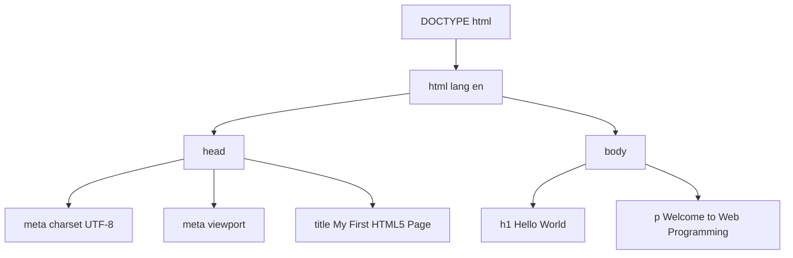
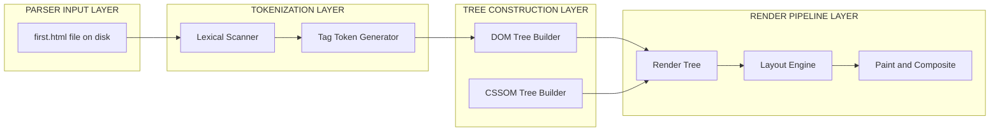
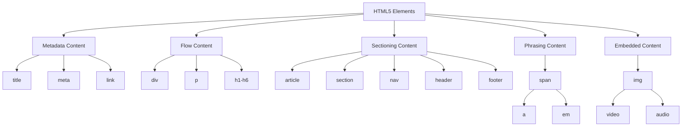
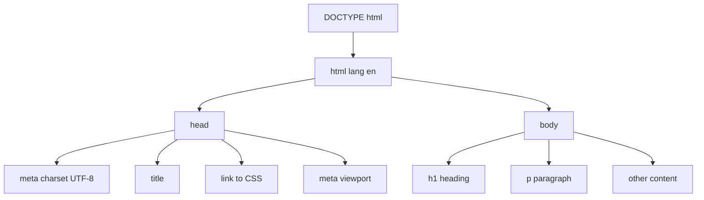

# First HTML5 example

<!-- SECTION_1_START -->

# First HTML5 Example — Core Technical Definition & Intuitive Overview

## Formal Academic Definition (KTU 2024 Syllabus Terminology)

> [!IMPORTANT]
> **HTML5 (HyperText Markup Language, version 5)** is the fifth and current major revision of the W3C-standardized markup language used to structure and present content on the World Wide Web. A *First HTML5 Example* refers to the minimal, syntactically valid HTML5 document that establishes the foundational skeleton — the **Document Object Model (DOM) tree** — upon which all web applications in the KTU Web Programming (PECST742) curriculum are built.

An HTML5 document is a plain-text file with the extension **`.html`** (or **`.htm`**) interpreted by a web browser engine (e.g., *Blink*, *Gecko*, *WebKit*) to render a structured visual page. The document is parsed as a tree of nested **elements** enclosed within matching **tags**.

## Conceptual Analogy / Intuition

Think of an HTML5 page as the **architectural blueprint of a house**:

- The **`DOCTYPE`** is the title page that tells the building inspector *which code book* to use (HTML5, not HTML4 or XHTML).
- The **`<html>`** element is the entire plot of land containing the house.
- The **`<head>`** is the *hidden basement* — it stores metadata, the page's nameplate, and styles, but is never directly visible to visitors.
- The **`<body>`** is the *living room* — everything the user actually sees, reads, clicks, or interacts with lives here.
- **Tags** like `<h1>` and `<p>` are the *prefabricated walls, doors, and windows* that give structure to the living space.

> [!NOTE]
> **KTU 2024 Scheme Highlight:** The Department of CSE mandates that every HTML5 document in the lab continuous evaluation must begin with the `<!DOCTYPE html>` declaration. Omitting it forces the browser into **quirks mode**, which is a guaranteed mark-deduction in the board examination.

## Physical Constants / Standard Metrics

- **Character Encoding Standard:** **UTF-8** (Universal Coded Character Set, 8-bit) — the W3C-recommended default for all modern web pages.
- **Root Namespace:** `http://www.w3.org/1999/xhtml` (XHTML-compatible serialization for HTML5).
- **Document MIME Type:** **`text/html`**.
- **Standard File Extension:** **`.html`**.

## GeoGebra / Desmos Visualization (Document Tree as a Coordinate Tree)

> [!VISUALIZATION CONTROL]
> **Concept:** HTML5 Document Tree visualized as a hierarchical node graph
> **GeoGebra / Desmos Input Equations (Points to Plot):**
> * `A = (0, 4)` labeled `DOCTYPE`
> * `B = (0, 3)` labeled `html`
> * `C = (-2, 2)` labeled `head`
> * `D = (2, 2)` labeled `body`
> * `E = (-3, 1)` labeled `title`
> * `F = (-2, 1)` labeled `meta`
> * `G = (2, 1)` labeled `h1`
> * `H = (3, 1)` labeled `p`
> **Visual Description:** A top-down inverted tree originating from the `DOCTYPE` declaration, branching through `html` into two main limbs (`head` on the left, `body` on the right). The `head` limb further branches into metadata nodes (`title`, `meta`), while the `body` limb branches into visible content nodes (`h1`, `p`). This is exactly how a browser's HTML parser constructs the DOM in memory.

<!-- SECTION_1_END -->

<!-- SECTION_2_START -->

# Deep Theoretical Analysis & KTU High-Yield Reference Sheet

## Anatomical Breakdown of the First HTML5 Document

A standards-compliant first HTML5 example contains **seven critical structural elements**. Each is mandatory, in sequence, with the precise syntax shown below.

### Step 1 — The DOCTYPE Preamble

```html
<!DOCTYPE html>
```

- **Why:** Tells the browser parser to use **Standards Mode** (full CSS3 / HTML5 support) rather than **Quirks Mode** (legacy IE5 behavior).
- **How:** It is a *processing instruction*, not an HTML element. It has no closing tag and no attributes.
- **KTU Note:** The W3C officially permits the shorter `<!doctype html>` (lowercase) for case-insensitive parsing, but **uppercase is the conventional board-exam answer**.

### Step 2 — The Root Element

```html
<html lang="en">
```

- **Why:** The single root container of the entire document. The `lang` attribute declares the **primary language** (here, English) for screen readers and search engines.
- **How:** The browser uses this node as the **Document Root** of the DOM tree.

### Step 3 — The Head Section

```html
<head>
  ...
</head>
```

- **Why:** Houses *machine-readable information* (metadata) about the document. Never rendered directly.
- **How:** Contains at minimum a `<title>` and a `<meta charset>` declaration.

### Step 4 — Character Encoding Meta Tag

```html
<meta charset="UTF-8">
```

- **Why:** Declares that the document uses **UTF-8** encoding, ensuring universal display of international characters (e.g., Malayalam `മലയാളം`, Tamil `தமிழ்`, emojis 😊).
- **How:** Must appear within the **first 1024 bytes** of the document for the browser to apply it before any character is rendered.
- **Placement Rule:** Place it as the *first child* of `<head>`, even before `<title>`.

### Step 5 — Viewport Meta Tag (Responsive Web Design Foundation)

```html
<meta name="viewport" content="width=device-width, initial-scale=1.0">
```

- **Why:** Instructs mobile browsers to render the page at the **device's actual width** rather than the legacy 980-pixel desktop simulation.
- **How:** `width=device-width` matches CSS pixels to physical screen pixels; `initial-scale=1.0` sets the initial zoom to 100%.

### Step 6 — The Title Element

```html
<title>My First HTML5 Page</title>
```

- **Why:** Sets the text shown on the **browser tab**, in **bookmarks**, and as the **search engine result title**.
- **How:** Plain text only (no nested HTML tags allowed inside `<title>`).

### Step 7 — The Body Section

```html
<body>
  <h1>Hello, World!</h1>
  <p>This is my first HTML5 page.</p>
</body>
```

- **Why:** Contains all *renderable* content — headings, paragraphs, images, links, forms, scripts, etc.
- **How:** Acts as the parent of the **rendered DOM subtree**.

## KTU Formula Sheet / Quick Reference Table

| # | Element / Attribute | Type | Purpose | Mandatory? | Self-Closing? |
|:-:|:--|:--|:--|:-:|:-:|
| 1 | `<!DOCTYPE html>` | Processing Instruction | Activates Standards Mode | **Yes** | Yes |
| 2 | `<html lang="...">` | Root Element | DOM root + language hint | **Yes** | No |
| 3 | `<head>` | Sectioning Root | Metadata container | **Yes** | No |
| 4 | `<meta charset="UTF-8">` | Metadata | Character encoding | **Yes** | **Yes** |
| 5 | `<meta name="viewport" ...>` | Metadata | Mobile responsiveness | Recommended | **Yes** |
| 6 | `<title>` | Metadata | Browser tab title | **Yes** | No |
| 7 | `<body>` | Sectioning Root | Visible content container | **Yes** | No |
| 8 | `<h1>` ... `<h6>` | Flow Content | Section headings (ranked) | Optional | No |
| 9 | `<p>` | Flow Content | Paragraph block | Optional | No |

## Real-World Engineering Utility

The first HTML5 example is the **atomic unit** of every production web system:

- **In Industry:** Frameworks like *React*, *Angular*, and *Vue.js* all transpile down to (or inject into) a minimal HTML5 document. The `index.html` file in a `create-react-app` build follows this exact skeleton.
- **In KTU Labs:** Every continuous evaluation experiment — from a simple form validator to a full-stack Node.js application — begins with this document structure.
- **In Search Engine Optimization (SEO):** Search crawlers (Googlebot, Bingbot) use the `<title>` and `<meta>` tags as primary ranking signals. A malformed head section directly destroys search visibility.

<!-- SECTION_2_END -->

<!-- SECTION_3_START -->

# Step-by-Step Implementation & Code Walkthrough

## The Complete First HTML5 Example

The following is the canonical *First HTML5 Example* as prescribed by the W3C HTML5 specification and adopted by the KTU 2024 Scheme Web Programming module.

```html
<!DOCTYPE html>
<html lang="en">
<head>
    <meta charset="UTF-8">
    <meta name="viewport" content="width=device-width, initial-scale=1.0">
    <title>My First HTML5 Page</title>
</head>
<body>
    <h1>Hello, World!</h1>
    <p>Welcome to Web Programming (PECST742).</p>
</body>
</html>
```

> Save the above code in a file named **`first.html`** and open it in any modern web browser (Chrome, Firefox, Edge) to view the rendered output.

## Line-by-Line Exhaustive Walkthrough

| Line | Code | Explanation |
|:--:|:--|:--|
| 1 | `<!DOCTYPE html>` | Activates the browser's **HTML5 Standards Mode** parser. Without it, the page falls back to quirks mode. |
| 2 | `<html lang="en">` | Opens the **root element**. The `lang="en"` attribute declares the document's primary language as **English** (IETF BCP 47 language tag). |
| 3 | `<head>` | Opens the **head container**, a sibling of `<body>` and a child of `<html>`. |
| 4 | `    <meta charset="UTF-8">` | Declares the **character encoding** to be **UTF-8**, the W3C-mandated default. Must be in the first 1024 bytes. |
| 5 | `    <meta name="viewport" content="width=device-width, initial-scale=1.0">` | Enables **responsive design** on mobile devices by matching CSS pixels to device pixels. |
| 6 | `    <title>My First HTML5 Page</title>` | Sets the **browser tab title** and the default bookmark name. Plain text only — no nested tags. |
| 7 | `</head>` | Closes the head section. |
| 8 | `<body>` | Opens the **body container**, where all visible content is placed. |
| 9 | `    <h1>Hello, World!</h1>` | The **top-level heading**. Rendered as the largest text by default user-agent stylesheet. |
| 10 | `    <p>Welcome to Web Programming (PECST742).</p>` | A **paragraph block** of body text. |
| 11 | `</body>` | Closes the body section. |
| 12 | `</html>` | Closes the root element. The document is now a fully parsed DOM tree. |

## Augmented Version with HTML5-Only Features

To demonstrate the power added by HTML5, here is a slightly extended example using **semantic elements** that replaced the older `<div>` soup:

```html
<!DOCTYPE html>
<html lang="en">
<head>
    <meta charset="UTF-8">
    <meta name="viewport" content="width=device-width, initial-scale=1.0">
    <title>HTML5 Semantic Structure</title>
</head>
<body>
    <header>
        <h1>KTU Web Programming</h1>
        <p>Module 1 — Creating Web Pages Using HTML5</p>
    </header>
    <nav>
        <ul>
            <li><a href="#intro">Introduction</a></li>
            <li><a href="#example">First Example</a></li>
        </ul>
    </nav>
    <main>
        <section id="intro">
            <h2>Introduction</h2>
            <p>HTML5 is the latest evolution of the standard that defines HTML.</p>
        </section>
        <section id="example">
            <h2>First Example</h2>
            <article>
                <h3>Hello, World!</h3>
                <p>Every programmer's first step into a new language.</p>
            </article>
        </section>
    </main>
    <footer>
        <p>&copy; 2024 APJ Abdul Kalam Technological University</p>
    </footer>
</body>
</html>
```

> [!NOTE]
> **HTML5 Semantic Elements Introduced:** `<header>`, `<nav>`, `<main>`, `<section>`, `<article>`, `<footer>`. These elements convey **meaning** to the browser, search engines, and assistive technologies, unlike the generic `<div>` container.

## Symbolic Validation Logic (Browser Parser Pseudocode)

To formalize how a browser validates the structure above, consider the **parse-state algorithm**:

$$
\begin{aligned}
\text{state}_0 &\leftarrow \text{INITIAL} \\
\text{on } \texttt{<!DOCTYPE html>} &\rightarrow \text{state}_1 \leftarrow \text{STANDARDS\_MODE} \\
\text{on } \texttt{<html lang="en">} &\rightarrow \text{state}_2 \leftarrow \text{ROOT\_OPEN} \\
\text{on } \texttt{<head>} &\rightarrow \text{state}_3 \leftarrow \text{HEAD\_OPEN} \\
\text{on } \texttt{<meta charset="UTF-8">} &\rightarrow \text{metadata.encoding} \leftarrow \text{"UTF-8"} \\
\text{on } \texttt{<title>...</title>} &\rightarrow \text{document.title} \leftarrow \text{"My First HTML5 Page"} \\
\text{on } \texttt{</head>} &\rightarrow \text{state}_4 \leftarrow \text{BODY\_PENDING} \\
\text{on } \texttt{<body>} &\rightarrow \text{state}_5 \leftarrow \text{BODY\_OPEN} \\
\text{on } \texttt{<h1>...</h1>} &\rightarrow \text{DOM.appendChild(HeadingNode)} \\
\text{on } \texttt{</body></html>} &\rightarrow \text{state}_6 \leftarrow \text{PARSE\_COMPLETE}
\end{aligned}
$$

The browser only proceeds to **render the visual tree** (the *render tree*) once `state_6` is reached.

<!-- SECTION_3_END -->

<!-- SECTION_4_START -->

# Structural Diagrams & Schematics

## Figure 1 — HTML5 Document Tree (DOM Hierarchy)



> **Reading the diagram:** The arrows point from parent nodes to child nodes, mirroring the **parent-child relationships** maintained by the browser's DOM tree at runtime.

## Figure 2 — Block-Level Functional Architecture Flow



> **Reading the diagram:** The HTML source file flows left-to-right through a four-stage pipeline. Each stage produces a data structure consumed by the next: file $\rightarrow$ tokens $\rightarrow$ DOM $\rightarrow$ Render Tree $\rightarrow$ Pixels on screen.

## Figure 3 — Sequential Processing Topology Matrix

| Pipeline Stage | Input Artifact | Output Artifact | Responsibility | KTU 2024 Module Mapping |
|:--|:--|:--|:--|:--|
| 1. Read | Raw bytes from disk | Character stream | File I/O by browser kernel | Module 1 — File creation |
| 2. Tokenize | Character stream | Start-tag, end-tag, text, comment tokens | HTML5 tokenizer (spec section 13) | Module 1 — Tag syntax |
| 3. Tree-build | Tokens | DOM tree (Node hierarchy) | Tree construction algorithm | Module 1 — DOM basics |
| 4. Style | DOM + CSS | CSSOM | Style resolution | Module 2 — CSS3 |
| 5. Layout | DOM + CSSOM + Viewport | Box-model coordinates | Reflow calculation | Module 2 — Box model |
| 6. Paint | Layer tree | Bitmaps per layer | Rasterization | Module 3 — Canvas |
| 7. Composite | Layer bitmaps | Final screen image | GPU compositing | Module 3 — WebGL |

## Figure 4 — Element Categorization Matrix (HTML5 Content Model)



> **Reading the diagram:** HTML5 elements are classified into **content categories** defined by the WHATWG HTML Living Standard. The `<head>` section accepts only *Metadata* content, while `<body>` accepts *Flow* content (which transitively includes *Sectioning* and *Phrasing*).

<!-- SECTION_4_END -->

<!-- SECTION_5_START -->

# KTU 2024 Scheme Examination Question Bank & Topic Recap

## Part A — Short Answer Questions (3 Marks Each)

### Question 1 `[KTU University Exam — July 2024]`
**CO1 | RBT Level: Remember**

> Write the significance of the `<!DOCTYPE html>` declaration in an HTML5 document. What happens if it is omitted?

**Model Answer (3 Marks):**

> The `<!DOCTYPE html>` declaration is a processing instruction that instructs the web browser to render the document in **Standards Mode** using the HTML5 specification, rather than legacy compatibility modes. It must be the very first line of the document, before the `<html>` element. **If omitted, the browser enters *Quirks Mode*,** emulating the non-standard behavior of older browsers (like Internet Explorer 5), which can cause incorrect CSS box-model calculations and inconsistent JavaScript execution. `[Definition: 1 Mark]` `[Quirks mode consequence: 1 Mark]` `[Standards mode benefit: 1 Mark]`

### Question 2 `[KTU University Exam — Dec 2023]`
**CO1 | RBT Level: Understand**

> Explain the role of the `<meta charset="UTF-8">` tag. Why is it placed as the first child of `<head>`?

**Model Answer (3 Marks):**

> The `<meta charset="UTF-8">` tag declares the **character encoding** of the HTML document as **UTF-8**, an 8-bit variable-width encoding that supports virtually every character from every written language, including technical symbols and emojis. It is placed as the **first child of `<head>`** so that the browser can identify and apply the correct encoding **before parsing any visible content**, preventing garbled or unreadable text (known as *mojibake*) from being briefly displayed. `[Purpose: 1 Mark]` `[UTF-8 explanation: 1 Mark]` `[Placement rationale: 1 Mark]`

---

## Part B — Long Answer Questions (14 Marks Each, with Internal Choice)

### Question A `[KTU University Exam — July 2024]`
**CO1, CO2 | RBT Level: Understand + Apply**

**(a)** With the help of a neat diagram, explain the basic structure of an HTML5 document. List any **four metadata elements** that can appear inside the `<head>` section. *(7 Marks)*

**(b)** Write a complete HTML5 program that displays the heading "KTU Web Programming" and a paragraph "Module 1 — First HTML5 Example" with proper UTF-8 encoding and responsive viewport settings. Save the file as `module1.html`. *(7 Marks)*

---

#### Model Solution — Part (a) (7 Marks)

**Basic Structure of an HTML5 Document:**



**Four Metadata Elements (any four, with brief explanation):** `[Listing: 1 Mark each = 4 Marks]`

| # | Element | Function |
|:-:|:--|:--|
| 1 | `<title>` | Defines the document title shown in the browser tab. |
| 2 | `<meta charset>` | Declares the character encoding (e.g., UTF-8). |
| 3 | `<meta name="viewport">` | Configures the visible area for mobile devices. |
| 4 | `<link>` | Links external resources like CSS stylesheets. |
| 5 | `<style>` | Embeds internal CSS rules. |
| 6 | `<script>` | Embeds or references JavaScript code. |
| 7 | `<base>` | Sets the base URL for relative links. |

`[Diagram: 3 Marks]` `[Correct tabular listing: 4 Marks]`

---

#### Model Solution — Part (b) (7 Marks)

**Complete HTML5 Program:**

```html
<!DOCTYPE html>
<html lang="en">
<head>
    <meta charset="UTF-8">
    <meta name="viewport" content="width=device-width, initial-scale=1.0">
    <title>Module 1</title>
</head>
<body>
    <h1>KTU Web Programming</h1>
    <p>Module 1 &mdash; First HTML5 Example</p>
</body>
</html>
```

**Valuation Key Points:** `[DOCTYPE line: 1 Mark]` `[html with lang: 1 Mark]` `[head with meta charset and viewport: 2 Marks]` `[title element: 1 Mark]` `[body with h1 and p: 2 Marks]`

---

### Question B (Alternative Choice) `[KTU University Exam — Dec 2023]`
**CO1, CO2 | RBT Level: Understand + Apply**

**(a)** Differentiate between the `<head>` and `<body>` sections of an HTML5 document. What type of content is allowed in each? *(7 Marks)*

**(b)** Write an HTML5 document that includes a header, navigation, main content section with an article, and a footer using **HTML5 semantic elements**. Include the proper UTF-8 declaration and viewport meta tag. *(7 Marks)*

---

#### Model Solution — Part (a) (7 Marks)

| Feature | `<head>` | `<body>` |
|:--|:--|:--|
| **Purpose** | Stores *machine-readable* metadata about the document. | Contains all *user-visible* content. |
| **Visibility** | Not rendered on the page itself. | Fully rendered on the page. |
| **Allowed Content** | Metadata content: `<title>`, `<meta>`, `<link>`, `<style>`, `<script>`, `<base>`. | Flow content: `<h1>`–`<h6>`, `<p>`, `<div>`, ``, semantic elements, etc. |
| **Number per page** | Exactly one. | Exactly one. |
| **Required?** | Yes (technically optional in spec, but required by all KTU practicals). | Yes. |

`[Stating purpose difference: 2 Marks]` `[Visibility distinction: 1 Mark]` `[Content categories: 2 Marks]` `[Tabular comparison: 2 Marks]`

---

#### Model Solution — Part (b) (7 Marks)

```html
<!DOCTYPE html>
<html lang="en">
<head>
    <meta charset="UTF-8">
    <meta name="viewport" content="width=device-width, initial-scale=1.0">
    <title>Semantic HTML5 Page</title>
</head>
<body>
    <header>
        <h1>KTU Web Programming Portal</h1>
    </header>
    <nav>
        <ul>
            <li><a href="#home">Home</a></li>
            <li><a href="#modules">Modules</a></li>
        </ul>
    </nav>
    <main>
        <section>
            <article>
                <h2>First HTML5 Example</h2>
                <p>This page demonstrates the new semantic elements of HTML5.</p>
            </article>
        </section>
    </main>
    <footer>
        <p>&copy; 2024 KTU</p>
    </footer>
</body>
</html>
```

**Valuation Key Points:** `[DOCTYPE + html + head + meta: 2 Marks]` `[Semantic header/nav/main/footer used: 3 Marks]` `[Correct article inside section: 1 Mark]` `[Proper closing and indentation: 1 Mark]`

---

## KTU Examiner's Valuation Warning / Pitfall Callout

> [!WARNING]
> **Common Mark-Deduction Pitfalls in the First HTML5 Example Question:**
>
> 1. **Forgetting the DOCTYPE.** Many students jump straight to `<html>`. This single omission costs **1 full mark** and signals ignorance of standards-mode triggering.
> 2. **Placing `<meta charset>` after `<title>`.** While technically valid, the W3C mandates it to be the **first child of `<head>`**. Examiners deduct marks if the encoding declaration is buried in the middle of metadata.
> 3. **Missing the `lang` attribute on `<html>`.** Accessibility and SEO scoring suffers; examiners specifically check for this in 7-mark structured questions.
> 4. **Using uppercase self-closing tags like `<META ... />`.** The XHTML-style self-closing slash is permitted in HTML5 but is unnecessary and stylistically discouraged. Prefer `<meta ...>`.
> 5. **Writing `<p>` text without enclosing the content in opening and closing tags.** The browser will auto-correct, but the *source code* will be marked wrong.
> 6. **Saving the file with a `.txt` extension.** The browser will display the raw HTML source. Always use **`.html`** or **`.htm`**.
> 7. **Failing to indent nested elements.** Readability counts. KTU board examiners expect consistent 4-space (or 2-space) indentation reflecting the DOM hierarchy.

---

## Topic Recap & Important Things to Remember

- **HTML5** is the current W3C standard for structuring web content and is the foundation of the entire KTU Web Programming (PECST742) syllabus.
- The **mandatory seven-part skeleton** of every HTML5 document is: `<!DOCTYPE html>` $\rightarrow$ `<html lang="...">` $\rightarrow$ `<head>` $\rightarrow$ `<meta charset="UTF-8">` $\rightarrow$ `<title>` $\rightarrow$ `</head>` $\rightarrow$ `<body>` $\rightarrow$ content $\rightarrow$ `</body>` $\rightarrow$ `</html>`.
- The **DOCTYPE declaration is not an HTML tag**; it is a *processing instruction* with no closing tag and no attributes.
- **Standards Mode** is triggered by the DOCTYPE; without it, the browser defaults to **Quirks Mode**, breaking CSS layouts.
- **UTF-8** is the universal character encoding that supports every global script and is mandatory as the first metadata child.
- The **`<head>`** section is for *metadata only*; the **`<body>`** section is for *visible content* — never mix them.
- The **viewport meta tag** is the cornerstone of responsive web design and must be included in any modern HTML5 document.
- HTML5 introduced **semantic elements** — `<header>`, `<nav>`, `<main>`, `<section>`, `<article>`, `<aside>`, `<footer>` — to replace the meaningless `<div>` containers of HTML4.
- **Self-closing void elements** in HTML5 include `<meta>`, `<link>`, `<br>`, `<hr>`, ``, `<input>`. They never have closing tags.
- The browser parses HTML5 into a **DOM tree** which then flows into the **Render Tree** $\rightarrow$ **Layout** $\rightarrow$ **Paint** $\rightarrow$ **Composite** pipeline.
- Always save HTML files with the **`.html`** extension and open them in a modern browser to verify rendering.
- KTU examiner **keywords to memorize**: *Standards Mode*, *Quirks Mode*, *UTF-8*, *DOM Tree*, *Metadata Content*, *Flow Content*, *Semantic Elements*, *Viewport*.

<!-- SECTION_5_END -->
